# *第九章*：基础算法交易策略

这一章概述了几种算法，根据给定的股票、时间窗口和特定参数，旨在帮助您构思如何制定自己的交易策略。

在本章中，我们将讨论以下主题：

+   什么是算法交易策略？

+   学习基于动量的/趋势跟随策略

+   学习均值回归策略

+   学习基于数学模型的策略

+   学习基于时间序列预测的策略

# 技术要求

本章中使用的 Python 代码可在书籍代码存储库中的`Chapter09/signals_and_strategies.ipynb`笔记本中找到。

# 什么是算法交易策略？

任何算法交易策略都应包含以下内容：

+   它应该是基于潜在市场理论的模型，因为只有这样才能发现其预测能力。将模型拟合到具有出色回测结果的数据中是简单的，但通常不能提供可靠的预测。

+   应尽可能简单 - 策略越复杂，长期表现越差（过度拟合）。

+   应将策略限制为一组明确定义的金融资产（交易宇宙），基于以下内容：

    a) 他们的收益概况。

    b) 他们的收益不相关。

    c) 他们的交易模式 - 您不希望交易流动性不足的资产；您限制自己只交易交易活跃的资产。

+   应该定义相关的金融数据：

    a) 频率：每日、每月、日内等等

    b) 数据来源

+   应该定义模型的参数。

+   应定义它们的定时、入场、退出规则和头寸规模策略 - 例如，我们不能交易超过平均每日交易量的 10%；通常，进入/退出决策由几个指标的组合做出。

+   应该定义风险水平 - 单个资产能承受多大风险。

+   应该定义用于比较绩效的基准。

+   应该定义其再平衡政策 - 随着市场的发展，头寸大小和风险水平将偏离其目标水平，因此需要调整投资组合。

通常，您会拥有大量的算法交易策略库，回测将建议这些策略中的哪些策略，在哪些资产上以及何时可能获利。您应该保持一份回测日志，以跟踪哪些策略有效，哪些策略无效，以及在哪些股票和时间段内。

如何寻找要考虑交易的股票组合？选项如下：

+   使用 ETF/指数成分 - 例如，道琼斯工业平均指数的成员。

+   使用所有上市股票，然后将列表限制为以下内容：

    a) 那些交易最多的股票

    b) 只是非相关的股票

    c) 使用收益模型（例如**法玛-法 rench 三因子模型**）表现不佳或表现良好的股票。

+   您应该将每支股票尽可能多地分类：

    a) 价值/成长股

    b) 按行业分类

每个交易策略都取决于许多参数。您如何找到每个参数的最佳值？可能的方法如下：

+   通过尝试每个参数的可能值范围内的每个可能值来进行参数扫描，但这将需要大量的计算资源。

+   很多时候，通过从可能值范围内测试许多随机样本，而不是所有值，进行参数扫描可以提供合理的近似。

要建立一个庞大的算法交易策略库，您应该执行以下操作：

+   订阅金融交易博客。

+   阅读金融交易书籍。

关键的算法交易策略可归类如下：

+   基于动量/趋势跟踪的策略

+   均值回归策略

+   基于数学模型的策略

+   套利策略

+   做市商策略

+   指数基金再平衡策略

+   交易时机优化策略（VWAP、TWAP、POV 等）

此外，您自己应根据最适合其工作环境的环境对所有交易策略进行分类 - 一些策略在波动较大且趋势明显的市场中表现良好，而另一些则不然。

以下算法使用免费获取的 Quandl 数据包；因此，最后的交易日期为 2018 年 1 月 1 日。

您应该积累许多不同的交易算法，列出可能的参数数量，并在股票宇宙中对许多参数进行回测（例如，那些平均交易量至少为*X*的股票）以查看哪些可能是有利可图的。回测应该在时间窗口内进行，例如，波动率制度。

阅读以下策略的最佳方式如下：

+   确定策略的信号公式，并考虑将其用于您自己的策略的入场/出场规则或与其他策略的组合 - 一些最赚钱的策略是现有策略的组合。

+   考虑交易频率 - 日常交易可能不适用于所有策略，因为交易成本较高。

+   每个策略适用于不同类型的股票及其市场 - 一些只适用于趋势股票，一些只适用于高波动性股票，等等。

# 学习基于动量/趋势跟踪的策略

基于动量/趋势跟踪的策略是技术分析策略的一种。它们假设近期的未来价格将遵循上升或下降趋势。

## 滚动窗口均值策略

此策略是如果最新的股票价格高于过去*X*天的平均价格，则拥有金融资产的最佳方法。

在以下示例中，它对苹果股票和 90 天的时间段效果良好：

```py
%matplotlib inline
from zipline import run_algorithm 
from zipline.api import order_target_percent, symbol, set_commission
from zipline.finance.commission import PerTrade
import pandas as pd
import pyfolio as pf
import warnings
warnings.filterwarnings('ignore')
def initialize(context): 
    context.stock = symbol('AAPL')
    context.rolling_window = 90
    set_commission(PerTrade(cost=5)) 
def handle_data(context, data): 
    price_hist = data.history(context.stock, "close", 
                              context.rolling_window, "1d")
    order_target_percent(context.stock, 1.0 if price_hist[-1] > price_hist.mean() else 0.0) 
def analyze(context, perf): 
    returns, positions, transactions = \
    pf.utils.extract_rets_pos_txn_from_zipline(perf) 
    pf.create_returns_tear_sheet(returns, 
                                 benchmark_rets = None)

start_date = pd.to_datetime('2000-1-1', utc=True)
end_date = pd.to_datetime('2018-1-1', utc=True)

results = run_algorithm(start = start_date, end = end_date, 
                        initialize = initialize, 
                        analyze = analyze, 
                        handle_data = handle_data, 
                        capital_base = 10000, 
                        data_frequency = 'daily', 
                        bundle ='quandl')
```

输出如下：

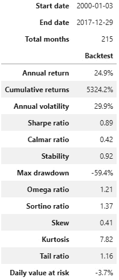

图 9.1 - 滚动窗口平均策略；摘要回报和风险统计

在评估交易策略时，上述统计数据是第一步。每个都提供了策略表现的不同视角：

+   **夏普比率**：这是超额收益与超额收益标准差的比率。比率越高，算法在风险调整基础上表现越好。

+   **Calmar 比率**：这是平均复合年收益率与其最大回撤的比率。比率越高，算法在风险调整基础上表现越好。

+   **稳定性**：这是对累积对数收益的线性拟合的 R 平方值的定义。数字越高，累积收益的趋势就越高。

+   **Omega 比率**：这被定义为收益与损失的概率加权比率。这是夏普比率的一般化，考虑了分布的所有时刻。比率越高，算法在风险调整基础上表现越好。

+   **Sortino 比率**：这是夏普比率的一种变体 - 它仅使用负投资组合收益（下行风险）的标准偏差。比率越高，算法在风险调整基础上表现越好。

+   **尾部比率**：这被定义为右尾 95%与左尾 5%之间的比率。例如，1/3 的比率意味着损失是利润的三倍。数字越高，越好。

在这个例子中，我们看到策略在交易窗口上具有很高的稳定性（.92），这在一定程度上抵消了较高的最大回撤（-59.4%）。尾部比率最有利：

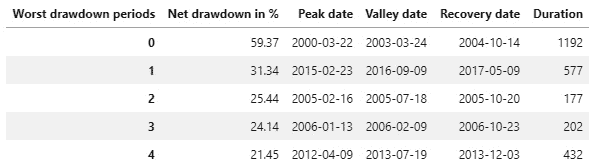

图 9.2 - 滚动窗口平均策略；最差的五次回撤期间

虽然 59.37％的最大回撤确实不好，但如果我们调整了入市/退出策略规则，我们很可能会避免它。请注意回撤期的持续时间 - 最大回撤期超过 3 年。

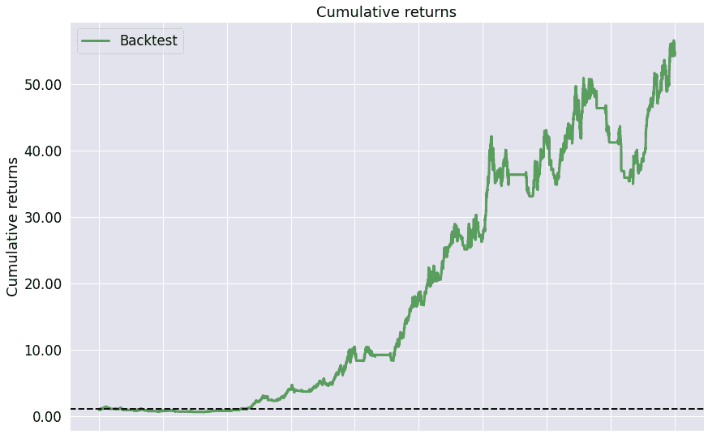

图 9.3 - 滚动窗口平均策略；投资视角下的累积回报

正如稳定性指标所证实的那样，我们在交易周期内看到累积收益呈正趋势。

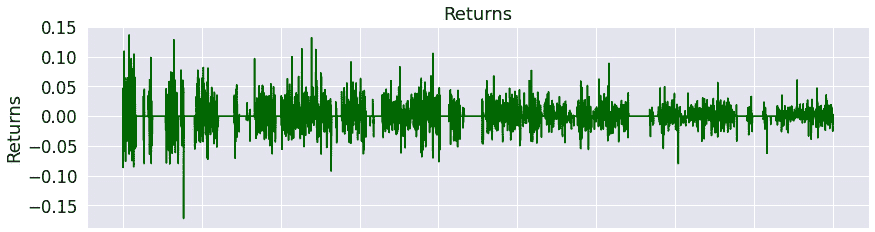

图 9.4 - 滚动窗口平均策略；投资视角下的回报

图表证实了收益在零点周围波动很大。

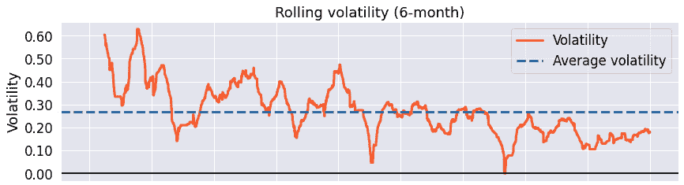

图 9.5 - 滚动窗口平均策略；投资视角下的 6 个月滚动波动率

这张图表说明了策略的回报波动率在时间范围内在减少。

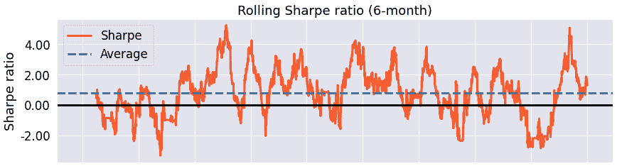

图 9.6 – 滚动窗口均值策略；投资视角下的 6 个月滚动夏普比率

我们看到该策略的最大夏普比率高达 4 以上，最小值低于 -2。如果我们审查进出场规则，应该能够提高策略的表现。

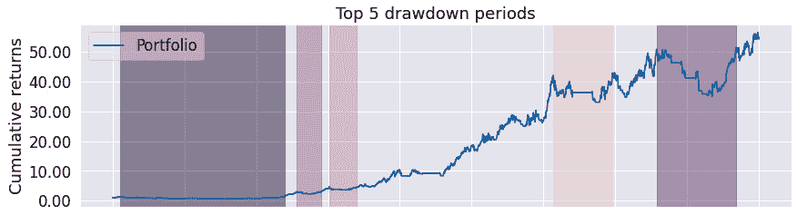

图 9.7 – 滚动窗口均值策略；投资视角下的前五个最差回撤期

最大回撤的图形表示表明，最大回撤期过长。

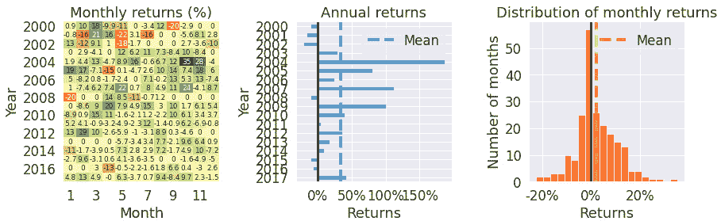

图 9.8 – 滚动窗口均值策略；投资视角下的月度收益、年度收益和月度收益分布

**月度收益**图表显示我们在大多数月份进行了交易。**年度收益**柱状图显示收益绝大部分为正值，而**月度收益分布**图显示右偏正态。

滚动窗口均值策略是最简单的策略之一，对于某些股票组合和时间范围仍然非常有利可图。请注意，该策略的最大回撤较大，如果我们添加了更高级的进出场规则，可能会改善。

## 简单移动平均线策略

该策略遵循一个简单的规则：如果短期移动平均线升破长期移动平均线，则买入股票：

```py
%matplotlib inline
from zipline import run_algorithm 
from zipline.api import order_target_percent, symbol, set_commission
from zipline.finance.commission import PerTrade
import pandas as pd
import pyfolio as pf
import warnings
warnings.filterwarnings('ignore')
def initialize(context): 
    context.stock = symbol('AAPL')
    context.rolling_window = 90 
    set_commission(PerTrade(cost=5))     
def handle_data(context, data): 
    price_hist = data.history(context.stock, "close", 
                              context.rolling_window, "1d")

    rolling_mean_short_term = \
    price_hist.rolling(window=45, center=False).mean()
    rolling_mean_long_term = \
    price_hist.rolling(window=90, center=False).mean()

    if rolling_mean_short_term[-1] > rolling_mean_long_term[-1]:
        order_target_percent(context.stock, 1.0)     
    elif rolling_mean_short_term[-1] < rolling_mean_long_term[-1]:
        order_target_percent(context.stock, 0.0)     
def analyze(context, perf): 
    returns, positions, transactions = \
    pf.utils.extract_rets_pos_txn_from_zipline(perf) 
    pf.create_returns_tear_sheet(returns, 
                                 benchmark_rets = None)

start_date = pd.to_datetime('2000-1-1', utc=True)
end_date = pd.to_datetime('2018-1-1', utc=True)

results = run_algorithm(start = start_date, end = end_date, 
                        initialize = initialize, 
                        analyze = analyze, 
                        handle_data = handle_data, 
                        capital_base = 10000, 
                        data_frequency = 'daily', 
                        bundle ='quandl')
```

输出如下：


图 9.9 – 简单移动平均线策略；摘要收益和风险统计

统计数据显示，该策略在长期内非常有利可图（高稳定性和尾部比率），而最大回撤可能相当大。

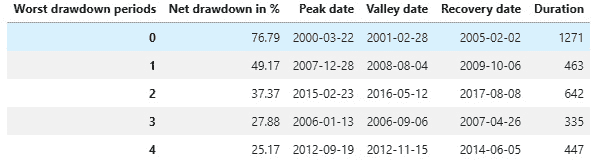

图 9.10 – 简单移动平均线策略；前五个最差回撤期

最差的回撤期相当长 – 超过 335 天，甚至在最糟糕的情况下可能超过 3 年。

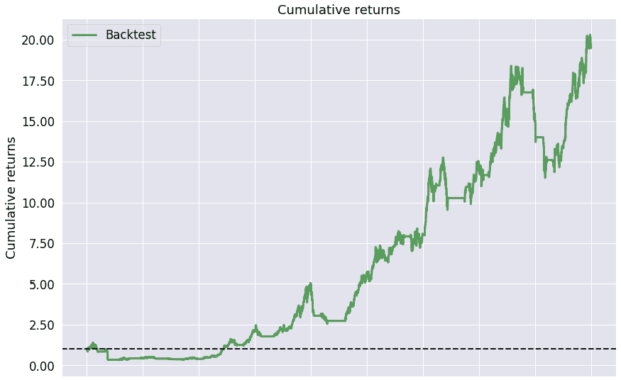

图 9.11 – 简单移动平均线策略；投资视角下的累积收益

然而，这张图表确实确认了这个长期策略是有利可图的 – 我们看到累积收益在第一次回撤后持续增长。

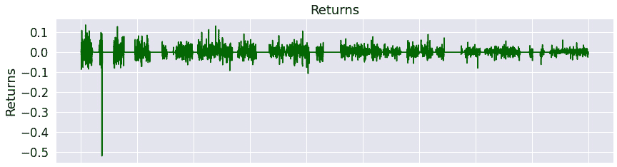

图表 9.12 – 简单移动平均线策略；投资期内回报

图表说明，在交易窗口的开头就发生了一次重大的负回报事件，然后回报围绕零波动。

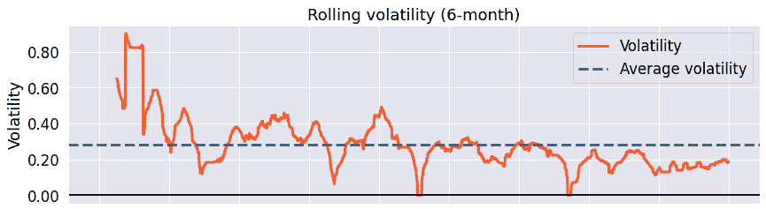

图表 9.13 – 简单移动平均线策略；投资期内 6 个月滚动波动率

滚动波动率图表显示，滚动波动率随时间递减。

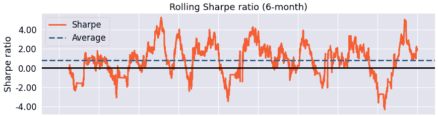

图表 9.14 – 简单移动平均线策略；投资期内 6 个月滚动夏普比率

虽然最大夏普比率超过了 4，最小值低于 -4，但平均夏普比率为 0.68。

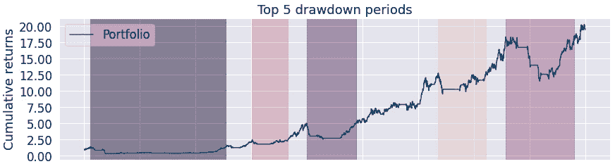

图表 9.15 – 简单移动平均线策略；投资期内前五个最大回撤期

该图表证实了最大回撤期间非常长。

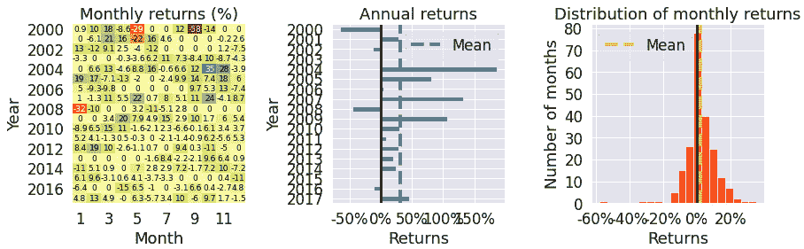

图表 9.16 – 简单移动平均线策略；月度回报、年度回报和投资期内月度回报分布

月度回报表显示，很多月份都没有交易。年度回报大部分为正数。**月度回报分布**图表证实了偏斜是负向的。

简单移动平均线策略的盈利能力较低，并且最大回撤比滚动窗口均值策略更大。一个可能的原因是移动平均的滚动窗口太大了。

## 指数加权移动平均线策略

该策略与之前的策略类似，唯一的区别是使用不同的滚动窗口和指数加权移动平均线。结果略优于之前策略下取得的结果。

一些其他移动平均算法在决策规则中同时使用简单移动平均线和指数加权移动平均线；例如，如果简单移动平均线大于指数加权移动平均线，则采取行动：

```py
%matplotlib inline
from zipline import run_algorithm 
from zipline.api import order_target_percent, symbol, set_commission
from zipline.finance.commission import PerTrade
import pandas as pd
import pyfolio as pf
import warnings
warnings.filterwarnings('ignore')
def initialize(context): 
    context.stock = symbol('AAPL')
    context.rolling_window = 90
    set_commission(PerTrade(cost=5))     
def handle_data(context, data): 
    price_hist = data.history(context.stock, "close", 
                              context.rolling_window, "1d")

    rolling_mean_short_term = \
    price_hist.ewm(span=5, adjust=True,
                   ignore_na=True).mean()
    rolling_mean_long_term = \
    price_hist.ewm(span=30, adjust=True, 
                   ignore_na=True).mean()

    if rolling_mean_short_term[-1] > rolling_mean_long_term[-1]:
        order_target_percent(context.stock, 1.0)     
    elif rolling_mean_short_term[-1] < rolling_mean_long_term[-1]:
        order_target_percent(context.stock, 0.0)     
def analyze(context, perf): 
    returns, positions, transactions = \
    pf.utils.extract_rets_pos_txn_from_zipline(perf) 
    pf.create_returns_tear_sheet(returns, 
                                 benchmark_rets = None)

start_date = pd.to_datetime('2000-1-1', utc=True)
end_date = pd.to_datetime('2018-1-1', utc=True)

results = run_algorithm(start = start_date, end = end_date,
                        initialize = initialize, 
                        analyze = analyze, 
                        handle_data = handle_data, 
                        capital_base = 10000, 
                        data_frequency = 'daily', 
                        bundle ='quandl')
```

输出如下：


图表 9.17 – 指数加权移动平均策略；摘要回报和风险统计数据

结果显示，最大回撤水平从之前的策略中下降了，同时仍然保持非常强的稳定性和尾部比率。

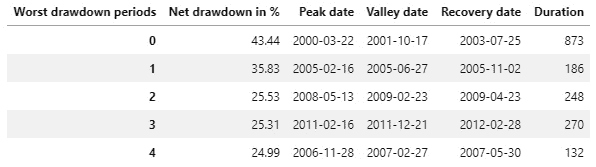

图 9.18 – 指数加权移动平均策略；最糟糕的五个回撤期

最糟糕的回撤幅度以及其最长持续时间的大小，比前两种策略都要好得多。

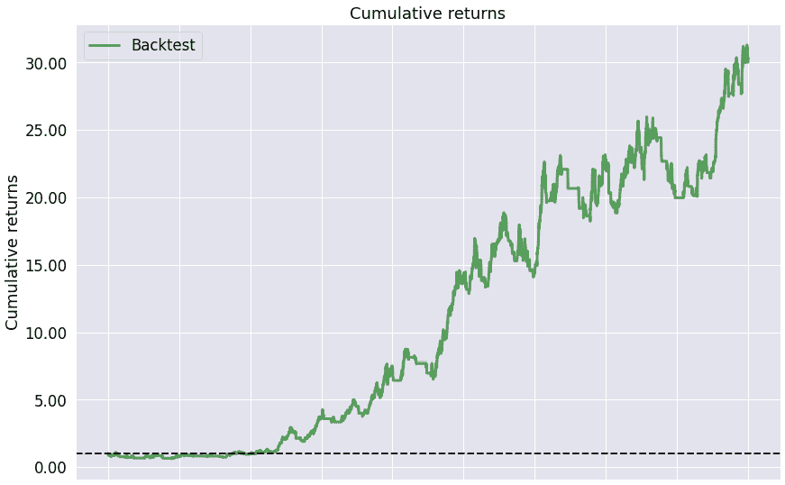

图 9.19 – 指数加权移动平均策略；投资周期内的累计回报

如稳定性指标所示，我们看到持续的正累计回报。

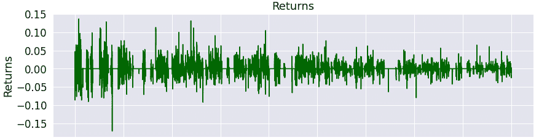

图 9.20 – 指数加权移动平均策略；投资周期内的回报

回报在零附近波动，更多是正的而不是负的。

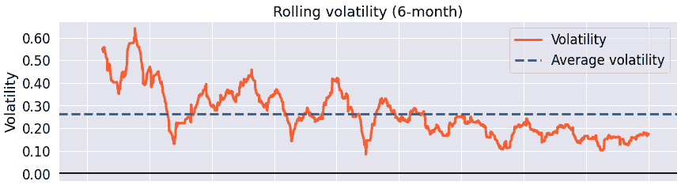

投资周期内的波动性](img/Figure_9.21_B15029.jpg)

图 9.21 – 指数加权移动平均策略；投资周期内的 6 个月滚动波动率

滚动波动率随着时间的推移而下降。

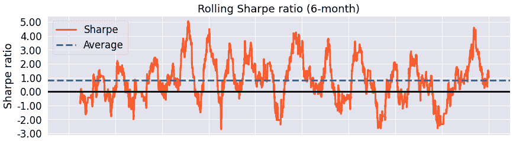

夏普比率投资周期内](img/Figure_9.22_B15029.jpg)

图 9.22 – 指数加权移动平均策略；投资周期内的 6 个月滚动夏普比率

我们看到，最大夏普比率几乎达到 5，而最小夏普比率略低于 -2，这再次比前两种算法要好。

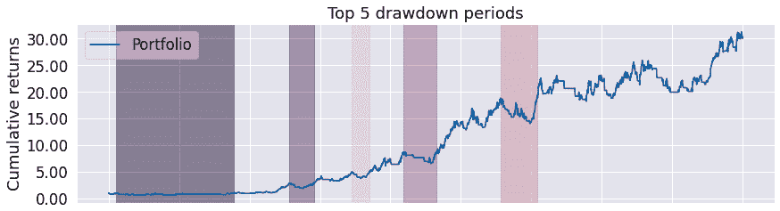

图 9.23 – 指数加权移动平均策略；投资周期内的前五个回撤期

注意，最后三种算法的最糟糕回撤期不相同。

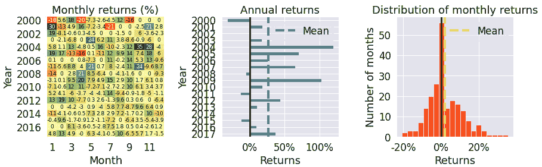

图 9.24 – 指数加权移动平均策略；投资周期内的月度回报、年度回报和月度回报分布

**月度回报**表显示，我们在大多数月份进行了交易。**年度回报**图表证实了大多数回报都是正的。**月度回报分布**图呈现正偏态，这是一个好的迹象。

在给定的时间范围内，指数加权移动平均策略对苹果股票表现更佳。然而，总的来说，最适合的平均数策略取决于股票和时间范围。

## RSI 策略

该策略依赖于`stockstats`包。阅读源代码非常有益，地址为[`github.com/intrad/stockstats/blob/master/stockstats.py`](https://github.com/intrad/stockstats/blob/master/stockstats.py)。

要安装它，请使用以下命令：

```py
pip install stockstats
```

RSI 指标测量价格波动的速度和幅度，并在金融资产超买或超卖时提供指标。它是一个领先指标。

它的取值范围为 0 到 100，值超过 70 表示超买，值低于 30 表示超卖：

```py
%matplotlib inline
from zipline import run_algorithm 
from zipline.api import order_target_percent, symbol, set_commission
from zipline.finance.commission import PerTrade
import pandas as pd
import pyfolio as pf
from stockstats import StockDataFrame as sdf
import warnings
warnings.filterwarnings('ignore')
def initialize(context): 
    context.stock = symbol('AAPL')
    context.rolling_window = 20
    set_commission(PerTrade(cost=5))     
def handle_data(context, data): 
    price_hist = data.history(context.stock, 
                              ["open", "high", 
                               "low","close"], 
                              context.rolling_window, "1d")

    stock=sdf.retype(price_hist)   
    rsi = stock.get('rsi_12')

    if rsi[-1] > 90:
        order_target_percent(context.stock, 0.0)     
    elif rsi[-1] < 10:
        order_target_percent(context.stock, 1.0)   

def analyze(context, perf): 
    returns, positions, transactions = \
    pf.utils.extract_rets_pos_txn_from_zipline(perf) 
    pf.create_returns_tear_sheet(returns, 
                                 benchmark_rets = None)

start_date = pd.to_datetime('2015-1-1', utc=True)
end_date = pd.to_datetime('2018-1-1', utc=True)

results = run_algorithm(start = start_date, end = end_date,
                        initialize = initialize, 
                        analyze = analyze, 
                        handle_data = handle_data, 
                        capital_base = 10000, 
                        data_frequency = 'daily', 
                        bundle ='quandl')
```

输出如下：


图 9.25 – RSI 策略；总结的收益和风险统计数据

对该策略的初步研究显示出优秀的夏普比率，最大回撤非常低，并且尾部比率有利。

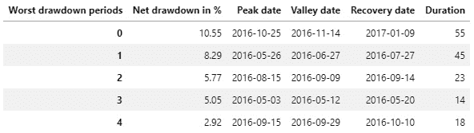

图 9.26 – RSI 策略；最差的五个回撤期

最糟糕的回撤期非常短暂 – 不到 2 个月 – 且不重大 – 最大回撤仅为-10.55%。

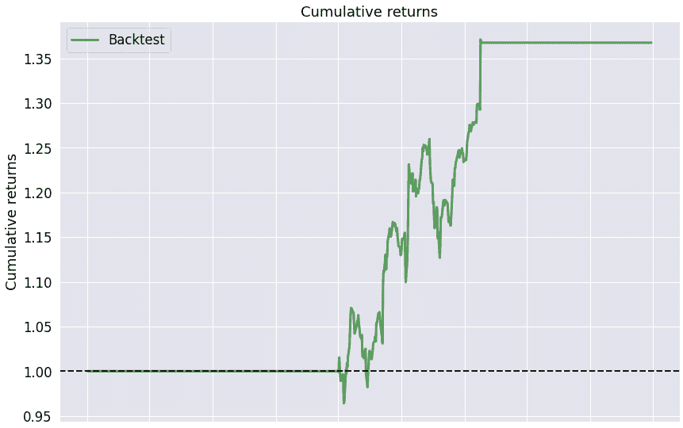

图 9.27 – RSI 策略；投资期限内的累积收益

**累积收益**图表显示，我们在大部分交易期间都没有进行交易，而当我们进行交易时，累积收益呈正趋势。

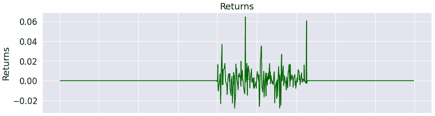

图 9.28 – RSI 策略；投资期限内的收益

我们可以看到，在进行交易时，收益更可能为正而不是负。

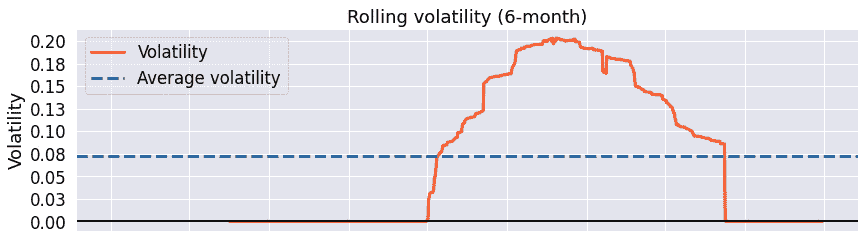

图 9.29 – RSI 策略；投资期限内的 6 个月滚动波动率

注意到最大滚动波动率为 0.2，远低于先前策略。

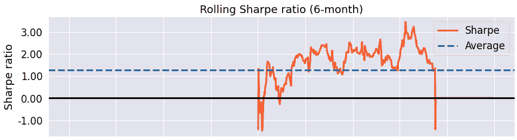

图 9.30 – RSI 策略；投资期限内的 6 个月滚动夏普比率

我们可以看到夏普比率一直稳定在 1 以上，最大值超过 3，最小值低于-1。

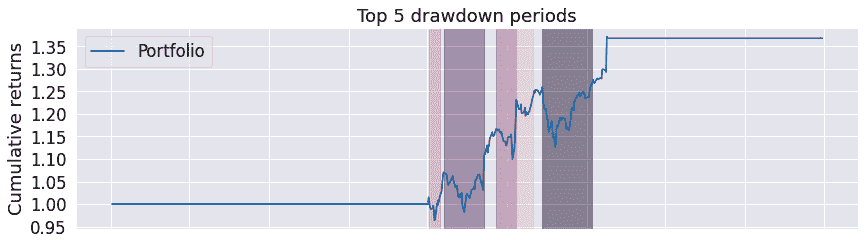

图 9.31 – RSI 策略；投资期限内的前五个回撤期

图表显示了短暂且不显著的回撤期。

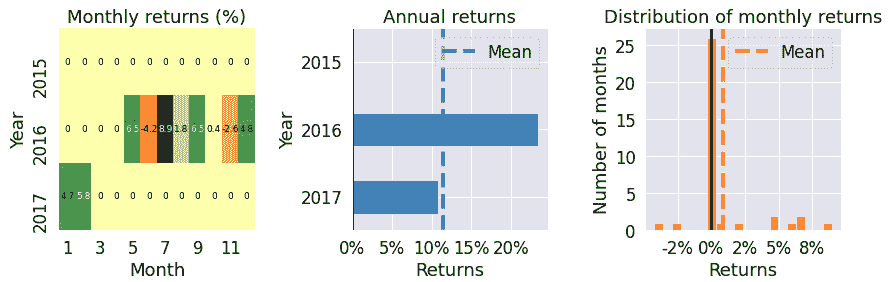

图 9.32 – RSI 策略；月度收益、年度收益以及投资期限内月度收益的分布

**月度收益** 表格显示，大多数月份我们都没有交易。但是，根据 **年度收益** 图表，在我们交易时，我们的利润非常巨大。 **月度收益分布** 图表证实了偏斜非常正向，峰度很大。

RSI 策略在给定时间范围内的苹果股票表现非常出色，夏普比率为 1.11。然而，请注意，该策略的成功很大程度上取决于非常严格的进出场规则，这意味着我们根本不会在某些月份进行交易。

## MACD 交叉策略

**移动平均线收敛背离**（**MACD**）是一种滞后的、追踪趋势的动量指标，反映了股价两个移动平均线之间的关系。

该策略依赖于两个统计数据，即 MACD 和 MACD 信号线：

+   MACD 被定义为 12 天指数移动平均线和 26 天指数移动平均线之间的差异。

+   然后将 MACD 信号线定义为 MACD 的 9 天指数移动平均线。

MACD 交叉策略定义如下：

+   当 MACD 线向上转向并超过 MACD 信号线时，发生了牛市交叉。

+   当 MACD 线向下转向并穿过 MACD 信号线时，发生了空头交叉。

因此，这种策略最适合波动大、交易活跃的市场：

```py
%matplotlib inline
from zipline import run_algorithm 
from zipline.api import order_target_percent, symbol, set_commission
from zipline.finance.commission import PerTrade
import pandas as pd
import pyfolio as pf
from stockstats import StockDataFrame as sdf
import warnings
warnings.filterwarnings('ignore')
def initialize(context): 
    context.stock = symbol('AAPL')
    context.rolling_window = 20
    set_commission(PerTrade(cost=5))     
def handle_data(context, data): 
    price_hist = data.history(context.stock, 
                              ["open","high", 
                               "low","close"], 
                              context.rolling_window, "1d")

    stock=sdf.retype(price_hist)   
    signal = stock['macds']
    macd   = stock['macd'] 

    if macd[-1] > signal[-1] and macd[-2] <= signal[-2]:
        order_target_percent(context.stock, 1.0)     
    elif macd[-1] < signal[-1] and macd[-2] >= signal[-2]:
        order_target_percent(context.stock, 0.0)   

def analyze(context, perf): 
    returns, positions, transactions = \
    pf.utils.extract_rets_pos_txn_from_zipline(perf) 
    pf.create_returns_tear_sheet(returns, 
                                 benchmark_rets = None)

start_date = pd.to_datetime('2015-1-1', utc=True)
end_date = pd.to_datetime('2018-1-1', utc=True)

results = run_algorithm(start = start_date, end = end_date, 
                        initialize = initialize, 
                        analyze = analyze, 
                        handle_data = handle_data, 
                        capital_base = 10000, 
                        data_frequency = 'daily', 
                        bundle ='quandl')
```

输出如下：

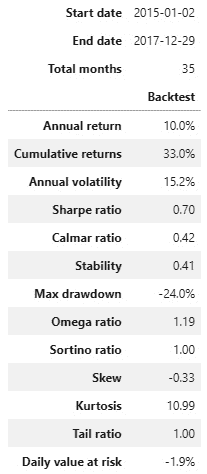

图 9.33 – MACD 交叉策略；汇总收益和风险统计数据

尾部比率表明，最大收益和最大损失大致相当。非常低的稳定性表明，累计收益没有强劲的趋势。

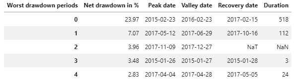

图 9.34 – MACD 交叉策略；最糟糕的五个回撤期

除了最糟糕的回撤期外，其他时期都少于 6 个月，并且净回撤低于 10%。

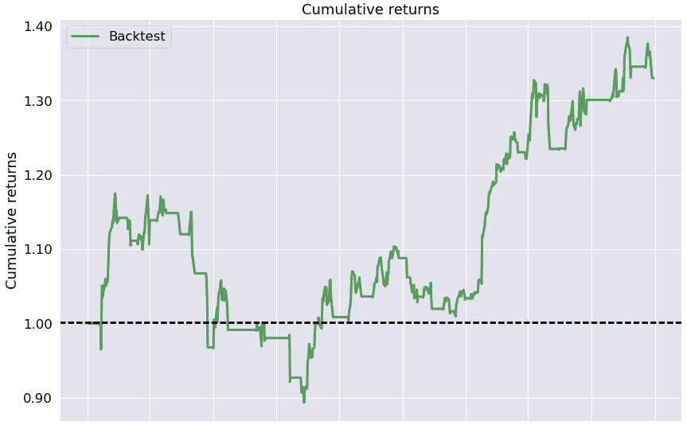

图 9.35 – MACD 交叉策略；投资期限内的累计收益

**累计收益** 图表证实了低稳定性指标值。

以下是 **Returns** 图表：

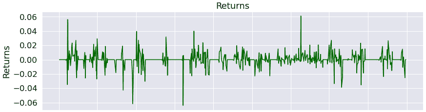

图 9.36 – MACD 交叉策略；投资期限内的收益

**Returns** 图表显示，收益在零点周围波动幅度很大，有一些异常值。

以下是 **滚动波动率** 图表：

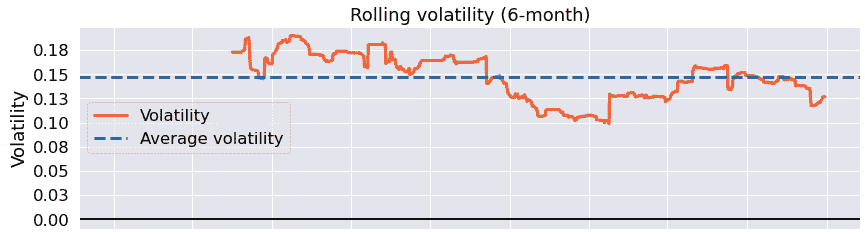

图 9.37 – MACD 交叉策略；投资期限内的 6 个月滚动波动率

滚动波动率一直在 0.15 左右波动。

以下是滚动夏普比率图表：

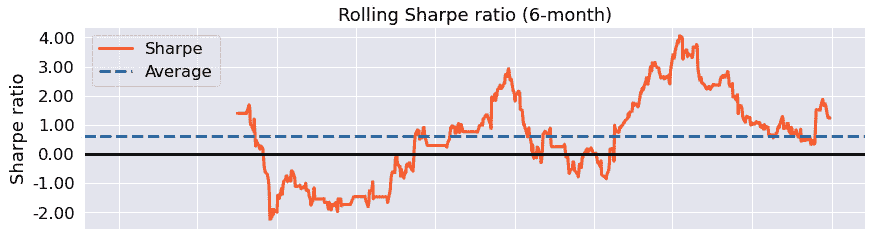

图 9.38 – MACD 交叉策略；投资周期内 6 个月滚动夏普比率

大约为 4 的最大滚动夏普比率，最小比率为 -2，大部分是有利的。

以下是前五个回撤期图表：

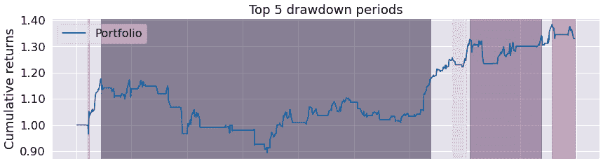

图 9.39 – MACD 交叉策略；投资周期内前五个最差的回撤期

我们看到最糟糕的两个回撤期相当长。

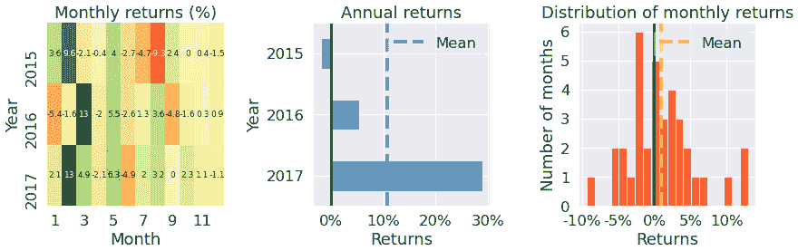

图 9.40 – MACD 交叉策略；月度收益、年度收益和投资周期内月度收益的分布

**月度收益** 表确认我们几乎在每个月都进行了交易。**年度收益** 图表表明最赚钱的一年是 2017 年。**月度收益分布** 图表显示了轻微的负偏斜和较大的峰度。

MACD 交叉策略在趋势市场中是一种有效的策略，可以通过提高入场/出场规则来显著改进。

## RSI 和 MACD 策略

在这个策略中，我们将 RSI 和 MACD 策略结合起来，如果 RSI 和 MACD 标准都给出买入信号，就持有该股票。

使用多个标准可以更全面地了解市场（请注意，我们将 RSI 阈值通用化为 50）：

```py
%matplotlib inline
from zipline import run_algorithm 
from zipline.api import order_target_percent, symbol, set_commission
from zipline.finance.commission import PerTrade
import pandas as pd
import pyfolio as pf
from stockstats import StockDataFrame as sdf
import warnings
warnings.filterwarnings('ignore')
def initialize(context): 
    context.stock = symbol('MSFT')
    context.rolling_window = 20
    set_commission(PerTrade(cost=5))     
def handle_data(context, data): 
    price_hist = data.history(context.stock, 
                              ["open", "high", 
                               "low","close"], 
                              context.rolling_window, "1d")

    stock=sdf.retype(price_hist)   
    rsi = stock.get('rsi_12')

    signal = stock['macds']
    macd   = stock['macd'] 

    if rsi[-1] < 50 and macd[-1] > signal[-1] and macd[-2] <= signal[-2]:
        order_target_percent(context.stock, 1.0)     
    elif rsi[-1] > 50 and macd[-1] < signal[-1] and macd[-2] >= signal[-2]:
        order_target_percent(context.stock, 0.0)   

def analyze(context, perf): 
    returns, positions, transactions = \
    pf.utils.extract_rets_pos_txn_from_zipline(perf) 
    pf.create_returns_tear_sheet(returns, 
                                 benchmark_rets = None)

start_date = pd.to_datetime('2015-1-1', utc=True)
end_date = pd.to_datetime('2018-1-1', utc=True)

results = run_algorithm(start = start_date, end = end_date, 
                        initialize = initialize, 
                        analyze = analyze, 
                        handle_data = handle_data, 
                        capital_base = 10000, 
                        data_frequency = 'daily', 
                        bundle ='quandl')
```

输出如下：

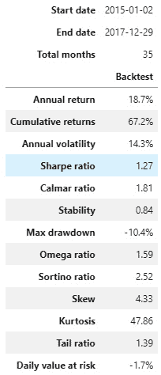

图 9.41 – RSI 和 MACD 策略；摘要收益和风险统计

高稳定性值，高尾比率和优秀的夏普比率，以及低最大回撤，表明该策略是优秀的。

以下是最差的五个回撤期图表：

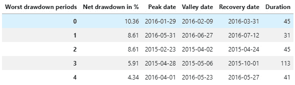

图 9.42 – RSI 和 MACD 策略；最差的五个回撤期

我们看到最差的回撤期很短 – 少于 4 个月 – 最差的净回撤为 -10.36%。

以下是**累积收益** 图表：

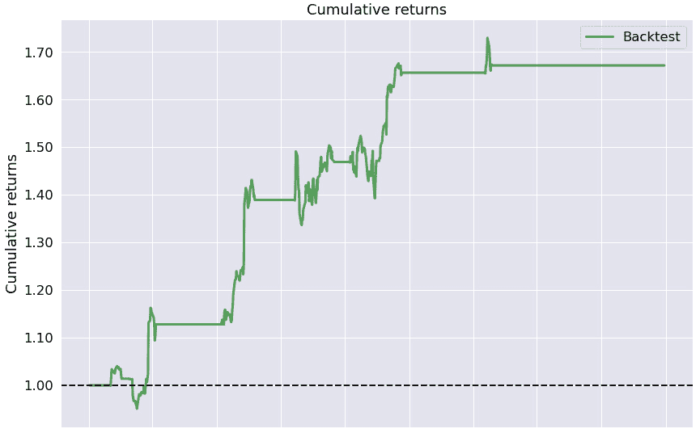

图 9.43 – RSI 和 MACD 策略；投资周期内的累积收益

高稳定性值是有利的。注意图表中的水平线；这些表示我们没有进行交易。

以下是**收益** 图表：

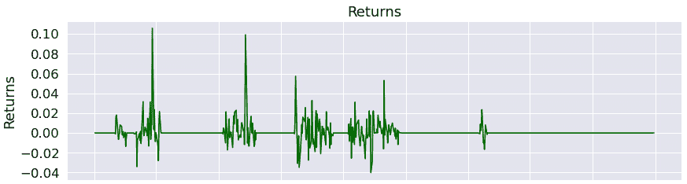

图 9.44 – RSI 和 MACD 策略；投资周期内的收益

**收益**图表显示，当我们进行交易时，正收益超过负收益。

以下是**滚动波动率**图表：

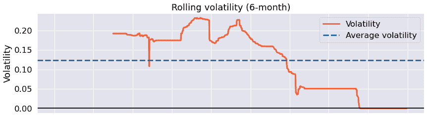

图 9.45 – RSI 和 MACD 策略；投资期内 6 个月滚动波动率

滚动波动率随时间递减，且相对较低。

以下是**滚动夏普比率**图表：

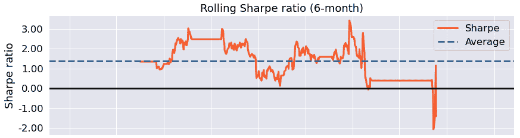

图 9.46 – RSI 和 MACD 策略；投资期内 6 个月滚动夏普比率

最大滚动夏普比率超过 3，最小值低于 -2，平均值超过 1.0，表明结果非常好。

以下是**前五个最差回撤期**图表：

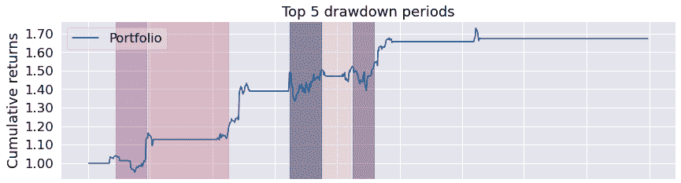

图 9.47 – RSI 和 MACD 策略；投资期内前五个回撤期

我们可以看到回撤期较短且不显著。

以下是**月度收益率**、**年度收益率**和**月度收益分布**图表：

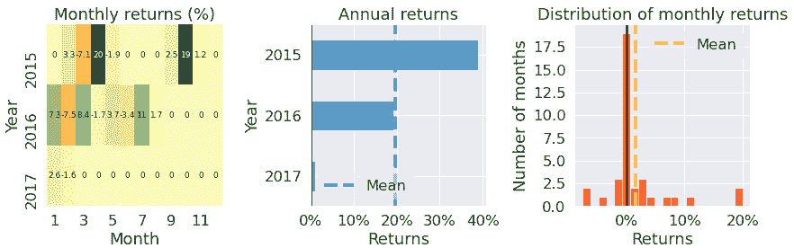

图 9.48 – RSI 和 MACD 策略；月度收益率、年度收益率和月度收益分布；投资期内

**月度收益率**表格证实我们大多数月份没有进行交易。然而，根据**年度收益率**图表，在我们进行交易时，利润非常可观。**月度收益分布**图表呈正态分布，峰度较高。

RSI 和 MACD 策略作为两种策略的组合，表现出优异的性能，夏普比率为 1.27，最大回撤为 -10.4%。需要注意的是，它在一些月份内没有触发任何交易。

## 三重指数平均线策略

**三重指数平均线**（**TRIX**）指标是围绕零线振荡的振荡器。正值表示市场超买，而负值表明市场超卖：

```py
%matplotlib inline
from zipline import run_algorithm 
from zipline.api import order_target_percent, symbol, set_commission
from zipline.finance.commission import PerTrade
import pandas as pd
import pyfolio as pf
from stockstats import StockDataFrame as sdf
import warnings
warnings.filterwarnings('ignore')
def initialize(context): 
    context.stock = symbol('MSFT')
    context.rolling_window = 20
    set_commission(PerTrade(cost=5))     
def handle_data(context, data): 
    price_hist = data.history(context.stock, 
                              ["open","high", 
                               "low","close"], 
                              context.rolling_window, "1d")

    stock=sdf.retype(price_hist)   
    trix = stock.get('trix')

    if trix[-1] > 0 and trix[-2] < 0:
        order_target_percent(context.stock, 0.0)     
    elif trix[-1] < 0 and trix[-2] > 0:
        order_target_percent(context.stock, 1.0)   

def analyze(context, perf): 
    returns, positions, transactions = \
    pf.utils.extract_rets_pos_txn_from_zipline(perf) 
    pf.create_returns_tear_sheet(returns, 
                                 benchmark_rets = None)

start_date = pd.to_datetime('2015-1-1', utc=True)
end_date = pd.to_datetime('2018-1-1', utc=True)

results = run_algorithm(start = start_date, end = end_date, 
                        initialize = initialize, 
                        analyze = analyze, 
                        handle_data = handle_data, 
                        capital_base = 10000, 
                        data_frequency = 'daily', 
                        bundle ='quandl')
```

输出如下：

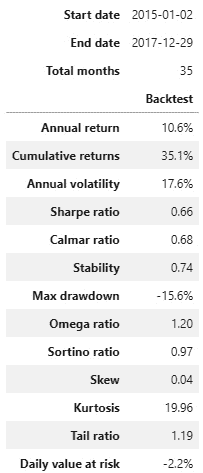

图 9.49 – TRIX 策略；摘要收益和风险统计

高尾部比率和高于平均水平的稳定性表明，总体上是一种盈利策略。

以下是最差的五个回撤期图表：

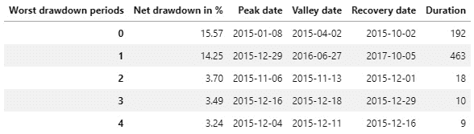

图 9.50 – TRIX 策略；前五个最差回撤期

第二最差的回撤期长达一年。最差净回撤为 -15.57%。

以下是**累积收益率**图表：

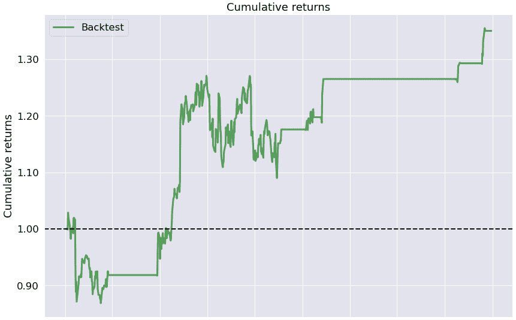

图 9.51 – TRIX 策略；投资周期内的累积回报率

**累积回报率**图表表明我们在许多月份没有进行交易（水平线），并且存在长期正向趋势，高稳定性值证实了这一点。

以下是**回报**图表：

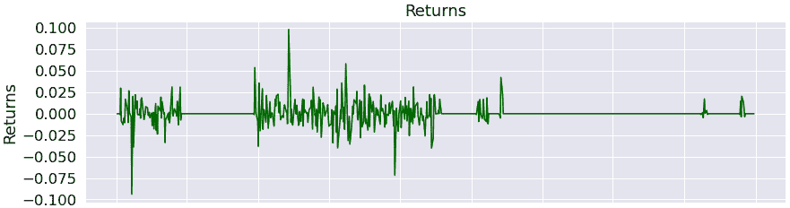

图 9.52 – TRIX 策略；投资周期内的回报

此图表表明我们进行交易时更可能获得正回报。

以下是**滚动波动率**图表：

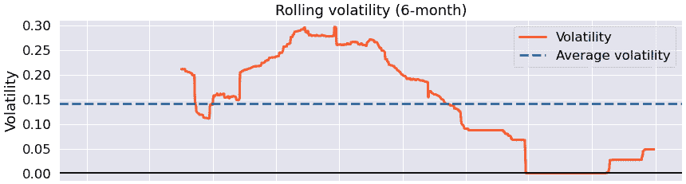

图 9.53 – TRIX 策略；投资周期内的 6 个月滚动波动率

**滚动波动率**图表显示，随着时间的推移，滚动波动率逐渐减小，尽管最大波动率相当高。

以下是**滚动夏普比率**图表：

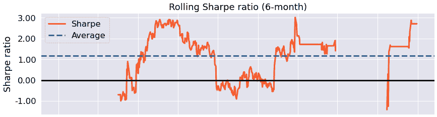

图 9.54 – TRIX 策略；投资周期内的 6 个月滚动夏普比率

滚动夏普比率更可能为正值而不是负值，其最大值在 3 左右，最小值略低于 -1。

以下是前五个回撤期图表：

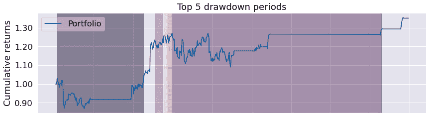

图 9.55 – TRIX 策略；投资周期内前五个回撤期

前五个回撤期证实了最糟糕的回撤期很长。

以下是**月度回报**，**年度回报**和**月度回报分布**图表：

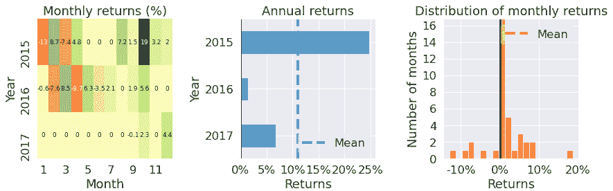

图 9.56 – TRIX 策略；月度回报、年度回报和月度回报分布

**月度回报**表格证实我们在许多月份没有进行交易。**年度回报**图表显示，最大回报发生在 2015 年。**月度回报分布**图表显示略微正偏态和较大的峰度。

对于某些股票，如苹果，TRIX 策略在给定的时间范围内表现非常糟糕。对于其他股票，如在前述报告中包括的微软，某些年份的表现非常出色。

## 威廉斯 R% 策略

此策略由 Larry Williams 开发，William R% 在 0 到 -100 之间波动。`stockstats` 库已实现了从 0 到 +100 的值。

-20 以上的值表示证券被超买，而-80 以下的值表示证券被超卖。

对于微软的股票来说，这个策略非常成功，但对苹果的股票来说不太成功：

```py
%matplotlib inline
from zipline import run_algorithm 
from zipline.api import order_target_percent, symbol, set_commission
from zipline.finance.commission import PerTrade
import pandas as pd
import pyfolio as pf
from stockstats import StockDataFrame as sdf
import warnings
warnings.filterwarnings('ignore')
def initialize(context): 
    context.stock = symbol('MSFT')
    context.rolling_window = 20
    set_commission(PerTrade(cost=5))     
def handle_data(context, data): 
    price_hist = data.history(context.stock, 
                              ["open", "high",
                               "low","close"], 
                              context.rolling_window, "1d")

    stock=sdf.retype(price_hist)   
    wr = stock.get('wr_6')

    if wr[-1] < 10:
        order_target_percent(context.stock, 0.0)     
    elif wr[-1] > 90:
        order_target_percent(context.stock, 1.0)   

def analyze(context, perf): 
    returns, positions, transactions = \
    pf.utils.extract_rets_pos_txn_from_zipline(perf) 
    pf.create_returns_tear_sheet(returns, 
                                 benchmark_rets = None)

start_date = pd.to_datetime('2015-1-1', utc=True)
end_date = pd.to_datetime('2018-1-1', utc=True)

results = run_algorithm(start = start_date, end = end_date, 
                        initialize = initialize, 
                        analyze = analyze, 
                        handle_data = handle_data, 
                        capital_base = 10000, 
                        data_frequency = 'daily', 
                        bundle ='quandl')
```

输出如下：

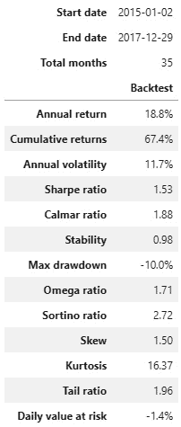

图 9.57 – 威廉斯 R% 策略；摘要回报和风险统计

摘要统计显示出一个出色的策略 – 高稳定性证实了回报的一致性，具有很大的尾部比率，非常低的最大回撤和坚实的夏普比率。

以下是最差的五个回撤期的图表：

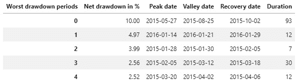

图 9.58 – 威廉斯 R% 策略；最差的五个回撤期

除了持续约 3 个月且净回撤为-10%的最糟糕的回撤期外，其他期间在持续时间和幅度上都不重要。

以下是**累计回报**图表：

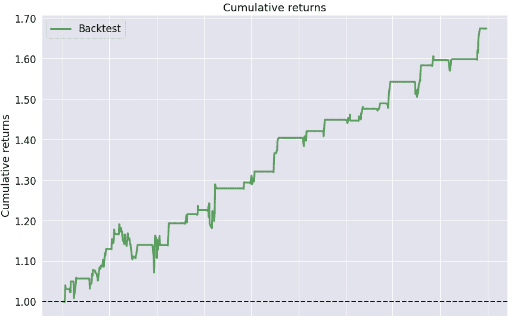

图 9.59 – 威廉斯 R% 策略；投资期限内的累计回报率

该图表确认了策略的高稳定性价值 – 累计回报率以稳定的速度增长。

以下是**回报**图表：

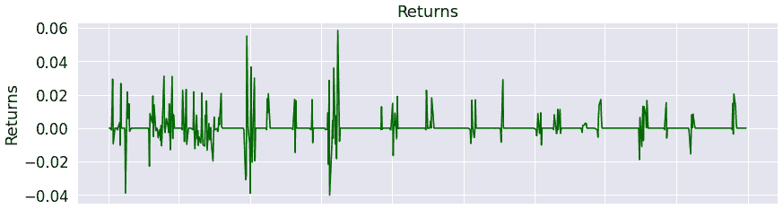

图 9.60 – 威廉斯 R% 策略；投资期限内的回报率

**回报**图表表明，无论何时进行交易，盈利都比亏损多。

以下是**滚动波动率**图表：

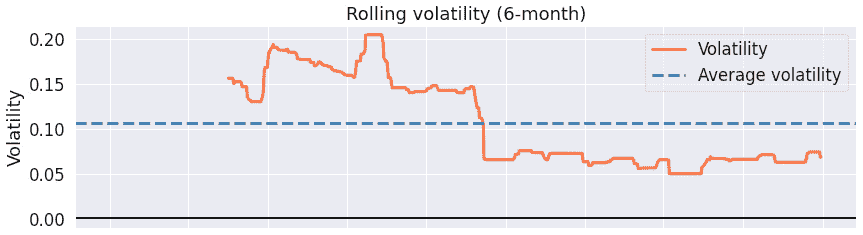

图 9.61 – 威廉斯 R% 策略；投资期限内的 6 个月滚动波动率

**滚动波动率**图表显示，随着时间的推移，滚动波动率的值在减小。

以下是**滚动夏普比率**图表：

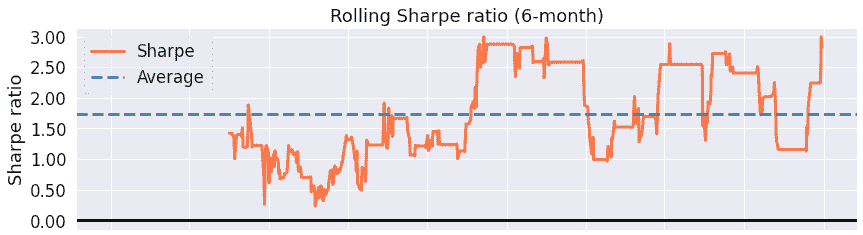

图 9.62 – 威廉斯 R% 策略；投资期限内的 6 个月滚动夏普比率

**滚动夏普比率**图表确认，夏普比率在交易期间始终为正值，最大值为 3.0。

以下是前五个回撤期的图表：

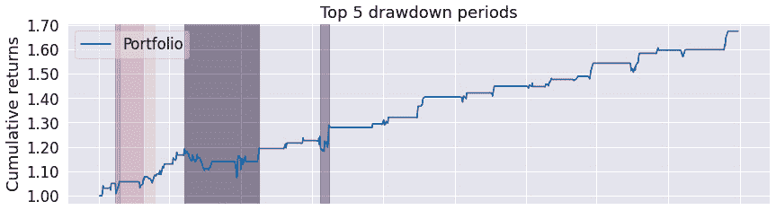

图 9.63 – 威廉斯 R% 策略；投资期限内的前五个回撤期

**前 5 个回撤期**图表显示，除了一个期间外，其他最糟糕的回撤期都不重要。

以下是**月度回报**、**年度回报**和**月度回报分布**图表：

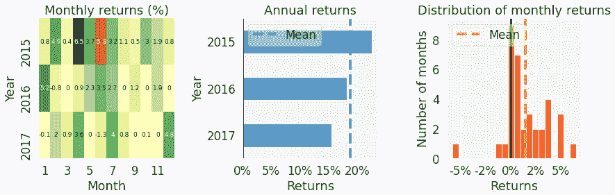

图 9.64 – 威廉姆斯 R%策略；月回报、年回报以及投资期内月回报的分布

**月回报**表格表明，虽然我们并没有在每个月都交易，但每次交易时基本上都是盈利的。**年回报**图表证实了这一点。**月回报的分布**图表证实了一个具有大峰度的正偏斜。

威廉姆斯 R%策略是一种高性能策略，适用于微软股票，在给定的时间范围内夏普比率为 1.53，最大回撤仅为-10%。

# 学习均值回归策略

均值回归策略基于某些统计数据会回归到其长期均值的假设。

## 布林带策略

布林带策略基于识别短期波动期。

它依赖于三条线：

+   *中间带线*是简单移动平均线，通常是 20-50 天。

+   *上轨*是中间基准线的两个标准差以上。

+   *下轨*是中间基准线的两个标准差以下。

从布林带中创建交易信号的一种方法是定义超买和超卖的市场状态：

+   当金融资产的价格升破上轨时，市场处于超买状态，因此应该回调。

+   当金融资产的价格跌破下轨时，市场处于超卖状态，因此应该反弹。

这是一种均值回归策略，意味着长期来看，价格应该保持在下轨和上轨之间。对于低波动性股票来说，效果最佳。

```py
%matplotlib inline
from zipline import run_algorithm 
from zipline.api import order_target_percent, symbol, set_commission
from zipline.finance.commission import PerTrade
import pandas as pd
import pyfolio as pf
import warnings
warnings.filterwarnings('ignore')
def initialize(context): 
    context.stock = symbol('DG')
    context.rolling_window = 20 
    set_commission(PerTrade(cost=5))     
def handle_data(context, data): 
    price_hist = data.history(context.stock, "close", 
                              context.rolling_window, "1d")

    middle_base_line = price_hist.mean()
    std_line =  price_hist.std()
    lower_band = middle_base_line - 2 * std_line
    upper_band = middle_base_line + 2 * std_line

    if price_hist[-1] < lower_band:
        order_target_percent(context.stock, 1.0)     
    elif price_hist[-1] > upper_band:
        order_target_percent(context.stock, 0.0)     
def analyze(context, perf): 
    returns, positions, transactions = \
    pf.utils.extract_rets_pos_txn_from_zipline(perf) 
    pf.create_returns_tear_sheet(returns, 
                                 benchmark_rets = None)

start_date = pd.to_datetime('2000-1-1', utc=True)
end_date = pd.to_datetime('2018-1-1', utc=True)

results = run_algorithm(start = start_date, end = end_date, 
                        initialize = initialize, 
                        analyze = analyze, 
                        handle_data = handle_data, 
                        capital_base = 10000, 
                        data_frequency = 'daily', 
                        bundle ='quandl')
```

输出如下：


图 9.65 – 布林带策略；摘要回报和风险统计

摘要统计数据确实显示稳定性很好，尾部比率也很有利。然而，最大回撤是相当大的，为-27.3%。

以下是最差的五个回撤期图表：

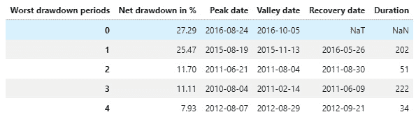

图 9.66 – 布林带策略；最差的五个回撤期

最糟糕的回撤期持续时间相当长。也许我们应该调整入市/出市规则，以避免在这些时期进入交易。

以下是**累积回报**图表：

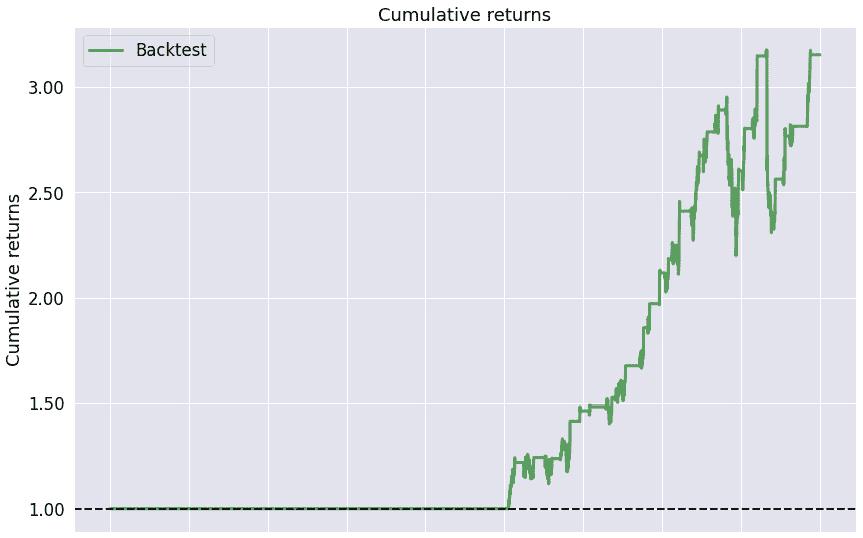

图 9.67 – 布林带策略；投资期内累积回报

**累积回报**图表显示我们已经有 10 年没有交易，然后我们经历了累积回报持续向上的一致趋势。

以下是**回报**图表：

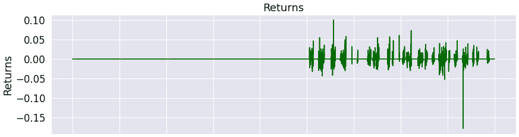

图 9.68 – 布林带策略；投资视角下回报率

**回报** 图表显示正回报超过了负回报。

以下是 **滚动波动率** 图表：

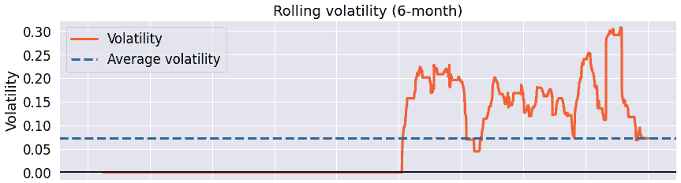

图 9.69 – 布林带策略；投资视角下 6 个月滚动波动率

**滚动波动率** 图表表明该策略具有相当大的波动性。

以下是 **滚动夏普比率** 图表：

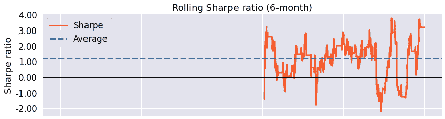

图 9.70 – 布林带策略；投资视角下 6 个月滚动夏普比率

**滚动夏普比率** 图表显示，滚动夏普比率波动范围很大，最大值接近 4，最小值低于 -2，但平均值为正。

以下是 **前五次最大回撤期间** 图表：

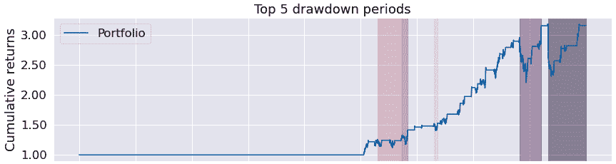

图 9.71 – 布林带策略；投资视角下前五次最大回撤期间

**前五次最大回撤期间** 图表证实回撤期间的持续时间相当长。

以下是 **月度回报**、**年度回报** 和 **月度回报分布** 图表：

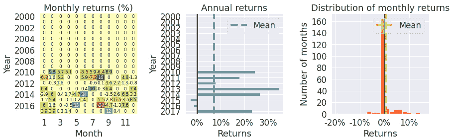

图 9.72 – 布林带策略；投资视角下月度回报、年度回报和月度回报分布

**月度回报** 表明，由于我们的进出规则，从 2000 年到 2010 年没有进行任何交易。然而，**年度回报** 图表显示，每次交易发生时都是盈利的。**月度回报分布** 图表显示轻微的负偏态和巨大的峰态。

布林带策略是适用于波动较大的股票的策略。在这里，我们将其应用于**Dollar General**（**DG**）公司的股票。

## 对冲交易策略

这种策略在一段时间前变得非常流行，从那时起，就被过度使用，因此现在几乎没有盈利。 

该策略涉及找到移动密切的股票对，或者高度协整的股票对。然后，同时为一只股票下达`买入`订单，为另一只股票下达`卖出`订单，假设它们之间的关系将恢复。在算法的实施方面，有各种各样的调整方法 - 价格是否是对数价格？只有关系非常紧密时我们才交易吗？

为了简单起见，我们选择了**百事可乐**（**PEP**）和**可口可乐**（**KO**）股票。另一个选择可以是**花旗银行**（**C**）和**高盛**（**GS**）。我们有两个条件：首先，协整的 p 值必须非常强大，然后 z 得分必须非常强大：

```py
%matplotlib inline
from zipline import run_algorithm 
from zipline.api import order_target_percent, symbol, set_commission
from zipline.finance.commission import PerTrade
import pandas as pd
import pyfolio as pf
import numpy as np
import statsmodels.api as sm
from statsmodels.tsa.stattools import coint
import warnings
warnings.filterwarnings('ignore')
def initialize(context): 
    context.stock_x = symbol('PEP')
    context.stock_y = symbol('KO')
    context.rolling_window = 500
    set_commission(PerTrade(cost=5))       
    context.i = 0

def handle_data(context, data):   
    context.i += 1
    if context.i < context.rolling_window:
        return

    try:
        x_price = data.history(context.stock_x, "close", 
                               context.rolling_window,"1d")
        x = np.log(x_price)

        y_price = data.history(context.stock_y, "close", 
                               context.rolling_window,"1d")
        y = np.log(y_price)
        _, p_value, _  = coint(x, y)
        if p_value < .9:
            return

        slope, intercept = sm.OLS(y, sm.add_constant(x, prepend=True)).fit().params

        spread = y - (slope * x + intercept)
        zscore = (\
        spread[-1] - spread.mean()) / spread.std()    

        if -1 < zscore < 1:
            return
        side = np.copysign(0.5, zscore)
        order_target_percent(context.stock_y, 
                             -side * 100 / y_price[-1])
        order_target_percent(context.stock_x,  
                             side * slope*100/x_price[-1])
    except:
        pass
def analyze(context, perf): 
    returns, positions, transactions = \
    pf.utils.extract_rets_pos_txn_from_zipline(perf) 
    pf.create_returns_tear_sheet(returns, 
                                 benchmark_rets = None)

start_date = pd.to_datetime('2015-1-1', utc=True)
end_date = pd.to_datetime('2018-01-01', utc=True)

results = run_algorithm(start = start_date, end = end_date, 
                        initialize = initialize, 
                        analyze = analyze, 
                        handle_data = handle_data, 
                        capital_base = 10000, 
                        data_frequency = 'daily', 
                        bundle ='quandl')
```

输出如下：

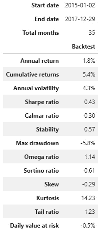

图 9.73 – 对冲交易策略；摘要回报和风险统计

虽然夏普比率非常低，但最大回撤也非常低。稳定性为中等。

以下是最差的五个回撤期图：

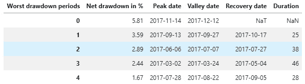

图 9.74 – 对冲交易策略；最差的五个回撤期

最差的五个回撤期表格显示，最大回撤微不足道且非常短暂。

以下是**累积回报**图：

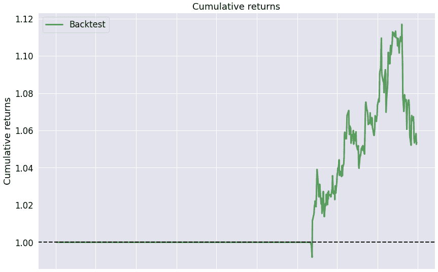

图 9.75 – 对冲交易策略；投资期间内的累积回报

**累积回报**图表明，我们已经没有交易了两年，然后在最后一个期间获利颇丰。

以下是**回报**图：

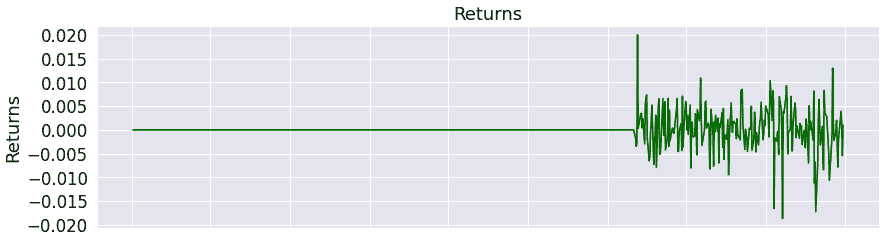

图 9.76 – 对冲交易策略；投资期间内的回报

**回报**图显示，除了最后一个期间外，交易期间的回报都是正的。

以下是**滚动波动率**图：

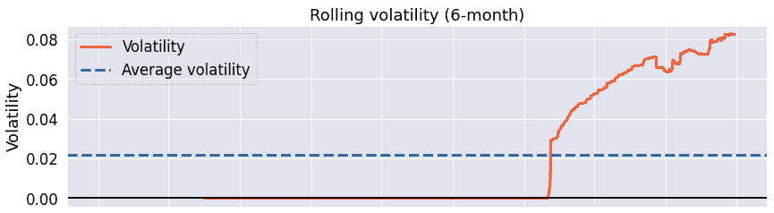

图 9.77 – 对冲交易策略；投资期间内 6 个月滚动波动率

**滚动波动率**图显示，虽然波动率的幅度不显著，但波动率仍在不断增加。

以下是**滚动夏普比率**图：

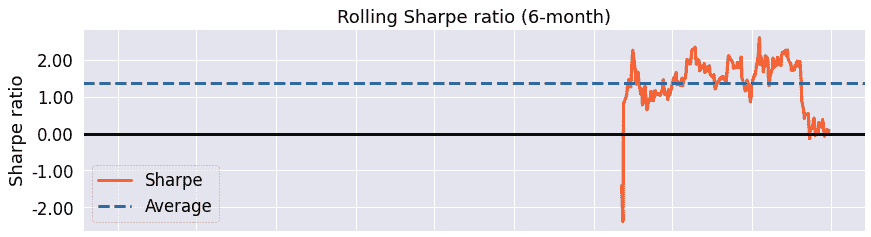

图 9.78 – 对冲交易策略；投资期间内 6 个月滚动夏普比率

**滚动夏普比率**图显示，如果我们改进我们的退出规则并提前退出，我们的夏普比率将高于 1。

以下是**前 5 个回撤期**图：

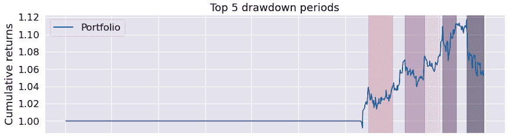

图 9.79 – 对冲交易策略；投资期间内前五个回撤期

**前 5 个回撤期**图告诉我们同样的故事 – 最后一个期间是为什么这次回测结果并不像它本来可能那样成功的原因。

以下是**月度回报**，**年度回报**和**月度回报分布**图：

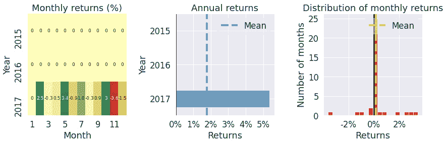

图 9.80 – 成对交易策略；月收益、年收益和投资周期内月收益分布

**月收益** 表格证实我们直到 2017 年才开始交易。**年收益** 图表显示了 2017 年的交易是成功的，而**月收益分布** 图表显示了一个略微负偏斜的图表，具有小的峰度。

在过去的十年中，成对交易策略已经被过度使用，因此利润较少。识别成对的一种简单方法是寻找竞争对手 —— 在这个例子中，是百事可乐公司和可口可乐公司。

# 学习基于数学模型的策略

我们现在将在以下部分中看各种基于数学模型的策略。

## 每月交易的组合波动率最小化策略

该策略的目标是最小化组合波动率。它受到了[`github.com/letianzj/QuantResearch/tree/master/backtest`](https://github.com/letianzj/QuantResearch/tree/master/backtest)的启发。

在以下示例中，投资组合包括 *道琼斯工业平均指数* 中的所有股票。

该策略的关键成功因素如下：

+   股票范围 —— 或许全球指数 ETF 组合会更好。

+   滚动窗口 —— 我们回溯 200 天。

+   交易频率 —— 以下算法使用每月交易 —— 注意构造。

代码如下：

```py
%matplotlib inline
from zipline import run_algorithm 
from zipline.api import order_target_percent, symbol, set_commission, schedule_function, date_rules, time_rules
from zipline.finance.commission import PerTrade
import pandas as pd
import pyfolio as pf
from scipy.optimize import minimize
import numpy as np
import warnings
warnings.filterwarnings('ignore')
def initialize(context): 
    context.stocks = [symbol('DIS'), symbol('WMT'), 
                      symbol('DOW'), symbol('CRM'), 
                      symbol('NKE'), symbol('HD'), 
                      symbol('V'), symbol('MSFT'),
                      symbol('MMM'), symbol('CSCO'),
                      symbol('KO'), symbol('AAPL'),
                      symbol('HON'), symbol('JNJ'),
                      symbol('TRV'), symbol('PG'),
                      symbol('CVX'), symbol('VZ'),
                      symbol('CAT'), symbol('BA'),
                      symbol('AMGN'), symbol('IBM'),
                      symbol('AXP'), symbol('JPM'),
                      symbol('WBA'), symbol('MCD'),
                      symbol('MRK'), symbol('GS'),
                      symbol('UNH'), symbol('INTC')]
    context.rolling_window = 200
    set_commission(PerTrade(cost=5))
    schedule_function(handle_data, 
                      date_rules.month_end(), 
                      time_rules.market_open(hours=1))

def minimum_vol_obj(wo, cov):
    w = wo.reshape(-1, 1)
    sig_p = np.sqrt(np.matmul(w.T, 
                              np.matmul(cov, w)))[0, 0]
    return sig_p
def handle_data(context, data): 
    n_stocks = len(context.stocks)
    prices = None

    for i in range(n_stocks):
        price_history = \
        data.history(context.stocks[i], "close", 
                     context.rolling_window, "1d")

        price = np.array(price_history)
        if prices is None:
            prices = price
        else:
            prices = np.c_[prices, price]

    rets = prices[1:,:]/prices[0:-1, :]-1.0
    mu = np.mean(rets, axis=0)
    cov = np.cov(rets.T)    

    w0 = np.ones(n_stocks) / n_stocks

    cons = ({'type': 'eq', 
             'fun': lambda w: np.sum(w) - 1.0}, 
            {'type': 'ineq', 'fun': lambda w: w})
    TOL = 1e-12    
    res = minimize(minimum_vol_obj, w0, args=cov, 
                   method='SLSQP', constraints=cons, 
                   tol=TOL, options={'disp': False})

    if not res.success:
        return;

    w = res.x

    for i in range(n_stocks):
        order_target_percent(context.stocks[i], w[i])    
def analyze(context, perf): 
    returns, positions, transactions = \
    pf.utils.extract_rets_pos_txn_from_zipline(perf) 
    pf.create_returns_tear_sheet(returns, 
                                 benchmark_rets = None)

start_date = pd.to_datetime('2010-1-1', utc=True)
end_date = pd.to_datetime('2018-1-1', utc=True)

results = run_algorithm(start = start_date, end = end_date, 
                        initialize = initialize, 
                        analyze = analyze, 
                        capital_base = 10000, 
                        data_frequency = 'daily'
                        bundle ='quandl')
```

输出如下：

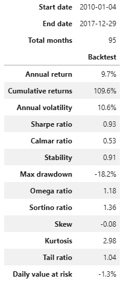

图 9.81 – 组合波动率最小化策略；摘要回报和风险统计

结果是积极的 —— 见到强稳定性为 `0.91`，而尾比率仅略高于 1。

注意结果包括交易成本，如果我们每日交易，结果会更糟。始终尝试最佳交易频率。

以下是最差的五个回撤期图表：

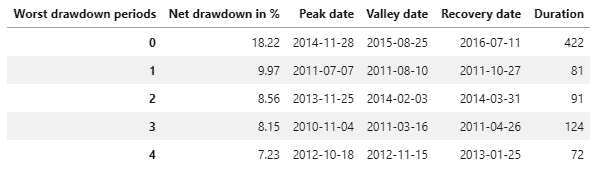

图 9.82 – 组合波动率最小化策略；最差的五个回撤期

最差的回撤期持续了一年，净回撤为 -18.22%。其他最差期间的净回撤幅度低于 -10%。

以下是 **累积收益** 图表：

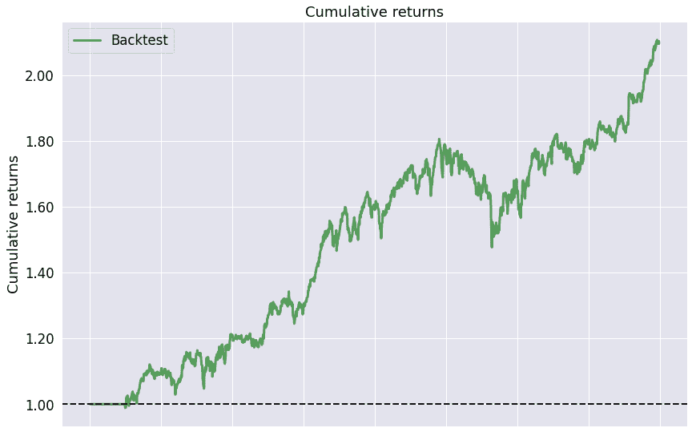

图 9.83 – 组合波动率最小化策略；投资周期内的累积收益

我们看到累积收益持续增长，这是预期的，鉴于稳定性为 0.91。

以下是**回报**图表：

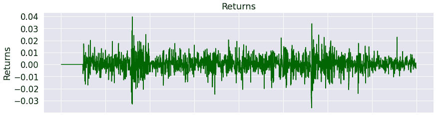

图 9.84 – 投资周期内投资组合波动率最小化策略; 回报

`-0.3`至`0.04`。

以下是**滚动波动率**图表：

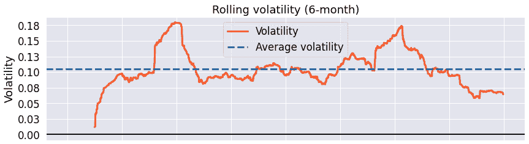

图 9.85 – 投资周期内投资组合波动率最小化策略; 6 个月滚动波动率

`0.18`以及滚动波动率约为`0.1`。

以下是**滚动夏普比率**图表：

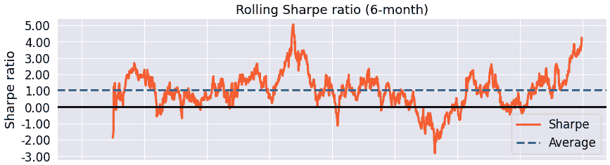

图 9.86 – 投资周期内投资组合波动率最小化策略; 6 个月滚动夏普比率

最小值为`5.0`，最小值略高于`-3.0`。

以下是**前五次回撤期**图表：

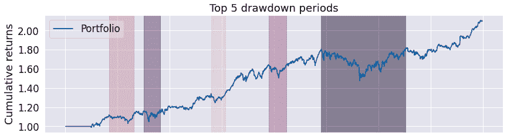

图 9.87 – 投资周期内投资组合波动率最小化策略; 前五次回撤期

**前五次回撤期**图表证实，如果我们通过更智能的进出规则避开最糟糕的回撤期，将极大地改善该策略的表现。

以下是**月度回报**、**年度回报**和**月度回报分布**图表：

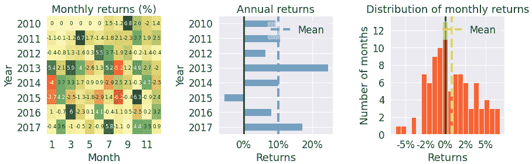

图 9.88 – 投资周期内投资组合波动率最小化策略; 月度回报、年度回报和月度回报分布

**月度回报**表显示我们在 2010 年的前几个月没有交易。**年度回报**图表显示该策略每年都有盈利，但 2015 年除外。**月度回报分布**图表绘制了一个略微负偏态、小峰度的策略。

投资组合波动率最小化策略通常只对非日常交易有利。在这个例子中，我们采用了月度交易，实现了 0.93 的夏普比率，最大回撤为-18.2%。

## 月度交易的最大夏普比率策略

该策略基于哈利·马克维茨 1952 年的论文《投资组合选择》中的思想。简而言之，最佳投资组合位于*有效边界*上 - 一组在每个风险水平下具有最高预期投资组合回报的投资组合。

在该策略中，对于给定的股票，我们选择它们的权重，使其最大化投资组合的预期夏普比率 - 这样的投资组合位于有效边界上。

我们使用 `PyPortfolioOpt` Python 库。要安装它，请使用本书提供的 `conda` 环境或以下命令：

```py
pip install PyPortfolioOpt
%matplotlib inline
from zipline import run_algorithm 
from zipline.api import order_target_percent, symbols, set_commission, schedule_function, date_rules, time_rules
from zipline.finance.commission import PerTrade
import pandas as pd
import pyfolio as pf
import numpy as np
from pypfopt.efficient_frontier import EfficientFrontier
from pypfopt import risk_models
from pypfopt import expected_returns
import warnings
warnings.filterwarnings('ignore')
def initialize(context): 
    context.stocks = \
    symbols('DIS','WMT','DOW','CRM','NKE','HD','V','MSFT',
            'MMM','CSCO','KO','AAPL','HON','JNJ','TRV',
            'PG','CVX','VZ','CAT','BA','AMGN','IBM','AXP',
            'JPM','WBA','MCD','MRK','GS','UNH','INTC')
    context.rolling_window = 252
    set_commission(PerTrade(cost=5))
    schedule_function(handle_data, date_rules.month_end(), 
                      time_rules.market_open(hours=1))

def handle_data(context, data): 
    prices_history = data.history(context.stocks, "close", 
                                  context.rolling_window, 
                                  "1d")
    avg_returns = \
    expected_returns.mean_historical_return(prices_history)
    cov_mat = risk_models.sample_cov(prices_history)
    efficient_frontier = EfficientFrontier(avg_returns, 
                                           cov_mat)
    weights = efficient_frontier.max_sharpe()
    cleaned_weights = efficient_frontier.clean_weights()

    for stock in context.stocks:
        order_target_percent(stock, cleaned_weights[stock])
def analyze(context, perf): 
    returns, positions, transactions = \
    pf.utils.extract_rets_pos_txn_from_zipline(perf) 
    pf.create_returns_tear_sheet(returns, 
                                 benchmark_rets = None)

start_date = pd.to_datetime('2010-1-1', utc=True)
end_date = pd.to_datetime('2018-1-1', utc=True)

results = run_algorithm(start = start_date, end = end_date, 
                        initialize = initialize, 
                        analyze = analyze, 
                        capital_base = 10000, 
                        data_frequency = 'daily', 
                        bundle ='quandl')
```

输出结果如下：


图 9.89 – 最大夏普比率策略；汇总收益和风险统计

该策略表现出稳定的稳定性，为 `0.76`，尾部比率接近 1 (`1.01`)。然而，该策略的年波动率非常高 (`17.0%`)。

下面是最差五个回撤期图表：

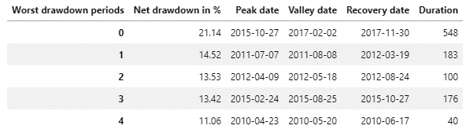

图 9.90 – 最大夏普比率策略；最差五个回撤期

最差回撤期持续时间超过 2 年，净回撤幅度为 -21.14%。如果我们调整入场/出场规则以避免这个回撤期，结果将会大大改善。

下面是**累积收益**图表：

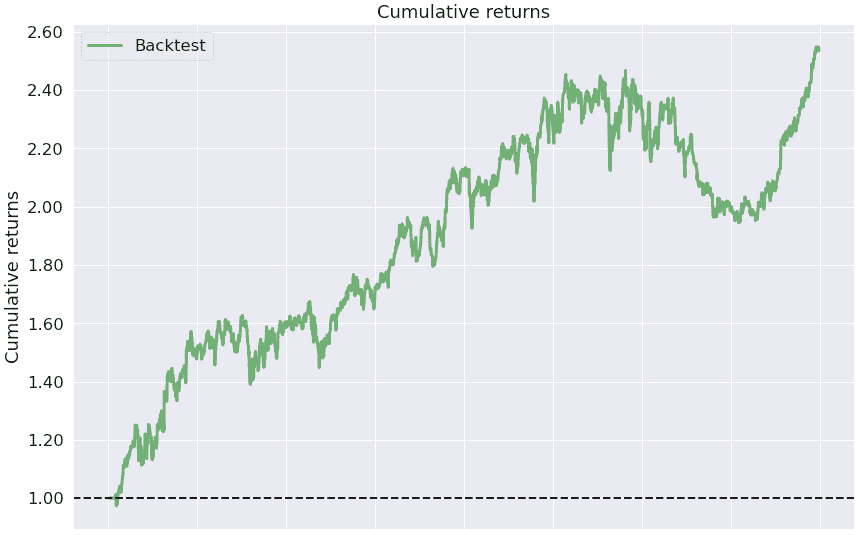

图 9.91 – 最大夏普比率策略；投资期内累积收益

**累积收益**图表显示了积极的稳定性。

下面是**收益**图表：

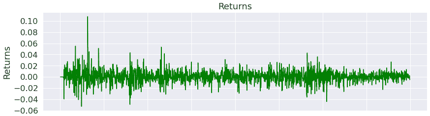

图 9.92 – 最大夏普比率策略；投资期内收益

**收益**图表显示该策略在投资期初非常成功。

下面是**滚动波动率**图表：

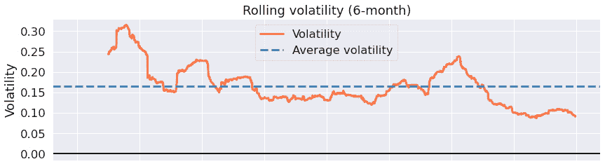

图 9.93 – 最大夏普比率策略；投资期内 6 个月滚动波动率

**滚动波动率**图表显示随着时间的推移，滚动波动率有所下降。

下面是**滚动夏普比率**图表：

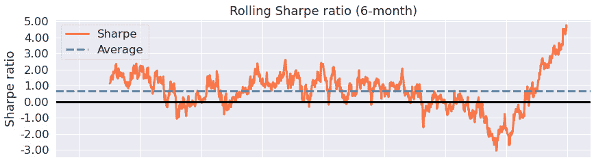

图 9.94 – 最大夏普比率策略；投资期内 6 个月滚动夏普比率

`5.0`，而其最小值高于 `-3.0`。

下面是**前五个回撤期**图表：

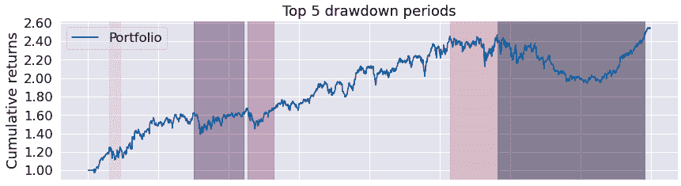

图 9.95 – 最大夏普比率策略；投资期内前五个回撤期

**前五个回撤期**图表显示最大回撤期间很长。

下面是**月度收益**、**年度收益**和**月度收益分布**图表：

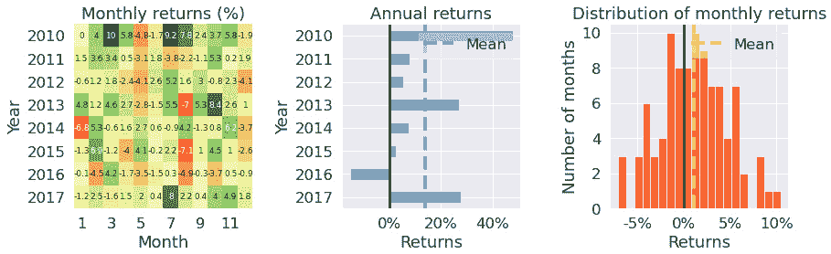

图 9.96 – 最大夏普比率策略；月度收益、年度收益以及投资期内月度收益的分布

**月度收益**表格证明我们几乎每个月都进行了交易。**年度收益**图表显示，除了 2016 年外，每年的年度收益都为正。**月度收益分布**图呈正偏态，具有轻微的峰度。

最大夏普比率策略通常只对非日常交易有利。

# 基于时间序列预测的策略学习

基于时间序列预测的策略取决于在未来某个时间点准确估计股票价格以及其相应置信区间。通常，估计的计算非常耗时。

简单交易规则则包括最后已知价格与未来价格或其下限/上限置信区间值之间的关系。

更复杂的交易规则包括基于趋势分量和季节性分量的决策。

## SARIMAX 策略

该策略基于最基本的规则：如果当前价格低于预测的 7 天后价格，则持有股票：

```py
%matplotlib inline
from zipline import run_algorithm 
from zipline.api import order_target_percent, symbol, set_commission
from zipline.finance.commission import PerTrade
import pandas as pd
import pyfolio as pf
import pmdarima as pm
import warnings
warnings.filterwarnings('ignore')
def initialize(context): 
    context.stock = symbol('AAPL')
    context.rolling_window = 90
    set_commission(PerTrade(cost=5)) 
def handle_data(context, data): 
    price_hist = data.history(context.stock, "close", 
                              context.rolling_window, "1d")
    try:
        model = pm.auto_arima(price_hist, seasonal=True)
        forecasts = model.predict(7)      
        order_target_percent(context.stock, 1.0 if price_hist[-1] < forecasts[-1] else 0.0) 
    except:
        pass
def analyze(context, perf): 
    returns, positions, transactions = \
    pf.utils.extract_rets_pos_txn_from_zipline(perf) 
    pf.create_returns_tear_sheet(returns, 
                                 benchmark_rets = None)

start_date = pd.to_datetime('2017-1-1', utc=True)
end_date = pd.to_datetime('2018-1-1', utc=True)

results = run_algorithm(start = start_date, end = end_date, 
                        initialize = initialize, 
                        analyze = analyze, 
                        handle_data = handle_data, 
                        capital_base = 10000, 
                        data_frequency = 'daily', 
                        bundle ='quandl')
```

输出如下：

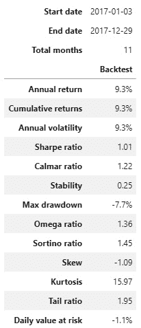

图 9.97 – SARIMAX 策略；摘要收益和风险统计

在交易期内，该策略表现出很高的尾部比率`1.95`，但稳定性很低，为`0.25`。最大回撤率为`-7.7%`，表现优异。

以下是最差五个回撤期的图表：

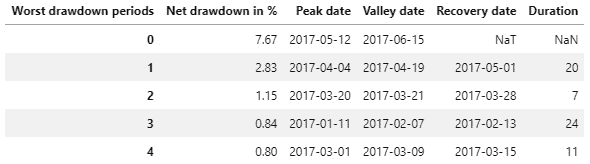

图 9.98 – SARIMAX 策略；最差五个回撤期

最差的回撤期显示了净回撤量低于`-10%`的幅度。

以下是**累积收益**图表：

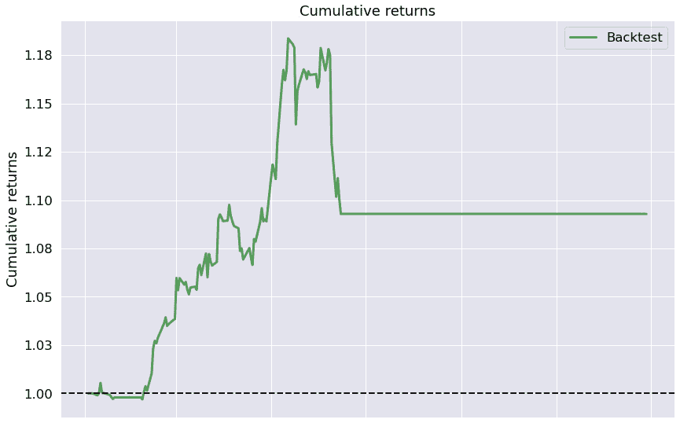

图 9.99 – SARIMAX 策略；投资期内累积收益

**累积收益**图表证明我们只在交易期的前半段进行了交易。

以下是**收益**图表：

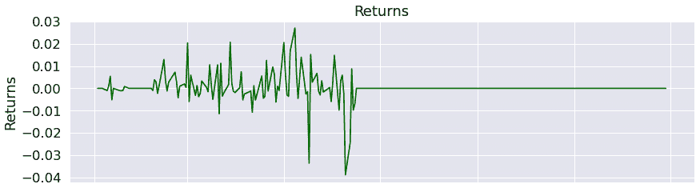

图 9.100 – SARIMAX 策略；投资期内收益

**收益**图表显示，收益幅度的波动比其他策略大。

以下是**滚动波动率**图表：

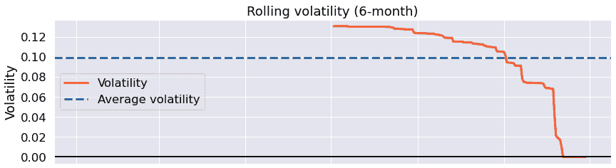

图 9.101 – SARIMAX 策略；投资期内 6 个月滚动波动率

**滚动波动率** 图表显示，随着时间的推移，滚动波动率已经减少。

以下是 **滚动夏普比率** 图表：

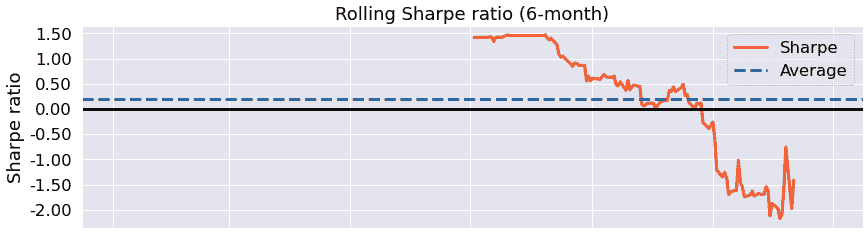

图 9.102 - SARIMAX 策略；投资视角下的 6 个月滚动夏普比率

**滚动夏普比率** 图表显示，交易视角下前半段的夏普比率非常好，然后开始下降。

以下是 **前 5 个回撤期间** 图表：

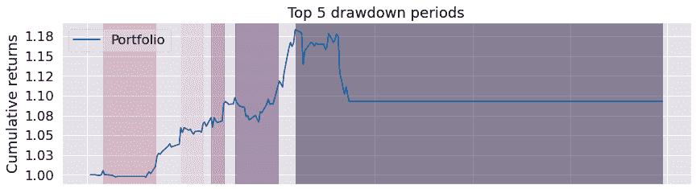

图 9.103 - SARIMAX 策略；投资视角下前五个最糟糕的回撤期间

**前 5 个回撤期间** 图表显示，最糟糕的回撤期是整个交易窗口的后半段。

以下是 **月度回报**、**年度回报** 和 **月度回报分布** 图表：

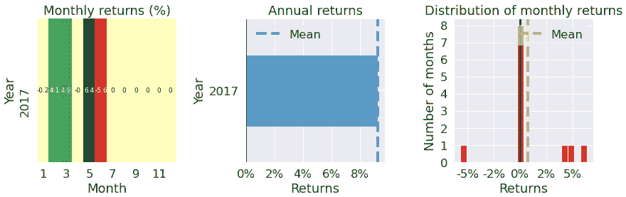

图 9.104 - 月度回报、年度回报以及投资视角下月度回报的分布

**月度回报** 表格证实，我们在 2017 年下半年没有进行交易。**年度回报** 图表显示 2017 年的回报为正，并且 **月度回报分布** 图表呈现负偏态和大峰度。

在测试的时间范围内，SARIMAX 策略的进入规则并没有经常被触发。但是，它产生了夏普比率为 1.01，最大回撤为 -7.7%。

## Prophet 策略

此策略基于预测置信区间，因此比以前的策略更加健壮。此外，Prophet 预测比 SARIMAX 更能应对频繁变化。回测结果完全相同，但是预测算法显著更好。

只有当最后价格低于置信区间的下限值时（我们预计股价将上涨）才购买股票，并且只有当最后价格高于预测置信区间的上限值时才卖出股票（我们预计股价将下跌）：

```py
%matplotlib inline
from zipline import run_algorithm 
from zipline.api import order_target_percent, symbol, set_commission
from zipline.finance.commission import PerTrade
import pandas as pd
import pyfolio as pf
from fbprophet import Prophet
import logging
logging.getLogger('fbprophet').setLevel(logging.WARNING)
import warnings
warnings.filterwarnings('ignore')
def initialize(context): 
    context.stock = symbol('AAPL')
    context.rolling_window = 90
    set_commission(PerTrade(cost=5)) 
def handle_data(context, data): 
    price_hist = data.history(context.stock, "close", 
                              context.rolling_window, "1d")

    price_df = pd.DataFrame({'y' : price_hist}).rename_axis('ds').reset_index()
    price_df['ds'] = price_df['ds'].dt.tz_convert(None)

    model = Prophet()
    model.fit(price_df)
    df_forecast = model.make_future_dataframe(periods=7, 
                                              freq='D')
    df_forecast = model.predict(df_forecast)

    last_price=price_hist[-1]
    forecast_lower=df_forecast['yhat_lower'].iloc[-1]
    forecast_upper=df_forecast['yhat_upper'].iloc[-1]

    if last_price < forecast_lower:
        order_target_percent(context.stock, 1.0) 
    elif last_price > forecast_upper:
        order_target_percent(context.stock, 0.0) 
def analyze(context, perf): 
    returns, positions, transactions = \
    pf.utils.extract_rets_pos_txn_from_zipline(perf) 
    pf.create_returns_tear_sheet(returns, 
                                 benchmark_rets = None)

start_date = pd.to_datetime('2017-1-1', utc=True)
end_date = pd.to_datetime('2018-1-1', utc=True)

results = run_algorithm(start = start_date, end = end_date, 
                        initialize = initialize, 
                        analyze = analyze, 
                        handle_data = handle_data, 
                        capital_base = 10000, 
                        data_frequency = 'daily', 
                        bundle ='quandl')
```

输出如下：

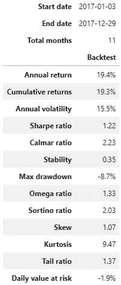

图 9.105 - Prophet 策略；摘要回报和风险统计

与 SARIMAX 策略相比，Prophet 策略显示出更好的结果 - 尾部比率为 `1.37`，夏普比率为 `1.22`，最大回撤为 `-8.7%`。

以下是前五个最糟糕的回撤期间图表：

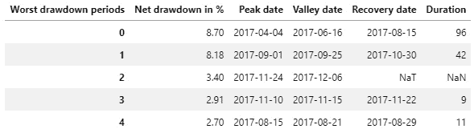

图 9.106 - Prophet 策略；前五个最糟糕的回撤期间

前五个最糟糕的回撤期间证实，最糟糕的净回撤幅度低于 10%。

以下是**累积回报**图表：

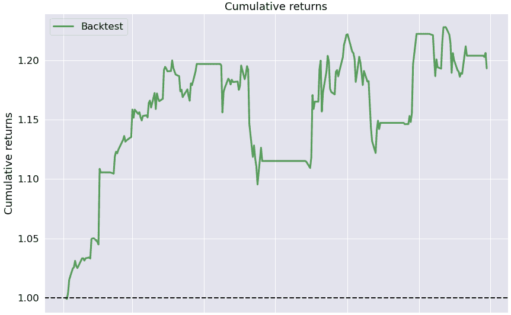

图 9.107 – 先知策略；投资周期内的累积回报

**累积回报** 图表显示，虽然我们在某些时间段没有进行交易，但入场/出场规则比 SARIMAX 策略更为稳健 – 对比两个**累积回报**图表。

以下是**回报**图表：

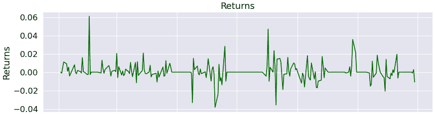

图 9.108 – 先知策略；投资周期内的回报

**回报**图表表明正回报超过了负回报。

以下是**滚动波动率**图表：

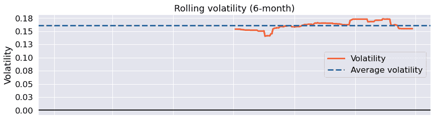

图 9.109 – 先知策略；投资周期内的 6 个月滚动波动率

**滚动波动率** 图表显示几乎恒定的滚动波动率 – 这是先知策略的特点。

以下是**滚动夏普比率**图表：

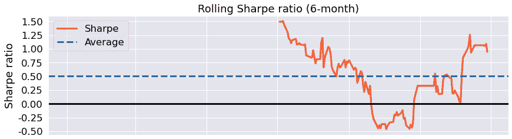

图 9.110 – 先知策略；投资周期内的 6 个月滚动夏普比率

`-.50` 和 `1.5`。

以下是**前 5 个回撤期**图表：

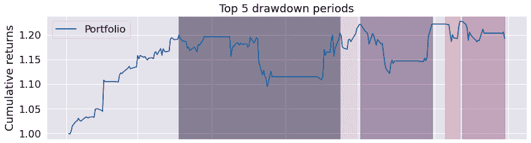

图 9.111 – 先知策略；投资周期内前五个回撤期

**前 5 个回撤期**图表显示，尽管回撤期相当严重，但算法能够很好地处理它们。

以下是**月度回报**、**年度回报**和**月度回报分布**图表：

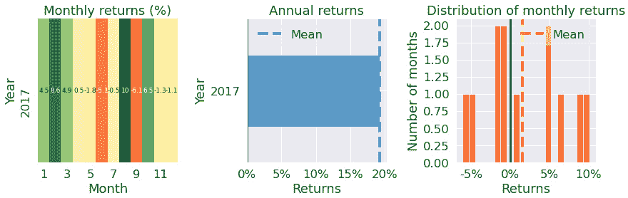

图 9.112 – 先知策略；月度回报、年度回报和月度回报分布

**月度回报**表格确认我们每个月都进行了交易，年度回报良好，如**年度回报**图表所示。**月度回报分布**图表呈正偏态，峰度较小。

先知策略是最稳健的策略之一，能够迅速适应市场变化。在给定的时间段内，它产生了 1.22 的夏普比率，最大回撤为 -8.7。

# 概要

在本章中，我们了解到，算法交易策略由模型、入场/离场规则、头寸限制以及其他关键属性定义。我们展示了在 Zipline 和 PyFolio 中设置完整的回测和风险分析/头寸分析系统是多么容易，这样你就可以专注于策略的开发，而不是浪费时间在基础设施上。

尽管前述策略已广为人知，但通过明智地组合它们，以及智能地选择入场和退出规则，你可以构建高度盈利的策略。

一帆风顺！
