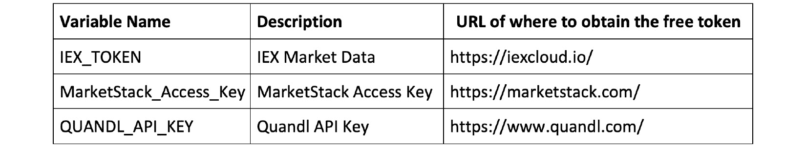
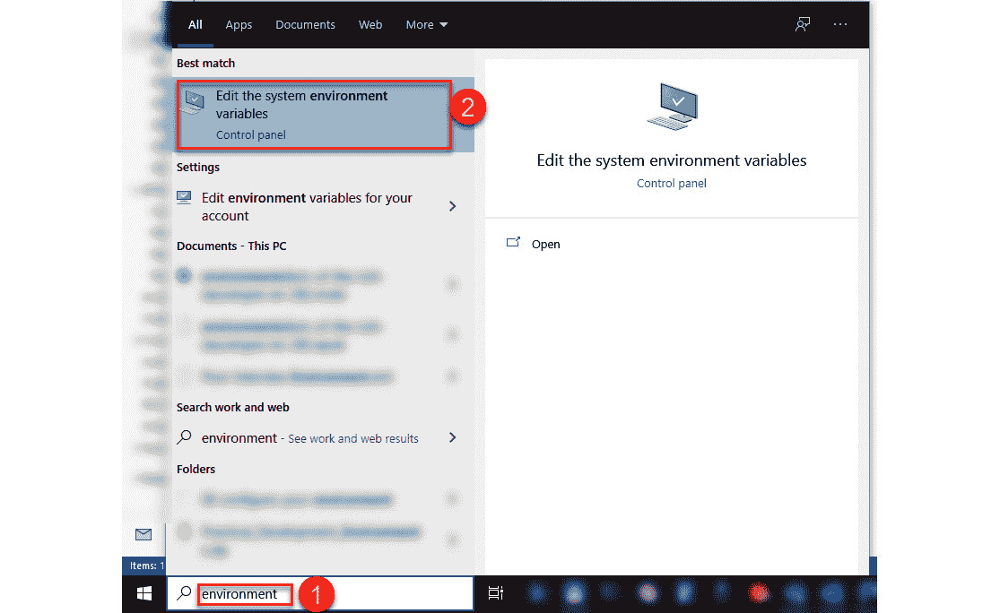

*附录 A*：如何设置 Python 环境

本书的 GitHub 存储库（[`github.com/PacktPublishing/Hands-On-Financial-Trading-with-Python/`](http://github.com/PacktPublishing/Hands-On-Financial-Trading-with-Python/)）包含 Jupyter 笔记本，将帮助你复制此处显示的输出。

该环境是通过手动选择所有包含的软件包的兼容版本创建的。

# 第十章：技术要求

本书中的代码可以在 Windows、Mac 或 Linux 操作系统上运行。

# 初始设置

要设置 Python 环境，请按照以下步骤进行操作：

1.  如果尚未安装 Anaconda Python，请从[`www.anaconda.com/products/individual`](https://www.anaconda.com/products/individual)下载并安装。

1.  `git clone`存储库：

    ```py
    git clone XXXXX
    ```

1.  将当前目录更改为克隆的 GitHub 存储库。

1.  运行以下代码：

    ```py
    conda env create -f handson-algorithmic-trading-with-python\environment.yml -n handson-algorithmic-trading-with-python
    ```

1.  更改活动环境：

    ```py
    conda activate handson-algorithmic-trading-with-python
    ```

1.  设置市场访问的全局环境变量：

    图 1 – 各种变量名及其免费令牌获取位置的表

1.  使用 Windows 的控制面板，设置系统环境：

    ```py
    Export QUANDL_API_KEY=xxxx
    ```

    关闭命令提示符，以激活全局环境变量。

1.  继续执行`environment.yml`文件，该文件是在修复了一个软件包的元文件中的拼写错误后，使用`conda env export > environmenmt.yml`命令生成的。

# 下载免费的 Quandl 数据包

步骤如下：

1.  更改活动环境：

    ```py
    conda activate handson-algorithmic-trading-with-python
    ```

1.  如果您尚未通过 Window 的控制面板或使用`.bash_profile`或`.bashrc`设置过`QUANDL_API_KEY`值，请设置它。

    对于 Windows，请使用以下命令：

    ```py
    SET QUANDL_API_KEY=XXXXXXXX
    ```

    对于 Mac/Linux，请使用以下命令：

    ```py
    export QUANDL_API_KEY=XXXXXXXX
    ```

1.  摄取数据：

    ```py
    zipline ingest -b quandl
    ```

    注意

    你不需要重复下载这个包。数据已经不再更新。

安装好环境后，请按照以下步骤进行操作：

1.  将当前目录更改为克隆的 GitHub 存储库。

1.  更改活动环境：

    ```py
    conda activate handson-algorithmic-trading-with-python
    ```

1.  启动 Jupyter Lab，如下所示：

    ```py
    jupyter lab 
    ```
