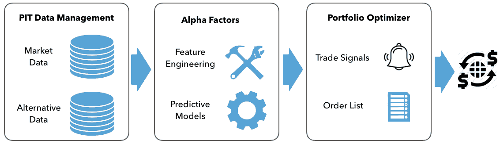
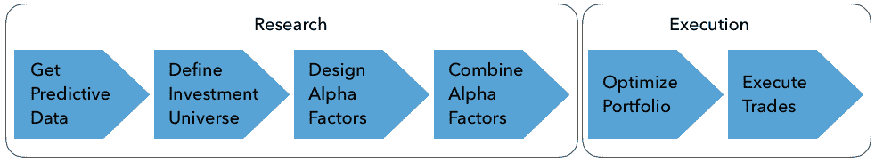

# 交易机器学习

算法交易依赖于执行算法的计算机程序，以自动化交易策略的某些或全部元素。算法是实现目标的一系列步骤或规则，可以采用许多形式。在**机器学习**（**ML**）的情况下，算法追求学习其他算法的目标，即根据数据学习规则，例如最小化预测误差。

这些算法编码了组合经理的各种活动，组合经理观察市场交易并分析相关数据，以决定是否下达买入或卖出订单。订单的顺序定义了组合持有的投资组合，该投资组合的目标是随时间产生对资本提供者有吸引力的回报，考虑到他们对风险的偏好。

最终，主动投资管理的目标在于实现阿尔法，即超过用于评估的基准的回报。主动管理的基本法则将**信息比率**（**IR**）应用于表达主动管理的价值，即投资组合回报超过基准回报（通常是指数）与这些回报的波动性之比。它将信息比率近似为**信息系数**（**IC**）的乘积，信息系数衡量了预测的质量，即它们与结果的相关性，以及策略的广度，表达为赌注数量的平方根。

因此，产生阿尔法的关键是预测。成功的预测反过来又需要优越的信息或者对公共信息的优越处理能力。算法促进了整个投资过程的优化，从资产配置到构思、交易执行和风险管理。特别是利用机器学习进行算法交易，旨在更有效地利用传统和替代数据，以产生更好且更具可行性的预测，从而提高主动管理的价值。

从历史上看，算法交易曾被更狭义地定义为执行交易自动化以尽量降低成本，这是由卖方提供的，但我们将采用更全面的视角，因为算法的使用，尤其是机器学习，已经开始影响更广泛的活动，从构思和阿尔法因子设计到资产配置、头寸规模和策略的测试和评估。

本章探讨了如何将 ML 的使用作为投资行业竞争优势的关键来源，并将其纳入投资过程，以实现算法交易策略。

我们将在本章中涵盖以下主题：

+   本书的组织方式及适合阅读本书的读者

+   机器学习如何在算法交易中发挥战略作用

+   如何设计和执行交易策略

+   机器学习如何为算法交易策略增加价值

# 如何阅读本书

如果您正在阅读本文，那么您可能已经意识到机器学习已经成为许多行业，包括投资行业的战略能力。驱动机器学习兴起的数字数据爆炸对投资产生了特别强大的影响，这在处理信息方面已经有很长的历史了。跨资产类别的交易范围意味着除了曾经是分析工作重点的市场和基本数据之外，还可能涉及广泛的新型替代数据。

你可能也注意到，成功应用机器学习或数据科学需要个人或团队在统计知识、计算能力和领域专业知识方面的整合。换句话说，关键是提出正确的问题，识别和理解可能提供答案的数据，使用各种工具获取结果，并以能够做出正确决策的方式解释它们。

因此，本书从整体上探讨了将机器学习应用于投资和交易领域。在本节中，我们将介绍预期会发生什么，它如何实现其目标，以及您需要什么来实现自己的目标并在此过程中享受乐趣。

# 预期

本书旨在为您提供将机器学习应用于交易和投资过程中增加价值的战略视角、概念理解和实用工具。为此，它将机器学习作为流程中的重要组成部分而不是独立的练习。

首先，它涵盖了一系列有用于从与不同资产类别相关的多样化数据源中提取信号的监督、无监督和强化学习算法。它介绍了一个机器学习工作流，并专注于具有相关数据和大量代码示例的实际用例。然而，它还发展了数学和统计背景，以便调整算法或解释结果。

该书认识到投资者可以从第三方数据中提取的价值超过其他行业。因此，它不仅涵盖了如何处理市场和基本数据，还涵盖了如何获取、评估、处理和建模另类数据源，例如非结构化文本和图像数据。

它将机器学习的应用与研究和评估阿尔法因子、定量和基于因子的策略联系起来，并将投资组合管理作为部署结合多个阿尔法因子的策略的背景。它还强调了机器学习可以为除了与个别资产价格相关的预测之外的价值，例如资产配置，并解决了使用大型数据集开发交易策略时的错误发现风险。

这本书没有提供投资建议或现成的交易算法，这应该不足为奇。相反，它提供了识别、评估和组合适用于任何特定投资目标的数据集所需的基本构建模块，选择并应用 ML 算法到这些数据，以及基于结果开发和测试算法交易策略的方法。

# 谁应该阅读这本书

如果您是分析师、数据科学家或具有对金融市场的了解和对交易策略感兴趣的 ML 工程师，您应该会发现这本书很有价值。如果您是一名投资专业人士，希望利用 ML 做出更好的决策，您也应该会受益。

如果您的背景是软件和 ML，您可能只需浏览或跳过 ML 的一些入门材料。同样，如果您的专业是投资，您可能会熟悉一些或所有的金融背景。您可能会发现这本书最有用，因为它涵盖了关键算法、构建模块和用例的概述，而不是针对特定算法或策略的专业覆盖。然而，这本书假设您对继续学习这个非常动态的领域感兴趣。为此，它引用了许多资源来支持您朝着利用和建立基本方法和工具的定制交易策略的旅程。

您应该熟悉使用 Python 3 以及各种科学计算库，如`numpy`、`pandas`或`scipy`，并有兴趣途中学习更多。一些 ML 和 scikit-learn 的经验可能会有所帮助，但我们简要介绍了基本的工作流程，并参考了各种资源来填补或深入研究。

# 书的组织结构

本书全面介绍了 ML 如何增加交易策略的设计和执行的价值。它分为四个部分，涵盖了数据采集和策略开发过程的不同方面，以及解决各种 ML 挑战的不同解决方案。

# 第一部分 - 框架 - 从数据到策略设计

第一部分提供了算法交易策略开发的框架。它重点介绍了驱动 ML 算法和本书讨论的策略的数据，概述了如何使用 ML 来推导交易信号，以及如何将策略部署和评估为投资组合的一部分。

本章剩余部分概述了 ML 如何成为投资的核心，描述了交易流程，并概述了 ML 如何增加价值。第二章，*市场和基本数据*，涵盖了源头以及如何使用原始交易所提供的 tick 和财务报告数据，以及如何访问我们在本书中将依赖的众多开源数据提供者。

第三章，*金融的另类数据*，提供了评估不断增加的来源和提供者的类别和标准。它还演示了如何通过网站抓取来创建另类数据集，例如收集用于本书第二部分中的**自然语言处理**（**NLP**）和情感分析算法的盈利电话转录。

第四章，*Alpha 因子研究*，提供了理解因子如何工作以及如何衡量其绩效的框架，例如使用**信息系数**（**IC**）。它演示了如何使用 Python 库离线和在 Quantopian 平台上从数据中设计 alpha 因子。它还介绍了使用`zipline`库对因子进行回测以及使用`alphalens`库评估其预测能力的方法。

第五章，*策略评估*，介绍了如何使用历史数据通过`zipline`离线和在 Quantopian 平台上构建、测试和评估交易策略。它介绍并演示了如何使用`pyfolio`库计算投资组合绩效和风险指标。它还介绍了如何应对策略回测的方法论挑战，并介绍了从投资组合风险角度优化策略的方法。

# 第二部分 - ML 基础知识

第二部分涵盖了基本的监督和无监督学习算法，并说明了它们在交易策略中的应用。它还介绍了 Quantopian 平台，您可以在该平台上利用本书中开发的数据和 ML 技术来实施在实时市场中执行交易的算法策略。

第六章，*机器学习流程*，通过概述如何制定、训练、调整和评估 ML 模型的预测性能作为系统工作流程来铺设舞台。

第七章，*线性模型*，展示了如何使用线性和逻辑回归进行推断和预测，以及如何使用正则化来管理过拟合的风险。它介绍了 Quantopian 交易平台，并演示了如何构建因子模型和预测资产价格。

第八章，*时间序列模型*，涵盖了单变量和多变量时间序列，包括向量自回归模型和共整合测试，以及它们如何应用于成对交易策略。第九章，*贝叶斯机器学习*，介绍了如何制定概率模型以及**马尔科夫链蒙特卡洛**（**MCMC**）采样和变分贝叶斯如何促进近似推理。它还说明了如何使用 PyMC3 进行概率编程，以深入了解参数和模型的不确定性。

第十章，*决策树和随机森林*，展示了如何构建、训练和调整非线性基于树的模型以进行洞察和预测。它介绍了基于树的集成模型，并说明了随机森林如何使用自举聚合来克服决策树的一些弱点。第十一章，*梯度提升机*，集成模型，并演示了如何使用库`xgboost`、`lightgbm`和`catboost`进行高性能训练和预测，并深入审查了如何调整众多的超参数。

第十二章，*无监督学习*，介绍了如何使用降维和聚类进行算法交易。它使用主成分和独立成分分析来提取数据驱动的风险因子。它介绍了几种聚类技术，并演示了如何使用分层聚类进行资产配置。

# 第三部分 – 自然语言处理

第三部分专注于文本数据，并介绍了最先进的无监督学习技术，以从这一关键的替代数据源中提取高质量的信号。

第十三章，*处理文本数据*，演示了如何将文本数据转换为数值格式，并应用了第二部分中的分类算法进行大规模数据集的情感分析。第十四章，*主题建模*，应用了贝叶斯无监督学习来提取能够总结大量文档的潜在主题，并提供了更有效地探索文本数据或将主题用作分类模型特征的方法。它演示了如何将这一技术应用到 第三章，*金融替代数据*，中获取的收益电话文本和提交给**证券交易委员会** (**SEC**) 的年度报告。

第十五章，*词嵌入*，使用神经网络学习最先进的语言特征，以单词向量的形式捕获语义上下文，比传统的文本特征更好地表示语义内容，是从文本数据中提取交易信号的一个非常有前景的途径。

# 第四部分 – 深度学习和强化学习

第四部分介绍了深度学习和强化学习。

+   [第十七章](https://www.packtpub.com/sites/default/files/downloads/Deep_Learning.pdf)，*深度学习*，介绍了 Keras、TensorFlow 和 PyTorch，这三个最流行的深度学习框架，并说明了如何训练和调整各种架构。

+   [第十八章](https://www.packtpub.com/sites/default/files/downloads/Recurrent_Neural_Networks.pdf)，*循环神经网络*，为时间序列数据提供了 RNNs。

+   [第十九章](https://www.packtpub.com/sites/default/files/downloads/Convolutions_Neural_Networks.pdf)，*卷积神经网络*，说明了如何使用 CNN 处理图像和文本数据

+   [第二十章](https://www.packtpub.com/sites/default/files/downloads/Autoencoders_and_Generative_Adversarial_Nets.pdf)，*自编码器和生成对抗网络*，展示了如何使用深度神经网络进行无监督学习，使用自编码器生成合成数据

+   [第二十一章](https://www.packtpub.com/sites/default/files/downloads/Reinforcement_Learning.pdf)，*强化学习*，演示了使用强化学习构建动态代理程序，根据奖励使用 OpenAI gym 平台学习策略函数

# 您成功所需的条件

该书内容围绕着将机器学习算法应用于不同数据集。书中还在 GitHub 上提供了大量额外内容，以便于审阅并通过书中讨论的示例进行实验。它包含了额外的细节和说明，以及众多参考资料。

# 数据来源

我们将使用来自市场、基本和替代来源的免费历史数据。 第二章，*市场和基本数据* 和 第三章，*金融替代数据* 讲述了这些数据来源的特点和获取方式，并介绍了我们在整本书中将使用的关键提供者。 伴随的 GitHub 仓库（见下文）包含了如何获取或创建我们在整个书中将使用的一些数据集的说明，并包括一些较小的数据集。

我们将要获取和处理的一些示例数据源包括但不限于：

+   纳斯达克 ITCH 订单簿数据

+   电子数据收集、分析和检索（EDGAR）美国证券交易委员会申报

+   来自 Seeking Alpha 的盈利电话转录

+   Quandl 每日价格以及超过 3,000 只美国股票的其他数据点

+   来自美联储等机构的各种宏观基本数据

+   大量 Yelp 商业评论和 Twitter 数据集

+   油轮图像数据

一些数据非常庞大（例如纳斯达克和 SEC 申报）。 笔记本会指示是否是这种情况。

# GitHub 仓库

GitHub 仓库包含了更多细节中涉及的许多概念和模型的 Jupyter Notebooks。 在书中使用时会引用这些笔记本。 每个章节都有自己的目录，需要时有单独的说明，并且包括与章节内容相关的参考资料。

Jupyter Notebooks 是创建可重现计算叙事的绝佳工具，它使用户能够创建和共享结合了实时代码、叙述文本、数学方程、可视化、交互控件和其他丰富输出的文档。 它还提供了用于与数据进行交互计算的构建模块，例如文件浏览器、终端和文本编辑器。

您可以在以下位置找到代码文件：

[`github.com/PacktPublishing/Hands-On-Machine-Learning-for-Algorithmic-Trading`](https://github.com/PacktPublishing/Hands-On-Machine-Learning-for-Algorithmic-Trading)。

# Python 库

该书采用 Python 3.7，并推荐使用 `miniconda` 安装 `conda` 包管理器，并创建一个 `conda` 环境来安装必要的库。为此，GitHub 仓库包含一个 `environment.yml` 文件。请参考 GitHub 仓库的 `README` 文件中引用的安装说明。

# 投资行业中机器学习的崛起

在过去几十年中，投资行业已经发生了巨大变化，并在竞争加剧、技术进步和复杂的经济环境中继续发展。本节将回顾塑造投资环境总体和算法交易特别情境的几个关键趋势，以及将在本书中反复出现的相关主题。

推动算法交易和机器学习成为当前主流的趋势包括：

+   市场微观结构的变化，如电子交易的普及和跨资产类别和地理区域的市场整合

+   以风险因子暴露为框架的投资策略的发展，而不是资产类别

+   计算能力、数据生成和管理以及分析方法的革命

+   算法交易先驱相对于人类、离散投资者的表现优异

此外，2001 年和 2008 年的金融危机影响了投资者对分散化和风险管理的看法，并催生了以 **交易所交易基金** (**ETF**) 形式的低成本被动投资工具。在 2008 年危机后的低收益和低波动性中，成本意识强的投资者将 2 万亿美元从主动管理型共同基金转移到被动管理的 ETF。竞争压力还体现在对冲基金费用的降低，从传统的 2% 年度管理费和 20% 利润份额降至 2017 年的平均 1.48% 和 17.4%。

# 从电子交易到高频交易

电子交易在能力、交易量、资产类别覆盖范围和地域覆盖范围方面取得了长足的进步，自 20 世纪 60 年代网络开始将价格路由到计算机终端以来。

股票市场已经在全球范围内引领了这一趋势。美国证券交易委员会（SEC）于 1997 年颁布的订单处理规则通过**电子通讯网络**（**ECN**）向交易所引入了竞争。ECN 是自动化的**替代交易系统**（**ATS**），它们以指定价格匹配买卖订单，主要用于股票和货币，并注册为经纪人。它允许不同地理位置的大型经纪公司和个人交易者在交易所和交易时间之后直接进行交易，无需中间商。暗池是另一种类型的 ATS，它允许投资者下订单和交易，而无需公开透露其信息，就像交易所维护的订单簿中一样。自 2007 年 SEC 裁定以来，暗池已经增长，通常设在大型银行内，并受到 SEC 监管。

随着电子交易的兴起，成本效益执行的算法迅速发展，并且采用情况从卖方迅速扩展到买方和各种资产类别。自 2000 年左右，自动交易就作为卖方工具出现，旨在实现成本效益的交易执行，通过将订单分散到时间上来限制市场影响。这些工具扩展到买方，并且通过考虑交易成本和流动性以及短期价格和成交量预测等因素变得越来越复杂。

**直接市场访问**（**DMA**）通过允许交易者直接将订单发送到交易所，使用经纪人的基础设施和市场参与者标识，为交易者提供了更大的执行控制权。赞助访问通过经纪人去除了预先交易风险控制，并形成了**高频交易**（**HFT**）的基础。

HFT 指的是金融工具的自动化交易，以微秒为单位的极低延迟执行，并且参与者持有很短时间的头寸。其目标是发现和利用市场微观结构的不有效率，即交易场所的机构基础设施。在过去的十年中，HFT 已经大幅增长，据估计，在美国股票市场中占据大约 55%的交易量，在欧洲股票市场中约占 40%。HFT 也在期货市场上增长到大约 80%的外汇期货交易量，以及两三分之二的利率和国债 10 年期期货交易量（FAS 2016）。

高频交易策略旨在利用被动或激进策略每笔交易获得小额利润。被动策略包括套利交易，以从不同交易场所交易的同一资产或其衍生品的微小价格差异中获利。激进策略包括订单预期或动量引爆。订单预期，也称为**流动性检测**，涉及提交小型探索性订单以侦测大型机构投资者的隐藏流动性，并在大订单之前交易，以从随后的价格波动中获益。动量引爆意味着一个算法执行并取消一系列订单，以欺骗其他高频交易算法更积极地买入（或卖出），并从由此产生的价格变化中获益。

监管机构对某些激进的高频交易策略与市场脆弱性和波动性增加之间的潜在联系表示担忧，比如 2010 年 5 月的闪电崩盘、2014 年 10 月的国债市场波动以及 2015 年 8 月 24 日道琼斯工业平均指数暴跌超过 1000 点。与此同时，由于高频交易的存在，市场流动性随着交易量的增加而增加，从而降低了整体交易成本。

交易量减少、波动性降低以及技术成本和获取数据和交易场所的准入成本上升的组合导致了财务压力。美国股票的高频交易收入据估计首次下降到 2008 年以来的 10 亿美元以下，从 2009 年的 79 亿美元下降。

这一趋势导致了行业的整合，例如，最大的上市专有交易公司 Virtu Financial 进行了各种收购，并共享基础设施投资，例如芝加哥和东京之间的新 Go West 超低延迟路线。同时，创业公司如 Alpha Trading Lab 提供高频交易基础设施和数据，以通过众包算法来使高频交易民主化，并获得利润的一部分。

# 因子投资和智能贝塔基金

资产提供的回报是与金融投资相关的不确定性或风险的函数。例如，股权投资意味着承担公司的经营风险，而债券投资意味着承担违约风险。

在特定风险特征预测回报的程度上，识别和预测这些风险因素的行为成为设计投资策略时的主要关注点。这产生了有价值的交易信号，并是优秀主动管理结果的关键。随着时间的推移，该行业对风险因素的理解发生了很大变化，并影响了机器学习在算法交易中的应用。

**现代投资组合理论**（**MPT**）引入了对于给定资产的特异风险和系统性风险的区分。特异风险可以通过多元化消除，但系统性风险则不能。在 1960 年代初，**资本资产定价模型**（**CAPM**）确定了驱动所有资产回报的单一因素：市场投资组合相对于国库券的回报。市场投资组合由所有可交易证券组成，按其市值加权。资产对市场的系统性暴露由贝塔（beta）来衡量，即资产回报与市场投资组合之间的相关性。

认识到资产风险不取决于孤立的资产，而是取决于其相对于其他资产和整个市场的运动方式，是一项重大的概念突破。换句话说，资产并不因其特定的特异特征而赚取风险溢价，而是因其暴露于基础因素风险而获利。

然而，大量的学术文献和长期的投资经验已经证明，CAPM 的预测是错误的，即资产风险溢价仅取决于其暴露于由资产贝塔测量的单一因素。相反，后来发现了许多额外的风险因素。因子是一种可量化的信号、属性或任何与未来股票回报历史上相关的变量，并且预计未来仍将相关。

这些风险因素被标记为异常，因为它们与**有效市场假说**（**EMH**）相矛盾，后者认为市场均衡将始终根据 CAPM 定价证券，因此其他因素不应具有预测能力。因素背后的经济理论可以是理性的，即因素风险溢价弥补了不良时期低回报的情况，也可以是行为的，即代理人未能套利超出的回报。

知名的异常包括价值、规模和动量效应，这些效应有助于预测回报，同时控制 CAPM 市场因素。规模效应基于小型公司系统性地胜过大型公司，由 Banz（1981）和 Reinganum（1981）发现。价值效应（Basu 1982）指出，具有低估价指标的公司表现更好。它暗示着具有低价格倍数的公司，如市盈率或市净率低的公司，表现比它们更昂贵的同行更好（正如价值投资的创始人本杰明·格雷厄姆和大卫·多德所建议，并被沃伦·巴菲特所普及）。

动量效应是由克利福德·阿斯尼斯等人于 1980 年代末发现的，阿斯尼斯是 AQR 的创始合伙人之一。该效应表明，具有良好动量的股票，即近 6-12 个月的回报较高的股票，其未来的回报高于市场风险相似的劣质动量股票。研究人员还发现，价值和动量因子解释了美国以外股票的回报，以及其他资产类别，如债券、货币和大宗商品，以及额外的风险因素。

在固定收益领域，价值策略被称为**乘坐收益曲线**，是一种利率曲线溢价形式。在大宗商品中，它被称为**卷曲回报**，对于上升期货曲线，它有正回报，否则则为负回报。在外汇市场中，价值策略被称为**利差**。

还有一项流动性溢价。更不流动的证券以低价格交易，并且相对于更流动的对应品具有较高的平均超额回报。具有较高违约风险的债券平均回报较高，反映了信用风险溢价。由于当回报往往下跌时投资者愿意为高波动性购买保险，因此期权市场中的波动性保护卖方往往会获得较高的回报。

多因子模型将风险定义为比市场投资组合更广泛和多样化的内容。1976 年，斯蒂芬·罗斯提出了套利定价理论，该理论主张投资者获得了多个系统性风险来源的补偿，这些风险是不可分散的。最重要的三个宏观因素是增长、通胀和波动性，除了生产力、人口结构和政治风险。1992 年，尤金·法玛和肯尼斯·弗伦奇将股权风险因素的大小和价值与市场因素结合到一个单一模型中，更好地解释了横截面股票回报。后来，他们添加了一个同时解释两种资产类别回报的模型，该模型还包括债券风险因素。

风险因素特别吸引人的一个方面是它们之间的低或负相关性。例如，价值和动量风险因素呈负相关，降低了风险，并且使风险调整后的回报超出了风险因素所隐含的收益。此外，利用杠杆和多空策略，因子策略可以组合成市场中性方法。在将暴露于正风险的证券的多头头寸与暴露于负风险的证券的低配头寸或空头头寸相结合后，可以收集到动态风险溢价。

因此，解释超越 CAPM 的回报的因素被纳入了倾向于支持一个或多个因素的投资风格中，资产开始流入基于因子的投资组合。 2008 年的金融危机强调了当投资者不看基础因子风险时，资产类别标签可能会极具误导性并导致虚假的分散化感，因为资产类别同时崩盘。

在过去几十年中，量化因子投资已经从基于两三种风格的简单方法发展为多因子智能或异类β产品。 智能β基金在 2017 年突破了 1 万亿美元资产管理规模，证明了这种混合投资策略的受欢迎程度，该策略结合了主动和被动管理。 智能β基金采取被动策略，但根据一个或多个因素进行修改，例如选择更便宜的股票或根据股息支付进行筛选，以获得更好的回报。 这种增长与对传统主动管理者收取高费用的批评以及对其业绩加剧的审查同时发生。

持续发现和成功预测风险因素，无论是单独还是与其他风险因素结合，都会显著影响未来资产回报，跨资产类别，这是投资行业中机器学习激增的关键推动力，并且将是本书的一个关键主题。

# 算法先驱在规模上超越了人类

引领算法交易的公司的**资产管理规模**（**AUM**）的业绩和增长在引起投资者兴趣以及随后行业努力复制其成功方面发挥了关键作用。系统性基金与高频交易（HFT）不同之处在于，交易可以持有更长时间，同时寻求利用套利机会，而不是单纯依靠速度优势。

主要或完全依赖算法决策的系统性策略最著名的是由数学家 James Simons 引入的，他于 1982 年创立了文艺复兴技术公司，并将其打造成为首屈一指的量化公司。 其神秘的 Medallion 基金，对外关闭，自 1982 年以来年化收益估计为 35%。

DE Shaw，Citadel 和 Two Sigma 是最著名的三家使用基于算法的系统性策略的量化对冲基金，在 2017 年首次以总收益为标准进入前 20 名表现者之列，扣除费用，并自成立以来。

DE Shaw 成立于 1988 年，2018 年资产管理规模为 470 亿美元，在榜单上排名第 3。 Citadel 由 Kenneth Griffin 于 1990 年创立，管理着 290 亿美元，排名第 5 位。 Two Sigma 仅于 2001 年由 DE Shaw 的校友 John Overdeck 和 David Siegel 创立，从 2011 年的 80 亿美元资产管理规模增长到 2018 年的 520 亿美元。 Bridgewater 成立于 1975 年，资产管理规模超过 1500 亿美元，由于其也融合了系统性策略的纯阿尔法基金，仍然处于领先地位。

同样，在机构投资者 2017 年对冲基金 100 强榜单上，排名前六位的五家公司在很大程度上或完全依靠计算机和交易算法做出投资决策——所有这些公司都在一个充满挑战的环境中增长了资产。几家定量型公司上升了几个等级，并在某些情况下将其资产增长了两位数的百分比。排名第二的**应用量化研究**（**AQR**）在 2017 年将其对冲基金资产增长了 48%，达到了 697 亿美元，并且公司总资产管理规模达到了 1876 亿美元。

在过去三年中，根据复合绩效排名，文艺复兴技术运营的基于量化的对冲基金排名分别为 6 和 24，Two Sigma 排名第 11，D.E. Shaw 分别排名 18 和 32，Citadel 排名 30 和 37。除了表现最好的之外，算法策略在过去几年中表现良好。在过去五年中，量化对冲基金的年均收益率约为 5.1%，而同期平均对冲基金的年均涨幅为 4.3%。

# 由机器学习驱动的基金吸引了 1 万亿美元的资产管理规模。

计算能力、数据和机器学习方法的三次革命使得系统化、数据驱动的策略的采用不仅更具吸引力和成本效益，而且是竞争优势的关键来源。

因此，算法方法不仅在开创这些策略的对冲基金行业中找到了更广泛的应用，而且在更广泛的资产管理公司以及 ETF 等被动管理的车辆中也找到了应用。特别是，利用机器学习和算法自动化的预测分析在投资过程的所有步骤中发挥着越来越重要的作用，从构思和研究到策略制定和投资组合构建，再到交易执行和风险管理，跨资产类别都是如此。

由于没有量化或算法基金的客观定义，行业规模的估计各不相同，许多传统对冲基金甚至包括共同基金和交易所交易基金（ETF）正在引入计算机驱动的策略或将其整合到人加机的自主环境中。

摩根士丹利在 2017 年估计，过去六年中，算法策略以每年 15%的速度增长，并在对冲基金、共同基金和智能贝塔 ETF 之间控制着约 1.5 万亿美元。其他报告表明，量化对冲基金行业即将超过 1 万亿美元的资产管理规模，在传统对冲基金出现资金流出的背景下，其规模自 2010 年以来几乎翻了一番。相比之下，根据最新的全球对冲基金研究报告，对冲基金行业的总资本达到了 3.21 万亿美元。

市场研究公司 Preqin 估计，几乎有 1,500 家对冲基金中的大多数基金都借助于计算机模型进行交易。量化对冲基金现在负责美国所有股票交易的 27%，而在 2013 年仅占 14%。但许多基金使用数据科学家或量化分析师，他们反过来又使用机器来构建大型统计模型（[WSJ](https://www.wsj.com/articles/the-quants-run-wall-street-now-1495389108)）。

然而，近年来，基金已经转向了真正的机器学习，人工智能系统可以以高速分析大量数据，并通过这些分析改进自身。最近的例子包括 Rebellion Research、Sentient 和 Aidyia，它们依赖于进化算法和深度学习来设计完全自动化的**人工智能**（**AI**）驱动的投资平台。

从核心对冲基金行业开始，算法策略的采用已经扩展到了共同基金，甚至是以智能贝塔基金的形式管理的被动交易基金，以及以量化方法的形式管理的自由基金。

# 量化基金的出现

主动投资管理出现了两种不同的方法：系统化（或量化）和自由裁量投资。系统化方法依赖于算法，以重复可行且数据驱动的方式来识别跨多个证券的投资机会；相比之下，自由裁量方法涉及对少量证券进行深入分析。随着基本面经理采用更多的数据科学驱动方法，这两种方法变得越来越相似。

根据巴克莱的数据，现在连基本面交易员也使用量化技术，占系统资产的 550 亿美元。量化基金对特定公司不持偏见，而是交易各种证券的模式和动态。巴克莱编制的数据显示，量化交易员现在占总对冲基金资产的约 17%。

资产规模达 120 亿美元的 Point72 资产管理公司已经将大约一半的投资组合经理转向了人加机器的方法。Point72 还向一个分析大量替代数据并将结果传递给交易员的团队投资了数千万美元。

# 投资战略能力

对相关能力的投资——技术、数据，以及最重要的是熟练的人才——凸显了使用机器学习进行算法交易对于竞争优势有多么重要，尤其是考虑到自 2008 年金融危机以来，被动指数投资工具（如 ETF）的日益普及。

摩根士丹利指出，其量化客户中仅有 23% 的客户表示不考虑使用或尚未使用机器学习，而在 2016 年这一比例为 44%。

Guggenheim Partners LLC 在加利福尼亚州劳伦斯·伯克利国家实验室建造了一个价值 100 万美元的超级计算集群，用于帮助 Guggenheim 的量化投资基金进行数据分析。计算机的电费每年还要再花费 100 万美元。

AQR 是一个量化投资集团，依靠学术研究来识别并系统地交易那些长期以来证明能够击败整个市场的因素。该公司过去不喜欢完全依靠计算机策略的量化同行，如文艺复兴技术或 DE Shaw。然而，最近，AQR 开始利用机器学习在市场中寻找利润模式，以解析新型数据集，例如油井和油轮所投下的阴影的卫星图片。

领先的公司黑石集团，拥有超过 5 万亿美元的资产管理规模，也通过大量投资于 SAE，一个在金融危机期间收购的系统性交易公司，来打败裁量基金经理的算法。富兰克林·坦普尔顿公司以未披露的金额收购了 Random Forest Capital，这是一家以债务为重点、以数据为导向的投资公司，希望其技术能够支持更广泛的资产管理者。

# 机器学习和另类数据

对冲基金长期以来一直通过信息优势和发现新的不相关信号来寻找 Alpha。在历史上，这包括专有调查购物者、选民以及选举或公投前的情况。偶尔，利用公司内部人员、医生和专家网络来扩展对行业趋势或公司的了解越过了法律界限：2010 年后，一系列交易员、投资组合经理和分析师因使用内幕信息而受到起诉，动摇了这一行业。

相比之下，利用机器学习开发传统和另类数据源的信息优势与专家和行业网络或接触公司管理层无关，而是与收集大量数据并实时分析它们的能力相关。

三个趋势彻底改变了算法交易策略中数据的使用方式，并可能进一步将投资行业从裁量性转变为量化风格：

+   数字数据量的指数增长

+   计算能力和数据存储容量的成本下降带来了增长。

+   分析复杂数据集的机器学习方法的进步

传统数据包括经济统计数据、交易数据或企业报告。而另类数据则更为广泛，包括卫星图像、信用卡销售、情绪分析、移动地理位置数据和网站抓取等来源，以及将业务中生成的数据转化为有价值的情报。原则上，它包括任何包含可使用机器学习提取交易信号的数据源。

例如，来自保险公司的数据，关于新汽车保险政策的销售，不仅代表了新汽车销售的量，还可以细分为品牌或地理区域。许多供应商从网站上抓取有价值的数据，范围从应用下载和用户评论到航空公司和酒店预订。社交媒体网站也可以被抓取，以获取有关消费者观点和趋势的线索。

通常，数据集很大，需要使用可扩展的数据解决方案进行存储、访问和分析，以进行并行处理，例如 Hadoop 和 Spark；根据德意志银行的数据，目前全球有超过 10 万亿个网页的 10 亿多个网站，数据量达到 500 涵字节（或 5000 亿吉字节）。每年新增的网站超过 1 亿个。

在公司公布业绩之前，可以通过其网站上职位列表的减少、员工在招聘网站 Glassdoor 上对其首席执行官的内部评价，或者其网站上服装平均价格的下降来获取对公司前景的实时见解。这可以与汽车停车场的卫星图像和手机定位数据结合使用，这些数据显示有多少人正在访问商店。另一方面，对特定功能区域或特定地理区域的职位发布量增加可以得出战略性动向。

最有价值的数据之一是直接揭示消费支出的数据，信用卡信息是其主要来源。这些数据仅提供了销售趋势的部分视图，但与其他数据结合使用时可以提供关键见解。例如，Point72 每天分析 8 千万笔信用卡交易。我们将在《第三章》详细探讨各种数据来源、使用案例以及如何评估它们，*金融的替代数据*。

在过去两年中，投资集团在替代数据集和数据科学家方面的支出已经翻了一番，因为资产管理行业试图重振其日渐衰落的运势。2018 年 12 月，[alternativedata.org](https://alternativedata.org/) 上列出了 375 家替代数据提供商（由提供商 Yipit 赞助）。

资产管理者去年在数据集和招聘新员工进行解析方面的总支出为 3.73 亿美元，比 2016 年增长了 60%，今年预计总支出将达到 6.16 亿美元，根据 [alternativedata.org](https://alternativedata.org/) 对投资者的调查。该机构预测，到 2020 年，整体支出将上升到超过 10 亿美元。一些估计甚至更高：Optimus，一家咨询公司，估计投资者每年在替代数据上的支出约为 50 亿美元，并预计未来几年行业将以 30% 的速度增长。

随着对有价值数据源的竞争日益激烈，独家安排成为数据源合同的一个关键特征，以保持信息优势。同时，隐私问题日益严重，监管机构已经开始关注目前主要没有受到监管的数据提供者行业。

# 交易算法的众包

最近，几家算法交易公司开始提供投资平台，提供数据访问和编程环境，以众包方式获取成为投资策略或整个交易算法的风险因素。关键示例包括 WorldQuant、Quantopian 和 2018 年推出的 Alpha Trading Labs。

WorldQuant 自 2007 年以来为 Millennium Management 管理了超过 50 亿美元，资产管理规模为 346 亿美元，并于 2018 年宣布将推出其首个公共基金。它在全球的α工厂中雇佣了数百名科学家和更多的兼职工人，这个工厂将投资过程组织成量化的生产线。该工厂声称已经生产了 400 万个成功测试的α因子，用于更复杂的交易策略，并且目标是 1 亿个。每个α因子都是一个算法，旨在预测未来资产价格的变化。其他团队将α因子组合成策略，将策略组合成投资组合，在投资组合之间分配资金，并在避免相互 cannibalize 的策略的同时管理风险。

# 设计和执行交易策略

机器学习可以在交易策略的生命周期的多个步骤中增加价值，并依赖于关键的基础设施和数据资源。因此，这本书旨在探讨机器学习技术如何融入更广泛的设计、执行和评估策略的过程中。

一个算法交易策略由一系列α因子驱动，这些因子将一个或多个数据源转化为信号，进而预测未来的资产回报并触发买入或卖出订单。第二章，*市场和基本数据*和第三章，*金融替代数据*涵盖了数据的采集和管理，这是成功交易策略的最重要的驱动因素。

第四章，*α因子研究*概述了一个方法论上合理的过程，用于管理随着数据量增加而增加的虚假发现的风险。第五章，*策略评估*为交易策略的执行和绩效评估提供了背景：

让我们简要地了解一下这些步骤，我们将在接下来的章节中深入讨论。

# 数据采集和管理

数据在体积、多样性和速度方面的戏剧性演变既是将机器学习应用于算法交易的必要条件，也是驱动力。数据的不断增加需要积极管理，以发掘潜在价值，包括以下步骤：

1.  识别和评估包含不会太快衰减的 Alpha 信号的市场、基本和替代数据来源。

1.  部署或访问基于云的可扩展数据基础设施和分析工具，如 Hadoop 或 Spark，以促进快速、灵活的数据访问

1.  谨慎管理和策划数据，避免通过**点时（PIT）**基础进行向前看偏差调整它。这意味着数据可能只反映给定时间可用和已知的信息。在扭曲的历史数据上训练的 ML 算法几乎肯定会在实时交易中失败。

# Alpha 因子研究和评估

Alpha 因子的设计旨在从数据中提取信号，以预测给定投资宇宙在交易周期内的资产回报。当评估时，一个因子对每个资产都有一个值，但可能结合一个或多个输入变量。该过程涉及下图中概述的步骤：

交易策略工作流的**研究阶段**包括 Alpha 因子的设计、评估和组合。机器学习在这个过程中起着重要作用，因为投资者对较简单因子的信号衰减以及当今可用的数据更加丰富而作出反应，因素的复杂性增加了。

预测性 Alpha 因子的开发需要探索输入数据与目标回报之间的关系，创造性的特征工程，并测试和微调数据转换以优化输入的预测能力。

数据转换范围从简单的非参数排名到复杂的集成模型或深度神经网络，取决于输入中的信号量和输入与目标之间关系的复杂性。许多较简单的因子已经从学术研究中出现，并且在过去几十年中在工业中越来越广泛地使用。

为了最小化由数据挖掘导致的假发现的风险，并且因为金融领域已经经历了几十年的研究，并产生了几个诺贝尔奖，投资者更喜欢依赖与金融市场和投资者行为理论相一致的因子。阐明这些理论不在本书的范围之内，但参考资料将突出显示进一步探讨这种算法交易策略重要框架方面的途径。

要验证 alpha 因子候选的信号内容，就需要在代表市场体制的环境中获得其预测能力的稳健估计。可靠的估计需要避免许多方法论和实践上的陷阱，包括使用导致存活或前瞻性偏差的数据，因为它们不反映真实的 PIT 信息，或者由于对同一数据进行多次测试而未能纠正偏差。

从 alpha 因子中得出的信号通常单独很弱，但与其他因子或数据源结合起来，例如，根据市场或经济环境的情况调节信号，就足够强大了。

# 投资组合优化与风险管理

Alpha 因子发出入场和退出信号，导致买入或卖出订单，订单执行结果导致投资组合持仓。各个持仓的风险配置相互作用，形成特定的投资组合风险配置。投资组合管理涉及优化持仓权重，以实现所需的投资组合风险和回报配置，该过程高度动态，可以不断纳入不断演化的市场数据。

在此过程中的交易执行需要平衡交易员的困境：快速执行往往会由于市场影响而增加成本，而慢速执行可能会在实现价格偏离决策时的价格时引起执行差距。风险管理贯穿整个投资组合管理过程，以根据观察到或预测到的市场环境变化来调整持仓或承担对冲，从而影响投资组合风险配置。

# 策略回测

将投资理念纳入算法策略中需要进行广泛的测试，采用科学方法试图根据其在备用样本市场情景中的表现来拒绝该理念。测试可能涉及使用模拟数据来捕捉被认为可能但在历史数据中未反映出来的情景。

一个策略回测引擎需要逼真地模拟策略的执行，以实现无偏的性能和风险估计。除了数据或统计学使用上的缺陷可能引入的潜在偏差之外，回测引擎还需要准确地表示与市场条件相一致的交易信号评估、订单下达和执行等实践方面的内容。

# 机器学习和算法交易策略

量化策略已经在三个阶段中演变并变得更加复杂：

1.  在 1980 年代和 1990 年代，信号通常源自学术研究，并使用从市场和基本数据中衍生出的单一或极少量的输入。这些信号现在在很大程度上被商品化，并且作为 ETF 可得，例如基本的均值回归策略。

1.  在 2000 年代，基于因子的投资大量涌现。基金使用算法识别暴露于价值或动量等风险因子的资产，以寻求套利机会。金融危机早期的赎回引发了 2007 年 8 月的量化颤抖，这一现象在基于因子的基金行业中蔓延开来。现在，这些策略也以长期智能贝塔基金的形式出现，根据一组给定的风险因子倾斜投资组合。

1.  第三个时代由对 ML 能力和替代数据的投资驱动，以生成可重复交易策略的利润信号。因子衰减是一个主要挑战：从发现到出版，新异常的超额收益已经显示出下降了四分之一，并且在出版后因竞争和拥挤导致下降超过 50％。

有几种使用算法执行交易规则的交易策略类别：

+   旨在从小的价格波动中获利的短期交易，例如由于套利。

+   旨在利用预测其他市场参与者行为的行为策略。

+   旨在优化交易执行的程序，以及

+   基于预测定价的大量交易群体。

上述 HFT 基金主要依赖短期持有期从基于买卖盘套利或统计套利的微小价格波动中获利。行为算法通常在较低流动性环境中运作，并旨在预测大型参与者可能会对价格产生重大影响的动向。价格影响的期望基于嗅探算法，这些算法产生有关其他市场参与者策略或市场模式（例如 ETF 强制交易）的见解。

交易执行程序旨在限制交易的市场影响，并从简单的切片交易以匹配**时间加权平均价格**（**TWAP**）或**成交量加权平均价格**（**VWAP**）到更复杂的算法。这些算法可以在证券或投资组合级别操作，例如，实施多腿衍生品或跨资产交易。

# 交易 ML 的用例

ML 从各种市场、基本和替代数据中提取信号，并可以应用于算法交易策略过程的所有步骤。关键应用包括：

+   数据挖掘以识别模式和提取特征。

+   通过监督学习生成风险因子或 Alpha，并提出交易思路。

+   将个体信号聚合成策略。

+   根据算法学到的风险配置资产。

+   通过使用合成数据来测试和评估策略。

+   使用强化学习进行交易策略的交互式自动优化。

我们简要介绍了其中一些应用，并确定我们将在后面的章节中演示它们的使用。

# 用于特征提取的数据挖掘

对大型复杂数据集的成本效益评估需要大规模检测信号。全书中有几个示例：

+   信息论是一个有用的工具，用于提取捕捉潜在信号的特征，并可用于 ML 模型。在第四章，*Alpha Factor Research*中，我们使用互信息来评估单个特征对监督学习算法预测资产收益的潜在价值。

+   在第十二章，*无监督学习*中，我们介绍了从高维数据集中创建特征的各种技术。在第十四章，*主题建模*中，我们将这些技术应用于文本数据。

+   我们强调了获取有关单个变量预测能力的模型特定方法。我们使用一种称为**SHapley Additive exPlanations**（**SHAP**）的新颖博弈论方法来将预测性能归因于具有大量输入变量的复杂梯度增强机器中的单个特征。

# 监督学习用于α因子的创建和聚合

将 ML 应用于交易的主要理由是获得关于资产基本面、价格走势或市场状况的预测。策略可以利用多个 ML 算法相互构建。下游模型可以通过整合关于个别资产前景、资本市场预期和证券之间相关性的预测，生成组合水平的信号。或者，ML 预测可以像上面概述的量化基本方法那样通知自主交易。ML 预测还可以针对特定风险因素，如价值或波动性，或者实施技术方法，如趋势跟踪或均值回归：

+   在第三章，*金融替代数据*中，我们说明了如何处理基本数据以创建 ML 驱动的估值模型的输入

+   在第十三章，*处理文本数据*，第十四章，*主题建模*，和第十五章，*词嵌入*中，我们使用企业评论的替代数据，该数据可用于为公司的收入制定预测，作为估值练习的输入。

+   在第八章，*时间序列模型*中，我们演示了如何预测宏观变量作为市场预期的输入以及如何预测波动性等风险因素

+   在[第十八章](https://www.packtpub.com/sites/default/files/downloads/Recurrent_Neural_Networks.pdf)，*递归神经网络*中，我们介绍了**递归神经网络**（**RNNs**），它们在非线性时间序列数据上表现出优越的性能。

# 资产配置

ML 已被用于基于决策树模型进行投资组合配置，该模型计算一种层次化的风险平衡形式。因此，风险特征是由资产价格模式驱动的，而不是由资产类别驱动的，实现了优越的风险收益特征。

在第五章，*策略评估*和第十二章，*无监督学习*中，我们说明了层次聚类如何提取数据驱动的风险类别，这些类别比传统资产类别定义更好地反映了相关性模式。

# 测试交易想法

回测是选择成功的算法交易策略的关键步骤。使用合成数据的交叉验证是生成可靠的样本外结果的关键 ML 技术，当结合适当的方法来纠正多次测试时。金融数据的时间序列性质要求对标准方法进行修改，以避免前瞻性偏差或以其他方式污染用于训练、验证和测试的数据。此外，历史数据的有限可用性已经促使出现了使用合成数据的替代方法：

+   我们将演示使用市场、基本和替代数据来测试 ML 模型的各种方法，以获得对样本外误差的合理估计。

+   在[第二十章](https://www.packtpub.com/sites/default/files/downloads/Autoencoders_and_Generative_Adversarial_Nets.pdf)，*自动编码器和生成对抗网络*中，我们介绍了能够生成高质量合成数据的 GAN。

# 强化学习

交易发生在竞争激烈、互动式市场中。强化学习旨在训练代理以学习基于奖励的策略函数。

+   在[第二十一章](https://www.packtpub.com/sites/default/files/downloads/Reinforcement_Learning.pdf)，*强化学习*中，我们介绍了关键的强化学习算法，如 Q-Learning 和 Dyna 架构，并演示了使用 OpenAI 的 gym 环境对交易进行强化学习算法的训练。

# 概要

在本章中，我们介绍了算法交易策略以及 ML 如何成为设计和组合 alpha 因子的关键因素，这些因素又是投资组合表现的关键驱动因素。我们涵盖了围绕算法交易策略的各种行业趋势，替代数据的出现以及利用 ML 来利用这些新信息优势来源的情况。

此外，我们介绍了算法交易策略设计过程，重要的 alpha 因子类型，以及我们将如何使用 ML 来设计和执行我们的策略。在接下来的两章中，我们将更仔细地研究任何算法交易策略的推动力—市场、基本和替代数据来源—使用 ML。
