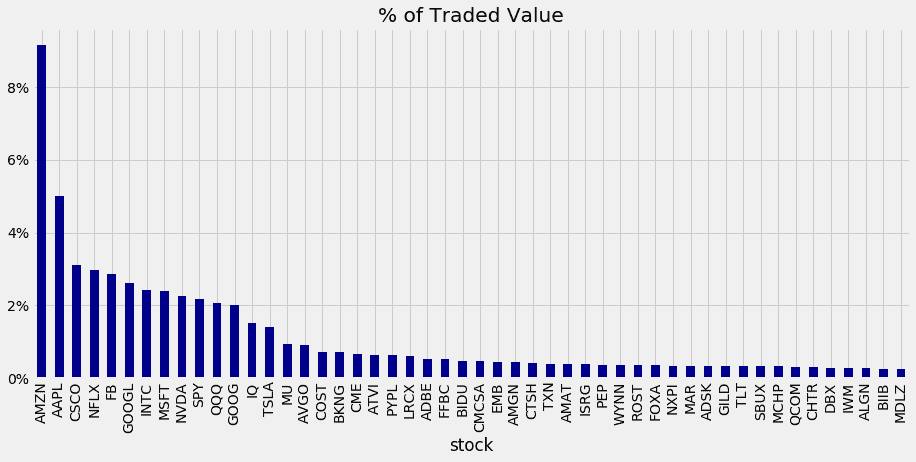
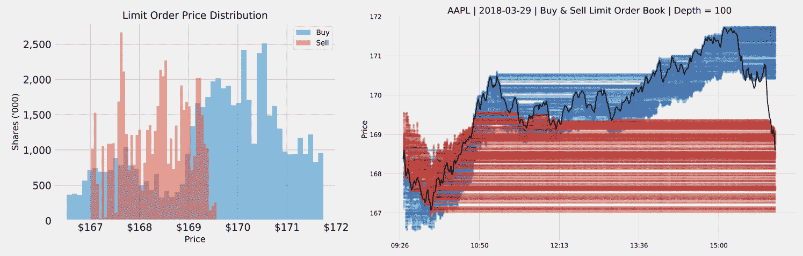
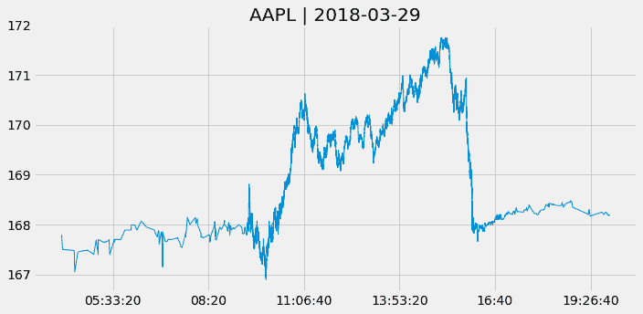
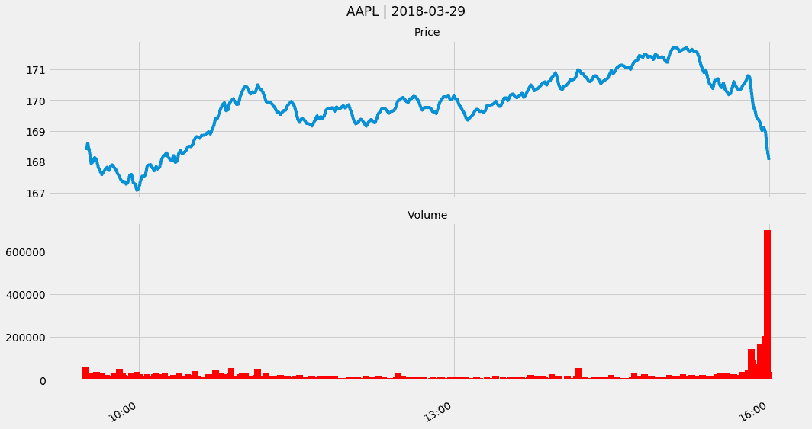
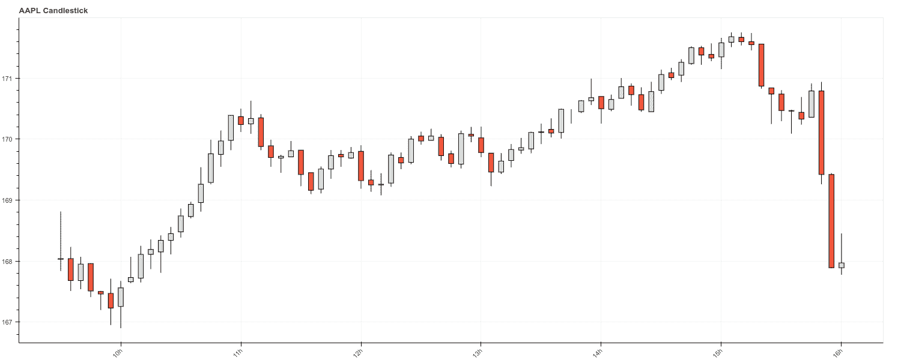
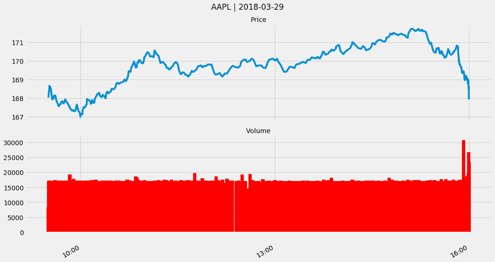
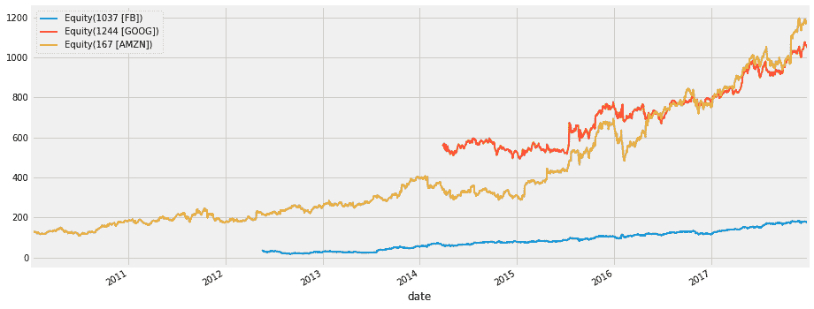
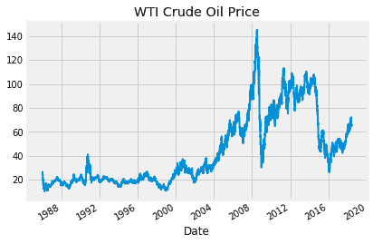
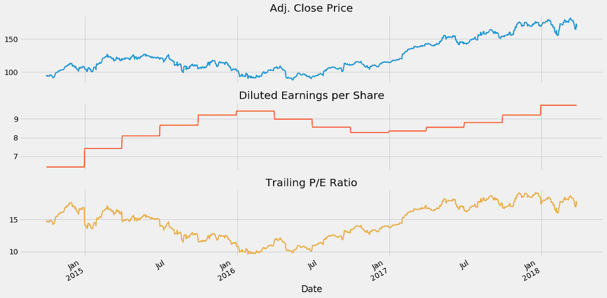
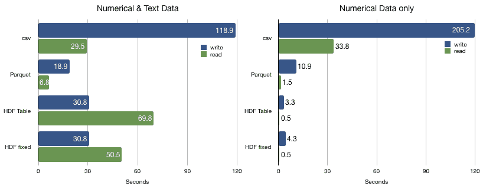

# 第二章：市场和基本数据

数据一直是交易的重要驱动因素，交易员长期以来一直在努力通过获取优越信息来获取优势。这些努力至少可以追溯到有关罗斯柴尔德家族利用鸽子跨越海峡携带的关于滑铁卢战役英军胜利的提前消息进行债券购买的传闻。

如今，对更快数据访问的投资采取了由领先的**高频交易**（**HFT**）公司组成的 Go West 联盟的形式，该联盟将**芝加哥商品交易所**（**CME**）与东京连接起来。在 CME 和纽约 BATS 交易所之间的往返延迟已降至接近理论极限的 8 毫秒，因为交易员竞相利用套利机会。

传统上，投资策略主要依赖于公开可用的数据，有限地努力创建或获取私有数据集。在股票的情况下，基本策略使用基于报告的财务数据构建的金融模型，可能结合行业或宏观数据。由技术分析驱动的策略从市场数据中提取信号，例如价格和成交量。

**机器学习**（**ML**）算法可以更有效地利用市场和基本数据，特别是当与替代数据结合使用时，这是下一章的主题。我们将在后续章节中介绍几种侧重于市场和基本数据的技术，例如经典和现代时间序列技术，包括**循环神经网络**（**RNNs**）。

本章介绍市场和基本数据源以及它们被创建的环境。熟悉各种订单类型和交易基础设施很重要，因为它们影响交易策略的回测模拟。我们还说明了如何使用 Python 访问和处理交易和财务报表数据。

特别是，本章将涵盖以下主题：

+   市场微观结构如何塑造市场数据

+   如何利用 Nasdaq ITCH 从 tick 数据重建订单簿

+   如何使用各种类型的条形图总结 tick 数据

+   如何处理**可扩展业务报告语言**（**XBRL**）编码的电子申报

+   如何解析和结合市场和基本数据以创建 P/E 序列

+   如何使用 Python 访问各种市场和基本数据源

# 如何处理市场数据

市场数据是在众多市场交易中买卖订单的提交和处理过程中产生的。这些数据反映了交易场所的机构环境，包括管理订单、交易执行和价格形成的规则和法规。

算法交易员使用机器学习算法分析买卖订单的流动以及由此产生的成交量和价格统计数据，提取能捕捉到例如需求-供给动态或某些市场参与者行为的交易信号或特征。

我们将首先审查影响在回测期间模拟交易策略的机构特征。然后，我们将介绍如何从订单簿来源重建 Tick 数据。接下来，我们将重点介绍几种规范化 Tick 数据的方法，并旨在最大化信息内容。最后，我们将说明如何访问各种市场数据提供商接口，并突出几个提供商。

# 市场微观结构

市场微观结构是金融经济学的一个分支，它研究交易过程以及相关市场的组织。机构细节在不同资产类别及其衍生品、交易场所和地理位置上相当复杂和多样化。在我们深入研究交易产生的数据之前，我们将对关键概念进行简要概述。GitHub 上的参考链接指向了几个对这一主题进行了详细处理的来源。

# 市场场所

金融工具的交易发生在有组织的、主要是电子交易所和场外市场上。交易所是买方和卖方相遇的中央市场，在这里买方竞相出价，而卖方竞相报出最低的报价。

在美国和国外有许多交易所和替代交易场所。以下表格列出了一些较大的全球交易所以及截至 2018 年 03 月各种资产类别（包括衍生品）的 12 个月交易量。通常，少数金融工具占据了大部分交易量：

|  | **股票** |
| --- | --- |
| **交易所** | **市值（美元百万）** | **上市公司数量** | **每日成交量（美元百万）** | **每日股票交易量（'000）** | **每日期权交易量（'000）** |
| 纽约证券交易所 | 23,138,626 | 2,294 | 78,410 | 6,122 | 1,546 |  |
| 纳斯达克-美国 | 10,375,718 | 2,968 | 65,026 | 7,131 | 2,609 |  |
| 日本交易所集团 | 6,287,739 | 3,618 | 28,397 | 3,361 | 1 |  |
| 上海证券交易所 | 5,022,691 | 1,421 | 34,736 | 9,801 |  |  |
| 欧洲交易所 | 4,649,073 | 1,240 | 9,410 | 836 | 304 |  |
| 香港交易及结算所 | 4,443,082 | 2,186 | 12,031 | 1,174 | 516 |  |
| 伦敦证券交易所集团 | 3,986,413 | 2,622 | 10,398 | 1,011 |  |  |
| 深圳证券交易所 | 3,547,312 | 2,110 | 40,244 | 14,443 |  |  |
| 德国交易所 | 2,339,092 | 506 | 7,825 | 475 |  |  |
| 印度孟买证券交易所有限公司 | 2,298,179 | 5,439 | 602 | 1,105 |  |  |
| 印度国家证券交易所有限公司 | 2,273,286 | 1,952 | 5,092 | 10,355 |  |  |
| BATS 全球市场 - 美国 |  |  |  |  | 1,243 |  |
| 芝加哥期权交易所 |  |  |  |  | 1,811 |  |
| 国际证券交易所 |  |  |  |  | 1,204 |  |

交易所可能依赖双边交易或以订单为驱动的系统，根据某些规则匹配买入和卖出订单。价格形成可能通过拍卖进行，例如在纽约证券交易所（NYSE）中，最高出价和最低报价被匹配，或通过买家从卖家购买然后卖给买家的交易商进行。

许多交易所使用提供流动性的中间人，即通过在某些证券中做市来进行交易的能力。例如，纽约证券交易所通常有一个指定的市场主持人，他确保每个证券的交易有序进行，而**全国证券交易商自动报价系统**（**Nasdaq**）有几个。中间人可以充当作为自己代理人交易的交易商，也可以充当作为他人代理人交易的经纪人。

交易所过去是成员所有的，但随着市场改革的加剧，它们经常转为公司所有。纽约证券交易所可以追溯到 1792 年，而纳斯达克于 1971 年开始，是世界上第一个电子股票交易市场，并接管了大多数曾在场外交易的股票交易。仅在美国股票市场，交易分散在 13 个交易所和 40 多个另类交易场所，每个都向综合带报告交易，但延迟不同。

# 订单类型

交易员可以提交各种类型的买入或卖出订单。一些订单保证立即执行，而另一些可能规定价格阈值或其他触发执行的条件。订单通常仅在同一交易日有效，除非另有规定。

市场订单保证在到达交易场所时立即执行订单，以那一刻的价格为准。相比之下，限价订单仅在市场价格高于（低于）卖出（买入）限价订单的限价时执行。转而停止订单仅在市场价格上升到（下跌到）买入（卖出）停止订单的指定价格时才变为活动状态。购买停止订单可用于限制空头交易的损失。停止订单也可能有限制。

订单可能附加有许多其他条件——全或无订单防止部分执行，仅在指定数量的股票可用时才会被填充，并且可以在当天或更长时间内有效。它们需要特殊处理，对市场参与者不可见。立即成交或取消订单也防止部分执行，但如果未立即执行则取消。立即取消订单立即买入或卖出可用的股票数量并取消剩余部分。不持有订单允许经纪人决定执行的时间和价格。最后，市场开盘/收盘订单在市场开盘或收盘时或附近执行。允许部分执行。

# 处理订单簿数据

市场数据的主要来源是订单簿，它在整天实时不断更新以反映所有交易活动。 交易所通常将此数据作为实时服务提供，并可能免费提供一些历史数据。

交易活动体现在市场参与者发送的大量有关交易订单的消息中。 这些消息通常符合用于实时交换证券交易和市场数据的电子**金融信息交换**（**FIX**）通信协议或本地交换协议的语法。

# FIX 协议

就像 SWIFT 是后台（例如，用于交易结算）消息传递的消息协议一样，FIX 协议是交易执行之前和之间的默认消息标准，在交易所、银行、经纪商、结算公司和其他市场参与者之间的通信中。 富达投资和所罗门兄弟公司于 1992 年引入了 FIX，以促进经纪商和机构客户之间的电子通信，当时他们通过电话交换信息。

它在全球股票市场上变得流行，然后扩展到外汇、固定收益和衍生品市场，进一步扩展到后交易以支持直通处理。 交易所提供对 FIX 消息的访问作为实时数据提要，由算法交易员解析以跟踪市场活动，并且例如识别市场参与者的踪迹并预测其下一步行动。

消息序列允许重建订单簿。 跨多个交易所的交易规模产生了大量（~10 TB）难以处理的非结构化数据，因此可以成为竞争优势的来源。

FIX 协议目前版本为 5.0，是一个具有庞大相关行业专业人士社区的免费开放标准。 它像更近期的 XML 一样是自描述的，FIX 会话由底层的**传输控制协议**（**TCP**）层支持。 社区不断添加新功能。

该协议支持管道分隔的键值对，以及基于标签的 FIXML 语法。 请求服务器登录的示例消息如下所示：

```py
8=FIX.5.0|9=127|35=A|59=theBroker.123456|56=CSERVER|34=1|32=20180117- 08:03:04|57=TRADE|50=any_string|98=2|108=34|141=Y|553=12345|554=passw0rd!|10=131|
```

有一些用于制定和解析 FIX 消息的 Python 开源 FIX 实现可以使用。 交互经纪商提供了用于自动交易的基于 FIX 的**计算机对计算机接口**（**CTCI**）（请参见 GitHub 存储库中本章的资源部分）。

# 纳斯达克 TotalView-ITCH 订单簿数据

虽然 FIX 具有主导的大市场份额，但交易所也提供本地协议。 纳斯达克提供了一种 TotalView ITCH 直接数据提要协议，允许订阅者跟踪股票工具的单个订单，从下单到执行或取消。

因此，它允许重建订单簿，跟踪特定证券或金融工具的活跃限价买入和卖出订单列表。订单簿通过列出每个价格点上投标或报价的股份数量来显示全天市场深度。它还可能识别特定买入和卖出订单的市场参与者，除非它是匿名下达的。市场深度是流动性的关键指标，以及大额市场订单的潜在价格影响。

除了匹配市价和限价订单，纳斯达克还进行市场开盘和闭市时执行大量交易的拍卖或交叉交易。随着被动投资继续增长，交叉交易变得越来越重要，交易员寻找执行更大块的股票的机会。TotalView 还发布了纳斯达克开市和闭市以及纳斯达克 IPO/停牌交叉交易的**净订单失衡指示器**（NOII）。

# 解析二进制 ITCH 消息

ITCH v5.0 规范声明了与系统事件、股票特征、限价订单的下达和修改以及交易执行相关的 20 多种消息类型。它还包含有关开市和闭市前净订单失衡的信息。

纳斯达克提供了数月的每日二进制文件样本。本章的 GitHub 存储库包含一个名为 `build_order_book.ipynb` 的笔记本，演示了如何解析 ITCH 消息的示例文件，并重建任何给定 tick 的执行交易和订单簿。

以下表格显示了样本文件日期为 2018 年 3 月 29 日时最常见消息类型的频率：

| **消息类型** | **订单簿影响** | **消息数量** |
| --- | --- | --- |
| `A` | 新的未归属限价订单 | 136,522,761 |
| `D` | 订单取消 | 133,811,007 |
| `U` | 订单取消并替换 | 21,941,015 |
| `E` | 完全或部分执行；可能有多条针对同一原始订单的消息 | 6,687,379 |
| `X` | 部分取消后修改 | 5,088,959 |
| `F` | 添加归属订单 | 2,718,602 |
| `P` | 交易消息（非交叉） | 1,120,861 |
| `C` | 在不同于初始显示价格的价格上全部或部分执行 | 157,442 |
| `Q` | 交叉交易消息 | 17,233 |

对于每条消息，规范列出了组件及其相应的长度和数据类型：

| **名称** | **偏移量** | **长度** | **值** | **注释** |
| --- | --- | --- | --- | --- |
| 消息类型 | 0 | 1 | F | 添加订单 MPID 归属消息 |
| 股票定位 | 1 | 2 | 整数 | 标识证券的定位代码 |
| 跟踪编号 | 3 | 2 | 整数 | 纳斯达克内部跟踪编号 |
| 时间戳 | 5 | 6 | 整数 | 自午夜以来的纳秒数 |
| 订单参考编号 | 11 | 8 | 整数 | 新订单的唯一参考编号 |
| 买卖指示符  | 19 | 1 | 字母 | 订单类型：B = 买入订单，S = 卖出订单 |
| 股票 | 20 | 4 | 整数 | 添加到订单簿的订单股票数量 |
| 股票 | 24 | 8 | Alpha | 股票符号，右侧填充空格 |
| 价格 | 32 | 4 | 价格（4） | 新订单的显示价格 |
| 归属 | 36 | 4 | Alpha | 与订单相关联的纳斯达克市场参与者标识符 |

Python 提供了 `struct` 模块，通过格式字符串来解析二进制数据，该格式字符串通过指定字节字符串的各个组件的长度和类型来标识消息元素，按照规范中的排列方式。

让我们逐步解析交易消息并重建订单簿的关键步骤：

1.  ITCH 解析器依赖于作为`.csv`文件提供的消息规范（由`create_message_spec.py`创建），并根据`formats`字典组装格式字符串：

```py
formats = {
    ('integer', 2): 'H',  # int of length 2 => format string 'H'
    ('integer', 4): 'I',
    ('integer', 6): '6s', # int of length 6 => parse as string, 
      convert later
    ('integer', 8): 'Q',
    ('alpha', 1)  : 's',
    ('alpha', 2)  : '2s',
    ('alpha', 4)  : '4s',
    ('alpha', 8)  : '8s',
    ('price_4', 4): 'I',
    ('price_8', 8): 'Q',
}
```

1.  解析器将消息规范转换为格式字符串和捕获消息内容的`namedtuples`：

```py
# Get ITCH specs and create formatting (type, length) tuples
specs = pd.read_csv('message_types.csv')
specs['formats'] = specs[['value', 'length']].apply(tuple, 
                           axis=1).map(formats)

# Formatting for alpha fields
alpha_fields = specs[specs.value == 'alpha'].set_index('name')
alpha_msgs = alpha_fields.groupby('message_type')
alpha_formats = {k: v.to_dict() for k, v in alpha_msgs.formats}
alpha_length = {k: v.add(5).to_dict() for k, v in alpha_msgs.length}

# Generate message classes as named tuples and format strings
message_fields, fstring = {}, {}
for t, message in specs.groupby('message_type'):
    message_fields[t] = namedtuple(typename=t, field_names=message.name.tolist())
    fstring[t] = '>' + ''.join(message.formats.tolist())
```

1.  `alpha` 类型的字段需要按照`format_alpha`函数中定义的进行后处理：

```py
def format_alpha(mtype, data):
    for col in alpha_formats.get(mtype).keys():
        if mtype != 'R' and col == 'stock': # stock name only in 
                                              summary message 'R'
            data = data.drop(col, axis=1)
            continue
        data.loc[:, col] = data.loc[:, col].str.decode("utf-
                                    8").str.strip()
        if encoding.get(col):
            data.loc[:, col] = data.loc[:, 
                     col].map(encoding.get(col)) # int encoding
    return data
```

1.  单日的二进制文件包含超过 3 亿条消息，总计超过 9 GB。该脚本会将解析的结果迭代地附加到以快速的 `HDF5` 格式存储的文件中，以避免内存限制（有关此格式的更多信息，请参阅本章的最后一节）。以下（简化的）代码处理二进制文件，并生成按消息类型存储的解析订单：

```py
with (data_path / file_name).open('rb') as data:
    while True:
        message_size = int.from_bytes(data.read(2), byteorder='big', 
                       signed=False)
        message_type = data.read(1).decode('ascii')
        message_type_counter.update([message_type])
        record = data.read(message_size - 1)
        message = message_fields[message_type]._make(unpack(fstring[message_type],  
                                   record))
        messages[message_type].append(message)

        # deal with system events like market open/close
        if message_type == 'S':
            timestamp = int.from_bytes(message.timestamp, 
                                       byteorder='big')
            if message.event_code.decode('ascii') == 'C': # close
                store_messages(messages)
                break
```

1.  预料之中，这一天交易的 8500 多只股票中的一小部分占了大部分交易：

```py
with pd.HDFStore(hdf_store) as store:
    stocks = store['R'].loc[:, ['stock_locate', 'stock']]
    trades = store['P'].append(store['Q'].rename(columns=
                        {'cross_price': 'price'}).merge(stocks)
trades['value'] = trades.shares.mul(trades.price)
trades['value_share'] = trades.value.div(trades.value.sum())
trade_summary = 
    trades.groupby('stock').value_share.sum().sort_values
                            (ascending=False)
trade_summary.iloc[:50].plot.bar(figsize=(14, 6), color='darkblue', 
                                 title='% of Traded Value')
plt.gca().yaxis.set_major_formatter(FuncFormatter(lambda y, _: 
                                    '{:.0%}'.format(y)))
```

我们得到了以下图形的绘制：



# 重建交易和订单簿

解析的消息允许我们重建给定日期的订单流。`'R'` 消息类型包含在给定日期内交易的所有股票列表，包括有关**首次公开募股**（**IPOs**）和交易限制的信息。

在一天的交易过程中，会添加新订单，并删除执行和取消的订单。对于引用前一日期放置的订单的消息，进行适当的会计处理需要跟踪多天的订单簿，但我们在此忽略了此方面的内容。

`get_messages()` 函数说明了如何收集影响交易的单一股票的订单（有关每个消息的详细信息，请参阅 ITCH 规范，略有简化，请参阅笔记本）：

```py
def get_messages(date, stock=stock):
    """Collect trading messages for given stock"""
    with pd.HDFStore(itch_store) as store:
        stock_locate = store.select('R', where='stock = 
                                     stock').stock_locate.iloc[0]
        target = 'stock_locate = stock_locate'

        data = {}
        # relevant message types
        messages = ['A', 'F', 'E', 'C', 'X', 'D', 'U', 'P', 'Q']
        for m in messages:
            data[m] = store.select(m,  
              where=target).drop('stock_locate', axis=1).assign(type=m)

    order_cols = ['order_reference_number', 'buy_sell_indicator', 
                  'shares', 'price']
    orders = pd.concat([data['A'], data['F']], sort=False,  
                        ignore_index=True).loc[:, order_cols]

    for m in messages[2: -3]:
        data[m] = data[m].merge(orders, how='left')

    data['U'] = data['U'].merge(orders, how='left',
                                right_on='order_reference_number',
                                left_on='original_order_reference_number',
                                suffixes=['', '_replaced'])

    data['Q'].rename(columns={'cross_price': 'price'}, inplace=True)
    data['X']['shares'] = data['X']['cancelled_shares']
    data['X'] = data['X'].dropna(subset=['price'])

    data = pd.concat([data[m] for m in messages], ignore_index=True, 
                      sort=False)
```

重建成功的交易，即作为与被取消的订单相对的订单的交易相关消息，`C`、`E`、`P` 和 `Q`，相对比较简单：

```py
def get_trades(m):
    """Combine C, E, P and Q messages into trading records"""
    trade_dict = {'executed_shares': 'shares', 'execution_price': 
                  'price'}
    cols = ['timestamp', 'executed_shares']
    trades = pd.concat([m.loc[m.type == 'E', cols + 
             ['price']].rename(columns=trade_dict),
             m.loc[m.type == 'C', cols + 
             ['execution_price']].rename(columns=trade_dict),
             m.loc[m.type == 'P', ['timestamp', 'price', 'shares']],
             m.loc[m.type == 'Q', ['timestamp', 'price', 
             'shares']].assign(cross=1),
             ], sort=False).dropna(subset=['price']).fillna(0)
    return trades.set_index('timestamp').sort_index().astype(int)
```

订单簿跟踪限价订单，并且买入和卖出订单的各种价格水平构成了订单簿的深度。要重建给定深度级别的订单簿，需要以下步骤：

1.  `add_orders()` 函数累积卖单按升序排列，买单按降序排列，以给定时间戳为基础直至达到所需的深度级别：

```py
def add_orders(orders, buysell, nlevels):
    new_order = []
    items = sorted(orders.copy().items())
    if buysell == -1:
        items = reversed(items)  
    for i, (p, s) in enumerate(items, 1):
        new_order.append((p, s))
        if i == nlevels:
            break
    return orders, new_order
```

1.  我们遍历所有 ITCH 消息，并根据规范要求处理订单及其替换：

```py
for message in messages.itertuples():
    i = message[0]
    if np.isnan(message.buy_sell_indicator):
        continue
    message_counter.update(message.type)

    buysell = message.buy_sell_indicator
    price, shares = None, None

    if message.type in ['A', 'F', 'U']:
        price, shares = int(message.price), int(message.shares)

        current_orders[buysell].update({price: shares})
        current_orders[buysell], new_order = 
          add_orders(current_orders[buysell], buysell, nlevels)
        order_book[buysell][message.timestamp] = new_order

    if message.type in ['E', 'C', 'X', 'D', 'U']:
        if message.type == 'U':
            if not np.isnan(message.shares_replaced):
                price = int(message.price_replaced)
                shares = -int(message.shares_replaced)
        else:
            if not np.isnan(message.price):
                price = int(message.price)
                shares = -int(message.shares)

        if price is not None:
            current_orders[buysell].update({price: shares})
            if current_orders[buysell][price] <= 0:
                current_orders[buysell].pop(price)
            current_orders[buysell], new_order = 
              add_orders(current_orders[buysell], buysell, nlevels)
            order_book[buysell][message.timestamp] = new_order

```

不同价格水平上的订单数量，在以下截图中使用不同强度的颜色突出显示买入和卖出订单的深度流动性。左侧面板显示了限价订单价格分布偏向于更高价格的买单。右侧面板绘制了交易日内限价订单和价格的演变：深色线跟踪了市场交易小时内的执行交易价格，而红色和蓝色点表示每分钟的限价订单（详见笔记本）：



# 规范化 tick 数据

交易数据按纳秒索引，噪音很大。例如，出现买卖市价订单交替引发的买卖跳动，导致价格在买入和卖出价格之间波动。为了提高噪声-信号比并改善统计性能，我们需要重新采样和规范化 tick 数据，通过聚合交易活动来实现。

通常，我们收集聚合期间的开盘（第一个）、最低、最高和收盘（最后）价格，以及**成交量加权平均价格**（**VWAP**）、交易的股数和与数据相关的时间戳。

在此章节的 GitHub 文件夹中查看名为`normalize_tick_data.ipynb`的笔记本，以获取额外的细节。

# Tick 柱状图

`AAPL`的原始 tick 价格和成交量数据的图表如下：

```py
stock, date = 'AAPL', '20180329'
title = '{} | {}'.format(stock, pd.to_datetime(date).date()

with pd.HDFStore(itch_store) as store:
    s = store['S'].set_index('event_code') # system events
    s.timestamp = s.timestamp.add(pd.to_datetime(date)).dt.time
    market_open = s.loc['Q', 'timestamp'] 
    market_close = s.loc['M', 'timestamp']

with pd.HDFStore(stock_store) as store:
    trades = store['{}/trades'.format(stock)].reset_index()
trades = trades[trades.cross == 0] # excluding data from open/close crossings
trades.price = trades.price.mul(1e-4)

trades.price = trades.price.mul(1e-4) # format price
trades = trades[trades.cross == 0]    # exclude crossing trades
trades = trades.between_time(market_open, market_close) # market hours only

tick_bars = trades.set_index('timestamp')
tick_bars.index = tick_bars.index.time
tick_bars.price.plot(figsize=(10, 5), title=title), lw=1)
```

我们得到了前述代码的下列图表：



由于`scipy.stats.normaltest`的 p 值较低，可以看出 tick 返回远非正态分布：

```py
from scipy.stats import normaltest
normaltest(tick_bars.price.pct_change().dropna())

NormaltestResult(statistic=62408.76562431228, pvalue=0.0)
```

# 时间柱状图

时间柱状图涉及按周期聚合交易：

```py
def get_bar_stats(agg_trades):
    vwap = agg_trades.apply(lambda x: np.average(x.price, 
           weights=x.shares)).to_frame('vwap')
    ohlc = agg_trades.price.ohlc()
    vol = agg_trades.shares.sum().to_frame('vol')
    txn = agg_trades.shares.size().to_frame('txn')
    return pd.concat([ohlc, vwap, vol, txn], axis=1)

resampled = trades.resample('1Min')
time_bars = get_bar_stats(resampled)
```

我们可以将结果显示为价格-成交量图：

```py
def price_volume(df, price='vwap', vol='vol', suptitle=title):
    fig, axes = plt.subplots(nrows=2, sharex=True, figsize=(15, 8))
    axes[0].plot(df.index, df[price])
    axes[1].bar(df.index, df[vol], width=1 / (len(df.index)), 
                color='r')

    xfmt = mpl.dates.DateFormatter('%H:%M')
    axes[1].xaxis.set_major_locator(mpl.dates.HourLocator(interval=3))
    axes[1].xaxis.set_major_formatter(xfmt)
    axes[1].get_xaxis().set_tick_params(which='major', pad=25)
    axes[0].set_title('Price', fontsize=14)
    axes[1].set_title('Volume', fontsize=14)
    fig.autofmt_xdate()
    fig.suptitle(suptitle)
    fig.tight_layout()
    plt.subplots_adjust(top=0.9)

price_volume(time_bars)
```

我们得到了前述代码的下列图表：



或者使用`bokeh`绘图库绘制蜡烛图：

```py
resampled = trades.resample('5Min') # 5 Min bars for better print
df = get_bar_stats(resampled)

increase = df.close > df.open
decrease = df.open > df.close
w = 2.5 * 60 * 1000 # 2.5 min in ms

WIDGETS = "pan, wheel_zoom, box_zoom, reset, save"

p = figure(x_axis_type='datetime', tools=WIDGETS, plot_width=1500, title = "AAPL Candlestick")
p.xaxis.major_label_orientation = pi/4
p.grid.grid_line_alpha=0.4

p.segment(df.index, df.high, df.index, df.low, color="black")
p.vbar(df.index[increase], w, df.open[increase], df.close[increase], fill_color="#D5E1DD", line_color="black")
p.vbar(df.index[decrease], w, df.open[decrease], df.close[decrease], fill_color="#F2583E", line_color="black")
show(p)

```

请看以下截图：



绘制 AAPL 蜡烛图

# 成交量柱状图

时间柱状图平滑了原始 tick 数据中的一些噪音，但可能未能解决订单碎片化的问题。以执行为中心的算法交易可能旨在在给定期间内匹配**成交量加权平均价格**（**VWAP**），并将单个订单分成多个交易，并根据历史模式下订单。时间柱状图会对相同的订单进行不同处理，即使市场没有新的信息到达。

成交量柱状图提供了一种根据成交量聚合交易数据的替代方法。我们可以按以下方式实现：

```py
trades_per_min = trades.shares.sum()/(60*7.5) # min per trading day
trades['cumul_vol'] = trades.shares.cumsum()
df = trades.reset_index()
by_vol = 
   df.groupby(df.cumul_vol.div(trades_per_min).round().astype(int))
vol_bars = pd.concat([by_vol.timestamp.last().to_frame('timestamp'), 
                      get_bar_stats(by_vol)], axis=1)
price_volume(vol_bars.set_index('timestamp'))
```

我们得到了前述代码的下列图表：



# 美元柱状图

当资产价格发生显着变化或股票拆分后，给定数量股票的价值也会发生变化。 Volume bars 不会正确反映这一点，并且可能妨碍对反映这些变化的不同期间的交易行为进行比较。 在这些情况下，应调整 volume bar 方法，以利用股票和价格的乘积来生成美元 bars。

# 市场数据的 API 访问

有几种选项可以使用 Python 通过 API 访问市场数据。 我们首先介绍了内置于 `pandas` 库中的几个数据源。 然后，我们简要介绍了交易平台 Quantopian，数据提供商 Quandl 以及本书稍后将使用的回测库，并列出了访问各种类型市场数据的几种其他选项。 在 GitHub 上的文件夹目录 `data_providers` 包含了几个示例笔记本，演示了这些选项的使用方法。

# 使用 pandas 进行远程数据访问

`pandas` 库使用 **`read_html`** 函数访问网站上显示的数据，并通过相关的 `pandas-datareader` 库访问各种数据提供商的 API 端点。

# 阅读 HTML 表格

下载一个或多个 `html` 表格的内容的方法如下，例如从 Wikipedia 获取 `S&P500` 指数的成分：

```py
sp_url = 'https://en.wikipedia.org/wiki/List_of_S%26P_500_companies'
sp = pd.read_html(sp_url, header=0)[0] # returns a list for each table
sp.info()

RangeIndex: 505 entries, 0 to 504
Data columns (total 9 columns):
Ticker symbol             505 non-null object
Security                  505 non-null object
SEC filings               505 non-null object
GICS Sector               505 non-null object
GICS Sub Industry         505 non-null object
Location                  505 non-null object
Date first added[3][4]    398 non-null object
CIK                       505 non-null int64
Founded                   139 non-null object
```

# 用于市场数据的 pandas-datareader

`pandas` 曾用于直接便捷访问数据提供商的 API，但该功能已迁移到相关的 `pandas-datareader` 库。 API 的稳定性因提供商政策而异，在 2018 年 6 月的版本 0.7 中，以下数据源可用：

| **来源** | **范围** | **注释** |
| --- | --- | --- |
| Yahoo! Finance | 股票和外汇对的 EOD 价格、分红、拆分数据 | 不稳定 |
| Tiingo | 股票、共同基金和交易所交易基金的 EOD 价格 | 需要免费注册 |
| **投资者交易所**（**IEX**） | 历史股票价格，订单簿数据 | 限制为五年 |
| Robinhood | EOD 股票价格 | 限制为一年 |
| Quandl | 各种资产价格的市场 | 高级数据需要订阅 |
| 纳斯达克 | 最新在纳斯达克交易的股票代码以及一些额外信息 |  |
| Stooq | 一些股票市场指数数据 |  |
| MOEX | 莫斯科证券交易所数据 |  |
| Alpha Vantage | EOD 股票价格和外汇对 |  |
| Fama/French | 来自 FF 数据库的因子收益和研究组合 |  |

访问和检索数据的方式对所有数据源都是相似的，如 Yahoo! Finance 所示：

```py
import pandas_datareader.data as web
from datetime import datetime

start = '2014'              # accepts strings
end = datetime(2017, 5, 24) # or datetime objects

yahoo= web.DataReader('FB', 'yahoo', start=start, end=end)
yahoo.info()

DatetimeIndex: 856 entries, 2014-01-02 to 2017-05-25
Data columns (total 6 columns):
High         856 non-null float64
Low          856 non-null float64
Open         856 non-null float64
Close        856 non-null float64
Volume       856 non-null int64
Adj Close    856 non-null float64

dtypes: float64(5), int64(1)
```

# 投资者交易所

IEX 是作为对高频交易争议的回应而启动的另一种交易所，出现在迈克尔·刘易斯有争议的《闪 Boys》中。 它旨在减缓交易速度，创造一个更公平的竞争环境，并自 2016 年推出以来一直在迅速增长，但在 2018 年 6 月仍然很小，市场份额约为 2.5％。

除了历史结束日价格和成交量数据外，IEX 还提供实时的订单簿深度报价，通过价格和方向聚合订单的规模。该服务还包括最后成交价和规模信息：

```py
book = web.get_iex_book('AAPL')
orders = pd.concat([pd.DataFrame(book[side]).assign(side=side) for side in ['bids', 'asks']])
orders.sort_values('timestamp').head()

  price  size timestamp      side
4 140.00  100  1528983003604 bids
3 175.30  100  1528983900163 bids
3 205.80  100  1528983900163 asks
1 187.00  200  1528996876005 bids
2 186.29  100  1528997296755 bids
```

在`datareader.ipynb`笔记本中查看更多示例。

# Quantopian

Quantopian 是一家投资公司，提供一个研究平台来集体开发交易算法。免费注册后，它使会员能够使用各种数据源研究交易想法。它还提供了一个环境，用于对算法进行历史数据的回测，以及使用实时数据进行样本外测试。对于表现最佳的算法，它授予投资额度，其作者有权获得 10%的利润份额（在撰写本文时）。

Quantopian 研究平台包括用于 Alpha 因子研究和绩效分析的 Jupyter Notebook 环境。还有一个用于编写算法策略和使用自 2002 年以来带有分钟柱频率的历史数据回测结果的**交互式开发环境**（**IDE**）。

用户还可以使用实时数据模拟算法，这称为纸上交易。Quantopian 提供各种市场数据集，包括美国股票和期货价格和成交量数据，频率为一分钟，以及美国股票公司基本面数据，并集成了众多替代数据集。

我们将在第四章中更详细地介绍 Quantopian 平台，*Alpha 因子研究*并且在整本书中依赖其功能，所以随时打开一个账户（有关更多详细信息，请参阅 GitHub repo）。

# Zipline

Zipline 是算法交易库，为 Quantopian 回测和实时交易平台提供支持。它也可以离线使用，使用有限数量的免费数据包来开发策略，这些数据包可以被摄取并用于测试交易想法的表现，然后将结果转移到在线 Quantopian 平台进行纸上和实时交易。

以下代码说明了`zipline`允许我们访问一系列公司的每日股票数据。您可以在 Jupyter Notebook 中使用相同名称的魔术函数运行`zipline`脚本。

首先，您需要使用所需的安全符号初始化上下文。我们还将使用一个计数器变量。然后`zipline`调用`handle_data`，在其中我们使用`data.history()`方法回顾一个单一周期，并将上一天的数据附加到`.csv`文件中：

```py
%load_ext zipline
%%zipline --start 2010-1-1 --end 2018-1-1 --data-frequency daily
from zipline.api import order_target, record, symbol

def initialize(context):
 context.i = 0
 context.assets = [symbol('FB'), symbol('GOOG'), symbol('AMZN')]

def handle_data(context, data):
 df = data.history(context.assets, fields=['price', 'volume'], 
                   bar_count=1, frequency="1d")
 df = df.to_frame().reset_index()

 if context.i == 0:
 df.columns = ['date', 'asset', 'price', 'volumne']
 df.to_csv('stock_data.csv', index=False)
 else:
     df.to_csv('stock_data.csv', index=False, mode='a', header=None)
                context.i += 1

df = pd.read_csv('stock_data.csv')
df.date = pd.to_datetime(df.date)
df.set_index('date').groupby('asset').price.plot(lw=2, legend=True, 
       figsize=(14, 6));
```

我们得到了上述代码的下列图表：



我们将在接下来的章节中更详细地探讨`zipline`的功能，特别是在线 Quantopian 平台。

# Quandl

Quandl 提供广泛的数据来源，包括免费和订阅，使用 Python API。注册并获取免费 API 密钥，以进行 50 次以上的调用。Quandl 数据涵盖除股票外的多种资产类别，包括外汇、固定收益、指数、期货和期权以及商品。

API 的使用简单直观，文档完善，灵活性强，除了单个数据系列下载外，还有许多其他方法，例如批量下载或元数据搜索。以下调用获取了自 1986 年以来由美国能源部报价的石油价格：

```py
import quandl
oil = quandl.get('EIA/PET_RWTC_D').squeeze()
oil.plot(lw=2, title='WTI Crude Oil Price')
```

我们通过前述代码得到了这个图表：



# 其他市场数据提供商

各种各样的提供商为各种资产类别提供市场数据。相关类别中的示例包括：

+   交易所从数据服务中获得越来越广泛的收入，通常使用订阅方式。

+   彭博和汤姆森路透一直是领先的数据聚合商，在 285 亿美元的金融数据市场中占有超过 55%的份额。较小的竞争对手，如 FactSet，正在增长，或者新兴的，如 money.net 和 Quandl 以及 Trading Economics 或 Barchart[.](https://www.barchart.com/)

+   专业数据提供商层出不穷。LOBSTER 就是一个例子，它实时聚合纳斯达克订单簿数据。

+   免费数据提供商包括 Alpha Vantage，该公司提供 Python API 用于实时股票、外汇和加密货币市场数据，以及技术指标。

+   提供数据访问的众包投资公司包括 Quantopian 以及于 2018 年 3 月推出的 Alpha Trading Labs，它们提供 HFT 基础设施和数据。

# 如何处理基本数据

基本数据涉及确定证券价值的经济驱动因素。数据的性质取决于资产类别：

+   对于股票和公司信用，它包括公司财务数据以及行业和全球范围的数据。

+   对于政府债券，它包括国际宏观数据和外汇。

+   对于商品，它包括特定资产的供需决定因素，例如作物的天气数据。

我们将重点关注美国的股票基本面，因为数据更容易获取。全球有约 13,000 多家上市公司，每年产生 2 百万页的年度报告和 3 万多小时的收益电话。在算法交易中，基本数据和从这些数据中衍生的特征可能被直接用于推导交易信号，例如作为价值指标，并且是预测模型（包括机器学习模型）的重要输入。

# 财务报表数据

**证券交易委员会**（**SEC**）要求美国发行人，即上市公司和证券，包括共同基金，提交三份季度财务报表（表格 10-Q）和一份年度报告（表格 10-K），以及其他各种监管文件要求。

自 20 世纪 90 年代初，美国证券交易委员会通过其**电子数据收集、分析和检索**（**EDGAR**）系统提供这些报告。它们构成了股权和其他证券基本分析的主要数据来源，例如企业信用，其价值取决于发行者的业务前景和财务状况。

# 自动处理 – XBRL

自从 SEC 引入了 XBRL 以来，对监管提交的自动分析变得更加容易，XBRL 是一种免费、开放和全球标准，用于电子报告的表示和交换。XBRL 基于 XML；它依赖于定义报告元素含义的分类法，并映射到在报告的电子版本中突出显示相应信息的标签。其中一种分类法代表了美国**普遍公认的会计准则**（**GAAP**）。

为了应对会计丑闻，SEC 于 2005 年引入了自愿的 XBRL 提交，之后从 2009 年开始要求所有提交者使用此格式，并继续将强制覆盖范围扩展到其他监管提交。SEC 维护一个网站，列出了塑造不同提交内容的当前分类法，并可用于提取特定项目。

以下数据集提供了从提交给委员会的 EX-101 附件中提取的信息，以扁平化数据格式提供，以帮助用户消化数据进行分析。数据反映了 XBRL 标记的财务报表的选定信息。目前，它包括季度和年度财务报表的数字数据，以及某些额外字段（例如**标准工业分类**（**SIC**））。

有几种途径可跟踪和访问向 SEC 报告的基本数据：

+   作为 EDGAR **公共** **传播服务**（**PDS**）的一部分，接受的提交的电子订阅需要付费。

+   SEC 每 10 分钟更新一次**RSS**订阅，其中列出了结构化披露提交。

+   有用于通过 FTP 检索所有提交的公共索引文件，以进行自动处理。

+   财务报表（和附注）数据集包含了来自所有财务报表和相关附注的解析 XBRL 数据。

SEC 还发布了包含通过 SEC.gov 提交的 EDGAR 提交的互联网搜索流量的日志文件，尽管有六个月的延迟。

# 建立基本数据时间序列

财务报表和附注数据集中的数据范围包括从主要财务报表（资产负债表、利润表、现金流量表、权益变动表和全面收益表）和这些报表的附注中提取的数字数据。该数据最早可追溯至 2009 年。

# 提取财务报表和附注数据集

以下代码下载并提取了给定季度范围内**财务报表和附注**（**FSN**）数据集中包含的所有历史提交（有关更多详细信息，请参阅`edgar_xbrl.ipynb`）：

```py
SEC_URL = 'https://www.sec.gov/files/dera/data/financial-statement-and-notes-data-sets/'

first_year, this_year, this_quarter = 2014, 2018, 3
past_years = range(2014, this_year)
filing_periods = [(y, q) for y in past_years for q in range(1, 5)]
filing_periods.extend([(this_year, q) for q in range(1, this_quarter + 
                                                     1)])
for i, (yr, qtr) in enumerate(filing_periods, 1):
    filing = f'{yr}q{qtr}_notes.zip'
    path = data_path / f'{yr}_{qtr}' / 'source'
    response = requests.get(SEC_URL + filing).content
    with ZipFile(BytesIO(response)) as zip_file:
        for file in zip_file.namelist():
            local_file = path / file
            with local_file.open('wb') as output:
                for line in zip_file.open(file).readlines():
                    output.write(line)
```

数据相当庞大，为了实现比原始文本文件更快的访问，最好将文本文件转换为二进制、列式 parquet 格式（请参见本章中关于与 pandas `DataFrames`兼容的各种数据存储选项的性能比较的*使用 pandas 进行高效数据存储*一节）：

```py
for f in data_path.glob('**/*.tsv'):
    file_name = f.stem  + '.parquet'
    path = Path(f.parents[1]) / 'parquet'
    df = pd.read_csv(f, sep='\t', encoding='latin1', low_memory=False)
    df.to_parquet(path / file_name)
```

对于每个季度，FSN 数据组织成包含有关提交、数字、税项标签、演示等信息的八个文件集。每个数据集由行和字段组成，并以制表符分隔的文本文件形式提供：

| **文件** | **数据集** | **描述** |
| --- | --- | --- |
| `SUB` | 提交 | 根据公司、表格、日期等识别每个 XBRL 提交 |
| `TAG` | 标签 | 定义和解释每个税项标签 |
| `DIM` | 尺寸 | 对数字和纯文本数据进行详细描述 |
| `NUM` | 数字 | 每个备案中每个不同数据点的一行 |
| `TXT` | 纯文本 | 包含所有非数字 XBRL 字段 |
| `REN` | 渲染 | 在 SEC 网站上呈现的信息 |
| `PRE` | 展示 | 主要报表中标签和数字展示的详细信息 |
| `CAL` | 计算 | 显示标签之间的算术关系 |

# 检索所有季度苹果备案

提交数据集包含检索备案所需的唯一标识符：**中央索引键**（**CIK**）和接入号（`adsh`）。以下显示了有关苹果 2018Q1 10-Q 备案的一些信息：

```py
apple = sub[sub.name == 'APPLE INC'].T.dropna().squeeze()
key_cols = ['name', 'adsh', 'cik', 'name', 'sic', 'countryba',  
            'stprba', 'cityba', 'zipba', 'bas1', 'form', 'period', 
            'fy', 'fp', 'filed']
apple.loc[key_cols]

name                    APPLE INC
adsh                    0000320193-18-000070
cik                     320193
name                    APPLE INC
sic                     3571
countryba               US
stprba                  CA
cityba                  CUPERTINO
zipba                   95014
bas1                    ONE APPLE PARK WAY
form                    10-Q
period                  20180331
fy                      2018
fp                      Q2
filed                   20180502
```

使用中央索引键，我们可以识别出适用于`Apple`的所有历史季度备案，并将此信息结合起来获得 26 份`10-Q`表格和 9 份年度`10-K`表格：

```py
aapl_subs = pd.DataFrame()
for sub in data_path.glob('**/sub.parquet'):
    sub = pd.read_parquet(sub)
    aapl_sub = sub[(sub.cik.astype(int) == apple.cik) & (sub.form.isin(['10-Q', '10-K']))]
    aapl_subs = pd.concat([aapl_subs, aapl_sub])

aapl_subs.form.value_counts()
10-Q    15
10-K     4
```

有了每个备案的接入号，我们现在可以依靠税项分类来从`NUM`和`TXT`文件中选择适当的 XBRL 标签（在`TAG`文件中列出）以获取感兴趣的数字或文本/脚注数据点。

首先，让我们从 19 份苹果备案中提取所有可用的数字数据：

```py
aapl_nums = pd.DataFrame()
for num in data_path.glob('**/num.parquet'):
    num = pd.read_parquet(num)
    aapl_num = num[num.adsh.isin(aapl_subs.adsh)]
    aapl_nums = pd.concat([aapl_nums, aapl_num])

aapl_nums.ddate = pd.to_datetime(aapl_nums.ddate, format='%Y%m%d')    
aapl_nums.shape
(28281, 16)
```

# 建立一个价格/收益时间序列

总共，九年的备案历史为我们提供了超过 28,000 个数字值。我们可以选择一个有用的字段，例如**每股稀释收益**（**EPS**），将其与市场数据结合起来计算流行的**市盈率**（**P/E**）估值比率。

但是，我们需要考虑到，苹果于 2014 年 6 月 4 日进行了 7:1 的股票分割，并且调整了分割前的每股收益，以使收益可比，如下图所示：

```py
field = 'EarningsPerShareDiluted'
stock_split = 7
split_date = pd.to_datetime('20140604')

# Filter by tag; keep only values measuring 1 quarter
eps = aapl_nums[(aapl_nums.tag == 'EarningsPerShareDiluted')
                & (aapl_nums.qtrs == 1)].drop('tag', axis=1)

# Keep only most recent data point from each filing
eps = eps.groupby('adsh').apply(lambda x: x.nlargest(n=1, columns=['ddate']))

# Adjust earnings prior to stock split downward
eps.loc[eps.ddate < split_date,'value'] = eps.loc[eps.ddate < 
        split_date, 'value'].div(7)
eps = eps[['ddate', 'value']].set_index('ddate').squeeze()
eps = eps.rolling(4, min_periods=4).sum().dropna() # create trailing 
                  12-months eps from quarterly data
```

我们可以使用 Quandl 来获取自 2009 年以来的苹果股价数据：

```py
import pandas_datareader.data as web
symbol = 'AAPL.US'
aapl_stock = web.DataReader(symbol, 'quandl', start=eps.index.min())
aapl_stock = aapl_stock.resample('D').last() # ensure dates align with 
                                               eps data
```

现在我们有了数据来计算整个期间的滚动 12 个月 P/E 比率：

```py
pe = aapl_stock.AdjClose.to_frame('price').join(eps.to_frame('eps'))
pe = pe.fillna(method='ffill').dropna()
pe['P/E Ratio'] = pe.price.div(pe.eps)
axes = pe.plot(subplots=True, figsize=(16,8), legend=False, lw=2);
```

对于前述代码，我们得到了以下的绘图：



# 其他基本数据来源

还有许多其他的基础数据来源。许多可通过早期介绍的`pandas_datareader`模块访问。还有其他数据可以直接从某些组织获得，例如 IMF、世界银行或世界各地的主要国家统计机构（请参阅 GitHub 上的参考文献）。

# pandas_datareader – 宏观和行业数据

`pandas_datareader`库根据上一节市场数据末尾介绍的约定简化了访问。它覆盖了许多全球基础宏观和行业数据源的 API，包括以下内容：

+   **肯尼斯·弗伦奇的数据库**：捕捉规模、价值和动量因素、分解行业的投资组合的市场数据

+   **圣路易斯联邦储备银行（FRED）**：美国经济和金融市场的联邦储备数据

+   **世界银行**：长期、低频经济和社会发展以及人口统计数据库

+   **经济合作与发展组织（OECD）**：类似于 OECD 国家

+   **Enigma**：各种数据集，包括替代来源

+   **Eurostat**：欧盟经济、社会和人口统计数据

# 用 pandas 进行高效的数据存储

在本书中我们将使用许多不同的数据集，值得比较主要格式的效率和性能。特别是，我们比较以下内容：

+   **CSV**: 逗号分隔，标准的纯文本文件格式。

+   **HDF5**：分层数据格式，最初在国家超级计算中心开发，是一种用于数值数据的快速可扩展的存储格式，可以使用`PyTables`库在 pandas 中使用。

+   **Parquet**: 二进制的，列式存储格式，是 Apache Hadoop 生态系统的一部分，提供了高效的数据压缩和编码，并由 Cloudera 和 Twitter 开发。通过由 pandas 的原始作者 Wes McKinney 领导的`pyarrow`库可用于 pandas。

`storage_benchmark.ipynb`笔记本使用一个可配置为包含数值数据、文本数据或两者的测试`DataFrame`来比较上述库的性能。对于`HDF5`库，我们测试`fixed`和`table`格式。`table`格式允许查询并且可以追加。

以下图表说明了具有随机浮点数的 100,000 行和 1000 个随机 10 个字符字符串列或仅有 2,000 个浮点列的 100,000 行的读写性能：

+   对于纯数值数据，HDF5 格式性能最佳，并且表格式与 CSV 共享 1.6 GB 的最小内存占用。固定格式使用了两倍的空间，parquet 格式使用了 2 GB。

+   对于数字和文本数据的混合，`parquet`显着更快，而 HDF5 则利用其相对于 CSV 的读取优势（在两种情况下写入性能都很低）：



该笔记本演示了如何使用`%%timeit`单元格魔法配置、测试和收集时间，并同时演示了使用相关的 pandas 命令来使用这些存储格式所需的用法。

# 总结

本章介绍了构成大多数交易策略骨干的市场和基本数据来源。您了解了访问这些数据的多种方式，以及如何预处理原始信息，以便您可以开始使用我们即将介绍的机器学习技术提取交易信号。

在我们进入交易策略的设计和评估以及使用 ML 模型之前，我们需要涵盖近年来出现的替代数据集，这些数据集对算法交易的 ML 流行程度有着重要推动作用。
