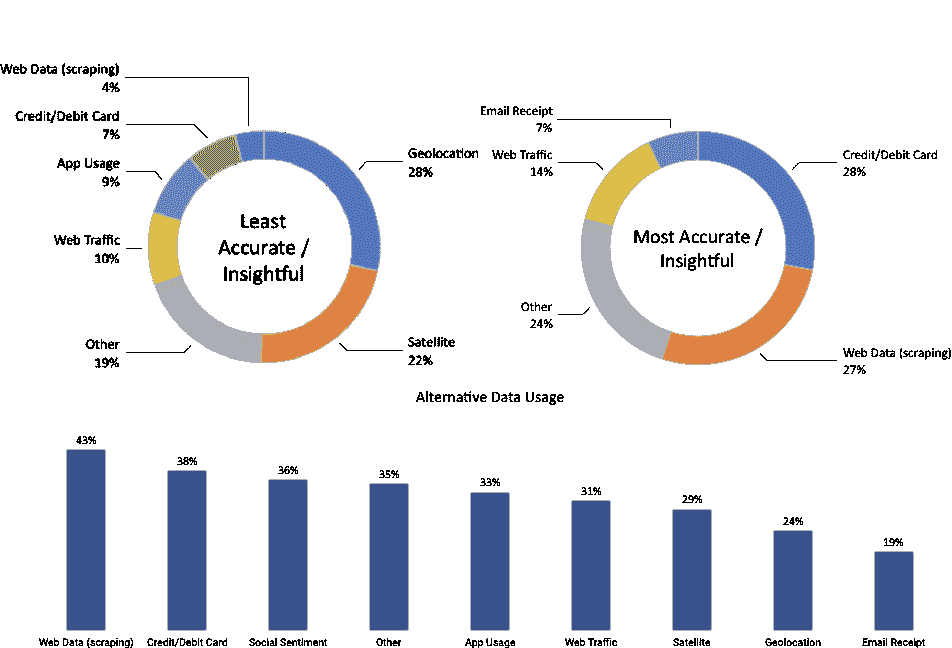

# 第三章：金融领域的替代数据

在互联网和移动网络的爆炸性增长推动下，数字数据在新数据源的处理、存储和分析技术进步的同时呈指数级增长。数字数据的可用性和管理能力的指数级增长，反过来又成为驱动创新的机器学习（ML）在包括投资行业在内的各行业的戏剧性性能提升背后的关键力量。

数据革命的规模是非凡的：仅过去两年就创造了今天世界上所有数据的 90%，到 2020 年，全球 77 亿人口预计每天每秒产生 1.7 MB 的新信息。另一方面，回到 2012 年，仅有 0.5% 的数据被分析和使用，而到 2020 年，有 33% 被认为具有价值。随着全球对分析的投资预计将于 2020 年超过 2100 亿美元，价值创造潜力将倍增，数据的可用性和使用之间的差距可能会迅速缩小。

本章解释了个人、业务流程和传感器如何产生替代数据。它还提供了一个框架，用于为投资目的导航和评估不断增长的替代数据供应。它演示了工作流程，从获取到预处理和使用 Python 存储通过网络抓取获得的数据，为 ML 应用铺平了道路。最后，它通过提供来源、供应商和应用程序的示例来结束。

本章将涵盖以下主题：

+   替代数据革命如何释放新的信息来源

+   个人、业务流程和传感器如何生成替代数据

+   如何评估用于算法交易的不断增长的替代数据供应

+   如何在 Python 中处理替代数据，例如通过抓取互联网

+   替代数据的重要类别和提供商

# 替代数据革命

由数字化、网络化和存储成本的暴跌驱动的数据洪流已经导致可用于预测分析的信息性质发生了深刻的定性变化，通常由五个 V 总结：

+   **容量**：由在线和离线活动、交易、记录和其他来源产生、收集和存储的数据量是数量级更大的副产品，随着分析和存储能力的增长，这些来源和数量也在不断增加。

+   **速度**：数据生成、传输和处理以接近实时的速度变得可用。

+   **多样性**：数据的组织格式不再局限于结构化、表格形式，如 CSV 文件或关系数据库表。相反，新的来源产生半结构化格式，如 JSON 或 HTML，以及非结构化内容，包括原始文本、图像和音频或视频数据，为使数据适用于机器学习算法增加了新的挑战。

+   **真实性**：来源和格式的多样性使得验证数据信息内容的可靠性变得更加困难。

+   **价值**：确定新数据集的价值可能会比以往更加耗时和耗资源，并且更加不确定。

对于算法交易而言，如果新数据来源提供了无法从传统来源获取的信息，或者提供了更早的获取机会，则它们将提供信息优势。随着全球趋势，投资行业正迅速扩展到超越市场和基本数据的替代来源，以通过信息优势实现阿尔法。数据、技术能力和相关人才的年度支出预计将从当前的 30 亿美元以每年 12.8%的速度增加到 2020 年。

如今，投资者可以实时获取宏观或公司特定的数据，而这些数据在历史上只能以更低的频率获得。新数据来源的用例包括以下内容：

+   代表性商品和服务的在线价格数据可用于衡量通货膨胀

+   商店访问或购买次数可以允许对公司或行业特定销售或经济活动进行实时估计

+   卫星图像可以揭示农业产量，或者矿山或石油钻井平台上的活动，而这些信息在其他地方得到之前是不可用的

随着大数据集的标准化和采用的推进，传统数据中包含的信息可能会失去大部分预测价值。

此外，处理和整合多样化数据并应用机器学习的能力允许获得复杂的见解。过去，定量方法依赖于简单的启发式方法来使用历史数据对公司进行排名，例如按照价格/账面价值比进行排名，而机器学习算法则综合新指标，并学习和适应这些规则，考虑到市场数据的演变。这些见解创造了捕捉经典投资主题的新机会，如价值、动量、质量或情绪：

+   **动量**：机器学习可以识别资产暴露于市场价格波动、行业情绪或经济因素

+   **价值**：算法可以分析大量经济和行业特定的结构化和非结构化数据，超越财务报表，以预测公司的内在价值

+   **质量**：集成数据的复杂分析使得能够评估顾客或员工评论、电子商务或应用流量，以确定市场份额或其他基本收益质量驱动因素的增益

然而，在实践中，有用的数据通常不是免费提供的，而是需要进行彻底的评估、昂贵的获取、谨慎的管理和复杂的分析才能提取可交易的信号。

# 替代数据的来源

替代数据由许多来源生成，但可以在高层次上分类为主要由以下来源产生的：

+   在社交媒体上发布帖子、评论产品或使用搜索引擎的**个人**

+   记录商业交易的**企业**，特别是信用卡支付，或作为中间商捕获供应链活动

+   **传感器**，它们除了其他功能外，通过诸如卫星或安全摄像头的图像或通过诸如手机基站的移动模式捕获经济活动

替代数据的性质继续迅速发展，因为新的数据来源变得可用，而以前标记为替代的来源成为主流的一部分。例如，**波罗的海干散货运价指数**（**BDI**），现在通过 Bloomberg 终端可用，汇集了数百家航运公司的数据以近似干散货运输船的供需情况。

替代数据包括原始数据以及已汇总或以某种形式加工以增加价值的数据。例如，一些提供商旨在提取可交易的信号，如情绪分数。我们将在第四章，*Alpha 因子研究*中讨论各种类型的提供商。

替代数据来源在关键方面有所不同，这些方面决定了它们对算法交易策略的价值或信号内容。我们将在下一节关于*评估替代数据集*中讨论这些方面。

# 个人

个人通过在线活动以及离线活动而自动生成电子数据，因为后者被电子捕获并经常与在线身份关联。由个人生成的数据通常是文本、图像或视频格式的非结构化数据，通过多个平台传播，包括：

+   社交媒体帖子，例如在 Twitter、Facebook 或 LinkedIn 等综合性网站上的意见或反应，或在 Glassdoor 或 Yelp 等商业评论网站上

+   在网站上反映对产品的兴趣或感知的电子商务活动，例如 Amazon 或 Wayfair

+   利用诸如 Google 或 Bing 之类的平台的搜索引擎活动

+   移动应用程序的使用情况、下载量和评论

+   个人数据，如消息流量

社交媒体情感分析变得非常流行，因为它可以应用于个别股票、行业篮子或市场指数。最常见的来源是 Twitter，其次是各种新闻供应商和博客网站。由于通常是通过日益商品化的网络抓取获得，供应是竞争性的，价格更低。可靠的社交媒体数据集通常包括博客、推文或视频，在大规模消费者最近采用这些工具的情况下，历史不足五年。相比之下，搜索历史可追溯至 2004 年。

# 业务流程

企业和公共实体生产和收集许多有价值的替代数据来源。由业务流程产生的数据通常比个人生成的数据更有结构。它非常有效地作为活动的领先指标，这种活动通常以更低的频率可用。

由业务流程产生的数据包括：

+   由处理器和金融机构提供的支付卡交易数据

+   公司排放的数据由普通数字化活动或记录生成，例如银行记录、收银机扫描数据或供应链订单

+   贸易流动和市场微观结构数据（如 L-2 和 L-3 订单簿数据，在第二章中有图示，*市场与基本数据*）

+   由信用评级机构或金融机构监测的公司支付，以评估流动性和信用状况

信用卡交易和公司排放数据，如销售点数据，是最可靠和最具预测性的数据集之一。信用卡数据的历史可追溯到约十年前，并且在不同的滞后期几乎可以实时获得，而公司盈利报告的滞后期为 2.5 周。公司排放数据的时间范围和报告滞后期因来源而异。市场微观结构数据的历史超过 15 年，而与之相比，销售方流量数据通常只有不到五年的一致历史。

# 传感器

嵌入在广泛范围设备中的网络传感器生成的数据是增长最快的数据来源之一，其增长受到智能手机普及和卫星技术成本降低的推动。

这一类替代数据通常非常无结构，通常比个人或业务流程生成的数据体积大得多，并且具有更高的处理挑战。该类别中的关键替代数据来源包括：

+   卫星成像用于监测经济活动，例如建筑、航运或商品供应

+   用于跟踪零售店铺交通的地理位置数据，例如使用志愿者智能手机数据，或者在运输路线上，例如在船只或卡车上

+   在感兴趣的位置设置摄像头

+   天气和污染传感器

**物联网（IoT）**将通过将网络微处理器嵌入个人和商业电子设备，如家用电器、公共空间和工业生产过程，进一步加速这类替代数据的大规模收集。

基于传感器的替代数据包括卫星图像、移动应用程序使用情况或蜂窝位置跟踪，通常具有三到四年的历史。

# 卫星

发射地理空间成像卫星所需的资源和时间表已经大幅降低；成本从数千万美元和数年的准备时间降至约 10 万美元，将小型卫星作为低地球轨道的辅助有效载荷发射。因此，公司可以使用整个卫星机队获得对特定位置的更高频率覆盖（目前约每天一次）。

应用案例包括监测经济和商业活动，可以通过航拍覆盖范围捕捉到，例如农业和矿产生产和货运、房地产或船舶的建造、工业事故如火灾，或位置感兴趣处的汽车和人流量。相关的传感器数据由用红外线光监视农作物的农业无人机贡献。

在卫星图像数据能够可靠用于 ML 模型之前，可能需要解决一些挑战。这些挑战包括考虑天气条件，特别是云层覆盖和季节效应，节假日期间，以及可能影响预测信号质量的特定位置的不规则覆盖。

# 地理位置数据

地理位置数据是传感器产生的另一类迅速增长的替代数据。一个熟悉的来源是智能手机，个人通过应用程序或 GPS、CDMA 或 WiFi 等无线信号自愿共享他们的地理位置，以测量周围地点（如商店、餐厅或活动场所）的人流量。

此外，越来越多的机场、购物中心和零售店安装了传感器，跟踪顾客的数量和移动。尽管最初部署这些传感器的动机通常是为了衡量营销活动的影响，但由此产生的数据也可以用于估算人流量或销售情况。用于捕捉地理位置的传感器包括 3D 立体视频和热成像，这降低了隐私顾虑，但对移动对象效果很好。还有安装在天花板上的传感器，以及压力敏感的垫子。一些供应商结合使用多个传感器，包括视觉、音频和手机定位，全面了解购物者的旅程，这不仅包括访问次数和时长，还延伸到转化和重复访问的测量。

# 评估替代数据集

替代数据的最终目标是在寻找产生 alpha 的交易信号的竞争中提供信息优势，即正的、不相关的投资回报。在实践中，从替代数据集中提取的信号可以作为独立基础使用，也可以作为定量策略的一部分与其他信号组合使用。如果基于单一数据集的策略产生的夏普比率足够高，独立使用是可行的，但在实践中很少见（有关信号测量和评估的详细信息，请参阅 第四章 *Alpha 因子研究*）。

量化公司正在建立可以单独是弱信号但组合后可能产生吸引人回报的 alpha 因子库。正如 第一章 *用于交易的机器学习* 中所强调的，投资因素应基于基本的经济理念，否则，它们更可能是对历史数据过拟合的结果，而不是对新数据持续产生 alpha 的结果。

由于竞争导致的信号衰减是一个严重问题，随着替代数据生态系统的发展，很少有数据集将保留有意义的夏普比率信号。延长替代数据集信号内容的半衰期的有效策略包括独家协议或专注于提高处理挑战以提高进入门槛的数据集。

# 评估标准

可以基于其信号内容的质量、数据的定性方面以及各种技术方面来评估替代数据集。

# 信号内容的质量

信号内容可以根据目标资产类别、投资风格、与传统风险溢价的关系以及最重要的，其 alpha 内容来评估。

# 资产类别

大多数替代数据集包含与股票和商品直接相关的信息。自 2006 年 Zillow 成功地开创了价格估算以后，针对房地产投资的有趣数据集也在增加。

随着用于监测企业支付的替代来源的发展，包括针对中小企业的，企业信用的替代数据正在增长。围绕固定收益和利率预测的替代数据是一个较新的现象，但随着更多的产品销售和价格信息被大规模地获取，它还在增加。

# 投资风格

大多数数据集关注特定行业和股票，因此自然吸引长短股权投资者。随着替代数据收集的规模和范围不断扩大，替代数据可能也会变得与宏观主题的投资者相关，例如消费信贷、新兴市场的活动和商品趋势。

一些替代数据可用作市场风险传统度量的代理，而其他信号则更相关于使用量化策略的高频交易者，这些策略在短期内进行。

# 风险溢价

一些替代数据集，如信用卡支付或社交媒体情绪，已被证明产生的信号与传统股票市场的风险溢价（如价值、动量和波动性质量）之间的相关性较低（低于 5%）。因此，将来自这类替代数据的信号与基于传统风险因素的算法交易策略结合起来，可以成为更多元化的风险溢价投资组合的重要组成部分。

# Alpha 内容和质量

正当投资于替代数据集所需的信号强度自然取决于其成本，而替代数据的价格差异很大。评分社交情绪的数据可以以几千美元或更少的价格获得，而涵盖全面和及时的信用卡支付的数据则可能每年成本数百万美元。

我们将详细探讨如何使用历史数据，即所谓的**回测**，评估由替代数据驱动的交易策略，以估计数据集中包含的 Alpha 量。在个别情况下，一个数据集可能包含足够的 Alpha 信号来驱动一个独立的策略，但更典型的是结合各种替代和其他数据源的使用。在这些情况下，一个数据集允许提取出产生小正夏普比率的弱信号，这些信号在自身上不会获得资本分配，但当与类似的其他信号集成时可以提供投资组合级别的策略。然而，并不保证这一点，因为也有许多替代数据集不包含任何 Alpha 内容。

除了评估数据集的 Alpha 内容之外，还重要评估信号的增量或正交程度，即唯一于一个数据集还是已被其他数据捕获，在后一种情况下比较这种类型信号的成本。

最后，评估依赖于给定数据的策略的潜在容量是至关重要的，即可以分配的资本量而不会损害其成功，因为容量限制会使数据成本的回收变得更加困难。

# 数据的质量

数据集的质量是另一个重要的标准，因为它影响分析和货币化所需的工作量，以及它包含的预测信号的可靠性。质量方面包括数据频率和其可用历史长度、其所含信息的可靠性或准确性、它是否符合当前或潜在未来的法规，以及其使用的独家性。

# 法律和声誉风险

使用替代数据可能带有法律或声誉风险，特别是当它们包括以下项目时：

+   **重要非公开信息**（**MNPI**），因为它意味着侵犯了内幕交易法规

+   **个人身份信息**（**PII**），主要因为欧盟已经颁布了**通用数据保护条例**（**GDPR**）

因此，法律和合规要求需要彻底审查。当数据提供者也是积极基于数据集进行交易的市场参与者时，也可能存在利益冲突。

# 排他性

替代数据集包含的信号是否足够预测，能够在一段有意义的时间内以高夏普比率单独驱动策略的可能性与其可用性和处理的便利性成反比。换句话说，数据越独占，处理难度越大，数据越有可能具有阿尔法内容，而不会遭受快速信号衰减的影响。

提供标准财务比率的公共基本数据包含很少的阿尔法，不适合独立策略，但可能有助于多样化风险因素的投资组合。大型复杂数据集需要更长的时间被市场吸收，并且新数据集继续频繁出现。因此，评估其他投资者对数据集的熟悉程度以及提供商是否是此类信息的最佳来源至关重要。

当企业开始销售其为其他目的生成的废弃数据时，排他性或成为新数据集的早期采用者可能会带来额外的好处，因为可能可以影响数据的收集或策划方式，或者协商限制竞争对手访问的条件，至少在一定时间段内。

# 时间范围

对于在不同情景下测试数据集的预测能力而言，更广泛的历史记录非常理想。可用性在几个月到几十年之间变化很大，并且对基于数据构建和测试的交易策略的范围有重要影响。我们在介绍主要来源的主要类型时提到了一些不同数据集的时间范围。

# 频率

数据的频率决定了新信息多久可用一次以及在给定时期内预测信号可以多么差异化。它还影响投资策略的时间范围，范围从每日，到每周，甚至更低的频率。

# 可靠性

当然，数据准确反映其意图的程度以及这可以得到多好的验证是非常重要的关注点，并且应通过彻底的审计进行验证。这适用于原始数据和处理过的数据，其中提取或聚合信息的方法需要进行分析，考虑到提议收购的成本效益比。

# 技术方面

技术方面关注报告的延迟或延迟以及数据提供的格式。

# 延迟

数据提供商通常提供批量资源，延迟可能来自数据的收集方式、后续处理和传输，以及法规或法律约束。

# 格式

数据的可用格式范围广泛，取决于来源。处理后的数据将以用户友好的格式提供，并可通过强大的 API 轻松集成到现有系统或查询中。另一方面，体积庞大的数据源，如视频、音频或图像数据，或专有格式，需要更多的技能来准备分析，但也为潜在竞争者提供了更高的准入壁垒。

# 替代数据市场

投资行业预计在 2018 年将花费约 2,000,000,000-3,000,000,000 美元用于数据服务，预计这一数字将与其他行业保持两位数的增长。这些支出包括替代数据的获取、相关技术的投资以及合格人才的聘用。

安永的一项调查显示，2017 年替代数据的使用得到了广泛的应用；例如，有 43%的基金使用了网络抓取的数据，几乎 30%的基金正在尝试卫星数据。根据迄今为止的经验，基金经理认为网络抓取的数据和信用卡数据最具洞察力，而地理定位和卫星数据约 25%的人认为不够信息丰富：



反映这个新兴行业的快速增长，替代数据提供商市场相当分散。根据摩根大通的数据，有超过 500 家专业数据公司，而[AlternativeData.org](https://alternativedata.org/)列出了 300 多家。供应商扮演着多种角色，包括咨询公司、数据聚合商和技术解决方案；卖方支持以各种格式提供数据，从原始数据到半加工数据或从一个或多个来源提取的信号形式。

我们将重点介绍主要类别的规模，并概述一些突出的例子，以说明它们的多样性。

# 数据提供商和使用案例

[AlternativeData.org](https://alternativedata.org/)（由供应商 Yipit 支持）列出了几个类别，可以作为各种数据提供商领域活动的大致代理。社交情绪分析是迄今为止最大的类别，而卫星和地理定位数据近年来增长迅速：

| **产品类别** | **供应商数量** | **目标** |
| --- | --- | --- |
| 社交情绪 | 48 | 原始或加工后的社交媒体数据；短期趋势 |
| 卫星 | 26 | 中期经济活动的航拍监测 |
| 地理定位 | 22 | 追踪零售、商业地产或活动人流量 |
| 网络数据和流量 | 22 | 监控搜索兴趣、品牌流行度和事件 |
| 信用卡和借记卡使用情况 | 14 | 追踪短期消费者支出和企业收入 |
| 应用使用情况 | 7 | 监控应用销售或收集二手数据 |
| 电子邮件和消费者收据 | 6 | 通过连锁店、品牌、行业或地理位置跟踪消费者支出 |
| 天气 | 4 | 与作物和商品相关的长期趋势 |
| 其他 | 87 |  |

以下简要示例旨在说明服务提供商的广泛范围和潜在用例。

# 社会情感数据

社会情感分析与 Twitter 数据最密切相关。Gnip 是一个早期的社交媒体聚合器，通过 API 从许多网站提供数据，并于 2014 年以 1.34 亿美元的价格被 Twitter 收购。搜索引擎是另一个来源，当研究人员发表在《自然》杂志上时，基于 Google Trends 的投资策略（例如债务）可以用于一个较长时期的有利交易策略时，它变得显著（参见 GitHub repo [`github.com/PacktPublishing/Hands-On-Machine-Learning-for-Algorithmic-Trading`](https://github.com/PacktPublishing/Hands-On-Machine-Learning-for-Algorithmic-Trading) 的参考资料）。

# Dataminr

Dataminr 成立于 2009 年，根据与 Twitter 的独家协议提供社会情感和新闻分析。该公司是较大的替代性提供商之一，并于 2018 年 6 月由富达领投筹集了额外的 3.92 亿美元，估值达到 16 亿美元，使其总融资达到 569 亿美元。它强调使用机器学习从社交媒体提取的实时信号，并为广泛的客户提供服务，包括不仅仅是买卖双方的投资公司，还有新闻组织和公共部门。

# StockTwits

StockTwits 是一个社交网络和微博平台，几十万投资专业人士在其中分享信息和交易想法，这些信息以 StockTwits 的形式被广泛的金融网络和社交媒体平台的大量观众所关注。这些数据可以被利用，因为它可能反映了投资者的情绪或本身驱动了交易，反过来又影响了价格。GitHub 上的参考资料包含了一篇建立在选定特征上的交易策略的链接。

# RavenPack

RavenPack 分析大量不同的非结构化基于文本的数据，生成包含对投资者相关信息的结构化指标，包括情感评分。底层数据来源包括高级新闻线和监管信息，以及新闻稿和超过 19,000 个网上出版物。摩根大通测试了基于情感评分的多头主权债券和股票策略，并取得了与传统风险溢价低相关的积极结果（见参考资料）。

# 卫星数据

RS Metrics 成立于 2010 年，通过卫星、无人机和飞机三角测量地理空间数据，重点关注金属和商品、房地产和工业应用。该公司基于自己的高分辨率卫星提供信号、预测分析、警报和终端用户应用。使用案例包括估算针对特定连锁店或商业地产的零售流量，以及某些常见金属的生产和储存或相关生产地点的就业情况。

# 地理位置数据

Advan 成立于 2015 年，为对冲基金客户提供源自手机流量数据的信号，目标是美国和欧洲各个领域的 1600 个股票。该公司使用应用程序收集数据，在明确获得用户同意的情况下，在智能手机上安装地理位置代码，并使用多个通道（如 WiFi、蓝牙和蜂窝信号）跟踪位置以提高准确性。使用案例包括估算实体店位置的客流量，进而作为预测交易公司收入的模型的输入。

# 电子邮件收据数据

Eagle Alpha 提供了一系列服务，其中包括利用电子邮件收据的大量在线交易数据，涵盖了 5000 多个零售商，包括在 53 个产品组中分类的项目和 SKU 级交易数据。摩根大通分析了一个时间序列数据集，从 2013 年开始，涵盖了整个样本期间内始终活跃的用户群。数据集包含每个时期的总体花费、订单数量和独立买家数量。

# 处理替代数据

我们将通过网络爬虫说明替代数据的获取，首先针对 OpenTable 餐厅数据，然后转移到 Seeking Alpha 托管的盈利电话转录。

# 爬取 OpenTable 数据

替代数据的典型来源是评价网站，如 Glassdoor 或 Yelp，通过员工评论或客户评论传达内部见解。这些数据为旨在预测企业前景或直接其市值以获取交易信号的 ML 模型提供了宝贵的输入。

数据需要从 HTML 源中提取，除非有法律障碍。为了说明 Python 提供的网络爬虫工具，我们将从 OpenTable 检索有关餐厅预订的信息。此类数据可用于预测地理位置的经济活动、房地产价格或餐厅连锁收入。

# 使用 requests 和 BeautifulSoup 从 HTML 中提取数据

在本节中，我们将请求和解析 HTML 源代码。我们将使用 `requests` 库进行 **超文本传输协议** (**HTTP**) 请求和检索 HTML 源代码，使用 `BeautifulSoup` 解析和提取文本内容。

然而，我们将遇到一个常见的障碍：网站可能只在初始页面加载后使用 JavaScript 请求某些信息。因此，直接的 HTTP 请求将不会成功。为了规避这种类型的保护，我们将使用一个无界面浏览器，以浏览器的方式检索网站内容：

```py
from bs4 import BeautifulSoup
import requests

# set and request url; extract source code
url = "https://www.opentable.com/new-york-restaurant-listings"
html = requests.get(url)
html.text[:500]

' <!DOCTYPE html><html lang="en"><head><meta charset="utf-8"/><meta http-equiv="X-UA-Compatible" content="IE=9; IE=8; IE=7; IE=EDGE"/> <title>Restaurant Reservation Availability</title> <meta name="robots" content="noindex" > </meta> <link rel="shortcut icon" href="//components.otstatic.com/components/favicon/1.0.4/favicon/favicon.ico" type="image/x-icon"/><link rel="icon" href="//components.otstatic.com/components/favicon/1.0.4/favicon/favicon-16.png" sizes="16x16"/><link rel='
```

现在我们可以使用 `BeautifulSoup` 解析 HTML 内容，然后查找我们通过检查源代码获得的所有与餐厅名称相关的`span` 标签，即 `rest-row-name-text`（请参阅 GitHub 仓库中链接的指令以检查网站源代码）：

```py
# parse raw html => soup object
soup = BeautifulSoup(html.text, 'html.parser')

# for each span tag, print out text => restaurant name
for entry in soup.find_all(name='span', attrs={'class':'rest-row-name-
text'}):
    print(entry.text)

Wade Coves
Alley
Dolorem Maggio
Islands
...
```

一旦你识别出感兴趣的页面元素，`BeautifulSoup` 将很容易地检索其中包含的文本。如果你想要获取每个餐厅的价格类别，你可以使用：  

```py
# get the number of dollars signs for each restaurant
for entry in soup.find_all('div', {'class':'rest-row-pricing'}):
    price = entry.find('i').text
```

当你尝试获取预订数量时，然而，你只会得到一个空列表，因为该网站使用 JavaScript 代码在初始加载完成后请求此信息：

```py
soup.find_all('div', {'class':'booking'})
[]
```

# 介绍 Selenium - 使用浏览器自动化

我们将使用浏览器自动化工具 Selenium 操作一个无头 FireFox 浏览器，它将为我们解析 HTML 内容。

以下代码打开了 FireFox 浏览器：

```py
from selenium import webdriver

# create a driver called Firefox
driver = webdriver.Firefox()
```

让我们关闭浏览器：

```py
# close it
driver.close()
```

要使用 selenium 和 Firefox 检索 HTML 源代码，请执行以下操作：

```py
import time, re

# visit the opentable listing page
driver = webdriver.Firefox()
driver.get(url)

time.sleep(1) # wait 1 second

# retrieve the html source
html = driver.page_source
html = BeautifulSoup(html, "lxml")

for booking in html.find_all('div', {'class': 'booking'}):
    match = re.search(r'\d+', booking.text)
    if match:
        print(match.group())
```

# 建立一个餐厅预订数据集

现在，你只需要将网站中所有有趣的元素结合起来，创建一个特性，你可以将其用于模型中，以预测地理区域的经济活动或特定社区的人流量。

使用 Selenium，你可以跟随链接到下一页，并快速构建纽约市超过 10,000 家餐厅的数据集，然后定期更新以跟踪时间序列。首先，我们设置一个函数来解析我们计划爬取的页面的内容：

```py
def parse_html(html):
    data, item = pd.DataFrame(), {}
    soup = BeautifulSoup(html, 'lxml')
    for i, resto in enumerate(soup.find_all('div', class_='rest-row-
           info')):
        item['name'] = resto.find('span', class_='rest-row-name-
                                   text').text

        booking = resto.find('div', class_='booking')
        item['bookings'] = re.search('\d+', booking.text).group() if 
                                       booking else 'NA'

        rating = resto.select('div.all-stars.filled')
        item['rating'] = int(re.search('\d+', 
                rating[0].get('style')).group()) if rating else 'NA'

        reviews = resto.find('span', class_='star-rating-text--review-
                              text')
        item['reviews'] = int(re.search('\d+', reviews.text).group()) if reviews else 'NA'

        item['price'] = int(resto.find('div', class_='rest-row-
                            pricing').find('i').text.count('$'))
        item['cuisine'] = resto.find('span', class_='rest-row-meta--
                                      cuisine').text
        item['location'] = resto.find('span', class_='rest-row-meta--
                                       location').text
        data[i] = pd.Series(item)
    return data.T
```

然后，我们启动一个无界面浏览器，它将继续为我们点击“下一页”按钮，并捕获每个页面显示的结果：

```py
restaurants = pd.DataFrame()
driver = webdriver.Firefox()
url = "https://www.opentable.com/new-york-restaurant-listings"
driver.get(url)
while True:
    sleep(1)
    new_data = parse_html(driver.page_source)
    if new_data.empty:
        break
    restaurants = pd.concat([restaurants, new_data], ignore_index=True)
    print(len(restaurants))
    driver.find_element_by_link_text('Next').click()
driver.close()
```

网站仍在不断变化，因此这段代码可能在某些时候停止工作，并需要更新以跟随最新的站点导航和机器人检测。

# 进一步的一步 - Scrapy 和 splash

Scrapy 是一个强大的库，用于构建跟随链接、检索内容并以结构化方式存储解析结果的机器人。结合无头浏览器 splash 使用，它还可以解释 JavaScript，并成为 Selenium 的高效替代方案。你可以在 `01_opentable` 目录中使用 `scrapy crawl opentable` 命令运行蜘蛛，结果将记录在 `spider.log` 中：

```py
from opentable.items import OpentableItem
from scrapy import Spider
from scrapy_splash import SplashRequest

class OpenTableSpider(Spider):
    name = 'opentable'
    start_urls = ['https://www.opentable.com/new-york-restaurant-
                   listings']

    def start_requests(self):
        for url in self.start_urls:
            yield SplashRequest(url=url,
                                callback=self.parse,
                                endpoint='render.html',
                                args={'wait': 1},
                                )

    def parse(self, response):
        item = OpentableItem()
        for resto in response.css('div.rest-row-info'):
            item['name'] = resto.css('span.rest-row-name-
                                      text::text').extract()
            item['bookings'] = 
                  resto.css('div.booking::text').re(r'\d+')
            item['rating'] = resto.css('div.all-
                  stars::attr(style)').re_first('\d+')
            item['reviews'] = resto.css('span.star-rating-text--review-
                                         text::text').re_first(r'\d+')
            item['price'] = len(resto.css('div.rest-row-pricing > 
                                i::text').re('\$'))
            item['cuisine'] = resto.css('span.rest-row-meta--
                                         cuisine::text').extract()
            item['location'] = resto.css('span.rest-row-meta--
                               location::text').extract()
            yield item
```

从这些数据中提取信息的方法有很多，超出了个别餐厅或连锁店的评论和预订。

我们还可以进一步收集并对餐馆的地址进行地理编码，以将餐馆的物理位置与其他感兴趣的区域（如热门零售店或街区）联系起来，以获取有关经济活动特定方面的见解。如前所述，这样的数据结合其他信息将最有价值。

# 收益电话转录

文本数据是一个重要的替代数据来源。一个例子是收益电话的转录，执行人员不仅展示最新的财务结果，还回答金融分析师的问题。投资者利用这些转录来评估情绪变化、特定主题的强调或沟通风格。

我们将说明如何从流行的交易网站[www.seekingalpha.com](http://seekingalpha.com/)爬取和解析收益电话的转录：

```py
import re
from pathlib import Path
from time import sleep
from urllib.parse import urljoin
from bs4 import BeautifulSoup
from furl import furl
from selenium import webdriver

transcript_path = Path('transcripts')

SA_URL = 'https://seekingalpha.com/'
TRANSCRIPT = re.compile('Earnings Call Transcript')

next_page = True
page = 1
driver = webdriver.Firefox()
while next_page:
    url = f'{SA_URL}/earnings/earnings-call-transcripts/{page}'
    driver.get(urljoin(SA_URL, url))
    response = driver.page_source
    page += 1
    soup = BeautifulSoup(response, 'lxml')
    links = soup.find_all(name='a', string=TRANSCRIPT)
    if len(links) == 0:
        next_page = False
    else:
        for link in links:
            transcript_url = link.attrs.get('href')
            article_url = furl(urljoin(SA_URL, 
                           transcript_url)).add({'part': 'single'})
            driver.get(article_url.url)
            html = driver.page_source
            meta, participants, content = parse_html(html)
            meta['link'] = link

driver.close()
```

# 使用正则表达式解析 HTML

为了从非结构化的转录中收集结构化数据，我们可以使用正则表达式以及 `BeautifulSoup`。

它们让我们不仅可以收集有关收益电话公司和时间的详细信息，还可以记录谁在场，并将声明归因于分析师和公司代表：

```py
def parse_html(html):
    date_pattern = re.compile(r'(\d{2})-(\d{2})-(\d{2})')
    quarter_pattern = re.compile(r'(\bQ\d\b)')
    soup = BeautifulSoup(html, 'lxml')

    meta, participants, content = {}, [], []
    h1 = soup.find('h1', itemprop='headline').text
    meta['company'] = h1[:h1.find('(')].strip()
    meta['symbol'] = h1[h1.find('(') + 1:h1.find(')')]

    title = soup.find('div', class_='title').text
    match = date_pattern.search(title)
    if match:
        m, d, y = match.groups()
        meta['month'] = int(m)
        meta['day'] = int(d)
        meta['year'] = int(y)

    match = quarter_pattern.search(title)
    if match:
        meta['quarter'] = match.group(0)

    qa = 0
    speaker_types = ['Executives', 'Analysts']
    for header in [p.parent for p in soup.find_all('strong')]:
        text = header.text.strip()
        if text.lower().startswith('copyright'):
            continue
        elif text.lower().startswith('question-and'):
            qa = 1
            continue
        elif any([type in text for type in speaker_types]):
            for participant in header.find_next_siblings('p'):
                if participant.find('strong'):
                    break
                else:
                    participants.append([text, participant.text])
        else:
            p = []
            for participant in header.find_next_siblings('p'):
                if participant.find('strong'):
                    break
                else:
                    p.append(participant.text)
            content.append([header.text, qa, '\n'.join(p)])
    return meta, participants, content
```

我们将结果存储在几个 `.csv` 文件中，以便在使用 ML 处理自然语言时轻松访问：

```py
def store_result(meta, participants, content):
    path = transcript_path / 'parsed' / meta['symbol']
    if not path.exists():
        path.mkdir(parents=True, exist_ok=True)
    pd.DataFrame(content, columns=['speaker', 'q&a', 
              'content']).to_csv(path / 'content.csv', index=False)
    pd.DataFrame(participants, columns=['type', 'name']).to_csv(path / 
                 'participants.csv', index=False)
    pd.Series(meta).to_csv(path / 'earnings.csv'
```

在 GitHub 仓库中的 `README` 中查看其他详细信息和引用，以获取进一步开发网络爬虫应用程序的资源。

# 总结

在本章中，我们介绍了作为大数据革命结果而可用的新型替代数据来源，包括个人、业务流程和传感器，例如卫星或 GPS 位置设备。我们提出了一个框架来从投资的角度评估替代数据集，并列出了帮助您导航这个提供关键输入的庞大且迅速扩张的领域的关键类别和提供者，这些输入用于使用 ML 的算法交易策略。

我们探索了强大的 Python 工具，以大规模收集您自己的数据集，这样您就有可能通过网络爬取来获得您的私人信息优势，成为一个算法交易员。

我们现在将在接下来的章节中进行设计和评估产生交易信号的 alpha 因子，并研究如何在投资组合背景下将它们结合起来。
