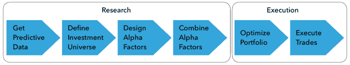
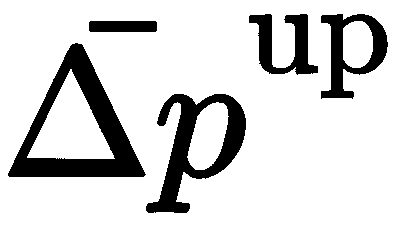
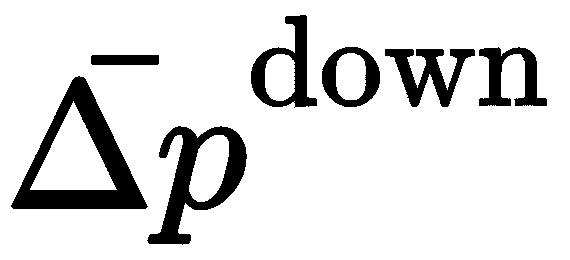
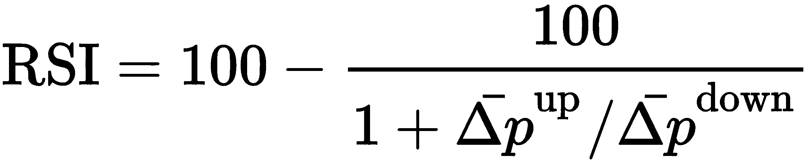
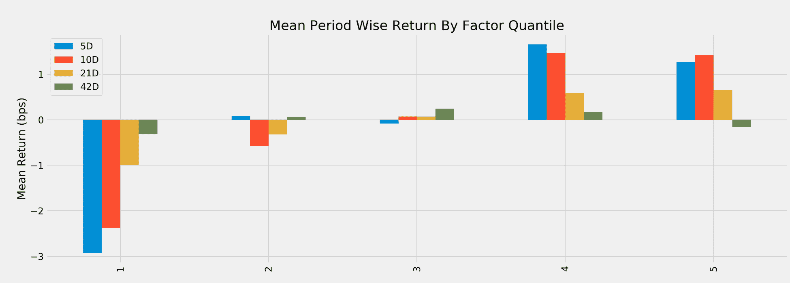
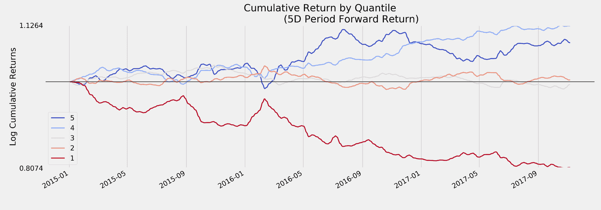
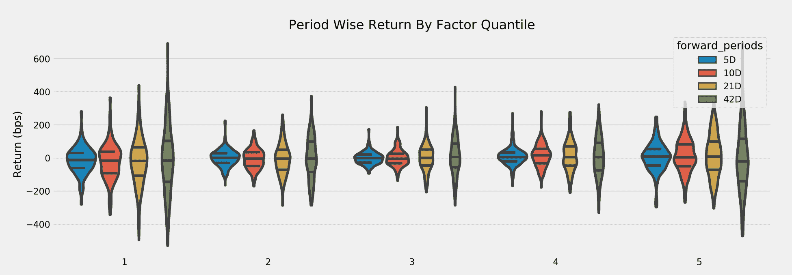
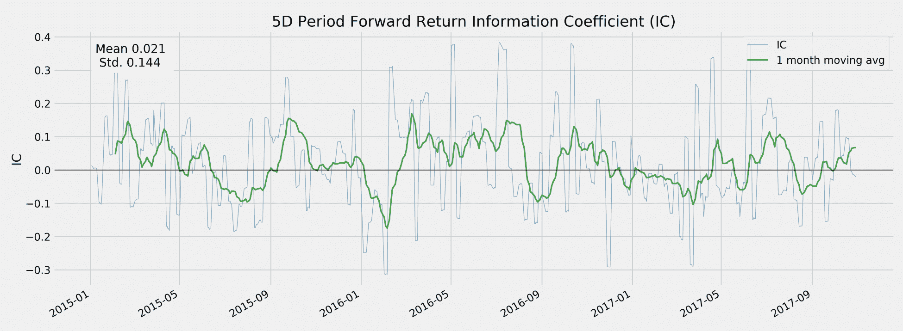
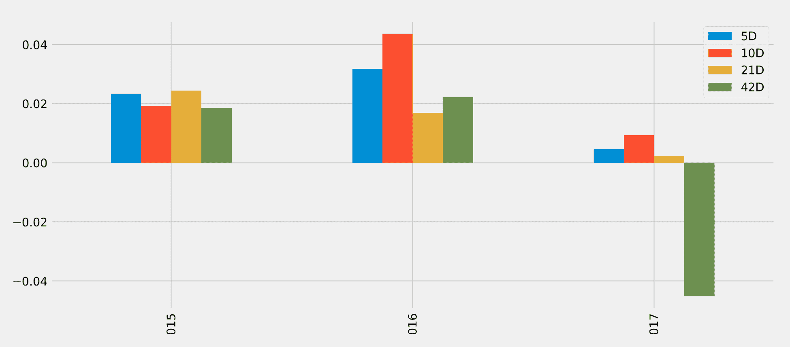

# 阿尔法因子研究

算法交易策略受信号驱动，该信号指示何时购买或出售资产以产生相对于基准的正收益。资产收益的一部分不受基准暴露的影响被称为**阿尔法**，因此这些信号也被称为**阿尔法因子**。

阿尔法因子旨在基于可用的市场、基本或替代数据预测投资领域资产的价格走势。一个因子可能结合一个或多个输入变量，但在每次策略评估因子时为每个资产假定一个单一值。交易决策通常依赖于跨资产的相对值。交易策略通常基于多个因子发出的信号，我们将看到**机器学习**（**ML**）模型特别适合有效地整合各种信号以进行更准确的预测。

阿尔法交易策略工作流程研究阶段的设计、评估和结合阿尔法因子是关键步骤，如下图所示。我们将在这个第四章中专注于研究阶段，*策略评估*，并在下一章中关注执行阶段。本书的其余部分将着重于使用 ML 来发现和结合阿尔法因子。请看下面的图：



本章将使用简单的均值回归因子介绍用 Python 编写的算法交易模拟器`zipline`，并促进对给定投资领域的阿尔法因子进行测试。在下一章中，我们还将在组合上回测交易策略时使用`zipline`。接下来，我们将讨论评估阿尔法因子预测性能的关键指标，包括信息系数和信息比率，这导致了主动管理的基本定律。

特别是，本章将讨论以下主题：

+   如何表征、证明和衡量关键类型的阿尔法因子

+   如何使用金融特征工程创建阿尔法因子

+   如何离线使用`zipline`测试单个阿尔法因子

+   如何在 Quantopian 上使用`zipline`结合阿尔法因子并识别更复杂的信号

+   **信息系数**（**IC**）如何衡量阿尔法因子的预测性能

+   如何使用`alphalens`评估预测性能和换手率

# 工程化阿尔法因子

阿尔法因子是包含预测信号的市场、基本和替代数据的转换。它们旨在捕获驱动资产收益的风险。一组因子描述了基本的、全面的变量，如增长、通货膨胀、波动性、生产力和人口风险。另一组包括可交易的投资风格，如市场组合、价值增长投资和动量投资。

还有一些因素可以根据金融市场的经济学或机构设置，或者投资者行为来解释价格的变动，包括这种行为的已知偏差。因素背后的经济理论可以是合理的，其中因子在长期内具有高回报，以弥补它们在不好的时期的低回报，或者是行为的，其中因子风险溢价来自于可能偏见的、或者不完全理性的代理人行为，这种行为不会被套利掉。

不断寻找和发现可能更好地捕捉已知或反映新收益驱动因素的新因素。Research Affiliates 的联合创始人、管理近 2000 亿美元的 Jason Hsu 在 2015 年确定了约 250 个因素，在知名期刊中发表了经验证据，并估计该数字每年可能增加 40 个因素。为了避免假发现并确保因子提供一致的结果，它应该有一个有意义的经济直觉，使得它可信地反映市场会补偿的风险。

数据转换包括简单的算术，如某一变量随时间的绝对或相对变化、数据系列之间的比率，或者在时间窗口内的聚合，例如简单或指数移动平均。它们还包括从价格模式的技术分析中出现的计算，比如需求与供应的相对强度指数和从证券基本分析中熟悉的众多指标。

# 重要的因子类别

在理想化的世界中，风险因子的类别应该彼此独立（正交），产生正的风险溢价，并形成一个完整的集合，涵盖了资产在给定类别中的所有风险维度，并解释了系统风险。实际上，这些要求只会近似成立。我们将介绍如何使用无监督学习来推导合成的、数据驱动的风险因子，特别是在 第十二章，*无监督学习* 中的主成分和独立成分分析。

我们将审查从市场、基本和替代数据衍生的因子的关键类别，以及用于捕捉它们的典型指标。我们还将演示如何在 Quantopian 平台上测试算法时实现这些因子，使用内置因子、使用 `numpy` 和 `pandas` 进行自定义计算，或者使用 `talib` 库进行技术分析。

# 动量和情绪因子

动量投资遵循这样的格言：趋势是你的朋友，或者让你的赢家继续奔跑。动量风险因子旨在做多表现良好的资产，同时做空表现不佳的资产，而且要在一定期间内表现良好。

依赖这一因素的策略的前提是资产价格表现出趋势，反映在正的串行相关性中。这种价格动量会违背有效市场假设的假设，即过去的价格回报本身不能预测未来的表现。尽管存在相反的理论论据，但价格动量策略在各类资产中产生了正的回报，并且是许多交易策略的重要组成部分。

# 理由

动量效应的原因指向投资者行为、持续的供求失衡、风险资产和经济之间的正反馈循环，或者市场微观结构。

行为原因反映了投资者对市场新闻的反应偏差，因为投资者以不同的速度处理新信息。在对新闻的初始反应之后，投资者经常会推断过去的行为，并产生价格动量。上世纪九十年代晚期科技股市场泡沫期间的上涨就是一个极端例子。恐惧和贪婪心理也促使投资者增加对获胜资产的曝光，并继续出售亏损资产。

动量也可以有基本的驱动因素，比如风险资产与经济之间的正反馈循环。经济增长推动了股票市场，而由此产生的财富效应通过更高的支出再次反馈到经济中，从而推动增长。价格和经济之间的正反馈往往会使股票和信贷的动量延伸到比债券、外汇和商品更长的时间跨度，其中负反馈会引发反转，需要更短的投资视野。动量的另一个原因可能是由于市场摩擦造成的持续的供需失衡，例如，当商品生产需要较长时间来调整以适应需求趋势时。石油生产可能会滞后于经济繁荣引起的需求增加多年，持续的供应短缺可能会引发并支持价格上涨的动量。

市场微观结构效应也可能会产生与行为模式相关的价格动量，这些行为模式促使投资者购买产品并实施模仿其偏见的策略。例如，根据交易智慧割损和让利润增长的原则，投资者使用交易策略，如止损、恒定比例组合保险（**CPPI**）、动态对冲、或者基于期权的策略，如保护性买入期权。这些策略会产生动量，因为它们意味着在资产表现不佳时进行预先承诺的出售，并在其表现优异时进行购买。同样，风险平价策略（见下一章）倾向于购买低波动率资产，这些资产通常表现出积极的业绩，并出售高波动率资产，这些资产通常表现不佳。使用这些策略自动平衡投资组合会加强价格动量。

# 关键指标

动量因子通常是通过识别趋势和模式来推导价格时间序列的变化得到的。它们可以基于绝对回报或相对回报构建，通过比较资产的横截面或分析资产的时间序列，在传统资产类别内或跨越传统资产类别，并在不同的时间范围内进行。

下表列出了一些流行的示意性指标：

| **因子** | **描述** |
| --- | --- |
| **相对强度指标** (**RSI**) | RSI 比较股票的最近价格变动，以识别股票是否被过度买入或过度卖出。高 RSI（例如，超过 70）表示过度买入，低 RSI（例如低于 30）表示过度卖出。它使用给定数量的前几个交易日的平均价格变动与正价格变动  和负价格变动  计算：  |
| 价格动量 | 此因子计算给定数量的前几个交易日的总回报。在学术文献中，通常使用过去 12 个月，但排除最近的一个月，因为最近价格波动经常观察到短期反转效应，但也广泛使用较短的周期。 |
| 12 个月价格动量 Vol Adj | 考虑波动率因子的 12 个月价格动量调整将前 12 个月的总回报归一化，方法是将其除以这些回报的标准偏差。 |
| 价格加速度 | 价格加速度使用线性回归在较长和较短周期的每日价格上计算趋势的梯度（根据波动率调整），例如，一年和三个月的交易日，并比较斜率的变化作为价格加速度的衡量。 |
| 百分比偏离 52 周最高价 | 此因子使用最近 52 周的最高价格与最近价格之间的百分差异。 |

其他情绪指标包括以下内容：

| **因子** | **描述** |
| --- | --- |
| 盈利预测数量 | 此度量指标根据共识估计数量对股票进行排名，作为分析师覆盖范围和信息不确定性的代理。较高的值更可取。 |
| 推荐 N 个月变化 | 此因子根据前 N 个月的共识推荐变化对股票进行排名，改善是可取的（无论是从强卖出到卖出还是从买入到强买入等）。 |
| 流通股份 12 个月变化 | 此因子衡量公司上市股份计数在过去 12 个月的变化，其中负变化意味着股份回购，这是可取的，因为它表明管理层认为股票相对于其内在价值和未来价值而言便宜。 |
| 目标价格变动的 6 个月变化 | 此指标跟踪平均分析师目标价格的 6 个月变化，较高的正变化自然更可取。 |
| 净收益修订 | 这一因素表示盈利预测的上调和下调之间的差异，以修订总数的百分比表示。 |
| 流通股份的卖空量 | 这个指标是目前被卖空的流通股份的百分比，即由借入股份并在以后的某一天回购它的投资者出售的股份，而这个投资者在猜测其价格将下跌。因此，高水平的卖空量表明负面情绪，并预示着未来的表现不佳。 |

# 价值因素

相对于其基本价值而言价格较低的股票往往会产生超过市值加权基准的回报。价值因素反映了这种相关性，并旨在提供购买被低估资产的信号，即那些相对便宜的资产，并卖出那些被高估和昂贵的资产。因此，任何价值策略的核心都是一个估计或代理资产公平或基本价值的估值模型。公平价值可以定义为绝对价格水平、相对于其他资产的价差，或者资产应该交易的范围（例如，两个标准偏差）。

价值策略依赖于价格回归到资产的公平价值。它们假设价格仅因行为效应（例如过度反应或群体行为）或流动性效应（例如临时市场影响或长期供求摩擦）而暂时偏离公平价值。由于价值因素依赖于价格回归，它们通常表现出与动量因素相反的性质。对于股票来说，价值股的对立面是由于增长预期而具有高估值的成长股。

价值因素可以实现广泛的系统性策略，包括基本和市场估值、统计套利和跨资产相对价值。它们通常被实施为无暴露于其他传统或替代风险因素的多空投资组合。

基本价值策略从取决于目标资产类别的经济和基本指标中得出公平资产价值。在固定收益、货币和大宗商品方面，指标包括资本账户余额水平和变动、经济活动、通货膨胀或资金流动等。在股票和企业信用方面，价值因素可以追溯到格雷厄姆和多德在上世纪三十年代的《证券分析》中，后来被沃伦·巴菲特所著名化。股票价值方法将股票价格与基本指标（例如账面价值、销售额、净利润或各种现金流量指标）进行比较。

市值策略使用统计学或机器学习模型来识别由流动性供给不足引起的错价。统计套利和指数套利是突出的例子，捕捉短期时间范围内临时市场影响的回归（我们将在下一章中讨论配对交易）。在较长的时间范围内，市值交易还利用股票和商品的季节效应。

跨资产相对价值策略侧重于不同资产的相对错价。例如，可转换债券套利涉及对单个公司的股票、信用和波动性之间的相对价值进行交易。相对价值还包括信用和股票波动性之间的交易，利用信用信号交易股票或商品和股票之间的相对价值交易。

# 理性

存在价值效应的理性和行为学解释都有。我们将引用一些来自丰富研究的著名例子，并在 GitHub 存储库中列出更多参考资料。

在理性、高效的市场观点中，价值溢价是对较高的实际或感知风险的补偿。研究人员提出了证据，表明价值公司比精益和更灵活的成长公司在适应不利的经济环境方面的灵活性更小，或者价值股的风险与高财务杠杆和更不确定的未来收益有关。研究还表明，价值和小市值投资组合对宏观冲击的敏感性也比成长和大市值投资组合更高。

从行为学的角度来看，价值溢价可以通过损失规避和心理会计偏见来解释。投资者可能对具有强劲近期表现的资产的损失较少担心，因为之前收益提供了保障。这种损失规避偏见导致投资者认为股票的风险较以前较低，并以较低的利率贴现其未来现金流。相反，较差的近期表现可能导致投资者提高资产的贴现率。不同的回报预期导致了价值溢价，因为相对于基本面的高价格倍数的成长股在过去表现良好，但是在未来，投资者将要求较低的平均回报，因为他们对风险的偏见认知较低，而价值股则相反。

# 关键指标

从基本数据计算出了大量的估值代理。这些因素可以作为机器学习估值模型的输入，用于预测价格。在接下来的章节中，我们将看到一些这些因素在实践中如何被使用的例子：

| **因素** | **描述** |
| --- | --- |
| 现金流收益 | 该比率将每股运营现金流除以股价。较高的比率意味着股东获得更好的现金回报（如果通过股息或股票回购支付，或者利润投资于业务中）。 |
| 自由现金流收益率 | 该比率将每股自由现金流（反映必要费用和投资后可分配的现金金额）除以股价。较高且增长的自由现金流收益率通常被视为超额表现的信号。 |
| **投入资本的现金流回报率** (**CFROIC**) | CFROIC 衡量公司的现金流盈利能力。它将经营现金流除以投入资本，定义为总债务加净资产。更高的回报意味着企业在给定的投入资本量下有更多现金，为股东创造更多价值。 |
| 现金流与总资产比 | 该比率将经营现金流除以总资产，表示公司相对于其资产可以生成多少现金，较高的比率类似于 CFROIC。 |
| 企业价值的自由现金流量 | 该比率衡量公司相对于其企业价值（以股权和债务的合计价值衡量）生成的自由现金流量。 |
| EBITDA 与企业价值比 | 该比率衡量了公司的 EBITDA（利润前利息、税项、折旧和摊销），即相对于其企业价值的现金流量代理。 |
| 收益率（1 年滞后） | 该比率将过去 12 个月的收益总和除以最后市场（收盘）价格。 |
| 收益率（1 年预测） | 该比率将滚动 12 个月的分析师盈利预期除以最后价格，而不是实际历史盈利，其中共识是预测的（可能是加权的）平均值。 |
| PEG 比率 | 价格/盈利增长（PEG）比率将一定时期内的股票价格盈利（P/E）比率除以公司的盈利增长率。该比率通过公司的盈利增长调整支付的价格（由 P/E 比率衡量）。 |
| 预测的 1 年前 PE 相对于行业的 | 预测的市盈率相对于相应的行业市盈率。它旨在通过考虑行业在估值上的差异来减轻通用市盈率的行业偏见。 |
| 销售收益率 | 该比率衡量股票的估值相对于其产生收入的能力。其他条件相等，具有较高历史销售价格比率的股票预计会表现出色。 |
| 销售收益率 FY1 | 前瞻性销售价格比率使用分析师销售预测，与（加权的）平均值结合。 |
| 帐面价值收益率 | 该比率将历史帐面价值除以股价。 |
| 股息收益率 | 当前年化股息除以最近收盘价。贴现现金流量估值假设公司的市值等于其未来现金流的现值。 |

# 波动性和规模因素

低波动因子捕捉到具有低于平均水平的波动率、贝塔或特有风险的股票的超额回报。具有较大市值的股票往往具有较低的波动性，因此传统的*size*因子通常与较新的波动性因子结合使用。

低波动性异常是一种与金融基本原理相矛盾的实证难题。**资本资产定价模型**（**CAPM**）和其他资产定价模型断言，高风险应该获得更高的回报，但在许多市场和长时间内，相反情况发生，较低风险的资产表现优于其风险较高的同行。

# 理由

低波动性异常与有效市场假说和 CAPM 假设相矛盾。相反，已提出了几种行为解释。

彩票效应建立在个人承担类似彩票的投注的经验证据上，这些投注存在小额预期损失但可能有较大潜在赢利，即使这种大赢利可能性相当低。如果投资者认为低价格、波动性大的股票的风险-回报特征类似于彩票，那么它可能是一种有吸引力的投注。因此，投资者可能会为高波动性股票支付过高的价格，并由于其偏见偏好而为低波动性股票支付过低的价格。代表性偏差表明，投资者将一些广为人知的高波动性股票的成功推广到所有高波动性股票，而忽视了这些股票的投机性质。

投资者可能也过于自信地认为他们能够预测未来，对于风险更大、结果更不确定的波动性股票，他们的意见差异更大。由于通过持有资产而不是通过做空来表达积极观点更容易，即持有一个资产，乐观主义者可能会超过悲观主义者，继续推动波动性股票的价格上涨，导致较低的回报。

此外，投资者在牛市和危机期间的行为不同。在牛市期间，贝塔的离散度要低得多，因此低波动性股票甚至不会表现得差，而在危机期间，投资者寻求或保持低波动性股票，贝塔的离散度增加。因此，低波动性资产和投资组合在长期内表现更好。

# 关键指标

用于识别低波动性股票的度量覆盖了广泛的领域，其中一个端是实现的波动率（标准差），另一个端是预测（隐含）波动率和相关性。一些人将低波动性操作化为低贝塔。对于不同的度量，支持波动性异常的证据似乎是强有力的。

# 质量因素

质量因子旨在捕捉高盈利、运营高效、安全、稳定和良好治理的公司相对于市场的超额回报。市场似乎也会奖励相对盈利的确定性，并惩罚盈利波动性较高的股票。向高质量企业倾斜的投资组合长期以来一直被依靠基本分析的股票选手所提倡，但在量化投资中是一个相对较新的现象。主要挑战在于如何使用定量指标一致和客观地定义质量因子，考虑到质量的主观性。

基于独立质量因子的策略往往表现出逆周期性，因为投资者支付溢价以减小下行风险并推高估值。因此，质量因子经常与其他风险因子结合在一起，最常见的是与价值因子结合以产生合理价格的质量策略。长短期质量因子往往具有负市场β值，因为它们做多质量股票，这些股票也是低波动性的，同时做空更具波动性、低质量的股票。因此，质量因子通常与低波动性和动量因子呈正相关，与价值和广泛的市场暴露呈负相关。

# 理由

质量因子可能会暗示超额表现，因为持续的盈利能力、现金流量稳定增长、审慎的杠杆使用、对资本市场融资的低需求或长期内的低金融风险支撑了对股票的需求，并在长期内支撑了这些公司的股价。从公司财务的角度来看，质量公司通常会谨慎管理其资本，减少过度杠杆或过度资本化的风险

行为解释表明，投资者对质量信息存在反应不足，类似于动量交易的理由，投资者追逐赢家并卖出输家。另一个支持质量溢价的论点是类似于成长股的群体效应。基金经理可能会发现，即使一家公司的基本面强劲但价格昂贵，也比购买更具波动性（风险性）的价值股更容易被合理化。

# 关键指标

质量因子依赖于从资产负债表和利润表计算出的指标，这些指标表明了高利润或现金流边际、经营效率、财务实力和更广泛的竞争力，因为这意味着公司能够持续一段时间内保持盈利能力。

因此，质量常常通过毛利率（最近已添加到法玛—法朗奇因子模型中，参见第七章，*线性模型*）、投入资本回报率、低盈利波动性或各种盈利能力、盈利质量和杠杆指标的组合进行衡量，以下表格列出了一些选项。

盈余管理主要通过操纵应计项目来实施。因此，应计项目的大小通常被用作盈余质量的代理：相对于资产较高的总应计项目会使低盈余质量更有可能。然而，这并不一定清楚，因为应计项目既可以反映盈余操纵，也可以像未来业务增长的会计估计一样反映出来。

| **因子** | **描述** |
| --- | --- |
| 资产周转率 | 此因子衡量公司使用资产（需要资本）生产收入的效率，并通过将销售额除以总资产来计算；更高的周转率更好。 |
| 资产周转率 12 个月变化 | 此因子衡量管理层在过去一年中利用资产产生收入的效率变化。通常预计，效率改善水平最高的股票将表现优异。 |
| 流动比率 | 流动比率是衡量公司偿付短期债务能力的流动性指标。它将公司的流动资产与流动负债进行比较，从质量的角度来看，流动比率较高更好。 |
| 利息保障 | 此因子衡量公司支付债务利息的能力。它是通过将公司的息税前利润（EBIT）除以其利息支出来计算的。较高的比率是可取的。 |
| 杠杆 | 与股本相比，负债显著多于权益的公司被认为是高度杠杆的。负债权益比通常与前景呈负相关，杠杆越低越好。 |
| 分红比率 | 向股东支付的股息金额。分红比率较高的股票被分配到前十分位，而分红比率较低的股票则被分配到底十分位。 |
| **净资产收益率**（**ROE**） | 根据历史净资产收益率对股票进行排名，并将净资产收益率最高的股票分配到前十分位。 |

# 如何将数据转化为因子

基于对关键因子类别、它们的原理和流行指标的概念理解，一个关键任务是确定可能更好地捕捉之前所述的回报驱动因素所包含的风险的新因子，或者找到新因子。在任何情况下，比较创新因子与已知因子的表现将是重要的，以确定增量信号增益。

# 有用的 pandas 和 NumPy 方法

NumPy 和 pandas 是自定义因子计算的关键工具。数据目录中的 Notebook `00-data-prep.ipynb` 包含了如何创建各种因子的示例。该笔记本使用由 GitHub 仓库根目录中的 data 文件夹中的 `get_data.py` 脚本生成并以 `HDF5` 格式存储的数据以提供更快的访问。请参阅 GitHub 仓库中的 Chapter 2 目录下的笔记本 `storage_benchmarks.ipynb`，以比较 pandas `DataFrames` 的 `parquet`、`HDF5` 和 `csv` 存储格式。

以下示例说明了从原始股票数据计算选定因子的一些关键步骤。有关详细信息和我们在此处省略的可视化效果，请参见笔记本。

# 加载数据

我们加载了 Quandl 股价数据集，涵盖了 2000 年至 2018 年的美国股票市场，使用 `pd.IndexSlice` 对 `pd.MultiIndex` 执行切片操作，选择调整后的收盘价，并将列进行转置，将 DataFrame 转换为宽格式，其中列中包含股票代码，行中包含时间戳：

```py
idx = pd.IndexSlice
with pd.HDFStore('../../data/assets.h5') as store:
    prices = store['quandl/wiki/prices'].loc[idx['2000':'2018', :], 
                   'adj_close'].unstack('ticker')

prices.info()
DatetimeIndex: 4706 entries, 2000-01-03 to 2018-03-27
Columns: 3199 entries, A to ZUMZ
```

# 从日频率重新采样为月频率

为了减少训练时间并尝试针对更长时间范围的策略，我们使用可用的调整后的收盘价将商业日数据转换为月末频率：

```py
monthly_prices = prices.resample('M').last()
```

# 计算动量因子

为了捕捉捕捉时间序列动态，例如动量模式，我们使用 `pct_change(n_periods)` 计算历史回报，即由 `lags` 指定的各种月期的回报。然后，我们使用 `.stack()` 将宽格式结果转换回长格式，使用 `.pipe()` 应用 `.clip()` 方法到结果的 `DataFrame` 并将回报截尾到 [1%, 99%] 的水平；即我们在这些百分位数上限制异常值。

最后，我们使用几何平均数对回报进行归一化处理。使用 `.swaplevel()` 更改 `MultiIndex` 索引级别的顺序后，我们获得了从 1 到 12 个月的六个周期的合并月回报：

```py
outlier_cutoff = 0.01
data = pd.DataFrame()
lags = [1, 2, 3, 6, 9, 12]
for lag in lags:
    data[f'return_{lag}m'] = (monthly_prices
                           .pct_change(lag)
                           .stack()
                           .pipe(lambda x: x.clip(lower=x.quantile(outlier_cutoff),
                        upper=x.quantile(1-outlier_cutoff)))
                           .add(1)
                           .pow(1/lag)
                           .sub(1)
                           )
data = data.swaplevel().dropna()
data.info()

MultiIndex: 521806 entries, (A, 2001-01-31 00:00:00) to (ZUMZ, 2018-03-
                             31 00:00:00)
Data columns (total 6 columns):
return_1m 521806 non-null float64
return_2m 521806 non-null float64
return_3m 521806 non-null float64
return_6m 521806 non-null float64
return_9m 521806 non-null float64
return_12m 521806 non-null float6
```

我们可以使用这些结果来计算动量因子，这些因子基于较长周期的回报与最近一个月的回报之间的差异，以及基于`3`和`12`个月回报之间的差异，如下所示：

```py
for lag in [2,3,6,9,12]:
    data[f'momentum_{lag}'] = data[f'return_{lag}m'].sub(data.return_1m)
data[f'momentum_3_12'] = data[f'return_12m'].sub(data.return_3m)
```

# 使用滞后回报和不同持有期

为了将滞后值用作当前观察到的输入变量或特征，我们使用 `.shift()` 方法将历史回报移至当前期间：

```py
for t in range(1, 7):
    data[f'return_1m_t-{t}'] = data.groupby(level='ticker').return_1m.shift(t)
```

类似地，为了计算各种持有期的回报，我们使用之前计算的标准化期回报，并将其向后移动以与当前金融特征对齐：

```py
for t in [1,2,3,6,12]:
    data[f'target_{t}m'] = data.groupby(level='ticker')[f'return_{t}m'].shift(-t)
```

# 计算因子贝塔系数

我们将在第八章 *时间序列模型* 中介绍 Fama—French 数据，使用线性回归估计资产对常见风险因子的暴露。已经通过实证研究表明，Fama—French 的五个因子，即市场风险、规模、价值、经营利润能力和投资，在解释资产回报方面是有效的，并且常用于评估投资组合的风险/回报特征。因此，在旨在预测未来回报的模型中，自然而然地包括过去的因子暴露作为金融特征。

我们可以使用 pandas-datareader 访问历史因子回报，并使用 `pyfinance` 库中的 `PandasRollingOLS` 滚动线性回归功能来估计历史暴露，具体如下：

```py
factors = ['Mkt-RF', 'SMB', 'HML', 'RMW', 'CMA']
factor_data = web.DataReader('F-F_Research_Data_5_Factors_2x3', 
              'famafrench', start='2000')[0].drop('RF', axis=1)
factor_data.index = factor_data.index.to_timestamp()
factor_data = factor_data.resample('M').last().div(100)
factor_data.index.name = 'date'
factor_data = factor_data.join(data['return_1m']).sort_index()

T = 24
betas = (factor_data
         .groupby(level='ticker', group_keys=False)
         .apply(lambda x: PandasRollingOLS(window=min(T, x.shape[0]-1), y=x.return_1m, x=x.drop('return_1m', axis=1)).beta))
```

我们将在第七章中更详细地探讨 Fama—French 因子模型和线性回归，*线性模型*。请参阅笔记本以获取更多示例。

# 内置 Quantopian 因子

附带的笔记本`factor_library.ipynb`包含了许多示例因子，这些因子要么由 Quantopian 平台提供，要么从 Jupyter Notebook 使用的研究 API 可用的数据源计算而来。

有内置因子可以与量化 Python 库一起使用，特别是`numpy`和`pandas`，从各种相关数据源中导出更复杂的因子，例如美国股票价格、Morningstar 基本面和投资者情绪。

例如，销售收益率的倒数价格销售比是 Morningstar 基本面数据集的一部分。它可以作为一种管道的一部分，随着我们介绍`zipline`库而进一步描述。

# TA-Lib

TA-Lib 库包括许多技术因素。Python 实现可用于本地使用，例如与`zipline`和`alphalens`，也可在 Quantopian 平台上使用。笔记本还演示了使用 TA-Lib 可用的几个技术指标。

# 寻找信号 - 如何使用 zipline

历史上，Alpha 因子使用单一输入和简单的启发式方法、阈值或分位数截止值来识别买入或卖出信号。ML 已被证明可以从更多样化和更大量的输入数据中提取信号，包括基于历史模式分析的其他 Alpha 因子。因此，算法交易策略今天利用了大量的 Alpha 信号，其中许多单独可能较弱，但在与 ML 算法通过其他模型驱动或传统因子相结合时可以产生可靠的预测。

开源`zipline`库是由众包量化投资基金 Quantopian（[`www.quantopian.com/`](https://www.quantopian.com/)）维护和用于生产中的事件驱动回测系统，以便促进算法开发和实时交易。它自动化算法对交易事件的反应，并为其提供当前和历史的点时间数据，避免了前瞻偏差。

您可以离线使用它与数据包一起研究和评估 alpha 因子。在 Quantopian 平台上使用它时，您将获得更广泛的基本和替代数据。我们还将在本章中演示 Quantopian 研究环境，并在下一章中演示回测 IDE。本节的代码位于此章节的 GitHub 存储库文件夹的`01_factor_research_evaluation`子目录中。

安装完成并在执行第一个算法之前，您需要摄入一个数据包，默认情况下由 Quandl 社区维护的数据，涵盖了 3000 家美国上市公司的股价、股息和拆股信息。您需要一个 Quandl API 密钥来运行下面存储数据的代码，该代码将数据存储在您的主目录下的 `~/.zipline/data/<bundle>` 文件夹中：

```py
$ QUANDL_API_KEY=<yourkey> zipline ingest [-b <bundle>]
```

# 架构 - 事件驱动交易模拟

`zipline` 算法会在初始设置后的指定期间内运行，并在特定事件发生时执行其交易逻辑。这些事件由交易频率驱动，也可以由算法进行调度，并导致 `zipline` 调用某些方法。算法通过一个 `context` 字典维护状态，并通过包含 **PIT（point-in-time）** 当前和历史数据的 `data` 变量接收可执行的信息。如果有任何交易，算法将返回一个包含组合绩效指标的 `DataFrame`，以及可以用于记录因子值等用户定义的指标。

您可以通过命令行、Jupyter Notebook 和使用 `run_algorithm()` 函数来执行算法。

算法需要一个 `initialize()` 方法，在模拟开始时调用一次。该方法可用于向所有其他算法方法可用的 `context` 字典中添加属性，或注册执行更复杂数据处理的 `pipelines`，例如基于 alpha 因子逻辑对证券进行过滤。

算法执行通过可选方法进行，这些方法可以由 `zipline` 自动调度或在用户定义的间隔内调用。方法 `before_trading_start()` 在市场开盘前每日调用，主要用于识别算法可能在当天交易的一组证券。方法 `handle_data()` 每分钟调用一次。

`Pipeline API` 便于从历史数据中为一组证券定义和计算 alpha 因子。Pipeline 定义了在一张表中为一组证券生成 PIT 值的计算。它需要使用 `initialize()` 方法进行注册，然后可以按照自动或自定义的时间表执行。该库提供了许多内置的计算方法，如移动平均线或布林带，可以快速计算标准因子，同时也允许创建自定义因子，下面我们将进行说明。

最重要的是，`Pipeline API` 使得 alpha 因子研究模块化，因为它将 alpha 因子计算与算法的其余部分（包括交易订单的下达和执行、以及组合持仓、价值等的簿记）分开。

# 市场数据中的单一 alpha 因子

我们首先将在离线环境中说明 `zipline` alpha 因子研究工作流程。特别是，我们将开发和测试一个简单的均值回归因子，该因子衡量了最近表现与历史平均水平的偏离程度。短期反转是一种常见策略，利用了股价上涨很可能会在从少于一分钟到一个月的时间跨度内回归到均值的弱预测模式。有关详细信息，请参阅 Notebook `single_factor_zipline.ipynby`。

为此，该因子计算了相对于过去一年的滚动月收益率的最后一个月收益率的 z 得分。此时，我们不会下达任何订单，只是为了简单说明如何实现 `CustomFactor` 并在模拟过程中记录结果。

在一些基本设置之后，`MeanReversion` 是 `CustomFactor` 的子类，并定义了一个 `compute()` 方法。它创建了默认输入的月度收益率，其默认窗口也是一年，因此 `monthly_return` 变量将在给定日的 Quandl 数据集中有 252 行，每个证券一个列。

`compute_factors()` 方法创建了一个 `MeanReversion` 因子实例，并创建了 `long`、`short` 和 `ranking` 流水线列。前两个包含布尔值，可以用来下订单，而后者反映了整体排名，以评估整体因子表现。此外，它使用内置的 `AverageDollarVolume` 因子来限制计算范围，以更流动的股票：

```py
from zipline.api import attach_pipeline, pipeline_output, record
from zipline.pipeline import Pipeline, CustomFactor
from zipline.pipeline.factors import Returns, AverageDollarVolume
from zipline import run_algorithm

MONTH, YEAR = 21, 252
N_LONGS = N_SHORTS = 25
VOL_SCREEN = 1000

class MeanReversion(CustomFactor):
    """Compute ratio of latest monthly return to 12m average,
       normalized by std dev of monthly returns"""
    inputs = [Returns(window_length=MONTH)]
    window_length = YEAR

    def compute(self, today, assets, out, monthly_returns):
        df = pd.DataFrame(monthly_returns)
        out[:] = df.iloc[-1].sub(df.mean()).div(df.std())

def compute_factors():
    """Create factor pipeline incl. mean reversion,
        filtered by 30d Dollar Volume; capture factor ranks"""
    mean_reversion = MeanReversion()
    dollar_volume = AverageDollarVolume(window_length=30)
    return Pipeline(columns={'longs'  : mean_reversion.bottom(N_LONGS),
                             'shorts' : mean_reversion.top(N_SHORTS),
                             'ranking': 
                          mean_reversion.rank(ascending=False)},
                          screen=dollar_volume.top(VOL_SCREEN))
```

这一结果将使我们能够下达多空订单。我们将在下一章看到如何通过选择重新平衡周期和根据新信号调整投资组合持仓来构建投资组合。

`initialize()` 方法注册了 `compute_factors()` 流水线，而 `before_trading_start()` 方法确保该流水线每天都会运行一次。`record()` 函数将流水线的 `ranking` 列以及当前资产价格添加到 `run_algorithm()` 函数返回的性能 `DataFrame` 中：

```py
def initialize(context):
    """Setup: register pipeline, schedule rebalancing,
        and set trading params"""
    attach_pipeline(compute_factors(), 'factor_pipeline')

def before_trading_start(context, data):
    """Run factor pipeline"""
    context.factor_data = pipeline_output('factor_pipeline')
    record(factor_data=context.factor_data.ranking)
    assets = context.factor_data.index
    record(prices=data.current(assets, 'price'))
```

最后，以 UTC 时间定义开始和结束 `Timestamp` 对象，设置资本基础，并使用对关键执行方法的引用执行 `run_algorithm()`。`performance` DataFrame 包含嵌套数据，例如，`prices` 列由每个单元格的 `pd.Series` 组成。因此，当以 `pickle` 格式存储时，后续数据访问更容易：

```py
start, end = pd.Timestamp('2015-01-01', tz='UTC'), pd.Timestamp('2018-
             01-01', tz='UTC')
capital_base = 1e7

performance = run_algorithm(start=start,
                            end=end,
                            initialize=initialize,
                            before_trading_start=before_trading_start,
                            capital_base=capital_base)

performance.to_pickle('single_factor.pickle')
```

我们将在下一节使用存储在 `performance` DataFrame 中的因子和定价数据，评估不同持有期的因子表现，但首先，我们将看一下如何通过组合 Quantopian 平台上多样化的数据源中的几个 alpha 因子来创建更复杂的信号。

# 结合来自多样化数据源的因子

Quantopian 研究环境专门用于快速测试预测性 Alpha 因子。该过程非常相似，因为它基于 `zipline`，但提供了更丰富的数据源访问。下面的代码示例说明了如何计算 Alpha 因子，不仅来自以前的市场数据，还来自基本和替代数据。有关详细信息，请参阅笔记本 `multiple_factors_quantopian_research.ipynb`。

Quantopian 免费提供了几百个 MorningStar 基本变量，还包括 `stocktwits` 信号作为替代数据源的示例。还有自定义的宇宙定义，例如 `QTradableStocksUS`，它应用了几个过滤器来限制回测宇宙，使其仅包含可能在现实市场条件下可交易的股票：

```py
from quantopian.research import run_pipeline
from quantopian.pipeline import Pipeline
from quantopian.pipeline.data.builtin import USEquityPricing
from quantopian.pipeline.data.morningstar import income_statement, 
     operation_ratios, balance_sheet
from quantopian.pipeline.data.psychsignal import stocktwits
from quantopian.pipeline.factors import CustomFactor, 
     SimpleMovingAverage, Returns
from quantopian.pipeline.filters import QTradableStocksUS
```

我们将使用自定义的 `AggregateFundamentals` 类来使用最后报告的基本数据点。这旨在解决基本面每季度报告一次的事实，并且 Quantopian 目前没有提供一种轻松的方法来聚合历史数据，比如按照滚动基础获取最后四个季度的总和：

```py
class AggregateFundamentals(CustomFactor):
    def compute(self, today, assets, out, inputs):
        out[:] = inputs[0]
```

我们将再次使用上述代码中的自定义 `MeanReversion` 因子。我们还将使用 `rank()` 方法的 `mask` 参数为给定的宇宙定义计算几个其他因子：

```py
def compute_factors():
    universe = QTradableStocksUS()

    profitability = (AggregateFundamentals(inputs=
                     [income_statement.gross_profit],
                                           window_length=YEAR) /
                     balance_sheet.total_assets.latest).rank(mask=universe)

    roic = operation_ratios.roic.latest.rank(mask=universe)
    ebitda_yield = (AggregateFundamentals(inputs=
                             [income_statement.ebitda],
                                          window_length=YEAR) /
                    USEquityPricing.close.latest).rank(mask=universe)
    mean_reversion = MeanReversion().rank(mask=universe)
    price_momentum = Returns(window_length=QTR).rank(mask=universe)
    sentiment = SimpleMovingAverage(inputs=
                            [stocktwits.bull_minus_bear],

                            window_length=5).rank(mask=universe)

    factor = profitability + roic + ebitda_yield + mean_reversion + 
             price_momentum + sentiment

    return Pipeline(
            columns={'Profitability'      : profitability,
                     'ROIC'               : roic,
                     'EBITDA Yield'       : ebitda_yield,
                     "Mean Reversion (1M)": mean_reversion,
                     'Sentiment'          : sentiment,
                     "Price Momentum (3M)": price_momentum,
                     'Alpha Factor'       : factor})
```

该算法使用了一种简单的方法来结合六个个体因子，只需为这些因子的每个因子的资产排名简单相加。我们不想使用等权重，而是希望考虑相对重要性和预测未来收益的增量信息。下一章的机器学习算法将允许我们完全这样做，使用相同的回测框架。

执行也依赖于 `run_algorithm()`，但 Quantopian 平台上的返回 `DataFrame` 只包含由 `Pipeline` 创建的因子值。这很方便，因为此数据格式可用作 `alphalens` 的输入，这是用于评估 Alpha 因子预测性能的库。

# 分离信号和噪音 - 如何使用 alphalens

Quantopian 开源了 Python 库 `alphalens`，用于预测股票因子的性能分析，与我们将在下一章中探讨的回测库 `zipline` 和投资组合绩效与风险分析库 `pyfolio` 集成得很好。

`alphalens` 便于分析 Alpha 因子的预测能力，涉及：

+   信号与随后收益的相关性

+   基于信号的等权或因子加权组合的盈利能力（基于信号的子集）

+   因子周转率以指示潜在交易成本

+   特定事件期间的因子表现

+   通过行业细分的前述分解

分析可以使用泪水图或单独的计算和绘图进行。在线存储库中有泪水图以节省一些空间。

# 创建前瞻性收益和因子分位数

要使用`alphalens`，我们需要为资产的一组信号提供信号，例如`MeanReversion`因子的排名，以及投资于给定持有期的资产的前向回报。有关详细信息，请参阅笔记本`03_performance_eval_alphalens.ipynb`。

我们将从`single_factor.pickle`文件中恢复`prices`（相应的`factor_data`）如下：

```py
performance = pd.read_pickle('single_factor.pickle')

prices = pd.concat([df.to_frame(d) for d, df in performance.prices.items()],axis=1).T
prices.columns = [re.findall(r"\[(.+)\]", str(col))[0] for col in 
                  prices.columns]
prices.index = prices.index.normalize()
prices.info()

<class 'pandas.core.frame.DataFrame'>
DatetimeIndex: 755 entries, 2015-01-02 to 2017-12-29
Columns: 1661 entries, A to ZTS
dtypes: float64(1661)
```

GitHub 存储库中的`alpha factor evaluation`笔记本详细介绍了如何以特定于行业的方式进行评估。

我们可以使用`get_clean_factor_and_forward_returns`实用程序函数创建所需格式的`alphalens`输入数据，该函数还返回给定持有期的信号分位数和前向回报：

```py
HOLDING_PERIODS = (5, 10, 21, 42)
QUANTILES = 5
alphalens_data = get_clean_factor_and_forward_returns(factor=factor_data,
                                     prices=prices,
                                     periods=HOLDING_PERIODS,
                                     quantiles=QUANTILES)

Dropped 14.5% entries from factor data: 14.5% in forward returns computation and 0.0% in binning phase (set max_loss=0 to see potentially suppressed Exceptions). max_loss is 35.0%, not exceeded: OK!
```

`alphalens_data`数据框包含给定资产在给定日期的投资的回报，以及因子值，即该日期上资产的`MeanReversion`排名，以及相应的分位数值：

| **日期** | **资产** | **5 天** | **10 天** | **21 天** | **42 天** | **因子** | **因子分位数** |
| --- | --- | --- | --- | --- | --- | --- | --- |
| 01/02/15 | A | 0.07% | -5.70% | -2.32% | 4.09% | 2618 | 4 |
| AAL | -3.51% | -7.61% | -11.89% | -10.23% | 1088 | 2 |
| AAP | 1.10% | -5.40% | -0.94% | -3.81% | 791 | 1 |
| AAPL | 2.45% | -3.05% | 8.52% | 15.62% | 2917 | 5 |
| ABBV | -0.17% | -2.05% | -6.43% | -13.70% | 2952 | 5 |

对于评估信号的预测能力，前向回报和信号分位数是基础。通常，一个因子应该对不同分位数的回报产生明显不同的结果，例如对于因子值的底部五分位数应该产生负回报，而对于顶部分位数应该产生正回报。

# 因子分位数的预测性能

首先，我们想要可视化因子分位数的平均期间回报。我们可以使用`performance`模块中的内置函数`mean_return_by_quantile`和`plotting`模块中的`plot_quantile_returns_bar`：

```py
from alphalens.performance import mean_return_by_quantile
from alphalens.plotting import plot_quantile_returns_bar
mean_return_by_q, std_err = mean_return_by_quantile(alphalens_data)
plot_quantile_returns_bar(mean_return_by_q);
```

结果是一张条形图，根据因子信号的分位数，将四种不同持有期的前向回报均值进行了分解。正如您所见，底部五分位数产生的结果明显更为负面，而顶部五分位数除了最长持有期外产生的结果更为正面：



对于第一和第四分位数，10 天的持有期提供了稍微更好的结果。我们还想看到由每个信号分位数驱动的投资随时间的表现。我们将计算每日收益率，而不是 5 天持有期的平均收益率，`alphalens`将调整期间收益率以解决每日信号和较长持有期之间的不匹配（有关详细信息，请参阅文档）：

```py
from alphalens.plotting import plot_cumulative_returns_by_quantile
mean_return_by_q_daily, std_err =     
     mean_return_by_quantile(alphalens_data, by_date=True)
plot_cumulative_returns_by_quantile(mean_return_by_q_daily['5D'], 
     period='5D');
```

结果线图显示，在这三年的大部分时间里，前两个五分位显着优于后两个五分位。然而，如前图所示，第四个五分位的信号产生的性能优于第一个五分位的性能：



对于交易策略有用的因子显示出前述模式，其中累积收益沿着明显不同的路径发展，因为这允许具有更低资本要求和相应更低整体市场暴露的多空策略。

然而，我们还需要考虑期间收益的分散而不仅仅是平均值。为此，我们可以依靠内置的`plot_quantile_returns_violin`：

```py
from alphalens.plotting import plot_quantile_returns_violin
plot_quantile_returns_violin(mean_return_by_q_daily);
```

这个分布图突出显示每日收益的范围相当广泛，并且尽管均值不同，但分布之间的分离非常有限，因此，在任何给定的日子里，不同五分位之间的性能差异可能相当有限：



虽然我们专注于单一 alpha 因子的评估，但我们在忽略与交易执行相关的实际问题时，会简化问题，我们将在下一章中详细介绍适当的回测时再放松这些问题。其中一些包括：

+   交易成本

+   滑点，即决策价格与交易执行价格之间的差异，例如，由于市场影响引起的

# 信息系数

本书大部分内容都关于使用 ML 模型设计 alpha 因子。ML 是关于优化某些预测目标的，本节中，我们将介绍用于衡量 alpha 因子性能的关键指标。我们将定义 alpha 为超过基准的平均收益。

这导致了**信息比率**（**IR**），它通过将 alpha 除以跟踪风险来衡量每单位风险带来的平均超额收益。当基准是无风险利率时，IR 对应于众所周知的夏普比率，并且我们将强调在典型情况下收益不服从正态分布时出现的关键统计测量问题。我们还将解释主动管理的基本法则，将 IR 分解为预测技巧的组合和策略有效利用预测技巧的能力。

alpha 因子的目标是准确地预测未来收益的方向。因此，一个自然的性能度量是 alpha 因子预测与目标资产未来收益之间的相关性。

更好地使用非参数的 Spearman 等级相关系数来衡量两个变量之间关系的好坏，该系数衡量使用单调函数描述关系的能力，与测量线性关系强度的 Pearson 相关系数相对。

我们可以使用 `alphalens` 获取信息系数，`alphalens` 底层依赖于 `scipy.stats.spearmanr`（请参阅存储库以获取有关如何直接使用 `scipy` 获取 p 值的示例）。`factor_information_coefficient` 函数计算周期性的相关性，`plot_ic_ts` 创建一个带有一个月移动平均线的时间序列图：

```py
from alphalens.performance import factor_information_coefficient
from alphalens.plotting import plot_ic_ts
ic = factor_information_coefficient(alphalens_data)
plot_ic_ts(ic[['5D']])
```

这个时间序列图显示了具有显著正移动平均 IC 的延长时期。如果有足够的机会应用这种预测技能，即使 IC 为 0.05 或甚至 0.1，也可以实现显著的超额收益，因为主动管理的基本定律将说明：



年均 IC 的图表突出显示了因子的性能历史上的不均匀性：

```py
ic = factor_information_coefficient(alphalens_data)
ic_by_year = ic.resample('A').mean()
ic_by_year.index = ic_by_year.index.year
ic_by_year.plot.bar(figsize=(14, 6))
```

这会产生以下图表：



如本例中所示，信息系数低于 0.05 的情况下，虽然低但显著，可以相对于基准产生正的残差收益，我们将在下一节中看到。`create_summary_tear_sheet(alphalens_data)` 创建 IC 摘要统计信息，其中风险调整 IC 的结果是将平均 IC 除以 IC 的标准差得到的，这也是通过使用 `scipy.stats.ttest_1samp` 对 *IC = 0* 的双侧 t 检验进行的：

|  | **5 天** | **10 天** | **21 天** | **42 天** |
| --- | --- | --- | --- | --- |
| IC 平均值 | 0.01 | 0.02 | 0.01 | 0.00 |
| IC 标准差 | 0.14 | 0.13 | 0.12 | 0.12 |
| 风险调整 IC | 0.10 | 0.13 | 0.10 | 0.01 |
| 2.68 | 3.53 | 2.53 | 0.14 |  |
| p-value(IC) | 0.01 | 0.00 | 0.01 | 0.89 |
| IC 偏度 | 0.41 | 0.22 | 0.19 | 0.21 |
| IC 峰度 | 0.18 | -0.33 | -0.42 | -0.27 |

# 因子周转率

因子周转率衡量与给定分位数相关联的资产经常变化的频率，即调整投资组合以适应信号序列需要多少交易。更具体地说，它衡量了当前处于因子分位数中的资产份额，在上个期间不处于该分位数的资产份额。以下表格是通过此命令生成的：

```py
create_turnover_tear_sheet(alphalens_data)
```

加入基于五分位数的投资组合的资产份额相当高，表明交易成本对利用预测性能构建收益的挑战：

| **平均周转率** | **5 天** | **10 天** | **21 天** | **42 天** |
| --- | --- | --- | --- | --- |
| **分位数 1** | 59% | 83% | 83% | 41% |
| **分位数 2** | 74% | 80% | 81% | 65% |
| **分位数 3** | 76% | 80% | 81% | 68% |
| **分位数 4** | 74% | 81% | 81% | 64% |
| **分位数 5** | 57% | 81% | 81% | 39% |

对因子周转率的另一种观点是资产排名与因子之间的相关性在各种持有期间的情况，也是撕裂单的一部分：

|  | **5 天** | **10 天** | **21 天** | **42 天** |
| --- | --- | --- | --- | --- |
| **平均因子排名自相关** | 0.711 | 0.452 | -0.031 | -0.013 |

一般来说，更稳定性更好，以保持交易成本可控。

# Alpha 因子资源

研究过程需要设计和选择与其信号预测能力相关的阿尔法因子。算法交易策略通常会基于多个为每个资产发送信号的阿尔法因子。这些因子可以使用 ML 模型进行聚合，以优化各种信号如何转化为关于个别仓位的时间和大小决策，我们将在后续章节中看到。

# 替代算法交易库

其他用于算法交易和数据收集的开源 Python 库包括（在 GitHub 上查看链接）：

+   QuantConnect 是 Quantopian 的竞争对手。

+   WorldQuant 提供在线竞赛，并招募社区贡献者加入众包对冲基金。

+   Alpha Trading Labs 提供以 Quantopian 类似的商业模式为基础的高频重点测试基础设施。

+   Python 算法交易库（PyAlgoTrade）专注于回测，并支持模拟交易和实时交易。它允许您使用历史数据评估交易策略的想法，并力图以最小的努力完成此任务。

+   pybacktest 是一个使用 pandas 的矢量化回测框架，旨在简洁、简单和快速（该项目目前暂停）。

+   ultrafinance 是一个较旧的项目，结合了实时金融数据收集、分析和交易策略的回测。

+   使用 Python 进行交易提供了量化交易课程以及一系列用于量化交易的函数和类。

+   交互经纪商提供了一个用于在其平台上进行实时交易的 Python API。

# 总结

在本章中，我们介绍了 `zipline` 库用于事件驱动的交易算法模拟，既可以离线进行，也可以在 Quantopian 在线平台上进行。我们已经说明了从市场、基本和替代数据中设计和评估单个阿尔法因子以推导出用于算法交易策略的信号，并展示了结合多个因子的一种简单方法。我们还介绍了允许对信号的预测性能和交易换手率进行全面评估的 `alphalens` 库。

投资组合构建过程反过来采用更广泛的视角，旨在从风险和回报的角度来看最佳仓位大小。我们现在将转向平衡投资组合过程中风险和回报的各种策略。我们还将更详细地探讨在有限历史数据集上进行回测交易策略的挑战以及如何解决这些挑战。
