# 第五章：策略评估

Alpha 因子驱动一种算法策略，该策略转化为交易，进而产生一个投资组合。由产生的投资组合的回报和风险决定了策略的成功。测试策略需要模拟由算法生成的投资组合，以验证其在市场条件下的表现。策略评估包括针对历史数据进行回测以优化策略参数，并进行前向测试以验证样本内性能与新的、样本外数据，并避免根据特定过去情况定制策略而产生的错误发现。

在投资组合背景下，正的资产回报可以以非线性方式抵消负的价格波动，使得投资组合回报的整体变化小于投资组合头寸变化的加权平均值，除非它们的回报完全且正相关。哈里·马科维茨于 1952 年发展了现代投资组合管理理论，该理论基于多元化，从而产生了均值-方差优化：对于给定的资产组合，可以优化投资组合权重以减少风险，该风险以给定预期回报水平的回报标准差来衡量。

**资本资产定价模型**（**CAPM**）将风险溢价引入为持有资产的均衡报酬，以补偿对单一风险因子——市场的暴露，该风险无法分散。随着额外的风险因子和更细粒度的暴露选择的出现，风险管理已经发展得更加复杂。凯利规则是一种流行的动态投资组合优化方法，即在一段时间内选择一系列持仓；它已经被 1968 年的爱德华·索普从其原始应用于赌博的形式成功地改编为股票市场。

因此，有几种优化投资组合的方法，包括将**机器学习**（**ML**）应用于学习资产之间的层次关系，并将其持有视为相互补充或替代品，以便于投资组合风险配置。

在本章中，我们将涵盖以下主题：

+   如何基于 Alpha 因子构建和测试投资组合使用`zipline`

+   如何衡量投资组合的风险和回报

+   如何使用`pyfolio`评估投资组合绩效

+   如何使用均值-方差优化和替代方法管理投资组合权重

+   如何使用机器学习在投资组合背景下优化资产配置

本章的代码示例位于配套 GitHub 存储库的`05_strategy_evaluation_and_portfolio_management`目录中。

# 如何使用 zipline 构建和测试投资组合

在上一章中，我们介绍了 `zipline` 来模拟从跨时间序列市场、基本面和替代数据中计算 alpha 因子。现在我们将利用 alpha 因子来推导并执行买入和卖出信号。我们将延迟优化投资组合权重到本章稍后，并且现在，只将相同价值的仓位分配给每个持仓。本节代码在 `01_trading_zipline` 子目录中。

# 计划交易和投资组合再平衡

我们将使用上一章开发的自定义 `MeanReversion` 因子，可以在 `alpha_factor_zipline_with_trades.py` 中查看其实现。

`compute_factors()` 方法创建的 `Pipeline` 返回一个表格，其中包含最后一个月回报与年均值的标准差归一化之间差异最大的 25 支股票的长列和短列。它还将股票范围限制在过去 30 个交易日平均交易量最高的 500 支股票上。`before_trading_start()` 确保每天执行管道并记录结果，包括当前价格。

新的 `rebalance()` 方法向 `exec_trades()` 方法提交了交易订单，这些订单由管道标记为长头寸和短头寸的资产，权重相等。它还清除了不再包含在因子信号中的任何当前持仓：

```py
def exec_trades(data, assets, target_percent):
    """Place orders for assets using target portfolio percentage"""
    for asset in assets:
        if data.can_trade(asset) and not get_open_orders(asset):
            order_target_percent(asset, target_percent)

def rebalance(context, data):
    """Compute long, short and obsolete holdings; place trade orders"""
    factor_data = context.factor_data
    assets = factor_data.index

    longs = assets[factor_data.longs]
    shorts = assets[factor_data.shorts]
    divest = context.portfolio.positions.keys() - longs.union(shorts)

    exec_trades(data, assets=divest, target_percent=0)
    exec_trades(data, assets=longs, target_percent=1 / N_LONGS)
    exec_trades(data, assets=shorts, target_percent=-1 / N_SHORTS)
```

`rebalance()` 方法根据一周开始时由 `schedule_function()` 实用程序设置的 `date_rules` 和 `time_rules` 运行，在 `market_open` 之后立即运行，根据内置的 `US_EQUITIES` 日历规定（有关规则的详细信息，请参阅文档）。您还可以指定交易佣金，既以相对比例，也以最低金额。还有一个定义滑点的选项，滑点是交易决策和执行之间价格不利变化的成本：

```py
def initialize(context):
    """Setup: register pipeline, schedule rebalancing,
        and set trading params"""
    attach_pipeline(compute_factors(), 'factor_pipeline')
    schedule_function(rebalance,
                      date_rules.week_start(),
                      time_rules.market_open(),
                      calendar=calendars.US_EQUITIES)

    set_commission(us_equities=commission.PerShare(cost=0.00075, min_trade_cost=.01))
    set_slippage(us_equities=slippage.VolumeShareSlippage(volume_limit=0.0025, price_impact=0.01))
```

算法在调用 `run_algorithm()` 函数后继续执行，并返回相同的回测性能 `DataFrame`。现在我们将转向常见的投资组合回报和风险度量，以及如何使用 `pyfolio` 库计算它们。

# 如何使用 pyfolio 衡量绩效

机器学习是关于优化目标函数的。在算法交易中，目标是整体投资组合的回报和风险，通常相对于一个基准（可能是现金或无风险利率）。

有几个指标可以评估这些目标。我们将简要回顾最常用的指标以及如何使用 `pyfolio` 库计算它们，该库也被 `zipline` 和 Quantopian 使用。我们还将回顾如何在 Quantopian 上应用这些指标来测试算法交易策略。

我们将使用一些简单的符号：*R* 表示一个周期简单组合回报的时间序列，*R=(r[1], ..., r[T])*，从日期 1 到 *T*，*R^f =(r^f[1], ..., r^f[T])** 为相匹配的无风险利率的时间序列，使得 *R^([e])=R-R^([f]) =(r[1]-r^f[1],..., r[T]-r^f[T])* 是超额回报。

# 夏普比率

Ex-ante **夏普比率**（**SR**）比较了投资组合预期超额回报与该超额回报的波动性之间的关系，其波动性由其标准差来衡量。它衡量了单位风险带来的平均超额回报：

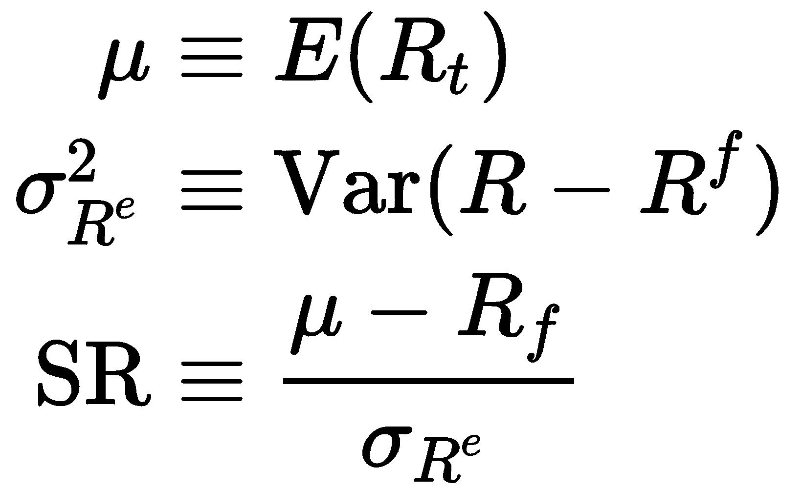

预期回报和波动性不可观测，但可以通过历史数据进行如下估计：

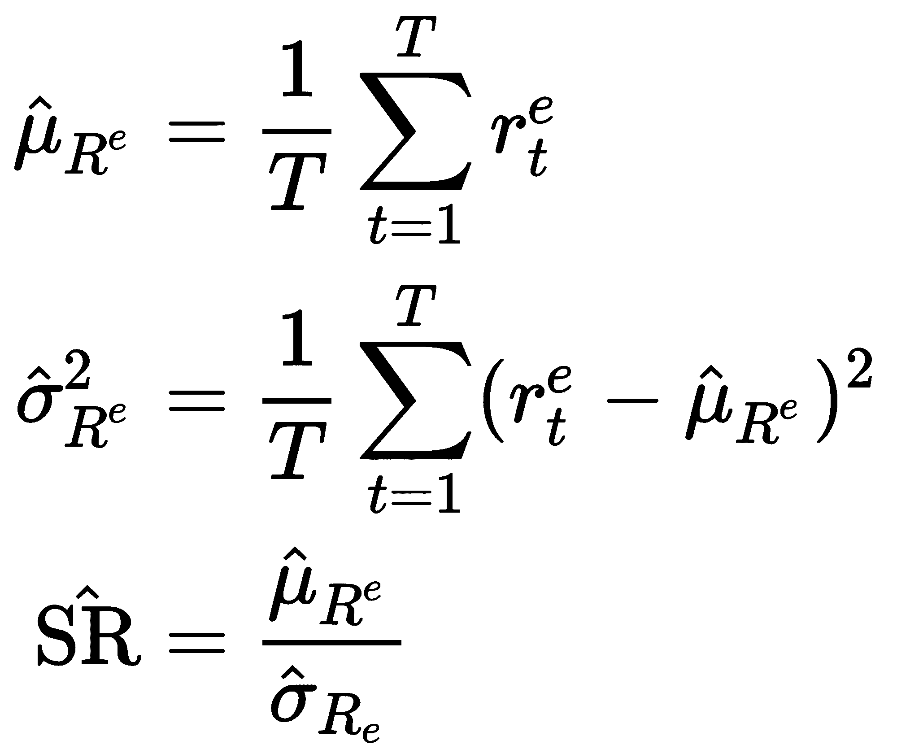

除非无风险利率波动（如新兴市场），否则超额回报和原始回报的标准差将相似。当夏普比率与除无风险利率以外的基准一起使用时，例如标准普尔 500 指数，称为**信息比率**。在这种情况下，它衡量了投资组合的超额回报，也称为**阿尔法**，相对于跟踪误差，即投资组合回报与基准回报的偏差。

对于**独立同分布**（**iid**）的回报，夏普比率估计量的分布的推导用于**统计显著性检验**，是根据大样本统计理论将 μ̂ 和 σ̂² 应用于**中心极限定理**的结果。

然而，金融回报往往违反 iid 假设。安德鲁·罗（Andrew Lo）已推导出对于平稳但具有自相关的回报，需要调整分布和时间聚合的必要调整。这很重要，因为投资策略的时间序列特性（例如，均值回归、动量和其他形式的串行相关）对于夏普比率估计本身可能有非常重要的影响，特别是当将夏普比率从高频数据年化时（Lo 2002）。

# 主动管理的基本定律

高 **信息比率**（**IR**）意味着相对于额外承担的风险而言表现优异。主动管理的基本定律将 IR 分解为**信息系数**（**IC**）作为预测技能的衡量标准，以及运用这种技能进行独立投注的能力。它总结了频繁参与（高广度）和出色表现（高 IC）的重要性：


IC 衡量了 alpha 因子与其信号产生的前向回报之间的相关性，并捕捉了经理的预测技能的准确性。策略的广度通过投资者在给定时间段内进行的独立投注数量来衡量，两个值的乘积与 IR 成正比，也称为**评估风险**（Treynor and Black）。

此框架已扩展以包括**转移系数**（TC），以反映可能限制信息比率低于其他情况下可实现水平的投资组合约束（例如，对卖空的限制）。 TC 代表了管理者将见解转化为投资组合投注的效率（Clarke 等人，2002 年）。

基本定律很重要，因为它突出了超额表现的关键驱动因素：准确的预测和能够进行独立预测并据此采取行动都很重要。在实践中，具有广泛投资决策集合的管理者可以在信息系数在 0.05 到 0.15 之间时获得显著的风险调整超额回报（如果有空间，可能包括模拟图表）。

在实践中，由于预测之间的横截面和时间序列相关性，估算策略的广度是困难的。

# 使用 pyfolio 进行样本内外表现分析

Pyfolio 通过许多标准指标方便地进行样本内外投资组合表现和风险分析。 它生成涵盖收益、头寸和交易分析的泪水图，以及在市场压力时期使用几种内置场景的事件风险分析，并包括贝叶斯样本外表现分析。

它依赖于投资组合收益和头寸数据，并且还可以考虑交易活动的交易成本和滑点损失。这些指标是使用可以独立使用的 `empyrical` 库计算的。

zipline 回测引擎生成的性能 `DataFrame` 可以转换为所需的 `pyfolio` 输入。

# 从 alphalens 获取 pyfolio 输入数据

然而，`pyfolio` 也可以直接与 `alphalens` 集成，并允许使用 `create_pyfolio_input` 创建 `pyfolio` 输入数据：

```py
from alphalens.performance import create_pyfolio_input

qmin, qmax = factor_data.factor_quantile.min(), 
             factor_data.factor_quantile.max()
input_data = create_pyfolio_input(alphalens_data,   
                                  period='1D',
                                  capital=100000,
                                  long_short=False,
                                  equal_weight=False,
                                  quantiles=[1, 5],
                                  benchmark_period='1D')
returns, positions, benchmark = input_data
```

有两种选项可以指定如何生成投资组合权重：

+   `long_short`: 如果为 `False`，则权重将对应于因子值除以其绝对值，以便负因子值生成空头。 如果为 `True`，则首先对因子值进行均值化，以使多头和空头相互抵消，投资组合是市场中性的。

+   `equal_weight`: 如果为 `True`，且 `long_short` 为 `True`，则资产将被分成两个相等大小的组，前半部分组成多头头寸，后半部分组成空头头寸。

如果 `factor_data` 包含每个资产的行业信息，则还可以为组创建多头-空头投资组合。

# 从 zipline 回测获取 pyfolio 输入数据

通过 `extract_rets_pos_txn_from_zipline` 可将 `zipline` 回测结果转换为所需的 `pyfolio` 输入：

```py
returns, positions, transactions = 
         extract_rets_pos_txn_from_zipline(backtest)
```

# 步进式测试样本外收

测试交易策略涉及对历史数据进行回测以微调 alpha 因子参数，以及对新市场数据进行前向测试以验证策略在样本外的表现良好或参数是否过于针对特定历史情况。

Pyfolio 允许指定一个样本外期间来模拟前向测试。在测试策略以获得统计上可靠的结果时，有许多方面需要考虑，我们将在这里讨论。

`plot_rolling_returns` 函数显示累计样本内和样本外回报与用户定义的基准（我们使用标准普尔 500 指数）的对比：

```py
from pyfolio.plotting import plot_rolling_returns
plot_rolling_returns(returns=returns,
                     factor_returns=benchmark_rets,
                     live_start_date='2017-01-01',
                     cone_std=(1.0, 1.5, 2.0))
```

图中包含一个锥形，显示扩展的置信区间，以指示基于随机游走假设的情况下不太可能出现的样本外收益。在模拟的 2017 年样本外期间，我们的策略表现不佳：

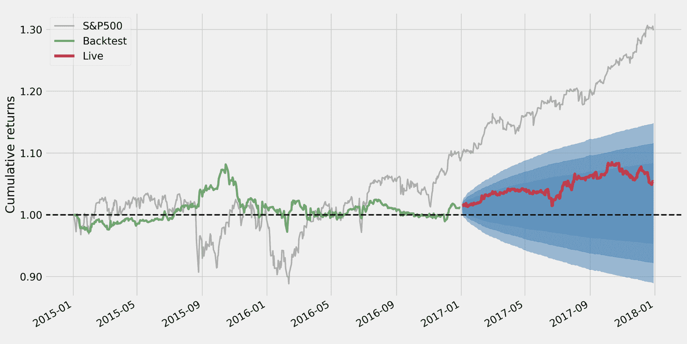

# 总体表现统计

`pyfolio` 提供了几个分析函数和图表。`perf_stats` 摘要显示了年度和累计回报、波动率、偏度和回报的峰度以及 SR。以下附加指标（也可以单独计算）最重要：

+   **最大回撤**: 从先前峰值的最高百分比损失

+   **Calmar 比率**: 年度组合回报相对于最大回撤

+   **Omega 比率**: 针对回报目标的概率加权收益与损失的比率，默认为零

+   **Sortino 比率**: 相对于下行标准差的超额回报

+   **尾部比率**: 右尾（收益，第 95 百分位数的绝对值）与左尾（损失，第 5 百分位数的绝对值）的比率

+   **每日风险价值 (VaR)**: 对应于每日平均值以下两个标准偏差的损失

+   **Alpha**: 由基准回报未解释的投资组合回报

+   **贝塔**: 对基准的暴露

```py
from pyfolio.timeseries import perf_stats
perf_stats(returns=returns, 
           factor_returns=benchmark_rets, 
           positions=positions, 
           transactions=transactions)
```

对于从 `MeanReversion` 因子派生的模拟的多空投资组合，我们获得以下性能统计数据：

| 指标 | 全部 | 样本内 | 样本外 | 指标 | 全部 | 样本内 | 样本外 |
| --- | --- | --- | --- | --- | --- | --- | --- |
| 年度回报率 | 1.80% | 0.60% | 4.20% | 偏度 | 0.34 | 0.40 | 0.09 |
| 累计回报 | 5.40% | 1.10% | 4.20% | 峰度 | 3.70 | 3.37 | 2.59 |
| 年度波动率 | 5.80% | 6.30% | 4.60% | 尾部比率 | 0.91 | 0.88 | 1.03 |
| 夏普比率 | 0.33 | 0.12 | 0.92 | 每日风险价值 | -0.7% | -0.8% | -0.6% |
| Calmar 比率 | 0.17 | 0.06 | 1.28 | 总杠杆 | 0.38 | 0.37 | 0.42 |
| 稳定性 | 0.49 | 0.04 | 0.75 | 每日换手率 | 4.70% | 4.40% | 5.10% |
| 最大回撤 | -10.10% | -10.10% | -3.30% | Alpha | 0.01 | 0.00 | 0.04 |
| Omega 比率 | 1.06 | 1.02 | 1.18 | 贝塔 | 0.15 | 0.16 | 0.03 |
| Sortino 比率 | 0.48 | 0.18 | 1.37 |  |  |  |  |

有关计算和解释投资组合风险和回报指标的详细信息，请参见附录。

# 回撤期和因子暴露

`plot_drawdown_periods(returns)`函数绘制了投资组合的主要回撤期，而其他几个绘图函数显示了滚动夏普比率和滚动因子暴露度，包括对市场贝塔或法玛-法国大小、增长和动量因子的暴露度：

```py
fig, ax = plt.subplots(nrows=2, ncols=2, figsize=(16, 10))
axes = ax.flatten()

plot_drawdown_periods(returns=returns, ax=axes[0])
plot_rolling_beta(returns=returns, factor_returns=benchmark_rets, 
                  ax=axes[1])
plot_drawdown_underwater(returns=returns, ax=axes[2])
plot_rolling_sharpe(returns=returns)
```

此图突出显示了各种撕裂表中包含的可视化子集，说明了 pyfolio 如何让我们深入了解绩效特征和对风险和收益基本驱动因素的暴露：

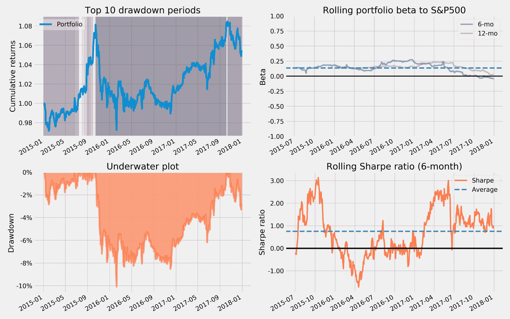

# 建模事件风险

Pyfolio 还包括各种事件的时间线，您可以使用它来比较投资组合在此期间与基准的表现，例如，在 2015 年秋天的英国脱欧公投后的抛售期间：

```py
interesting_times = extract_interesting_date_ranges(returns=returns)
interesting_times['Fall2015'].to_frame('pf') \
 .join(benchmark_rets) \
 .add(1).cumprod().sub(1) \
 .plot(lw=2, figsize=(14, 6), title='Post-Brexit Turmoil')
```

结果绘图如下所示：

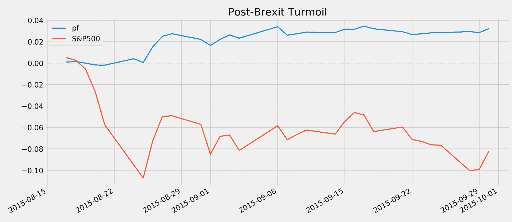

# 如何避免回测的陷阱

回测是使用历史数据模拟算法策略，目的是识别适用于新市场条件的模式。除了在不断变化的市场中预测不确定未来的一般挑战外，许多因素使得将样本内表现误认为发现真实模式变得非常可能。这些因素包括数据的方面、策略模拟的实施以及与统计测试及其解释相关的缺陷。使用更多计算资源、更大数据集和更复杂算法的风险使在噪声中发现明显模式的可能性增加。

我们将列出最严重和最常见的方法论错误，并参考多重测试的文献以获取更多详细信息。我们还将介绍通货紧缩夏普比率，以说明在分析中使用相同一组财务数据时如何调整重复试验导致的指标。

# 数据挑战

由于数据问题对回测有效性的挑战包括前瞻性偏差、生存偏差和异常值控制。

# 前瞻性偏差

从过去数据导出的交易规则的测试将在用于制定规则的样本数据中包含了实际上在数据所指代的时间点上并不可用或已知的信息时产生偏见结果。

此偏差的典型来源是未考虑报告的财务数据的常见事后校正。股票拆分或反向拆分也可能产生前瞻性偏差。当计算收益率时，每股收益数据来自公司财务报表，其频率较低，而市场价格至少每天都可获得。因此，EPS 和价格数据都需要同时调整拆分。

解决方法在于对进入回测的所有数据关联的时间戳进行仔细分析，以确保仅使用点时间数据。高质量的数据提供商，如 Compustat，确保满足这些标准。当点时间数据不可用时，需要假设关于报告滞后的情况。

# 生存者偏差

生存者偏差是在仅包含当前活跃证券数据并省略随着时间消失的资产（例如破产、退市或收购）时出现的。通常情况下，不再是投资范围一部分的证券表现不佳，包含这些情况可能会正向偏移回测结果。

自然的解决方法是验证数据集是否包括随时间可用的所有证券，而不仅仅是在运行测试时仍然可用的证券。

# 离群值控制

在分析之前的数据准备通常包括处理极端值，例如通过 Winsorize 或修剪。挑战在于确定真正不代表分析期的离群值，而不是当时市场环境的组成部分的极端值。许多市场模型假设在观察到极端值更频繁时的正常分布数据，如脂尾分布所暗示的那样。

解决方法涉及对极端值的概率进行仔细分析，并根据这一现实调整策略参数。

# 代表性时期

如果使用的时间段不足以充分反映当前环境，缺乏相关市场体制方面，并且不包含足够的数据点或捕获到不太可能重复出现的极端历史事件，则回测将不会产生代表性结果，无法推广到未来时期。

解决方法包括使用包括重要市场现象的样本期间，或生成反映相关市场特征的合成数据（有关实施指南，请参见*资源*部分）。

# 实施问题

与历史模拟实施相关的实际问题包括未能标记至市场，即准确反映基础市场价格并考虑到回撤，对交易的可用性、成本或市场影响，或者信号和交易执行的时间做出不切实际的假设。

# 标记至市场表现

尽管这种策略在回测过程中表现良好，但随着时间的推移可能导致无法接受的损失或波动。

解决方法包括随时间绘制性能或计算（滚动）风险度量，如**风险价值**（**VaR**）或 Sortino 比率（有关详细信息，请参见附录）。

# 交易成本

该策略可能假设需要对手方的空头交易，持有市场流动性较低的资产可能会在交易时引起市场波动，或者低估由于经纪费或滑点（即决定交易的市场价格与随后执行价格之间的差异）而产生的成本。

解决方案包括将宇宙限制在高度流动性并且对交易和滑点成本进行现实参数假设（如前述`zipline`示例所示）。 这还可以防止包括高衰减和因此周转率高的不稳定因子信号。

# 交易时机

模拟可能对α因子信号评估和结果交易的时间进行不切实际的假设。 例如，当下一笔交易仅在通常相差很大的开盘价时，可能会在收盘价时评估信号。 结果，如果使用收盘价来评估交易绩效，则回测将会有相当大的偏差。

解决方案涉及对信号到达顺序，交易执行和绩效评估的精心编排。

# 数据窥视和回测过拟合

对于回测有效性，包括已发表结果的最突出挑战与在策略选择过程中进行多次测试而发现虚假模式相关。 在同一数据上测试不同候选者之后选择策略可能会导致选择偏差，因为正面结果更可能是由于性能度量本身的随机性质。 换句话说，策略过于定制，或者过度拟合，以使得数据产生欺骗性的积极结果。

因此，回测表现并不具有信息性，除非报告试验次数以便评估选择偏差的风险。 在实际或学术研究中很少会出现这种情况，这引发了对许多已发表声明有效性的怀疑。

将回测过度拟合到特定数据集的风险不仅来自直接运行大量测试，还包括基于已知什么有效什么无效的先验知识设计的策略，也就是，他人在相同数据上运行的不同回测的知识。 结果，在实践中很难避免回测过拟合。

解决方案包括基于投资或经济理论而不是广泛的数据挖掘工作来选择进行测试的测试。 这还意味着在各种情境和场景中进行测试，包括可能在合成数据上进行测试。

# 最小回测长度和通胀后的夏普比率

Marcos Lopez de Prado ([`www.quantresearch.info/`](http://www.quantresearch.info/)) 广泛发表了关于回测风险以及如何检测或避免其的文章。 这包括回测过拟合的在线模拟器 ([`datagrid.lbl.gov/backtest/`](http://datagrid.lbl.gov/backtest/))。

另一个结果包括估算投资者应该要求的回测最小长度，考虑到尝试的试验次数，以避免选择在给定试验次数期间具有预期外样本 SR 为零的给定策略的情况。这意味着，例如，如果只有两年的每日回测数据可用，则不应尝试超过七种策略变化，如果只有五年的每日回测数据可用，则不应尝试超过 45 种策略变化。有关实现细节，请参阅参考文献。

De Lopez Prado 和 Bailey (2014) 还推导出一个通货膨胀的 SR，用于计算 SR 在控制多重测试、非正常收益和较短样本长度的通货膨胀效应的情况下具有统计显著性的概率（有关`03_multiple_testing`子目录的`deflated_sharpe_ratio.py`的 Python 实现和相关公式的推导，请参阅参考文献）。

# 回测的最优停止

除了将回测限制在可以从理论上证明的策略上，而不仅仅是数据挖掘练习上，一个重要的问题是何时停止进行额外的测试。

根据最优停止理论中*秘书问题*的解决方案，建议根据以下经验法则进行决策：测试一组合理策略的随机样本的 1/e（大约 37%） 的性能。然后，继续测试，直到找到一种优于之前测试的策略。

此规则适用于测试几种替代方案的情况，目标是尽快选择接近最佳方案，同时最小化假阳性风险。

# 如何管理投资组合风险和收益

投资组合管理旨在在金融工具中建立仓位，以实现与基准相关的所需风险回报平衡。在每个周期中，经理选择优化多样化以降低风险并实现目标收益的仓位。在不同周期内，将重新平衡仓位，以考虑由价格变动导致的权重变化，以实现或维持目标风险配置。

多样化使我们能够通过利用价格变动之间的相互作用来降低给定预期收益的风险，因为一种资产的收益可以弥补另一种资产的损失。哈里·马科维茨于 1952 年发明了**现代投资组合理论**（**MPT**），并提供了通过选择适当的投资组合权重来优化多样化的数学工具。马科维茨展示了投资组合风险，以投资组合收益的标准偏差来衡量，如何取决于所有资产的收益之间的协方差和它们的相对权重。这种关系意味着存在一种有效的投资组合边界，该边界最大化了投资组合收益，同时给定最大水平的投资组合风险。

然而，均值-方差前沿对于计算所需的输入估计非常敏感，例如预期回报、波动率和相关性。在实践中，将这些输入约束以减少抽样误差的均值-方差组合表现得更好。这些受限制的特殊情况包括等权、最小方差和风险均摊组合。

资本资产定价模型（CAPM）是建立在 MPT 风险-回报关系基础上的资产估值模型。它引入了一个概念，即投资者可以在市场均衡状态下期望持有风险资产的风险溢价；该溢价补偿了货币时间价值和无法通过分散化消除的整体市场风险（与特定资产的特异风险相对）。不可分散风险的经济基础包括宏观驱动因素对业务风险的影响，从而影响股票回报或债券违约。因此，资产的预期回报 E[r[i]]是无风险利率 r[f]和与资产暴露于市场组合预期超额回报 r[m]的风险溢价的总和，超额回报以无风险利率为基础：

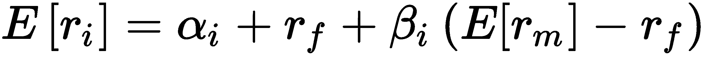

理论上，市场组合包含所有可投资资产，并且在均衡状态下将由所有理性投资者持有。在实践中，广义价值加权指数近似于市场，例如，用于美国股票投资的标普 500 指数。β[i]测量对市场组合超额回报的暴露。如果 CAPM 有效，则截距分量α[i]应为零。实际上，CAPM 的假设通常不成立，α值捕捉了未通过广义市场暴露解释的回报。

随着时间的推移，研究发现了非传统的风险溢价来源，例如动量或股票价值效应，解释了一些原始α值。经济上的合理性，例如投资者对新信息的过度反应或反应不足的行为偏见，为暴露于这些替代风险因素的风险溢价提供了理论支持。它们演变成了旨在捕捉这些替代贝塔的投资风格，这些投资风格也以专门的指数基金的形式可交易。在分离了这些替代风险溢价的贡献之后，真正的α值仅限于特异资产回报和管理者调整风险敞口的能力。

过去几十年来，有效市场假说（EMH）已经得到完善，以纠正 CAPM 的许多原始缺陷，包括信息不完全以及与交易、融资和代理相关的成本。许多行为偏见具有相同的效果，而一些摩擦被建模为行为偏见。

机器学习在使用市场、基本面和先前章节讨论的替代数据源的监督和无监督学习技术推导新的阿尔法因子方面发挥着重要作用。机器学习模型的输入包括原始数据和经过工程化处理以捕获信息信号的特征。机器学习模型还用于组合单个预测信号并提供更高聚合预测能力。

近几十年来，现代投资组合理论和实践已经发生了重大变化。我们将介绍：

+   均值-方差优化及其缺陷

+   诸如最小风险和 1/n 配置之类的替代方案

+   风险平价方法

+   风险因子方法

# 均值-方差优化

MPT 解决了最小化波动性以实现给定预期回报，或者在给定波动水平下最大化回报的最优投资组合权重。关键的前提输入是预期资产回报、标准差和协方差矩阵。

# 工作原理

多样化的原因在于投资组合回报的方差取决于资产的协方差，并且可以通过包括具有不完全相关性的资产将其降低到低于资产方差的加权平均值。特别是，给定投资组合权重向量 ω 和协方差矩阵 Σ，投资组合方差 σ[PF] 定义为：

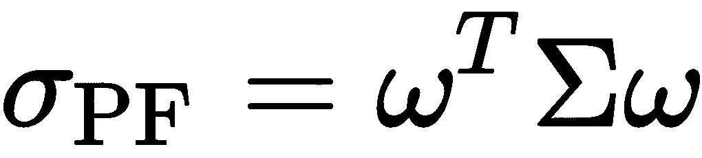

马科维茨表明，最大化期望投资组合回报以满足目标风险的问题具有等价的对偶表示，即最小化投资组合风险以满足目标期望回报水平。因此，优化问题变为：

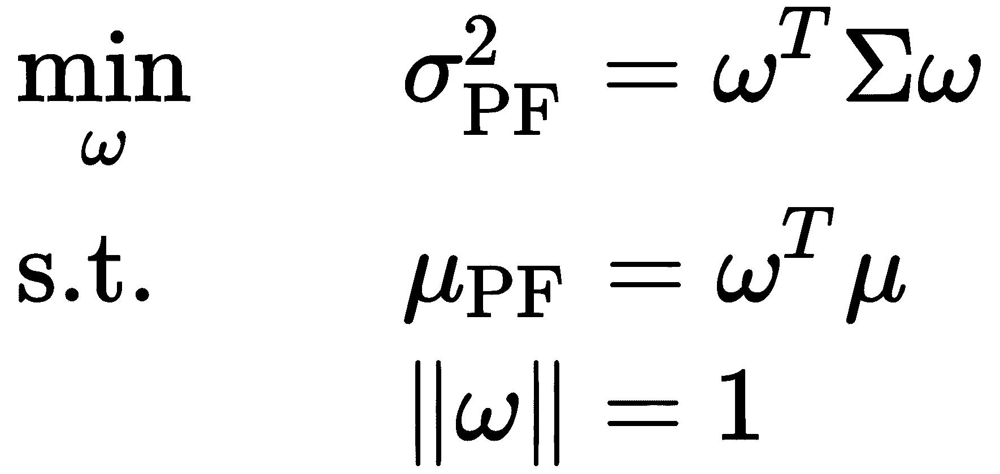

# Python 中的有效前沿

我们可以使用 `scipy.optimize.minimize` 和资产回报、标准差和协方差矩阵的历史估计来计算有效前沿。 代码可以在本章的 repo 的 `efficient_frontier` 子文件夹中找到，并实现以下步骤序列：

1.  模拟使用狄利克雷分布生成随机权重，并使用历史回报数据计算每个样本投资组合的均值、标准差和夏普比：

```py
def simulate_portfolios(mean_ret, cov, rf_rate=rf_rate, short=True):
    alpha = np.full(shape=n_assets, fill_value=.01)
    weights = dirichlet(alpha=alpha, size=NUM_PF)
    weights *= choice([-1, 1], size=weights.shape)

    returns = weights @ mean_ret.values + 1
    returns = returns ** periods_per_year - 1
    std = (weights @ monthly_returns.T).std(1)
    std *= np.sqrt(periods_per_year)
    sharpe = (returns - rf_rate) / std

    return pd.DataFrame({'Annualized Standard Deviation': std,
                         'Annualized Returns': returns,
                         'Sharpe Ratio': sharpe}), weights
```

1.  设置二次优化问题，以求解给定回报的最小标准差或最大夏普比。为此，定义衡量关键指标的函数：

```py
def portfolio_std(wt, rt=None, cov=None):
    """Annualized PF standard deviation"""
    return np.sqrt(wt @ cov @ wt * periods_per_year)

def portfolio_returns(wt, rt=None, cov=None):
    """Annualized PF returns"""
    return (wt @ rt + 1) ** periods_per_year - 1

def portfolio_performance(wt, rt, cov):
    """Annualized PF returns & standard deviation"""
    r = portfolio_returns(wt, rt=rt)
    sd = portfolio_std(wt, cov=cov)
    return r, sd 
```

1.  定义一个目标函数，表示 `scipy` 的 `minimize` 函数要优化的负夏普比，考虑到权重被限制在 [-1, 1] 范围内，并且绝对值之和为一：

```py
def neg_sharpe_ratio(weights, mean_ret, cov):
    r, sd = portfolio_performance(weights, mean_ret, cov)
    return -(r - rf_rate) / sd

weight_constraint = {'type': 'eq',
                     'fun': lambda x: np.sum(np.abs(x)) - 1}

def max_sharpe_ratio(mean_ret, cov, short=True):
    return minimize(fun=neg_sharpe_ratio,
                    x0=x0,
                    args=(mean_ret, cov),
                    method='SLSQP',
                    bounds=((-1 if short else 0, 1),) * n_assets,
                    constraints=weight_constraint,
                    options={'tol':1e-10, 'maxiter':1e4})
```

1.  通过迭代一系列目标回报范围并解决相应的最小方差投资组合来计算有效前沿。投资组合风险和回报的优化问题以及权重作为函数的约束可以如下制定：

```py
def neg_sharpe_ratio(weights, mean_ret, cov):
    r, sd = pf_performance(weights, mean_ret, cov)
    return -(r - RF_RATE) / sd

def pf_volatility(w, r, c):
    return pf_performance(w, r, c)[1]

def efficient_return(mean_ret, cov, target):
    args = (mean_ret, cov)
    def ret_(weights):
        return pf_ret(weights, mean_ret)

    constraints = [{'type': 'eq', 'fun': lambda x: ret_(x) - 
                     target},
                   {'type': 'eq', 'fun': lambda x: np.sum(x) - 1}]
    bounds = ((0.0, 1.0),) * n_assets
    return minimize(pf_volatility,
                    x0=x0,
                    args=args, method='SLSQP',
                    bounds=bounds,
                    constraints=constraints)
```

1.  解决方案需要在可接受值范围内进行迭代，以识别最优的风险收益组合：

```py
def min_vol_target(mean_ret, cov, target, short=True):

    def ret_(wt):
        return portfolio_returns(wt, mean_ret)

    constraints = [{'type': 'eq', 'fun': lambda x: ret_(x) - target},
                     weight_constraint]

    bounds = ((-1 if short else 0, 1),) * n_assets
    return minimize(portfolio_std, x0=x0, args=(mean_ret, cov),
                    method='SLSQP', bounds=bounds,
                    constraints=constraints,
                    options={'tol': 1e-10, 'maxiter': 1e4})

def efficient_frontier(mean_ret, cov, ret_range):
    return [min_vol_target(mean_ret, cov, ret) for ret in ret_range]
```

模拟产生了可行投资组合的子集，有效前沿确定了在样本内数据可行的最优收益风险组合。下图显示了结果，包括最小方差投资组合和最大化夏普比率的投资组合，以及我们在以下章节讨论的几种替代优化策略产生的若干投资组合。

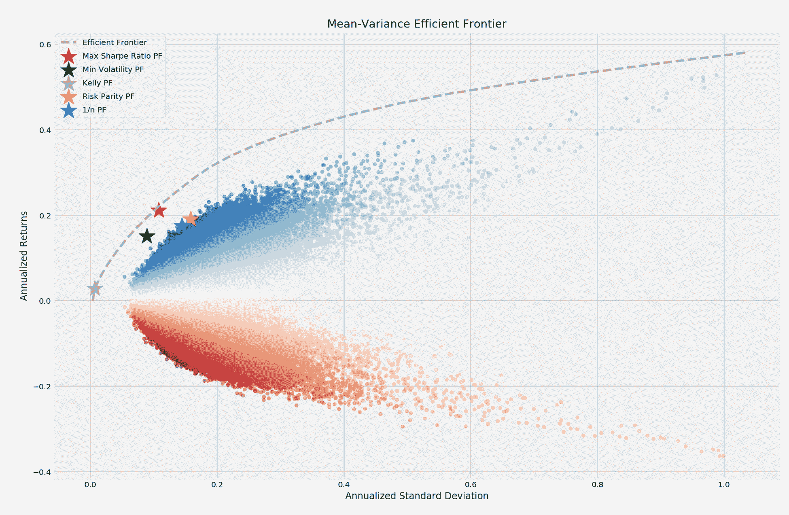

投资组合优化可以在交易策略的每一次评估步骤中运行，以优化仓位。

# 挑战与缺陷

前述的均值方差前沿示例说明了样本内、向后看的优化。实际上，投资组合优化需要前瞻性输入。预期收益难以准确估计。

协方差矩阵的估计可能更加可靠，这导致了几种替代方法的出现。然而，具有相关资产的协方差矩阵会引发计算挑战，因为优化问题需要求矩阵的逆。高条件数导致数值不稳定性，从而产生马尔科维茨诅咒：需要更多分散化（通过相关投资机会），算法产生的权重越不可靠。

许多投资者更喜欢使用具有较少繁琐输入要求的投资组合优化技术。我们现在介绍几种旨在解决这些缺点的替代方法，包括基于机器学习的较新方法。

# 均值方差优化的替代方案

对于均值方差优化问题的准确输入存在挑战，这导致采用了几种实用的替代方法，限制均值、方差或两者，或者省略更具挑战性的回报估计，如风险平价方法。

# 均等权重投资组合

简单投资组合提供了有用的基准，以衡量生成过度拟合风险的复杂模型的增值。最简单的策略——等权重投资组合——已被证明是表现最佳的策略之一。

2009 年，德米格尔、加拉皮和乌帕尔（de Miguel, Garlappi, and Uppal）比较了各种均值方差优化器产生的投资组合的样本外表现，包括鲁棒贝叶斯估计器、投资组合约束和投资组合的最优组合，与简单的 1/N 规则相比。他们发现，1/N 投资组合的夏普比率高于每个资产类别的头寸，这是由于样本外复杂优化的估计误差成本通常超过了其收益的好处所致。

均等权重投资组合也包括在上述有效前沿图中。

# 最小方差投资组合

另一个选择是**全球最小方差**（**GMV**）组合，它优先考虑风险最小化。它显示在有效边界图中，并可以通过使用均值-方差框架最小化投资组合标准差来计算如下：

```py
def min_vol(mean_ret, cov, short=True):
    return minimize(fun=portfolio_std,
                    x0=x0,
                    args=(mean_ret, cov),
                    method='SLSQP',
                    bounds=bounds = ((-1 if short else 0, 1),) * 
                          n_assets,
                          constraints=weight_constraint,
                          options={'tol': 1e-10, 'maxiter': 1e4})
```

相应的`min.`波动性组合位于上述有效边界上。

# 全球投资组合优化 - 黑-利特曼方法

Black 和 Litterman（1992）的全球投资组合优化方法将经济模型与统计学习相结合，因此在许多情况下生成的预期收益估计是合理的，因此很受欢迎。

这种技术背离了市场是由 CAPM 均衡模型所隐含的均值-方差投资组合的假设，并且建立在这样一个事实之上，即观察到的市场资本化可以被视为市场分配的最优权重。市场权重反映了市场价格，而市场价格又体现了市场对未来收益的预期。

因此，这种方法可以从市场足够接近均衡的假设开始逆向工程出未来预期收益，并且允许投资者使用缩小估计器将这些估计值调整到他们自己的信念中。该模型可以解释为是投资组合优化的贝叶斯方法。我们将在第九章中介绍贝叶斯方法，*贝叶斯机器学习*。

# 如何确定下注的大小 - 凯利法则

凯利法则在赌博中有着悠久的历史，因为它提供了在一系列变化的（但是有利的）赔率下，为了最大化期末财富而在每一次下注上押注多少的指导。这个法则于 1956 年由约翰·凯利发布，他是贝尔实验室的克劳德·香农的同事，作品名为《信息率的新解释》。他被新晋问答节目《$64,000 问题》上观众对候选人下注的情况所吸引，这些观众利用西海岸的三小时延迟获取关于获胜者的内部消息。

凯利将其法则与香农的信息理论联系起来，以求解在赔率有利但存在不确定性时最优的长期资本增长下注。他的法则将每场比赛成功的几率的对数财富最大化，并且包含了隐含的破产保护，因为 log(0)是负无穷，所以凯利赌徒自然会避免失去一切。

# 下注的最佳大小

凯利开始分析具有二元胜负结果的游戏。关键变量有：

+   **b**：赔率定义了每 1 美元下注的赢得金额。赔率=5/1 意味着如果下注赢了，将获得 5 美元的收益，加上 1 美元的本金。

+   **p**：概率定义了有利结果的可能性。

+   **f**：要下注的当前资本份额。

+   **V**：由于下注而产生的资本价值。

凯利法则的目标是最大化无限次重复下注的价值增长率，*G*：

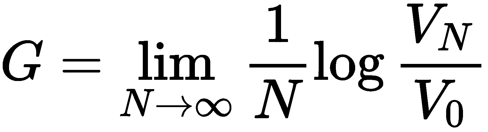

当*W*和*L*分别代表赢和输的次数时，那么：

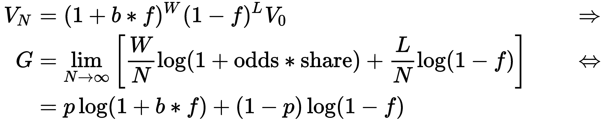

我们可以通过对*f*最大化来最大化增长率*G*，如下所示，使用`sympy`进行说明：

```py
from sympy import symbols, solve, log, diff

share, odds, probability = symbols('share odds probability')
Value = probability * log(1 + odds * share) + (1 - probability) * log(1 
        - share)
solve(diff(Value, share), share)

[(odds*probability + probability - 1)/odds]
```

我们得到了要投注的资本的最佳份额：

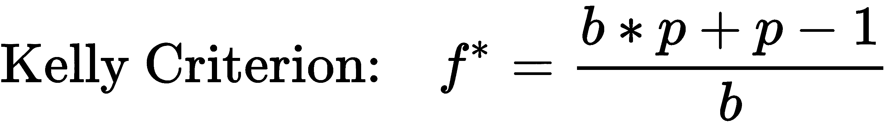

# 最优投资 - 单一资产

在金融市场的背景下，结果和替代方案都更加复杂，但凯利规则的逻辑仍然适用。这一规则由首次将其成功应用于赌博（在《击败庄家》中描述）的埃德·索普推广，后来他开始了成功的对冲基金普林斯顿/纽波特合伙企业。

对于连续结果，资本的增长率由不同回报的概率分布的积分定义，可以进行数值优化：

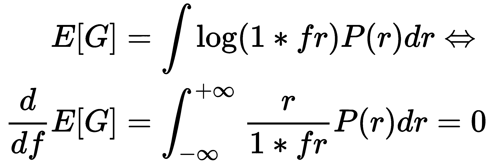

我们可以使用`scipy.optimize`模块来解决这个表达式以得到最优*f*^* 的值：

```py
def norm_integral(f, m, st):
    val, er = quad(lambda s: np.log(1+f*s)*norm.pdf(s, m, st), m-3*st, 
                   m+3*st)
    return -val

def norm_dev_integral(f, m, st):
    val, er = quad(lambda s: (s/(1+f*s))*norm.pdf(s, m, st), m-3*st, 
                   m+3*st)
    return val

m = .058
s = .216
# Option 1: minimize the expectation integral
sol = minimize_scalar(norm_integral, args=(
                m, s), bounds=[0., 2.], method='bounded')
print('Optimal Kelly fraction: {:.4f}'.format(sol.x))
```

# 最优投资 - 多资产

我们将使用一个涉及各种股票的例子。E. Chan（2008）阐述了如何到达凯利规则的多资产应用，并且结果等同于（可能是杠杆的）从均值方差优化中获得的最大夏普比率组合。

计算涉及精度矩阵（协方差矩阵的逆矩阵）和回报矩阵的点积：

```py
mean_returns = monthly_returns.mean()
cov_matrix = monthly_returns.cov()
precision_matrix = pd.DataFrame(inv(cov_matrix), index=stocks, columns=stocks)
kelly_wt = precision_matrix.dot(mean_returns).values
```

凯利组合也显示在有效前沿图表中（通过标准化使绝对权重总和为一）。许多投资者倾向于减少凯利权重以减少该策略的波动性，半凯利已经变得特别流行。

# 风险平价

过去 15 年的两次全球股票市场危机，持续上升的收益曲线以及利率的普遍下降使风险平价看起来像是一个特别引人注目的选择。许多机构为风险平价分配了战略性的资产配置，以进一步实现投资组合的多样化。

一个简单的风险平价分配方案根据它们方差的倒数来分配资产，忽略相关性，特别是回报预测：

```py
var = monthly_returns.var()
risk_parity_weights = var / var.sum()
```

风险平价投资组合也显示在本节开头的有效前沿图表中。

# 风险因素投资

估计输入的另一种框架是逐步解析推动资产风险和回报的基础决定因素或因子。如果我们了解因子如何影响回报，并且我们了解这些因子，我们将能够构建更稳健的投资组合。

因子投资的概念超越了资产类别标签，以最大化分散化的好处来看待潜在的因子风险。与区分投资工具的标签（例如对冲基金或私募股权）不同，因子投资旨在根据基本风险因素的暴露差异来识别不同的风险-回报配置文件。均值-方差投资的天真方法将（人为的）分组视为不同的资产类别，并将其插入均值-方差优化器。因子投资认识到这些分组与传统资产类别共享许多相同的因子风险。分散化的好处可能被夸大，正如投资者在上一次危机中发现的那样，当有风险资产类别之间的相关性增加时，由于暴露于相同的潜在因子风险。

# 分层风险平价

均值-方差优化对预期收益和这些收益的协方差的估计非常敏感。当收益高度相关时，协方差矩阵的求逆也变得更加具有挑战性和不准确，这在实践中经常发生。其结果被称为马科维茨诅咒：当分散投资更重要时，因为投资相关，传统的投资组合优化器可能会产生不稳定的解决方案。分散化的好处可能会被错误的估计所抵消。正如讨论的那样，即使是天真的等权重投资组合也可以在样本外击败均值-方差和基于风险的优化。

更健壮的方法已经包括了额外的约束（Clarke et al., 2002），贝叶斯先验（Black and Litterman, 1992），或者使用缩小估计器使精度矩阵更加稳定（Ledoit 和 Wolf [2003]，在 scikit-learn 中可用（[`scikit-learn.org/stable/modules/generated/sklearn.covariance.LedoitWolf.html`](http://scikit-learn.org/stable/modules/generated/sklearn.covariance.LedoitWolf.html)）。与此相反，分层风险平价（HRP）利用无监督机器学习实现了更优异的样本外投资组合配置。

最近的投资组合优化创新利用图论和分层聚类构建投资组合的三个步骤（Lopez de Prado, 2015）：

1.  定义一个距离度量，使相关资产彼此接近，并应用单链接聚类来识别分层关系。

1.  利用分层相关结构来准对角化协方差矩阵。

1.  使用自上而下的反方差加权，利用递归二分搜索将聚类资产视为投资组合建设中的互补而不是替代品，并减少自由度的数量。

Raffinot（2016）提出了构建**分层聚类投资组合**（**HCP**）的相关方法。从概念上讲，金融市场等复杂系统往往具有结构，并且通常以层次方式组织，而层次结构中元素之间的相互作用塑造了系统的动态。相关矩阵也缺乏层次结构的概念，这使得权重可以自由变化，并可能以意想不到的方式变化。

JPM 已经在各种股票市场上测试了 HRP 和 HCP。特别是，与天真的多样化、最大多样化投资组合或 GMV 投资组合相比，HRP 产生了相等或更高的风险调整回报和夏普比率。

我们将在第十二章中介绍 Python 实现，*无监督学习*。

# 摘要

在本章中，我们涵盖了投资组合管理的重要主题，这涉及将投资头寸组合起来以管理风险与回报的权衡目标。我们介绍了`pyfolio`来计算和可视化关键的风险和回报指标，并比较了各种算法的表现。

我们看到准确预测对于优化投资组合权重和最大化分散效益是多么重要。我们还探讨了 ML 如何通过从资产收益协方差矩阵中学习层次关系来促进更有效的投资组合构建。

现在我们将继续本书的第二部分，重点介绍 ML 模型的使用。这些模型将通过更有效地利用更多样化的信息来捕捉比目前更突出的简单 Alpha 因子更复杂的模式，从而产生更准确的预测。

我们将开始通过使用交叉验证来训练、测试和调整线性回归和分类模型，以实现稳健的样本外表现。我们还将把这些模型嵌入到定义和回测算法交易策略的框架中，这是我们在过去两章中介绍的。
