# 第六章：机器学习过程

在本章中，我们将开始说明您可以如何使用广泛的监督和非监督**机器学习**（**ML**）模型进行算法交易。我们将在演示与各种 Python 库相关的相关应用之前，解释每个模型的假设和用例。模型的分类将包括：

+   用于截面、时间序列和面板数据的回归和分类的线性模型

+   广义加法模型，包括非线性基于树的模型，如**决策树**

+   集成模型，包括随机森林和梯度提升机

+   用于降维和聚类的非监督线性和非线性方法

+   神经网络模型，包括循环和卷积架构

+   强化学习模型

我们将这些模型应用到本书第一部分介绍的市场、基本和替代数据来源中。我们将进一步建立在迄今为止涵盖的内容之上，向您展示如何将这些模型嵌入到算法交易策略中，以生成或结合阿尔法因子，或优化投资组合管理流程，并评估其性能。

许多这些模型及其用途具有共同的几个方面。本章涵盖了这些共同的方面，以便我们可以在后续章节中专注于模型特定的用法。它们包括通过优化目标或损失函数从数据中学习功能关系的总体目标。它们还包括密切相关的测量模型性能的方法。

我们区分了无监督和监督学习，以及监督回归和分类问题，并概述了算法交易的用例。我们将使用监督学习进行统计推断输入和输出数据之间关系与使用未来输入进行未来输出预测之间的对比。我们还说明了预测错误是由于模型的偏差或方差，或者数据中的噪声信号比高而引起的。最重要的是，我们提供了诊断错误来源并改善模型性能的方法。

在本章中，我们将涵盖以下主题：

+   使用数据进行监督和非监督学习的原理

+   如何应用机器学习工作流程

+   如何为回归和分类制定损失函数

+   如何训练和评估监督学习模型

+   偏差-方差权衡如何影响预测错误

+   如何诊断和解决预测错误

+   如何使用交叉验证训练模型来管理偏差-方差权衡

+   如何使用 scikit-learn 实现交叉验证

+   为什么金融数据的性质需要不同的样本外测试方法

如果您对机器学习已经非常熟悉，请随意跳过，直接开始学习如何使用线性模型为算法交易策略生成和组合阿尔法因子。

# 从数据中学习

ML 有许多定义，它们都围绕数据中有意义的模式的自动检测。两个著名的例子包括：

+   AI 先驱**亚瑟·塞缪尔森**在 1959 年将 ML 定义为计算机科学的一个子领域，赋予计算机在没有明确编程的情况下学习的能力。

+   **托尼·米切尔**，该领域的一位当前领军人物，1998 年更加具体地确定了一个明确定义的学习问题：一个计算机程序根据任务和绩效指标从经验中学习，看任务的绩效是否随经验提高而提高。

经验以训练数据的形式呈现给算法。与以往试图构建解决问题的机器的尝试的主要区别在于，算法用于做出决策的规则是从数据中学习的，而不是被编程或硬编码——这是上世纪 80 年代突出的专家系统的情况。

自动学习的关键挑战在于识别训练数据中的模式，在将模型的学习泛化到新数据时这些模式是有意义的。模型可能识别的潜在模式数量庞大，而训练数据仅构成了算法未来执行任务所需的更大现象集合的一部分样本。可能从给定输入生成给定输出的函数数量无限，这使得搜索过程在没有对可接受函数集合施加限制的情况下无法解决。

算法能够学习的模式类型受到其假设空间的大小以及样本数据中包含的信息量的限制。假设空间的大小在算法之间有很大的变化。一方面，这种限制使得成功的搜索成为可能，另一方面，它暗示了归纳偏见，因为算法从训练样本推广到新数据。

因此，关键挑战变成了如何选择具有足够大的假设空间以包含学习问题解决方案的模型，同时又足够小以确保在给定训练数据大小的情况下可靠的泛化。随着越来越多的信息化数据，具有更大假设空间的模型将会成功。

**无免费午餐定理**指出没有通用的学习算法。相反，学习者的假设空间必须根据关于任务领域的先验知识来定制，以便搜索有意义的模式成功。在本章中，我们将密切关注模型对特定任务的数据关系所做的假设，并强调通过数据探索获得的经验证据与这些假设匹配的重要性。掌握任务所需的过程可以区分为监督学习、无监督学习和强化学习。

# 监督学习

监督学习是最常用的机器学习类型。本书的大部分章节将致力于学习该类别中模型的各种应用。术语*监督*意味着有一个结果变量指导学习过程，即，它教会算法任务的正确解决方案正在学习。监督学习旨在将从个别样本学到的输入和输出数据之间的功能关系泛化，并将其应用于新数据。

输出变量也可根据领域不同交替称为标签、目标、结果、内生或左手变量。我们将对观测值*i = 1, ..., N*使用*y[i]*，或者在向量表示中使用*y*。某些任务由多个结果表示，也称为**多标签问题**。监督学习问题的输入数据也称为特征、外生和右手变量，用*x*[*i* ]表示*i = 1, ..., N*的一系列特征，或者在矩阵表示中使用*X*。

解决监督学习问题的解决方案是一个函数（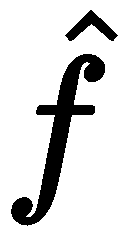），它表示模型从样本中学到的输入-输出关系，并逼近真实关系，用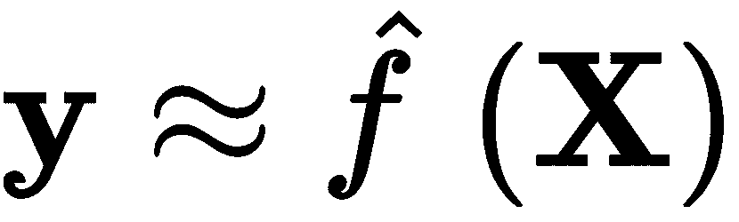表示。这个函数可以用来推断变量之间的统计关系，甚至可能是因果关系，超出样本范围，或者用来预测新输入数据的输出。

两个目标面临着一个重要的权衡：更复杂的模型有更多*移动部件*，能够表示更微妙的关系，但也可能更难以检查。它们也可能过度拟合并学习到训练样本特有的随机噪音，而不是代表输入-输出关系一般模式的系统信号。另一方面，过于简单的模型会忽略信号并产生偏倚的结果。这种权衡在监督学习中被称为**偏差-方差权衡**，但概念上这也适用于其他形式的机器学习，过于复杂的模型可能在训练数据之外表现不佳。

# 无监督学习

在解决无监督学习问题时，我们只观察特征，没有测量结果。任务不是预测未来结果或推断变量之间的关系，而是在没有任何结果信息指导搜索过程的情况下，在数据中找到结构。

通常，无监督算法旨在学习输入数据的新表示，这对其他任务是有用的。这包括提出标签以识别观察结果之间的共性，或者是一个总结性描述，捕捉到相关信息，同时需要数据点或特征。无监督学习算法在他们试图发现的结构的性质方面也不同于监督学习算法所做出的假设。

# 应用

无监督学习有几种有用的用途可应用于算法交易，包括以下内容：

+   将具有相似风险和回报特征的证券分组在一起（请参阅本章的分层风险平价（这是关于投资组合优化的））

+   找到驱动大量证券表现的少数风险因素

+   识别系统地不同的交易和价格模式，可能具有较高的风险

+   识别文档体系（例如，收益电话转录）中的潜在主题，这些主题包括那些文档中最重要的方面

在高层次上，这些应用依赖于识别聚类的方法和降低数据维度的方法。

# 聚类算法

聚类算法使用相似性度量来识别包含相似信息的观察或数据属性。它们通过将大量数据点分配给较少数量的聚类来概括数据集，以使聚类成员彼此之间的关系比与其他聚类成员更密切。

聚类算法主要在于它们将产生何种类型的聚类，这意味着对数据生成过程有不同的假设，列举如下：

+   **K 均值聚类**：数据点属于相等大小的*k*个椭圆形聚类之一

+   **高斯混合模型**：数据点是由任何各种多元正态分布生成的

+   **基于密度的聚类**：聚类具有任意形状，并且仅由附近数据点的最小数量的存在来定义

+   **层次聚类**：数据点属于由逐渐合并较小聚类形成的各种超集组

# 降维

降维生成新的数据，捕捉源数据中包含的最重要信息。这些算法不是将现有数据分组成聚类，而是将现有数据转换为使用显著较少的特征或观察来表示原始信息的新数据集。

算法在生成新数据集的性质上存在差异，如下列表所示：

+   **主成分分析（PCA）**：找到捕获现有数据集中大部分方差的线性变换

+   **流形学习**：确定一个非线性转换，产生数据的低维表示

+   **自编码器**：使用神经网络以最小的信息损失对数据进行非线性压缩

我们将在接下来的几章中更深入地探讨线性、非线性和基于神经网络的无监督学习模型，包括**自然语言处理**（**NLP**）在主题建模和 Word2vec 特征提取形式的重要应用。

# 强化学习

**强化学习**是第三种 ML 类型。它旨在选择在给定描述上下文或环境的输入数据集的情况下产生最高奖励的行动。它既动态又交互：正面和负面奖励的流影响算法的学习，现在采取的行动可能影响环境和未来奖励。

在已学习到可以产生某种奖励的行动的开发和可能增加未来奖励的新行动之间的权衡导致了一种*试错*方法。强化学习使用动态系统理论，特别是使用马尔可夫决策过程的最优控制来优化代理的学习，其信息不完全。

强化学习与监督学习不同，监督学习中训练数据既提供了上下文又提供了算法的正确决策。它专为交互式设置设计，其中结果只在一段时间后才可用，并且学习必须以*在线*或连续的方式进行，因为代理获取新经验。然而，人工智能**AI**中一些最显著的进展涉及使用深度学习来近似动作、环境和未来奖励之间的功能关系的强化学习。它还与无监督学习不同，因为反馈的后果将可用，尽管会有延迟。

强化学习特别适用于算法交易，因为在不确定、动态环境中追求最大化回报的代理概念与与金融市场互动的投资者或交易策略有很多共同之处。这种方法已成功应用于游戏代理，尤其是围棋，但也用于复杂的视频游戏。它还用于机器人技术——例如，自动驾驶汽车——或根据用户交互个性化服务，例如网站提供的内容。我们将在第二十一章介绍强化学习方法，用于构建算法交易策略，*强化学习*。

# 机器学习工作流程

为算法交易策略开发一个机器学习解决方案需要系统化的方法，以最大化成功的机会，同时节约资源。使过程透明且可复制非常重要，以便促进协作、维护和后续的改进。

下图概述了从问题定义到部署预测解决方案的关键步骤：

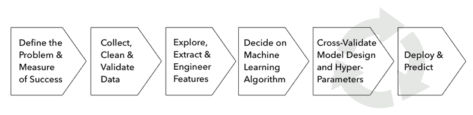

整个过程在整个序列中是迭代的，不同阶段需要的工作量会根据项目而变化，但这个过程通常应包括以下步骤：

1.  确定问题框架，确定目标指标，并定义成功。

1.  源，清理和验证数据。

1.  理解你的数据并生成信息性特征。

1.  选择一个或多个适合你的数据的机器学习算法。

1.  训练，测试和调整你的模型。

1.  使用你的模型解决原始问题。

我们将在接下来的章节中通过一个简单的例子来演示这些步骤，以阐明一些关键点。

# 基本步骤- k 最近邻。

本章书籍的 GitHub 存储库中的`machine_learning_workflow.ipynb`笔记本包含了几个示例，演示了使用房价数据集进行机器学习工作流程。

我们将使用相当简单的**k 最近邻**（**KNN**）算法，它允许我们解决回归和分类问题。

在其默认的`sklearn`实现中，它识别出与欧几里德距离最近的`k`个数据点来进行预测。在分类或回归情况下，它分别预测邻居中最频繁的类别或平均结果。

# 确定问题框架-目标和指标。

任何机器学习练习的起点都是其旨在解决的最终用例。有时，这个目标将是统计推断，以识别变量之间的关联或甚至因果关系。然而，最常见的目标通常是直接预测结果以产生交易信号。

推断和预测都使用指标来评估模型实现其目标的程度。我们将重点放在常见的目标函数和相应的误差度量上，用于可以通过输出变量类型来区分的预测模型：连续输出变量意味着回归问题，分类变量意味着分类问题，而有序分类变量的特殊情况则意味着排名问题。

问题可能是多个 alpha 因子的高效组合，并且可以构建为一个回归问题，旨在预测回报，一个旨在预测未来价格走势方向的二元分类问题，或者一个旨在将股票分配到不同绩效类别的多类问题。在接下来的部分中，我们将介绍这些目标，并探讨如何衡量和解释相关的误差度量。

# 预测与推断的对比

由监督学习算法产生的功能关系可用于推断——即获得有关结果生成方式的见解——或用于预测——即为未知或未来输入生成准确的输出估计（由表示），用*X*表示未来输入）。

对于算法交易，推断可用于估计资产回报对风险因素的因果或统计依赖性，而预测可用于预测风险因素。将两者结合起来可以产生资产价格的预测，进而可以转化为交易信号。

统计推断涉及从样本数据中推断出关于潜在概率分布或总体参数的结论。可能的结论包括有关个别变量分布特征的假设检验，或关于变量之间数值关系的存在或强度的假设检验。它们还包括统计指标的点估计或区间估计。

推断取决于首次生成数据的过程的假设。我们将审查这些假设以及用于线性模型推断的工具，其中它们被很好地确立。更复杂的模型对输入和输出之间的结构关系做出较少的假设，而是更开放地处理函数逼近任务，同时将数据生成过程视为黑盒。这些模型，包括决策树、集成模型和神经网络，在用于预测任务时专注并经常优于其他模型。然而，随机森林最近获得了一种我们将在后面介绍的推断框架。 

# 因果推断

因果推断旨在识别关系，以便某些输入值暗示某些输出值，例如，一定数量的宏观变量组合导致特定资产价格以某种方式变化，假设所有其他变量保持不变。

关于两个或多个变量之间关系的统计推断会产生相关性度量，这些度量只有在满足几个其他条件时才能解释为因果关系——例如，当已经排除了替代解释或逆向因果关系时。满足这些条件需要一个实验设置，其中所有感兴趣的相关变量都可以完全控制，以隔离因果关系。或者，准实验性设置以随机方式使观察单位暴露于输入变化，以排除其他可观察或不可观察的特征对环境变化观察效果的影响。

这些条件很少被满足，因此推断性结论需要谨慎对待。同样适用于预测模型的性能，后者也依赖于特征和输出之间的统计关联，该关联可能会随着不属于模型一部分的其他因素而改变。

KNN 模型的非参数性质不利于推断，因此我们将推迟工作流程中的这一步，直到我们在下一章遇到线性模型为止。

# 回归问题

回归问题旨在预测连续变量。**均方根误差**（**RMSE**）是最流行的损失函数和误差度量，其中之一是因为它是可微的。损失是对称的，但在计算中较大的误差权重更重。使用平方根的优势在于以目标变量的单位度量误差。与**RMSE 对数误差**（**RMSLE**）结合使用相同的度量在目标受指数增长影响时是适当的，因为其不对称惩罚使得负误差权重小于正误差。您也可以先对目标进行对数转换，然后使用 RMSE，正如我们在本节后面的示例中所做的那样。

**平均绝对误差**（**MAE**）和**中位数绝对误差**（**MedAE**）是对称的，但不会使较大的误差权重更重。MedAE 对异常值具有鲁棒性。

解释的方差分数计算模型解释的目标方差所占比例，介于 0 和 1 之间。R²分数或决定系数产生相同的结果，即残差的平均值为 0，但在其他情况下可能不同。特别地，当在样本外数据上计算时（或者对于没有截距的线性回归），它可以为负。

下表定义了用于计算的公式以及可从`metrics`模块导入的相应`sklearn`函数。`scoring`参数与自动化的训练-测试函数（例如`cross_val_score`和`GridSearchCV`）结合使用，我们稍后将在本节介绍，并在附带的笔记本中进行演示：

| **名称** | **公式** | **sklearn** | **评分参数** |
| --- | --- | --- | --- |
| 均方误差 | 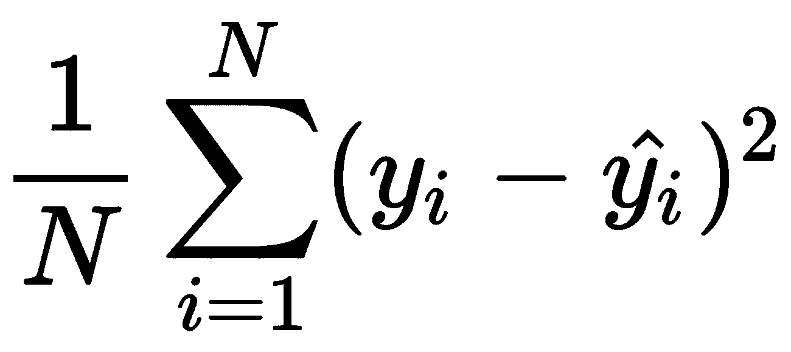 | `mean_squared_error` | `neg_mean_squared_error` |
| 平均平方对数误差 | 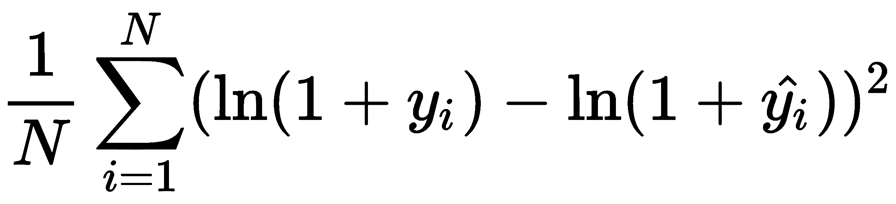 | `mean_squared_log_error` | `neg_mean_squared_log_error` |
| 平均绝对误差 | 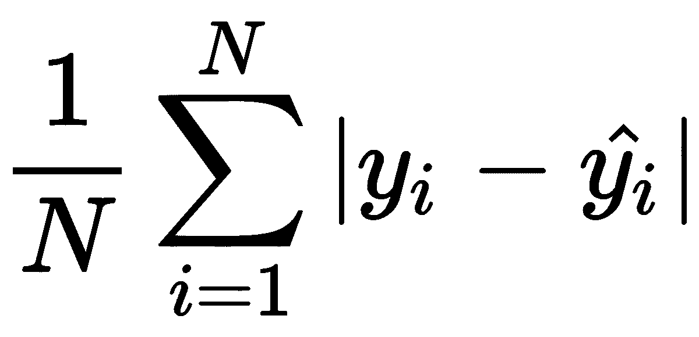 | `mean_absolute_error` | `neg_mean_absolute_error` |
| 中位数绝对误差 | 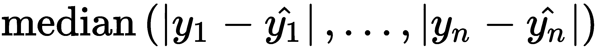 | `median_absolute_error` | `neg_median_absolute_error` |
| 解释的方差 | 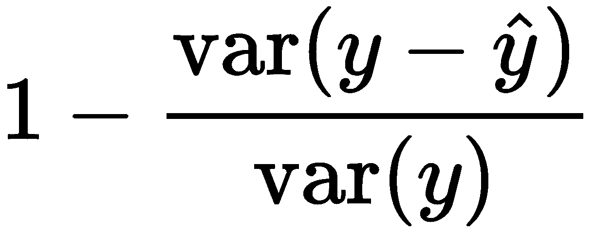 | `explained_variance_score` | `explained_variance` |
| R2 分数 | 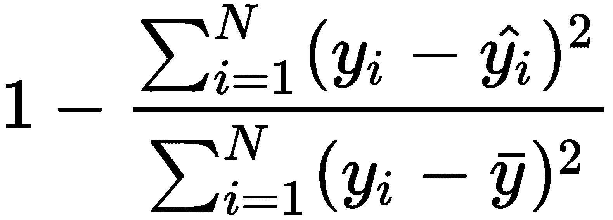 | `r2_score` | `r2` |

下图显示了笔记本中房价回归的各种误差指标：

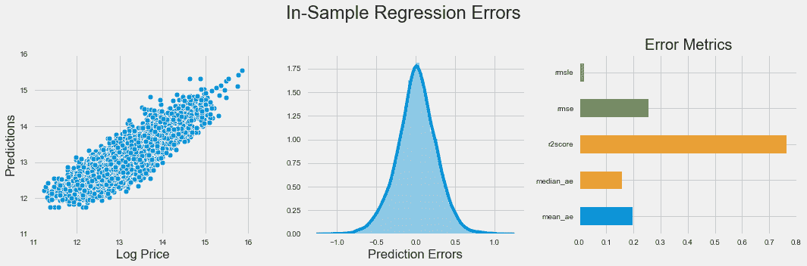

`sklearn`函数还支持多标签评估——即将多个结果值分配给单个观测值；有关更多详细信息，请参阅 GitHub 上引用的文档（[`github.com/PacktPublishing/Hands-On-Machine-Learning-for-Algorithmic-Trading/tree/master/Chapter06`](https://github.com/PacktPublishing/Hands-On-Machine-Learning-for-Algorithmic-Trading/tree/master/Chapter06)）。

# 分类问题

分类问题具有分类结果变量。 大多数预测器将输出一个分数，指示观测是否属于某个类。 在第二步中，这些分数然后被转换为实际预测。

在二元情况下，我们将标记类为正面和负面，分数通常在零之间变化或相应地进行归一化。 一旦将分数转换为 0-1 预测，就可能有四种结果，因为两个现有类别中的每一个都可以被正确或错误地预测。 如果有超过两个类别，则可以有更多的情况，如果您区分了几种潜在的错误。

所有的误差指标都是从预测在 2 x 2 混淆矩阵的四个领域中进行的，该矩阵将实际类与预测类相关联。 表中列出的指标，如准确性，评估了给定阈值的模型：

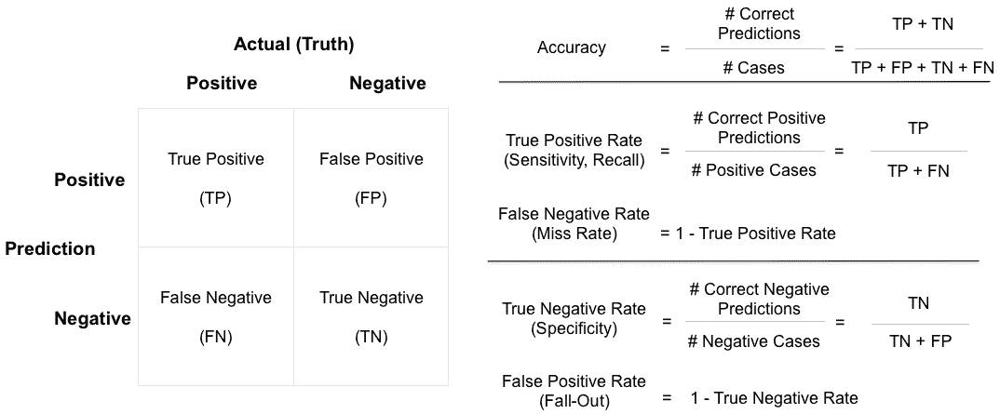

分类器不一定需要输出校准过的概率，而应该产生相对于彼此的分数，以区分正面和负面案例。 因此，阈值是一个决策变量，可以和应该优化，考虑到正确和错误预测的成本和收益。 更低的阈值意味着更多的正面预测，可能会出现日益上升的假阳性率，而更高的阈值则可能相反。

# 接收操作特性和曲线下面积

**接收器操作特性** (**ROC**) 曲线允许我们根据其性能可视化、组织和选择分类器。它计算了使用任何预测分数作为阈值产生的所有**真正例率** (**TPR**) 和**假正例率** (**FPR**) 的组合。然后将这些对绘制在一个边长为一的正方形上。

进行随机预测（考虑类别不平衡）的分类器平均产生相等的 TPR 和 FPR，使得组合位于对角线上，这成为基准情况。由于性能不佳的分类器将受益于重新标记预测，因此该基准也成为最低水平。

**曲线下面积** (**AUC**) 被定义为 ROC 图中的曲线下面积，其范围在 0.5 到最大值 1 之间变化。它是分类器的得分能够如何排列数据点的类成员身份的摘要度量。更具体地说，分类器的 AUC 具有重要的统计性质，表示分类器将随机选择的正实例排在随机选择的负实例之前的概率，这等价于 Wilcoxon 秩和检验。此外，AUC 不敏感于类别不平衡，这是它的好处。

# 精确度-召回率曲线

当对其中一个类别的预测特别感兴趣时，精确度和召回率曲线可视化这些误差度量之间的权衡，以及不同阈值的情况。两种度量都评估了对特定类别的预测质量。以下列表显示了它们如何应用于正类：

+   **召回率** 衡量了对于给定阈值，分类器预测为正的实际正类成员的比例。它源于信息检索，衡量了搜索算法成功识别的相关文档的比例。

+   **精确度** 相反，衡量了正确的正预测的比例。

召回率通常随着阈值降低而增加，但精确度可能会降低。精确度-召回率曲线可视化可达到的组合，并允许根据错过大量相关案例或产生质量较低的预测的成本和收益优化阈值。

F1 分数是给定阈值下精确度和召回率的调和平均数，并可用于在考虑这两个度量应承担的相对权重的情况下进行阈值的数值优化。

以下图表说明了 ROC 曲线及其相应的 AUC 以及精确度-召回率曲线和 F1 分数，使用精确度和召回率的相等权重，产生阈值为 0.37。图表取自附带笔记本，您可以在其中找到作用于二值化房价的 KNN 分类器的代码：

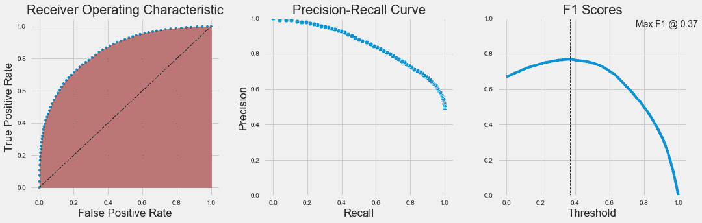

# 收集和准备数据

我们已经讨论了市场、基本和替代数据的采购的重要方面，并将继续使用各种这些来源的示例来说明各种模型的应用。

除了我们将通过 Quantopian 平台访问的市场和基本数据外，当我们探索自然语言处理时，我们还将获取和转换文本数据，当我们查看图像处理和识别时，我们也会获取和转换图像数据。除了获取、清理和验证数据以将其与通常以时间序列格式可用的交易数据相关联之外，将其存储在能够快速访问以便快速探索和迭代的格式中也很重要。我们推荐使用 HDF 和 parquet 格式。对于更大的数据量，Apache Spark 是最佳解决方案。

# 探索、提取和工程化特征

理解个体变量的分布以及结果和特征之间的关系是选择合适算法的基础。这通常从诸如散点图之类的可视化开始，如伴随笔记本中所示（并在以下图片中显示），但也包括从线性指标，如相关性，到非线性统计量，如我们介绍信息系数时遇到的 Spearman 秩相关系数的数字评估。它还包括信息论量度，如相互信息，如下一小节所示：

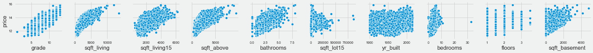

散点图

系统性的探索性分析也是通常成功预测模型的最重要的一个组成部分的基础：工程化的特征，这些特征提取了数据中包含的信息，但这些信息在原始形式下不一定能被算法访问到。特征工程受益于领域专业知识、统计学和信息论的应用，以及创造力。

它依赖于巧妙选择的数据转换，这些转换能有效地挖掘出输入和输出数据之间的系统关系。有许多选择，包括异常值检测和处理、功能转换以及多个变量的组合，包括无监督学习。我们将在整个过程中举例说明，但强调这个特性最好通过经验学习。Kaggle 是一个很好的地方，可以从其他数据科学家那里学习，他们与 Kaggle 社区分享了他们的经验。

# 使用信息论评估特征

特征和结果之间的**相互信息**（**MI**）是两个变量之间相互依赖的一种度量。它将相关性的概念扩展到非线性关系。更具体地说，它量化了通过另一个随机变量获取的关于一个随机变量的信息。

MI 的概念与随机变量的基本熵概念密切相关。熵量化了随机变量中包含的信息量。形式上，两个随机变量*X*和*Y*的互信息—I(*X*, *Y*)—被定义如下：

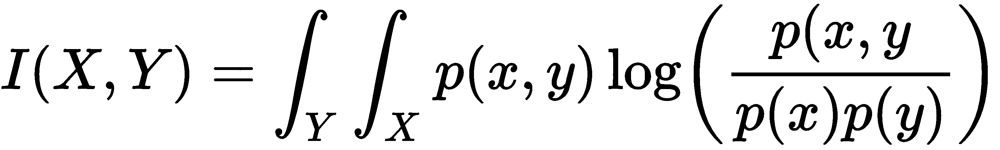

`sklearn` 函数实现了 `feature_selection.mutual_info_regression`，计算所有特征与连续结果之间的互信息，以选择最有可能包含预测信息的特征。还有一个分类版本（请参阅文档以了解更多详情）。笔记本 `mutual_information.ipynb` 包含了对我们在第四章中创建的金融数据的应用，*Alpha 因子研究*。

# 选择一个 ML 算法

本书的剩余部分将介绍几个模型族，从线性模型，其对输入和输出变量之间的功能关系的性质做出了相当强的假设，到深度神经网络，其假设极少。如前言中提到的，更少的假设将需要更多具有关于关系的显著信息的数据，以便学习过程能够成功。

我们将在引入这些模型时概述关键假设及其测试方法。

# 设计和调整模型

ML 过程包括基于模型泛化误差估计的诊断和管理模型复杂性的步骤。一个无偏估计需要一个统计上合理和有效的程序，以及与输出变量类型一致的错误度量，这也决定了我们是否处理回归、分类或排名问题。

# 偏差-方差的权衡

ML 模型在预测新输入数据的结果时所产生的错误可以分解为可减少和不可减少的部分。不可减少的部分是由数据中未测量的随机变化（噪音）引起的，比如相关但缺失的变量或自然变化。广义误差的可减少部分又可以分解为偏差和方差。二者都是由机器学习算法对真实功能关系和假设之间的差异造成的，如下列表所详述的：

+   **偏差引起的错误**：假设过于简单，无法捕捉真实功能关系的复杂性。因此，每当模型试图学习真实功能时，它都会犯系统性错误，平均而言，预测也将受到类似的偏差影响。这也被称为**欠拟合**。

+   **方差导致的错误**：算法过于复杂，以至于忽视了真实关系。它不是捕捉真实关系，而是过拟合数据并从噪声中提取模式。结果，它从每个样本中学习到不同的函数关系，并且外样预测将有很大的变化。

# 欠拟合与过拟合

以下图表说明了通过使用越来越复杂的多项式来近似余弦函数并测量样本内误差而产生的过拟合。更具体地说，我们绘制 10 个带有一些添加噪声的随机样本（*n* = 30）以学习不同复杂度的多项式（请参阅附带笔记本中的代码）。每次，模型预测新数据点，我们捕获这些预测的均方误差，以及这些误差的标准差。

以下图表中的左侧面板显示了一个一次多项式；一条直线明显地欠拟合真实函数。然而，估计的直线不会从真实函数的一个抽样到下一个抽样有明显的差异。中间面板显示了一个五次多项式在[0, 1]区间上合理地近似了真实关系。另一方面，一个十五次多项式几乎完美地拟合了小样本，但提供了对真实关系的很差估计：它对样本数据点的随机变化过拟合，而且学习的函数会随着每个抽样而变化。

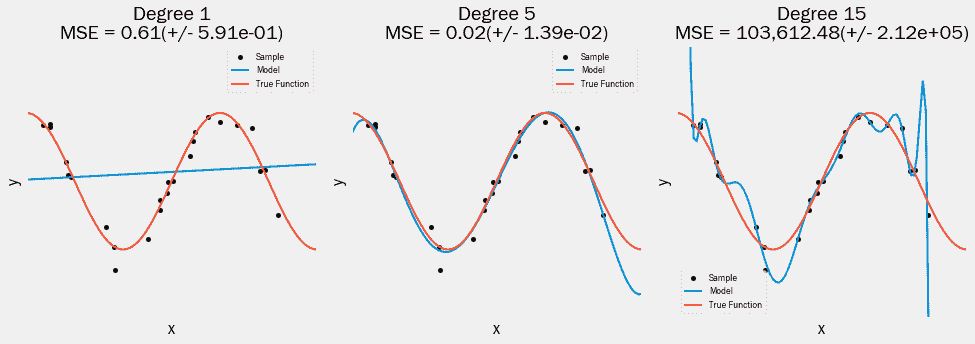

# 管理权衡

让我们通过尝试学习带有一些添加噪声的九次余弦函数的泰勒级数近似来进一步说明过拟合与欠拟合的影响。在以下图表中，我们绘制真实函数的随机样本，并拟合欠拟合、过拟合和提供近似正确灵活度的多项式。然后我们进行外样预测并测量 RMSE。

三次多项式的高偏差但低方差与第一个面板中可见的各种预测误差的低偏差但极高方差相比。左侧面板显示了由减去真实函数值产生的误差分布。直线欠拟合情况下产生了糟糕的样本内拟合，并且在样本外明显偏离目标。过拟合模型显示了最佳的样本内拟合以及最小的误差分散，但代价是样本外的大方差。与真实模型的函数形式匹配的适当模型明显在样本外表现最佳。

以下截图的右侧面板显示了实际预测而不是错误，以演示不同类型的拟合在实践中的样子：

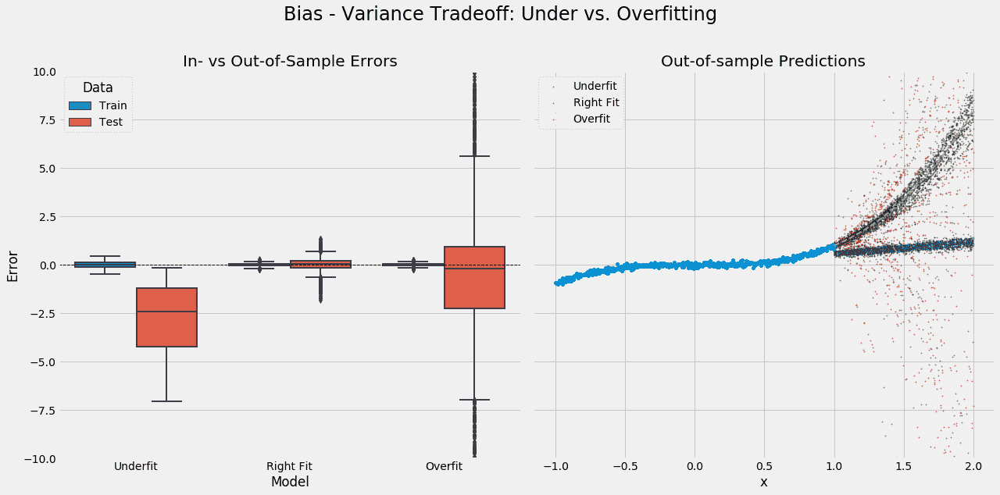

# 学习曲线

学习曲线绘制了根据用于学习函数关系的数据集大小演变的训练和测试错误。它是诊断给定模型的偏差-方差权衡的有用工具，因为误差会表现出不同的行为。具有高偏差的模型将具有高但相似的训练误差，无论是样本内还是样本外，而过度拟合的模型将具有非常低的训练误差。

外样本错误的下降说明过拟合模型可能会受益于额外的数据或限制模型复杂性的工具，如正则化，而不拟合的模型需要使用更多特征或以其他方式增加模型的复杂性，如下图所示：

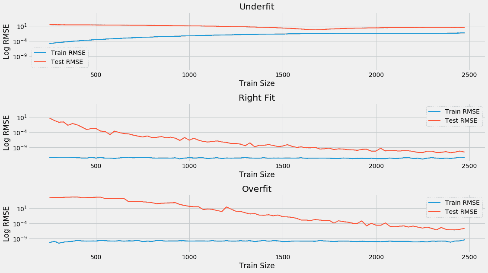

# 如何使用交叉验证进行模型选择

当您的用例中有多个候选模型（即算法）可用时，选择其中一个的行为称为**模型选择**问题。模型选择旨在确定在给定新数据的情况下产生最低预测误差的模型。

对这种泛化误差的无偏估计需要在未参与模型训练的数据上进行测试。因此，我们只使用部分可用数据来训练模型，并将另一部分数据留出来测试模型。为了获得对预测误差的无偏估计，绝对不能泄漏有关测试集的任何信息到训练集中，如下图所示：

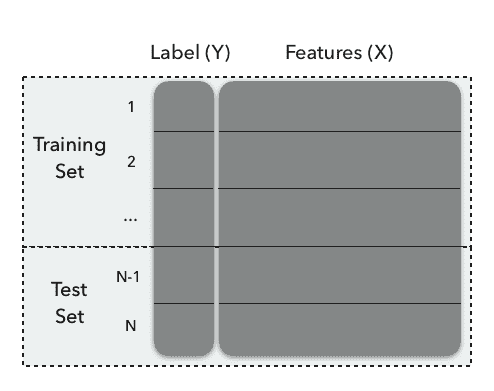

有几种可用于拆分可用数据的方法，这些方法在用于训练的数据量、误差估计的方差、计算强度以及在拆分数据时是否考虑数据的结构方面不同。

# 如何在 Python 中实现交叉验证

我们将通过展示一个具有十个观察值的模拟数据集的索引如何分配到训练集和测试集（详见`cross_validation.py`），来说明将数据拆分为训练集和测试集的各种选项，如下所示：

```py
data = list(range(1, 11))
[1, 2, 3, 4, 5, 6, 7, 8, 9, 10]
```

# 基本的训练测试拆分

对于将数据拆分为训练集和测试集的单次拆分，请使用`sklearn.model_selection.train_test_split`，其中`shuffle`参数默认确保观察值的随机选择，而这又可以通过设置`random_state`来复制。还有一个`stratify`参数，对于分类问题，确保训练集和测试集将包含大致相同的每个类的份额，如下图所示：

```py
train_test_split(data, train_size=.8)
[[8, 7, 4, 10, 1, 3, 5, 2], [6, 9]]
```

在这种情况下，我们使用除行号`6`和`9`之外的所有数据来训练模型，这些数据将用于生成预测并测量给定`know`标签上的错误。这种方法对于快速评估很有用，但对拆分很敏感，并且测试误差估计的标准误差将更高。

# 交叉验证

**交叉验证** (**CV**) 是一种常用的模型选择策略。CV 的主要思想是将数据拆分一次或多次，以便每个拆分都被用作一次验证集，剩余部分用作训练集：数据的一部分（训练样本）用于训练算法，剩余部分（验证样本）用于估计算法的风险。然后，CV 选择具有最小估计风险的算法。

虽然数据拆分启发式方法非常一般化，但 CV 的一个关键假设是数据是 **独立同分布** (**IID**) 的。在接下来的章节中，我们将看到，对于时间序列数据，通常情况并非如此，需要采用不同的方法。

# 使用保留测试集

在基于验证分数选择超参数时，请注意，由于多次测试，此验证分数存在偏差，并不再是泛化误差的良好估计。为了对误差率进行无偏估计，我们必须从新数据集中估计分数，如下图所示：

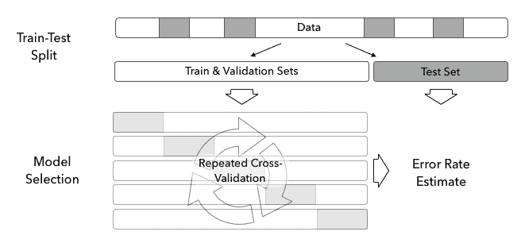

因此，我们使用数据的三向拆分，如前图所示：一部分用于交叉验证，并反复拆分为训练集和验证集。剩余部分作为保留集保留，只有在交叉验证完成后才使用它生成无偏的测试误差估计。我们将在下一章开始构建机器学习模型时说明这种方法。

# KFold 迭代器

`sklearn.model_selection.KFold` 迭代器生成几个不相交的拆分，并将这些拆分中的每一个分配给验证集，如下面的代码所示：

```py
kf = KFold(n_splits=5)
for train, validate in kf.split(data):
    print(train, validate)

[2 3 4 5 6 7 8 9] [0 1]
[0 1 4 5 6 7 8 9] [2 3]
[0 1 2 3 6 7 8 9] [4 5]
[0 1 2 3 4 5 8 9] [6 7]
[0 1 2 3 4 5 6 7] [8 9]
```

除了拆分数量外，大多数 CV 对象还接受一个 `shuffle` 参数，以确保随机性。为了使结果可重现，设置 `random_state` 如下所示：

```py
kf = KFold(n_splits=5, shuffle=True, random_state=42)
for train, validate in kf.split(data):
    print(train, validate)

[0 2 3 4 5 6 7 9] [1 8]
[1 2 3 4 6 7 8 9] [0 5]
[0 1 3 4 5 6 8 9] [2 7]
[0 1 2 3 5 6 7 8] [4 9]
[0 1 2 4 5 7 8 9] [3 6]
```

# 留一出 CV

原始 CV 实现使用留一出方法，每次将每个观测值一次用作验证集，如下面的代码所示：

```py
loo = LeaveOneOut()
for train, validate in loo.split(data):
    print(train, validate)

[1 2 3 4 5 6 7 8 9] [0]
[0 2 3 4 5 6 7 8 9] [1]
...
[0 1 2 3 4 5 6 7 9] [8]
[0 1 2 3 4 5 6 7 8] [9]
```

这样做可以最大化训练的模型数量，增加计算成本。虽然验证集不重叠，但是训练集的重叠被最大化，推高了模型及其预测误差的相关性。因此，对于具有更多拆分的模型，预测误差的方差更高。

# 留-P-出 CV

与留一出 CV 类似的版本是留-P-出 CV，它生成所有可能的 `p` 数据行的组合，如下面的代码所示：

```py
lpo = LeavePOut(p=2)
for train, validate in lpo.split(data):
    print(train, validate)

[2 3 4 5 6 7 8 9] [0 1]
[1 3 4 5 6 7 8 9] [0 2]
...
[0 1 2 3 4 5 6 8] [7 9]
[0 1 2 3 4 5 6 7] [8 9]
```

# ShuffleSplit

`sklearn.model_selection.ShuffleSplit` 对象创建具有潜在重叠验证集的独立拆分，如下面的代码所示：

```py
ss = ShuffleSplit(n_splits=3, test_size=2, random_state=42)
for train, validate in ss.split(data):
    print(train, validate)
[4 9 1 6 7 3 0 5] [2 8]
[1 2 9 8 0 6 7 4] [3 5]
[8 4 5 1 0 6 9 7] [2 3]
```

# 使用 scikit-learn 进行参数调整

模型选择通常涉及对使用不同算法（如线性回归和随机森林）或不同配置的模型的外样本性能进行重复交叉验证。不同的配置可能涉及对超参数的更改或包含或排除不同变量。

yellowbricks 库扩展了 sklearn API，生成诊断可视化工具，以便于模型选择过程。这些工具可用于调查特征之间的关系，分析分类或回归错误，监视聚类算法性能，检查文本数据的特性，并帮助进行模型选择。我们将演示提供有关参数调整阶段的有价值信息的验证和学习曲线—有关实现细节，请参阅 machine_learning_workflow.ipynb 笔记本。

# 使用 yellowbricks 的验证曲线

验证曲线（参见下图左侧面板）可视化单个超参数对模型交叉验证性能的影响。这有助于确定模型是否对给定数据集欠拟合或过拟合。

在我们的示例中，只有一个超参数的**KNeighborsRegressor**，我们可以清楚地看到，当*k*的值高于 20 时，模型欠拟合，其中验证错误随着减少邻居数量而下降，从而使我们的模型更复杂，因为它为更多不同的邻居组或特征空间中的区域进行预测。对于小于 20 的值，模型开始过拟合，因为训练和验证错误背离，平均外样本表现迅速恶化，如下图所示：

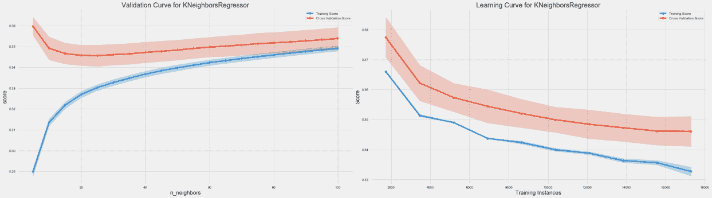

# 学习曲线

学习曲线（参见前述图表右侧面板，我们的房价回归示例）有助于确定模型的交叉验证性能是否会受益于更多数据，以及预测错误是更多地受偏差还是方差驱动。

如果训练和交叉验证性能趋于一致，那么更多的数据不太可能改善性能。在这一点上，重要的是评估模型性能是否符合人类基准的预期。如果不是这种情况，那么您应该修改模型的超参数设置，以更好地捕捉特征和结果之间的关系，或者选择一个具有更高复杂性捕捉能力的不同算法。

此外，阴影置信区间显示的训练和测试错误的变化提供了有关预测错误的偏差和方差来源的线索。交叉验证错误周围的变异性是方差的证据，而对训练集的变异性则暗示偏差，这取决于训练错误的大小。

在我们的例子中，交叉验证性能一直在下降，但增量改进已经减少，错误已经趋于稳定，因此从更大的训练集中很少会有很多好处。另一方面，鉴于验证错误的范围与训练错误相比显示出的范围相比，数据显示出相当大的方差。

# 使用 GridSearchCV 和 pipeline 进行参数调优

由于超参数调优是机器学习工作流的关键组成部分，有一些工具可以自动化这个过程。`sklearn`库包括一个`GridSearchCV`接口，该接口可以并行交叉验证所有参数组合，捕获结果，并自动使用在完整数据集上交叉验证中表现最佳的参数设置来训练模型。

实际上，在交叉验证之前，训练集和验证集通常需要进行一些处理。Scikit-learn 提供了`Pipeline`，以便在由`GridSearchCV`便利的自动化超参数调优中自动执行任何必要的特征处理步骤。

您可以查看所包含的`machine_learning_workflow.ipynb`笔记本中的实现示例，以查看这些工具的运行情况。

# 金融交叉验证中的挑战

迄今为止讨论的交叉验证方法的一个关键假设是训练样本的**独立且相同（iid）**分布。

对于金融数据，情况通常并非如此。相反，金融数据既不独立也不同分布，因为存在序列相关性和时变标准差，也称为**异方差性**（有关更多详细信息，请参阅接下来的两章）。`sklearn.model_selection`模块中的`TimeSeriesSplit`旨在解决时间序列数据的线性顺序。

# 使用 sklearn 进行时间序列交叉验证

数据的时间序列性意味着交叉验证会产生这样一种情况，即未来的数据将用于预测过去的数据。这充其量是不现实的，最坏的情况下是数据窥探，因为未来数据反映了过去事件的程度。

为了解决时间依赖性，`sklearn.model_selection.TimeSeriesSplit`对象实现了一个具有扩展训练集的前向测试，其中后续训练集是过去训练集的超集，如下面的代码所示：

```py
tscv = TimeSeriesSplit(n_splits=5)
for train, validate in tscv.split(data):
    print(train, validate)

[0 1 2 3 4] [5]
[0 1 2 3 4 5] [6]
[0 1 2 3 4 5 6] [7]
[0 1 2 3 4 5 6 7] [8]
[0 1 2 3 4 5 6 7 8] [9]
```

你可以使用`max_train_size`参数来实现前向交叉验证，其中训练集的大小随时间保持不变，类似于`zipline`测试交易算法的方式。Scikit-learn 通过子类化方便地设计自定义交叉验证方法，我们将在接下来的章节中实现。

# 清除、禁止和组合交叉验证

对于金融数据，标签通常是从重叠的数据点派生的，因为收益率是从多个期间的价格计算出来的。在交易策略的背景下，模型的预测结果，可能意味着对某种资产的持仓，只有在稍后，当这个决定被评估时，才能知道，例如，当一个头寸被平仓时。

由此产生的风险包括信息从测试集泄漏到训练集，可能导致人为膨胀的性能，需要通过确保所有数据都是时点性的来解决，也就是说，在用作模型输入时真正可用和已知的时间。马科斯·洛佩斯·德·普拉多在《金融机器学习进展》中提出了几种方法来解决金融数据在交叉验证中的这些挑战，如下所示：

+   **清洗**：消除训练数据点，其中评估发生在验证集中一个时间点数据点的预测之后，以避免前瞻性偏差。

+   **禁运**：进一步消除跟随测试期间的训练样本。

+   **组合交叉验证**：向前步进 CV 严重限制了可以测试的历史路径。相反，给定 T 个观测值，为 *N*<*T* 个组计算所有可能的训练/测试拆分，每个组都保持其顺序，并清洗和禁运可能重叠的组。然后，在所有 *N*-*k* 组合上训练模型，同时在剩余的 *k* 组上测试模型。结果是可能历史路径的数量大大增加。

普拉多的《金融机器学习进展》包含了实现这些方法的示例代码；该代码也可以通过新库`timeseriescv`获得。

# 总结

在本章中，我们介绍了从数据中学习的挑战，并将监督、无监督和强化模型作为我们将在本书中研究的主要学习形式，以构建算法交易策略。我们讨论了监督学习算法需要对它们试图学习的功能关系进行假设，以限制搜索空间，同时产生归纳偏差，可能导致过度泛化误差。

我们介绍了 ML 工作流程的关键方面，介绍了回归和分类模型的最常见错误度量标准，解释了偏差-方差折衷，并说明了使用交叉验证管理模型选择过程的各种工具。

在接下来的章节中，我们将深入探讨线性模型用于回归和分类，以开发我们的第一个使用 ML 的算法交易策略。
