# 第七章：线性模型

线性模型家族代表了最有用的假设类之一。许多在算法交易中广泛应用的学习算法依赖于线性预测器，因为它们在许多情况下可以被有效地训练，在金融数据嘈杂的情况下相对稳健，并且与金融理论有着密切的联系。线性预测器也直观易懂，易于解释，并且通常能够很好地拟合数据，或者至少提供一个良好的基线。

线性回归已经有 200 多年的历史了，当勒让德和高斯将其应用于天文学并开始分析其统计性质时。此后，许多扩展都改编了线性回归模型和基线**普通最小二乘法**（**OLS**）方法来学习其参数：

+   **广义线性模型**（**GLM**）通过允许响应变量表示除正态分布之外的误差分布来扩展应用范围。GLM 包括用于分类问题中的**分类响应变量**的 probit 或 logistic 模型。

+   更多**稳健估计方法**使得在数据违反基线假设的情况下进行统计推断成为可能，例如，随时间或跨观测存在相关性。这在包含对相同单位的重复观测的面板数据中经常发生，例如，对一组资产的历史回报。

+   **收缩方法**旨在改善线性模型的预测性能。它们使用一个复杂度惩罚，偏向于通过减少模型的方差并提高样本外预测性能来改善模型学习的系数。

在实践中，线性模型被应用于推断和预测的回归和分类问题。学术界和工业界研究人员开发的众多资产定价模型利用了线性回归。应用包括识别驱动资产回报的重要因素，例如，作为风险管理的基础，以及对各种时间范围内的回报进行预测。另一方面，分类问题包括方向性价格预测。

在本章中，我们将涵盖以下主题：

+   线性回归的工作原理及其假设条件

+   如何训练和诊断线性回归模型

+   如何使用线性回归预测未来收益

+   如何使用正则化来提高预测性能

+   logistic 回归的工作原理

+   如何将回归转换为分类问题

对于代码示例、额外资源和参考资料，请参阅在线 GitHub 仓库中本章的目录。

# 用于推断和预测的线性回归

顾名思义，线性回归模型假设输出是输入的线性组合的结果。该模型还假设存在随机误差，允许每个观察值偏离预期的线性关系。模型不能完美描述输入和输出之间关系的原因包括，例如，缺少变量，测量或数据收集问题。

如果我们想根据从样本估计的回归参数来对人口中的真实（但未观察到的）线性关系进行统计推断，我们需要对这些误差的统计性质添加假设。基线回归模型做出了这样一个强假设，即错误的分布在错误之间是相同的，并且错误是彼此独立的，也就是说，知道一个错误不会有助于预测下一个错误。**独立同分布**（**iid**）错误的假设意味着它们的协方差矩阵是由一个代表错误方差的常数与单位矩阵相乘得到的。

这些假设保证了 OLS 方法提供的估计值不仅是无偏的，而且是有效的，即它们具有最低的抽样误差学习算法。然而，在实践中很少满足这些假设。在金融领域，我们经常遇到具有给定截面上重复观察的面板数据。试图估计一组资产对一组风险因素的系统性暴露随时间变化的努力通常会导致时间维度或截面维度中的相关性，或者两者兼有。因此，出现了更多假设与单位矩阵的多个倍数不同的错误协方差矩阵的替代学习算法。

另一方面，学习为线性模型学习有偏参数的方法可能会产生方差较低的估计值，从而提高预测性能。**收缩方法**通过在线性目标函数中添加惩罚项来降低模型复杂性。惩罚与系数的绝对值大小正相关，因此相对于基线情况，这些系数被收缩。更大的系数意味着更复杂的模型，对输入的变化反应更强烈。正确校准的惩罚可以限制模型系数的增长，超出了最佳偏差-方差权衡建议的范围。

我们将介绍线性模型的基线截面和面板技术以及在关键假设被违反时产生准确估计的重要增强技术。然后，我们将通过估计在算法交易策略开发中无处不在的因子模型来说明这些方法。最后，我们将重点介绍正则化方法。

# 多元线性回归模型

我们将介绍模型的规范和目标函数、学习其参数的方法、允许推断和诊断这些假设的统计假设，以及扩展以适应这些假设失败情况的模型。

# 如何构建模型

多元回归模型定义了一个连续的结果变量与*p*个输入变量之间的线性函数关系，这些输入变量可以是任何类型，但可能需要预处理。相比之下，多元回归是指多个输出在多个输入变量上的回归。

在总体中，线性回归模型对于输出*y*的单个实例、输入向量 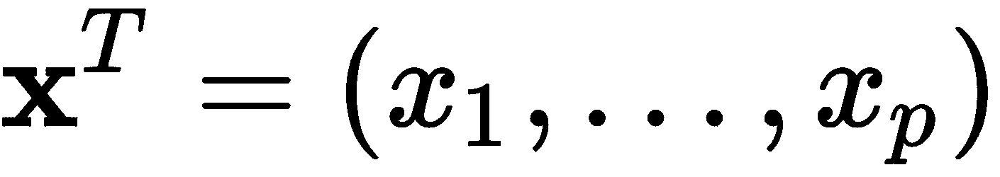和误差*ε*具有以下形式：

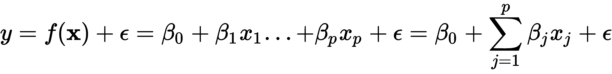

系数的解释很简单：系数 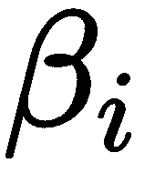 的值是变量*x[i]*对输出的部分平均影响，在所有其他变量保持不变的情况下。

该模型也可以更简洁地以矩阵形式书写。在这种情况下，*y*是*N*个输出观测值的向量，*X*是设计矩阵，其中有*N*行观测值和*p*个变量，另外还有一列 1 作为截距，而  是包含*p+1*个系数的向量 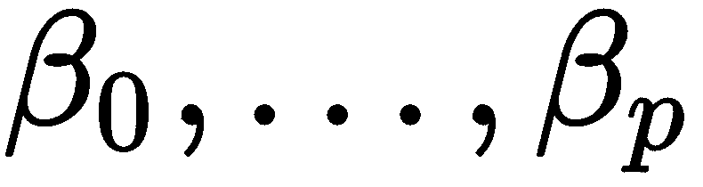：

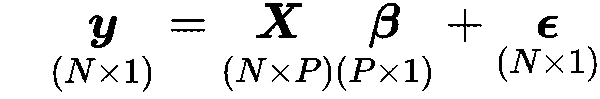

该模型在其*p+1*个参数中是线性的，但可以通过相应地选择或转换变量来建模非线性关系，例如通过包含多项式基扩展或对数项。它还可以使用具有虚拟编码的分类变量，并通过创建形如*x[i] . x[j]*的新输入来对变量之间的交互进行建模。

从统计学角度完善模型的构建，以便我们可以测试关于参数的假设，我们需要对误差项进行具体的假设。我们将在首先介绍学习参数的替代方法之后做这个。

# 如何训练模型

有几种方法可以从数据中学习模型参数  ：**普通最小二乘法**（**OLS**）、**最大似然估计**（**MLE**）和**随机梯度下降**（**SGD**）。

# 最小二乘法

最小二乘法是学习最能够近似输入数据输出的超平面参数的原始方法。顾名思义，最佳近似将最小化输出值与模型表示的超平面之间的平方距离之和。

给定数据点的模型预测与实际结果之间的差异是残差（而真实模型与真实输出在总体中的偏差被称为**误差**）。因此，在正式术语中，最小二乘估计方法选择系数向量  以最小化**残差平方和**（**RSS**）：

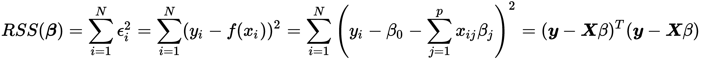

因此，最小二乘系数 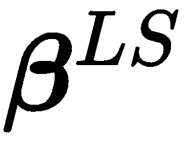 计算如下：

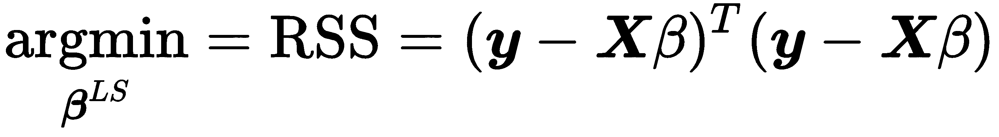

最小化 RSS 的最优参数向量是通过将前述表达式对  的导数置零而得到的。这产生了一个唯一的解，假设 X 具有完整的列秩，即输入变量不是线性相关的，如下所示：

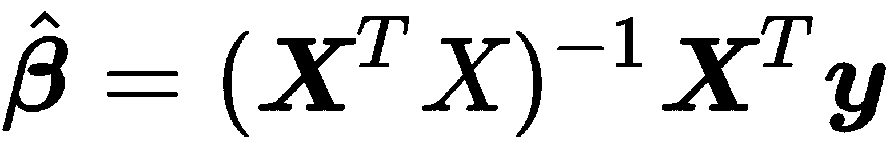

当 *y* 和 *X* 通过减去它们各自的均值而被去均值时， 表示输入和输出 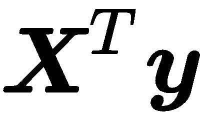 之间协方差的比率和输出方差 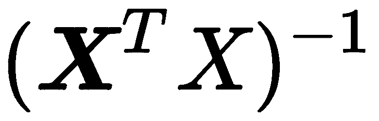。还有一种几何解释：最小化 RSS 的系数确保 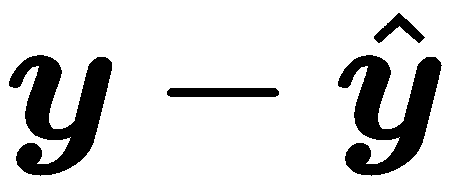 的向量与由 *X* 的列张成的子空间  是正交的，并且  是该子空间的正交投影。

# 最大似然估计

MLE 是估计统计模型参数的重要一般方法。它依赖于似然函数，该函数计算观察到的输出值样本在给定一组输入数据的情况下作为模型参数的函数的可能性。似然性与概率的不同之处在于它不被标准化为从 0 到 1 的范围。

我们可以通过假设误差项的分布（如标准正态分布）为线性回归示例设置似然函数：

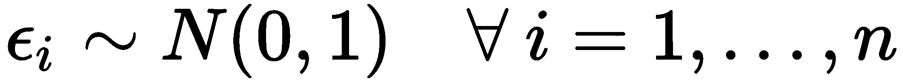.

这使我们能够计算给定输出  在相应输入向量 *x[i]* 和参数 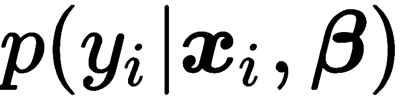 的条件概率：

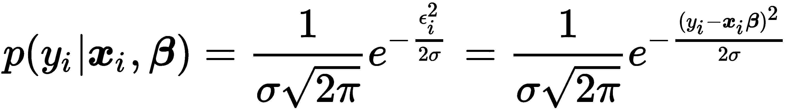

假设输出值在给定输入条件下是独立的，样本的似然性与单个输出数据点的条件概率的乘积成比例。由于使用和比使用乘积更容易，我们应用对数来获得对数似然函数：

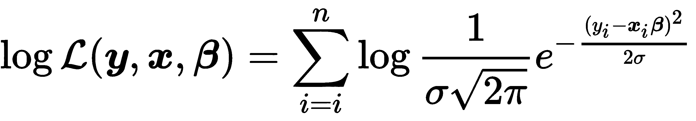

MLE 的目标是通过选择模型参数最大化实际观察到的输出样本的概率，将观察到的输入视为给定。因此，MLE 参数估计结果来自于最大化（对数）似然函数：

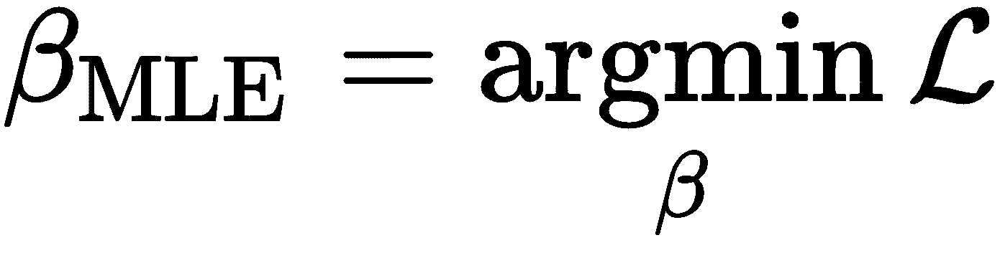

由于正态分布的假设，最大化对数似然函数产生与最小二乘相同的参数解，因为仅有一个表达式与参数有关，即指数中的平方残差。对于其他分布假设和模型，MLE 将产生不同的结果，在许多情况下，最小二乘不适用，我们稍后将在逻辑回归中看到。

# 梯度下降（Gradient descent）

梯度下降是一种通用的优化算法，将找到平滑函数的稳定点。如果目标函数是凸的，则解将是全局最优解。梯度下降的变体被广泛用于训练复杂的神经网络，也用于计算 MLE 问题的解决方案。

算法使用目标函数的梯度，其中包含相对于参数的偏导数。这些导数指示了在相应参数方向上的微小步长中目标变化的程度。结果表明，函数值的最大变化来自于梯度方向的步长。

因此，当最小化描述例如预测误差成本的函数时，该算法使用训练数据为当前参数值计算梯度，并根据对应梯度分量的负值修改每个参数。结果，目标函数将取得较低的值，并使参数更接近解。当梯度变得很小时，参数值几乎不再变化时，优化停止。

这些步长的大小是学习率，这是一个可能需要调整的关键参数；许多实现包括逐渐增加学习率的选项，随着迭代次数的增加。根据数据的大小，算法可能会多次迭代整个数据集。每次迭代称为一个**周期（epoch）**。您可以调整的超参数包括周期数和用于停止进一步迭代的容差。

随机梯度下降（Stochastic gradient descent）随机选择一个数据点，并针对该数据点计算梯度，而不是对更大样本的平均值，以实现加速。还有批量版本，每个步骤使用一定数量的数据点。

# 高斯-马尔科夫定理

要评估模型的统计特性并进行推断，我们需要对残差（即输入未解释部分的属性）做出假设。**高斯-马尔科夫定理**（**GMT**）定义了 OLS 需要的假设，以产生模型参数的无偏估计！[](img/33eb8f33-f98e-4c29-82c8-76db82a7b46a.png)，并且当这些估计在横截面数据的所有线性模型中具有最低标准误差时。

基线多元回归模型做出以下 GMT 假设：

1.  在总体中，**线性**成立，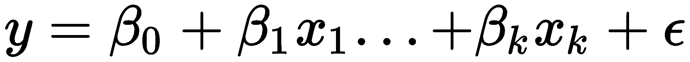，其中是未知但恒定的，而是一个随机误差

1.  输入变量的数据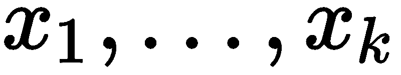是来自总体的**随机样本**

1.  没有完美的**共线性** - 输入变量之间不存在确切的线性关系

1.  错误在给定任何输入时的条件均值为零：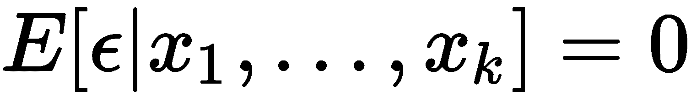

1.  **同方差性**，误差项在给定输入时具有恒定方差：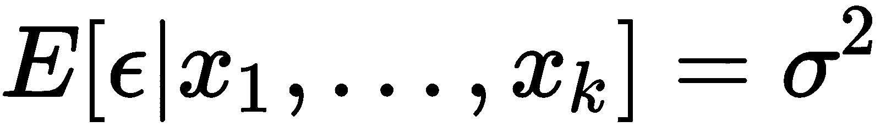

第四个假设意味着不存在与任何输入变量相关的缺失变量。在前四个假设下，OLS 方法提供**无偏估计**：包括一个无关变量不会使截距和斜率估计产生偏差，但忽略一个相关变量会使 OLS 估计产生偏差。然后 OLS 也是**一致的**：随着样本量的增加，估计值收敛到真实值，标准误差变得任意。不幸的是，反之亦然：如果误差的条件期望不为零，因为模型遗漏了一个相关变量或者功能形式错误（即，缺少二次项或对数项），那么所有参数估计都是有偏的。如果误差与任何输入变量相关，则 OLS 也不一致，即添加更多数据不会消除偏差。

如果添加了第五个假设，则 OLS 也会产生最佳线性无偏估计（BLUE），其中最佳意味着估计在所有线性估计器中具有最低标准误差。因此，如果五个假设成立，并且统计推断是目标，那么 OLS 估计是正确的选择。然而，如果目标是预测，那么我们将看到在许多情况下存在其他估计器，它们在一定的偏差情况下换取更低的方差以实现更好的预测性能。

现在我们已经介绍了基本的 OLS 假设，我们可以看看小样本和大样本推断。

# 如何进行统计推断

在线性回归背景下的推断旨在从样本数据中得出关于总体真实关系的结论。这包括关于总体关系的显著性或特定系数值的假设检验，以及置信区间的估计。

统计推断的关键要素是一个具有已知分布的检验统计量。我们可以假设零假设成立，并计算在样本中观察到该统计量值的概率，这个概率被称为 p 值。如果 p 值低于显著性阈值（通常为五百分之一），那么我们拒绝该假设，因为它使得实际样本值非常不可能。同时，我们接受 p 值反映了我们在拒绝实际上是正确的假设时错误的概率。

除了五个 GMT 假设之外，经典线性模型还假设**正态性**—总体误差服从正态分布且与输入变量独立。这一假设意味着在输入变量条件下，输出变量服从正态分布。这个强假设允许导出系数的精确分布，进而意味着在小样本中需要的测试统计的精确分布。这一假设通常会失败—例如，资产回报不服从正态分布—但是，幸运的是，正态性下使用的方法也是近似有效的。

我们拥有以下分布特征和测试统计量，近似地满足 GMT 假设 1–5，当正态性成立时则完全满足：

+   参数估计服从多元正态分布： 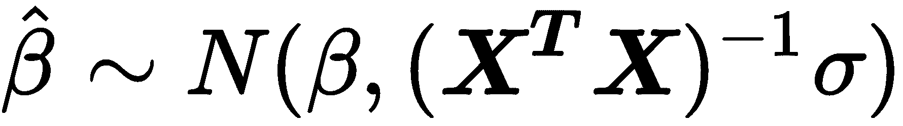 。

+   在 GMT 1–5 下，参数估计已经是无偏的，我们可以使用 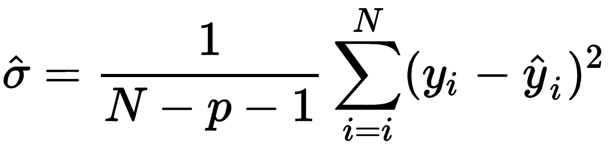 对  进行无偏估计，即常数误差方差。

+   对于关于个别系数的假设检验，*t* 统计量为 ，并且服从于自由度为 *N-p-1* 的 *t* 分布，其中  是 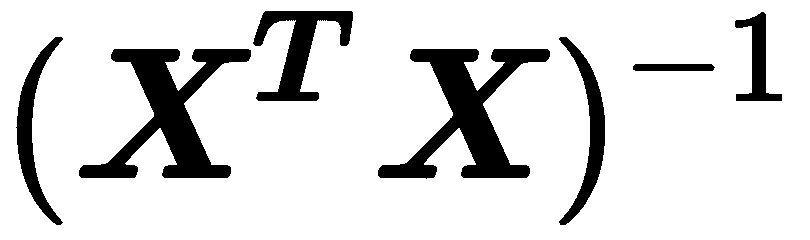 对角线的第 j 个元素。

+   *t* 分布收敛于正态分布，而正态分布的 97.5 分位数为 1.96，因此，围绕参数估计的 95% 置信区间的一个有用的经验法则是 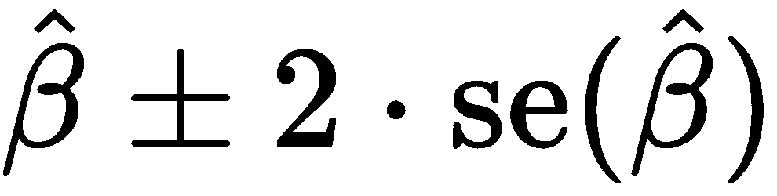。包含零的区间意味着我们无法拒绝真实参数为零的零假设，因此对模型无关。

+   *F*统计量允许对多个参数的限制进行检验，包括整个回归是否显著。它测量了 RSS 的变化（减少），这是由于添加额外变量而导致的。

+   最后，**拉格朗日乘数（LM）**测试是对*F*测试的替代，以限制多个限制。

# 如何诊断和解决问题

诊断验证模型假设，并在解释结果和进行统计推断时防止错误的结论。它们包括拟合优度的测量和关于误差项假设的各种测试，包括残差与正态分布的吻合程度。此外，诊断测试残差方差是否确实恒定，或者是否存在异方差，并且错误是否有条件地不相关或者存在串联相关性，即，知道一个错误是否有助于预测连续的错误。

除了以下概述的测试之外，始终重要的是可视化检查残差，以检测是否存在系统模式，因为这些指示模型缺少一个或多个驱动结果的因素。

# 拟合优度

拟合优度测量评估模型对结果变异的解释程度。它们有助于评估模型规范的质量，例如，在不同的模型设计之间进行选择。它们在评估拟合度时有所不同。在这里讨论的测量提供样本内信息；当我们在下一节专注于预测模型时，我们将使用样本外测试和交叉验证。

突出的拟合优度测量包括（调整后的）**R²**，应该最大化，基于最小二乘估计：

+   **R²**度量了模型解释结果数据变异的份额，并计算为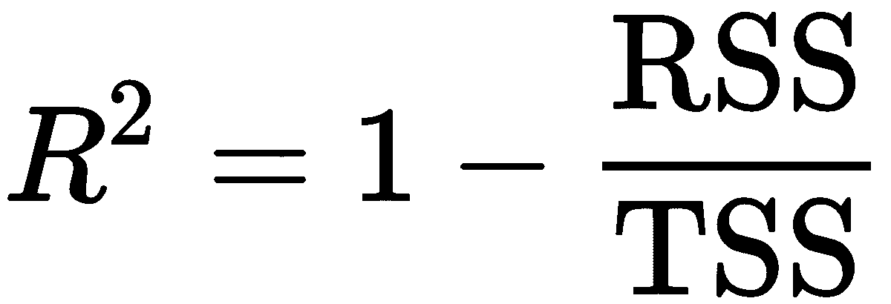，其中 TSS 是结果与其均值的平方偏差之和。它还对应于实际结果值与模型估计（拟合）值之间的平方相关系数。目标是最大化**R²**，但随着模型增加更多变量，它永远不会减少，因此会鼓励过度拟合。

+   调整后的**R²**对于增加更多变量对**R²**进行惩罚；每个额外变量都需要显著减少 RSS，以产生更好的拟合优度。

或者，需要最小化的是**Akaike（AIC）**和**贝叶斯信息准则（BIC）**，它们基于最大似然估计：

+   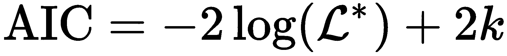，其中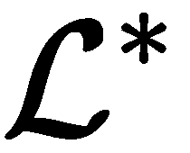是最大化似然函数的值，k 是参数个数

+   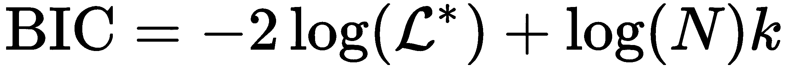，其中*N*是样本量

这两个指标都对复杂性进行了惩罚，BIC 施加了更高的惩罚，因此可能会欠拟合，而 AIC 可能会过拟合相对于 BIC 而言。从概念上讲，AIC 旨在找到最佳描述未知数据生成过程的模型，而 BIC 试图在候选模型集中找到最佳模型。在实践中，当目标是样本内拟合时，可以联合使用这两个标准来引导模型选择；否则，基于交叉验证和泛化误差估计的选择更可取。

# 异方差性

GMT 假设 5 要求残差协方差采用形状 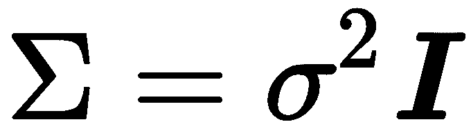，即，一个对角矩阵，其条目等于误差项的恒定方差。异方差性发生在残差方差不恒定但在观察之间不同的情况下。如果残差方差与输入变量呈正相关，即，当误差较大时，与其平均值相差较远的输入值，则 OLS 标准误差估计将过低，因此 t 统计量将被夸大，导致在实际上不存在关系的情况下发现虚假关系。

诊断从对残差进行视觉检查开始。残差中的系统模式表明了针对误差同方差性的零假设进行统计检验的多种替代方案。这些测试包括 Breusch—Pagan 和 White 测试。

有几种方法可以校正 OLS 估计的异方差性：

+   鲁棒标准误差（有时称为白色标准误差）在计算误差方差时考虑了异方差性，使用所谓的**三明治**估计器。

+   聚类标准误差假设您的数据中存在不同的组，这些组在同方差但错误方差在组之间不同。这些组可以是不同的资产类别或来自不同行业的股票。

有几种替代方法可使用不同的假设来估计误差协方差矩阵，当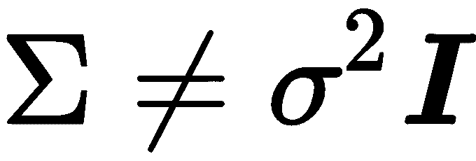时。以下是`statsmodels`中提供的选项：

+   **加权最小二乘法** (**WLS**)：适用于异方差误差，其中协方差矩阵仅具有对角元素，如 OLS，但现在允许元素变化。

+   可行**广义最小二乘法** (**GLSAR**)，用于遵循自回归 AR（p）过程的自相关误差（请参阅线性时间序列模型章节）

+   **广义最小二乘法** (**GLS**) 适用于任意协方差矩阵结构；在存在异方差性或序列相关性时产生高效且无偏的估计。

# 序列相关性

串行相关意味着线性回归产生的连续残差是相关的，这违反了第四个 GMT 假设。正串行相关意味着标准误差被低估，t-统计量将被夸大，如果忽略这一点，可能导致错误的发现。然而，在计算标准误差时，有纠正串行相关的程序。

Durbin-Watson 统计量诊断串行相关。它检验 OLS 残差不自相关的假设，而不是按照自回归过程（我们将在下一章中探讨）的替代。测试统计量的范围从 0 到 4，接近 2 的值表明非自相关，较低的值表示正，较高的值表示负的自相关。确切的阈值值取决于参数和观测值的数量，需要在表中查找。

# 多重共线性

当两个或更多自变量高度相关时，就会出现多重共线性。这带来了几个挑战：

+   很难确定哪些因素影响因变量。

+   单个 p 值可能会误导——即使变量很重要，p 值可能也很高。

+   回归系数的置信区间可能过大，甚至可能包括零，这使得无法确定自变量对结果的影响。

没有正式的或基于理论的解决方案来纠正多重共线性。而是尝试删除一个或多个相关的输入变量，或增加样本量。

# 如何实践运行线性回归

附带的笔记本 `linear_regression_intro.ipynb` 展示了简单线性回归和多重线性回归，后者使用 OLS 和梯度下降两种方法。对于多元回归，我们生成两个随机输入变量 *x[1]* 和 *x[2]*，范围从-50 到+50，并计算结果变量作为输入的线性组合加上随机高斯噪声以满足正态性假设 GMT 6：

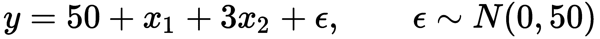

# 使用 statsmodels 进行 OLS

我们使用 `statsmodels` 来估计准确反映数据生成过程的多元回归模型，如下所示：

```py
from statsmodels.api import 
X_ols = add_constant(X)
model = OLS(y, X_ols).fit()
model.summary()
```

下面是**OLS 回归结果**的摘要：

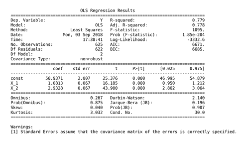

OLS 回归结果摘要

摘要的上半部分显示了数据集的特征，即估计方法、观测值和参数的数量，并指出标准误差估计不考虑异方差性。中间面板显示了与人工数据生成过程密切相关的系数值。我们可以确认，摘要结果中间显示的估计值可以使用先前推导的 OLS 公式获得：

```py
beta = np.linalg.inv(X_ols.T.dot(X_ols)).dot(X_ols.T.dot(y))
pd.Series(beta, index=X_ols.columns)

const   50.94
X_1      1.08
X_2      2.93

```

以下图示了模型对随机生成的数据点拟合的超平面：

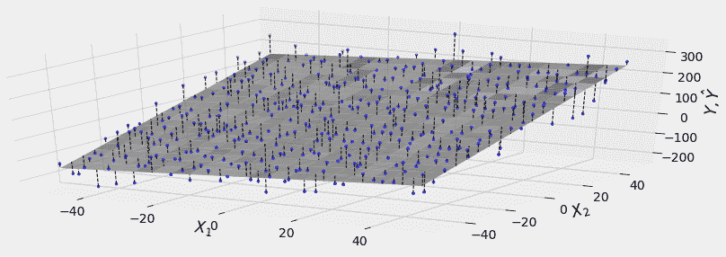

超平面

面板的右上部显示了刚讨论过的拟合优度指标，以及拒绝所有系数为零且不相关的假设的 F 检验。同样，t 统计量表明截距和斜率系数都是非常显著的，这并不令人意外。

摘要底部包含了残差诊断。左侧面板显示了用于检验正态性假设的偏度和峰度。Omnibus 和 Jarque—Bera 测试都未能拒绝残差正态分布的零假设。Durbin—Watson 统计量检验残差的序列相关性，并且在值接近 2 的情况下，考虑到 2 个参数和 625 个观测值，未能拒绝无序列相关性的假设。

最后，条件数提供了关于多重共线性的证据：它是包含输入数据的设计矩阵的最大和最小特征值的平方根的比值。值超过 30 表明回归可能存在显著的多重共线性。

`statsmodels`包含了与笔记本中链接的其他诊断测试。

# 使用 sklearn 的随机梯度下降

`sklearn`库在其`linear_models`模块中包含了一个`SGDRegressor`模型。要使用该方法学习相同模型的参数，我们需要首先标准化数据，因为梯度对尺度敏感。我们使用`StandardScaler()`来计算每个输入变量的平均值和标准差，并在拟合步骤中减去平均值并除以标准差，在转换步骤中进行方便的单个`fit_transform()`命令：

```py
scaler = StandardScaler()
X_ = scaler.fit_transform(X)
```

然后，我们使用默认值实例化`SGDRegressor`，除了设置`random_state`以便复制：

```py
sgd = SGDRegressor(loss='squared_loss', fit_intercept=True, 
                   shuffle=True, random_state=42,  # shuffle training data for better gradient estimates
                   learning_rate='invscaling',     # reduce learning rate over time
                   eta0=0.01, power_t=0.25)        # parameters for learning rate path
```

现在我们可以拟合`sgd`模型，为 OLS 模型和`sgd`模型创建样本内预测，并计算每个模型的均方根误差：

```py
sgd.fit(X=X_, y=y)
resids = pd.DataFrame({'sgd': y - sgd.predict(X_),
                      'ols': y - model.predict(sm.add_constant(X))})
resids.pow(2).sum().div(len(y)).pow(.5)

ols   50.06
sgd   50.06

```

如预期的那样，两个模型产生相同的结果。我们现在将承担一个更雄心勃勃的项目，使用线性回归来估计多因子资产定价模型。

# 如何构建线性因子模型

算法交易策略使用**线性因子模型**来量化资产收益与代表这些收益主要驱动因素的风险来源之间的关系。每个因子风险都带有一个风险溢价，总资产收益可以预期对应于这些风险溢价的加权平均。

因子模型在投资组合管理过程中有多个实际应用，从构建和资产选择到风险管理和绩效评估。随着常见风险因素现在可以交易，因子模型的重要性不断增长：

+   许多资产的回报摘要通过少量因子来减少在优化投资组合时估算协方差矩阵所需的数据量

+   对资产或投资组合对这些因子的敞口的估计允许管理由此产生的风险，例如当风险因子本身被交易时，可以通过输入适当的对冲来管理风险

+   因子模型还允许评估新α因子的增量信号内容。

+   因子模型还可以帮助评估经理相对于基准的业绩是否确实是由于选择资产和市场时机的技能，或者是否业绩可以解释为投资组合倾向于已知回报驱动因素，这些因素今天可以以低成本、被动管理的基金形式复制，而无需支付主动管理费用。

以下示例适用于股票，但已为所有资产类别确定了风险因子（请参阅 GitHub 存储库中的参考资料）。

# 从资本资产定价模型到法玛-法国五因子模型

自从资本资产定价模型（**CAPM**）解释了所有*N*资产的预期回报，即使用它们对单一因子的各自暴露！[](img/a332fea0-7be6-4858-a873-73742a227f66.png)到整体市场相对于无风险利率的预期超额回报！[](img/4f4b2d16-602f-4672-941b-3be7cc28d1a4.png)以来，风险因子一直是定量模型的关键因素。该模型采用以下线性形式：

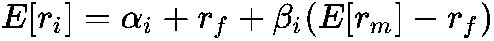

这与道德和格雷厄姆经典的基本分析有所不同，后者依赖于公司特征来确定回报。理由是，在总体上，投资者无法通过分散化消除这种所谓的系统风险。因此，在均衡状态下，他们要求持有资产的补偿与其系统风险相称。该模型暗示，在市场有效的情况下，价格立即反映所有公开信息，就不应该有优越的风险调整回报，也就是说，的价值应该为零。

该模型的实证测试使用线性回归，并一直失败，促使人们争论是市场有效还是联合假设的单一因子方面有问题。事实证明，这两个前提都可能是错误的：

+   约瑟夫·斯蒂格利茨在部分地获得了 2001 年诺贝尔经济学奖，因为他表明市场通常并非完全有效：如果市场有效，那么收集数据就没有价值，因为这些信息已经反映在价格中。但是，如果没有收集信息的动机，很难看到它如何已经反映在价格中。

+   另一方面，对 CAPM 的理论和实证改进表明，额外因素有助于解释一些不依赖于整体市场敞口的超常风险调整回报的异常，例如较小公司的较高回报。

斯蒂芬·罗斯于 1976 年提出了**套利定价理论**（**APT**），作为一种允许多种风险因素存在的替代方案，同时避免了市场效率。与 CAPM 相比，它假设由于定价错误而产生的超常回报机会可能存在，但会迅速被套利消除。该理论并未明确规定这些因素，但作者的研究表明，最重要的因素是通货膨胀和工业生产的变化，以及风险溢价或利率期限结构的变化。

肯尼斯·弗伦奇和尤金·法玛（获得 2013 年诺贝尔奖）确定了取决于公司特征的额外风险因素，并且今天被广泛使用。1993 年，法玛—弗伦奇三因子模型在单一 CAPM 风险的基础上增加了公司的相对规模和价值。2015 年，五因子模型进一步扩展了该集合，包括在介入年份已被证明显著的公司盈利能力和投资水平。此外，许多因子模型包括价格动量因子。

法玛—弗伦奇风险因素的计算是指根据反映给定风险因素的度量标准对多样化投资组合的回报差异。通过根据这些度量标准对股票进行排序，然后对超过某一百分位数的股票做多头，对低于某一百分位数的股票做空头，获得这些回报。与风险因素相关的度量标准定义如下：

+   **大小**: **市场权益**（**ME**）

+   **价值**: **股权账面价值**（**BE**）除以 ME

+   **运营盈利能力（OP）**：收入减去销售成本/资产

+   **投资**: 投资/资产

还有无监督学习技术用于基于数据的风险因素的发现，包括基于因子和主成分分析的方法，我们将在第十二章，*无监督学习*中进行探讨。

# 获取风险因素

法玛和弗伦奇通过他们的网站提供了更新的风险因素和研究投资组合数据，您可以使用`pandas_datareader`库获取这些数据。对于此应用，请参考`fama_macbeth.ipynb`笔记本以获取更多详细信息。

特别是，我们将使用从首先将股票分成三个规模组，然后对剩余三个公司特定因素中的每个进行两次排序的五个法玛—弗伦奇因子。因此，这些因素涉及根据大小和账面市值、大小和经营盈利能力以及大小和投资进行的 3 x 2 排序形成的三组加权价值组合。风险因素值计算为如下表所述的**投资组合**（**PF**）的平均回报：

| **概念** | **标签** | **名称** | **风险因子计算** |
| --- | --- | --- | --- |
| 规模 | SMB | 小减大 | 九个小型股票 PF 减去九个大型股票 PF |
| 值 | HML | 高减低 | 两个价值 PF 减去两个增长 PF（具有低 BE/ME 值） |
| 盈利能力 | RMW | 强大减弱 | 两个强劲 OP PF 减去两个弱 OP PF |
| 投资 | CMA | 保守减激进 | 两个保守投资组合减去两个激进投资组合 |
| 市场 | Rm-Rf | 市场的超额回报 | 所有在主要美国交易所上市和上市的公司的价值加权回报，具有良好数据减去一个月期国库券利率 |

我们将使用从 2010 年至 2017 年期间获得的月频率的回报如下：

```py
import pandas_datareader.data as web
ff_factor = 'F-F_Research_Data_5_Factors_2x3'
ff_factor_data = web.DataReader(ff_factor, 'famafrench', start='2010', end='2017-12')[0]
ff_factor_data.info()

PeriodIndex: 96 entries, 2010-01 to 2017-12
Freq: M
Data columns (total 6 columns):
Mkt-RF 96 non-null float64
SMB 96 non-null float64
HML 96 non-null float64
RMW 96 non-null float64
CMA 96 non-null float64
RF 96 non-null float64
```

Fama 和 French 还提供了许多我们可以用来说明因子暴露估计的投资组合，以及市场上某个特定时间段可用的风险溢价的价值。我们将使用一个包含 17 个行业投资组合的面板，并以月频率进行计算。我们将从回报中减去无风险利率，因为因子模型使用超额回报：

```py
ff_portfolio = '17_Industry_Portfolios'
ff_portfolio_data = web.DataReader(ff_portfolio, 'famafrench', start='2010', end='2017-12')[0]
ff_portfolio_data = ff_portfolio_data.sub(ff_factor_data.RF, axis=0)
ff_factor_data = ff_factor_data.drop('RF', axis=1)
ff_portfolio_data.info()

PeriodIndex: 96 entries, 2010-01 to 2017-12
Freq: M
Data columns (total 17 columns):
Food     96 non-null float64
Mines    96 non-null float64
Oil      96 non-null float64
...
Rtail    96 non-null float64
Finan    96 non-null float64
Other    96 non-null float64
```

现在，我们将基于这些面板数据构建一个线性因子模型，使用一种解决一些基本线性回归假设失败的方法。

# Fama—Macbeth 回归

鉴于风险因子和投资组合回报的数据，估计投资组合的暴露是有用的，即风险因子驱动投资组合回报的程度，以及给定因子的暴露值的价值，即市场的风险因子溢价是多少。然后，风险溢价可以估算任何投资组合的回报，前提是已知或可以假定因子暴露。

更正式地说，我们将对*t=1, ..., T*期间的*i=1, ..., N*资产或投资组合的回报进行测试，每个资产的超额期间回报将被表示为。目标是测试*j=1, ..., M*因子是否解释了超额回报以及与每个因子相关的风险溢价。在我们的案例中，我们有*N=17*个投资组合和*M=5*个因子，每个因子都有 96 个数据周期。

因子模型是针对给定期间内许多股票进行估计的。在这种横截面回归中可能会出现推断问题，因为经典线性回归的基本假设可能不成立。潜在的违规行为包括测量误差，由异方差和串行相关引起的残差协方差，以及多重共线性。

为了解决残差相关引起的推断问题，Fama 和 MacBeth 提出了一种两步法的方法，用于对因子上的横截面回归。两阶段的 Fama—Macbeth 回归旨在估计市场对特定风险因子暴露所奖励的溢价。两个阶段包括：

+   **第一阶段**：*N*时间序列回归，对于每个资产或投资组合，它的超额收益对因子进行回归，以估计因子载荷。以矩阵形式，对于每个资产：

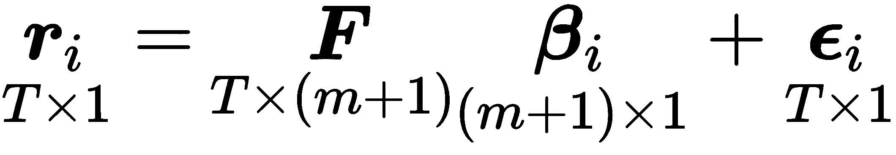

+   **第二阶段**：T 个横截面回归，每个时间段一个，以估计风险溢价。以矩阵形式，我们获得每个时间段的风险溢价向量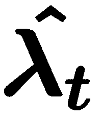：

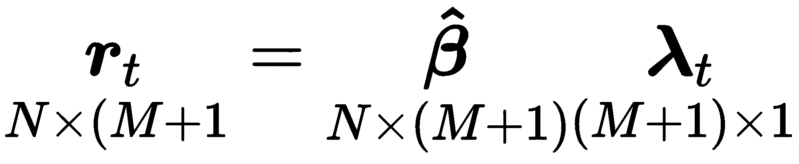

现在我们可以将因子风险溢价计算为时间平均值，并使用假设风险溢价估计在时间上独立来获取 t 统计量，评估它们的个体显著性：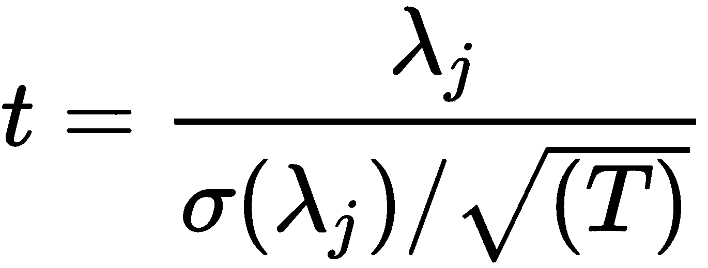。

如果我们拥有一个非常大且具代表性的交易风险因子数据样本，我们可以将样本均值用作风险溢价估计。然而，我们通常没有足够长的历史记录，而且样本均值周围的误差范围可能相当大。法马—麦克贝斯方法利用因子与其他资产的协方差来确定因子溢价。资产收益的二阶矩比第一阶矩更容易估计，并且获得更细粒度的数据会显着改善估计，这在均值估计中并不成立。

我们可以实现第一阶段，以获取 17 个因子载荷估计，如下所示：

```py
betas = []
for industry in ff_portfolio_data:
    step1 = OLS(endog=ff_portfolio_data[industry],
                exog=add_constant(ff_factor_data)).fit()
    betas.append(step1.params.drop('const'))

betas = pd.DataFrame(betas,
                     columns=ff_factor_data.columns,
                     index=ff_portfolio_data.columns)
betas.info()
Index: 17 entries, Food  to Other
Data columns (total 5 columns):
Mkt-RF    17 non-null float64
SMB       17 non-null float64
HML       17 non-null float64
RMW       17 non-null float64
CMA       17 non-null float64
```

对于第二阶段，我们对横截面投资组合的期间收益进行 96 次回归，以估计因子载荷：

```py
lambdas = []
for period in ff_portfolio_data.index:
    step2 = OLS(endog=ff_portfolio_data.loc[period, betas.index],
                exog=betas).fit()
    lambdas.append(step2.params)

lambdas = pd.DataFrame(lambdas,
                       index=ff_portfolio_data.index,
                       columns=betas.columns.tolist())
lambdas.info()
PeriodIndex: 96 entries, 2010-01 to 2017-12
Freq: M
Data columns (total 5 columns):
Mkt-RF    96 non-null float64
SMB       96 non-null float64
HML       96 non-null float64
RMW       96 non-null float64
CMA       96 non-null float64
```

最后，我们计算 96 个周期的平均值，以获取我们的因子风险溢价估计值：

```py
lambdas.mean()
Mkt-RF    1.201304
SMB       0.190127
HML      -1.306792
RMW      -0.570817
CMA      -0.522821
```

`linear_models`库通过各种面板数据模型扩展了`statsmodels`，并且还实现了两阶段法马—麦克贝斯程序：

```py
model = LinearFactorModel(portfolios=ff_portfolio_data, 
                          factors=ff_factor_data)
res = model.fit()
```

这为我们提供了相同的结果：

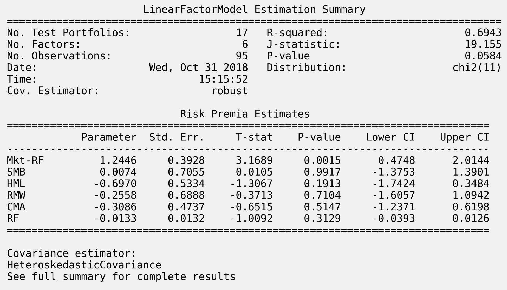

线性因子模型估计摘要

随附的笔记本通过在估计较大的个别股票风险溢价时使用行业虚拟变量来说明了分类变量的使用。

# 缩小方法：线性回归的正则化

当高斯—马尔可夫假设得到满足时，最小二乘法用于训练线性回归模型将会产生最佳、线性和无偏的系数估计。即使 OLS 关于误差协方差矩阵的假设被违反，类似 GLS 的变种也会表现得相当好。然而，有一些估计器会产生偏斜的系数，以减少方差以达到更低的总体泛化误差。

当线性回归模型包含许多相关变量时，它们的系数将被较差地确定，因为大正系数对 RSS 的影响可能会被相关变量上的同样大的负系数抵消。因此，由于系数的这种摆动空间，模型将具有高方差的倾向，增加模型过度拟合样本的风险。

# 如何对抗过度拟合

控制过拟合的一种流行技术是**正则化**，它涉及将惩罚项添加到误差函数中，以阻止系数达到较大的值。换句话说，对系数的大小施加约束可以缓解结果对样本外预测的潜在负面影响。由于过拟合是如此普遍的问题，我们将在所有模型中遇到正则化方法。

在本节中，我们将介绍缩小方法，以解决改进迄今为止讨论的线性模型方法的两个动机：

+   **预测准确性**：最小二乘估计的低偏差但高方差表明，通过收缩或将某些系数设置为零，可以减少泛化误差，从而在略微增加偏差的同时减少模型的方差。

+   **解释性**：大量的预测变量可能会使结果的解释或传达变得复杂化。牺牲一些细节以限制模型只包括具有最强效果的参数子集可能更可取。

收缩模型通过对其大小施加惩罚来限制回归系数。这些模型通过向目标函数添加一个项来实现此目标，使得收缩模型的系数最小化 RSS 加上一个与系数（绝对值）大小正相关的惩罚项。添加的惩罚将线性回归系数的查找转变为一个约束最小化问题，通常采用以下拉格朗日形式：

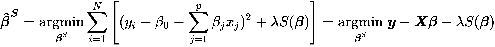

正则化参数 λ 决定了惩罚效果的大小，即正则化的强度。一旦 λ 为正，系数将与无约束的最小二乘参数不同，这意味着一个有偏的估计。超参数 λ 应该通过交叉验证来自适应地选择，以最小化预测误差的估计。

收缩模型的区别在于它们如何计算惩罚，即 S 的函数形式。最常见的版本是岭回归，它使用了系数平方的和，而套索模型则基于系数绝对值的和来设置惩罚。

# 岭回归的工作原理

岭回归通过将惩罚添加到目标函数中来缩小回归系数，该惩罚等于系数的平方和，进而对应于系数向量的 L² 范数：

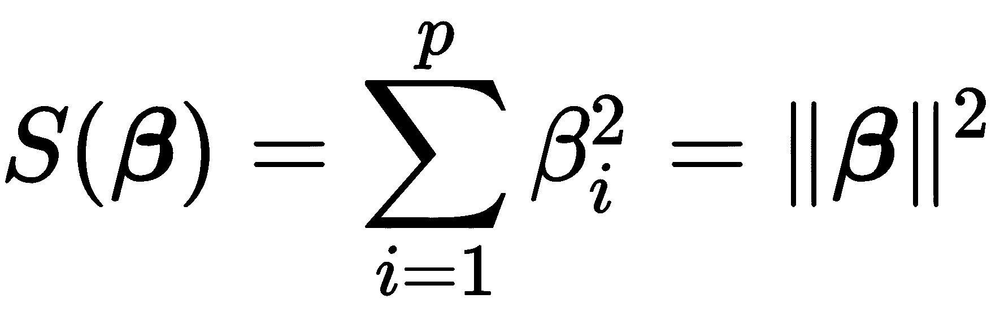

因此，岭回归系数定义如下：

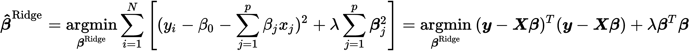

截距已从惩罚中排除，以使程序独立于为输出变量选择的原点——否则，将常数添加到所有输出值将改变所有斜率参数而不是平行移位。

重要的是通过从每个输入中减去相应的均值并将结果除以输入的标准差来标准化输入，因为岭解对输入的尺度敏感。岭估计器也有一个类似 OLS 情况的闭式解：

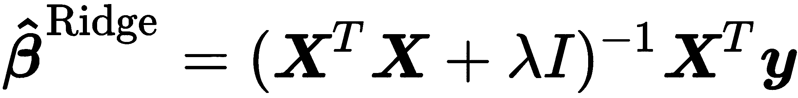

在求逆之前，解决方案将缩放后的单位矩阵λ*I*添加到*X^TX*中，这保证了问题是非奇异的，即使*X^T**X*没有满秩。这是最初引入该估计量时的动机之一。

岭惩罚导致所有参数的成比例收缩。在**正交输入**的情况下，岭估计只是最小二乘估计的缩放版本，即：

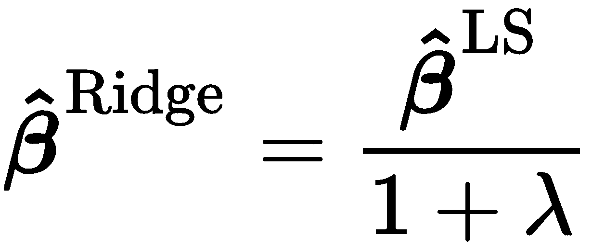

使用输入矩阵*X*的**奇异值分解**（**SVD**），我们可以深入了解在更常见的情况下，收缩如何影响非正交输入。中心矩阵的 SVD 表示矩阵的主成分（参见第十一章，*梯度提升机*，有关无监督学习的内容），按方差降序捕获数据的列空间中的不相关方向。

岭回归会收缩与数据中方差较小的方向相关联的输入变量的系数，而不是收缩与展现更多方差的方向相关联的输入变量的系数。因此，岭回归的隐含假设是，在数据中变化最大的方向在预测输出时最有影响力或最可靠。

# 套索回归的工作原理

套索，在信号处理中称为基 Pursuit，通过向残差的平方和添加惩罚来缩小系数，但套索惩罚具有稍微不同的效果。套索惩罚是系数向量的绝对值的总和，对应于其 L¹范数。因此，套索估计由以下方式定义：

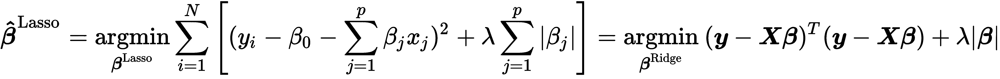

与岭回归类似，输入需要被标准化。套索惩罚使解决方案非线性，并且与岭回归不同，系数没有闭式表达式。相反，套索解是一个二次规划问题，有可用的高效算法可以计算出对于不同λ值产生的系数整个路径，其计算成本与岭回归相同。

Lasso 惩罚的效果是随着正则化的增加逐渐将一些系数减少到零。因此，Lasso 可用于连续选择一组特征。

# 如何使用线性回归预测回报

笔记本 `linear_regression.ipynb` 包含使用 `statsmodels` 和 `sklearn` 进行 OLS 的股价预测的示例，以及岭回归和 Lasso 模型。它旨在在 Quantopian 研究平台上作为笔记本运行，并依赖于 第四章 中介绍的 `factor_library`，*Alpha Factors Research*。

# 准备数据

我们需要选择一组股票和一个时间范围，构建和转换我们将用作特征的 alpha 因子，计算我们希望预测的前瞻回报，并可能清理我们的数据。

# 宇宙创建和时间范围

我们将使用 2014 年和 2015 年的股票数据，来自使用内置过滤器、因子和分类器选择最后 200 个交易日的平均美元成交量最高的 100 支股票的自定义 `Q100US` 宇宙，根据额外的默认标准进行筛选（请参阅 GitHub 上链接的 Quantopian 文档以获取详细信息）。该宇宙会根据筛选标准动态更新，因此，在任何给定点上可能有 100 支股票，但样本中可能有超过 100 个不同的股票：

```py
def Q100US():
    return filters.make_us_equity_universe(
        target_size=100,
        rankby=factors.AverageDollarVolume(window_length=200),
        mask=filters.default_us_equity_universe_mask(),
        groupby=classifiers.fundamentals.Sector(),
        max_group_weight=0.3,
        smoothing_func=lambda f: f.downsample('month_start'),
    )
```

# 目标回报计算

我们将测试不同 `lookahead` 期间的预测，以确定产生最佳可预测性的最佳持有期，该期间由信息系数衡量。更具体地说，我们使用内置的 `Returns` 函数计算 1、5、10 和 20 天的收益，结果是在两年内（每年大约有 252 个交易日）对 100 支股票的宇宙产生超过 50,000 个观察值：

```py
lookahead = [1, 5, 10, 20]
returns = run_pipeline(Pipeline({'Returns{}D'.format(i): Returns(inputs=[USEquityPricing.close],
                                          window_length=i+1, mask=UNIVERSE) for i in lookahead},
                                screen=UNIVERSE),
                       start_date=START,
                       end_date=END)
return_cols = ['Returns{}D'.format(i) for i in lookahead]
returns.info()

MultiIndex: 50362 entries, (2014-01-02 00:00:00+00:00, Equity(24 [AAPL])) to (2015-12-31 00:00:00+00:00, Equity(47208 [GPRO]))
Data columns (total 4 columns):
Returns10D    50362 non-null float64
Returns1D     50362 non-null float64
Returns20D    50360 non-null float64
Returns5D     50362 non-null float64
```

# Alpha 因子选择和转换

我们将使用超过 50 个涵盖市场、基本和替代数据的各种因素的特征。笔记本还包括自定义转换，将通常以季度报告频率提供的基本数据转换为滚动年度总额或平均值，以避免过度季节波动。

一旦通过 第四章 中概述的各种流水线计算出因子，*Alpha 因子研究*，我们使用 `pd.concat()` 将它们组合起来，分配索引名称，并创建一个用于识别每个数据点的资产的分类变量：

```py
data = pd.concat([returns, value_factors, momentum_factors,
                  quality_factors, payout_factors, growth_factors,
                  efficiency_factors, risk_factors], axis=1).sortlevel()
data.index.names = ['date', 'asset']
data['stock'] = data.index.get_level_values('asset').map(lambda x: x.asset_name)
```

# 数据清洗 - 缺失数据

接下来，我们删除缺少超过 20% 观察值的行和列，导致损失 6% 的观察值和 3 列：

```py
rows_before, cols_before = data.shape
data = (data
        .dropna(axis=1, thresh=int(len(data) * .8))
        .dropna(thresh=int(len(data.columns) * .8)))
data = data.fillna(data.median())
rows_after, cols_after = data.shape
print('{:,d} rows and {:,d} columns dropped'.format(rows_before - rows_after, cols_before - cols_after))
2,985 rows and 3 columns dropped
```

此时，我们有 51 个特征和股票的分类标识符：

```py
data.sort_index(1).info()

MultiIndex: 47377 entries, (2014-01-02, Equity(24 [AAPL])) to (2015-12-
                            31, Equity(47208 [GPRO]))
Data columns (total 52 columns):
AssetToEquityRatio             47377 non-null float64
AssetTurnover                  47377 non-null float64
CFO To Assets                  47377 non-null float64
...
WorkingCapitalToAssets         47377 non-null float64
WorkingCapitalToSales          47377 non-null float64
stock                          47377 non-null object
dtypes: float64(51), object(1)
```

# 数据探索

对于线性回归模型，重要的是探索特征之间的相关性，以识别多重共线性问题，并检查特征与目标之间的相关性。笔记本包含一个 seaborn clustermap，显示特征相关矩阵的层次结构。它识别出少量高度相关的集群。

# 对分类变量进行虚拟编码

我们需要将分类变量`stock`转换为数字格式，以便线性回归可以处理它。为此，我们使用创建每个类别级别的单独列并使用`1`标记此级别在原始分类列中存在，否则标记为`0`的虚拟编码。 pandas 函数`get_dummies()`自动执行虚拟编码。它检测并正确转换类型为对象的列，如下所示。如果您需要对包含整数的列获取虚拟变量，例如，您可以使用`columns`关键字标识它们：

```py
df = pd.DataFrame({'categories': ['A','B', 'C']})

  categories
0          A
1          B
2          C

pd.get_dummies(df)

   categories_A  categories_B  categories_C
0             1             0             0
1             0             1             0
2             0             0             1
```

当将所有类别转换为虚拟变量并估计模型时，使用截距（通常情况下）会无意中创建多重共线性：矩阵现在包含冗余信息，不再具有完整的秩，即，变得奇异。通过删除新指标列中的一个来简单避免这种情况。缺失类别级别上的系数现在将由截距（当其他每个类别虚拟为`0`时始终为`1`）捕获。使用`drop_first`关键字相应地更正虚拟变量：

```py
pd.get_dummies(df, drop_first=True)

   categories_B  categories_C
0             0             0
1             1             0
2             0             1
```

应用于我们的综合特征和回报，我们获得了 181 列，因为有超过 100 只股票作为宇宙定义，它会自动更新股票选择：

```py
X = pd.get_dummies(data.drop(return_cols, axis=1), drop_first=True)
X.info()

MultiIndex: 47377 entries, (2014-01-02 00:00:00+00:00, Equity(24 [AAPL])) to (2015-12-31 00:00:00+00:00, Equity(47208 [GPRO]))
Columns: 181 entries, DividendYield to stock_YELP INC
dtypes: float64(182)
memory usage: 66.1+ MB
```

# 创建前瞻回报

目标是预测给定持有期内的回报。因此，我们需要将特征与回报值与相应的未来 1、5、10 或 20 天的回报数据点对齐，对于每个股票。我们通过将 pandas 的`.groupby()`方法与`.shift()`方法结合使用来实现这一点：

```py
y = data.loc[:, return_cols]
shifted_y = []
for col in y.columns:
    t = int(re.search(r'\d+', col).group(0))
    shifted_y.append(y.groupby(level='asset')['Returns{}D'.format(t)].shift(-t).to_frame(col))
y = pd.concat(shifted_y, axis=1)
y.info()

MultiIndex: 47377 entries, (2014-01-02, Equity(24 [AAPL])) to (2015-12-31, Equity(47208 [GPRO]))
Data columns (total 4 columns):
Returns1D     47242 non-null float64
Returns5D     46706 non-null float64
Returns10D    46036 non-null float64
Returns20D    44696 non-null float64
dtypes: float64(4)
```

现在每个回报系列的观察次数不同，因为前向移位在每个股票的尾部创建了缺失值。

# 使用 statsmodels 进行线性 OLS 回归

我们可以像之前演示的那样使用`statsmodels`估计线性回归模型的 OLS。我们选择一个前瞻回报，例如一个 10 天的持有期，删除低于 2.5%和高于 97.5%百分位数的异常值，然后相应地拟合模型：

```py
target = 'Returns10D'
model_data = pd.concat([y[[target]], X], axis=1).dropna()
model_data = model_data[model_data[target].between(model_data[target].quantile(.025), 
                                                   model_data[target].quantile(.975))]

model = OLS(endog=model_data[target], exog=model_data.drop(target, axis=1))
trained_model = model.fit()
trained_model.summary()
```

# 诊断统计

摘要可在笔记本中保存一些空间，因为变量数量很多。诊断统计显示，鉴于 Jarque—Bera 统计量的高 p 值，不能拒绝残差服从正态分布的假设。

然而，杜宾-沃森统计量为 1.5，因此我们可以在 5%的水平上舒适地拒绝无自相关的零假设。因此，标准误差可能呈正相关。如果我们的目标是了解哪些因素与前向收益显著相关，我们需要使用稳健标准误差重新运行回归（在`statsmodels .fit()`方法中的一个参数），或者完全使用不同的方法，如允许更复杂误差协方差的面板模型。

# 使用 sklearn 进行线性 OLS 回归

由于 sklearn 专门用于预测，我们将根据其预测性能使用交叉验证评估线性回归模型。

# 自定义时间序列交叉验证

我们的数据包括分组的时间序列数据，需要一个自定义的交叉验证函数来提供训练和测试索引，以确保测试数据立即跟随每个股票的训练数据，我们不会无意中产生前瞻性偏差或泄漏。

我们可以使用以下函数实现这一点，该函数返回一个`generator`，产生训练和测试日期的对。确保训练期的最小长度的训练日期集。对数`nfolds`取决于参数。不同的测试期不重叠，位于数据中可用的周期末。在使用测试期后，它将成为相应增长长度的训练数据的一部分：

```py
def time_series_split(d=model_data, nfolds=5, min_train=21):
    """Generate train/test dates for nfolds 
    with at least min_train train obs
    """
    train_dates = d[:min_train].tolist()
    n = int(len(dates)/(nfolds + 1)) + 1
    test_folds = [d[i:i + n] for i in range(min_train, len(d), n)]
    for test_dates in test_folds:
        if len(train_dates) > min_train:
            yield train_dates, test_dates
        train_dates.extend(test_dates)
```

# 选择特征和目标

我们需要选择适当的回报系列（我们将再次使用 10 天的持有期），并去除异常值。我们还将将回报转换为对数回报，如下所示：

```py
target = 'Returns10D'
outliers = .01
model_data = pd.concat([y[[target]], X], axis=1).dropna().reset_index('asset', drop=True)
model_data = model_data[model_data[target].between(*model_data[target].quantile([outliers, 1-outliers]).values)]

model_data[target] = np.log1p(model_data[target])
features = model_data.drop(target, axis=1).columns
dates = model_data.index.unique()

DatetimeIndex: 45114 entries, 2014-01-02 to 2015-12-16
Columns: 183 entries, Returns10D to stock_YELP INC
dtypes: float64(183)
```

# 对模型进行交叉验证

我们将使用 250 个折叠来通常预测历史训练数据后大约 2 天的前向收益。每次迭代从我们的自定义交叉验证函数中获得适当的训练和测试日期，选择相应的特征和目标，然后进行训练和预测。我们捕获根均方误差以及实际值和预测值之间的 Spearman 等级相关性：

```py
nfolds = 250
lr = LinearRegression()

test_results, result_idx, preds = [], [], pd.DataFrame()
for train_dates, test_dates in time_series_split(dates, nfolds=nfolds):
    X_train = model_data.loc[idx[train_dates], features]
    y_train = model_data.loc[idx[train_dates], target]
    lr.fit(X=X_train, y=y_train)

    X_test = model_data.loc[idx[test_dates], features]
    y_test = model_data.loc[idx[test_dates], target]
    y_pred = lr.predict(X_test)

    rmse = np.sqrt(mean_squared_error(y_pred=y_pred, y_true=y_test))
    ic, pval = spearmanr(y_pred, y_test)

    test_results.append([rmse, ic, pval])
    preds = preds.append(y_test.to_frame('actuals').assign(predicted=y_pred))
    result_idx.append(train_dates[-1])
```

# 测试结果-信息系数和 RMSE

我们已经从 250 个折叠中捕获了测试预测，并可以计算整体和 21 天滚动平均值：

```py
fig, axes = plt.subplots(nrows=2)
rolling_result = test_result.rolling(21).mean()
rolling_result[['ic', 'pval']].plot(ax=axes[0], title='Information Coefficient')
axes[0].axhline(test_result.ic.mean(), lw=1, ls='--', color='k')
rolling_result[['rmse']].plot(ax=axes[1], title='Root Mean Squared Error')
axes[1].axhline(test_result.rmse.mean(), lw=1, ls='--', color='k')
```

我们得到以下图表，突显了 IC 和 RMSE 的负相关及其各自的值：

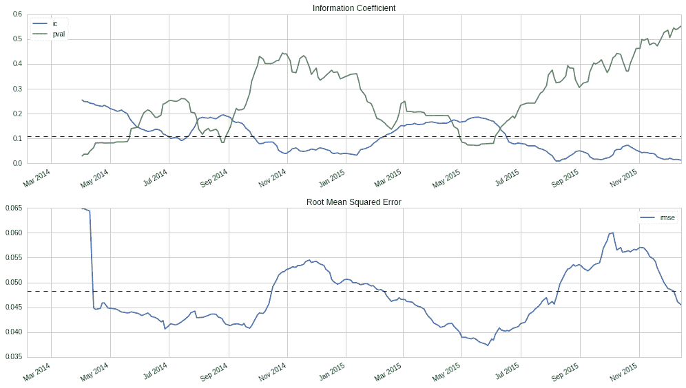

突显 IC 和 RMSE 的负相关的图表

对于整个时期，我们看到信息系数通过实际值和预测值的等级相关性来测量，呈弱正相关且具有统计学显著性：

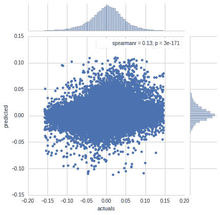

# 使用 sklearn 进行岭回归

对于岭回归，我们需要使用关键字`alpha`来调整正则化参数，该参数对应于我们之前使用的λ。 我们将尝试从 10^(-5)到 10⁵的 21 个值以对数步长进行尝试。

岭惩罚的尺度敏感性要求我们使用`StandardScaler`对输入进行标准化。 请注意，我们始终从训练集中学习均值和标准差，然后使用`.fit_transform()`方法将这些学习参数应用于测试集，然后使用`.transform()`方法。

# 使用交叉验证调整正则化参数

然后，我们继续使用`250`个折叠交叉验证超参数值：

```py
nfolds = 250
alphas = np.logspace(-5, 5, 21)
scaler = StandardScaler()

ridge_result, ridge_coeffs = pd.DataFrame(), pd.DataFrame()
for i, alpha in enumerate(alphas):
    coeffs, test_results = [], []
    lr_ridge = Ridge(alpha=alpha)
    for train_dates, test_dates in time_series_split(dates, nfolds=nfolds):
        X_train = model_data.loc[idx[train_dates], features]
        y_train = model_data.loc[idx[train_dates], target]
        lr_ridge.fit(X=scaler.fit_transform(X_train), y=y_train)
        coeffs.append(lr_ridge.coef_)

        X_test = model_data.loc[idx[test_dates], features]
        y_test = model_data.loc[idx[test_dates], target]
        y_pred = lr_ridge.predict(scaler.transform(X_test))

        rmse = np.sqrt(mean_squared_error(y_pred=y_pred, y_true=y_test))
        ic, pval = spearmanr(y_pred, y_test)

        test_results.append([train_dates[-1], rmse, ic, pval, alpha])
    test_results = pd.DataFrame(test_results, columns=['date', 'rmse', 'ic', 'pval', 'alpha'])
    ridge_result = ridge_result.append(test_results)
    ridge_coeffs[alpha] = np.mean(coeffs, axis=0)
```

# 交叉验证结果和岭回归系数路径

我们现在可以绘制每个超参数值获得的信息系数，并可视化随着正则化增加而系数值如何变化。 结果显示，我们在λ=10\时获得了最高的 IC 值。 对于这个正则化水平，右侧面板显示，与（几乎）不受约束的模型相比，系数已经显着收缩，λ=10^(-5)：

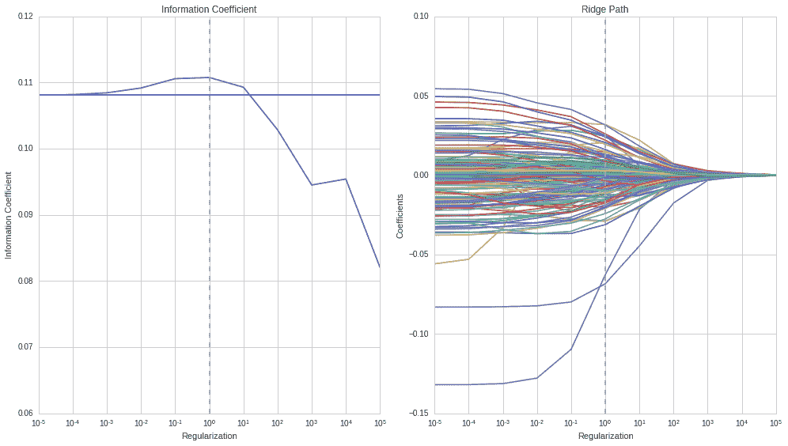

交叉验证结果和岭回归系数路径

# 前 10 个系数

系数的标准化允许我们通过比较它们的绝对值来得出关于它们相对重要性的结论。 最相关的 10 个系数是：

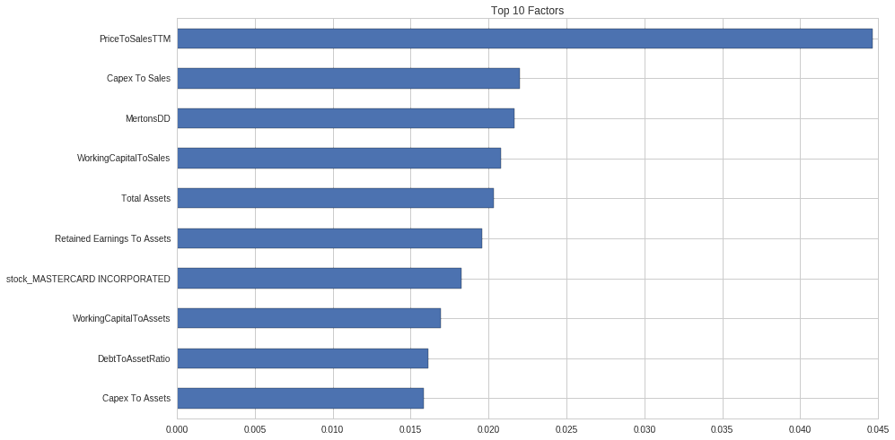

前 10 个系数

# 使用 sklearn 的套索回归

套索实现看起来与我们刚刚运行的岭回归模型非常相似。 主要区别在于，套索需要使用迭代坐标下降来找到解决方案，而岭回归可以依赖于闭合形式的解决方案：

```py
nfolds = 250
alphas = np.logspace(-8, -2, 13)
scaler = StandardScaler()

lasso_results, lasso_coeffs = pd.DataFrame(), pd.DataFrame()
for i, alpha in enumerate(alphas):
    coeffs, test_results = [], []
    lr_lasso = Lasso(alpha=alpha)
    for i, (train_dates, test_dates) in enumerate(time_series_split(dates, nfolds=nfolds)):
        X_train = model_data.loc[idx[train_dates], features]
        y_train = model_data.loc[idx[train_dates], target]
        lr_lasso.fit(X=scaler.fit_transform(X_train), y=y_train)

        X_test = model_data.loc[idx[test_dates], features]
        y_test = model_data.loc[idx[test_dates], target]
        y_pred = lr_lasso.predict(scaler.transform(X_test))

        rmse = np.sqrt(mean_squared_error(y_pred=y_pred, y_true=y_test))
        ic, pval = spearmanr(y_pred, y_test)

        coeffs.append(lr_lasso.coef_)
        test_results.append([train_dates[-1], rmse, ic, pval, alpha])
    test_results = pd.DataFrame(test_results, columns=['date', 'rmse', 'ic', 'pval', 'alpha'])
    lasso_results = lasso_results.append(test_results)
    lasso_coeffs[alpha] = np.mean(coeffs, axis=0)
```

# 交叉验证信息系数和套索路径

与以前一样，我们可以绘制在交叉验证期间使用的所有测试集的平均信息系数。 我们再次看到，正则化可以提高 IC 超出不受约束模型，以λ=10^(-5)为水平获得最佳的样本外结果。 最优的正则化值与岭回归不同，因为惩罚是相对较小的系数值的绝对值之和，而不是平方值。 我们还可以看到，对于这个正则化水平，系数已经类似地收缩，就像岭回归案例中一样：


交叉验证信息系数和套索路径

总的来说，岭回归和套索将产生类似的结果。 岭回归通常计算速度更快，但套索也通过逐渐将系数减小到零来产生连续的特征子集选择，从而消除了特征。

# 线性分类

到目前为止讨论的线性回归模型假设定量响应变量。 在本节中，我们将重点讨论对推断和预测建模定性输出变量的方法，这个过程被称为**分类**，在实践中甚至比回归更频繁地发生。

针对数据点预测定性响应被称为**分类**该观察，因为它涉及将观察分配到一个类别或类别。 在实践中，分类方法通常为定性变量的每个类别预测概率，然后使用此概率来决定适当的分类。

我们可以忽略输出变量取离散值的事实，并应用线性回归模型尝试使用多个输入变量来预测分类输出。然而，很容易构造出这种方法表现非常糟糕的例子。 此外，当我们知道*y ∈ [0, 1]*时，模型产生大于 1 或小于 0 的值并不直观。

有许多不同的分类技术或分类器可用于预测定性响应。 在本节中，我们将介绍广泛使用的逻辑回归，它与线性回归密切相关。 在接下来的章节中，我们将介绍更复杂的方法，包括决策树和随机森林的广义可加模型，以及梯度提升机和神经网络。

# 逻辑回归模型

逻辑回归模型源于希望对输出类别的概率建模，给定一个在*x*中线性的函数，就像线性回归模型一样，同时确保它们总和为一，并保持在[0, 1]，正如我们从概率期望的那样。

在本节中，我们介绍逻辑回归模型的目标和函数形式，并描述培训方法。 然后，我们说明如何使用 statsmodels 对宏观数据进行统计推断，并使用 sklearn 实现的正则化逻辑回归来预测价格走势。

# 目标函数

为了说明，我们将使用输出变量 y，如果在给定时间跨度 d 内股票收益为正，则取值为 1，否则为 0：


我们可以轻松地将 y 扩展到三个类别，其中 0 和 2 反映超过某个阈值的负面和正面价格变动，否则为 1。 然而，与其对*y*建模，逻辑回归模型对*y*属于给定一向量α因子或特征的类别的概率进行建模。 换句话说，逻辑回归模型了解包含在模型中的变量值时，股票价格上涨的概率：


# 逻辑函数

为了防止模型生成超出 [0, 1] 区间的值，我们必须使用一个只在整个 *x* 的定义域上产生 0 和 1 之间输出的函数来对 *p(x)* 建模。逻辑函数满足这一要求，并且始终产生一个 S 形曲线（见笔记本示例），因此，无论 X 的值如何，我们都将得到一个合理的预测：


在这里，向量 *x* 包括一个由  第一个分量捕获的截距，。我们可以转换此表达式以隔离类似线性回归的部分，得到：


量 *p(x)/[1−p(x)]* 称为 **几率**，是表达概率的另一种方式，可能与赌博中熟悉的方式相似，可以取 0 到 ∞ 之间的任意值，其中较低的值也意味着较低的概率，而较高的值意味着较高的概率。

对数几率也称为对数几率（因为它是几率的对数）。因此，逻辑回归表示的对数线性回归 *x* 看起来与前述的线性回归非常相似。

# 最大似然估计

系数向量  必须使用可用的训练数据进行估计。虽然我们可以使用（非线性）最小二乘法来拟合 logistic 回归模型，但更一般的最大似然方法更受欢迎，因为它具有更好的统计特性。正如我们刚刚讨论的，使用最大似然拟合 logistic 回归模型的基本直觉是寻找估计值 ，使得预测的概率  尽可能接近实际结果。换句话说，我们试图找到  这样这些估计值在股价上涨的所有情况下都接近 1，否则接近 0 的情况。更正式地说，我们正在寻求最大化似然函数：


使用总和比乘积更容易，因此让我们两边都取对数，得到对数似然函数和 logistic 回归系数的相应定义：


通过将  对  的导数设为零来通过最大化此方程获得 p+1 个所谓的得分方程，在参数中是非线性的，可以使用迭代数值方法来解决凹的对数似然函数。

# 如何使用 statsmodels 进行推理

我们将演示如何使用 `statsmodels` 进行逻辑回归，基于一个包含从 1959 年至 2009 年的季度美国宏观数据的简单内置数据集（详见笔记本 `logistic_regression_macro_data.ipynb`）。

变量及其转换列于以下表格中：

| **变量** | **描述** | **转换** |
| --- | --- | --- |
| `realgdp` | 实际国内生产总值 | 年增长率 |
| `realcons` | 实际个人消费支出 | 年增长率 |
| `realinv` | 实际私人国内投资总额 | 年增长率 |
| `realgovt` | 实际联邦支出和总投资 | 年增长率 |
| `realdpi` | 实际私人可支配收入 | 年增长率 |
| `m1` | M1 名义货币存量 | 年增长率 |
| `tbilrate` | 月度 3 个国库券利率 | 水平 |
| `unemp` | 季节性调整后的失业率（%） | 水平 |
| `infl` | 通货膨胀率 | 水平 |
| `realint` | 实际利率 | 水平 |

为了得到一个二元目标变量，我们计算季度实际 GDP 年增长率的 20 季度滚动平均值。然后，如果当前增长超过移动平均值，则分配 1，否则分配 0。最后，我们将指标变量移位，以使下一季度的结果与当前季度对齐。

我们使用一个截距，并将季度值转换为虚拟变量，并按以下方式训练逻辑回归模型：

```py
import statsmodels.api as sm

data = pd.get_dummies(data.drop(drop_cols, axis=1), columns=['quarter'], drop_first=True).dropna()
model = sm.Logit(data.target, sm.add_constant(data.drop('target', axis=1)))
result = model.fit()
result.summary()
```

这产生了我们的模型摘要，其中包含截距的 198 个观测值和 13 个变量：


逻辑回归结果

摘要显示，该模型已使用最大似然进行训练，并在 -67.9 处提供了对数似然函数的最大化值。

LL-Null 值为 -136.42 是只包括截距时对数似然函数的最大化结果。它形成了伪 R² 统计量和 Log-**似然比**（**LLR**）测试的基础。

伪 R^(2 ) 统计量是最小二乘法下可用的熟悉 R² 的替代品。它是基于空模型 m[0] 和完整模型 m[1] 的最大化对数似然函数的比率计算的，如下所示：


值从 0 变化（当模型不改善似然时）到 1（模型完美拟合时）且对数似然在 0 处最大化。因此，较高的值表明拟合效果更好。

LLR 测试通常比较一个更受限制的模型，并计算如下：


原假设是受限制模型的性能更好，但低的 p 值表明我们可以拒绝这一假设，并更喜欢完整模型而不是空模型。这类似于线性回归的 F 检验（当我们使用 MLE 估计模型时，也可以使用 LLR 测试）。

Z 统计量在线性回归输出中起着与 t 统计量相同的作用，并且与系数估计和其标准误差的比率一样计算。p 值还指示了在假设 H[0]：β = 0（总体系数为零）的情况下观察到测试统计量的概率。我们可以拒绝这个假设，对于`截距`、`realcons`、`realinv`、`realgovt`、`realdpi`和`unemp`。

# 如何使用逻辑回归进行预测

套索 L[1] 惩罚和岭 L[2] 惩罚都可以与逻辑回归一起使用。它们具有我们刚刚讨论的相同收缩效应，而套索可以再次用于任何线性回归模型的变量选择。

与线性回归一样，对输入变量进行标准化非常重要，因为正则化模型对比例敏感。正则化超参数还需要使用交叉验证进行调整，就像线性回归的情况一样。

# 如何使用 sklearn 预测价格变动

我们继续价格预测示例，但现在我们将结果变量二值化，以便在 10 天回报为正时取值为 1，否则为 0；请参阅子目录 `stock_price_prediction` 中的笔记本 `logistic_regression.ipynb`：

```py
target = 'Returns10D'
label = (y[target] > 0).astype(int).to_frame(target)
```

有了这个新的分类结果变量，我们现在可以使用默认的 L[2]正则化训练逻辑回归。对于逻辑回归，正则化与线性回归相反：λ的值越高，正则化越少，反之亦然。我们使用交叉验证评估 11 个参数值如下：

```py
nfolds = 250
Cs = np.logspace(-5, 5, 11)
scaler = StandardScaler()

logistic_results, logistic_coeffs = pd.DataFrame(), pd.DataFrame()
for C in Cs:
    coeffs = []
    log_reg = LogisticRegression(C=C)
    for i, (train_dates, test_dates) in enumerate(time_series_split(dates, nfolds=nfolds)):
        X_train = model_data.loc[idx[train_dates], features]
        y_train = model_data.loc[idx[train_dates], target]
        log_reg.fit(X=scaler.fit_transform(X_train), y=y_train)

        X_test = model_data.loc[idx[test_dates], features]
        y_test = model_data.loc[idx[test_dates], target]
        y_pred = log_reg.predict_proba(scaler.transform(X_test))[:, 1]

        coeffs.append(log_reg.coef_.squeeze())
        logistic_results = (logistic_results
                            .append(y_test
                                    .to_frame('actuals')
                                    .assign(predicted=y_pred, C=C)))
    logistic_coeffs[C] = np.mean(coeffs, axis=0)
```

然后我们使用前一章讨论的 `roc_auc_score` 来比较各种正则化参数的预测准确度：

```py
auc_by_C = logistic_results.groupby('C').apply(lambda x: roc_auc_score(y_true=x.actuals.astype(int), 
                                                         y_score=x.predicted))
```

我们可以再次绘制 AUC 结果，以显示超参数值范围以及系数路径，该路径显示系数在最佳正则化值 10² 处略微收缩时预测精度的提高：


AUC 和 Logistic Ridge 路径

# 摘要

在本章中，我们介绍了使用线性模型进行回归和分类的重要基线案例的第一个机器学习模型。我们探讨了两个任务的目标函数的制定，学习了各种训练方法，并学习了如何将模型用于推理和预测。

我们将这些新的机器学习技术应用于估计线性因子模型，这些模型对于管理风险、评估新的阿尔法因子和归因绩效非常有用。我们还应用线性回归和分类来完成第一个预测任务，即在绝对和方向性方面预测股票收益。

在下一章中，我们将讨论重要的线性时间序列模型主题，这些模型旨在捕捉单变量和多变量情况下的串行相关模式。我们还将学习关于新的交易策略，因为我们将探讨基于协整概念的配对交易，该概念捕捉了两个股价序列之间的动态相关性。
