# 时间序列模型

在上一章中，我们重点关注了适用于横截面数据的线性模型，其中输入数据属于与其旨在解释或预测的输出相同的时间段。在本章中，我们将关注时间序列数据，其中观察值按周期而不同，这也创建了自然的排序。我们的目标是识别数据中的历史模式，并利用这些模式来预测时间序列在未来的行为。

在上一章中，我们已经遇到了既有横截面又有时间序列维度的面板数据，并了解了法马-麦克白斯回归如何估计随时间和跨资产采取某些因子风险的价值。然而，随时间的回报之间的关系通常相当低，因此这个过程可能会大部分忽视时间维度。本章的模型侧重于时间序列模型，其中过去的价值包含关于未来发展的预测信号。时间序列模型还可以预测随后用于横截面模型的特征。

具体来说，在本章中，我们将重点关注从先前观察到的数据中提取信号以预测同一时间序列未来值的模型。交易的时间维度使得将时间序列模型应用于市场、基本和替代数据变得非常流行。随着越来越广泛的连接设备收集可能包含预测信号的定期测量，时间序列数据将变得更加普遍。关键应用包括资产回报、相关性或协方差、或波动率的预测。

在本章中，我们将重点关注线性时间序列模型，作为本书第四部分应用于时间序列数据的非线性模型（如递归或卷积神经网络）的基线。我们首先介绍诊断时间序列特征的工具，包括平稳性，并提取捕捉潜在模式的特征。然后，我们介绍单变量和多变量时间序列模型，并将其应用于宏观数据和波动性模式的预测。最后，我们介绍协整概念以及如何应用它来开发配对交易策略。

具体来说，我们将涵盖以下主题：

+   如何使用时间序列分析来诊断通知建模过程的诊断统计数据

+   如何估计和诊断自回归和移动平均时间序列模型

+   如何构建自回归条件异方差（ARCH）模型来预测波动性

+   如何构建向量自回归模型

+   如何利用协整性进行配对交易策略

# 诊断和特征提取的分析工具

时间序列数据是一系列由离散时间间隔分隔的值，通常是均匀间隔的（除了缺失值）。

两个不同时间点 t[i]、t[j]之间的周期数Δt= t[i] - t[j]称为滞后，对于每个时间序列有 T-1 个滞后。

如果一个时间序列是独立同分布的随机变量ε[t]的序列，并且具有有限的均值和方差，则称其为白噪声。

如果一个时间序列可以写成过去扰动ε[t]的加权和，这些扰动也称为创新，这里假设它们代表白噪声，以及序列的均值μ，则该时间序列是线性的。

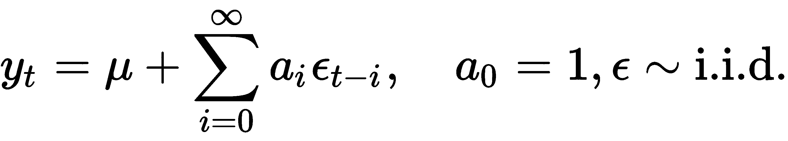

时间序列分析的一个关键目标是理解由系数 a[i]驱动的动态行为。

在本章的大多数示例中，我们使用由美联储提供的数据，您可以使用我们在第二章中介绍的`pandas datareader`进行访问，*市场和基本数据*。 本节的代码示例可在笔记本`tsa_and_arima`中找到。

# 如何分解时间序列模式

时间序列数据通常包含各种模式的混合，可以分解为几个组成部分，每个部分代表一种基本模式类别。特别是，时间序列通常由系统组件趋势、季节性和周期性以及非系统噪声组成。这些组件可以在加法线性模型中组合，特别是当波动不依赖于系列水平时，或者在非线性乘法模型中组合。

这些组件可以自动拆分。`statsmodels`包括一种简单的方法，将时间序列拆分为趋势、季节和残差分量，使用移动平均。我们可以将其应用于工业制造生产的月度数据，该数据具有强烈的趋势和季节性分量，如下所示：

```py
import statsmodels.tsa.api as tsa
industrial_production = web.DataReader('IPGMFN', 'fred', '1988', '2017-12').squeeze()
components = tsa.seasonal_decompose(industrial_production, model='additive')
ts = (industrial_production.to_frame('Original')
      .assign(Trend=components.trend)
      .assign(Seasonality=components.seasonal)
      .assign(Residual=components.resid))
ts.plot(subplots=True, figsize=(14, 8));
```

结果图显示了加法组件。假设趋势和季节性组件更确定且更适合简单外推，则残差组件将成为额外建模的焦点：

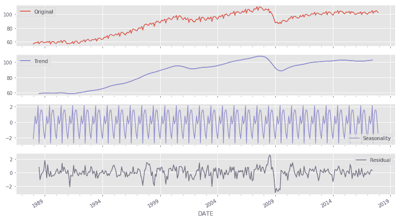

还有更复杂的基于模型的方法，这些方法包含在 GitHub 上可用的参考资料中。

# 如何计算滚动窗口统计量

考虑到时间序列数据的顺序排列，自然而然地计算给定长度周期的熟悉描述性统计量，以检测稳定性或行为变化，并获得捕获系统方面的平滑表示，同时过滤噪声。

滚动窗口统计为此过程服务：它们生成一个新的时间序列，其中每个数据点表示原始数据的一定期间内计算的摘要统计量。移动平均是最熟悉的例子。原始数据点可以以相等的权重进入计算，或者使用权重来，例如，强调最近的数据点。指数移动平均递归地计算权重，使得远离现在的数据点权重缩小或衰减。新的数据点通常是所有前面数据点的摘要，但也可以从周围的窗口计算。

`pandas`库包括非常灵活的功能来定义各种窗口类型，包括滚动窗口、指数加权窗口和扩展窗口。在第二步中，您可以对由窗口捕获的每个数据应用计算。这些计算包括针对单个系列的内置标准计算，例如平均值或总和，对于几个系列的相关性或协方差，以及用户定义的函数。以下部分中的移动平均和指数平滑示例使用了这些工具。

# 移动平均和指数平滑

早期的预测模型包括带有指数权重的移动平均模型，称为指数平滑模型。我们将在后面的线性时间序列中再次遇到移动平均作为关键的构建块。

依赖指数平滑方法的预测使用过去观测的加权平均值，其中随着观测时间的推移，权重呈指数衰减。因此，更近期的观测获得更高的关联权重。这些方法在时间序列不具有非常复杂或突然的模式时很受欢迎。

指数平滑是一种流行的技术，基于过去观测的加权平均，随着观测时间的推移，权重呈指数衰减。换句话说，观测越近，相关的权重越高。这个框架可以快速生成可靠的预测，适用于广泛的时间序列，这是一个巨大的优势，对于工业应用至关重要。

# 如何测量自相关

自相关（也称为串行相关）将相关概念调整为时间序列环境：正如相关系数衡量两个变量之间线性关系的强度一样，自相关系数ρ[k]衡量相隔给定滞后 k 的时间序列值之间的线性关系的程度：

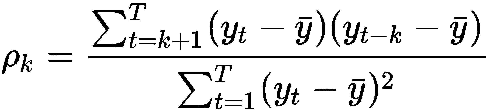

因此，我们可以计算时间序列中 T-1 个滞后的每个自相关系数；T 是序列的长度。自相关函数（ACF）根据滞后计算相关系数。

对于大于 1 的滞后自相关（即，超过一个时间步的观测之间的），反映了这些观测之间的直接相关以及中间数据点的间接影响。偏自相关消除了这种影响，只测量给定滞后距离的数据点之间的线性依赖关系。**偏自相关函数（PACF）**提供了一旦较短滞后的相关性效应被移除后产生的所有相关性。

有算法根据 PACF 与 ACF 之间的确切理论关系来估计样本自相关的偏自相关。

自相关图简单地是顺序滞后 k=0,1,...,n 的 ACF 或 PACF 的图。它允许我们一眼就检查各个滞后的相关结构。自相关图的主要用途是在去除确定性趋势或季节性影响后检测任何自相关。ACF 和 PACF 都是线性时间序列模型设计的关键诊断工具，我们将在时间序列转换的以下部分中审查 ACF 和 PACF 图的示例。

# 如何诊断并实现平稳性

稳定时间序列的统计特性，如均值、方差或自相关，与时期无关，即它们随时间不变化。因此，稳态意味着时间序列没有趋势或季节效应，而且当为不同的滚动窗口计算描述统计量（如均值或标准差）时，它们是常数或随时间变化不大的。它回归到其均值，偏差具有恒定的幅度，而短期波动在统计意义上总是相同的。

更正式地说，严格稳态要求任何时间序列观测子集的联合分布与时间无关，而与所有时刻的矩一致。因此，除了均值和方差外，高阶矩，如偏度和峰度，也需要保持不变，而不考虑不同观测之间的滞后。在大多数应用中，我们将稳态限制为一阶和二阶矩，以使时间序列具有恒定的均值、方差和自相关。

请注意，我们特别允许不同滞后观测之间的依赖关系，就像我们希望线性回归的输入数据与结果相关联一样。稳态意味着这些关系是稳定的，这有助于预测，因为模型可以专注于学习发生在稳定统计属性内的系统模式。这很重要，因为经典统计模型假设时间序列输入数据是稳态的。

以下部分介绍了帮助检测数据非稳态的诊断方法，以及帮助满足这些假设的转换方法。

# 时间序列转换

要满足线性时间序列模型的稳态假设，我们需要转换原始时间序列，通常需要几个步骤。常见的转换包括将（自然）对数应用于将指数增长模式转换为线性趋势并稳定方差。通货紧缩意味着将一个时间序列除以另一个导致趋势行为的系列，例如将名义系列除以价格指数以将其转换为实际测量。

如果一个系列恢复到一个稳定的长期线性趋势，则它是趋势稳定的。通常可以通过使用线性回归拟合趋势线并使用残差，或者通过将时间指数包括为回归或 AR(I)MA 模型的独立变量（请参阅下一节有关单变量时间序列模型的内容）来使其稳定，可能结合对数化或通货紧缩。

在许多情况下，去趋势化不足以使序列平稳。相反，我们需要将原始数据转换为周期间和/或季节间差异的系列。换句话说，我们使用相邻数据点或季节滞后值相互减去的结果。请注意，当将这种差分应用于对数变换的序列时，结果代表金融背景下的瞬时增长率或收益率。

如果单变量序列在差分 d 次后变为平稳，则称其为 d 阶整合，如果 d=1，则称其为简单整合。这种行为是由所谓的单位根引起的。

# 如何诊断和解决单位根问题

单位根对确定将时间序列变为平稳的转换提出了特殊问题。时间序列通常被建模为我们将更详细地探讨的具有以下自回归形式的随机过程，作为 ARIMA 模型的构建块：

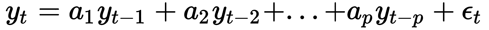

其中当前值是过去值的加权和加上随机扰动。这样的过程具有以下形式的特征方程：

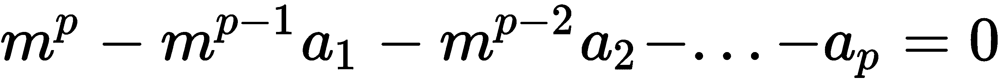

如果此方程的根之一等于 1，则该过程被称为具有单位根。它将是非平稳的，但不一定需要趋势。如果特征方程的剩余根的绝对值小于 1，则过程的一阶差分将是平稳的，并且过程是整合的（阶数为 1）或 I(1)。如果附加根的绝对值大于 1，则积分的阶数较高，并且将需要额外的差分。

在实践中，利率或资产价格的时间序列通常不是平稳的，例如，因为不存在价格水平使序列回归。非平稳序列最突出的例子是给定起始价格 p[0]（例如，股票的首次公开发行价格）和满足以下条件的白噪声扰动 ε 的价格时间序列的随机游走：

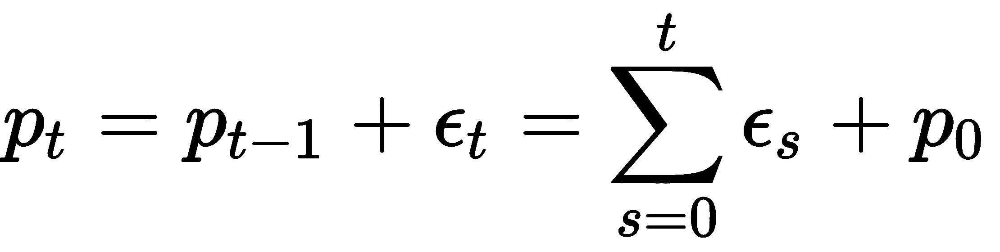

重复代换表明，当前值 p[t] 是所有先前扰动或创新 ε 以及初始价格 p[0] 的总和。如果方程包括一个常数项，则随机游走被称为具有漂移。因此，随机游走是以下形式的自回归随机过程：

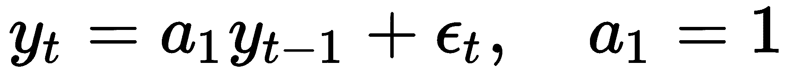

具有特征方程 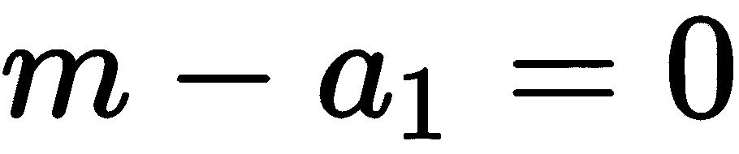，该方程具有单位根并且既不稳定也不是一阶积分。一方面，鉴于 ε 的 i.i.d. 性质，时间序列的方差等于 σ²，这不是二阶稳定的，并且暗示着原则上，该系列随时间可能采用任何变量。另一方面，进行第一次差分，Δp[t]=p[t]-p[t-1]，留下 Δp[t]=ε [t]，这是稳定的，鉴于对 ε 的统计假设。

单位根非平稳系列的定义特征是长期记忆：因为当前值是过去扰动的总和，所以大的创新持续的时间比均值回归、平稳的系列长得多。

除了使用相邻数据点之间的差异来消除恒定变化模式之外，还可以应用季节性差分来消除季节性变化的模式。这涉及到以表示季节模式长度的滞后距离为单位，相隔四个季度或 12 个月的值之间的差异，以消除季节性和线性趋势。

识别正确的转换，尤其是差分的适当数量和滞后期并不总是明确的。一些规则已经被提出，总结如下：

+   **10+滞后期的正自相关**: 可能需要更高阶的差分。

+   **滞后期接近零或为负，或一般较小且无规律**: 不需要更高阶的差分。

+   **滞后期-1 的自相关< -0.5**: 系列可能存在过多的差分。

+   轻微的过度或不足的差分可以通过 AR 或 MA 项进行修正。

+   最优差分通常会产生最低的标准差，但并非总是如此。

+   无差分的模型假设原始系列是平稳的，包括均值回归。通常包括一个常数项，以允许非零均值。

+   具有一次差分次序的模型假设原始系列具有恒定的平均趋势，并且应包括一个常数项。

+   具有两个差分次序的模型假设原始系列具有时变趋势，不应包括一个常数。

一些作者推荐分数差分作为使集成系列保持稳定的更灵活的方法，可能能够在离散间隔中保留比简单或季节性差异更多的信息或信号（参见 GitHub 上的参考资料）。

# 单位根检验

统计单位根检验是一种常见的客观确定（额外）差分是否必要的方法。这些是用于确定是否需要差分的平稳性的统计假设检验。

增广 Dickey-Fuller (ADF) 检验评估一个时间序列样本是否具有单位根的零假设，对比平稳性的备择假设。它对时间趋势、第一滞后和所有滞后差异的差异化时间序列进行回归，并根据滞后时间序列值的系数值计算一个检验统计量。 `statsmodels` 使得实现变得容易（参见伴随的笔记本）。

形式上，时间序列 y[t] 的 ADF 测试运行线性回归：

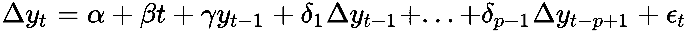

其中 α 是一个常数，β 是时间趋势的系数，p 是模型中使用的滞后数。α=β =0 约束意味着一个随机游走，而只有 β=0 意味着有漂移的随机游走。滞后顺序通常使用在第七章 中介绍的 AIC 和 BIC 信息标准来决定，*线性模型*。

ADF 检验统计量使用样本系数 γ，在单位根非平稳的零假设下等于零，在其他情况下为负。它旨在证明，对于一个积分序列，滞后的系列值不应该在预测超出滞后差异的第一差异时提供有用的信息。

# 如何应用时间序列变换

以下图表显示了纳斯达克股票指数和工业生产在原始形式下的 30 年时间序列，以及应用对数和随后应用第一和季节性差异（在滞后 12 ）之后的转换版本。图表还显示了 ADF p 值，这使得我们可以在两种情况下拒绝单位根非平稳的假设：

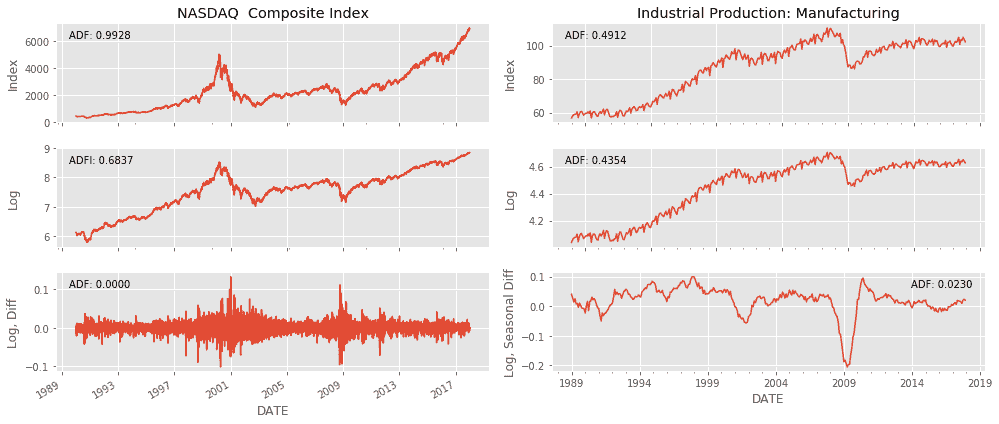

我们可以进一步分析转换后时间序列的相关特征，使用一个 Q-Q 图来比较时间序列观测值的分布的分位数和正态分布的分位数，以及基于 ACF 和 PACF 的自相关图。

对于纳斯达克图表，我们注意到虽然没有趋势，但方差不是恒定的，而是在 1980 年代末、2001 年和 2008 年的市场动荡时期附近显示出集群的尖峰。Q-Q 图突出显示了分布的尾部肥大，极端值比正态分布所暗示的更频繁。ACF 和 PACF 显示出类似的模式，多个滞后处的自相关显著：

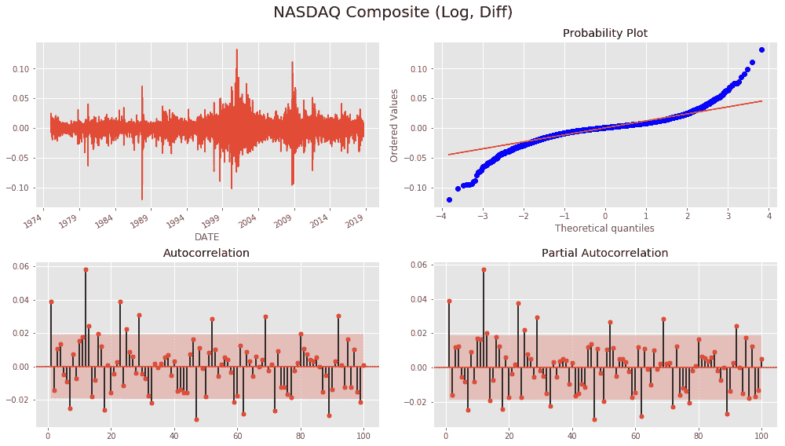

对于工业生产的月度时间序列，我们注意到 2008 年危机后出现了一个大的负异常值，以及 Q-Q 图中相应的偏斜。自相关远高于纳斯达克回报，并且平稳下降。PACF 在滞后 1 和 13 处显示出明显的正自相关模式，并且在滞后 3 和 4 处有显著的负系数：

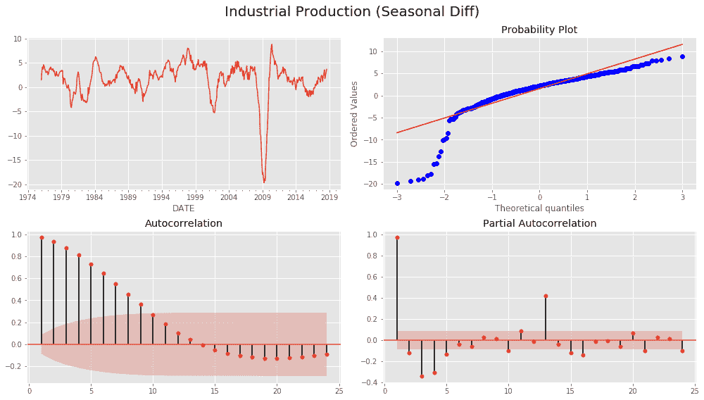

# 单变量时间序列模型

多元线性回归模型将感兴趣的变量表达为预测变量或输入变量的线性组合。单变量时间序列模型将感兴趣时间点的时间序列值与系列滞后值的线性组合以及可能的过去干扰项相关联。

虽然指数平滑模型是基于数据中的趋势和季节性的描述，但 ARIMA 模型旨在描述数据中的自相关性。ARIMA(p, d, q) 模型需要稳定性，并利用两个构建块：

+   **自回归** (**AR**) 项由时间序列的 p 滞后值组成

+   **移动平均** (**MA**) 项包含 q 滞后干扰

I 代表积分，因为模型可以通过对系列进行 d 次微分来考虑单位根非平稳性。自回归术语强调 ARIMA 模型意味着时间序列对其自身值的回归。

我们将介绍 ARIMA 构建块，简单的自回归 (AR) 和移动平均 (MA) 模型，并解释如何将它们结合在自回归移动平均 (ARMA) 模型中，该模型可以作为 ARIMA 模型考虑系列集成，或者包含外生变量作为 AR(I)MAX 模型。此外，我们将说明如何包含季节性 AR 和 MA 项以扩展工具箱，以便还包括 SARMAX 模型。

# 如何构建自回归模型

顺序 p 的 AR 模型旨在捕捉不同滞后时间序列值之间的线性相关性，并可写为：


这与 y[t] 的滞后值的多重线性回归非常相似。该模型具有以下特征方程：

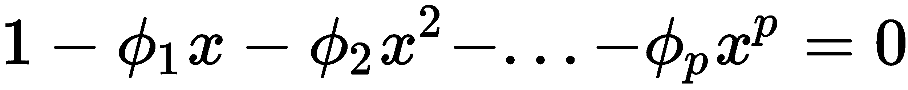

解此方程的 x 的解的倒数是特征根，如果这些根在绝对值上都小于 1，则 AR(p) 过程是稳定的，否则是不稳定的。对于稳态系列，多步预测将收敛到系列的平均值。

我们可以使用熟悉的最小二乘法估计模型参数，使用 p+1，..., T 观测数据以确保每个滞后项和结果都有数据。

# 如何确定滞后数量

实际上，挑选适当的滞后项顺序 p 是一个挑战。用于串行相关性的时间序列分析工具起着关键作用。ACF 估计不同滞后观测之间的自相关性，这反过来是直接和间接线性相关性的结果。

因此，对于阶数为 k 的 AR 模型，ACF 将显示出一直到滞后 k 的显著串行相关，并且由于线性关系间接影响所导致的惯性，将延伸到后续滞后，最终因效应减弱而逐渐消失。另一方面，PACF 仅度量观察值之间的直接线性关系，间隔给定滞后，因此不会反映超过 *k* 的滞后的相关性。

# 如何诊断模型拟合度

如果模型捕获了滞后之间的线性依赖关系，则残差应该类似于白噪声。

除了检查 ACF 以验证自相关系数的显著性缺失外，Ljung-Box Q 统计量还允许我们测试残差序列是否遵循白噪声的假设。零假设是所有 m 个串行相关系数都为零，而备择假设是一些系数不为零。测试统计量是从不同滞后 k 的样本自相关系数 ρ[k] 计算得到，并且遵循一个 Χ² 分布：

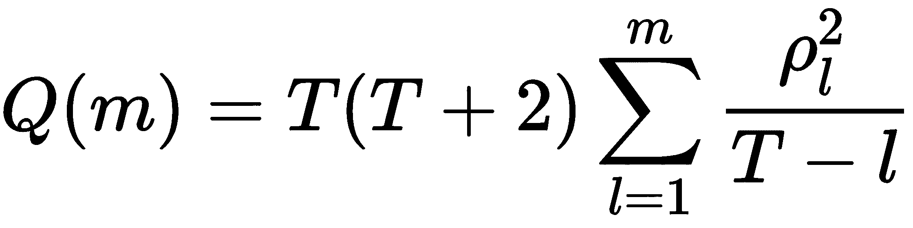

正如我们将看到的，`statsmodels` 提供了关于不同滞后的系数显著性的信息，不显著的系数应予以删除。如果 Q 统计量拒绝了无自相关的原假设，则应考虑额外的 AR 项。

# 如何构建移动平均模型

阶数为 q 的 MA 模型使用过去 q 个扰动，而不是时间序列的滞后值，如下：


由于我们没有观察到白噪声扰动值 ε[t]，MA(q) 不像我们迄今为止见过的那样是一个回归模型。MA(q) 模型不是使用最小二乘法估计的，而是使用最大似然估计（MLE），或者在系列开始时初始化或估计扰动，然后递归和迭代地计算剩余部分。

MA(q)模型的名称源于将每个 y[t] 的值表示为过去 q 个创新的加权移动平均。换句话说，当前的估计值代表了相对于模型过去错误的修正。与指数平滑或估计季节性时间序列分量不同，MA(q)模型中移动平均的使用旨在预测未来值，而不是去噪声或估计过去值的趋势周期。

MA(q) 过程始终是平稳的，因为它们是白噪声变量的加权和，而这些变量本身是平稳的。

# 如何确定滞后数

由 MA(q) 过程产生的时间序列由前 q 个模型预测的残差驱动。因此，MA(q) 过程的 ACF 将显示出到滞后 q 的值的显著系数，然后急剧下降，因为这是假定系列值生成的方式。

# AR 和 MA 模型之间的关系

AR(p) 模型可以使用重复替代表示为 MA(∞) 过程。当对其系数的大小施加约束时，一个 MA(q) 过程，它变得可逆，并且可以表示为 AR(∞) 过程。

# 如何构建 ARIMA 模型及其扩展

自回归积分移动平均 ARIMA(p, d, q) 模型结合了 AR(p) 和 MA(q) 过程，利用这些构建模块的互补性，并通过使用更紧凑的形式简化模型开发，并减少参数的数量，从而减少过拟合的风险。

该模型还通过使用时间序列值的 d^(th) 差分来消除单位根非平稳性。ARIMA(p, 1, q) 模型与使用系列的第一次差分的 ARMA(p, q) 模型相同。使用 y' 表示非季节性差分 d 次后的原始系列，ARIMA(p, d, q) 模型就是：

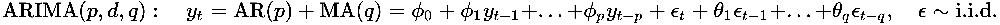

ARIMA 模型也是使用最大似然估计的。根据实现的不同，高阶模型通常会包含低阶模型。例如，`statsmodels` 包括所有低阶 p 和 q 项，并且不允许移除小于最高值的滞后项系数。在这种情况下，高阶模型总是拟合得更好。小心不要通过使用过多的项过度拟合模型。

# 如何确定 AR 和 MA 项的数量

由于 AR(p) 和 MA(q) 项相互作用，ACF 和 PACF 提供的信息不再可靠，只能作为起点使用。

传统上，AIC 和 BIC 信息准则一直被用来在选择模型设计时依赖于样本内拟合。或者，我们可以依赖于样本外测试来交叉验证多个参数选择。

以下摘要提供了在考虑 AR 和 MA 模型时选择模型阶数的一些通用指导：

+   超过 PACF 截断的滞后是所示的 AR 项的数量。如果差分序列的 PACF 显示出明显的截断和/或滞后 1 的自相关是正的，则添加一个或多个 AR 项。

+   超过 ACF 截断的滞后是所示的 MA 项的数量。如果差分序列的 ACF 显示出明显的截断和/或滞后 1 的自相关是负的，则考虑向模型中添加一个 MA 项。

+   AR 和 MA 项可能会相互抵消彼此的影响，因此如果您的模型同时包含两者，尝试总是将 AR 和 MA 项的数量减少 1，以避免过度拟合，特别是如果更复杂的模型需要超过 10 次迭代才能收敛。

+   如果 AR 系数之和接近于 1，并且表明模型的 AR 部分存在单位根，则应消除 1 个 AR 项并再次进行差分。

+   如果 MA 系数之和接近于 1，并且表明模型的 MA 部分存在单位根，则应消除 1 个 MA 项，并将差分阶数降低 1。

+   不稳定的长期预测表明模型的 AR 或 MA 部分可能存在单位根。

# 添加特征 - ARMAX

ARMAX 模型在 ARMA 时间序列模型的右侧添加输入变量或协变量（假设序列是平稳的，因此我们可以跳过差分）：

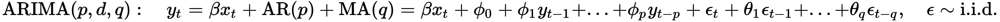

这类似于线性回归模型，但很难解释，因为 β 对 y[t] 的影响不是像线性回归中 x[t] 增加一个单位那样简单。相反，在方程的右侧存在 y[t] 的滞后值意味着系数只能在考虑到响应变量的滞后值时进行解释，这几乎是不直观的。

# 添加季节性差分 - SARIMAX

对于具有季节效应的时间序列，我们可以包括捕捉季节性周期性的 AR 和 MA 项。例如，当使用月度数据且季节效应长度为一年时，季节性 AR 和 MA 项将反映这个特定的滞后长度。

然后 ARIMAX(p, d, q) 模型变成了 SARIMAX(p, d, q) x (P, D, Q)[s] 模型，这样写起来稍微复杂一些，但是 GitHub 上的参考资料，包括 statsmodels 的文档，提供了详细信息。

现在我们将使用宏观数据构建一个季节性 ARMA 模型来说明实施过程。

# 如何预测宏观基本面

我们将为 1988-2017 年间的工业生产时间序列构建一个 SARIMAX 模型。正如在关于分析工具的第一部分中所说明的，数据已经进行了对数变换，我们正在使用季节性（滞后-12）差分。我们使用一个包括常规 AR 和 MA 参数范围的滚动窗口对 10 年的训练数据进行模型估计，并评估 1 步预测的 RMSE，如下所示的简化代码（详情请参阅 GitHub）：

```py
for p1 in range(4):                # AR order
    for q1 in range(4):            # MA order
        for p2 in range(3):        # seasonal AR order
            for q2 in range(3):    # seasonal MA order
                y_pred = []
                for i, T in enumerate(range(train_size, len(data))):
                    train_set = data.iloc[T - train_size:T]
                    model = tsa.SARIMAX(endog=train_set,            # model specification
                                        order=(p1, 0, q1),
                                        seasonal_order=(p2, 0, q2, 12)).fit()

                    preds.iloc[i, 1] = model.forecast(steps=1)[0]    # 1-step ahead forecast

                mse = mean_squared_error(preds.y_true, preds.y_pred)
                test_results[(p1, q1, p2, q2)] = [np.sqrt(mse),
                                                  preds.y_true.sub(preds.y_pred).std(),
                                                  np.mean(aic)]
```

我们还收集了 AIC 和 BIC 标准，显示了 0.94 的非常高的秩相关系数，其中 BIC 倾向于比 AIC 稍少参数的模型。RMSE 最佳的五个模型为：

```py
                 RMSE         AIC         BIC
p1 q1 p2 q2                                  
2  3  1  0   0.009323 -772.247023 -752.734581
3  2  1  0   0.009467 -768.844028 -749.331586
2  2  1  0   0.009540 -770.904835 -754.179884
   3  0  0   0.009773 -760.248885 -743.523935
   2  0  0   0.009986 -758.775827 -744.838368

```

我们重新估计了一个 SARIMA(2, 0, 3) x (1, 0, 0) 模型，如下所示：

```py
best_model = tsa.SARIMAX(endog=industrial_production_log_diff, order=(2, 0, 3),
                         seasonal_order=(1, 0, 0, 12)).fit()
print(best_model.summary())
```

我们得到以下摘要：

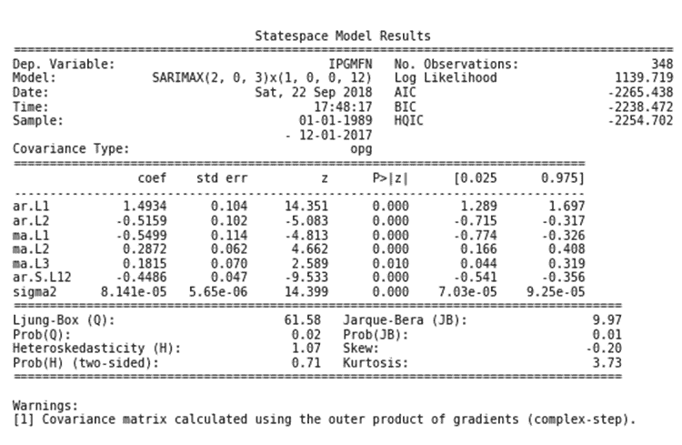

系数是显著的，并且 Q 统计量拒绝了进一步自相关的假设。相关图表同样表明我们已成功消除了序列的自相关性：

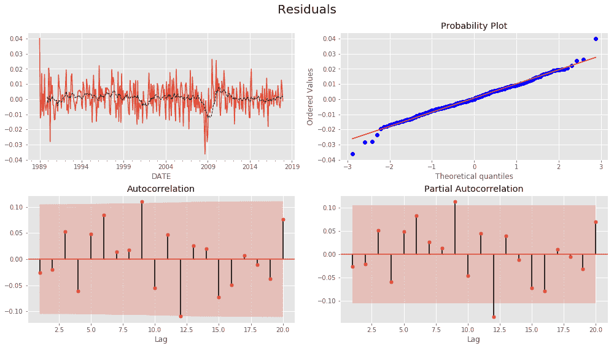

# 如何使用时间序列模型来预测波动性

单变量时间序列模型的一个特别重要的应用领域是波动率的预测。金融时间序列的波动率通常随时间而变化，但是波动率的变化会聚集在一起。方差的变化对于使用经典的 ARIMA 模型进行时间序列预测构成挑战。为了解决这一挑战，我们现在将对波动率进行建模，以便我们可以预测方差的变化。

异方差性是变量方差变化的技术术语。自回归条件异方差（ARCH）模型将误差项的方差表达为前期误差的函数。更具体地说，它假定误差方差遵循一个 AR(p) 模型。

广义自回归条件异方差（GARCH）模型将范围扩展到 ARMA 模型。时间序列预测通常将 ARIMA 模型用于时间序列的预期均值，并将 ARCH/GARCH 模型用于时间序列的预期方差。2003 年诺贝尔经济学奖授予了罗伯特·恩格尔和克莱夫·格兰杰，以表彰他们开发了这类模型。前者还在纽约大学斯特恩商学院（参见 GitHub 引用）运营着波动性实验室，提供了许多关于我们将讨论的模型及其众多扩展的在线示例和工具。

# 自回归条件异方差（ARCH）模型

ARCH(p) 模型简单地是将 AR(p) 模型应用于时间序列模型的残差方差，该模型使得时间 t 的方差条件于方差的滞后观测。更具体地说，误差项 ε[t] 是原始时间序列上线性模型（如 ARIMA）的残差，并分为一个时间相关的标准差 σ[t] 和一个扰动 *z[t]*，如下所示：


ARCH(p) 模型可以使用 OLS 进行估计。Engle 提出了一种使用拉格朗日乘子检验来确定适当的 ARCH 阶数的方法，该检验对应于线性回归中所有系数为零的假设的 F 检验（参见 第七章，*线性模型*）。

该模型的一个优点是它产生波动率，并估计正的超额峰度——即，相对于正态分布有厚尾，这与关于回报的经验观察一致。弱点包括模型假设正和负波动冲击具有相同的效应，因为它依赖于前一冲击的平方，而资产价格已知对正和负冲击有不同的反应。ARCH 模型也没有提供关于金融时间序列变化源的新见解，因为它只是机械地描述条件方差。最后，ARCH 模型很可能会过度预测波动性，因为它对回报系列的大规模孤立冲击反应缓慢。

对于正确规范的 ARCH 模型，标准化残差（除以标准偏差期间的模型估计）应类似于白噪声，并且可以进行 Ljung-Box Q 检验。

# 泛化 ARCH —— GARCH 模型

ARCH 模型相对简单，但通常需要许多参数来捕获资产收益系列的波动性模式。**广义 ARCH**（**GARCH**）模型适用于对数收益系列 r[t]，具有扰动项 ε[t] = r[t ]- μ，如果遵循 GARCH(p, q) 模型：

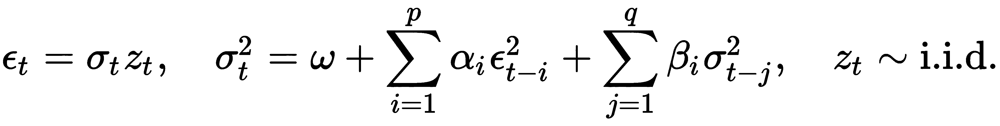

GARCH(p, q) 模型假设误差项 ε[t] 的方差服从 ARMA(p, q) 模型。

类似于 ARCH 模型，GARCH(1,1) 过程的尾部分布比正态分布更重。该模型面临与 ARCH 模型相同的弱点。例如，它对正负冲击的反应一样。

# 选择滞后阶数

要为 ARCH 和 GARCH 模型配置滞后阶数，使用训练以预测原始系列均值的时间序列的平方残差。残差是零中心化的，因此它们的平方也是方差。然后检查平方残差的 ACF 和 PACF 图以识别时间序列方差中的自相关模式。

# 如何构建波动率预测模型

为资产收益序列开发波动率模型包括四个步骤：

1.  基于 ACF 和 PACF 显示的序列依赖性构建金融时间序列的 ARMA 时间序列模型。

1.  再次依靠残差序列的 ACF 和 PACF 检查模型的残差是否具有 ARCH/GARCH 效应。

1.  如果序列相关效应显著，则指定一个波动率模型，并联合估计均值和波动率方程。

1.  仔细检查拟合的模型，如有必要，进行精细调整。

当将波动率预测应用于回报序列时，序列依赖性可能有限，因此可以使用恒定均值代替 ARMA 模型。

`arch` 库提供了几个选项来估计波动率预测模型。它提供了几个选项来建模预期均值，包括一个常数均值，上面关于单变量时间序列模型的 AR(p) 模型以及更近期的异质自回归过程（HAR），它使用每日（1 天）、每周（5 天）和每月（22 天）的滞后来捕捉短期、中期和长期投资者的交易频率。

可以与几个条件异方差模型一起定义和估计均值模型，除了 ARCH 和 GARCH 外，还包括允许正负收益之间的非对称效应的**指数 GARCH**（**EGARCH**）模型，以及**异质 ARCH**（**HARCH**）模型，它补充了 HAR 均值模型。

我们将使用 1998 年至 2017 年的每日纳斯达克收益来演示 GARCH 模型的使用情况（有关详细信息，请参阅笔记本 `arch_garch_models`）：

```py
nasdaq = web.DataReader('NASDAQCOM', 'fred', '1998', '2017-12-31').squeeze()
nasdaq_returns = np.log(nasdaq).diff().dropna().mul(100) # rescale to facilitate optimization
```

重新缩放的日收益率系列仅具有有限的自相关性，但与均值的平方偏差具有显着的记忆，反映在缓慢衰减的 ACF 和 PACF 上，前两者的值很高，并且仅在前六个滞后之后才截断：

```py
plot_correlogram(nasdaq_returns.sub(nasdaq_returns.mean()).pow(2), lags=120, title='NASDAQ Daily Volatility')
```

函数`plot_correlogram`生成了以下输出：

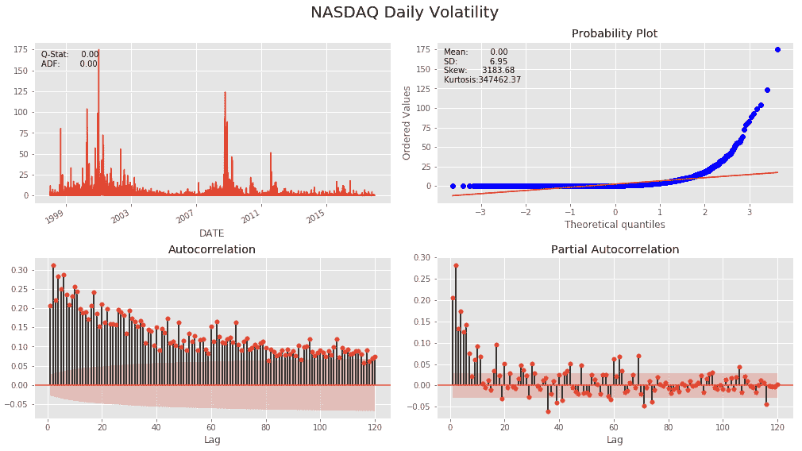

因此，我们可以估计一个 GARCH 模型来捕捉过去波动率的线性关系。我们将使用滚动 10 年窗口来估计一个 GARCH(p, q)模型，其中 p 和 q 的范围为 1-4，以生成 1 步的外样本预测。然后，我们将比较预测波动性的 RMSE 与实际收益偏离其均值的平方之间的 RMSE，以确定最具预测性的模型。我们使用修剪数据来限制极端收益值的影响，这些值反映在波动性的非常高的正偏度中：

```py
trainsize = 10 * 252  # 10 years
data = nasdaq_returns.clip(lower=nasdaq_returns.quantile(.05),
                           upper=nasdaq_returns.quantile(.95))
T = len(nasdaq_returns)
test_results = {}
for p in range(1, 5):
    for q in range(1, 5):
        print(f'{p} | {q}')
        result = []
        for s, t in enumerate(range(trainsize, T-1)):
            train_set = data.iloc[s: t]
            test_set = data.iloc[t+1]  # 1-step ahead forecast
            model = arch_model(y=train_set, p=p, q=q).fit(disp='off')
            forecast = model.forecast(horizon=1)
            mu = forecast.mean.iloc[-1, 0]
            var = forecast.variance.iloc[-1, 0]
            result.append([(test_set-mu)**2, var])
        df = pd.DataFrame(result, columns=['y_true', 'y_pred'])
        test_results[(p, q)] = np.sqrt(mean_squared_error(df.y_true, df.y_pred))
```

GARCH(2, 2)模型实现了最低的 RMSE（与 GARCH(4, 2)的值相同，但参数较少），因此我们继续估计此模型以检查摘要：

```py
am = ConstantMean(nasdaq_returns.clip(lower=nasdaq_returns.quantile(.05),
                                      upper=nasdaq_returns.quantile(.95)))
am.volatility = GARCH(2, 0, 2)
am.distribution = Normal()
model = am.fit(update_freq=5)
print(model.summary())
```

输出显示了最大化的对数似然以及通常在选择基于样本内表现的模型时要最小化的 AIC 和 BIC 准则（见第七章，*线性模型*）。它还显示了均值模型的结果，本例中只是一个常数估计，以及常数 omega 的 GARCH 参数、AR 参数α和 MA 参数β，所有这些参数都具有统计学意义：

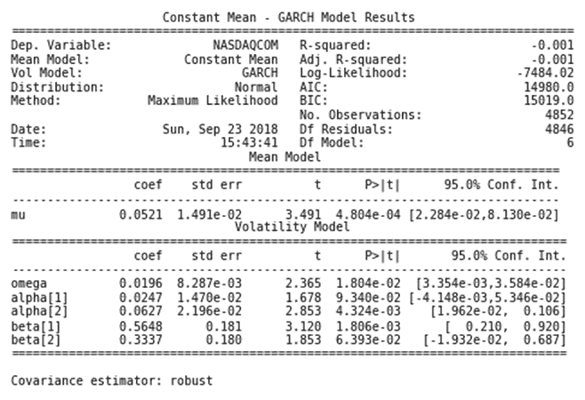

现在让我们探讨多个时间序列模型和协整概念，这将实现新的交易策略。

# 多元时间序列模型

多元时间序列模型旨在同时捕捉多个时间序列的动态，并利用这些序列之间的依赖关系进行更可靠的预测。

# 方程组

像我们刚刚讨论的 ARMA 方法这样的单变量时间序列模型仅限于目标变量与其滞后值或滞后扰动以及在 ARMAX 情况下的外生序列之间的统计关系。相比之下，多元时间序列模型还允许其他时间序列的滞后值影响目标。这种效应适用于所有系列，导致复杂的相互作用，如下图所示：

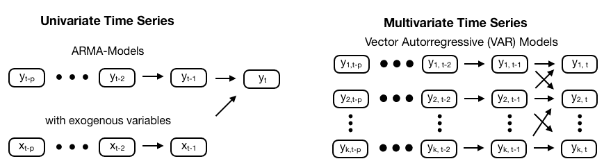

除了可能更好的预测之外，多变量时间序列还用于获得跨系列依赖关系的洞察。例如，在经济学中，多变量时间序列用于了解对某一变量的政策变化，例如利率，可能在不同的视角下如何影响其他变量。我们将要看的多变量模型产生的冲击-响应函数就是为此目的而服务的，并且允许我们模拟一个变量如何对其他变量的突然变化做出响应。格兰杰因果分析的概念分析了一个变量是否对另一个变量的预测有用（在最小二乘意义上）。此外，多变量时间序列模型允许对预测误差方差进行分解，以分析其他系列的贡献。

# 向量自回归 (VAR) 模型

我们将看到向量自回归 VAR(p) 模型如何通过创建包含所有 k 系列的 p 拖后值的 k 方程系统来扩展 AR(p) 模型。在最简单的情况下，*k=2* 的 VAR(1) 模型如下所示：

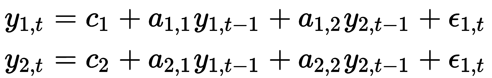

这个模型可以用矩阵形式更加简洁地表示：

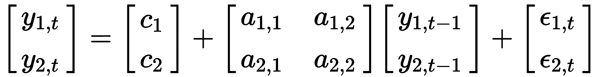

自身滞后的系数提供了有关系列动态的信息，而交叉变量系数则提供了有关系列间交互的一些见解。此符号扩展到 k 系列和阶数 p，如下所示：

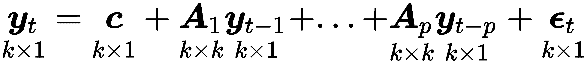

VAR(p) 模型还需要平稳性，以便从单变量时间序列建模的初始步骤延续下来。首先，探索系列并确定必要的转换，然后应用增广迪基-富勒检验来验证每个系列是否满足平稳性标准，并在否则应用进一步的转换。它可以通过有条件的 OLS 进行估计，初始信息或最大似然，对于正态分布的误差是等效的，但对于其他情况不是。

如果一些或所有的 k 系列是单位根非平稳的，则它们可能是协整的。将单位根概念扩展到多个时间序列意味着两个或多个系列的线性组合是平稳的，因此是均值回归的。VAR 模型没有能力处理这种情况而不进行差分，*而应使用向量误差校正模型 (VECM，请参阅 GitHub 上的参考资料)*。我们将进一步探讨协整性，因为如果存在并且被假定为持续存在，它可以用于配对交易策略。

滞后阶数的确定也从每个系列的 ACF 和 PACF 中获得线索，但受到同一滞后阶数适用于所有系列的约束。在模型估计之后，残差诊断也要求产生类似白噪声的结果，并且模型选择可以使用样本内信息准则或更好地使用样本外预测性能来交叉验证备选模型设计，如果最终目标是使用模型进行预测。

如在单变量情况中提到的那样，对原始时间序列的预测要求我们在训练模型之前撤消应用于使系列稳态的转换。

# 如何使用 VAR 模型进行宏观基本面预测

我们将扩展单变量示例，将一系列工业生产的月度数据和美联储数据服务提供的一系列消费者情绪的月度时间序列加入，我们将使用熟悉的`pandas-datareader`库从 1970 年到 2017 年检索数据：

```py
df = web.DataReader(['UMCSENT', 'IPGMFN'], 'fred', '1970', '2017-12').dropna()
df.columns = ['sentiment', 'ip']
```

对工业生产系列进行对数转换，并使用这两个系列的滞后 12 个月进行季节性差分产生稳态结果：

```py
df_transformed = pd.DataFrame({'ip': np.log(df.ip).diff(12),
                              'sentiment': df.sentiment.diff(12)}).dropna()

test_unit_root(df_transformed) # see notebook for details and additional plots

          p-value
ip          0.0003
sentiment   0.0000
```

这使我们得到以下系列：

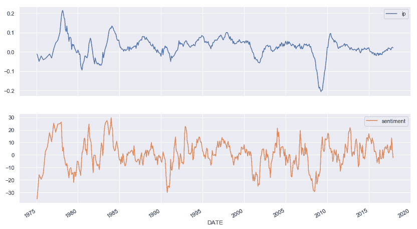

为了限制输出大小，我们将仅使用前 480 个观测值使用`statsmodels`的`VARMAX`实现（允许使用可选的外生变量）来估计一个 VAR(1)模型，使用恒定的趋势：

```py
model = VARMAX(df_transformed.iloc[:480], order=(1,1), trend='c').fit(maxiter=1000)
```

这导致以下摘要：

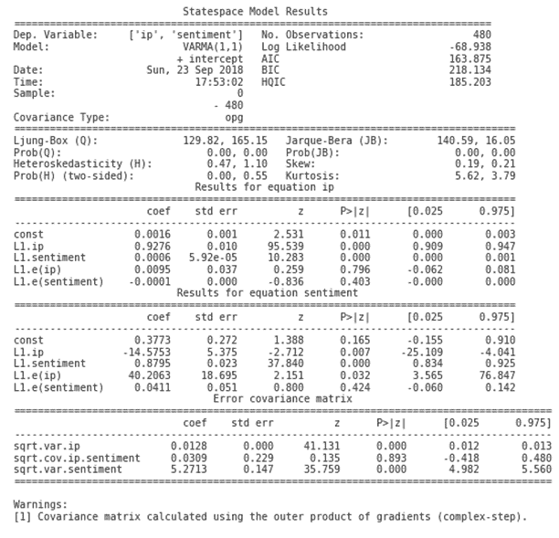

输出包含两个时间序列方程的系数，如前述的 VAR(1)示例所述。statsmodels 提供了诊断图来检查残差是否满足白噪声假设，在这种简单情况下并不完全符合：

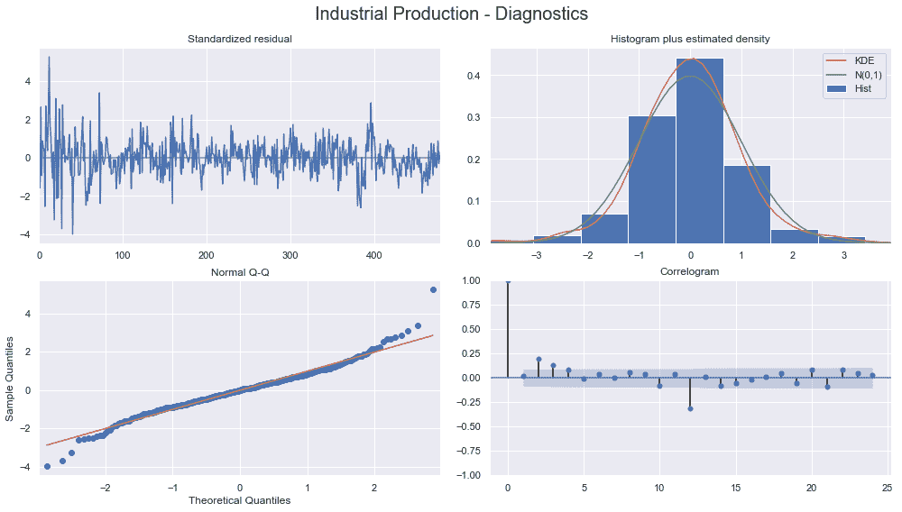

外样本预测可按以下方式生成：

```py
preds = model.predict(start=480, end=len(df_transformed)-1)
```

实际值和预测值的可视化显示了预测滞后于实际值，并且无法很好地捕捉非线性的外样本模式：

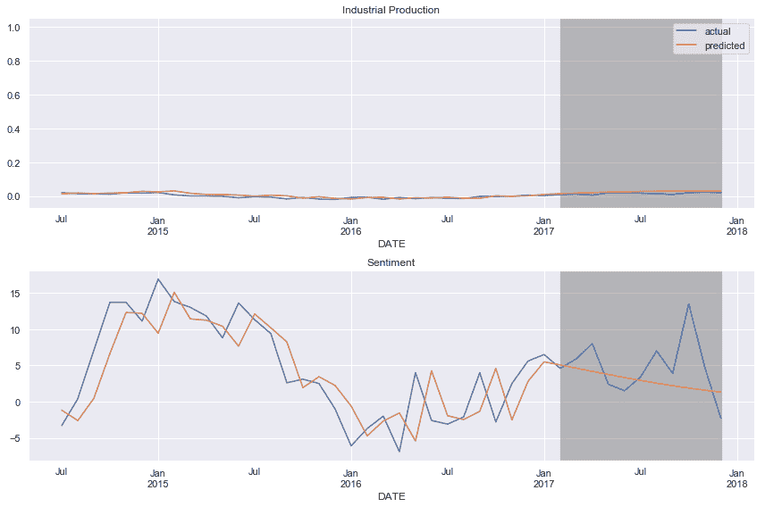

# 共整合 - 具有共同趋势的时间序列

综合多变量系列的概念因该过程的所有组成系列可能是单独集成的，但该过程在一个或多个线性组合产生新的稳态系列的意义上并非联合集成而复杂化。

换句话说，两个共整合系列的组合具有一个稳定的均值，这个线性组合会恢复到该均值。具有这种特性的多变量系列被称为共整合。当个别系列积分的次序较高且线性组合减少了积分的总次序时，这也适用。

协整与相关性不同：两个系列可能高度相关，但不一定是协整的。例如，如果两个增长系列是彼此的恒定倍数，它们的相关性将很高，但任何线性组合也将增长而不是回归到均值。

仍然可以将 VAR 分析应用于使用 VAR 模型的误差校正形式的集成过程，该模型使用各个系列的一阶差异加上水平的误差校正项。

# 测试协整

测试协整有两种主要方法：

+   Engle-Granger 两步法

+   Johansen 程序

Engle-Granger 方法涉及将一个系列回归到另一个系列，然后对回归残差应用 ADF 单位根检验。如果能拒绝原假设，假设残差是平稳的，那么这些系列就是协整的。这种方法的一个关键优势是，回归系数表示使组合平稳的乘数，即均值回归。当利用协整进行配对交易策略时，我们将回到这个方面。另一方面，这种方法仅限于识别成对系列的协整，而不是更大范围的系列组合。

相比之下，Johansen 程序测试了前一节讨论的矢量自回归（VAR）模型受协整约束的限制。更具体地说，从通用 VAR(p) 前述方程两边减去目标向量后，我们得到误差校正模型（ECM）公式

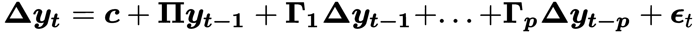

结果修改后的 VAR(p) 方程只有一个向量项在水平上，即不使用算子 Δ 表示差异。协整的性质取决于系数矩阵 Π 的特性，特别是其秩。虽然这个方程在结构上与 ADF 测试设置相似，但现在存在多个共同趋势和积分阶数的潜在星座，因为涉及到多个系列。有关详细信息，请参阅 GitHub 上列出的参考文献，包括关于个别系列尺度化的实际挑战。

# 如何利用协整进行配对交易策略

配对交易依赖于两个资产价格之间的稳定、均值回归关系。换句话说，两个价格之间的比率或差异，也称为价差，随时间可能会发散，但最终应返回到相同水平。鉴于这样的一对，该策略包括做多（即购买）表现不佳的资产，因为它需要一段时间的表现优异来填补差距。同时，应做空价格向正方向移动而远离价格锚点的资产，以筹集购买资产的资金。

协整正是由一个共同均值锚定的两个价格系列之间的这种稳定关系。假设协整持续存在，最终必须发生收敛，无论是表现不佳的股票上涨还是表现良好的股票下跌。该策略无论如何都将是有利可图的，这具有对一般市场动态进行对冲的额外优势。

然而，价差将不断变化，有时扩大，有时缩小，或者保持不变，因为两种资产同时移动。配对交易的挑战在于通过调整相对持仓来维持对冲头寸，因为价差变化。

在实践中，鉴于一组资产，配对交易策略将通过对每对运行统计测试来寻找协整对。这里的关键挑战是考虑到多重测试偏差，如第六章，*机器学习工作流*中概述的那样。`statsmodels`库实现了 Engle-Granger 协整测试和 Johansen 测试。

为了估算价差，运行线性回归以获得两个集成资产价格系列的线性组合的系数，以产生一个平稳的组合系列。如前所述，使用线性回归来估算系数被称为协整的 Engle-Granger 检验。

# 总结

在本章中，我们探讨了用于单个系列的单变量情况的线性时间序列模型以及用于几个交互系列的多变量模型。我们遇到了预测宏观基本面的应用，用于风险管理的预测资产或组合波动性的模型以及捕获多个宏观系列动态的多元 VAR 模型，以及协整的概念，这是支撑流行的配对交易策略的基础。

类似于前一章，我们看到线性模型为模型增加了许多结构，即它们做出了强有力的假设，这些假设可能需要转换和广泛测试来验证这些假设是否成立。如果是这样，模型的训练和解释就是直接的，而且模型提供了一个很好的基准案例，更复杂的模型可能会改进，我们将在接下来的章节中看到。
