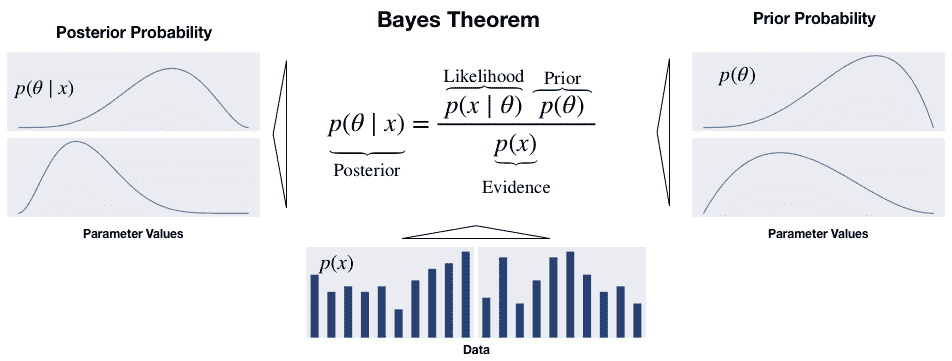
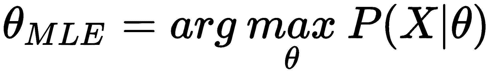
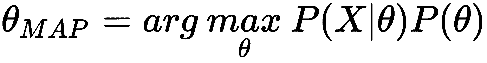
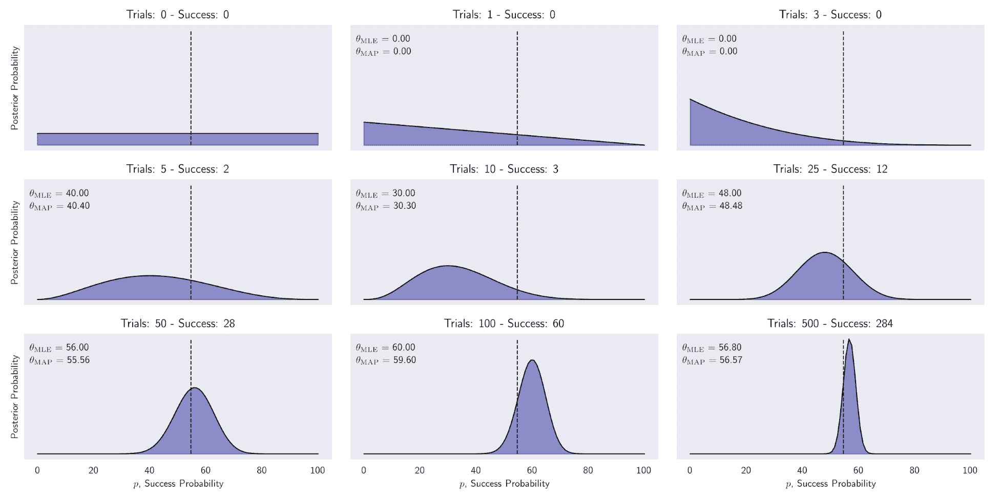
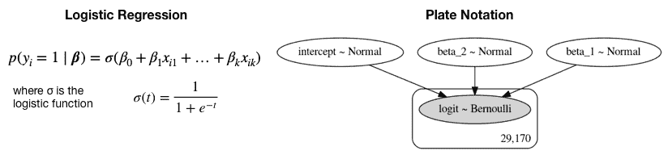
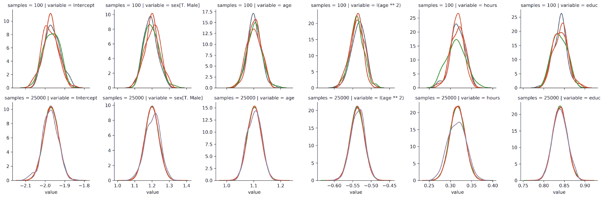
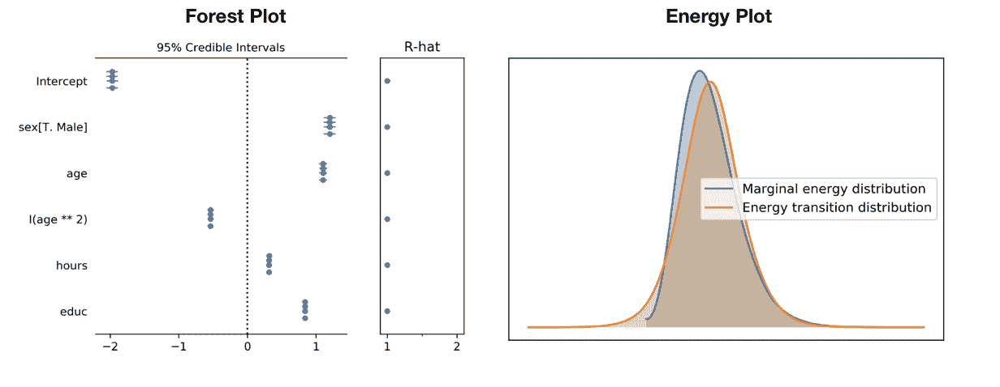
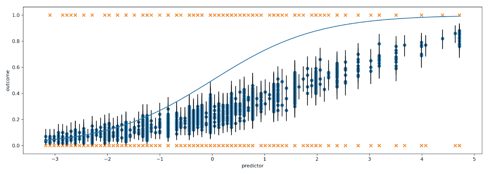
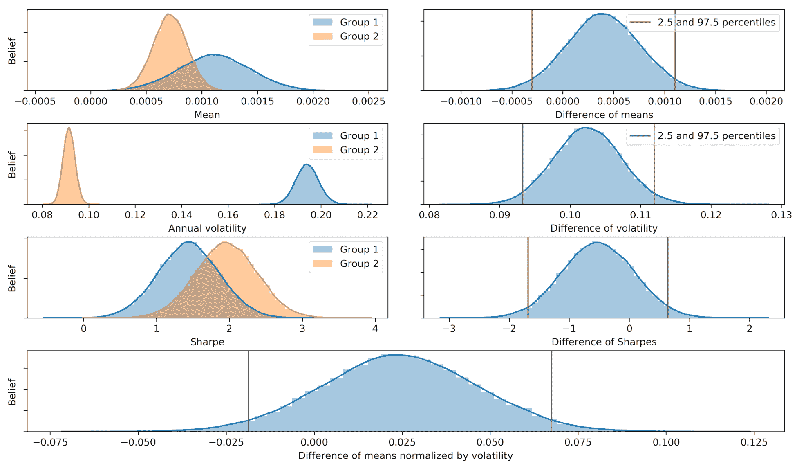

# 贝叶斯机器学习

在本章中，我们将介绍贝叶斯方法在机器学习中的应用，以及它们对开发和评估算法交易策略时的不同不确定性视角的增值。

贝叶斯统计学使我们能够量化对未来事件的不确定性，并以原则性的方式在新信息到来时优化我们的估计。这种动态方法很好地适应了金融市场的发展性质。当存在较少相关数据且我们需要系统地整合先验知识或假设时，它特别有用。

我们将看到，贝叶斯方法使得对统计指标、参数估计和预测周围的不确定性有更丰富的见解。应用范围从更精细的风险管理到动态更新的预测模型，其中包含了市场环境的变化。资产配置的黑-利特曼方法（见第五章，《策略评估》）可以解释为贝叶斯模型。它计算预期收益，作为市场均衡和投资者观点的加权平均值，每个资产的波动性，跨资产的相关性以及对每个预测的信心。

具体来说，在本章中，我们将涵盖以下主题：

+   贝叶斯统计如何应用于机器学习

+   如何使用 PyMC3 进行概率编程

+   如何定义和训练机器学习模型

+   如何运行最先进的抽样方法进行近似推断

+   如何应用贝叶斯机器学习来计算动态夏普比率，构建贝叶斯分类器和估计随机波动性

本章的参考文献、附加材料链接和代码示例位于 GitHub 存储库相应目录中。请按照第一章提供的安装说明进行操作，《交易的机器学习》。

# 贝叶斯机器学习的工作原理

经典统计学也被称为频率派，因为它将概率解释为长期内事件的相对频率，即在观察了大量试验之后。在概率的背景下，一个事件是一个实验的一个或多个基本结果的组合，比如两个骰子掷出六个相等的结果中的任何一个，或者某个资产价格在某一天下跌 10%或更多。

贝叶斯统计学相反，将概率视为事件发生的信心或信念的度量。贝叶斯概率的观点为主观观点留下了更多的空间，因此，与频率派解释相比，意见之间的差异更大。这种差异在很少发生的事件中最为显著，以至于无法得出客观的长期频率度量。

换句话说，频率学派统计假设数据是来自人群的随机样本，并旨在识别生成数据的固定参数。相反，贝叶斯统计将数据视为已知的，并认为参数是随机变量，其分布可以从数据中推断出来。因此，频率学派方法要求的数据点至少与要估计的参数一样多。另一方面，贝叶斯方法与较小的数据集兼容，并且非常适合逐个样本进行在线学习。

贝叶斯观点对于许多在某些重要方面罕见或独特的现实事件非常有用。例如，下次选举的结果或市场是否会在三个月内崩溃的问题。在每种情况下，既有相关的历史数据，又有随着事件临近而展开的独特情况。

首先，我们将介绍贝叶斯定理，该定理通过将先验假设与新的经验证据相结合，并将得到的参数估计与频率学派的对应估计进行比较，以晶化通过更新信念来更新概念的过程。然后，我们将演示两种贝叶斯统计推断的方法，这些方法能够揭示潜在参数的后验分布，即未观察到的参数，在不同情况下的预期值等：

1.  共轭先验通过提供闭合形式的解决方案来促进更新过程，但确切的分析方法并不总是可用。

1.  近似推断模拟了由假设和数据组合而成的分布，并使用该分布的样本来计算统计洞察。

# 如何从经验证据更新假设

牧师托马斯·贝叶斯在 250 多年前提出的定理利用基本的概率理论规定了概率或信念在相关新信息到达时应该如何变化。以下约翰·梅纳德·凯恩斯的引述体现了贝叶斯主义的思维方式：

“当事实发生变化时，我改变我的想法。先生，你会怎么做？”

它依赖于条件概率和全概率以及链式法则；有关这些概念的评论，请参阅 GitHub 上的参考资料。

信念涉及单个或一组参数 θ（也称为假设）。每个参数可以是离散的或连续的。θ 可以是一个一维统计量，比如（离散的）分类变量的模式，或者（连续的）均值，也可以是一个更高维度的值集，比如一个协方差矩阵或深度神经网络的权重。

频率学派统计的一个关键区别在于，贝叶斯假设被表达为概率分布，而不是参数值。因此，虽然频率学派的推断关注点估计，贝叶斯推断则产生概率分布。

贝叶斯定理通过计算从以下输入中得到的后验概率分布来更新对感兴趣参数的信念，如下图所示：

+   **先验**分布指示我们考虑每个可能的假设的可能性有多大。

+   **似然函数**输出在给定θ参数的某些值的情况下观察到数据集的概率。

+   **证据**度量观察到的数据在所有可能的假设下的可能性。因此，它对所有参数值都是相同的，用于将分子标准化：



贝叶斯定理

后验是先验和似然的乘积，除以证据，反映了假设的更新概率分布，同时考虑了先前的假设和数据。从不同的角度看，先验和似然的乘积来自于将数据和参数的联合分布因子分解的链规则的应用。

对于高维、连续变量，制定变得更加复杂，涉及到（多个）积分。一种替代的制定方法使用赔率来表示后验赔率，作为先验赔率乘以似然比的乘积（有关更多细节，请参见参考资料）。

# 精确推理：最大后验估计

将贝叶斯规则的实际应用于准确计算后验概率的情况非常有限，因为计算分母中的证据项非常具有挑战性。证据反映了在所有可能的参数值上观察到的数据的概率。它也被称为边际似然，因为它需要通过添加或积分参数的分布来对参数的分布进行*边际化*。这通常只在具有少量假设值的少量离散参数的简单情况下才可能。

**最大后验概率（MAP）**估计利用了证据是一个常数因子，将后验缩放以满足概率分布的要求。由于证据不依赖于θ，后验分布与似然和先验的乘积成比例。因此，MAP 估计选择使后验最大化的θ的值，考虑到观察到的数据和先验信念，即后验的模态。

MAP 方法与**最大似然估计**（**MLE**）不同，MLE 定义了概率分布。MLE 选择使观察到的训练数据的似然函数最大化的参数值θ。

从定义的角度看，MAP 与 MLE 的不同之处在于包括了先验分布。换句话说，除非先验是一个常数，否则 MAP 估计θ将与其 MLE 对应物不同：





最大似然估计解往往反映了频率主义的概率估计应该反映观察到的比例的概念。另一方面，先验对 MAP 估计的影响通常相当于将反映先验假设的数据添加到 MLE 中。例如，一个强烈的先验，即硬币有偏的先验可以通过添加偏斜的试验数据来融入 MLE 背景。

先验分布是贝叶斯模型的重要组成部分。我们现在将介绍一些方便的选择，以便进行分析推断。

# 如何选择先验

先验应反映参数分布的知识，因为它影响 MAP 估计。如果先验不确定，我们需要进行选择，通常从几个合理的选项中选择。一般来说，证明先验的合理性并通过测试替代是否得出相同结论是一个好的做法。

有几种类型的先验：

+   **客观**先验最大化数据对后验的影响。如果参数分布未知，我们可以选择一个无信息的先验，比如在参数值的相关范围内称为平坦先验的均匀分布。

+   相反，**主观**先验旨在将模型外部的信息纳入估计中。

+   **经验性**先验结合了贝叶斯和频率主义方法，利用历史数据消除主观性，例如通过估计各种时刻以适应标准分布。

在机器学习模型的背景下，先验可以被视为一种正则化器，因为它限制了后验可以假设的值。例如，具有零先验概率的参数不是后验分布的一部分。一般来说，更多的好数据可以得出更强的结论并减少先验的影响。

# 如何保持推断简单 - 共轭先验

当结果后验与先验具有相同类型的分布，只是参数不同时，先验分布与似然的共轭性。当先验和似然都是正态分布时，后验也是正态分布的。

先验和似然的共轭性暗示了后验的闭合形式解，从而便于更新过程并避免使用数值方法来近似后验。此外，由此产生的后验可以用作下一个更新步骤的先验。

让我们使用一个股价波动的二元分类示例来说明这个过程。

# 如何动态估计资产价格波动的概率

当数据由具有某种成功概率的二元伯努利随机变量组成时，重复试验中的成功次数遵循二项分布。共轭先验是支持区间[0, 1]上的 Beta 分布，并具有两个形状参数，用于对成功概率进行任意先验分布建模。因此，后验分布也是一个 Beta 分布，我们可以通过直接更新参数来得到。

我们将收集不同大小的二元化日度标准普尔 500 指数收益率样本，其中正面结果是价格上涨。从一个不含信息的先验开始，该先验将每个可能的成功概率在区间[0, 1]内分配相等的概率，我们计算不同证据样本的后验概率。

下面的代码示例显示了更新只是简单地将观察到的成功和失败数量添加到先验分布的参数中以获得后验分布：

```py
n_days = [0, 1, 3, 5, 10, 25, 50, 100, 500]
outcomes = sp500_binary.sample(n_days[-1])
p = np.linspace(0, 1, 100)

# uniform (uninformative) prior
a = b = 1
for i, days in enumerate(n_days):
    up = outcomes.iloc[:days].sum()
    down = days - up
    update = stats.beta.pdf(p, a + up , b + down)
```

以下图表中绘制了结果后验分布。它们说明了从将所有成功概率视为同等可能的均匀先验到越来越尖峰的分布的演变。

经过 500 个样本，概率集中在 2010 年至 2017 年间正面走势的实际概率约为 54.7%。它还显示了 MLE 和 MAP 估计之间的小差异，后者倾向于稍微朝向均匀先验的期望值，如下图所示：



后验概率

在实践中，共轭先验的使用仅限于低维情况。此外，简化的 MAP 方法避免了计算证据项，但即使在其可用时也具有几个缺点；它不返回分布，因此我们无法推导出不确定性的度量，或将其用作先验。因此，我们需要采用数值方法和随机模拟而不是精确推理，我们将在下文介绍。

# 近似推理：随机与确定性方法

对于大多数实际相关的模型，将无法通过分析方法推导出精确的后验分布并计算潜在参数的期望值。模型可能具有太多的参数，或者后验分布可能对于分析解而言过于复杂。对于连续变量，积分可能没有封闭形式的解，而空间的维数和被积函数的复杂性可能会阻止数值积分。对于离散变量，边缘化涉及对隐藏变量的所有可能配置求和，虽然原则上这总是可能的，但在实践中，我们经常发现可能存在指数多个隐藏状态，因此精确计算是非常昂贵的。

尽管对于某些应用而言，对未观察到的参数的后验分布可能是感兴趣的，但通常主要是要评估期望，例如，进行预测。在这种情况下，我们可以依赖近似推断：

+   基于**马尔可夫链蒙特卡罗（MCMC）**抽样的**随机**技术已经在许多领域推广了贝叶斯方法的使用。它们通常具有收敛到精确结果的能力。在实践中，抽样方法可能需要大量计算，并且通常仅限于小规模问题。

+   **确定性**方法，即变分推断或变分贝叶斯，基于对后验分布的解析近似，并且可以很好地扩展到大型应用程序。它们做出简化假设，例如，后验在特定方式上因子化，或者具有特定的参数形式，例如高斯分布。因此，它们不会生成精确结果，并且可以用作抽样方法的补充。

# 基于抽样的随机推断

抽样是关于从给定分布*p(x)*中抽取样本，*X=(x[1], ..., x[n])*。假设样本是独立的，大数定理确保对于增长的样本数量，给定实例*x[i]*在样本中的比例（对于离散情况）对应于其概率，*p(x=x[i])*。在连续情况下，类似的推理适用于样本空间的给定区域。因此，对样本的平均值可以用作分布参数的期望值的无偏估计。

实际挑战在于确保独立抽样，因为分布是未知的。相关样本可能仍然是无偏的，但倾向于增加估计的方差，因此将需要更多的样本来获得与独立样本一样精确的估计。

从多元分布中抽样在计算上是具有挑战性的，因为随着维数的增加，状态数量呈指数增长。许多算法简化了这个过程（请参阅参考文献以获取概述）。现在，我们将介绍几种基于 MCMC 的流行变体方法。

# 马尔可夫链蒙特卡罗抽样

马尔可夫链是描述随机漫步的动态随机模型，由转移概率连接的一组状态组成。马尔可夫性质规定该过程没有记忆，并且下一步仅取决于当前状态。换句话说，它在于当前状态的条件下，过去、现在和未来是独立的，即过去状态的信息不会帮助预测未来超出我们从现在所知道的内容。

蒙特卡罗方法依赖于重复的随机抽样来近似可能是确定性的结果，但不允许解析的精确解。它是在曼哈顿计划期间开发的，用于估计原子级别的能量，并获得了其持久的代号以确保保密性。

许多算法将蒙特卡洛方法应用于马尔可夫链，并通常按以下方式进行：

1.  从当前位置开始。

1.  从提议分布中抽取一个新的位置。

1.  在考虑数据和先验分布的情况下评估新位置的概率：

    1.  如果足够可能，移动到新的位置。

    1.  否则，保持当前位置不变。

1.  从步骤 1 开始重复。

1.  经过一定数量的迭代后，返回所有接受的位置。

MCMC 旨在识别和探索后验的有趣区域，这些区域集中在显著的概率密度上。当它持续移动到后验的附近高概率状态时，无记忆的过程被认为是收敛的，其中接受率增加。一个关键挑战是平衡对样本空间的随机探索的需要和降低接受率的风险。

此过程的初始步骤可能更反映出起始位置而不是后验，并且通常被丢弃为**burn-in**样本。 MCMC 的一个关键特性是在一定数量的迭代后，过程应该忘记其初始位置。

剩余的样本被称为过程的轨迹。假设收敛，则样本的相对频率近似于后验，可以根据大数定律计算期望值。

正如之前所指出的，估计的精度取决于随机游走收集的样本的串行相关性，每个样本设计上仅取决于前一个状态。更高的相关性限制了对后验的有效探索，并需要经过诊断测试。

设计这样的马尔可夫链的一般技术包括 Gibbs 采样、Metropolis-Hastings 算法和更近期的哈密顿 MCMC 方法，这些方法往往表现更好。

# Gibbs 采样

Gibbs 采样将多变量采样简化为一系列一维抽样。从一个起始点开始，它迭代地将 *n*-1 个变量保持不变，同时抽样第 *n* 个变量。它将这个样本合并并重复。

该算法非常简单易实现，但产生高度相关的样本，导致收敛速度减慢。其顺序性也阻止了并行化。

# Metropolis-Hastings 采样

Metropolis-Hastings 算法基于其当前状态随机提出新的位置，以有效地探索样本空间并相对于 Gibbs 采样减少样本的相关性。为了确保它从后验中采样，它使用先验和似然的乘积来评估提议，这与后验成比例。它根据结果接受的概率来接受，这与当前样本的相应值相关。

提议评估方法的一个关键优点是它使用比后验的确切评估更比例的评估。但是，它可能需要很长时间才能收敛，因为与后验无关的随机移动可能会降低接受率，以至于大量步骤仅产生少量（可能相关的）样本。接受率可以通过减小提议分布的方差来调整，但是由此产生的较小步骤意味着较少的探索。

# 哈密顿蒙特卡洛 – 走 NUTS

**哈密顿蒙特卡洛（HMC）**是一种混合方法，利用似然梯度的一阶导数信息来提出新的状态以进行探索，并克服了 MCMC 的一些挑战。此外，它还融合了动量以有效地在后验分布中跳跃。因此，与简单的随机游走 Metropolis 或 Gibbs 采样相比，它更快地收敛到高维目标分布。

无转弯采样器是自调节的 HMC 扩展，它自适应地调节在选择提议之前围绕后验的大小和数量。它在高维和复杂的后验分布上表现良好，并且允许拟合许多复杂的模型，而无需对拟合算法本身具有专门的知识。正如我们将在下一节中看到的，它是 PyMC3 中的默认采样器。

# 变分推断

**变分推断（VI）**是一种通过优化来近似概率密度的机器学习方法。在贝叶斯背景下，它近似后验分布如下：

1.  选择一个参数化的概率分布族

1.  找到该族中距目标最近的成员，以 Kullback-Leibler 散度为度量

与 MCMC 相比，变分贝叶斯往往收敛更快，并且更适用于大型数据。虽然 MCMC 通过链中的样本来近似后验，最终将收敛到任意接近目标，但变分算法通过优化结果来近似后验，这不能保证与目标重合。

变分推断更适合于大型数据集和快速探索多个模型。相比之下，当数据集较小或时间和计算资源的约束较少时，MCMC 将提供更准确的结果。

# 自动微分变分推断（ADVI）

变分推断的缺点是需要模型特定的导数和实现一个定制的优化例程，这减慢了广泛采用的速度。

最近的**自动微分变分推断（ADVI）**算法自动化了这个过程，用户只需指定模型，以程序形式表达，并且 ADVI 自动生成相应的变分算法（有关实现细节请参阅 GitHub 上的参考资料）。

我们将看到 PyMC3 支持各种变分推断技术，包括 ADVI。

# 使用 PyMC3 进行概率编程

概率编程提供了一种描述和拟合概率分布的语言，以便我们可以设计、编码和自动估计和评估复杂模型。它旨在抽象掉一些计算和分析复杂性，以使我们能够专注于贝叶斯推理和推断的概念上更为直观和简单的方面。

由于新语言的出现，该领域变得非常动态。Uber 开源了基于 PyTorch 的 Pyro，并且 Google 最近为 TensorFlow 添加了一个概率模块（请参阅 GitHub 上链接的资源）。

结果是，贝叶斯方法在机器学习中的实际相关性和使用可能会增加，以生成关于不确定性的洞见，特别是对于需要透明而不是黑盒模型的用例。

在本节中，我们将介绍流行的 PyMC3 库，该库使用 Python 实现了高级 MCMC 采样和变分推断，用于机器学习模型。与 Stan 一起，以 Monte Carlo 方法的发明者 Stanislaw Ulam 命名，并由哥伦比亚大学的 Andrew Gelman 自 2012 年以来开发，它是最受欢迎的概率编程语言之一。

# 使用 Theano 的贝叶斯机器学习

PyMC3 于 2017 年 1 月发布，以向 PyMC2（2012 年发布）中使用的 Metropolis-Hastings 采样器添加 Hamiltonian MC 方法。PyMC3 使用 Theano 作为其计算后端，用于动态 C 编译和自动微分。Theano 是一个以矩阵为重点且启用 GPU 的优化库，是由 Yoshua Bengio 的蒙特利尔机器学习算法研究所（MILA）开发的，并受到 TensorFlow 的启发。由于新的深度学习库的成功（有关详细信息，请参阅第十六章《深度学习》），MILA 最近停止进一步开发 Theano。PyMC4 计划于 2019 年使用 TensorFlow，对 API 的影响可能有限。

# PyMC3 工作流程

PyMC3 的目标是直观且可读，但功能强大的语法，反映了统计学家描述模型的方式。建模过程通常遵循以下五个步骤：

1.  通过定义以下内容来编码概率模型：

    1.  量化关于潜变量的知识和不确定性的先验分布

    1.  条件参数在观察数据上的似然函数

1.  使用上一节中描述的选项之一分析后验：

    1.  使用 MAP 推断获得一个点估计

    1.  使用 MCMC 方法从后验中采样

1.  使用变分贝叶斯近似后验。

1.  使用各种诊断工具检查您的模型。

1.  生成预测。

生成的模型可用于推断，以获取参数值的详细洞察，以及预测新数据点的结果。

我们将使用简单的 logistic 回归来说明这个工作流程（参见笔记本 bayesian_logistic_regression）。随后，我们将使用 PyMC3 来计算和比较贝叶斯夏普比率，估计动态配对交易比率，并实现贝叶斯线性时间序列模型。

# 模型定义 - 贝叶斯 logistic 回归

如第六章所讨论的，*机器学习工作流程*， logistic 回归估计一组特征与二进制结果之间的线性关系，通过 S 形函数进行调节，以确保模型产生概率。 频率方法导致参数的点估计，这些参数测量了每个特征对数据点属于正类的概率的影响，并且置信区间基于关于参数分布的假设。

相比之下，贝叶斯 logistic 回归估计参数本身的后验分布。 后验允许对每个参数的贝叶斯可信区间进行更健壮的估计，其优点在于更透明地了解模型的不确定性。

概率程序由观察到的和未观察到的随机变量（RVs）组成。正如我们所讨论的，我们通过似然分布定义观察到的 RVs，通过先验分布定义未观察到的 RVs。PyMC3 包含许多用于此目的的概率分布。

我们将使用一个简单的数据集，使用每年$50K 的收入门槛将 30,000 个个体分类。此数据集将包含关于年龄、性别、工作小时和教育年限的信息。因此，我们正在使用这些特征对一个人的收入是否超过$50K 的概率进行建模。

PyMC3 库使得对 logistic 回归执行近似贝叶斯推断非常简单。 logistic 回归模型根据以下图表左侧的方式对个体 *i* 基于 *k* 个特征的高收入的概率进行建模：



我们将使用上下文管理器 `with` 来定义一个 `manual_logistic_model`，以便稍后将其作为概率模型参考：

1.  未观察到的截距和两个特征的参数的随机变量使用假设的先验进行表达，该先验假设为正态分布，均值为 0，标准差为 100。

1.  似然函数根据 logistic 回归的规范将参数与数据结合起来。

1.  结果被建模为 Bernoulli 随机变量，其成功概率由似然函数给出：

```py
with pm.Model() as manual_logistic_model:
    # coefficients as rvs with uninformative priors
    intercept = pm.Normal('intercept', 0, sd=100)
    b1 = pm.Normal('beta_1', 0, sd=100)
    b2 = pm.Normal('beta_2', 0, sd=100)

    # Likelihood transforms rvs into probabilities p(y=1)
    # according to logistic regression model.    
    likelihood = pm.invlogit(intercept + b1 * data.hours + b2 * data.educ)

    # Outcome as Bernoulli rv with success probability 
    # given by sigmoid function conditioned on actual data 
    pm.Bernoulli(name='logit', p=likelihood, observed=data.income)
```

# 可视化和板符号

命令 `pm.model_to_graphviz(manual_logistic_model)` 生成在右侧图中显示的 plate 符号。它显示未观察到的参数为浅色，观察到的元素为深色圆圈。矩形表示由模型定义中包含的数据暗示的观察模型元素的重复次数。

# 广义线性模型模块

PyMC3 包含许多常见的模型，因此我们通常可以留下自定义应用程序的手动规范。以下代码使用受统计语言 R 启发的公式格式，并由 `patsy` 库移植到 Python，将相同的逻辑回归定义为 **广义线性模型** (**GLM**) 家族的成员：

```py
with pm.Model() as logistic_model:  
    pm.glm.GLM.from_formula('income ~ hours + educ', 
                            data, 
                            family=pm.glm.families.Binomial())
```

# MAP 推断

我们使用刚刚定义的模型的 `.find_MAP()` 方法为三个参数获得点 MAP 估计值：

```py
with logistic_model:
    map_estimate = pm.find_MAP()
print_map(map_estimate)
Intercept   -6.561862
hours        0.040681
educ         0.350390
```

PyMC3 使用拟牛顿 **Broyden-Fletcher-Goldfarb-Shanno (BFGS)** 算法解决了找到具有最高密度的后验点的优化问题，但提供了几种替代方案，这些替代方案由 sciPy 库提供。结果几乎与相应的 statsmodels 估计相同（有关更多信息，请参阅笔记本）。

# 近似推断 - MCMC

我们将使用稍微复杂的模型来说明马尔可夫链蒙特卡洛推断：

```py
formula = 'income ~ sex + age+ I(age ** 2) + hours + educ'
```

Patsy 的函数 `I()` 允许我们使用常规 Python 表达式动态创建新变量。在这里，我们将 `age` 平方以捕获更多经验在生活后期增加收入的非线性关系。

请注意，测量尺度非常不同的变量可能会减慢采样过程。因此，我们首先对 `age`、`hours` 和 `educ` 变量进行标准化，应用 sklearn 的 `scale()` 函数。

一旦我们用新公式定义了我们的模型，我们就可以执行推断以近似后验分布。通过 `pm.sample()` 函数可用 MCMC 采样算法。

默认情况下，PyMC3 自动选择最有效的采样器，并初始化采样过程以实现有效的收敛。对于连续模型，PyMC3 选择我们在前一节中讨论的 NUTS 采样器。它还通过 ADVI 运行变分推断，以找到采样器的良好起始参数。其中一个选择是使用 MAP 估计。

为了查看收敛情况，我们首先在调整了采样器 `1000` 次迭代后仅绘制 `100` 个样本。此后将丢弃这些样本。采样过程可以使用 `cores` 参数并行化多个链（除非使用 GPU）：

```py
with logistic_model:
    trace = pm.sample(draws=100, tune=1000,
                      init='adapt_diag', # alternative initialization
                      chains=4, cores=2,
                      random_seed=42)
```

结果跟踪包含每个随机变量的采样值。我们可以通过提供先前运行的跟踪作为输入来继续采样（有关更多信息，请参阅笔记本）。

# 置信区间

我们可以计算可信区间—贝叶斯的置信区间—作为跟踪的百分位数。结果的边界反映了对于给定概率阈值的参数值范围的信心，而不是参数将在大量试验中多少次在此范围内的数量。笔记本演示了计算和可视化。

# 近似推断 - 变分贝叶斯

变分推断的界面与 MCMC 实现非常相似。我们只需使用`fit()`函数而不是`sample()`函数，还可以选择包括一个早期停止的`CheckParametersConvergence`回调，如果分布拟合过程收敛到给定的容差：

```py
with logistic_model:
    callback = CheckParametersConvergence(diff='absolute')
    approx = pm.fit(n=100000, 
                    callbacks=[callback])
```

我们可以从近似分布中抽取样本，以获得类似于之前对 MCMC 采样器所做的跟踪对象：

```py
trace_advi = approx.sample(10000)
```

检查跟踪摘要显示结果略微不准确。

# 模型诊断

贝叶斯模型诊断包括验证采样过程是否收敛，并且始终从后验的高概率区域中采样，并确认模型是否很好地代表了数据。

# 收敛

我们可以随时间和它们的分布可视化样本，以检查结果的质量。下面的图表显示了初始 100 和额外的 100,000 个样本后的后验分布，并说明了收敛意味着多个链识别相同的分布。`pm.trace_plot()`函数也显示了样本的演变（更多信息请参见笔记本）：



后验分布

PyMC3 为采样器生成各种摘要统计信息。这些信息可以作为 stats 模块中的各个函数提供，或者通过将跟踪提供给`pm.summary()`函数获取：

|  | **statsmodels** | **均值** | **标准差** | **hpd_2.5** | **hpd_97.5** | **n_eff** | **Rhat** |
| --- | --- | --- | --- | --- | --- | --- | --- |
| 截距 | -1.97 | -1.97 | 0.04 | -2.04 | -1.89 | 69,492.17 | 1.00 |
| 性别[T.男性] | 1.20 | 1.20 | 0.04 | 1.12 | 1.28 | 72,374.10 | 1.00 |
| 年龄 | 1.10 | 1.10 | 0.03 | 1.05 | 1.15 | 68,446.73 | 1.00 |
| I(年龄 ** 2) | -0.54 | -0.54 | 0.02 | -0.58 | -0.50 | 66,539.66 | 1.00 |
| 小时 | 0.32 | 0.32 | 0.02 | 0.28 | 0.35 | 93,008.86 | 1.00 |
| 教育 | 0.84 | 0.84 | 0.02 | 0.80 | 0.87 | 98,125.26 | 1.00 |

前面的表格中在第一列包括了（分别计算的）statsmodels`logit`系数，以显示在这个简单案例中，两个模型是一致的，因为样本均值非常接近系数。

剩下的列包含了**最高后验密度**（**HPD**）的估计，用于最小宽度可信区间，这是置信区间的贝叶斯版本，在这里是以 95% 水平计算的。`n_eff`统计信息总结了 ~100K 绘制结果的有效（未拒绝）样本数量。

R-hat，也称为 Gelman-Rubin 统计量，通过比较链之间的方差与每个链内的方差来检查收敛性。如果采样器收敛，则这些方差应该相同，即链应该看起来相似。因此，统计量应该接近 1。`pm.forest_plot()` 函数还为多个链总结了此统计量（有关更多信息，请参见笔记本）。

对于具有许多变量的高维模型，检查大量轨迹变得繁琐。使用 NUTS 时，能量图有助于评估收敛问题。它总结了随机过程如何有效地探索后验分布。图表显示了能量和能量转移矩阵，它们应该是相匹配的，如下面的示例所示（有关概念细节，请参见参考资料）：



# 后验预测检查

**后验预测检查**（**PPCs**）非常有用，用于检查模型与数据的拟合程度。它们通过使用来自后验分布的参数生成模型数据来实现此目的。我们使用 `pm.sample_ppc` 函数进行此操作，并为每个观测值获取 *n* 个样本（GLM 模块自动将结果命名为 `'y'`）：

```py
ppc = pm.sample_ppc(trace_NUTS, samples=500, model=logistic_model)
ppc['y'].shape
(500, 29170)
```

我们可以使用 auc 分数来评估样本内拟合，例如，比较不同模型：

```py
roc_auc_score(y_score=np.mean(ppc['y'], axis=0), 
              y_true=data.income)
0.8294958565103577

```

# 预测

在运行后验预测检查之前，预测使用 Theano 的共享变量将训练数据替换为测试数据。为了方便可视化，我们创建一个带有单个预测器小时的变量，创建训练和测试数据集，并将前者转换为共享变量。请注意，我们需要使用 numPy 数组并提供列标签列表（有关详细信息，请参见笔记本）：

```py
X_shared = theano.shared(X_train.values
with pm.Model() as logistic_model_pred:
    pm.glm.GLM(x=X_shared, labels=labels,
               y=y_train, family=pm.glm.families.Binomial())
```

然后我们像之前一样运行采样器，并在用测试数据替换训练数据后对结果的迹线应用 `pm.sample_ppc` 函数：

```py
X_shared.set_value(X_test)
ppc = pm.sample_ppc(pred_trace, model=logistic_model_pred,
                    samples=100)
```

单特征模型的 AUC 分数为 0.65。以下图表显示了每个采样预测器值的实际结果和预测周围的不确定性：



我们现在将说明如何将贝叶斯分析应用于与交易相关的用例。

# 实际应用

贝叶斯机器学习方法在投资领域有许多应用。概率估计产生的透明度对风险管理和绩效评估自然非常有用。我们将说明如何计算和比较诸如夏普比率之类的指标。GitHub 仓库还包括下面引用的两个笔记本，展示了将贝叶斯 ML 用于建模线性时间序列和随机波动性的用法。

这些笔记本已经改编自 Quantopian 上创建的教程，Thomas Wiecki 领导数据科学，并且在推广贝叶斯方法的使用方面做出了重大贡献。参考资料还包括有关使用贝叶斯 ML 估计配对交易套期保值比率的教程。

# 贝叶斯夏普比率和表现比较

在本节中，我们将说明如何将夏普比率定义为概率模型，并比较不同收益序列的后验分布。对两组的贝叶斯估计提供了完整的可信值分布，包括效应大小、组均值及其差异、标准差及其差异以及数据的正态性。

主要用例包括分析替代策略之间的差异，或者分析策略的样本内收益与样本外收益之间的差异（详见`bayesian_sharpe_ratio`笔记本）。贝叶斯夏普比率也是 pyfolio 贝叶斯分析表的一部分。

# 模型定义

为了将夏普比率建模为概率模型，我们需要关于收益分布和控制此分布的参数的先验。学生 t 分布相对于低**自由度**（**df**）的正态分布具有较厚的尾部，是捕捉收益这一方面的合理选择。

因此，我们需要对这个分布的三个参数进行建模，即收益的均值和标准差，以及自由度。我们假设均值和标准差分别服从正态和均匀分布，并且自由度服从具有足够低期望值的指数分布，以确保有厚尾。收益基于这些概率输入，并且年化夏普比率是通过标准计算得出的，忽略了无风险利率（使用每日收益）：

```py
mean_prior = data.stock.mean()
std_prior = data.stock.std()
std_low = std_prior / 1000
std_high = std_prior * 1000

with pm.Model() as sharpe_model:
    mean = pm.Normal('mean', mu=mean_prior, sd=std_prior)
    std = pm.Uniform('std', lower=std_low, upper=std_high)
    nu = pm.Exponential('nu_minus_two', 1 / 29, testval=4) + 2.
    returns = pm.StudentT('returns', nu=nu, mu=mean, sd=std, observed=data.stock)

    sharpe = returns.distribution.mean / returns.distribution.variance ** .5 * np.sqrt(252)
    pm.Deterministic('sharpe', sharpe)
```

该笔记本包含有关对单个股票进行采样和评估夏普比率的详细信息。

# 表现比较

为了比较两个收益序列的表现，我们分别对每个组的夏普比率建模，并将效应大小计算为波动率调整后收益之间的差异。通过可视化轨迹，可以深入了解每个指标的分布情况，如下图所示：



用于配对交易的贝叶斯线性回归

在最后一章中，我们介绍了配对交易作为一种流行的算法交易策略，它依赖于两个或更多资产的协整性。给定这样的资产，我们需要估计对冲比率以决定多头和空头仓位的相对大小。基本方法使用线性回归。

`linear_regression`笔记本说明了贝叶斯线性回归如何跟踪两个资产之间随时间变化的关系。

# 贝叶斯时间序列模型

PyMC3 包括允许我们对参数不确定性进行类似洞察的 AR(p)模型，与先前的模型相同。`bayesian_time_series`笔记本说明了一个或多个滞后的时间序列模型。

# 随机波动模型

正如上一章所讨论的，资产价格具有时变波动性。在某些时期，回报变动很大，而在其他时期则非常稳定。随机波动模型使用潜在波动性变量来建模，该变量被建模为随机过程。无 U 转折采样器是使用这种模型引入的，并且`stochastic_volatility`笔记本展示了这种用法。

# 总结

在本章中，我们探讨了机器学习的贝叶斯方法。我们发现它们具有几个优点，包括能够编码先验知识或观点、更深入地了解模型估计和预测周围的不确定性，以及适用于在线学习，在这种情况下，每个训练样本逐渐影响模型的预测。

我们学会了从模型规范到估计、诊断和预测应用贝叶斯工作流程，使用 PyMC3 并探索了几个相关应用。我们将在第十四章中遇到更多贝叶斯模型，*主题建模*，以及在第十九章中介绍无监督深度学习，在那里我们将介绍变分自动编码器。

接下来的两章介绍基于树的、非线性的集成模型，即随机森林和梯度提升机。
