# 决策树和随机森林

在本章中，我们将学习两种新的机器学习模型类：决策树和随机森林。我们将看到决策树如何从数据中学习规则，这些规则编码了输入和输出变量之间的非线性关系。我们将说明如何训练决策树并用于回归和分类问题的预测，可视化和解释模型学习到的规则，并调整模型的超参数以优化偏差-方差的权衡并防止过拟合。决策树不仅是重要的独立模型，而且经常被用作其他模型的组成部分。

在本章的第二部分，我们将介绍集成模型，这些模型将多个个体模型组合起来，产生一个具有较低预测误差方差的单一聚合预测。我们将说明自助聚合，通常称为 bagging，作为随机化构建个体模型和减少集成组件预测误差相关性的几种方法之一。

提升是一个非常强大的替代方法，值得拥有自己的章节来讨论一系列最近的发展。我们将说明如何有效地降低方差，并学习如何配置、训练和调整随机森林。我们将看到随机森林作为大量决策树的集合，可以大幅减少预测误差，但会以一定的解释损失为代价。

简而言之，在本章中，我们将涵盖以下内容：

+   如何使用决策树进行回归和分类

+   如何从决策树中获得见解，并可视化从数据中学到的决策规则

+   为什么集成模型往往能够产生更优异的结果

+   自助聚合如何解决决策树的过拟合挑战

+   如何训练、调整和解释随机森林

# 决策树

决策树是一种机器学习算法，它根据从训练数据中学到的决策规则来预测目标变量的值。该算法可以通过改变控制树学习决策规则的目标函数来应用于回归和分类问题。

我们将讨论决策树如何使用规则进行预测，如何训练它们以预测（连续）收益以及（分类）价格走势的方向，以及如何有效地解释、可视化和调整它们。

# 树如何学习和应用决策规则

我们在第七章和第八章中学习的线性模型通过学习一组参数来预测结果，使用输入变量的线性组合，可能在 logistic 回归的情况下通过 S 形链函数进行转换。

决策树采取了不同的方法：它们学习并顺序地应用一组规则，将数据点分割为子集，然后为每个子集进行一次预测。预测基于应用给定规则序列后产生的训练样本子集的结果值。正如我们将在后面更详细地看到的那样，分类树根据相对类频率或直接的多数类值来预测概率，而回归模型根据可用数据点的结果值均值计算预测。

这些规则中的每一个都依赖于一个特定的特征，并使用阈值将样本分为两组，其值要么低于要么高于该特征的阈值。二叉树自然地表示模型的逻辑：根是所有样本的起点，节点表示决策规则的应用，数据沿着边移动，分割成更小的子集，直到到达一个叶节点，模型在这里做出预测。

对于线性模型，参数值允许解释输入变量对输出和模型预测的影响。相比之下，对于决策树，从根到叶子的路径显示了特征及其值如何通过模型导致特定决策的透明度。

以下图突出显示了模型学习规则的过程。在训练期间，算法扫描特征，并且对于每个特征，试图找到一个分割数据的截断，以最小化由分割产生的损失，加权每个子集中的样本数：

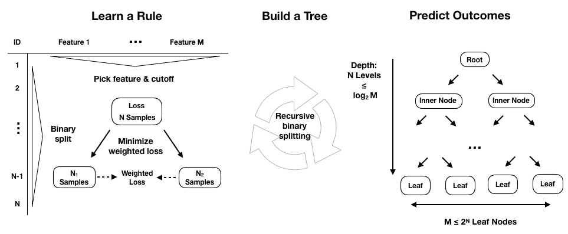

要在训练期间构建整个树，学习算法重复这个划分特征空间的过程，即可能值集合为*p*个输入变量*X[1], X[2], ..., X[p]*，划分为互斥且集合完备的区域，每个区域由一个叶节点表示。不幸的是，由于特征和阈值序列的可能组合数量爆炸性增长，算法将无法评估特征空间的每种可能分区。基于树的学习采用自顶向下、贪婪的递归二分拆分方法来克服这种计算限制。

这个过程是递归的，因为它使用了由先前分割产生的数据子集。它是自顶向下的，因为它从树的根节点开始，所有观察结果仍然属于单个区域，然后通过向预测器空间添加一个更多的分割来连续创建树的两个新分支。它是贪婪的，因为算法选择了基于对目标函数的直接影响的最佳规则，而不是展望未来并评估几步之后的损失。我们将在回归和分类树的更具体的上下文中返回到分割逻辑，因为这代表了主要的区别。

随着递归分割向树中添加新节点，训练样本的数量将继续减少。如果规则均匀地分割样本，导致完全平衡的树，每个节点在水平*n*处将有 2^(n )个节点，每个节点包含总观察数量的相应部分。在实践中，这是不太可能的，因此沿着某些分支的样本数量可能会迅速减少，并且树往往沿着不同路径增长到不同的深度。

为了对新观察结果进行预测，模型使用在训练期间推断出的规则来决定数据点应分配到哪个叶节点，然后使用对应特征空间区域的训练观察结果的均值（用于回归）或众数（用于分类）。特征空间中给定区域的训练样本数较少，即在给定叶节点中，会降低对预测的信心，并可能反映出过度拟合。

递归分割将继续，直到每个叶节点只包含单个样本，并且训练误差已降低到零。我们将介绍几个准则来限制分割并防止决策树产生极端过拟合的自然倾向。

# 如何在实践中使用决策树

在本节中，我们说明如何使用基于树的模型来获得洞察并进行预测。为了演示回归树，我们预测回报，对于分类情况，我们回到了正面和负面资产价格变动的示例。本节的代码示例在笔记本`decision_trees`中，除非另有说明。

# 如何准备数据

我们使用了在 Chapter *4* 中构建的数据集的简化版本，*Alpha Factor Research*。它包含了 Quandl 提供的 2010-2017 年期间的每日股票价格以及各种工程特征。具体详情可以在本章的 GitHub 存储库中的`data_prep`笔记本中找到。本章中的决策树模型不能处理缺失或分类变量，因此我们将在丢弃任何缺失值后对后者应用虚拟编码。

# 如何编写自定义交叉验证类

我们还构建了一个针对刚刚创建的数据格式的自定义交叉验证类，该数据具有两个级别的 pandas MultiIndex，一个用于股票代码，另一个用于数据：

```py
class OneStepTimeSeriesSplit:
    """Generates tuples of train_idx, test_idx pairs
    Assumes the index contains a level labeled 'date'"""

    def __init__(self, n_splits=3, test_period_length=1, shuffle=False):
        self.n_splits = n_splits
        self.test_period_length = test_period_length
        self.shuffle = shuffle
        self.test_end = n_splits * test_period_length

    @staticmethod
    def chunks(l, chunk_size):
        for i in range(0, len(l), chunk_size):
            yield l[i:i + chunk_size]

    def split(self, X, y=None, groups=None):
        unique_dates = (X.index
                        .get_level_values('date')
                        .unique()
                        .sort_values(ascending=False)[:self.test_end])

        dates = X.reset_index()[['date']]
        for test_date in self.chunks(unique_dates, self.test_period_length):
            train_idx = dates[dates.date < min(test_date)].index
            test_idx = dates[dates.date.isin(test_date)].index
            if self.shuffle:
                np.random.shuffle(list(train_idx))
            yield train_idx, test_idx
```

`OneStepTimeSeriesSplit` 确保了训练和验证集的分割，通过仅使用每只股票的数据直到*T-1*期进行训练，当使用*T*月份的数据进行验证时避免了前瞻性偏差。我们将只使用一步预测。

# 如何构建回归树

回归树基于分配给给定节点的训练样本的平均结果值进行预测，并且通常依赖于均方误差来在递归二分割过程中选择最佳规则。

给定一个训练集，该算法迭代遍历预测变量 *X[1], X[2], ..., X[p]* 和可能的切分点 *s[1], s[1], ..., s[N]*，以找到最佳组合。最佳规则将特征空间分成两个区域，*{X|X[i] < s[j]}* 和 *{X|X[i] > s[j]**}*，其中 *X[i]* 特征的值要么低于要么高于 *s[j]* 阈值，以便基于训练子集的预测最大化相对于当前节点的平方残差的减少。

让我们从一个简化的例子开始，以便于可视化，并仅使用两个月的滞后收益来预测以下月份，类似于上一章的 AR(2) 模型：

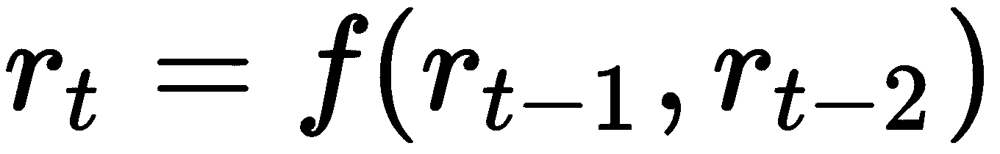

使用`sklearn`，配置和训练回归树非常简单：

```py
from sklearn.tree import DecisionTreeRegressor

# configure regression tree
regression_tree = DecisionTreeRegressor(criterion='mse', # default
                                        max_depth=4,     # up to 4 splits
                                        random_state=42)
# Create training data
y = data.returns
X = data.drop('returns', axis=1)
X2 = X.loc[:, ['t-1', 't-2']]

# fit model
regression_tree.fit(X=X2, y=y)

# fit OLS model
ols_model = sm.OLS(endog=y, exog=sm.add_constant(X2)).fit()
```

OLS 摘要和决策树的前两个层级的可视化揭示了模型之间的显著差异。OLS 模型提供了三个参数用于截距和两个特征，与该模型对 *f* 函数的线性假设一致。

相反，回归树图显示了前两个层级的每个节点的特征和阈值用于分割数据（请注意，特征可以重复使用），以及当前**均方误差**（**MSE**）的值、样本数量和基于这些训练样本的预测值：

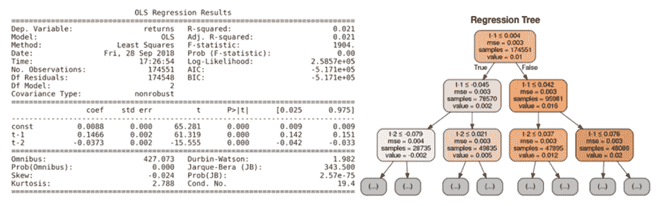

回归树图

该树图还突出显示了样本在节点之间的不均匀分布，只经过两次分裂后，样本数量在 28,000 到 49,000 之间变化。

为了进一步说明关于输入变量与输出之间功能形式关系的不同假设，我们可以将当前收益的预测可视化为特征空间的函数，即作为滞后收益值范围的函数。下图显示了线性回归和回归树的当前期收益作为一期和两期前收益的函数：

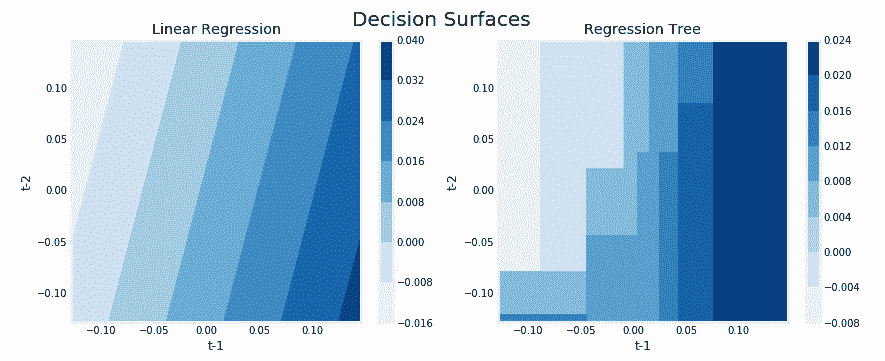

右侧的线性回归模型结果突显了滞后和当前收益之间的线性关系，而左侧的回归树图表说明了特征空间的递归划分中编码的非线性关系。

# 如何构建分类树

分类树的工作方式与回归版本相同，只是结果的分类性质需要不同的方法来进行预测和测量损失。虽然回归树使用相关训练样本的平均结果来预测分配给叶子节点的观测值的响应，但分类树则使用模式，即相关区域中训练样本中最常见的类别。分类树还可以基于相对类频率生成概率预测。

# 如何优化节点纯度

在构建分类树时，我们也使用递归二分分裂，但是，我们不是使用减少均方误差来评估决策规则的质量，而是可以使用分类错误率，它简单地是给定（叶子）节点中不属于最常见类别的训练样本的比例。

然而，更倾向于使用替代测量方法，如基尼指数或交叉熵，因为它们对节点纯度的敏感性更高，而不是分类错误率。节点纯度是指节点中单一类别的主导程度。一个只包含属于单一类别结果的样本的节点是纯净的，并且暗示着该特征空间区域的成功分类。对于一个分类结果取*K*个值，*0,1,…,K-1*，对于表示特征空间区域的给定节点*m*，其中*p[mk]*是节点*m*中第*k*类结果的比例，它们的计算如下：

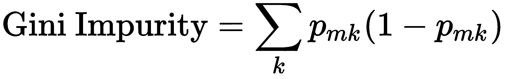

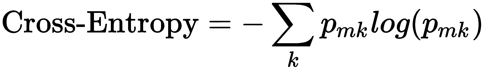

当类别比例接近零或一时，基尼不纯度和交叉熵测量值较小，也就是说，当子节点由于分裂而变得纯净时，它们的值最高，并且在二分类情况下，当类别比例均匀或为 0.5 时，它们的值最高。本节末尾的图表显示了这两个测量值和误分类错误率在比例区间 [0, 1] 内的取值情况。

# 如何训练分类树

我们现在将使用 80% 的样本进行训练，以预测剩余的 20%，训练、可视化和评估一个具有连续 5 次分割的分类树。我们在这里采取了一种简化说明的快捷方式，并使用内置的 `train_test_split`，它不会防止前瞻性偏差，作为我们的自定义迭代器。树的配置意味着最多有 2⁵=32 个叶节点，平均情况下在平衡的情况下，将包含超过 4,300 个训练样本。看一下以下代码：

```py
# randomize train-test split
X_train, X_test, y_train, y_test = train_test_split(X, y_binary, test_size=0.2, random_state=42)

# configure & train tree learner
classifier = DecisionTreeClassifier(criterion='gini',
                                    max_depth=5,
                                    random_state=42)
classifier.fit(X=X_train, y=y_train)

# Output:
DecisionTreeClassifier(class_weight=None, criterion='gini', max_depth=5,
            max_features=None, max_leaf_nodes=None,
            min_impurity_decrease=0.0, min_impurity_split=None,
            min_samples_leaf=1, min_samples_split=2,
            min_weight_fraction_leaf=0.0, presort=False, random_state=42,
            splitter='best')
```

在训练模型后，输出显示了我们将在下一节讨论参数调整时更详细讨论的所有 `DecisionTreeClassifier` 参数。

# 如何可视化决策树

您可以使用 `graphviz` 库来可视化树（请参阅 GitHub 获取安装说明），因为 `sklearn` 可以输出描述树的 `.dot` 语言，该语言由该库使用。您可以配置输出以包括特征和类别标签，并限制级别数量以使图表可读，如下所示：

```py
dot_data = export_graphviz(classifier,
                           out_file=None, # opt. save to file and convert to png
                           feature_names=X.columns,
                           class_names=['Down', 'Up'],
                           max_depth=3,
                           filled=True,
                           rounded=True,
                           special_characters=True)

graphviz.Source(dot_data)
```

结果显示，模型使用了各种不同的特征，并指示了连续和分类（虚拟）变量的分割规则。图表显示，在标签值下，每个类别的样本数量，以及在标签类别下，最常见的类别（在样本期间，上升的月份更多）：

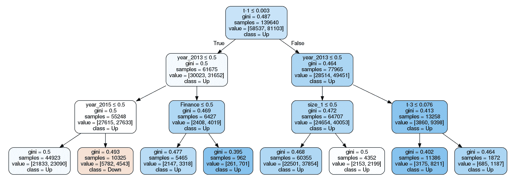

# 如何评估决策树预测结果

为了评估我们的第一个分类树的预测准确性，我们将使用测试集生成预测的类别概率，如下所示：

```py
y_score = classifier.predict_proba(X=X_test)[:, 1] # only keep probabilities for pos. class
```

`.predict_proba()` 方法为每个类别生成一个概率。在二分类中，这些概率是互补的，并且总和为 1，因此我们只需要正类的值。为了评估泛化误差，我们将使用基于我们在第六章介绍的接收器操作特性的曲线下面积。结果表明，与基线值 0.5（随机预测）相比，存在显著的改进：

```py
roc_auc_score(y_score=y_score, y_true=y_test)
0.5941
```

# 特征重要性

决策树不仅可以被可视化以检查给定特征的决策路径，还可以提供每个特征对拟合到训练数据的模型的贡献的摘要度量。

特征重要性捕获了特征产生的分裂有助于优化模型用于评估分裂质量的度量标准，我们的情况下是基尼不纯度指数。特征的重要性计算为该度量的（归一化）总减少量，并考虑到受分裂影响的样本数量。因此，在树的较早节点使用的特征，其中节点倾向于包含更多样本，通常被认为具有更高的重要性。

下图显示了前 15 个特征的重要性：

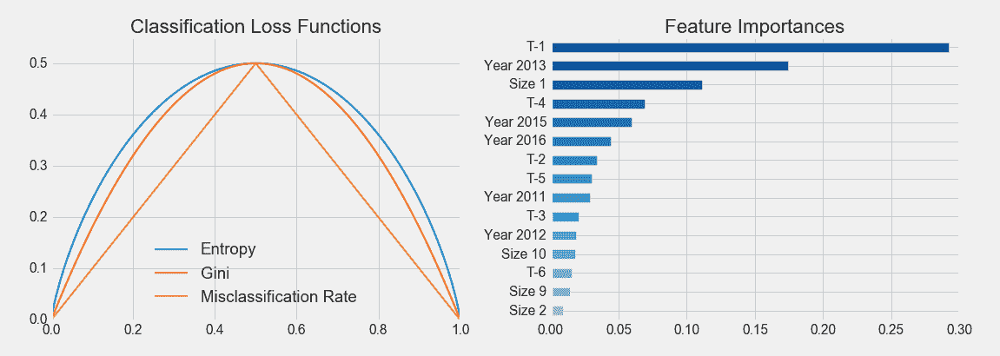

# 过拟合和正则化

决策树有过拟合的倾向，特别是当数据集相对于样本数量具有大量特征时。正如前几章所讨论的，过拟合会增加预测误差，因为模型不仅学习了训练数据中包含的信号，还学习了噪声。

有几种方法可以解决过拟合的风险：

+   **降维**（第十二章，*无监督学习*）通过用更少、更具信息性和更少噪声的特征代表现有特征来改善特征与样本的比例。

+   **集成模型**，例如随机森林，结合了多个树，同时在树构建过程中进行随机化，这将在本章的第二部分中介绍。

+   决策树提供了几个**正则化**超参数来限制树的增长和相关的复杂性。每个分裂增加节点数，但也减少了每个节点可用于支持预测的样本数量。对于每个额外级别，需要两倍的样本来填充具有相同样本密度的新节点。

+   **树修剪**是减少树复杂性的附加工具，通过消除添加了很少价值但增加了模型方差的节点或整个树的部分来实现。例如，成本复杂度剪枝从一个大树开始，通过用叶子替换节点来递归地减小其大小，基本上是将树构建过程反向运行。各个步骤产生的树序列然后可以使用交叉验证进行比较，以选择理想大小。

# 如何正则化决策树

以下表格列出了 sklearn 决策树实现中可用于此目的的关键参数。在介绍了最重要的参数之后，我们将说明如何使用交叉验证来优化超参数设置，以达到偏差-方差的折衷和降低预测误差：

<tdDefault

| **参数** | **选项** | **描述** |
| --- | --- | --- |
| `**max_depth**` | None | int | 最大级别数：分割节点直到达到`max_depth`或所有叶子都是纯的或包含少于`min_samples_split`个样本为止。 |

| `**max_features**` | None | None：所有特征；int float：分数

auto, sqrt: sqrt(n_features)

log2: log2(n_features) | 用于分割的特征数量。 |

| `**max_leaf_nodes**` | None | None：叶节点数量无限制 int | 分割节点直到创建这么多个叶子。 |
| --- | --- | --- | --- |
| `**min_impurity_decrease**` | 0 | float | 如果不纯度减少至少这个值，则分割节点。 |
| `**min_samples_leaf**` | 1 | int;float (as a percentage of N) | 必须在叶节点处的最小样本数。仅当每个左右分支中至少有 `min_samples_leaf` 训练样本时才考虑分割。对于回归问题，可能会平滑模型。 |
| `**min_samples_split**` | 2 | int; float (percent of N) | 分割内部节点所需的最小样本数： |
| `**min_weight_fraction_leaf**` | 0 |   | 叶节点所需的所有样本权重总和的最小加权分数。除非在 fit 方法中提供了 `sample_weight`，否则样本权重相等。 |

`max_depth` 参数对连续分割数量施加硬性限制，并且代表了限制树生长的最直接方法。

`min_samples_split` 和 `min_samples_leaf` 参数是限制树生长的替代、数据驱动的方法。与对连续分割数量施加硬性限制不同，这些参数控制进一步分割数据所需的最小样本数。后者保证每个叶子节点有一定数量的样本，而前者在分割导致分布非常不均匀时可能会创建非常小的叶子。小的参数值有助于过度拟合，而高的值可能会阻止树学习数据中的信号。默认值通常相当低，您应该使用交叉验证来探索一系列潜在值。您还可以使用浮点数表示百分比，而不是绝对数值。

sklearn 文档包含有关如何在不同情况下使用各种参数的额外细节；请参阅 GitHub 引用。

# 决策树剪枝

递归二分法在训练集上可能会产生良好的预测，但往往会过度拟合数据并产生较差的泛化性能，因为它导致了过于复杂的树，表现为大量的叶节点或特征空间的分割。较少的分割和叶节点意味着总体上更小的树，通常也会导致更好的预测性能以及可解释性。

限制叶节点数量的一种方法是避免进一步分割，除非它们对目标度量的改进显著。然而，这种策略的缺点是，有时产生微小改进的分割会在样本的组成不断变化时为后续更有价值的分割创造条件。

相比之下，树剪枝首先通过生长一个非常大的树，然后移除或修剪节点以将大树减少到一个不太复杂且过度拟合的子树。成本复杂度剪枝通过对添加叶节点到树模型的惩罚和调节影响惩罚的正则化参数（类似于套索和岭线性回归模型）生成一系列子树。应用于大树，增加的惩罚将自动产生一系列子树。通过正则化参数的交叉验证可以用来识别最优的修剪子树。

这种方法在 sklearn 中尚不可用；有关进一步详细信息和手动实现剪枝的方法，请参见 GitHub 上的参考资料。

# 如何调整超参数

决策树提供了一系列超参数来控制和调整训练结果。交叉验证是获取泛化误差无偏估计的最重要工具，这反过来又允许在各种配置选项之间做出知情选择。sklearn 提供了几个工具来简化交叉验证众多参数设置的过程，即我们将在下一节中介绍的`GridSearchCV`便利类。学习曲线还允许进行诊断，评估收集额外数据以减少泛化误差的潜在益处。

# 决策树的网格搜索 CV

`sklearn`提供了一种方法来定义多个超参数的值范围。它自动化了交叉验证这些参数值的各种组合以确定最佳配置的过程。让我们走一遍自动调整模型的过程。

第一步是实例化一个模型对象，并定义一个字典，其中关键词命名超参数，值列出要测试的参数设置：

```py
clf = DecisionTreeClassifier(random_state=42)
param_grid = {'max_depth': range(10, 20),
              'min_samples_leaf': [250, 500, 750],
              'max_features': ['sqrt', 'auto']
              }
```

然后，实例化`GridSearchCV`对象，提供评估器对象和参数网格，以及评分方法和交叉验证选择给初始化方法。我们将使用我们自定义的`OneStepTimeSeriesSplit`类的对象，初始化为使用十个折叠的`cv`参数，并将评分设置为`roc_auc`度量。我们可以使用`n_jobs`参数并行搜索，并通过设置`refit=True`自动获得使用最佳超参数的训练模型。

所有设置就绪后，我们可以像任何其他模型一样拟合`GridSearchCV`：

```py
gridsearch_clf = GridSearchCV(estimator=clf,
                          param_grid=param_grid,
                          scoring='roc_auc',
                          n_jobs=-1,
                          cv=cv,  # custom OneStepTimeSeriesSplit
                          refit=True,
                          return_train_score=True)

gridsearch_clf.fit(X=X, y=y_binary)
```

训练过程为我们的`GridSearchCV`对象生成一些新属性，最重要的是关于最佳设置和最佳交叉验证分数的信息（现在使用正确的设置以避免前瞻性偏差）。

将`max_depth`设置为`13`，`min_samples_leaf`设置为`500`，并且在决定分裂时仅随机选择与总特征数的平方根相对应的数量，可以产生最佳结果，AUC 为`0.5855`：

```py
gridsearch_clf.best_params_
{'max_depth': 13, 'max_features': 'sqrt', 'min_samples_leaf': 500}

gridsearch_clf.best_score_
0.5855
```

自动化非常方便，但我们也想检查性能如何随不同参数值的变化而变化。完成此过程后，`GridSearchCV`对象会提供详细的交叉验证结果，以获得更多见解。

# 如何检查树结构

笔记本还说明了如何手动运行交叉验证以获得自定义树属性，例如与某些超参数设置相关联的总节点数或叶节点数。以下函数访问内部的`.tree_`属性，以检索有关总节点数以及其中多少节点是叶节点的信息：

```py
def get_leaves_count(tree):
    t = tree.tree_
    n = t.node_count
    leaves = len([i for i in range(t.node_count) if t.children_left[i]== -1])
    return leaves
```

我们可以将这些信息与训练和测试分数结合起来，以获得有关模型在整个交叉验证过程中行为的详细知识，如下所示：

```py
train_scores, val_scores, leaves = {}, {}, {}
for max_depth in range(1, 26):
    print(max_depth, end=' ', flush=True)
    clf = DecisionTreeClassifier(criterion='gini', 
                                 max_depth=max_depth,
                                 min_samples_leaf=500,
                                 max_features='auto',
                                 random_state=42)
    train_scores[max_depth], val_scores[max_depth], leaves[max_depth] = [], [], []
    for train_idx, test_idx in cv.split(X):
        X_train, y_train,  = X.iloc[train_idx], y_binary.iloc[train_idx]
        X_test, y_test = X.iloc[test_idx], y_binary.iloc[test_idx]
        clf.fit(X=X_train, y=y_train)

        train_pred = clf.predict_proba(X=X_train)[:, 1]
        train_score = roc_auc_score(y_score=train_pred, y_true=y_train)
        train_scores[max_depth].append(train_score)

        test_pred = clf.predict_proba(X=X_test)[:, 1]
        val_score = roc_auc_score(y_score=test_pred, y_true=y_test)
        val_scores[max_depth].append(val_score)    
        leaves[max_depth].append(get_leaves_count(clf))
```

结果显示在以下图表的左侧面板上。它突出显示了在`max_depth`设置范围内的样本内外性能，以及围绕误差指标的置信区间。它还显示了在 13 次连续分割中最佳表现的设置，如垂直黑线所示。

# 学习曲线

学习曲线是一种有用的工具，显示验证和训练分数随训练样本数量的变化而演变。

学习曲线的目的是找出模型是否以及在多大程度上会因为在训练过程中使用更多数据而受益。它还有助于诊断模型的泛化误差更可能是由偏差还是方差驱动。

例如，如果验证分数和训练分数都趋于类似低的值，尽管训练集大小增加，但错误更可能是由于偏差，而额外的训练数据不太可能有所帮助。

请看以下可视化结果：

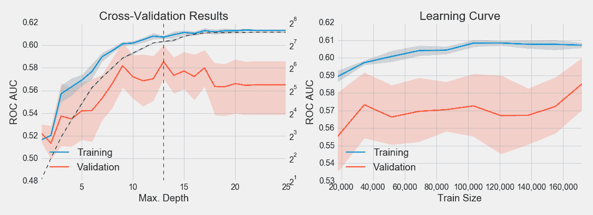

# 决策树的优势和劣势

当与迄今为止我们所探索的线性模型相比，回归和分类树在预测时采用非常不同的方法。您如何确定哪个模型更适合手头的问题？请考虑以下内容：

+   如果结果和特征之间的关系大致是线性的（或者可以相应地进行转换），那么线性回归可能会优于更复杂的方法，例如不利用这种线性结构的决策树。

+   如果关系呈现高度非线性和更复杂，决策树可能会优于经典模型。

决策树具有几个优点，使其非常受欢迎：

+   它们相当容易理解和解释，部分因为它们可以很容易地可视化，因此更容易让非技术人员理解。决策树也被称为白盒模型，因为它们在如何得出预测方面具有很高的透明度。黑盒模型，如集成和神经网络，可能会提供更好的预测精度，但是决策逻辑往往更难理解和解释。

+   与对数据做出更强假设或对数据更敏感的模型（如正则化回归）相比，决策树需要更少的数据准备。

+   一些决策树实现处理分类输入，不需要创建虚拟变量（提高内存效率），并且可以处理缺失值，就像我们将在第十一章中看到的*梯度提升机*，但这并不适用于 sklearn。

+   预测速度快，因为它与叶子节点的数量呈对数关系（除非树变得极不平衡）。

+   可以使用统计测试验证模型并考虑其可靠性（请参阅 GitHub 参考资料）。

决策树也有一些关键的缺点：

+   决策树内置了对训练集的过度拟合倾向，并产生高泛化误差。解决这个弱点的关键步骤包括修剪（尚未由 sklearn 支持），以及使用前一节中概述的各种早停准则进行正则化。

+   与决策树相关的是其高方差，这是由于它们能够紧密地适应训练集，因此数据的微小变化可能会导致决策树结构和因此模型生成的预测产生很大波动。解决决策树高方差的关键机制是使用具有低偏差且产生不相关预测误差的随机决策树集成。

+   决策树学习的贪婪方法基于局部标准进行优化，即减少当前节点的预测误差，并且不能保证全局最优结果。再次，由随机树组成的集成有助于减轻这个问题。

+   决策树对不平衡的类权重也很敏感，并可能产生偏倚的树。一种选择是对不平衡的类进行过采样或对更频繁的类进行欠采样。通常最好使用类权重并直接调整目标函数。

# 随机森林

决策树不仅因其透明度和可解释性而有用，而且是更强大的集成模型的基本构建模块，它将许多个体树与策略结合起来，以随机变化其设计，以解决前一节讨论的过拟合和高方差问题。

# 集成模型

集成学习涉及将多个机器学习模型组合成一个新模型，旨在比任何单个模型做出更好的预测。更具体地说，一个集成将使用一个或多个给定的学习算法训练的多个基础估计器的预测整合起来，以减少这些模型可能单独产生的泛化错误。

要使集成学习实现这个目标，个体模型必须是：

+   **准确性：**它们胜过一个天真的基准（例如样本均值或类比例）

+   **独立：**它们的预测是通过不同方式生成的，以产生不同的错误

集成方法是最成功的机器学习算法之一，特别适用于标准的数值数据。大型集成在机器学习竞赛中非常成功，可能由许多不同的个体模型组成，这些模型通过手工或使用另一个机器学习算法组合在一起。

将不同模型的预测结合起来有几个缺点。这些包括降低的可解释性，以及训练、预测和模型维护的更高复杂性和成本。因此，在实践中（除了竞赛之外），从大规模集成中获得的小幅准确性增益可能不值得增加的成本。

根据它们如何优化组成模型并将结果整合为单个集成预测，通常可以区分两组集成方法：

+   **平均方法**独立训练几个基础估计器，然后对它们的预测进行平均。如果基础模型没有偏差并且产生的不高度相关的不同预测错误，那么组合预测可能具有更低的方差，并且可能更可靠。这类似于从具有不相关回报的资产构建投资组合，以减少波动性而不牺牲回报。

+   **提升方法**相反，是按顺序训练基础估计器，其特定目标是减少组合估计器的偏差。其动机是将几个弱模型组合成一个强大的集合。

在本章剩余部分，我们将专注于自动平均方法，并在第十一章中讨论*梯度提升机*的提升方法。

# 如何降低模型方差

我们发现决策树可能会由于方差较高而做出不良预测，这意味着树结构对训练样本的组成非常敏感。我们还看到低方差的模型，例如线性回归，尽管给定特征数量足够的样本不同，但产生的估计相似。

对于给定的一组独立观察结果，每个都具有*σ²*的方差，样本均值的标准误差由*σ/n*给出。 换句话说，对更多的观察结果进行平均会减少方差。 因此，减少模型方差和其泛化误差的自然方法将是从总体中收集许多训练集，对每个数据集训练不同的模型，并对产生的预测进行平均。

在实践中，我们通常没有许多不同的训练集的奢侈条件。 这就是装袋，即自助聚合的缩写，发挥作用的地方。 装袋是减少机器学习模型方差的通用方法，特别是在应用于决策树时，特别有用和流行。

袋装是指对自助采样进行聚合，自助采样是带替换的随机样本。 这样的随机样本与原始数据集具有相同数量的观察结果，但可能由于替换而包含重复项。

装袋提高了预测准确性，但降低了模型的可解释性，因为不再可能可视化树来理解每个特征的重要性。 作为一种集成算法，装袋方法对这些自助采样训练给定数量的基本估计器，然后将它们的预测聚合成最终的集合预测。

装袋通过随机化基本估计器的方法，例如，每棵树的生长方式，然后对预测进行平均，从而减少它们的泛化误差，从而降低了基本估计器的方差。 它通常是改进给定模型的直接方法，而无需更改底层算法。 它在具有低偏差和高方差的复杂模型中效果最好，例如深度决策树，因为它的目标是限制过拟合。 相比之下，提升方法最适合弱模型，例如浅决策树。

有几种装袋方法，它们的不同之处在于它们对训练集应用的随机抽样过程：

+   粘贴从训练数据中抽取随机样本而不进行替换，而装袋则进行替换

+   随机子空间无需替换地从特征（即列）中随机抽样

+   随机补丁通过随机抽样观察和特征来训练基本估计器

# 袋装决策树

要将装袋应用于决策树，我们从训练数据中创建自助样本，通过反复采样来训练一个决策树，然后在这些样本中的每一个上创建一个决策树，通过对不同树的预测进行平均来创建一个集合预测。

袋装决策树通常生长较大，即具有许多层和叶子节点，并且不进行修剪，以使每棵树具有低偏差但高方差。 然后，平均它们的预测的效果旨在减少它们的方差。 研究表明，通过构建组合了数百甚至数千棵树的集合的装袋，可以显着提高预测性能。

为了说明装袋对回归树方差的影响，我们可以使用`sklearn`提供的`BaggingRegressor`元估计器。它基于指定抽样策略的参数来训练用户定义的基估计器：

+   `max_samples`和`max_features`控制从行和列中抽取的子集的大小，分别

+   `bootstrap`和`bootstrap_features`确定每个样本是有放回还是无放回抽样

以下示例使用指数函数生成单个`DecisionTreeRegressor`和包含十棵树的`BaggingRegressor`集成的训练样本，每棵树都生长十层深。这两个模型都是在随机样本上训练的，并为添加了噪声的实际函数预测结果。

由于我们知道真实函数，我们可以将均方误差分解为偏差、方差和噪声，并根据以下分解比较两个模型的这些分量的相对大小：

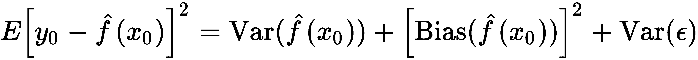

对于分别包含 250 和 500 个观测值的 100 个重复随机训练和测试样本，我们发现单个决策树的预测方差几乎是基于自举样本的`10`个装袋树的预测方差的两倍：

```py
noise = .5  # noise relative to std(y)
noise = y.std() * noise_to_signal

X_test = choice(x, size=test_size, replace=False)

max_depth = 10
n_estimators=10

tree = DecisionTreeRegressor(max_depth=max_depth)
bagged_tree = BaggingRegressor(base_estimator=tree, n_estimators=n_estimators)
learners = {'Decision Tree': tree, 'Bagging Regressor': bagged_tree}

predictions = {k: pd.DataFrame() for k, v in learners.items()}
for i in range(reps):
    X_train = choice(x, train_size)
    y_train = f(X_train) + normal(scale=noise, size=train_size)
    for label, learner in learners.items():
        learner.fit(X=X_train.reshape(-1, 1), y=y_train)
        preds = pd.DataFrame({i: learner.predict(X_test.reshape(-1, 1))}, index=X_test)
        predictions[label] = pd.concat([predictions[label], preds], axis=1)
```

对于每个模型，以下图表显示了上半部分的平均预测值和平均值周围两个标准差的带状区域，以及下半部分基于真实函数值的偏差-方差-噪声分解：

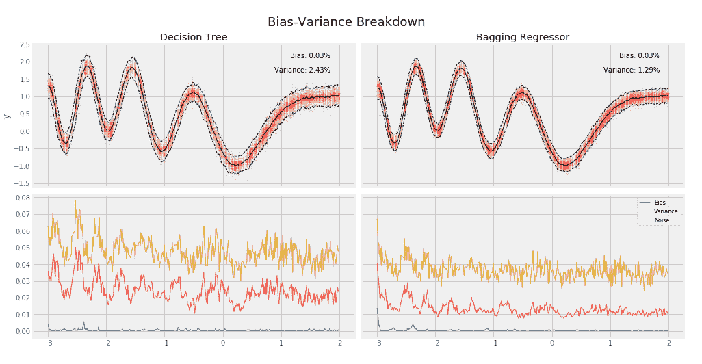

查看笔记本`random_forest`以获取实现细节。

# 如何构建随机森林

随机森林算法通过对由装袋生成的自举样本引入的随机化进行扩展，进一步减少方差并提高预测性能。

除了对每个集成成员使用自举训练数据外，随机森林还会对模型中使用的特征进行随机抽样（不重复）。根据实现方式，随机样本可以针对每棵树或每次分裂进行抽取。因此，算法在学习新规则时面临不同选择，无论是在树的级别上还是每次分裂时。

特征样本的大小对回归和分类树有所不同：

+   对于**分类**，样本量通常是特征数量的平方根。

+   对于**回归**，可以选择从三分之一到所有特征，并应基于交叉验证进行选择。

以下图示说明了随机森林如何随机化单个树的训练，然后将它们的预测聚合成一个集成预测：

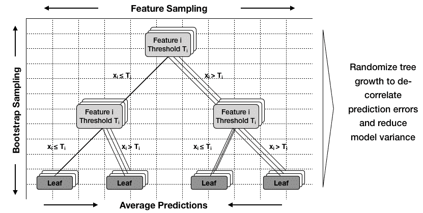

除了训练观察值之外，随机化特征的目标是进一步去相关化个体树的预测误差。并非所有特征都是平等的，少量高度相关的特征将在树构建过程中更频繁和更早地被选择，使得决策树在整个集合中更相似。然而，个体树的泛化误差越不相关，整体方差就会减少。

# 如何训练和调整随机森林

关键的配置参数包括在*如何调整超参数*部分介绍的各个决策树的各种超参数。以下表格列出了两个`RandomForest`类的附加选项：

| **关键字** | **默认** | **描述** |
| --- | --- | --- |
| `bootstrap` | `True` | 训练期间使用自举样本。 |
| `n_estimators` | `10` | 森林中的树的数量。 |
| `oob_score` | `False` | 使用包外样本来估计在未见数据上的 R²。 |

`bootstrap`参数激活了前面提到的装袋算法大纲，这反过来又启用了包外分数(`oob_score`)的计算，该分数使用未包含在用于训练给定树的自举样本中的样本来估计泛化准确度（有关详细信息，请参见下一节）。

`n_estimators`参数定义了要作为森林一部分生长的树的数量。更大的森林表现更好，但构建时间也更长。重要的是监视交叉验证错误作为基本学习者数量的函数，以确定预测误差的边际减少何时下降，以及额外训练的成本开始超过收益。

`max_features`参数控制在学习新的决策规则并分裂节点时可用的随机选择特征子集的大小。较低的值会降低树的相关性，从而降低集成的方差，但可能会增加偏差。对于回归问题，良好的起始值是`n_features`（训练特征的数量），对于分类问题是`sqrt(n_features)`，但取决于特征之间的关系，并且应该使用交叉验证进行优化。

随机森林设计为包含深度完全生长的树，可以使用`max_depth=None`和`min_samples_split=2`来创建。然而，这些值未必是最优的，特别是对于具有许多样本和因此可能非常深的树的高维数据，这可能会导致非常计算密集和内存密集的情况。

`sklearn` 提供的 `RandomForest` 类支持并行训练和预测，通过将 `n_jobs` 参数设置为要在不同核心上运行的 `k` 个作业数来实现。值 `-1` 使用所有可用核心。进程间通信的开销可能限制速度提升的线性，因此 *k* 个作业可能需要超过单个作业的 *1/k* 时间。尽管如此，在数据庞大且分割评估变得昂贵时，对于大型森林或深度个体树，速度提升通常相当显著，并且可能需要训练相当长时间。

如常，应使用交叉验证来确定最佳参数配置。以下步骤说明了该过程：

1.  我们将使用 `GridSearchCV` 来识别一组最佳参数，以用于分类树的集成：

```py
rf_clf = RandomForestClassifier(n_estimators=10,
                                criterion='gini',
                                max_depth=None,
                                min_samples_split=2,
                                min_samples_leaf=1,
                                min_weight_fraction_leaf=0.0,
                                max_features='auto',
                                max_leaf_nodes=None,
                                min_impurity_decrease=0.0,
                                min_impurity_split=None,
                                bootstrap=True, oob_score=False,
                                n_jobs=-1, random_state=42)
```

1.  我们将使用 10 倍自定义交叉验证，并为关键配置设置的值填充参数网格：

```py
cv = OneStepTimeSeriesSplit(n_splits=10)
clf = RandomForestClassifier(random_state=42, n_jobs=-1)
param_grid = {'n_estimators': [200, 400],
              'max_depth': [10, 15, 20],
              'min_samples_leaf': [50, 100]}
```

1.  使用前述输入配置 `GridSearchCV`：

```py
gridsearch_clf = GridSearchCV(estimator=clf,
                          param_grid=param_grid,
                          scoring='roc_auc',
                          n_jobs=-1,
                          cv=cv,
                          refit=True,
                          return_train_score=True,
                          verbose=1)
```

1.  训练由参数网格定义的多个集成模型：

```py
gridsearch_clf.fit(X=X, y=y_binary)
```

1.  获得最佳参数如下：

```py
gridsearch_clf.bestparams{'max_depth': 15,
 'min_samples_leaf': 100,
 'n_estimators': 400}
```

1.  最佳分数比单棵树基线略有提高，但具有显著改进：

```py
gridsearch_clf.bestscore_0.6013
```

# 随机森林的特征重要性

随机森林集成可能包含数百棵独立的树，但仍然可以从装袋模型中获得关于特征重要性的整体摘要度量。

对于给定的特征，重要性得分是基于该特征进行分割导致的目标函数值的总减少量，平均分布在所有树上。由于目标函数考虑了分割影响的特征数量，所以这个度量隐含地是加权平均的，因此在树的顶部附近使用的特征会由于较少的可用节点中包含的观察次数较多而获得更高的得分。通过对以随机方式生长的许多树进行平均，特征重要性估计失去了一些变化，并且变得更加准确。

基于用于学习决策规则的不同目标，分类和回归树的计算有所不同，分别以回归树的均方误差和分类树的基尼指数或熵来衡量。

`sklearn` 进一步规范化特征重要性度量，使其总和为 `1`。因此，计算得出的特征重要性也用作特征选择的一种替代方法，而不是我们在 第六章 中看到的互信息度量（见 `sklearn.feature_selection` 模块中的 `SelectFromModel`）。

在我们的示例中，前 20 个特征的重要性值如下所示：

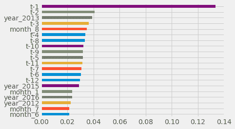

特征重要性值

# 包外测试

随机森林提供了内置的交叉验证优势，因为每个树都是在训练数据的自助版本上训练的。因此，每棵树平均使用了仅有的两三分之一可用的观测结果。要了解原因，请考虑自助样本的大小与原始样本的大小相同，每个观测结果被抽取的概率为 1/n。因此，不进入自助样本的概率是(1-1/n)^n，它收敛（迅速）到 1/e，或者大约三分之一。

在用于生长袋装树的训练集中未包括的剩余三分之一的观察结果被称为**袋外袋**（**OOB**）观察结果，并且可以作为验证集。正如交叉验证一样，我们对于每棵树都预测未使用此观察结果构建的 OOB 样本的响应，然后对每个 OOB 样本进行单个集合预测的平均预测响应（如果目标是回归）或采取多数投票或预测概率（如果目标是分类）。这些预测产生了关于泛化误差的无偏估计，方便在训练期间计算。

由于预测是在不考虑此观察结果的情况下学习的决策规则产生的，因此结果的 OOB 误差是该观察结果的泛化误差的有效估计。一旦随机森林足够大，OOB 误差就会接近留一交叉验证误差。对于大型数据集，OOB 方法估计测试误差非常高效，而交叉验证可能计算成本高昂。

# 随机森林的优缺点

袋装集成模型既有优势又有劣势。随机森林的优势包括：

+   预测性能可以与最佳监督学习算法竞争

+   它们提供可靠的特征重要性估计

+   它们提供了测试错误的有效估计，而不需要承担与交叉验证相关的重复模型训练的成本

另一方面，随机森林也有一些缺点：

+   集合模型本质上比单个决策树不太可解释

+   训练大量深树可能具有高计算成本（但可以并行化）并且使用大量内存

+   预测速度较慢，这可能对需要低延迟的应用程序造成挑战

# 摘要

在本章中，我们学习了一种能够捕捉非线性关系的新模型类，与我们迄今探索过的经典线性模型形成对比。我们看到决策树是如何学习规则来将特征空间划分为产生预测的区域，从而将输入数据分割成特定区域的。

决策树非常有用，因为它们提供了有关特征和目标变量之间关系的独特见解，我们看到了如何可视化树结构中编码的一系列决策规则。

不幸的是，决策树容易过拟合。我们了解到集成模型和自举聚合方法设法克服了决策树的一些缺点，并使它们成为更强大的复合模型的组成部分。

在下一章中，我们将探讨另一个集成模型，它已经被认为是最重要的机器学习算法之一。
