# 梯度提升机

在上一章中，我们了解到随机森林通过将它们组合成一个减少个体树高方差的集合来提高个别决策树的预测。随机森林使用装袋（bootstrap aggregation）来将随机元素引入到生长个别树的过程中。

更具体地说，装袋（bagging）从数据中有替换地抽取样本，以便每棵树都在不同但大小相等的数据随机子集上进行训练（其中一些观测重复）。随机森林还随机选择一些特征子集，以便用于训练每棵树的数据的行和列都是原始数据的随机版本。然后，集成通过对个别树的输出进行平均来生成预测。

个别树通常生长较深，以确保低偏差，同时依赖随机化训练过程来产生不同的、不相关的预测错误，这些错误在聚合时具有较低的方差，比个体树的预测更可靠。换句话说，随机化训练旨在使个别树产生的错误彼此不相关或多样化，使集合对过拟合的敏感性大大降低，具有较低的方差，并且对新数据的泛化能力更好。

在本章中，我们将探讨提升（boosting）这种替代**机器学习**（**ML**）算法，用于决策树集成，通常能够产生更好的结果。其关键区别在于，提升根据模型在添加新树之前累积的错误来修改用于训练每棵树的数据。与随机森林不同，随机森林独立地使用训练集的不同版本训练许多树，而提升则使用重加权版本的数据进行顺序处理。最先进的提升实现也采用了随机森林的随机化策略。

在本章中，我们将看到提升是如何在过去三十年中演变成最成功的 ML 算法之一的。在撰写本文时，它已经成为结构化数据的机器学习竞赛中的主导者（例如，与高维图像或语音不同，在这些领域中输入和输出之间的关系更加复杂，深度学习表现出色）。具体来说，本章将涵盖以下主题：

+   提升的工作原理以及与装袋的比较

+   如何从自适应提升到梯度提升的演变

+   如何使用 sklearn 使用和调整 AdaBoost 和梯度提升模型

+   最先进的 GBM 实现如何大幅加速计算

+   如何防止梯度提升模型过拟合

+   如何使用`xgboost`、`lightgbm`和`catboost`构建、调整和评估大型数据集上的梯度提升模型

+   如何解释并从梯度提升模型中获得洞见

# 自适应提升

像装袋一样，增强是一种集成学习算法，它将基本学习器（通常是决策树）组合成一个集成。增强最初是为分类问题开发的，但也可用于回归，并且已被称为过去 20 年中引入的最有效的学习思想之一（如 Trevor Hastie 等人所述的《统计学习要素》；请查看 GitHub 获取参考链接）。与装袋类似，它是一种通用方法或元方法，可应用于许多统计学习模型。

**Boosting** 的发展动机是寻找一种方法来将许多 *弱* 模型的输出（当一个预测器仅比随机猜测稍好时，称为弱预测器）结合成更强大的，即增强的联合预测。一般来说，Boosting 学习一种形式类似于线性回归的可加假设，*H[M]*。然而，现在求和的每个元素 *m= 1,..., M* 都是一个称为 *h[t]* 的弱基本学习器，它本身需要训练。下面的公式总结了这种方法：

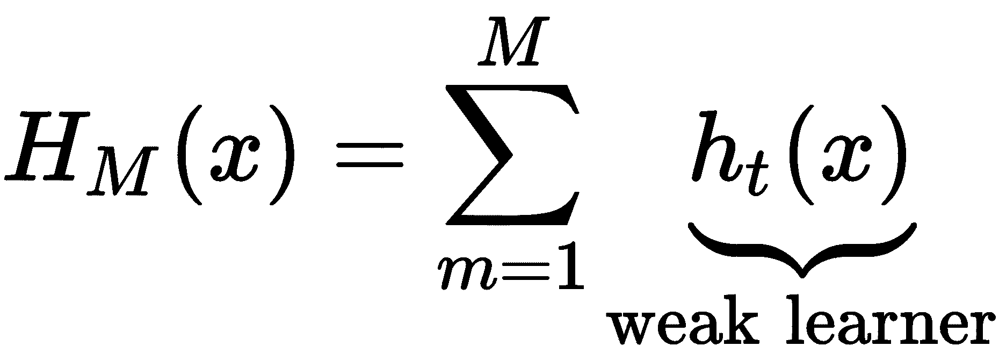

正如上一章所讨论的那样，装袋在不同的训练数据随机样本上训练基本学习器。相比之下，增强是通过在数据上顺序训练基本学习器，该数据反复修改以反映累积学习结果。目标是确保下一个基本学习器补偿当前集合的缺陷。我们将在本章中看到，增强算法在定义缺陷的方式上有所不同。集合使用弱模型的预测的加权平均值进行预测。

第一个带有数学证明，证明它增强了弱学习器性能的提升算法是由罗伯特·舍皮尔（Robert Schapire）和约阿夫·弗洛伊德（Yoav Freund）在 1990 年左右开发的。1997 年，作为分类问题的一个实际解决方案出现了**自适应增强**（**AdaBoost**）算法，该算法于 2003 年获得了哥德尔奖。大约又过了五年，该算法在连续梯度下降的方法上得到了推广，利奥·布雷曼（发明了随机森林）将该方法与梯度下降相连接，杰罗姆·弗里德曼在 1999 年提出了梯度增强算法。近年来，出现了许多优化实现，如 XGBoost、LightGBM 和 CatBoost，这些实现牢固地确立了梯度增强作为结构化数据的首选解决方案。

在接下来的几节中，我们将简要介绍 AdaBoost，然后专注于梯度增强模型，以及这个非常强大和灵活的算法的几种最新实现。

# **AdaBoost 算法**

AdaBoost 是第一个在拟合额外集成成员时迭代地适应累积学习进展的增强算法。特别地，AdaBoost 在拟合新的弱学习器之前，会根据当前集成在训练集上的累积错误改变训练数据的权重。AdaBoost 当时是最准确的分类算法，Leo Breiman 在 1996 年的 NIPS 会议上称其为世界上最好的现成分类器。

该算法对 ML 产生了非常重要的影响，因为它提供了理论上的性能保证。这些保证只需要足够的数据和一个可靠地预测略好于随机猜测的弱学习器。由于这种分阶段学习的自适应方法，开发准确的 ML 模型不再需要在整个特征空间上准确地表现。相反，模型的设计可以集中于找到仅仅优于抛硬币的弱学习器。

AdaBoost 与 bagging 有很大的不同，后者构建了在非常深的树上的集成以减少偏差。相比之下，AdaBoost 使用浅树作为弱学习器，通常通过使用树桩来获得更高的准确性，即由单一分裂形成的树。该算法从一个等权重的训练集开始，然后逐步改变样本分布。每次迭代后，AdaBoost 增加被错误分类的观测值的权重，并减少正确预测样本的权重，以便随后的弱学习器更多地关注特别困难的案例。一旦训练完成，新的决策树就会以反映其减少训练错误的贡献的权重被纳入集成中。

对于预测离散类别的一组基本学习器的 AdaBoost 算法，*hm*，*m=1, ..., M*，以及*N*个训练观测值，可以总结如下：

1.  对于观测值 *i=1, ..., N*，初始化样本权重 *w[i]=1/N*。

1.  对于每个基本分类器 *h[m]*，*m=1, ..., M*，执行以下操作：

    1.  用 *w[i]* 加权训练数据来拟合 *hm*。

    1.  计算训练集上基本学习器的加权错误率 *ε*[*m* ]。

    1.  计算基本学习器的集成权重 *α[m]*，作为其错误率的函数，如下式所示：

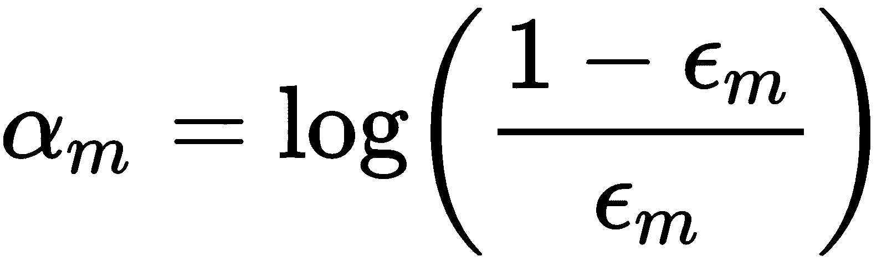

1.  1.  根据 *w[i ]* exp(α[m]**)* 更新错误分类样本的权重。

1.  当集成成员的加权和为正时，预测正类；否则，预测负类，如下式所示：

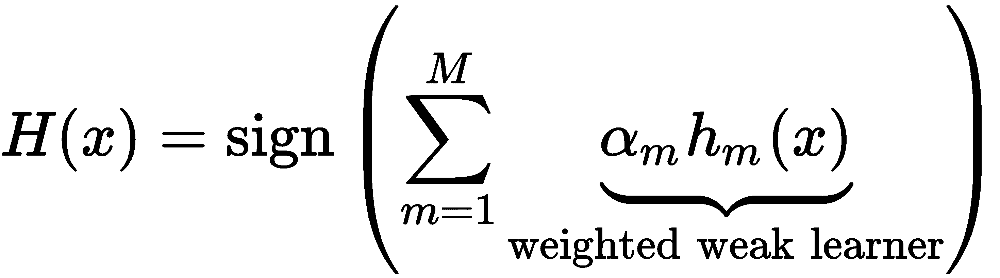

AdaBoost 具有许多实际优势，包括易于实现和快速计算，它可以与任何弱学习器识别方法结合使用。除了集成的大小之外，没有需要调整的超参数。AdaBoost 还对识别异常值很有用，因为接收最高权重的样本是那些一直被错误分类且固有模糊的样本，这也是异常值的典型特征。

另一方面，AdaBoost 在给定数据集上的性能取决于弱学习器充分捕捉特征与结果之间关系的能力。正如理论所示，当数据不足或集成成员的复杂性与数据的复杂性不匹配时，提升将无法表现良好。它也容易受到数据中的噪声影响。

# 使用 sklearn 的 AdaBoost

作为其集成模块的一部分，sklearn 提供了一个支持两个或多个类的`AdaBoostClassifier`实现。本节的代码示例位于笔记本`gbm_baseline`中，该笔记本将各种算法的性能与始终预测最频繁类别的虚拟分类器进行比较。

我们首先需要将`base_estimator`定义为所有集成成员的模板，然后配置集成本身。我们将使用默认的`DecisionTreeClassifier`，其中`max_depth=1`——即一个只有一个分割的树桩。基本估算器的复杂性是关键调参参数，因为它取决于数据的性质。正如前一章所示，对于`max_depth`的更改应与适当的正则化约束结合使用，例如通过调整`min_samples_split`来实现，如下代码所示：

```py
base_estimator = DecisionTreeClassifier(criterion='gini', 
                                        splitter='best',
                                        max_depth=1, 
                                        min_samples_split=2, 
                                        min_samples_leaf=20, 
                                        min_weight_fraction_leaf=0.0,
                                        max_features=None, 
                                        random_state=None, 
                                        max_leaf_nodes=None, 
                                        min_impurity_decrease=0.0, 
                                        min_impurity_split=None)
```

在第二步中，我们将设计集成。`n_estimators`参数控制弱学习器的数量，`learning_rate`确定每个弱学习器的贡献，如下代码所示。默认情况下，弱学习器是决策树树桩：

```py
ada_clf = AdaBoostClassifier(base_estimator=base_estimator,
                             n_estimators=200,
                             learning_rate=1.0,
                             algorithm='SAMME.R',
                             random_state=42)
```

负责良好结果的主要调参参数是`n_estimators`和基本估算器的复杂性，因为树的深度控制了特征之间的相互作用程度。

我们将使用自定义的 12 折滚动时间序列拆分来交叉验证 AdaBoost 集成，以预测样本中最后 12 个月的 1 个月预测，使用所有可用的先前数据进行训练，如下代码所示：

```py
cv = OneStepTimeSeriesSplit(n_splits=12, test_period_length=1, shuffle=True)
def run_cv(clf, X=X_dummies, y=y, metrics=metrics, cv=cv, fit_params=None):
    return cross_validate(estimator=clf,
                          X=X,
                          y=y,
                          scoring=list(metrics.keys()),
                          cv=cv,
                          return_train_score=True,
                          n_jobs=-1,                    # use all cores
                          verbose=1,
                          fit_params=fit_params)
```

结果显示加权测试准确度为 0.62，测试 AUC 为 0.6665，负对数损失为-0.6923，以及测试 F1 得分为 0.5876，如下截图所示：

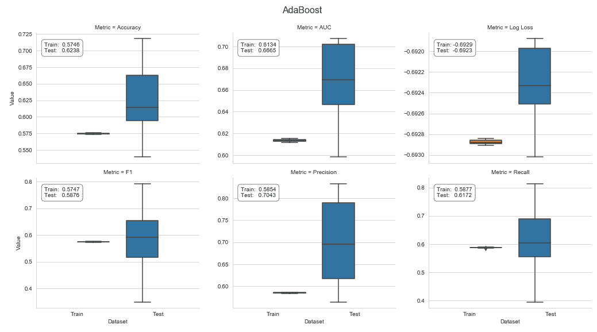

有关交叉验证代码和处理结果的其他详细信息，请参阅配套笔记本。

# 梯度提升机

AdaBoost 也可以解释为在每次迭代*m*时通过逐步前向方法最小化指数损失函数来识别与对应权重*α[m]*的新基学习器*h[m]*添加到集成中，如下式所示：

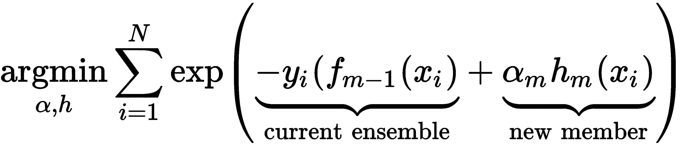

对 AdaBoost 算法的这种解释是在其发表几年后才发现的。它将 AdaBoost 视为一种基于坐标的梯度下降算法，该算法最小化了特定的损失函数，即指数损失。

梯度提升（Gradient boosting）利用这一洞见，并将提升方法应用于更广泛的损失函数。该方法使得设计机器学习算法以解决任何回归、分类或排名问题成为可能，只要它可以使用可微分的损失函数来表述，并因此具有梯度。定制这一通用方法以适应许多特定预测任务的灵活性对于提升方法的普及至关重要。

**梯度提升机**（**GBM**）算法的主要思想是训练基学习器来学习集成当前损失函数的负梯度。因此，每次添加到集成中都直接有助于减少由先前集成成员产生的总体训练误差。由于每个新成员代表数据的新函数，因此也可以说梯度提升是以加法方式优化*h[m]*函数。

简而言之，该算法逐步将弱学习器*h[m]*（如决策树）拟合到当前集成的损失函数的负梯度上，如下式所示：

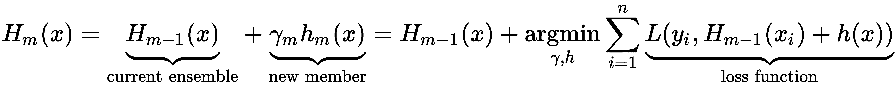

换句话说，在给定迭代*m*时，该算法计算每个观察值的当前损失的梯度，然后将回归树拟合到这些伪残差上。在第二步中，它确定每个终端节点的最佳常数预测，该预测最小化了将该新学习器添加到集成中产生的增量损失。

这与独立决策树和随机森林不同，其中预测取决于相关终端或叶节点中的训练样本的结果值：在回归的情况下是它们的平均值，或者在二元分类的情况下是正类的频率。对损失函数梯度的关注也意味着梯度提升使用回归树来学习回归和分类规则，因为梯度始终是连续函数。

最终集成模型根据个别决策树预测的加权和进行预测，每个决策树都已经训练以在给定一组特征值的情况下最小化集成损失，如下图所示：

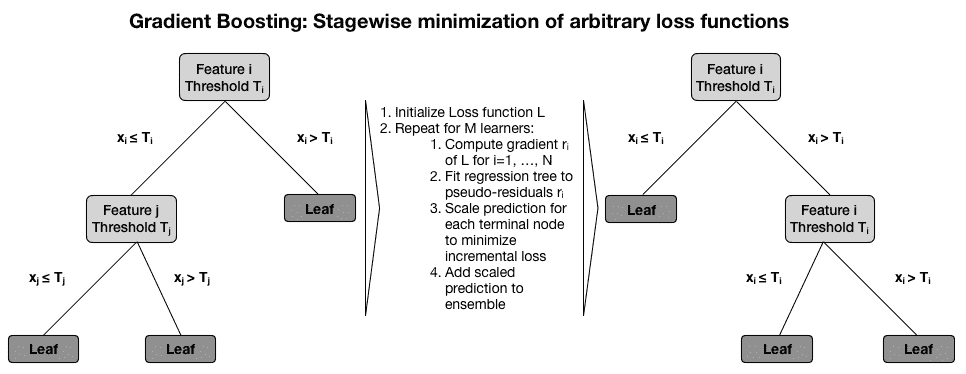

梯度提升树在许多分类、回归和排名基准上表现出最先进的性能。它们可能是最受欢迎的集成学习算法，既作为多样化的机器学习竞赛中的独立预测器，也作为实际生产流水线中的一部分，例如，用于预测在线广告的点击率。

梯度提升成功的基础是其以增量方式学习复杂的函数关系的能力。该算法的灵活性需要通过调整约束模型固有倾向于学习训练数据中的噪声而不是信号的超参数来仔细管理过拟合的风险。

我们将介绍控制梯度提升树模型复杂性的关键机制，然后使用 sklearn 实现来说明模型调优。

# 如何训练和调优 GBM 模型

梯度提升性能的两个关键驱动因素是集成大小和其组成决策树的复杂性。

决策树的复杂性控制旨在避免学习高度具体的规则，这些规则通常意味着叶节点中的样本数量非常少。我们在前一章中介绍了用于限制决策树过拟合到训练数据的最有效约束条件。它们包括要求：

+   要么分割节点或接受它作为终端节点的最小样本数，或

+   最小改进节点质量，由纯度或熵或均方误差衡量，对于回归情况而言。

除了直接控制集成大小外，还有各种正则化技术，例如收缩，在第七章 *线性模型* 中我们遇到的 Ridge 和 Lasso 线性回归模型的上下文中。此外，在随机森林上下文中使用的随机化技术也常用于梯度提升机。

# 集成大小和提前停止

每次提升迭代旨在减少训练损失，使得对于一个大集成，训练误差可能变得非常小，增加过拟合的风险并在未见数据上表现不佳。交叉验证是找到最小化泛化误差的最佳集成大小的最佳方法，因为它取决于应用程序和可用数据。

由于集成大小需要在训练之前指定，因此监控验证集上的性能并在给定迭代次数时中止训练过程是有用的，当验证误差不再下降时。这种技术称为提前停止，经常用于需要大量迭代并且容易过拟合的模型，包括深度神经网络。

请记住，对于大量试验使用相同的验证集进行早停会导致过拟合，只是过拟合于特定的验证集而不是训练集。最好避免在开发交易策略时运行大量实验，因为误发现的风险显著增加。无论如何，保留一个留置集以获取对泛化误差的无偏估计。

# 收缩和学习率

收缩技术通过对模型损失函数增加惩罚来应用于增加的模型复杂性。对于提升集合，收缩可以通过将每个新集合成员的贡献缩小一个介于 0 和 1 之间的因子来应用。这个因子被称为提升集合的学习率。降低学习率会增加收缩，因为它降低了每个新决策树对集合的贡献。

学习率与集合大小具有相反的效果，后者往往对较低的学习率增加。较低的学习率与较大的集合结合在一起，已被发现可以降低测试误差，特别是对于回归和概率估计。大量迭代在计算上更昂贵，但通常对于快速的最新实现是可行的，只要个别树保持浅层。根据实现方式，您还可以使用自适应学习率，它会根据迭代次数调整，通常降低后期添加的树的影响。我们将在本章后面看到一些示例。

# 子抽样和随机梯度提升

如前一章节详细讨论的，自助平均法（bagging）提高了原本噪声分类器的性能。

随机梯度提升在每次迭代中使用无替换抽样，以在训练样本的子集上生成下一棵树。好处是降低计算量，通常可以获得更好的准确性，但子抽样应与收缩结合使用。

正如您所见，超参数的数量不断增加，从而增加了在有限的训练数据上从大量参数试验中选择最佳模型时出现假阳性的风险。最好的方法是依次进行并逐个选择参数值，或者使用低基数子集的组合。

# 如何在 sklearn 中使用梯度提升

sklearn 的集合模块包含了梯度提升树的实现，用于回归和分类，二元和多类。以下 `GradientBoostingClassifier` 初始化代码展示了我们之前介绍的关键调整参数，除了我们从独立决策树模型中了解的那些外。笔记本 `gbm_tuning_with_sklearn` 包含了本节的代码示例。

可用的损失函数包括导致 AdaBoost 算法的指数损失和对应于概率输出的 logistic 回归的 deviance。`friedman_mse` 节点质量度量是平均平方误差的变化，其中包括一个改进分数（请参阅 GitHub 引用以获取原始论文链接），如以下代码所示：

```py
gb_clf = GradientBoostingClassifier(loss='deviance',                # deviance = logistic reg; exponential: AdaBoost
                                    learning_rate=0.1,              # shrinks the contribution of each tree
                                    n_estimators=100,               # number of boosting stages
                                    subsample=1.0,                  # fraction of samples used t fit base learners
                                    criterion='friedman_mse',       # measures the quality of a split
                                    min_samples_split=2,            
                                    min_samples_leaf=1, 
                                    min_weight_fraction_leaf=0.0,   # min. fraction of sum of weights
                                    max_depth=3,                    # opt value depends on interaction
                                    min_impurity_decrease=0.0, 
                                    min_impurity_split=None, 
                                    max_features=None, 
                                    max_leaf_nodes=None, 
                                    warm_start=False, 
                                    presort='auto',
                                    validation_fraction=0.1, 
                                    tol=0.0001)
```

与 `AdaBoostClassifier` 类似，该模型无法处理缺失值。我们将再次使用 12 折交叉验证来获取用于分类滚动 1 个月持有期的方向回报的错误，如下图所示：

```py
gb_cv_result = run_cv(gb_clf, y=y_clean, X=X_dummies_clean)
gb_result = stack_results(gb_cv_result)
```

我们将解析和绘制结果，以发现与 `AdaBoostClassifier` 相比略有改进的情况，如下图所示：

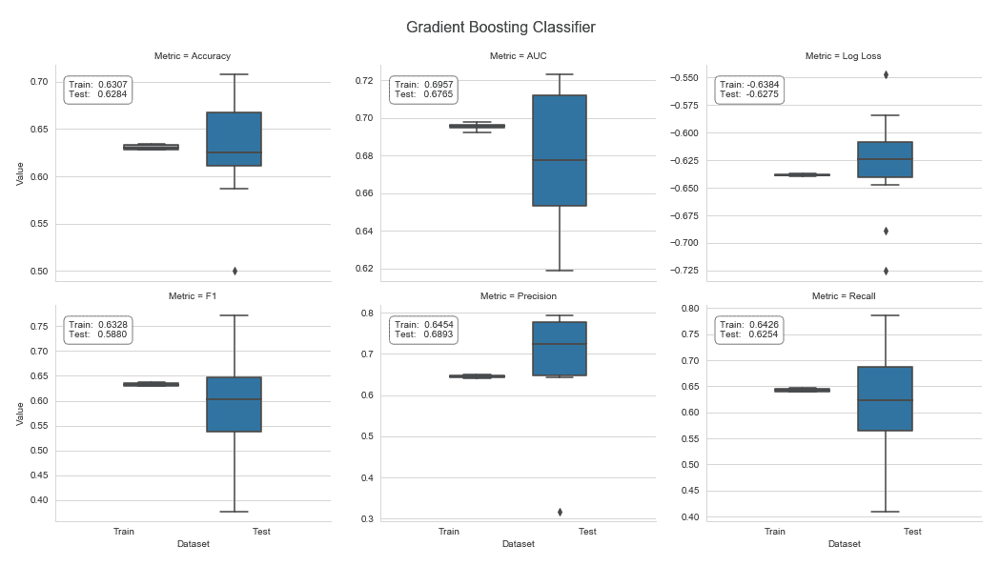

# 如何使用 `GridSearchCV` 调整参数

`model_selection` 模块中的 `GridSearchCV` 类促进了对我们想要测试的所有超参数值组合的系统评估。在下面的代码中，我们将说明此功能，用于七个调整参数，当定义时将产生总共 2⁴ x 3² x 4 = 576 种不同的模型配置：

```py
cv = OneStepTimeSeriesSplit(n_splits=12)

param_grid = dict(
        n_estimators=[100, 300],
        learning_rate=[.01, .1, .2],
        max_depth=list(range(3, 13, 3)),
        subsample=[.8, 1],
        min_samples_split=[10, 50],
        min_impurity_decrease=[0, .01],
        max_features=['sqrt', .8, 1]
)
```

`.fit()` 方法使用自定义的 `OneStepTimeSeriesSplit` 和 `roc_auc` 分数执行交叉验证以评估 12 折。Sklearn 允许我们使用 `joblib` pickle 实现持久化结果，就像对任何其他模型一样，如以下代码所示：

```py
gs = GridSearchCV(gb_clf,
                   param_grid,
                   cv=cv,
                   scoring='roc_auc',
                   verbose=3,
                   n_jobs=-1,
                   return_train_score=True)
gs.fit(X=X, y=y)

# persist result using joblib for more efficient storage of large numpy arrays
joblib.dump(gs, 'gbm_gridsearch.joblib')
```

`GridSearchCV` 对象在完成后具有几个额外的属性，我们可以在加载拾取的结果后访问，以了解哪种超参数组合效果最佳以及其平均交叉验证 AUC 分数，这导致了比默认值略有改进。以下代码显示了这一点：

```py
pd.Series(gridsearch_result.best_params_)
learning_rate              0.01
max_depth                  9.00
max_features               1.00
min_impurity_decrease      0.01
min_samples_split         10.00
n_estimators             300.00
subsample                  0.80

gridsearch_result.best_score_
0.6853
```

# 参数对测试分数的影响

`GridSearchCV` 结果存储了平均交叉验证分数，以便我们分析不同的超参数设置如何影响结果。

下图左侧面板中的六个 `seaborn` swarm 图显示了所有参数值的 AUC 测试分数分布。在这种情况下，最高的 AUC 测试分数需要较低的 `learning_rate` 和较大的 `max_features` 值。某些参数设置，例如较低的 `learning_rate`，会产生一系列取决于其他参数互补设置的结果范围。其他参数与实验中使用的所有设置的高分数兼容：

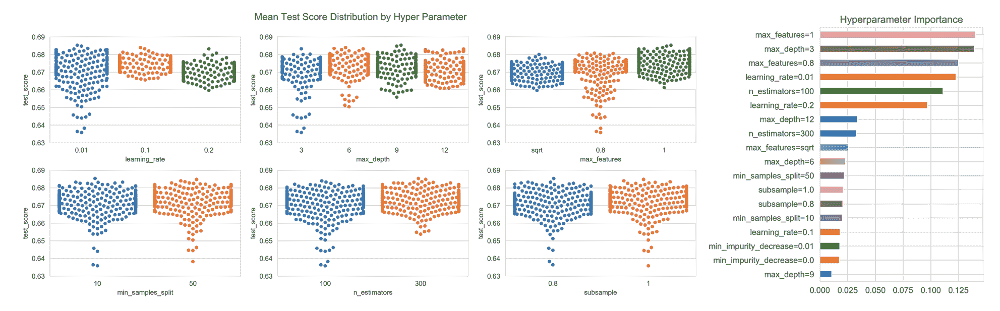

我们现在将探讨超参数设置如何共同影响平均交叉验证分数。 为了深入了解参数设置是如何相互作用的，我们可以使用`DecisionTreeRegressor`训练，将平均测试分数作为结果，将参数设置编码为一组独热或虚拟格式的分类变量（详情请参阅笔记本）。 树结构突显了使用所有特征（`max_features_1`），低`learning_rate`和`max_depth`超过 3 导致了最佳结果，如下图所示：

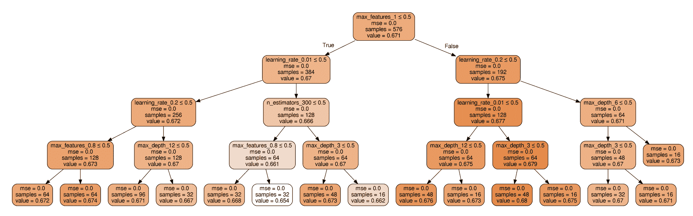

在本节第一个图表的右侧面板中的条形图显示了超参数设置对产生不同结果的影响，其特征重要性由决策树产生，决策树生长到其最大深度为止。 自然，出现在树顶部附近的特征也累积了最高的重要性得分。

# 如何在留置集上进行测试

最后，我们希望评估我们从`GridSearchCV`练习中排除的留置集上最佳模型的性能。 它包含了样本期的最后六个月（截至 2018 年 2 月；详情请参阅笔记本）。 我们基于 AUC 分数`0.6622`获得了一个泛化性能估计，使用以下代码：

```py
best_model = gridsearch_result.best_estimator_
preds= best_model.predict(test_feature_data)
roc_auc_score(y_true=test_target, y_score=preds)
0.6622

```

sklearn 梯度提升实现的缺点是计算速度有限，这使得快速尝试不同的超参数设置变得困难。 在接下来的部分中，我们将看到在过去的几年中出现了几种优化实现，大大减少了训练甚至大规模模型所需的时间，并且极大地扩展了这种高效算法的应用范围。

# 快速可扩展的 GBM 实现

过去几年中，出现了几种新的梯度提升实现，采用了各种创新，加速了训练，提高了资源效率，并允许算法扩展到非常大的数据集。 新的实现及其来源如下：

+   XGBoost（极端梯度提升），2014 年由华盛顿大学的 Tianqi Chen 发起

+   LightGBM，于 2017 年 1 月由 Microsoft 首次发布

+   CatBoost，于 2017 年 4 月由 Yandex 首次发布

这些创新解决了训练梯度提升模型的特定挑战（请参阅本章在 GitHub 上的`README`以获取详细参考）。 XGBoost 的实现是第一个获得流行的新实现：在 2015 年 Kaggle 发布的 29 个获奖解决方案中，有 17 个解决方案使用了 XGBoost。 其中 8 个仅依赖于 XGBoost，而其他的则将 XGBoost 与神经网络结合使用。

在说明其实现之前，我们将首先介绍随着时间推移而出现并最终收敛的关键创新（以便大多数功能对所有实现都可用）。

# 算法创新如何推动性能

随机森林可以通过在独立的自助样本上生长单独的树来并行训练。相比之下，梯度提升的顺序方法会减慢训练速度，这反过来会使得需要适应任务和数据集性质的大量超参数的实验变得更加复杂。

为了通过树扩展整体，训练算法以增量方式最小化相对于整体损失函数的负梯度的预测误差，类似于传统的梯度下降优化器。因此，在训练过程中评估每个特征对决策树与当前梯度拟合的潜在分割点的影响的计算成本与时间成正比。

# 二阶损失函数近似

最重要的算法创新通过使用依赖于二阶导数的近似来降低评估损失函数的成本，类似于牛顿法找到稳定点。因此，在贪婪树扩展过程中评分潜在分割的速度相对于使用完整损失函数更快。

正如先前提到的，梯度提升模型是以增量方式训练的，其目标是最小化整体 *H[M]* 的预测误差和正则化惩罚的组合。用 *m* 步后集成对结果 *y[i]* 的预测表示为 *ŷ[i]*^((*m*))，*l* 是一个可微的凸损失函数，用来衡量结果和预测之间的差异，Ω 是一个随着整体 *H[M]* 复杂性增加而增加的惩罚项，增量假设 *h[m]* 的目标是最小化以下目标函数：

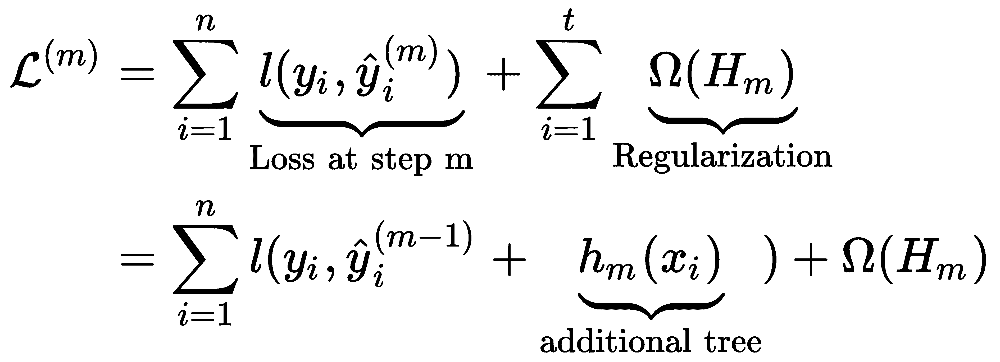

正则化惩罚有助于通过偏好选择使用简单且有预测性的回归树的模型来避免过拟合。例如，在 XGBoost 的情况下，回归树 *h* 的惩罚取决于每棵树的叶子数 *T*，每个终端节点的回归树得分 *w*，以及超参数 γ 和 λ。这在以下公式中总结如下：

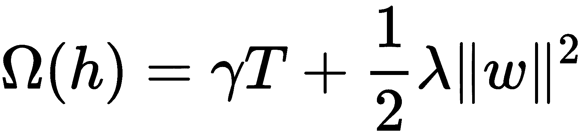

因此，在每一步，算法都会贪婪地添加最能改进正则化目标的假设 *h[m]*。基于泰勒展开的损失函数的二阶近似加速了目标函数的评估，如以下公式所总结：

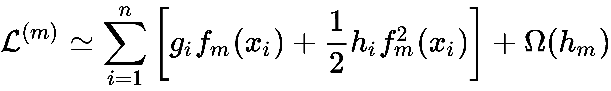

这里，*g[i]* 是添加新的学习器前给定特征值的损失函数的一阶梯度，而 *h[i]* 是相应的二阶梯度（或者海森矩阵）值，如下式所示：

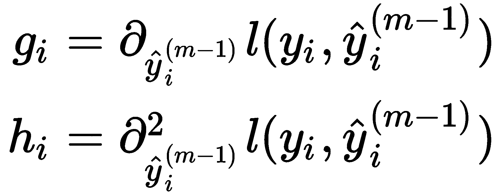

XGBoost 算法是第一个利用损失函数的这种近似来计算给定树结构的最优叶子分数和相应损失函数值的开源算法。分数由终端节点中样本的梯度和 Hessian 的和的比率组成。它使用此值来评分分裂所导致的信息增益，类似于我们在前一章中看到的节点不纯度度量，但适用于任意损失函数（详细推导请参阅 GitHub 上的参考文献）。

# 简化的分裂查找算法

sklearn 的梯度提升实现找到枚举连续特征所有选项的最优拆分。这种精确的贪婪算法在计算上非常耗费资源，因为它必须首先按特征值对数据进行排序，然后对潜在的非常大数量的拆分选项进行评分和决策。当数据不适合内存或在多台机器上的分布式设置中进行训练时，此方法会面临挑战。

一种近似的分裂查找算法通过将特征值分配给用户确定的一组箱子来减少分裂点的数量，这也可以在训练期间大大减少内存需求，因为每个箱子只需要存储一个分裂。XGBoost 引入了一种分位数草图算法，也能将加权训练样本分成百分位箱子，以实现均匀分布。XGBoost 还引入了处理稀疏数据的能力，这些数据由缺失值、频繁的零梯度统计和一位有效编码引起，并且还可以为给定的分裂学习一个最优的默认方向。因此，该算法只需评估非缺失值。

相比之下，LightGBM 使用**基于梯度的单侧采样**（**GOSS**）来排除具有小梯度的大部分样本，并且仅使用其余部分来估算信息增益，并相应地选择分裂值。具有较大梯度的样本需要更多的训练，并且倾向于更多地对信息增益做出贡献。LightGBM 还使用排他性特征绑定来组合那些彼此互斥的特征，它们很少同时取非零值，以减少特征数量。因此，LightGBM 在发布时是最快的实现。

# 深度优先与叶子优先增长

LightGBM 与 XGBoost 和 CatBoost 在优先拆分哪些节点方面有所不同。LightGBM 以叶子方式决定分裂，即拆分最大化信息增益的叶子节点，即使这会导致不平衡树。相比之下，XGBoost 和 CatBoost 以深度方式扩展所有节点，并在添加更多级别之前首先拆分给定深度的所有节点。这两种方法以不同的顺序扩展节点，除了完整的树之外，它们将产生不同的结果。下图说明了这两种方法：

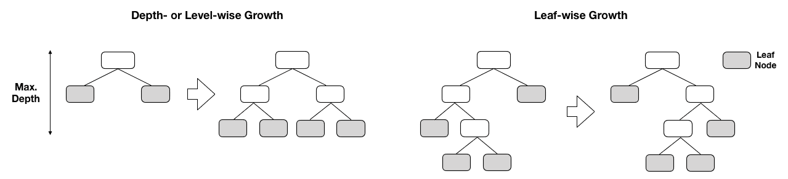

LightGBM 的叶子优先分割往往增加模型复杂性，并且可能加快收敛速度，但也增加了过拟合的风险。一个深度为 *n* 的以节点为优先的树最多有 *2*^(*n* )个叶子节点，而一个以叶子为优先的树具有 *2^n* 个叶子，可能会有更多的层次，并且某些叶子节点中包含相对较少的样本。因此，调整 LightGBM 的 `num_leaves` 设置需要额外的注意，库也允许我们同时控制 `max_depth` 以避免不必要的节点不平衡。LightGBM 的更近期版本还提供了深度为优先的树增长。

# 基于 GPU 的训练

所有新的实现支持在一个或多个 GPU 上进行训练和预测，以实现显著的加速。它们与当前的 CUDA 启用的 GPU 兼容。安装要求各不相同，并且正在快速发展。XGBoost 和 CatBoost 的实现适用于几个当前版本，但是 LightGBM 可能需要本地编译（请参阅 GitHub 获取相关文档链接）。

加速取决于库和数据类型，并且范围从低的单位数字倍增到数十倍的因子。仅需更改任务参数并且不需要其他超参数修改就能激活 GPU。

# DART – 树的 dropout

2015 年，Rashmi 和 Gilad-Bachrach 提出了一个新模型来训练梯度提升树，旨在解决他们称之为过度专业化的问题：在后续迭代中添加的树往往只影响少数实例的预测，而对于其余实例的贡献较小。然而，该模型的样本外性能可能会受到影响，并且可能对先前在过程中添加的少数树的贡献过于敏感。

新的算法采用了 dropouts，成功地用于学习更准确的深度神经网络，其中 dropouts 在学习过程中静音了部分神经连接。因此，高层节点不能依赖少数连接来传递预测所需的信息。这种方法对于深度神经网络的成功做出了重要贡献，也已与其他学习技术一起使用，例如逻辑回归，以静音特征的随机份额。随机森林和随机梯度提升也会静音随机特征子集。

DART 在树的层次上运作，并且对整棵树进行静音，而不是对个别特征进行操作。使用 DART 生成的集成树的目标是更均匀地对最终预测作出贡献。在某些情况下，这已被证明对排名、回归和分类任务产生更准确的预测。该方法首先在 LightGBM 中实现，并且也适用于 XGBoost。

# 分类特征的处理

CatBoost 和 LightGBM 实现直接处理分类变量，无需虚拟编码。

CatBoost 的实现（其命名源自对分类特征的处理）包括处理这些特征的几个选项，除了自动独热编码外，还为几个特征的单独分类或多个特征组合分配数字值。换句话说，CatBoost 可以从现有特征的组合中创建新的分类特征。与个别特征或特征组合的分类水平相关的数字值取决于它们与结果值的关系。在分类情况下，这与观察正类别的概率有关，该概率在样本上累积计算，基于先验和平滑系数。有关更详细的数值示例，请参阅文档。

LightGBM 的实现将分类特征的水平分组以最大化（或最小化）与结果值相对于组内的均匀性。

XGBoost 的实现不直接处理分类特征，需要进行独热（或虚拟）编码。

# 其他功能和优化

XGBoost 通过在内存中保留压缩的列块来优化计算，在几个方面使计算多线程化，其中每个列都按相应特征值排序。XGBoost 在训练前仅计算一次此输入数据布局，并在整个过程中重复使用它以摊销额外的前期成本。使用可以并行完成的分位数时，对列的拆分统计信息的搜索变为线性扫描，并且易于支持列子抽样。

后来发布的 LightGBM 和 CatBoost 库构建在这些创新之上，并通过优化线程和减少内存使用量进一步加速了训练。由于它们的开源性质，这些库随着时间的推移往往会趋于一致。

XGBoost 还支持单调性约束。这些约束确保给定特征的值仅在其整个范围内与结果呈正相关或负相关。它们对于合并已知为真的模型的外部假设非常有用。

# 如何使用 XGBoost、LightGBM 和 CatBoost

XGBoost、LightGBM 和 CatBoost 提供多种语言的接口，包括 Python，并且具有与其他 sklearn 特性兼容的 sklearn 接口，例如 `GridSearchCV`，以及它们自己的方法来训练和预测梯度提升模型。`gbm_baseline.ipynb` 笔记本展示了每个实现的 sklearn 接口的使用。这些库方法通常文档更好，而且也更容易使用，因此我们将使用它们来说明这些模型的使用。

该过程涉及创建特定于库的数据格式，调整各种超参数以及评估我们将在接下来的章节中描述的结果。 附带的笔记本包含`gbm_tuning.py`，`gbm_utils.py`和`gbm_params.py`文件，共同提供以下功能，并生成相应的结果。

# 如何创建二进制数据格式

所有库都有自己的数据格式，用于预先计算特征统计信息以加速搜索分割点，如前所述。 这些也可以持久化以加速后续训练的开始。

以下代码为要与`OneStepTimeSeriesSplit`一起使用的每个模型构造了二进制训练和验证数据集：

```py
cat_cols = ['year', 'month', 'age', 'msize', 'sector']
data = {}
for fold, (train_idx, test_idx) in enumerate(kfold.split(features)):
    print(fold, end=' ', flush=True)
    if model == 'xgboost':
        data[fold] = {'train': xgb.DMatrix(label=target.iloc[train_idx],
                                           data=features.iloc[train_idx],
                                           nthread=-1),                  # use avail. threads
                      'valid': xgb.DMatrix(label=target.iloc[test_idx],
                                           data=features.iloc[test_idx],
                                           nthread=-1)}
    elif model == 'lightgbm':
        train = lgb.Dataset(label=target.iloc[train_idx],
                            data=features.iloc[train_idx],
                            categorical_feature=cat_cols,
                            free_raw_data=False)

        # align validation set histograms with training set
        valid = train.create_valid(label=target.iloc[test_idx],
                                   data=features.iloc[test_idx])

        data[fold] = {'train': train.construct(),
                      'valid': valid.construct()}

    elif model == 'catboost':
        # get categorical feature indices
        cat_cols_idx = [features.columns.get_loc(c) for c in cat_cols]
        data[fold] = {'train': Pool(label=target.iloc[train_idx],
                                    data=features.iloc[train_idx],
                                    cat_features=cat_cols_idx),

                      'valid': Pool(label=target.iloc[test_idx],
                                    data=features.iloc[test_idx],
                                    cat_features=cat_cols_idx)}
```

可用选项略有不同：

+   `xgboost` 允许使用所有可用线程

+   `lightgbm`明确地将为验证集创建的分位数与训练集对齐

+   `catboost` 实现需要使用索引而不是标签来识别特征列

# 如何调整超参数

许多超参数在`gbm_params.py`中列出。 每个库都有参数设置来：

+   指定总体目标和学习算法

+   设计基学习器

+   应用各种正则化技术

+   在训练过程中处理提前停止

+   启用 GPU 或在 CPU 上进行并行化

每个库的文档详细介绍了可能引用相同概念的各种参数，但是在库之间具有不同名称的参数。 GitHub 存储库包含指向突出显示`xgboost`和`lightgbm`相应参数的网站的链接。

# 目标和损失函数

这些库支持几种提升算法，包括树的梯度提升和线性基学习器，以及 LightGBM 和 XGBoost 的 DART。 LightGBM 还支持我们之前描述的 GOSS 算法，以及随机森林。

梯度提升的吸引力在于有效支持任意可微损失函数，每个库都提供了用于回归，分类和排名任务的各种选项。 除了选择的损失函数之外，在训练和交叉验证期间还可以使用其他评估指标来监视性能。

# 学习参数

梯度提升模型通常使用决策树来捕获特征交互，个体树的大小是最重要的调整参数。 XGBoost 和 CatBoost 将`max_depth`默认设置为 6。 相反，LightGBM 使用默认的`num_leaves`值为 31，这对应于平衡树的五个级别，但对级别的数量没有约束。 为了避免过拟合，`num_leaves`应低于*2^(max_depth)*。 例如，对于表现良好的`max_depth`值为 7，您应将`num_leaves`设置为 70–80，而不是 2⁷=128，或者直接限制`max_depth`。

树的数量或增强迭代次数定义了整体集合的规模。所有库都支持`early_stopping`，一旦损失函数在给定迭代次数内不再改善，就会终止训练。因此，通常最好设置大量迭代次数，并根据验证集上的预测性能停止训练。

# 正则化

所有库都实现了对基本学习器的正则化策略，例如样本数量的最小值或分割和叶节点所需的最小信息增益。

它们还支持通过学习速率通过收缩来在整个集合层次上实现正则化，限制新树的贡献。还可以通过回调函数实现自适应学习速率，随着训练的进行而降低学习速率，这在神经网络的上下文中已经成功使用过。此外，梯度提升损失函数可以通过* L1 *或* L2 *进行正则化，类似于通过修改Ω（* h [m] *）或通过增加添加更多树的惩罚γ来描述的 Ridge 和 Lasso 线性回归模型。

这些库还允许使用装袋或列子抽样来随机化树的生长，用于随机森林，并减少整体方差以去相关预测误差。为了保护免受过拟合，对于近似分割查找的特征量化，添加更大的箱子作为另一种选择。

# 随机化网格搜索

为了探索超参数空间，我们为我们想要测试的关键参数指定值。sklearn 库支持`RandomizedSearchCV`，从指定的分布中随机抽样一部分参数组合进行交叉验证。我们将实现一个自定义版本，允许我们利用早停，同时监视当前表现最佳的组合，因此我们可以在满意结果时中止搜索过程，而不是事先指定一组迭代次数。

为此，我们根据每个库的参数指定参数网格，使用`itertools`库提供的内置笛卡尔`product`生成器生成所有组合，并随机`shuffle`结果。在 LightGBM 的情况下，我们会自动根据当前`num_leaves`值设置`max_depth`，如下所示：

```py
param_grid = dict(
        # common options
        learning_rate=[.01, .1, .3],
        colsample_bytree=[.8, 1],  # except catboost

        # lightgbm
        num_leaves=[2 ** i for i in range(9, 14)],
        boosting=['gbdt', 'dart'],
        min_gain_to_split=[0, 1, 5],  # not supported on GPU

all_params = list(product(*param_grid.values()))
n_models = len(all_params) # max number of models to cross-validate
shuffle(all_params)
```

然后，我们执行交叉验证如下：

```py
GBM = 'lightgbm'
for test_param in all_params:
    cv_params = get_params(GBM)
    cv_params.update(dict(zip(param_grid.keys(), test_param)))
    if GBM == 'lightgbm':
        cv_params['max_depth'] = int(ceil(np.log2(cv_params['num_leaves'])))
    results[n] = run_cv(test_params=cv_params,
                        data=datasets,
                        n_splits=n_splits,
                        gb_machine=GBM)
```

`run_cv`函数实现了三个库的交叉验证。对于`light_gbm`示例，该过程如下：

```py
def run_cv(test_params, data, n_splits=10):
    """Train-Validate with early stopping"""
    result = []
    cols = ['rounds', 'train', 'valid']
    for fold in range(n_splits):
        train = data[fold]['train']
        valid = data[fold]['valid']

        scores = {}
        model = lgb.train(params=test_params,
                          train_set=train,
                          valid_sets=[train, valid],
                          valid_names=['train', 'valid'],
                          num_boost_round=250,
                          early_stopping_rounds=25,
                          verbose_eval=50,
                          evals_result=scores)

        result.append([model.current_iteration(),
                       scores['train']['auc'][-1],
                       scores['valid']['auc'][-1]])

    return pd.DataFrame(result, columns=cols)
```

`train()`方法还会生成存储在`scores`字典中的验证分数。当早停生效时，最后一次迭代也是最佳分数。有关更多详细信息，请参见 GitHub 上的完整实现。

# 如何评估结果

使用 GPU，我们可以在几分钟内训练一个模型，并在几个小时内评估数百个参数组合，而使用 sklearn 实现则需要多天。对于 LightGBM 模型，我们探索了使用库处理分类变量的因子版本和使用独热编码的虚拟版本。

结果存储在 `model_tuning.h5` HDF5 存储中。模型评估代码样本在 `eval_results.ipynb` 笔记本中。

# 跨模型的交叉验证结果

当比较四次测试运行中三个库的平均交叉验证 AUC 时，我们发现 CatBoost 为表现最佳模型产生了稍高的 AUC 分数，同时也产生了最广泛的结果分布，如下图所示：

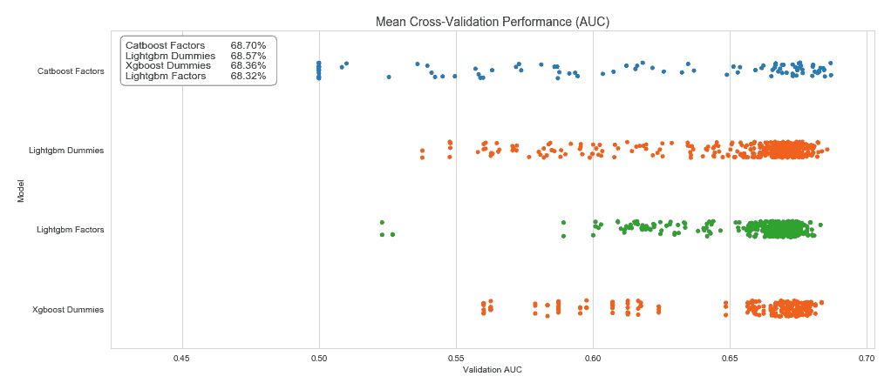

表现最佳的 CatBoost 模型使用以下参数（详见笔记本）：

+   `max_depth` 为 12，`max_bin` 为 128

+   `max_ctr_complexity` 为 2，限制了分类特征的组合数量

+   `one_hot_max_size` 为 2，排除了二元特征的数值变量分配

+   `random_strength` 不等于 0 以随机化分裂的评估

训练相对于 LightGBM 和 XGBoost 稍慢（都使用 GPU），平均每个模型 230 秒。

对 LightGBM 和 XGBoost 模型表现最好的更详细的分析显示，LightGBM 因子模型的性能几乎与其他两个模型相当，但模型复杂度要低得多。它平均只包含 41 棵树，深度为三级，每棵树最多有八个叶子节点，并且还使用了 `min_gain_to_split` 形式的正则化。它在训练集上过拟合明显较少，训练 AUC 仅略高于验证 AUC。它还训练速度更快，每个模型只需 18 秒，因为它的复杂度更低。实际上，这个模型更可取，因为它更有可能产生良好的样本外表现。具体细节如下表所示：

|  | **LightGBM 虚拟** | **XGBoost 虚拟** | **LightGBM 因子** |
| --- | --- | --- | --- |
| 验证 AUC | 68.57% | 68.36% | 68.32% |
| 训练 AUC | 82.35% | 79.81% | 72.12% |
| `learning_rate` | 0.1 | 0.1 | 0.3 |
| `max_depth` | 13 | 9 | 3 |
| `num_leaves` | 8192 |  | 8 |
| `colsample_bytree` | 0.8 | 1 | 1 |
| `min_gain_to_split` | 0 | 1 | 0 |
| 轮数 | 44.42 | 59.17 | 41.00 |
| 时间 | 86.55 | 85.37 | 18.78 |

下图显示了不同 `max_depth` 设置对 LightGBM 和 XGBoost 模型的验证分数的影响：较浅的树产生了更广泛的结果范围，需要与适当的学习率和正则化设置相结合，以产生前面表格中显示的强结果：

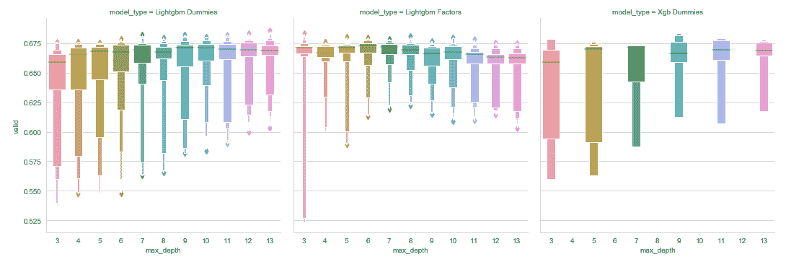

与之前显示的 `DecisionTreeRegressor` 不同，我们也可以使用线性回归来评估不同特征在验证 AUC 分数方面的统计显著性。对于 LightGBM 虚拟模型，其中回归解释了结果变异的 68%，我们发现只有 `min_gain_to_split` 正则化参数不显著，如下图所示：

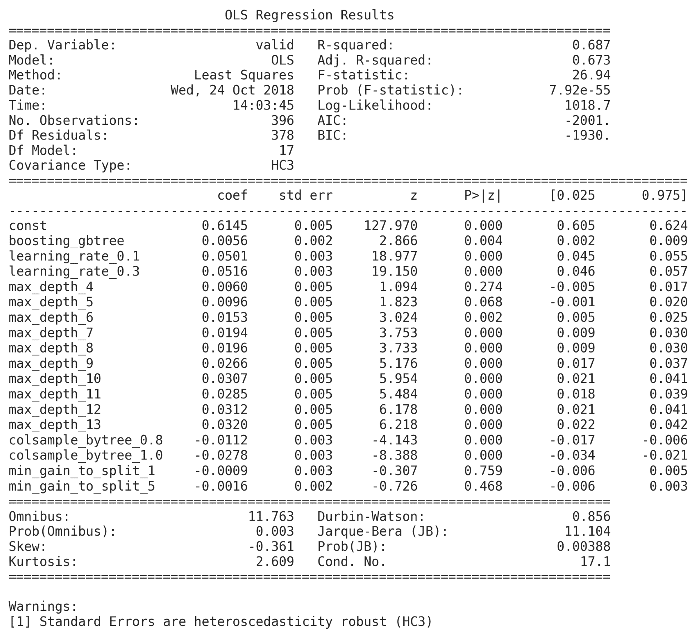

在实践中，深入了解模型如何进行预测非常重要，特别是对于投资策略，决策者通常需要合理的解释。

# 如何解释 GBM 结果

理解模型为什么预测某个结果对于多种原因都非常重要，包括信任、可操作性、责任和调试。通过模型发现的特征与结果之间的非线性关系以及特征之间的相互作用也在学习更多关于所研究现象的基本驱动因素时具有价值。

了解树集成方法（如梯度提升或随机森林模型）所做预测的见解的常见方法是将特征重要性值归因于每个输入变量。这些特征重要性值可以根据单个预测的情况或整个数据集（即所有样本）全局计算，以获得模型进行预测的更高级别视角。

# 特征重要性

有三种主要方法来计算**全局特征重要性**值：

+   **Gain**: 这种经典方法由 Leo Breiman 在 1984 年引入，使用给定特征的所有分割所贡献的损失或杂质的总减少。其动机在很大程度上是启发式的，但它是一种常用的特征选择方法。

+   **分割计数**：这是一种替代方法，它计算使用特征进行分割决策的频率，根据选择特征以达到所得信息增益。

+   **排列**：这种方法随机排列测试集中的特征值，并测量模型误差的变化量，假设重要特征应该会导致预测误差大幅增加。不同的排列选择导致该基本方法的替代实现。

对于单个预测计算特征重要性值的方法较少，因为可用的模型无关解释方法比树特定方法慢得多。

所有梯度提升实现在训练后都提供特征重要性得分作为模型属性。XGBoost 库提供五个版本，如下列表所示：

+   `total_gain` 和 `gain` 作为其每个分割的平均值

+   `total_cover` 作为使用特征时每个分割的样本数

+   `weight` 作为前面值的分割计数

可使用训练模型的`.get_score()`方法和相应的`importance_type`参数获取这些值。对于性能最佳的 XGBoost 模型，结果如下（*total*度量具有 0.8 的相关性，`cover`和`total_cover`也是如此）：

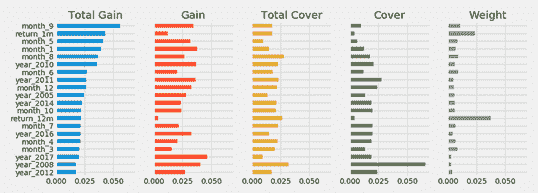

虽然不同月份和年份的指标占主导地位，但最近 1 个月的回报是从`total_gain`的角度来看第二重要的特征，并且根据`weight`度量经常被使用，但由于它平均应用于相对较少的实例而产生较低的平均收益（有关实施细节，请参见笔记本）。

# 偏依赖图

除了个体特征对模型预测的总体贡献之外，偏依赖图还可视化目标变量与一组特征之间的关系。梯度提升树的非线性特性导致这种关系取决于所有其他特征的值。因此，我们将对这些特征进行边际化处理。通过这样做，我们可以将偏依赖性解释为期望的目标响应。

我们只能为单个特征或特征对可视化偏依赖性。后者会产生等高线图，显示不同特征值的组合如何产生不同的预测概率，如下所示：

```py
fig, axes = plot_partial_dependence(gbrt=gb_clf,
                                    X=X_dummies_clean,
                                    features=['month_9', 'return_1m', 'return_3m', ('return_1m', 'return_3m')],
                                    feature_names=['month_9','return_1m', 'return_3m'],
                                    percentiles=(0.01, 0.99),
                                    n_jobs=-1,
                                    n_cols=2,
                                    grid_resolution=250)
```

经过一些额外的格式化（请参阅配套笔记本），我们得到了以下图表：

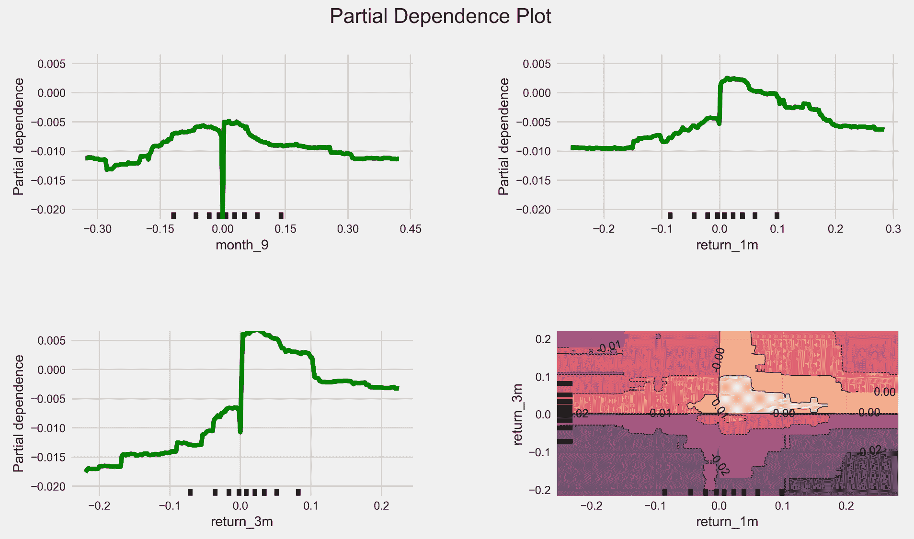

右下角的图显示了在消除[1%，99%]百分位数处的离群值后，给定滞后 1 个月和 3 个月收益值范围的情况下，下个月产生正回报的概率的依赖性。 `month_9` 变量是一个虚拟变量，因此呈阶梯函数样式的图。我们还可以将依赖性可视化为 3D，如下代码所示：

```py
targets = ['return_1m', 'return_3m']
target_feature = [X_dummies_clean.columns.get_loc(t) for t in targets]
pdp, axes = partial_dependence(gb_clf,
                               target_feature,
                               X=X_dummies_clean,
                               grid_resolution=100)

XX, YY = np.meshgrid(axes[0], axes[1])
Z = pdp[0].reshape(list(map(np.size, axes))).T

fig = plt.figure(figsize=(14, 8))
ax = Axes3D(fig)
surf = ax.plot_surface(XX, YY, Z,
                       rstride=1,
                       cstride=1,
                       cmap=plt.cm.BuPu,
                       edgecolor='k')
ax.set_xlabel(' '.join(targets[0].split('_')).capitalize())
ax.set_ylabel(' '.join(targets[1].split('_')).capitalize())
ax.set_zlabel('Partial Dependence')
ax.view_init(elev=22, azim=30)
```

这产生了以下 1 个月回报方向对滞后 1 个月和 3 个月回报的偏依赖的 3D 图：

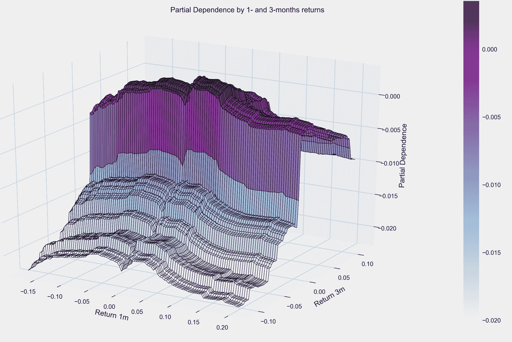

# SHapley Additive exPlanations

在 2017 年 NIPS 会议上，来自华盛顿大学的 Scott Lundberg 和 Su-In Lee 提出了一种新的更准确的方法来解释树集成模型对输出的贡献，称为**SHapley Additive exPlanations**，或**SHAP**值。

这个新算法基于这样一个观察：树集成的特征归因方法，如我们之前看过的方法，是不一致的——即，使特征对输出的影响增加的模型变化可能会降低该特征的重要性值（请参阅 GitHub 上有关此的详细说明）。

SHAP 值统一了协作博弈理论和局部解释的思想，并且根据期望值显示其在理论上是最优、一致和局部准确的。最重要的是，Lundberg 和 Lee 开发了一种算法，成功将计算这些与模型无关的、可加的特征归因方法的复杂度从 *O*(*TLD^M*) 减少到 *O*(*TLD*²)，其中 *T* 和 *M* 分别是树和特征的数量，*D* 和 *L* 是树的最大深度和叶子节点数。这一重要的创新使得对先前难以处理的具有数千棵树和特征的模型的预测能够在几秒钟内解释。一个开源实现于 2017 年底发布，并且兼容 XGBoost、LightGBM、CatBoost 和 sklearn 树模型。

Shapley 值源自博弈论，是一种为协作游戏中的每个玩家分配值的技术，反映了他们对团队成功的贡献。SHAP 值是对基于树的模型的博弈论概念的一种改编，并且为每个特征和每个样本计算。它们衡量了一个特征对给定观察结果的模型输出的贡献。因此，SHAP 值提供了不同的洞察力，说明了特征的影响如何在样本间变化，这在这些非线性模型中交互作用效应的作用中非常重要。

# 如何按特征总结 SHAP 值

要获得对多个样本的特征重要性的高级概述，有两种绘制 SHAP 值的方法：对所有样本进行简单平均，类似于先前计算的全局特征重要性度量（如下图左侧面板所示），或者绘制散点图来显示每个样本的每个特征的影响（如下图右侧面板所示）。使用兼容库的训练模型和匹配输入数据非常容易产生，如下面的代码所示：

```py
# load JS visualization code to notebook
shap.initjs()

# explain the model's predictions using SHAP values
explainer = shap.TreeExplainer(model)
shap_values = explainer.shap_values(X_test)

shap.summary_plot(shap_values, X_test, show=False)
```

下图右侧的散点图按照所有样本的 SHAP 值对特征进行排序，然后显示了每个特征对模型输出的影响，其值由特征的值的函数表示，通过其颜色表示，红色表示高值，蓝色表示低值，相对于特征的范围：

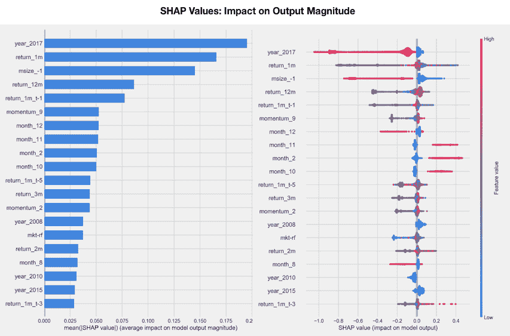

# 如何使用力图解释预测

下面的力图显示了各种特征及其值对模型输出的累积影响，在这种情况下，模型输出为 0.6，比基准值 0.13（提供的数据集上的平均模型输出）高得多。突出显示为红色的特征增加了输出。十月份是最重要的特征，将输出从 0.338 增加到 0.537，而 2017 年则降低了输出。

因此，我们获得了模型如何到达特定预测的详细分解，如下图所示：

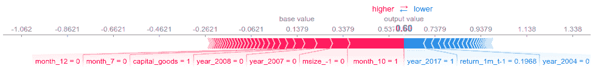

我们还可以同时计算大量数据点或预测的力图，并使用聚类可视化来深入了解数据集中某些影响模式的普遍程度。以下图表显示了前 1000 个观察结果的力图，旋转了 90 度，水平堆叠，并按照不同特征对给定观察结果的影响排序。该实现使用层次凝聚聚类对特征 SHAP 值上的数据点进行标识以识别这些模式，并以交互方式显示结果进行探索性分析（参见笔记本），如以下代码所示：

```py
shap.force_plot(explainer.expected_value, shap_values[:1000,:], X_test.iloc[:1000])
```

这将产生以下输出：

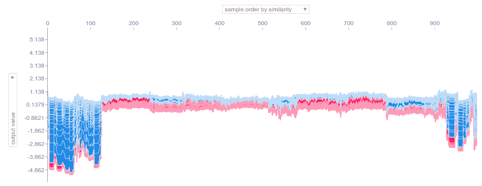

# 如何分析特征交互

最后，SHAP 值使我们能够通过将这些相互作用与主要效应分离来获得对不同特征之间的相互作用效应的额外洞察。`shap.dependence_plot` 可以定义如下：

```py
shap.dependence_plot("return_1m", shap_values, X_test, interaction_index=2, title='Interaction between 1- and 3-Month Returns')
```

它显示了 1 个月回报的不同值（*x* 轴）如何影响结果（*y* 轴上的 SHAP 值），并由 3 个月回报区分：

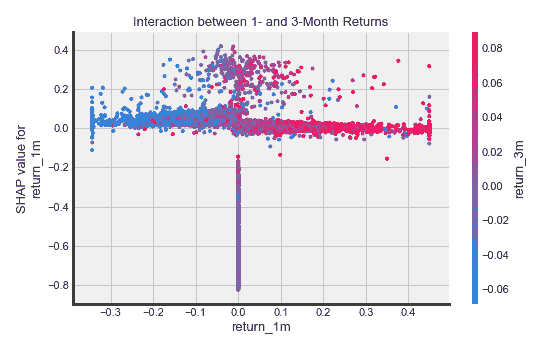

SHAP 值在每个单独预测的水平上提供了细粒度的特征归因，并通过（交互式）可视化实现了对复杂模型的更丰富检查。本节开头显示的 SHAP 摘要散点图提供了比全局特征重要性条形图更加差异化的见解。单个聚类预测的力图允许进行更详细的分析，而 SHAP 依赖图捕获了相互作用效应，并因此提供了比局部依赖图更准确和详细的结果。

SHAP 值的限制与任何当前特征重要性度量一样，涉及对高度相关的变量影响的归因，因为它们相似的影响可能以任意方式被分解。

# 摘要

在本章中，我们探讨了梯度提升算法，该算法用于以顺序方式构建集成，添加一个只使用非常少的特征的浅层决策树，以改善已经做出的预测。我们看到了梯度提升树如何可以非常灵活地应用于广泛的损失函数，并提供了许多机会来调整模型以适应给定的数据集和学习任务。

最近的实现大大简化了梯度提升的使用，通过加速训练过程并提供更一致和详细的特征重要性以及单个预测驱动因素的洞察。在下一章中，我们将转向贝叶斯方法来进行机器学习。
