# 第十二章：无监督学习

在第六章，*机器学习流程*中，我们讨论了无监督学习如何通过发现数据中的结构而增加价值，而无需一个指导搜索过程的结果变量，例如老师。这个任务与我们在过去几章中专注于的监督学习的设置形成对比。

当数据集只包含特征而没有结果的测量值，或者当我们想要提取与结果无关的信息时，无监督学习算法可以很有用。目标不是预测未来的结果，而是研究对解决另一个任务有用的数据的信息表示，包括探索数据集。

例如，识别主题以总结文档（参见第十四章，*主题建模*）、减少特征数量以减少过度拟合和监督学习的计算成本，或者分组相似的观察，如本章末尾资产配置的聚类使用所示。

降维和聚类是无监督学习的主要任务：

+   **降维**将现有特征转换为一个新的、更小的集合，同时尽量减少信息的损失。存在广泛的算法，它们仅在如何衡量信息损失、是否应用线性或非线性变换或对新特征集施加的约束方面有所不同。

+   **聚类算法**不是识别新特征，而是识别和分组相似的观察或特征。不同的算法在如何定义观察的相似性以及对结果群组的假设上有所不同。

更具体地说，本章涵盖以下内容：

+   主成分分析（**PCA**）和独立成分分析（**ICA**）如何进行线性降维

+   如何应用 PCA 来识别资产回报的风险因素和特征组合

+   如何使用非线性流形学习来总结高维数据以进行有效的可视化

+   如何使用 t-SNE 和 UMAP 来探索高维替代图像数据

+   如何使用 k-Means、分层和基于密度的聚类算法

+   如何使用凝聚聚类构建根据层次风险平衡构建健壮的投资组合

每个部分的代码示例都在本章的在线 GitHub 存储库的目录中，网址为[`github.com/PacktPublishing/Hands-On-Machine-Learning-for-Algorithmic-Trading`](https://github.com/PacktPublishing/Hands-On-Machine-Learning-for-Algorithmic-Trading)。

# 降维

从线性代数的角度来看，数据集的特征创建了一个**向量空间**，其维数对应于线性独立列的数量（假设观测数量多于特征数量）。当两列线性相关时，它们完全相关，因此可以使用加法和乘法的线性运算从其中一个计算另一个。

换句话说，它们是表示相同而不是不同方向或轴的平行向量，并且只构成一个单一的维度。类似地，如果一个变量是其他几个变量的线性组合，则它是由这些列创建的向量空间的元素，而不是增加自己的新维度。

数据集的维数很重要，因为每个新维度都可以添加关于结果的信号。但是，还存在一个被称为**维度诅咒**的负面影响：随着独立特征数量的增加，同时保持观测数量不变，数据点之间的平均距离也会增加，并且特征空间的密度呈指数级下降。

对于机器学习而言，当观察结果彼此之间更远、即相异时，预测变得更加困难；下一节将讨论由此产生的挑战。

降维旨在通过使用较少的特征更有效地表示数据中的信息。为此，算法将数据投影到一个低维空间，同时舍弃不具信息性的数据变异，或者通过确定数据所在的或接近的低维子空间或流形。

流形是在局部类似于欧几里得空间的空间。一维流形包括线和圆（但不包括八的截屏，因为存在交点）。流形假设认为高维数据通常位于一个低维空间中，如果确定了这个空间，就可以在这个子空间中对数据进行忠实的表示。

因此，降维通过找到一组不同的、较小的变量来捕获原始特征中最重要的内容，从而最小化信息损失。压缩有助于对抗维度诅咒，节省内存，并允许可视化高维数据的显著特征，否则这些特征很难探索。

# 线性和非线性算法

降维算法在对新变量施加的约束以及它们如何旨在最小化信息损失方面存在差异：

+   **线性算法**，如 PCA 和 ICA，将新变量限制为原始特征的线性组合；也就是说，在较低维度空间中的超平面。而 PCA 要求新特征是不相关的，ICA 进一步要求统计独立性——即线性和非线性关系的缺失。以下截图说明了 PCA 如何将三维特征投影到二维空间中：

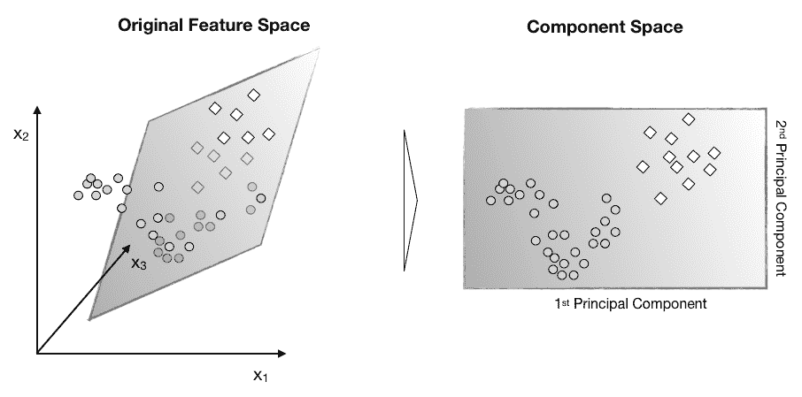

+   非线性算法不局限于超平面，并且可以捕捉数据中更复杂的结构。然而，由于选项的无限数量，算法仍然需要做出假设来得出解决方案。在本节中，我们展示了**t-分布随机邻居嵌入**（**t-SNE**）和**均匀流形近似和投影**（**UMAP**）对于可视化高维数据非常有用。以下截图说明了流形学习如何在三维特征空间中识别二维子空间（`manifold_learning`笔记本展示了使用其他算法的情况，包括局部线性嵌入）：

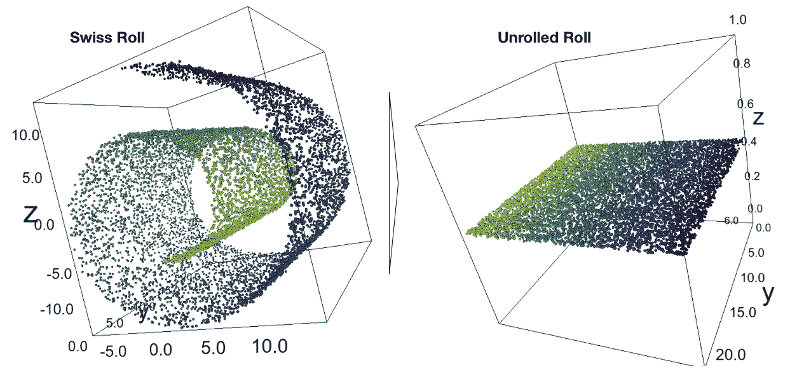

# 维度的诅咒

数据集维度的增加意味着表示对应欧几里得空间中每个观测的特征向量中的条目更多。我们使用欧几里得距离，也称为**L2 范数**，来测量向量空间中的距离，我们将其应用于线性回归系数向量以训练正则化的岭回归模型。

两个具有笛卡尔坐标*p = (p[1], p[2], ..., p[n])*和*q = (q[1], q[2], ..., q[n])*的*n*维向量之间的欧几里得距离是用毕达哥拉斯所发展的熟知公式计算的：

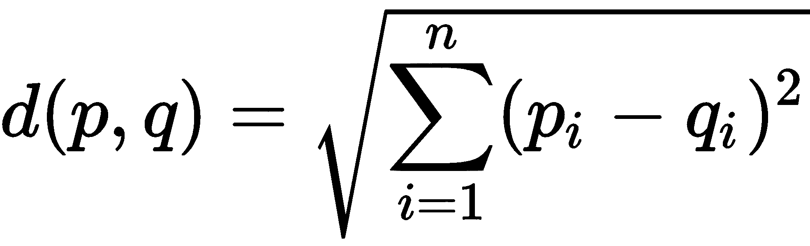

因此，每个新的维度都会向总和中添加一个非负项，以使距离随着不同向量的维数增加而增加。换句话说，随着给定观测数量的特征数量增加，特征空间变得越来越稀疏；也就是说，越来越少或者更为空。

下图显示了我们需要多少数据点来维持均匀分布在一条线上的 10 个观测的平均距离。随着数据在每次添加新维度时需要扩展 10 倍，从一维中的 10¹增加到二维中的 10²和三维中的 10³，呈指数增长：

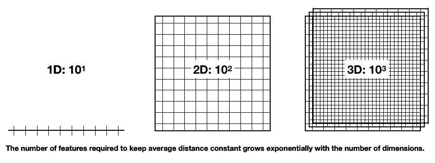

GitHub 存储库文件夹中的`curse_of_dimensionality`笔记本模拟了随着维度数量增加，数据点之间的平均距离和最小距离如何增加：

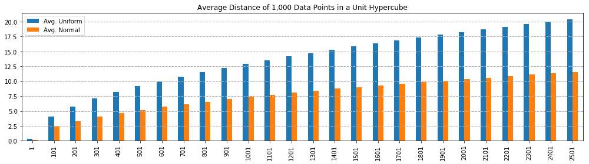

该模拟从不相关的均匀分布或相关的正态分布中绘制特征的范围为[0, 1]，并逐渐增加特征数量到 2,500。对于从正态分布中绘制的特征，数据点之间的平均距离增加到特征范围的 11 倍以上，对于从不相关的均匀分布中绘制的特征，在(极端)情况下增加到 20 倍以上。

当观察之间的距离增加时，监督机器学习变得更加困难，因为对新样本的预测不太可能是基于对相似训练特征的学习。换句话说，随着特征数量的增加，可能的唯一行数呈指数增长，这使得从空间中高效采样变得更加困难。

同样，由灵活算法学到的函数的复杂度随着维度数量的增加呈指数增长，这些算法对实际关系的假设较少。

灵活算法包括我们在第十章，*决策树和随机森林*，以及第十一章，*梯度提升机* 中看到的基于树的模型，以及从第十七章 *深度学习* 开始我们将介绍的深度神经网络。这些算法的方差随着它们有更多机会在更多维度上过拟合噪声而增加，导致泛化性能较差。

在实践中，特征之间存在相关性，通常相当显著，或者不具有太多变化。出于这些原因，降维有助于压缩数据而几乎不损失信号，并且在节约内存的同时抵消了维数灾难。在这些情况下，它补充了使用正则化来管理由于方差和模型复杂度而产生的预测误差。

接下来我们要解决的关键问题是：找到一种尽可能减少信息损失的数据的低维表示的最佳方法是什么？

# 线性降维

线性降维算法计算线性组合，将原始特征进行平移、旋转和重新缩放，以捕捉数据中的显著变化，同时受到新特征特性的约束。

**主成分分析** (**PCA**)，由卡尔·皮尔逊于 1901 年发明，找到了反映数据中最大方差方向的新特征，同时这些特征相互不相关，或者正交。

**独立成分分析** (**ICA**) 相反，起源于 20 世纪 80 年代的信号处理领域，其目标是在强加统计独立性的更严格约束条件下分离不同的信号。

本节介绍了这两个算法，然后说明了如何将 PCA 应用于资产收益，以从数据中学习风险因素，并构建所谓的特征投资组合来进行系统性交易策略。

# 主成分分析

PCA 将主成分视为现有特征的线性组合，并使用这些成分来表示原始数据。成分的数量是一个超参数，确定了目标维度，需要等于或小于观测或列的数量，以较小者为准。

PCA 旨在捕捉数据中的大部分方差，以便轻松恢复原始特征，并使每个成分都添加信息。它通过将原始数据投影到主成分空间来降低维度。

PCA 算法通过识别一系列主成分来工作，每个主成分都与数据中最大方差的方向对齐，考虑了先前计算的成分捕获的变化后。顺序优化还确保新成分与现有成分不相关，使得结果集构成向量空间的正交基础。

这个新基础对应于原始基础的旋转版本，使得新轴指向连续减小的方差方向。每个主成分解释的原始数据方差量的下降反映了原始特征之间相关性的程度。

捕获例如 95%的原始变化相对于总特征数的成分数量为原始数据中线性独立信息的洞察提供了一个见解。

# 在 2D 中可视化 PCA

下面的屏幕截图说明了一个二维随机数据集的 PCA 的几个方面（请参见`pca_key_ideas`笔记本）：

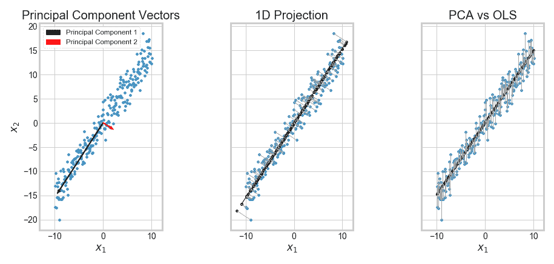

+   左侧面板显示了第一和第二主成分如何与最大方差的方向对齐，同时又是正交的。

+   中心面板显示了第一主成分如何最小化重构误差，重构误差定义为数据点与新轴之间的距离之和。

+   最后，右侧面板说明了监督 OLS，它通过从（单个）特征计算的（一维）超平面近似结果变量（这里我们选择 x[2]）。垂直线突出显示 OLS 如何最小化沿结果轴的距离，与 PCA 相反，后者最小化与超平面正交的距离。

# PCA 所做的假设

PCA 做出了几个重要的假设需要牢记。这些包括以下内容：

+   高方差意味着高信噪比

+   数据被标准化，使得各个特征的方差可比较

+   线性变换捕捉了数据的相关方面

+   超过第一和第二时刻的高阶统计量不重要，这意味着数据具有正态分布

对第一和第二时刻的强调与标准风险/回报度量相一致，但正态性假设可能与市场数据的特征相冲突。

# PCA 算法的工作原理

该算法找到向量以创建目标维度的超平面，最小化重构误差，重构误差被测量为数据点到平面的平方距离之和。正如上面所示，这个目标对应于找到一个序列的向量，这些向量与给定其他分量的最大保留方差的方向对齐，同时确保所有主要成分都是相互正交的。

在实践中，该算法通过计算协方差矩阵的特征向量或使用奇异值分解来解决问题。

我们使用一个随机生成的三维椭圆来说明计算过程，其中包含 100 个数据点，显示在以下屏幕截图的左侧面板中，包括由前两个主成分定义的二维超平面（参见`the_math_behind_pca`笔记本中的以下代码示例）：

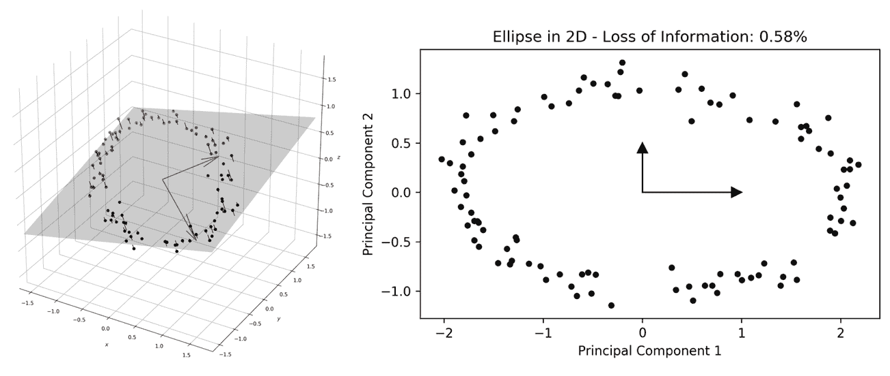

三维椭圆和二维超平面

# 基于协方差矩阵的 PCA

我们首先使用特征*x[i], x[j]*的成对样本协方差作为行*i*和列*j*的输入来计算主成分：

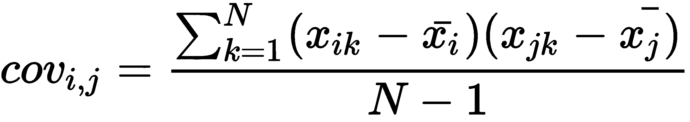

对于一个*n*维的方阵*M*，我们定义如下的特征向量*ω[i]*和特征值*λ[i]*，*i*=1, ..., *n*：

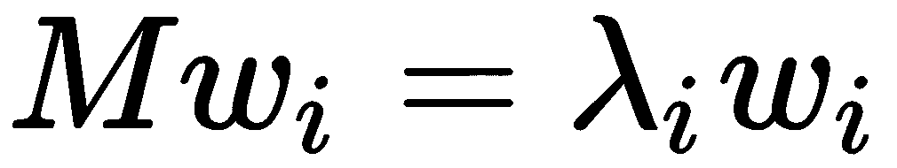

因此，我们可以使用特征向量和特征值表示矩阵*M*，其中*W*是一个包含特征向量的矩阵，*L*是一个包含*λ[i]*作为对角元素（其他元素为 0）的矩阵。我们将特征值分解定义如下：

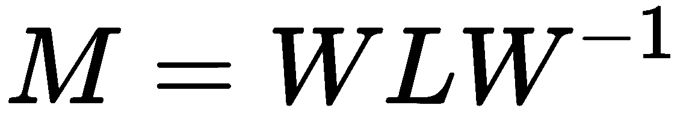

使用 NumPy，我们按如下方式实现这一点，其中 pandas DataFrame 包含椭圆的 100 个数据点：

```py
# compute covariance matrix:
cov = np.cov(data, rowvar=False) # expects variables in rows by default
cov.shape
(3, 3)
```

接下来，我们计算协方差矩阵的特征向量和特征值。特征向量包含主成分（符号是任意的）：

```py
eigen_values, eigen_vectors = eig(cov)
eigen_vectors
array([[ 0.71409739, -0.66929454, -0.20520656],
[-0.70000234, -0.68597301, -0.1985894 ],
[ 0.00785136, -0.28545725, 0.95835928]])
```

我们可以将结果与从 sklearn 获得的结果进行比较，发现它们在绝对意义上是匹配的：

```py
pca = PCA()
pca.fit(data)
C = pca.components_.T # columns = principal components
C
array([[ 0.71409739, 0.66929454, 0.20520656],
[-0.70000234, 0.68597301, 0.1985894 ],
[ 0.00785136, 0.28545725, -0.95835928]])
np.allclose(np.abs(C), np.abs(eigen_vectors))
True
```

我们还可以验证特征值分解，从包含特征值的对角矩阵*L*开始：

```py
# eigenvalue matrix
ev = np.zeros((3, 3))
np.fill_diagonal(ev, eigen_values)
ev # diagonal matrix
array([[1.92923132, 0\. , 0\. ],
[0\. , 0.55811089, 0\. ],
[0\. , 0\. , 0.00581353]])
```

我们发现结果确实成立：

```py
decomposition = eigen_vectors.dot(ev).dot(inv(eigen_vectors))
np.allclose(cov, decomposition)
```

# 使用奇异值分解的 PCA

接下来，我们将看看使用**奇异值分解**(**SVD**)进行的备用计算。当观测次数大于特征数时（典型情况），该算法速度较慢，但在一些特征强相关（通常是使用 PCA 的原因）的情况下，可以获得更好的数值稳定性。

SVD 将我们刚刚应用于方形对称协方差矩阵的特征分解推广到更一般的*m* x *n*矩形矩阵。其形式如下图中心所示。 *Σ* 的对角值是奇异值，*V* 的转置包含主成分作为列向量：

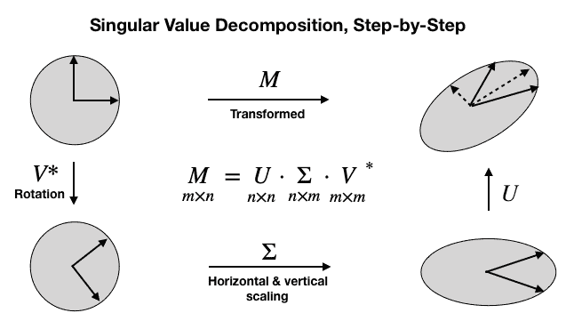

在这种情况下，我们需要确保我们的数据中心化，均值为零（在计算协方差之前已经处理了这一点）：

```py
n_features = data.shape[1]
data_ = data - data.mean(axis=0
Using the centered data, we compute the singular value decomposition:
U, s, Vt = svd(data_)
U.shape, s.shape, Vt.shape
((100, 100), (3,), (3, 3))
We can convert the vector s that only contains the singular values into an nxm matrix and show that the decomposition works:
S = np.zeros_like(data_)
S[:n_features, :n_features] = np.diag(s)
S.shape
(100, 3)
```

我们发现，分解确实重新生成了标准化数据：

```py
np.allclose(data_, U.dot(S).dot(Vt))
True
```

最后，我们确认*V*的转置的列包含主成分：

```py
np.allclose(np.abs(C), np.abs(Vt.T))
True
```

在下一节中，我们将展示 sklearn 如何实现 PCA。

# sklearn 中的 PCA

`sklearn.decomposition.PCA`的实现遵循基于`fit()`和`transform()`方法的标准 API，这些方法分别计算所需数量的主成分并将数据投影到组件空间。便捷方法`fit_transform()`在一步中完成此操作。

PCA 提供了三种不同的算法，可以使用`svd_solver`参数指定：

+   `Full` 使用 SciPy 提供的 LAPACK 求解器计算精确的 SVD

+   `Arpack` 运行适用于计算不到全部组件的截断版本

+   `Randomized` 使用基于抽样的算法，当数据集具有 500 个以上观测值和特征，并且目标是计算少于 80%的组件时，效率更高

+   `Auto` 使用随机化算法在效率最高的地方，否则使用完整的 SVD

有关算法实现细节的参考请参见 GitHub 上的参考资料。

PCA 对象的其他关键配置参数如下：

+   `n_components`：通过传递`None`（默认）来计算所有主成分，或者限制数量为`int`。对于`svd_solver=full`，还有两个额外的选项：在[0,1]区间内的浮点数计算需要保留数据方差的相应份额的组件数量，`mle`选项使用最大似然估计来估计维度数量。

+   `whiten`：如果为`True`，则将组件向量标准化为单位方差，在某些情况下，这可能对在预测模型中使用有用（默认为`False`）。

要计算三维椭圆的前两个主成分并将数据投影到新空间中，可以使用`fit_transform()`如下所示：

```py
pca = PCA(n_components=2)
projected_data = pca.fit_transform(data)
projected_data.shape
(100, 2)
```

前两个成分的解释方差非常接近 100%：

```py
pca2.explained_variance_ratio_
array([0.77381099, 0.22385721])
```

本节开始处的截图显示了数据投影到新的二维空间中。

# 独立成分分析

**独立成分分析**（**ICA**）是另一种线性算法，它确定了一种新的基础，用于表示原始数据，但追求的目标不同于 PCA。

ICA 起源于信号处理，其旨在解决的问题称为**盲源分离**。通常将其描述为鸡尾酒会问题，即同时有多位嘉宾讲话，以至于单个麦克风会记录重叠的信号。ICA 假设存在与说话者数量相同的不同麦克风，每个麦克风放置在不同的位置，以记录不同混合信号。然后，ICA 旨在从不同的录音中恢复个别信号。

换句话说，有 *n* 个原始信号和一个未知的方形混合矩阵 *A*，产生一个 *n* 维 *m* 观测值集合，使得：

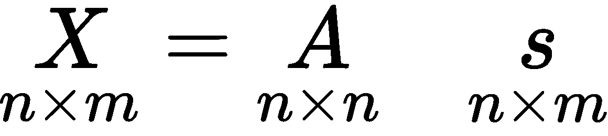

目标是找到矩阵*W=A^(-1)*，以解开混合信号以恢复源信号。

唯一确定矩阵 *W* 的能力取决于数据的非高斯分布。否则，*W* 可以在多元正态分布在旋转下的对称性的情况下任意旋转。

此外，ICA 假设混合信号是其组成部分的和，并且无法识别高斯分量，因为它们的和也是正态分布的。

# ICA 假设

ICA 做出以下关键假设：

+   信号的来源是统计独立的

+   线性变换足以捕获相关信息

+   独立分量没有正态分布

+   混合矩阵 A 可以被反转

ICA 还要求数据被居中和白化；也就是说，彼此不相关且方差为单位。使用 PCA 对数据进行预处理如上所述可以实现所需的转换。

# ICA 算法

sklearn 使用的 FastICA 是一种固定点算法，它使用高阶统计量来恢复独立源。特别是，它最大化了每个分量到正态分布的距离，作为独立性的代理。

名为**InfoMax**的替代算法最小化组件之间的互信息作为统计独立性的度量。

# 使用 sklearn 进行 ICA

sklearn 的 ICA 实现使用与 PCA 相同的接口，因此没有什么需要额外添加的。请注意，没有解释方差的度量，因为 ICA 不会逐步计算组件。相反，每个组件旨在捕获数据的独立方面。

# 用于算法交易的 PCA

PCA 在算法交易中有几方面的用途。这些包括将 PCA 应用于资产收益，通过数据驱动的方法导出风险因素，并基于资产收益的相关矩阵的主成分构建不相关的投资组合。

# 数据驱动的风险因素

在第七章 *Linear Models* 中，我们探讨了量化金融中用于捕捉回报主要驱动因素的风险因素模型。这些模型根据资产暴露于系统性风险因素的程度以及与这些因素相关的回报来解释资产回报的差异。

特别地，我们探索了法玛-法 rench 方法，该方法根据有关平均收益的经验行为的先验知识指定因素，将这些因素视为可观察的，然后使用线性回归估计风险模型系数。另一种方法将风险因素视为潜在变量，并使用因子分析技术（如 PCA）同时估计因素以及它们如何从历史回报中驱动回报。

在本节中，我们将审查这种方法如何以纯粹的统计或数据驱动方式推导因素，其优势在于不需要对资产回报行为的 ex-ante 知识（有关详细信息，请参见`pca` 和 `risk_factor` 笔记本模型）。

我们将使用 Quandl 股价数据，并选择市值最大的 500 支股票在 2010-18 期间的每日调整收盘价。然后，我们按以下方式计算每日回报：

```py
idx = pd.IndexSlice
with pd.HDFStore('../../data/assets.h5') as store:
stocks = store['us_equities/stocks'].marketcap.nlargest(500)
returns = (store['quandl/wiki/prices']
.loc[idx['2010': '2018', stocks.index], 'adj_close']
.unstack('ticker')
.pct_change())
```

我们获得了 `351` 支股票和超过 2000 个交易日的收益：

```py
returns.info()
DatetimeIndex: 2072 entries, 2010-01-04 to 2018-03-27
Columns: 351 entries, A to ZTS
```

PCA 对异常值很敏感，因此我们将数据在 2.5% 和 97.5% 分位数处进行了 winsorize 处理：

```py
returns = returns.clip(lower=returns.quantile(q=.025),
upper=returns.quantile(q=.975),
axis=1)
```

PCA 不允许缺失数据，因此我们将删除至少在 95% 的时间段内没有数据的股票，并在第二步中删除至少在剩余股票中至少 95% 的交易日没有观察到的日子：

```py
returns = returns.dropna(thresh=int(returns.shape[0] * .95), axis=1)
returns = returns.dropna(thresh=int(returns.shape[1] * .95))
```

我们剩下了覆盖类似时间段的 `314` 个股票收益系列：

```py
returns.info()
DatetimeIndex: 2070 entries, 2010-01-05 to 2018-03-27
Columns: 314 entries, A to ZBH
```

我们使用给定交易日的平均收益来填补任何剩余的缺失值：

```py
daily_avg = returns.mean(1)
returns = returns.apply(lambda x: x.fillna(daily_avg))
```

现在我们准备使用默认参数将主成分模型拟合到资产回报上，以使用全 SVD 算法计算所有成分：

```py
pca = PCA()
pca.fit(returns)
PCA(copy=True, iterated_power='auto', n_components=None, random_state=None,
svd_solver='auto', tol=0.0, whiten=False)
```

我们发现最重要的因素解释了大约 40% 的日收益变化。主要因素通常被解释为市场，而剩余的因素可以被解释为行业或风格因素，符合我们在第五章 *Strategy Evaluation* 和第七章 *Linear Models* 中的讨论，具体取决于更近距离观察的结果（见下一个示例）。

右侧的图显示了累积解释方差，并表明大约 10 个因素解释了这一大型股票横截面的 60% 的回报：

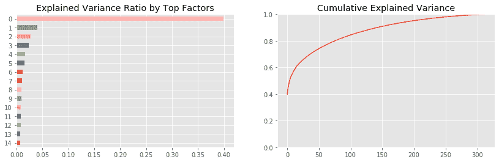

笔记本包含对更广泛的股票横截面和更长的 2000-18 时间段的模拟。它发现，平均而言，500 支随机选择的股票的前三个成分解释了 25%，10% 和 5%。

累积图显示了典型的拐点模式，可以帮助确定适当的目标维度，因为它表明附加组件增加的解释价值较少。

我们可以选择前两个主成分来验证它们确实是不相关的：

```py
risk_factors = pd.DataFrame(pca.transform(returns)[:, :2],
columns=['Principal Component 1', 'Principal Component 2'],
index=returns.index)
risk_factors['Principal Component 1'].corr(risk_factors['Principal Component 2'])
7.773256996252084e-15
```

此外，我们可以绘制时间序列以突出每个因子捕捉不同波动性模式的方式：

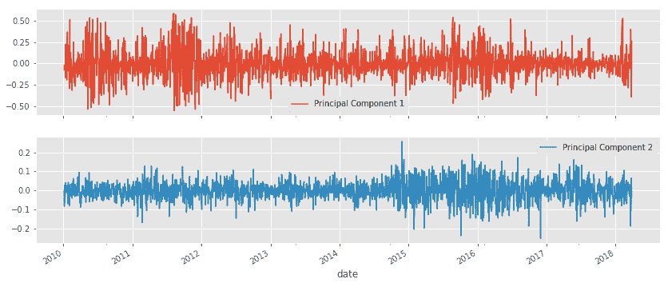

风险因子模型将采用主成分的子集作为特征来预测未来的回报，类似于我们在[第七章](https://cdp.packtpub.com/hands_on_machine_learning_for_algorithmic_trading/wp-admin/post.php?post=572&action=edit#post_28)，*线性模型 - 回归与分类* 中的方法。

# 特征组合

PCA 的另一个应用涉及归一化回报的协方差矩阵。相关矩阵的主要成分以降序捕获资产之间的大部分协变异，并且彼此不相关。此外，我们可以使用标准化的主成分作为投资组合权重。

让我们使用 2010 年至 2018 年期间具有数据的 30 个最大股票来便于表述：

```py
idx = pd.IndexSlice
with pd.HDFStore('../../data/assets.h5') as store:
stocks = store['us_equities/stocks'].marketcap.nlargest(30)
returns = (store['quandl/wiki/prices']
.loc[idx['2010': '2018', stocks.index], 'adj_close']
.unstack('ticker')
.pct_change())
```

我们再次修剪并对回报进行归一化：

```py
normed_returns = scale(returns
       .clip(lower=returns.quantile(q=.025),
        upper=returns.quantile(q=.975),
        axis=1)
.apply(lambda x: x.sub(x.mean()).div(x.std())))
```

与前面的例子一样，删除资产和交易日后，我们剩下 23 个资产和超过 2,000 个交易日。我们估计所有主成分，并发现前两个分别解释了 55.9%和 15.5%的协变异：

```py
pca.fit(cov)
pd.Series(pca.explained_variance_ratio_).head()
0 55.91%
1 15.52%
2 5.36%
3 4.85%
4 3.32%
```

接下来，我们选择并归一化四个最大的组件，使它们总和为`1`，我们可以将它们用作与由所有股票形成的等权重投资组合进行比较的投资组合的权重：

```py
top4 = pd.DataFrame(pca.components_[:4], columns=cov.columns)
eigen_portfolios = top4.div(top4.sum(1), axis=0)
eigen_portfolios.index = [f'Portfolio {i}' for i in range(1, 5)]
```

权重显示出明显的重点 - 例如，**投资组合 3** 重点关注样本中的两个支付处理器 Mastercard 和 Visa，而 **投资组合 2** 则更多地暴露于科技公司：

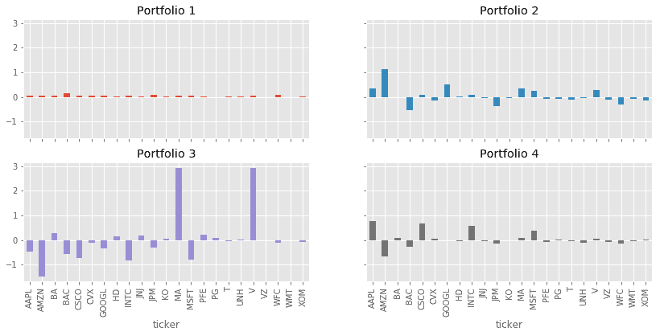

将每个投资组合在样本期间的表现与我们的小样本组成的市场进行比较时，我们发现投资组合 1 的表现非常相似，而其他投资组合捕捉到不同的回报模式：

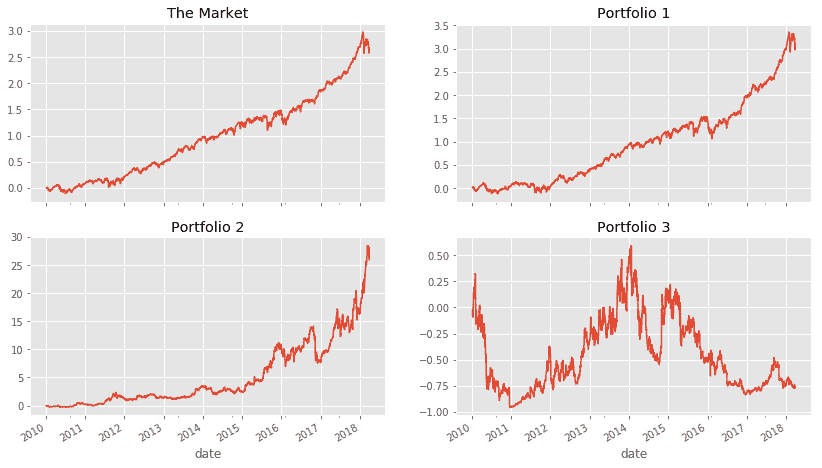

比较每个投资组合的表现

# 流形学习

线性维度降低将原始数据投影到与数据中的信息方向一致的低维超平面上。专注于线性变换简化了计算，并呼应了常见的财务指标，例如 PCA 旨在捕获最大的方差。

然而，线性方法自然会忽略数据中非线性关系反映的信号。在包含图像或文本数据的替代数据集中，这样的关系非常重要。在探索性分析期间检测到这样的关系可以提供关于数据潜在信号内容的重要线索。

相比之下，流形假设强调高维数据通常位于或接近嵌入在高维空间中的低维非线性流形上。本节开头的屏幕截图中显示的二维瑞士卷就是这样一种拓扑结构的示例。

流形学习旨在找到内在维度的流形，然后在这个子空间中表示数据。一个简化的例子是将道路视为三维空间中的一维流形，并使用房子编号作为局部坐标来标识数据点。

几种技术近似一个较低维度的流形。一个例子是**局部线性嵌入**（**LLE**），它是由 Sam Roweis 和 Lawrence Saul 于 2000 年开发的，用于展开上一个屏幕截图中的瑞士卷（参见`manifold_learning_lle`笔记本中的示例）。

对于每个数据点，LLE 确定一定数量的最近邻居，并计算代表每个点的权重，使其表示为其邻居的线性组合。它通过将每个邻域线性投影到较低维度流形上的全局内部坐标上来找到较低维度的嵌入，并且可以被认为是一系列 PCA 应用。

可视化需要降至至少三个维度，可能低于内在维度，并且面临着忠实地表示局部和全局结构的挑战。这个挑战与与维度诅咒相关。虽然球体的体积随着维度数量的增加而呈指数级增长，但用于表示高维数据的较低维度空间却受到了极大的限制。

例如，在 12 维中，可能有 13 个等距离点，但在两个维度中只有三个点可以形成边长相等的三角形。因此，在较低维度准确反映一个点与其高维邻居的距离的情况下，可能会扭曲所有其他点之间的关系。结果就是拥挤问题：为了保持全局距离，局部点可能需要被放置得太近，反之亦然。

接下来的两个部分介绍了一些技术，这些技术在解决复杂数据集的可视化拥挤问题方面取得了进展。我们将使用时尚`MNIST`数据集，这是经典手写数字 MNIST 基准数据的一个更复杂的替代方案，用于计算机视觉。它包含了 60,000 张训练图像和 10,000 张测试图像，涵盖了 10 个类别的时尚物品（见下面的示例）：

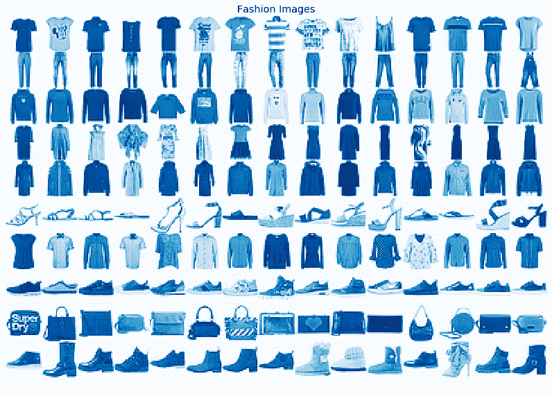

这些数据的流形学习算法的目标是检测类别是否位于不同的流形上，以便促进它们的识别和区分。

# t-SNE

t-分布随机邻域嵌入是由劳伦斯·范德马滕（Laurens van der Maaten）和杰夫·辛顿（Geoff Hinton）于 2010 年开发的获奖算法，用于检测高维数据中的模式。它采用概率、非线性方法来定位位于几个不同但相关的低维流形上的数据。

该算法强调将低维度中的相似点放在一起，而不是保持高维度中相距较远的点之间的距离，这是由最小化平方距离的算法（如 PCA）产生的结果。

该算法通过将高维距离转换为（条件）概率来进行，其中高概率意味着低距离，并反映了基于相似性对两点进行抽样的可能性。它通过在每个点上定位一个正态分布并计算点和每个邻居的密度来实现这一点，其中困惑度参数控制有效邻居的数量。

在第二步中，它将点排列在低维中，并使用类似计算的低维概率来匹配高维度分布。它通过使用 Kullback-Leibler 散度来衡量分布之间的差异，该散度对于在低维中错误放置相似点施加了很大的惩罚。

低维概率使用具有一个自由度的学生 t 分布，因为它具有更胖的尾部，减少了在高维度中更远的点的错误放置的惩罚，以解决拥挤问题。

以下图表的上面板显示了 t-SNE 如何区分图像类别。更高的困惑度值增加了用于计算局部结构的邻居数量，并逐渐更加强调全局关系：

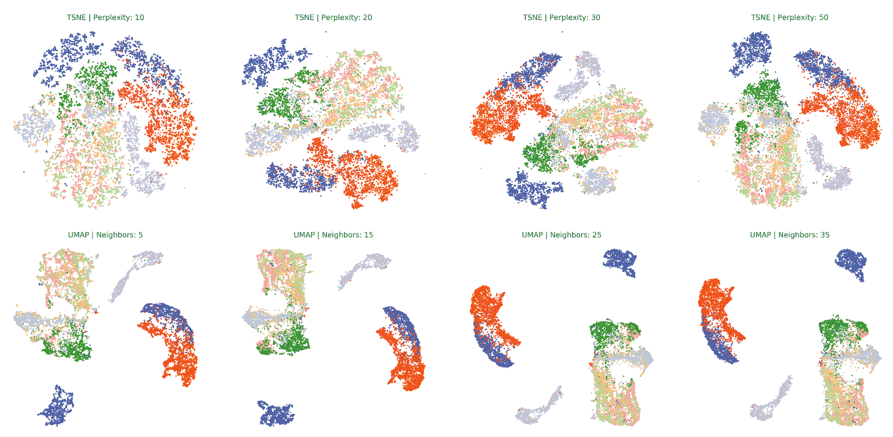

t-SNE 目前是高维数据可视化的最新技术。缺点包括计算复杂度随着点数*n*的平方增长，因为它评估所有成对距离，但随后基于树的实现已将成本降低至*n log n*。

t-SNE 不利于将新数据点投影到低维空间中。压缩输出对于基于距离或基于密度的聚类算法并不是一个非常有用的输入，因为 t-SNE 对待小距离和大距离的方式不同。

# UMAP

统一流形逼近和投影是用于可视化和一般降维的较新算法。它假设数据在局部连接的流形上均匀分布，并使用模糊拓扑来寻找最接近的低维等效物。它使用一个 neighbors 参数，与上面的困惑度类似地影响结果。

它比 t-SNE 更快，因此在大型数据集上的扩展性更好，并且有时比 t-SNE 更好地保留全局结构。它还可以使用不同的距离函数，包括例如余弦相似度，用于衡量词数向量之间的距离。

前一图的底部一行中的四个图表说明了 UMAP 确实将不同的群集分开得更远，而 t-SNE 则提供了更细粒度的对局部结构的了解。

笔记本还包含每个算法的交互式 Plotly 可视化，允许探索标签并确定彼此靠近的对象。

# 聚类

聚类和降维都对数据进行总结。正如刚刚详细讨论的那样，降维通过使用捕捉最相关信息的新特征来表示数据，从而压缩数据。相比之下，聚类算法将现有观察结果分配给由相似数据点组成的子组。

聚类可以通过从连续变量学习的类别的角度更好地理解数据。它还允许根据学习的标准自动对新对象进行分类。相关应用的示例包括层次分类法、医学诊断和客户细分。

或者，可以使用集群表示组，例如使用集群的中点作为学习组的最佳代表。示例应用包括图像压缩。

聚类算法在识别分组方面的策略不同：

+   组合算法选择最一致的观察组合

+   概率建模估计最可能生成群集的分布

+   分层聚类找到一系列嵌套群集，优化任何给定阶段的一致性

算法还在于什么构成一个有用的对象集的概念上有所不同，这需要与数据特征、领域和应用目标相匹配。分组类型包括以下内容：

+   明显分离的各种形状的组

+   基于原型或基于中心的紧凑群集

+   密度为基础的任意形状的群集

+   基于连接性或基于图的群集

聚类算法的重要附加方面包括以下内容：

+   是否需要独占的群集成员身份

+   是否进行硬（二进制）或软（概率）分配

+   是否完整并将所有数据点分配给群集

以下各节介绍了关键算法，包括 k-Means、层次和基于密度的聚类，以及高斯混合模型。`clustering_algos` 笔记本在不同的标记数据集上比较了这些算法的性能，以突出它们的优缺点。它使用互信息（参见第六章，*机器学习过程*）来衡量聚类分配和标签的一致性。

# k-Means 聚类

k-Means 是最著名的聚类算法，最早由贝尔实验室的 Stuart Lloyd 在 1957 年提出。

该算法找到 *K* 个质心，并将每个数据点分配给恰好一个聚类，目标是最小化聚类内变异（称为惯性）。通常使用欧几里德距离，但也可以使用其他度量。k-Means 假设聚类是球形的且大小相等，并忽略特征之间的协方差。

该问题在计算上很困难（np-hard），因为有 *K^N* 种方式将 *N* 个观察结果划分为 *K* 个聚类。标准的迭代算法为给定的 *K* 交付了一个局部最优解，并按以下方式进行：

1.  随机定义 *K* 个聚类中心并将点分配给最近的质心。

1.  重复如下步骤：

    +   对于每个聚类，将质心计算为特征的平均值

    +   将每个观察分配给最近的质心

1.  收敛：分配（或聚类内变异）不再改变。

`kmeans_implementation` 笔记本展示了如何使用 Python 编写该算法，并可视化算法的迭代优化。以下截图突出显示了结果质心如何将特征空间划分为称为**Voronoi**的区域，这些区域划分了聚类：

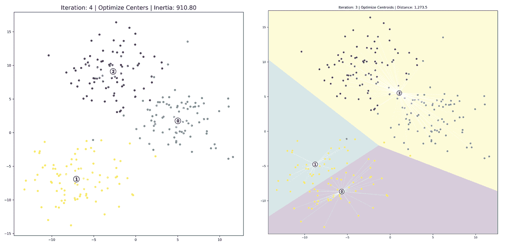

结果对于给定的初始化是最优的，但是不同的起始位置将产生不同的结果。因此，我们从不同的初始值计算多个聚类，并选择最小化聚类内变异的解决方案。

k-Means 需要连续或独热编码的分类变量。距离度量通常对比例尺敏感，因此标准化特征是必要的，以确保它们具有相等的权重。

k-Means 的优点包括其广泛的适用性，快速收敛以及对大型数据的线性可伸缩性，同时产生大小均匀的聚类。

缺点包括：

+   需要调整超参数 *k*

+   无法保证找到全局最优解

+   限制性假设，即聚类是球形的且特征不相关

+   对异常值的敏感性

# 评估聚类质量

聚类质量度量有助于在替代聚类结果中进行选择。`kmeans_evaluation` 笔记本说明了以下选项：

1.  k-Means 目标函数建议我们比较惯性或聚类内变异性的演变。

1.  最初，额外的质心会急剧减少惯性，因为新的聚类提高了整体拟合度。

1.  一旦找到了合适数量的聚类（假设存在），新的质心减少了集群内的方差，因为它们倾向于分裂自然的分组。

1.  因此，当 k 均值发现数据的良好聚类表示时，惯性往往会遵循类似于 PCA 的解释方差比的拐点形状的路径，如下面的屏幕截图所示（请参阅实现细节的笔记本）：

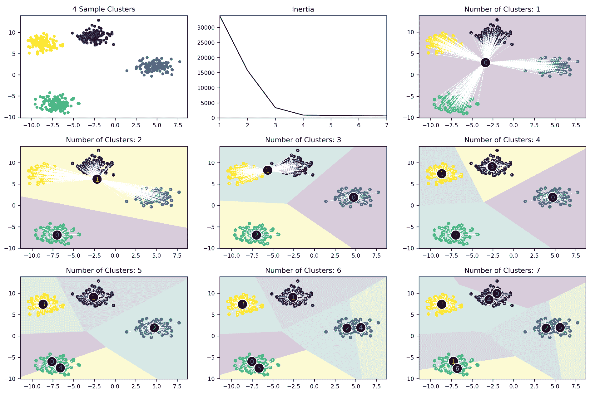

Silhouette 系数提供了对聚类质量的更详细的图像。它回答了一个问题：最近集群中的点与分配的集群中的点有多远？

为此，它比较了簇内平均距离（*a*）与最近簇的平均距离（*b*），并计算了以下分数*s*：

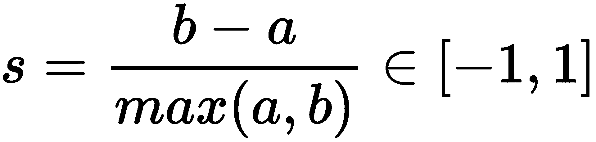

分数可以从*-1*到*1*之间变化，但在实践中负值不太可能出现，因为它们意味着大多数点被分配到错误的聚类中。轮廓分数的一个有用的可视化将每个数据点的值与全局平均值进行比较，因为它突出显示了每个聚类相对于全局配置的一致性。经验法则是避免具有平均样本以下分数的簇。

下面的截图显示了三个和四个聚类的轮廓图节选，前者突出了聚类*1*的不良拟合，因为对全局轮廓分数的次优贡献，而所有四个聚类都有一些值表现出高于平均水平的分数：

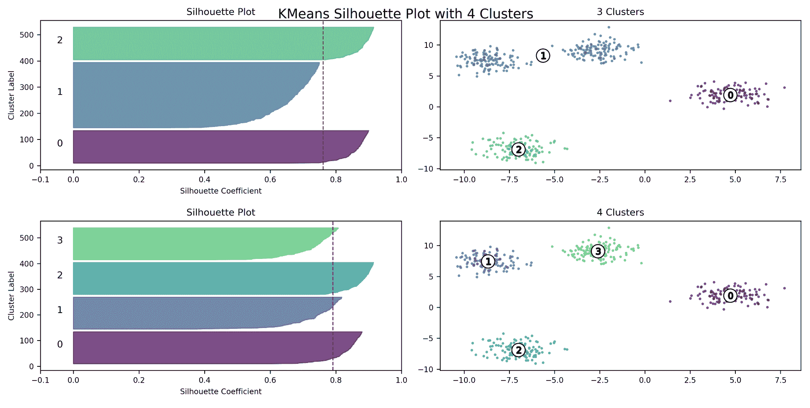

总之，考虑到通常是无监督的性质，有必要变化聚类算法的超参数并评估不同的结果。调整特征的尺度也很重要，特别是当一些特征应该被赋予更高的权重并且因此应该在较大的尺度上进行测量时。

最后，为了验证结果的稳健性，使用数据子集识别是否出现特定模式是一致的。

# 层次聚类

层次聚类避免了需要指定目标聚类数量的需求，因为它假设数据可以成功地被合并成越来越不相似的簇。它不追求全局目标，而是逐渐决定如何产生一系列从单一簇到由单个数据点组成的簇的嵌套簇。

有两种方法：

1.  **凝聚聚类** 自底向上进行，根据相似性顺序合并剩余的两个组

1.  **分裂聚类** 自顶向下工作，并顺序地分裂剩余的集群以产生最独特的子群

两个组都生成*N*-1 个层次级别，并促进在最佳分割数据成同质组的级别上选择聚类。我们将专注于更常见的聚合聚类方法。

聚合聚类算法偏离了个别数据点，并计算包含所有相互距离的相似性矩阵。然后，它经过*N*-1 步，直到不再存在不同的聚类，并且每次更新相似度矩阵以替换已被新聚类合并的元素，以便矩阵逐渐缩小。

虽然分层聚类没有像 k-Means 那样的超参数，但是聚类之间（而不是个别数据点之间）的不相似度度量对聚类结果有重要影响。选项如下所示：

+   **单链接：**两个聚类最近邻之间的距离

+   **完全连接：**各个集群成员之间的最大距离

+   **组平均：**每组平均值之间的距离

+   **沃德方法：**最小化簇内方差

# 可视化 - 树状图

分层聚类提供了对观察之间相似程度的洞察，因为它不断合并数据。从一个合并到下一个的相似度度量的显著变化表明在此之前存在自然的聚类。

树状图将连续的合并可视化为二叉树，将个别数据点显示为叶子，将最终合并显示为树的根。它还显示了相似度如何从底部向顶部单调减少。因此，通过切割树状图选择聚类是自然的。

以下屏幕截图（有关实现细节，请参阅`hierarchical_clustering`笔记本）说明了具有四个类别和三个特征的经典鸢尾花数据集的树状图，使用了先前介绍的四种不同距离度量：

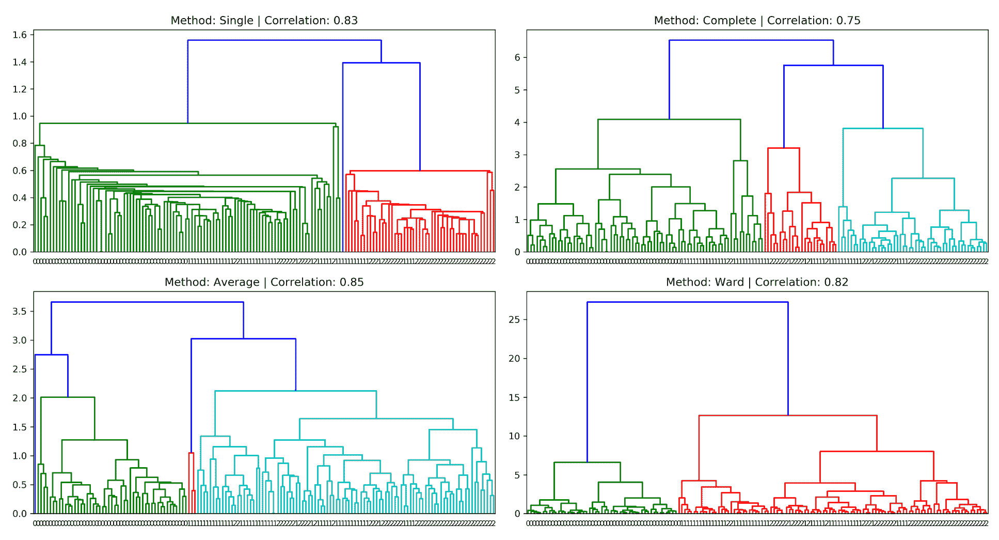

它使用科菲尼特相关性系数评估层次聚类的拟合度，该系数比较了点之间的成对距离和在哪个聚类相似度度量中成对合并发生了。系数为 1 意味着更接近的点总是更早合并。

不同的链接方法产生不同外观的树状图，因此我们不能使用此可视化工具跨方法比较结果。此外，沃德方法，它最小化簇内方差，可能不能恰当地反映方差的变化，而是总方差，这可能会误导。相反，其他质量度量，如科菲尼特相关性，或者与总体目标对齐的惯性等度量，可能更合适。

聚类的优势包括：

+   您无需指定聚类的数量

+   它通过直观的可视化提供了潜在聚类的洞察

+   它产生可以用作分类学的聚类层次结构

+   它可以与 k-Means 结合使用，以减少聚合过程开始时的项目数量

分层聚类的弱点包括：

+   由于大量相似性矩阵更新而导致的计算和内存成本高昂

+   它无法达到全局最优，因为所有合并都是最终的

+   维度诅咒导致噪声大、高维数据困难

# 基于密度的聚类

基于密度的聚类算法根据与其他集群成员的接近程度来分配集群成员资格。它们追求识别任意形状和大小的密集区域的目标。它们不需要指定一定数量的集群，而是依赖于定义邻域大小和密度阈值的参数（请参阅相关代码示例的`density_based_clustering`笔记本）。

# DBSCAN

**具有噪声的基于密度的空间聚类应用**（**DBSCAN**）于 1996 年开发，并且由于在理论和实践中受到的关注，在 2014 年 KDD 会议上获得了*时间测试*奖。

它旨在识别核心和非核心样本，其中前者扩展一个集群，后者是集群的一部分，但没有足够的附近邻居进一步扩展集群。其他样本是异常值，不分配给任何集群。

它使用`eps`参数表示邻域半径和`min_samples`表示核心样本所需的成员数量。它是确定性的和排他的，并且在不同密度的集群和高维数据中存在困难。调整参数以满足必要密度可能具有挑战性，尤其是因为它通常不是恒定的。

# 分层 DBSCAN

分层 DBSCAN 是一个更近期的发展，它假设集群是潜在密度不同的岛屿，以克服刚才提到的 DBSCAN 挑战。它还旨在识别核心和非核心样本。它使用`min_cluster_size`和`min_samples`参数来选择邻域并扩展集群。该算法在多个`eps`值上进行迭代，并选择最稳定的聚类。

除了识别不同密度的集群外，它还提供了数据的密度和层次结构的见解。

以下屏幕截图显示了 DBSCAN 和 HDBSCAN 如何能够识别非常不同形状的集群：

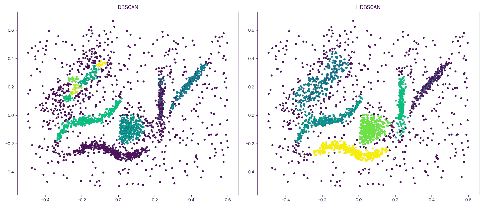

# 高斯混合模型

**高斯混合模型**（**GMM**）是一种生成模型，假设数据是由各种多元正态分布的混合生成的。该算法旨在估计这些分布的均值和协方差矩阵。

它推广了 k-Means 算法：它添加了特征之间的协方差，以便聚类可以是椭圆而不是球体，而质心由每个分布的平均值表示。GMM 算法执行软分配，因为每个点都有可能是任何群集的成员。

# 期望最大化算法

GMM 使用期望最大化算法来识别高斯分布混合的组成成分。目标是从未标记的数据中学习概率分布参数。

该算法按以下方式迭代进行：

1.  初始化——假设随机质心（例如，使用 k-Means）

1.  重复以下步骤，直到收敛（即，分配的更改下降到阈值以下）：

    +   **期望步骤**：软分配——为每个点从每个分布计算概率

    +   **最大化步骤**：调整正态分布参数以使数据点最有可能

以下屏幕截图显示了 Iris 数据集的 GMM 集群成员概率作为等高线：

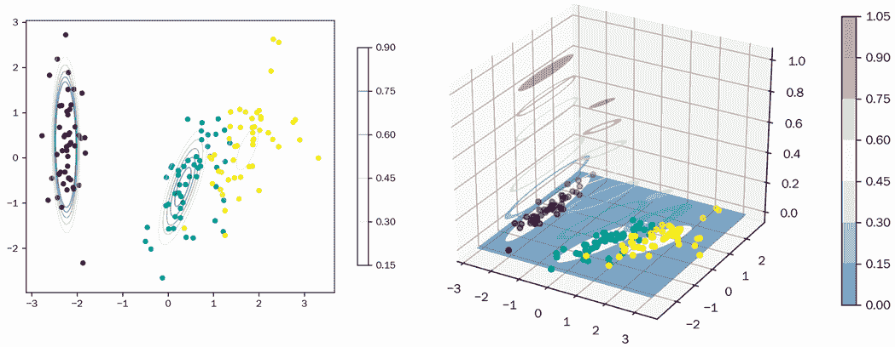

# 分层风险平价

分层风险平价的关键思想是使用协方差矩阵上的分层聚类，以便能够将具有相似相关性的资产组合在一起，并通过在构建投资组合时仅考虑相似资产作为替代品来减少自由度的数量（有关详细信息，请参阅笔记本和`hierarchical_risk_parity`子文件夹中的 Python 文件）。

第一步是计算代表相关资产接近度并满足距离度量要求的距离矩阵。结果矩阵成为 SciPy 分层聚类函数的输入，该函数使用到目前为止讨论过的几种可用方法计算连续的群集：

```py
def get_distance_matrix(corr):
"""Compute distance matrix from correlation;
0 <= d[i,j] <= 1"""
return np.sqrt((1 - corr) / 2)
distance_matrix = get_distance_matrix(corr)
linkage_matrix = linkage(squareform(distance_matrix), 'single')
```

`linkage_matrix`可用作`seaborn.clustermap`函数的输入，以可视化结果的分层聚类。`seaborn`显示的树状图显示了基于相对距离合并单个资产和资产集群的方式：

```py
clustergrid = sns.clustermap(distance_matrix,
method='single',
row_linkage=linkage_matrix,
col_linkage=linkage_matrix,
cmap=cmap, center=0)
sorted_idx = clustergrid.dendrogram_row.reordered_ind
sorted_tickers = corr.index[sorted_idx].tolist()
```

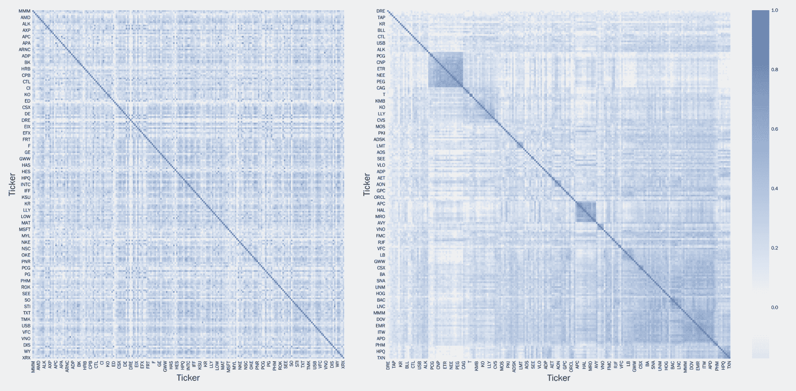

热图

与原始相关矩阵的`seaborn.heatmap`相比，现在在排序数据中有更多结构（右侧面板）。

使用由聚类算法引起的层次结构排序的票据，HRP 现在继续计算一个自上而下的逆方差分配，根据树下的子群的方差依次调整权重：

```py
def get_cluster_var(cov, cluster_items):
    """Compute variance per cluster"""
    cov_ = cov.loc[cluster_items, cluster_items]  # matrix slice
    w_ = get_inverse_var_pf(cov_)
    return (w_ @ cov_ @ w_).item()
```

为此，该算法使用二分搜索将群集的方差分配给其元素，基于它们的相对风险性：

```py
def get_hrp_allocation(cov, tickers):
    """Compute top-down HRP weights"""

    weights = pd.Series(1, index=tickers)
    clusters = [tickers]  # initialize one cluster with all assets

    while len(clusters) > 0:
        # run bisectional search:
        clusters = [c[start:stop] for c in clusters
                    for start, stop in ((0, int(len(c) / 2)),
                                        (int(len(c) / 2), len(c)))
                    if len(c) > 1]
        for i in range(0, len(clusters), 2):  # parse in pairs
            cluster0 = clusters[i]
            cluster1 = clusters[i + 1]

            cluster0_var = get_cluster_var(cov, cluster0)
            cluster1_var = get_cluster_var(cov, cluster1)

            weight_scaler = 1 - cluster0_var / (cluster0_var + cluster1_var)
            weights[cluster0] *= weight_scaler
            weights[cluster1] *= 1 - weight_scaler
    return weights
```

结果的投资组合分配产生总和为`1`的权重，并反映出相关矩阵中存在的结构（有关详细信息，请参阅笔记本）。

# 摘要

在本章中，我们探讨了无监督学习方法，它们允许我们从数据中提取有价值的信号，而无需依赖标签提供的结果信息的帮助。

我们看到了如何使用线性降维方法，如 PCA 和 ICA，从数据中提取不相关或独立的组件，这些组件可以作为风险因子或投资组合权重。我们还涵盖了产生复杂替代数据的最先进可视化的高级非线性流形学习技术。

在第二部分中，我们涵盖了几种根据不同假设生成数据驱动分组的聚类方法。这些分组可以很有用，例如，用于构建将风险平价原则应用于已经按层次聚类的资产的投资组合。

在接下来的三章中，我们将学习关于一种替代数据的关键来源的各种机器学习技术，即文本文档的自然语言处理。
