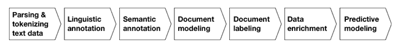
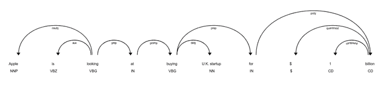
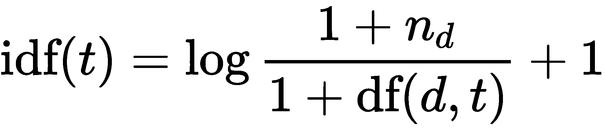
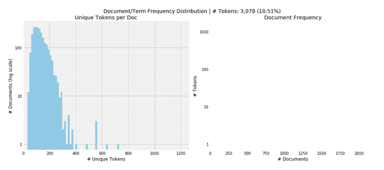
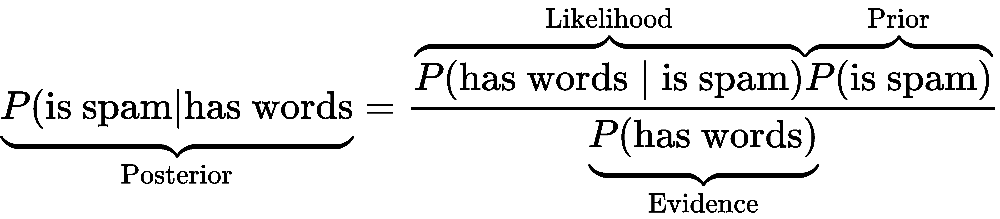
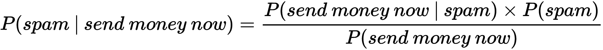
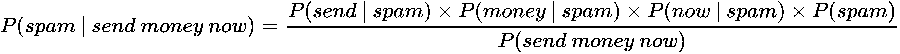
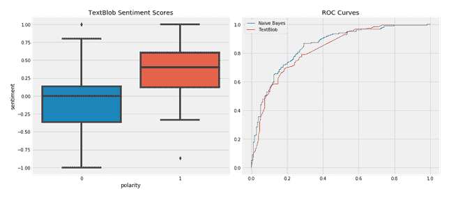
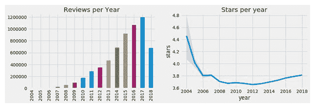

# 处理文本数据

这是专门从文本数据中提取算法交易策略信号的三章中的第一章，使用**自然语言处理**（**NLP**）和**机器学习**（**ML**）。

文本数据在内容上非常丰富，但格式不结构化，因此需要更多的预处理，以便 ML 算法可以提取潜在信号。关键挑战在于将文本转换为算法可使用的数值格式，同时表达内容的语义或含义。我们将介绍几种捕捉语言细微差别的技术，这些差别对于人类来说很容易理解，因此它们可以成为 ML 算法的输入。

在本章中，我们介绍了基本的特征提取技术，重点放在单个语义单位上；即单词或称为**标记**的短语。我们将展示如何通过创建文档-术语矩阵将文档表示为标记计数的向量，这反过来又作为文本分类和情感分析的输入。我们还将介绍朴素贝叶斯算法，该算法在此方面很受欢迎。

在接下来的两章中，我们将借助这些技术，并使用诸如主题建模和词向量嵌入等 ML 算法来捕获更广泛上下文中包含的信息。

特别是，在本章中，我们将介绍以下内容：

+   基本的 NLP 工作流程是什么样的

+   如何使用`spaCy`和`TextBlob`构建多语言特征提取管道

+   如何执行诸如**词性标注**（**POS**）或命名实体识别之类的 NLP 任务

+   如何使用文档-术语矩阵将标记转换为数字

+   如何使用朴素贝叶斯模型对文本进行分类

+   如何执行情感分析

下一节的代码示例在本章的 GitHub 存储库中，参考文献列在主`README`文件中。

# 如何从文本数据中提取特征

鉴于人类使用自然语言进行交流和存储的信息量如此之大，文本数据可能非常有价值——与投资相关的各种数据源范围从正式文件（如公司声明、合同和专利）到新闻、观点和分析研究，甚至包括评论和各种类型的社交媒体帖子和消息。

在线上有大量且多样化的文本数据样本可供探索 NLP 算法的使用，其中许多列在本章的参考文献中。

为了指导我们通过最有效地支持实现此目标的技术和 Python 库的旅程，我们将重点介绍 NLP 挑战，介绍 NLP 工作流程的关键要素，并说明从文本数据到算法交易的 ML 应用。

# NLP 的挑战

将非结构化文本转换为机器可读格式需要进行仔细的预处理，以保留数据的有价值的语义方面。人类如何从语言中获取含义，并理解其内容，目前尚不完全清楚，并且通过机器提高语言理解仍然是一个非常活跃的研究领域。

NLP 是具有挑战性的，因为有效地利用文本数据进行 ML 需要对语言的内部运作以及它所指涉的世界有一定的了解。主要挑战包括以下内容：

+   由于多义性而产生的歧义；即，一个词或短语在不同的上下文中可能有不同的含义（例如，local high-school dropouts cut in half 可能有几种理解方式）。

+   语言的非标准和不断发展的使用，特别是在社交媒体上。

+   使用成语，比如扔手巾。

+   棘手的实体名称，A Bug's Life 在哪里上映？

+   对世界的了解——玛丽和苏是姐妹还是母亲。

# NLP 工作流程

在使用文本数据进行算法交易时，ML 的一个关键目标是从文档中提取信号。文档是来自相关文本数据源的单个样本，例如公司报告、标题或新闻文章或推文。语料库则是文档的集合（复数形式：*corpora*）。

下图列出了将文档转换为可用于训练监督式机器学习算法的数据集的关键步骤，该算法能够进行可行的预测：



**基本技术** 提取称为 **标记** 的文本特征语义单元，并使用语言规则和词典来丰富这些标记的语言和语义注释。**词袋模型** (**BoW**) 使用标记频率来将文档建模为标记向量，这导致了经常用于文本分类的文档-术语矩阵。

**高级方法** 使用 ML 来优化基本技术提取的特征，并生成更具信息量的文档模型。这些包括反映跨文档使用标记的主题模型和捕获标记使用上下文的词向量模型。

在下一节中，我们将更详细地回顾每个步骤所做的关键决策和相关的权衡，并使用 `spaCy` 库来说明它们的实现。以下表格总结了 NLP 流水线的关键任务：

| **特征** | **描述** |
| --- | --- |
| 分词 | 将文本分割为单词、标点符号等。 |
| 词性标注 | 将词的类型分配给标记，如动词或名词。 |
| 依存句法分析 | 标记句法标记依赖，如主语 <=> 宾语。 |
| 词干提取和词形还原 | 分配单词的基本形式：was => be, rats => rat。 |
| 句子边界检测 | 查找并分割单独的句子。 |
| 命名实体识别 | 标记现实世界对象，如人、公司和地点。 |
| 相似度 | 评估单词、文本段和文档之间的相似性。 |

# 解析和标记文本数据

令牌是在给定文档中出现的字符实例，并且应被视为进一步处理的语义单位。词汇是包含在被认为与进一步处理相关的语料库中的标记集。在以下决策中的一个关键权衡是以更大的词汇量准确反映文本来源，这可能会转化为更多的特征和更高的模型复杂性。

在这方面的基本选择涉及如何处理标点和大写，是否使用拼写校正，以及是否排除非常频繁的所谓**停用词**（如*and*或*the*）作为无意义的噪声。

另一个决策是关于将* n*个单个令牌组成的组（一个单个令牌也称为**unigram**）作为语义单位包含在内的。2-gram（或双字）的示例是纽约，而纽约市是 3-gram（或三字）。

目标是创建更准确反映文档含义的标记。决策可以依赖于字典或单个和联合使用的相对频率的比较。包括 n-gram 将增加特征的数量，因为唯一 n-gram 的数量往往比唯一 unigram 的数量高得多，并且可能会增加噪音，除非按频率的显著性进行过滤。

# 语言标注

语言标注包括应用**句法和语法规则**来确定句子的边界，尽管标点符号不明确，并且令牌在句子中的角色用于 POS 标注和依赖解析。它还允许识别词干和词形归并的常见根形式以组合相关词汇：

+   **POS 标注：** 它有助于根据它们的功能消除标记的歧义（当动词和名词具有相同的形式时可能是必要的），这会增加词汇量但可能导致更好的准确性。

+   **依赖解析：** 它识别标记之间的层次关系，通常用于翻译，并且对于需要更高级语言理解的交互应用程序（如聊天机器人）非常重要。

+   **词干提取：** 它使用简单的规则从标记中去除常见的结尾，例如 *s*、*ly*、*ing* 和 *ed*，并将其减少到其词干或根形式。

+   **词形归并：** 它使用更复杂的规则来推导单词的规范根（词形）。它可以检测到不规则的根，例如 better 和 best，并且更有效地压缩词汇，但速度比词干提取慢。这两种方法都通过简化词汇以牺牲语义细微差别为代价。

# 语义标注

**命名实体识别**（**NER**）旨在识别代表感兴趣对象的标记，例如人物、国家或公司。它可以进一步发展为捕获这些实体之间的语义和层次关系的**知识图**。它是那些旨在预测新闻事件或情感影响的应用程序的关键要素。

# 标签

许多 NLP 应用程序从文本中提取的有意义信息中学习预测结果。监督学习需要标签来教会算法真实的输入-输出关系。对于文本数据，建立这种关系可能具有挑战性，可能需要明确的数据建模和收集。

数据建模决策包括如何量化文本文档中隐含的情感，例如电子邮件、转录的采访或推文，或者将研究文档或新闻报道的哪些方面分配给特定结果。

# 使用案例

利用 ML 和文本数据进行算法交易依赖于以直接或间接预测未来价格变动的特征形式提取有意义信息。应用范围从利用新闻的短期市场影响到资产估值驱动因素的长期基本分析。示例包括以下内容：

+   评估产品评论情绪以评估公司的竞争地位或行业趋势

+   检测信用合同中的异常以预测违约的概率或影响

+   新闻影响的预测，包括方向、幅度和受影响的实体

摩根大通（JP Morgan）例如，开发了一个基于 25 万份分析师报告的预测模型，该模型胜过了几个基准指数，并产生了与基于共识 EPS 和推荐变化形成的情绪因素不相关的信号。

# 从文本到标记 - NLP 管道

在本节中，我们将演示如何使用开源 Python 库`spaCy`构建 NLP 管道。`textacy`库构建在`spaCy`之上，并提供对`spaCy`属性和附加功能的简便访问。

有关以下代码示例、安装说明和额外详细信息，请参考`nlp_pipeline_with_spaCy`笔记本。

# spaCy 和 textacy 的 NLP 管道

`spaCy`是一个广泛使用的 Python 库，具有多语言快速文本处理的全面功能集。标记化和注释引擎的使用需要安装语言模型。本章中我们将使用的特征仅需要小型模型；较大的模型还包括我们将在第十五章中介绍的词向量，*Word Embeddings*。

安装并链接后，我们可以实例化一个 `spaCy` 语言模型，然后在文档上调用它。因此，`spaCy` 会产生一个 `doc` 对象，该对象对文本进行标记化并根据可配置的管道组件进行处理，默认情况下包括标签器、解析器和命名实体识别器：

```py
nlp = spacy.load('en')
nlp.pipe_names
['tagger', 'parser', 'ner']
```

让我们使用一个简单的句子说明流程：

```py
sample_text = 'Apple is looking at buying U.K. startup for $1 billion'
doc = nlp(sample_text)
```

# 解析、标记和注释句子

解析后的文档内容可迭代，每个元素由处理流程产生的多个属性组成。以下示例说明了如何访问以下属性：

+   `.text`: 原始词文本

+   `.lemma_`: 词根

+   `.pos_`: 基本词性标签

+   `.tag_`: 详细的词性标签

+   `.dep_`: 标记之间的句法关系或依赖关系

+   `.shape_`: 词的形状，即大写、标点或数字的使用情况

+   `.is alpha`: 检查标记是否是字母数字字符

+   `.is stop`: 检查标记是否在给定语言的常用词列表中

我们遍历每个标记，并将其属性分配给 `pd.DataFrame`：

```py
pd.DataFrame([[t.text, t.lemma_, t.pos_, t.tag_, t.dep_, t.shape_, t.is_alpha, t.is_stop] for t in doc],
             columns=['text', 'lemma', 'pos', 'tag', 'dep', 'shape', 'is_alpha', 'is_stop'])
```

产生以下输出：

| **文本** | **词根** | **词性** | **标签** | **依存关系** | **形状** | **是字母** | **是停用词** |
| --- | --- | --- | --- | --- | --- | --- | --- |
| 苹果 | 苹果 | PROPN | NNP | nsubj | Xxxxx | TRUE | FALSE |
| 是 | 是 | VERB | VBZ | 辅助动词 | xx | TRUE | TRUE |
| 寻找 | 寻找 | VERB | VBG | ROOT | xxxx | TRUE | FALSE |
| 在 | 在 | ADP | IN | prep | xx | TRUE | TRUE |
| 购买 | 购买 | VERB | VBG | pcomp | xxxx | TRUE | FALSE |
| 英国 | 英国 | PROPN | NNP | compound | X.X. | FALSE | FALSE |
| 创业公司 | 创业公司 | NOUN | NN | dobj | xxxx | TRUE | FALSE |
| for | for | ADP | IN | prep | xxx | TRUE | TRUE |
| $ | $ | SYM | $ | 量词修饰符 | $ | FALSE | FALSE |
| 1 | 1 | NUM | CD | compound | d | FALSE | FALSE |
| 十亿 | 十亿 | NUM | CD | pobj | xxxx | TRUE | FALSE |

我们可以使用以下方法在浏览器或笔记本中可视化句法依存：

```py
displacy.render(doc, style='dep', options=options, jupyter=True)
```

结果是一个依存树：



依存树

我们可以使用 `spacy.explain()` 获取属性含义的其他见解，如下所示：

```py
spacy.explain("VBZ")
verb, 3rd person singular present
```

# 批处理文档

现在我们将阅读一组更大的 2,225 篇 BBC 新闻文章（有关数据来源的详细信息，请参阅 GitHub），这些文章属于五个类别，并存储在单独的文本文件中。我们需要执行以下操作：

1.  调用 pathlib 的 `Path` 对象的 `.glob()` 方法。

1.  迭代结果路径列表。

1.  读取新闻文章的所有行，不包括第一行的标题。

1.  将清理后的结果附加到列表中：

```py
files = Path('..', 'data', 'bbc').glob('**/*.txt')
bbc_articles = []
for i, file in enumerate(files):
    _, _, _, topic, file_name = file.parts
    with file.open(encoding='latin1') as f:
        lines = f.readlines()
        body = ' '.join([l.strip() for l in lines[1:]]).strip()
        bbc_articles.append(body)
len(bbc_articles)
2225
```

# 句子边界检测

我们将通过调用 NLP 对象来说明句子检测，对第一篇文章进行批处理：

```py
doc = nlp(bbc_articles[0])
type(doc)
spacy.tokens.doc.Doc
```

`spaCy` 从句法分析树中计算句子边界，因此标点符号和大写字母起着重要但不决定性的作用。因此，边界将与从句边界重合，即使是标点符号不规范的文本也是如此。

我们可以使用`.sents`属性访问解析后的句子：

```py
sentences = [s for s in doc.sents]
sentences[:3]
[Voting is under way for the annual Bloggies which recognize the best web blogs - online spaces where people publish their thoughts - of the year. ,
Nominations were announced on Sunday, but traffic to the official site was so heavy that the website was temporarily closed because of too many visitors.,
Weblogs have been nominated in 30 categories, from the top regional blog, to the best-kept-secret blog.]
```

# 命名实体识别

`spaCy` 使用 `.ent_type_ 属性` 实现命名实体识别：

```py
for t in sentences[0]:
    if t.ent_type_:
        print('{} | {} | {}'.format(t.text, t.ent_type_, spacy.explain(t.ent_type_)))
annual | DATE | Absolute or relative dates or periods
the | DATE | Absolute or relative dates or periods
year | DATE | Absolute or relative dates or periods
```

`textacy` 简化了访问第一篇文章中出现的命名实体的过程：

```py
from textacy.extract import named_entities
entities = [e.text for e in named_entities(doc)]
pd.Series(entities).value_counts()
year                          4
US                            2
South-East Asia Earthquake    2
annual                        2
Tsunami Blog                  2
```

# N-grams

N-gram 结合 *N* 个连续的标记。在 BoW 模型中，N-gram 可以很有用，因为根据文本环境，将像数据科学家这样的内容视为一个单独的标记可能比将其视为两个不同的标记更有意义。

`textacy` 方便查看至少出现 `min_freq` 次的给定长度 *n* 的 `ngrams`：

```py
from textacy.extract import ngrams
pd.Series([n.text for n in ngrams(doc, n=2, min_freq=2)]).value_counts()
East Asia          2
Asia Earthquake    2
Tsunami Blog       2
annual Bloggies    2
```

# spaCy 的流式 API

要通过处理管道传递更多文档，我们可以使用 `spaCy` 的流式 API 如下：

```py
iter_texts = (bbc_articles[i] for i in range(len(bbc_articles)))
for i, doc in enumerate(nlp.pipe(iter_texts, batch_size=50, n_threads=8)):
      assert doc.is_parsed
```

# 多语言自然语言处理

`spaCy` 包括针对英语、德语、西班牙语、葡萄牙语、法语、意大利语和荷兰语的训练语言模型，以及用于 NER 的多语言模型。跨语言使用很简单，因为 API 不会改变。

我们将使用 TED Talk 字幕的平行语料库来说明西班牙语言模型（请参阅数据来源参考的 GitHub 存储库）。为此，我们实例化了两个语言模型：

```py
model = {}
for language in ['en', 'es']:
    model[language] = spacy.load(language)
```

然后我们在每个模型中读取相应的小文本样本：

```py
text = {}
path = Path('../data/TED')
for language in ['en', 'es']:
    file_name = path / 'TED2013_sample.{}'.format(language)
    text[language] = file_name.read_text()
```

句子边界检测使用相同的逻辑，但找到了不同的分解：

```py
parsed, sentences = {}, {}
for language in ['en', 'es']:
    parsed[language] = modellanguage
    sentences[language] = list(parsed[language].sents)
print('Sentences:', language, len(sentences[language]))
Sentences: en 19
Sentences: es 22
```

POS 标记也是同样工作的：

```py
pos = {}
for language in ['en', 'es']:
    pos[language] = pd.DataFrame([[t.text, t.pos_, spacy.explain(t.pos_)] for t in sentences[language][0]],
    columns=['Token', 'POS Tag', 'Meaning'])
pd.concat([pos['en'], pos['es']], axis=1).head()
```

结果是英文和西班牙文档的并排标记注释：

| **标记** | **POS 标记** | **含义** | **标记** | **POS 标记** | **含义** |
| --- | --- | --- | --- | --- | --- |
| 那里 | ADV | 副词 | 存在 | VERB | 动词 |
| s | VERB | 动词 | 一个 | DET | 定冠词 |
| 一个 | DET | 定冠词 | 狭窄的 | ADJ | 形容词 |
| 紧密的 | ADJ | 形容词 | 和 | CONJ | 连词 |
| 和 | CCONJ | 并列连词 | 令人惊讶的 | ADJ | 形容词 |

下一节介绍如何使用解析和注释的标记构建文档-术语矩阵，该矩阵可用于文本分类。

# 使用 TextBlob 进行自然语言处理

`TextBlob` 是一个提供简单 API 用于常见 NLP 任务的 Python 库，它基于 **自然语言工具包** (**NLTK**) 和 Pattern 网络挖掘库。`TextBlob` 简化了 POS 标记、名词短语提取、情感分析、分类、翻译等任务。

为了说明使用 `TextBlob`，我们从 BBC 体育文章中抽样一篇标题为 *Robinson ready for difficult task* 的文章。与 `spaCy` 和其他库类似，第一步是通过 `TextBlob` 对象表示的管道将文档传递，以分配各种任务所需的注释（请参阅此部分的 `nlp_with_textblob` 笔记本）：

```py
from textblob import TextBlob
article = docs.sample(1).squeeze()
parsed_body = TextBlob(article.body)
```

# 词干提取

要执行词干提取，我们从 `nltk` 库实例化了 `SnowballStemmer`，在每个标记上调用其 `.stem()` 方法，并显示修改后的标记：

```py
from nltk.stem.snowball import SnowballStemmer
stemmer = SnowballStemmer('english')
[(word, stemmer.stem(word)) for i, word in enumerate(parsed_body.words)
    if word.lower() != stemmer.stem(parsed_body.words[i])]
('Andy', 'andi'),
('faces', 'face'),
('tenure', 'tenur'),
('tries', 'tri'),
('winning', 'win'),
```

# 情感极性和主观性

`TextBlob` 使用 Pattern 库提供的字典为解析的文档提供极性和主观性估计。这些字典将产品评论中经常出现的形容词映射到从 -1 到 +1（负面 ↔ 正面）的情感极性分数和类似的主观性分数（客观 ↔ 主观）。

`.sentiment` 属性为每个相关标记提供平均值，而 `.sentiment_assessments` 属性列出了每个标记的基础值（请参见笔记本）：

```py
parsed_body.sentiment
Sentiment(polarity=0.088031914893617, subjectivity=0.46456433637284694)
```

# 从标记到数字 - 文档-术语矩阵

在本节中，我们首先介绍 BoW 模型如何将文本数据转换为允许使用距离比较文档的数字向量空间表示法。然后，我们继续说明如何使用 sklearn 库创建文档-术语矩阵。

# BoW 模型

BoW 模型根据文档中包含的词或标记的频率来表示文档。每个文档都成为一个向量，每个向量在词汇表中都有一个条目，反映了该标记与文档的相关性。

给定词汇表，文档-术语矩阵很容易计算。然而，它也是一个粗略的简化，因为它抽象了单词顺序和语法关系。尽管如此，它通常很快就能在文本分类中取得良好的结果，因此是一个非常有用的起点。

下图（右边的那个）说明了该文档模型如何将文本数据转换为具有数字条目的矩阵，其中每行对应于一个文档，每列对应于词汇表中的一个标记。生成的矩阵通常是非常高维且稀疏的；也就是说，它包含许多零条目，因为大多数文档只包含总词汇表的一小部分：

![

结果矩阵

有几种方法可以衡量标记的向量条目以捕捉其与文档的相关性。我们将说明如何使用 sklearn 使用二进制标志，这些标志指示存在或不存在、计数以及加权计数，这些加权考虑了语料库中所有文档中的词频的差异：

# 测量文档的相似性

将文档表示为词向量将每个文档分配到由词汇表创建的向量空间中的位置。在该空间中将向量条目解释为笛卡尔坐标，我们可以使用两个向量之间的角度来衡量它们的相似性，因为指向相同方向的向量包含相同的词及相同的频率权重。

前面的图表（右边的那个）简化了二维中表示的文档向量 *d[1]* 与查询向量（搜索词组或另一个文档） *q* 之间距离的计算。

**余弦相似度**等于两个向量之间的夹角的余弦。它将角度大小转换为一个范围为 [0, 1] 的数字，因为所有向量条目都是非负的标记权重。值为 1 意味着两个文档在其标记权重方面是相同的，而值为 0 意味着两个文档只包含不同的标记。

如图所示，角的余弦等于向量的点积；也就是说，它们的坐标的和乘积，除以它们的长度的乘积，由每个向量的欧几里得范数测量。

# 使用 sklearn 创建文档-术语矩阵

scikit-learn 预处理模块提供了两个工具来创建文档-术语矩阵。`CountVectorizer` 使用二进制或绝对计数来衡量每个文档 *d* 和标记 *t* 的**词频** *tf(d, t)*。

相反，`TfidFVectorizer` 通过**逆文档频率**（**idf**）对（绝对）词频进行加权。因此，出现在更多文档中的术语将获得比在给定文档中具有相同频率但在所有文档中出现频率较低的标记更低的权重。具体来说，使用默认设置，对于文档-术语矩阵的 *tf-idf(d, t)* 条目计算为 *tf-idf(d, t) = tf(d, t) x idf(t)*：



这里 *n[d]* 是文档数，*df(d, t)* 是术语 *t* 的文档频率。每个文档的结果 tf-idf 向量相对于它们的绝对或平方总和进行了归一化（有关详细信息，请参阅 `sklearn` 文档）。tf-idf 度量最初用于信息检索以排名搜索引擎结果，并且随后被证明对于文本分类或聚类非常有用。

这两个工具使用相同的接口，并在向量化文本之前对文档列表执行标记化和进一步的可选预处理，以生成标记计数来填充文档-术语矩阵。

影响词汇量大小的关键参数包括以下内容：

+   `stop_words`：使用内置或提供要排除的（常见）单词列表

+   `ngram_range`：在由 (*n[min]*, *n[max]*) 元组定义的 *n* 范围内包含 n-gram

+   `lowercase`：相应地转换字符（默认为 `True`）

+   `min_df` / `max_df`：忽略在较少/较多（`int`）或更小/更大（如果是 `float` [0.0,1.0]）的文档中出现的单词

+   `max_features`：相应地限制词汇表中的标记数

+   `binary`：将非零计数设置为 1 `True`

有关以下代码示例和额外详细信息，请参阅 `document_term_matrix` 笔记本。我们再次使用 2,225 篇 BBC 新闻文章进行说明。

# 使用 CountVectorizer

笔记本包含一个交互式可视化，探索`min_df`和`max_df`设置对词汇量大小的影响。我们将文章读入 DataFrame，将`CountVectorizer`设置为生成二进制标志并使用所有标记，并调用其`.fit_transform()`方法生成文档-词矩阵：

```py
binary_vectorizer = CountVectorizer(max_df=1.0,
                                    min_df=1,
                                    binary=True)

binary_dtm = binary_vectorizer.fit_transform(docs.body)
<2225x29275 sparse matrix of type '<class 'numpy.int64'>'
   with 445870 stored elements in Compressed Sparse Row format>
```

输出是一个`scipy.sparse`矩阵，以行格式有效地存储了`445870`个非零条目中的小部分（<0.7%），其中有`2225`个（文档）行和`29275`个（标记）列。

# 可视化词汇分布

可视化显示，要求标记在至少 1%且少于 50%的文档中出现将词汇限制在几乎 30,000 个标记的约 10%左右。

这留下了每个文档略多于 100 个独特标记的模式（左面板），右面板显示了剩余标记的文档频率直方图：



文档/词频分布

# 查找最相似的文档

`CountVectorizer`的结果让我们可以使用`scipy.spatial.distance`模块提供的`pdist()`函数来找到最相似的文档。它返回一个压缩的距离矩阵，其中的条目对应于方阵的上三角形。我们使用`np.triu_indices()`将最小距离的索引转换为相应于最接近的标记向量的行和列索引：

```py
m = binary_dtm.todense() # pdist does not accept sparse format
pairwise_distances = pdist(m, metric='cosine')
closest = np.argmin(pairwise_distances) # index that minimizes distance
rows, cols = np.triu_indices(n_docs) # get row-col indices
rows[closest], cols[closest]
(11, 75)
```

文章编号`11`和`75`在余弦相似性上最接近，因为它们共享了 58 个标记（请参阅笔记本）：

| **主题** | 技术 | 技术 |
| --- | --- | --- |
| **标题** | 在您工作时观看的软件 | 打败拨号诈骗者的 BT 程序 |
| **正文** | 软件不仅可以监视 PC 上执行的每个按键和操作，而且还可以作为法律约束证据使用。担心网络犯罪和破坏已促使许多雇主考虑监视员工。 | BT 正在推出两项计划，以帮助打败流氓拨号诈骗，这可能会使拨号上网用户损失数千。从五月开始，拨号上网用户将能够下载免费软件，以阻止计算机使用不在用户预先批准名单上的号码。 |

`CountVectorizer`和`TfidFVectorizer`都可以与`spaCy`一起使用；例如，执行词形还原并在标记化过程中排除某些字符，我们使用以下命令：

```py
nlp = spacy.load('en')
def tokenizer(doc):
    return [w.lemma_ for w in nlp(doc) 
                if not w.is_punct | w.is_space]
vectorizer = CountVectorizer(tokenizer=tokenizer, binary=True)
doc_term_matrix = vectorizer.fit_transform(docs.body)
```

请查看笔记本以获取更多详细信息和更多示例。

# TfidFTransformer 和 TfidFVectorizer

`TfidfTransfomer`从文档-词矩阵中的标记计数计算 tf-idf 权重，例如由`CountVectorizer`生成的矩阵。

`TfidfVectorizer`一次执行两个计算。它为`CountVectorizer`API 添加了一些控制平滑行为的参数。

对于一个小的文本样本，TFIDF 计算的工作方式如下：

```py
sample_docs = ['call you tomorrow',
               'Call me a taxi',
               'please call me... PLEASE!']
```

我们像刚才一样计算词频：

```py
vectorizer = CountVectorizer()
tf_dtm = vectorizer.fit_transform(sample_docs).todense()
tokens = vectorizer.get_feature_names()
term_frequency = pd.DataFrame(data=tf_dtm,
                             columns=tokens)

  call  me  please  taxi  tomorrow  you
0     1   0       0     0         1    1
1     1   1       0     1         0    0
2     1   1       2     0         0    0
```

文档频率是包含该标记的文档数量：

```py
vectorizer = CountVectorizer(binary=True)
df_dtm = vectorizer.fit_transform(sample_docs).todense().sum(axis=0)
document_frequency = pd.DataFrame(data=df_dtm,
                                  columns=tokens)
   call  me  please  taxi  tomorrow  you
0     3   2       1     1         1    1
```

tf-idf 权重是这些值的比率：

```py
tfidf = pd.DataFrame(data=tf_dtm/df_dtm, columns=tokens)
   call   me  please  taxi  tomorrow  you
0  0.33 0.00    0.00  0.00      1.00 1.00
1  0.33 0.50    0.00  1.00      0.00 0.00
2  0.33 0.50    2.00  0.00      0.00 0.00
```

# 平滑的效果

为了避免零除法，`TfidfVectorizer`对文档和词项频率使用平滑处理：

+   `smooth_idf`：将文档频率加`1`，就像额外的文档包含词汇表中的每个标记一样，以防止零除法。

+   `sublinear_tf`：应用次线性`tf`缩放；换句话说，用`1 + log(tf)`替换`tf`

与标准化权重结合使用时，结果略有不同：

```py
vect = TfidfVectorizer(smooth_idf=True,
                      norm='l2',  # squared weights sum to 1 by 
                                    document
                      sublinear_tf=False,  # if True, use 1+log(tf)
                      binary=False)
pd.DataFrame(vect.fit_transform(sample_docs).todense(),
            columns=vect.get_feature_names())

   call   me  please  taxi  tomorrow  you
0  0.39 0.00    0.00  0.00      0.65 0.65
1  0.43 0.55    0.00  0.72      0.00 0.00
2  0.27 0.34    0.90  0.00      0.00 0.00
```

# 如何使用 TfidFVectorizer 总结新闻文章

由于它们能够分配有意义的标记权重，TFIDF 向量也用于总结文本数据。例如，Reddit 的`autotldr`功能基于类似的算法。请参阅笔记本，了解使用 BBC 文章的示例。

# 文本预处理 - 回顾

我们在本节介绍的大量处理自然语言以在机器学习模型中使用的技术是必要的，以应对这种高度非结构化数据源的复杂性质。设计良好的语言特征工程既具有挑战性又具有回报，可以说是解锁文本数据中隐藏的语义价值的最重要的一步。

在实践中，经验有助于我们选择去除噪声而不是信号的转换，但可能仍然需要交叉验证和比较不同预处理选择组合的性能。

# 文本分类和情感分析

一旦文本数据使用前面讨论的自然语言处理技术转换为数值特征，文本分类就像任何其他分类任务一样。

在本节中，我们将这些预处理技术应用于新闻文章、产品评论和 Twitter 数据，并教您各种分类器，以预测离散新闻类别、评论分数和情感极性。

首先，我们将介绍朴素贝叶斯模型，这是一种概率分类算法，适用于袋装词模型产生的文本特征。

本节的代码示例在`text_classification`笔记本中。  

# 朴素贝叶斯分类器

朴素贝叶斯算法非常受欢迎，用于文本分类，因为低计算成本和内存需求便于在非常大的、高维的数据集上进行训练。它的预测性能可以与更复杂的模型竞争，提供了一个良好的基准，并以成功的垃圾邮件检测而闻名。

该模型依赖于贝叶斯定理（参见第九章，*贝叶斯机器学习*）和各种特征独立于结果类别的假设。换句话说，对于给定的结果，知道一个特征的值（例如文档中标记的存在）不会提供有关另一个特征值的任何信息。

# 贝叶斯定理复习

贝叶斯定理表达了一个事件的条件概率（例如，一封电子邮件是垃圾邮件而不是良性的垃圾邮件）给定另一个事件（例如，电子邮件包含某些词）如下：



**后验**概率，即一封电子邮件实际上是垃圾邮件的概率，给定它包含某些词，取决于三个因素的相互作用：

+   一封电子邮件是垃圾邮件的**先验**概率

+   在垃圾邮件中遇到这些词的**似然性**

+   **证据**；即在电子邮件中看到这些词的概率

为了计算后验概率，我们可以忽略证据，因为它对所有结果（垃圾邮件与非垃圾邮件）都是相同的，而且无条件先验可能很容易计算。

然而，对于一个相当大的词汇表和一个实际的电子邮件语料库，似然性提出了不可逾越的挑战。原因在于单词的组合爆炸，这些单词在不同文档中是否共同出现，从而阻止了计算概率表并为似然性赋值所需的评估。

# 条件独立性假设

使得模型既可行又有理由称其为朴素的假设是，特征在结果条件下是独立的。为了说明，让我们对一个包含三个词*Send money now*的电子邮件进行分类，这样贝叶斯定理就变成了以下形式：



形式上，三个词条件独立的假设意味着观察到*send*的概率不受其他词存在的影响，假设邮件是垃圾邮件；换句话说，*P(send | money, now, spam) = P(send | spam)*。因此，我们可以简化似然函数：



使用朴素条件独立性假设，分子中的每个项都可以直接从训练数据的相对频率中计算得出。分母在类别间是常数，当需要比较后验概率而不是校准时可以忽略。先验概率在因素数量增加（即特征）时变得不那么相关。

总之，朴素贝叶斯模型的优势在于训练和预测速度快，因为参数数量与特征数量成线性关系，它们的估计具有封闭形式的解（基于训练数据频率），而不是昂贵的迭代优化。它还直观且具有一定的可解释性，不需要超参数调整，并且在有足够信号的情况下相对不太受无关特征的影响。

然而，当独立假设不成立，文本分类依赖于特征的组合或特征相关时，模型的表现会很差。

# 新闻文章分类

我们从以前阅读的 BBC 文章中使用朴素贝叶斯模型对新闻文章进行分类的示例开始，以获得一个包含来自五个类别的 2,225 篇文章的 DataFrame：

```py
RangeIndex: 2225 entries, 0 to 2224
Data columns (total 3 columns):
topic 2225 non-null object
heading 2225 non-null object
body 2225 non-null object
```

# 训练和评估多项式朴素贝叶斯分类器

我们将数据拆分为默认的 75:25 训练-测试集，确保测试集类别与训练集类别密切相似：

```py
y = pd.factorize(docs.topic)[0] # create integer class values
X = docs.body
X_train, X_test, y_train, y_test = train_test_split(X, y, random_state=1, stratify=y)
```

我们继续从训练集中学习词汇，并使用默认设置的`CountVectorizer`转换两个数据集，以获得近 26,000 个特征：

```py
vectorizer = CountVectorizer()
X_train_dtm = vectorizer.fit_transform(X_train)
X_test_dtm = vectorizer.transform(X_test)
X_train_dtm.shape, X_test_dtm.shape
((1668, 25919), (557, 25919))
```

训练和预测遵循标准的`sklearn`拟合/预测接口：

```py
nb = MultinomialNB()
nb.fit(X_train_dtm, y_train)
y_pred_class = nb.predict(X_test_dtm)
```

我们使用`准确性`评估多类别预测，并发现默认分类器达到了近 98% 的准确率：

```py
accuracy_score(y_test, y_pred_class)
0.97666068222621
```

# 情感分析

情感分析是自然语言处理和机器学习在交易中最受欢迎的用途之一，因为对资产或其他价格驱动因素的正面或负面观点可能会影响收益。

通常，情感分析的建模方法依赖于词典，例如`TextBlob`库，或者在特定领域的结果上训练的模型。后者更可取，因为它允许更有针对性的标记；例如，将文本特征与随后的价格变化联系起来，而不是间接的情感分数。

我们将使用具有二进制极性标签的 Twitter 数据集和具有五点结果量表的大型 Yelp 商业评论数据集说明情感分析的机器学习。

# Twitter 数据

我们使用的数据集包含自 2009 年以来的 1.6 百万条训练推文和 350 条测试推文，这些推文具有经过算法分配的二进制正面和负面情感分数，分布相对均匀（有关更详细的数据探索，请参阅相关笔记本）。

# 多项式朴素贝叶斯

我们按照以下方式创建一个包含 934 个标记的文档-术语矩阵：

```py
vectorizer = CountVectorizer(min_df=.001, max_df=.8, stop_words='english')
train_dtm = vectorizer.fit_transform(train.text)
<1566668x934 sparse matrix of type '<class 'numpy.int64'>'
   with 6332930 stored elements in Compressed Sparse Row format>
```

然后我们像以前一样训练`MultinomialNB`分类器，并预测测试集：

```py
nb = MultinomialNB()
nb.fit(train_dtm, train.polarity)
predicted_polarity = nb.predict(test_dtm)
```

结果达到了超过 77.5% 的准确率：

```py
accuracy_score(test.polarity, y_pred_class)
0.7768361581920904
```

# 与 TextBlob 情感分数的比较

我们还获取了推文的`TextBlob`情感分数，并注意到（请参见以下左侧图表），正面测试推文获得了明显更高的情感估计。然后我们使用`MultinomialNB`模型和`.predict_proba()`方法来计算预测概率，并使用相应的曲线下面积（请参见以下右侧图表）比较两个模型：



TextBlob 情感分数

在这种情况下，朴素贝叶斯模型优于`TextBlob`。

# 商业评论 - Yelp 数据集挑战

最后，我们将情感分析应用于规模更大的 Yelp 商业评论数据集，其中包含五个结果类别。数据由多个文件组成，其中包含关于企业、用户、评论和 Yelp 鼓励数据科学创新的其他方面的信息。

我们将使用在 2010 年至 2018 年期间产生的约六百万条评论（详见相关笔记本）。以下图表显示每年的评论数量和平均星级：



表示每年评论数量和平均星级的图表

除了评论文本产生的文本特征外，我们还将使用提交的评论或关于用户的其他信息。

我们将在 2017 年之前的数据上训练各种模型，并使用 2018 年作为测试集。

# 基准准确率

使用最常见的星级数（=5）来预测测试集，我们实现了接近 52%的准确率：

```py
test['predicted'] = train.stars.mode().iloc[0]
accuracy_score(test.stars, test.predicted)
0.5196950594793454
```

# 多项式朴素贝叶斯模型

接下来，我们使用具有默认设置的`CountVectorizer`生成的文档-术语矩阵来训练朴素贝叶斯分类器：

```py
nb = MultinomialNB()
nb.fit(train_dtm,train.stars)
predicted_stars = nb.predict(test_dtm)
```

预测在测试集上产生了 64.7%的准确率，比基准提高了 24.4%：

```py
accuracy_score(test.stars, predicted_stars)
0.6465164206691094
```

# 一对多逻辑回归

我们继续训练一对多逻辑回归，该模型对每个类别训练一个模型，同时将其余类别视为负类，并使用不同的模型预测每个类别的概率。

仅使用文本特征，我们按以下方式训练和评估模型：

```py
logreg = LogisticRegression(C=1e9)
logreg.fit(X=train_dtm, y=train.stars)
y_pred_class = logreg.predict(test_dtm)
```

模型的准确率显著提高至 73.6%：

```py
accuracy_score(test.stars, y_pred_class)
0.7360498864740219
```

# 结合文本和数值特征

数据集包含各种数值特征（有关实施细节，请参阅相关笔记本）。

向量化器生成`scipy.sparse`矩阵。要将向量化的文本数据与其他特征结合起来，我们首先需要将其转换为稀疏矩阵；许多 sklearn 对象和其他库（如 LightGBM）可以处理这些非常节省内存的数据结构。将稀疏矩阵转换为密集的 NumPy 数组会导致内存溢出的风险。

大多数变量都是分类变量，因此我们使用一位有效编码（one-hot encoding），因为我们有一个相当大的数据集来容纳特征的增加。

我们将编码的数值特征转换并与文档-术语矩阵相结合：

```py
train_numeric = sparse.csr_matrix(train_dummies.astype(np.int8))
train_dtm_numeric = sparse.hstack((train_dtm, train_numeric))
```

# 多项式逻辑回归

逻辑回归还提供了一种多项式训练选项，比一对多实现更快且更准确。我们使用`lbfgs`求解器（有关详细信息，请参阅 GitHub 上链接的 sklearn 文档）：

```py
multi_logreg = LogisticRegression(C=1e9, multi_class='multinomial', 
                                  solver='lbfgs')
multi_logreg.fit(train_dtm_numeric.astype(float), train.stars)
y_pred_class = multi_logreg.predict(test_dtm_numeric.astype(float))
```

此模型将性能提高至 74.6%的准确率：

```py
accuracy_score(test.stars, y_pred_class)
0.7464488070176475
```

在这种情况下，调整正则化参数`C`并没有带来非常显著的改善（请参阅笔记本）。

# 梯度提升机

为了说明目的，我们还训练了一个具有默认设置和`multiclass`目标的 LightGBM 梯度提升树集成：

```py
param = {'objective':'multiclass', 'num_class': 5}
booster = lgb.train(params=param,
                    train_set=lgb_train,
                    num_boost_round=500,
                    early_stopping_rounds=20,
                    valid_sets=[lgb_train, lgb_test])
```

基本设置并没有改善多项式逻辑回归，但进一步的参数调整仍然是一个未使用的选项：

```py
y_pred_class = booster.predict(test_dtm_numeric.astype(float))
accuracy_score(test.stars, y_pred_class.argmax(1) + 1)
0.738665855696524
```

# 摘要

在本章中，我们探讨了许多技术和选项来处理非结构化数据，目的是提取语义上有意义的数字特征，以供机器学习模型使用。

我们介绍了基本的标记化和注释流程，并使用 spaCy 和 TextBlob 在多种语言中说明了其实现方式。我们在这些结果的基础上构建了一个基于词袋模型的文档模型，以将文档表示为数值向量。我们学习了如何优化预处理流程，然后使用向量化的文本数据进行分类和情感分析。

在剩下的两章中，我们将学习如何使用无监督学习来总结文本，以识别潜在主题（在下一章中），并研究将单词表示为反映单词使用上下文的向量的技术，这些技术已经被成功地用于为各种分类任务提供更丰富的文本特征。
