# 主题建模

在上一章中，我们使用词袋模型将非结构化文本数据转换为数值格式。 此模型抽象出了单词顺序，并将文档表示为单词向量，其中每个条目表示单词对文档的相关性。

产生的**文档-术语矩阵**（**DTM**）（您可能还会遇到转置的术语-文档矩阵）可用于基于其标记内容将文档与其他文档或查询向量进行比较，并快速找到草堆中的一根针或相应地对文档进行分类。

但是，这个文档模型既是高维的又是非常稀疏的。 因此，它几乎不能总结内容或更接近理解它是关于什么的。 在本章中，我们将使用无监督的机器学习形式的主题建模来从文档中提取隐藏的主题。 这些主题可以以自动化方式为大量文档提供详细的见解。 它们非常有用，可以了解草堆本身，并允许以主题和文档的关联程度进行简明的文档标记。

主题模型允许提取复杂的可解释文本特征，可以以各种方式用于从大量文档中提取交易信号。 它们加速了文档的审阅，帮助识别和聚类相似的文档，并且可以被注释为预测建模的基础。 应用包括在公司披露、收入电话成绩单、客户评论或合同中识别关键主题，使用例如情感分析或直接标记与随后的资产回报相关联。

更具体地说，在这一章中，我们将涵盖以下主题：

+   主题建模实现了什么，为什么重要，以及它如何发展

+   **潜在语义索引**（**LSI**）如何降低 DTM 的维度

+   **概率隐含语义分析**（**pLSA**）如何使用生成模型提取主题

+   **潜在狄利克雷分配**（**LDA**）如何改进 pLSA 以及为什么它是最流行的主题模型

+   如何可视化和评估主题建模结果

+   如何使用 sklearn 和 gensim 实现 LDA

+   如何将主题建模应用于收入电话和 Yelp 商业评论的集合

下一节的代码示例位于 GitHub 存储库的目录中，主 README 文件中列出了参考资料。

# 学习潜在主题：目标和方法

主题建模旨在发现跨文档的隐藏主题或主题，捕获超越个别单词的语义信息。 它旨在解决从文本数据中学习的机器学习算法的一个关键挑战，即超越已被写成的词汇水平，到预期的语义水平。 生成的主题可以用于根据它们与各种主题的关联来注释文档。

换句话说，主题建模旨在自动总结大量文档以促进组织和管理，以及搜索和推荐。同时，它可以使得人类能够理解文档的程度，以至于可以解释主题的描述。

主题模型旨在解决可能困扰词袋模型的维度诅咒。基于高维稀疏向量的文档表示可以使相似性度量变得嘈杂，导致不准确的距离测量和文本分类模型的过拟合。

此外，词袋模型忽略了词序并且丢失了语境以及语义信息，因为它无法捕捉同义词（几个词具有相同的含义）和多义词（一个词具有多个含义）。因此，当文档没有按照用于搜索或比较的术语进行索引时，文档检索或相似性搜索可能会错过要点。

这些缺陷引发了这个问题：我们如何对促进与文本数据更有生产性的交互的含义主题进行建模和学习？

# 从线性代数到分层概率模型

主题模型最初尝试改进矢量空间模型（在 1970 年代中期开发）的努力应用线性代数来降低文档-术语矩阵的维度。这种方法类似于我们在《第十二章》中讨论的主成分分析算法，*无监督学习*，关于无监督学习。虽然有效，但在缺乏基准模型的情况下评估这些模型的结果是困难的。

作为回应，出现了概率模型，假设有一个明确的文档生成过程，并提供算法来反向工程这个过程，并恢复潜在主题。

此表突出显示了我们将在接下来的章节中更详细讨论的模型演变的关键里程碑：

| **模型** | **年份** | **描述** |
| --- | --- | --- |
| **潜在语义索引** (**LSI**) | 1988 | 通过将单词空间的维度降低以捕捉语义文档-术语关系来减少 |
| **概率潜在语义分析** (**pLSA**) | 1999 | 反向工程一个假设单词生成主题并且文档是主题的混合的过程 |
| **潜在狄利克雷分配** (**LDA**) | 2003 | 为文档添加了一个生成过程：一个三层次的层次贝叶斯模型 |

# 潜在语义索引

潜在语义索引（LSI，也称为潜在语义分析）旨在改进省略了包含查询词的同义词的相关文档的查询结果。它旨在建模文档和术语之间的关系，以便能够预测一个术语应该与文档相关联，即使由于单词使用的变异性，没有观察到这样的关联。

LSI 使用线性代数来通过分解 DTM 找到给定数量*k*个潜在主题。更具体地说，它使用**奇异值分解**（**SVD**）来找到使用 k 个奇异值和向量的最佳低秩 DTM 近似。换句话说，LSI 是我们在第十二章中遇到的无监督学习技术的应用，*无监督学习*，用于我们在第十三章中介绍的文本表示，*处理文本数据*。作者尝试了分层聚类，但发现这对于明确地建模文档-主题和主题-词关系，或者捕获文档或术语与几个主题的关联太过于限制性。

在这种情况下，SVD 的目的是识别一组不相关的索引变量或因子，使我们能够通过其因子值向量表示每个术语和文档。

以下图示了 SVD 如何将 DTM 分解为三个矩阵，其中两个包含正交奇异向量，以及一个带有奇异值的对角矩阵，用作缩放因子。假设原始数据中存在一些相关性，奇异值会衰减，因此仅选择最大的*T*个奇异值会产生原始 DTM 的低维近似，且信息损失相对较小。因此，在简化版本中，原先有*N*个项目的行或列只有*T<N*个条目。

这种简化的分解可以解释如下，其中第一个*M x T*矩阵表示文档与主题之间的关系，对角矩阵按其语料库强度缩放主题，并且第三个矩阵模拟了词-主题关系：

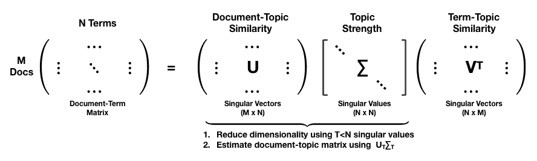

从第一个两个矩阵的乘积得到的矩阵的行，*U[T]Σ[T]*[,]对应于在潜在主题空间中投影到原始文档的位置。

# 如何使用 sklearn 实现 LSI

我们将使用我们在上一章介绍的 BBC 文章数据来说明 LSI 的应用，因为它足够小，可以快速训练，并且允许我们将主题分配与类别标签进行比较。请参阅`latent_semantic_indexing`笔记本以获取其他实施细节：

1.  我们首先加载文档并创建一个包含 50 篇文章的训练集和（分层）测试集。

1.  然后，我们使用`TfidfVectorizer`对数据进行向量化，以获得加权 DTM 计数，并过滤掉在不到 1%或超过 25%的文档中出现的单词，以及通用停用词，以获得约 2,900 个单词的词汇表：

```py
vectorizer = TfidfVectorizer(max_df=.25, min_df=.01,
stop_words='english',
binary=False)
train_dtm = vectorizer.fit_transform(train_docs.article)
test_dtm = vectorizer.transform(test_docs.article)
```

1.  我们使用`sklearn`的`TruncatedSVD`类，它只计算* k *个最大的奇异值，以降低文档-术语矩阵的维度。确定性 arpack 算法提供了精确的解决方案，但默认的随机实现对于大矩阵更有效。

1.  我们计算五个主题以匹配五个类别，这仅解释了总 DTM 方差的 5.4%，因此更高的值是合理的：

```py
svd = TruncatedSVD(n_components=5, n_iter=5, random_state=42)
svd.fit(train_dtm)
svd.explained_variance*ratio* array([0.00187014, 0.01559661, 0.01389952, 0.01215842, 0.01066485])
```

1.  LSI 为文档-术语矩阵确定了一个新的正交基，将秩降低到所需主题的数量。

1.  训练好的`svd`对象的`.transform()`方法将文档投影到新的主题空间，这是通过降低文档向量的维度得到的结果，并对应于之前说明的*U[T]Σ[T]*变换：

```py
train_doc_topics = svd.transform(train_dtm)
train_doc_topics.shape
(2175, 5)
```

1.  我们可以对一篇文章进行采样，查看其在主题空间中的位置。我们选择了一个与主题 1 和 2 最（正相关）关联的`Politics`文章：

```py
i = randint(0, len(train_docs))
train_docs.iloc[i, :2].append(pd.Series(doc_topics[i], index=topic_labels))
Category Politics
Heading What the election should really be about?
Topic 1 0.33
Topic 2 0.18
Topic 3 0.12
Topic 4 0.02
Topic 5 0.06
```

1.  此示例的主题分配与每个类别的平均主题权重相一致（`Politics`是最左边的）。它们说明了 LSI 如何将 k 个主题表达为 k 维空间中的方向（笔记本包括每个类别的平均主题分配在二维空间中的投影）。

1.  每个类别都有明确定义，测试任务与训练任务相匹配。然而，权重既有正数又有负数，这使得解释主题更加困难：

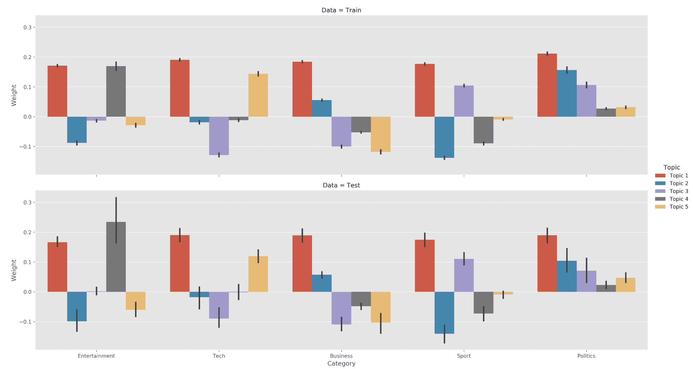

1.  我们还可以显示与每个主题最密切相关的单词（绝对值）。主题似乎捕捉了一些语义信息，但没有区分开来：

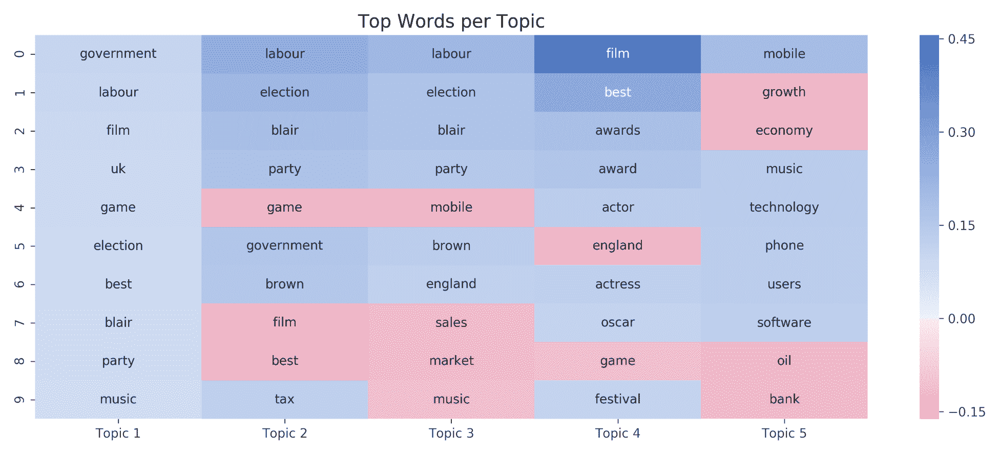

# 优缺点

LSI 的优点包括去除噪声、减轻维度灾难，同时捕捉一些语义信息，并将文档和术语进行聚类。

然而，LSI 的结果很难解释，因为主题是具有正负条目的词向量。此外，没有基础模型可供评估拟合度，并在选择维度或主题数量时提供指导。

# 概率潜在语义分析

**概率潜在语义分析（pLSA）**从统计的角度看待 LSA，并创建了一个生成模型来解决 LSA 缺乏理论基础的问题。

pLSA 明确地对 LSA 采取了统计视角，并创建了一个生成模型，以解决 LSA 缺乏理论基础的问题。

此生成过程的对称形式假定单词-文档共现的隐含主题类别生成了单词和文档，而非对称模型假定给定文档后选择了主题，并且单词是在给定主题后进行的第二步生成：

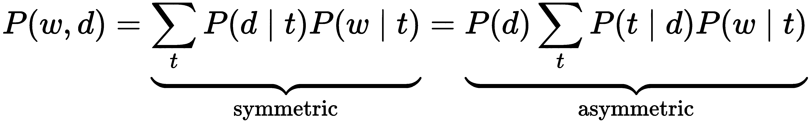

主题数是在训练之前选择的超参数，不是从数据中学习得到的。

概率模型通常使用以下板块符号来表示依赖关系。下图编码了刚刚描述的非对称模型的关系。每个矩形代表多个项，比如外部的 M 个文档和内部块的每个文档的 N 个单词。我们只观察文档及其内容，模型推断隐藏或潜在的主题分布：

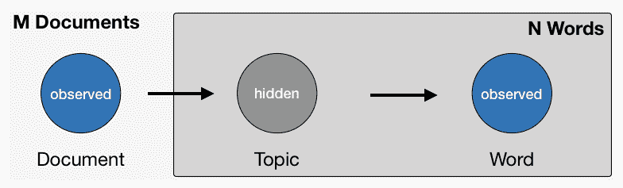

使用概率模型的好处是，我们现在可以通过评估它们在训练期间学到的参数对新文档分配的概率来比较模型。

# 如何使用 sklearn 实现 pLSA

pLSA 等价于使用 Kullback-Leibler 散度目标的非负矩阵分解（请参见 GitHub 上的参考资料 [`github.com/PacktPublishing/Hands-On-Machine-Learning-for-Algorithmic-Trading`](https://github.com/PacktPublishing/Hands-On-Machine-Learning-for-Algorithmic-Trading)）。因此，我们可以使用 `sklearn.decomposition.NM` 类来实现这个模型，遵循 LSA 示例。

使用由 `TfidfVectorizer` 生成的 DTM 的相同的训练-测试拆分，我们按如下方式拟合 pLSA：

```py
nmf = NMF(n_components=n_components,
random_state=42,
solver='mu',
beta_loss='kullback-leibler',
max_iter=1000)
nmf.fit(train_dtm)
```

我们得到一个重建误差的度量，这是以前解释的方差度量的替代品：

```py
nmf.reconstruction_err_
316.2609400385988
```

由于其概率性质，pLSA 只产生正主题权重，从而使测试集和训练集的主题-类别关系更加直观：

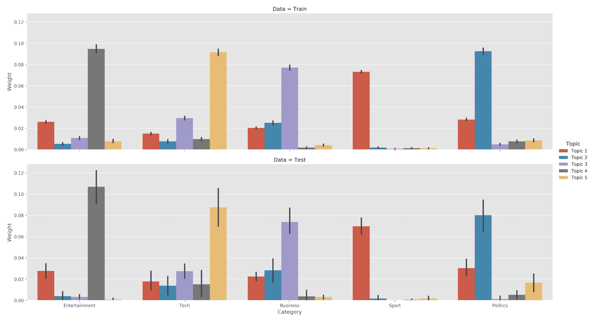

我们还可以看到描述每个主题的词列表开始变得更有意义；例如，娱乐类别与主题 4 最直接相关，其中包括电影、明星等词语：

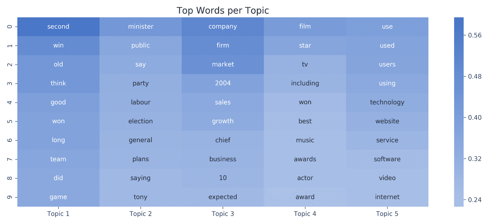

# 潜在狄利克雷分配

**潜在狄利克雷分配**（**LDA**）通过为主题添加生成过程来扩展 pLSA。

它是最受欢迎的主题模型，因为它倾向于产生人类能够相关的有意义的主题，可以为新文档分配主题，并且是可扩展的。LDA 模型的变体可以包括元数据，如作者，或图像数据，或学习分层主题。

# LDA 的工作原理

LDA 是一个分层贝叶斯模型，假设主题是词的概率分布，而文档是主题的分布。更具体地说，该模型假设主题遵循稀疏狄利克雷分布，这意味着文档只涵盖了一个小部分主题，并且主题仅使用了一小部分词频繁地。

# 狄利克雷分布

**狄利克雷分布**（Dirichlet distribution）生成可以与离散分布一起使用的概率向量。也就是说，它随机生成一定数量的值，这些值为正且总和为一，符合概率的期望。它有一个正实数参数，用于控制概率的集中程度。接近零的值意味着只有少数值会为正，并且获得大部分概率质量。下面的屏幕截图展示了对于 α *= 0.1* 进行了三次大小为 10 的抽样（`dirichlet_distribution` 笔记本中包含一个模拟，您可以尝试不同的参数值）：

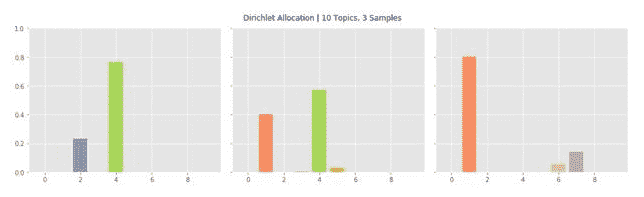

狄利克雷分配

# 生成模型

狄利克雷分布在 LDA 主题模型中占据重要地位，该模型假设当作者将文章添加到一系列文档中时，存在以下生成过程：

1.  根据主题概率随机混合一小部分共享主题 *K*

1.  对于每个词语，根据文档-主题概率选择其中一个主题

1.  根据主题-词语概率从主题的词语列表中选择一个词语

因此，文章内容取决于每个主题的权重和构成每个主题的术语。狄利克雷分布控制着为文档选择主题以及为主题选择词语，并编码了这样一个观点：文档仅涵盖少数主题，而每个主题仅使用少量词语频繁出现。

LDA 模型的板符号总结了这些关系：

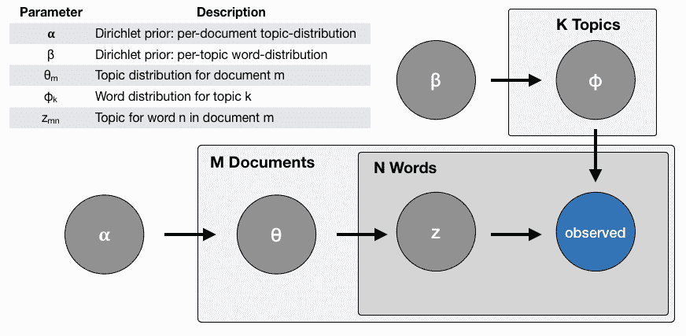

# 反向工程过程

生成过程是虚构的，但事实证明它是有用的，因为它允许恢复各种分布。LDA 算法对虚构作者的工作进行了反向工程，并得出了对文档-主题-词语关系进行简洁描述的摘要，该描述包括以下内容：

+   每个主题对文档的贡献百分比

+   每个词语与主题的概率关联

LDA 通过对假设的内容生成过程进行反向工程来解决从文档集合及其包含的词语中恢复分布的贝叶斯推理问题。原始论文使用**变分贝叶斯**（**VB**）来近似后验分布。其他选择包括吉布斯抽样和期望传播。稍后，我们将演示使用 sklearn 和 gensim 库的实现。

# 如何评估 LDA 主题

无监督主题模型不能保证结果具有意义或可解释性，并且没有客观的度量标准来评估结果，就像监督学习中那样。人类主题评估被认为是金标准，但可能成本高昂，并且不易规模化。

两种更客观评估结果的选择包括困惑度，它评估模型对未见文档的表现，以及主题连贯性度量，它旨在评估发现的模式的语义质量。

# 困惑度

当应用于 LDA 时，困惑度衡量模型恢复的主题 - 单词概率分布对样本的预测能力，例如，未见过的文本文档。 它基于此分布 *p* 的熵 *H*(*p*) 并针对标记集 *w* 计算：

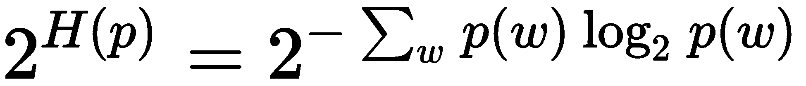

接近零的度量意味着分布更能够预测样本。

# 主题连贯性

主题连贯性衡量主题模型结果的语义一致性，即人类是否会认为与主题相关的单词及其概率是有意义的。

为此，它通过衡量与主题最相关的单词之间的语义相似度来评分每个主题。 更具体地说，连贯性度量基于定义主题的单词集合 *W* 的观察概率。

我们使用两个为 LDA 设计且已经显示与人类对主题质量的判断相吻合的连贯性度量，即 UMass 和 UCI 度量。

UCI 指标定义了一个词对的分数，该分数是两个不同对（顶部）主题词 *w[i]*，*w[j]* ∈ *w* 的**点间互信息**（**PMI**）之和和一个平滑因子 *ε*：

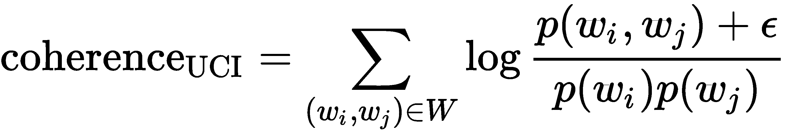

概率是从一个外部语料库（如维基百科）上的单词共现频率中计算的，因此这个度量可以被认为是与语义基准的外部比较。

相比之下，UMass 指标使用训练语料库中的一些文档 *D* 中的共现来计算一致性分数：

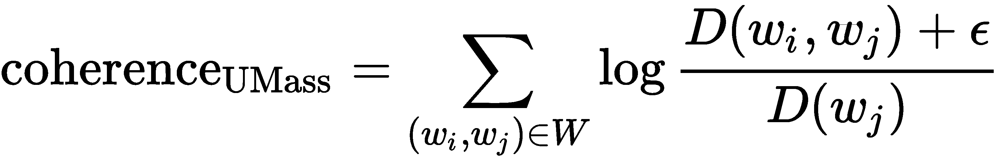

与外部基准的比较不同，这个度量反映了内在的连贯性。 这两个度量都经过评估，与人类判断相吻合。 在这两种情况下，值越接近零意味着主题更连贯。

# 如何使用 sklearn 实现 LDA

与之前使用 BBC 数据不同，我们使用 `sklearn.decomposition.LatentDirichletAllocation` 来训练一个具有五个主题的 LDA 模型（有关参数的详细信息，请参阅 sklearn 文档，有关实现细节，请参阅笔记本 `lda_with_sklearn`）：

```py
lda = LatentDirichletAllocation(n_components=5, 
                                    n_jobs=-1, 
                                    max_iter=500,
                                    learning_method='batch', 
                                    evaluate_every=5,
                                    verbose=1, 
                                    random_state=42)
ldat.fit(train_dtm)
LatentDirichletAllocation(batch_size=128, doc_topic_prior=None,
             evaluate_every=5, learning_decay=0.7, learning_method='batch',
             learning_offset=10.0, max_doc_update_iter=100, max_iter=500,
             mean_change_tol=0.001, n_components=5, n_jobs=-1,
             n_topics=None, perp_tol=0.1, random_state=42,
             topic_word_prior=None, total_samples=1000000.0, verbose=1)
```

模型在训练期间跟踪样本内困惑度，并一旦该度量停止改善，就停止迭代。 我们可以像往常一样保存和加载 sklearn 对象的结果：

```py
joblib.dump(lda, model_path / 'lda.pkl')
lda = joblib.load(model_path / 'lda.pkl')
```

# 如何使用 pyLDAvis 可视化 LDA 结果

主题可视化利用人类判断方便评估主题质量。 pyLDAvis 是 LDAvis 的 Python 版本，是在 R 和 `D3.js` 中开发的。我们将介绍关键概念；每个 LDA 实现笔记本都包含示例。

pyLDAvis 显示了话题之间的全局关系，同时通过检查与每个话题最相关的术语以及与每个术语相关的话题来促进它们的语义评估。它还解决了语料库中频繁出现的术语倾向于主导定义话题的词的多项分布的挑战。LDAVis 引入了术语*w*对话题*t*的相关性*r*，以使用权重参数*0<=ƛ<=1*生成关键术语的灵活排名。

以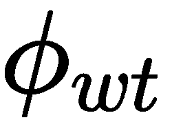作为模型对观察到的术语*w*在话题*t*中的概率估计，并作为语料库中术语*w*的边际概率：

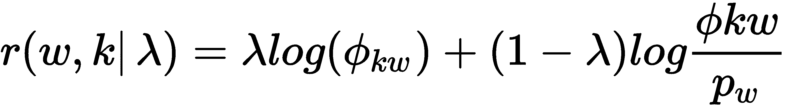

第一个术语衡量了术语*t*与话题*w*的关联程度，第二个术语衡量了提升或显著性，即术语在话题中出现的可能性相对于语料库中的可能性有多少。

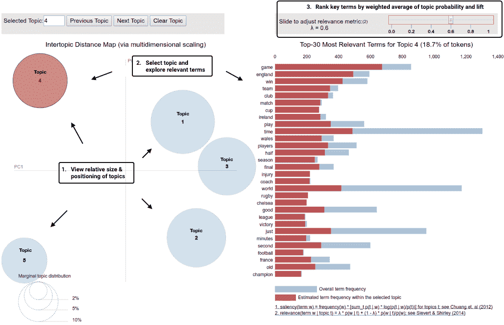

话题 14

该工具允许用户交互地更改*ƛ*以调整相关性，从而更新术语的排名。用户研究发现*ƛ=0.6*产生了最合理的结果。

# 如何使用 gensim 实现 LDA

`gensim`是一个专门的 NLP 库，具有快速的 LDA 实现和许多附加功能。我们还将在下一章中使用它来处理单词向量（有关详细信息，请参见`latent_dirichlet_allocation_gensim`笔记本）。

它促进了将 sklearn 生成的 DTM 转换为 gensim 数据结构，如下所示：

```py
train_corpus = Sparse2Corpus(train_dtm, documents_columns=False)
test_corpus = Sparse2Corpus(test_dtm, documents_columns=False)
id2word = pd.Series(vectorizer.get_feature_names()).to_dict()
```

Gensim LDA 算法包括许多设置，如下所示：

```py
LdaModel(corpus=None, 
         num_topics=100, 
         id2word=None, 
         distributed=False, 
         chunksize=2000, # No of doc per training chunk.
         passes=1,       # No of passes through corpus during training
         update_every=1, # No of docs to be iterated through per update
         alpha='symmetric', 
         eta=None,       # a-priori belief on word probability
         decay=0.5,    # % of lambda forgotten when new doc is examined
         offset=1.0,   # controls slow down of first few iterations.
         eval_every=10,   # how often estimate log perplexity (costly)
         iterations=50,         # Max. of iterations through the corpus
         gamma_threshold=0.001, # Min. change in gamma to continue
         minimum_probability=0.01, # Filter topics with lower 
                                     probability
         random_state=None, 
         ns_conf=None, 
         minimum_phi_value=0.01, # lower bound on term probabilities
         per_word_topics=False,  #  Compute most word-topic 
                                    probabilities
         callbacks=None, 
         dtype=<class 'numpy.float32'>)
```

Gensim 还提供了一个用于并行训练的`LdaMulticore`模型，可以使用 Python 的多进程特性加速训练。

模型训练只需要实例化`LdaModel`对象，如下所示：

```py
lda = LdaModel(corpus=train_corpus,
num_topics=5,
id2word=id2word)
```

话题连贯性（Topic coherence）衡量话题中的单词是否倾向于一起出现。它为每对排名靠前的单词添加一个分数。该分数是包含至少一个较高排名单词实例的文档也包含至少一个较低排名单词实例的概率的对数。

大的负值表示不经常共现的单词；接近零的值表示单词倾向于更经常共现。`gensim`允许进行话题连贯性评估，产生话题连贯性并显示每个话题的最重要单词：

```py
coherence = lda_gensim.top_topics(corpus=train_corpus,  coherence='u_mass')
```

我们可以如下显示结果：

```py
topic_coherence = []
topic_words = pd.DataFrame()
for t in range(len(coherence)):
    label = topic_labels[t]
    topic_coherence.append(coherence[t][1])
    df = pd.DataFrame(coherence[t][0], columns=[(label, 'prob'), (label, 'term')])
    df[(label, 'prob')] = df[(label, 'prob')].apply(lambda x: '{:.2%}'.format(x))
    topic_words = pd.concat([topic_words, df], axis=1)

topic_words.columns = pd.MultiIndex.from_tuples(topic_words.columns)
pd.set_option('expand_frame_repr', False)
print(topic_words.head())
pd.Series(topic_coherence, index=topic_labels).plot.bar();
```

这显示了每个话题的以下顶级单词：

| **话题 1** |  | **话题 2** |  | **话题 3** |  | **话题 4** |  | **话题 5** |  |
| --- | --- | --- | --- | --- | --- | --- | --- | --- | --- |
| 概率 | 术语 | 概率 | 术语 | 概率 | 术语 | 概率 | 术语 | 概率 | 术语 |
| 0.55% | 在线 | 0.90% | 最佳 | 1.04% | 移动 | 0.64% | 市场 | 0.94% | 劳动力 |
| 0.51% | 网站 | 0.87% | 游戏 | 0.98% | 手机 | 0.53% | 增长 | 0.72% | 布莱尔 |
| 0.46% | 游戏 | 0.62% | 玩 | 0.51% | 音乐 | 0.52% | 销售 | 0.72% | 褐色 |
| 0.45% | 净 | 0.61% | 赢 | 0.48% | 影片 | 0.49% | 经济 | 0.65% | 选举 |
| 0.44% | 用 | 0.56% | 赢 | 0.48% | 使用 | 0.45% | 价格 | 0.57% | 联合 |

以及相应的一致性分数，突出了主题质量的衰减（至少部分原因是由于相对较小的数据集）：

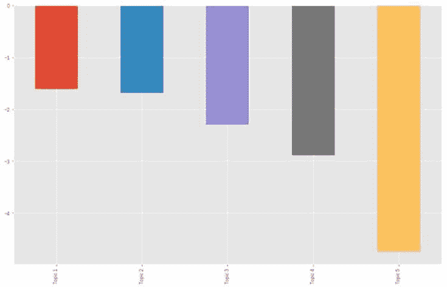

主题质量的衰减

# 收益电话的主题建模

在 第三章 中，*金融的替代数据*，我们学习了如何从 SeekingAlpha 网站上抓取收益电话数据。在本节中，我们将使用此来源说明主题建模。我使用了 2018 年下半年的约 500 个收益电话转录样本。对于实际应用，更大的数据集将非常理想。 `earnings_calls` 目录 包含了几个文件，后面提到了一些示例。

有关加载、探索和预处理数据的详细信息，以及训练和评估各个模型的详细信息，请参阅 `lda_earnings_calls` 笔记本，以及描述这里的实验的 `run_experiments.py` 文件。

# 数据预处理

收益电话的转录由公司代表、运营商和通常与分析师进行的问答环节组成。我们将每个声明视为单独的文档，忽略运营商的声明，以获取 22,766 个项目，平均词数为 144 个，中位数为 64 个：

```py
documents = []
for transcript in earnings_path.iterdir():
    content = pd.read_csv(transcript / 'content.csv')
    documents.extend(content.loc[(content.speaker!='Operator') & (content.content.str.len() > 5), 'content'].tolist())
len(documents)
22766
```

我们使用 `spaCy` 对这些文档进行预处理，如 第十三章 所示，*处理文本数据*（参见笔记本），并将清理和词形还原的文本存储为新的文本文件。

数据探索揭示了领域特定的停用词，例如年份和季度，我们在第二步中移除这些停用词，我们还过滤掉少于十个单词的语句，以便剩下约 16,150 个语句。

# 模型训练和评估

为了说明，我们将创建一个包含在大约 1560 个特征中出现在 0.5% 到 50% 文档之间的术语的文档-术语矩阵。在四核 i7 上对语料库进行 25 次训练 15 个主题模型需要花费两分钟多一点的时间。

每个主题的前 10 个单词确定了几个不同的主题，从明显的财务信息到临床试验（主题 4）和供应链问题（12）：

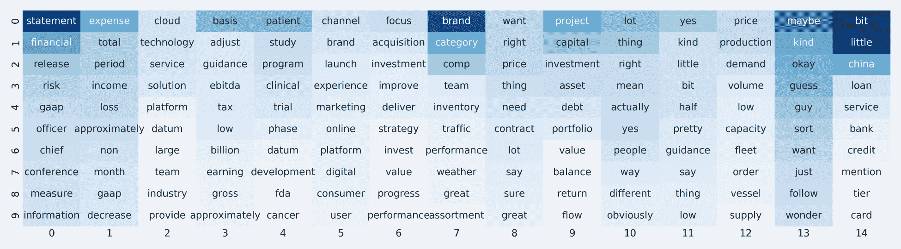

使用 pyLDAvis 的相关度指标，将无条件频率相对于提升的 0.6 加权，主题定义变得更直观，如主题 14 关于销售业绩的示例所示：

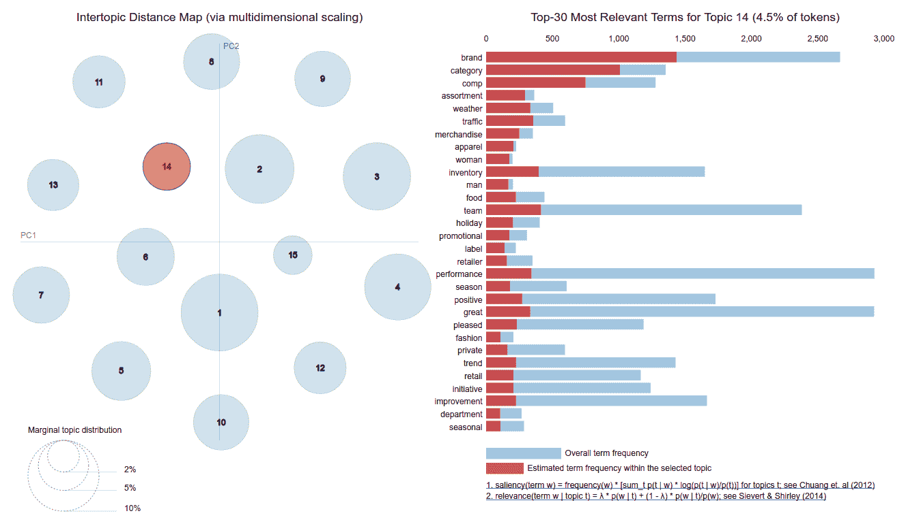

主题 14 的销售业绩

笔记本还说明了如何根据其主题关联查找文档。在这种情况下，分析师可以审查相关声明以获取细微差别，使用情感分析进一步处理特定主题的文本数据，或者分配从市场价格中导出的标签。

# 运行实验

为了说明不同参数设置的影响，我们对不同 DTM 约束和模型参数进行了几百次实验。更具体地说，我们让 `min_df` 和 `max_df` 参数从 50 到 500 个词和 10% 到 100% 的文档，分别使用二进制和绝对计数。然后，我们使用 3 到 50 个主题训练了 LDA 模型，在语料库上进行了 1 到 25 次训练。

以下图表说明了主题一致性（越高越好）和困惑度（越低越好）的结果。一致性在 25-30 个主题后下降，困惑度同样增加：

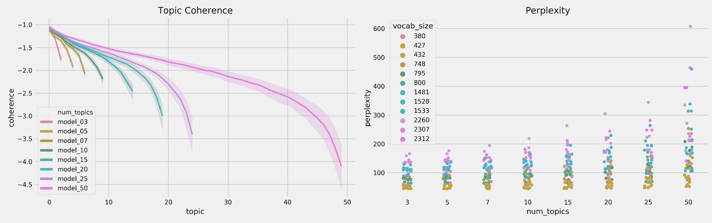

该笔记本包含了回归结果，量化了参数和结果之间的关系。通常使用绝对计数和较小的词汇量可以获得更好的结果。

# Yelp 商业评论的主题建模

`lda_yelp_reviews` 笔记本包含了将 LDA 应用于 Yelp 上的六百万商业评论的示例。评论的长度比从盈利电话会议抄录中提取的语句更加一致。在清理后，第 10 和第 90 百分位数的范围从 14 到 90 个词元。

我们展示了一个模型的结果，该模型使用了基于 *min_df=0.1%* 和 *max_df=25%* 的 3,800 个词元的词汇表，使用单一传递以避免对 20 个主题进行漫长的训练时间。我们可以使用 `pyldavis topic_info` 属性来计算 *lambda=0.6* 的相关性值，从而生成以下单词列表（详细信息请参见笔记本）：

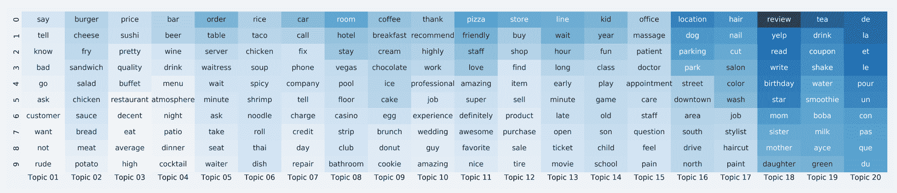

Gensim 提供了 `LdaMultiCore` 实现，允许使用 Python 的 multiprocessing 模块进行并行训练，并且当使用四个工作进程时，性能提高了 50%。然而，更多的工作进程并不会进一步减少训练时间，因为存在 I/O 瓶颈。

# 摘要

在本章中，我们探讨了使用主题建模来洞察大量文档内容的用途。我们涵盖了潜在语义分析，它使用 DTM 的降维来将文档投影到潜在主题空间中。虽然在处理由高维词向量引起的维度诅咒方面有效，但它并不捕捉太多语义信息。概率模型对文档、主题和词之间的相互作用做出了明确的假设，这些假设允许算法反向工程文档生成过程，并评估新文档的模型适应度。我们看到 LDA 能够提取出合理的主题，使我们能够以自动化的方式对大量文本进行高层次理解，同时以有针对性的方式识别相关文档。

在下一章中，我们将学习如何训练神经网络，将个别单词嵌入到一个捕捉重要语义信息的高维向量空间中，并且可以使用生成的词向量作为高质量的文本特征。
