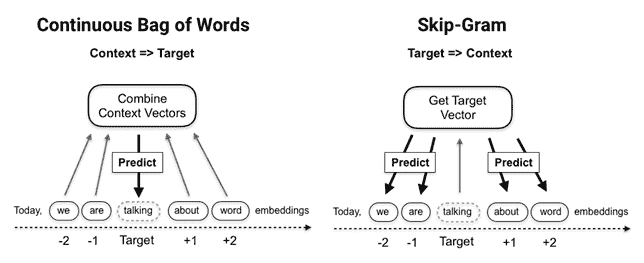
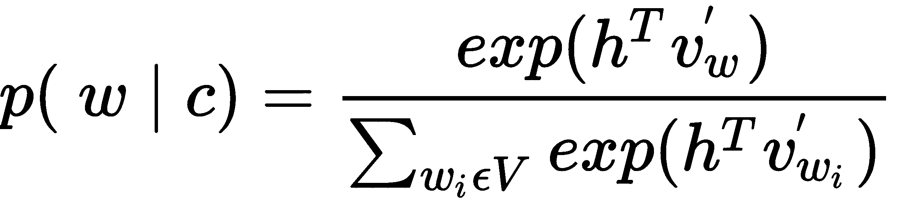
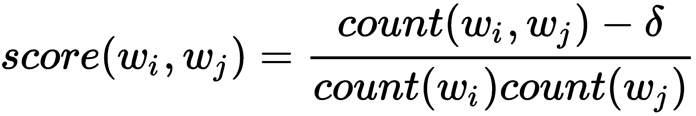
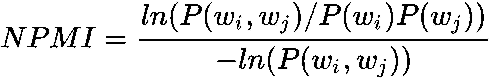
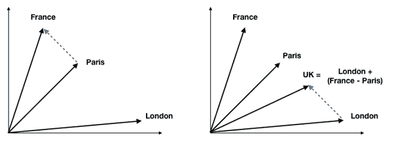
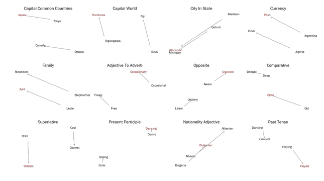
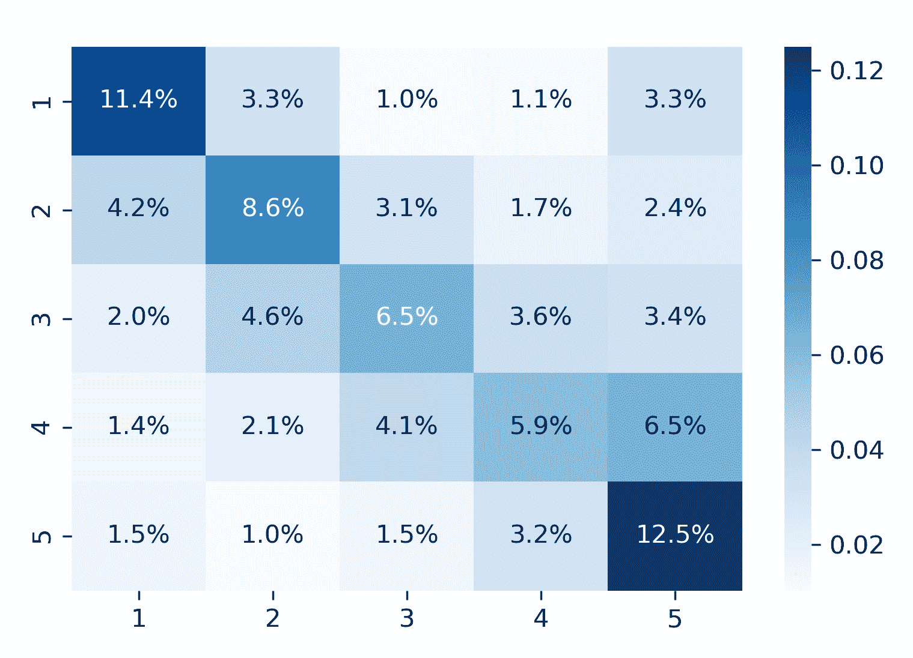

# 第十五章：词嵌入

在前两章中，我们应用了词袋模型将文本数据转换为数值格式。结果是稀疏的、固定长度的向量，表示文档在高维词空间中的位置。这允许评估文档的相似性，并创建特征来训练机器学习算法，分类文档的内容或评估其中表达的情感。然而，这些向量忽略了术语使用的上下文，因此，例如，包含相同单词的不同句子将被编码为相同的向量。

在本章中，我们将介绍一种替代类别的算法，它使用神经网络来学习个别语义单元（如单词或段落）的向量表示。这些向量是密集的，而不是稀疏的，而且有几百个实值，而不是几万个二进制或离散条目。它们被称为**嵌入**，因为它们将每个语义单元分配到连续向量空间中的位置。

嵌入是通过训练模型将标记与其上下文关联起来而产生的，这样做的好处是类似的用法意味着类似的向量。此外，我们将看到嵌入如何通过它们的相对位置来编码语义方面的关系，例如词之间的关系。因此，它们是我们将在后面的章节中介绍的深度学习模型中强大的特征。

具体来说，在本章中，我们将涵盖以下主题：

+   词嵌入是什么，以及它们如何工作和捕捉语义信息

+   如何使用训练好的词向量

+   哪些网络架构对训练 Word2vec 模型有用

+   如何使用 Keras、gensim 和 TensorFlow 训练 Word2vec 模型

+   如何可视化和评估词向量的质量

+   如何使用 SEC 文件训练 Word2vec 模型

+   如何扩展 Word2vec 的`Doc2vec`

# 词嵌入如何编码语义

词袋模型将文档表示为反映其所包含标记的向量。词嵌入将标记表示为较低维度的向量，使得它们的相对位置反映了它们在上下文中的使用方式的关系。它们体现了语言学中的分布假设，即单词最好通过它们的搭配来定义。

词向量能够捕捉许多语义方面；不仅是近义词彼此靠近，而且单词之间可以有多个相似度程度，例如，单词“驾驶员”可能与“汽车司机”或“导致”的相似。此外，嵌入反映了单词对之间的关系，例如类比（东京对日本就像巴黎对法国，或者 went 对 go 就像 saw 对 see），我们将在本节稍后进行说明。

嵌入是通过训练机器学习模型来预测单词与它们的上下文或反之。在下一节中，我们将介绍这些神经语言模型的工作原理，并介绍成功的方法，包括 Word2vec、`Doc2vec`和 fastText。

# 神经语言模型如何学习上下文中的用法

词嵌入是通过训练一个浅层神经网络来预测给定上下文的单词而产生的。传统语言模型将上下文定义为目标词之前的单词，而单词嵌入模型使用包围目标的对称窗口中包含的单词。相比之下，词袋模型使用整个文档作为上下文，并使用（加权）计数来捕捉单词的共现关系，而不是预测向量。

早期使用的神经语言模型包括增加了计算复杂性的非线性隐藏层。Word2vec 及其扩展简化了体系结构，以便在大型数据集上进行训练（例如，维基百科包含超过二十亿个标记；有关前馈网络的详细信息，请参阅[第十七章](https://www.packtpub.com/sites/default/files/downloads/Deep_Learning.pdf) *深度学习*）。

# Word2vec 模型 – 大规模学习嵌入

Word2vec 模型是一个将文本语料库作为输入并输出该语料库中单词的一组嵌入向量的两层神经网络。有两种不同的架构可以使用浅层神经网络有效地学习单词向量，如下图所示：

+   **Continuous-Bag-Of-Words**（**CBOW**）模型使用上下文词向量的平均值作为输入来预测目标词，因此它们的顺序并不重要。CBOW 模型训练速度更快，对于频繁词汇来说稍微准确一些，但对不经常出现的单词关注较少。

+   **Skip-Gram**（**SG**）模型与之相反，使用目标词来预测从上下文中抽样的词。它在小数据集上效果很好，并且即使对于罕见的单词或短语也能找到良好的表示：



因此，Word2vec 模型接收一个嵌入向量作为输入，并与另一个嵌入向量计算点积。请注意，假设归一化向量，当向量相等时，点积被最大化（绝对值），当它们正交时被最小化。

然后使用反向传播来根据由任何分类错误造成的目标函数计算的损失来调整嵌入权重。在下一节中，我们将看到 Word2vec 如何计算损失。

训练通过将上下文窗口滑过文档进行，通常被分成句子。每次完整迭代整个语料库都被称为一个**时代**。根据数据，可能需要几十个时代才能使向量质量收敛。

从技术上讲，SG 模型已被证明可以因式分解包含相应单词和上下文对的点互信息的单词-上下文矩阵（请参阅 GitHub 上的参考文献）。

# 模型目标 – 简化 softmax

Word2vec 模型旨在预测一个单词，而这个单词可能是非常大的词汇表中的一个。神经网络通常使用 softmax 函数，该函数将任意数量的实值映射到相等数量的概率，以实现相应的多类目标，其中*h*指嵌入，*v*指输入向量，*c*是单词*w*的上下文：



然而，softmax 的复杂性随着类别数量的增加而增加，因为分母需要计算词汇表中所有单词的点积以标准化概率。Word2vec 模型通过使用 softmax 的简化版本或基于采样的方法（详见参考资料）来提高效率：

+   **分层 softmax** 将词汇表组织为具有词作为叶节点的二叉树。到每个节点的唯一路径可用于计算单词概率。

+   **噪声对比估计** (**NCE**) 对上下文外的“噪声词”进行采样，并将多类任务近似为二元分类问题。随着样本数量的增加，NCE 的导数接近 softmax 梯度，但只要 25 个样本就能产生与 softmax 相似的收敛速度，速度快 45 倍。

+   **负采样** (**NEG**)省略了噪声词样本，以逼近 NCE 并直接最大化目标词的概率。因此，NEG 优化了嵌入向量的语义质量（相似用法的相似向量），而不是测试集上的准确性。然而，它可能对频率较低的单词产生比分层 softmax 目标更差的表示。

# 自动短语检测

预处理通常涉及短语检测，即识别常用在一起的标记，并应该接收单一向量表示（例如，纽约市，请参阅第十三章中关于 n-gram 的讨论，*处理文本数据*）。

原始的 Word2vec 作者使用了一种简单的提升评分方法，该方法将两个词*w[i]*、*w[j]*标识为一个二元组，如果它们的联合出现相对于每个词的单独出现超过了给定阈值，通过一个修正因子*δ*校正：



评分器可以重复应用以识别连续更长的短语。

另一种选择是归一化的点间互信息分数，这种方法更准确，但计算成本更高。它使用了相对词频*P(w)*，并在+1 和-1 之间变化：



# 如何评估嵌入向量 - 向量运算和类比

词袋模型创建反映标记在文档中存在和相关性的文档向量。**潜在语义分析**减少了这些向量的维度，并在此过程中识别了可被解释为潜在概念的内容。**潜在狄利克雷分配**将文档和术语都表示为包含潜在主题权重的向量。

词和短语向量的维度没有明确的含义。然而，嵌入在潜在空间中编码了相似用法，以一种体现在语义关系上的接近性的方式。这导致了有趣的性质，即类比可以通过添加和减去词向量来表达。

以下图显示了连接巴黎和法国的向量（即它们的嵌入之差）如何反映了首都关系。类似的关系，伦敦：英国，对应于相同的向量，即英国与通过将首都向量添加到伦敦得到的位置非常接近：



正如单词可以在不同的语境中使用一样，它们可以以不同的方式与其他单词相关联，而这些关系对应于潜在空间中的不同方向。因此，如果训练数据允许，嵌入应该反映出几种不同类型的类比关系。

Word2vec 的作者提供了一份涵盖地理、语法和句法以及家庭关系等多个方面的几千个关系的列表，用于评估嵌入向量的质量。如上所示，该测试验证了目标词（英国）最接近的是将代表类似关系（巴黎：法国）的向量添加到目标的补充（伦敦）后得到的结果。

以下图将在维基百科语料库上训练的 Word2vec 模型的最相关类比的 300 维嵌入，具有超过 20 亿标记，通过**主成分分析**（**PCA**）投影到二维。从以下类别的超过 24,400 个类比的测试实现了超过 73.5% 的准确率（参见笔记本）：



使用嵌入模型

与其他无监督学习技术类似，学习嵌入向量的目标是为其他任务生成特征，如文本分类或情感分析。

获取给定文档语料库的嵌入向量有几种选项：

+   使用从通用大语料库（如维基百科或谷歌新闻）中学到的嵌入

+   使用反映感兴趣领域的文档来训练自己的模型

对于后续的文本建模任务，内容越专业化、越不通用，第二种方法就越可取。然而，高质量的词向量需要大量数据，并且需要包含数亿字的信息性文档。

# 如何使用预训练的词向量

预训练词嵌入的几个来源。流行选项包括斯坦福的 GloVE 和 spaCy 的内置向量（有关详细信息，请参见笔记本 `using_trained_vectors`）。

# GloVe - 用于词表示的全球向量

GloVe 是在斯坦福 NLP 实验室开发的无监督算法，它从聚合的全局词-词共现统计中学习单词的向量表示（请参阅参考文献）。可用于以下网络规模来源的预训练向量：

+   Common Crawl 共有 420 亿或 840 亿令牌和词汇表或 190 万或 220 万令牌。

+   Wikipedia 2014 + Gigaword 5，共有 60 亿令牌和 40 万令牌的词汇表。

+   推特使用了 20 亿条推文，27 亿令牌和 120 万令牌的词汇表

我们可以使用 gensim 将矢量文本文件转换并加载到 `KeyedVector` 对象中：

```py
from gensim.models import Word2vec, KeyedVectors
 from gensim.scripts.glove2Word2vec import glove2Word2vec
glove2Word2vec(glove_input_file=glove_file, Word2vec_output_file=w2v_file)
 model = KeyedVectors.load_Word2vec_format(w2v_file, binary=False)
```

Word2vec 作者提供了包含超过 24,000 个类比测试的文本文件，gensim 用于评估词向量。

在维基百科语料库上训练的词向量涵盖了所有类比，并在各个类别中达到了 75.5% 的总体准确率：

| **类别** | **样本** | **准确率** | **类别** | **样本** | **准确率** |
| --- | --- | --- | --- | --- | --- |
| 首都-普通国家 | 506 | 94.86% | 比较级 | 1,332 | 88.21% |
| 首都-世界 | 8,372 | 96.46% | 最高级 | 1,056 | 74.62% |
| 城市-州 | 4,242 | 60.00% | 现在分词 | 1,056 | 69.98% |
| 货币 | 752 | 17.42% | 国籍形容词 | 1,640 | 92.50% |
| 家庭 | 506 | 88.14% | 过去时 | 1,560 | 61.15% |
| 形容词到副词 | 992 | 22.58% | 复数 | 1,332 | 78.08% |
| 反义词 | 756 | 28.57% | 复数动词 | 870 | 58.51% |

常见爬网词嵌入的 10 万个最常见标记覆盖了约 80% 的类比，并以 78% 的略高准确率，而 Twitter 的词嵌入则仅覆盖了 25%，准确率为 62%。

# 如何训练自己的单词向量嵌入

许多任务需要嵌入或特定领域的词汇，而基于通用语料库的预训练模型可能无法很好地或根本无法表示。标准 Word2vec 模型无法为词汇表中不存在的单词分配向量，而是使用降低其预测价值的默认向量。

例如，在处理行业特定文件时，词汇表或其使用可能随着时间推移而变化，因为新技术或产品出现。因此，嵌入也需要相应地发展。此外，企业盈利发布使用的语言不完全反映在基于维基百科文章预训练的 GloVe 向量中。

我们将使用 Keras 库来说明 Word2vec 架构，我们将在下一章中更详细地介绍，并使用 Word2vec 作者提供的代码的 gensim 适配更高效的代码。Word2vec 笔记本包含额外的实现细节，包括 TensorFlow 实现的参考。

# Keras 中的 Skip-Gram 架构

为了说明 Word2vec 网络架构，我们使用 TED Talk 数据集，该数据集具有对齐的英文和西班牙文字幕，我们首次在[第十三章](https://cdp.packtpub.com/hands_on_machine_learning_for_algorithmic_trading/wp-admin/post.php?post=682&action=edit#post_584)中介绍了*处理文本数据*。

笔记本包含将文档标记化并为词汇表中的每个项目分配唯一 ID 的代码。我们要求语料库中至少出现五次，并保留 31300 个标记的词汇表。

# 噪声对比估计

Keras 包括一个`make_sampling_table`方法，允许我们创建一个训练集，其中上下文和噪声词与相应的标签配对，根据它们的语料库频率进行采样。

结果是 2700 万个正面和负面的上下文和目标对的例子。

# 模型组件

*Skip-Gram*模型为词汇表中的每个项目包含一个 200 维嵌入向量，导致 31300 x 200 可训练参数，加上两个用于 sigmoid 输出。

在每次迭代中，模型计算上下文和目标嵌入向量的点积，通过 sigmoid 产生概率，并根据损失的梯度调整嵌入。

# 使用 TensorBoard 可视化嵌入

TensorBoard 是一种可视化工具，允许将嵌入向量投影到三维空间中，以探索单词和短语的位置。

# 使用 gensim 从 SEC 备案中学习的单词向量

在本节中，我们将使用 gensim 从美国年度**证券交易委员会**(**SEC**)备案中学习单词和短语向量，以说明单词嵌入对算法交易的潜在价值。在接下来的几节中，我们将将这些向量与价格回报结合使用作为特征，训练神经网络来根据安全备案的内容预测股票价格。

特别是，我们使用一个数据集，其中包含 2013-2016 年间上市公司提交的超过 22,000 份 10-K 年度报告，其中包含财务信息和管理评论（参见第三章，*金融替代数据*）。对于大约一半的公司的 11-K 备案，我们有股价以标记预测建模的数据（有关数据来源和`sec-filings`文件夹中笔记本的引用，请参阅详细信息）。

# 预处理

每个备案都是一个单独的文本文件，一个主索引包含备案元数据。我们提取最具信息量的部分，即以下部分：

+   **项目 1 和 1A**：业务和风险因素

+   **项目 7 和 7A**：管理对市场风险的讨论和披露

笔记本预处理显示如何使用 spaCy 解析和标记文本，类似于第十四章中采用的方法，*主题建模*。我们不对单词进行词形还原处理，以保留单词用法的细微差别。

# 自动短语检测

我们使用`gensim`来检测短语，就像之前介绍的那样。`Phrases`模块对标记进行评分，而`Phraser`类相应地转换文本数据。笔记本展示了如何重复此过程以创建更长的短语：

```py
sentences = LineSentence(f'ngrams_1.txt')
phrases = Phrases(sentences=sentences,
                  min_count=25,  # ignore terms with a lower count
                  threshold=0.5,  # only phrases with higher score
                  delimiter=b'_',  # how to join ngram tokens
                  scoring='npmi')  # alternative: default
grams = Phraser(phrases)
sentences = grams[sentences]
```

最频繁的二元组包括`common_stock`，`united_states`，`cash_flows`，`real_estate`和`interest_rates`。

# 模型训练

`gensim.models.Word2vec`类实现了之前介绍的 SG 和 CBOW 架构。Word2vec 笔记本包含额外的实现细节。

为了方便内存高效的文本摄取，`LineSentence`类从提供的文本文件中创建一个生成器，其中包含单独的句子：

```py
sentence_path = Path('data', 'ngrams', f'ngrams_2.txt')
sentences = LineSentence(sentence_path)
```

`Word2vec`类提供了先前介绍的配置选项：

```py
model = Word2vec(sentences,
                 sg=1,    # 1=skip-gram; otherwise CBOW
                 hs=0,    # hier. softmax if 1, neg. sampling if 0
                 size=300,      # Vector dimensionality
                 window=3,      # Max dist. btw target and context word
                 min_count=50,  # Ignore words with lower frequency
                 negative=10,  # noise word count for negative sampling
                 workers=8,     # no threads 
                 iter=1,        # no epochs = iterations over corpus
                 alpha=0.025,   # initial learning rate
                 min_alpha=0.0001 # final learning rate
                )
```

笔记本展示了如何持久化和重新加载模型以继续训练，或者如何将嵌入向量单独存储，例如供 ML 模型使用。

# 模型评估

基本功能包括识别相似的单词：

```py
model.wv.most_similar(positive=['iphone'], 
                      restrict_vocab=15000)
                 term  similarity
0              android    0.600454
1           smartphone    0.581685
2                  app    0.559129
```

我们也可以使用正负贡献来验证单个类比：

```py
model.wv.most_similar(positive=['france', 'london'], 
                      negative=['paris'], 
                      restrict_vocab=15000)

             term  similarity
0  united_kingdom    0.606630
1         germany    0.585644
2     netherlands    0.578868
```

# 参数设置的性能影响

我们可以使用类比来评估不同参数设置的影响。以下结果表现突出（详细结果请参见`models`文件夹）：

+   负采样优于分层 softmax，同时训练速度更快。

+   Skip-Gram 架构优于 CBOW 给定的目标函数

+   不同的`min_count`设置影响较小，50 为最佳表现的中间值。

使用最佳表现的 SG 模型进行进一步实验，使用负采样和`min_count`为 50，得到以下结果：

+   比五更小的上下文窗口会降低性能。

+   更高的负采样率提高了性能，但训练速度慢了。

+   更大的向量提高了性能，大小为 600 时的准确率最高，为 38.5％。

# 使用 Doc2vec 进行情感分析

文本分类需要组合多个词嵌入。一个常见的方法是对文档中每个词的嵌入向量进行平均。这使用所有嵌入的信息，并有效地使用向量加法来到达嵌入空间中的不同位置。但是，有关单词顺序的相关信息会丢失。

相比之下，用于生成文本片段（如段落或产品评论）的嵌入的最先进模型是使用文档嵌入模型`Doc2vec`。这个模型是 Word2vec 作者在发布其原创贡献后不久开发的。

与 Word2vec 类似，`Doc2vec`也有两种类型：

+   **分布式词袋**（**DBOW**）模型对应于 Word2vec 的 CBOW 模型。文档向量是通过训练网络在预测目标词的合成任务中产生的，该任务基于上下文词向量和文档的文档向量。

+   **分布式记忆**（**DM**）模型对应于 Word2vec Skip-Gram 架构。通过训练神经网络来预测目标单词，使用整个文档的文档向量。

Gensim 的 `Doc2vec` 类实现了这种算法。

# 在 Yelp 情感数据上训练 Doc2vec

我们使用 500,000 条 Yelp 评论（参见第十三章，*处理文本数据*）的随机样本，以及它们的相关星级评分（参见 notebook `yelp_sentiment`）：

```py
df = (pd.read_parquet('yelp_reviews.parquet', engine='fastparquet')
          .loc[:, ['stars', 'text']])
stars = range(1, 6)
sample = pd.concat([df[df.stars==s].sample(n=100000) for s in stars])
```

我们使用简单的预处理来删除停用词和标点符号，使用 `NLTK` 的分词器并删除少于 10 个标记的评论：

```py
import nltk
nltk.download('stopwords')
from nltk import RegexpTokenizer
from nltk.corpus import stopwords
tokenizer = RegexpTokenizer(r'\w+')
stopword_set = set(stopwords.words('english'))

def clean(review):
    tokens = tokenizer.tokenize(review)
    return ' '.join([t for t in tokens if t not in stopword_set])

sample.text = sample.text.str.lower().apply(clean)
sample = sample[sample.text.str.split().str.len()>10]
```

# 创建输入数据

`gensim.models.doc2vec` 类以 `TaggedDocument` 格式处理文档，其中包含标记化的文档以及允许在训练后访问文档向量的唯一标记：

```py
sentences = []
for i, (_, text) in enumerate(sample.values):
    sentences.append(TaggedDocument(words=text.split(), tags=[i]))
```

训练界面与 `word2vec` 类似，但有额外的参数来指定 Doc2vec 算法：

```py
model = Doc2vec(documents=sentences,
                dm=1,          # algorithm: use distributed memory
                dm_concat=0,   # 1: concat, not sum/avg context vectors
                dbow_words=0,  # 1: train word vectors, 0: only doc 
                                    vectors
                alpha=0.025,   # initial learning rate
                size=300,
                window=5,
                min_count=10,
                epochs=5,
                negative=5)
model.save('test.model')
```

您还可以使用 `train()` 方法来继续学习过程，并且，例如，逐渐降低学习率：

```py
for _ in range(10):
    alpha *= .9
    model.train(sentences,
                total_examples=model.corpus_count,
                epochs=model.epochs,
                alpha=alpha)
```

因此，我们可以将文档向量作为特征来访问，以训练情感分类器：

```py
X = np.zeros(shape=(len(sample), size))
y = sample.stars.sub(1) # model needs [0, 5) labels
for i in range(len(sample)):
 X[i] = model[i]
```

我们将训练一个 `lightgbm` 梯度提升机，如下所示：

1.  从训练集和测试集创建 `lightgbm` `Dataset` 对象：

```py
train_data = lgb.Dataset(data=X_train, label=y_train)
test_data = train_data.create_valid(X_test, label=y_test)
```

1.  定义具有五个类别的多类模型的训练参数（否则使用默认值）：

```py
params = {'objective'  : 'multiclass',
          'num_classes': 5}
```

1.  对模型进行 250 次迭代的训练，并监视验证集错误：

```py
lgb_model = lgb.train(params=params,
                      train_set=train_data,
                      num_boost_round=250,
                      valid_sets=[train_data, test_data],
                      verbose_eval=25)
```

1.  Lightgbm 对所有五个类别进行概率预测。我们使用 `np.argmax()` 来获取具有最高预测概率的列索引来获取类别预测：

```py
y_pred = np.argmax(lgb_model.predict(X_test), axis=1)
```

1.  我们计算准确率评分来评估结果，并看到相对于五个平衡类别的基线 20%，准确率提高了 100% 以上：

```py
accuracy_score(y_true=y_test, y_pred=y_pred)
0.44955063467061984
```

1.  最后，我们通过混淆矩阵来更仔细地查看每个类别的预测：

```py
cm = confusion_matrix(y_true=y_test, y_pred=y_pred)
cm = pd.DataFrame(cm / np.sum(cm), index=stars, columns=stars)
```

1.  并将结果可视化为 `seaborn` 热图：

```py
sns.heatmap(cm, annot=True, cmap='Blues', fmt='.1%')
```



总之，`doc2vec` 方法使我们能够在不经过太多调整的情况下，比一个简单的基准模型取得了非常大的测试准确率改进。如果我们只选择顶部和底部的评论（分别为五星和一星），并训练一个二元分类器，则使用每个类别的 250,000 个样本时，AUC 分数可以达到 0.86 以上。

# 附加内容 - 用于翻译的 Word2vec

该 notebook 翻译演示了一个语言中编码的关系通常对应于另一种语言中的类似关系。

它说明了如何使用单词向量通过将单词向量从一个语言的嵌入空间投影到另一个语言的空间使用翻译矩阵来翻译单词和短语。

# 摘要

本章以词嵌入如何更有效地为个别标记编码语义开始，这比我们在第十三章中使用的词袋模型更为有效。我们还看到了如何通过线性向量算术验证嵌入，以评估是否正确表示了单词之间的语义关系。

学习词嵌入时，我们使用的浅层神经网络曾经在包含数十亿标记的 Web 数据规模上训练速度很慢。`word2vec` 模型结合了几种算法创新，显著加速了训练，并为文本特征生成确立了新标准。我们看到了如何使用`spaCy`和`gensim`来使用预训练的词向量，并学会了训练自己的词向量嵌入。然后，我们将`word2vec`模型应用于 SEC 提交文件。最后，我们介绍了`doc2vec`扩展，它以与单词向量类似的方式学习文档的向量表示，并将其应用于 Yelp 商家评论。

现在，我们将开始第四部分关于深度学习（如前言所述，在线可用），从介绍前馈网络、流行的深度学习框架和大规模高效训练技术开始。
