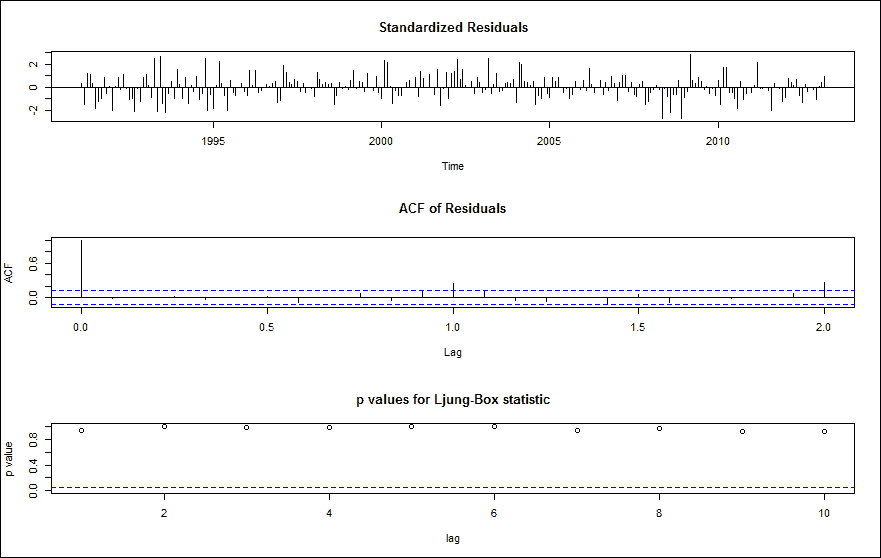
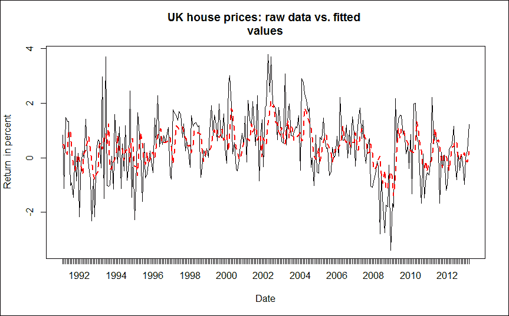
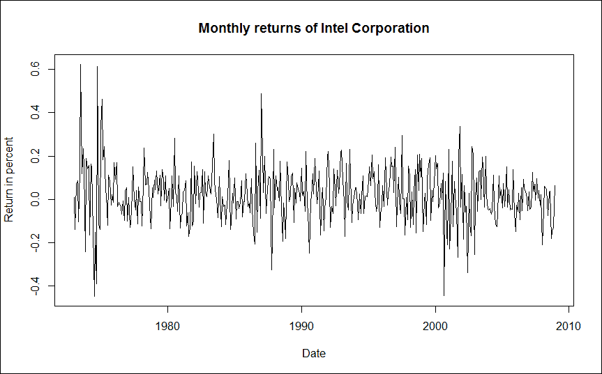
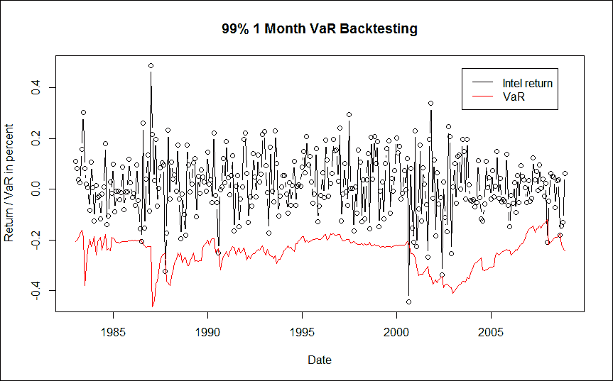

# 第一章：时间序列分析

时间序列分析关注的是随着时间推移收集的数据的分析。相邻的观察值通常是相互依赖的。因此，时间序列分析处理的是分析这种依赖关系的技术。

本章的目标是通过具体应用介绍一些常见的建模技术。我们将看到如何使用 R 来解决这些现实世界的例子。我们从一些关于如何在 R 中存储和处理时间序列数据的思考开始。接下来，我们将处理线性时间序列分析，并讨论如何利用它来建模和预测房价。在随后的章节中，我们利用协整的概念，通过考虑长期趋势，改进基本的最小方差对冲比率。最后，章节以如何使用波动率模型进行风险管理的部分作为结尾。

# 处理时间序列数据

原生的 R 类适用于存储时间序列数据，包括 `vector`、`matrix`、`data.frame` 和 `ts` 对象。但这些对象可以存储的数据类型有限，此外这些表示方法提供的功能也有限。幸运的是，存在一些专门处理时间序列数据更广泛表示的对象：`zoo`、`xts` 或 `timeSeries` 对象，这些都可以从同名包中获得。

并不一定每一个时间序列分析问题都需要创建时间序列对象，但更复杂的分析确实需要时间序列对象。你可以计算作为 R 向量表示的时间序列数据的均值或方差，但如果你想使用 `decompose` 进行季节性分解，你就需要将数据存储在时间序列对象中。

在以下示例中，我们假设你正在使用 `zoo` 对象，因为我们认为它是最广泛使用的包之一。在使用 `zoo` 对象之前，我们需要安装并加载 `zoo` 包（如果你已经安装了它，只需要加载即可），可以使用以下命令：

```py
> install.packages("zoo")
> library("zoo")

```

为了熟悉可用的方法，我们从 Apple 股票的每日收盘价创建一个名为 `aapl` 的 `zoo` 对象，这些数据存储在 CSV 文件 `aapl.csv` 中。每一行包含一个日期和一个收盘价，两者之间用逗号分隔。第一行包含列标题（**Date** 和 **Close**）。日期的格式按照 ISO 8601 的推荐标准（YYYY-MM-DD）进行。收盘价已经调整了股票分拆、股息和相关变化。

### 提示

**下载示例代码**

你可以从自己账户中的[`www.packtpub.com`](http://www.packtpub.com)下载所有已购买 Packt 书籍的示例代码文件。如果你在其他地方购买了本书，可以访问[`www.packtpub.com/support`](http://www.packtpub.com/support)并注册，将文件直接通过电子邮件发送给你。

我们使用以下命令从当前工作目录加载数据：

```py
> aapl<-read.zoo("aapl.csv",+   sep=",", header = TRUE, format = "%Y-%m-%d")

```

为了对数据有一个初步的印象，我们绘制股价图，并为整体图形指定标题（使用`main`参数）以及为 x 轴和 y 轴指定标签（分别使用`xlab`和`ylab`）。

```py
> plot(aapl, main = "APPLE Closing Prices on NASDAQ",+   ylab = "Price (USD)", xlab = "Date")

```

我们可以使用以下命令提取时间序列的第一部分或最后部分：

```py
> head(aapl)
2000-01-03 2000-01-04 2000-01-05 2000-01-06 2000-01-07 2000-01-10
 27.58      25.25      25.62      23.40      24.51      24.08
> tail(aapl)
2013-04-17 2013-04-18 2013-04-19 2013-04-22 2013-04-23 2013-04-24
 402.80     392.05     390.53     398.67     406.13     405.46

```

苹果公司的历史最高股价及其发生的日期可以通过以下命令来查找：

```py
> aapl[which.max(aapl)]
2012-09-19
 694.86

```

在处理时间序列时，通常更关心回报而非价格。这是因为回报通常是平稳的。因此，我们将计算简单回报或连续复利回报（以百分比表示）。

```py
> ret_simple <- diff(aapl) / lag(aapl, k = -1) * 100
> ret_cont   <- diff(log(aapl)) * 100

```

简单回报的汇总统计量也可以获得。我们在此使用`coredata`方法，表示我们只关心股价而不关心指数（日期）。

```py
> summary(coredata(ret_simple))
 Min.   1st Qu.    Median      Mean   3rd Qu.      Max.
-51.86000  -1.32500   0.07901   0.12530   1.55300  13.91000

```

最大的单日亏损为-51.86%。可以通过以下命令获得发生该亏损的日期：

```py
> ret_simple[which.min(ret_simple)]
2000-09-29
 -51.85888

```

在互联网上快速搜索显示，股价的大幅波动是由于发布了利润警告。为了更好地理解每日回报的相对频率，我们可以绘制直方图。用来分组回报数据的单元格数可以通过`break`参数来指定。

```py
> hist(ret_simple, breaks=100, main = "Histogram of Simple Returns",+  xlab="%")

```

我们可以将分析限制在时间序列的一个子集（一个`窗口`）中。苹果公司在 2013 年的最高股价可以通过以下命令行来查找：

```py
> aapl_2013 <- window(aapl, start = '2013-01-01', end = '2013-12-31')
> aapl_2013[which.max(aapl_2013)]
2013-01-02 
 545.85

```

从风险管理的角度来看，回报分布的分位数是非常重要的。例如，我们可以通过一种简单的历史方法轻松确定 1 天 99%的风险价值。

```py
> quantile(ret_simple, probs = 0.01)
 1% 
-7.042678

```

因此，任何一天的回报低于 7%的概率只有 1%。但是，如果这一天确实发生（大约每年会发生 2.5 次），那么你将至少损失 7%。

# 线性时间序列建模与预测

一类重要的线性时间序列模型是**自回归积分滑动平均（ARIMA）**模型，由*Box* *和* *Jenkins (1976)*提出。它假设当前的值仅能依赖于时间序列自身的过去值，或者依赖于某些误差项的过去值。

根据 Box 和 Jenkins，建立 ARIMA 模型包括三个阶段：

1.  模型识别。

1.  模型估计。

1.  模型诊断检查。

模型识别步骤涉及使用图形方法或信息准则来确定一个初步模型的阶数（包含的过去值的数量以及过去误差项的数量）。在确定模型的阶数之后，模型的参数需要进行估计，通常使用最小二乘法或最大似然法。然后，必须仔细检查拟合的模型，以确保不存在模型不适合的情况。这是通过确保模型残差表现为白噪声来完成的；也就是说，残差中不再存在线性依赖。

## 英国房价建模与预测

除了`zoo`包，我们还将使用`forecast`包中的一些方法。如果你还没有安装它，你需要使用以下命令进行安装：

```py
> install.packages("forecast")

```

之后，我们需要使用以下命令加载类：

```py
> library("forecast")

```

首先，我们将每月的房价数据（来源：全国建筑协会）存储在一个`zoo`时间序列对象中。

```py
> hp <- read.zoo("UKHP.csv", sep = ",",+   header = TRUE, format = "%Y-%m", FUN = as.yearmon)

```

`FUN`参数将给定的函数（`as.yearmon`，表示每月数据点）应用到日期列。为了确保我们确实存储了每月数据（每个周期有 12 个子周期），通过指定`as.yearmon`，我们查询数据序列的频率。

```py
> frequency(hp)
[1] 12

```

结果意味着我们在一个周期（称为“年”）中有十二个子周期（称为“月”）。我们再次使用简单收益率进行分析。

```py
> hp_ret <- diff(hp) / lag(hp, k = -1) * 100

```

### 模型识别与估计

我们使用`forecast`包提供的`auto.arima`函数来一次性识别最佳模型并估计系数。除了收益率序列（`hp_ret`），该函数还接受多个参数。通过指定`stationary = TRUE`，我们将搜索限制为平稳模型。类似地，`seasonal = FALSE`将搜索限制为非季节性模型。此外，我们选择 Akaike 信息准则作为相对质量的度量来用于模型选择。

```py
> mod <- auto.arima(hp_ret, stationary = TRUE, seasonal = FALSE,+   ic="aic")

```

为了确定拟合的系数值，我们查询模型输出。

```py
> mod
Series: hp_ret
ARIMA(2,0,0) with non-zero mean 

Coefficients:
 ar1     ar2  intercept
 0.2299  0.3491     0.4345
s.e.  0.0573  0.0575     0.1519

sigma² estimated as 1.105:  log likelihood=-390.97
AIC=789.94   AICc=790.1   BIC=804.28

```

根据赤池信息量准则（AIC），一个 AR(2)过程似乎最适合这些数据。为了进行视觉验证，我们可以使用命令`pacf`绘制偏自相关函数。该图表明直到滞后二，偏自相关值非零，因此，二阶 AR 过程似乎是合适的。这两个 AR 系数、截距（如果模型包含 AR 项的话，实际上是均值）以及各自的标准误差都已给出。在以下示例中，它们在 5%的显著性水平下均显著，因为相应的置信区间不包含零：

```py
> confint(mod)
 2.5 %    97.5 %
ar1       0.1174881 0.3422486
ar2       0.2364347 0.4617421
intercept 0.1368785 0.7321623

```

如果模型包含不显著的系数，我们可以使用`arima`函数重新估计模型，并使用`fixed`参数输入一个包含`0`和`NA`的元素向量。`NA`表示相应的系数应当被估计，而`0`表示该系数应设置为零。

### 模型诊断检查

快速验证模型的一种方法是使用以下命令绘制时间序列诊断图：

```py
> tsdiag(mod)

```

前一个命令的输出如图所示：



我们的模型表现良好，因为标准化残差没有表现出波动性聚集，残差之间没有显著的自相关（根据自相关图 ACF），而且 Ljung-Box 自相关检验显示出高 p 值，因此无法拒绝独立残差的原假设。

为了评估模型在样本数据中的拟合效果，我们可以绘制原始月度收益（细黑实线）与拟合值（粗红色虚线）的图像。

```py
> plot(mod$x, lty = 1, main = "UK house prices: raw data vs. fitted+   values", ylab = "Return in percent", xlab = "Date")
> lines(fitted(mod), lty = 2,lwd = 2, col = "red")

```

输出结果如下图所示：



此外，我们还可以计算常见的准确性度量。

```py
> accuracy(mod)
ME      RMSE      MAE          MPE   MAPE    MASE
0.00120 1.0514    0.8059       -Inf  Inf     0.792980241

```

该命令返回平均误差、均方根误差、平均绝对误差、平均百分比误差、平均绝对百分比误差和平均绝对标准化误差。

### 预测

要预测未来三个月（2013 年 4 月到 6 月）的月度收益，可以使用以下命令：

```py
> predict(mod, n.ahead=3)
$pred
 Apr       May       Jun
2013 0.5490544 0.7367277 0.5439708

$se
 Apr      May      Jun
2013 1.051422 1.078842 1.158658

```

因此，我们预计未来三个月的平均房价会略有上涨，但标准误差较高，大约为 1%。为了绘制带标准误差的预测图，我们可以使用以下命令：

```py
> plot(forecast(mod))

```

# 协整

协整的概念由*Granger（1981）*提出，并由*Engle 和 Granger（1987）*正式化，其核心思想是找到非平稳时间序列之间的线性组合，从而得到一个平稳的时间序列。因此，可以检测非平稳时间序列（例如价格）之间的稳定长期关系。

## 跨期对冲喷气燃料

航空公司是喷气燃料的天然买家。由于喷气燃料价格可能非常波动，大多数航空公司都会对其喷气燃料价格变化的部分风险进行对冲。在缺乏液态喷气燃料场外交易工具的情况下，航空公司使用相关的交易所交易期货合约（例如取暖油）进行对冲。在接下来的部分中，我们首先采用经典方法，仅考虑两种价格之间的短期波动，推导出最佳对冲比率；然后，我们通过考虑两者价格之间的长期稳定关系，改进经典的对冲比率。

我们首先加载必要的库。`urca`库提供了一些用于单位根检验和估计协整关系的有用方法。

```py
> library("zoo")
> install.packages("urca")
> library("urca")

```

我们导入了喷气燃料和取暖油的月度价格数据（以每加仑美元计）。

```py
> prices <- read.zoo("JetFuelHedging.csv", sep = ",",+   FUN = as.yearmon, format = "%Y-%m", header = TRUE)

```

仅考虑两种商品的短期行为（每月价格变化），可以通过拟合一个线性模型，解释喷气燃料价格变化由取暖油价格变化引起，从而推导出最小方差对冲。该回归的β系数即为最佳对冲比率。

```py
> simple_mod <- lm(diff(prices$JetFuel) ~ diff(prices$HeatingOil)+0)

```

`lm`函数（用于线性模型）估计喷气燃料价格变化与取暖油价格变化的最佳拟合系数。`+0`项表示我们将截距设置为零；也就是说，没有现金持有。

```py
> summary(simple_mod)
Call:
lm(formula = diff(prices$JetFuel) ~ diff(prices$HeatingOil) +
 0)
Residuals:
 Min       1Q   Median       3Q      Max
-0.52503 -0.02968  0.00131  0.03237  0.39602

Coefficients:
 Estimate Std. Error t value Pr(>|t|) 
diff(prices$HeatingOil)  0.89059    0.03983   22.36   <2e-16 ***
---
Signif. codes:  0 '***' 0.001 '**' 0.01 '*' 0.05 '.' 0.1 ' ' 1

Residual standard error: 0.0846 on 189 degrees of freedom
Multiple R-squared:  0.7257,   Adjusted R-squared:  0.7242
F-statistic: 499.9 on 1 and 189 DF,  p-value: < 2.2e-16

```

我们得到了 0.89059 的对冲比率和 0.0846 的残差标准误差。跨期对冲并不完美；最终的对冲投资组合仍然具有风险。

我们现在通过利用喷气燃料和取暖油期货价格之间的现有长期关系来改善这一对冲比率。通过以下命令绘制这两个价格序列（取暖油价格将以红色显示），你可以猜到这种关系的存在：

```py
> plot(prices$JetFuel, main = "Jet Fuel and Heating Oil Prices",+   xlab = "Date", ylab = "USD")
> lines(prices$HeatingOil, col = "red")

```

我们使用恩格尔和格兰杰的两步估计技术。首先，使用扩展的迪基-富勒检验对两个时间序列进行单位根（非平稳性）检验。

```py
> jf_adf <- ur.df(prices$JetFuel, type = "drift")
> summary(jf_adf)
###############################################
# Augmented Dickey-Fuller Test Unit Root Test #
###############################################

Test regression drift

Call:
lm(formula = z.diff ~ z.lag.1 + 1 + z.diff.lag)

Residuals:
 Min       1Q   Median       3Q      Max 
-1.06212 -0.05015  0.00566  0.07922  0.38086 

Coefficients:
 Estimate Std. Error t value Pr(>|t|) 
(Intercept)  0.03050    0.02177   1.401  0.16283 
z.lag.1     -0.01441    0.01271  -1.134  0.25845 
z.diff.lag   0.19471    0.07250   2.686  0.00789 **
---
Signif. codes:  0 '***' 0.001 '**' 0.01 '*' 0.05 '.' 0.1 ' ' 1

Residual standard error: 0.159 on 186 degrees of freedom
Multiple R-squared:  0.04099,   Adjusted R-squared:  0.03067
F-statistic: 3.975 on 2 and 186 DF,  p-value: 0.0204

Value of test-statistic is: -1.1335 0.9865

Critical values for test statistics:
 1pct  5pct 10pct
tau2 -3.46 -2.88 -2.57
phi1  6.52  4.63  3.81

```

非平稳性的原假设（喷气燃料时间序列包含单位根）在 1%的显著性水平下无法被拒绝，因为检验统计量-1.1335 并不比临界值-3.46 更负。对取暖油价格而言也是如此（检验统计量为-1.041）。

```py
> ho_adf <- ur.df(prices$HeatingOil, type = "drift")
> summary(ho_adf)

```

我们现在可以继续估计静态均衡模型，并使用扩展的迪基-富勒检验对残差进行平稳性检验。请注意，由于所研究的序列是估计值，因此现在必须使用不同的临界值[例如，来自*Engle 和 Yoo (1987)*]。

```py
> mod_static <- summary(lm(prices$JetFuel ~ prices$HeatingOil))
> error <- residuals(mod_static)
> error_cadf <- ur.df(error, type = "none")
> summary(error_cadf)

```

获得的检验统计量为-8.912，而在 1%水平下，样本大小为 200 时的临界值为-4.00；因此我们拒绝非平稳性的原假设。我们已经发现了两个协整变量，可以继续进行第二步；即，**误差修正模型**（**ECM**）的设定。ECM 表示一个动态模型，描述系统如何（以及多快）回到之前估计的静态均衡，并存储在`mod_static`变量中。

```py
> djf <- diff(prices$JetFuel)
> dho <- diff(prices$HeatingOil)
> error_lag <- lag(error, k = -1)
> mod_ecm <- lm(djf ~ dho + error_lag)
> summary(mod_ecm)

Call:
lm(formula = djf ~ dho + error_lag + 0)

Residuals:
 Min       1Q   Median       3Q      Max 
-0.19158 -0.03246  0.00047  0.02288  0.45117 

Coefficients:
 Estimate Std. Error t value Pr(>|t|) 
dho        0.90020 
0.03238  27.798   <2e-16 ***
error_lag -0.65540    0.06614  -9.909   <2e-16 ***
---
Signif. codes:  0 '***' 0.001 '**' 0.01 '*' 0.05 '.' 0.1 ' ' 1

Residual standard error: 0.06875 on 188 degrees of freedom
Multiple R-squared:  0.8198,   Adjusted R-squared:  0.8179 
F-statistic: 427.6 on 2 and 188 DF,  p-value: < 2.2e-16

```

考虑到喷气燃料和取暖油价格之间的长期关系（协整），现在的对冲比率略高（0.90020），残差标准误差显著降低（0.06875）。误差项的系数为负（-0.65540）：价格之间的大幅偏离将被修正，价格将趋向于它们的长期稳定关系。

# 建立波动率模型

正如我们之前所见，ARIMA 模型用于对一个过程的条件期望进行建模，前提是已知其过去。对于这种过程，条件方差是常数。现实世界中的金融时间序列呈现出波动聚集现象；也就是说，相对平静的时期会被波动的爆发所打断。

本节我们将探讨 GARCH 时间序列模型，这些模型可以考虑到现实世界（金融）时间序列的这一特征，并将这些模型应用于 VaR 预测。

## 风险管理中的波动率预测

金融机构通过使用 VaR（在险价值）来衡量其活动的风险，通常在 99%的置信水平下计算，并以 10 个交易日的期限进行估算。这是预期仅在 1%的时间内超过的损失。

我们加载`zoo`库并导入从 1973 年 1 月到 2008 年 12 月的英特尔公司月度收益数据。

```py
> library("zoo")
> intc <- read.zoo("intc.csv", header = TRUE,+   sep = ",", format = "%Y-%m", FUN = as.yearmon)

```

### ARCH 效应检验

收益的图表表明，月度收益数据中可能存在 ARCH 效应。

```py
> plot(intc, main = "Monthly returns of Intel Corporation",+   xlab = "Date", ylab = "Return in percent")

```

前面命令的输出如以下图所示：



我们可以使用统计假设检验来验证我们的直觉。两种常用的检验如下：

+   用于平方收益的自相关的 Ljung-Box 检验（作为波动率的代理）

+   **拉格朗日乘数**（**LM**）检验由*Engle（1982）*提出

首先，我们使用以下命令对平方收益的前 12 个滞后期进行 Ljung-Box 检验：

```py
> Box.test(coredata(intc²), type = "Ljung-Box", lag = 12)

 Box-Ljung test

data:  coredata(intc²)
X-squared = 79.3451, df = 12, p-value = 5.502e-12

```

我们可以在 1%的显著性水平上拒绝平方收益中不存在自相关的零假设。或者，我们可以使用`FinTS`包中的 LM 检验，它给出相同的结果。

```py
> install.packages("FinTS")
> library("FinTS")
> ArchTest(coredata(intc))

 ARCH LM-test; Null hypothesis: no ARCH effects

data:  coredata(intc)
Chi-squared = 59.3647, df = 12, p-value = 2.946e-08

```

两个检验均确认月度英特尔收益中存在 ARCH 效应，因此，在建模回报时间序列时，应采用 ARCH 或 GARCH 模型。

### GARCH 模型规格

最常用的 GARCH 模型，也是通常适用于金融时间序列的模型，是 GARCH(1,1)模型。我们使用`rugarch`库提供的函数进行模型规格设定、参数估计、回测和预测。如果你还没有安装该包，可以使用以下命令：

```py
> install.packages("rugarch")

```

之后，我们可以使用以下命令加载库：

```py
> library("rugarch")

```

首先，我们需要使用函数`ugarchspec`来指定模型。对于 GARCH(1,1)模型，我们需要将`garchOrder`设置为`c(1,1)`，并且均值模型（`mean.model`）应为白噪声过程，因此等于`armaOrder =` `c(0,0)`。

```py
> intc_garch11_spec <- ugarchspec(variance.model = list(+   garchOrder = c(1, 1)),+  mean.model = list(armaOrder = c(0, 0)))

```

### GARCH 模型估计

通过最大似然法对系数进行实际拟合的函数是`ugarchfit`，它以模型规格和回报数据作为输入。

```py
> intc_garch11_fit <- ugarchfit(spec = intc_garch11_spec,+  data = intc)

```

关于更多参数，请参见`ugarchfit`的帮助文档。拟合模型的输出（使用命令`intc_garch11_fit`）提供了有用的信息，例如最优参数的值、对数似然函数值和信息准则。

### 风险模型回测

检查模型性能的有用测试是进行历史回测。在风险模型回测中，我们将估算的 VaR 与该期间的实际回报进行比较。如果回报比 VaR 更为负值，则说明 VaR 超出。在我们的案例中，VaR 超出应只发生在 1%的情况下（因为我们指定了 99%的置信水平）。

函数`ugarchroll`对指定的 GARCH 模型（这里的模型是`intc_garch11_spec`）执行历史回测。我们按照如下方式指定回测：

+   将使用的回报数据存储在`zoo`对象`intc`中

+   回测的起始期（`n.start`）应为序列开始后的 120 个月（即 1983 年 1 月）

+   模型应每月重新估计（`refit.every = 1`）

+   我们使用`moving`窗口进行估计

+   我们使用`hybrid`求解器

+   我们希望计算 99%VaR 尾部水平的 VaR（`calculate.VaR = TRUE`）（`VaR.alpha = 0.01`）

+   我们希望保留估计的系数（`keep.coef = TRUE`）

以下命令显示了所有前述的回测要点：

```py
> intc_garch11_roll <- ugarchroll(intc_garch11_spec, intc,+   n.start = 120, refit.every = 1, refit.window = "moving",+   solver = "hybrid", calculate.VaR = TRUE, VaR.alpha = 0.01,+   keep.coef = TRUE)

```

我们可以使用`report`函数检查回测报告。通过将`type`参数指定为`VaR`，该函数将执行无条件和条件覆盖率检验以检查超出值。`VaR.alpha`是尾部概率，`conf.level`是条件覆盖率假设检验的置信水平。

```py
> report(intc_garch11_roll, type = "VaR", VaR.alpha = 0.01,+   conf.level = 0.99)
VaR Backtest Report
===========================================
Model:            sGARCH-norm
Backtest Length:   312
Data: 

==========================================
alpha:            1%
Expected Exceed:   3.1
Actual VaR Exceed:	5Actual %:         1.6%

Unconditional Coverage (Kupiec)
Null-Hypothesis:   Correct Exceedances
LR.uc Statistic:   0.968
LR.uc Critical:      6.635
LR.uc p-value:      0.325
Reject Null:      NO

Conditional Coverage (Christoffersen)
Null-Hypothesis:   Correct Exceedances and
 Independence of Failures
LR.cc Statistic:   1.131
LR.cc Critical:      9.21
LR.cc p-value:      0.568
Reject Null:      O

```

Kupiec 的无条件覆盖率比较了根据 VaR 尾部概率预期的超出值与实际超出值的数量，而 Christoffersen 检验是对无条件覆盖率和超出值独立性的联合检验。在我们的案例中，尽管实际有五次超出，而预期为三次，我们仍不能拒绝零假设，即超出值是正确且独立的。

回测性能的图形也可以轻松生成。首先，使用从`ugarchroll`对象中提取的预测 VaR 创建一个`zoo`对象。

```py
> intc_VaR <- zoo(intc_garch11_roll@forecast$VaR[, 1])

```

我们还会将`zoo`对象的`index`属性覆盖为该对象的`rownames`（年和月）。

```py
> index(intc_VaR) <- as.yearmon(rownames(intc_garch11_roll@forecast$VaR))

```

我们对实际回报也做同样的操作，这些回报同样存储在`ugarchroll`对象中。

```py
> intc_actual <- zoo(intc_garch11_roll@forecast$VaR[, 2])
> index(intc_actual) <- as.yearmon(rownames(intc_garch11_roll@forecast$VaR))

```

现在，我们可以使用以下命令绘制 Intel 的 VaR 与实际回报的关系：

```py
> plot(intc_actual, type = "b", main = "99% 1 Month VaR Backtesting",+   xlab = "Date", ylab = "Return/VaR in percent")
> lines(intc_VaR, col = "red")
> legend("topright", inset=.05, c("Intel return","VaR"), col = c("black","red"), lty = c(1,1))

```

以下图显示了前述命令行的输出：



### 预测

现在，我们可以合理地确信我们的风险模型工作正常，我们还可以生成 VaR 预测。`ugarchforecast`函数以拟合的 GARCH 模型（`intc_garch11_fit`）和需要生成预测的周期数（`n.ahead = 12`；即 12 个月）作为参数。

```py
> intc_garch11_fcst <- ugarchforecast(intc_garch11_fit, n.ahead = 12)

```

可以通过查询预测对象来查看生成的预测，示例如下所示命令行：

```py
> intc_garch11_fcst
*------------------------------------*
*       GARCH Model Forecast         *
*------------------------------------*
Model: sGARCH
Horizon: 12
Roll Steps: 0
Out of Sample: 0

0-roll forecast [T0=Dec 2008]:
 Series  Sigma
T+1  0.01911 0.1168
T+2  0.01911 0.1172
T+3  0.01911 0.1177
T+4  0.01911 0.1181
T+5  0.01911 0.1184
T+6  0.01911 0.1188
T+7  0.01911 0.1191
T+8  0.01911 0.1194
T+9  0.01911 0.1197
T+10 0.01911 0.1200
T+11 0.01911 0.1202
T+12 0.01911 0.1204

```

一期波动率（sigma）的预测为 0.1168。由于我们假设正态分布，可以使用标准正态分布的 99%分位数（在`qnorm(0.99)`中输入）计算 99%VaR。因此，下一期的一个月 99%VaR 估算值为`qnorm(0.99)*0.1168 = 0.2717`。因此，99%的概率下，月度回报将在-27%以上。

# 概要

在本章中，我们使用 R 解决了时间序列分析中的选定问题。我们涵盖了表示时间序列数据的不同方式，使用 ARMA 模型预测房价，通过协整关系改进了基本的最小方差对冲比率，并采用 GARCH 模型进行风险管理。在下一章中，您将学习如何使用 R 构建一个最优投资组合。
