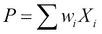
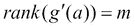

# 第二章：投资组合优化

到目前为止，我们已经熟悉了**R**语言的基础知识。我们知道如何分析数据、调用其内置函数，并将它们应用于时间序列分析中的选定问题。在本章中，我们将使用并扩展这些知识，讨论一个重要的实际应用：投资组合优化，换句话说，就是证券选择。本节内容涵盖了投资组合优化背后的理念：数学模型和理论解法。为了提高编程技能，我们将使用实际数据逐行实现一个算法来解决一个真实世界的例子。我们还将使用已编写好的 R 包来处理相同的数据集。

想象一下，我们生活在一个热带岛屿上，并且只有 100 美元可以投资。岛上的投资机会非常有限；我们只能将全部资金投资于冰淇淋或雨伞。根据天气变化，回报如下：

| 天气 | 冰淇淋 | 雨伞 |
| --- | --- | --- |
| 晴天 | 120 | 90 |
| 阴天 | 90 | 120 |

假设天气下雨或晴天的概率相同。如果我们无法预见或改变天气，显然这两个选项是等价的，并且通过投资其中任何一个，我们将获得 5%的预期回报[(0.5×120+0.5×90)/100-1=0.05]。

如果我们可以在冰淇淋和雨伞之间分配我们的资金呢？那么我们应该分别投资 50 美元在这两个选项中。这个投资组合是无风险的，因为无论发生什么，我们通过一个资产赚取 45 美元，另一个赚取 60 美元。预期回报仍为 5%，但现在是有保障的，因为(45+60)/100-1=0.05。

投资组合优化的主要概念（该领域因哈里·马科维茨在 1990 年获得诺贝尔奖）可以通过这个例子来理解。根据投资产品之间的相关性，我们可以降低投资组合的风险（在此情况下通过方差来衡量），并且仍然获得预期的回报。

从数学上更精确地讲，设*X*和*Y*为具有有限方差的随机变量  和 。它们的凸组合或仿射组合的方差表示如下的二次函数：


对于不同的相关性值，这个二次函数看起来像下图所示：


方差（作为风险的度量）只有在*X*和*Y*之间的相关性为-1 或+1，并且*X*和*Y*的方差不同的情况下，才能完全消除。否则，具有最优权重的投资组合的方差将（以绝对非平凡的方式）依赖于所有三个参数 (, , 和 ），正如我们在*定理（拉格朗日）*章节中将看到的那样。

# 均值-方差模型

马科维茨的均值-方差模型（*Markowitz, H.M. (1952 年 3 月)）*实际上是在更高维度中的冰淇淋/伞业务。对于数学公式化，我们需要一些定义。

它们的解释如下：

+   通过资产 ，我们指的是一个具有有限方差的随机变量。

+   通过投资组合，我们指的是资产的组合：，其中，和。组合可以是仿射的或凸的。在仿射情况下，权重没有额外限制。在凸的情况下，所有权重都为非负数。

+   通过优化，我们指的是选择最佳的系数（权重）以使我们的投资组合满足我们的需求（即，在给定预期收益下具有最小风险，或者在给定风险水平下具有最高预期收益，等等）。

设为具有有限方差的随机收益变量，为它们的协方差矩阵， 和。

我们将重点关注以下优化问题：

+   

+   

+   

+   

+   

很明显， 是投资组合的方差， 是预期收益。对于权重的和，我们有 ，这意味着我们希望投资 1 单位现金。（我们也可以考虑添加条件，这意味着不允许做空。）这些问题将在以下几点中详细解释：

+   第一个问题是找到一个最小风险的投资组合。如果没有无风险资产，这可能是一个非平凡的问题。

+   第二个问题是最大化给定方差水平下的预期收益。

+   一种略有不同的方法是找到在期望收益的指定水平下具有最小方差的投资组合。

+   第四个问题是最大化一个简单的效用函数 ，其中*λ*是风险容忍系数；它是一个任意数字，表示我们对风险的态度。它实际上与第一个问题相同。

+   在第五个问题中，*Y*是一个*n*+1 资产（例如，一个指数），我们不能购买或不想购买，但希望复制它。其他类似的问题可以用同样的方式来构建。

    很明显，第二个问题是带有二次约束的线性优化问题；其他所有问题都是带有线性约束的二次函数。正如我们稍后所看到的，这是一个重要的区别，因为线性约束可以很容易地处理，而二次约束则更难处理。在接下来的两个章节中，我们将重点讨论这些问题的复杂性和可能的解决方案。

# 解的概念

在过去 50 年里，许多优秀的数值优化算法已经被开发出来，并且这些算法在二次函数的情况下特别有效。正如我们在前一节中看到的，我们只有二次函数和约束；因此，这些方法（在 R 中也有实现）可以在最坏情况下使用（如果没有更好的方法）。

然而，数值优化的详细讨论超出了本书的范围。幸运的是，在线性和二次函数及约束的特殊情况下，这些方法是不必要的；我们可以使用 18 世纪的拉格朗日定理。

## 定理（拉格朗日）

如果和，（其中）具有连续偏导数，并且是*f(x)*相对于约束的相对极值点，其中。

然后，存在系数，使得

换句话说，函数的所有偏导数都是 0（*Bertsekas Dimitri P. (1999)*）。

在我们的案例中，条件也是充分的。二次函数的偏导数是线性的，因此优化问题转化为解线性方程组的问题，这是高中水平的任务（与数值方法不同）。

让我们看看，如何利用这个来解决第三个问题：


可以证明，这个问题等价于以下线性方程组：


（协方差矩阵中增加了两行两列，因此我们也有条件来确定两个拉格朗日乘子。）我们可以预期这个系统有唯一解。

值得强调的是，通过拉格朗日定理得到的结果不再是一个优化问题。就像在一维情况下，最小化二次函数会转化为求导并解线性方程组，这在复杂性上是微不足道的。现在让我们看看如何处理回报最大化问题：


很容易看出，拉格朗日函数对*λ*的导数就是约束本身。

为了看清楚这一点，求拉格朗日函数*L*的导数：

+   

+   

因此，这导致了非线性方程，这更像是一门艺术而非科学。

# 处理实际数据

值得注意的是，投资组合优化已完全集成到各种 R 包中，稍后我们将讨论这些包。然而，在我们运行之前，最好先走一走；因此，先从一个简单的自定义 `R` 函数开始，我们将逐行列出如下：

```py
minvariance <- function(assets, mu = 0.005) {
    return  <- log(tail(assets, -1) / head(assets, -1))
    Q       <- rbind(cov(return), rep(1, ncol(assets)),
               colMeans(return))
    Q       <- cbind(Q, rbind(t(tail(Q, 2)), matrix(0, 2, 2)))
    b       <- c(rep(0, ncol(assets)), 1, mu)
    solve(Q, b)
}
```

这是我们在 *定理（拉格朗日）* 部分讨论的算法的直接实现。

为了演示，我们从 **Quandl** 超集 ([`www.quandl.com/USER_1KR/1KT`](http://www.quandl.com/USER_1KR/1KT)) 获取了一些 IT 股票价格数据，该服务是一个公共平台，提供便捷的途径访问大量的量化数据。虽然该 URL 指向一个可下载的逗号分隔值（CSV）文件 ([`www.quandl.com/api/v1/datasets/USER_1KR/1KT.csv`](http://www.quandl.com/api/v1/datasets/USER_1KR/1KT.csv))，可以保存到磁盘并通过 `read.csv` 导入 R，但通过前面 URL 中包含的密钥，有一种更直观的方式来完成此操作：

```py
> library(Quandl)
> IT <- Quandl('USER_1KR/1KT',
+           start_date = '2008-01-01', end_date = '2012-12-31')
Warning message:
In Quandl("USER_1KR/1KT", start_date = "2008-01-01", end_date = "2012-12-31"):

```

如果您没有使用认证令牌，前面的警告信息将会出现。请访问 [`www.quandl.com/help/r`](http://www.quandl.com/help/r)，否则您每天只能从 Quandl 下载 10 个数据集。

```py
> str(IT)
'data.frame':  1259 obs. of  6 variables:
 $ Date: Date, format: "2008-01-02" "2008-01-03" ...
 $ AAPL: num  199 195 191 181 180 ...
 $ GOOG: num  693 685 680 654 653 ...
 $ MSFT: num  35.8 35.2 35.2 34.5 34.7 ...
 $ IBM : num  109 105 104 100 100 ...
 $ T   : num  41.5 41.2 41 41.1 41.3 ...

```

因此，我们加载了 Quandl 包，它提供了一个 `Quandl` 函数，接受多个参数：

+   第一个参数（code="`USER_1KR/1KT`"）是 Quandl 上的数据集代码

+   `start_date` 和 `end_date` 参数可选地指定我们感兴趣的时间段，并且设置为从现在起的最后 5 年。

+   请参阅 `?Quandl` 获取更多选项；例如，`type` 可用于导入已经存在于某些时间序列对象中的数据，而不是原始的 `data.frame`。

在新创建的 `IT` 变量上运行 `str` 命令，显示了 R 对象的内部结构，该对象当前包含一个 `Date` 字段和五个资产的价格，格式为数字。

在将 `IT` 的价格（不包括第一个 `Date` 列）赋值给 `assets` 后，我们逐行运行前面的 `minvariance` 函数体。首先，我们通过将每个值（除第一个值外）与前一个值（`tail` 与 `head`）相除，并对每个商计算 `log` 来计算资产的收益：

```py
> assets <- IT[, -1]
> return <- log(tail(assets, -1) / head(assets, -1))

```

请注意，收益也可以通过 **timeSeries** 包中的 `returns` 函数计算，虽然我们在此没有调用该函数，出于教学目的。为了验证我们的命令所做的操作，让我们检查新创建的变量的前几个值：

```py
> head(return)
 AAPL         GOOG          MSFT          IBM             T
2 -0.019560774 -0.011044063 -0.0160544217 -0.038916144 -0.0072534167
3 -0.020473237 -0.008161516 -0.0008521517 -0.008429976 -0.0043774389
4 -0.054749384 -0.038621208 -0.0183544011 -0.036242948  0.0007309051
5 -0.006142967 -0.001438475  0.0046202797 -0.001997005  0.0051014322
6 -0.050317921 -0.035793820 -0.0396702524 -0.023154566 -0.0514590970
7  0.036004806  0.023482511  0.0292444412 -0.003791959 -0.0123204844

```

接下来，我们开始构建拉格朗日定理指定的线性方程组的左侧：，在这里我们结合了协方差矩阵（`cov`）、按列数（`ncol`）重复的 1（`rep`）和收益的均值（`colMeans`），并将其作为行（`rbind`）合并。

```py
> Q <- rbind(cov(return), rep(1, ncol(assets)), colMeans(return))

```

结果如下：

```py
> round(Q, 5)
 AAPL    GOOG     MSFT     IBM        T
AAPL 0.00063 0.00034  0.00025 0.00023  0.00022
GOOG 0.00034 0.00046  0.00023 0.00019  0.00018
MSFT 0.00025 0.00023  0.00034 0.00018  0.00018
IBM  0.00023 0.00019  0.00018 0.00024  0.00016
T    0.00022 0.00018  0.00018 0.00016  0.00028
 1.00000 1.00000  1.00000 1.00000  1.00000
 0.00075 0.00001 -0.00024 0.00044 -0.00018

```

请注意，我们已将结果四舍五入到五位数字，以提高可读性。还要注意，微软（MSFT）和 AT&T 的平均回报是负数。现在，我们还将矩阵的最后两行（`tail`）作为新列（`rbind`）合并到左侧，以使其对于包含拉格朗日定理中额外零的线性系统变得完整（2x2 的`matrix`）：

```py
> Q <- cbind(Q, rbind(t(tail(Q, 2)), matrix(0, 2, 2)))
> round(Q, 5)
 AAPL    GOOG     MSFT     IBM        T 
AAPL 0.00063 0.00034  0.00025 0.00023  0.00022 1  0.00075
GOOG 0.00034 0.00046  0.00023 0.00019  0.00018 1  0.00001
MSFT 0.00025 0.00023  0.00034 0.00018  0.00018 1 -0.00024
IBM  0.00023 0.00019  0.00018 0.00024  0.00016 1  0.00044
T    0.00022 0.00018  0.00018 0.00016  0.00028 1 -0.00018
 1.00000 1.00000  1.00000 1.00000  1.00000 0  0.00000
 0.00075 0.00001 -0.00024 0.00044 -0.00018 0  0.00000

```

默认情况下，`mu`是`0.005`（在最小方差函数的参数中指定）；这是线性系统右侧向量的最后一个值。

```py
> mu <- 0.005
> b  <- c(rep(0, ncol(assets)), 1, mu)
> b
[1] 0.000 0.000 0.000 0.000 0.000 1.000 0.005

```

在成功构建线性等式系统的各部分后，剩下的任务就是求解它：

```py
> solve(Q, b)
 AAPL          GOOG          MSFT           IBM             T
 2.3130600636 -1.0928257246 -2.7830264740  4.9871895547 -2.4243974197
-0.0001254637 -1.2082468413

```

上述代码等同于一次性运行函数，该函数会将数据集以及可选的期望回报作为参数。结果是得到一个最优权重的向量和拉格朗日乘数，以便以最小的方差获得期望的回报：

```py
> minvariance(IT[, -1])
 AAPL          GOOG          MSFT           IBM             T 
 2.3130600636 -1.0928257246 -2.7830264740  4.9871895547 -2.4243974197 
-0.0001254637 -1.2082468413

```

请注意，除了微软和 AT&T 的股票外，Google 也在最优投资组合中被做空。我们可以使用这个输出得到优化问题的完整解，并且可以借助`write.csv`函数将其进一步处理为其他软件能够使用的格式。与其计算给定回报水平下的最小方差，我们也可以计算更大回报范围内的最小方差。如果修改代码，可以得到如下结果：

```py
frontier <- function(assets) {
    return <- log(tail(assets, -1) / head(assets, -1))
    Q  <- cov(return)
    n  <- ncol(assets)
    r  <- colMeans(return)
    Q1 <- rbind(Q, rep(1, n), r)
    Q1 <- cbind(Q1, rbind(t(tail(Q1, 2)), matrix(0, 2, 2)))
    rbase <- seq(min(r), max(r), length = 100)
    s  <- sapply(rbase, function(x) {
        y <- head(solve(Q1, c(rep(0, n), 1, x)), n)
        y %*% Q %*% y
    })
    plot(s, rbase, xlab = 'Return', ylab = 'Variance')
}
```

代码是一样的，唯一的不同是它会在最小和最大资产回报之间取一个数字（`length = 100`），计算不同回报值的最优投资组合的方差。然后我们可以绘制回报-方差对（`s`和`rbase`），以说明问题的解决方案。结果显示在以下截图中：


在方差-回报平面上，期望回报-最小方差曲线称为**投资组合前沿**。忽略其向下倾斜的部分（相同的方差可以通过更高的回报实现），我们得到**有效前沿**；没有理由选择有效前沿之外的投资组合。

众所周知，计算投资组合前沿只需对两个给定的回报水平进行计算，并将得到的投资组合结合起来，就能得到完整的前沿。

使用一些 R 包的内置函数，也可以实现类似的结果，而不需要太多编码。例如，**fPortfolio**包提供了一些有用的方法，已经可以直接应用于时间序列对象。为此，我们必须将原始`IT`数据集的资产列转换为由第一列定义的`timeSeries`对象：

```py
> library(timeSeries)
> IT <- timeSeries(IT[, 2:6], IT[, 1])

```

就像我们在均值-方差函数中所做的那样，可以通过将每个元素除以前一个元素并计算对数来定义时间序列中的回报，尽管一些有用的时间序列命令（如`lag`）可以使这更容易：

```py
> log(lag(IT) / IT)

```

或者使用其他内置函数，代码可以更简单：

```py
> IT_return <- returns(IT)

```

由于我们现在拥有一个时间序列对象，因此绘制回报率变得极其简单：

```py
> chart.CumReturns(IT_return, legend.loc = 'topleft', main = '')

```

`IT_return` 中五只股票的回报率将如下图所示：


前面的前沿图可以通过绘制 `portfolioFrontier` 的结果进行交互式绘制：

```py
> library(fPortfolio)
> plot(portfolioFrontier(IT_return))

Make a plot selection (or 0 to exit):

1:   Plot Efficient Frontier
2:   Add Minimum Risk Portfolio
3:   Add Tangency Portfolio
4:   Add Risk/Return of Single Assets
5:   Add Equal Weights Portfolio
6:   Add Two Asset Frontiers [LongOnly Only]
7:   Add Monte Carlo Portfolios
8:   Add Sharpe Ratio [Markowitz PF Only]

```

为了模拟我们在前面的代码中实现的内容，我们可以绘制短期卖空约束下的前沿图：

```py
> Spec = portfolioSpec()
> setSolver(Spec) = "solveRshortExact"
> Frontier <- portfolioFrontier(as.timeSeries(IT_return),
+                 Spec, > constraints = "Short")
> frontierPlot(Frontier, col = rep('orange', 2), pch = 19)
> monteCarloPoints(Frontier, mcSteps = 1000, cex = 0.25, pch = 19)
> grid()

```

在前面的代码中，我们设置了一个特殊的 `portfolioSpec` S4 对象，并使用一个函数（`solveRshortExact`）来优化一个无限制的卖空组合。计算的结果（`portfolioFrontier`）通过 `frontierPlot` 绘制，并使用橙色圆点（`pch = 19`）；一些较小的（`cex = 0.25`）蒙特卡洛模拟点也添加到了图表中，并且在背景中有一个网格，如下图所示：


# 切点组合和资本市场线

当一个无风险资产被添加到模型中时会发生什么？如果和 *X* 是任何一个风险资产组合，那么，显然，。这意味着这些投资组合在均值-标准差平面上形成一条直线。任何位于这条直线上的投资组合都可以通过投资于 R 和 X 来获得。显然，对于 *X* 的最佳选择是这条直线与有效前沿相切的点。这个切点被称为市场组合或切点组合，并且在该点处，风险资产有效前沿的切线被称为资本市场线（CML），它包含了所有资产的有效投资组合。我们在均值-方差模型中要解决的最后一个问题是如何确定市场组合（或者等价地，CML）。

我们可以轻松地修改方差最小化代码来实现这一点。首先，如果我们添加一个无风险资产，则会在协方差矩阵中添加一个完全为零的行和列（其中 `n` 是包括无风险资产在内的资产数量）：

```py
> n <- 6; mu <- 0.005
> Q <- cbind(cov(return), rep(0, n - 1))
> Q <- rbind(Q, rep(0, n))

```

然后，无风险回报（假设 `rf` 为 `0.0001`）被添加到回报向量中：

```py
> r <- c(colMeans(return), rf)

```

之后，我们可以使用新的协方差矩阵和新的回报向量来确定最优投资组合权重，然后根据《使用实际数据》一节中描述的 `minvariance` 代码，剔除第 *n* 个资产：

```py
> Q <- rbind(Q, rep(1, n), r)
> Q <- cbind(Q, rbind(t(tail(Q, 2)), matrix(0, 2, 2)))
> b <- c(rep(0, n), 1, mu)

```

得到以下中间结果：

```py
> round(Q, 6)
 AAPL     GOOG      MSFT      IBM         T                 r
AAPL 0.000630 0.000338  0.000249 0.000233  0.000218 0e+00 1  0.000748
GOOG 0.000338 0.000462  0.000226 0.000186  0.000182 0e+00 1  0.000008
MSFT 0.000249 0.000226  0.000341 0.000178  0.000177 0e+00 1 -0.000236
IBM  0.000233 0.000186  0.000178 0.000240  0.000157 0e+00 1  0.000439
T    0.000218 0.000182  0.000177 0.000157  0.000283 0e+00 1 -0.000179
 0.000000 0.000000  0.000000 0.000000  0.000000 0e+00 1  0.000100
 1.000000 1.000000  1.000000 1.000000  1.000000 1e+00 0  0.000000
r    0.000748 0.000008 -0.000236 0.000439 -0.000179 1e-04 0  0.000000
> b
[1] 0.000 0.000 0.000 0.000 0.000 0.000 1.000 0.005

```

解出方程后，结果是市场组合：

```py
> w <- solve(Q, b)
> w <- head(w, -3)
> w / sum(w)
 AAPL       GOOG       MSFT        IBM          T
-10.154891   4.990912  12.347784 -18.010579  11.826774

```

# 协方差矩阵中的噪声

当我们优化一个投资组合时，我们并没有实际的协方差矩阵和预期回报向量（这两个是均值-方差模型的输入）；我们使用观察值来估算它们，因此 `Q`、`r` 以及模型的输出也是随机变量。

不深入细节，我们可以说，这会导致模型中出现令人惊讶的巨大不确定性。尽管大数法则强力存在，最优投资组合权重有时会在之间变化。幸运的是，如果我们拥有几年的数据（每日回报），测量风险的相对误差仅为 20-25%。

# 当方差不足以满足需求时

方差作为风险度量虽然方便，但也存在一些缺点。例如，在使用方差时，回报的正向变化可能会被视为风险的增加。因此，已经开发出更复杂的风险度量方法。

例如，请参见以下关于各种方法的简短演示，这些方法应用于前面描述的`IT_return`资产，以快速了解`fPortfolio`包提供的选项：

```py
> Spec <- portfolioSpec()
> setSolver(Spec) <- "solveRshortExact"
> setTargetReturn(Spec) <- mean(colMeans(IT_return))
> efficientPortfolio(IT_return, Spec, 'Short')
> minvariancePortfolio(IT_return, Spec, 'Short')
> minriskPortfolio(IT_return, Spec)
> maxreturnPortfolio(IT_return, Spec)

```

这些 R 表达式返回通过不同方法计算的投资组合权重，这些方法在本引言章节中没有讨论。有关详细信息，请参阅捆绑文档包中的文档，例如`?portfolio`，以及*参考文献*部分的相关文章和书籍章节。

# 概述

本章讨论了投资组合优化。在介绍了主要概念之后，我们介绍了马科维茨模型及其数学表达式。我们讨论了可能解决方案的方法，并实现了一个简单的算法，演示了这些方法如何在实际数据上运作。我们还使用了预编写的 R 包来解决同样的问题。我们广泛讨论了其他重要主题，如市场投资组合、协方差矩阵估计的不确定性，以及超越方差的风险度量。我们希望这是该主题的有用初步学习，并鼓励你进一步研究，或查阅下一章，该章涉及相关主题——资产定价模型。
