# 第三章 资产定价模型

本章涉及了绝对定价问题（*Cochrane 2005*）以及如何根据资产的风险确定具有不确定支付的资产的价值。第二章，*投资组合优化*，在均值方差框架下通过分析资产回报建模了个人投资者的决策。本章则侧重于金融市场中是否可以存在均衡，所需的条件是什么，以及如何对其进行表征。将介绍两种主要方法——**资本资产定价模型**和**套利定价理论**，它们使用完全不同的假设和推理，但对回报演变给出了相似的描述。

根据**相对定价**的概念，基础产品的风险已经包含在其价格中，因此在衍生工具定价中不再发挥任何作用；这一点将在第六章，*衍生品定价*中呈现。无套利论证将在那里强制衍生资产与基础资产价格之间的一致性。

本章的目标是呈现资产回报与风险因子之间的关系。我们将解释如何从多个来源下载并清理数据。**线性回归**用于衡量依赖性，相关的**假设检验**则展示了结果的显著性。通过二步回归过程检验单因子指数模型，并展示结果的金融解释。

# 资本资产定价模型

解释资产价格的第一类模型使用了经济学考虑。利用前一章中提出的投资组合选择结果，**资本资产定价模型**（**CAPM**）回答了通过聚合理性投资者的决策，市场可以得出什么结论，以及均衡将如何演化的问题。*Sharpe*（*1964*）和*Lintner*（*1965*）证明了在以下假设条件下均衡的存在：

+   个人投资者是价格接受者

+   单期投资视野

+   投资仅限于可交易的金融资产

+   无税收且无交易成本

+   信息是免费的并且对所有投资者可得

+   投资者是理性均值-方差优化者

+   同质预期

在这些假设成立的世界里，所有投资者将持有相同的风险资产组合，即市场组合。市场组合包含所有证券，每个证券的比例是其市场价值占总市场价值的百分比。市场的风险溢价取决于所有市场参与者的平均风险厌恶程度。由此产生的均衡最著名的结果是市场风险溢价与单个证券风险之间的线性关系：

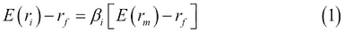

`E(r[i])` 是某证券的预期回报，`r[f]` 是无风险回报，`E(r[m])` 是市场组合的预期回报。CAPM 中的风险由贝塔 `β[i]` 来衡量，贝塔是个体证券与市场的协方差与市场回报方差的函数：

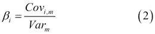

`Cov[i,m]` 是给定证券回报与市场回报之间的协方差，而 `Var[m]` 是市场回报的方差。

贝塔有多种解释。一方面，贝塔表示股票回报对市场组合回报的敏感度；另一方面，某个证券的贝塔表示该证券对市场组合所增加的风险。CAPM 模型指出，只有在系统性风险更高的情况下，市场才会提供更高的回报，因为非系统性风险可以通过多元化来分散，因此在此之后不能再支付风险溢价。

如果我们重新排列方程**(1)**，就会得到所谓的**证券市场线**（**SML**）的线性方程：

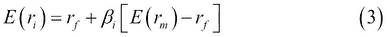

CAPM 模型指出，在均衡状态下，所有证券都应位于 SML 线上；因此，尽管这些证券或投资组合可能不是有效的，这个方程对每个证券或投资组合依然成立。如果这个方程不成立，市场上就缺乏均衡。例如，如果某个证券的市场回报高于 CAPM 模型所预期的回报，那么每个投资者都需要调整自己投资组合的组成，以降低该证券的回报并使上述方程成立。

# 套利定价理论

**套利定价理论** (**APT**)由*罗斯*（*1977*）提出，亦被用于金融领域来确定不同证券的回报。APT 模型指出，在均衡状态下，市场上不能存在套利机会，并且，资产的预期回报是多个随机因子的线性组合（*Wilmott 2007*）。这些因子可以是各种宏观经济因素或市场指数。在这个模型中，每个因子都有一个特定的贝塔系数：

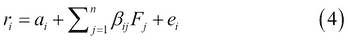

`α[i]` 是表示证券 `i` 的常数；`β[ij]` 是证券 `i` 对因子 `j` 的敏感度；`F[j]` 是系统性因子；而 `e[i]` 是证券的非系统性风险，均值为零。

APT 的一个核心概念是**因子投资组合**。因子投资组合是一个良好分散的投资组合，仅对一个因子做出反应，因此对所有其他因子的贝塔值为零，对该指定因子的贝塔值为 1。假设存在因子投资组合，可以通过套利论证来显示，任何良好分散的投资组合的风险溢价等于因子投资组合的风险溢价的加权和（*Medvegyev-Száz 2010*）。如果这个关系对每个良好分散的投资组合成立，则个别证券的预期回报将由因子的风险溢价（`RP[j]`）和其对该因子的敏感性（`β[ij]`）构成：

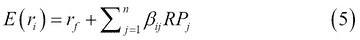

如果 APT 模型中只有一个因子，即市场投资组合的回报，我们称该模型为指数模型。此外，如果`α[i]`为零，则我们将得到 CAPM 的精确定价公式。

CAPM 与 APT 的区别如下：

+   CAPM 是一个基于经济学考虑的均衡模型，而 APT 是一个基于套利论证的统计模型。

+   在 APT 模型中，如果拥有一个良好分散的投资组合，可以给出预期回报与贝塔值的关系，因此，通过在投资组合中包含大量资产，可以在实践中构建这种关系。而在 CAPM 模型中，所谓的市场投资组合是无法构建的。

+   CAPM 认为预期回报与贝塔值的关系适用于每个证券，而 APT 认为这种关系几乎适用于每个证券。

+   当市场存在错误定价时，在 APT 模型中，只要少数投资者改变投资组合结构，就足以得到证券的公平价格；而在 CAPM 模型中，每个投资者都必须如此操作。

# 贝塔估计

证券对某个因子的敏感性可以通过过去的价格波动来估计。我们将从单因子指数模型中估计贝塔值。首先，我们展示从不同来源收集和同步数据的过程，然后介绍简单的贝塔估计方法，最后建立一个线性回归模型。

## 数据选择

我们从 Quandl 下载某只股票（例如谷歌）和市场指数（标准普尔 500 指数）价格的时间序列，时间范围是 2009 年 6 月 1 日到 2013 年 6 月 1 日，如第二章所讨论：

```py
> library(Quandl)
> Quandl.auth("yourauthenticationtoken")
> G <- Quandl('GOOG/NASDAQ_GOOG',
+   start_date = '2009-06-01', end_date = '2013-06-01')

```

得到的`G`是一个包含 6 个变量的变量，我们只需要`收盘价`的值：

```py
> str(G)
'data.frame':     1018 obs. of  6 variables:
 $ Date  : Date, format: "2009-06-01" "2009-06-02" ...
 $ Open  : num  419 426 426 435 445 ...
 $ High  : num  430 430 432 441 447 ...
 $ Low   : num  419 423 424 434 439 ...
 $ Close : num  427 428 432 440 444 ...
 $ Volume: num  3323431 2626012 3535593 3639434 3681002 ...
> G <- G$Close

```

对标准普尔 500 指数的数据运行相同的代码，尽管现在我们处理的是`调整收盘价`：

```py
> SP500 <- Quandl('YAHOO/INDEX_GSPC',
+   start_date = '2009-06-01', end_date = '2013-06-01')
> SP500 <- SP500$'Adjusted Close'

```

调整后的收盘价已经考虑了股息和拆股的影响。由于 Google 在此期间没有支付股息，也没有拆股，因此在本例中不需要进行此类调整。我们还需要无风险收益的时间序列，即 1 个月的美元 LIBOR 利率。虽然我们将使用每日回报，但 1 个月的利率可以视为短期利率，并且不容易受到隔夜利率中的随机噪音的影响。

```py
> LIBOR <- Quandl('FED/RILSPDEPM01_N_B',
+   start_date = '2009-06-01', end_date = '2013-06-01')
> LIBOR <- LIBOR$Value

```

如你从之前的 Quandl 调用中看到的，每次数据都是从不同的数据提供商那里获取的。这也导致了数据结构的一些差异，因为我们有 Google 的`Close`值，S&P 500 的`Adjusted Close`值，以及`LIBOR`数据的`Values`值。向量的长度似乎也不相等：

```py
> sapply(list(G, SP500, LIBOR), length)
[1] 1018 1008 1024

```

这意味着某些时间序列还包括其他时间序列中省略的日期。我们可以定义`intersect`函数来找到日期的交集，并在重新下载数据后仅筛选出这些数据单元格：

```py
> G     <- Quandl('GOOG/NASDAQ_GOOG',
+          start_date = '2009-06-01', end_date = '2013-06-01')
> SP500 <- Quandl('YAHOO/INDEX_GSPC',
+          start_date = '2009-06-01', end_date = '2013-06-01')
> LIBOR <- Quandl('FED/RILSPDEPM01_N_B',
+          start_date = '2009-06-01', end_date = '2013-06-01')

```

由于`intersect`函数只能应用于两个向量，我们调用`Reduce`函数来识别三个时间序列中共同的日期：

```py
> cdates <- Reduce(intersect, list(G$Date, SP500$Date,LIBOR$Date))

```

现在，让我们简单地过滤所有三个数据框，只保留相关的单元格，以获得向量：

```py
G      <- G[G$Date %in% cdates, 'Close']
SP500  <- SP500[SP500$Date %in% cdates, 'Adjusted Close']
LIBOR  <- LIBOR[LIBOR$Date %in% cdates, 'Value']

```

下载并清理数据后，你需要使用以下公式计算股票和市场指数的对数回报（`r[t]`）：

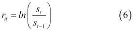

`S[t]` 是第`t`天的市场价格。在 R 中，这可以表达为一个函数（请参见第二章，*组合优化*，了解更多细节）：

```py
> logreturn <- function(x) log(tail(x, -1) / head(x, -1))

```

下一步，应该通过减去无风险的每日对数回报（`r[ft]`）来确定风险溢价。由于`LIBOR`利率是以货币市场为基础报价的——实际/360 天计数规则——且时间序列中包含的是百分比格式的利率，因此应使用以下公式：

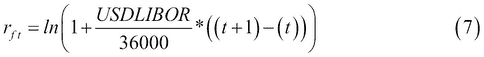

`t` 和 `t-1` 指的是日期，因此它们之间的差异是两个收盘值之间的天数，通常是 1 天，在我们的案例中，或者如果中间有非工作日，则会更多。使用以下命令，可以在 R 中轻松计算结果：

```py
> rft <- log(1 + head(LIBOR, -1)/36000 * diff(cdates)) 
> str(rft)
num [1:1001] 1.81e-05 1.81e-05 1.81e-05 1.81e-05 5.42e-05 ...

```

我们通过计算共同日期之间的`diff`，已经计算出了`(t+1)`和`t`之间的差异。风险溢价（`R[it]`）可以表示为：

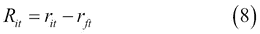

## 简单的贝塔估算

一旦我们得到了两个时间序列；分别是个别资产（以 Google 为例）和市场（S&P 500）的风险溢价，就可以根据公式**(2)**计算贝塔值：

```py
> cov(logreturn(G) - rft, logreturn(SP500) - rft) / 
+   var(logreturn(SP500) - rft)
[1] 0.8997941

```

这也可以通过添加一个新函数来简化，用来描述风险溢价：

```py
> riskpremium <- function(x) logreturn(x) - rft
> cov(riskpremium(G), riskpremium(SP500)) / var(riskpremium(SP500))
[1] 0.8997941

```

这种计算 beta 的方式与方程**(2)**有所不同，因为我们使用了风险溢价而不是回报。由于 CAPM 和 APT 都是单期模型，因此在两边都使用无风险回报进行修正不会影响结果。另一方面，在从时间序列估计 beta 时，我们必须决定是否使用回报或风险溢价，因为模型中的参数会有所不同，除非在常数无风险回报的情况下（*Medvegyev-Száz 2010*）。我们遵循前面描述的方法，就像遵循金融文献一样，但我们必须补充一点，Merryl Lynch 是通过回报计算 beta 的。

## 线性回归中的 Beta 估计

我们可以使用线性回归来估计 beta，其中解释变量是**市场风险溢价**（**MRP**），而因变量将是证券的风险溢价。因此，回归方程具有以下形式，这是**证券特征线**（**SCL**）的公式：

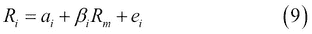

我们将使用**普通最小二乘法**（**OLS**）估计来确定方程**(8)**的线性回归模型。特征线的截距是`α`，即市场因素无法解释的股票回报部分。函数的斜率（方程**(8)**）显示了对市场因素的敏感度，用 beta 来衡量。

我们可以使用 R 中内置的`lm`命令轻松计算回归模型：

```py
> (fit <- lm(riskpremium(G) ~ riskpremium(SP500)))

Call:
lm(formula = riskpremium(G) ~ riskpremium(SP500))

Coefficients:
 (Intercept)  riskpremium(SP500) 
 0.0002078           0.8997941

```

我们不仅保存了结果，还打印了它们，因为我们添加了额外的括号。在模型的帮助下，也可以轻松绘制出 Google 的特征线，图表上显示 Google 的风险溢价与市场风险溢价的关系。

```py
> plot(riskpremium(SP500), riskpremium(G))
> abline(fit, col = 'red')

```

下图展示了结果。横轴是 MRP，纵轴是 Google 股票的风险溢价：

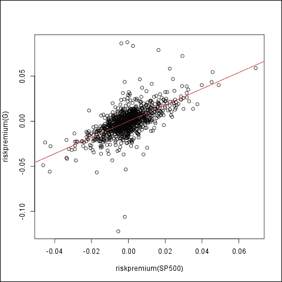

根据 CAPM，`α`等于零，因此我们假设`α[i]`为 0，然后解除此限制。我们可以通过在模型中传入`-1`来强制`α`为零：

```py
> fit <- lm(riskpremium(G) ~ -1 + riskpremium(SP500))

```

回归模型在 R 中的结果总结如下：

```py
> summary(fit)

Call:
lm(formula = riskpremium(G) ~ -1 + riskpremium(SP500))

Residuals:
 Min        1Q    Median        3Q       Max 
-0.089794 -0.005553  0.000166  0.005520  0.117087 

Coefficients:
 Estimate Std. Error t value Pr(>|t|) 
riskpremium(SP500)  0.90048    0.03501   25.72   <2e-16 ***
---
Signif. codes:  0 '***' 0.001 '**' 0.01 '*' 0.05 '.' 0.1 ' ' 1

Residual standard error: 0.0124 on 1000 degrees of freedom
Multiple R-squared:  0.3982,	Adjusted R-squared:  0.3976 
F-statistic: 661.6 on 1 and 1000 DF,  p-value: < 2.2e-16

```

较高的`F-statistic`值表明模型具有解释能力，beta 是显著的，原假设——beta 为零——在任何显著性水平下都应被拒绝。这些结果与 CAPM 一致。

如果我们通过放宽零假设`α`来进行测试，我们可以看到截距与零的差异不显著。较高的`p-value`值表明我们无法在任何常见的（超过 90%）显著性水平下拒绝原假设：

```py
> summary(lm(riskpremium(G) ~ riskpremium(SP500)))

Call:
lm(formula = riskpremium(G) ~ riskpremium(SP500))

Residuals:
 Min        1Q    Median        3Q       Max 
-0.089999 -0.005757 -0.000045  0.005307  0.116883 

Coefficients:
 Estimate Std. Error t value Pr(>|t|) 
(Intercept)        0.0002078  0.0003924   0.529    0.597 
riskpremium(SP500) 0.8997941  0.0350463  25.674   <2e-16 ***
---
Signif. codes:  0 '***' 0.001 '**' 0.01 '*' 0.05 '.' 0.1 ' ' 1

Residual standard error: 0.01241 on 999 degrees of freedom
Multiple R-squared:  0.3975,	Adjusted R-squared:  0.3969 
F-statistic: 659.2 on 1 and 999 DF,  p-value: < 2.2e-16

```

我们可以通过联合图检查残差，如下图所示。

```py
> par(mfrow = c(2, 2))
> plot(fit)

```

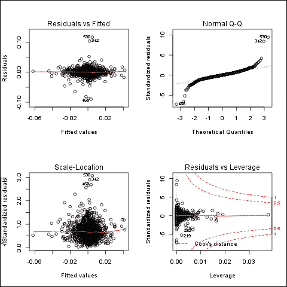

您还可以在**PerformanceAnalytics**包中找到内置函数`CAPM.alpha`和`CAPM.beta`，用于计算给定资产的阿尔法和贝塔参数。所需的参数是资产与基准资产的回报序列以及无风险利率。

# 模型测试

关于贝塔-回报关系的首次测试使用了二阶段线性回归法（*Lintner 1965*）。第一次回归估计了如上所述的个别证券的安全特征线和贝塔系数。在第二次回归中，证券的风险溢价是因变量，而贝塔系数是解释变量。原假设假定截距为零，曲线的斜率为市场风险溢价，市场风险溢价估算为样本的平均值。该测试可以通过增加一个解释变量来扩展：个别方差。

## 数据收集

我们将使用 2003 年至 2007 年间美国市场危机前时期的样本来展示测试。由于日数据包含更多的短期效应，我们将在从日时间序列计算出的月度回报上应用该测试。因此，我们需要更多股票的日价格时间序列；让我们下载 2003 年至 2007 年间按字母顺序排列的前 100 只标准普尔 500 指数成分股的价格：

```py
> symbols <- c("A", "AA", "AAPL", "ABC", "ABT", "ACE", "ACN", "ACT", "ADBE", "ADI", "ADM", "ADP", "ADSK", "AEE", "AEP", "AES","AET", "AFL", "AGN", "AIG", "AIV", "AIZ", "AKAM", "ALL", "ALTR", "ALXN", "AMAT", "AMD", "AMGN", "AMP", "AMT", "AMZN", "AN", "ANF", "AON", "APA", "APC", "APD", "APH", "APOL", "ARG", "ATI", "AVB", "AVP", "AVY", "AXP", "AZO", "BA", "BAC", "BAX", "BBBY", "BBT", "BBY", "BCR", "BDX", "BEAM", "BEN", "BF.B", "BHI", "BIIB", "BK", "BLK", "BLL", "BMC", "BMS", "BMY", "BRCM", "BRK.B", "BSX", "BTU", "BXP", "C", "CA", "CAG", "CAH", "CAM", "CAT", "CB", "CBG", "CBS", "CCE", "CCI", "CCL", "CELG", "CERN", "CF", "CHK", "CHRW", "CI", "CINF", "CL", "CLF", "CLX", "CMA", "CMCSA", "CME")

```

请注意，前面的列表仅包含 96 只股票的名称，因为有四只股票在参考时间区间内缺失了太多数据。

让我们通过`tseries`包从统一的数据库中下载这些数据集：

```py
> library(tseries)
> res <- lapply(symbols, function(symbol)
+   get.hist.quote(symbol, quote = "AdjClose", quiet = TRUE,
+   start = as.Date('2003-01-01'), end = as.Date('2007-01-01')))

```

因此，我们调用`get.hist.quote`函数，对每个`symbol`从默认的（Yahoo!）提供商下载调整后的收盘数据，不包含关于进度的任何详细信息（`quiet`）。请注意，抓取过程可能需要一些时间，并将产生 96 个时间序列的列表。现在，让我们也更新`SP500`和`LIBOR`，以适应新的时间区间，并定义新的公共日期交集：

```py
> LIBOR <- Quandl('FED/RILSPDEPM01_N_B',
+            start_date = '2003-01-01', end_date = '2007-01-01')
> SP500 <- Quandl('YAHOO/INDEX_GSPC',
+            start_date = '2003-01-01', end_date = '2007-01-01')
> cdates <- intersect(LIBOR$Date, SP500$Date)

```

如上所述，我们需要一个月度数据集，而不是下载的日数据；让我们选取每个月的第一个值。为此，我们需要将公共日期的列表保存为`Date`格式：

```py
> d <- data.frame(date = as.Date(cdates, origin = '1970-01-01'))
> str(d)
'data.frame':	998 obs. of  1 variable:
 $ date: Date, format: "2003-01-02" "2003-01-03" ...

```

接下来，我们需要在相同的数据框中添加月份的日期以及拼接后的年份和月份：

```py
> d$day <- format(d$date, format = '%d')
> d$my  <- format(d$date, format = '%Y-%m')

```

现在我们只需对每组`my`（代表同一年同一个月）中的`day`变量应用`min`函数，`day`代表月份中的日期：

```py
> (fds <- with(d, tapply(day, my, min)))
2003-01 2003-02 2003-03 2003-04 2003-05 2003-06 2003-07 2003-08 
 "02"    "03"    "03"    "01"    "01"    "02"    "01"    "01" 
2003-09 2003-10 2003-11 2003-12 2004-01 2004-02 2004-03 2004-04 
 "02"    "01"    "03"    "01"    "02"    "02"    "01"    "01" 
2004-05 2004-06 2004-07 2004-08 2004-09 2004-10 2004-11 2004-12 
 "03"    "01"    "01"    "02"    "01"    "01"    "01"    "01" 
2005-01 2005-02 2005-03 2005-04 2005-05 2005-06 2005-07 2005-08 
 "03"    "01"    "01"    "01"    "02"    "01"    "01"    "01" 
2005-09 2005-10 2005-11 2005-12 2006-01 2006-02 2006-03 2006-04 
 "01"    "03"    "01"    "01"    "03"    "01"    "01"    "03" 
2006-05 2006-06 2006-07 2006-08 2006-09 2006-10 2006-11 2006-12 
 "01"    "01"    "03"    "01"    "01"    "02"    "01"    "01"

```

我们需要再次将结果与日期合并：

```py
> (fds <- as.Date(paste(row.names(fds), fds, sep = '-')))
 [1] "2003-01-02" "2003-02-03" "2003-03-03" "2003-04-01" "2003-05-01"
 [6] "2003-06-02" "2003-07-01" "2003-08-01" "2003-09-02" "2003-10-01"
[11] "2003-11-03" "2003-12-01" "2004-01-02" "2004-02-02" "2004-03-01"
[16] "2004-04-01" "2004-05-03" "2004-06-01" "2004-07-01" "2004-08-02"
[21] "2004-09-01" "2004-10-01" "2004-11-01" "2004-12-01" "2005-01-03"
[26] "2005-02-01" "2005-03-01" "2005-04-01" "2005-05-02" "2005-06-01"
[31] "2005-07-01" "2005-08-01" "2005-09-01" "2005-10-03" "2005-11-01"
[36] "2005-12-01" "2006-01-03" "2006-02-01" "2006-03-01" "2006-04-03"
[41] "2006-05-01" "2006-06-01" "2006-07-03" "2006-08-01" "2006-09-01"
[46] "2006-10-02" "2006-11-01" "2006-12-01"

```

然后再次过滤`res`数据框，只保留上面识别出的日期：

```py
> res <- lapply(res, function(x) x[which(zoo::index(x) %in% fds)])

```

然后，在将列表与时间序列合并之后，转换为常规的`data.frame`格式并为列命名就非常简单：

```py
> res <- do.call(merge, res)
> str(res)
'zoo' series from 2003-01-02 to 2006-12-01
 Data: num [1:48, 1:96] 17.8 15.3 12.1 12.5 15 ...
 Index:  Date[1:48], format: "2003-01-02" "2003-02-03" ...
> res <- as.data.frame(res)
> names(res) <- symbols

```

这将导致一个 48 行 96 列的数据框。我们仍然需要按列计算每只下载的股票的回报，但为此，`rft`也应该根据每个月的第一个值进行更新：

```py
> LIBOR <- LIBOR[LIBOR$Date %in% fds, 'Value']
> rft <- log(1 + head(LIBOR, -1)/36000 * as.numeric(diff(fds)))
> res <- apply(res, 2, riskpremium)

```

让我们也将标准普尔 500 指数的值过滤为月度数据集：

```py
> SP500 <- SP500[SP500$Date %in% fds, 'Adjusted Close']

```

## 建模 SCL

利用股票收益的时间序列，我们可以计算每只证券的贝塔。因此，我们将得到一个风险溢价向量，它是样本数据的平均值，以及一个包含贝塔的向量。

要估计的第二个回归模型如下：

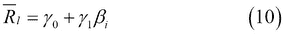

通过计算每只股票的`riskpremium`参数，并将其强制转换为`data.frame`，可以用基本循环一次性计算每只证券的贝塔和收益的均值：

```py
> res <- apply(res, 2, riskpremium)
> res <- as.data.frame(res)
> r <- t(sapply(symbols, function(symbol)
+        c(beta = lm(res[, symbol] ~ 
+                    riskpremium(SP500))$coefficients[[2]],
+          mean = mean(res[, symbol]))
+ ))
> r <- as.data.frame(r)

```

因此，遍历所有符号，让我们绘制计算得到的贝塔列表和风险溢价的平均值，如下图所示：

```py
> plot(r$beta, r$mean)
> abline(lm(r$mean ~ r$beta), col = 'red')

```

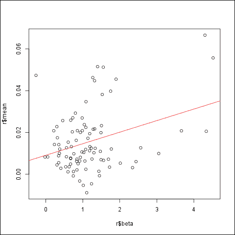

该模型可以描述如下：

```py
> summary(lm(r$mean ~ r$beta))

Call:
lm(formula = r$mean ~ r$beta)

Residuals:
 Min        1Q    Median        3Q       Max 
-0.024046 -0.008783 -0.003475  0.006485  0.039731 

Coefficients:
 Estimate Std. Error t value Pr(>|t|) 
(Intercept) 0.009084   0.002429   3.740 0.000325 ***
r$beta      0.005528   0.001678   3.295 0.001413 ** 
---
Signif. codes:  0 '***' 0.001 '**' 0.01 '*' 0.05 '.' 0.1 ' ' 1

Residual standard error: 0.01383 on 89 degrees of freedom
 (5 observations deleted due to missingness)
Multiple R-squared:  0.1087,	Adjusted R-squared:  0.09873 
F-statistic: 10.86 on 1 and 89 DF,  p-value: 0.001413

```

根据上述结果，截距为正，但与零的差异不显著。SML 的斜率为 0.5528%——按月计算——略低于预期，因为根据零假设，它应该是该期间市场风险溢价的平均值：0.69%。然而，这一差异在统计上也是不显著的。基于测试，不能拒绝贝塔回报关系。

## 测试个体方差的解释力

该测试可以进一步发展，涉及作为第二个解释变量的非系统性风险。某个证券的个体风险可以通过以下方式计算：

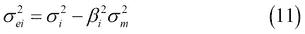

所以，首先我们必须计算方差向量，然后得到个体方差向量。要估计的回归方程如下：

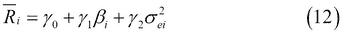

到目前为止，我们更新了用于计算贝塔和均值的上述循环，在`r`中：

```py
> r <- t(sapply(symbols, function(symbol) {
+    stock <- res[, symbol]
+    beta  <- lm(stock ~ riskpremium(SP500))$coefficients[[2]]
+    c(
+        beta = beta,
+        mean = mean(stock, na.rm = TRUE),
+        risk = var(stock, na.rm = TRUE) - beta² * var(SP500))
+ }))
> r <- as.data.frame(r)

```

尽管这个循环与之前的几乎相同，但大部分内容都根据**DRY**（**不要重复自己**）原则进行了重写和重新格式化。因此，首先我们将`symbol`的值存储在`stock`中，并在返回结果之前计算`beta`，并将其与`c`合并。现在，我们还为`mean`和`var`函数添加了`na.rm = TRUE`参数，以在计算之前移除可能的缺失值。我们的模型现在如下所示：

```py
> summary(lm(r$mean ~ r$beta + r$risk))

Call:
lm(formula = r$mean ~ r$beta + r$risk)

Residuals:
 Min        1Q    Median        3Q       Max 
-0.023228 -0.009175 -0.003657  0.006817  0.036262 

Coefficients:
 Estimate Std. Error t value Pr(>|t|) 
(Intercept)  1.400e-02  3.711e-03   3.772 0.000285 ***
r$beta      -1.743e-03  4.677e-03  -0.373 0.710293 
r$risk      -9.956e-08  5.798e-08  -1.717 0.089266 . 
---
Signif. codes:  0 '***' 0.001 '**' 0.01 '*' 0.05 '.' 0.1 ' ' 1

Residual standard error: 0.01381 on 93 degrees of freedom
Multiple R-squared:  0.1451,	Adjusted R-squared:  0.1267 
F-statistic: 7.891 on 2 and 93 DF,  p-value: 0.0006833

```

有趣的是，新的参数将贝塔的回归系数改为了负值。然而，另一方面，风险参数在 95%的显著性水平上被证明是无关紧要的。由于资本资产定价模型（CAPM）认为对于可分散风险不需要支付风险溢价，零假设假定`β[2]`为零。在这里，我们无法拒绝这一假设。

米勒和斯科尔斯（1972）解释了第一次资本资产定价模型（CAPM）测试的结果——`α`与零显著不同，且斜率远低于市场风险溢价的平均值——并给出了统计学原因。作为第二次回归（贝塔）的解释变量，它是通过第一次回归估算得出的，因此包含统计误差。这种估计偏差导致了观察到的显著截距和比预期更加平坦的证券市场线（SML）。这一结论可以通过模拟收益进行检验。关于模拟的更多细节可以在接下来的两章中找到。

# 总结

本章中，资产收益的系统性风险通过它们对市场方差的贡献——贝塔系数来衡量。我们使用线性回归来量化这种关系，并进行了假设检验，以确认资本资产定价模型的相关结论。
