# 第四章 固定收益证券

在第三章《资产定价模型》中，我们重点讨论了建立风险与其贝塔值、金融工具价格和投资组合之间关系的模型。第一个模型是 CAPM，采用了均衡方法，而第二个模型 APT 则建立在无套利假设的基础上。

固定收益组合管理的一般目标是建立一个具有特定风险/回报特征的固定收益证券组合。换句话说，投资组合经理的目标是将资金分配到不同的固定收益证券中，以最大化投资组合的预期回报，同时遵循既定的投资目标。

该过程包括收益率曲线、提前偿还行为和证券违约的动态建模。使用的工具包括时间序列分析、随机过程和优化。

固定收益证券的风险包括信用风险、流动性风险和市场风险等。前两者可以通过选择具有预定违约风险的证券来处理，例如，选择具有最低信用评级并具备适当流动性特征的证券。固定收益证券的市场风险通常通过久期、修正久期、基准久期或因子久期来衡量。这些都是衡量固定收益证券面临的利率风险的指标。本章重点讨论固定收益证券的市场风险。

# 衡量固定收益证券的市场风险

给定收益率曲线，获得固定收益证券现值的一般公式为：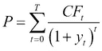，其中 *T* 是证券到期的时间，*CF[t]* 是证券在时间 *t* 的现金流，*y[t]* 是在时间 *t* 收到的现金流的折现率。即使到期收益率保持不变，债券的市场价格会随着时间的推移趋向其面值。这种价格变化是预期之中的，因此不被视为风险。市场风险来自利率的变化，这会导致再投资风险和清算风险。再投资风险影响的是息票支付的再投资利率，而清算风险则影响债券的市场价格。

利率变化对市场价格的影响是通过检查债券价格作为到期收益率(*y*)的函数来衡量的：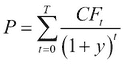。由于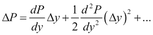，由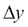引起的价格变化百分比可表示为：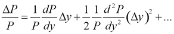，即！衡量固定收益证券的市场风险的二阶近似为！衡量固定收益证券的市场风险。当收益率按周期表示时，复利久期(*D*)、修正久期(*D**)，和凸度的定义如下：

+   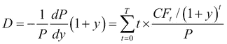

+   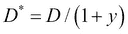

+   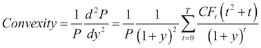

债券的定价公式显示了债券到期收益率(*y*)与其价格*(P*)之间的明显反向关系。由于久期与债券到期收益率的变化与其价格变化的关系密切，它是衡量债券利率风险的最重要指标。久期是债券加权平均到期时间。

## 示例 – 在 R 中的实现

假设有一只 10 年期债券，面值为 1,000 美元，到期时支付本金，年利率 8%，按季度支付票息，并假设收益率曲线在 10%的水平上使用连续复利计算。

为了计算上述描述的指标，我们将使用**GUIDE**包，它提供了一个图形用户界面，用于各种金融计算器和定价金融衍生品的交互式图表。因此，在以下示例中，大多数参数将比其他章节以更直观的方式进行设置。

安装并加载包后，可以通过`GUIDE`函数启动主程序：

```py
> install.packages('GUIDE')
> library(GUIDE)
> GUIDE()

```

这将加载主窗口，显示一个菜单，用于访问该包的 55 个函数，如以下截图所示：

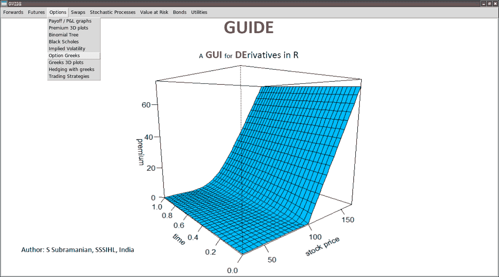

这些函数也可以通过直接的 R 命令在顶部菜单栏旁边调用。

公允价值由`bondprice`快速给出，金额为 867.28 美元。`priceyield`函数展示了折现率与债券价格之间的反向关系。债券的久期由`bonddur`确定，如以下截图所示：

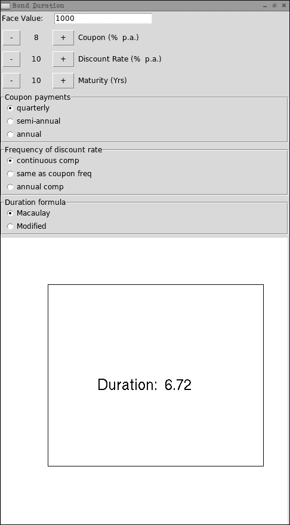

该函数可以设置为反映**年度**或**半年度**的票息支付，且**折现率的频率**可以变化。该函数还允许计算**修正久期**。相同债券的**凸度**通过`bondconv`计算，如以下截图所示：

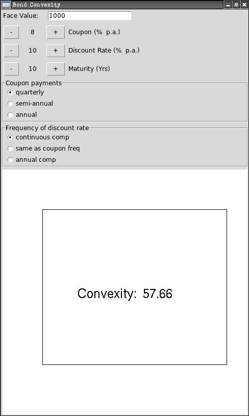

请注意，当贴现率以连续复利收益率表示时，凸度由以下公式给出：

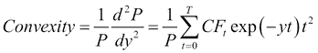

`duryield`和`durcoupon`函数可用于评估收益率增加如何影响久期，以及较大的票息如何影响债券的久期。

**久期与到期**之间的关系通过`durmaturity`函数显示，如下截图所示：

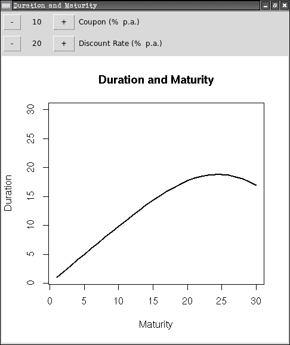

计算了债券的久期或凸度后，投资组合的久期或凸度可以通过将投资组合各个组成部分的久期或凸度加权平均来轻松计算。

其他软件包，如**maRketSim**和**termstrc**，也包含了能够计算债券或整个固定收益投资组合的久期、修正久期和凸度的功能。

# 固定收益投资组合的免疫化

当投资组合不受利率变化的影响时，该投资组合就被视为已免疫。久期提供了一个很好的利率敏感性度量，因此通常用于免疫化投资组合。由于使用久期假设收益曲线是平坦的，并且收益曲线发生的是小的平行移动，因此免疫化投资组合受这些假设的限制，不受影响意味着随着收益变化，投资组合的价值仅会轻微变化。

有两种不同类型的免疫化策略：净资产免疫化和目标日期免疫化。

## 净资产免疫化

固定收益投资组合经理通常会对收益曲线未来的变化有一定的看法。假设一位投资组合经理预期短期内利率会上升。由于这对投资组合将产生不利影响，投资组合经理可以决定通过进入远期协议或利率互换，将投资组合的久期调整为零。这些工具可以改变投资组合的久期，并帮助将投资组合的久期调整为零，而无需清算整个投资组合。

投资组合经理的另一个目标是根据投资组合基准的久期来设定投资组合的久期。如果他们对市场走势的预期得到验证，这有助于超越投资组合的基准表现。

银行通常更关心保护其股本价值不受市场价格变化的影响。这通常通过将股本的久期设置为所需的水平来实现。

## 目标日期免疫化

假设我们考虑一个投资者，他有一个特定的负债现金流。通过构建一个固定收益证券的资产组合来实现投资者投资组合的免疫化，该资产组合的久期等于负债的久期。这种目标日期免疫化确保将来支付义务将从投资组合的资产中得到满足。该过程可以通过例如 `genPortfolio.bond` 函数来实现。

## 专项免疫化

专项免疫化是一种特殊的目标日期免疫化方式，其中资产的现金流与每个负债的组成部分相匹配。可以通过使用零息债券为负债组件提供资金来实现这一目标。

# 可转换债券定价

可转换债券通常由信用评级较低且增长潜力较大的公司发行。这些公司可以通过赋予债券持有人将债券转换为一定数量的公司普通股的权利（但没有义务），来降低其利息成本。投资者在享有转换为股权的潜在上涨空间的同时，还能通过债券提供现金流获得下行保护。公司从可转换债券转换时，公司的杠杆效应会减少，而转股时的股本稀释则是这一过程的权衡。

这些特征表明可转换债券的行为有三个不同的阶段：价内可转换债券（转换价格 < 股票价格）表现得像股票，平价可转换债券（转换价格 = 股票价格）被视为股票和债务的组合，而价外可转换债券（转换价格 > 股票价格）则表现出债务特征。即使在 Black-Scholes-Merton 模型框架下，为可转换债券定价也可能很复杂，但基本原则是分别对债券和期权进行定价。

假设我们考虑一只 5 年期的可转换债券，面值为 100 美元，年息 5%，年付利息，并且在到期时可将面值转换为 4 股普通股票。假设所有期限的无风险利率为 5%，该债券的信用利差为 2%，基础股票的价格为 20 美元，股票的波动率为 20%，股息收益率为零。R 可用于为该可转换债券定价。首先，我们定义将用于以下示例的今天日期：

```py
> today <- Sys.Date()

```

接下来，我们设置交易和结算日期，并在给定平坦收益率曲线的情况下计算折现曲线的值（基于 `times` 参数，即当前在 0 到 10 之间的序列，步长为 0.1）：

```py
> params <- list(tradeDate  = today - 2,
+                settleDate = today,
+                dt         = 0.25)
> times <- seq(0, 10, 0.1)
> dividendYield <- DiscountCurve(params, list(flat = 10e-6), times)
> riskFreeRate  <- DiscountCurve(params, list(flat = 0.05), times)

```

前述的股息收益率、无风险利率，以及以下固定基础资产的价格和波动性将传递给后续的 Black-Scholes 过程，后者将为该债券建立二项式定价引擎：

```py
> process <- list(
+     underlying = 20,
+     divYield   = dividendYield,
+     rff        = riskFreeRate,
+     volatility = 0.2)

```

我们还应该指定转换比例，这决定了债券持有人如果决定将债券转换为股票时，将获得多少普通股股份。债券的面值和信用利差也在此处指定：

```py
> bondparams <- list(
+     exercise        = "eu",
+     faceAmount      = 100,
+     redemption      = 100,
+     creditSpread    = 0.02,
+     conversionRatio = 4,
+     issueDate       = as.Date(today + 2),
+     maturityDate    = as.Date(today + 1825))

```

具有年付息的债券：

```py
> dateparams <- list(
+     settlementDays        = 3,
+     dayCounter            = "ActualActual",
+     period                = "Annual",
+     businessDayConvention = "Unadjusted")

```

并将上述指定的参数传递给 `ConvertibleFixedCouponBond` 函数：

```py
> ConvertibleFixedCouponBond(bondparams, coupon = 0.05, process, dateparams)
Concise summary of valuation for ConvertibleFixedCouponBond 
 Net present value :  107.1013 
 clean price :  107.06 
 dirty price :  107.1 
 accrued coupon :  0.041096 
 yield :  0.033848 
 cash flows : 
 Date   Amount
 2014-06-21   4.9589
 2015-06-21   5.0000
 2016-06-21   5.0073
 2017-06-21   4.9927
 2018-06-21   5.0000
 2018-06-21 100.0000

```

如果不考虑可转换特性，债券的价值大约为 92 美元，而包含额外特性的债券价值为 107.1 美元。现在，让我们检查一下当我们开始将标的股票的价格从 1 提高到 30 时，净现值的变化：

```py
> res <- sapply(seq(1, 30, 1), function(s) {
+     process$underlying = s
+     ConvertibleFixedCouponBond(bondparams, coupon = 0.05, process, dateparams)$NPV
+ })
> plot(1:30, res, type = 'l',
+    xlab = 'Price of the underlying stocks',
+    ylab = 'Net Present Value')

```

下图显示了标的股票价格与计算出的可转换债券价值之间的关系：

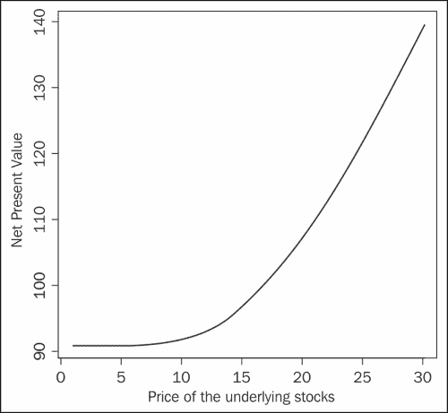

# 概要

在本章中，我们使用 R 来衡量固定收益投资组合的利率风险。我们介绍了 GUIDE 包中的部分函数，并应用了 RQuantLib 包中的可转换债券定价函数。在下一章中，你将学习如何使用 R 来估算即期收益率曲线。
