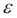

# 第五章：估算利率期限结构

在上一章中，我们讨论了利率水平和期限结构的变化如何影响固定收益证券的价格。现在，我们将重点讨论利率期限结构的估算，这是金融学中的一个基本概念。它几乎在所有金融决策中都是一个重要的输入。本章将介绍通过三次样条回归估算期限结构的方法，并演示如何使用`termstrc`包和`govbonds`数据集来估算利率期限结构。

# 利率期限结构及相关函数

一只*t*年期的零息债券，面值为 1 美元，是一种在到期时支付 1 美元的证券，也就是说，*t*年后支付。设  为其市场价值，也称为*t*年期的折现因子。该函数  称为折现函数。基于无套利假设，通常假定 ， 是单调递减的，并且 。还通常假定  是二次连续可微的。

设  表示*t*年期零息债券的连续复利年收益率；它定义为：


函数  称为（零息）收益率曲线。

设  表示瞬时远期利率曲线，或简称远期利率曲线，其中：


这里  是指在一个假设的远期贷款协议中，双方约定的利率，其中一方承诺在*t*年后，以非常短的期限，按签订合同时固定的利率将一笔金额借给另一方。

折现函数、收益率曲线和远期利率曲线相互决定，是利率期限结构的可能表示方式。利率期限结构可能与这些函数中的任何一个或全部相关。

# 估算问题

我们无法直接观察期限结构，但我们可以观察那些价格依赖于期限结构的工具的市场价格，从而估计期限结构。一个关于期限结构的良好信息来源是政府债券市场，在这里通常有大量的流动性证券交易，其价格完全依赖于期限结构。

假设有 *n* 种债券交易，其总价格（或脏价格）用  表示。有 *m* 个日期，在这些日期，至少有一种债券的持有者会收到支付。这些支付分别在  年后到期，其中  。矩阵 *C* 包含债券的现金流。我们将债券价格建模为债券现金流现值与一个正态分布误差项的和：


这里 *d* 是包含折现因子的向量 ，而  是包含误差项的向量。债券的观察市场价格可能与现金流现值有所不同，原因有两个：可能存在观测市场价格的测量误差和/或存在轻微的市场不完美，比如交易成本，这允许理论价格与市场价格之间存在小的差异，而这种差异并不构成套利机会。误差项的方差可能因债券不同而有所差异：


这里， 是一个  正半定对角矩阵。合乎逻辑的假设是，债券价格误差项的标准差与其买卖价差成正比，也就是债券的买价与卖价之间的差异。因此， 通常被选为债券 *i* 的买卖价差的平方。

方程式*(1)*看起来像一个典型的线性回归，然而，它通常不能直接估计，因为观察值（债券价格）的数量通常少于需要估计的系数数量。由于这个原因，我们需要对期限结构进行建模，以减少需要估计的参数数量，并确保最终的期限结构估计是合理的。

# 通过线性回归估计期限结构

假设折现函数可以表示为一个线性组合，其中的  函数是二次连续可微的函数，如下所示：


哪里


我们可以通过广义最小二乘法估计权重。我们稍后将讨论函数的选择。估计的折现函数是估计权重的函数。


设*D*表示一个矩阵，其元素是，而是包含权重的向量。因此并且


这是一个线性回归模型，约束条件为，其可以表示为如下：


其中。

在方程（2）中，权重的 GLS 估计在方程（3）约束下为


其中


# 三次样条回归

如果我们希望估计能够得到合理的折现函数，我们需要仔细选择函数。典型的折现函数是非线性的。它是一个单调递减的函数，并且在无限远处渐近于零。因此，拟合一条直线并不是一个好主意。我们可以尝试拟合一个高阶多项式来逼近折现函数，但这也不是一个令人满意的解决方案。如果我们拟合低阶多项式，它们通常不够灵活，拟合效果也不好，尤其是在短期到期的情况下。如果我们拟合高阶多项式，它们可能拟合得较好，但往往会在长期到期时产生剧烈波动，特别是在到期债券相对较少的情况下。这些剧烈波动通常会导致不现实的期限结构估计。

样条函数是帮助解决这个问题的函数，因为它们的灵活性可以在需要的地方局部增加，而无需提高估计函数的多项式阶数。通过将三次样条拟合到折现函数来估计期限结构的做法是由*麦卡洛克*于 1971 年首次提出的。

三次样条是实函数，其定义域是实数线的一个区间。定义域被所谓的节点点分为子区间，其中。三次样条函数在每个子区间内是三次多项式，这些三次多项式在节点点处连接，使得样条函数在上连续且二次连续可导。每个三次样条函数在上和给定的节点点可以表示为基样条函数的线性组合，这些基样条函数是同一节点点上的三次样条。因此，如果我们想为折扣函数拟合一个三次样条，我们只需选择作为三次样条基函数，这一点我们将在`govbonds`数据集中的德国政府债券数据中演示。

```py
> data(govbonds)
> str(govbonds[['GERMANY']])
List of 8
 $ ISIN        : chr [1:52] "DE0001141414" "DE0001137131" "DE0001141422" "DE0001137149" ...
 $ MATURITYDATE: Date[1:52], format: "2008-02-15" "2008-03-14" ...
 $ ISSUEDATE   : Date[1:52], format: "2002-08-14" "2006-03-08" ...
 $ COUPONRATE  : num [1:52] 0.0425 0.03 0.03 0.0325 0.0413 ...
 $ PRICE       : num [1:52] 100 99.9 99.8 99.8 100.1 ...
 $ ACCRUED     : num [1:52] 4.09 2.66 2.43 2.07 2.39 ...
 $ CASHFLOWS   :List of 3
 ..$ ISIN: chr [1:384] "DE0001141414" "DE0001137131" "DE0001141422" "DE0001137149" ...
 ..$ CF  : num [1:384] 104 103 103 103 104 ...
 ..$ DATE: Date[1:384], format: "2008-02-15" "2008-03-14" ...
 $ TODAY       : Date[1:1], format: "2008-01-30"

```

该数据集包含 52 只德国债券的信息，我们将集中关注发行和到期日期、价格以及提供的现金流。要创建一个类似的数据集以便进一步分析，请参见`?govbonds`的示例。

首先，我们使用`prepro_bond`函数预处理债券数据集，该函数返回现金流、到期时间、到期收益率、基于久期的权重矩阵、脏价格和应计利息向量等值：

```py
> prepro <- prepro_bond('GERMANY', govbonds)

```

一个重要的决策是设置节点点的数量并确定它们的位置。第一个和最后一个节点点分别为零和 T，其他节点点通常选择使得每个子区间大致有相同数量的债券到期。设置节点点的数量并不那么简单。它将决定需要估计的参数数量，并将显著影响估计的期限结构。可以通过将`K`设置为`1`开始估计过程，然后将其增加一个，重复估计直到拟合优度有显著改善，并且估计的期限结构表现良好。或者，可以遵循 McCulloch 提出的经验法则，节点点的数量大约为。我们现在将在以下命令中演示这一点，借助从`prepro`对象分解出的到期矩阵：

```py
> m <- prepro$m[[1]]

```

让我们定义德国债券的数量为`n`，并将其平方根的四舍五入值定义为`s`（节点点数量），结果为`7`：

```py
> n <- ncol(m)
> s <- round(sqrt(n))

```

如果`s`的结果小于三，确定理想的节点点就很容易了。我们将使用以下命令：

```py
> c(floor(min(y[, 1])), max(m[, ncol(m)]))

```

在这里，我们已经识别出到期矩阵中第一列的最小值（`min`）和最后一列的最大值（`max`），并将这些结果四舍五入到下方的最大整数（`floor`）。

如果`s`大于三，则第一个和最后一个结点点的定义与前面的命令行一样，其他结点点则通过一些辅助向量计算，这些辅助向量的长度为`s-3`，如以下命令所示：

```py
> i     <- 2:(s-2)
> h     <- trunc(((i - 1) * n) / (s - 2))
> theta <- ((i - 1) * n) / (s - 2) - h

```

`i`向量仅仅持有从`2`到`5`的序列，从中我们计算了到期矩阵的列（`h`）的索引，这些索引将用于搜索其他结点点。这里`theta`作为权重使用。

```py
> apply(as.matrix(m[, h]), 2, max) ++     theta * (apply(as.matrix(m[, h + 1]), 2, max) – +     apply(as.matrix(m[, h]), 2, max))

```

在这里，我们找到了到期矩阵中每一列的最大值，并在以下输出中加入了`theta`加权的`h+1`列和`h`列最大值的差异：

```py
DE0001135101 DE0001141463 DE0001135218 DE0001135317
 1.006027     2.380274     5.033425     9.234521

```

现在我们使用`c`函数将先前计算出的最小（`min`）值和最大（`max`）值与前面的结果连接起来，这些结果是从前面的代码块中复制的，用于识别所有结点点：

```py
> c(floor(min(y[, 1])), apply(as.matrix(m[, h]), 2, max) + theta * (apply(as.matrix(m[, h + 1]), 2, max) - apply(as.matrix(m[, h]), 2, max)), max(m[, ncol(m)]))
 DE0001135101 DE0001141463 DE0001135218 DE0001135317 
0.0000     1.006027     2.380274     5.033425     9.234521  31.44657

```

# 应用的 R 函数

尽管我们已经在前面的例子中使用了一些`termstrc`包中的函数，演示了如何确定理想的结点点数量并指定它们，但这一过程也可以通过一些进一步的 R 函数更轻松地完成，如以下命令行所示：

```py
> x <- estim_cs(govbonds, 'GERMANY')
> x$knotpoints[[1]]
 DE0001135101 DE0001141463 DE0001135218 DE0001135317 
0.0000     1.006027     2.380274     5.033425     9.234521 31.44657

```

首先，我们使用了`estim_cs`函数，该函数基于三次样条（*Ferstl-Haydn, 2010*）估算票息债券的期限结构，并返回一个包含`knotpoints`名称的结点点列表。请注意，`estim_cs`是与列表一起工作的——就像包中的大多数函数一样——这就是为什么`x$knotpoints`返回了一个列表，我们只检查了其中第一个元素，该元素与我们在前一部分手动计算的值相同。

前述函数返回了一些其他有用的值，默认情况下会导致以下命令行：

```py
---------------------------------------------------
Estimated parameters and robust standard errors:
---------------------------------------------------
[1] "GERMANY:"

t test of coefficients:

 Estimate  Std. Error t value  Pr(>|t|) 
alpha 1  1.9320e-02  1.5230e-02  1.2686    0.2111 
alpha 2 -8.4936e-05  3.7926e-03 -0.0224    0.9822 
alpha 3 -3.2009e-04  1.1359e-03 -0.2818    0.7794 
alpha 4 -3.7101e-04  3.9074e-04 -0.9495    0.3474 
alpha 5  7.2921e-04  9.9560e-05  7.3243 3.375e-09 ***
alpha 6  2.0159e-03  1.3019e-04 15.4843 < 2.2e-16 ***
alpha 7 -4.1632e-02  4.5903e-03 -9.0696 1.011e-11 ***
---
Signif. codes:  0 '***' 0.001 '**' 0.01 '*' 0.05 '.' 0.1 ' ' 1

```

拟合优度可以通过`summary`函数展示，就像其他 R 模型一样：

```py
---------------------------------------------------
Goodness of fit:
---------------------------------------------------

 GERMANY 
RMSE-Prices         0.198573
AABSE-Prices        0.131036
RMSE-Yields (in %)  0.130108
AABSE-Yields (in %) 0.057223

```

零息收益率曲线及其置信区间可以通过简单地对`x`对象调用`plot`来轻松展示，其中的结点点也被包含在内。


前面的图表展示了估算的零息收益率曲线和数据库中各个债券的到期收益率。到期时间最短的两个债券是异常值，因为它们在到期前可能流动性较差。我们看到，估算的收益率曲线与 10 年的到期收益率非常接近。对于较长的到期时间，估算的零息收益率通常高于相应的票息债券到期收益率。这可能是拟合不完美的结果，或者可以通过这些债券不是零息债券而是票息债券来解释。

通过使用`par`设置`mfrow,` 我们还可以在同一框架中绘制两个不同的图形（我们还设置了`multiple=TRUE`，这样图形将在不等待用户输入的情况下渲染）。例如，我们可以使用以下命令绘制`x`对象中的折现曲线和远期曲线：

```py
> par(mfrow = c(2,1))
> plot(x$discount, multiple = TRUE)
> plot(x$forward, multiple = TRUE)

```


在前面的图中，我们可以看到，估计的折现函数和远期利率曲线表现良好，不存在套利机会（折现函数单调递减，远期利率曲线不会产生不现实的值和波动）。

三次样条估计的期限结构通常能给出良好的估计。然而，有时估计的期限结构并不理想（远期利率曲线波动较大）。在这种情况下，可以使用非线性样条回归或简约收益率曲线模型，但这些内容超出了本章的范围。

通过`estim_nss`函数或`YieldCurve`包，您还可以使用包括 Nelson/Siegel、Diebold/Li、Svensson 和调整后的 Svensson 方法等更多资源。

# 总结

本章讨论了通过三次样条回归进行期限结构估计的方法，并演示了如何在 R 中估计利率的期限结构。在简要介绍期限结构和利率的理论后，还讨论了最基本的方法，如线性回归模型及相关问题，本章详细概述了三次样条回归模型在 R 中的实现，并提到了一些已经发布的 R 函数和包，以应对具有更复杂预期的任务。
