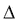
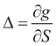

# 第六章 衍生品定价

衍生品是其价值源自（或依赖于）另一产品价值的金融工具，称为**标的资产**。衍生品的三种基本类型是远期和期货合约、掉期和期权。在本章中，我们将重点讨论后者，并展示如何在 R 中处理基本的期权定价模型及一些相关问题。我们将从概述如何在 R 中使用连续的黑-斯科尔斯模型和二项式 Cox-Ross-Rubinstein 模型开始，然后继续讨论这些模型之间的联系。此外，通过计算和绘制希腊字母，我们将展示如何分析期权所涉及的最重要的市场风险。最后，我们将讨论隐含波动率的含义，并通过实际市场数据绘制波动率微笑来说明这一现象。

与期货或掉期相比，期权的最重要特点是你不能确定交易（买入或卖出标的资产）是否会发生。这一特性使得期权定价更加复杂，并要求所有模型对标的资产未来价格走势做出假设。我们在此讨论的两个模型在这些假设上有所不同：黑-斯科尔斯模型采用连续过程，而 Cox-Ross-Rubinstein 模型则采用离散随机过程。然而，其他假设非常相似，我们会看到它们的结果非常接近（此外，原则上是相同的）。

# 黑-斯科尔斯模型

黑-斯科尔斯模型的假设（*Black 和 Sholes, 1973*，参见 *Merton, 1973*）如下：

+   标的资产（*S*）的价格遵循几何布朗运动：

    这里 *µ*（漂移）和 *σ*（波动率）是常数参数，*W* 是标准维纳过程。

+   市场是无套利的。

+   标的资产是没有分红的股票。

+   可以以任何（甚至是分数）数量买入和（做空）卖出标的资产。

+   没有交易成本。

+   短期利率（*r*）已知且在一段时间内保持不变。

该模型的主要结果是，在这些假设下，欧洲看涨期权（*c*）的价格具有封闭形式：

+   

+   ,

+   ,

这里 *X* 是行权价，*T-t* 是期权的到期时间，*N* 表示标准正态分布的累积分布函数。给出期权价格的方程通常称为黑-斯科尔斯公式。从期权-看涨-平价关系可以容易地看出，具有相同参数的欧洲看跌期权（*p*）的价格由下式给出：


现在考虑 2013 年 6 月的谷歌股票看涨和看跌期权，期权到期日为 2013 年 9 月（即，距到期有 3 个月）。假设当前标的股票价格为 900 美元，行权价为 950 美元，谷歌的波动率为 22%，无风险利率为 2%。我们将使用**fOptions**包中的`GBSOption`函数计算看涨期权的价值。除了之前讨论的参数外，我们还必须设置持有成本（b）；在原始的 Black-Scholes 模型中（假设标的没有支付股息），它等于无风险利率。

```py
> library(fOptions)
> GBSOption(TypeFlag = "c", S = 900, X =950, Time = 1/4, r = 0.02,
+   sigma = 0.22, b = 0.02)
Title:
 Black Scholes Option Valuation

Call:
 GBSOption(TypeFlag = "c", S = 900, X = 950, Time = 1/4, r = 0.02,
 b = 0.02, sigma = 0.22)

Parameters:
 Value:
 TypeFlag c 
 S        900 
 X        950 
 Time     0.25 
 r        0.02 
 b        0.02 
 sigma    0.22 

Option Price:
 21.79275

Description:
 Tue Jun 25 12:54:41 2013

```

这个延长的输出返回传递的参数，结果显示在`Option Price`标签下方。将`TypeFlag`设置为`p`将计算看跌期权的价格，现在我们只关心结果（可以在`price`槽中找到——有关更多细节，请查看对象的`str`）而不需要文本输出：

```py
> GBSOption(TypeFlag = "p", S = 900, X =950, Time = 1/4, r = 0.02, sigma = 0.22, b = 0.02)@price
[1] 67.05461

```

和上一章一样，我们还可以选择使用**GUIDE**包提供的更易用的计算器来计算上述值。运行`blackscholes()`函数将触发一个模态窗口，其中有一个表单，我们可以在其中输入相同的参数。请注意，函数使用股息收益率代替持有成本，在本例中持有成本为零。

# Cox-Ross-Rubinstein 模型

**Cox-Ross-Rubinstein**（CRR）模型（*Cox, Ross 和 Rubinstein，1979*）假设标的资产的价格遵循离散的二项过程。价格在每个周期可能上涨或下跌，因此根据二项树变化，如下图所示，其中*u*和*d*是固定的乘数，衡量价格上涨和下跌时的变化。CRR 模型的一个重要特性是*u=1/d*，且树是重组的；也就是说，如果价格先上涨再下跌或反之，两个周期后的价格将相同，如下图所示：


要构建二项树，我们首先必须决定我们要模拟多少步（*n*）；即期权到期时间将被划分成多少步。或者，我们可以确定树上每个时间步长的长度*t*，（以年为单位）：


如果我们知道标的资产的波动率（*σ*），则可以根据以下公式确定*u*和*d*参数：


因此：


在二项模型中定价期权时，我们需要确定标的资产的价格树，直到期权到期。然后，在获取所有可能的到期价格后，我们可以根据以下公式计算相应的期权价值：

+   

+   

为了使用二项模型确定期权价格，在每个节点，我们必须计算下一个两个可能期权值的期望值，然后进行折现。问题在于，折现时使用什么期望回报并不显而易见。窍门是，我们是通过假设的概率计算期望值，这使得我们可以使用无风险利率进行折现。这个概率叫做风险中性概率（*p[n]*），可以通过以下公式确定：


风险中性概率的解释是相当合理的：如果基础资产价格上涨的单期概率是 *p[n]*，那么基础资产的期望回报将是无风险利率。因此，使用 *p[n]* 计算的期望值可以按照 *r* 进行折现，期权在树中任何节点的价格都可以通过以下公式确定：


在上述公式中，*g* 是某一节点中期权的价格（它可以是看涨期权或看跌期权），*g[u]* 和 *g[d]* 是该衍生品在一个周期后两个可能节点的值。

为了在 R 中演示 CRR 模型，我们将使用与 Black-Scholes 公式中相同的参数。因此，*S*=`900`，*X*=`950`，*σ*=`22`% ，*r*=`2`%，*b*=`2`%，*T-t*=`0.25`。我们还需要设置 *n*，即二项树上的时间步数。为了演示，我们将使用一个 3 期模型：

```py
> CRRBinomialTreeOption(TypeFlag = "ce", S = 900, X = 950,
+   Time = 1/4, r = 0.02, b = 0.02, sigma = 0.22, n = 3)@price
[1] 20.33618
> CRRBinomialTreeOption(TypeFlag = "pe", S = 900, X = 950,
+   Time = 1/4, r = 0.02, b = 0.02, sigma = 0.22, n = 3)@price
[1] 65.59803

```

值得注意的是，从二项模型得到的期权价格与之前计算的 Black-Scholes 价格接近（但并不完全相同）。除了最终结果，即期权的当前价格外，我们可能还会对整个期权树感兴趣：

```py
> CRRTree <- BinomialTreeOption(TypeFlag = "ce", S = 900, X = 950,
+   Time = 1/4, r = 0.02, b = 0.02, sigma = 0.22, n = 3)
> BinomialTreePlot(CRRTree, dy = 1, xlab = "Time steps",
+   ylab = "Number of up steps", xlim = c(0,4))
> title(main = "Call Option Tree")

```

这里我们首先通过 `BinomialTreeOption` 计算了一个矩阵，使用给定的参数，并将结果保存在 `CRRTree` 中，然后将其传递给绘图函数，指定了 x 轴和 y 轴的标签，x 轴的范围设置为从 `0` 到 `4`，如下图所示。y 轴（上行步数）显示了基础资产总共上涨了多少次。下行步数定义为负的上行步数。


欧式看跌期权可以通过将之前代码中的 `TypeFlag` 更改为 `pe` 来类似显示：


# 两个模型之间的联系

在应用了两种基本的期权定价模型后，我们给出了它们的一些理论背景。我们并不打算给出详细的数学推导，而是旨在强调（并随后在 R 中加以说明）这两种方法的相似性。连续期权定价和二项式期权定价背后的金融思想是相同的：如果我们通过持有适当数量的标的资产来完美对冲期权，这意味着我们创建了一个无风险投资组合。由于市场应该是无套利的，因此无风险投资组合的收益必须等于无风险利率。一个重要的观察是，正确的对冲比率是每个期权持有标的资产。因此，这个比率是期权价值相对于标的资产价格的偏导数（或其在二项模型中的离散对应物）。这个偏导数被称为期权的 delta。两种模型之间的另一个有趣的联系是，delta 对冲策略和相关的无套利论证得出了相同的定价原理：衍生品的价值是其未来可能价值的风险中性期望值，按无风险利率贴现。这个原理在二项树模型中非常容易处理，我们逐节点计算贴现的期望值；然而，连续模型也有相同的逻辑，即使期望值的数学计算更为复杂。这就是为什么我们只给出了这个论证的最终结果，即布莱克-斯科尔斯公式。

现在我们知道这两种模型具有相同的定价原则和思想（delta 对冲和风险中性估值），但我们也观察到它们的数值结果并不相等。原因是描述标的资产价格波动的随机过程并不相同。尽管如此，它们非常相似；如果我们像在*《Cox-Ross-Rubinstein 模型》*一节中那样，根据波动率参数来确定*u*和*d*的值，那么二项过程就可以逼近几何布朗运动。因此，随着时间步数的增加（或等效地，减少步长），二项模型的期权价格会趋近于布莱克-斯科尔斯模型的期权价格。

为了说明这种关系，我们将计算二项模型中期权价格随时间步数增加的变化。在下图中，我们将结果与期权的布莱克-斯科尔斯价格进行比较：


该图是通过一个循环生成的，该循环将`N`从`1`运行到`200`，以计算带有固定参数的`CRRBinomialTreeOption`：

```py
> prices <- sapply(1:200, function(n) {
+   CRRBinomialTreeOption(TypeFlag = "ce", S = 900, X = 950,
+     Time = 1/4, r = 0.02, b = 0.02, sigma = 0.22, n = n)@price
+ })

```

现在`prices`变量包含了`200`个计算值：

```py
> str(prices)
 num [1:200] 26.9 24.9 20.3 23.9 20.4...

```

让我们还用广义布莱克-斯科尔斯期权计算该期权：

```py
> price <- GBSOption(TypeFlag = "c", S = 900, X = 950, Time = 1/4, r = 0.02, sigma = 0.22, b = 0.02)@price

```

并在一个联合图中显示这些价格，GBS 选项以红色渲染：

```py
> plot(1:200, prices, type='l', xlab = 'Number of steps',
+     ylab = 'Prices')
> abline(h = price, col ='red')
> legend("bottomright", legend = c('CRR-price', 'BS-price'),
+     col = c('black', 'red'), pch = 19)

```

# 希腊字母

理解期权可能涉及的风险类型对所有市场参与者至关重要。希腊字母的理念是衡量不同类型的风险；它们表示期权对不同因素的敏感性。普通看涨期权的希腊字母有：`delta` (，对基础资产价格的敏感性)，`gamma` (，delta 对基础资产价格的敏感性，delta 的 delta)，`theta` (，对时间的敏感性)，`rho` (，对无风险利率的敏感性)，以及`vega` (*V*，对波动率的敏感性)。从数学角度来看，所有希腊字母都是衍生品价格的偏导数：

+   

+   

+   

+   

+   

可以通过`GBSGreeks`函数轻松计算每个期权的希腊字母：

```py
> sapply(c('delta', 'gamma', 'vega', 'theta', 'rho'), function(greek)
+   GBSGreeks(Selection = greek, TypeFlag = "c", S = 900, X = 950,
+     Time = 1/4, r = 0.02, b = 0.02, sigma = 0.22)
+ )
 delta         gamma          vega         theta           rho
0.347874404   0.003733069 166.308230868 -79.001505841  72.82355323

```

分析在市场参数变化时某个希腊字母如何变化通常是有用的。这种分析可能帮助我们更好地理解风险。例如，看涨期权的 delta 作为基础资产价格的函数是一个 S 形的递增曲线，范围从 0 到 1。这些特性始终有效，但如果时间流逝，我们接近期权到期日，曲线会变得越来越陡峭（参见下图）。其含义如下：如果看涨期权被行使的可能性很大，那么它就非常类似于一个长期远期合约，因此，delta 接近 1。如果行使的机会非常低，持有看涨期权就像持有空头仓位，delta 接近 0。随着时间的推移，基础资产价格区间内行使期权的不确定性（即既不太可能，也不太不可能）逐渐缩小；因此，delta 的曲线变得越来越陡峭。为了说明这一行为，我们将绘制看涨期权的 delta，作为基础资产价格的函数，展示三种不同的到期时间。

为了计算 delta，我们运行两个循环：一个循环使用三个不同的时间值，另一个循环让`S`从`500`跑到`1500`：

```py
> deltas <- sapply(c(1/4, 1/20, 1/50), function(t)
+             sapply(500:1500, function(S)
+               GBSGreeks(Selection = 'delta', TypeFlag = "c",
+      S = S, X = 950, Time = t, r = 0.02, b = 0.02, sigma = 0.22)))

```

结果的`deltas`包含 1001 行（对应`S`值）和三列（对应指定的时间），我们将在联合图中展示：

```py
> plot(500:1500, deltas[, 1], ylab = 'Delta of call option',
+    xlab = "Price of the underlying (S)", type = 'l')
> lines(500:1500, deltas[, 2], col='blue')
> lines(500:1500, deltas[, 3], col='red')
> legend("bottomright", legend = c('t=1/4', 't=1/20', 't=1/50'),
+   col = c('black', 'blue', 'red'), pch = 19)

```

下图展示了看涨期权在三种不同到期时间下的 delta：


确定或绘制复杂期权策略的希腊字母非常相似。例如，计算跨式头寸（一个由相同参数的看涨期权和看跌期权组成的投资组合）的 delta，只需分别计算看涨期权和看跌期权的 delta，然后将它们相加。我们将绘制跨式头寸的`delta`，作为基础资产价格的函数。我们可能会观察到，图形与之前看涨期权的 delta 非常相似，但现在的 S 曲线范围从-1 到 1：

```py
> straddles <- sapply(c('c', 'p'), function(type)
+                sapply(500:1500, function(S)
+                  GBSGreeks(Selection = 'delta', TypeFlag = type, S = S, X = 950, Time = 1/4, r = 0.02, b = 0.02, sigma = 0.22)))

```

所以我们调用一个嵌套循环，让`S`从`500`到`1500`，对看涨和看跌期权都进行计算，保持其他参数不变，并将结果的德尔塔值保存在一个矩阵中。接下来的命令将这些行（看涨和看跌期权）的和呈现出来：

```py
> plot(500:1500, rowSums(straddles), type='l',
+  xlab='Price of the underlying (S)', ylab = 'Delta of straddle')

```

结果图展示了一个跨式期权头寸的德尔塔与标的资产价格的关系，如下图所示：


# 隐含波动率

Black-Scholes 模型常常因为一些缺点而受到批评。一个重要的问题是该模型假设标的资产的波动率是常数，而现实中这一假设并不成立。此外，由于波动率无法直接观测到，`volatility`是模型中最难以校准的参数。由于这一困难，Black-Scholes 公式通常以间接的方式来估算`volatility`参数；我们观察期权的市场价格，然后根据其他已知参数，寻找使得 Black-Scholes 定价与市场价格相等的*σ*值。这个*σ*参数被称为期权的隐含波动率。正如 Riccardo Rebonato 所言，隐含波动率是“在错误的公式中放入错误的数字以获得正确的价格”（*Rebonato, 1999, p.78*）。

我们将通过一些 Google 期权来说明隐含波动率的计算。这些期权是到期日为 2013 年 9 月 21 日的看涨期权，行权价格从 700 美元到 1150 美元不等（共有 76 个不同的期权）。我们在 2013 年 6 月 25 日从[finance.google.com](http://finance.google.com)收集了这些期权的卖出价格，并将它们放入 CSV 文件中。进行计算时，我们需要知道当天 Google 的股价为 866.2 美元。由于距离到期日还有 88 天，我们将使用 88/360 年作为`Time`参数。无风险利率和持仓成本假设保持为 2%。

首先，从 CSV 文件中加载 Google 的期权数据：

```py
> goog <- read.csv('goog_calls.csv')

```

然后，针对数据集的每一行运行一个循环，使用给定的参数计算波动率：

```py
> volatilites <- sapply(seq_along(goog$Strike), function(i)
+  GBSVolatility(price = goog$Ask.Price[i], TypeFlag = "c",
+  S = 866.2, X = goog$Strike[i], Time = 88/360, r = 0.02, b = 0.02))

```

`volatilities`变量是一个向量，包含了计算出来的值：

```py
> str(volatilites)
 num [1:76] 0.258 0.253 0.269 0.267 0.257...

```

这可以与行权价格进行比较：

```py
> plot(x = goog$Strike, volatilites, type = 'p',
+    ylab = 'Implied volatiltiy', xlab = 'Strike price (X)')

```

因此，下图展示了不同执行价格的隐含波动率：


值得注意的是，针对 Google 期权计算的隐含波动率会根据行权价格的不同而变化。这与 Black-Scholes 模型的假设相悖，后者认为波动率是常数。观察到的隐含波动率模式（中等行权价的波动率较低）并不是唯一的，且在金融市场中相当常见。由于曲线的特定形态，这一现象被称为“波动率微笑”。

# 总结

在本章中，我们使用 R 语言通过 Black-Scholes 模型和 Cox-Ross-Rubinstein 模型来定价普通的香草期权。此外，我们还研究了这些期权的基本希腊字母以及隐含波动率。有关这些主题的金融背景的更多细节，请参见(*Hull, 2011*)。除了了解 fOptions 包中的一些工具外，我们还编写了几个用于模拟目的的循环和自定义函数。下一章将集中讨论如何通过各种模型管理信用风险，例如通过蒙特卡洛模拟和信用评分方法选择最佳信用组合。
