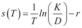

# 第七章 信用风险管理

本章介绍了一些信用风险管理的有用工具。信用风险是指由于金融协议中对方信用质量的意外变化而导致的财务损失分布（*Giesecke 2004*）。为管理信用风险，已经开发了多种工具和行业解决方案。根据文献，可以将信用风险视为**违约风险**、**降级风险**或**对手方风险**。在大多数情况下，违约风险直接与债务或信用的未履行风险相关。而降级风险则是在债券价格由于信用评级恶化而下降，但并未发生实际的信用事件。对手方风险是指合同对方未履行合同义务的风险。然而，信用事件的合同或监管定义通常比仅仅是未支付要广泛。无论是哪种情况，建模和估计违约的可能性在所有三种情况中都是至关重要的。

金融机构通过多种方式进行信用风险管理。一般来说，信用风险管理的任务如下：

+   信用投资组合选择（例如，商业银行关于贷款或信用评分的决策）

+   衡量和预测违约或降级的概率（例如，使用信用评级迁移矩阵与 CreditMetrics）

+   模拟因违约或降级导致的金融损失分布（对于单一实体：结构定价和风险模型或对于投资组合：依赖结构建模）

+   缓解或消除信用风险（通过对冲、多样化、预防或保险；我们在本书中不做探讨）

在本章中，我们将使用 R 语言展示一些前面列出的问题的示例。首先，我们介绍信用损失建模的基本概念，即结构方法和简化形式方法及其在 R 中的应用。之后，我们提供一种将相关随机变量与 copula 结合的实用方法，这是结构化信用衍生品定价的有效技术。我们还展示了 R 如何管理信用迁移矩阵，最后，我们深入探讨使用分析工具（如 logit 回归和 probit 回归）进行信用评分分析，并介绍**接收者操作特征**（**ROC**）分析。

# 信用违约模型

本章第一部分的目标是展示如何使用 R 进行标准信用风险模型的定价和蒙特卡洛模拟。接下来的各节将提供损失分布的基本图景，并生成和定价单一债务工具。

## 结构模型

我们从著名的基于期权的 Merton 模型（*Merton 1974*）开始，作为结构方法的入门模型。Merton 将风险债务评估为公司价值的有条件索赔。假设`V`公司价值遵循几何布朗运动：


在上述公式中，`μ`是漂移参数，`σ>0`是波动率参数，`dW`是维纳过程的微分，初始资产值为`V[0]>0`。该模型假设收益率曲线为平坦，`r`为常数利率，并让我们定义违约状态为：在债务到期（T）时，资产 V 的价值低于负债（`K`）。我们将到期时的 V[T]公司价值表示为以下积分：


在前面的公式中，我们使用伊藤引理表示`dlnV[t]`，以导出公司价值对数的微分，如下所示：


在生成高斯分布的随机变量以捕捉的同时，我们通过以下离散方法计算到期时的 V[T]公司价值：


其中`∆t`表示经过时间的单期长度。我们按照这个逻辑，用 R 模拟公司价值。首先，设置模拟的参数，即初始资产价值、漂移和波动率参数，如下所示：

```py
> V0 <- 100; nu <- 0.1; sigma <- 0.2

```

接下来，声明`∆t`的长度和时间周期的结束（`Time`）：

```py
> dt <- 1 / 252; Time <- 1

```

我们还计算时间周期的数量：

```py
> M <- Time / dt

```

最后，决定生成的轨迹数：

```py
> n <- 10000

```

为了生成伪随机变量，以便稍后能够复制，每次调用生成器函数之前设置一个随机种子：

```py
> set.seed(117)

```

要生成`V`过程的对数增量（`ΔlnV`），使用指定的均值和标准差从正态分布中生成`n*M`个数字：

```py
> val <- rnorm(n*M,
+   mean = (nu - sigma² / 2) * dt, 
+   sd   = sigma * dt⁰.5)

```

将这些数字存储在一个具有`M`行和`n`列的`matrix`中：

```py
> dlnV <- matrix(val, M, n)

```

为了获得公司价值随时间变化（`V`），总结增量的对数，并如上所述，取该总和的指数，并将其与初始公司价值相乘。`n`条轨迹的等效代码如下：

```py
> V <- V0 * exp(apply(dlnV, 2, cumsum))

```

使用的`cumsum`函数与`apply`命令常见。使用`matplot`绘制前五条轨迹，如下所示：

```py
> matplot(x = seq(0 + dt, Time, dt), y = V[, 1:5], type = 's', lty = 1, +    xlab = 'Time',
+    ylab = 'Firm value trajectories',
+    main = 'Trajectories of firm values in the Merton model')

```

我们选择了`V`的前五列（`1:5`）进行绘制，使用实线（`lty=1`）和阶梯线（`type='s'`），得到了如下图：


请注意，风险债务的价格是根据风险中性或鞅 P 测度计算的，风险债务到期时折现收益的期望值，其中漂移为`r`风险自由利率，公式如下所示：


如果我们设置`r`无风险利率和债务的面值（`K`）：

```py
> r <- 0.05; K <- 80

```

我们可以将蒙特卡洛定价表示为债务面值和先前计算出的`V`的平行最小值（`pmin`），然后从中提取`M^(th)`列的均值，如前面公式所示，具体如下：

```py
> D <- exp(-r * Time) * mean((pmin(V[M, ], K)))

```

对于标准参数和固定伪随机生成变量`D`，面值为 80 美元的风险债务计数：

```py
> D
[1] 75.73553

```

从布莱克-舒尔斯定价公式得出，风险债务在`t=0`时的价值可以表示为`V`公司价值减去股权价值（`E`），这实际上是`V`的一个欧洲看涨期权。注意定价公式`c^(BS)`，我们得到：


可以使用`fOptions`包中的`GBSOption`函数来计算债务价值。在安装并调用以下库后，可以使用以下适当的函数：

```py
> install.packages("fOptions"); library(fOptions)

```

将`TypeFlag`参数设置为`"c"`（看涨期权），其他参数设置为之前定义的值。选择参数`b`为`r`无风险利率，以获取布莱克-舒尔斯欧洲看涨期权，并在命令末尾写入`@price`槽位，以返回从生成的`fOption`类对象中获得的`price`值：

```py
> V0 - GBSOption(TypeFlag = "c", S = V0, X = K, Time = Time, r = r,
+
b =
r, sigma = sigma)@price

```

我们得到了以下结果，与我们之前的估计非常接近：

```py
[1] 75.41116

```

然而，解析计算的价格与数值计算的价格之间存在一些小差异；随着轨迹数量的增加和`Δt`的减小，基于蒙特卡洛模拟的价格将趋向理论价格。让我们按照以下方式计算风险债务在`t=0`时的信用利差期限结构（表示为`s(T)`），其中信用利差依赖于债务的到期时间（`T`）：



对于不同的到期时间（从 0.1 年到 10 年，步长为 0.1 年），将这些利差绘制成驼峰形曲线。定义时间网格如下：

```py
> Time <- seq(0.1, 10, 0.1)

```

并重新计算网格上每个点的债务值，以计算信用利差：

```py
> D <- V0 - GBSOption(TypeFlag = "c", S = V0, X = K, Time = Time, r = r,
+
b = r,

sigma = sigma)@price

```

绘制此曲线是有益的：

```py
> matplot(x = Time, y = creditspreads, type = 'l', xlab = 'Maturity',
+    ylab = 'Credit spreads',
+    main = 'Term structure of credit spreads in the Merton model')

```

下图显示了默顿模型中信用利差的团队结构：


默顿模型有几种扩展，例如，穆迪的 KMV 应用或布莱克和考克斯的首次击中时间方法。

## 强度模型

第二种常见且流行的信用违约建模方法是基于强度的（简化形式）建模。在这个框架中，我们假设违约发生时没有任何前兆可以预测。违约强度的动态取决于违约的预测概率。我们稍后在本章中展示一个例子，其中强度是常数。

强度模型的核心思想是，在给定时间间隔内，独立违约的次数来自泊松分布。设`τ[1]`、`τ[2]`、...、`τ[i]`、...、`τ[n]`为随机违约时间。因此，设`N[t]`表示截至时间`t`的违约次数，如下所示：


指示函数公式如下：


在`[s,t]`区间内，跳跃次数等于`k`的概率是通过泊松分布得出的，其中`λ[u]`是时间`u`时的违约瞬时强度：


在时间`t`之前发生违约的概率是以下广义指数累积分布函数的期望值：


然而，尽管基础模型使用常数`λ`危险率，工业模型采用更复杂的结构。例如，在双随机泊松模型（或 Cox 模型）中，危险率遵循 Cox-Ingersoll-Ross 过程，如下方公式所示：


**Cox-Ingersoll-Ross**（**CIR**）过程的模拟由`sde`包提供：

```py
> library(sde)

```

重新定义时间维度、到期时间、长度和时间周期数：

```py
> Time <- 1; dt <- 1/252; M <- Time / dt

```

然后，通过声明`X0`初始值、`θ[1]`、`θ[2]`漂移参数（`θ[1] / θ[2]`是长期值，`θ[2]`是调整速度）和`θ[3]`波动率参数来创建 CIR 过程：

```py
> lambda <- sde.sim(X0 = 0.1, delta = dt,T = Time, N = M,
+     theta = c (0.05, 0.5, 0.2), model = "CIR")

```

在 R 中生成泊松过程是很容易的。让我们生成`n*(M+1)`个泊松分布的随机变量（`n`是轨迹数），带有一个`lambda`参数向量（此模拟的`θ`向量证明该过程是双随机或 Cox 过程）：

```py
> n <- 5
> set.seed(117); val <- rpois(n * (M + 1), lambda)

```

将这些数字存储在一个`matrix`中，具有`M+1`行和`n`列，如下所示：

```py
> dN <- matrix(val, M + 1, n)

```

将`N[t]`的增量（`dN`）加起来，以获得整个 Cox 过程（`N`）：

```py
> N <- apply(dN, 2, cumsum)

```

如同我们之前在本章中所做的那样绘制它。结果图应类似于下图所示。

```py
> matplot(x = seq(0, Time, dt), y = N[, 1:5], type = 's', xlab = 'Time',
+    ylab = "'Number of defaults' process trajectories",
+    main = 'Trajectories of Cox processes ')

```


# 相关违约——投资组合方法

在本节中，我们展示如何使用 Copula 处理相关的随机变量，用于信用投资组合损失分布的模拟。**Copula**函数是均匀分布的随机变量的联合累积分布函数。**Copula**函数包含所有关于组件依赖结构的信息。任何连续分布的随机变量都可以转换为均匀分布的变量，这为一般建模提供了可能性；例如，它可以与结构性方法结合使用。通过使用`copula`包，我们演示了如何模拟两个均匀分布的随机变量，使用高斯 Copula 和 t-Copula，并且如何从生成的数据中拟合一个高斯 Copula 参数。（此方法也可以应用于历史数据集。）该包还在涉及 Copula 的广泛话题中提供了有用的功能，例如绘图或拟合涉及阿基米德 Copula 的 Copula 类。

首先，在加载`copula`包后，声明一个具有`0.7`相关性的高斯 copula 类，如下所示：

```py
> library(copula)
> norm.cop <- normalCopula(0.7)

```

然后，生成`500`个服从高斯 copula 依赖结构的均匀分布随机变量的实现：

```py
> set.seed(117); u1 <- rCopula(500, norm.cop)

```

为了进行比较，定义一个具有`0.7`相关性和`4`自由度的`tcopula`类：

```py
> t.cop <- tCopula(0.7, df = 4)

```

现在，生成`500`个具有 t-copula 依赖关系的随机变量对：

```py
> set.seed(117); u2 <- rCopula(500, t.cop)

```

将结果绘制为两个并排的图表。`par`命令确保两个图表将并排放置，按行和两列排列（`mfcol`）。

```py
> par(mfcol = c(1, 2))
> plot(u1, main = 'Scatter graphs of random variable pairs generated by Gaussian copula')
> plot(u2, main = 'Scatter graphs of random variable pairs generated by t-copula')

```


使用最大似然法（`ml`）拟合`u1`数据的高斯 copula 相关参数，其中函数使用我们之前定义的`norm.cop`对象的 copula 家族类型：

```py
> fit.ml <- fitCopula(norm.cop, u1, method = "ml")

```

当我们打印以下结果时，我们得到了估算的相关性约为 0.69：

```py
> fit.ml
fitCopula() estimation based on 'maximum likelihood'
and a sample of size 500.
 Estimate Std. Error z value Pr(>|z|) 
rho.1  0.68583    0.01936   35.43   <2e-16 ***
---
Signif. codes:  0 '***' 0.001 '**' 0.01 '*' 0.05 '.' 0.1 ' ' 1
The maximized loglikelihood is  164.8
Optimization converged
Number of loglikelihood evaluations:
function gradient
 28        3

```

我们注意到该包支持其他一些估算相关性的方式。

# 迁移矩阵

信用评级转换是指公司或政府债券从一个评级迁移到另一个评级。一个广为人知的工业应用是 CreditMetrics 方法。它为债券投资组合提供了一个风险建模工具，用于估算投资组合因降级和升级而导致的**条件在险价值**（**CVaR**）和信用利差。在这一部分中，我们展示了如何从转移矩阵计算信用利差。

我们必须定义**违约损失**（**lgd**）、评级（在本示例中为`A`、`B`和`D`）以及一年期转移矩阵，以计算信用利差：

```py
> library(CreditMetrics)
> lgd <- 0.5
> rc <- c( "A", "B", "D")
> M <- matrix(c(85, 13, 2, 5, 80, 15, 0, 0, 100 ) /100, 3, 3,
+          dimnames = list(rc, rc), byrow = TRUE)

```

命令`cm.cs`根据迁移矩阵计算信用利差：

```py
> cm.cs(M, lgd)
 A          B
0.01005034 0.07796154

```

根据这个示例，评级为`"A"`的债务工具的信用利差约为 1%，而评级为`"B"`的债务工具的信用利差约为 7.8%，这些是从`M`迁移矩阵计算出来的。

# 在 R 中开始信用评分

R 提供了强大的统计工具用于信用评分。我们在这里强调一些最常用的技术，即使用 logit 和 probit 回归进行违约概率估计和 ROC 曲线分析。在行为信用评分和应用信用评分过程中，可以按照横截面计量经济学理论建议的常规方式估算或评分违约概率。

Logit 和 probit 回归是广义线性回归模型，用于处理二元因变量，其中两个结果可以是，例如，违约或不违约。Logit 回归使用逻辑函数；而 probit 模型则应用标准正态分布的累积分布函数来估计违约概率。在这两种情况下，自变量的系数通常通过最大似然法进行估计。Logit 和 probit 回归模型可以通过 `glm` 命令调用，该命令是 R 中用于估计系数的广义线性模型函数。典型的 R 回归分析工具非常适合进一步的检验。例如，`anova` 函数在提供经典方差分析时也非常有用。

信用评分模型构建者经常使用接收者操作特征曲线（ROC 曲线）来展示其估计模型的表现。ROC 曲线显示了灵敏度（灵敏度：接受未违约的样本与所有未违约样本的比值）与 1 减去特异性（特异性：拒绝违约的样本与所有违约样本的比值）的比值。`pROC` 包含 `roc` 函数，用于绘制 ROC 曲线。该文档完善的包可以通过常规方式安装，并且可以使用 `plot` 命令绘制 ROC 曲线。

# 总结

本章简要介绍了与信用风险建模相关的一些最常见方法。然而，处理违约风险的工业方法有很多。先进方法的基础通常是一些结构性和基于强度的方法。Copula 模型在建模信用组合风险方面仍然非常流行，特别是在结构化信用衍生品定价中。R 语言中有强大且全面的 copula 建模包。建模降级风险的第一步是了解管理迁移矩阵和 CreditMetrics 方法的原理。最后，我们简要概述了 R 中信用评分的可能性。
