# 第八章 极值理论

极端损失的风险是许多风险管理问题的核心，既包括保险也包括金融。极端的市场波动可能对投资者的证券投资组合构成重大下行风险。为了应对未来的信用损失，需要为贷款组合中的极端损失情景设定准备金。银行所需的资本水平应该足够高，以吸收极端的操作性损失。保险公司需要为自然或人为灾难造成的损失做好准备，甚至是以前未曾经历过的损失规模。

**极值理论**（**EVT**）关注极端事件的统计分析。该方法提供与极端观测一致的分布，同时具有理论支持的参数形式。EVT 的理论考虑弥补了传统估计的不可靠性（由于极端数据的稀缺）。EVT 允许量化极端事件的统计数据，甚至可能超越迄今为止的最极端观测。

在极值理论中，应用最广泛的模型类型是**阈值超越模型**。这些模型描述了所有超过某个高水平的极大观测值的分布，从而提供了分布的*尾部*的估计。由于许多风险管理问题可以用分布的尾部来表述，因此这些模型可以直接应用于此类问题。

本章的目标是通过实际的风险管理应用实例，介绍极值理论在保险和金融领域的可能应用。首先，我们简要概述了极值理论中的阈值超越模型。接着，我们详细地展示了如何将模型拟合到火灾损失分布的尾部。我们使用拟合的模型来计算火灾损失的高分位数（风险值）和条件期望（预期损失）。

# 理论概述

设随机变量*X*表示我们希望建模的随机损失，其分布函数为*F(x) = P(X ≤ x)*。对于给定的阈值*u*，超过该阈值的损失*Y = X – u*具有以下分布函数：

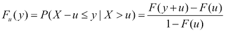

对于大类的潜在损失分布，当阈值*u*趋近于损失分布的右端点时，超过该阈值的*Fu*损失分布会收敛到**广义帕累托分布**（**GPD**）。这一结果来自于 EVT 中的一个重要极限定理。有关详细信息，读者可以参考*McNeil, Frey, and Embrechts (2005)*。GPD 的累积分布函数如下：

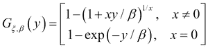

这里，*ξ* 通常被称为形状参数，*β* 被称为尺度参数。

严格来说，GPD 只是高阈值之上超额损失的*极限*分布，但它即使在有限阈值下也能作为超额损失分布的自然模型。换句话说，对于足够高的阈值，超额损失分布已经可以视为接近 GPD，因此可以将其作为超额分布的模型。本质上，我们假设：

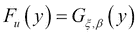

对于某些*ξ*和*β*。

一旦拟合了广义 Pareto 分布（GPD）到超额损失数据，它可以用于计算高分位数（风险值，Value at Risk）和原始损失分布的条件期望。具体来说，损失分布函数在阈值*u*之上可以建模为：

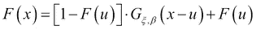

与*F(u)*通常通过经验方法估计。这代表了原始损失分布在阈值之上的尾部的参数化模型。

# 应用 – 模型化保险索赔

在本章的其余部分，我们将通过一个实际的风险管理应用案例来演示如何使用极值理论（EVT）。我们将前述的方法应用于火灾保险索赔，目的是拟合尾部分布并提供分位数估计和条件期望，以刻画大额火灾损失的概率和幅度。我们注意到，完全相同的步骤也可以应用于信用损失或操作损失。在市场风险管理问题中，如果底层数据通常是某一证券的回报率，我们将从数据集中剔除盈利数据，只关注损失；否则，建模步骤依然相同。

R 中有多个包可用于极值分析。本章将介绍`evir`包，具体命令如下。关于 R 中各种极值理论包的良好概述，请参见*Gilleland, Ribatet, 和 Stephenson (2013)*。

如前所述，我们需要先安装并加载`evir`包，然后才能使用它：

```py
> install.packages("evir")
> library(evir)

```

本例中使用的数据来自丹麦的大型工业火灾保险索赔。该数据集涵盖了 1980 年至 1990 年的数据，包含了所有超过一百万丹麦克朗的火灾损失。这是一个常用于极值理论演示的经典数据集。该数据可以在`evir`包中找到，我们可以使用以下命令将其加载到工作空间中：

```py
> data(danish)

```

结果的数值向量包含 2167 个观察值以及相应的观察时间。欲了解更多数据集的细节，请输入`help(danish)`。

## 探索性数据分析

为了对数据有一个初步的了解，我们计算了汇总统计量，并使用以下命令绘制了索赔的直方图：

```py
> summary(danish)
 Min.  1st Qu.  Median   Mean   3rd Qu.   Max.
 1.000   1.321   1.778   3.385   2.967    263.300
> hist(danish, breaks = 200, xlim = c(0,20))

```

下图展示了丹麦保险索赔的直方图。

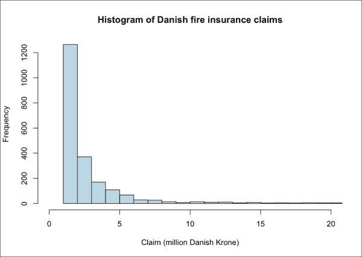

索赔分布严重偏斜，具有较长的右尾，这表明小额火灾损失相对频繁发生；然而，非常大的损失偶尔也可能发生（数据集中最大的索赔为 2.63 亿克朗）。这些大额索赔在以下直方图中甚至看不见，因为我们已将图形截断在 2000 万克朗。正如以下命令行计算所示，超过此阈值的损失不到 2%，但这些损失占总损失金额的 22%：

```py
> sum(danish>20) / length(danish)
[1] 0.01661283
> sum(danish[danish>20]) / sum(danish)
[1] 0.2190771

```

在这个例子中，我们关心的是发生此类极大损失的概率（以及它们的预期大小）。由于极大损失的数量较少，使用样本中大损失的相对频率来估算这些概率是不可靠的。

## 索赔的尾部行为

一个或许更有用的数据可视化方式是使用 *对数坐标* 来表示 *x* 轴（或者甚至两个坐标轴）。我们通过绘制经验 **补充累积分布函数**（**ccdf**，即索赔超过任何给定阈值的经验概率，有时也被称为 *生存函数*），使用 `evir` 包中的 `emplot` 函数来实现。以下第一个命令只在 x 轴使用对数坐标，而第二个命令则在两个坐标轴上都使用对数坐标：

```py
> emplot(danish)
> emplot(danish, alog = "xy")

```

下图展示了第二个图：

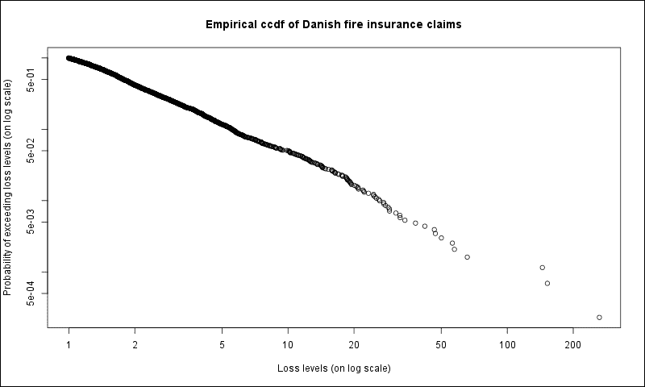

有趣的是，当使用对数坐标轴绘制经验 ccdf 时，结果几乎呈线性。这揭示了数据的肥尾特性以及索赔可能呈现帕累托分布（也称为*幂律*，因为 ccdf 可以表示为阈值的幂次）。

另一个有用的工具是 **分位数-分位数图**（**Q-Q 图**）。该图将数据的分位数与假设分布的分位数进行对比。如果分布假设正确，则结果图应呈线性。偏离线性图的部分揭示了数据分布与假设分布之间的差异，例如，凹形图表明经验分布有较厚的尾部。

Q-Q 图可以使用 `evir` 包中的 `qplot` 函数来创建。

对于损失数据，天然假设的分布是指数分布；因此，`qplot`函数默认将数据与指数分布进行比较。该函数允许通过参数`xi`指定其*ξ*形状参数，从而与更通用的 GPD 分布进行比较。此外，数据还可以通过`trim`参数在某个值处右截断，以避免最大值观测值扭曲图形。以下命令创建了一个丹麦火灾损失数据的 Q-Q 图，并将损失数据截断在 100 处，与指数分布进行比较：

```py
> qplot(danish, trim = 100)

```

结果图还确认了经验分布比指数分布的尾部更粗，因此指数分布并不是数据的一个好的模型。

## 确定阈值

现在我们已经确定数据呈肥尾分布并遵循幂律分布，我们开始拟合 GPD 分布到阈值超越数据。然而，在进行此操作之前，我们需要确定一个合适的阈值。虽然确定阈值由模型构建者自行决定，但存在一些有用的工具可以帮助确认在给定阈值下，GPD 的收敛性已经足够。

也许最有用的工具是**均值超额函数**，定义为随机变量*X*相对于阈值*u*的平均超额，其作为阈值的函数定义：

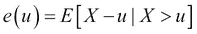

很容易证明，GPD 的均值超额函数是阈值*u*的线性函数，其系数与分布的*ξ*形状参数成正比（因此，一般来说，均值超额函数的正梯度表示肥尾，而负梯度表示薄尾）。因此，确定阈值的一种合理方式是找到样本均值超额函数近似线性的阈值。

`evir`包的`meplot`函数绘制了在逐渐增加的阈值下的样本均值超额图。`omit`参数允许你指定要从图中省略的上层绘图点的数量（再次强调，以防这些点扭曲图形）。

```py
> meplot(danish, omit = 4)

```

下图展示了结果样本均值超额图：

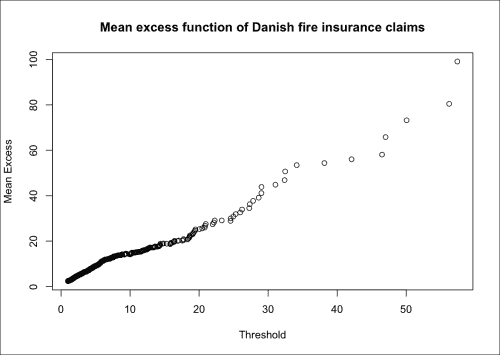

结果图在整个损失范围内看起来相当线性；因此，甚至可能将整个数据集拟合一个单一的 GPD 分布。然而，我们可能会在 10 以下观察到一个小的拐点，这可能表明较小的损失遵循着一种稍有不同的规律。在 10 到 20 之间可以观察到一个相当线性的区域；20 以上数据变得稀疏。因此，10 作为一个阈值可以被认为是与样本均值超额函数一致的合理选择。这使得我们有 109 个损失超出该阈值（占原样本的 5%）。

## 拟合 GPD 分布到尾部

现在我们已经准备好拟合 GPD 分布到火灾损失数据的尾部。我们可以使用以下命令，通过`gpd`函数来进行拟合，并指定前一部分中确定的阈值：

```py
> gpdfit <- gpd(danish, threshold = 10)

```

`gpd`函数默认使用**最大似然**（**ML**）方法来估计 GPD 分布的参数。该函数返回一个`gpd`类的对象，其中包含估计的参数（以及它们的标准误差和协方差），以及超过指定阈值的数据。`converged`成员的零值表示在使用最大似然估计时已收敛到极大值。`par.ests`和`par.ses`成员分别包含估计的*ξ*和*β*参数及其标准误差。

```py
> gpdfit$converged
[1] 0
> gpdfit$par.ests
 xi      beta
0.4968062 6.9745523
> gpdfit$par.ses
 xi      beta
0.1362093 1.1131016

```

我们的最大似然（**ML**）估计结果为估计参数*ξ* = 0.50 和*β* = 6.97，标准误差分别为 0.14 和 1.11。

为了验证我们的结果，我们可以使用`plot(gpdfit)`命令，该命令提供了一个菜单，用于绘制超额损失的经验分布和原始分布的尾部（以及拟合的 GPD 分布），还可以绘制残差的散点图和 Q-Q 图。下图展示了超额分布和拟合的 GPD 分布（菜单中的图 1）——GPD 分布显然很好地拟合了数据：

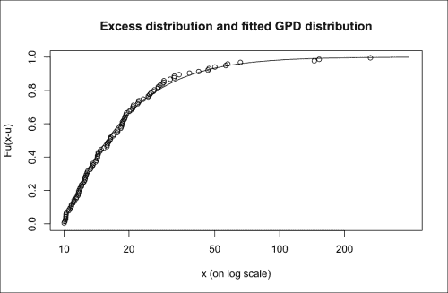

## 使用拟合的 GPD 模型进行分位数估计

现在我们已经将 GPD 模型拟合到数据中，可以使用它来估计高分位数或**风险价值**（**VaR**）。我们可以使用`gpd.q`函数来做到这一点，但该函数需要一个由`plot.gpd`或`tailplot`函数返回的列表对象（对应`plot.gpd`菜单中的选项 2）。我们使用`tailplot`函数直接绘制原始丹麦火灾损失分布的尾部图。然后，我们将返回的对象传递给`gpd.q`，并传入`pp`参数来指定需要估计的分位数。

```py
> tp <- tailplot(gpdfit)
> gpd.q(tp, pp = 0.999, ci.p = 0.95)
 Lower CI  Estimate  Upper CI
 64.66184  94.28956 188.91752

```

估计的 99.9%分位数为 9429 万丹麦克朗。由于只有三个观测值超过这一水平，如果我们从经验分布中估计这个分位数，我们的估计将容易产生误差。作为对比，使用`quantile`函数获得的标准经验分位数估计结果为 1.4466 亿丹麦克朗的 99.9%分位数：

```py
> quantile(danish, probs = 0.999, type = 1)
 99.9%
144.6576

```

本质上，标准的分位数估计是由单个数据点 144.6576（对应数据集中第三大损失）驱动的。极值理论（EVT）通过参数化尾部形式填补数据空白，从而提供了更可靠的估计。这在运营风险应用中尤其有用，因为监管要求计算非常高的分位数（99.9%）。

除了计算估算的分位数及其置信区间（置信概率由`ci.p`参数指定）外，`gpd.q`函数还会在由`tailplot`生成的尾部分布图上叠加显示分位数的点估算（垂直虚线）和估算器的概况似然曲线（虚线）。估算的置信区间的边界由虚线曲线与水平虚线的交点确定，如下图所示：

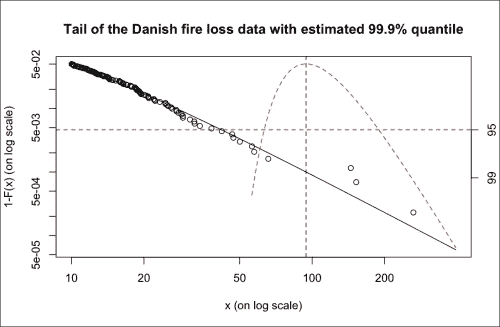

## 使用拟合的 GPD 模型计算期望损失

拟合的 GPD 模型还可以用来估算在超出某一损失水平的情况下，保险损失的期望大小。或者，我们可能希望估算在超出某一特定损失分位数（例如 99%分位数）的情况下的期望损失。在风险管理中，后者被称为**期望短缺**（**ES**）。以下命令使用`gpd.sfall`函数计算 99%期望短缺：

```py
> tp <- tailplot(gpdfit)
> gpd.q(tp, pp = 0.99)
Lower CI Estimate Upper CI
23.36194 27.28488 33.16277
> gpd.sfall(tp, 0.99)
 Lower CI  Estimate  Upper CI
 41.21246  58.21091 154.88988

```

估算的 99%分位数为 2728 万丹麦克朗，估算的 99%期望短缺为 5821 万丹麦克朗。换句话说，假设 2728 万丹麦克朗的 99%分位数被超过，则期望损失为 5821 万丹麦克朗。以下图表展示了丹麦火灾损失数据的 99%期望短缺估算。

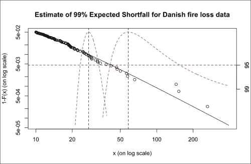

生成的图表展示了 99%分位数或风险价值（第一个垂直虚线及相应的概况似然曲线）和 99%期望短缺（第二个垂直虚线及相应的概况似然曲线）。

# 摘要

本章展示了极值理论方法如何在 R 中应用于实际风险管理中的案例研究。在简要介绍极值理论中阈值超越模型的理论后，我们通过一个详细的示例，展示了如何拟合模型以分析火灾保险赔偿分布的尾部。我们利用拟合的模型计算了高分位数（风险价值，Value at Risk）和条件期望（期望短缺，Expected Shortfall）。所展示的方法同样可以扩展到市场风险、信用风险或操作风险损失。
