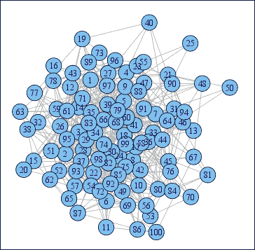
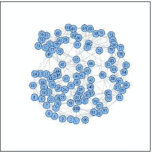
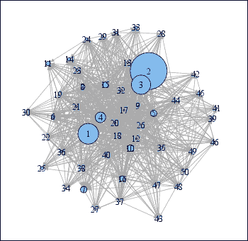
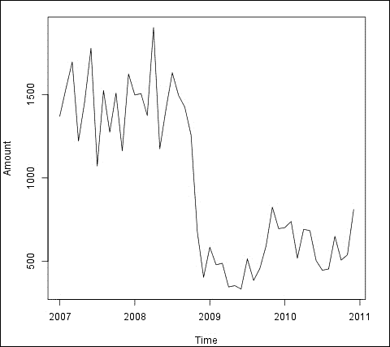
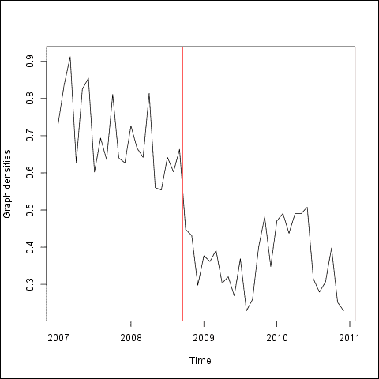
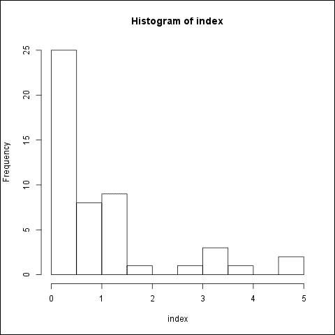

# 第九章 财务网络

我们在上一章中已经看到，如何通过非对称且厚尾分布来建模极端事件，以及如何衡量和管理与极端事件相关的风险。

在某些情况下，我们可以访问到金融数据，进而构建复杂的网络。在金融网络中，某些属性（如度数、数量等）的分布通常具有高度的非对称性和厚尾特征。

从本质上讲，现有的财务网络通常是不完全的；它们既不包含所有可能的参与者，也不包含所有可能的连接，或所有相关的属性。但即使在其有限状态下，它们也构成了一个极为丰富且有信息量的数据集，能够帮助我们深入了解所研究市场的详细微观结构。

本章概述了如何在 R 中表示、模拟、可视化和分析财务网络。我们将重点讨论两个重要的实践问题：

+   如何检测网络拓扑的变化

+   如何通过中心性度量来识别系统性重要的参与者

# 财务网络的表示、模拟与可视化

网络可以通过一对对的列表、邻接矩阵或图形表示。图由顶点和边（节点）构成。在 R 中，顶点被编号并可能具有多个属性。两个顶点之间可以存在一条边（有向或无向，加权或无加权），而且边也可能有其他属性。在大多数金融网络中，顶点代表市场参与者，边则描述它们之间的不同金融联系。

使用 R 内置工具和`igraph`包中的一些函数，创建/模拟人工网络是非常简单的。下表（表 1）总结了一些重要的网络类型及其基本属性：

| 网络 | 聚类系数 | 平均路径长度 | 度分布 |
| --- | --- | --- | --- |
| **规则**（例如，环形，完全） | 高 | 高 | 每个节点的进出度相等或固定 |
| **纯随机**（例如，Erdős-Rényi） | 低 | 低 | 指数分布，高斯分布 |
| **无尺度** | 可变 | 可变 | 幂律/厚尾 |
| **小世界**（例如，Barabási，Watz-Strogatz） | 高 | 低 | 幂律/厚尾 |

表 1：网络属性

此表的来源为 *Markose 等，2009*。

最重要的网络属性如下：

+   密度度量了节点之间相对于完全图中所有可能链接的链接程度。

+   聚类系数（在 R 中称为传递性）度量了每个代理的邻居之间的相互连接程度，被认为是社交网络的标志。整个网络的聚类系数是所有节点的聚类系数的平均值。

+   路径长度是两个代理之间的距离，通过分隔它们的边数来表示；最短路径的平均值表征整个网络。网络中的最长最短路径称为直径。

+   节点的度是该节点与其他节点的连接数。度分布是这些度在整个网络上的概率分布。

*非随机规则网络*是高度有序的，每个节点与其所有最近邻节点连接。可以使用`igraph`包的`graph.full`函数生成一个完整图，也可以使用类似的函数生成部分网络，结果为树、格子、环等。

与规则网络不同，在*纯随机 Erdős-Rényi 网络*中，连接通过随机均匀选择两个节点来生成。由于我们在处理随机数，因此值得设置自定义种子和随机数生成器的状态，以便在所有 R 会话中返回相同的随机数。

```py
> set.seed(7)

```

在模拟 Erdős-Rényi 图时，我们需要提前设置至少两个参数：节点的数量（例如 100）和两个任意顶点之间生成边的概率（例如 0.1）：

```py
> e <- erdos.renyi.game(100, 0.1)
> plot(e)

```

下图展示了一个纯随机网络（Erdős-Rényi）：



我们还可以从表 1 中计算出前述网络的主要特征，包括密度、聚类（传递性）和平均路径长度：

```py
> graph.density(e)
[1] 0.05434343
> transitivity(e)
[1] 0.05522828
> average.path.length(e)
[1] 2.923636

```

图的密度和传递性约为 0.1，最初设置的边概率与差异仅由于小样本中的噪声所致。

在*无标度网络*中，度分布遵循幂律，因此顶点在度上有极大的差异。*小世界网络*是无标度网络的一个特殊子集，其中顶点倾向于形成团体，导致弱连接的密集枢纽过多。毫不奇怪，小世界网络中的聚类系数非常高，平均路径也很短。偏好附着和适应性被提出作为解释幂律度分布和聚类的机制；见*Barabási-Albert (1999)*和*Bianconi-Barabási (2001)*。社会/金融网络通常被建模为小世界。创建小世界网络有多种方法，例如，`watts.strogatz.game`或`barabasi.game`。我们在这里使用第一个：

```py
> set.seed(592)
> w <- watts.strogatz.game(1, 100, 5, 0.05)
> plot(w)

```

下图展示了一个随机无标度网络（Watts-Strogatz）：



让我们将我们的 Watts-Strogatz 小世界网络与之前的纯随机 Erdős-Rényi 图在主要网络指标上进行比较：

```py
> graph.densi
ty(w)
[1] 0.1010101             # approximately the same
> transitivity(w)
[1] 0.4626506             # much higher
> average.path.length(w)
[1] 2.625455              # longer

```

在前面的 R 代码块中，我们将 Watts-Strogatz 模型的结果存储在一个名为`b`的变量中，并随后对其进行了绘制。提取边的列表可以通过`get.edgelist`函数轻松完成，该函数将返回一个包含两列的矩阵。这里我们只展示返回列表的前五行：

```py
> we <- get.edgelist(w)> head(we, 5)
 [,1] [,2]
[1,]    1    2
[2,]    2   77
[3,]    3    4
[4,]    4    5
[5,]    5    6

```

在 R 中，其他的网络操作也是可能的。例如，我们可能希望借助`get.adjacency`函数查看图的邻接矩阵。或者，通过随机化网络，交换顶点 ID，也是有用的，这可以通过`permute.vertices`实现。有时，我们可能需要使用`contract.vertices`将几个顶点合并为一个，同时保留一些顶点属性。我们还可以使用一些相应的 R 内部函数来创建多个网络的`union`和`intersection`。

# 网络结构分析与拓扑变化检测

现在，假设我们访问一个真实世界的银行间市场数据库（为说明目的，使用随机化数据），其中银行之间相互借贷，并且借款银行在每个工作日结束时报告其持仓，时间范围是 2007 至 2010 年。数据库包含 50 家银行，贷款期限为一天。为了在 R 中操作这些真实世界的网络，建议将数据转换为 CSV 文件并保存在工作目录中。下表（表 2）显示了 CSV 文件的前几行：

| 银行 | 合作方 | 金额 | 利率 | 年份 | 月份 | 日期 |
| --- | --- | --- | --- | --- | --- | --- |
| 1 | 21 | 5 | 7,9 | 2007 | 1 | 3 |
| 1 | 42 | 3 | 7,9 | 2007 | 1 | 3 |
| 10 | 11 | 0,35 | 7,8 | 2007 | 1 | 3 |
| 18 | 24 | 2 | 8 | 2007 | 1 | 3 |
| 2 | 11 | 1,3 | 7,8 | 2007 | 1 | 3 |
| 21 | 11 | 0,8 | 7,8 | 2007 | 1 | 3 |
| 21 | 2 | 5 | 7,75 | 2007 | 1 | 3 |
| 3 | 24 | 4 | 7,95 | 2007 | 1 | 3 |

表 2：银行间市场数据库

来源：作者

每行包含一笔交易：报告银行（贷方）、其合作银行（借方）、贷款金额、利率和交易日期。我们可以从 CSV 文件中读取这些数据：

```py
> data <- read.csv2(‘networktable.csv’)

```

现在我们有一个包含七列和 21,314 行的表：

```py
> str(data)
‘data.frame’:   21314 obs. of  7 variables:
 $ Bank    : int  1 1 10 18 2 21 21 3 3 30 ...
 $ Partner : int  21 42 11 24 11 11 2 24 42 12 ...
 $ Amount  : num  5 3 0.35 2 1.3 0.8 5 4 1.8 2 ...
 $ Interest: num  7.9 7.9 7.8 8 7.8 7.8 7.75 7.95 7.9 7.9 ...
 $ Year    : int  2007 2007 2007 2007 2007 2007 2007 2007 2007 ...
 $ Month   : int  1 1 1 1 1 1 1 1 1 1 ...
 $ Day     : int  3 3 3 3 3 3 3 3 3 3 ...

```

每家银行的资产负债表大小也可以获得，并存储在一个单独的 CSV 文件中。CSV 文件的第一列假设包含符号化的顶点名称，其他列将作为附加的顶点属性添加。

```py
> size <- read.csv2(‘vertices.csv’)

```

我们可以通过以下方式使用数据框创建图对象：

```py
> bignetwork <- graph.data.frame(data, vertices = size)

```

这个函数创建了一个`igraph`对象。数据框必须包含边列表的前两列，其他列则视为边属性。

在第二步，我们可以请求网络的基本属性。

```py
> is.connected(bignetwork)
[1] TRUE

```

网络是完全连接的，这意味着在 2007 至 2010 年间，所有银行至少与其他银行交易过一次。我们可以检查网络是否包含多重边：

```py
> table(is.multiple(bignetwork))
FALSE  TRUE 
 1049 20265 

```

R 发现了许多重复的边，这意味着银行与相同的合作伙伴进行多次交易。让我们还检查一下网络中是否存在循环，即报告银行和合作伙伴银行是同一方的交易：

```py
> str(is.loop(bignetwork))
logi [1:21314] FALSE FALSE FALSE FALSE FALSE FALSE ...

```

这里我们得到所有边的列表。似乎有一些循环，它们可能是数据错误。如果我们希望排除所有循环并汇总多条边，我们可以通过简化网络一步完成：

```py
> snetwork <- simplify(bignetwork, edge.attr.comb = “sum”)

```

在简化了图形之后，我们可以用相对较小的箭头绘制它，以避免结果图形过于拥挤：

```py
> plot(snetwork, edge.arrow.size = 0.4)

```

下图展示了我们的真实世界网络：



在第三步中，我们可以应用 R 中内建的复杂分析工具，探讨网络的内部结构。

可以通过`walktrap.community`函数检测到社区（密切连接的子图），该函数能找到密集连接的子图。其原理是短随机游走倾向于停留在同一社区内。

模块度是属于给定组的边的比例与如果边是随机分配时预期的比例之间的差值。模块度的取值范围为[−1/2,1)。如果模块度为正值，则表示存在聚类现象。

```py
> communities
Number of communities (best split): 2
Modularity (best split): 0.02499471
Membership vector:
 1  2  3  4  5  6  7  8  9 10 11 12 13 14 15 16 17 18 19 20 21 22 23
 1  1  1  1  1  1  1  1  1  1  1  1  1  1  1  1  1  1  1  1  1  1  1
24 25 26 27 28 29 30 31 32 33 34 35 36 37 38 39 40 41 42 43 44 45 46
 1  1  1  1  1  1  1  1  1  1  1  1  1  1  1  1  1  2  1  2  1  2  2
47 48 49 50
 2  2  2  2

```

除了表 1 中展示的属性（密度、传递性、平均路径和度分布），还可以使用许多其他 R 函数来表征我们的网络，例如`graph.coreness`、`girth`、`cliques.number`、`reciprocity`等。更多详细信息可以参见官方的 igraph 手册，网址如下：

[`igraph.sourceforge.net/doc/html/`](http://igraph.sourceforge.net/doc/html/)

市场结构是随着时间变化的。在和平时期，它们表现出较高的稳定性，意味着尽管有许多变化，它们的基本拓扑结构保持不变，例如，参见*Lublóy (2006)*。但是在危机时期，可能会发生根本性的变化：市场会干涸并重新填补，活跃参与者的数量和市场份额发生剧烈变化，参与者的角色也可能发生改变（例如，贷方变为借方，反之亦然），例如，参见*Soramäki et al. (2006)*和*Bech-Atalay (2008)*。

默认的雷曼兄弟宣布破产是在 2008 年 9 月 15 日，这对全球金融市场产生了深远的影响。因此，比较该事件前后的网络拓扑结构是合理的。为了检测拓扑结构的根本变化，首先让我们创建一系列按月汇总的网络，然后为每个月计算网络度量并将其绘制为时间序列。

若只匹配部分数据，`subset`函数可能会很有用。例如，要筛选出 2008 年 9 月的数据，可以运行：

```py
> monthlynetwork <- subset(data, (Year == 2008) & (Month == 9))

```

在接下来的几个示例中，我们将迭代地从原始数据集中提取一个月的数据子集，并对这些子集应用一些函数。这个过程可以通过基本的循环、不同的`apply`函数（特别是来自`plyr`包的`ddply`函数），或者通过按给定维度聚合数据集来完成。我们从聚合量度开始，逐步深入细节。因此，让我们首先看看，聚合量（一个月内的金额总和）是如何随时间变化的：

```py
> mAmount <- with(data,+   aggregate(Amount, by = list(Month = Month, Year = Year),+   FUN = sum))

```

在这里，我们使用`aggregate`命令计算了`data`中每个`Year`和`Month`的`Amount`的`sum`。接下来，我们还可以使用以下命令将结果作为月度时间序列进行`plot`：

```py
> plot(ts(mAmount$x, start = c(2007, 1), frequency = 12),+   ylab = ‘Amount’)

```

下图展示了月度金额随时间的演变：



在上图中，我们可以观察到雷曼倒闭后网络发生了一个重要的结构性变化。如果仔细观察网络，就会发现危机爆发后，网络的内部结构也发生了剧烈变化。为了展示这些变化，我们可以计算并绘制网络度量，逐月生成时间序列。我们通过嵌套循环计算图密度，并为每个月计算相应的值。

```py
> ds <- sapply(2007:2010, function(year) {+    sapply(1:12, function(month) {+        mdata <- subset(data, (Year == year) & (Month == month))+        graph.density(graph.data.frame(mdata))+    })+})
> plot(ts(as.vector(ds), start = c(2007, 1), frequency=12))
> abline(v = 2008 + 259/366, col = ‘red’)

```

下图展示了图密度随时间的演变：



我们可以看到，在雷曼倒闭后，网络密度突然下降，反映出交易集中到更少的银行，其他大多数网络指标也出现了显著的结构性变化。

# 对系统性风险的贡献——识别 SIFIs

一个复杂系统不仅仅是其各个元素的简单总和。可能所有个体在自身上是安全的，但整体系统仍然可能脆弱。系统性风险是指整个系统因一个或多个冲击而崩溃的风险。如果我们希望识别**系统重要金融机构**（**SIFIs**），正如 BCBS（2011）提出的那样，我们必须考虑五个导致系统性风险的因素：规模、互联性、缺乏替代品、跨司法区活动和活动的复杂性。在衡量互联性时，我们可以依赖网络数据，并应用几种方法，例如中心性度量、压力测试和核心-边缘模型。

现在，我们展示第一种基于某些中心性度量的指数方法，正如*Komárková et al.(2012)*和*von Peter (2007)*所描述的那样。具有最高指数值的银行可以被视为最具中心性的银行，因此也是最多 SIFIs 的银行。较简单的中心性度量方法基于相对狭窄的信息集，仅包含连接和方向，而边权重和其他属性则完全被忽略。例如，较简单的中心性度量方法如下：

+   **度数 (入/出/全)**：它显示了银行参与的所有交易的总数，包括所有的进出交易。

+   **介数 (有向/无向)**：它显示了银行位于最短路径上的频率。在确定最短路径时，网络可以视为有向或无向。在第一种情况下，最短路径较长，因此频率较高。

+   **紧密度 (入/出/全)**：它是到其他银行的所有最短路径的长度倒数的平均值。这个度量有助于识别那些能与其他银行（包括较小的银行）建立最广泛联系的银行。

+   **特征向量 (入/出/全)**：它衡量了一个特定银行与其他连接良好的银行的连接程度。

让我们将 2007 到 2010 年的整个时期作为一个整体，并集中于使用以下命令绘制有向图中的所有连接：

```py
> g <- graph.data.frame(data)

```

我们计算了前述的四个中心性度量，并将它们合并为一个指数。

```py
> degree <- degree(g, normalized = TRUE)
> between <- betweenness(g, normalized = TRUE)
> closeness <- closeness(g, normalized = TRUE)
> eigenv <- evcent(g, directed = TRUE)$vector

```

在计算指数时，我们必须将特定银行的中心性度量与整个群体的中心性度量的均值之间的差异进行归一化。为此，如果我们不想使用内置的`scale`函数和各种选项，我们可以构造一个自定义函数。

```py
> norm <- function(x) x / mean(x)

```

如果中心性度量是等权重的，我们将使用以下公式：

```py
> index <- (norm(degree) + norm(between) ++  norm(closeness) + norm(eigenv)) / 4
> index
 1          8         15          2         18          3
0.91643667 0.49431153 1.06216769 1.35739158 4.56473014 1.44833480
 26         32         35         36         37          4
1.36048296 0.73206790 1.13569863 0.40296085 0.54702230 3.94819802

```

现在，我们绘制指数的分布，并选择具有最高指数值的银行，如下图所示，图像是通过以下命令生成的：

```py
> hist(index)

```



一旦我们得到指数分布，我们就需要决定哪些银行是我们认为重要的（例如，指数值高于 2.5 的银行：18、12、20、17、9 和 10）。当然，指数可以通过其他中心性度量进行补充，也就是说，可以依赖更广泛的信息集进行更高级的度量；例如，参见*von Peter (2007)*中的中介度。

# 总结

在这一章中，我们聚焦于金融网络，使用了 R 的`igraph`包，该包提供了有效的网络仿真、操作、可视化和分析工具。我们学习了如何读取网络数据以及如何探索网络的基本属性。我们发现我们的示例市场数据在危机中表现出了显著的结构性变化。在最后一部分，我们展示了一个简单的方法来识别网络中的系统性重要参与者。
