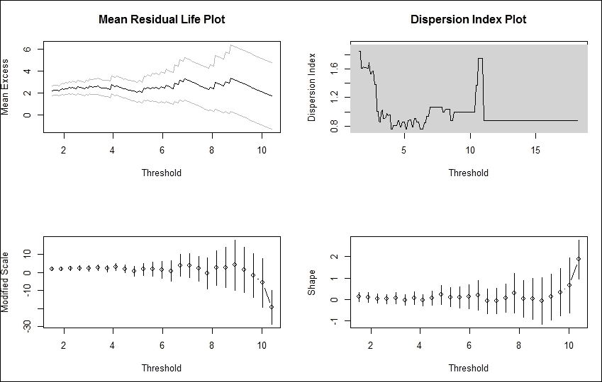

# 第二章：统计建模

本章我们将讨论统计建模，这是学习 R 中的定量金融的第一步，因为统计建模的概念是定量金融的驱动力。在开始本章之前，假设学习者已熟悉 R 中的基本编程，并且具备扎实的统计学知识。本章不讨论统计学概念，我们将讨论如何在 R 中进行统计建模。

本章内容包括以下主题：

+   概率分布

+   抽样

+   统计学

+   相关性

+   假设检验

+   参数估计

+   异常值检测

+   标准化

+   归一化

# 概率分布

概率分布决定了随机变量的值是如何分布的。例如，抛掷一系列硬币的所有可能结果集合形成了二项分布。大样本的数据群体的均值遵循正态分布，它是最常见且最有用的分布。

这些分布的特征是非常著名的，可以用来提取有关总体的推论。本章我们将讨论一些最常见的概率分布以及如何计算它们。

## 正态分布

正态分布是金融行业中最广泛使用的概率分布。它呈钟形曲线，均值、中位数和众数在正态分布中是相同的。它的表示方式是，其中是均值，是样本的方差。如果均值为 0，方差为 1，则该正态分布称为标准正态分布 N(1, 0)。

现在让我们讨论计算与正态分布相关的重要特征的主要功能。请注意，我们将在本章的所有计算中使用数据集`DataChap2.csv`。以下表格显示了一个样本。假设在 R 中导入的数据集为`Sampledata`。

在给定的样本中，`Date`是数据捕获的时间。`Open`、`High`、`Low`和`Close`分别是当天的开盘价、最高价、最低价和收盘价。`Adj.Close`是当天的调整价格，`return`是根据今天和昨天的`Adj.Close`价格计算的回报。`Flag`和`Sentiments`是为分析目的创建的虚拟变量：

| `Date` | `Open` | `High` | `Low` | `Close` | `Volume` | `Adj.Close` | `Return` | `Flag` | `Sentiments` |
| --- | --- | --- | --- | --- | --- | --- | --- | --- | --- |
| 12/14/2016 | 198.74 | 203 | 196.76 | 198.69 | 4144600 | 198.69 | 0 | 1 | 好 |
| 12/13/2016 | 193.18 | 201.28 | 193 | 198.15 | 6816100 | 198.15 | 0.03 | 1 | 坏 |
| 12/12/2016 | 192.8 | 194.42 | 191.18 | 192.43 | 615800 | 192.43 | 0 | 1 | 好 |
| 12/9/2016 | 190.87 | 193.84 | 190.81 | 192.18 | 2719600 | 192.18 | 0 | 0 | 坏 |
| 2016/12/8 | 192.05 | 192.5 | 189.54 | 192.29 | 3187300 | 192.29 | 0 | 0 | 良好 |

### norm

`norm` 返回正态分布的高度，函数的定义如下：

```py
dnorm(x, mean, sd) 

```

在这里，`x` 是数字的向量，`sd` 是标准差。

当我们执行以下代码时，它会生成展示所有点高度的图：

```py
> y <- dnorm(Sampledata$Return, mean = mean(Sampledata$Return), sd =sd(Sampledata$Return, na.rm = FALSE))
> plot(Sampledata$Return,y) 

```

图形表示如下：


图 2.1：展示正态分布高度的图

### pnorm

`pnorm` 被称为累积分布函数，它给出小于给定值的随机变量的概率，其函数定义如下：

```py
pnorm(x, mean, sd) 

```

我们执行以下代码：

```py
>  pnorm(.02, mean = mean(Sampledata$Return), sd = sd(Sampledata$Return, na.rm = FALSE)) 

```

这将得出 `0.159837`，可以解释为获得大于 2% 回报的概率为 16%。

### qnorm

`qnorm` 接受概率值并返回一个数字，使得其累积值与该概率匹配，函数定义如下：

```py
qnorm(x, mean, sd)  

```

在这里，`x` 是概率值。

我们执行以下代码：

```py
> qnorm(0.159837, mean = mean(Sampledata$Return), sd = +sd(Sampledata$Return, na.rm = FALSE),lower.tail=FALSE) 

```

这将给出输出 `0.02`，意味着对于大于等于 2% 的回报，概率为 16%。

### rnorm

`rnorm` 用于生成其分布为正态分布的随机数。其定义如下：

```py
qnorm(x, mean, sd) 

```

在这里，`x` 是要生成的随机变量的数量。

如果我们运行以下代码，它将生成五个具有回报均值和标准差的随机值：

```py
>rnorm(5, mean = mean(Sampledata$Return), sd = +sd(Sampledata$Return, na.rm = FALSE)) 

```

当这段代码执行时，它会生成五个具有指定均值和标准差的正态随机变量。

## 对数正态分布

在金融时间序列中，对数正态分布比正态分布起着更为关键的作用。和正态分布一样，我们将讨论对数正态分布的相同特性。

### dlnorm

`dlnorm` 用于查找对数正态分布的密度函数。计算密度函数的一般语法如下：

```py
dlnorm(x, meanlog, sdlog) 

```

让我们找出样本数据体积的密度函数，可以通过执行以下代码来完成：

```py
> y <- dlnorm(Sampledata$Volume, meanlog = mean(Sampledata$Volume), sdlog= sd(Sampledata$Volume, na.rm = FALSE))> plot(Sampledata$Volume,y) 

```

图形表示如下：


图 2.2：展示对数正态分布密度函数的图

### plnorm

`plnorm` 给出对数正态分布的累积分布函数。其一般语法如下：

```py
>dlnorm(x, meanlog, sdlog) 

```

现在让我们找出体积的 `cdf`，可以通过以下代码来完成：

```py
> y <- plnorm(Sampledata$Volume, meanlog = mean(Sampledata$Volume), sdlog= sd(Sampledata$Volume, na.r=FALSE))> plot(Sampledata$Volume,y) 

```

这将给出 `cdf` 图，如下所示：


图 2.3：展示对数正态分布的累积分布函数的图

### qlnorm

`qlnorm` 用于生成对数正态分布的 `p` 分位数，可以使用以下语法来完成：

```py
qlnorm(p, mean, standard deviation) 

```

### rlnorm

`rlnorm` 生成一个具有给定均值和标准差的数据集。其语法如下：

```py
rlnorm((n, mean , standard dev) 

```

## 泊松分布

泊松分布是独立事件在一个区间内发生的概率分布。如果  是每个区间的平均发生次数，那么在给定区间内发生 *x* 次事件的概率由以下公式给出：


这里，*x* = 0, 1, 2, 3.....

如果平均每分钟有 10 只股票的回报率是正的，我们可以通过使用以下代码来计算在某一特定分钟内，15 只股票回报率为正的概率：

```py
>ppois(15, lambda=10) 

```

这将产生输出值 `0.9512596`。

因此，15 只股票回报为正的下尾概率为 0.95。

同样，我们可以通过执行以下代码来找到上尾概率：

```py
>ppois(15, lambda=10, lower=FALSE) 

```

## 均匀分布

连续均匀分布是从 *a* 到 *b* 的连续区间中随机选择一个数字的概率分布。其密度函数如下所示：

*F(x) = 1/(b-a)*

这里  和


现在让我们生成 `1` 到 `5` 之间的 `10` 个随机数。可以通过执行以下代码来实现：

```py
>runif(10, min=1, max=5) 

```

这将生成以下输出：

```py
3.589514 2.979528 3.454022 2.731393 4.416726 1.560019 4.592588 1.500221 4.067229 3.515988\. 

```

## 极值理论

大多数常见的统计分布关注分布的中心部分，而不关心分布的尾部，尾部包含极端值/异常值。对于风险管理者而言，最大的挑战之一是开发能够处理罕见和极端事件的风险模型。**极值理论**（**EVT**）试图提供分布尾部区域的最佳可能估计。

估计极值的模型有两种类型，即适配**广义极值分布**（**GEV**）的区间最大值模型和适配**广义帕累托分布**（**GPD**）的**超阈值模型**（**POT**）。目前通常使用 POT，因此我们将在本章中给出 POT 的示例。我们将使用 POT 包中的数据集子集作为示例。

为了找到尾部分布，我们首先需要找到一个阈值点，这可以通过执行以下代码来完成：

```py
> data(ardieres) 
> abc<-ardieres[1:10000,] 
> events <- clust(abc, u = 1.5, tim.cond = 8/365, clust.max = TRUE) 
> par(mfrow = c(2, 2)) 
> mrlplot(events[, "obs"]) 
> diplot(events) 
> tcplot(events[, "obs"], which = 1) 
> tcplot(events[, "obs"], which = 2) 

```

这将生成以下图形：



图 2.4：EVT 阈值选择分析

通过分析这些图形，我们可以设置阈值点，并估计 GPD 模型的参数。这是通过执行以下代码来完成的：

```py
>obs <- events[,"obs"] 
>ModelFit <- fitgpd(obs, thresh = 5, "pwmu") 
>ModelFit 

```

这将给出 GPD 模型的参数估计：


图 2.5：EVT 的 GPD 模型参数估计

# 抽样

在金融建模中，我们可能会有非常大的数据集，模型的建立会非常耗时。一旦模型建立完成，如果需要再次调整模型，由于数据量庞大，过程将变得更加耗时。因此，最好从总体数据中获取随机或按比例抽样的数据，这样模型的构建会更加容易且节省时间。因此，在本节中，我们将讨论如何从数据中选择随机样本和分层样本。这将在基于从总体数据中抽取的样本数据建立模型时发挥关键作用。

## 随机抽样

选择一个样本，其中总体中的每个观察值都有相同的概率。这可以通过两种方式完成，一种是无放回，另一种是有放回。

无放回的随机抽样可以通过执行以下代码完成：

```py
> RandomSample <- Sampledata[sample(1:nrow(Sampledata), 10,  
>+ replace=FALSE),] 

```

这将生成如下输出：


图 2.6：显示无放回随机样本的表格

带放回的随机抽样可以通过执行以下代码完成。放回意味着某个观察值可以被多次抽取。因此，如果某个观察值被选中，它会再次放回总体中，之后可能再次被选中：

```py
> RandomSample <- Sampledata[sample(1:nrow(Sampledata), 10,  
>+ replace=TRUE),] 

```

这将生成如下输出：


图 2.7：显示带放回的随机抽样的表格

## 分层抽样

在分层抽样中，我们将总体划分为不同的组，称为层。然后，从每个组中抽取一个概率样本（通常是简单随机样本）。分层抽样相较于简单随机抽样有几个优点。通过分层抽样，可以减少样本量以获得更高的精度。

现在让我们通过以下代码查看使用 `Flag` 和 `Sentiments` 时存在的组别数量：

```py
>library(sampling) 
>table(Sampledata$Flag,Sampledata$Sentiments)

```

输出如下：


图 2.8：显示不同组别频率的表格

现在你可以根据需求从不同的组中选择样本：

```py
>Stratsubset=strata(Sampledata,c("Flag","Sentiments"),size=c(6,5, >+4,3), method="srswor") 
> Stratsubset 

```

输出如下：


图 2.9：显示分层抽样输出的表格

# 统计学

在给定的数据集中，我们尝试通过数据的集中位置来总结数据，这被称为集中趋势度量或汇总统计。衡量集中趋势的方式有多种，比如均值、中位数和众数。均值是最常用的集中趋势度量。在不同的情境下，我们使用不同的集中趋势度量。现在，我们将通过一个例子展示如何在 R 中计算不同的集中趋势度量。

## 均值

`mean` 是样本的等权重平均值。例如，我们可以通过执行以下代码来计算数据集 `Sampledata` 中 `Volume` 的均值，这将给出体积的算术平均值：

```py
mean(Sampledata$Volume) 

```

## 中位数

中位数是将矩阵按顺序排列后的中间值，可以通过执行以下代码计算：

```py
median(Sampledata$Volume) 

```

## 众数

众数是属性中出现频率最高的值。由于众数没有内置函数，因此我们将编写一个函数来计算众数：

```py
findmode <- function(x) { 
   uniqx <- unique(x) 
   uniqx[which.max(tabulate(match(x, uniqx)))] 
} 
findmode(Sampledata$return) 

```

执行上述代码会给出数据集的返回属性的众数。

## 概述

我们还可以通过执行以下代码来生成列的基本统计信息：

```py
summary(Sampledata$Volume) 

```

这将生成均值、中位数、最小值、最大值、第一四分位数（Q1）和第二四分位数（Q2）。

## 矩（Moment）

矩（Moment）给出了总体的特征，如方差、偏度等，可以通过以下代码计算。该代码给出了属性`Volume`的第三阶矩。你可以改变阶数来获得相关的特征。但是，在此之前，我们需要安装`e1071`包：

```py
moment(Sampledata$Volume, order=3, center=TRUE) 

```

## 峰度

峰度（Kurtosis）衡量数据相对于正态分布是否为厚尾或轻尾分布。具有高峰度的数据集往往具有厚尾或异常值，而具有低峰度的数据集则倾向于具有轻尾和较少的异常值。计算出的峰度值会与正态分布的峰度进行比较，并根据该比较结果进行解释。

`Volume`的峰度（kurtosis）由以下代码给出：

```py
kurtosis(Sampledata$Volume) 

```

它给出了值`5.777117`，这表明体积的分布呈现尖峰厚尾（leptokurtic）特征。

## 偏度

偏度是分布对称性的度量。如果数据值的均值小于中位数，则称分布为左偏；如果数据值的均值大于中位数，则称分布为右偏。

`Volume`的偏度（skewness）可以通过以下 R 代码计算：

```py
skewness(Sampledata$Volume) 

```

这给出的结果是`1.723744`，这意味着它是右偏分布。

### 注意

计算`偏度（skewness）`和峰度（kurtosis）时，我们需要安装`e1071`包。

# 相关性

相关性在量化金融中起着非常重要的作用。它不仅决定了金融属性之间的关系，还在预测金融工具的未来中起着至关重要的作用。相关性是两个金融属性之间线性关系的度量。现在让我们尝试使用`Sampledata`在 R 中计算不同类型的相关性，`Sampledata`用于识别预测金融模型的组成部分的顺序。

相关性可以通过以下代码计算。首先让我们对数据进行子集化，然后运行该函数来获得相关性：

```py
x<-Sampledata[,2:5] 
rcorr(x, type="pearson") 

```

这将生成以下相关性矩阵，显示了股票不同日常价格之间的线性关系度量：

|  | `Open` | `High` | `Low` | `Close` |
| --- | --- | --- | --- | --- |
| `Open` | 1 | 0.962062 | 0.934174 | 0.878553 |
| `High` | 0.962062 | 1 | 0.952676 | 0.945434 |
| `Low` | 0.934174 | 0.952676 | 1 | 0.960428 |
| `Close` | 0.878553 | 0.945434 | 0.960428 | 1 |

## 自相关

自相关是序列与其过去或未来值之间的相关性，也称为序列相关性或滞后相关性。它在时间序列预测建模中起着关键作用。函数`acf`计算自相关函数的估计值。

执行以下代码将给出序列与其滞后值的自相关：

```py
acf(Sampledata$Volume) 

```

图形如下所示：


图 2.10：显示序列自相关及其滞后值的图形

这将给出序列与其滞后值的自相关图形。函数如`lag.max`、`plot`等还有其他选项。
