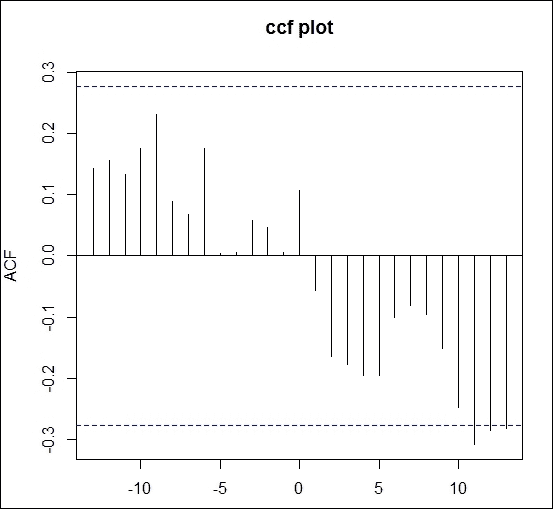

## 部分自相关

时间序列的部分自相关是其与滞后值的相关性，控制了时间序列在所有较短滞后期的值。它还用于时间序列建模，以识别预测技术的成分的顺序。它可以通过以下代码计算：

```py
pacf(Sampledata$Volume) 

```

它还包含其他选项，如你想使用和绘制多少滞后。前面的代码生成了以下图表：


图 2.11：显示具有滞后期的系列的部分自相关图

## 互相关

互相关是衡量两个序列相似度的一种方法，作为一个序列相对于另一个序列的位移函数。与`acf`和`pacf`一样，它在时间序列预测中也起着至关重要的作用。它可以通过以下函数计算：

```py
ccf(Sampledata$Volume,Sampledata$High, main = "ccf plot") 

```

当前面的代码执行时，它生成以下图表：



图 2.12：显示两个序列的互相关图

# 假设检验

假设检验用于基于观察样本的测量来拒绝或保留假设。我们将不深入探讨理论方面，而是讨论如何在 R 中实现假设检验的各种场景。

## 已知方差下的总体均值下尾检验

零假设由给出，其中是假设的总体均值下限。

假设我们处于一个情境中，其中一个投资者假设自股票成立以来，日收益的均值大于$10。30 天日收益样本的平均值是$9.9。假设总体标准差为 0.011。我们能否在`0.05`显著性水平下拒绝零假设？

现在让我们计算检验统计量`z`，它可以通过以下代码在 R 中计算：

```py
> xbar= 9.9           
> mu0 = 10            
> sig = 1.1            
> n = 30                  
> z = (xbar-mu0)/(sig/sqrt(n))  
> z  

```

这里：

+   `xbar`：样本均值

+   `mu`：假设的值

+   `sig`：总体标准差

+   `n`：样本大小

+   `z`：检验统计量

这给出了检验统计量`z`的值：

```py
[1] -0.4979296 

```

现在让我们找出在`0.05`显著性水平下的临界值。它可以通过以下代码计算：

```py
> alpha = .05  
> z.alpha = qnorm(1-alpha)  
> -z.alpha   

```

这给出了以下输出：

```py
[1] -1.644854 

```

由于检验统计量的值大于临界值，我们未能拒绝零假设，认为收益大于$10。

替代使用临界值检验，我们可以使用`pnorm`函数来计算 P 值检验统计量的下尾。可以通过以下代码计算：

```py
> pnorm(z) 

```

这给出了以下输出：

```py
[1] 0.3092668 

```

由于 P 值大于`0.05`，我们未能拒绝零假设。

## 已知方差下的总体均值上尾检验

原假设给定为 ，其中  是假设的总体均值的上界。

假设一个场景，投资者假设自股票上市以来的日收益均值最多为$5。30 天的日收益样本均值为$5.1。假设总体标准差为 0.25。我们能在`0.05`显著性水平下拒绝原假设吗？

现在让我们计算检验统计量`z`，可以通过以下 R 语言代码来计算：

```py
> xbar= 5.1           
> mu0 = 5            
> sig = .25            
> n = 30                  
> z = (xbar-mu0)/(sig/sqrt(n))  
> z 

```

这里：

+   `xbar`：样本均值

+   `mu0`：假设值

+   `sig`：总体标准差

+   `n`：样本大小

+   `z`：检验统计量

它给出了`2.19089`作为检验统计量的值。现在让我们计算在`0.05`显著性水平下的临界值，以下代码给出了该值：

```py
> alpha = .05  
> z.alpha = qnorm(1-alpha)  
> z.alpha 

```

这给出了`1.644854`，小于为检验统计量计算的值。因此，我们拒绝原假设。

此外，检验统计量的 P 值如下所示：

```py
>pnorm(z, lower.tail=FALSE) 

```

这给出了`0.01422987`，小于`0.05`，因此我们拒绝原假设。

## 知道方差的总体均值的双尾检验

原假设给定为 ，其中  是假设的总体均值值。

假设一个场景，去年一只股票的日收益均值为$2。今年 30 天的日收益样本均值为$1.5。假设总体标准差为 0.2。我们能在`0.05`显著性水平下拒绝原假设，即今年的收益与去年的差异不显著吗？

现在让我们计算检验统计量`z`，可以通过以下 R 语言代码来计算：

```py
> xbar= 1.5          
> mu0 = 2           
> sig = .1           
> n = 30                  
> z = (xbar-mu0)/(sig/sqrt(n))  
> z  

```

这给出了检验统计量的值为`-27.38613`。

现在让我们尝试在`0.05`显著性水平下找出临界值，用于与检验统计量进行比较。以下代码给出了该值：

```py
>alpha = .05  
>z.half.alpha = qnorm(1-alpha/2)  
>c(-z.half.alpha, z.half.alpha) 

```

这给出了`-1.959964`，`1.959964`的值。由于检验统计量的值不在区间（`-1.959964`，`1.959964`）之间，因此我们在`0.05`显著性水平下拒绝原假设，即今年的收益与去年的差异不显著。

双尾 P 值统计量如下所示：

```py
>2*pnorm(z) 

```

这给出了一个小于`0.05`的值，因此我们拒绝原假设。

在所有前述场景中，总体的方差是已知的，因此我们使用正态分布进行假设检验。然而，在接下来的场景中，我们不会给出总体的方差，因此我们将使用`t`分布来进行假设检验。

## 未知方差的总体均值下尾检验

原假设为 ，其中  是假设的总体均值的下界。

假设一个场景，投资者假设某股票自成立以来的日收益率均值大于$1。30 天的日收益率样本平均值为$.9。假设总体标准差为 0.01。我们能在`.05`显著性水平下拒绝原假设吗？

在此场景下，我们可以通过执行以下代码计算检验统计量：

```py
> xbar= .9          
> mu0 = 1          
> sig = .1           
> n = 30                  
> t = (xbar-mu0)/(sig/sqrt(n))  
> t  

```

这里：

+   `xbar`: 样本均值

+   `mu0`: 假设值

+   `sig`: 样本标准差

+   `n`: 样本容量

+   `t`: 检验统计量

这给出了检验统计量的值为`-5.477226`。现在让我们计算`.05`显著性水平下的临界值，计算代码如下：

```py
> alpha = .05  
> t.alpha = qt(1-alpha, df=n-1)  
> -t.alpha 

```

我们得到的值为`-1.699127`。由于检验统计量的值小于临界值，因此我们拒绝原假设。

现在，我们可以使用与检验统计量相关的 P 值，而不是检验统计量的值，P 值如下所示：

```py
>pt(t, df=n-1) 

```

这导致值小于.05，因此我们可以拒绝原假设。

## 上尾检验的总体均值，方差未知

原假设为 ，其中  是假设的总体均值的上界。

假设一个场景，投资者假设某股票自成立以来的日收益率均值最多为$3。30 天的日收益率样本平均值为$3.1。假设总体标准差为`.2`。我们能在`.05`显著性水平下拒绝原假设吗？

现在让我们计算检验统计量`t`，它可以通过以下 R 代码计算得出：

```py
> xbar= 3.1          
> mu0 = 3         
> sig = .2           
> n = 30                  
> t = (xbar-mu0)/(sig/sqrt(n))  
> t   

```

这里：

+   `xbar`: 样本均值

+   `mu0`: 假设值

+   `sig`: 样本标准差

+   `n`: 样本容量

+   `t`: 检验统计量

这给出了检验统计量的值`2.738613`。现在让我们找出与`.05`显著性水平相关的临界值，计算代码如下：

```py
> alpha = .05  
> t.alpha = qt(1-alpha, df=n-1)  
> t.alpha 

```

由于临界值`1.699127`小于检验统计量的值，因此我们拒绝原假设。

此外，检验统计量对应的值如下所示：

```py
>pt(t, df=n-1, lower.tail=FALSE) 

```

这个值小于`.05`。因此，原假设被拒绝。

## 两尾检验的总体均值，方差未知

原假设为 ，其中  是假设的总体均值。

假设一个情景，去年某股票的日收益率均值为$2。今年 30 天的日收益率样本均值为$1.9。假设总体标准差为`.1`。我们能否在显著性水平为`.05`的情况下，拒绝“今年和去年收益率差异不显著”的原假设？

现在让我们计算检验统计量`t`，可以通过在 R 中执行以下代码来计算：

```py
> xbar= 1.9         
> mu0 = 2         
> sig = .1           
> n = 30                  
> t = (xbar-mu0)/(sig/sqrt(n))  
> t  

```

这给出了`-5.477226`作为检验统计量的值。现在让我们尝试找出用于比较的临界值范围，代码如下：

```py
> alpha = .05  
> t.half.alpha = qt(1-alpha/2, df=n-1)  
> c(-t.half.alpha, t.half.alpha) 

```

这给出了范围值（`-2.04523`，`2.04523`）。由于这是检验统计量的值，我们拒绝原假设的主张。

# 参数估计

在本节中，我们将讨论一些用于参数估计的算法。

## 最大似然估计

**最大似然估计**（**MLE**）是一种在给定数据集上估计模型参数的方法。

现在让我们尝试找到正态分布概率密度函数的参数估计。

让我们首先生成一系列随机变量，可以通过执行以下代码来完成：

```py
> set.seed(100) 
> NO_values <- 100 
> Y <- rnorm(NO_values, mean = 5, sd = 1) 
> mean(Y) 

```

这给出了`5.002913`。

```py
> sd(Y) 

```

这给出了`1.02071`。

现在让我们为`log`似然函数创建一个函数：

```py
LogL <- function(mu, sigma) { 
+      A = dnorm(Y, mu, sigma) 
+      -sum(log(A)) 
+  } 

```

现在让我们应用`mle`函数来估计均值和标准差的参数：

```py
  > library(stats4) 
> mle(LogL, start = list(mu = 2, sigma=2)) 

```

`mu`和`sigma`已给定初始值。

这给出的输出如下：


图 2.13：MLE 估计的输出

当尝试负值作为标准差时，会产生 NaN。

这可以通过提供相关选项来控制，如下所示。这将忽略在*图 2.13*中显示的输出中产生的警告信息：

```py
> mle(LogL, start = list(mu = 2, sigma=2), method = "L-BFGS-B", 
+  lower = c(-Inf, 0), 
+       upper = c(Inf, Inf)) 

```

执行后，给出了最佳拟合结果，如下所示：


图 2.14：修正后的 MLE 估计输出

## 线性模型

在线性回归模型中，我们尝试根据自变量/预测变量预测因变量/响应变量。在该模型中，我们尝试拟合最佳的回归线，通过给定的点来确定。回归线的系数是使用统计软件估计的。回归线中的截距表示当预测变量为零时，因变量的均值。同时，响应变量随着预测变量每单位变化而按估计系数的因子增加。现在让我们尝试估计线性回归模型的参数，其中因变量是`Adj.Close`，自变量是`Sampledata`的`Volume`。然后我们可以拟合线性模型如下：

```py
> Y<-Sampledata$Adj.Close 
> X<-Sampledata$Volume 
> fit <- lm(Y ~ X) 
> summary(fit) 

```

执行前面的代码后，输出如下所示：


图 2.15：线性模型估计的输出

`summary`显示了线性回归模型的参数估计。同样，我们可以为其他回归模型（如多元回归或其他形式的回归模型）估计参数。

# 异常值检测

异常值在任何分析中都非常重要，因为它们可能导致分析偏差。在 R 中有多种方法可以检测异常值，本节将讨论最常见的方法。

## 箱形图

让我们为`Sampledata`的变量`volume`构建一个`boxplot`，这可以通过执行以下代码来完成：

```py
> boxplot(Sampledata$Volume, main="Volume", boxwex=0.1) 

```

图形如下所示：


图 2.16：用于异常值检测的箱形图

异常值是与其余数据距离较远的观测值。当查看前面的箱形图时，我们可以清楚地看到异常值，这些值位于箱形图的“胡须”外部。

## LOF 算法

**局部异常因子**（**LOF**）用于识别基于密度的局部异常值。在 LOF 中，比较一个点的局部密度与其邻居的局部密度。如果该点的密度比其邻居所在区域的密度低，则将其视为异常值。让我们考虑一些来自`Sampledata`的变量，并执行以下代码：

```py
> library(DMwR) 
> Sampledata1<- Sampledata[,2:4] 
> outlier.scores <- lofactor(Sampledata1, k=4) 
> plot(density(outlier.scores)) 

```

这里，`k`是计算局部异常因子时使用的邻居数量。

图形如下所示：


图 2.17：使用 LOF 方法显示异常值的图

如果你想获得前五个异常值，请执行以下代码：

```py
> order(outlier.scores, decreasing=T)[1:5] 

```

这将输出带有行号的结果：

```py
[1] 50 34 40 33 22 

```

# 标准化

在统计学中，标准化起着至关重要的作用，因为我们有许多不同尺度的属性进行建模。为了进行比较，我们需要标准化这些变量，使其处于相同的尺度上。R 中通过`scale()`函数对值进行居中处理并创建`z`分数。该函数接受以下参数：

+   `x`：一个数值对象

+   `center`：如果`TRUE`，则从该列的值中减去该列的均值（忽略 NA 值）；如果`FALSE`，则不执行居中操作

+   `scale`：如果`TRUE`，则将居中的列值除以该列的标准差（当`center`也为`TRUE`时；否则，使用均方根）；如果`FALSE`，则不执行缩放操作

如果我们想要将数据集中的`Volume`数据居中，只需执行以下代码：

```py
>scale(Sampledata$Volume, center=TRUE, scale=FALSE) 

```

如果我们想要标准化数据集中的`volume`数据，只需执行以下代码：

```py
>scale(Sampledata$Volume, center=TRUE, scale=TRUE) 

```

# 归一化

归一化通过使用`minmax`概念来完成，以使各个属性处于相同的尺度上。其计算公式如下：

*normalized = (x-min(x))/(max(x)-min(x))*

如果我们想要归一化`volume`变量，只需执行以下代码：

```py
> normalized = (Sampledata$Volume-+min(Sampledata$Volume))/(max(Sampledata$Volume)-+min(Sampledata$Volume)) 
> normalized 

```

# 问题

1.  在 R 中构建正常、泊松和均匀分布的示例。

1.  如何在 R 中进行随机和分层抽样？

1.  中心趋势的不同度量方法是什么，如何在 R 中找到它们？

1.  如何在 R 中计算峰度和偏度？

1.  如何在 R 中进行假设检验，已知/未知总体方差的情况下？

1.  如何在 R 中检测离群值？

1.  如何在 R 中为线性模型和最大似然估计（MLE）进行参数估计？

1.  什么是标准化和归一化，它们在 R 中如何执行？

# 总结

在本章中，我们讨论了金融领域中最常用的分布及其在 R 中的度量计算；采样（随机采样和分层采样）；中心趋势的度量方法；时间序列模型选择中使用的相关性及其类型；假设检验（单尾/双尾）以及已知和未知方差的情况；离群值检测；参数估计；以及在 R 中对属性进行标准化/归一化，以便将属性转换为可比较的尺度。

在下一章中，将介绍在 R 中进行的与简单线性回归、多元线性回归、方差分析（ANOVA）、特征选择、变量排名、小波分析、快速傅里叶变换（FFT）和希尔伯特变换相关的分析。
