# 第三章 计量经济学与小波分析

在金融分析中，我们需要一些技术来进行预测建模，以进行预测并找出不同目标变量的驱动因素。在本章中，我们将讨论回归类型以及如何在 R 中构建回归模型来建立预测模型。我们还将讨论如何实现变量选择方法以及回归分析中的其他相关方面。本章不包含理论描述，而是指导你如何在金融领域中使用 R 实现回归模型。回归分析可以用于对金融领域的横截面数据进行预测。我们还将涵盖数据的频率分析，以及如何通过快速傅里叶变换、波形变换、希尔伯特变换、哈尔变换等时间和频率域中的变换来去除数据中的噪声。

本章包含以下主题：

+   简单线性回归

+   多元线性回归

+   多重共线性

+   方差分析（ANOVA）

+   特征选择

+   逐步变量选择

+   变量排名

+   小波分析

+   快速傅里叶变换

+   希尔伯特变换

# 简单线性回归

在简单线性回归中，我们试图通过一个第二个变量（称为预测变量）来预测一个变量。我们要预测的变量称为因变量，表示为*y*，而自变量表示为*x*。在简单线性回归中，我们假设因变量和预测变量之间存在线性关系。

首先，我们需要绘制数据图表，以理解因变量和自变量之间的线性关系。这里，我们的数据包含两个变量：

+   `YPrice`：因变量

+   `XPrice`：预测变量

在这种情况下，我们试图通过`XPrice`来预测`Yprice`。`StockXprice`是自变量，`StockYprice`是因变量。对于每一个`StockXprice`的元素，都有一个对应的`StockYprice`元素，这意味着`StockXprice`和`StockYprice`之间存在一一映射关系。

以下几行用于分析的数据通过以下代码显示：

```py
>head(Data) 

```

|  | `StockYPrice` | `StockXPrice` |
| --- | --- | --- |
| 1 | 80.13 | 72.86 |
| 2 | 79.57 | 72.88 |
| 3 | 79.93 | 71.72 |
| 4 | 81.69 | 71.54 |
| 5 | 80.82 | 71 |
| 6 | 81.07 | 71.78 |

## 散点图

首先，我们将绘制*y*和*x*之间的散点图，以理解*x*和*y*之间的线性关系类型。执行以下代码时，得到以下散点图：

```py
> YPrice = Data$StockYPrice 
> XPrice = Data$StockXPrice 
> plot(YPrice, XPrice,       xlab="XPrice",         
ylab="YPrice") 

```

这里，我们的因变量是`YPrice`，预测变量是`Xprice`。请注意，这个示例仅用于说明目的：

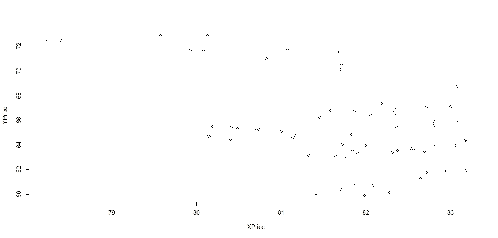

图 3.1：两个变量的散点图

一旦我们检查了因变量与预测变量之间的关系，我们就会尝试通过这些点拟合一条最佳的直线，这些点表示所有给定预测变量的预测 *Y* 值。简单的线性回归用以下方程表示，它描述了因变量与预测变量之间的关系：

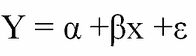

这里，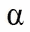 和 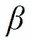 是参数，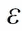 是误差项。 也被称为截距， 是预测变量的系数；它是通过最小化误差项平方和  来获得的。所有统计软件都提供了估计系数的选项，R 也提供该功能。

我们可以使用 R 中的 `lm` 函数来拟合线性回归模型，如下所示：

```py
> LinearR.lm = lm(YPrice ~ XPrice, data=Data) 

```

这里，`Data` 是给定的输入数据，`Yprice` 和 `Xprice` 分别是因变量和预测变量。一旦我们拟合了模型，我们可以使用以下代码提取参数：

```py
> coeffs = coefficients(LinearR.lm); coeffs 

```

上述结果给出了截距和系数的值：

```py
(Intercept)      XPrice 
92.7051345  -0.1680975 

```

所以现在我们可以按如下方式写出我们的模型：

```py
> YPrice = 92.7051345 + -0.1680975*(Xprice) 

```

这可以为任何给定的 `Xprice` 提供预测值。

同样，我们可以执行以下代码，使用拟合的线性回归模型在任何其他数据（例如 `OutofSampleData`）上获得预测值，方法如下：

```py
> predict(LinearR.lm, OutofSampleData) 

```

## 决定系数

我们已经拟合了模型，但现在我们需要测试模型拟合数据的效果。为此有几种可用的衡量标准，最主要的是决定系数。通过以下代码可以获得该系数：

```py
> summary(LinearR.lm)$r.squared 

```

根据定义，它是由自变量解释的因变量方差的比例，也称为 R2。

## 显著性检验

现在，我们需要检查线性回归模型中变量之间的关系是否显著，显著性水平为 0.05。

我们执行以下代码：

```py
> summary(LinearR.lm) 

```

它提供了线性回归模型的所有相关统计信息，如下所示：

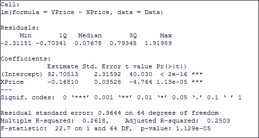

图 3.2：线性回归模型总结

如果与 `Xprice` 相关的**P 值**小于 **0.05**，则预测变量在 **0.05** 的显著性水平上显著地解释了因变量。

## 线性回归模型的置信区间

预测值的一个重要问题是找到预测值周围的置信区间。所以让我们尝试找到拟合模型的预测值周围的 95% 置信区间。这可以通过执行以下代码来实现：

```py
> Predictdata = data.frame(XPrice=75) 
> predict(LinearR.lm, Predictdata, interval="confidence")   

```

这里，我们正在估算给定 `Xprice = 75` 的预测值，然后我们尝试找到预测值周围的置信区间。

执行前述代码生成的输出如下图所示：

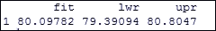

图 3.3：线性回归模型的置信区间预测

## 残差图

一旦拟合了模型，我们就将其与观测值进行比较，找出差异，这就是残差。然后，我们将残差与预测变量绘制在一起，以便直观地查看模型的表现。可以执行以下代码来获取残差图：

```py
> LinearR.res = resid(LinearR.lm) 
> plot(XPrice, LinearR.res,  
ylab="Residuals", xlab="XPrice",  
main="Residual Plot") 

```

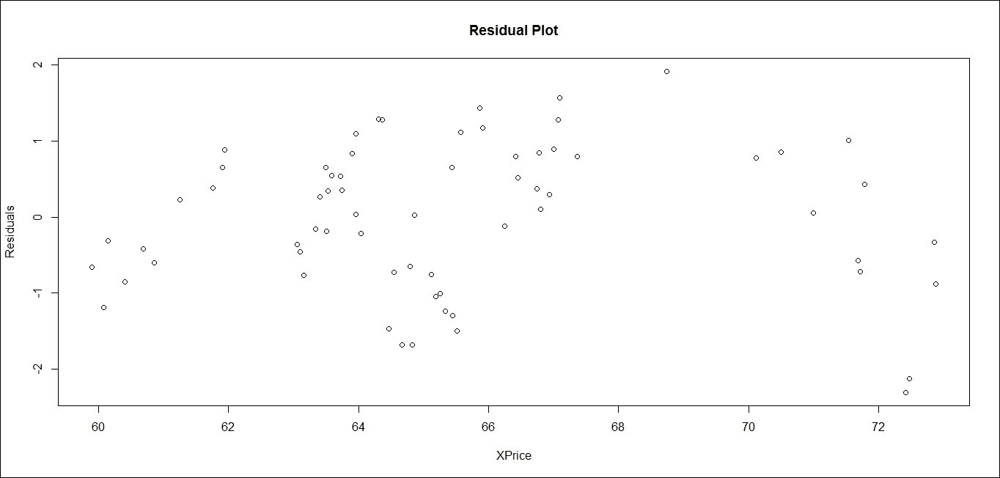

图 3.4：线性回归模型的残差图

我们还可以通过执行先前提到的代码来绘制标准化残差的残差图：

```py
> LinearRSTD.res = rstandard(LinearR.lm) 
> plot(XPrice, LinearRSTD.res,  
ylab="Standardized Residuals", xlab="XPrice",  
main="Residual Plot") 

```

## 误差的正态分布

线性回归的假设之一是误差服从正态分布，拟合模型后，我们需要检查误差是否确实服从正态分布。

这可以通过执行以下代码来检查，并与理论正态分布进行比较：

```py
> qqnorm(LinearRSTD.res,  
ylab="Standardized Residuals",  
xlab="Normal Scores",  
main="Error Normal Distribution plot")  
> qqline(LinearRSTD.res) 

```

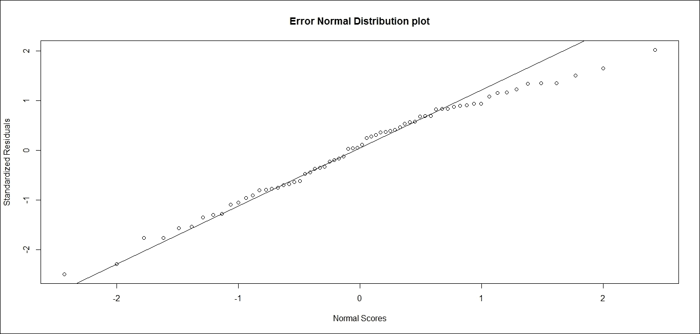

图 3.5：标准化残差的 QQ 图

`summary` 函数的更多细节可以在 R 文档中找到。以下命令将打开一个窗口，显示关于线性回归模型（即 `lm()`）的完整信息。它还包含关于每个输入变量的信息，包括它们的数据类型、该函数返回的所有变量，以及如何提取输出变量，同时提供了相关示例：

```py
> help(summary.lm)   

```

# 多元线性回归

在多元线性回归中，我们试图通过多个预测变量来解释因变量。多元线性回归方程由以下公式给出：

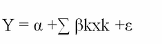

这里 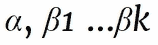 是多元线性回归的参数，可以通过最小化平方和来获得，这也称为最小二乘法（OLS）估计方法。

假设我们有一个因变量 `StockYPrice`，并且我们尝试根据自变量 `StockX1Price`、`StockX2Price`、`StockX3Price` 和 `StockX4Price` 来预测它，这些自变量都存在于数据集 `DataMR` 中。

现在让我们拟合多元回归模型并获取多元回归的参数估计：

```py
> MultipleR.lm = lm(StockYPrice ~  StockX1Price + StockX2Price +  StockX3Price + StockX4Price,  data=DataMR) 
> summary(MultipleR.lm) 

```

当我们执行前述代码时，它会在数据上拟合多元回归模型，并给出与多元回归相关的基本统计总结：

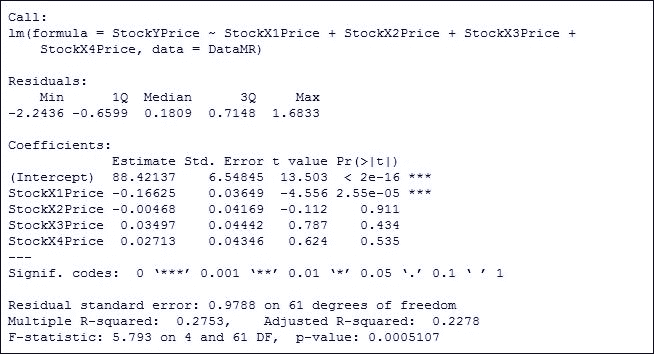

图 3.6：多元线性回归的总结

就像简单线性回归模型一样，`lm` 函数估计多元回归模型的系数，如前述总结所示，我们可以将预测方程写为如下形式：

```py
> StockYPrice = 88.42137 +(-0.16625)*StockX1Price  
+ (-0.00468) * StockX2Price + (.03497)*StockX3Price+ (.02713)*StockX4Price 

```

对于任何给定的独立变量集，我们可以通过使用前面的方程来找到预测的因变量。

对于任何样本外数据，我们可以通过执行以下代码来获得预测：

```py
> newdata = data.frame(StockX1Price=70, StockX2Price=90, StockX3Price=60, StockX4Price=80) 
> predict(MultipleR.lm, newdata) 

```

这会生成输出 80.63105 作为给定独立变量集的预测因变量值。

## 决定系数

为了检查模型的充分性，主要统计量是决定系数和调整决定系数，这些在汇总表中以 R 平方和调整 R 平方矩阵显示。

我们也可以使用以下代码获取它们：

```py
> summary(MultipleR.lm)$r.squared  
> summary(MultipleR.lm)$adj.r.squared  

```

从汇总表中，我们可以看到哪些变量变得显著。如果汇总表中与变量相关的 P 值小于 0.05，则该变量显著，否则不显著。

### 置信区间

我们可以通过执行以下代码来找到多元回归模型预测值的 95% 置信区间预测区间：

```py
> predict(MultipleR.lm, newdata, interval="confidence") 

```

上述代码生成了以下输出：

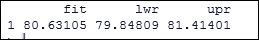

图 3.7：多元回归模型的置信区间预测

# 多重共线性

如果预测变量之间存在相关性，那么我们需要检测多重共线性并加以处理。识别多重共线性至关重要，因为两个或更多变量之间存在相关性，这显示了这些变量之间的强依赖结构，而我们将相关变量作为独立变量使用，这最终会由于它们之间的关系而在预测中产生双重效应。如果我们处理多重共线性并只考虑那些不相关的变量，那么可以避免双重影响的问题。

我们可以通过执行以下代码来找到多重共线性：

```py
> vif(MultipleR.lm) 

```

这显示了预测变量的多重共线性表：

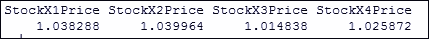

图 3.8：多元回归模型的 VIF 表

根据 VIF 的值，我们可以删除不相关的变量。

# 方差分析（ANOVA）

方差分析（ANOVA）用于确定三个或更多独立组之间的均值是否存在统计学上的显著差异。如果只有两个样本，我们可以使用 t 检验来比较样本的均值，但如果样本超过两个，可能会非常复杂。我们将研究定量因变量收益与单一定性独立变量股票之间的关系。我们有五个股票级别：stock1、stock2、... stock5。

我们可以通过箱线图研究五个级别的股票，并通过执行以下代码进行比较：

```py
> DataANOVA = read.csv("C:/Users/prashant.vats/Desktop/Projects/BOOK R/DataAnova.csv") 
>head(DataANOVA) 

```

这显示了用于分析的一些数据行，以表格形式展示：

|  | `Returns` | `Stock` |
| --- | --- | --- |
| 1 | 1.64 | Stock1 |
| 2 | 1.72 | Stock1 |
| 3 | 1.68 | Stock1 |
| 4 | 1.77 | Stock1 |
| 5 | 1.56 | Stock1 |
| 6 | 1.95 | Stock1 |

```py
>boxplot(DataANOVA$Returns ~ DataANOVA$Stock) 

```

这会生成以下输出并绘制箱线图：

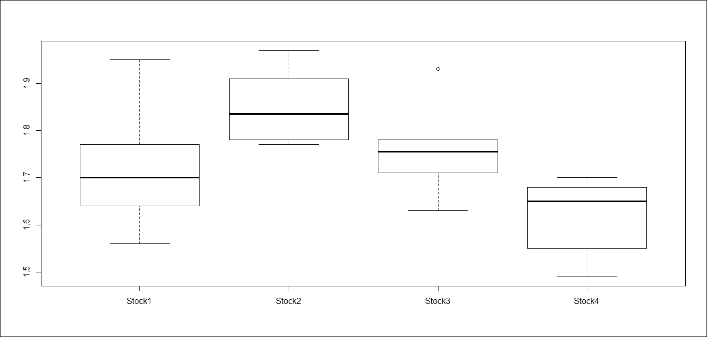

图 3.9：不同股票水平的箱形图

上述箱形图显示，股票水平较高的回报率较高。如果我们重复这个过程，很可能会得到不同的回报。也有可能所有股票水平的回报率都相似，我们仅仅看到的是一个回报集中的随机波动。假设在任何水平上都没有差异，这是我们的零假设。使用 ANOVA 方法，我们来测试这个假设的显著性：

```py
> oneway.test(Returns ~ Stock, var.equal=TRUE) 

```

执行上述代码将得到以下结果：

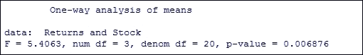

图 3.10：不同股票水平的 ANOVA 输出

由于**P 值**小于**0.05**，零假设被拒绝。不同股票水平的回报率并不相似。

# 特征选择

特征选择是金融模型构建中最具挑战性的部分之一。特征选择可以通过统计方法或借助领域知识来完成。在这里，我们将讨论金融领域中的几种统计特征选择方法。

## 移除无关特征

数据可能包含高度相关的特征，如果模型中没有高度相关的特征，模型表现会更好。Caret R 包提供了查找特征相关矩阵的方法，以下是一个示例。

以下是执行代码后用于相关分析和多重回归分析的几行数据：

```py
>DataMR = read.csv("C:/Users/prashant.vats/Desktop/Projects/BOOK R/DataForMultipleRegression.csv") 
>head(DataMR) 

```

|  | `StockYPrice` | `StockX1Price` | `StockX2Price` | `StockX3Price` | `StockX4Price` |
| --- | --- | --- | --- | --- | --- |
| 1 | 80.13 | 72.86 | 93.1 | 63.7 | 83.1 |
| 2 | 79.57 | 72.88 | 90.2 | 63.5 | 82 |
| 3 | 79.93 | 71.72 | 99 | 64.5 | 82.8 |
| 4 | 81.69 | 71.54 | 90.9 | 66.7 | 86.5 |
| 5 | 80.82 | 71 | 90.7 | 60.7 | 80.8 |
| 6 | 81.07 | 71.78 | 93.1 | 62.9 | 84.2 |

上述输出显示了名为 `StockYPrice`、`StockX1Price`、`StockX2Price`、`StockX3Price` 和 `StockX4Price` 的五个变量在 `DataMR` 数据集中。在这里，`StockYPrice` 是因变量，其它四个变量是自变量。依赖结构对于深入分析至关重要。

以下命令计算前四列之间的相关矩阵，这些列分别是`StockYPrice`、`StockX1Price`、`StockX2Price`和`StockX3Price`：

```py
 > correlationMatrix<- cor(DataMR[,1:4]) 

```

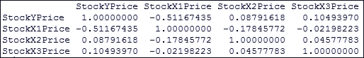

图 3.11：相关矩阵表

上述相关矩阵显示了哪些变量是高度相关的，因此，特征选择会确保高度相关的特征不会出现在模型中。

# 步骤式变量选择

我们可以在预测模型中使用步骤式变量选择（前向选择、后向选择、双向选择）进行特征选择，使用 `stepAIC()` 函数。

这可以通过执行以下代码来完成：

```py
> MultipleR.lm = lm(StockYPrice ~  
StockX1Price + StockX2Price + StockX3Price + StockX4Price,  
data=DataMR) 
> step <- stepAIC(MultipleR.lm, direction="both") 
> step$anova  

```

在这里，我们使用的是用于多重回归的输入数据集。也可以使用 `leaps()` 函数来进行全子集回归，该函数来自 leaps 包。

## 通过分类进行变量选择

我们可以使用分类技术，如决策树或随机森林，来获取最重要的预测因子。在这里，我们使用随机森林（提供了代码）来找到最相关的特征。以下示例中，数据集`DataForMultipleRegression1`中的所有四个属性都已被选择，图表显示了不同子集大小的准确度，比较了所有子集：

```py
>library(mlbench) 
>library(caret) 
>DataVI = read.csv("C:/Users/prashant.vats/Desktop/Projects/BOOK R/DataForMultipleRegression1.csv") 
>head(DataVI) 

```

它显示了用于分析的部分数据，如下表所示：

|  | `PortfolioYDirection` | `StockX1Price` | `StockX2Price` | `StockX3Price` | `StockX4Price` |
| --- | --- | --- | --- | --- | --- |
| 1 | 0 | 72.86 | 93.1 | 63.7 | 83.1 |
| 2 | 1 | 72.88 | 90.2 | 63.5 | 82 |
| 3 | 0 | 71.72 | 99 | 64.5 | 82.8 |
| 4 | 0 | 71.54 | 90.9 | 66.7 | 86.5 |
| 5 | 1 | 71 | 90.7 | 60.7 | 80.8 |
| 6 | 0 | 71.78 | 93.1 | 62.9 | 84.2 |

执行以下代码进行所需的分析：

```py
>control<- rfeControl(functions=rfFuncs, method="cv", number=10) 
>Output <- rfe(DataVI[,1:4], DataVI[,0:1], sizes=c(1:4), rfeControl=control) 
>predictors(Output) 
>plot(Output, type=c("g", "o")) 

```

它生成了以下图表，展示了不同子集大小的准确度，比较了所有子集：

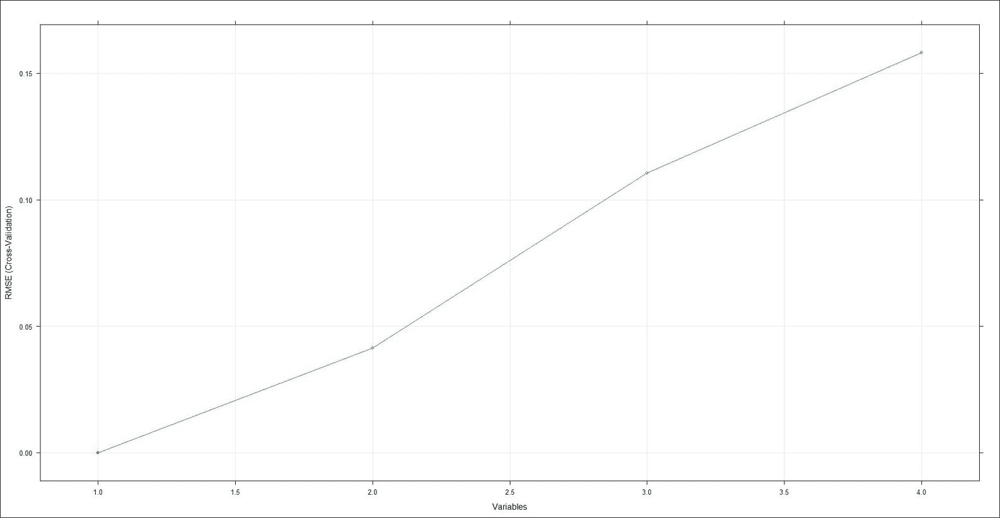

图 3.12：展示不同子集大小模型准确度的图表

我们提供了一些特征选择的示例。其他一些特征选择方法，如分类技术和预测建模中的信息值，也可以使用。

# 变量排名

在拟合回归/预测模型后，我们需要了解显著属性在比较尺度上的相对排名。这可以通过 Beta 参数估计来解释。Beta 或标准化系数是当所有变量处于相同尺度时得到的斜率，通常是在进行预测建模（回归）之前，将变量转换为 z 分数。Beta 系数允许比较预测变量的大致相对重要性，因此变量可以被排名，而这既不是非标准化系数也不是 P 值能够做到的。数据向量的缩放或标准化可以使用`scale()`函数来完成。一旦创建了标准化变量，回归就会使用这些变量重新执行。结果系数即为 Beta 系数。

# 小波分析

时间序列信息并不总是足够的来深入了解数据。有时，数据的频率内容也包含关于数据的重要信息。在时域中，傅里叶变换（FT）捕捉数据的频率-幅度信息，但它无法显示这个频率发生在何时。对于平稳数据，所有频率成分在任何时间点都存在，但对于非平稳数据来说，情况并非如此。因此，FT 不适用于非平稳数据。**小波变换**（**WT**）具有同时提供时间和频率信息的能力，形式为时频分析。WT 对于分析金融时间序列非常重要，因为大多数金融时间序列都是非平稳的。在本章的剩余部分，我将帮助你了解如何在 R 中使用小波分析解决非平稳数据的问题。股票价格/指数数据需要某些技术或变换，以获得原始数据未能显示的进一步信息。本示例使用了 2010 年 1 月 1 日至 2015 年 12 月 31 日的**道琼斯工业平均指数**（**DJIA**）和**标准普尔 500 指数**（**S&P500**）的日收盘价。我将使用小波包来进行演示：

1.  在开始使用小波变换之前，你需要安装名为`Wavelets`的包：

    ```py
            >  install.packages('wavelets') 

    ```

1.  一旦你安装了该包，或者你的机器上已经有了该包，那么你只需要将它加载到工作区：

    ```py
            > library(wavelets) 

    ```

1.  为了对数据有一个初步的了解，我们绘制了`dji`和`snp`的时间序列及其收益率：

    ```py
            >   par(mfrow=c(2,1)) 
            >   plot(dji,type="l") 
            >   plot(ret_dji,type="l") 

    ```

第一行用于将图形分割成一个两行一列的矩阵，这样图形中可以显示两个子图，接下来的两条命令绘制了道琼斯价格及其收益率系列，可以在*图 3.13*中看到：

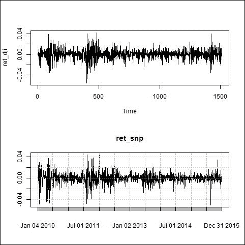

图 3.13：道琼斯指数（DJI）的价格和收益率系列

`dji`和`snp`的时间序列是非平稳的。我们使用 head 和 tail 查看时间序列的开始和结束部分：

```py
>head (dji) 
           DJI.Close 
2010-01-04 10583.96 
2010-01-05 10572.02 
2010-01-06 10573.68 
2010-01-07 10606.86 
2010-01-08 10618.19 
2010-01-11 10663.99 

>tail (dji) 
           DJI.Close 
2015-12-23 17602.61 
2015-12-24 17552.17 
2015-12-28 17528.27 
2015-12-29 17720.98 
2015-12-30 17603.87 
2015-12-31 17425.03 

```

现在我们对`dji`数据应用**离散小波变换**（**DWT**），并使用不同的滤波器对其进行分解。它需要数据的格式为时间序列、矩阵或数据框。我们查看`dji`变量的格式，它是`xts`和`zoo`对象。因此，我们需要将其转换为可接受的格式：

```py
dji<- as.ts (dji)  

```

现在它已经可以在离散小波变换的 R 函数中使用。我们还需要提供其他参数，如使用的滤波器类型以及希望将数据分解的层数：

```py
model<- dwt (dji, filter="la8", n.levels=3) 

```

它将输出保存在名为 model 的变量中。你可以在命令提示符下输入 model，它会显示输出结果：

```py
>model 

```

它生成的输出包含各种信息矩阵，如小波系数、尺度系数、使用的滤波器类型以及使用的层数。你还可以提取任何单独的信息。要提取小波系数，你需要在命令提示符下输入以下命令：

```py
>model 

```

它生成的输出包含各种信息矩阵，如小波系数、尺度系数、使用的滤波器类型以及使用的层数。你还可以提取任何单独的信息。要提取小波系数，你需要在命令提示符下输入以下命令：

```py
>model@W          # to extract wavelets coefficients 
>model@V          # to extract scaling coefficients 

```

这些命令生成了小波和尺度系数的相对列表。要获得小波的单个分量，你需要提到以下内容：

```py
> model@W$W1      # to extract first level of wavelet coefficients 
> model@V$V1      # to extract first level of scaling coefficients 

```

我们还可以使用绘图命令来可视化数据系列、小波和尺度系数：

```py
> plot (model)  

```

*图 3.14*将绘制价格及其各个级别系数，帮助我们清晰地可视化和理解数据：

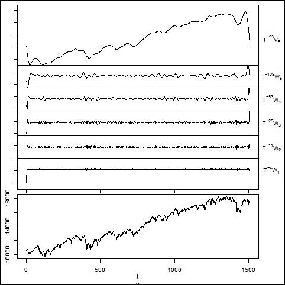

图 3.14：时间序列、小波和尺度系数的图示

你还可以使用离散小波变换函数来进行`haar`滤波器的分析：

```py
model<- dwt (dji, filter="haar", n.levels=3) 
> plot (model)  

```

它将使用`haar`滤波器绘制数据系列、小波和尺度系数。

要计算逆离散小波变换，你必须使用一个小波对象，该对象通过离散小波变换来定义。变量 model 是一个使用`haar`滤波器的小波对象：

```py
imodel<- idwt(model, fast=TRUE) 

```

有时需要知道 R 对象的类别，例如，`model`和`imodel`。

我们可以使用以下命令来实现：

```py
> class(model) 
[1] "dwt" 
attr(,"package") 
[1] "wavelets"   
>  class(imodel) 
[1] "ts" 

```

变量`imodel`是通过逆小波变换创建的，它生成一个原始的时间序列对象。

**多分辨率分析**（**MRA**）是另一种广泛应用的小波方法，适用于时间序列分析。金融市场产生大量数据，这些数据经过分析后用于生成算法交易信号。由于多分辨率小波分析能够帮助交易者专注于特定时间尺度上的交易模式，它正被越来越多地应用于这些数据集。以下示例中使用了 la8 滤波器，`haar`滤波器也可以被替换为`la8`：

```py
> model <- mra(dji, filter="la8", n.levels=3) 

```

对于市场数据的分析，**最大重叠离散小波变换**（**MODWT**）是首选方法。

作为示例，我考虑了将道琼斯指数时间序列`dji`作为`modwt`函数的输入：

```py
> model <- modwt(dji, filter="la8", n.levels=5) 

```

上述函数将时间序列分解为详细的小波和尺度系数，这些可以在*图 3.15*中看到。可以使用`plot.modwt()`函数来绘制该`modwt`输出：

```py
>plot.modwt(model) 

```


图 3.15：最大重叠离散小波变换的图示

时间序列中的一些跳跃可以表现为较小系数如**W1**和**W2**的跳跃，而平滑系数如**W6**则表现为围绕某个均值的波动。*图 3.15*中的小波和尺度系数清晰地展示了不同时间尺度下的价格数据。

小波分析在定量金融中提供了一个重要的工具，应用范围从短期预测到计算与特定时间尺度相关的方差。

# 快速傅里叶变换

**快速傅里叶变换**（**FFT**）用于计算离散时间序列的傅里叶变换。你需要通过以下代码安装相关的`fft`包来实现 FFT：

```py
install.packages('fft') 

```

安装完包后，你必须使用以下代码将其加载到工作空间：

```py
library(fft) 

```

时间序列的快速傅里叶变换可以使用`fft`计算，它接受实数或复数序列。

在以下示例中，`dji`是一个实数时间序列：

```py
> model<- fft(dji)  

```

变量`model`是一个变换后的序列，基本由复数构成，实部和虚部可以通过以下代码提取：

```py
>rp = Re(model) 
>ip = Im(model) 

```

以下命令计算模型的绝对值：

```py
>absmodel<- abs(model) 

```

让我绘制这个图表，看看`fft`的绝对值对我来说有什么信息：

```py
>plot(absmodel) 

```

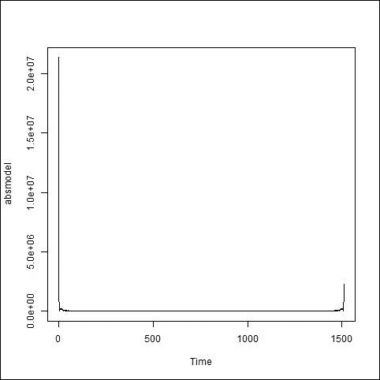

图 3.16：FFT 建模序列绝对值的绘图

*图 3.16*显示了数据两端的尖峰。FFT 可以接受复杂的输入，当输入为实数时（如大多数实际情况）。对于大于*N/2*的频段，输出是冗余的，并且不会提供额外的谱信息。因此，我们可以去除大于*N/2*的频段值。这是由于缺乏归一化造成的。

结果需要根据样本大小进行归一化。由于输入数据是实数值，因此大于*N/2*的数据会被去除，我们通过*N/2*对数据进行归一化处理：

```py
>norm_absmodel<- absmodel[1:(length(dji)/2)] 

```

傅里叶变换序列的实部和虚部之间的角度可以按如下方式计算：

```py
Angle = atan2(ip, rp) 

```

有时分析时间序列的谱密度非常重要，可以使用以下代码在 R 中进行计算：

```py
>spec_density<- spectrum(dji, method = c("pgram", "ar")) 

```

它接受两种方法：周期图法和自回归法。你可以选择这两种方法中的任何一种。此函数返回估算谱密度的频率向量，以及频率处的估算谱密度向量。它还返回一些其他对多变量分析有用的参数，如相干性水平和多变量序列之间的相位。

# 希尔伯特变换

希尔伯特变换是另一种转换时间序列的技术，R 使用`seewave`包来实现这一点。可以通过`install.packages()`安装该包，并使用`library()`命令加载到工作空间：

```py
> model <-  hilbert(dji, 1) 

```

第一个参数是你希望转换的时间序列对象，第二个参数是波形的采样频率。在前面的示例中，我使用了`dji`作为时间序列，并将采样频率设置为 1 来计算 Hilbert 变换。

如果你想了解模型的输出，你应该使用以下代码：

```py
> summary(model) 
      V1          
 Length:2555 
 Class :complex 
 Mode  :complex 

```

前面的输出提到输入数据序列的长度为`2555`，输出变量`model`的类型为复数。

由于输出是复数形式，我们可以使用以下代码提取实部和虚部：

```py
>rp<- Re(model)   
>ip<- Im(model) 

```

在这里，实部是原始时间序列，我们的例子中是`dji`，而虚部是原始序列的 Hilbert 变换序列。`ifreq()`函数返回相位或瞬时频率，具体取决于我们想要的输出：

```py
>ifreq(dji,1,ylim=c(0,0.00001)) 

```

前面的代码将生成瞬时频率：

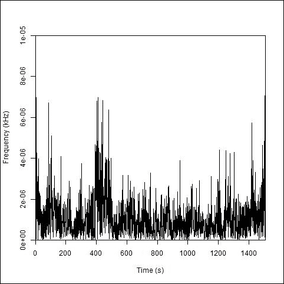

图 3.17：使用 Hilbert 变换的时间序列瞬时频率

然而，如果我们想生成相位，则必须在函数中明确提到`PHASE=TRUE`：

```py
>ifreq(dji, 1 ,phase="TRUE",ylim=c(-0.5,1)) 

```

*图 3.18*显示了相对于时间变化的相位。随着时间的推移，相位也随着时间的增加而增加：

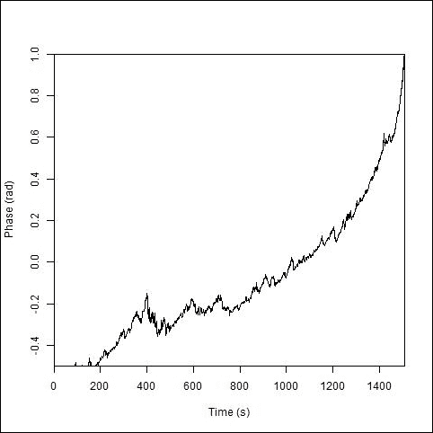

图 3.18：使用 Hilbert 变换的时间序列相位

默认情况下，绘图功能是开启的。如果我们设置`PLOT=FALSE`，则不会生成图形，只会在工作空间中生成变量：

```py
> output = ifreq(dji, 1 ,plot=FALSE) 

```

输出变量的形式是一个列表，其中包含瞬时频率和相位，可以使用以下方法提取：

```py
>freq<- output$f 
>phase<- output$p 

```

有时我们分析一对时间序列，计算相位差比单变量序列的相位更为重要。因此，相位差可以通过简单地计算各个序列的相位，然后从一个序列中减去另一个序列的相位来计算：

```py
>phase_difference<- phase1 - phase2 

```

还有一个包，`waveslim`，它将所有这些变换（例如离散小波变换、快速傅里叶变换和 Hilbert 变换）都集成在一个包中。实际上，还有许多其他包包含这些变换。你可以使用任何你感到舒适且易于使用的包。

# 问题

1.  定义回归以及如何在 R 中实现回归。

1.  如何在 R 中找到线性回归/多重回归的决定系数？

1.  如何在 R 中找到拟合线性回归/多重回归的预测值的置信区间？

1.  如何在 R 中检测多重回归中的多重共线性？

1.  ANOVA 的意义是什么？你如何使用它比较两个线性回归模型的结果？

1.  如何在 R 中进行多重线性回归的特征选择？

1.  如何在 R 中为多重线性回归模型排序重要性属性？

1.  如何安装`waveslim`包并将其加载到 R 工作空间中？

1.  如何绘制时间序列并提取时间序列的头部和尾部？

1.  如何知道由`fft`函数创建的变量的类别？

1.  如何使用给定的滤波器使用 dwt 函数并进行逆 dwt 变换？

1.  如何提取序列的实部和虚部？

1.  如何使用快速傅里叶变换和希尔伯特变换？

# 摘要

回归是任何分析的基础，读者不能在不接触回归的情况下继续学习。在本章中，我介绍了线性回归和多元回归，以及它们在预测中的应用。R 函数`lm()`用于实现简单线性回归和多元线性回归。我还介绍了显著性检验、残差计算和正态性图，这些方法使用 qq 图测试残差的正态性。**方差分析**（**ANOVA**）用于选择两个或更多样本的均值差异。多元线性回归涉及许多变量，每个变量的系数不同，从而使每个变量的重要性有所不同，并按此排名。逐步回归用于选择在回归分析中重要的变量。时间序列分析有时并不能代表完整的信息，因此需要进行频率分析，这可以通过小波变换、快速傅里叶变换和希尔伯特变换来实现。所有这些方法都可以在 R 中进行频率分析。我还解释了如何在必要时查看和绘制结果。

在下一章中，我将解释时间序列分析和预测技术。
