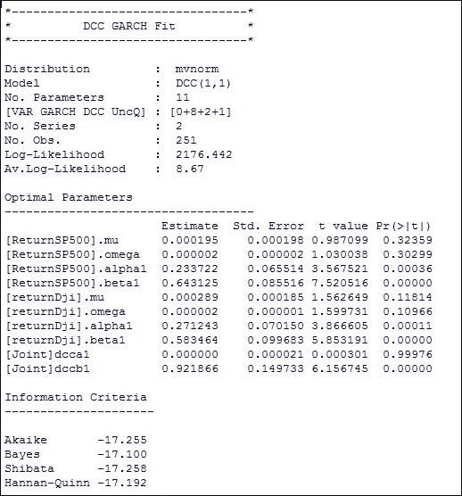

# 第四章 时间序列建模

时间序列预测分析是量化金融中最重要的组成部分之一。R 软件提供了许多时间序列和预测包来支持时间序列分析。R 中有足够的包可以将等距和不等距的系列转换为时间序列。此外，R 中还有足够的包可以构建预测模型，如自回归积分滑动平均（ARIMA）和广义自回归条件异方差（EGARCH）。在本章中，我们将简要介绍如何将任何系列转换为时间序列并构建预测模型。

在本章中，我们将涵盖以下主题：

+   一般时间序列

+   将数据转换为时间序列

+   zoo

+   xts

+   线性滤波器

+   AR

+   MA

+   ARIMA

+   GARCH

+   EGARCH

+   VGARCH

+   动态条件相关性

# 一般时间序列

时间序列是通常在固定间隔收集的数据序列。许多领域的数据都是以时间序列的形式存储的，并需要进行分析以便未来的规划。

例如，在金融领域，我们有每日/每月的失业率、GDP、日汇率、股价等数据。因此，所有投资者或金融机构的工作人员都需要规划未来的战略，因此他们希望分析时间序列数据。因此，时间序列在金融领域起着至关重要的作用。

时间序列数据本质上是非常不可预测的，为了理解数据，我们需要将时间序列数据分解成多个组成部分，如下所示：

+   **趋势**：这是时间序列数据均值的长期波动模式。趋势可能是线性或非线性的，并且随着时间的推移不断变化。没有确定的方法可以精确识别趋势，但如果它表现出单调性，那么可以在一定可接受的误差范围内进行估算。

+   **季节效应**：这些是与周期性循环相关的波动。例如，某个产品的销售在每年的特定月份/季度可能会激增。季节性可以通过绘制序列并检查其图形来识别。

+   **周期（Ct）**：除了季节性周期外，还有一些与商业周期相关的周期，这些周期在进行时间序列分析时需要考虑。

+   **残差**：时间序列由系统性模式和随机噪声（误差）组成，这使得识别模式变得困难。通常，时间序列技术涉及某些去噪方法，以便使模式更加突出。

在一些预测技术中，时间序列假设是平稳的。平稳性是必需的，因为在进行预测时，我们假设均值和方差是静态的，这将是未来预测分析所需要的。如果序列是非平稳的，那么我们需要对其进行差分以使其变为平稳，然后再继续分析。

# 将数据转换为时间序列

时间序列是一个数据点序列，其中每个数据点都与特定的时间相关联。

例如，股票的调整收盘价是股票在特定日期的收盘价格。时间序列数据存储在一个名为时间序列对象的 R 对象中，并通过使用 R 中的`ts()`函数创建。

`ts`的基本语法如下：

```py
ts(data, start, end, frequency) 

```

这里：

+   `data`：它是包含数据值的向量或矩阵

+   `start`：它是第一次观察的起始点或时间

+   `end`：它是最后一次观察的时间点

+   `frequency`：它是每单位时间的数据点数量

让我们考虑一个向量，代码如下：

```py
> StockPrice<
-c(23.5,23.75,24.1,25.8,27.6,27,27.5,27.75,26,28,27,25.5) 
> StockPrice 

```

现在将其转换为时间序列对象，可以使用以下代码完成：

```py
> StockPricets<- ts(StockPrice,start = c(2016,1),frequency = 12)   
> StockPricets  

```

输出如下：


图 4.1：显示时间序列对象的表格

让我们使用以下代码绘制此数据：

```py
> plot(StockPricets) 

```

这将生成以下输出图：


图 4.2：使用 ts 对象的时间序列图

`ts()`函数中的频率参数确定数据的时间间隔：

+   频率 = 12 表示数据为月度级别

+   频率 = 4 表示数据为季度级别

+   频率 = 6 表示每小时有每 10 分钟的一个数据点

+   频率 = 5 表示数据为每日工作日级别

# zoo

`ts`对象在表示时间序列时有其局限性。它用于表示等间隔数据。它不能用于表示日常股票价格，因为股票价格在周一到周五之间是等间隔的，但从周五到周一，或者在工作日有市场假期时，就不相同。这类不等间隔的数据无法通过`ts`对象表示。

`zoo`是灵活的，完全能够处理不等间隔数据、等间隔数据和数值索引数据。

让我们首先安装并加载`zoo`库。这可以通过执行以下代码完成：

```py
> install.packages("zoo") 
> library(zoo) 

```

现在我们将讨论如何使用`zoo`表示不同的时间序列场景。

请注意，我们将在所有示例中使用一个常见的数据集。

## 构造一个 zoo 对象

为了创建一个`zoo`对象，必须提供有序的时间索引和数据。因此，我们将构造一个`zoo`对象。

让我们首先导入我们样本数据集的几行，可以使用以下代码完成：

```py
>StockData <- read.table("DataChap4.csv",header = TRUE, sep = ",",nrows=3) 

```

这将产生以下输出：

| `Date` | `Volume` | `Adj.Close` | `Return` |
| --- | --- | --- | --- |
| 12/14/2016 | 4144600 | 198.69 | 0.27 |
| 12/13/2016 | 6816100 | 198.15 | 2.97 |
| 12/12/2016 | 615800 | 192.43 | 0.13 |

现在让我们尝试将这个 DataFrame 转换为`zoo`对象。这可以通过执行以下代码完成：

```py
> dt = as.Date(StockData$Date, format="%m/%d/%Y") 
>Stockdataz = zoo(x=cbind(StockData$Volume,StockData$Adj.Close), order.by=dt)  
> colnames(Stockdataz) <- c("Volume","Adj.Close") 
> Stockdataz 

```

执行后，它生成以下`zoo`对象：

|  | `Volume` | `Adj.Close` |
| --- | --- | --- |
| 12/12/2016 | 615800 | 192.43 |
| 12/13/2016 | 6816100 | 198.15 |
| 12/14/2016 | 4144600 | 198.69 |

## 使用 zoo 读取外部文件

函数 `read.zoo` 是一个包装器，可用于读取外部数据集，假设第一列是索引，其他列是数据。

现在让我们使用 `zoo` 读取一个数据集，该数据集的格式如下：

| `Date` | `Volume` | `Adj Close` | `Return` |
| --- | --- | --- | --- |
| 12/14/2016 | 4144600 | 198.69 | 0.27 |

我们执行以下代码：

```py
>StockData <- read.zoo("DataChap4.csv",header = TRUE, sep = ",",format="%m/%d/%Y") 

```

这将给出如下格式的输出：

|  | `Volume` | `Adj.Close` | `Return` |
| --- | --- | --- | --- |
| 2016-12-14 | 4144600 | 198.69 | 0.27 |

## `zoo` 对象的优势

以下是一些展示 `zoo` 对象优势的例子。

### 数据子集化

可以使用 `window()` 函数对索引进行子集化，方法是执行以下代码：

```py
>window(StockData, start=as.Date("2016/11/1"), end=as.Date("2016/11/3")) 

```

这将给出以下输出：

|  | `Volume` | `Adj.Close` | `Return` |
| --- | --- | --- | --- |
| 11/1/2016 | 7014900 | 190.79 | -3.51 |
| 11/2/2016 | 4208700 | 188.02 | -1.45 |
| 11/3/2016 | 2641400 | 187.42 | -0.32 |

### 合并 zoo 对象

让我们形成两个具有共同索引的 `zoo` 对象，然后将它们合并。可以通过执行以下代码完成此操作：

```py
> StockData <- read.table("DataChap4.csv",header = TRUE, sep = ",",nrows=3) 
> zVolume <-zoo(StockData[,2:2],as.Date(as.character(StockData[, 1]), format="%m/%d/%Y")) 
> zAdj.Close <-zoo(StockData[,3:3],as.Date(as.character(StockData[, 1]), format="%m/%d/%Y")) 
> cbind(zVolume, zAdj.Close) 

```

最终输出如下表所示：

|  | `zVolume` | `zAdj.Close` |
| --- | --- | --- |
| 12/12/2016 | 615800 | 192.43 |
| 12/13/2016 | 6816100 | 198.15 |
| 12/14/2016 | 4144600 | 198.69 |

### 绘制 zoo 对象

你可以跨时间绘制你的数据。这里展示了一个示例：

```py
>plot(StockData$Adj.Close) 

```

这将生成以下图表：


图 4.3：使用 zoo 对象的时间序列图

## `zoo` 对象的缺点

`zoo` 对象中的索引不能具有 `Date` 类变量，而 `xts` 对象的索引必须是已知且受支持的 `time` 或 `Date` 类。此外，在 `zoo` 中，不能添加任意属性，而在 `xts` 中可以添加。

# xts

`xts` 是一种可扩展的时间序列对象，包含了 `zoo` 对象的所有特性。它由一个矩阵和时间为基础的索引构成。构建 `xts` 对象有两种方式：一种是调用 `as.xts`，另一种是从头开始构建 `xts` 对象。

## 使用 as.xts 构造 xts 对象

让我们通过 `zoo` 读取几行示例数据，并通过执行以下代码构建 `xts` 对象：

```py
> StockData <- read.zoo("DataChap4.csv",header = TRUE, sep = ",",format="%m/%d/%Y",nrows=3) 
> matrix_xts <- as.xts(StockData,dateFormat='POSIXct') 
> matrix_xts 

```

这将给出以下输出：

|  | `Volume` | `Adj.Close` | `Return` |
| --- | --- | --- | --- |
| 12/12/2016 | 615800 | 192.43 | 0.13 |
| 12/13/2016 | 6816100 | 198.15 | 2.97 |
| 12/14/2016 | 4144600 | 198.69 | 0.27 |

`xts` 对象的组成可以通过以下代码给出：

```py
> str(matrix_xts) 

```

这将生成以下输出：

2016-12-12/2016-12-14 的 `xts` 对象包含如下内容：

```py
  Data: num [1:3, 1:3] 615800 6816100 4144600 192 198 ... 
 - attr(*, "dimnames")=List of 2 
  ..$ : NULL 
  ..$ : chr [1:3] "Volume" "Adj.Close" "Return" 
  Indexed by objects of class: [Date] TZ: UTC 
  xts Attributes:   
List of 1 
 $ dateFormat: chr "POSIXct" 

```

## 从头构建 xts 对象

我们首先形成一个矩阵和日期序列，确保它们具有相同的顺序，然后将其转换为 `xts` 对象。可以通过执行以下代码完成此操作：

```py
> x<-matrix(5:8, ncol =2, nrow =2) 
> dt<-as.Date(c("2016-02-02","2016-03-02")) 
> xts_object<-xts(x,order.by=dt) 
> colnames(xts_object) <- c("a","b") 
> xts_object 

```

这将给出 `xts` 对象，如下所示：

|  | `a` | `b` |
| --- | --- | --- |
| 2/2/2016 | 5 | 7 |
| 3/2/2016 | 6 | 8 |

`xts`对象的特殊之处在于，它表现得像一个矩阵，并且每个观测值都关联了一个时间。子集将始终保持矩阵形式，且`xts`对象的属性始终保留。而且，由于`xts`是`zoo`的子类，因此它具备`zoo`库的所有功能。

# 线性滤波器

时间序列分析的第一步是将时间序列分解为趋势、季节性等成分。

从时间序列中提取趋势的一种方法是线性滤波器。

线性滤波器的一个基本示例是具有相等权重的移动平均。

线性滤波器的示例包括每周平均、每月平均等。

用于查找滤波器的函数如下所示：

```py
Filter(x,filter)

```

这里，`x`是时间序列数据，而`filter`是用于计算移动平均的系数。

现在让我们将`StockData`的`Adj.Close`转换为时间序列，并计算每周和每月的移动平均并绘制出来。这可以通过执行以下代码完成：

```py
> StockData <- read.zoo("DataChap4.csv",header = TRUE, sep = ",",format="%m/%d/%Y") 
>PriceData<-ts(StockData$Adj.Close, frequency = 5)
> plot(PriceData,type="l")
> WeeklyMAPrice <- filter(PriceData,filter=rep(1/5,5))
> monthlyMAPrice <- filter(PriceData,filter=rep(1/25,25))
> lines(WeeklyMAPrice,col="red")
> lines(monthlyMAPrice,col="blue")

```

这生成了以下的图表：


图 4.4：使用线性滤波器的移动平均示例

# AR

AR 代表**自回归模型**。其基本概念是未来的值依赖于过去的值，并通过加权平均的方式估算过去的值。AR 模型的阶数可以通过绘制时间序列的自相关函数和部分自相关函数来估算。时间序列的自相关函数衡量的是序列与其滞后值之间的相关性，而部分自相关函数则衡量的是时间序列与其滞后值之间的相关性，同时控制所有短期滞后值的影响。所以，首先让我们绘制序列的`acf`和`pcf`。我们先通过执行以下代码绘制`acf`图：

```py
> PriceData<-ts(StockData$Adj.Close, frequency = 5) 
> acf(PriceData, lag.max = 10) 

```

这生成了如下所示的自相关图：


图 4.5：价格的 acf 图

现在让我们通过执行以下代码绘制`pacf`：

```py
> pacf(PriceData, lag.max = 10) 

```

这生成了部分自相关图，如下所示：


图 4.6：价格的 pacf 图

前面的图是所考虑序列的自相关和部分自相关图。现在让我们来确定 AR 的阶数。由于这里没有差分，并且`acf`衰减缓慢，而`pacf`在一个滞后后截断，因此 AR 的阶数是 1。类似地，如果`pacf`在第二个滞后后截断，而`acf`衰减缓慢，则 AR 的阶数是 2。

# MA

MA 代表**移动平均**，在 MA 建模中，我们不考虑实际序列的过去值。我们考虑的是过去几期预测误差的移动平均。在确定 MA 的阶数时，我们也需要绘制`acf`和`pacf`。因此，让我们绘制`StockData`的成交量的`acf`和`pacf`，以评估 MA 的阶数。`acf`可以通过执行以下代码绘制：

```py
> VolumeData<-ts(StockData$Volume, frequency = 5) 
> acf(VolumeData, lag.max = 10) 

```

这生成了以下的`acf`图：


图 4.7：交易量的 acf 图

让我们通过执行以下代码绘制交易量的 `pacf` 图：

```py
> pacf(VolumeData, lag.max = 10) 

```

这生成了以下图：


图 4.8：交易量的 pacf 图

在评估前述图后，`acf` 在 `lag1` 后急剧下降，因此 MA 的阶数为 1。

# ARIMA

ARIMA 代表 **自回归积分滑动平均**模型。通常，它由方程 **ARIMA**(*p*, *d*, *q*) 定义。

这里，

+   *p* 是自回归模型的阶数

+   *d* 是使序列平稳所需的阶数

+   *q* 是移动平均模型的阶数

ARIMA 的第一步是绘制序列，因为我们需要一个平稳序列来进行预测。

所以让我们先通过执行以下代码绘制序列图：

```py
> PriceData<-ts(StockData$Adj.Close, frequency = 5) 
> plot(PriceData) 

```

这生成了以下图：


图 4.9：价格数据图

显然，检查后，序列似乎是非平稳的，因此我们需要通过差分使其平稳。这可以通过执行以下代码完成：

```py
> PriceDiff <- diff(PriceData, differences=1) 
> plot(PriceDiff) 

```

这为差分序列生成了以下图：


图 4.10：差分价格数据图

这是一个平稳序列，因为其均值和方差似乎在时间上保持不变。此外，我们还可以通过 `Dickey-Fuller` 检验来检查序列的平稳性。因此，我们已经确定了我们 ARIMA 模型中的 *d* 值，即 1。现在让我们绘制差分序列的自相关函数和偏自相关函数，以确定 *p* 和 *q* 的值。

`acf` 图是通过执行以下代码生成的：

```py
> acf(PriceDiff, lag.max = 10) 

```


图 4.11：差分序列的 acf 图

`pacf` 图是通过执行以下代码生成的：

```py
> pacf(PriceDiff, lag.max = 10) 

```

这为差分序列生成了 `pacf` 图：


图 4.12：差分序列的 pacf 图

这清楚地表明 AR 和 MA 阶数分别为 0 和 1，因此最好的候选模型是 ARIMA(0,1,1)。

现在让我们估计所识别的 ARIMA 模型的系数，可以通过执行以下代码来完成：

```py
>PriceArima <- arima(PriceData, order=c(0,1,1)) 
>PriceArima 

```

这生成了所识别 ARIMA 模型的系数，如下所示：


图 4.13：ARIMA (0,1,1) 的拟合总结

现在让我们尝试预测并绘制预测结果，可以通过执行以下代码来完成：

```py
> library(forecast) 
> FutureForecast<-forecast.Arima(PriceArima,h=5) 
> FutureForecast 

```

这生成了以下输出：


图 4.14：带置信区间的未来预测图

现在通过执行以下代码绘制预测值及其置信区间：

```py
> plot.forecast(FutureForecast) 

```

这生成了以下图：


图 4.15：预测值及其置信区间图

可以通过执行以下代码检查模型的适应性：

```py
>Box.test(FutureForecast$residuals, lag=20, type="Ljung-Box") 

```

这生成了以下输出：


图 4.16：拟合模型的模型适应性检查统计量

由于 P 值大于 0.05，因此在滞后 1-20 中残差没有显著的自相关：

# GARCH

**GARCH**代表**广义自回归条件异方差**。OLS 估计中的一个假设是误差的方差应为常数。然而，在金融时间序列数据中，某些时期的波动性相对较高，这会导致残差的强度增加，而且这些波动并非随机出现，而是由于自相关效应（也称为波动聚类），即高波动时期往往会集中在一起。这正是 GARCH 用于预测波动率的地方，这些预测可以用于预测模型中的残差。我们不会深入讨论，但我们将展示如何在 R 中执行 GARCH。

在 R 中有各种包可用于 GARCH 建模，我们将使用`rugarch`包。

首先安装并加载`rugarch`包，可以通过执行以下代码来完成：

```py
>install.packages("rugarch") 
>Library(rugarch) 
 >snp <- read.zoo("DataChap4SP500.csv",header = TRUE, sep = ",",format="%m/%d/%Y") 

```

现在让我们为 GARCH 模型定义规格，并通过运行以下代码来尝试估计系数：

```py
> gspec.ru <- ugarchspec(mean.model=list( armaOrder=c(0,0)), distribution="std") 
> gfit.ru <- ugarchfit(gspec.ru, snp$Return) 
> coef(gfit.ru) 

```

这给出了以下输出：


图 4.17：GARCH 系数估计摘要

GARCH 建模的主要参数如下：

+   **方差模型**：包含方差模型规格的列表，特别是使用哪个 GARCH 模型以及 ARCH（*q*）和 GARCH（*p*）的阶数应是多少。

+   **均值模型**：包含均值模型规格的列表：arma 阶数，即自回归（AR）和移动平均（MA）阶数。

+   **分布模型**：用于创新的条件密度。有效的选择包括`norm`（正态分布）、`snorm`（偏态正态分布）、`std`（学生 t 分布）等。

现在我们可以根据需求生成预测，以下是相关代码：

```py
> FutureForecast=ugarchforecast(gfit.ru, n.ahead = 5) 
> FutureForecast 

```

输出如下：


图 4.18：GARCH 模型预测

GARCH 模型有许多选项，我们可以根据需求使用。

# EGARCH

EGARCH 代表指数 GARCH。EGARCH 是 GARCH 的一种改进形式，能够更好地模拟一些市场情景。

例如，负面冲击（事件、新闻等）往往对波动率的影响大于正面冲击。

该模型与传统的 GARCH 模型在结构上有所不同，因为它采用了方差的对数。

让我们通过一个例子来展示如何在 R 中执行 EGARCH。首先为 EGARCH 定义`spec`并估计系数，可以通过在`snp`数据上执行以下代码来完成：

```py
> snp <- read.zoo("DataChap4SP500.csv",header = TRUE, sep = ",",format="%m/%d/%Y") 
> egarchsnp.spec = ugarchspec(variance.model=list(model="eGARCH",garchOrder=c(1,1)), 
+                        mean.model=list(armaOrder=c(0,0))) 
> egarchsnp.fit = ugarchfit(egarchsnp.spec, snp$Return) 
> egarchsnp.fit 
> coef(egarchsnp.fit) 

```

这给出了以下系数：


图 4.19：EGARCH 的参数估计

现在让我们尝试进行预测，可以通过执行以下代码来完成：

```py
> FutureForecast=ugarchforecast(egarchsnp.fit, n.ahead = 5) 
> FutureForecast 

```

这给出了以下输出：


图 4.20：EGARCH 预测结果

# VGARCH

VGARCH 代表向量 GARCH 或多元 GARCH。在金融领域，假设金融波动性随着时间的推移在不同的资产和市场之间共同波动。通过多元建模框架认识到这一点，有助于建立比单变量模型更好的模型。它有助于在多个领域做出更好的决策工具，如资产定价、投资组合选择、期权定价以及对冲和风险管理。R 中有多种选项可以用来构建多元模式。

让我们考虑一个 R 中多元 GARCH 的示例，使用 `S&P500` 和 DJI 指数的去年的数据：

```py
>install.packages("rmgarch")
>install.packages("PerformanceAnalytics")
>library(rmgarch)
>library(PerformanceAnalytics)
>snpdji <- read.zoo("DataChap4SPDJIRet.csv",header = TRUE, sep = ",",format="%m/%d/%Y")
>garch_spec = ugarchspec(mean.model = list(armaOrder = c(2,1)),variance.model = list(garchOrder = c(1,1), model = "sGARCH"), distribution.model = "norm")
> dcc.garch_spec = dccspec(uspec = multispec( replicate(2, garch_spec) ), dccOrder = c(1,1), distribution = "mvnorm")
> dcc_fit= dccfit(dcc.garch_spec,data = snpdji)
> fcst=dccforecast(dcc_.fit,n.ahead=5)
> fcst

```

这将给出以下输出：


图 4.21：多元 GARCH 的未来预测

# 动态条件相关性

多元 GARCH 模型是线性的，涉及数据的平方和交叉积，通常用于估计随时间变化的相关性。现在可以使用**动态条件相关性**（**DCC**）来估计，这是一种将单变量 GARCH 模型与用于相关性的简洁参数化模型结合的方法。已经观察到，在各种情境下它表现良好。这种方法具备单变量 GARCH 的灵活性，并且没有多元 GARCH 的复杂性。

现在让我们看看如何在 R 中执行 DCC。

首先，我们需要安装并加载 `rmgarch` 和 `PerformanceAnalytics` 包。可以通过执行以下代码来完成：

```py
install.packages("rmgarch") 
install.packages("PerformanceAnalytics") 
library(rmgarch) 
library(PerformanceAnalytics) 

```

现在让我们考虑 `S&P 500` 和 DJI 指数的去年的回报，并尝试为这些回报计算 DCC。

现在让我们通过执行以下代码设置 DCC 的规范：

```py
snpdji <- read.zoo("DataChap4SPDJIRet.csv",header = TRUE, sep = ",",format="%m/%d/%Y") 
> garchspec = ugarchspec(mean.model = list(armaOrder = c(0,0)),  
+                variance.model = list(garchOrder = c(1,1),  
+                model = "sGARCH"), distribution.model = "norm") 
>  
> dcc.garchsnpdji.spec = dccspec(uspec = multispec( replicate(2, garchspec) ), dccOrder = c(1,1), distribution = "mvnorm") 

```

现在让我们拟合模型，可以通过执行以下代码来完成：

```py
> dcc_fit = dccfit(dcc.garchsnpdji.spec , data = snpdji, fit.control=list(scale=TRUE)) 
> dcc_fit 

```

这将给出以下输出：



图 4.22：DCC 的拟合摘要

由于预测已在之前的主题中展示，因此在此不再讨论。

# 问题

1.  请给出一个使用 `ts()` 函数将数据序列转换为时间序列的示例。

1.  `zoo` 和 `xts` 与 `ts()` 函数有何不同？请给出构造 `xts` 和 `zoo` 对象的示例。

1.  如何使用 `zoo` 读取文件？

1.  如何检查时间序列的平稳性？

1.  如何在 R 中识别 AR(2) 模型？

1.  如何在 R 中识别 MA(2) 模型？

1.  提供一个给定模型的示例并在 R 中执行。

    GARCH，

    EGARCH，

    VGARCH

1.  如何在 R 中识别 ARIMA(1,1,1) 模型？

1.  提供一个给定模型的示例并在 R 中执行。

# 总结

在本章中，我们讨论了如何将时间序列分解成其各个组件，如趋势、季节性、周期性和残差。此外，我还讨论了如何在 R 中将任何序列转换为时间序列，并如何执行各种预测模型，如线性滤波器、AR、MA、ARMA、ARIMA、GARCH、EGARCH、VGARCH 和 DCC，并进行预测。

在下一章中，将讨论使用 R 进行交易的不同概念，首先是趋势，其次是策略，再其次是使用三种不同方法的配对交易。还将讨论资本资产定价、多因子模型和投资组合构建。还将讨论用于构建交易策略的机器学习技术。
