# 第五章 算法交易

算法交易被定义为使用预定义规则（称为算法）进行金融工具的买卖。交易者使用预测建模、时间序列建模和机器学习来预测资产的价格、回报或价格变动方向。

算法由量化交易员或量化研究员开发，并在历史数据上进行测试。算法在用于实时交易之前会经过严格的测试。如果技术指标完全自动化，则基于技术指标的交易也可以归入算法交易。然而，有时量化交易员也会使用基本数据，如市值、现金流、债务股本比率等，来定义算法规则。人们可以自由使用任何技术来定义算法规则。最近，投资或交易公司开始深入研究机器学习方法，以预测价格、回报或价格变动方向。

我将在下一章介绍基于机器学习的交易。

在本章中，我将介绍一些在行业中常用的交易策略及其实现。具体来说，我将涵盖以下主题：

+   动量或方向性交易

+   配对交易

+   资本资产定价模型

+   多因子模型

+   投资组合构建

为此，我将需要一些特定的 R 包，如`quantmod`、`tseries`、`xts`、`zoo`和`PerformanceAnalytics`，你可以使用以下命令安装它们：

```py
install.packages('package name')

```

一旦安装了某个包，你应该将其加载到工作区以使用其功能，为此，你需要在 R 代码中包含以下命令：

```py
library('package name')

```

# 动量或方向性交易

动量交易是指在金融工具价格上涨或下跌时进行交易，换句话说，就是跟随趋势继续交易，就像历史上的赢家预期会继续赢，历史上的输家预期会继续输一样。你押注于金融工具的方向，目标是以低价买入，高价卖出。我不会介绍动量交易策略的优缺点以及不同类型的动量交易策略，这些留给交易者自己去设计。我将介绍如何在 R 中实现动量交易规则并使用历史数据进行回测。股票回报取决于多种因素，在本章后面，我将向你展示如何使用多因子模型来解释股票回报。

让我从简单的技术指标开始。

技术指标在`quantmod`包中实现，所以我将使用`quantmod`来处理：

```py
> library('quantmod') 
>getSymbols("^DJI",src="img/yahoo") 
[1] "DJI" 
> head(DJI) 

```

我们必须首先将`quantmod`包加载到 R 工作空间中，第一行代码解释了如何操作。接下来，我们从 Yahoo 数据仓库提取**道琼斯指数**（**DJI**）数据。数据包含多个列，例如`DJI.Open`、`DJI.High`、`DJI.Low`、`DJI.Close`等。可以使用`head`（`dji`）命令查看这些列。下一行展示了如何提取仅包含收盘价的数据并存储到新的`variabledji`中：

```py
>dji<- DJI[,"DJI.Close"] 
> class(dji) 
[1] "xts" "zoo" 

```

前面的行显示了`dji`类为`xts`，并且`zoo`表示`dji`是按时间索引格式存储的，因此我使用以下命令提取`dji`数据，在两个指定日期之间：

```py
>dji<- dji[(index(dji) >= "2010-01-01" & index(dji) <= "2015-12-31"),] 

```

`Delt()`将原始收盘价转换为回报，默认情况下，它计算的是一个周期的回报：

```py
>ret_dji<- Delt(dji,k=1) 

```

你可以使用`Delt()`函数计算任意周期的回报，使用参数`k`来指定周期。然而，也有选项可以计算股票价格的正常回报或对数回报。在以下命令中，我使用了`k=1:3`，意味着我们正在计算从滞后期`1`到`3`的`dji`回报，步长为`1`：

```py
>ret_dji<- Delt(dji,k=1:3)

```

你可以使用`head()`查看前述命令的输出。在以下结果中，`Delt.1`、`Delt.2`和`Delt.3`分别是滞后期`1`、`2`和`3`的回报：

```py
> head(ret_dji) 
                 Delt.1        Delt.2               Delt.3 
2010-01-04          NA           NA                   NA 
2010-01-05     -0.0011281628     NA                   NA 
2010-01-06      0.0001570331  -0.0009713069           NA 
2010-01-07      0.0031380432   0.0032955691      0.002163688 
2010-01-08      0.0010681840   0.0042095792      0.004367273 
2010-01-11      0.0043133342   0.0053861256      0.008541071 

```

前述输出中有几个`NA`值，这是因为数据的起始点。在第一列中，第一个点没有任何参考值来计算回报。因此，第一个点将是`NA`，从第二个点开始，我们得到回报值。在第二列中，我们需要计算当前数据点与前两个数据点的回报，对于前两个数据点，这是不可能的，因此它们是`NA`，类似地，第三列中的前三个数据点也是`NA`。

`Delt()`函数有更多的参数，每个参数都有其特定的类型，这些类型对该函数是特定的。有时需要查看输出，了解它生成的是哪种回报以及输出的格式。如果你想了解更多有关该函数及其参数的内容和示例，可以使用以下命令，打开另一个窗口，详细解释该函数的所有细节：

```py
> ? Delt

```

*图 5.1*中的道琼斯指数收盘价显示了一个明显的趋势。我们需要定义一组指标和规则，这些指标和规则能够在适当的时机生成信号，并有可能带来正向的投资回报。理解模型的泛化能力非常重要，因此我们应当将数据集分为两个较小的数据集，一个数据集包含 70-80%的数据，另一个数据集包含剩余的 20-30%的数据。第一个数据集称为训练集（in-sample dataset），第二个数据集称为测试集（out-sample dataset）：

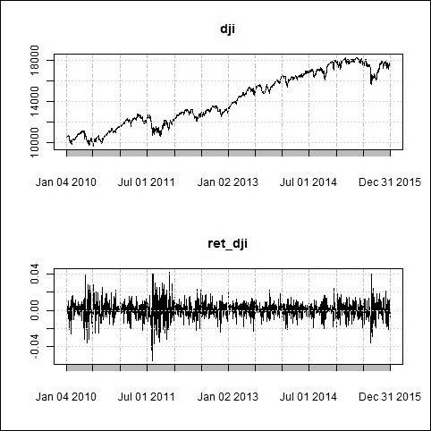

图 5.1：道琼斯指数收盘价和回报系列

为了回测我们的策略理念及其泛化能力，我们必须将数据集分成两个较小的数据集，分别称为样本内数据集和样本外数据集。这里我将定义四个日期。`in_sd`定义了样本内数据开始的日期，`in_ed`定义了样本内数据结束的日期。类似地，`out_sd`和`out_ed`分别定义了样本外数据开始和结束的日期。由于我们的数据是时间序列格式，所以日期是按顺序定义的，我们有兴趣建立一个基于历史数据的模型，并应用于实时数据，也就是说，数据集的日期必须晚于历史数据：

```py
>in_sd<- "2010-01-01" 
>in_ed<- "2014-12-31" 
>out_sd<- "2015-01-01" 
>out_ed<- "2015-12-31" 

```

变量`in_dji`和`in_ret_dji`分别包含之前定义的样本内日期范围内的道琼斯指数收盘价和回报数据，而`out_dji`和`out_ret_dji`分别包含之前定义的样本外日期范围内的道琼斯指数收盘价和回报数据：

```py
>in_dji<- dji[(index(dji) >= in_sd& index(dji) <= in_ed),] 
>in_ret_dji<- ret_dji[(index(ret_dji) >= in_sd& index(ret_dji) <= in_ed),] 
>out_dji<- dji[(index(dji) >= out_sd& index(dji) <= out_ed),] 
>out_ret_dji<- ret_dji[(index(ret_dji) >= out_sd& index(ret_dji) <= out_ed),] 

```

创建样本内和样本外数据集的目的是合理的，有助于控制人为偏差对参数估计的影响。我们应该使用样本内数据来回测我们的策略，估计最佳参数集，并评估其性能。最佳参数集必须应用于样本外数据，以理解规则和参数的泛化能力。如果在样本外数据上的表现与样本内数据非常相似，我们可以认为这些参数和规则集具有良好的泛化能力，可以用于实时交易。

我将使用**移动平均收敛发散**（**MACD**）和**布林带**指标来生成自动化交易信号。MACD 和布林带指标通过以下两行代码计算得出。我在这两个函数中使用了相同的参数值；不过，你可以使用你认为最适合数据集的参数。输出变量`macd`包含 MACD 指标及其信号值；而输出变量`bb`包含下轨、平均值、上轨和百分比布林带：

```py
>macd<- MACD(in_dji, nFast =12, nSlow = 26, nSig = 9,maType="SMA", percent = FALSE)    
> bb <- BBands(in_dji, n = 20, maType="SMA", sd = 2) 

```

第一行创建了变量`signal`并将其初始化为`NULL`。在第二行，当`dji`超过上轨布林带且`macd`值高于其`macd-signal`值时，我生成了买入信号（`1`）；当`dji`低于下轨布林带且`macd`小于其`macd-signal`值时，生成了卖出信号（`-1`）；当信号为`0`时，表示不在市场中：

```py
> signal <- NULL 
> signal <- ifelse(in_dji> bb[,'up'] &macd[,'macd'] >macd[,'signal'],1,ifelse(in_dji< bb[,'dn'] &macd[,'macd'] <macd[,'signal'],-1,0)) 

```

我已经为多头和空头都生成了信号；不过，你也可以仅实施多头或空头策略。你还可以修改此信号生成机制，使用任何你希望的其他退出标准。我们没有包含任何交易成本和滑点成本来计算其性能，因为这些策略并非直接用于交易。这些策略仅用于展示实现机制：

```py
>trade_return<- in_ret_dji*lag(signal) 

```

交易收益是通过道琼斯指数的收益和前一天的信号计算的。我将使用`PerformanceAnalytics`包来计算策略表现的各种矩阵。

首先，你应该将此包加载到 R 工作空间中：

```py
> library(PerformanceAnalytics) 
>cumm_ret<- Return.cumulative(trade_return) 
>annual_ret<- Return.annualized(trade_return) 

```

策略的累积收益和年化收益可以通过前面两行代码进行计算。`Chart.PerformanceSummary`在给定时间点绘制累积收益和日收益图，并显示回撤，如*图 5.2*所示：

```py
>charts.PerformanceSummary(trade_return) 

```

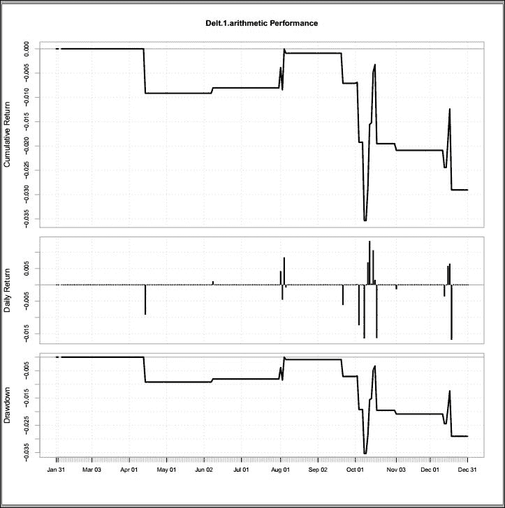

图 5.2：策略的累积收益、日收益和回撤

要了解更多关于交易收益的表现，你需要使用`summary()`命令。`summary()`将显示所有交易收益的最小值、第一个四分位数、中位数、均值、第三个四分位数和最大值。变量`trade_return`中也有一些`NA`，`summary()`会显示`NA`的数量。在下面的代码行中，我们首先将`trade_return`转换为时间序列对象，因为它会生成特定格式的输出。输出显示了最小值、第一个四分位数、中位数、第三个四分位数、最大值和`NA`。`NA`的值为`20`，这意味着`trade_return`中有`20`个`NA`值：

```py
> summary(as.ts(trade_return)) 
     Min.   1st Qu.    Median      Mean   3rd Qu.      Max.      NA's  
-0.039770  0 0 0.000062  0 0.055460        20  

```

以下是一些计算策略在样本数据上表现的命令。

第一个命令是计算整个交易期间的最大回撤，我们可以看到`0.1173028`表示最大回撤为 11.73%。第二个和第三个命令是计算交易收益的日标准差和年化标准差。接下来是策略收益的`VaR`计算，最后两个命令分别计算策略的日度和年化夏普比率。

日度夏普比率为`0.01621421`，年化夏普比率为`0.2289401`。夏普比率有两个参数：`Rf`和`FUN`。`Rf`是无风险利率，`FUN`是分母。在夏普比率的计算中，我使用了`FUN=StdDev`；它也可以是`VaR`：

```py
>maxDrawdown(trade_return) 
0.1173028 
>StdDev(trade_return) 
StdDev0.00379632 
>StdDev.annualized(trade_return) 
Annualized Standard Deviation        0.06026471 
>VaR(trade_return, p = 0.95) 
>SharpeRatio(as.ts(trade_return), Rf = 0, p = 0.95, FUN = "StdDev") 
StdDev Sharpe (Rf=0%, p=95%): 0.01621421 
>SharpeRatio.annualized(trade_return, Rf = 0) 
Annualized Sharpe Ratio (Rf=0%)         0.2289401 

```

现在，如果我们发现样本数据的表现很好，那么我们可以将此策略应用于出样本数据，计算所有出样本数据的矩阵，并检查策略表现的一致性。接下来的两行代码用于计算出样本数据的移动平均线、趋同发散和布林带：

```py
>macd<- MACD(out_dji, nFast = 7, nSlow = 12, nSig = 15,maType="SMA", percent = FALSE) 
> bb <- BBands(out_dji, n = 20, maType="SMA", sd = 2) 

```

接下来，我使用这些出样本指标并生成像我们为样本数据生成的信号：

```py
>signal <- NULL 
> signal <- ifelse(out_dji> bb[,'up'] &macd[,'macd'] >macd[,'signal'],1,ifelse(out_dji< bb[,'dn'] &macd[,'macd'] <macd[,'signal'],-1,0)) 

```

使用以下代码行计算出样本数据的交易收益及其相关指标。这些数据与样本数据类似：

```py
>trade_return<- out_ret_dji*lag(signal) 
>cumm_ret<- Return.cumulative(trade_return) 
>annual_ret<- Return.annualized(trade_return) 
>charts.PerformanceSummary(trade_return) 
>maxdd<- maxDrawdown(trade_return) 
>sd<- StdDev(trade_return) 
>sda<- StdDev.annualized(trade_return) 
>VaR(trade_return, p = 0.95)   
>SharpeRatio(as.ts(trade_return), Rf = 0, p = 0.95, FUN = "StdDev") 
>SharpeRatio.annualized(trade_return, Rf = 0) 

```

我为一个特定的时间序列实现了这个策略，即**道琼斯指数**（**DJI**）；但是，你也可以在其他股票上测试这个策略，并了解它在整个股票宇宙中的表现。如果你发现这个策略在大多数股票上表现较好，这表明这个思路具有一致性，并且可能在实时交易中也能有效。这里非常重要的一点是，即使某个特定策略在少数股票上表现良好，我们也不应忽视检查投资组合的方差。让我给你举个例子。我计算了道琼斯指数时间序列回报的方差：

```py
>var(ret_dji,na.rm=T) 
Delt.1.arithmetic      8.093402e-05 

```

在前面的代码中，我使用了`na.rm=T`来去除时间序列中的`Nan`。现在我将另一个符号`S&P 500`导入到工作空间中。接下来的代码将`S&P 500`导入工作空间：

```py
>getSymbols("GSPC",src="img/yahoo") 

```

现在，我提取了`S&P 500`的收盘价，并在两日期之间进行了精细化处理。

接下来，我计算了`S&P 500`的回报：

```py
>snp<- GSPC[,"GSPC.Close"] 
>snp<- snp[(index(snp) >= "2010-01-01" & index(snp) <= "2015-12-31"),] 
>ret_snp<- Delt(snp) 

```

我还计算了`S&P 500`系列回报的方差：

```py
>var(ret_snp,na.rm=T) 
Delt.1.arithmetic      8.590805e-05 

```

现在我将两个时间序列的回报率合并，并计算这两个回报率之和的方差：

```py
>var(ret_dji + ret_snp,na.rm=T) 
Delt.1.arithmetic       0.000218383 

```

我们得到以下结果：

```py
Variance(ret_dji + ret_snp) ≠ Variance(ret_dji) + Variance(ret_snp) 

```

正如我们所见，`0.000218383` ≠ `8.093402e-05` + `8.590805e-05`。

造成这种差异的原因非常重要。如果我们回顾概率论的基础，我们会发现以下内容：

```py
Variance (X + Y) = Variance(X) + Variance(Y) + 2  Covariance(X,Y)     .......... (5.1) 
Variance (X + Y) = Variance(X) + Variance(Y) + 2  ρσXσY................(5.2) 

```

这里，`ρ`是`X`和`Y`之间的相关性；`σX`是 X 的标准差；`σY`是 Y 的标准差。

我们使用以下命令计算`ret_dji`、`ret_snp`的标准差以及`ret_dji`和`ret_snp`之间的相关性：

```py
>sd(ret_dji,na.rm=T) 
[1] 0.00926866 
>sd(ret_snp,na.rm=T) 
[1] 0.008996333 
>cor(ret_dji[!is.na(ret_dji)],ret_snp[!is.na(ret_snp)]) 
                  Delt.1.arithmetic 
Delt.1.arithmetic         0.3090576 

```

`ret_dji`和`ret_snp`之间的相关性是`0.3090576`。现在我们将这些值代入方程 5.2，你会看到两边是相等的。这意味着，如果两只股票是正相关的，它们会导致投资组合的方差比两只股票的单独方差之和更高。如果我们能挑选出两只不相关的股票，也就是*相关性 = 0*，那么投资组合的方差将是两只个股方差的线性和；或者，如果我们选中了两只负相关的股票，那么投资组合的方差将小于两只股票的方差之和。

所以我们必须查看投资组合中股票的相关性矩阵，以确定哪些股票有助于最小化风险。由于投资组合中只有两只股票，我创建了一个名为`port_ret`的数据框，其中包含 NAs，行数与数据点的数量相同，且有两列：

```py
>port_ret<- data.frame(matrix(NA,dim(ret_dji)[1],2)) 

```

接下来的两条命令将`ret_dji`复制到数据框的第一列，将`ret_snp`复制到第二列：

```py
>port_ret[,1] <- ret_dji 
>port_ret[,2] <- ret_snp 

```

现在我们可以计算投资组合中股票的相关性矩阵。以下代码计算股票 1 与股票 2 的相关性：

```py
>cor(port_ret) 
       X1           X2 
X1     1            NA 
X2     NA           1 

```

上述相关性矩阵中有`NA`值，这是因为`port_ret`数据框中某处存在`NA`，因此我们需要从数据框中删除`NA`，`is.na()`帮助我们去除这些`NA`。以下代码过滤掉`port_ret`中的`NA`，然后计算相关性矩阵：

```py
>port_ret<- port_ret[!is.na(port_ret[,1]),] 
>cor(port_ret) 

             X1                  X2 
X1        1.0000000           0.3090576 
X2        0.3090576           1.0000000 

```

两只股票之间的相关性是顺序无关的，这就是为什么对角线元素相同的原因。很少能找到一对不相关或完全相关的股票。更负的相关性表明更好的多样化。当相关性增加时，多样化变得不那么重要，因为随着相关性的增加，投资组合的方差也会增加。这就是为什么相关性是选择股票和控制投资组合风险的最重要标准之一。

## 配对交易

你应该熟悉多样化的概念。为了实现多样化，我们需要选择负相关的股票；然而，在配对交易中，我们可以选择正相关的股票，并在这两只股票中进行相反的交易。对于被低估的股票，进行买入操作；对于被高估的股票，进行卖空操作。

X - Y 投资组合的方差定义如下：

```py
Variance (X -Y) = Variance(X) + Variance(Y) - 2 ρ σXσY................(5.3) 

```

配对交易是一种市场中性策略，因为两只股票的差异与整体市场不相关或接近零相关。我将展示如何使用距离法开始配对交易。我将使用相同的两只时间序列，分别是道琼斯指数和标普 500 指数，来进行配对交易，并解释如何在 R 中实现基于距离的方法。

### 基于距离的配对交易

不同的时间序列可能具有不同的缩放，因此你需要先对序列进行归一化。我通过使用初始投资 1 来进行归一化，然后计算该投资的累积回报：

```py
>ret_dji[1] <- 1
>ret_snp[1] <- 1

```

以下命令计算了从 1 开始的投资的累积回报。通过这种方式，我们可以追踪第一条序列与第二条序列的相对表现，最后一个命令是计算两条序列之间的差异：

```py
>norm_dji<- apply(ret_dji,2,cumprod)
>norm_snp<- apply(ret_snp,2,cumprod)

```

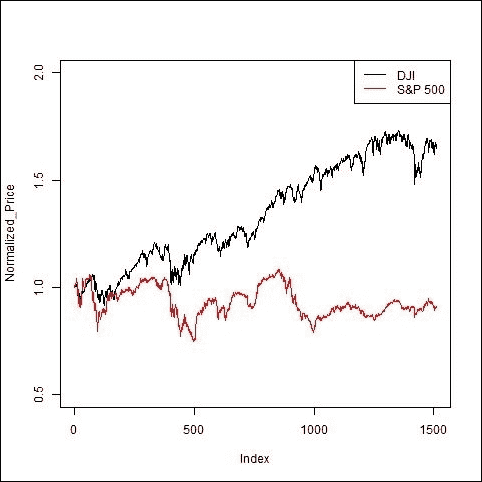

图 5.3：道琼斯指数和标普 500 指数的归一化价格

计算累积回报的公式定义如下：

```py
(Norm_dji)t =  (norm_dji)t-1 * (1 + rt) 

```

现在，我使用`plot()`命令绘制了归一化价格`norm_dji`，并通过`type="l"`帮助连接图中的所有点，生成折线图。如果不使用这个命令，图中将只显示点，`ylim=c(0.5,2)`用于缩放纵轴。我还使用了`lines()`在同一图表上绘制了另一条序列，这样我们就可以在同一图中查看两条序列。`ylab`用于标记 y 轴：

```py
>plot(norm_dji,type="l",ylim=c(0.5,2) ,ylab="Normalized_Price") 
>lines(norm_snp,col="red") 
>legend('topright',c("DJI","S&P 500") ,  lty=1, col=c('black','red'), bty='o', cex=1) 

```

`legend`命令帮助在图表的右上角放置一个框，标明图中绘制的是 DJI 和`S&P500`序列。参数`lty`用于设置图中的线型；`lty=1`表示实线。下一个图表用于绘制归一化价格之间的差异。

当你查看这个图表时，你会发现这两个系列的距离在 500 号索引之前会趋于接近，之后则会持续发散。由于这个配对并不经常会收敛，因此你不应该考虑将其用于配对交易。你需要寻找另一个历史数据中经常收敛和发散的配对，这意味着这两个系列在历史数据上有某些基本面的相似性。

我选择了**埃克森美孚**（**XOM**）和**雪佛龙公司**（**CVX**）作为示例。*图 5.4*展示了标准化价格序列及其差异，同时显示了为交易生成的信号。

正如在*图 5.4*中所看到的，标准化价格并没有长时间地远离彼此。这个配对似乎是基于距离的对冲交易的好选择。

我们像计算`norm_dji`和`norm_snp`一样计算`norm_xom`和`norm_cvx`，并使用以下命令将它们绘制出来：

```py
> class(norm_xom)
[1] "matrix"
> class(norm_cvx)
[1] "matrix"

```

你需要查看这两个变量的类别。正如上面所看到的，这两个都是矩阵，并且必须是`xts`、`zoo`对象。所以接下来你需要做的就是将这些矩阵对象转换为`xts`、`zoo`对象：

```py
norm_xom<- xts(norm_xom,index(ret_xom)) 
norm_cvx<- xts(norm_cvx,index(ret_cvx)) 

```

`xts()`函数完成这个工作，将这两个对象都转换为`xts`对象：

```py
>par(mfrow=c(3,1)) 
> plot(norm_xom,type="l",ylim=c(0.5,2) ,ylab="Normalized_Price") 
> lines(norm_cvx,col="red") 
> legend('topright',c("XOM","CVX") ,  lty=1, col=c('black','red'), bty='o', cex=1) 
> diff = norm_xom - norm_cvx 
> plot(diff,type="l",ylab="Normalized_Price_difference") 

```

标准化价格差异的均值和标准差可以按如下方式计算：

```py
> me <- mean(diff) 
>std<- sd(diff) 

```

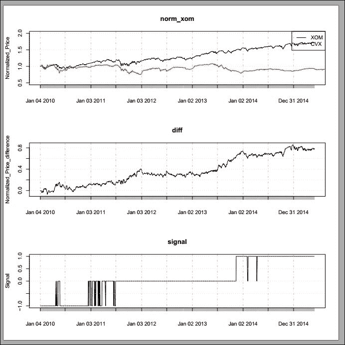

图 5.4：标准化价格序列、差异和交易信号

差异序列的上界（`ub`）和下界（`lb`）可以通过从均值中加减*n*倍标准差来计算：

```py
>ub<- me + n * std 
>lb<- me  - n*std 

```

寻找*n*的最优参数值并不是一件简单的事。我们要么得使用反复试验的方法来找到最优的*n*值，要么使用基于网格的参数优化器来找到最优值。

作为一个示例，这里我使用了`n = 1`仅仅是为了演示。当差异值低于下轨时，会产生一个买入信号（`1`）；当差异值高于上轨时，会产生一个卖出信号（`-1`）；否则信号保持（`0`）。

当差异值，即价差，超过上轨时，我们推测它会回归到均值，因为历史上它大多数时间都在这个范围内。同样，当价差低于下轨时，我们也推测它会回归到均值：

```py
> n <- 1 
> signal <- ifelse(diff > ub,1,ifelse(diff < lb,-1,0)) 

```

这里我使用了完整的差异值时间序列来计算均值和标准差，正如之前我计算`me`和`std`一样。你也可以在滚动窗口上动态地计算均值和标准差。这种动态的均值和标准差会改变信号的生成，进出场的频率也会更高。

动态的均值和标准差可以通过`rollapply()`函数来计算。在`rollapply()`中你应该定义数据集、长度和函数：

```py
>me_dynamic<-  rollapply(diff,10,mean) 
>std_dynamic<-  rollapply(diff,10,sd) 

```

`plot()`函数绘制了如*图 5.4*所示的信号。非零信号值表示我们参与了市场，零值意味着我们没有参与市场：

```py
>plot(signal, type="l") 

```

标准化价格的差异也叫做价差。由于我们是通过价差生成信号，因此我们将交易的是价差而非单一股票。所以，我们必须清楚地理解什么是价差交易。当我说买入时，意味着我在买入价差，这就意味着在 XOM 上做多，在 CVX 上做空，或者当我们收到卖出信号时，在 XOM 上做空，在 CVX 上做多。以下两行计算了价差和交易回报：

```py
>spread_return<- ret_xom - ret_cvx 
>trade_return<- spread_return*lag(signal) - cost 

```

变量`spread_return`表示回报价差，`trade_return`表示交易回报，cost 表示执行交易活动的费用；包括交易成本、经纪费用和滑点。

本书的目的仅是教你 R 语言编程，而不是产生盈利的交易理念。因此，我将成本设为 0，但你在回测你的策略并将资金投入实际账户时，必须考虑适当的成本。

现在我们应用绩效测量命令来提取绩效摘要：

```py
> summary(trade_return) 
      Min.    1st Qu.     Median       Mean    3rd Qu.       Max.  
-0.0330000  0.0000000  0.0000000  0.0002135  0.0000000  0.0373400 

```

所有关键绩效指标可以通过以下命令计算。这些命令已经在动量交易部分使用过：

```py
>cumm_ret<- Return.cumulative(trade_return) 
>annual_ret<- Return.annualized(trade_return) 
>charts.PerformanceSummary(trade_return) 
>maxdd<- maxDrawdown(trade_return) 
>sd<- StdDev(trade_return) 
>sda<- StdDev.annualized(trade_return) 
>VaR(trade_return, p = 0.95)   
>SharpeRatio(as.ts(trade_return), Rf = 0, p = 0.95, FUN = "StdDev") 
>SharpeRatio.annualized(trade_return, Rf = 0) 

```

*图 5.5*展示了此基于距离的配对交易策略的累积表现、每日回报和每日最大回撤：

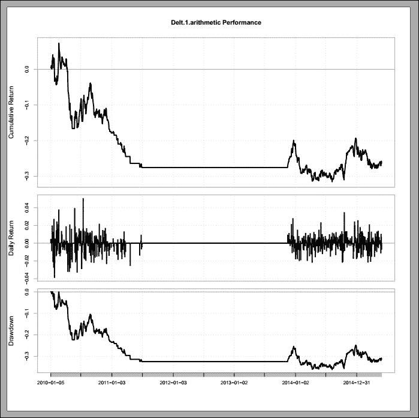

图 5.5：策略的累积回报、回报和每日最大回撤

在这里，我展示了一种实现基于距离的配对交易模型的实际方法。你应该将数据分为样本内和样本外数据集。参数优化应使用样本内数据进行，随后验证这些参数在样本外数据中的表现。我已经在动量交易部分向你展示了这一方法。

### 基于相关性的配对交易

另一种传统的配对交易方式是基于相关性。你需要选择一对历史上高度相关的股票，并且该对股票的价差与市场基准的相关性最小。每当你看到相关性强度减弱时，就意味着出现了交易机会。这也建立在均值回归的前提下，交易者会在看到相关性与其均值发生显著偏离，至少偏离*n*倍标准差时，押注相关性会回归到其均值。

市场中性策略可以通过两种不同的方式实现：

+   贝塔中性

+   美元中性

贝塔中性意味着价差的贝塔接近零；这可以通过选择两只贝塔几乎相同的股票或工具来实现。然而，美元中性意味着你只对市场有微弱的暴露，因为在做多股票的投资通过做空交易获得的资金被抵消。

实际上，即使我们在市场上的暴露较少，也不意味着我们没有风险或风险很小。风险需要妥善管理才能实现盈利的交易。接下来，我将向你展示如何实现基于相关性的配对交易模型。

首先，你需要创建一个数据框，其中包含 XOM 和 CVX 的收益，因为我将 XOM 和 CVX 作为我的配对股票。

第一列是 XOM，第二列是 CVX 的收益：

```py
>data <- data.frame(matrix(NA,dim(ret_xom)[1],2)) 
>data[,1] <- ret_xom 
>data[,2] <- ret_cvx 
> class(data) 
[1] "data.frame" 

```

可以使用 `class()` 函数检查该数据的类型，结果显示该数据属于 `data.frame` 类型。你需要将其转换为 `xts` 对象，可以使用以下代码来实现：

```py
> data <- xts(data,index(ret_xom)) 
> class(data) 
[1] "xts" "zoo" 

```

现在你可以检查数据的类型，它是 `xts` 和 `zoo` 类型。接下来，我创建了一个名为 correlation 的函数，接受一个参数 `x`，该函数计算 `x` 的第一列和第二列之间的相关性并返回相关性：

```py
>correlation <- function(x)  
{ 
         result <- cor(x[,1],x[,2]) 
         return (result) 
} 

```

我使用了 `rollapply()` 函数，它基于滚动窗口的方式进行计算，窗口长度由此函数中的滚动窗口长度参数定义。在这里，我提供了四个参数：第一个参数是用于计算的数据，第二个是窗口长度，第三个是用于计算的函数，第四个是指示函数是否应对每一列单独计算。

我使用的数据长度为 `252`，函数是前面定义的 correlation，`by.column=FALSE` 表示该函数不会对每一列单独应用。

所以这个过程会不断进行，并使用最后 10 个数据点来计算相关性：

```py
>corr<- rollapply(data,252,correlation ,by.column=FALSE)  

```

该策略持续监控两个历史相关证券的表现。当这两只证券之间的相关性暂时减弱时，即一只股票上涨而另一只股票下跌，配对交易策略将是做空表现较好的股票并做多表现较差的股票，赌注是这两者之间的价差最终会收敛。

配对之间的背离可能是由于暂时的供需变化、大量买入/卖出某一证券的订单、某一公司发布的重要新闻反应等原因引起的。

*图 5.6* 显示了在滚动窗口长度为 `252` 时，XOM 和 CVX 收益之间的相关性。你可以看到，几乎每次相关性都超过了 0.6，表明这个配对的高相关性几乎每天都在持续：

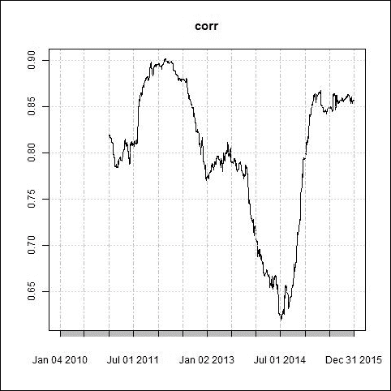

图 5.6：XOM 和 CVX 收益之间的相关性

通常，相关性大于 0.8 被视为强相关，小于 0.5 被视为弱相关。你还需要计算 XOM 和 CVX 的对冲比率，可以通过将 XOM 价格除以 CVX 价格来计算：

```py
>hedge_ratio<-  xom  / cvx 

```

然后，你需要计算对冲比率的均值和标准差，以及上下边界。在基于距离的模型中，我提出了使用静态均值和标准差的技术；然而，在这一部分，我展示了基于滚动窗口的均值和标准差，用于计算边界。由于均值和标准差将是时间的函数，因此上下边界也将随时间变化。我使用`rollapply()`函数计算每 14 个数据点的滚动均值和标准差：

```py
>roll_me<- rollapply(hedge_ratio,14,mean)
>roll_std<- rollapply(hedge_ratio,14,sd)
> n <- 1
>roll_ub<- roll_me + n * roll_std
>roll_lb<- roll_me - n * roll_std

```

如果你查看前面的两个命令，你会看到参数 n，这是一个任意值，应该进行优化。一旦你有了边界，你就可以进行信号生成，下面的代码可以实现这一操作：

```py
> signal <- NULL
> signal <- ifelse(hedge_ratio> roll_ub,-1,ifelse(hedge_ratio< roll_lb,1,0))
>lagsignal<- Lag(signal,1)
> signal <- ifelse(lagsignal == -1 &hedge_ratio> roll_me,
-1,ifelse(lagsignal == 1 &hedge_ratio< roll_me,1,0))

```

当对冲比率超过上界时，它会生成一个卖出信号（`-1`）；当对冲比率低于下界时，会生成一个买入信号（`1`）。然后，计算滞后`1`时刻的信号，并在对冲比率穿越滚动均值时生成退出信号。卖出信号表示卖空`1`单位的 XOM 并做多对冲比率与 CVX 的乘积；买入信号则表示买入`1`单位的 XOM 并做空对冲比率与 CVX 的乘积。你应该使用以下命令计算价差回报和交易回报：

```py
>spread_return<- ret_xom - ret_cvx
>trade_return<- spread_return*lag(signal) - cost

```

完成这些操作后，你需要分析这些信号的质量，因此你需要计算所有的交易回报指标，这些可以通过前面章节提到的命令来计算，特别是动量交易和基于距离的配对交易部分。你还需要使用样本内数据优化参数，并使用这些优化后的参数来测试样本外数据，真正评估策略在样本外数据上的表现。

### 基于协整的配对交易

基于协整的配对交易是配对交易领域的最新武器，近年来其使用速度非常快。

协整考虑了一系列价格与另一系列价格的回归。由于这些系列是非平稳的，如果这些系列没有协整关系，那么回归结果将是虚假的。当我们需要回归非平稳系列时，协整变得至关重要。你首先需要检查你所使用的时间序列是否是非平稳的。你需要将`tseries`包加载到工作空间中，且本部分使用的数据是 2014 年 1 月 1 日到 2014 年 12 月 31 日的数据：

```py
> library(tseries)
>adf.test(xom)

```

增广的`Dickey-Fuller`检验：

```py
data:  xom 
Dickey-Fuller = -1.4326, Lag order = 11, p-value = 0.8185 
alternative hypothesis: stationary 

```

你可以看到`Dicky-Fuller`统计量为`-1.4326`，高于`-3.43`。这意味着该序列是非平稳的，你也可以检查该序列的第一差分：

```py
> diff <- xom - Lag(xom,1) 
>adf.test(diff[!is.na(diff)]) 
   Augmented Dickey-Fuller Test 
data:  diff[!is.na(diff)] 
Dickey-Fuller = -11.791, Lag order = 11, p-value = 0.01 
alternative hypothesis: stationary 

```

由于`diff`包含`NA`，你应该只考虑非 NA 值，并使用`adf.test()`来检验单位根。使用时间序列的第一差分得到的`Dickey-Fuller`统计量为`-11.97`，小于`-3.43`，这表明第一差分是平稳的，且表明 XOM 是 1 阶积分的，即`O(1)`。

现在我要使用`lm()`来拟合 XOM 和 CVX 的模型。`lm()`对应于线性模型，它回归 XOM 相对于 CVX 的原始价格，`lm()`中的`0`表示没有截距的回归：

```py
> model <- lm(xom ~ cvx + 0) 
> model 
Call: 
lm(formula = xom ~ cvx + 0) 
Coefficients: 
cvx 
0.8008   

```

可以使用`summary()`命令查看模型的摘要：

```py
> summary(model) 
Call: 
lm(formula = xom ~ cvx + 0) 
Residuals: 
     Min       1Q   Median       3Q      Max  
-12.7667  -2.2833   0.4533   2.9224  13.9694  
Coefficients: 
Estimate Std. Error t value Pr(>|t|)     
cvx 0.800802   0.001123   713.4   <2e-16 *** 
--- 
Signif. codes:  0 '***' 0.001 '**' 0.01 '*' 0.05 '.' 0.1 ' ' 1 
Residual standard error: 4.587 on 1509 degrees of freedom 
Multiple R-squared:  0.997,     Adjusted R-squared:  0.997  
F-statistic: 5.09e+05 on 1 and 1509 DF,  p-value: < 2.2e-16> 

```

下一步是提取来自名为`model`的变量的残差，并对其进行单位根测试，您可以使用以下命令来完成此操作。你可以看到输出中`Dickey-Fuller`统计量为`-2.6088`，大于`-3.43`，这意味着存在单位根。在概率论中，单位根有一个重要特性需要验证。单位根的存在会导致推断问题，因为具有单位根的时间序列会膨胀，不会收敛，或者持续发散。非平稳的时间序列具有单位根，它们不会收敛。单位根的存在意味着 XOM 和 CVX 并未协整：

```py
>adf.test(as.ts(model$residuals))
Augmented Dickey-Fuller Test
data:  as.ts(model$residuals)
Dickey-Fuller = -2.6088, Lag order = 11, p-value = 0.3206
alternative hypothesis: stationary

```

移动公司（XOM）和对冲比率乘以 BP 公司（BP），以及它们的残差。如果你查看价格序列，你会发现两者之间有很强的相关性。你必须找到另一个协整的配对，所以让我们尝试找另一个配对。让我向你展示**埃克森美孚**（**XOM**）和 BP 公司（BP）之间的协整关系。

使用`GetSymbols()`提取 XOM 和 BP 的收盘价，并使用这些数据回归以建立它们之间的关系：

```py
> model <- lm(xom ~ bp + 0) 
>adf.test(as.ts(model$residuals)) 
Augmented Dickey-Fuller Test 
data:  as.ts(model$residuals) 
Dickey-Fuller = -3.9007, Lag order = 11, p-value = 0.01395 
alternative hypothesis: stationary 

```

这里，`Dickey-Fuller`统计量为`-3.9007`，小于 95%置信水平下的临界值（`-3.43`），所以这没有单位根，这对是平稳的：

```py
> par(mfrow=c(2,1)) 
> plot(dji,type="l") 
> lines(snp*model$coefficients,col="red") 
> plot(model$residuals,type="l") 

```

*图 5.7* 显示了 XOM 和对冲比率乘以 BP 价格序列及其价差。`plot()`和`lines()`用于绘制该图。现在，由于残差是均值回归的，因此下一步是使用以下命令生成界限和信号：

```py
>roll_me<- rollapply(model$residuals,14,mean)
>roll_std<- rollapply(model$residuals,14,sd)
> n <- 1
>roll_ub<- roll_me + n * roll_std
>roll_lb<- roll_me - n * roll_std

```

前面的两个命令有一个参数 n，它是任意的，应该进行优化：

```py
> signal <- NULL
> signal <- ifelse(model$residuals> roll_ub,-1,ifelse(model$residuals< roll_lb,1,0))
>lagsignal<- Lag(signal,1)
>signal <- ifelse(lagsignal == -1 &model$residuals> roll_me,-1,ifelse(lagsignal == 1 &model$residuals< roll_me,1,0))

```

*图 5.7* 显示了**埃克森美孚**（**XOM**）和对冲比率乘以 BP 公司（BP）的价格序列以及它们的残差。如果你查看价格序列，你可以看到这两个序列之间的紧密关系，并且这两个序列不会长时间偏离太远。如果它们有偏离的话，很快它们就会恢复接近：

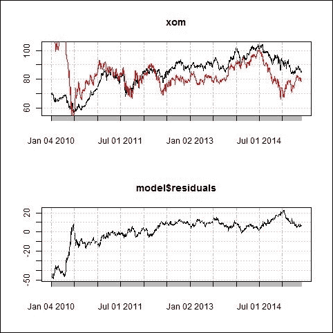

图 5.7：XOM 和对冲比率乘以 BP 的序列以及它们的价差序列

由于你已经生成了信号，接下来应该计算策略的表现，方法可以参考我在动量交易或基于距离的配对交易部分中提到的命令。

# 资本资产定价模型

**资本资产定价模型**（**CAPM**）帮助评估证券或投资组合对基准的风险贡献，风险通过贝塔值来衡量 ()。通过 CAPM 模型，我们可以估计单个证券或投资组合的预期超额回报，这与其贝塔值成正比：

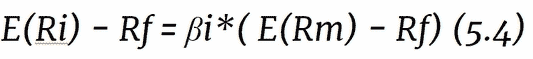

这里：

+   *E(Ri)*：证券的预期回报

+   *E(Rm)*: 市场预期收益率

+   *Ri*: 证券的收益率

+   *Rf*: 无风险收益率

+   *Rm*: 基准或市场收益率

+   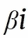: 证券的贝塔值

CVX 与 DJI 通过线性模型回归，如公式 5.4 所示。

这里我在以下命令中使用了零作为无风险收益率：

```py
>rf<- rep(0,length(dji))
>model <- lm((ret_cvx  -rf) ~ (ret_dji -rf) )
> model
Call:
lm(formula = (ret_cvx - rf) ~ (ret_dji - rf))
Coefficients:
(Intercept)  ret_dji
-0.0002013    1.1034521 

```

你可以看到上面的结果中的截距项是 alpha（`-0.0002013`），而 `ret_dji` 的系数是贝塔（`1.1034521`）。不过，你也可以使用 `PerformanceAnalytics` 包，通过 `CAPM.alpha()` 和 `CAPM.beta()` 来计算 CAPM 的 alpha 和 beta。

以下命令展示了如何使用此方法，结果与之前相同：

```py
>CAPM.beta(ret_cvx,ret_dji)
[1] 1.103452
>CAPM.alpha(ret_cvx,ret_dji)
[1] -0.0002013222

```

从 `CAPM.beta()` 获得的贝塔值与回归中的系数相同，而 `CAPM.alpha()` 与回归中的截距相同。你还可以看到收益率及其拟合线的散点图：

```py
>plot(as.ts(ret_cvx),as.ts(ret_dji),xlab="CVX_ Return",ylab="DJI_Return")
>abline(model,col="red")

```

*图 5.8* 显示拟合线具有正斜率，这意味着收益率之间存在正相关。我们可以使用以下命令验证这一说法：

```py
>cor(ret_cvx,ret_dji)
 Delt.1.arithmetic
Delt.1.arithmetic         0.7881967

```

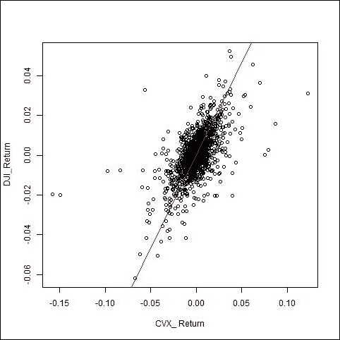

图 5.8: DJI 和 CVS 收益率的散点图及其拟合线

# 多因子模型

多因子模型可以用来分解收益并计算风险。因子是通过定价、基本面和分析师预期数据构建的。在这一部分，我将使用系统化投资工具箱。

`gzcon()` 函数创建一个连接并读取压缩格式的数据。创建连接后，我们还需要关闭连接。

以下命令解释了这个过程：

```py
> con = gzcon(url('http://www.systematicportfolio.com/sit.gz', 'rb'))
>  source(con)
> close(con)

```

以下函数用于从 [`money.cnn.com`](http://money.cnn.com) 获取道琼斯成分股数据，`join()` 来自系统化投资工具箱：

```py
>dow.jones.components<- function(){
url = 'http://money.cnn.com/data/dow30/'
 txt = join(readLines(url))
 temp = gsub(pattern = '">', replacement = '<td>', txt, perl = TRUE)
 temp = gsub(pattern = '</a>', replacement = '</td>', temp, perl = TRUE) 
 temp = extract.table.from.webpage(temp, 'Volume', has.header = T)
 trim(temp[,'Company']) }

```

下一行代码调用了前面的函数，用于提取道琼斯成分股列表：

```py
>tickers = dow.jones.components()

```

以下命令解释了如何提取所有公司在 tickers 列表中过去 80 个月的基本面数据。这些命令会花费几分钟时间提取数据，因此建议在提取数据后保存数据，之后应使用 `load()` 命令加载它：

```py
>data.fund<- new.env()
>   temp = paste(iif( nchar(tickers) <= 3, 'NYSE:', 'NASDAQ:'), tickers, sep='')
>for(i in 1:len(tickers)) data.fund[[tickers[i]]] = fund.data(temp[i], 80)
>save(data.fund, file='data.fund.Rdata')
# load(file='data.fund.Rdata')

```

下一组命令与之前的代码相同，但用于提取价格数据：

```py
# get pricing data
>data <- new.env()
>getSymbols(tickers, src = 'yahoo', from = '1970-01-01', env = data, auto.assign = T)
>for(i in ls(data)) data[[i]] = adjustOHLC(data[[i]], use.Adjusted=T) 
>save(data, file='data.Rdata')
#load(file='data.Rdata')

```

后续的函数会创建各种日期格式的日期变量：

```py
>date.fund.data<- function(data){
quarter.end.date = as.Date(paste(data['quarter end date',], '/1', sep=''), '%Y/%m/%d') 
quarterly.indicator = data['quarterly indicator',]
date.preliminary.data.loaded = as.Date(data['date preliminary data loaded',], '%Y-%m-%d') + 1
months = seq(quarter.end.date[1], tail(quarter.end.date,1)+365, by='1 month') 
index = match(quarter.end.date, months)
quarter.end.date = months[ iif(quarterly.indicator == '4', index+3, index+2) + 1 ] - 1
fund.date = date.preliminary.data.loaded
fund.date[is.na(fund.date)] = quarter.end.date[is.na(fund.date)] 
return(fund.date) }

```

现在你已经提取了价格和基本面数据，你应该使用这些数据来构建各种基本面因子，如每股收益、流通股数、市场市值、市值与账面价值比等。这个循环会为每个股票代码逐个计算基本面因子并创建一个列表：

```py
> library(quantmod)
>for(i in tickers) {
fund = data.fund[[i]]
fund.date = date.fund.data(fund) 
# Earnings per Share 
EPS = get.fund.data('Diluted EPS from Total Operations', fund, fund.date, is.12m.rolling=T) 
# Common Shares Outstanding
CSHO = get.fund.data('total common shares out', fund, fund.date)
# Common Equity
CEQ = get.fund.data('total equity', fund, fund.date)
# merge
data[[i]] = merge(data[[i]], EPS, CSHO, CEQ) }

```

接下来，我筛选了前面的数据，时间范围从 `1995` 年到 `2011` 年：

```py
>bt.prep(data, align='keep.all', dates='1995::2011')

```

所有股票的价格可以通过以下命令提取，并且 NAN 可以用之前的值替换：

```py
>     prices = data$prices
>     prices = bt.apply.matrix(prices, function(x) ifna.prev(x))

```

现在你需要使用基本因素和价格构建基本比率。我创建了三个比率；不过，你可以创建任何你想要考虑的比率。我创建了市值、市盈率比率和账面价值比率：

```py
# Financial Ratios
>factors$TV = list()
# Market Value - capitalization
> CSHO =  bt.apply(data, function(x) ifna.prev(x[, 'CSHO']))
> MKVAL = prices * CSHO
 #  Earnings / Price
> EPS = bt.apply(data, function(x) ifna.prev(x[, 'EPS']))
>factors$TV$EP = EPS / prices
#  Book Value / Price
> CEQ = bt.apply(data, function(x) ifna.prev(x[, 'CEQ']))
>factors$TV$BP = CEQ / MKVAL

```

由于这些比率的量纲可能不同，在继续之前，我们不应该忘记对其进行标准化。我计算了 Z 分数来标准化这些数据：

```py
# normalize (convert to z scores) cross sectional all Traditional Value factors
>for(i in names(factors$TV)) {
factors$TV[[i]] = (factors$TV[[i]] - 
cap.weighted.mean(factors$TV[[i]], MKVAL)) / 
 apply(factors$TV[[i]], 1, sd, na.rm=T)
}
This is how we bind different data in multidimensional case
# compute the overall Traditional Value factor
>load.packages('abind') 
> temp = abind(factors$TV, along = 3)

```

计算所有标准化因子的平均值：

```py
>factors$TV$AVG = factors$TV[[1]]
>factors$TV$AVG[] = apply(temp, c(1,2), mean, na.rm=T)

```

到目前为止，我们有的是日数据，并且已经基于日数据创建了财务比率。你可以将其转换为任何你需要的频率。我将其转换为月频，并提取了每个月最后一天的数据：

```py
# find month ends
>month.ends = endpoints(prices, 'months')
> prices = prices[month.ends,]
>     n = ncol(prices)
>nperiods = nrow(prices)

```

这就是你应该如何计算月度回报及其 `lag`：

```py
> ret = prices / mlag(prices) - 1
>next.month.ret = mlag(ret, -1)

```

每个月最后一天的市值可以通过以下方式计算：

```py
> MKVAL = MKVAL[month.ends,]

```

提取每个月最后一天的所有比率：

```py
>for(j in 1:len(factors)) { 
for(i in 1:len(factors[[j]])) {
 factors[[j]][[i]] = factors[[j]][[i]][month.ends,] 
 }}

```

接下来你应该计算分位数，可以通过以下命令计算。我创建了五个分位数，并且使用盈利价格因子计算了每个分位数的下个月平均回报。分位数是通过按 EP 因子对股票进行月份排序来创建的：

```py
> out = compute.quantiles(factors$TV$AVG, next.month.ret, plot=F) 
> models = list()
>for(i in 1:5) {
data$weight[] = NA
data$weight[month.ends,] = iif(out$quantiles == i, out$weights, 0)
 capital = 100000
data$weight[] = (capital / prices) * (data$weight) 
 models[[paste('Q',i,sep='')]] = bt.run(data, type='share', capital=capital) }

```

最高和最低极值非常极端，应该用来创建一个差距（Q5 - Q1）。这个差距的动态有助于设计和开发投资策略，即动量或均值回归：

```py
# spread
>data$weight[] = NA
>data$weight[month.ends,] = iif(out$quantiles == 5, out$weights, 
iif(out$quantiles == 1, -out$weights, 0))
>     capital = 100000
>data$weight[] = (capital / prices) * (data$weight)
> models$Q5_Q1 = bt.run(data, type='share', capital=capital)

```

现在你应该运行横截面回归来估计 alpha 和投资组合负荷，这些可以通过以下命令计算：

```py
>factors.avg = list()
>for(j in names(factors)) factors.avg[[j]] = factors[[j]]$AVG
>factors.avg = add.avg.factor(factors.avg)
>nperiods = nrow(next.month.ret)
> n =ncol(next.month.ret)
# create matrix for each factor
>factors.matrix = abind(factors.avg, along = 3) 
>all.data = factors.matrix
> # betas
> beta = all.data[,1,] * NA
# append next.month.ret to all.data
>all.data = abind(next.month.ret, all.data, along = 3)
>dimnames(all.data)[[3]][1] = 'Ret'
# estimate betas (factor returns)
>for(t in 30:(nperiods-1)) {
 temp = all.data[t:t,,]
 x = temp[,-1]
 y = temp[,1]
 beta[(t+1),] = lm(y~x-1)$coefficients
 }
 # create Alpha return forecasts
> alpha = next.month.ret * NA
>for(t in 40:(nperiods-1)) {
 # average betas over the last 6 months
coef = colMeans(beta[(t-5):t,],na.rm=T)
 alpha[t,] = rowSums(all.data[t,,-1] * t(repmat(coef, 1,n)), na.rm=T)    }

```

我们还可以使用这些 alpha 和 beta 来估计未来的投资组合回报。

# 投资组合构建

投资者的目标是减少风险并最大化投资回报，创建一个投资组合可以实现这一目标，前提是我们在构建时考虑了投资者的风险-回报特征。我将指导你如何创建一个有效前沿，帮助你根据预期回报衡量风险。为此，我将开始提取四个证券的数据。第一行代码创建一个新的环境来存储数据；接下来的几行是关于符号列表、数据起始日期，以及使用 `getSymbols()` 提取数据：

```py
>stockData<- new.env() 
> symbols <- c("MSFT","FB","GOOG","AAPL")
>start_date<- as.Date("2014-01-01")
>getSymbols(symbols, src="img/yahoo", env=stockData, from=start_date)
> x <- list()

```

接下来的 for 循环将个别股票数据存储在一个列表中，并计算当天的收益，以及一个包含所有投资组合股票收盘价的数据框：

```py
>for (i in 1:length(symbols)) {
 x[[i]] <- get(symbols[i], pos=stockData)  # get data from stockData environment
 x[[i]]$gl<-((Cl(x[[i]])-Op(x[[i]]))/Op(x[[i]]))*100 #Daily gain loss percentage 
 if(i==1)
 data <- Cl(x[[i]])
 else 
 data <- cbind(data,Cl(x[[i]])) }

```

可以使用以下命令计算每只股票的收益、平均收益以及协方差矩阵：

```py
>data_ret<- apply(data,2,Delt)
>napos<- which(apply(data_ret,2,is.na))# Remove Na's
>avg_ret<- apply(data_ret[-napos,],2,mean)
>covariance_mat<- cov(data_ret,use='na')

```

我将使用以下权重来分配给投资组合：

```py
> weights <- c(0.2,0.3,0.35,0.15)

```

现在你需要浏览链接 [`faculty.washington.edu/ezivot/econ424/portfolio.r`](http://faculty.washington.edu/ezivot/econ424/portfolio.r)，并将这个 R 代码保存到文件 `portfolio.R` 中。你应该使用以下命令来访问在 `portfolio.R` 中开发的函数：

```py
> source("portfolio.R")

```

为了计算投资组合的预期收益和标准差，我们需要收益、权重和协方差矩阵。现在我们已经拥有所有数据，并可以使用以下命令来生成投资组合的预期收益和风险：

```py
>weightedport = getPortfolio(avg_ret,covariance_mat,weights)
>weightedport
Call:
getPortfolio(er = avg_ret, cov.mat = covariance_mat, weights = weights)
Portfolio expected return:     0.0004109398 
Portfolio standard deviation:  0.01525882 
Portfolio weights:
MSFT.CloseFB.CloseGOOG.CloseAAPL.Close
 0.20       0.30       0.35       0.15

```

全球最小方差投资组合可以使用以下命令获得。你可以看到这里的投资组合权重与前一个命令中的权重不同，这一组权重有助于生成标准差较低的投资组合：

```py
>minvar_port<- globalMin.portfolio(avg_ret, covariance_mat)
>minvar_port
Call:
globalMin.portfolio(er = avg_ret, cov.mat = covariance_mat)
Portfolio expected return:     0.0007211767 
Portfolio standard deviation:  0.01349528 
Portfolio weights:
MSFT.CloseFB.CloseGOOG.CloseAAPL.Close
0.5889     0.2415     0.1001     0.0696

```

现在假设你想生成一个预期收益为`0.0002`的投资组合。以下命令将帮助生成该预期收益为`0.0002`的投资组合的权重和标准差：

```py
>rf<- 0.0002
>effcient_port<- efficient.portfolio(avg_ret, covariance_mat,rf)
>effcient_port
Call:
efficient.portfolio(er = avg_ret, cov.mat = covariance_mat, target.return = 2e-04)
Portfolio expected return:     2e-04 
Portfolio standard deviation:  0.0169678 
Portfolio weights:
MSFT.CloseFB.CloseGOOG.CloseAAPL.Close
0.4626    -0.1292     0.4184     0.2482

```

切线投资组合是一个风险资产组合，具有最高的夏普比率斜率。为了计算这一点，我使用了` tangency.portfolio()`函数：

```py
>tangency_port<- tangency.portfolio(avg_ret,covariance_mat , rf)
>tangency_port
Call:
tangency.portfolio(er = avg_ret, cov.mat = covariance_mat, risk.free = 2e-04)
Portfolio expected return:     0.4942792 
Portfolio standard deviation:  0.02226374 
Portfolio weights:
MSFT.CloseFB.CloseGOOG.CloseAAPL.Close
0.8062     0.8797    -0.4480    -0.2378

```

我们已经计算了全球最小方差投资组合，另一个具有最大预期收益的投资组合可以视为第二个投资组合。分别将这些投资组合称为*P1*和*P2*。现在，对于任何 ，可以按以下方式构建另一个投资组合：

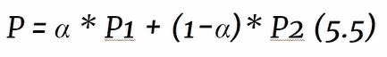

可以使用以下命令计算有效前沿。这将生成`50`个投资组合，使用 ，范围从 `-2` 到 `2`：

```py
>efficient_frontier<- efficient.frontier(avg_ret, covariance_mat, alpha.min=-2,alpha.max=2, nport=50)

```

接下来，在*图 5.9*中，我绘制了有效前沿、最小方差和切线投资组合的红蓝点，以及切线与前沿的切点：

```py
>plot(efficient_frontier, plot.assets=T)
>points(minvar_port$sd, minvar_port$er, col="blue")
>points(tangency_port$sd,tangency_port$er, col="red")
>tangenet_sharpe_ratio = (tangency_port$er - rf)/tangency_port$sd
>abline(a=rf, b=tangenet_sharpe_ratio)

```

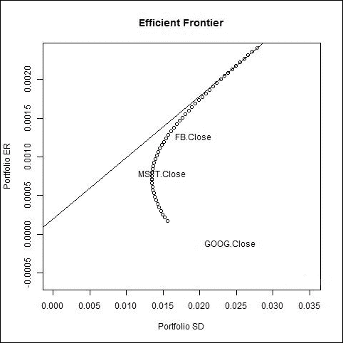

图 5.9：投资组合的有效前沿与切线

# 问题

1.  如何从雅虎财经导入股票数据到 R 工作空间？

1.  如何使用移动平均交叉生成动量策略？

1.  哪个包帮助计算策略的绩效指标？

1.  如何计算一个由五只股票组成的投资组合的协方差矩阵？

1.  从雅虎提取 MSFT 数据，并测试收盘价系列是否是非平稳的。

1.  使用距离法生成交易信号，当价差回归均值时退出。

1.  如何测试一对股票的协整性，并编写代码进行测试？

1.  如何计算对冲比率，它如何帮助交易？

1.  如何计算投资组合的贝塔值？请用一个例子展示。

1.  如何使用基本面因子创建分位数和分位数差距？

1.  编写代码计算投资组合的预期`收益`和标准差。

1.  如何计算有效前沿并使用 R 命令绘制它？

# 总结

在本章中，我介绍了使用 R 进行交易的不同概念。 我从趋势跟踪策略开始，深入解释了交易信号是如何生成的，以及如何捕捉与其表现相关的各种参数。 动量策略之后是使用三种不同方法进行配对交易。 第一种方法是基于距离的配对交易，第二种是基于相关性的，第三种也是最后一种方法是基于协整的配对交易。 有时，通过投资组合进行交易以控制风险和回报比是很重要的，为此我涵盖了资本资产定价、多因子模型和投资组合构建。 我使用 Systematic Investor Toolbox 来实现投资组合理念。

在下一章中，我将解释使用机器学习算法的交易策略，这些策略越来越受欢迎。 机器学习算法会自动从历史市场行为中学习，并尝试模仿这种行为。
