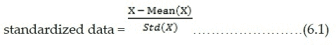
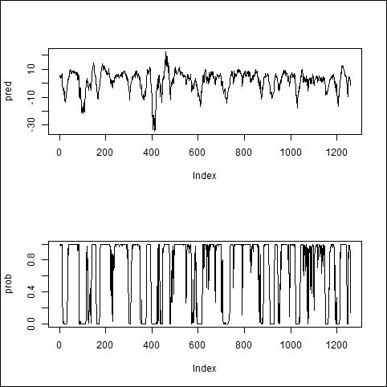
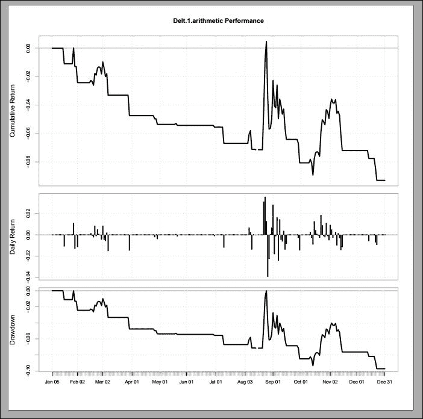
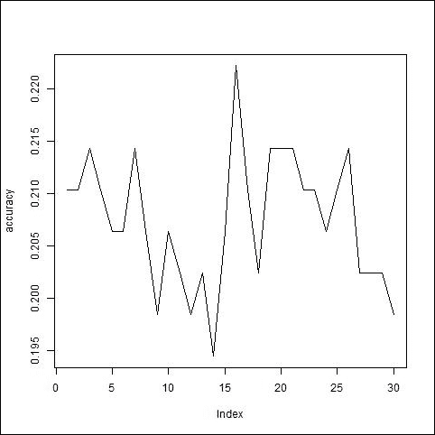
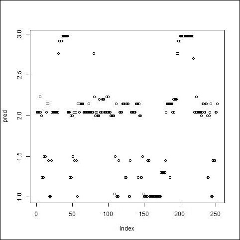
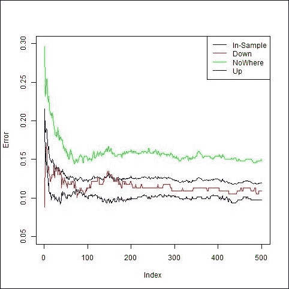

# 第六章 使用机器学习进行交易

在资本市场，基于机器学习的算法交易如今非常流行，许多公司正在投入大量精力研发机器学习算法，这些算法要么是专有的，要么是为客户提供的。机器学习算法是以一种能够不断学习并自动改变其行为的方式编写的。这有助于在市场中出现新模式时及时识别。有时候，资本市场中的模式是如此复杂，以至于人类无法捕捉到。即使人类设法找到了某个模式，也无法高效地识别它。模式的复杂性迫使人们寻求其他机制，以准确高效地识别这些复杂的模式。

在上一章中，你了解了动量、基于配对交易的算法交易和投资组合构建。在本章中，我将一步步解释一些在算法交易中使用的有监督和无监督的机器学习算法：

+   逻辑回归神经网络

+   神经网络

+   深度神经网络

+   K 均值算法

+   K 最近邻算法

+   支持向量机

+   决策树

+   随机森林

本章中使用的几个包包括`quantmod`、`nnet`、`genalg`、`caret`、`PerformanceAnalytics`、`deepnet`、`h2o`、`clue`、`e1071`、`randomForest`和`party`。

# 逻辑回归神经网络

市场方向对于投资者或交易者来说非常重要。预测市场方向是一项非常具有挑战性的任务，因为市场数据充满了噪声。市场要么上涨，要么下跌，市场运动的性质是二元的。逻辑回归模型帮助我们通过二元行为拟合模型，并预测市场方向。逻辑回归是一种概率模型，它为每个事件分配概率。我假设你已经熟悉从 Yahoo 提取数据，因为你在前面的章节中已经学习过这一部分。这里我仍将使用`quantmod`包。接下来的三条命令用于将该包加载到工作空间中，从`yahoo`库导入数据，并仅提取数据中的收盘价：

```py
>library("quantmod")
>getSymbols("^DJI",src="img/yahoo")
>dji<- DJI[,"DJI.Close"]

```

逻辑回归的输入数据是通过不同的指标构建的，如移动平均、标准差、相对强弱指数（RSI）、平滑异同移动平均线（MACD）、布林带等，这些指标在市场方向上具有一定的预测能力，即`Up`（上涨）或`Down`（下跌）。这些指标可以通过以下命令构建：

```py
>avg10<- rollapply(dji,10,mean)
>avg20<- rollapply(dji,20,mean)
>std10<- rollapply(dji,10,sd)
>std20<- rollapply(dji,20,sd)
>rsi5<- RSI(dji,5,"SMA")
>rsi14<- RSI(dji,14,"SMA")
>macd12269<- MACD(dji,12,26,9,"SMA")
>macd7205<- MACD(dji,7,20,5,"SMA")
>bbands<- BBands(dji,20,"SMA",2)

```

以下命令用于创建方向变量，方向可以是`Up`（上涨，`1`）或`Down`（下跌，`0`）。当当前价格大于 20 天前的价格时，创建`Up`方向；当当前价格小于 20 天前的价格时，创建`Down`方向：

```py
>direction<- NULL
>direction[dji> Lag(dji,20)] <- 1
>direction[dji< Lag(dji,20)] <- 0

```

现在我们需要绑定所有包含价格和指标的列，以下命令展示了如何操作：

```py
>dji<-cbind(dji,avg10,avg20,std10,std20,rsi5,rsi14,macd12269,macd7205,bbands,direction)

```

可以使用`dim()`计算`dji`对象的维度。我对`dji`使用了`dim()`并将输出保存到`dm()`中。`dm()`存储了两个值：第一个值是行数，第二个值是列数。列名可以通过`colnames()`提取。第三个命令用于提取最后一列的名称。接下来，我将列名替换为特定的名称`Direction`：

```py
>dm<- dim(dji)
>dm
[1] 2493   16
>colnames(dji)[dm[2]] 
[1] "..11"
>colnames(dji)[dm[2]] <- "Direction"
>colnames(dji)[dm[2]] 
[1] "Direction"

```

我们已经将**道琼斯指数**（**DJI**）数据提取到 R 工作空间中。现在，为了实现逻辑回归，我们应该将数据分为两部分。第一部分是样本内数据，第二部分是样本外数据。

样本内数据用于模型构建过程，样本外数据用于评估目的。这个过程还有助于控制模型中的方差和偏差。接下来的四行是样本内开始、样本内结束、样本外开始和样本外结束日期：

```py
>issd<- "2010-01-01"
>ised<- "2014-12-31"
>ossd<- "2015-01-01"
>osed<- "2015-12-31"

```

以下两个命令用于获取日期的行号，即变量`isrow`提取样本内日期范围的行号，`osrow`提取样本外日期范围的行号：

```py
>isrow<- which(index(dji) >= issd& index(dji) <= ised)
>osrow<- which(index(dji) >= ossd& index(dji) <= osed)

```

变量`isdji`和`osdji`分别是样本内和样本外数据集：

```py
>isdji<- dji[isrow,]
>osdji<- dji[osrow,]

```

如果你查看样本内数据，即`isdji`，你会发现每一列的尺度不同：有些列的尺度是 100，有些列的尺度是 10,000，还有些列的尺度是 1。尺度的不同可能会导致结果出现问题，因为较高尺度的变量会被赋予更高的权重。因此，在继续之前，你应该考虑对数据集进行标准化。我将使用以下公式：



使用`apply()`可以查看每列的均值和标准差：

```py
>isme<- apply(isdji,2,mean)
>isstd<- apply(isdji,2,sd)

```

使用以下命令生成一个维度与样本内数据相同的单位矩阵，该矩阵将用于标准化：

```py
>isidn<- matrix(1,dim(isdji)[1],dim(isdji)[2])

```

使用公式 6.1 来标准化数据：

```py
>norm_isdji<-  (isdji - t(isme*t(isidn))) / t(isstd*t(isidn))

```

前面的行也标准化了`direction`列，即最后一列。我们不希望方向被标准化，所以我再次将最后一列替换为变量方向，适用于样本内数据范围：

```py
>dm<- dim(isdji)
>norm_isdji[,dm[2]] <- direction[isrow]

```

现在我们已经创建了构建模型所需的所有数据。你应该建立一个逻辑回归模型，它将帮助你根据样本内数据预测市场方向。首先，在这一步中，我创建了一个公式，其中方向作为因变量，所有其他列作为自变量。然后，我使用了广义线性模型，即`glm()`，来拟合一个包含公式、族和数据集的模型：

```py
>formula<- paste("Direction ~ .",sep="")
>model<- glm(formula,family="binomial",norm_isdji)

```

可以使用以下命令查看模型的摘要：

```py
>summary(model)

```

接下来使用`predict()`在相同的数据集上拟合值，以估计最佳拟合值：

```py
>pred<- predict(model,norm_isdji)

```

一旦你拟合了这些值，你应该尝试使用以下命令将其转换为概率。这将把输出转换为概率形式，且输出值将在[0,1]的范围内：

```py
>prob<- 1 / (1+exp(-(pred)))

```

*图 6.1*是使用以下命令绘制的。代码的第一行显示我们将图形分为两行一列，第一张图是模型预测结果，第二张图是概率：

```py
>par(mfrow=c(2,1))
>plot(pred,type="l")
>plot(prob,type="l")

```

可以使用`head()`查看变量的前几个值：

```py
>head(prob)
2010-01-042010-01-05 2010-01-06 2010-01-07 
0.8019197  0.4610468  0.7397603  0.9821293 

```

下图显示了上述定义的变量`pred`，它是一个实数，并且它在`0`和`1`之间的转换，表示概率，即`prob`，使用之前的变换：



图 6.1：DJI 的预测与概率分布

由于概率值在（0,1）范围内，所以我们的向量`prob`也是如此。现在，为了将其分类为两个类别之一，我考虑了当`prob`大于`0.5`时为`Up`方向（`1`），而当`prob`小于`0.5`时为`Down`方向（`0`）。这个赋值可以通过以下命令完成。`prob > 0.5`生成一个布尔值，表示`prob`大于`0.5`的点，`pred_direction[prob > 0.5]`将`1`赋给所有这些点。类似地，接下来的语句展示了当概率小于或等于`0.5`时赋值`0`：

```py
>pred_direction<- NULL
>pred_direction[prob> 0.5] <- 1
>pred_direction[prob<= 0.5] <- 0

```

一旦我们确定了预测方向，我们应该检查模型的准确性：我们的模型将`Up`方向预测为`Up`方向和`Down`方向预测为`Down`的准确程度。可能会出现一些情况，模型预测的方向与实际方向相反，例如预测为`Down`时实际上是`Up`，反之亦然。我们可以使用`caret`包来计算`confusionMatrix()`，它会输出一个矩阵。所有对角线上的元素是正确预测的，非对角线元素则是错误的或预测错的。我们应该尽量减少混淆矩阵中的非对角线元素：

```py
>install.packages('caret')
>library(caret)
>matrix<- confusionMatrix(pred_direction,norm_isdji$Direction)
>matrix
Confusion Matrix and Statistics
 Reference
Prediction                 0                       1
 0               362                      35
 1                42                     819
Accuracy : 0.9388          95% CI : (0.9241, 0.9514)
 No Information Rate : 0.6789     P-Value [Acc>NIR] : <2e-16 
Kappa : 0.859              Mcnemar's Test P-Value : 0.4941                      Sensitivity : 0.8960      Specificity : 0.9590 
PosPredValue : 0.9118     NegPred Value : 0.9512 
Prevalence : 0.3211          Detection Rate : 0.2878
Detection Prevalence : 0.3156    Balanced Accuracy : 0.9275 

```

前面的表格显示我们得到了 94%的正确预测，因为 362+819 = 1181 个正确预测占总数 1258（所有四个值的和）。在样本内数据上预测超过 80%通常被认为是好的预测；然而，80%并不是固定的，具体数值需要根据数据集和行业来决定。现在你已经实现了逻辑回归模型，并且预测了 94%的正确率，需要测试其泛化能力。应该使用样本外数据来测试这个模型的准确性。第一步是使用公式（6.1）标准化样本外数据。这里的均值和标准差应与样本内归一化时使用的相同：

```py
>osidn<- matrix(1,dim(osdji)[1],dim(osdji)[2])
>norm_osdji<-  (osdji - t(isme*t(osidn))) / t(isstd*t(osidn))
>norm_osdji[,dm[2]] <- direction[osrow]

```

接下来我们在样本外数据上使用`predict()`并利用这个值计算概率：

```py
>ospred<- predict(model,norm_osdji)
>osprob<- 1 / (1+exp(-(ospred)))

```

一旦为样本外数据确定了概率，你应该使用以下命令将其划分到`Up`或`Down`类别中。这里的`ConfusionMatrix()`将为样本外数据生成一个矩阵：

```py
>ospred_direction<- NULL
>ospred_direction[osprob> 0.5] <- 1
>ospred_direction[osprob<= 0.5] <- 0
>osmatrix<- confusionMatrix(ospred_direction,norm_osdji$Direction)
>osmatrix
Confusion Matrix and Statistics
 Reference
Prediction              0                         1
 0             115                       26
 1              12                       99
Accuracy : 0.8492         95% CI : (0.7989, 0.891)

```

该模型在外样本数据上显示了 85%的准确率。准确率的质量超出了本书的讨论范围，因此我不会讨论外样本准确率是否良好，或者改进此性能的技术。一个现实的交易模型还需要考虑交易成本和市场滑点，这会显著降低胜率。接下来要做的是利用预测的方向设计交易策略。我将在下一节中解释如何使用预测信号实现自动化交易策略。

# 神经网络

在上一节中，我使用了两个类别实现了一个模型。实际上，可能有交易者不愿意在市场处于震荡区间时进行交易。也就是说，我们必须在现有的两个类别基础上再添加一个类别，`Nowhere`。现在我们有三个类别：`Up`、`Down`和`Nowhere`。我将使用人工神经网络来预测`Up`、`Down`或`Nowhere`方向。当交易者预测某一时刻会有看涨（看跌）趋势时，他们会买入（卖出），而在市场处于`Nowhere`时则不会投资。本节将实现一个具有前馈反向传播的人工神经网络。神经网络需要输入和输出数据。收盘价以及从收盘价衍生出的指标是输入层节点，三个类别（`Up`、`Down`和`Nowhere`）是输出层节点。然而，输入层节点的数量没有限制。我将使用一个包含价格和在逻辑回归中使用的指标的数据集。不过，使用相同的数据集并非强制要求。如果你想使用不同的指标，完全可以这么做。你还可以增加或减少数据集中的指标数量；这部分留给读者自行构建自己选择的数据集。我将继续使用与逻辑回归中相同的数据集，唯一不同的是方向。在本节中，我们将`Nowhere`作为方向中的第三个维度，因此我必须重新计算方向参数，以便训练神经网络：

```py
>getSymbols("^DJI",src="img/yahoo")
>dji<- DJI[,"DJI.Close"]
> ret <- Delt(dji)
>avg10<- rollapply(dji,10,mean)
>avg20<- rollapply(dji,20,mean)
>std10<- rollapply(dji,10,sd)
>std20<- rollapply(dji,20,sd)
>rsi5<- RSI(dji,5,"SMA")
>rsi14<- RSI(dji,14,"SMA")
>macd12269<- MACD(dji,12,26,9,"SMA")
>macd7205<- MACD(dji,7,20,5,"SMA")
>bbands<- BBands(dji,20,"SMA",2)

```

当过去 20 天的收益率大于（小于）2%（-2%）时，我将生成`Up`（`Down`）方向；当过去 20 天的收益率在-2%和 2%之间时，我将生成`Nowhere`方向。

第一行生成一个名为 direction 的数据框，该数据框包含 NA 值，行数与`dji`的行数相同，并且只有一列。第二个命令是过去 20 天的收益率。参数值 20 是神圣不可侵犯的；不过，你可以选择任何你想要的值。第三、第四和第五个命令基本上是根据条件分配`Up`、`Down`和`NoWhere`方向：

```py
>direction<- data.frame(matrix(NA,dim(dji)[1],1))
>lagret<- (dji - Lag(dji,20)) / Lag(dji,20)
>direction[lagret> 0.02] <- "Up"
>direction[lagret< -0.02] <- "Down"
>direction[lagret< 0.02 &lagret> -0.02] <- "NoWhere"

```

收盘价和指标通过以下命令行合并成一个变量，命名为`dji`：

```py
>dji<- cbind(dji,avg10,avg20,std10,std20,rsi5,rsi14,macd12269,macd7205,bbands)

```

神经网络的数据被分为三部分，即训练数据集、验证数据集和测试数据集。训练数据应用于训练神经网络；然而，验证数据应用于验证估计的参数，测试数据集则用于测量预测的准确性。我使用了以下`date`变量来定义日期范围，并根据该范围提取数据：

```py
>train_sdate<- "2010-01-01"
>train_edate<- "2013-12-31"
>vali_sdate<- "2014-01-01"
>vali_edate<- "2014-12-31"
>test_sdate<- "2015-01-01"
>test_edate<- "2015-12-31"

```

可以使用以下命令构建三个数据集的日期范围，其中`train_sdate`和`train_edate`分别定义训练期的开始和结束日期。同样，验证期和测试期的日期也需要使用。

函数`which()`用于生成行号，其中日期大于等于开始日期并且小于等于结束日期：

```py
>trainrow<- which(index(dji) >= train_sdate& index(dji) <= train_edate)
>valirow<- which(index(dji) >= vali_sdate& index(dji) <= vali_edate)
>testrow<- which(index(dji) >= test_sdate& index(dji) <= test_edate)

```

现在，使用前面的行号，你应该提取训练、验证和测试期间的数据：

```py
>traindji<- dji[trainrow,]
>validji<- dji[valirow,]
>testdji<- dji[testrow,]

```

以下命令用于计算训练数据按列的均值和标准差。函数`apply()`将数据作为第一个参数，方向作为第二个参数，表示我们希望应用某个特定函数，函数作为第三个参数提供：

```py
>trainme<- apply(traindji,2,mean)
>trainstd<- apply(traindji,2,sd)

```

为了规范化三个数据集，我们需要创建三个单位矩阵，其维度与训练、验证和测试数据的维度相等。

以下命令能够很好地完成此任务：

```py
>trainidn<- (matrix(1,dim(traindji)[1],dim(traindji)[2]))
>valiidn<- (matrix(1,dim(validji)[1],dim(validji)[2]))
>testidn<- (matrix(1,dim(testdji)[1],dim(testdji)[2]))

```

训练、验证和测试数据可以使用以下命令进行规范化。`t()`用于转置数据框、矩阵或向量：

```py
>norm_traindji<-  (traindji - t(trainme*t(trainidn))) / t(trainstd*t(trainidn))
>norm_validji<-  (validji - t(trainme*t(valiidn))) / t(trainstd*t(valiidn))
>norm_testdji<-  (testdji - t(trainme*t(testidn))) / t(trainstd*t(testidn))

```

先前定义的规范化数据包含价格和指标值。我们还应使用以下命令定义训练、验证和测试期间的方向：

```py
>traindir<- direction[trainrow,1]
>validir<- direction[valirow,1]
>testdir<- direction[testrow,1]

```

现在，我假设你的机器上已经安装了`nnet()`包。如果没有，你应该使用`install.package()`进行安装。安装完成后，应该使用以下命令将其加载到工作空间中：

```py
>library(nnet)

```

以下代码行用于设置神经网络的种子，否则每次神经网络将以随机权重开始，输出结果会有所不同。我们应使用`set.seed()`来确保每次运行此命令时输出相同。下一行解释了神经网络的拟合，其中第一个参数是所有规范化列的集合，第二个参数是训练期日期的目标向量，其中包含方向，第三个参数是隐藏层中的神经元数量，第四个参数是`trace`，它在执行结束时打印输出。我将隐藏层神经元数设置为`4`；但是，你应该优化此参数。我不希望在执行结束时打印输出，除非我明确要求，因此我使用`trade=F`：

```py
>set.seed(1)
>model<- nnet(norm_traindji,class.ind(traindir),size=4,trace=F)

```

在第二个参数中，您必须已经注意到使用了`class.ind()`函数。该函数将三个类别转换为三列，每列对应一个类别，每列中相同类别的位置为`1`，其他位置为`0`。

您可以使用以下方式查看模型输出：

```py
>model
a 15-4-3 network with 79 weights

```

`nnet()`中有一些额外的参数，您可以根据需要进行设置。有关`nnet()`的更多信息，您应该在命令提示符下输入以下命令：

```py
> ? nnet

```

这解释了神经网络架构，`15-4-3`表示三层结构；第一层（输入层）、第二层（隐藏层）和第三层（输出层）分别有`15`、`4`和`3`个神经元，生成了`79`个权重参数。您可以看到第一层的神经元数量等于`norm_traindji`中的列数：

```py
>dim(norm_traindji)
[1] 1006   15

```

您可以看到输出包含 15 列，这与输入数据特征的数量相同。这 15 列的数量与输入层的神经元数量相同。第二个参数是隐藏层中的神经元数量，这个数量作为输入提供给`nnet()`（在我们的例子中是`4`），最终参数是输出层中的神经元数量，它是`3`，与方向（`Up`、`Down`和`NoWhere`）的数量相同。您必须使用`predict()`对验证数据集应用训练后的神经网络：

```py
>vali_pred<- predict(model,norm_validji)
>head(vali_pred)
Down          NoWhere           Up
2014-01-02    01.336572e-01     1
2014-01-03    0 1.336572e-01    1
2014-01-06    0 1.336572e-01    1
2014-01-07    0 1.336572e-01    1
2014-01-08    0 8.666505e-02    1
2014-01-09    0 5.337864e-07    1

```

现在，我们需要根据上述信息确定预测的方向。我定义`0.5`作为阈值，并选择值大于`0.5`的方向。第一行创建了一个长度与`vali_pred`相同的数据框。接下来的命令逐一对每个类别进行检查，并在`vali_pred`大于`0.5`的位置写入类别名称：

```py
>vali_pred_class<- data.frame(matrix(NA,dim(vali_pred)[1],1))
>vali_pred_class[vali_pred[,"Down"] > 0.5,1] <- "Down"
>vali_pred_class[vali_pred[,"NoWhere"] > 0.5,1] <- "NoWhere"
>vali_pred_class[vali_pred[,"Up"] > 0.5,1] <- "Up"

```

现在我们将创建一个混淆矩阵来检查其准确性。首先，加载 caret 包到工作空间，并对验证数据集的预测类别和原始类别使用`confusionMatrix()`：

```py
>library(caret)
>matrix<- confusionMatrix(vali_pred_class[,1],validir)
>matrix
Confusion Matrix and Statistics
 Reference
Prediction  Down NoWhere Up
 Down       33       3   0
NoWhere       6     125   8
 Up         0      15  62
Overall Statistic
Accuracy : 0.873                     95% CI : (0.8255, 0.9115)
 No Information Rate : 0.5675      P-Value [Acc>NIR] : <2.2e-16 
Kappa : 0.7811          Mcnemar'sTest P-Value : NA 
Statistics by Class:
 Class: Down Class: NoWhereClass: Up
Sensitivity               0.8462         0.8741    0.8857
Specificity               0.9859         0.8716    0.9176
PosPred Value             0.9167         0.8993    0.8052
NegPred Value             0.9722         0.8407    0.9543
Prevalence                0.1548         0.5675    0.2778
Detection Rate            0.1310         0.4960    0.2460
Detection Prevalence      0.1429         0.5516    0.3056
Balanced Accuracy         0.9160         0.8728    0.9016

```

如果您查看结果输出中的准确率水平，可以看到准确率为 87%，这个准确率相当不错。这 87%的准确率是针对在训练数据上训练的模型，且在验证数据上进行了测试。现在，我们还应该检查测试数据上的准确率，验证它的泛化能力。测试数据集的归一化已经完成，因此我直接进入`predict()`命令：

```py
>test_pred<- predict(model,norm_testdji)

```

测试数据的类别与验证数据相同：

```py
>test_pred_class<- data.frame(matrix(NA,dim(test_pred)[1],1))
>test_pred_class[test_pred[,"Down"] > 0.5,1] <- "Down"
>test_pred_class[test_pred[,"NoWhere"] > 0.5,1] <- "NoWhere"
>test_pred_class[test_pred[,"Up"] > 0.5,1] <- "Up"

```

使用以下命令生成用于测试数据的`ConfusionMatrix()`，可以看到测试数据集上的准确率为 82%；这一预测准确率与验证数据集上的预测准确率非常相似。与验证数据相比，结果始终保持良好：

```py
>test_matrix<- confusionMatrix(test_pred_class[,1],testdir)
>test_matrix
Confusion Matrix and Statistics
 Reference
Prediction          Down          NoWhere            Up
 Down              31              4               0
Nowhere              26             138              8
 Up                0               6               38
Overall Statistics
Accuracy : 0.8247            95% CI : (0.7719, 0.8696)

```

在验证数据集和测试数据集中的准确性一致性表明其泛化能力，该模型具有较好的泛化能力。现在，既然我们已经得到了类别，接下来我们应该使用这些类别来生成信号。当人们预测上涨方向时，他们会买入；而当他们预测`下跌`方向时，他们会卖出。所以，我根据相同的人类心理生成信号，以下命令为你完成了这一操作：

```py
>signal<- ifelse(test_pred_class =="Up",1,ifelse(test_pred_class =="Down",-1,0))
Return  ofdji closing price is calculated below
> ret<- ret[testrow]

```

交易收益按此处定义的方式计算。`Lag()`函数应用于信号，因为上一时段生成的信号对交易收益有贡献。我假设成本为`0`：

```py
>cost<-  0
>trade_ret<- ret * Lag(signal)- cost

```

为了评估该策略的表现，我们需要加载相关包，并使用以下部分中定义的所有相关命令：

```py
>library(PerformanceAnalytics)
>cumm_ret<- Return.cumulative(trade_ret)
>annual_ret<- Return.annualized(trade_ret)

```

以下命令生成*图 6.2*，展示了累计收益、每日收益和回撤。我们可以看到该策略的累计收益为负值。生成盈利策略超出了本书的范围。本书仅解释了如何使用 R 实现策略：

```py
>charts.PerformanceSummary(trade_ret)

```

输出结果如下：



图 6.2：DJI 的累计收益、每日收益和回撤

# 深度神经网络

深度神经网络属于深度学习的广泛类别。与神经网络不同，深度神经网络包含多个隐藏层。隐藏层的数量因问题而异，需要进行优化。R 语言有许多包，如`darch`、`deepnet`、`deeplearning`和`h20`，可以创建深度网络。然而，我将特别使用`deepnet`包，并应用于**DJI**数据。可以使用以下命令安装并加载`deepnet`包：

```py
>install.packages('deepnet') 
>library(deepnet)

```

我将使用`set.seed()`来生成均匀输出，`dbn.dnn.train()`用于训练深度神经网络。参数`hidden`用于设置隐藏层的数量以及每层的神经元数量。

在下面的示例中，我使用了一个包含三个隐藏层的结构，并在第一、第二和第三个隐藏层中分别使用了`3`、`4`和`6`个神经元。`class.ind()`再次用于将三个方向转换为列向量，每一列表示一个方向：

```py
>set.seed(1)
>model<- dbn.dnn.train(norm_traindji,class.ind(traindir),hidden=c(3,4,6))

```

以下命令用于生成使用归一化验证数据集的三个类别的输出：

```py
>nn.predict(model,norm_validji)

```

为了获得模型在验证数据集上的准确度，你还可以使用以下命令。我选择`t=0.4`仅仅是为了展示结果。你应根据实际需求选择合适的值。如果其值大于`0.4`，将会生成每一列对应某一方向的输出：

```py
>nn.test(model,norm_validji,class.ind(validir),t=0.4)
[1] 0.7222222

```

`H2o`是另一个可以用于深度神经网络学习的包。它是用 Java 实现的，能够利用 CPU 的多线程和多节点；然而，`deepnet`是用 R 本身实现的，只使用单线程，并且没有灵活性来使用 CPU 的多线程和多节点。以下命令会安装并将其加载到工作空间：

```py
>install.packages(h2o)
>library(h2o)

```

接下来，我将标准化的训练数据和方向结合成一个变量。我将标准化数据转换为数据框架，格式与原始数据的`xts`、`zoo`格式一致。由于标准化的训练数据是数值型的，如果我没有将其转换为数据框，那么添加字符型的`traindir`会将`traindir`转换为 NAs。为了避免这种情况，我在以下命令中使用了数据框，可以使用接下来的两个命令验证输入变量的类别：

```py
>data<- cbind(as.data.frame(norm_traindji),traindir)
>class(norm_traindji)
[1] "xts" "zoo"
>class(traindir)
[1] "character"

```

一旦我完成了变量的创建，我就将其转换为`h2o`对象，因为模型拟合需要输入数据是`h2o`格式。在以下命令中，第一个参数是我要转换的变量，第二个参数是我们希望第一个参数转换成的类名称。

在以下命令中，我希望将数据转换为`h2o`类型。也可以使用第二个命令进行验证：

```py
>datah2o<- as.h2o(data,"h2o")
>class(datah2o)
[1] "H2OFrame"

```

我们查看了刚刚创建的`h2o`类对象的维度，其中最后一列是方向向量，剩余的列是标准化的数据列：

```py
>dim(datah2o)
[1] 1006   16

```

以下是`h2o.deeplearning()`，它训练一个具有四个隐藏层架构的深度神经网络，每个隐藏层的神经元数分别为`4`、`5`、`2`和`7`。第一个参数是 1 到 15 列的向量，假设为输入数据，第二个参数 16 表示第 16 列作为输出，供深度神经网络进行训练。第三个参数是 datah2o，用于深度神经网络的拟合，第四个参数是 hidden。参数 hidden 在这里具有重要意义，表示隐藏层的总数，以下示例显示了四个隐藏层：第一个隐藏层有 4 个神经元，第二个隐藏层有 5 个神经元，第三个和第四个隐藏层分别有 2 和 7 个神经元：

```py
> model  <-h2o.deeplearning(1:15,16,training_frame=datah2o,hidden=c(4,5,2,7))
>vali_pred<- predict(model,as.h2o(norm_validji,"h2o"))
 predict      Down            NoWhere            Up
1      Up        8.774719e-06     0.05996300        0.9400282
2      Up        4.715592e-06     0.04561811        0.9543772
3      Up        8.522070e-06     0.06120060        0.9387909
4      Up        1.384947e-06     0.02668458        0.9733140
5      Up        3.698133e-06     0.04144544        0.9585509
6      Up        2.016126e-06     0.03151435        0.9684836
[252 rows x 4 columns]

```

由于`vali_pred`是`H2OFrame`格式，我们应该将其转换为数据框，以便应用以下操作：

```py
>vali_pred<- as.data.frame(vali_pred)
>vali_pred_class<- data.frame(matrix(NA,dim(vali_pred)[1],1))
>vali_pred_class[vali_pred[,"Down"] > 0.5,1] <- "Down"
>vali_pred_class[vali_pred[,"NoWhere"] > 0.5,1] <- "NoWhere"
>vali_pred_class[vali_pred[,"Up"] > 0.5,1] <- "Up"

```

我使用了 caret 包和`confusionMatrix()`来创建误分类矩阵：

```py
>library(caret)
>vali_matrix<- confusionMatrix(vali_pred_class[,1],validir)

```

如同我们在验证数据集上所做的那样，如果准确率在期望的范围内，我们应该继续使用测试数据预测方向，并使用这些预测的方向生成交易信号，正如在*神经网络*部分中所生成的那样。为了生成信号和策略的表现，你应该使用*神经网络*部分中提到的命令。

# K 均值算法

K-means 算法是一种无监督机器学习算法。无监督学习是另一种数据分类方式，因为它不需要数据的标签。实际上，很多情况下数据无法被标注，因此我们需要基于无监督学习来分类数据。无监督学习通过数据元素之间的相似性，将每个数据点分配到相应的聚类中。每个聚类包含一组在性质上相似的数据点。K-means 算法是最基本的无监督学习算法，它只需要输入数据和我们希望聚类的数量，并返回每个数据点的聚类标签向量。我使用了标准化数据和聚类数量。我使用了在逻辑回归中使用的内样本数据，将其分为三个聚类。

`set.seed()` 用于确保每次迭代输出相同；如果不使用 `set.seed()`，输出会在每次运行时变化：

```py
>clusters<- 3
>set.seed(1)

```

标准化后的内样本和外样本数据将方向（标签）作为最后一列，而无监督学习不需要这些标签。因此，我通过以下命令删除了这两个数据集中的最后一列：

```py
>norm_isdji<- norm_isdji[,-dm[2]]
>norm_osdji<- norm_osdji[,-dm[2]]

```

现在我没有这些数据的标签，并运行 `kmeans()`：

```py
>model<- kmeans(norm_isdji,clusters)

```

`model$cluser` 返回每个数据点对应的聚类编号，`head()` 用于输出前几个数据点的聚类编号：

```py
>head(model$cluster)
2010-01-04  2010-01-05    2010-01-06     2010-01-07    2010-01-08 
 3           3                3              3            3 

```

上述命令显示前几个数据点属于聚类编号 3。同样，最终聚类的中心可以通过以下命令提取：

```py
>model$center

```

每个聚类中的数据点数量可以通过以下命令提取：

```py
>model$size
 260         434            564

```

由于我们使用的是 k-means 聚类算法，它是无监督学习，性能或准确性可以通过平方和与总平方和的比值来计算。聚类间的平方和与总平方和可以通过以下命令提取：

```py
>model$tot.withinss
9703.398
>model$totss
19129.26

```

这些值的比率表示聚类内的平方和与总平方和的比率。在我们的例子中，这个比率大约是 50.7%，如下所示，表示聚类内的平方和几乎占总平方和的一半。在一系列模型中，选择最小化该比率的模型。这是一个最小化问题：

```py
>model$tot.withinss / model$totss
0.5072543

```

如果我们对算法的准确性满意，我们将继续使用这个拟合模型来预测外样本数据集的聚类，这可以通过 `predict()` 命令来实现：

```py
>ospredict<- cl_predict(model,norm_osdji)

```

下一行使用 `head()` 提取外样本数据的前几个预测聚类编号：

```py
>head(ospredict)
2      2        2         2           2           2 

```

该算法将每个来自外部样本数据集的数据点分配到任一簇中，每个簇属于一个市场方向，即`Up`（上涨）、`Down`（下跌）和`Nowhere`（无方向）。在开始之前，弄清楚哪个簇代表`Up`，哪个代表`Down`和`Nowhere`非常重要。一旦你识别出每个簇是`Up`、`Down`还是`Nowhere`，当数据点落入相关簇时，我们就可以进行相关交易。例如，在前述的情况下，前六个数据点的输出是 2，这意味着这些数据点位于同一个簇中，但我们不知道这是否是`Up`簇、`Down`簇，还是`Nowhere`簇。你可以通过计算一个簇中数据点的平均价格来弄清楚这一点，如果平均值高于某个阈值，则可以将其视为`Up`簇；如果平均价格低于某个阈值，则为`Down`簇；如果平均价格位于第一个数据点的上下某个阈值范围内，则为`Nowhere`簇。还有其他技术可以用来确定簇的类别；你可以使用任何你喜欢的方法。当数据点落入`Up`簇时，我们进入多头交易；对于其他两个簇也是如此。我们应该通过研究每个簇来设计交易策略。行为识别至关重要，因为这将帮助我们设计交易策略。我们应该知道哪个簇代表`Up`、`Down`或`Nowhere`方向。我们应该基于*神经网络*部分中提到的例子生成交易信号并返回。

# K 最近邻算法

K 最近邻是另一种监督学习算法，帮助我们在 k 个类别中确定外样本数据的类别。K 值必须适当选择，否则可能增加方差或偏差，降低算法的泛化能力。我将`Up`、`Down`和`Nowhere`作为需要在外样本数据中识别的三个类别。这是基于欧几里得距离的。对于外样本数据中的每个数据点，我们计算它与内样本数据中所有数据点的距离。每个数据点都有一个距离向量，选择与其足够接近的 K 个距离，并根据所有 K 个邻域的加权组合来决定数据点的最终类别：

```py
>library(class)

```

R 中的 K 最近邻函数不需要训练数据中的标签值。因此，我将使用在*逻辑回归*部分创建的标准化内样本和标准化外样本数据，并删除标准化内样本和标准化外样本数据中的最后一列：

```py
>norm_isdji<- norm_isdji[,-dm[2]]
>norm_osdji<- norm_osdji[,-dm[2]]

```

训练数据的标签是一个包含三个方向的向量，即`Up`、`Down`和`Nowhere`，通过以下命令构造：

```py
>lagret<- (dji - Lag(dji,20)) / Lag(dji,20)

```

`lagret`是过去 20 个数据点的回报，并用于生成如*神经网络*部分中的三种方向：

```py
>direction[lagret> 0.02] <- "Up"
>direction[lagret< -0.02] <- "Down"
>direction[lagret< 0.02 &lagret> -0.02] <- "NoWhere"
>isdir<- direction[isrow]
>osdir<- direction[osrow]

```

我选择了三个邻域，并固定了`set.seed()`值，以便每次生成相同的输出：

```py
>neighborhood<- 3
>set.seed(1)
>model<- knn(norm_isdji,norm_osdji,isdir,neighborhood) 

```

`knn()`模型有前三个必填参数，分别是归一化的样本内数据、归一化的样本外数据以及我们案例中的训练标签数据。第四个参数是可选的；我在此输入了 3。如果用户没有提供该值，R 将使用默认值 1。不过，3 并不是固定的，它需要通过多个邻域值进行优化。`knn()`函数返回样本外数据的类别，可以通过以下命令检查：

```py
>head(model)
[1]NoWhere    Nowhere     Nowhere      Nowhere        NoWhere

```

对模型使用`Summary()`会生成每个类别中的数据点总数，正如以下命令所示。它分别生成了`44`、`172`和`36`个数据点，分别对应`Down`、`Nowhere`和`Up`类别：

```py
>summary(model)
 Down  NoWhere   Up 
 44     172      36

```

我们不确定准确度如何。我们需要通过以下命令进行准确度测试。`confusionMatrix()`会生成正确和错误预测的计数矩阵：

```py
>library(caret)
>matrix<- confusionMatrix(model,osdir)
>matrix
Confusion Matrix and Statistics
 Reference
Prediction Down NoWhere  Up
Down      32      12      0
NoWhere   26      133     13
Up         0       3      3
Overall Statistics
Accuracy : 0.7857          95% CI : (0.7298, 0.8347)
No Information Rate : 0.5873              P-Value [Acc>NIR] : 2.173e-11 

```

我们还需要最小化非对角线元素，因为这些是错误分类的类别。可以通过以下命令提取对角线元素：

```py
>diag(matrix$table)
Down NoWhere   Up 
32     133      33

```

我们可以使用一个`for`循环，遍历从 1 到 30 的邻域，并找到每个值对应的准确度。我们可以选择最佳的 k 值，该值在其邻域中具有最高且一致的准确度。

以下几行代码做了说明。`For`循环用于遍历从 1 到 30 的值。在`for`循环内部，我为每个值拟合模型，即`confusionMatrix()`为每个`i`计算矩阵，并计算对角线元素和样本外数据中的总元素数。`matrix$table`的所有元素之和等于样本外数据中的数据点数。错误分类数是通过从总点数中减去`diag`来计算的，而准确度则通过将其除以数据点总数来得出：

```py
>  accuracy<- NULL 
>for(i in c(1:30)) 
{  
model<- knn(isdji,osdji,isdir,i) 
matrix<- confusionMatrix(model,osdir) 
diag<- sum(diag(matrix$table)) 
total<- sum(matrix$table) 
accuracy[i] <- (total - diag) / total  
} 

```

我们可以使用`head()`检查变量`accuracy`的输出：

```py
>head(accuracy)
0.4404762 0.4087302 0.3452381 0.4563492 0.4801587 0.4642857

```

以下命令`plot()`生成*图 6.3*，解释了邻域值变化对准确度的影响。*图 6.3*清楚地解释了邻域的重要性，因为错误在**k=14**时最小，这被认为是最佳值。然而，**k=15**使错误激增，这意味着**k=14**在其邻域中并不稳定。**k=12**在其邻域中也被认为是稳定的，因此如何选择最佳值留给读者自行决定：

```py
>plot(accuracy, type="l")

```



图 6.3：KNN 分类器的准确度水平

# 支持向量机

支持向量机是另一种可以用于分类和回归的监督学习算法。它能够通过核方法对数据进行线性和非线性分类。训练数据集中的每个数据点都有标签，因为它是监督学习，并且映射到输入特征空间，目的是将每个新数据点分类到某一类别。数据点是一个*N*维数，其中*N*是特征的数量，问题是使用*N-1*维超平面将这些数据分开，这被认为是一个线性分类器。可能有许多分类器可以分隔数据；然而，最佳分类器是那个在类别之间具有最大间隔的分类器。最大间隔超平面是指与每一侧最近的点具有最大距离的超平面，且对应的分类器称为最大间隔分类器。`e1071`包具有与支持向量机相关的所有功能，因此我将首先使用以下命令安装它：

```py
>install.packages("e1071",dependencies=TRUE)

```

安装完成后，我将使用以下命令将其加载到工作区：

```py
>library(e1071)

```

我将使用与之前“章节”中相同的归一化内样本和外样本数据。`svm()`函数还需要一些其他参数，例如支持向量机类型、核类型等。类型参数可以选择训练支持向量机以解决分类或回归问题；默认情况下，它会考虑分类问题。核类型有多种选择，如线性、多项式、径向和 sigmoid，线性核类型是默认参数。以下命令说明了仅使用前两个参数和剩余默认参数的支持向量机的使用：

```py
>model<- svm(norm_isdji,as.factor(isdir))

```

`svm()`函数的输出保存在变量`model`中，可以通过在命令提示符中输入变量名`model`来查看：

```py
>model
Call:
svm.default(x = norm_isdji, y = as.factor(isdir))
Parameters:
SVM-Type:  C-classification 
SVM-Kernel:  radial 
cost:  1             gamma:  0.06666667 
Number of Support Vectors:  505

```

前面的结果显示了拟合的支持向量机类型，以及用于拟合模型的核类型。`predict()`帮助预测外部样本数据的方向：

```py
>pred<- predict(model,norm_osdji)

```

可以使用以下命令查看前几个预测方向：

```py
>head(pred)
 1       2       3      4       5       
NoWhere NoWhere NoWhere NoWhere NoWhere

```

`table()`命令生成一个误分类矩阵，并清楚地显示总共 45 个误分类的数据点：

```py
>table(pred, osdir) 
osdir 
 pred          Down           NoWhere             Up 
  Down          32              6                  0 
NoWhere         26             139                10 
  Up             0              3                 36 

```

如果你想查看支持向量机生成的向量，可以使用以下命令：

```py
>model$SV

```

你也可以使用以下命令查看相应的索引值：

```py
>model$index

```

可以使用以下命令查看前几个索引值：

```py
>head(model$index)
[1]  1  4  5 11 12 34

```

可以使用以下命令访问相应的系数：

```py
>model$coefs

```

# 决策树

基于树的学习算法是最好的监督学习方法之一。它们通常对结果具有稳定性，并且对样本外数据集具有很好的准确性和泛化能力。它们能够很好地映射线性和非线性关系。通常以变量树的形式表示，其结果为树中的节点变量，终端值则是决策规则。我将使用 `party` 包来实现决策树。首先需要安装并使用以下命令加载该包：

```py
>install.packages("party")
>library(party)

```

`ctree()` 函数是用于拟合决策树的函数，它需要公式和数据作为必需参数，并且还有一些可选变量。标准化的样本内数据和标准化的样本外数据没有标签，所以我们必须将标签合并到数据中。

以下命令将标签绑定到标准化的样本内和样本外数据中，并为两个数据集的最后一列添加列名：

```py
>norm_isdji<- cbind(norm_isdji,isdir)
>norm_osdji<- cbind(norm_osdji,osdir)
>colnames(norm_isdji)[dim(norm_isdji)[2]] <- "Direction"
>colnames(norm_osdji)[dim(norm_osdji)[2]] <- "Direction"

```

现在两个数据集都包含了标签数据，我们现在选择使用 `ctree()` 来拟合决策树。

第一个参数是公式，公式中包含 `Direction`，即标签作为因变量，公式另一边的点号（`.`）表示我们将所有其他变量视为自变量。

第二个参数是标准化的样本内数据：

```py
>model<- ctree(Direction ~ .,norm_isdji)

```

你可以使用 `print()` 来查看拟合模型的输出。变量 model 是模型的输出，因此使用以下命令查看它包含的内容：

```py
>print(model)

```

如果你想绘制模型，可以使用 `plot()` 来完成：

```py
>plot(model) 

```

你还可以使用 `summary()` 获取总结形式的输出：

```py
>summary(model)

```

`predict()` 可以用于使用拟合的模型和样本外数据来估计标签。我计算了标准化样本外数据的维度，并将该数据（除了最后一列）传入 `predict()`：

```py
>dm<- dim(norm_osdji)
>pred<- predict(model,norm_osdji[,1:(dm[2]-1)])

```

使用 `head()` 可以查看 `pred` 的前几个值，如下所示：

```py
>head(pred)
 Direction
[1,]  2.040816
[2,]  2.040816
[3,]  2.040816
[4,]  2.040816

```

命令 `plot()` 为预测变量 `pred` 生成一个图表，如下图所示：

```py
>plot(pred)

```

以下图表清楚地显示了三类数据：第一类位于 **1.0** 和 **1.5** 之间，第二类在 **2.0** 附近，第三类在 **3.0** 附近。数据点根据聚类和分离标准被清晰区分：



图 6.4：标准化样本外数据的预测值

# 随机森林

随机森林是最好的基于树的方法之一。随机森林是多个决策树的集合，每个决策树都有一定的权重。随机森林的决策是通过类似投票的方式决定的，大多数决策树的结果决定随机森林的结果。因此，我们开始使用 `randomForest` 包，可以使用以下命令进行安装并加载：

```py
>install.packages("randomForest")
>library(randomForest)

```

我们还可以使用以下命令了解更多关于这个`randomForest`包的信息，包括版本、发布日期、网址、包中实现的函数集等：

```py
>library(help=randomForest)

```

随机森林适用于任何类型的问题，并且能很好地处理分类、回归和无监督问题。根据标签变量的类型，它会实现相关的决策树；例如，对于因子目标变量，它使用分类；对于数值型或整数型目标变量，它使用回归；当目标向量未定义或完全未知时，它使用无监督决策树。我将使用本章中使用的标签数据：用于模型构建的归一化内样本数据和用于模型验证的归一化外样本数据。你可以使用以下命令查看输入数据的列名：

```py
>names(norm_isdji)
[1] "DJI.Close"   "DJI.Close.1" "DJI.Close.2" "DJI.Close.3" "DJI.Close.4" "SMA"         "SMA.1"       "macd"        "signal"      "macd.1"      "signal.1"    "dn"          "mavg"        "up"          "pctB" 

```

以下命令帮助你了解输入数据中独立变量的数量。它显示我们的输入数据集将有 15 个独立变量，如之前所示：

```py
>length(names(norm_isdji))
[1] 15

```

由于标签数据有三个类别：`Up`、`Down`和`Nowhere`，我们应该构建一个分类随机森林。对于分类问题，`randomForest()`函数将标签数据作为因子，因此首先我们应该检查标签数据的类型，可以使用以下命令进行检查，它显示标签数据是字符类型：

```py
>class(isdir)
[1] "character"

```

接下来，我们应该将标签数据转换为因子类型，因为`randomForest()`接受因子类型的标签数据来解决分类问题。以下两行代码将字符数据转换为因子：

```py
>isdir<- as.factor(isdir)
>osdir<- as.factor(osdir)

```

现在，如果我们检查标签数据的类别，可以再次使用`class()`函数，以下命令显示我们已将字符数据类型转换为因子：

```py
>class(as.factor(isdir))
[1] "factor"

```

现在我们已经准备好内样本和外样本数据集，并将这些数据集输入到`randomForest()`中，使用以下命令。函数中的第一个参数是归一化的内样本独立变量数据框，第二个参数是内样本标签，第三个参数是外样本独立变量数据框，第四个参数是外样本标签，第五个参数是用于随机森林模型构建的树木数量，我设置为`500`：

```py
>model<- randomForest(norm_isdji, y=as.factor(isdir), 
xtest=norm_osdji, ytest=as.factor(osdir), ntree=500)

```

然而，还有许多其他参数可以根据需要使用。如果你想了解更多关于其他参数的信息，下面这行代码将打开一个新窗口，详细解释`randomForest`函数的所有内容，包括输入变量、输入变量类型、输出变量、示例等：

```py
>help(randomForest)

```

你可以使用以下命令查看模型输出。首先显示用于拟合模型的命令，然后是森林的类型，在我们的例子中是分类，因为标记数据是因子类型或由三类组成，接下来是树的数量，因为我们在先前的命令中提供了`500`作为参数。它还计算了样本内和样本外的数据的混淆矩阵。样本内数据的错误率为`11.76%`，样本外数据的错误率为`21.03%`，这被认为是相当不错的。如果深入查看样本内和样本外的混淆矩阵，你还可以找到每个类别的单独误差率。在样本内混淆矩阵中，第四列包含的错误率分别是`11.34%`、`14.40%`和`9.55%`，对应`Down`、`NoWhere`和`Up`类别。同样，你也可以解释样本外的混淆矩阵：

```py
>print(model)
Call:
randomForest(x = norm_isdji, y = as.factor(isdir), 
xtest = norm_osdji,      ytest = as.factor(osdir), ntree = 500) 
Type of random forest: classification
Number of trees: 500
No. of variables tried at each split: 3
OOB estimate of  error rate: 11.76%
Confusion matrix:
 Down NoWhere Up class.error
Down      211      27   0  0.11344538
NoWhere    19     416   51  0.14403292
Up          0      51  483  0.09550562
Test set error rate: 21.03%
Confusion matrix:
 Down NoWhere Up class.error
Down      26      32  0  0.55172414
NoWhere    6     138  4  0.06756757
Up         0      11 35  0.23913043

```

拟合模型以矩阵形式生成误差，如果你想深入了解错误矩阵，可以使用`head()`查看矩阵格式。以下矩阵显示了样本内数据的错误率，接下来的三列分别显示了每个类别在 500 棵决策树中的误差：

```py
>head(model$err.rate)
OOBDown   NoWhere   Up
[1,] 0.2159329 0.08791209 0.2967033 0.2009804
[2,] 0.1855263 0.16438356 0.2430556 0.1441718
[3,] 0.1911765 0.15508021 0.2320442 0.1712159
[4,] 0.1854991 0.16097561 0.2369077 0.1513158
[5,] 0.1901408 0.17129630 0.2534884 0.1428571

```

以下命令绘制了所有`500`棵决策树的总体样本内和三类误差，你可以在*图 6.5*中看到，经过 100 棵决策树后，错误率没有显著下降：

```py
>plot(model$err.rate[,1],type="l",ylim=c(0.05,0.3),ylab="Error")
>lines(model$err.rate[,2],col="red")
>lines(model$err.rate[,3],col="green")
>lines(model$err.rate[,4],col="blue")

```

绘图如下：



图 6.5：500 棵决策树的错误率

如果你想提取有助于控制误差的变量，可以根据`MeanDecreaseGinni`选择这些变量。`MeanDecreaseGinni`可以通过以下代码访问：

```py
>value<- importance(model,type = 2)
>head(value)
MeanDecreaseGini
DJI.Close           22.09961
DJI.Close.1         18.55651
DJI.Close.2         16.87061
DJI.Close.3         27.23347

```

# 问题

1.  什么是机器学习，它在资本市场中是如何应用的？简要说明。

1.  什么是逻辑回归，它以何种形式生成输出？

1.  编写一小段代码，使用神经网络处理任何股票的时间序列数据。

1.  混淆矩阵如何解释模型的准确性？

1.  如何标准化数据，为什么它在模型构建过程中很重要？

1.  支持向量机与逻辑回归有何不同？

1.  解释监督学习和无监督学习，并说明如何在算法交易中使用这些技术。

1.  编写一小段代码，使用任意一个股票的收盘价实现 k 均值算法。

1.  除了`confusionMatrix()`，还有什么函数可以计算分类和误分类矩阵？

1.  决策树和随机森林有什么区别，如何从随机森林中选择特征？

# 总结

本章介绍了针对资本市场实施的高级技术。我详细介绍了各种有监督和无监督学习，并附带了实例。本章特别使用了道琼斯指数的收盘价作为数据集，该数据集被划分为样本内数据和样本外数据。样本内数据用于模型构建，样本外数据用于模型验证。过拟合和欠拟合通常会质疑模型的泛化能力，可以通过混淆矩阵来理解。模型的准确性是通过`confusionMatrix()`或`table()`来定义的。

市场中存在各种类型的风险，在下一章中，我将解释如何计算与各种投资相关的风险，特别是市场风险、投资组合风险等。我还将解释蒙特卡洛模拟在风险计算中的应用、对冲技术以及信用风险，同时介绍巴塞尔协议的相关规定。
