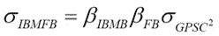

# 第七章 风险管理

本章我们将讨论与银行和金融领域相关的各种风险类型。银行和金融机构都面临风险，它们需要在实施监管规范的同时，开发风险识别和风险缓解机制，以保持竞争力和盈利能力。本章将讨论使用 R 语言衡量不同类型风险的各种技术。内容还包括与银行业务相关的风险，如信用风险、欺诈检测和巴塞尔协议等。

本章涵盖以下主题：

+   市场风险

+   投资组合风险

+   VaR

+   蒙特卡罗模拟

+   对冲

+   巴塞尔协议

+   信用风险

+   欺诈检测

# 市场风险

投资者因市场整体表现变化而遭遇损失的风险，称为市场风险。市场风险是一种系统性风险，无法通过多样化来应对。它可以通过对冲来减轻。由于经济衰退、政治不稳定、利率变化、自然灾害和恐怖袭击等原因产生的风险都是市场风险的例子。市场风险的衡量方法因银行、单个股票、投资组合等不同而有所不同。

让我们考虑如何衡量单一证券的市场风险。作为投资组合一部分的股票的市场风险被衡量为该证券对整体投资组合风险的贡献。单个股票的风险通过 beta 系数来衡量，它表示股票相对于市场的波动性。

让我们对 IBM 股票（作为因变量）和 GPSC 指数（作为自变量）进行回归分析，并尝试估算 beta 值。可以通过执行以下代码实现，该代码使用 2010 年至 2016 年期间 GPSC 和 IBM 的月度数据：

```py
> GPSCMonthlyUrl<-'http://ichart.yahoo.com/table.csv?s=%5EGSPC&a=00&b=1&c=2010&d=00&e=1&f=2017&g=m' 
> GPSCMonthlyData <- read.csv(GPSCMonthlyUrl) 
> IBMMonthlyUrl<-'http://ichart.yahoo.com/table.csv?s=IBM&a=00&b=1&c=2010&d=00&e=1&f=2017&g=m' 
> IBMMonthlyData <- read.csv(IBMMonthlyUrl) 
> DateRange <- GPSCMonthlyData$Date == IBMMonthlyData$Date 
> GPSCPrice<-GPSCMonthlyData$Close[DateRange] 
> IBMPrice<-IBMMonthlyData$Close[DateRange] 
> GPSCReturns <- ( GPSCPrice[1:(length(GPSCPrice) - 1)] - GPSCPrice[2:length(GPSCPrice)] ) / GPSCPrice[2:length(GPSCPrice)] 
> IBMReturns <- ( IBMPrice[1:(length(IBMPrice) - 1)] - IBMPrice[2:length(IBMPrice)] ) / IBMPrice[2:length(IBMPrice)] 
> betafit <- lm(IBMReturns ~ GPSCReturns) 
> result <- summary(betafit) 
> beta <- result$coefficients[2,1] 
> print(beta) 

```

它给出了 beta 的估算值，如下所示：

```py
[1] 0.72390819 

```

投资者和分析师使用的另一种技术是价值-at-风险（VaR）。这是一种在金融市场中非常常见的风险衡量方法。价值-at-风险方法是一个知名且成熟的风险管理方法，但它也有一些假设，限制了其正确性。例如，其中一个假设是，被测量的投资组合内容在给定期间内保持不变。因此，这种方法可能对短期投资有效，但对于长期投资的风险测量准确性较差，因为它更容易受到利率和货币政策变化的影响。我们将在后面讨论如何在 R 中计算 VaR 和 CVAR/ES。

# 投资组合风险

使用 R 语言，我们可以通过降低风险和优化投资组合来更好地管理投资组合。为了避免与投资组合分析相关的风险，必须进行投资组合多样化，并为投资组合中的各成分选择最佳权重。

让我们尝试找出由 IBM 和 FB 组成的投资组合的最佳权重，并使用 CAPM。首先，通过执行以下代码获取相关数据：

```py
>GPSCMonthlyUrl<-'http://ichart.yahoo.com/table.csv?s=%5EGSPC&a=00&b=1&c=2015&d=00&e=1&f=2017&g=m' 
>GPSCMonthlyData <- read.csv(GPSCMonthlyUrl) 
>IBMMonthlyUrl<-'http://ichart.yahoo.com/table.csv?s=IBM&a=00&b=1&c=2015&d=00&e=1&f=2017&g=m' 
>IBMMonthlyData <- read.csv(IBMMonthlyUrl) 
>FBMonthlyUrl<-'http://ichart.yahoo.com/table.csv?s=FB&a=00&b=1&c=2015&d=00&e=1&f=2017&g=m' 
>FBMonthlyData <- read.csv(FBMonthlyUrl) 
>VMonthlyUrl<-'http://ichart.yahoo.com/table.csv?s=V&a=00&b=1&c=2015&d=00&e=1&f=2017&g=m' 
VMonthlyData <- read.csv(VMonthlyUrl) 

```

这是 2015 年至 2016 年间的月度数据。

现在，让我们通过执行以下代码，尝试找到上述数据的收盘价格收益：

```py
> DateRange <- GPSCMonthlyData$Date 
> GPSCPrice<-GPSCMonthlyData$Close[DateRange] 
> IBMPrice<-IBMMonthlyData$Close[DateRange] 
> FBPrice<-FBMonthlyData$Close[DateRange] 
> VPrice<-VMonthlyData$Close[DateRange] 
> GPSCReturns <- ( GPSCPrice[1:(length(GPSCPrice) - 1)] - GPSCPrice[2:length(GPSCPrice)] ) / GPSCPrice[2:length(GPSCPrice)] 
> IBMReturns <- ( IBMPrice[1:(length(IBMPrice) - 1)] - IBMPrice[2:length(IBMPrice)] ) / IBMPrice[2:length(IBMPrice)] 
> FBReturns <- ( FBPrice[1:(length(FBPrice) - 1)] - FBPrice[2:length(FBPrice)] ) / FBPrice[2:length(FBPrice)] 
> VReturns <- ( VPrice[1:(length(VPrice) - 1)] - VPrice[2:length(VPrice)] ) / VPrice[2:length(VPrice)] 

```

它生成所有系列的收益。

现在，让我们尝试找出所有系列的超额收益。超额收益由月度收益减去月度国债利率（设为 `.0015`）给出。可以通过执行以下代码来完成：

```py
> EGPSCReturns<- GPSCReturns-.0015 
> EIBMReturns<- IBMReturns-.0015 
> EFBReturns<- FBReturns-.0015 
> EVReturns<- VReturns-.0015 

```

接下来，计算所有系列的超额收益的均值和标准差。可以通过执行以下代码得到：

```py
> MeanSD<-rbind(cbind("GPSC",mean(EGPSCReturns),sd(EGPSCReturns)),cbind("FB",mean(EFBReturns),sd(EFBReturns)),cbind("IBM",mean(EIBMReturns),sd(EIBMReturns)),cbind("V",mean(EVReturns),sd(EVReturns))) 
> MeanSD 

```

它生成以下输出：


图 7.1：所有考虑股票的均值和标准差

现在，让我们通过回归分析来找出所有股票超额收益的贝塔值，回归对象为 S&P 指数的超额收益。

这可以通过执行以下代码完成：

```py
> lmIBM<- lm(IBMReturns ~ EGPSCReturns) 
> summary(lmIBM) 

```

它生成以下输出：


图 7.2：回归输出汇总

这表明 IBM 的贝塔值为 `1.1035670`。

同样，我们可以找到 FB 和 V 的贝塔值。

所以，使用 CAPM，IBM 的超额预期收益如下所示：

```py
Beta of IBM*expected excess return of GPSC 
=1.1035670*(-.005955424) =  -0.0065722094 

```

根据单因子模型，IBM 的方差由以下公式给出：


图 7.3：单因子模型给出的方差

这里，*e* 是回归中产生的残差误差。

因此，通过对所有独立变量进行回归并计算超额收益和方差，我们得到以下结果：

|  | **IBM** | **FB** | **V** |
| --- | --- | --- | --- |
| **方差** | 0.002906 | 0.002949 | 0.455695 |
| **贝塔值** | 1.103567 | 0.423458 | 3.74228 |
| **预期超额收益** | -0.00657 | -0.00252 | -0.02229 |

协方差矩阵可以使用以下公式计算：



图 7.4：协方差公式

它生成以下矩阵：

|  | `IBM` | `FB` | `V` |
| --- | --- | --- | --- |
| `IBM` | `0.001378` | `0.000529` | `0.004673` |
| `FB` | `0.000529` | `0.000203` | `0.001793` |
| `V` | `0.004673` | `0.001793` | `0.015848` |

现在，让我们通过执行以下代码来找到投资组合的最佳权重：

```py
> returns_avg<-matrix(c(-0.0180513406031643,-0.00357192217566396,0.12613583240944),nrow =1) 
> covariance<-matrix(c(0.001378118,0.000528808,0.004673302,0.000528808,0.000202913,0.001793228,0.004673302,0.001793228,0.015847524),nrow=3) 
> library(tseries) 
> sol<-portfolio.optim(x=returns_avg,covmat=covariance, shorts=F) 
> sol$pw 

```

它生成最佳权重，如下表所示：

| `IBM` | `FB` | `V` |
| --- | --- | --- |
| `0` | `0.70387703` | `0.29612297` |

# VaR

风险价值（VaR）是风险管理中的一个指标，用来衡量可能发生的风险，它能衡量投资者投资组合可能遭遇的潜在损失。5% 信心水平下的 VaR 表示损失值 95% 的时间不会低于预测值，换句话说，损失将有 5% 的概率大于预测值。

计算风险价值有三种常见方法：

+   参数化 VaR

+   历史 VaR

+   蒙特卡洛 VaR

在本节中，我们将介绍前两种方法，第三种将在下一节介绍。

## 参数化 VaR

参数 VaR 也称为方差-协方差法，用于通过均值和标准差作为参数计算 VaR。

`qnorm`用于通过参数法计算风险价值。它使用均值和标准差作为参数。一般语法如下：

```py
qnorm(p,mean,sd) 

```

这里，`p`是所需的百分位数；`mean`是样本的给定均值；`sd`是样本的标准差。

假设某只股票的平均收益率为 2%，标准差为 4%，那么使用参数法，在 95%置信水平下，计算出一天期限的风险价值可以执行以下方法：

```py
>mean = 2 
>sigma = 4 
>Alpha = .05 
>Var_parametric = qnorm(alpha, mean, sigma) 
>Var_parametric 

```

执行后，它生成以下输出：

```py
[1] -4.579 

```

或者，我们可以使用以下代码通过参数法找到 VaR：

```py
> Var_parametric = mean + sigma*qnorm(alpha,0,1) 
> Var_parametric 

```

它生成如下的输出：

```py
[1] -4.579 

```

假设我们有一天期限的 VaR，如果我们想将其转换到不同的期限，比如一个月，可以使用这里给出的公式进行转换：


这里，*T*是一个月中的天数。

**期望损失**（**ES**）也被称为风险条件值，是 VaR 的替代方法。ES 是风险价值和大于风险价值的损失之间的加权平均。通过 ES，我们试图量化 VaR。

上述示例的 ES/CVAR 可以使用以下示例计算：

```py
alpha_z=qnorm(alpha) 
ES_parametric = mean + sigma*(dnorm(alpha_z)/(1-alpha)) 
ES_parametric 

```

它生成以下输出：

```py
[1] 2.434 

```

## 历史 VaR

主要假设是过去会重演。它不假设任何特定的分布类型。历史 VaR 是通过模拟或构建资产收益的**累计分布函数**（**CDF**）来估算的。通常，我们按常规时间间隔找到收益并进行排序，然后找出相关的百分位数。

现在让我们尝试在数据集上找到单独的 VaR，以及投资组合的 VaR。数据集是通过执行以下代码生成的：

```py
>library(quantmod) 
> symbollist = c("FB", "V","JNJ") 
> getSymbols(symbollist, from ="2016-01-01", to = "2017-01-01") 
> FB = FB[, "FB.Adjusted", drop=F] 
> V = V[, "V.Adjusted", drop=F] 
> JNJ = JNJ[, "JNJ.Adjusted", drop=F] 
> FB_return = CalculateReturns(FB,  method="log") 
> V_return = CalculateReturns(V,  method="log") 
> JNJ_return = CalculateReturns(JNJ,  method="log") 
> FB_return = FB_return[-1,] 
> V_return = V_return[-1,] 
> JNJ_return = JNJ_return[-1,] 
> FB_V_JNJ_return<-cbind(FB_return,V_return,JNJ_return) 
> head(FB_V_JNJ_return) 

```

它准备好历史 VaR 所需的数据集，并显示如下的数据样本：


图 7.5：收益计算输出

现在，让我们尝试通过运行以下代码估计个别股票的`历史`VaR：

```py
> HVAR<-VaR(FB_V_JNJ_return, p=0.95, method="historical") 
> HVAR 

```

它生成以下输出：


图 7.6：历史单独输出

类似地，让我们尝试估计 CVAR/ES，它可以使用以下代码计算：

```py
> HCVAR<-ES(FB_V_JNJ_return, p=0.95, method="historical") 
> HCVAR 

```

执行后，它生成如下的输出：


图 7.7：历史 CVAR 单独输出

我们可以在`VaR()`函数中找到许多选项。这里列出了最重要的选项：

+   `R`：矩阵，xts 向量或数据框

+   `p`：置信水平

+   `method`：它使用四种方法——修正法、高斯法、历史法和核方法

+   `portfolio_method`：它有三种选项——单一、成分和边际——定义是否进行单变量、成分或边际计算

现在让我们尝试计算投资组合的`组件`VaR。如果没有指定权重，则默认为等权重。可以通过运行以下代码来获得：

```py
> VaR(FB_V_JNJ_return, p=0.95,portfolio_method="component") 

```

它生成以下输出：


图 7.8：通过组件法输出的历史 VaR

同样，我们可以通过执行以下代码来找到`边际`VaR：

```py
> VaR(FB_V_JNJ_return, p=0.95,portfolio_method="marginal") 

```

它生成以下结果：


图 7.9：通过边际输出法输出的历史 VaR

# 蒙特卡罗模拟

蒙特卡罗模拟在风险管理中起着非常重要的作用。即使我们获得了与公司相关的所有风险信息，仍然无法预测和量化相关风险。通过蒙特卡罗模拟，我们可以生成所有可能的风险情景，并利用这些情景评估风险的影响，从而构建更好的风险缓解策略。

蒙特卡罗模拟是一种计算数学方法，允许用户创建一系列可能的结果情景，包括极端情形，并为每个结果分配相应的概率。这些可能的结果也被绘制在期望的分布线中，这可能更接近真实结果。可能的结果范围可用于风险分析，用于构建模型并得出推论。分析会重复进行，每次使用概率函数中不同的一组随机值来测试模型，从而构建一个稳健的模型。概率分布是描述风险分析中变量不确定性的更现实的方式。蒙特卡罗模拟使用布朗运动动力学的概念。现在我们将演示如何使用蒙特卡罗模拟构建一个具有给定分布的样本，并尝试估算 VaR。

假设我们要使用正态分布生成`2000`个月的股票回报样本，正态分布的均值为`mean.20`，标准差为`sigma.25`，时间间隔为`deltat` = `.08333`（每月）。这可以通过以下代码实现：

```py
> Sample_Size<-2000 
> set.seed(2345) 
> Z<-rnorm(Sample_Size) 
> mean<-.20 
> sigma<-.25 
> deltat<-.08333 
> returns<-mean*deltat+sigma*Z*sqrt(deltat) 
> hist(returns, breaks = 50) 

```

它生成以下显示的直方图：


图 7.10：MCM 生成的回报直方图

现在让我们尝试计算新构建样本的均值和标准差，可以通过执行以下代码来获得：

```py
> Mean_new<-mean(returns)*12 
> Mean_new 
> std_new<-sd(returns)*(12)^(.5) 
> std_new 

```

它生成的均值为`0.1821`，标准差为`0.2439`，与用于构建样本的均值和标准差接近。因此，显然，新的样本符合正态分布。

上述系列的风险值可以使用以下代码计算：

```py
VaR(returns, p = 0.95, method="historical") 

```

它生成以下输出：

```py
VaR -0.09665 

```

# 对冲

对冲基本上是通过在市场上采取一定的头寸来降低风险。这是一种旨在通过使用看涨/看跌期权或期货空头卖出减少投资风险的策略。对冲的理念是通过降低可能的损失风险来减少投资组合的波动性。对冲尤其能保护小型企业免受灾难性或极端风险的影响，从而在困境中锁定成本。税法对从事对冲的企业也有优惠。对于进行对冲的公司来说，它就像一种保险，他们可以更独立地做出财务决策，而不必过多考虑风险。

现在，让我们考虑一些对冲场景：

+   **汇率风险**：也称为汇率波动风险，因一种货币相对于另一种货币的价格波动而发生。跨国经营的投资者或公司面临汇率风险，这可能导致盈亏。通过对冲，可以减少这种风险，从而避免因价格波动导致的损失。

+   **空头对冲**：假设一个农民计划种植 200,000 蒲式耳的玉米，并将在接下来的 2 个月内收获，随后交割。农民凭借经验知道，种植和收获的成本是每蒲式耳$5.30。交割月的玉米期货交易价格为每蒲式耳$5.70。农民希望锁定自己的销售价格，因此他通过卖出一些交割月期货进行空头对冲。每个玉米期货合约包括 5,000 蒲式耳，他需要卖出 40 份期货合约。为了保护交割月份的作物，他发现玉米价格下跌，现货价格为每蒲式耳$5.20，而交割月期货合约的价格也降至**$5.40 每蒲式耳**。

在现货市场出售玉米为他带来了**$5.20*200,000 = $1,040,000**。

总成本为$1,060,000，因此他可能会遭受**$20,000**的损失。

但是，由于他已经对冲了种植月份出售的部分玉米期货价值 = **$5.70*200,000=$1,140,000**。

交割月份买入的玉米期货价值 = **$5.40*200,000=1,080,000**。

所以期货市场的收益是**1,140,000-1,080,000=$60,000**。

所以整体利润是**$60,000-$20,000=$40,000**。

类似地，根据需要，投资者可以进行长期对冲。

对冲中最常用的工具是远期合约、期货合约和期权合约。

# 巴塞尔法规

巴塞尔银行监管委员会的主要目标是加深对关键监管问题的理解，以制定全球健康的银行监管。其主要目标是制定监管框架，以改善银行体系。目前，巴塞尔 III 已经制定，以弥补在 2007-2008 年金融危机中暴露的金融监管不足。巴塞尔 III 是一个全球自愿性的银行资本充足性、压力测试和市场流动性风险的监管框架。其目标是通过减少银行杠杆并增加银行流动性来加强银行的资本要求。实施巴塞尔 III 的目的是使银行业更加稳健，以便能够应对由金融和经济压力引发的冲击，改善风险管理和治理，并加强银行的透明度和信息披露。

R 社区开发了一个名为 SACCR 的库，旨在遵守巴塞尔 III 的监管规定。这个库包含了许多基于巴塞尔 III 标准化规范的方法，已实现所有出现在监管框架中的示例。例如，它根据巴塞尔规范计算违约敞口。

它使用函数 `CalcEAD(RC,PFE)` 来计算违约敞口。

在这里，`RC` 是替代成本，`PFE` 是预测的未来敞口。

因此，如果 `RC` 组件为 `50`，`PFE` 为 `400`，那么执行以下代码会计算违约敞口：

```py
> CalcEAD(50,400) 

```

它会生成输出 `630`。

同样，这个库中还有其他基于巴塞尔 III 实现的函数。

# 信用风险

信用风险是与投资相关的风险，指借款人无法按时向贷款人偿还款项。这可能是由于借款人财务状况不佳引起的，且对贷款人构成风险。风险表现为贷款人因未能收回款项而遭受损失，从而导致现金流中断和催收成本增加。损失可能是完全的，也可能是部分的。贷款人可能面临多种场景下的损失，以下是其中的一些情形：

+   客户未支付抵押贷款、信用卡、信用额度或其他类型的贷款

+   商业/消费者未支付到期的交易发票

+   企业未支付员工到期的应得工资

+   商业/政府债券发行人未按期支付到期的利息或本金

+   保险公司未履行其到期的保单义务

+   银行未按时返还存款人的资金

它是一种通过理解银行资本和贷款损失准备金的充分性来减轻损失的做法。为了减少信用风险，贷款方需要建立机制，对潜在借款人进行信用检查。通常，银行使用两种指标来量化信用风险——预期损失和经济资本。预期损失是可能损失的价值与该损失发生的概率的乘积。经济资本是用来覆盖意外损失所需的资本额。在计算预期损失（EL）和经济资本（EC）的过程中，有三个风险参数至关重要：**违约概率**（**PD**）、**违约损失率**（**LGD**）和**违约时的敞口**（**EAD**）。违约概率的计算更为重要，因此我们将重点讨论它。

为了构建 PD 模型，我们将使用 R 中提供的德国信用数据子集。执行以下代码即可获得用于分析的数据：

```py
> data(GermanCredit) 
> LRData<-GermanCredit[,1:10] 

```

在开始建模之前，我们需要了解数据，可以通过执行以下代码来实现：

```py
> str(LRData) 

```

它为我们提供了列类型及其包含的值，如下所示：


图 7.11：数据集的列描述

在这个例子中，我们的目标变量是`Class`。`Class = Good`表示非违约者，`Class = bad`表示违约者。现在，为了了解所有数值变量的分布，我们可以计算与数值属性相关的所有基本统计数据。可以通过执行以下代码来实现：

```py
> summary(LRData) 

```

前述代码生成的输出样本如下所示：


图 7.12 数值变量的基本统计

现在，让我们通过执行以下代码准备数据进行建模：

```py
> set.seed(100) 
> library(caTools) 
> res = sample.split(LRData$Class, 0.6) 
> Train_data = subset(LRData, res == TRUE) 
> Test_data=subset(LRData,res==FALSE) 

```

前述代码生成了用于建模的`Train`和`Test`数据。

选择`Train`和`Test`数据的比例相当主观。现在我们可以进行基本统计，填补缺失值或异常值，并进行探索性分析（如信息价值分析和相关矩阵），以了解自变量与因变量之间的关系。

现在，让我们尝试在`Train`数据上拟合模型，可以通过执行以下代码来实现：

```py
> lgfit = glm(Class ~. , data=Train_data, family="binomial") 
> summary(lgfit) 

```

它生成如这里所示的模型摘要：


图 7.13：逻辑回归的输出摘要

如我们在摘要中看到的，通过 P 值可以识别模型中的显著和非显著属性。考虑到属性的显著性和多重共线性，我们可以迭代模型，找到最佳模型。在我们的案例中，让我们只使用显著属性重新运行模型。

这可以通过执行以下代码来实现：

```py
> lgfit = glm(Class ~Duration+InstallmentRatePercentage+Age , data=Train_data, family="binomial") 
> summary(lgfit) 

```

它生成如下所示的摘要输出：


图 7.14：仅包含显著属性的逻辑回归输出摘要

输出摘要显示，模型中考虑的所有属性都是显著的。

逻辑回归中有许多统计数据可以用来检查模型的准确性，在这种情况下，我们将显示 ROC 曲线和混淆矩阵来进行准确性检查。

我们可以通过 KS 统计量计算分类的阈值，但在这里让我们假设阈值为 `0.5`，并通过执行以下代码尝试为我们的 `Train` 样本打分：

```py
> Train_data$predicted.risk = predict(lgfit, newdata=Train_data, type="response") 
> table(Train_data$Class, as.numeric(Train_data$predicted.risk >= 0.5)) 

```

它生成了如下所示的混淆矩阵：


图 7.15：逻辑回归的混淆矩阵

现在，让我们通过执行以下代码来计算 `auc`：

```py
> library(ROCR) 
> pred = prediction(Train_data$predicted.risk, Train_data$Class) 
> as.numeric(performance(pred, "auc")@y.values) 

```

它给出了 `auc` 的值，如下所示：

```py
0.67925265 

```

现在，让我们通过执行以下代码绘制 ROC 曲线：

```py
> predict_Train = predict(lgfit, type="response") 
> ROCpred = prediction(predict_Train, Train_data$Class) 
> ROCperf = performance(ROCpred, "tpr", "fpr") 
> plot(ROCperf) 

```

它绘制了如图所示的 ROC 曲线：


图 7.16：ROC 曲线

我们可以使用在 `Train_data` 上创建的相同模型，并对 `Test_data` 进行评分，检查准确度指标是否在相同范围内，从而验证模型。

# 欺诈检测

识别欺诈交易是风险管理中最重要的组成部分之一。R 语言有许多函数和包可以用来发现欺诈交易，包括逻辑回归、决策树、随机森林等二分类技术。我们将再次使用 R 库中的德国信用数据子集。在本节中，我们将使用随机森林进行欺诈检测。与逻辑回归一样，我们可以进行基本的探索性分析以了解属性。这里我们不会进行基础的探索性分析，而是使用标记数据来训练模型，使用随机森林，然后尝试在验证数据上进行欺诈预测。

所以，分析所用的数据集可以通过执行以下代码来获取：

```py
>data(GermanCredit) 
>FraudData<-GermanCredit[,1:10] 
> head(FraudData) 

```

它生成了一些示例数据行：


图 7.17：用于欺诈分析的示例数据

类别将是数据集中的目标变量，类别为 "bad" 表示客户已实施欺诈。现在，让我们通过执行以下代码将前面的数据划分为 `train` 和 `test` 样本：

```py
> len<-dim(FraudData)[1] 
> train<- sample(1:len , 0.8*len) 
> TrainData<-FraudData[train,] 
> TestData<-FraudData[-train,] 

```

它生成了 `Train` 和 `Test` 数据。

现在，让我们尝试使用随机森林技术在训练样本上构建分类模型。可以通过执行以下代码来完成：

```py
> fraud_model <- randomForest(Class~.,data=TrainData,ntree=50,proximity=TRUE) 
> print(fraud_model) 

```

它生成以下输出：


图 7.18：逻辑回归随机森林的输出摘要

可以通过执行以下代码绘制树的误差：

```py
> plot(fraud_model) 

```

这是生成的输出：


图 7.19：随机森林树的误差图

可以通过执行以下代码来给出属性的相对重要性：

```py
> importance(fraud_model) 

```

它生成以下输出：


图 7.20：随机森林的变量比较摘要

现在，让我们通过执行以下代码对测试数据进行分类：

```py
> TestPred<-predict(fraud_model,newdata=TestData) 
> table(TestPred, TestData$Class) 

```

它生成以下分类表：


图 7.21：随机森林的分类总结

# 负债管理

负债管理是金融机构保持适当流动性储备和分配资产的过程，目的是平衡未偿付负债（如存款、定期存单等），通过同时满足负债并增长净资产来获得最佳表现。银行面临着多种风险——资产管理风险、利率风险和汇率风险——通过负债管理，银行和金融机构试图最小化这些风险。

在本章中，我们讨论了多个主题，如市场风险、投资组合风险、信用风险、欺诈检测、投资组合的多样化、投资组合优化以及投资组合再平衡，这些内容可以帮助金融领域处理负债管理问题。

# 问题

1.  什么是市场风险？R 如何帮助衡量市场风险？请举例说明。

1.  衡量投资组合相关风险的方法有哪些？

1.  衡量 VaR 的最常见方法有哪些？请构建一个投资组合并使用所有方法计算 VaR。

1.  如何在 R 中计算 ES/CVAR？

1.  使用蒙特卡洛方法构造一个样本，采用正态分布和对数正态分布，并计算它们的历史 VaR。

1.  如何在 R 中为一个投资组合找到组件和边际 VaR？

1.  什么是信用评分？你如何在 R 中执行信用评分？请构造一个例子并构建一个评分示例并进行验证。

1.  如何识别欺诈行为？你如何在 R 中执行这些方法？

# 总结

在本章中，我们介绍了金融机构面临的各种风险类型，如市场风险、投资组合风险、VaR、蒙特卡洛模拟、对冲、巴塞尔协议、信用风险和欺诈检测。我们还讨论了如何利用 R 的优势来衡量不同类型的风险。在本章中，我们展示了如何使用 R 衡量市场、投资组合和信用风险，并展示了如何使用随机森林分类技术进行欺诈检测。

在下一章中，我们将介绍在交易算法和参数估计中使用的各种优化技术。将涵盖的优化技术包括动态再平衡、前向步进测试、网格测试和遗传算法。
