# 第八章：优化

优化是一种从所有可行解中选择最佳解的方法。因此，优化的第一部分是根据给定的约束来制定问题，并应用高级分析方法以获得最佳解，从而帮助做出更好的决策。

优化模型在量化和计算金融中起着关键作用，它通过更高效、准确地解决复杂问题来推动这些领域的发展。与资产配置、风险管理、期权定价、波动率估计、投资组合优化和指数基金构建等相关的问题，可以通过使用优化技术，如非线性优化模型、二次规划公式和整数规划模型来解决。现在有许多商业和开源软件可用于解决这些问题，而 R 是其中一个被广泛偏好的选择，因为它是开源且高效的。

在本章中，我们将讨论一些优化技术以及如何使用 R 来解决这些问题。

本章涵盖以下主题：

+   动态再平衡

+   向前测试

+   网格测试

+   遗传算法

# 动态再平衡

动态再平衡是保持投资组合接近目标配置的一种过程，利用投资组合的自然现金流入和流出进行调整。再平衡涉及定期买卖投资组合中的资产，以保持原始期望的资产配置水平，并重新调整投资组合中各资产的比重。

让我们考虑一个例子。在一个投资组合中，目标资产配置为 40%的股票和 60%的债券。如果债券在这一期间表现良好，债券在投资组合中的比重可能会增加到 70%。然后，投资者将决定卖出一些债券，买入一些股票，以便将投资组合恢复到原始目标配置：40%的股票和 60%的债券。

现在，让我们看看如何在 R 中进行投资组合的再平衡。

## 周期性再平衡

让我们考虑来自 R 的数据：

```py
>library(PerformanceAnalytics) 
>data(edhec)  
> data<-edhec["1999", 3:5] 
> colnames(data) = c("DS","EM","EMN") 
> data 

```

它给出了以下数据集：

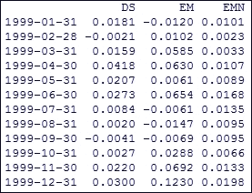

图 8.1：用于再平衡分析的数据集

现在让我们假设，在`1998-12-31`，由上述工具组成的投资组合的权重如下所示：

```py
> wts <- xts(matrix(c(.3,.3,.4),nrow=1,ncol=3), as.Date("1998-12-31")) 
> colnames(wts)<-colnames(data) 
> wts 

```

它给出了 1998 年年底的权重如下：

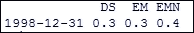

图 8.2：初始权重分配

现在，如果我们想按月平衡权重，可以通过执行以下代码来实现：

```py
> Return.portfolio(data,weights =wts, rebalance_on="months",verbose=TRUE) 

```

这里，`data`是输入数据；`weights`是投资组合各个组件的定义权重；`rebalance_on = True`表示按月加权调整投资组合回报；`verbose = True`返回额外信息。

当我们执行前面的代码时，它生成一个输出列表，其中包括每个区间调整后的投资组合回报、每个资产的月度贡献、每个区间后资产的前后权重以及每个区间的前后投资组合价值。这样，它就提供了一个完整的图景，展示了在给定时间跨度内如何进行再平衡。

月度再平衡后的投资组合回报如下所示：

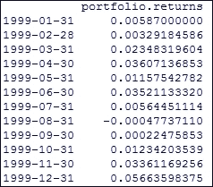

图 8.3：不同时间段的投资组合回报

每个资产的月度贡献如下所示：

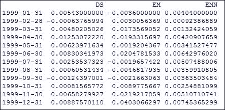

图 8.4：每个资产的月度贡献

期初权重如下所示：

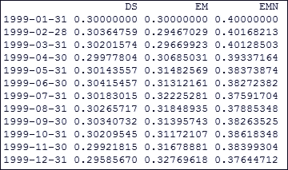

图 8.5：每个周期开始时的权重汇总

期末权重如下所示：

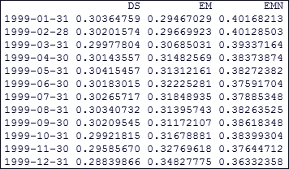

图 8.6：每个周期结束时的权重汇总

期初投资组合的价值如下所示：

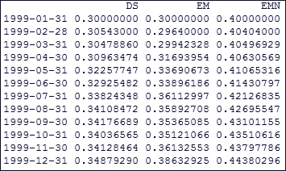

图 8.7：每个周期开始时的投资组合价值

期末投资组合的价值如下所示：

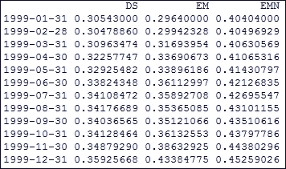

图 8.8：每个周期结束时的投资组合价值

# 前向走测试

前向走测试在量化金融中用于识别交易策略中使用的最佳参数。该交易策略在一个特定时间窗口内的样本数据子集上进行优化。其余未使用的数据被保留用于测试目的。在一小段未使用的数据窗口上进行测试并记录结果。然后，训练窗口向前移动以包括测试窗口，并反复执行此过程，直到测试窗口不可用为止。

前向优化是一种金融方法，用于确定交易策略中最佳的参数。该交易策略使用样本数据在某个时间窗口内进行优化。剩余的数据保留用于样本外测试。在样本数据后面的一小部分保留数据上进行测试，记录结果。样本时间窗口向前移动，覆盖样本外测试的周期，并重复此过程。最终，所有记录的结果将用于评估交易策略。

# 网格测试

让我们考虑一个典型的分类问题。假设你有一个数据集，并将其划分为训练（T）数据集和验证（V）数据集。在这里，你试图解决一个优化问题，假设为 P，在这个问题中，目的是减少训练误差以及正则化项，其中优化问题是模型参数 *m*、训练样本 *T* 和一些超参数  和  的函数。通过求解给定的  和 ，你可以得到参数 *m* 的值。现在可以将估算的参数应用于验证样本，以获得验证误差函数，并对其进行优化，以获得  和  的集合，从而最小化误差函数。但是，这个优化问题会非常昂贵，因为对于每一组  和 ，你都需要优化目标函数，而该函数可能不是凸的、凹的或平滑的。

因此，我们对子集进行选择，选择了  和 ，对于每一对选定的  和 ，我们解决优化问题。这看起来像是空间中的一个网格，所以我们称之为网格搜索。因此，网格搜索主要用于调整模型。

让我们考虑使用随机森林技术的分类示例。现在，首先通过执行以下代码构建一个基准模型：

```py
>library(randomForest) 
>library(mlbench) 
>library(caret) 
>data(Shuttle) 
>Analysis_Data<-head(Shuttle,10000) 
>X <- Analysis_Data[,1:9] 
>Y<- Analysis_Data[,10] 
>control <- trainControl(method="repeatedcv", number=5, repeats=3) 
>seed <- 4 
>metric <- "Accuracy" 
>set.seed(seed) 
>Count_var <- sqrt(ncol(X)) 
>tunegrid <- expand.grid(.mtry=Count_var) 
>rf_baseline <- train(Class~., data=Analysis_Data, method="rf", metric=metric, tuneGrid=tunegrid, trControl=control) 
>print(rf_baseline) 

```

它生成了随机森林模型的汇总输出：

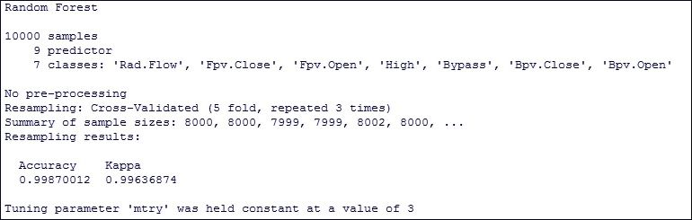

图 8.9：随机森林的汇总输出

网格搜索意味着你已经给定了一组在参数值上彼此不同的模型，这些模型位于网格上。训练每个模型，并通过交叉验证评估它们，以选择最佳模型。

现在，让我们尝试应用网格搜索方法并检查准确性。可以通过执行以下代码来完成：

```py
> control <- trainControl(method="repeatedcv", number=5, repeats=3, search="grid") 
> set.seed(seed) 
> tunegrid <- expand.grid(.mtry=c(1:8)) 
> rf_gridsearch_method <- train(Class~., data=Analysis_Data, method="rf", metric=metric, tuneGrid=tunegrid, trControl=control) 
> print(rf_gridsearch_method) 

```

它给出了以下具有更好估计的输出：

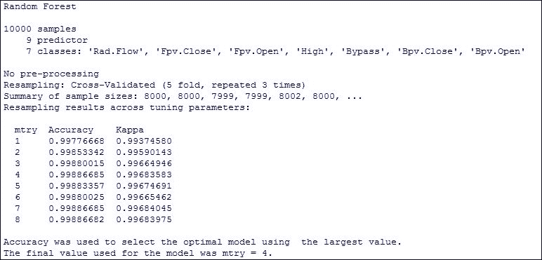

图 8.10：随机森林的网格搜索输出

现在，让我们绘制不同随机森林模型在不同属性集下的准确度，可以通过执行以下代码来完成：

```py
> plot(rf_gridsearch_method) 

```

这给出了在 R 中使用网格搜索调整后的随机森林参数：

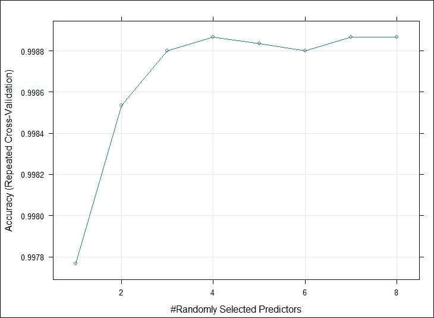

图 8.11：不同随机森林模型的准确度图

它通过准确度比较了模型池。

# 遗传算法

**遗传算法**（**GA**）是一种基于搜索的优化技术，其基本原理来源于遗传学和自然选择理论。它用于解决研究和机器学习领域中的优化问题，这些问题是通过其他方法解决时非常困难且耗时的。

优化是寻找一个比所有其他备选方案更好的解决方案的过程。它将所有可能的解决方案作为搜索空间，然后找到最适合问题的解决方案。

在遗传算法中，可能的候选解构成种群，它们通过重组和变异产生新的后代，并且这个过程会在多个代中重复进行。每个可能的候选解都会根据目标函数赋予一个适应度值。适应度较高的候选解会优先进行重组和变异，以产生更适应问题的候选解。

遗传算法（GA）相关的一些最重要的术语如下：

+   **种群**：它是现有问题所有可能候选解的一个子集

+   **染色体**：染色体是给定问题的一个解

+   **基因**：基因是染色体中的一个元素位置

例如，假设投资组合中包含以下股票，并且按照此处提到的相同比例进行投资，那么如果按照提到的回报率进行投资，去年将获得以下回报。然后我们需要通过限制总权重为 1 来最大化投资组合的表现：

| **股票** | **回报** | **权重** |
| --- | --- | --- |
| `Stock1` | `10` | `.1` |
| `Stock2` | `11` | `.2` |
| `Stock3` | `15` | `.1` |
| `Stock4` | `20` | `.2` |
| `Stock5` | `12` | `.2` |
| `Stock6` | `13` | `.3` |

让我们尝试在 R 中使用遗传算法来解决这个问题。

首先定义输入数据需求，可以通过执行以下代码来完成：

```py
>install.packages("genalg") 
>library(genalg) 
>library(ggplot2) 
>InputDataset <- data.frame(Stocks = c("Stock1", "Stock2", "Stock3", "Stock4", "Stock5", "Stock6"), returns = c(10, 11, 15, 20, 12, 13), weight = c(.1, .2, .1, .2, .2, .3)) 
>WTlimit <- 1 
>InputDataset 

```

这将得到以下输出：

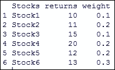

图 8.12：遗传算法的输入数据集

现在让我们设置如下代码所示的评估函数：

```py
>evaluationFunc <- function(x) { 
    current_solution_returns <- x %*% InputDataset$returns 
    current_solution_weight <- x %*% InputDataset$weight 

    if (current_solution_weight > WTlimit)  
        return(0) else return(-current_solution_returns) 
} 

```

然后，我们来设计模型并执行它。可以通过执行以下代码来完成：

```py
> GAmodel <- rbga.bin(size = 6, popSize = 100, iters = 50, mutationChance = 0.01,  
+     elitism = T, evalFunc = evaluationFunc) 
> cat(summary(GAmodel)) 

```

这里：

+   `size` 是染色体中基因的数量

+   `popsize` 是种群大小

+   `iters` 是迭代次数

+   `mutationChance` 是染色体变异的概率

+   `elitism` 是保留到下一代的染色体数量；默认情况下为 20%

+   `evalFunc` 是用户提供的用于评估给定染色体的评价函数

执行后，将得到以下输出：

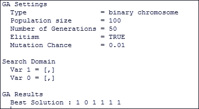

图 8.13：遗传算法模型的总结输出

它表示保留所有股票，除了 `Stock2`，以获得最佳投资组合。

让我们考虑另一个遗传算法的例子。在这里，我们将尝试通过遗传算法和传统的 OLS 方法估计系数。

首先，我们使用以下代码考虑一个数据集：

```py
>library(GA) 
> data(economics) 
> Data_Analysis<-data.frame(economics[,2:4]) 
>head(Data_Analysis) 

```

这将得到以下数据集：

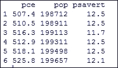

图 8.14：通过遗传算法进行参数估计的输入示例

现在，让我们尝试通过遗传算法估计 `pce`，它由 `pop` 和 `psavert` 来表示。现在我们来创建一个评估线性回归的函数，代码如下所示：

```py
>OLS_GA <- function(Data_Analysis, a0, a1, a2){ 
  attach(Data_Analysis, warn.conflicts=F) 
  Y_hat <- a0  + a1*pop + a2*psavert   
  SSE = t(pce-Y_hat) %*% (pce-Y_hat)  
  detach(Data_Analysis) 
  return(SSE) 
} 

```

然后，让我们尝试通过遗传算法（GA）来估计系数，这可以通过执行以下代码来实现：

```py
>ga.OLS_GA <- ga(type='real-valued', min=c(-100,-100,-100),  
             max=c(100, 100, 100), popSize=500, maxiter=500, names=c('intercept', 'pop', 'psavert'), 
             keepBest=T, fitness = function(a) -OLS(Data_Analysis, a[1],a[2], a[3])) 
        > summary(ga.OLS_GA) 

```

这将给出以下输出：

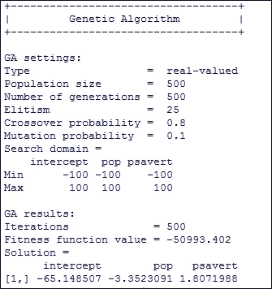

图 8.15：遗传算法（GA）提供的总结输出参数估计

# 问题

1.  优化在量化金融中的重要性是什么？

1.  动态再平衡优化方法是什么？请举例说明如何在 R 中执行它。

1.  如何使用网格搜索来微调分类模型？请提供一个 R 语言的示例。

1.  如何在 R 中使用遗传算法优化交易算法？

1.  如何在 R 中使用遗传算法估计模型系数？请提供一个示例。

# 摘要

在本章中，我们讨论了交易算法和参数估计中使用的各种优化技术。所涉及的优化技术包括动态再平衡、前向测试、网格测试和遗传算法。

在下一章中，将讨论使用`foptions`、`termstrc`、`CreditMetrics`、`credule`、`GUIDE`和`fExoticOptions`来定价期权、债券、信用利差、信用违约掉期、利率衍生品以及不同类型的外汇期权。
