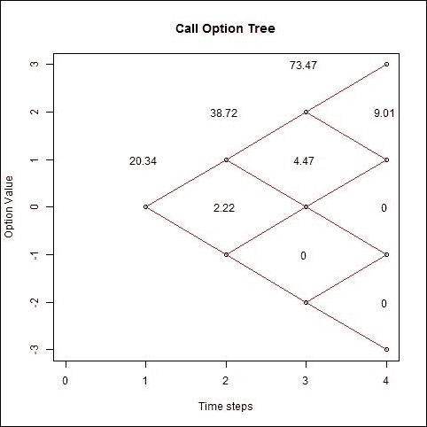
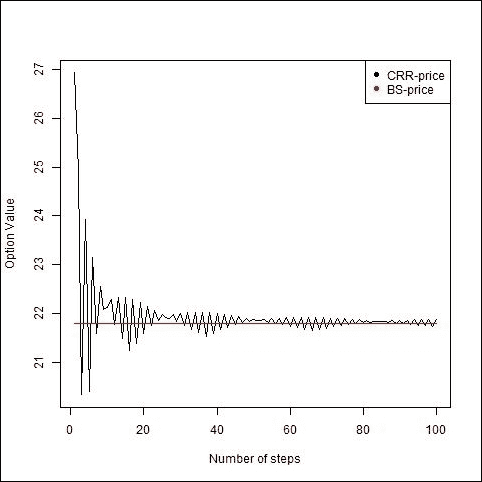
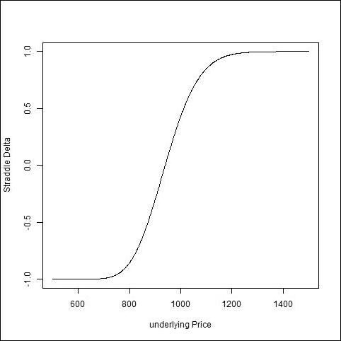
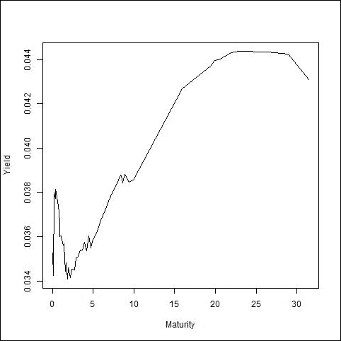

# 第九章：衍生品定价

算法交易和金融工程是金融领域计算密集度最高的两个部分。参与这些领域的人不仅是金融、数学和统计学的专家，而且还精通计算密集型软件。在前几章中，我们学习了算法交易。在本章中，我们将研究 R 语言中不同类型的衍生品定价技术，因为衍生品定价是金融工程中最为关键的部分。

衍生品价格取决于其标的资产的价值。我们将从一些基本的期权定价模型开始，随后讨论其他资产类别：

+   期权定价

+   隐含波动率

+   债券定价

+   信用利差

+   信用违约掉期

+   利率衍生品

+   异国期权

# 期权定价

二项模型适用于连续过程，而 Cox-Ross-Rubinstein 模型适用于离散过程。期权价格取决于股票价格、行使价格、利率、波动率和到期时间。我们将使用`fOption`包来实现 Black-Scholes 模型。以下命令将安装并加载该包到工作区：

```py
> install.packages("fOptions") 
> library(fOptions) 

```

## Black-Scholes 模型

让我们考虑一个关于`call`和`put`期权的示例，使用 2015 年 6 月的假设数据，期权到期日为 2015 年 9 月，即到期时间为 3 个月。假设当前标的股票价格为 900 美元，行使价格为 950 美元，波动率为 22%，无风险利率为 2%。我们还需要设置持有成本（`b`）；在原始的 Black-Scholes 模型中（假设标的资产不支付股息），它等于无风险利率。

以下命令`GBSOption()`使用所有其他参数计算`call`期权价格。第一个参数是期权类型，即`call`或`put`，第二个是当前股票价格，第三个是行使价格，第四、第五、第六和第七个参数分别是到期时间、无风险利率、波动率和持有成本：

```py
>model <- GBSOption(TypeFlag = "c", S = 900, X =950, Time   = 1/4, r = 0.02,sigma = 0.22, b = 0.02) 

```

通过在 R 控制台中输入`model`，可以查看模型的输出，它包括标题（即 Black-Scholes 期权）、方法论、函数语法、所用参数，最后显示期权价格：

```py
> model 
Title: 
Black Scholes Option Valuation  
Call: 
GBSOption(TypeFlag = "c", S = 900, X = 950, Time = 1/4, r = 0.02,  b = 0.02, sigma = 0.22) 
Parameters: 
Value: 
 TypeFlag c      
 S        900    
 X        950    
 Time     0.25   
 r        0.02   
b        0.02   
sigma                0.22   
Option Price: 
                 21.79275  
Description: 
 Sat Dec 31 11:53:06 2016 

```

如果你想找到期权价格，可以使用以下代码行：

```py
> model@price 
[1] 21.79275 

```

如果你希望计算`put`期权价格，可以将第一个参数改为`p`。

以下命令将计算`put`期权价格，并仅提取价格。由于我们使用了`@price`，因此输出中不显示其他项：

```py
> GBSOption(TypeFlag = "p", S = 900, X =950, Time = 1/4, r = 0.02, sigma = 0.22, b = 0.02)@price 
[1] 67.05461 

```

## Cox-Ross-Rubinstein 模型

Cox-Ross-Rubinstein 模型假设标的资产价格遵循离散的二项过程。价格在每个周期内要么上涨，要么下跌。CRR 模型的重要特征是，向上波动的幅度与向下波动的幅度成反比，即*u=1/d*。如果价格先上涨再下跌，或者先下跌再上涨，两种情况的价格在两期后是相同的，如*图 9.1*所示。

以下两个命令使用二项模型计算`call`和`put`期权价格，并保持与连续案例中相同的其他所有参数，除了最后一个参数。最后一个参数是将时间划分为多少步来建模期权。我使用了`n=3`，这意味着仅使用三个步骤来定价期权：

```py
> CRRBinomialTreeOption(TypeFlag = "ce", S = 900, X = 950, Time = 1/4, r = 0.02, b = 0.02, sigma = 0.22, n = 3)@price 
[1] 20.33618 
> CRRBinomialTreeOption(TypeFlag = "pe", S = 900, X = 950, Time = 1/4, r = 0.02, b = 0.02, sigma = 0.22, n = 3)@price 
[1] 65.59803 

```

然而，尽管提供给 Black-Scholes 和二项模型的所有值都是相同的，但输出并不完全相同，对于`call`和`put`期权略有不同。如果我们对价格波动的路径或轨迹感兴趣，那么我们应该使用以下命令来计算`call`期权价格的二项树，并将结果保存在名为`model`的变量中。

第二个命令使用变量`model`绘制二项树，这是通过`BonimialTreePlot()`完成的；它还帮助将期权值放置到树中。第三和第四个是 x 轴和 y 轴标签，第五个是 x 轴的限制。

第三个命令用于设置图形标题：

```py
>model<- BinomialTreeOption(TypeFlag = "ce", S = 900, X = 950,Time = 1/4, r = 0.02, b = 0.02, sigma = 0.22, n = 3) 
> BinomialTreePlot(model, dy = 1, xlab = "Time steps",ylab = "Options Value", xlim = c(0,4) ,ylim=c(-3,4)) 
> title(main = "Call Option Tree") 

```

现在，如果你有兴趣计算`put`期权的价值，那么你应该在`BinomialTreeOption()`中使用第一个参数，也就是`TypeFlag="pe"`。随着步数的增加，二项树结果将趋向于连续案例。可以通过使用`for`循环并迭代 100 次来验证这一点。为此，我们可以定义一个带有一个参数的`func`函数。

这是函数的定义：

```py
> func <- function(n) { 
      pr  <-  CRRBinomialTreeOption(TypeFlag = "ce", S = 900, X = 950, Time = 1/4, r = 0.02, b = 0.02, sigma = 0.22, n = n)@price 
   return(pr)} 

```

在下图中，你可以看到期权价格，显示了每个节点处的价格：



图 9.1：每个节点处的看涨期权价值

最右侧的层有四个节点，价格分别是**0**、**0**、**9.01**和**138.9**（从下往上）。第三层有三个节点，价格分别是**0**、**4.47**和**73.47**，依此类推。

*图 9.1*表示三个时间步长的情况。然而，我们可以增加步数，随着步数的增加，期权价格开始收敛到公平价格。我们必须将`func`函数放入从 1 到 100 的循环中。接下来，我们可以将其与从 1 到 100 的迭代和`func`一起传递给`sapply()`，这将产生一个包含 100 个期权价格的序列，步数不断增加。

以下代码展示了`sapply()`的使用，*图 9.2*显示了 100 步长下的二项价格和 CRR 价格：

```py
price <- sapply(1:100,func) 

```

随着步数的增加，我们可以在下图中看到，CRR 价格趋向于 Black-Scholes 价格：



图 9.2：Black-Scholes 和 CRR 价格

## 希腊字母

希腊字母（Greeks）在期权定价中也非常重要。它有助于理解期权价格相对于不同因素（如标的价格、到期时间、无风险收益率和波动性）的变化。`GBSGreeks()`函数可以计算希腊字母，其中第一个参数是我们感兴趣的希腊字母类型，第二个是期权类型，第三个是标的资产价格，第四个是行权价，第五个是到期时间，第六个是无风险利率，第七个和第八个分别是年化持有成本和年化波动率。使用以下代码，我们可以计算`call`期权的`delta`：

```py
> GBSGreeks(Selection = "delta", TypeFlag = "c", S = 900, X = 950,Time = 1/4, r = 0.02, b = 0.02, sigma = 0.22) 
[1] 0.3478744 

```

同样，你可以将第二个参数改为`p`，这样你就可以得到`put`期权的`delta`。理解希腊字母非常重要，因为它展示了希腊字母如何随着其他市场参数的变化而变化。这有助于投资组合多样化和风险控制。Gamma 可以使用以下代码计算：

```py
> GBSGreeks(Selection = 'gamma', TypeFlag = "c", S = 900, X = 950,Time = 1/4, r = 0.02, b = 0.02, sigma = 0.22) 
[1] 0.003733069 

```

同样地，你可以计算`call`和`put`期权的 Vega、Rho 和 Theta，控制第一个和第二个参数。现在，假设你想计算一个跨式投资组合（straddle portfolio）的`delta`，即一个包括相同标的资产、行权价和到期日的`call`和`put`期权组合，你应该分别计算`call`和`put`期权的`delta`，然后将它们相加。

以下代码计算了`call`和`put`期权在价格范围从`500`到`1500`之间（步长为 1）的`delta`：

```py
>portfolio<- sapply(c('c', 'p'), function(otype) 
sapply(500:1500, function(price) GBSGreeks(Selection = 'delta', TypeFlag = otype, S = price,X = 950, Time = 1/4, r = 0.02, b = 0.02, sigma = 0.22))) 

```

该命令显示了`call`和`put`期权`delta`的前几个值，分别列出。第一列是`call`期权，第二列是`put`期权的`delta`：

```py
> head(portfolio) 
                c            p 
[1,] 4.902164e-09           -1 
[2,] 5.455563e-09           -1 
[3,] 6.068198e-09           -1 
[4,] 6.746050e-09           -1 
[5,] 7.495664e-09           -1 

```

我们使用`plot()`函数绘制跨式投资组合的`delta`，代码如下：

```py
> plot(500:1500, rowSums(portfolio), type='l',xlab='underlying Price', ylab = 'Straddle Delta') 

```

第一个参数是*X*轴，即标的资产价格；在我们的例子中，它的范围是从`500`到`1500`。第二个参数是*Y*轴，即`call`和`put delta`的总和，保持其他所有参数不变。下图展示了跨式投资组合的`delta`，它介于-1 到 1 之间，呈 S 形曲线：



图 9.3：跨式投资组合的 Delta

# 隐含波动率

在期权交易中，我们计算了历史波动率和隐含波动率。历史波动率是过去一年内价格的偏差，而隐含波动率则是通过期权价格计算得出的，暗示了未来股票的波动性。隐含波动率在期权交易中至关重要，因为它提供了股票未来波动性的估算。欧式`call`期权的隐含波动率可以通过`EuropeanOptionImpliedVolatility()`来计算，如下所示的代码所示。第一个参数是期权类型，第二个是`call`或`put`价格，第三和第四个是标的资产的当前价格和期权的行权价，第五个是股息收益率，第六、第七和第八个参数分别是无风险收益率、到期时间（年）和波动率的初步猜测：

```py
>iv  <-EuropeanOptionImpliedVolatility("call", 11.10, 100, 100, 0.01, 0.03, 0.5,0.4) 
> iv 
[1] 0.3805953 

```

同样，可以使用`AmericanOptionImpliedVolatility()`计算美式期权的隐含波动率。

# 债券定价

债券是非常重要的金融工具，因为它们在特定时间按预定利率或当前市场利率提供现金流。债券帮助投资者创建良好分散的投资组合。必须精确计算债券价格、收益率和到期时间，以便更好地了解该工具。我们将使用`termstrc`包来实现这一点。我们需要通过以下代码安装并加载到 R 工作空间中：

```py
> install.packages('termstrc') 
> library('termstrc') 

```

我们将使用包中的数据`govtbonds`，可以使用以下代码加载并查看该数据：

```py
> data(govbonds) 
> govbonds 
This is a data set of coupon bonds for: 
GERMANY AUSTRIA FRANCE ,  
observed at 2008-01-30\. 

```

变量`govbonds`包含三个国家（德国、奥地利和法国）的债券数据。我们将使用德国的数据来计算债券价格，可以通过`govbonds[[1]]`访问。以下两行代码生成`现金流`和`到期`矩阵：

```py
> cashflow <- create_cashflows_matrix(govbonds[[1]]) 
> maturity <- create_maturities_matrix(govbonds[[1]]) 

```

接下来，我们将查看`bond_prices()`的使用方法，该函数用于计算债券价格。`beta`是另一个需要传递给`bond_prices()`函数的参数。接下来，我们可以创建`beta`变量并定义`bond_prices()`。该函数的第一个参数是`method`，它支持三种方法：

+   `ns`表示 Nelson/Siegel 方法

+   `dl`表示 Diebold/Li

+   `sv`表示 Svensson 方法

我们将选择`ns`方法来处理以下代码：

```py
> beta <- c(0.0323,-0.023,-0.0403,3.234) 
> bp <-  bond_prices(method="ns",beta,maturity,cashflow) 

```

变量`bp`包含现货利率、折现因子和债券价格。可以使用`$`访问任何信息。例如，您可以使用以下代码获取债券价格：

```py
> bp$bond_prices 

```

债券收益率是投资者在债券投资中实现的回报，可以使用`bond_yields()`计算。以下两行代码生成包含肮脏价格的`现金流`和`到期`矩阵：

```py
> cashflow <- create_cashflows_matrix(govbonds[[1]],include_price=T) 
> maturity <- create_maturities_matrix(govbonds[[1]],include_price=T) 

```

以下代码以矩阵形式计算债券收益率和到期时间：

```py
>by <- bond_yields(cashflow,maturity) 

```

可以通过输入以下命令`head()`来查看前述代码的输出，输出将有两列，第一列是到期年限，第二列是相应债券的债券收益率。债券名称作为输出的索引给出：

```py
> head(by) 
                             Maturity                          Yield         
DE0001141414                0.04383562                      0.03525805 
DE0001137131                0.12054795                      0.03424302 
DE0001141422                0.19726027                      0.03798065 
DE0001137149                0.36986301                      0.03773425 

```

以下图表显示了不同到期时间的收益曲线或期限结构。收益率在非常短的到期期内波动，并随着到期时间的增加而持续上升：



图 9.4：收益曲线，即具有不同到期时间的期限结构

久期衡量了债券价格由其内部`现金流`偿还所需的时间长度。对于投资者来说，这是一个非常重要的因素，因为久期较高的债券比久期较低的债券具有更高的风险和价格波动性。久期可以通过以下代码来计算：

```py
>   dur <- duration(cashflow,maturity, by[,"Yield"]) 

```

它返回所有债券的年限、修正久期以及投资组合中所有债券的权重。如果你想查看投资组合的组成，可以查看输出矩阵的第三列。第三列是你的投资权重，你会看到权重的总和等于`1`：

```py
> sum(dur[,3]) 
[1] 1 

```

# 信用利差

信用风险是金融机构面临的主要问题之一。其主要原因是信用质量，信用利差值有助于根据信用质量理解信用风险。信用利差是机构交易中的一个重要概念，因为信用利差取决于债券的质量或评级。它是两个具有相似到期日但评级不同的债券之间的收益率差异。我们将使用`CreditMetrics`包来实现这一点，可以通过以下两个命令安装并导入到 R 工作区：

```py
> install.packages('CreditMetrics') 
> library('CreditMetrics') 

```

信用利差通过`cm.cs()`计算，该函数只有两个参数。第一个参数是某个发行信用的机构或政府的一年期迁移矩阵，第二个参数是**违约损失**（**LGD**），即如果债务人违约时的最大损失。通常，`AAA`评级的信用在顶部，视为安全，而`D`评级在底部，视为违约。

以下代码是所有信用评级的向量：

```py
> rc <- c("AAA", "AA", "A", "BBB", "BB", "B", "CCC", "D") 

```

上述代码显示我们有八个评级。转移矩阵是从一个信用评级转换到另一个信用评级的概率。

这段代码生成了一个这样的概率矩阵，矩阵为八行八列，评级作为索引和列名：

```py
> M <- matrix(c(90.81, 8.33, 0.68, 0.06, 0.08, 0.02, 0.01, 0.01, 
+ 0.70, 90.65, 7.79, 0.64, 0.06, 0.13, 0.02, 0.01, 
+ 0.09, 2.27, 91.05, 5.52, 0.74, 0.26, 0.01, 0.06, 
+ 0.02, 0.33, 5.95, 85.93, 5.30, 1.17, 1.12, 0.18, 
+ 0.03, 0.14, 0.67, 7.73, 80.53, 8.84, 1.00, 1.06, 
+ 0.01, 0.11, 0.24, 0.43, 6.48, 83.46, 4.07, 5.20, 
+ 0.21, 0, 0.22, 1.30, 2.38, 11.24, 64.86, 19.79, 
+ 0, 0, 0, 0, 0, 0, 0, 100 
+ )/100, 8, 8, dimnames = list(rc, rc), byrow = TRUE) 

```

你可以通过在命令提示符中输入变量名，即`M，`来查看该矩阵，如下所示：

```py
> M 
         AAA     AA      A   BBB     BB      B  CCC      D 
AA  0.9081 0.0833 0.0068 0.0006 0.0008 0.0002 0.0001  0.0001 
AA  0.0070 0.9065 0.0779 0.0064 0.0006 0.0013 0.0002  0.0001 
A   0.0009 0.0227 0.9105 0.0552 0.0074 0.0026 0.0001  0.0006 
BBB 0.0002 0.0033 0.0595 0.8593 0.0530 0.0117 0.0112  0.0018 
BB  0.0003 0.0014 0.0067 0.0773 0.8053 0.0884 0.0100  0.0106 
B   0.0001 0.0011 0.0024 0.0043 0.0648 0.8346 0.0407  0.0520 
CCC 0.0021 0.0000 0.0022 0.0130 0.0238 0.1124 0.6486  0.1979 
D   0.0000 0.0000 -0.0000 0.0000 0.0000 0.0000 0.0000 1.0000 

```

你可以在上面的表格中看到，最后一列显示了所有评级债券的违约概率；这意味着`AAA`、`AA`和`A`评级的债券违约的可能性非常小。然而，随着债券评级向`CCC`恶化，违约概率增加。最后一行除了最后一项外，所有的值都是零，这意味着违约的债券没有提高评级的可能性。我们可以在以下代码中将违约损失（`lgd`）参数设置为`0.2`：

```py
> lgd <- 0.2 

```

由于我们已经设计了一个转移矩阵并设置了`lgd`参数，现在我们可以使用`cm.cs()`函数来生成信用利差。

以下代码实现此功能，并分别计算所有评级的信用利差：

```py
> cm.cs(M, lgd) 
AAA            AA      A        BBB        BB        B      CCC  
0.0000200  0.0000200  0.000120 0.000360 0.002122 0.010454 0.040384 

```

前述结果表明，信用利差对于信用评级较好的债券较小，随着我们向左移动或违约概率增加，信用利差增大。最右侧的评级`CCC`的利差最高为 4%，因为根据上述矩阵`M`，`CCC`评级债券的违约概率为 19.79%。该信用的风险价值可以使用`cm.CVaR()`计算，该函数有九个参数。前两个参数与`cm.cs()`相同，即迁移矩阵和违约损失（`lgd`），其余参数包括违约暴露、公司数量、模拟随机数的数量、无风险利率、相关矩阵、置信水平和公司评级。

所有参数设置如下：

```py
> ead <- c(4000000, 1000000, 10000000)      #  Exposure at default 
> N <- 3          # Number of companies 
> n <- 50000      # Number of simulated random numbers 
>r <- 0.03                 # Risk free interest rate 
> rating <- c("BBB", "AA", "B")        # Rating of selected companies 
> firmnames <- c("firm 1", "firm 2", "firm 3") 
> alpha <- 0.99         # Confidence interval 
# Correlation matrix 
> rho <- matrix(c( 1, 0.4, 0.6, 0.4, 1, 0.5, 0.6, 0.5, 1), 3, 3, dimnames = list(firmnames, firmnames), byrow = TRUE) 

```

信用风险价值可以在以下代码行中使用，其中的参数如前所定义：

```py
> cm.CVaR(M, lgd, ead, N, n, r, rho, alpha, rating) 
     1%  
3993485 

```

这个信用 VaR 数值是年化的，这意味着在未来一年内，包含三家公司在内的投资组合有 1%的概率会损失这个数值。该输出基于模拟价格。模拟价格在每次运行时都会变化，因此`cm.CVaR()`的输出每次执行前述代码时可能也会有所不同。`ca.gain()`需要与`cm.CVaR()`相同的所有参数，除了 alpha 外，用于计算模拟的利润和亏损，可以像下面的代码一样使用：

```py
> pnl <- cm.gain(M, lgd, ead, N, n, r, rho, rating) 

```

# 信用违约掉期

简而言之，**信用违约掉期**（**CDS**）用于将参考实体（公司或主权）的信用风险从一方转移到另一方。在标准的 CDS 合同中，一方从另一方购买信用保护，以覆盖资产面值因信用事件导致的损失。信用事件是一个法律定义的事件，通常包括破产、未能支付和重组。保护期持续至某个指定的到期日。为了支付这种保护，保护买方定期向保护卖方支付一系列费用，称为保费支付。这些保费支付的大小是根据报价的违约掉期差价计算的，该差价是基于保护的面值支付的。这些支付会一直进行，直到发生信用事件或到期，以先发生者为准。CDS 衍生品的发行方必须在出售之前定价。我们将使用`credule`包来完成这项工作。

这两行代码用于安装该包并将其加载到 R 工作空间中：

```py
> install.packages('credule') 
> library('credule') 

```

`priceCDS()`根据收益率曲线和信用曲线计算不同到期日的多个 CDS 的利差。这里，我们将定义用于定价 CDS 的参数。收益率曲线向量在下方定义，并表示每条收益率曲线的期限（以年为单位）：

```py
>yct = c(1,2,3,4,5,7) 

```

这里，向量定义为收益率曲线的折现率，它将成为定价 CDS 函数中的第二个参数：

```py
> ycr = c(0.0050,0.0070,0.0080,0.0100, 0.0120,0.0150) 

```

以下两行代码定义了信用曲线的期限（以年为单位）和该期限的生存概率：

```py
>cct = c(1,3,5,7) 
>ccsp = c(0.99,0.98,0.95,0.92) 

```

接下来是 CDS 的到期时间（以年为单位），我们将对其进行定价：

```py
>tenors = c(1,3,5,7) 

```

这里定义了另一个参数，即违约情况下的回收率：

```py
>r = 0.40 

```

我们已成功定义了必需的参数。下一行将执行定价多个期限 CDS 的任务：

```py
> priceCDS(yct,ycr,cct,ccsp,tenors,r) 
  tenor      spread 
     1 0.006032713 
     3 0.004057761 
     5 0.006101041 
     7 0.007038156 

```

前述函数返回一个数据框，其中第一列是期限，第二列是给定期限的**信用违约掉期**（**CDS**）的利差。如果你想使用引导法来了解信用违约掉期的概率分布，可以使用`bootstrapCDS()`，它需要收益率曲线的期限、收益率曲线的利率、CDS 期限、CDS 利差和回收率。我们将定义`cdsSpread`参数，因为其他所有参数已在上面定义，我们将在`bootstrapCDS()`中使用该参数：

```py
> cdsSpreads = c(0.0050,0.0070,0.0090,0.0110) 

```

以下命令给出不同到期日的信用违约掉期利差的引导信用曲线：

```py
> bootstrapCDS(yct,ycr,cct,ccsp,r)
tenor    survprob      hazrate
1     1 0.187640397  1.673228e+00
2     3 0.007953847  1.580436e+00
3     5 0.007953847  2.081668e-15
4     7 0.007953847  4.579670e-15

```

前述命令的输出会生成三列数据。第一列是期限，第二列是每个期限的存活概率，最后一列是每个期限的风险率，即泊松分布的强度。

# 利率衍生品

我们将使用`GUIDE`包来计算利率衍生品的价格：

```py
> install.packages("GUIDE") 
> library(GUIDE) 

```

以下命令会打开一个弹出窗口，要求输入所有参数。一旦你在弹出窗口中提供所需的参数，它将生成利率衍生品价格：

```py
>irswapvalue()

```

弹出窗口中需要提供的参数如下：

+   **名义金额**：以小数形式输入

+   **固定利率**：以小数形式输入，例如，0.05 代表 5%

+   **最后现货汇率**：以小数形式输入，例如，0.05 代表 5%

+   **首次支付月份**：输入 3 表示 3 个月

+   **现货汇率**：用逗号分隔输入，例如，0.054, 0.056, 0.058

+   **现货汇率的频率**：从连续/季度/半年度/年度中选择

+   **结算频率**：从季度/半年度/年度中选择

# 另类期权

亚洲期权、障碍期权、二元期权和回溯期权是一些另类期权。另类期权与普通的美式或欧式期权，或称香草期权，非常不同，它们具有一些新特性，使得定价变得相当复杂。美式或欧式的`看涨`或`看跌`期权被认为是非另类或香草期权。另类期权复杂的原因有几个特性：

+   它的结算方式取决于期权到期时是否处于平价。可以通过现金或股票期权进行结算。

+   还可能涉及外汇汇率。

+   到期时的支付不仅取决于标的股票价格，还取决于合同期间多个时间点的价格。

我们将使用`fExoticOptions`包来定价各种类型的另类期权。为此，以下两行代码用于安装并加载该包到 R 工作区：

```py
> install.packages('fExoticOptions') 
> library(fExoticOptions) 

```

亚洲期权可以通过不同的方式定价。以下是一些定价亚洲期权的函数。`GeometricAverageRateOption()`根据几何平均收益率期权定价亚洲期权。

这里是一个使用几何平均收益率期权定价亚洲`看涨`期权的代码。第一个参数是`看涨`（`"c"`）期权，其他参数是股票价格（`110`），执行价格（`120`），到期时间（`0.5`，即 6 个月），无风险利率（3%），持有成本（5%）和波动率（10%）：

```py
> price <- GeometricAverageRateOption("c", 110, 120, 0.5, 0.03, 0.05, 0.1) 
> price 
Title: 
 Geometric Average Rate Option  
Call: 
 GeometricAverageRateOption(TypeFlag = "c", S = 110, X = 120,  
     Time = 0.5, r = 0.03, b = 0.05, sigma = 0.1) 

Parameters: 
 Value: 
 TypeFlag c      
 S        110    
 X       120    
 Time     0.5    
 r        0.03   
 b        0.05   
 sigma                   0.1    
Option Price: 
 0.06067219  
Description: 
 Sun Jan 15 01:00:34 2017 

```

你也可以通过将`c`替换为`p`来计算亚洲`看跌`期权的价格。`TurnbullWakemanAsianApproxOption()`也可以计算亚洲期权的价格，并基于 Turnbull 和 Wakeman 的近似方法。它除了使用之前函数中的参数外，还使用两个新参数（`SA`），时间和`tau`。`SA`和时间是必须使用的。以下是代码：

```py
> TurnbullWakemanAsianApproxOption(TypeFlag = "p", S = 100, SA = 102, X = 120, Time = 0.50, time = 0.25, tau = 0.0, r = 0.03, b = 0.05, sigma = 0.1)@price 
[1] 18.54625 

```

然而，另一种计算亚洲期权价格的技术是使用`LevyAsianApproxOption()`，该方法使用 Levy 的近似方法来定价亚洲期权，并且与`TurnbullWakemanAsianApproxOption()`中使用的所有参数相同，除了`tau`：

```py
> LevyAsianApproxOption(TypeFlag = "p", S = 100, SA = 102, X = 120, Time = 0.50, time = 0.25, r = 0.03,  b = 0.05, sigma = 0.1)@price 
[1] 18.54657 

```

还有许多函数用于计算障碍期权的价格。标准障碍期权、双障碍期权和回顾型障碍期权是其中的一些。单障碍期权有四种类型。

类型标志`cdi`表示向下敲入看涨期权，`cui`表示向上敲入看涨期权，`cdo`表示向下敲出看涨期权，`cuo`表示向上敲出看涨期权。

以下命令使用`StandardBarrierOption()`计算标准障碍期权的价格，该函数在`GeometricAverageRateOption()`中需要两个额外的参数，这些额外的参数是障碍值和回扣值。

第一个参数是期权类型，在以下命令中是一个向下敲出的看涨期权：

```py
>  StandardBarrierOption(TypeFlag = "cdo", S = 100, X = 90, H = 95, K = 3, Time = 0.5, r = 0.08, b = 0.04, sigma = 0.25)@price
[1] 9.024584

```

在前面的命令中，`H = 95`是障碍值，`K=3`是回扣。双障碍期权需要下界（`L`）和上界（`U`），以及下界和上界的曲率，即`delta1`和`delta2`。它还具有四种类型的期权。

类型标志`co`表示向上敲出向下敲出的看涨期权，`ci`表示向上敲入向下敲入的看涨期权，`po`表示向上敲出向下敲出的看跌期权，`pi`表示向上敲入向下敲入的看跌期权。我们将在以下命令中使用`co`类型期权，并结合其他参数计算双障碍期权的价格：

```py
>  DoubleBarrierOption(TypeFlag = "co", S = 100, X = 100, L = 50,U = 150, Time = 0.25, r = 0.10, b = 0.10, sigma = 0.15,delta1 = -0.1, delta2 = 0.1)@price
[1] 4.351415

```

如果是敲入障碍期权，期权会生效；如果是敲出障碍期权，期权将变得毫无价值。回顾型障碍期权是另一种类型的障碍期权，它也有四种类型，`cuo`表示向上敲出看涨期权，`cui`表示向上敲入看涨期权，`pdo`表示向下敲出看跌期权，`pdi`表示向下敲入看跌期权。期权的障碍监控期从时间零开始，到到期前的任意日期结束。如果在此期间障碍未被触发，则固定执行价的回顾型期权将在障碍期限结束时被触发。

以下代码行计算了回溯障碍，即`cuo`期权价格：

```py
> LookBarrierOption(TypeFlag = "cuo", S = 100, X = 100, H = 130,time1 = 0.25, Time2 = 1, r = 0.1, b = 0.1, sigma = 0.15)@price 
[1] 17.05969 

```

障碍期权是另一种另类期权，也被称为数字期权。与标准的欧式期权不同，二元期权的支付并不依赖于它的盈利多少，而是取决于是否到期时符合条件。期权的支付在期权创建时已确定，并基于到期日标的资产的价格。跳空期权、现金或无价值期权以及两资产现金或无价值期权是二元期权中的几种。跳空期权的支付受普通期权的常规因素影响，但也受到`gap`行权价的影响，该`gap`可能为正值或负值。以下命令使用`GapOption()`计算跳空期权价格，函数中的`X1`和`X2`参数是创建跳空期权的两个行权价，其他参数与常规期权一样：

```py
> GapOption(TypeFlag = "c", S = 50, X1 = 50, X2 = 57, Time = 0.5,r = 0.09, b = 0.09, sigma = 0.20) 

```

`CashOrNothingOption()` 计算现金或无价值期权的价格，对于此期权，如果资产价格在行权价上方（看涨）或下方（看跌），到期时支付预定金额。该金额与路径无关。这些期权不需要支付行权价。行权价决定期权是否支付收益。现金或无价值的`call`（看涨）或`put`（看跌）期权的价值是固定现金支付的现值，乘以终端价格高于（低于）行权价的概率。以下代码行中，`S`为股票价格，`X`为行权价，`K`为到期时若期权到期获利则支付的现金金额：

```py
> CashOrNothingOption(TypeFlag = "p", S = 100, X = 80, K = 10,Time = 9/12, r = 0.06, b = 0, sigma = 0.35) 

```

两资产现金或无价值期权是构建更复杂的另类期权的基础，共有四种类型的两资产现金或无价值期权。前两种情况是：两资产现金或无价值看涨期权，如果到期时第一资产的价格高于（低于）第一资产的行权价，且第二资产的价格也高于（低于）第二资产的行权价，则支付固定现金金额。另一种情况是在以下条件下出现：两资产现金或无价值看跌期权，如果到期时第一资产的价格低于（高于）第一资产的行权价，且第二资产的价格高于（低于）第二资产的行权价，则支付固定现金金额。

以下函数用于计算两资产现金或无价值期权价格：

```py
> TwoAssetCashOrNothingOption(TypeFlag = "c", S1 = 100, S2 = 100,X1 = 110, X2 = 90, K = 10, Time = 0.5, r = 0.10, b1 = 0.05,b2 = 0.06, sigma1 = 0.20, sigma2 = 0.25, rho = 0.5)@price 
[1] 2.49875 

```

这里：

+   `TypeFlag` : 期权类型，`"c"`代表看涨期权，`"p"`代表看跌期权

+   `S1`, `S2`：两资产的股票价格

+   `X1`, `X2`：两个行权价

+   `K`：到期时支付的现金金额

+   `Time`：到期时间

+   `r`：无风险利率

+   `b1`, `b2`：两资产的持仓成本

+   `sigma1`, `sigma2`：两资产的波动率

+   `rho`：两资产之间的相关性

关于所有其他类型的奇异期权还有更多的细节，想了解更多关于奇异期权的内容，你应该查阅名为`fExoticOptions`的 PDF 文件，你可以从网上下载该文件。

# 问题

1.  用于期权、债券和奇异期权定价的包有哪些？

1.  你会使用哪些函数来计算使用 Black-Scholes 和 Cox-Ross-Rubinstein 方法的期权价格？

1.  CRR 定价如何收敛到二项式定价，且你会使用哪个命令来计算希腊字母？

1.  写一个命令来计算隐含波动率。

1.  如何准备一个`cashflow`和`maturity`矩阵，使其符合债券定价函数的要求，并且应使用哪个函数进行债券定价？

1.  处理信用利差和信用违约掉期的函数有哪些？

1.  亚洲期权类型、障碍期权类型和数字期权类型有哪些？

1.  你会使用哪些函数来处理第 7 问中的选项？

# 概述

本章仅在 R 中实现衍生品定价，并使用了多个包，如`foptions`、`termstrc`、`CreditMetrics`、`credule`、`GUIDE`和`fExoticOptions`，这些包用于定价期权、债券、信用利差、信用违约掉期以及利率衍生品，同时也涉及了不同类型的奇异期权。衍生品定价在衍生品交易中至关重要，因此学习它非常重要。

本章还涵盖了 Black-Scholes 和 Cox-Ross-Rubinstein 方法，以及期权的希腊字母和隐含波动率。它还解释了债券价格和收益率曲线，并使用了相关函数来解释信用利差、信用违约掉期和利率衍生品的定价。最后，本章介绍了各种类型的奇异期权，并使用了相关包中提供的数据和实现的函数。
