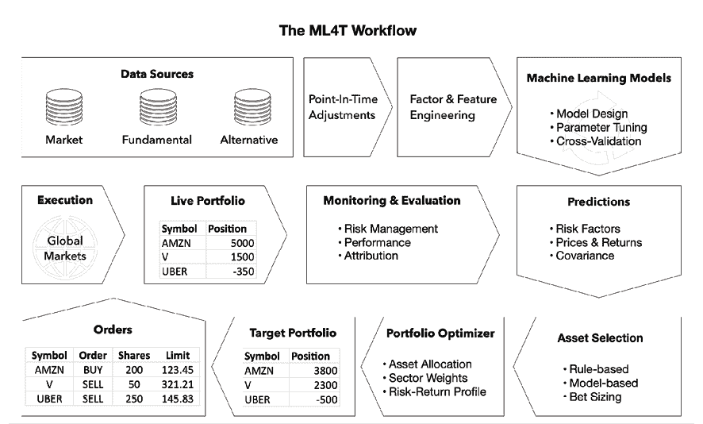
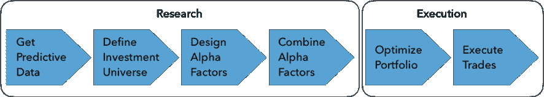

# 1

# 从**构想到执行的交易机器学习**

算法交易依赖于执行算法的计算机程序，以自动化交易策略的一部分或全部元素。**算法**是设计用于实现目标的一系列步骤或规则。它们可以采用许多形式，并促进了整个投资过程的优化，从构想生成到资产配置、交易执行和风险管理。

**机器学习**（**ML**）涉及从数据中学习规则或模式的算法，以实现最小化预测误差等目标。本书中的示例将说明 ML 算法如何从数据中提取信息，以支持或自动执行关键的投资活动。这些活动包括观察市场和分析数据，形成对未来的期望并决定是否放置买入或卖出订单，以及管理由此产生的投资组合，以产生相对于风险的吸引人的回报。

最终，主动投资管理的目标是产生 alpha，即超过用于评估的基准的投资组合回报。**主动管理的基本法则**假定产生 alpha 的关键是准确的回报预测与对这些预测采取行动的能力（Grinold 1989; Grinold and Kahn 2000）。

该法则将**信息比率**（**IR**）定义为表示主动管理价值的比率，即投资组合与基准之间的回报差异与这些回报的波动性的比率。它进一步将 IR 近似为以下乘积：

+   **信息系数**（**IC**），它以与结果的等级相关性来衡量预测的质量

+   将**一种策略的广度**表示为对这些预测的独立投注数量的平方根

金融市场上的高级投资者竞争意味着，要产生 alpha 并进行精确预测，需要优越的信息，无论是通过获取更好的数据、优越的处理能力，还是两者兼而有之。

这就是 ML 的作用所在：**用于交易的机器学习**（**ML4T**）应用通常旨在更有效地利用迅速多样化的数据范围，以产生更好且更具操作性的预测，从而提高投资决策和结果的质量。

历史上，算法交易曾被更狭义地定义为将交易执行自动化以最小化卖方提供的成本。本书采用了更全面的视角，因为算法的使用以及特别是 ML 的使用已经影响到更广泛的活动范围，从生成想法和从数据中提取信号到资产配置、头寸规模和测试和评估策略。

本章探讨了引领机器学习成为投资行业竞争优势来源的行业趋势。我们还将研究机器学习在投资过程中的定位，以实现算法交易策略。具体而言，我们将涵盖以下主题：

+   促使机器学习在投资行业崛起的关键趋势

+   利用机器学习设计和执行交易策略

+   交易中机器学习的流行用例

您可以在 GitHub 存储库的本章 README 文件中找到其他资源和参考资料的链接（[`github.com/PacktPublishing/Machine-Learning-for-Algorithmic-Trading-Second-Edition`](https://github.com/PacktPublishing/Machine-Learning-for-Algorithmic-Trading-Second-Edition)）。

# 机器学习在投资行业的崛起

在过去几十年里，投资行业发生了巨大变革，并在竞争加剧、技术进步和具有挑战性的经济环境中继续发展。本节回顾了塑造整体投资环境和算法交易及机器学习使用的关键趋势。

推动算法交易和机器学习走向目前突出地位的趋势包括：

+   **市场微观结构**的变化，例如电子交易的普及和跨资产类别和地理区域的市场整合

+   以**风险因子暴露**为框架制定的投资策略的发展，而不是资产类别

+   在**计算能力**、**数据生成与管理**以及**统计方法**革命，包括深度学习的突破

+   算法交易的先驱相对于人类、自主投资者的**超额表现**

此外，2001 年和 2008 年的金融危机影响了投资者对分散化和风险管理的态度。其中一个结果是**被动投资工具**的兴起，即**交易所交易基金（ETF）**形式的低成本**被动投资工具**。

在 2008 年危机引发的低收益和低波动性背景下，领先央行大规模购买资产，注重成本的投资者将超过 3.5 万亿美元从主动管理的共同基金转移到被动管理的 ETF。

竞争压力还体现在**对冲基金费用的降低**，这些费用从传统的年管理费 2%和利润提取 20%降至 2017 年分别为平均 1.48%和 17.4%。

## 从电子交易到高频交易

自 20 世纪 60 年代网络开始将价格路由到计算机终端以来，电子交易在能力、交易量、资产类别覆盖范围和地理范围方面取得了巨大进步。股票市场在全球范围内一直处于这一趋势的前沿。有关金融市场相关变化的全面报道，请参阅 Harris（2003 年）和 Strumeyer（2017 年）；在下一章中，我们将回顾如何处理市场和基本数据时再次讨论这个话题。

1997 年，SEC 发布的订单处理规则通过**电子通讯网络**（**ECNs**）向交易所引入了竞争。 ECN 是自动化的**替代交易系统**（**ATS**），可以按指定价格匹配买卖订单，主要用于股票和货币交易，并注册为经纪人。它允许不同地理位置的重要经纪公司和个人交易者直接进行交易，无需中介，无论是在交易所内还是在交易所外的交易时间。

**暗池**是另一种私人 ATS，允许机构投资者交易大额订单，而不公开其信息，与交易所在 ECN 竞争之前管理其订单簿的方式相反。暗池不公布交易前的买入和卖出报价，交易价格仅在执行后一段时间后才变为公开。自 2000 年代中期以来，它们已大幅增长，占美国股票交易的 40％，原因是对大额订单不利价格波动和高频交易者操纵订单的担忧。它们通常设在大型银行内，并受 SEC 监管。

随着电子交易的兴起，**成本有效执行的算法**迅速发展，并且从卖方向买方和跨资产类别迅速传播。自 2000 年左右，自动交易作为一种旨在实现成本有效执行的卖方工具出现，将订单分解为较小的、序列化的块，以限制其市场影响。这些工具传播到买方，并且通过考虑交易成本和流动性、以及短期价格和交易量预测等因素而变得越来越复杂。

**直接市场访问**（**DMA**）通过允许交易者使用交易所成员经纪人的基础设施和市场参与者身份直接向交易所发送订单，从而使交易者对执行拥有更大的控制权。赞助访问通过经纪人移除了交易前的风险控制，并形成了**高频交易**（**HFT**）的基础。

HFT 是指金融工具中以极低的延迟在微秒范围内执行的自动化交易，并且参与者持有非常短的持仓时间。其目标是检测和利用市场微观结构的**效率低下**，即交易场所的制度基础设施。

在过去的 10 年里，HFT 已大幅增长，并估计在美国股市交易量中占约 55%，在欧洲股市交易量中占约 40%。HFT 在期货市场也已大幅增长，占外汇期货交易量的大约 80%，以及利率期货和国债 10 年期期货交易量的三分之二（Miller 2016）。

HFT（高频交易）策略旨在利用**被动或主动策略**每次交易赚取小额利润。被动策略包括套利交易，以从不同交易场所交易的同一资产或其衍生品的极小价格差异中获利。主动策略包括订单预测或动量点火。订单预测，也称为流动性检测，涉及提交小型探索性订单的算法，以检测大型机构投资者的隐藏流动性，并在大订单之前进行交易，从随后的价格变动中获利。动量点火意味着一个算法执行并取消一系列订单，以欺骗其他 HFT 算法更积极地买入（或卖出）并从结果的价格变化中获利。

监管机构对某些激进的 HFT 策略与**市场脆弱性和波动性增加**之间的潜在联系表示关注，例如 2010 年 5 月的闪电崩盘、2014 年 10 月的国库市场波动以及 2015 年 8 月 24 日道琼斯工业平均指数暴跌超过 1000 点。与此同时，由于 HFT 的存在，市场流动性随着交易量的增加而增加，这降低了整体交易成本。

交易量减少、波动性降低以及技术成本和获取数据和交易场所的访问成本上升的组合导致了财务压力。根据估计，2017 年美国股票的 HFT 总收入首次跌破了 2008 年以来的 10 亿美元，从 2009 年的 79 亿美元下降。这一趋势导致了**行业整合**，例如，由最大的上市专营交易公司 Virtu Financial 进行的各种收购，以及共享基础设施投资，例如芝加哥到东京之间的新 Go West 超低延迟路线。与此同时，像 Alpha Trading Labs 这样的初创公司正在通过为分享利润的算法众包使 HFT 交易基础设施和数据变得可用，以使 HFT 民主化。

## 因子投资和智能贝塔基金

资产提供的回报是与投资相关的不确定性或风险的函数。例如，股票投资意味着承担公司的业务风险，而债券投资则意味着违约风险。在特定风险特征预测回报的程度上，识别和预测这些风险因素的行为成为设计投资策略时的主要关注点。它产生了有价值的交易信号，并且是实现优秀主动管理结果的关键。随着时间的推移，行业对风险因素的理解已经发生了非常大的变化，并且已经影响了 ML 用于交易的方式。*第四章*，*金融特征工程 - 如何研究 Alpha 因素*，以及*第五章*，*投资组合优化和绩效评估*，将更深入地探讨这里概念的实际应用；详见 Ang（2014）进行全面的覆盖。

**现代投资组合理论**（**MPT**）引入了对给定资产的特异性和系统性风险来源的区分。特异性风险可以通过分散化来消除，但系统性风险则不能。20 世纪 60 年代初，**资本资产定价模型**（**CAPM**）确定了推动所有资产回报的单一因素：市场投资组合超过国库券的回报。市场投资组合由所有可交易证券组成，按其市值加权。资产对市场的系统性暴露由**贝塔**来衡量，即资产回报与市场投资组合回报之间的相关性。

资产风险不仅仅取决于单个资产，而是取决于它与其他资产和整个市场的相对运动，这是一个重大的概念性突破。换句话说，资产根据它们暴露于所有资产共同面临的基础**普遍风险**，而不是由于它们特定的、特殊的特征，来获得**风险溢价**。

随后，学术研究和行业经验提出了许多关于 CAPM 预测的关键问题，即资产的风险溢价仅取决于其暴露于由资产贝塔测量的单一因素。相反，**已经发现了许多额外的风险因素**。因素是一种可量化的信号、属性或任何变量，它在历史上与未来的股票回报相关，并且预计在未来仍然相关。

这些风险因素被标记为异常因素，因为它们与**有效市场假说**（**EMH**）相矛盾。EMH 认为市场均衡总是根据 CAPM 定价证券，因此其他因素不应具有预测能力（Malkiel 2003）。因素背后的经济理论可以是理性的，即因素风险溢价补偿了在不景气时期的低回报，也可以是行为的，即代理人未能套利掉多余的回报。

知名的异常包括价值、规模和动量效应，它们有助于预测回报，同时控制 CAPM 市场因素。**规模效应**依赖于小型公司系统性地胜过大型公司（班兹，1981 年；Reinganum，1981 年）。**价值效应**（Basu 等，1981 年）表明具有低估价指标的公司胜过具有相反特征的同行。它表明，具有低价格倍数（例如市盈率或市净率）的公司比它们更昂贵的同行表现更好（正如价值投资的发明者本杰明·格雷厄姆和大卫·多德所建议，并由沃伦·巴菲特所推广）。

**动量效应**是在 1980 年代晚期被发现的，其中包括 Clifford Asness 等人，AQR 的创始合伙人，它表明，具有良好动量的股票，即近 6-12 个月回报表现良好的股票，未来的回报比市场风险相似的动量较差的股票高。研究人员还发现，价值和动量因素解释了美国以外股票的回报，以及其他资产类别，如债券、货币和大宗商品，以及其他风险因素（Jegadeesh 和 Titman，1993 年；Asness，Moskowitz 和 Pedersen，2013 年）。

在固定收益领域，价值策略被称为**顺势买入收益率曲线**，是一种期限溢价形式。在大宗商品领域，它被称为**卷动回报**，如果期货曲线呈上升趋势，则为正回报，否则为负回报。在外汇市场，价值策略被称为**持有**。

还存在**非流动性溢价**。更不流动的证券以低价格交易，并且相对于更流动的同行，具有高平均超额回报。具有较高违约风险的债券的平均回报往往更高，反映了信用风险溢价。由于投资者愿意为避免回报暴跌而支付高波动性保险，因此在期权市场上出售波动性保护的卖方往往获得高回报。

**多因素模型**比市场组合更广泛、更多样地定义了风险。1976 年，史蒂芬·罗斯提出了**套利定价理论**，它主张投资者会因为无法分散的多个系统性风险而获得补偿（Roll 和 Ross，1984 年）。最重要的三个宏观因素是增长、通胀和波动性，除此之外还有生产力、人口统计和政治风险。1993 年，尤金·法玛和肯尼斯·弗伦奇将股票风险因素的规模和价值与市场因素结合成一个单一的三因子模型，更好地解释了横截面股票回报。他们后来添加了一个同时解释两个资产类别回报的模型，该模型还包括债券风险因素（法玛和弗伦奇，1993 年；2015 年）。

风险因素尤其吸引人的一点是它们的**低或负相关性**。例如，价值和动量风险因素呈负相关，降低了风险，并使风险调整后的回报超过了风险因素所暗示的收益。此外，利用杠杆和多空策略，因子策略可以组合成**市场中性方法**。在暴露于正面风险的证券中开设多头仓位，并在暴露于负面风险的证券中减仓或建立空头仓位的组合，使得动态风险溢价得以收集。

因此，解释超出 CAPM 的回报的因素被纳入了倾向于支持一个或多个因素的投资风格中，资产开始向基于因子的投资组合转移。2008 年金融危机突显了当投资者不关注基础因子风险时，资产类别标签可能极具误导性并造成虚假的分散化感，因为资产类别同时暴跌。

在过去几十年中，量化因子投资已经从基于两种或三种风格的简单方法演变为**多因子智能或异类基准产品**。智能基金在 2017 年突破了 1 万亿美元的资产管理规模，证明了这种混合投资策略的普及程度，该策略将主动和被动管理相结合。**智能基金**采取被动策略，但根据一个或多个因素进行修改，例如选择更便宜的股票或根据股息支付进行筛选，以产生更好的回报。这种增长与对传统主动管理者收取高额费用的批评以及对其业绩加强的审查趋势相一致。

在投资行业中，发现并成功预测风险因素的持续影响未来资产回报的过程，无论是单独还是与其他风险因素结合，都是机器学习激增的关键驱动因素，并将贯穿本书的主题。

## 算法先驱胜过人类

领先引入算法交易的公司的**资产管理规模**（**AUM**）的业绩记录和增长，在激起投资者兴趣以及后续行业努力复制其成功方面发挥了关键作用。**系统性基金与高频交易**不同之处在于，交易可能持有时间更长，同时寻求利用套利机会，而不是仅仅追求速度优势。

大多或完全依赖算法决策的系统性策略最著名地由数学家詹姆斯·西蒙斯引入，他于 1982 年创立了**文艺复兴技术**，并将其打造成首屈一指的量化公司。其神秘的 Medallion 基金，对外关闭，自 1982 年以来年化回报率估计为 35%。

**D. E. Shaw、Citadel 和 Two Sigma**，这三家最著名的量化对冲基金，使用基于算法的系统化策略，在 2017 年首次成为总收益前 20 名的表现最好的基金之一，扣除费用，并自创立以来。

D. E. Shaw 公司成立于 1988 年，2019 年资产管理规模达到 500 亿美元，排名第三。由 Kenneth Griffin 于 1990 年创立的 Citadel 公司管理着 320 亿美元，排名第五。Two Sigma 公司仅在 2001 年由 D. E. Shaw 的前员工 John Overdeck 和 David Siegel 创立，从 2011 年的 80 亿美元资产管理规模增长到 2019 年的 600 亿美元。**Bridgewater**公司由雷·达里奥于 1975 年创立，2019 年资产管理规模超过 1600 亿美元，并且由于其 Pure Alpha 基金而继续领先，该基金还融合了系统化策略。

同样地，在《机构投资者》2018 年对冲基金 100 强榜单上，前四家最大的公司和前六家公司中的五家主要或完全依赖计算机和交易算法来做投资决策，并且它们在一个具有挑战性的环境中不断增加其资产。一些量化型公司上升了排名，并在某些情况下以两位数的百分比增加了其资产。排名第二的**Applied Quantitative Research**（**AQR**）公司在 2017 年将其对冲基金资产增加了 48％，2018 年增加了 29％，达到了近 900 亿美元。

### 由机器学习驱动的基金吸引了 1 万亿美元的资产管理规模。

计算能力、数据可用性和统计方法的三次革命使得系统化、数据驱动策略的采用不仅更加引人注目和具有成本效益，而且是竞争优势的关键来源。

因此，算法方法不仅在率先采用这些策略的对冲基金行业中找到了更广泛的应用，而且还在更广泛的资产管理公司以及 ETF 等被动管理车辆中找到了应用。特别是，利用机器学习和算法自动化的**预测分析**在投资过程的各个环节中扮演着越来越重要的角色，包括从构思和研究到战略制定和组合构建、交易执行和风险管理等各个资产类别。

行业规模的估计各不相同，因为没有对定量或算法基金的客观定义。许多传统的对冲基金甚至包括共同基金和 ETF 都在引入基于计算机的策略或将其融入到人加机器的环境中的自主性方法中。

根据*经济学人*杂志，2016 年，系统性基金成为了美国股市机构交易的最大推动力量（忽略高频交易，高频交易主要充当中间商）。到 2019 年，它们占据了机构交易量的 35%以上，而 2010 年仅为 18%；仅有 10%的交易仍然是由传统的股票基金所致。以罗素 3000 指数衡量，美国股票的价值约为 31 万亿美元。三种**由计算机管理的基金**—指数基金、交易所交易基金（ETFs）和量化基金—**约占了 35%**，而传统对冲基金和其他互惠基金的人类管理者仅占 24%。

市场研究公司 Preqin 估计，几乎有 1500 家对冲基金的大部分交易都是依靠计算机模型的帮助。量化对冲基金现在负责投资者进行的所有美国股票交易的 27%，而 2013 年仅为 14%。但是很多使用数据科学家—或称之为量化交易员—他们反过来使用机器来建立大型统计模型。

然而，近年来，基金已经转向真正的机器学习，人工智能系统能够以速度分析大量数据，并通过这些分析改善自身。最近的例子包括 Rebellion Research、Sentient 和 Aidyia，它们依靠进化算法和深度学习来设计完全自动的**人工智能**（**AI**）驱动的投资平台。

从核心对冲基金行业，算法策略的采用已经扩展到了互惠基金甚至被动管理的交易所交易基金，以智能贝塔基金的形式，以及自主基金的量化方法的形式。

### 量化基金的出现

主动投资管理已经演变出了两种不同的方法：**系统性**（**或量化**）和**自主投资**。系统性方法依赖算法来识别跨许多证券的投资机会的可重复和数据驱动方法。相比之下，自主方法涉及对少量证券基本面的深入分析。随着基本面经理采取更多的数据科学驱动方法，这两种方法变得越来越相似。

即使**基本面交易员**现在也装备了定量技术，根据巴克莱的数据，占据了 55 亿美元的系统性资产。与特定公司无关，量化基金根据跨越广泛证券范围的模式和动态进行交易。根据巴克莱 2018 年编制的数据，这样的量化交易员占据了总对冲基金资产的约 17%

**Point72**，资产规模达到 140 亿美元，已经将大约一半的投资组合经理转向了人加机器的方法。Point72 还投资数千万美元到一个分析大量替代数据并将结果传递给交易员的团队中。

### 战略能力投资

三个趋势推动了数据在算法交易策略中的使用，并可能进一步将投资行业从裁量性转向定量风格：

+   数字数据的可用性呈指数级增长

+   计算能力和数据存储容量的成本降低导致了它们的增加

+   用于分析复杂数据集的统计方法的进展

对相关能力——技术、数据以及最重要的是熟练人员——的投资不断增加，突显了利用机器学习进行算法交易对竞争优势的重要性，尤其是考虑到自 2008 年金融危机以来，被动指数投资工具（如 ETF）的流行度不断上升。

摩根士丹利指出，仅有 23%的量化客户表示他们不考虑使用或尚未使用机器学习，而 2016 年这一比例为 44%。**古根海姆合伙公司**在加利福尼亚州的劳伦斯伯克利国家实验室为 100 万美元建立了一个所谓的超级计算机集群，帮助为古根海姆的量化投资基金进行数据处理。电脑的电费每年还要花费 100 万美元。

**AQR**是一家依靠学术研究来识别并系统交易长期以来证明能够击败整体市场的因素的量化投资集团。该公司曾经回避了像文艺复兴技术或 DE Shaw 等量化同行纯计算机驱动的策略。然而，最近，AQR 已经开始使用机器学习在市场上寻找有利可图的模式，以分析新的数据集，例如油井和油船投射的卫星图片。

领先的公司**黑石集团**，管理着超过 5 万亿美元的资产，也通过大量投资于 SAE，一家在金融危机期间收购的系统性交易公司，来打败裁量性基金经理，押注算法。富兰克林·坦普尔顿公司以未披露的金额收购了 Random Forest Capital，一家以债务为重点、以数据为导向的投资公司，希望其技术能支持更广泛的资产管理。

## 机器学习和替代数据

对**信息优势**和发现新的不相关信号的能力长期以来一直是对冲基金追求阿尔法的目标。历史上，这包括诸如对购物者的专有调查，或者对选举或公投前的选民的调查。

偶尔，利用公司内部人员、医生和专家网络来扩展对行业趋势或公司的了解，可能会越过法律界限：自 2010 年以来，一系列针对交易员、投资组合经理和分析师使用**内部信息**的起诉已经动摇了该行业。

相比之下，利用机器学习开发常规和替代数据源的信息优势不取决于专家和行业网络或者对公司管理层的接触，而是取决于收集大量非常多样的数据源并实时分析这些数据的能力。

传统数据包括经济统计数据、交易数据或公司报告。**替代数据**范围更广，包括卫星图像、信用卡销售、情感分析、移动地理位置数据和网站抓取等来源，以及将业务日常生成的数据转化为有价值情报。从原则上讲，它包括**任何包含（潜在的）交易信号的数据来源**。

例如，来自保险公司关于新汽车保险政策销售的数据不仅捕捉到了新车销售的数量，还可以分解成品牌或地理区域。许多供应商从网站中抓取有价值的数据，范围从应用程序下载和用户评论到航空公司和酒店预订。社交媒体网站也可以被爬取以获取消费者观点和趋势的提示。

通常，这些数据集很大，需要使用可扩展的数据解决方案进行存储、访问和分析，例如 Hadoop 和 Spark。据德意志银行称，全球有超过 10 万亿个网页的 10 亿个网站，共有 500 艾字节（或 5000 亿吉字节）的数据。每年有超过 1 亿个网站被添加到互联网上。

在公司的业绩公布之前，可以通过其网站上职位招聘数量的下降、员工在招聘网站 Glassdoor 上对其首席执行官的内部评价或其网站上衣物平均价格的下降获得对公司前景的**实时见解**。这些信息可以与汽车停车场的卫星图像和移动电话的地理位置数据相结合，后者可以指示有多少人正在访问商店。另一方面，战略动向可以从特定功能区域或特定地理位置的职位发布量的增加中获得。

最有价值的信息来源之一是直接揭示消费者支出的数据，其中**信用卡信息**是主要来源。这些数据只提供了销售趋势的部分视图，但与其他数据结合使用时可以提供重要的见解。例如，Point72 曾经一度每天分析 8000 万笔信用卡交易。我们将在*第三章*，*金融替代数据-分类和用例*中详细探讨各种数据来源、它们的用例以及如何评估它们。

投资集团在过去两年中将他们在**替代数据**和数据科学家上的支出翻了一番，因为资产管理行业试图振兴其日渐衰落的命运。在 2018 年 12 月，[alternativedata.org](http://alternativedata.org)（由 Yipit 提供支持）列出了 375 家替代数据提供商。

2017 年，资产管理公司总共花费了 3.73 亿美元用于数据集和雇佣新员工来解析这些数据，比 2016 年增长了 60%，今年可能会总共花费 6.16 亿美元，根据 [alternativedata.org](http://alternativedata.org) 投资者的调查。该网站预测，到 2020 年，总体支出将上升到 10 亿美元以上。一些估计甚至更高：咨询公司 Optimus 估计，投资者每年在替代数据上的支出约为 50 亿美元，并预计未来几年该行业将以每年 30% 的速度增长。

随着对宝贵数据源的竞争加剧，数据源合同中的排他性安排成为一个关键特征，以保持信息优势。与此同时，隐私问题日益严重，监管机构已经开始关注当前基本没有受到监管的数据提供商行业。

## 众包交易算法

近年来，一些算法交易公司开始提供投资平台，该平台提供数据访问和编程环境，以众包方式获取风险因素，这些因素成为投资策略或整个交易算法的一部分。主要例子包括 WorldQuant、Quantopian，以及最近的 Alpha Trading Labs（于 2018 年推出）。

**WorldQuant** 是 Millennium Management（资产管理规模：410 亿美元）于 2007 年拆分出来的子公司，为该公司管理大约 50 亿美元的资金。在其 alpha 工厂中，它雇佣了数百名科学家和更多的兼职工人，这个工厂将投资过程组织为一个定量流水线。该工厂声称已经生产了 400 万个成功测试的 alpha 因子，用于更复杂的交易策略，并且目标是 1 亿个。每个 alpha 因子都是一个算法，旨在预测未来的资产价格变化。然后其他团队将 alpha 因子组合成策略，策略组合成投资组合，在投资组合之间分配资金，并管理风险，同时避免相互损害的策略。请参见*附录*，*Alpha 因子库*，了解 WorldQuant 使用的几十个定量因子的示例。

# 设计和执行基于机器学习的策略

在本书中，我们演示了**机器学习如何融入设计**、**执行**和**评估交易策略的整个过程**。为此，我们将假设基于机器学习的策略是由包含目标领域和策略的预测信号的数据源驱动的，这些信号经过适当的预处理和特征工程后，允许机器学习模型预测资产回报或其他策略输入。模型预测又会转化为基于人工裁量或自动规则的买入或卖出订单，这些规则又可以由另一个机器学习算法通过端到端的方法进行手动编码或学习。

*图 1.1* 描绘了这个工作流程的关键步骤，这也塑造了本书的组织结构：

图 1.1：ML4T 工作流程

第一部分介绍了适用于不同策略和 ML 用例的重要技能和技术。这些包括以下内容：

+   如何获取和管理重要数据源

+   如何设计具有信息量的特征或 alpha 因子以提取信号内容

+   如何管理投资组合并跟踪策略绩效

此外，在第二部分的*第八章*，*ML4T 工作流程 - 从模型到策略回测*中，涵盖了策略回测。在转向相关 ML 用例之前，我们将简要概述这些领域，这些用例构成本书第 2、3 和 4 部分的大部分内容。

## 数据的采集和管理

在数据可用性方面的体积，种类和速度的戏剧性演变是对 ML 应用于交易的重要补充，反过来又推动了行业对获取新数据源的支出。然而，数据供应的不断增加需要谨慎选择和管理，以发现潜在价值，包括以下步骤：

1.  识别和评估不会迅速衰减的市场，基本和替代数据源中包含的 alpha 信号。

1.  部署或访问基于云的可扩展数据基础设施和分析工具，如 Hadoop 或 Spark，以便快速，灵活地访问数据。

1.  通过在特定时间点上将数据进行调整，精心管理和筛选数据以避免前瞻偏差。这意味着数据应该只反映在给定时间可用和已知的信息。在扭曲的历史数据上训练的机器学习算法几乎肯定会在实时交易中失败。

我们将在*第二章*，*市场和基本数据 - 来源和技术*，以及*第三章*，*金融替代数据 - 类别和用例*中详细介绍这些方面。

## 从 alpha 因子研究到投资组合管理

Alpha 因子旨在从数据中提取信号，以预测给定投资范围在交易期内的回报。典型因子在评估给定时间点时对每个资产都采用单个值，但可能组合一个或多个输入变量或时间段。如果您已经熟悉 ML 工作流程（参见*第六章*，*机器学习过程*），您可以将 alpha 因子视为专为特定策略设计的领域特定特征。使用 alpha 因子涉及研究阶段和执行阶段，如*图 1.2*所述：

图 1.2：alpha 因子研究过程

### 研究阶段

**研究阶段**包括设计和评估 alpha 因子。**预测因子**捕获了数据源和重要策略输入（如资产回报）之间系统关系的某些方面。优化预测能力需要通过有效的数据转换进行创造性的特征工程。

由于**数据挖掘**导致的虚假发现是一个需要仔细管理的重要风险。降低这种风险的一种方式是通过遵循几十年的学术研究指导进行搜索，该研究产生了几个诺贝尔奖。许多投资者仍然更喜欢与金融市场和投资者行为理论相一致的因素。阐述这些理论超出了本书的范围，但参考资料突显了深入探讨这一重要框架的途径。

验证 alpha 因子的信号内容需要在代表性环境中得到**其预测能力的健壮估计**。有许多可能破坏可靠估计的方法论和实际陷阱。除了数据挖掘和未对多重检验偏差进行校正之外，这些陷阱还包括使用受到存活或前瞻性偏差污染的数据，以及不反映现实**主、息、税**（**PIT**）信息。*第四章*，*金融特征工程 - 如何研究 Alpha 因子*，讨论了如何成功地管理这个过程。

### 执行阶段

在**执行阶段**，alpha 因子发出信号，导致买入或卖出订单。由此产生的投资组合持有，反过来又具有特定的风险配置，相互交互并对整体投资组合风险做出贡献。投资组合管理涉及优化仓位大小，以实现与投资目标一致的投资组合收益和风险的平衡。

*第五章*，*投资组合优化和绩效评估*，介绍了适用于交易策略工作流程的这个阶段的关键技术和工具，从投资组合优化到绩效评估。

## 策略回测

将投资理念纳入实际算法策略中意味着需要**科学方法**来处理重大风险。这种方法包括通过广泛的经验性测试来拒绝基于其在备选样本市场情景中的表现而接受该理念。测试可能涉及使用模拟数据来捕捉可能发生但未反映在历史数据中的情景。

要为候选策略获得无偏的性能估计，我们需要一个**回测引擎**，以真实的方式模拟其执行。除了数据引入的潜在偏差或统计使用上的缺陷之外，回测引擎还需要准确地表现出交易信号评估、订单下达和执行方面的实际情况，符合市场条件。

*第八章*，*ML4T 工作流程 - 从模型到策略回测*，展示了如何使用 backtrader 和 Zipline，并应对多种方法上的挑战，并完成了端到端 ML4T 工作流程的介绍。

# 用于交易的机器学习 - 策略和用例

实际上，我们将 ML 应用于特定策略的交易，以达到特定的业务目标。在本节中，我们简要描述了交易策略的演变和多样化，并概述了 ML 应用的实际例子，重点介绍了它们与本书内容的关系。

## 算法策略的演变

定量策略已经在三个阶段中发展并变得更加复杂：

1.  在 20 世纪 80 年代和 90 年代，信号通常来源于**学术研究**，并使用从市场和基本数据派生的单一或极少量的输入。今天最大的定量对冲基金之一 AQR 于 1998 年成立，以大规模实施此类策略。这些信号现在主要是商品化的，并作为 ETF 提供，例如基本的均值回归策略。

1.  在 2000 年代，**基于因子的投资**在 Eugene Fama 和 Kenneth French 等人的开创性工作基础上迅速蔓延。基金使用算法识别暴露于价值或动量等风险因素的资产，寻求套利机会。在金融危机早期的赎回触发了 2007 年 8 月的量化地震，这一地震经由基于因子的基金行业传播开来。这些策略现在也作为仅多头的智能 beta 基金提供，根据给定的风险因素倾斜投资组合。

1.  第三个时代是通过投资于**ML 能力和替代**数据来生成可重复交易策略的盈利信号。因子衰减是一个主要挑战：新的异常收益从发现到发布后已经降低了四分之一，由于竞争和拥挤，发布后降低了超过 50%。

今天，当交易者使用算法执行规则时，他们追求一系列不同的目标：

+   旨在实现有利定价的交易执行算法

+   旨在从小的价格波动中获利的短期交易，例如由于套利而引起的

+   旨在预测其他市场参与者行为的行为策略

+   基于绝对价格和相对价格和回报预测的交易策略

**交易执行程序**旨在限制交易的市场影响，范围从简单的切片交易以匹配按时间加权或按成交量加权的平均定价。简单的算法利用历史模式，而更复杂的版本则考虑交易成本、执行差距或预测的价格波动。

**高频交易基金**最突出地依赖非常短的持有期，以从买卖价差或统计套利的微小价格波动中获益。**行为算法**通常在流动性较低的环境中运行，并旨在预测具有显著价格影响的较大玩家的动作，例如依据生成对其他市场参与者策略洞察的嗅探算法。

在本书中，我们将重点放在根据对不同时间范围内相对价格变化的预期进行交易的策略上，这些策略不受延迟优势的影响，因为它们被广泛使用且非常适合 ML 的应用。

## 用于交易的 ML 用例

ML 能够从各种市场、基本和替代数据中提取可交易的信号，因此适用于针对一系列资产类别和投资期限的策略。然而，更普遍地说，它是一个灵活的工具，用于支持或自动化具有可量化目标和数字数据相关的决策。因此，它可以应用于交易过程的几个步骤。在不同类别中有许多用例，包括：

+   数据挖掘以识别模式、提取特征和生成洞察

+   监督学习生成风险因素或 alpha 并创建交易思路

+   将个别信号聚合成策略

+   根据算法学习的风险配置资产

+   策略的测试和评估，包括使用合成数据

+   使用强化学习进行交互式自动化策略的优化

我们简要介绍了其中一些应用，并指出我们将在后面的章节中演示它们的用途。

### 数据挖掘以进行特征提取和洞察

大规模、复杂数据集的成本效益评估需要大规模检测信号。本书中有几个例子：

+   **信息论**有助于估计候选特征的信号内容，因此有助于从 ML 模型中提取最有价值的输入。在*第四章*，*金融特征工程 - 如何研究 Alpha 因子*中，我们使用互信息来比较个别特征对监督学习算法预测资产收益的潜在价值。De Prado（2018）的第十八章估计了价格序列的信息内容，作为在不同交易策略之间做出决策的基础。

+   **无监督学习**提供了一系列方法来识别数据中的结构，以获得洞察或帮助解决下游任务。我们提供了几个例子：

    +   在*第十三章*，*基于数据驱动的风险因素和无监督学习的资产配置*中，我们介绍了聚类和降维以从高维数据集生成特征。

    +   在*第十五章*，*主题建模 - 总结金融新闻*中，我们应用贝叶斯概率模型对金融文本数据进行总结。

    +   在*第二十章*，*自动编码器用于条件风险因素和资产定价*中，我们使用深度学习提取根据资产特征条件化的非线性风险因素，并根据 Kelly 等人（2020）预测股票收益。

+   **模型透明度**强调了获得对个别变量的预测能力的模型特定方法，并引入了一种新颖的博弈论方法，称为 **SHapley 加法解释**（**SHAP**）。我们将其应用于具有大量输入变量的梯度提升机，见 *第十二章*，*提升您的交易策略*，以及 *附录*，*Alpha 因子库*。

### 用于 alpha 因子创建的监督学习

将 ML 应用于交易的最熟悉理由之一是获得关于资产基本面、价格变动或市场状况的预测。一种策略可以利用多个建立在彼此之上的 ML 算法：

+   **下游模型**可以通过整合关于个别资产前景、资本市场预期和证券之间的相关性的预测来在投资组合水平上生成信号。

+   或者，ML 预测可以像之前概述的量化基本方法那样通知**自由交易**。

ML 预测也可以**针对特定的风险因素**，例如价值或波动性，或者实施技术方法，例如趋势跟随或均值回归：

+   在 *第三章*，*金融的另类数据 - 分类和用例* 中，我们说明了如何处理基本数据，以创建 ML 驱动的估值模型的输入。

+   在 *第十四章*，*用于交易的文本数据 - 情感分析*，*第十五章*，*主题建模 - 总结财经新闻*，以及 *第十六章*，*用于盈利电话和 SEC 报告的词嵌入* 中，我们使用了商业评论的另类数据，这些数据可以作为估值练习的输入，用于预测公司的收入。

+   在 *第九章*，*用于波动率预测和统计套利的时间序列模型* 中，我们演示了如何预测宏观变量作为市场预期的输入，以及如何预测诸如波动率之类的风险因素。

+   在 *第十九章*，*多元时间序列和情感分析的 RNN* 中，我们介绍了能够在非线性时间序列数据上取得优越性能的循环神经网络。

### 资产配置

ML 已经被用于基于决策树模型的资产配置，这些模型计算出一种分层形式的风险均衡。因此，风险特征受到资产价格模式的驱动，而不是资产类别，并且具有优越的风险-回报特性。

在 *第五章*，*投资组合优化和绩效评估*，以及 *第十三章*，*无监督学习中的数据驱动风险因素和资产配置* 中，我们说明了层次聚类如何提取数据驱动的风险类别，这些类别比传统的资产类别定义更好地反映了相关性模式（参见 De Prado 2018 中的 *第十六章*）。

### 测试交易理念

回测是选择成功的算法交易策略的关键步骤。使用合成数据进行交叉验证是一种关键的 ML 技术，当与适当的方法结合使用以校正多重测试时，可以生成可靠的样本外结果。财务数据的时间序列性质要求修改标准方法以避免前瞻偏差，否则会污染用于训练、验证和测试的数据。此外，历史数据的有限可用性催生了使用合成数据的替代方法。

我们将展示使用市场、基本和替代数据源测试 ML 模型的各种方法，以获得可靠的样本外错误估计。

在*第二十一章*，*用于合成时间序列数据的生成对抗网络*中，我们介绍了**生成对抗网络**（**GANs**），它们能够生成高质量的合成数据。

### 强化学习

交易发生在竞争激烈的互动市场中。强化学习旨在训练代理学习基于奖励的策略函数；它通常被认为是金融 ML 中最有前景的领域之一。例如，参见 Hendricks 和 Wilcox（2014）以及 Nevmyvaka、Feng 和 Kearns（2006）的交易执行应用。

在*第二十二章*，*深度强化学习 - 构建交易代理*中，我们介绍了关键的强化学习算法，如 Q-learning，以演示使用 OpenAI 的 Gym 环境训练交易强化学习算法。

# 总结

在本章中，我们回顾了算法交易策略的关键行业趋势、替代数据的出现以及利用 ML 利用这些新信息优势的使用。此外，我们介绍了 ML4T 工作流程的关键要素，并概述了 ML 在不同策略背景下用于交易的重要用例。

在接下来的两章中，我们将更深入地研究推动任何算法交易策略的油料——市场、基本和替代数据来源——使用 ML。
