# 第二章：市场和基本数据-来源和技术

数据一直是交易的重要驱动因素，交易员长期以来一直努力获得优势，以获取优越信息的访问权。这些努力至少可以追溯到有关罗斯柴尔德家族通过鸽子携带跨越海峡的关于滑铁卢战役英国胜利的消息事先从债券购买中受益丰厚的传闻。

如今，对更快数据访问的投资呈现为连接芝加哥商品交易所（**CME**）与东京的领先**高频交易**（**HFT**）公司的 Go West 财团。CME 与纽约的**BATS**（**Better Alternative Trading System**）交易所之间的往返延迟已降至接近理论极限的八毫秒，因为交易者竞争利用套利机会。与此同时，监管机构和交易所已开始引入减速装置，以减缓交易速度，限制对信息不均匀访问的不利影响。

传统上，投资者主要依赖于**公开市场和基本数据**。通过专有调查等方式创建或获取私有数据集的努力有限。传统策略侧重于股票基本面，并在报告的财务数据上构建财务模型，可能结合行业或宏观数据来预测每股收益和股价。或者，他们利用**技术分析**从市场数据中提取信号，使用从价格和成交量信息计算出的指标。

**机器学习**（**ML**）算法承诺比人定义的规则和启发式方法更有效地利用市场和基本数据，特别是当结合**替代数据**时，这是下一章的主题。我们将阐明如何应用从线性模型到**递归神经网络**（**RNNs**）的 ML 算法到市场和基本数据，并生成可交易的信号。

本章介绍了市场和基本数据来源，并解释了它们反映的环境。交易环境的细节不仅对市场数据的正确解释至关重要，还对您的策略的设计和执行以及实施逼真的回测模拟至关重要。

我们还说明了如何使用 Python 访问和处理来自各种来源的交易和财务报表数据。

特别是，本章将涵盖以下主题：

+   市场数据如何反映交易环境的结构

+   在分钟频率下处理交易和报价数据

+   从 tick 数据中重建订单簿使用纳斯达克 ITCH

+   使用各种类型的条形图总结 tick 数据

+   处理使用**可扩展商业报告语言**（**XBRL**）编码的电子申报

+   解析和组合市场和基本数据以创建**市盈率**（**P/E**）序列

+   如何使用 Python 访问各种市场和基本数据源

您可以在 GitHub 仓库的相应目录中找到本章的代码示例和额外资源的链接。笔记本包括图像的彩色版本。

# 市场数据反映了其环境

市场数据是交易者直接或通过中介在众多市场之一下订单的产品，以及订单是如何处理以及价格是如何通过匹配需求和供给来确定的。因此，数据反映了交易场所的制度环境，包括管理订单、交易执行和价格形成的规则和法规。详细全球概览请参阅 Harris (2003)，美国市场的详细信息请参阅 Jones (2018)。

算法交易者使用算法，包括机器学习，来分析买卖订单流动以及由此产生的交易量和价格统计数据，以提取捕捉洞察力的交易信号，例如需求供给动态或特定市场参与者的行为。

在我们开始使用由纳斯达克这样的环境创建的实际刻度数据之前，我们将首先回顾在回测期间影响交易策略模拟的制度特征。

## 市场微观结构 – 细枝末节

市场微观结构研究了**制度环境**如何影响交易过程，以及形成价格发现、买卖报价和报价、日内交易行为以及交易成本等结果（Madhavan 2000; 2002）。它是金融研究中增长最快的领域之一，受到算法交易和电子交易的快速发展推动。

如今，对冲基金赞助内部分析师跟踪快速发展的、复杂的细节，并确保以最佳市场价格执行，并设计利用市场摩擦的策略。在我们深入研究交易生成的数据之前，我们将简要概述这些关键概念。参考文献中包含了许多详细介绍这一主题的来源。

## 如何交易 – 不同类型的订单

交易者可以下不同类型的买入或卖出订单。有些订单保证立即执行，而其他订单可能说明价格阈值或触发执行的其他条件。订单通常在同一交易日有效，除非另有说明。

*市价订单*旨在在到达交易场所时立即执行订单，以当时的价格执行。相比之下，*限价订单*仅在市场价格高于卖出限价订单的限价或低于买入限价订单的限价时执行。*止损订单*则仅在市场价格升至指定价格以上时对买入止损订单生效，或降至指定价格以下时对卖出订单生效。*买入止损订单*可用于限制空头交易的损失。止损订单也可能有限制条件。

订单可以附加许多其他条件。例如，*全部或无*订单防止部分执行；只有指定数量的股票可用时才会填充，并且可以有效期一天或更长时间。它们需要特殊处理，并且对市场参与者不可见。*全部成交或取消*订单也防止部分执行，但如果立即未执行则取消。*立即成交或取消*订单立即购买或出售可用数量的股票，并取消剩余部分。*不指定时间的*订单允许经纪人决定执行的时间和价格。最后，市场在 *开盘/收盘* 订单在市场开盘或收盘时执行或接近执行。部分执行是允许的。

## 何处交易 - 从交易所到深池

证券在高度组织化和**受监管的交易所**交易，或者在**场外交易**（**OTC**）市场以不同程度的形式交易。交易所是买家和卖家竞争最低的要价和最高的出价的中央市场。交易所监管通常会实施上市和报告要求，以创建透明度并吸引更多的交易者和流动性。场外交易市场，例如最佳市场（OTCQX）或风险市场（OTCQB），通常具有较低的监管壁垒。因此，它们适用于更广泛范围的证券，包括债券或**美国存托凭证**（**ADRs**；例如，在外国交易所上市的股票，例如雀巢公司）。  

交易所可能依靠双边交易或根据特定规则匹配所有买入和卖出订单的集中式订单驱动系统。许多交易所使用提供流动性的中介，这些**中介**包括充当自己代理的交易商和代表他人交易的经纪人。**价格形成**可能通过拍卖进行，例如在**纽约证券交易所**（**NYSE**）中，最高的出价和最低的要价被匹配，或者通过从卖方手中购买并向买方出售的交易商进行。  

从前，公司要么在纽约证券交易所（NYSE）注册并进行交易，要么在场外交易市场如纳斯达克进行交易。在纽约证券交易所，一位**专家**负责中介特定证券的交易。专家通过经纪人接收买入和卖出订单，并在一个中央订单簿中跟踪限价订单。限价订单根据价格和时间优先执行。买入市价订单被路由到专家以与限价订单簿中最低的要价成交（卖出市价订单被路由到专家以与最高的出价成交），在平局的情况下优先考虑较早的限价订单。专家可以访问中央订单簿中的所有订单，从而公布最佳买价、卖价，并根据整体买卖失衡情况设置市场价格。

在纳斯达克，多个**市场创造者**促成了股票交易。每个经销商都向中央行情系统提供他们的最佳买入和卖出价格，并准备按指定价格以及指定数量进行交易。交易员通过他们的经纪人将订单路由到最佳报价的市场创造者处。订单的竞争很可能使执行价格公平。市场创造者确保了一个公平和有序的市场，提供了流动性，并像专家一样传播价格，但只能访问路由到他们的订单，而不是整个市场的供需。这种碎片化可能会导致难以确定公平价值市场价格的困难。

如今，**交易已经分散**；在美国，不再只有两个主要的交易场所，而是有十三个以上的展示交易场所，包括交易所和（未受监管的）**另类交易系统**（**ATSs**），如**电子通讯网络**（**ECNs**）。每个场所以不同的延迟报告交易到综合带，但规则不同，有多种不同的定价和排队模型。

下表列出了一些较大的全球交易所及截至 03/2018 12 个月的各类资产交易量，包括衍生品。通常，少数金融工具占据了大部分交易：

| 交易所 | 股票 |
| --- | --- |
| 市值（亿美元） | 上市公司数量 | 每日交易量（万美元） | 每日股票交易量（'000） | 每日期权交易量（'000） |
| 纽约证券交易所 | 23,138,626 | 2,294 | 78,410 | 6,122 | 1,546 |
| 纳斯达克 - 美国 | 10,375,718 | 2,968 | 65,026 | 7,131 | 2,609 |
| 日本交易所集团公司 | 6,287,739 | 3,618 | 28,397 | 3,361 | 1 |
| 上海证券交易所 | 5,022,691 | 1,421 | 34,736 | 9,801 |  |
| 欧洲交易所 | 4,649,073 | 1,240 | 9,410 | 836 | 304 |
| 香港交易及结算所 | 4,443,082 | 2,186 | 12,031 | 1,174 | 516 |
| 伦敦证券交易所集团 | 3,986,413 | 2,622 | 10,398 | 1,011 |  |
| 深圳证券交易所 | 3,547,312 | 2,110 | 40,244 | 14,443 |  |
| 德国交易所 | 2,339,092 | 506 | 7,825 | 475 |  |
| 印度孟买证券交易所有限公司 | 2,298,179 | 5,439 | 602 | 1,105 |  |
| 印度国家证券交易所有限公司 | 2,273,286 | 1,952 | 5,092 | 10,355 |  |
| BATS 全球市场 - 美国 |  |  |  |  | 1,243 |
| 芝加哥期权交易所 |  |  |  |  | 1,811 |
| 国际证券交易所 |  |  |  |  | 1,204 |

前面提到的 ATS 包括数十个允许交易者匿名执行的**暗池**。据估计，2017 年，暗池交易占所有美国股票交易的 40％，而 2010 年估计为 16％。暗池出现在 20 世纪 80 年代，当时 SEC 允许经纪人匹配大宗股票的买方和卖方。高频电子交易的兴起和 2007 年 SEC 颁布的旨在通过透明度刺激竞争并削减交易成本的规则，作为**全国市场体系监管**（**Reg NMS**）的一部分，推动了暗池的增长，因为交易者旨在避免大宗交易的可见性（Mamudi 2017）。Reg NMS 还建立了**国家最佳买卖价**（**NBBO**）的要求，要求经纪人将订单路由到提供最佳价格的交易场所。

一些 ATS 被称为暗池，因为它们不广播预先交易的数据，包括传统交易所需要做的买卖订单的存在、价格和数量。然而，暗池在交易发生后向**金融业监管局**（**FINRA**）报告有关交易的信息。因此，暗池在交易执行之后才开始对价格发现过程产生影响，但在第一章中列出的各种高频交易策略提供了保护。

在下一节中，我们将看到市场数据如何捕捉交易活动并反映美国市场的机构基础设施。

# 处理高频数据

两类市场数据涵盖了在美国交易所上市的数千家公司，这些公司在 Reg NMS 下交易：**整合信息源**将来自每个交易场所的交易和报价数据合并在一起，而每个独立的交易所则提供了**专有产品**，其中包含了该特定场所的额外活动信息。

在本节中，我们首先会展示纳斯达克提供的专有订单流数据，该数据代表了订单、交易和随之发生的价格的实际流动，按 tick 逐步进行。然后，我们将演示如何将这个连续的、不定时间到达的数据流规范化为固定时间间隔的条形图。最后，我们将介绍 AlgoSeek 的股票分钟条数据，其中包含了整合的交易和报价信息。在每种情况下，我们都将说明如何使用 Python 处理这些数据，以便您可以为您的交易策略利用这些来源。

## 如何处理纳斯达克订单簿数据

**市场数据的主要来源**是订单簿，它在整个交易日实时更新以反映所有交易活动。交易所通常以实时服务的形式提供这些数据，收费；然而，它们可能免费提供一些历史数据。

在美国，股票市场提供了三个层次的报价，即一级、二级和三级，这些报价提供了越来越细化的信息和功能：

+   **一级（L1）**：实时的买卖价信息，可从众多在线来源获取。

+   **二级（L2）**：提供特定市场做市商的买入和卖出价格信息，以及最近交易的规模和时间，以更好地了解给定股票的流动性。

+   **三级（L3）**：增加了输入或更改报价、执行订单和确认交易的能力，仅提供给市场做市商和交易所成员公司。访问三级报价允许注册经纪人满足最佳执行要求。

交易活动反映在由市场参与者发送的众多 **订单消息** 中。这些消息通常符合电子金融信息交换 (**FIX**) 通信协议，用于证券交易和市场数据的实时交换，或者符合本地交易所协议。

## 用 FIX 协议进行交易通信

就像 SWIFT 是后台（例如在交易结算中）消息传递的消息协议一样，FIX 协议是交易执行前和期间交易所、银行、经纪商、清算公司和其他市场参与者之间的 **事实上的消息标准**，富达投资和所罗门兄弟于 1992 年引入了 FIX，以便促进经纪商和机构客户之间的电子通信，而之前，他们是通过电话交换信息的。

它在全球股票市场中变得流行，然后扩展到外汇、固定收益和衍生品市场，进一步进入后期交易以支持一键处理。交易所提供 FIX 消息的访问作为实时数据源，由算法交易员进行解析，以跟踪市场活动，并且，例如，识别市场参与者的足迹并预测他们的下一步行动。

消息序列允许 **重建订单簿**。跨多个交易所的交易规模产生了大量（~10 TB）难以处理的非结构化数据，因此可能成为竞争优势的来源。

FIX 协议，目前版本为 5.0，是一个具有庞大关联行业专业人士社区的免费开放标准。它是自描述的，类似于较新的 XML，FIX 会话由底层的 **传输控制协议** (**TCP**) 层支持。社区不断添加新功能。

该协议支持管道分隔的键值对，以及基于标签的 FIXML 语法。一个请求服务器登录的示例消息如下所示：

```py
8=FIX.5.0|9=127|35=A|59=theBroker.123456|56=CSERVER|34=1|32=20180117- 08:03:04|57=TRADE|50=any_string|98=2|108=34|141=Y|553=12345|554=passw0rd!|10=131| 
```

Python 中有一些开源的 FIX 实现，可用于构建和解析 FIX 消息。服务提供商 Interactive Brokers 提供了一种基于 FIX 的 **计算机对计算机接口** (**CTCI**) 用于自动化交易（参见 GitHub 仓库本章的资源部分）。

## 纳斯达克 TotalView-ITCH 数据源

虽然 FIX 占据主导市场份额，但交易所也提供原生协议。纳斯达克提供了一种名为 TotalView-ITCH 的**直接数据反馈协议**，允许订阅者从下单到执行或取消跟踪股票工具的个别订单。

此数据流的历史记录允许重建特定证券的订单簿，该订单簿跟踪活跃限价订单。订单簿通过列出每个价格点出价或要约的股票数量来揭示一天中的**市场深度**。它还可能确定特定买入和卖出订单的市场参与者，除非它们是匿名下单的。市场深度是流动性和大额市场订单的**潜在价格影响**的关键指标。

除了匹配市价和限价订单外，纳斯达克还进行**拍卖或交叉交易**，在市场开盘和收盘时执行大量交易。随着被动投资继续增长，交叉交易变得越来越重要，交易者寻找执行更大的股票交易的机会。TotalView 还传播纳斯达克开盘和收盘交叉以及纳斯达克 IPO/停牌交叉的**净订单不平衡指示器**（**NOII**）。

### 如何解析二进制订单消息

ITCH v5.0 规范声明了与系统事件、股票特性、限价订单的下单和修改以及交易执行相关的 20 多种消息类型。它还包含了开盘和收盘交叉前的净订单不平衡信息。

纳斯达克提供了数个月的每日二进制文件样本。本章的 GitHub 存储库包含一个笔记本，`parse_itch_order_flow_messages.ipynb`，演示了如何下载和解析 ITCH 消息的样本文件。然后笔记本 `rebuild_nasdaq_order_book.ipynb` 继续重建给定股票的已执行交易和订单簿。

下表显示了 2019 年 10 月 30 日样本文件中**最常见的消息类型**的频率：

| 消息类型 | 订单簿影响 | 消息数量 |
| --- | --- | --- |
| A | 新的无属性限价订单 | 127,214,649 |
| D | 订单取消 | 123,296,742 |
| U | 订单取消并替换 | 25,513,651 |
| E | 全部或部分执行；原始订单可能有多条消息 | 7,316,703 |
| X | 部分取消后修改 | 3,568,735 |
| F | 添加属性订单 | 1,423,908 |
| P | 交易消息（非交叉） | 1,525,363 |
| C | 在与初始显示价格不同的价格全部或部分执行 | 129,729 |
| Q | 交叉交易消息 | 17,775 |

对于每条消息，**规范**详细说明了组件及其相应的长度和数据类型：

| 名称 | 偏移量 | 长度 | 值 | 注释 |
| --- | --- | --- | --- | --- |
| 消息类型 | 0 | 1 | S | 系统事件消息。 |
| 股票定位 | 1 | 2 | 整数 | 始终为 0。 |
| 跟踪号 | 3 | 2 | 整数 | 纳斯达克内部跟踪号。 |
| 时间戳 | 5 | 6 | 整数 | 从午夜开始的纳秒数。 |
| 订单参考号 | 11 | 8 | 整数 | 在接收时分配给新订单的唯一参考号。 |
| 买/卖指示符 | 19 | 1 | Alpha | 正在添加的订单类型：B = 买入订单，S = 卖出订单。 |
| 股票数量 | 20 | 4 | 整数 | 与要添加到订单簿中的订单相关联的股票总数。 |
| 股票 | 24 | 8 | Alpha | 股票代码，右侧用空格填充。 |
| 价格 | 32 | 4 | 价格 (4) | 新订单的显示价格。请参阅规范中的*数据类型*以获取字段处理注意事项。 |
| 归因 | 36 | 4 | Alpha | 与输入订单相关联的纳斯达克市场参与者标识符。 |

Python 提供了 `struct` 模块，使用格式字符串解析二进制数据，该格式字符串通过指示 `byte` 字符串的各个组件的长度和类型来标识消息元素，如规范中所述。

让我们走过解析交易信息和重建订单簿所需的关键步骤：

1.  ITCH 解析器依赖于文件`message_types.xlsx`中提供的消息规范（有关详细信息，请参阅笔记本`parse_itch_order_flow_messages.ipynb`）。它根据`formats`字典组装格式字符串：

    ```py
    formats = {
        ('integer', 2): 'H',  # int of length 2 => format string 'H'
        ('integer', 4): 'I',
        ('integer', 6): '6s', # int of length 6 => parse as string, 
          convert later
        ('integer', 8): 'Q',
        ('alpha', 1)  : 's',
        ('alpha', 2)  : '2s',
        ('alpha', 4)  : '4s',
        ('alpha', 8)  : '8s',
        ('price_4', 4): 'I',
        ('price_8', 8): 'Q',
    } 
    ```

1.  解析器将消息规范转换为格式字符串和命名元组，其中包含了消息内容：

    ```py
    # Get ITCH specs and create formatting (type, length) tuples
    specs = pd.read_csv('message_types.csv')
    specs['formats'] = specs[['value', 'length']].apply(tuple, 
                               axis=1).map(formats)
    # Formatting for alpha fields
    alpha_fields = specs[specs.value == 'alpha'].set_index('name')
    alpha_msgs = alpha_fields.groupby('message_type')
    alpha_formats = {k: v.to_dict() for k, v in alpha_msgs.formats}
    alpha_length = {k: v.add(5).to_dict() for k, v in alpha_msgs.length}
    # Generate message classes as named tuples and format strings
    message_fields, fstring = {}, {}
    for t, message in specs.groupby('message_type'):
        message_fields[t] = namedtuple(typename=t,
                                      field_names=message.name.tolist())
        fstring[t] = '>' + ''.join(message.formats.tolist()) 
    ```

1.  alpha 类型的字段需要后处理，如`format_alpha`函数中所定义：

    ```py
    def format_alpha(mtype, data):
        """Process byte strings of type alpha"""
        for col in alpha_formats.get(mtype).keys():
            if mtype != 'R' and col == 'stock':
                data = data.drop(col, axis=1)
                continue
            data.loc[:, col] = (data.loc[:, col]
                                .str.decode("utf-8")
                                .str.strip())
            if encoding.get(col):
                data.loc[:, col] = data.loc[:, col].map(encoding.get(col))
        return data 
    ```

单日的二进制文件包含超过 3 亿条消息，总计超过 9 GB。该脚本将解析结果迭代附加到一个以 HDF5 格式存储的文件中，以避免内存限制。（有关 HDF5 格式的更多信息，请参阅本章后面的*使用 pandas 进行高效数据存储*部分。）

以下（简化的）代码处理二进制文件并生成按消息类型存储的解析订单：

```py
with (data_path / file_name).open('rb') as data:
    while True:
        message_size = int.from_bytes(data.read(2), byteorder='big', 
                       signed=False)
        message_type = data.read(1).decode('ascii')
        message_type_counter.update([message_type])
        record = data.read(message_size - 1)
        message = message_fields[message_type]._make(
            unpack(fstring[message_type], record))
        messages[message_type].append(message)

        # deal with system events like market open/close
        if message_type == 'S':
            timestamp = int.from_bytes(message.timestamp, 
                                       byteorder='big')
            if message.event_code.decode('ascii') == 'C': # close
                store_messages(messages)
                break 
```

### 总结所有 8,500 只股票的交易活动

如预期的那样，这一天交易的 8,500 多种证券中只有少数占据了大部分交易：

```py
with pd.HDFStore(itch_store) as store:
    stocks = store['R'].loc[:, ['stock_locate', 'stock']]
    trades = (store['P'].append(
            store['Q'].rename(columns={'cross_price': 'price'}),
            sort=False).merge(stocks))
trades['value'] = trades.shares.mul(trades.price)
trades['value_share'] = trades.value.div(trades.value.sum())
trade_summary = (trades.groupby('stock').value_share
                 .sum().sort_values(ascending=False))
trade_summary.iloc[:50].plot.bar(figsize=(14, 6),
                                 color='darkblue',
                                 title='Share of Traded Value')
f = lambda y, _: '{:.0%}'.format(y)
plt.gca().yaxis.set_major_formatter(FuncFormatter(f)) 
```

*图 2.1* 显示了生成的图表：

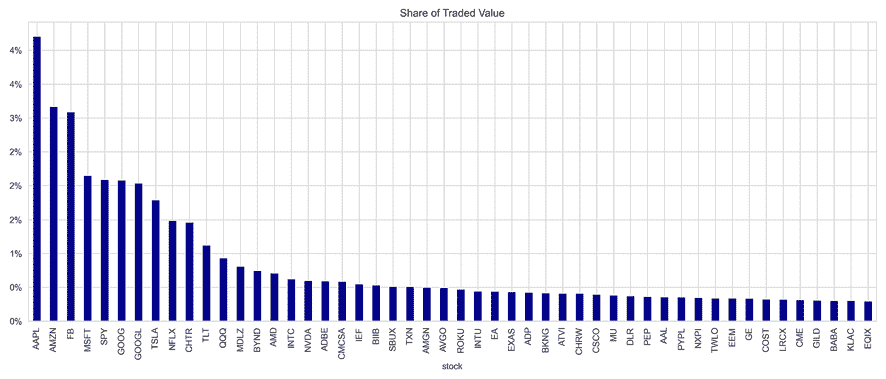

图 2.1：50 只最活跃证券的交易价值份额

### 如何重建所有交易和订单簿

解析后的消息允许我们重建给定日期的订单流。`'R'`消息类型包含了给定日期内所有交易的清单，包括**首次公开发行**（**IPO**）和交易限制的信息。

在一天中，新订单被添加，而执行和取消的订单则从订单簿中移除。对于引用前日期放置的订单的消息的正确核算将需要跟踪多天的订单簿。

`get_messages()`函数说明了如何收集影响交易的单只股票的订单（有关每条消息的详细信息，请参阅 ITCH 规范）。代码略有简化；有关更多详细信息，请参阅笔记本`rebuild_nasdaq_order_book.ipynb`：

```py
def get_messages(date, stock=stock):
    """Collect trading messages for given stock"""
    with pd.HDFStore(itch_store) as store:
        stock_locate = store.select('R', where='stock = 
                                     stock').stock_locate.iloc[0]
        target = 'stock_locate = stock_locate'
        data = {}
        # relevant message types
        messages = ['A', 'F', 'E', 'C', 'X', 'D', 'U', 'P', 'Q']
        for m in messages:
            data[m] = store.select(m,  
              where=target).drop('stock_locate', axis=1).assign(type=m)
    order_cols = ['order_reference_number', 'buy_sell_indicator', 
                  'shares', 'price']
    orders = pd.concat([data['A'], data['F']], sort=False,  
                        ignore_index=True).loc[:, order_cols]
    for m in messages[2: -3]:
        data[m] = data[m].merge(orders, how='left')
    data['U'] = data['U'].merge(orders, how='left',
                                right_on='order_reference_number',
                                left_on='original_order_reference_number',
                                suffixes=['', '_replaced'])
    data['Q'].rename(columns={'cross_price': 'price'}, inplace=True)
    data['X']['shares'] = data['X']['cancelled_shares']
    data['X'] = data['X'].dropna(subset=['price'])
    data = pd.concat([data[m] for m in messages], ignore_index=True, 
                      sort=False) 
```

重建成功交易 - 即已执行而非取消的订单 - 与与交易相关的消息类型`C`、`E`、`P`和`Q`相对简单。

```py
def get_trades(m):
    """Combine C, E, P and Q messages into trading records"""
    trade_dict = {'executed_shares': 'shares', 'execution_price': 'price'}
    cols = ['timestamp', 'executed_shares']
    trades = pd.concat([m.loc[m.type == 'E',
                              cols + ['price']].rename(columns=trade_dict),
                        m.loc[m.type == 'C',
                              cols + ['execution_price']]
                        .rename(columns=trade_dict),
                        m.loc[m.type == 'P', ['timestamp', 'price',
                                              'shares']],
                        m.loc[m.type == 'Q',
                              ['timestamp', 'price', 'shares']]
                        .assign(cross=1), ],
                       sort=False).dropna(subset=['price']).fillna(0)
    return trades.set_index('timestamp').sort_index().astype(int) 
```

订单簿跟踪限价订单，并且买单和卖单的各种价格水平构成了订单簿的深度。重建给定深度级别的订单簿需要以下步骤：

`add_orders()`函数按升序累积卖单，按降序累积买单，直到达到所需的深度级别的给定时间戳：

```py
def add_orders(orders, buysell, nlevels):
    new_order = []
    items = sorted(orders.copy().items())
    if buysell == 1:
        items = reversed(items)  
    for i, (p, s) in enumerate(items, 1):
        new_order.append((p, s))
        if i == nlevels:
            break
    return orders, new_order 
```

我们遍历所有 ITCH 消息，并根据规范处理订单及其替换所需的订单：

```py
for message in messages.itertuples():
    i = message[0]
    if np.isnan(message.buy_sell_indicator):
        continue
    message_counter.update(message.type)
    buysell = message.buy_sell_indicator
    price, shares = None, None
    if message.type in ['A', 'F', 'U']:
        price, shares = int(message.price), int(message.shares)
        current_orders[buysell].update({price: shares})
        current_orders[buysell], new_order = 
          add_orders(current_orders[buysell], buysell, nlevels)
        order_book[buysell][message.timestamp] = new_order
    if message.type in ['E', 'C', 'X', 'D', 'U']:
        if message.type == 'U':
            if not np.isnan(message.shares_replaced):
                price = int(message.price_replaced)
                shares = -int(message.shares_replaced)
        else:
            if not np.isnan(message.price):
                price = int(message.price)
                shares = -int(message.shares)
        if price is not None:
            current_orders[buysell].update({price: shares})
            if current_orders[buysell][price] <= 0:
                current_orders[buysell].pop(price)
            current_orders[buysell], new_order = 
              add_orders(current_orders[buysell], buysell, nlevels)
            order_book[buysell][message.timestamp] = new_order 
```

*图 2.2*突显了任意给定时间点的流动性深度，使用不同的强度来可视化不同价格水平上的订单数量。左侧面板显示了限价订单价格的分布是如何向更高价格的买单倾斜的。

右侧面板绘制了整个交易日限价订单和价格的演变情况：深色线跟踪了市场小时内执行交易的价格，而红色和蓝色点表示每分钟基础上的单个限价订单（有关详细信息，请参阅笔记本）：

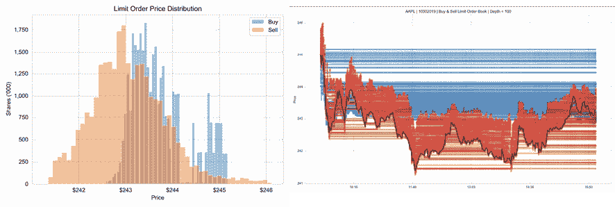

图 2.2：根据订单簿的 AAPL 市场流动性

## 从刻度到条形图 - 如何规范市场数据

交易数据按纳秒索引，以不规则间隔到达，且非常嘈杂。例如，**买卖盘弹跳**会导致价格在买入和卖出价格之间震荡，当交易启动在买入和卖出市价订单之间交替时。为了改善噪声-信号比和价格序列的统计特性，我们需要通过聚合交易活动对刻度数据进行重新采样和规范化。

我们通常收集聚合周期内的**开盘价（第一）、最高价、最低价和收盘价（最后）以及成交量**（联合简称为**OHLCV**），以及与数据相关的**成交量加权平均价格**（**VWAP**）和时间戳。

有关附加详细信息，请参阅 GitHub 上本章节文件夹中的`normalize_tick_data.ipynb`笔记本。

### 原材料 - 刻度条

以下代码生成了 AAPL 的原始刻度价格和成交量数据的图表：

```py
stock, date = 'AAPL', '20191030'
title = '{} | {}'.format(stock, pd.to_datetime(date).date()
with pd.HDFStore(itch_store) as store:
    sys_events = store['S'].set_index('event_code') # system events
    sys_events.timestamp = sys_events.timestamp.add(pd.to_datetime(date)).dt.time
    market_open = sys_events.loc['Q', 'timestamp'] 
    market_close = sys_events.loc['M', 'timestamp']
with pd.HDFStore(stock_store) as store:
    trades = store['{}/trades'.format(stock)].reset_index()
trades = trades[trades.cross == 0] # excluding data from open/close crossings
trades.price = trades.price.mul(1e-4) # format price
trades = trades[trades.cross == 0]    # exclude crossing trades
trades = trades.between_time(market_open, market_close) # market hours only
tick_bars = trades.set_index('timestamp')
tick_bars.index = tick_bars.index.time
tick_bars.price.plot(figsize=(10, 5), title=title), lw=1) 
```

*图 2.3*显示了生成的图：

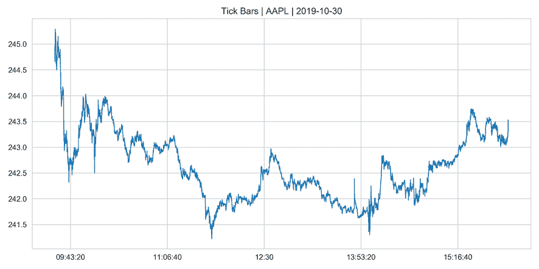

图 2.3：刻度条

刻度回报远非正态分布，这表明`scipy.stats.normaltest`的 p 值很低：

```py
from scipy.stats import normaltest
normaltest(tick_bars.price.pct_change().dropna())
NormaltestResult(statistic=62408.76562431228, pvalue=0.0) 
```

### 常规去噪 - 时间条

时间条涉及按周期进行交易聚合。以下代码获取时间条的数据：

```py
def get_bar_stats(agg_trades):
    vwap = agg_trades.apply(lambda x: np.average(x.price, 
           weights=x.shares)).to_frame('vwap')
    ohlc = agg_trades.price.ohlc()
    vol = agg_trades.shares.sum().to_frame('vol')
    txn = agg_trades.shares.size().to_frame('txn')
    return pd.concat([ohlc, vwap, vol, txn], axis=1)
resampled = trades.groupby(pd.Grouper(freq='1Min'))
time_bars = get_bar_stats(resampled) 
```

我们可以将结果显示为价格-成交量图表：

```py
def price_volume(df, price='vwap', vol='vol', suptitle=title, fname=None):
    fig, axes = plt.subplots(nrows=2, sharex=True, figsize=(15, 8))
    axes[0].plot(df.index, df[price])
    axes[1].bar(df.index, df[vol], width=1 / (len(df.index)), 
                color='r')
    xfmt = mpl.dates.DateFormatter('%H:%M')
    axes[1].xaxis.set_major_locator(mpl.dates.HourLocator(interval=3))
    axes[1].xaxis.set_major_formatter(xfmt)
    axes[1].get_xaxis().set_tick_params(which='major', pad=25)
    axes[0].set_title('Price', fontsize=14)
    axes[1].set_title('Volume', fontsize=14)
    fig.autofmt_xdate()
    fig.suptitle(suptitle)
    fig.tight_layout()
    plt.subplots_adjust(top=0.9)
price_volume(time_bars) 
```

上述代码产生了*图 2.4*：

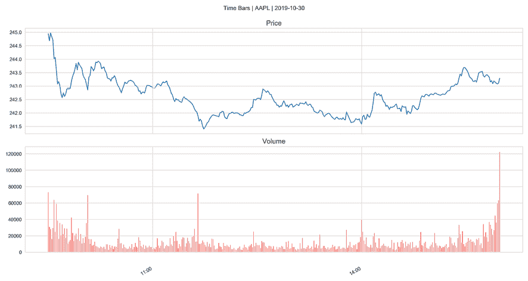

图 2.4：时间柱

或者，我们可以使用 Bokeh 绘图库将数据表示为蜡烛图：

```py
resampled = trades.groupby(pd.Grouper(freq='5Min')) # 5 Min bars for better print
df = get_bar_stats(resampled)
increase = df.close > df.open
decrease = df.open > df.close
w = 2.5 * 60 * 1000 # 2.5 min in ms
WIDGETS = "pan, wheel_zoom, box_zoom, reset, save"
p = figure(x_axis_type='datetime', tools=WIDGETS, plot_width=1500, 
          title = "AAPL Candlestick")
p.xaxis.major_label_orientation = pi/4
p.grid.grid_line_alpha=0.4
p.segment(df.index, df.high, df.index, df.low, color="black")
p.vbar(df.index[increase], w, df.open[increase], df.close[increase], 
       fill_color="#D5E1DD", line_color="black")
p.vbar(df.index[decrease], w, df.open[decrease], df.close[decrease], 
       fill_color="#F2583E", line_color="black")
show(p) 
```

这会产生*图 2.5*中的图表：

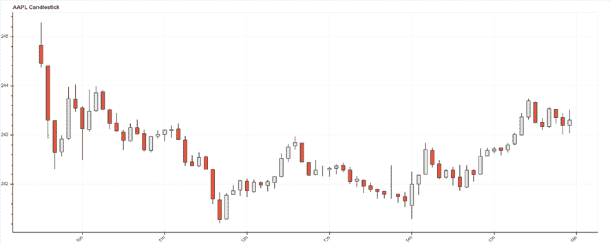

图 2.5：Bokeh 蜡烛图

### 考虑订单碎片化 – 交易量柱

时间柱平滑了原始 tick 数据中包含的一些噪音，但可能未能解决订单碎片化的问题。执行重点的算法交易可能会在给定期间内匹配**成交量加权平均价格** (**VWAP**)。这将将单个订单拆分为多个交易，并根据历史模式下订单。时间柱将以不同的方式处理相同的订单，即使市场中没有新的信息到来。

交易量柱提供了一种通过按交易量聚合交易数据的替代方法。我们可以按如下方式完成：

```py
min_per_trading_day = 60 * 7.5
trades_per_min = trades.shares.sum() / min_per_trading_day
trades['cumul_vol'] = trades.shares.cumsum()
df = trades.reset_index()
by_vol = (df.groupby(df.cumul_vol.
                     div(trades_per_min)
                     .round().astype(int)))
vol_bars = pd.concat([by_vol.timestamp.last().to_frame('timestamp'),
                      get_bar_stats(by_vol)], axis=1)
price_volume(vol_bars.set_index('timestamp')) 
```

对于上述代码，我们得到了*图 2.6*的图表：

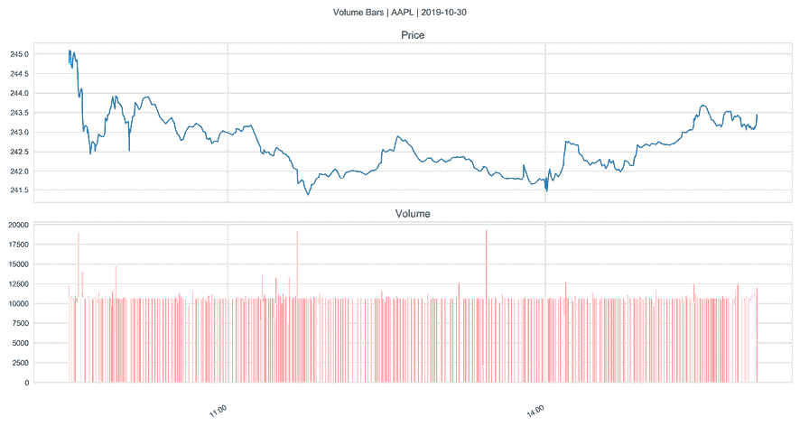

图 2.6：交易量柱

### 考虑价格变化 – 美元柱

当资产价格发生显着变化或股票分拆后，给定数量的股票价值会发生变化。交易量柱无法正确反映这一点，并且可能会妨碍对反映此类变化的不同期间的交易行为进行比较。在这些情况下，应调整交易量柱方法以利用股票和价格的乘积产生美元柱。

下面的代码显示了美元柱的计算：

```py
value_per_min = trades.shares.mul(trades.price).sum()/(60*7.5) # min per trading day
trades['cumul_val'] = trades.shares.mul(trades.price).cumsum()
df = trades.reset_index()
by_value = df.groupby(df.cumul_val.div(value_per_min).round().astype(int))
dollar_bars = pd.concat([by_value.timestamp.last().to_frame('timestamp'), get_bar_stats(by_value)], axis=1)
price_volume(dollar_bars.set_index('timestamp'), 
             suptitle=f'Dollar Bars | {stock} | {pd.to_datetime(date).date()}') 
```

由于价格在整个交易日都相当稳定，该图与交易量柱非常相似：

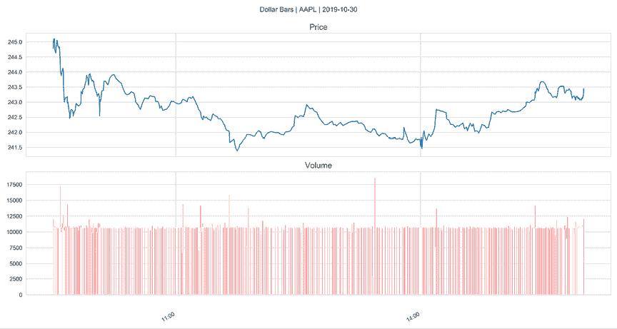

图 2.7：美元柱

## AlgoSeek 分钟柱 – 股票报价和交易数据

AlgoSeek 提供了以前仅供机构投资者使用的历史日内交易数据。AlgoSeek 股票柱以用户友好的格式提供了非常详细的日内报价和交易数据，旨在使设计和回测日内 ML 驱动策略变得容易。正如我们将看到的，该数据不仅包括 OHLCV 信息，还包括盘口报价价差和上下价格变动的次数等其他信息。

AlgoSeek 提供了 2013-2017 年纳斯达克 100 只股票分钟柱数据样本，以供演示，并将提供此数据的子集给本书读者。

在本节中，我们将介绍可用的交易和报价信息，并展示如何处理原始数据。在后面的章节中，我们将演示如何使用这些数据进行 ML 驱动的日内策略。

### 从综合信息流到分钟柱

AlgoSeek 分钟柱基于由 **证券信息处理器** (**SIP**) 提供的数据，该处理器管理本节开头提到的综合信息流。您可以在 [`www.algoseek.com/samples/`](https://www.algoseek.com/samples/) 上查看文档。

SIP（股票信息处理器）汇总了来自每个交易所的最佳买价和卖价报价，以及相应的交易和价格。根据法律规定，交易所在将报价和交易发送到直接数据源之前，不得将其发送到 SIP。鉴于美国股票交易的碎片化特性，综合数据源提供了市场当前状态的便捷快照。

更重要的是，SIP 作为监管机构根据 Reg NMS 确定**全国最佳买卖报价**（**NBBO**）的基准。OHLC K 线报价价格基于 NBBO，每个买入或卖出报价价格都指的是 NBBO 价格。

每个交易所都会发布其最优报价和该价格可获得的股票数量。当已发布的报价改善 NBBO 时，NBBO 就会变化。买入/卖出报价会持续存在，直到由于交易、价格改进或取消最新的买入或卖出而发生变化。虽然历史 OHLC（开盘、最高、最低、收盘）K 线通常基于该时间段内的交易，但 NBBO 买卖报价可能会从前一个时间段一直延续到发生新的 NBBO 事件。

AlgoSeek K 线覆盖了整个交易日，从第一个交易所开盘到最后一个交易所收盘。在正常交易时间之外的 K 线通常表现出有限的活动。交易时间（东部时间）如下：

+   盘前市场：大约从 04:00:00（根据交易所而异）到 09:29:59

+   市场交易时间：09:30:00 到 16:00:00

+   延长交易时间：16:00:01 到 20:00:00

### 报价和交易数据字段

分钟级 K 线数据包含多达 54 个字段。对于 K 线的**开盘价**、**最高价**、**最低价**和**收盘价**元素，有八个字段，即：

+   K 线的时间戳及相应的交易

+   主要买卖报价和相关交易的价格和数量

还有 14 个带有**成交量信息**的数据点：

+   股票数量及相应的交易

+   在买入价以下、买入价和中间价之间、中间价、中间价和卖出价之间以及在卖出价以上的交易量，以及交叉交易量

+   与前一个价格运动方向不同的价格上涨或下跌的交易量，以及价格未发生变化时的交易量

AlgoSeek 数据还包含报告给 FINRA 并由经纪商、暗池或场外交易所内部处理的股票数量。这些交易代表着隐藏或直到事后才可公开获取的成交量。

最后，数据包括**成交量加权平均价格**（**VWAP**）和该时间段的最小和最大买卖价差。

### 如何处理 AlgoSeek 的日内数据

在本节中，我们将处理 AlgoSeek 的示例数据。GitHub 上的 `data` 目录包含了如何从 AlgoSeek 下载数据的说明。

分钟级数据有四个版本：带有和不带有报价信息，以及带有或不带有 FINRA 报告的成交量。每天有一个压缩文件夹，其中包含一个 CSV 文件。

下面的代码示例将交易分钟级数据提取到每日的 `.parquet` 文件中：

```py
directories = [Path(d) for d in ['1min_trades']]
target = directory / 'parquet'
for zipped_file in directory.glob('*/**/*.zip'):
    fname = zipped_file.stem
    print('\t', fname)
    zf = ZipFile(zipped_file)
    files = zf.namelist()
    data = (pd.concat([pd.read_csv(zf.open(f),
                                   parse_dates=[['Date',
                                                 'TimeBarStart']])
                       for f in files],
                      ignore_index=True)
            .rename(columns=lambda x: x.lower())
            .rename(columns={'date_timebarstart': 'date_time'})
            .set_index(['ticker', 'date_time']))
    data.to_parquet(target / (fname + '.parquet')) 
```

我们可以将 `parquet` 文件合并为单个 HDF5 存储，产生 5380 万条记录，占用 3.2 GB 的内存，涵盖了 5 年和 100 支股票：

```py
path = Path('1min_trades/parquet')
df = pd.concat([pd.read_parquet(f) for f in path.glob('*.parquet')]).dropna(how='all', axis=1)
df.columns = ['open', 'high', 'low', 'close', 'trades', 'volume', 'vwap']
df.to_hdf('data.h5', '1min_trades')
print(df.info(null_counts=True))
MultiIndex: 53864194 entries, (AAL, 2014-12-22 07:05:00) to (YHOO, 2017-06-16 19:59:00)
Data columns (total 7 columns):
open      53864194 non-null float64
high      53864194 non-null float64
Low       53864194 non-null float64
close     53864194 non-null float64
trades    53864194 non-null int64
volume    53864194 non-null int64
vwap      53852029 non-null float64 
```

我们可以使用 `plotly` 快速创建一个交互式蜡烛图，以查看 AAPL 数据的一天在浏览器中的显示：

```py
idx = pd.IndexSlice
with pd.HDFStore('data.h5') as store:
    print(store.info())
    df = (store['1min_trades']
          .loc[idx['AAPL', '2017-12-29'], :]
          .reset_index())
fig = go.Figure(data=go.Ohlc(x=df.date_time,
                             open=df.open,
                             high=df.high,
                             low=df.low,
                             close=df.close)) 
```

*图 2.8* 显示了生成的静态图像：

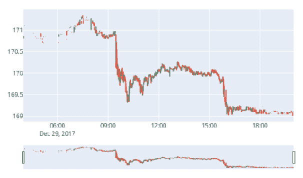

图 2.8：Plotly 蜡烛图

AlgoSeek 还提供调整因子，以纠正股票拆分、股息和其他公司行动的定价和成交量。

# API 访问市场数据

有几种选项可供您使用 Python 通过 API 访问市场数据。我们首先介绍了内置于 pandas 库和`yfinance`工具中的一些来源，该工具便于从 Yahoo! Finance 下载每日市场数据和最近的基本数据。

然后，我们将简要介绍交易平台 Quantopian、数据提供者 Quandl 以及本书后续将使用的 Zipline 回测库，以及列出访问各种类型市场数据的几个其他选项。GitHub 上的 `data_providers` 目录包含了几个笔记本，说明了这些选项的使用情况。

## 使用 pandas 远程数据访问

pandas 库通过相关的 `pandas-datareader` 库实现通过 `read_html` 函数访问网站上显示的数据以及访问各种数据提供者的 API 端点。

### 读取 HTML 表格

下载一个或多个 HTML 表格的内容（例如来自 Wikipedia 的标准普尔 500 指数成分）的过程如下：

```py
sp_url = 'https://en.wikipedia.org/wiki/List_of_S%26P_500_companies'
sp = pd.read_html(sp_url, header=0)[0] # returns a list for each table
sp.info()
RangeIndex: 505 entries, 0 to 504
Data columns (total 9 columns):
Symbol                    505 non-null object
Security                  505 non-null object
SEC filings                505 non-null object
GICS Sector               505 non-null object
GICS Sub Industry         505 non-null object
Headquarters Location     505 non-null object
Date first added           408 non-null object
CIK                       505 non-null int64
Founded                   234 non-null object 
```

### 用于市场数据的 pandas-datareader

pandas 用于直接访问数据提供者的 API，但此功能已移至 `pandas-datareader` 库（请参阅 `README` 获取文档链接）。

API 的稳定性因提供者政策而异，且不断变化。请参阅文档以获取最新信息。截至 2019 年 12 月，版本 0.8.1，以下来源可用：

| Source | 范围 | 评论 |
| --- | --- | --- |
| Tiingo | 提供股票、共同基金和 ETF 的历史收盘价。 | 免费注册获取 API 密钥。免费账户只能访问 500 个符号。 |
| Investor Exchange (IEX) | 如果在 IEX 上交易，则提供历史股价。 | 需要从 IEX Cloud 控制台获取 API 密钥。 |
| Alpha Vantage | 每日、每周和每月频率的历史股票数据，20+ 年，以及过去 3-5 天的分钟级数据。它还具有外汇和行业绩效数据。 |  |
| Quandl | 免费数据来源如它们网站上所列。 |  |
| Fama/French | 风险因子投资组合回报。 | 用于 *第七章*，*线性模型 - 从风险因素到回报预测*。 |
| TSP 基金数据 | 共同基金价格。 |  |
| 纳斯达克 | 交易标的的最新元数据。 |  |
| Stooq 指数数据 | 由于许可问题，某些股票指数在其他地方不可用。 |  |
| MOEX | 莫斯科交易所历史数据。 |  |

数据的访问和检索遵循所有来源的类似 API，如雅虎财经所示：

```py
import pandas_datareader.data as web
from datetime import datetime
start = '2014'              # accepts strings
end = datetime(2017, 5, 24) # or datetime objects
yahoo= web.DataReader('FB', 'yahoo', start=start, end=end)
yahoo.info()
DatetimeIndex: 856 entries, 2014-01-02 to 2017-05-25
Data columns (total 6 columns):
High         856 non-null float64
Low          856 non-null float64
Open         856 non-null float64
Close        856 non-null float64
Volume       856 non-null int64
Adj Close    856 non-null float64
dtypes: float64(5), int64(1) 
```

## `yfinance` – 从雅虎财经获取数据

`yfinance` 旨在提供从雅虎财经下载历史市场数据的可靠快速方法。该库最初命名为 `fix-yahoo-finance`。使用该库非常简单；笔记本 `yfinance_demo` 展示了该库的功能。

### 如何下载每日和分钟价格

`Ticker` 对象允许从雅虎网站抓取的各种数据点的下载：

```py
import yfinance as yf
symbol = 'MSFT'
ticker = yf.Ticker(symbol) 
```

`.history` 方法获取各种期间的历史价格，从一天到可用的最大值，并以不同频率，而分钟内仅适用于最近几天。要下载调整后的 OHLCV 数据以及公司行动，请使用：

```py
data = ticker.history(period='5d',
                      interval='1m',
                      actions=True,
                      auto_adjust=True)
data.info()
DatetimeIndex: 1747 entries, 2019-11-22 09:30:00-05:00 to 2019-11-29 13:00:00-05:00
Data columns (total 7 columns):
Open            1747 non-null float64
High            1747 non-null float64
Low             1747 non-null float64
Close           1747 non-null float64
Volume          1747 non-null int64
Dividends       1747 non-null int64
Stock Splits    1747 non-null int64 
```

该笔记本还说明了如何访问季度和年度财务报表、可持续性评分、分析师建议和即将公布的收益日期。

### 如何下载期权链和价格

`yfinance` 还提供了访问期权到期日期和价格以及其他各种合约信息的功能。使用前面示例中的 `ticker` 实例，我们可以使用以下方式获取到期日期：

```py
ticker.options
('2019-12-05',  '2019-12-12',  '2019-12-19',..) 
```

对于任何这些日期，我们可以访问期权链，并查看各种看涨/看跌合约的详情，如下所示：

```py
options = ticker.option_chain('2019-12-05')
options.calls.info()
Data columns (total 14 columns):
contractSymbol       35 non-null object
lastTradeDate        35 non-null datetime64[ns]
strike               35 non-null float64
lastPrice            35 non-null float64
bid                  35 non-null float64
ask                  35 non-null float64
change               35 non-null float64
percentChange        35 non-null float64
volume               34 non-null float64
openInterest         35 non-null int64
impliedVolatility    35 non-null float64
inTheMoney           35 non-null bool
contractSize         35 non-null object
currency             35 non-null object 
```

该库还允许使用代理服务器以防止速率限制，并便于批量下载多个股票。笔记本演示了这些功能的使用。

## Quantopian

Quantopian 是一家提供研究平台以集体创建交易算法的投资公司。注册是免费的，会员可以使用各种数据源研究交易想法。它还提供了一个环境，可以使用历史数据对算法进行回测，以及使用实时数据对其进行样本外的前向测试。它为表现优秀的算法授予投资分配，其作者有权获得 10%（写作时）的利润份额。

Quantopian 研究平台由用于 alpha 因子研究和绩效分析的 Jupyter Notebook 环境组成。还有一个用于编写算法策略和使用从 2002 年以来带有分钟频率的历史数据回测结果的 **交互式开发环境** (**IDE**)。

用户还可以使用实时数据模拟算法，这被称为*模拟交易*。Quantopian 提供各种市场数据集，包括美国股票和期货价格和交易量数据，以及美国股票公司基本面数据，还整合了众多备选数据集。

我们将在*第四章*，*金融特征工程——如何研究 Alpha 因子*中更详细地探讨 Quantopian 平台，并在整本书中依赖其功能，所以请随时开设一个账户。（有关更多详细信息，请参阅 GitHub 存储库。）

## Zipline

Zipline 是算法交易库，为 Quantopian 回测和实时交易平台提供支持。它也可以离线使用，用于开发策略，使用有限数量的免费数据包进行测试，然后将结果传输到在线 Quantopian 平台进行模拟和实时交易。

Zipline 需要一个定制环境——查看笔记本`zipline_data_demo.ipynb`开头的说明。以下代码说明了 Zipline 如何允许我们访问一系列公司的每日股票数据。您可以在 Jupyter Notebook 中使用同名的魔术函数运行 Zipline 脚本。

首先，您需要使用所需的安全符号初始化上下文。我们还将使用一个计数器变量。然后，Zipline 调用`handle_data`，我们使用`data.history()`方法回溯一个时间段，并将上一天的数据附加到一个`.csv`文件中：

```py
%load_ext zipline
%%zipline --start 2010-1-1 --end 2018-1-1 --data-frequency daily
from zipline.api import order_target, record, symbol
def initialize(context):
    context.i = 0
    context.assets = [symbol('FB'), symbol('GOOG'), symbol('AMZN')]

def handle_data(context, data):
    df = data.history(context.assets, fields=['price', 'volume'], 
                      bar_count=1, frequency="1d")
    df = df.to_frame().reset_index()

    if context.i == 0:
        df.columns = ['date', 'asset', 'price', 'volume']
        df.to_csv('stock_data.csv', index=False)
    else:
        df.to_csv('stock_data.csv', index=False, mode='a', header=None)
    context.i += 1
df = pd.read_csv('stock_data.csv')
df.date = pd.to_datetime(df.date)
df.set_index('date').groupby('asset').price.plot(lw=2, legend=True, 
       figsize=(14, 6)); 
```

我们得到了前述代码的以下图：

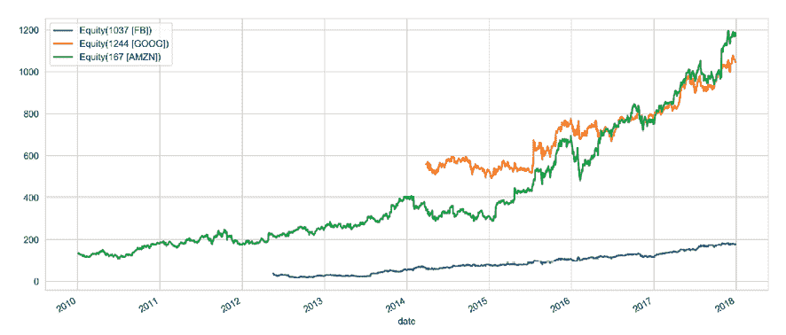

图 2.9：Zipline 数据访问

我们将在接下来的章节中更详细地探讨 Zipline 的功能，特别是在线 Quantopian 平台。

## Quandl

Quandl 提供广泛的数据源，包括免费数据和订阅数据，使用 Python API。注册并获取免费 API 密钥，可每天进行 50 多次调用。Quandl 数据涵盖除股票以外的多种资产类别，包括外汇、固定收益、指数、期货和期权以及大宗商品。

API 使用简单，文档完善，灵活，除了单个系列下载外，还有许多其他方法，例如，包括批量下载或元数据搜索。

下面的调用从 1986 年开始获取美国能源部的报价的油价：

```py
import quandl
oil = quandl.get('EIA/PET_RWTC_D').squeeze()
oil.plot(lw=2, title='WTI Crude Oil Price') 
```

我们从前面的代码中得到了这个图：

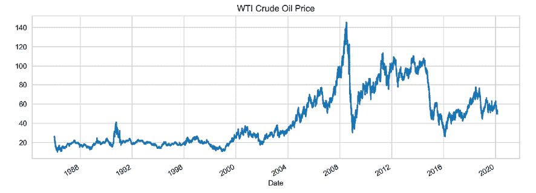

图 2.10：Quandl 油价示例

## 其他市场数据提供商

各种提供商提供各种资产类别的市场数据。相关类别的示例包括：

+   交易所越来越多地从越来越广泛的数据服务中获得收入，通常使用订阅方式。

+   彭博社和汤姆森路透一直是领先的数据聚合商，在 285 亿美元的金融数据市场中占据了超过 55％的份额。较小的竞争对手，如 FactSet，正在增长或出现，如 money.net，Quandl，Trading Economics 和 Barchart。

+   专业数据提供商比比皆是。一个例子是 LOBSTER，它实时聚合纳斯达克订单簿数据。

+   免费数据提供商包括 Alpha Vantage，该公司提供实时股票、外汇和加密货币市场数据的 Python API，以及技术指标。

+   提供数据访问的众包投资公司包括 Quantopian 以及于 2018 年 3 月推出的 Alpha Trading Labs，后者提供 HFT 基础设施和数据。

# 如何处理基础数据

基础数据涉及确定证券价值的经济驱动因素。数据的性质取决于资产类别：

+   对于股票和公司信用，它包括公司财务状况，以及行业和整体经济数据。

+   对于政府债券，它包括国际宏观数据和外汇。

+   对于大宗商品，它包括特定资产的供需决定因素，例如作物的天气数据。

我们将专注于美国的股票基础数据，因为数据更易于获取。全球有超过 13,000 家公开公司，每年生成超过 200 万页的年度报告和超过 30,000 小时的盈利电话。在算法交易中，基础数据和从这些数据中衍生的特征可以直接用于产生交易信号，例如，作为价值指标，并且是预测模型的基本输入，包括 ML 模型。

## 财务报表数据

美国证券交易委员会（SEC）要求美国发行人，即上市公司和证券，包括共同基金，在提交三份季度财务报表（Form 10-Q）和一份年度报告（Form 10-K）之外，还需遵守各种其他监管文件要求。

自 1990 年代初以来，SEC 通过其**Electronic Data Gathering, Analysis, and Retrieval**（**EDGAR**）系统提供了这些文件。它们构成了对股票和其他证券进行基本分析的主要数据来源，例如企业信用，其价值取决于发行人的业务前景和财务状况。

### 自动化处理 - XBRL

自 SEC 推出**XBRL**以来，对监管文件的自动化分析变得更加容易。这是一种免费的、开放的、全球标准的业务报告的电子表示和交换。XBRL 基于 XML；它依赖于定义报告元素含义的分类法，并映射到在报告的电子版本中突出显示相应信息的标签。其中一种分类法代表了美国的**通用会计准则**（**GAAP**）。

SEC 于 2005 年推出了自愿提交 XBRL 文件，以应对会计丑闻，随后于 2009 年要求所有提交者采用这种格式，并继续将强制性覆盖范围扩展到其他监管申报。SEC 维护了一个网站，列出了塑造不同申报内容的当前术语表，并可用于提取特定项目。

以下数据集以扁平化数据格式提供从提交给委员会的 EX-101 附件中提取的信息，以帮助用户消费数据进行分析。数据反映了从 XBRL 标记的财务报表中选择的信息。目前包括来自季度和年度财务报表的数字数据，以及某些附加字段，例如，**标准工业分类** (**SIC**)。

有几种途径可以跟踪和访问报告给美国证监会（SEC）的基本数据：

+   作为 EDGAR **公开传播服务** (**PDS**)的一部分，可按费用获取接受申报的电子数据流。

+   SEC 每 10 分钟更新 RSS 订阅源，其中列出了结构化披露提交。

+   有用于通过 FTP 检索所有申报的公共索引文件，以进行自动处理。

+   财务报表（及注释）数据集包含了所有财务报表和附注的解析 XBRL 数据。

SEC 还发布包含通过 SEC.gov 对 EDGAR 申报的互联网搜索流量的日志文件，尽管有 6 个月的延迟。

### 构建基本数据时间序列

财务报表和注释数据集中的数据范围包括从主要财务报表（资产负债表、损益表、现金流量表、权益变动表和综合收益表）和这些报表的附注中提取的数字数据。可用数据早在 2009 年就已经存在。

#### 提取财务报表和注释数据集

以下代码下载并提取给定季度范围内**财务报表和注释** (**FSN**) 数据集中包含的所有历史申报（有关更多详细信息，请参阅`edgar_xbrl.ipynb`）：

```py
SEC_URL = 'https://www.sec.gov/files/dera/data/financial-statement-and-notes-data-sets/'
first_year, this_year, this_quarter = 2014, 2018, 3
past_years = range(2014, this_year)
filing_periods = [(y, q) for y in past_years for q in range(1, 5)]
filing_periods.extend([(this_year, q) for q in range(1, this_quarter + 
                                                    1)])
for i, (yr, qtr) in enumerate(filing_periods, 1):
    filing = f'{yr}q{qtr}_notes.zip'
    path = data_path / f'{yr}_{qtr}' / 'source'
    response = requests.get(SEC_URL + filing).content
    with ZipFile(BytesIO(response)) as zip_file:
        for file in zip_file.namelist():
            local_file = path / file
            with local_file.open('wb') as output:
                for line in zip_file.open(file).readlines():
                    output.write(line) 
```

数据相当庞大，为了比原始文本文件允许的更快访问，最好将文本文件转换为二进制、Parquet 列格式（请参考本章后面关于使用 pandas 进行高效数据存储的部分，以了解与 pandas DataFrames 兼容的各种数据存储选项的性能比较）：

```py
for f in data_path.glob('**/*.tsv'):
    file_name = f.stem  + '.parquet'
    path = Path(f.parents[1]) / 'parquet'
    df = pd.read_csv(f, sep='\t', encoding='latin1', low_memory=False)
    df.to_parquet(path / file_name) 
```

对于每个季度，FSN 数据被组织成八个文件集，其中包含有关提交、数字、术语标签、展示等的信息。每个数据集由行和字段组成，并以制表符分隔的文本文件形式提供：

| 文件 | 数据集 | 描述 |
| --- | --- | --- |
| `SUB` | 提交 | 标识每个 XBRL 提交的公司、表单、日期等 |
| `TAG` | 标签 | 定义和解释每个术语标签 |
| `DIM` | 维度 | 为数字和纯文本数据添加细节 |
| `NUM` | 数值 | 每个文件中不同数据点的一行 |
| `TXT` | 纯文本 | 包含所有非数值 XBRL 字段 |
| `REN` | 渲染 | 在 SEC 网站上渲染的信息 |
| `PRE` | 展示 | 主要报表中标签和数字展示的详细信息 |
| `CAL` | 计算 | 展示标签之间的算术关系 |

#### 检索所有季度苹果申报文件

提交的数据集包含检索申报所需的唯一标识符：**中心索引码**（**CIK**）和**访问编号**（**adsh**）。以下显示了关于苹果 2018Q1 10-Q 申报的一些信息：

```py
apple = sub[sub.name == 'APPLE INC'].T.dropna().squeeze()
key_cols = ['name', 'adsh', 'cik', 'name', 'sic', 'countryba',  
            'stprba', 'cityba', 'zipba', 'bas1', 'form', 'period', 
            'fy', 'fp', 'filed']
apple.loc[key_cols]
name                    APPLE INC
adsh                    0000320193-18-000070
cik                     320193
name                    APPLE INC
sic                     3571
countryba               US
stprba                  CA
cityba                  CUPERTINO
zipba                   95014
bas1                    ONE APPLE PARK WAY
form                    10-Q
period                  20180331
fy                      2018
fp                      Q2
filed                   20180502 
```

使用 CIK，我们可以识别出苹果可用的所有历史季度申报，并将此信息结合起来获取 26 份 10-Q 表单和 9 份年度 10-K 表单：

```py
aapl_subs = pd.DataFrame()
for sub in data_path.glob('**/sub.parquet'):
    sub = pd.read_parquet(sub)
    aapl_sub = sub[(sub.cik.astype(int) == apple.cik) & 
                   (sub.form.isin(['10-Q', '10-K']))]
    aapl_subs = pd.concat([aapl_subs, aapl_sub])
aapl_subs.form.value_counts()
10-Q    15
10-K     4 
```

有了每个文件的存取编号，现在我们可以依赖于分类法，从`NUM`和`TXT`文件中选择适当的 XBRL 标签（列在`TAG`文件中），以获取感兴趣的数值或文本/脚注数据点。

首先，让我们提取所有可用的 19 份苹果申报中的数值数据：

```py
aapl_nums = pd.DataFrame()
for num in data_path.glob('**/num.parquet'):
    num = pd.read_parquet(num).drop('dimh', axis=1)
    aapl_num = num[num.adsh.isin(aapl_subs.adsh)]
    aapl_nums = pd.concat([aapl_nums, aapl_num])
aapl_nums.ddate = pd.to_datetime(aapl_nums.ddate, format='%Y%m%d')
aapl_nums.shape
(28281, 16) 
```

#### 构建一个价格/收益时间序列

总共，9 年的申报历史为我们提供了超过 28,000 个数值。我们可以选择一个有用的字段，比如**每股收益**（**EPS**），然后将其与市场数据相结合，计算流行的**市盈率**（**P/E**）估值比。

但是我们需要注意，苹果于 2014 年 6 月 4 日将其股票进行了 7:1 的拆分，并调整分拆前的每股收益值，以使其与价格数据相比可比，这在其 *调整后* 形式中考虑到了这些变化。以下代码块向您展示了如何调整收益数据：

```py
field = 'EarningsPerShareDiluted'
stock_split = 7
split_date = pd.to_datetime('20140604')
# Filter by tag; keep only values measuring 1 quarter
eps = aapl_nums[(aapl_nums.tag == 'EarningsPerShareDiluted')
                & (aapl_nums.qtrs == 1)].drop('tag', axis=1)
# Keep only most recent data point from each filing
eps = eps.groupby('adsh').apply(lambda x: x.nlargest(n=1, columns=['ddate']))
# Adjust earnings prior to stock split downward
eps.loc[eps.ddate < split_date,'value'] = eps.loc[eps.ddate < 
        split_date, 'value'].div(7)
eps = eps[['ddate', 'value']].set_index('ddate').squeeze()
# create trailing 12-months eps from quarterly data
eps = eps.rolling(4, min_periods=4).sum().dropna() 
```

我们可以使用 Quandl 获取自 2009 年以来的苹果股票价格数据：

```py
import pandas_datareader.data as web
symbol = 'AAPL.US'
aapl_stock = web.DataReader(symbol, 'quandl', start=eps.index.min())
aapl_stock = aapl_stock.resample('D').last() # ensure dates align with 
                                               eps data 
```

现在我们有了数据，可以计算整个时期的滚动 12 个月 P/E 比率：

```py
pe = aapl_stock.AdjClose.to_frame('price').join(eps.to_frame('eps'))
pe = pe.fillna(method='ffill').dropna()
pe['P/E Ratio'] = pe.price.div(pe.eps)
axes = pe.plot(subplots=True, figsize=(16,8), legend=False, lw=2); 
```

我们从前面的代码中得到以下图表：

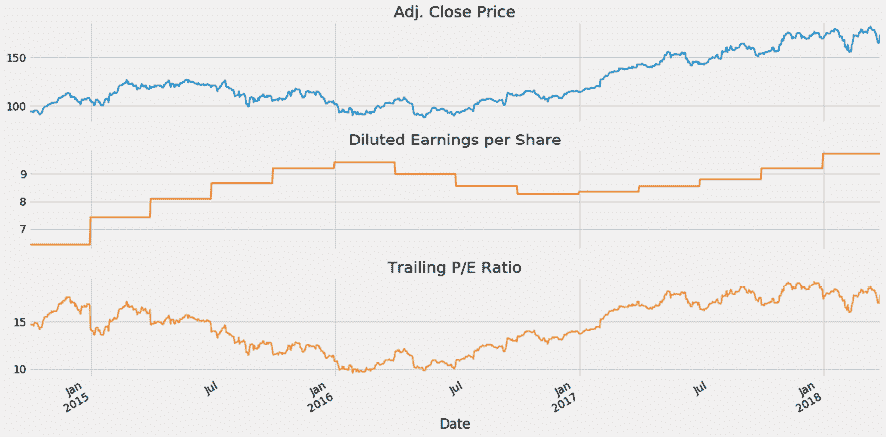

图 2.11：来自 EDGAR 申报的滚动市盈率

## 其他基本数据来源

还有许多其他的基本数据来源。许多可以使用之前介绍的`pandas_datareader`模块访问。还可以直接从某些组织获取额外的数据，例如 IMF、世界银行或世界各地的主要国家统计机构（参见 *GitHub 上的参考资料*）。

### pandas-datareader – 宏观和行业数据

`pandas-datareader` 库根据在前一节关于市场数据介绍的约定提供访问。它涵盖了众多全球基本宏观和行业数据源的 API，包括以下内容：

+   Kenneth French 的数据库：捕获关键风险因素的投资组合的市场数据，如规模、价值和动量因素，按行业细分（参见 *第四章*，*金融特征工程 - 如何研究阿尔法因子*）

+   圣路易斯联邦储备（FRED）：美国经济和金融市场的联邦储备数据

+   世界银行：关于长期、低频经济和社会发展以及人口统计的全球数据库

+   OECD：类似于世界银行数据，针对经济合作与发展组织成员国

+   Enigma：各种数据集，包括替代来源

+   欧洲统计局：欧盟经济、社会和人口数据重点关注

# 使用 pandas 进行高效数据存储

在本书中，我们将使用许多不同的数据集，并且值得比较主要格式的效率和性能。特别是，我们将比较以下内容：

+   **CSV**：逗号分隔的标准平面文本文件格式。

+   **HDF5**：分层数据格式，最初由国家超级计算应用中心开发。对于数字数据，它是一种快速且可扩展的存储格式，可通过 PyTables 库在 pandas 中使用。

+   **Parquet**：Apache Hadoop 生态系统的一部分，二进制、列存储格式，提供高效的数据压缩和编码，由 Cloudera 和 Twitter 开发。它可通过由 pandas 原始作者 Wes McKinney 领导的 pyarrow 库提供，后者是 pandas 的原始作者。

`storage_benchmark.ipynb` 笔记本使用可以配置为包含数字或文本数据，也可以两者兼有的测试 DataFrame 来比较前述库的性能。对于 HDF5 库，我们测试了固定格式和表格式。表格格式允许查询并且可以附加。

以下图表说明了在 100,000 行数据中读取和写入性能，数据包括 1,000 列随机浮点数和 1,000 列随机 10 个字符的字符串，或仅包含 2,000 列浮点数（采用对数刻度）：

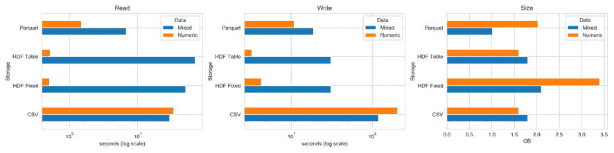

图 2.12：存储基准测试

左侧面板显示，对于纯数字数据，HDF5 格式远远表现最佳，而表格格式在 1.6 GB 的情况下也与 CSV 具有最小的内存占用。`fixed` 格式使用的空间是它的两倍，而 `parquet` 格式使用了 2 GB。

对于数字和文本数据的混合，Parquet 是读写操作的最佳选择。HDF5 在 *读取* 方面相对于 CSV 有优势，但在 *写入* 方面较慢，因为它将文本数据进行了 pickle 化。

该笔记本说明了如何使用 `%%timeit` 单元格魔术配置、测试和收集计时，并同时演示了使用这些存储格式所需的相关 pandas 命令的用法。

# 概要

本章介绍了组成大多数交易策略骨干的市场和基础数据源。您了解到了访问这些数据的各种方式以及如何预处理原始信息，以便您可以开始使用我们即将介绍的 ML 技术提取交易信号。

在下一章， 在继续设计和评估交易策略以及使用机器学习模型之前，我们需要介绍近年来出现的替代数据集，这些数据集对算法交易中机器学习的流行起到了重要推动作用。
