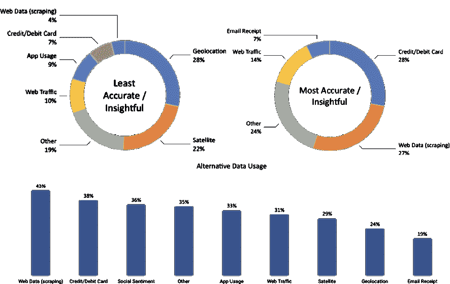
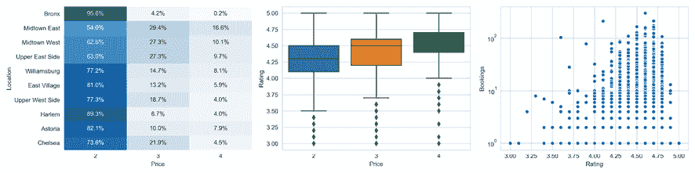

# 第三章：金融领域的替代数据 - 类别和用例

前一章涵盖了与市场和基本数据的工作，这些一直是交易策略的传统驱动因素。在本章中，我们将快进到最近出现的更多种类的更多样化的数据源作为离散和算法策略的燃料。它们的异质性和新颖性激发了替代数据的标签，并创造了一个迅速增长的提供者和服务行业。

这一趋势背后有一个熟悉的故事：在互联网和移动网络的爆炸性增长推动下，数字数据在新数据源的处理、存储和分析技术的进步中呈指数级增长。数字数据的可用性和管理能力的指数增长反过来推动了机器学习（ML）的显著性能改进，推动了包括投资行业在内的各行业的创新。

数据革命的规模是非凡的：仅过去两年就见证了世界上现有所有数据的 90%的创建，到 2020 年，全球 77 亿人口中的每个人预计每天每秒会产生 1.7MB 的新信息。另一方面，2012 年时，只有 0.5%的数据被分析和使用，而到 2020 年，有 33%的数据被认为具有价值。数据可用性与使用之间的差距可能会迅速缩小，因为全球对分析的投资预计将在 2020 年之前超过 2100 亿美元，而价值创造潜力则是数倍于此。

本章解释了个人、业务流程和传感器如何生成**替代数据**。它还提供了一个框架来导航和评估用于投资目的的不断增长的替代数据供应。它展示了从获取到预处理和存储的工作流程，使用 Python 处理通过网络爬虫获得的数据，为机器学习的应用做好准备。它最后提供了一些来源、提供者和应用的示例。

本章将涵盖以下主题：

+   替代数据革命释放了哪些新的信息来源

+   个人、业务流程和传感器如何生成替代数据

+   评估用于算法交易的不断增长的替代数据供应

+   在 Python 中使用替代数据，例如通过网络爬虫进行爬取

+   替代数据的重要类别和提供者

您可以在 GitHub 存储库的相应目录中找到本章的代码示例和额外资源的链接。笔记本包括图像的彩色版本。

# 替代数据革命

数字化、网络化和存储成本的暴跌带来的数据洪流已经导致了可用于预测分析的信息性质发生了深刻的定性变化，通常由五个“V”来概括：

+   **容量**：作为在线和离线活动、交易、记录和其他来源的副产品，产生、收集和存储的数据量呈数量级增长。随着分析和存储能力的增长，数据量持续增长。

+   **速度**：数据生成、传输和处理以便以接近实时或实时的速度可用。

+   **多样性**：数据以不再限于结构化、表格形式的格式组织，如 CSV 文件或关系数据库表。而是，新的来源产生了半结构化格式，如 JSON 或 HTML，以及非结构化内容，包括原始文本、“图片”？和音频或视频数据，为将数据适应机器学习算法增添了新的挑战。

+   **真实性**：数据来源和格式的多样性使得验证数据信息内容的可靠性变得更加困难。

+   **价值**：确定新数据集的价值可能比以往更加耗时、耗资源，也更加不确定。

对于算法交易，如果新数据来源提供了无法从传统来源获取的信息或提供了更早的访问机会，则这些新数据来源将提供信息优势。顺应全球趋势，投资行业正迅速从市场和基本数据扩展到替代来源，通过信息优势实现阿尔法收益。数据、技术能力和相关人才的年度支出预计将从目前的 30 亿美元以每年 12.8%的速度增长至 2020 年。

如今，投资者可以实时获取宏观或特定公司的数据，而这些数据在历史上只能以更低的频率获得。新数据来源的用例包括以下内容：

+   **在线价格数据**可用于衡量一组代表性商品和服务的通货膨胀。

+   **店铺访问或购买**数量允许对公司或行业特定销售或经济活动进行实时估计。

+   **卫星图像**可以在其他地方获得这些信息之前，揭示农业产量，或者矿山或油井上的活动。

随着大数据集的标准化和采用的推进，传统数据中所包含的信息可能会失去大部分预测价值。

此外，处理和整合多样化数据集并应用机器学习的能力可实现复杂的见解。过去，量化方法依赖于使用历史数据对公司进行排名的简单启发式方法，例如市净率，而机器学习算法会综合新指标并学习和调整这些规则，同时考虑到不断发展的市场数据。这些见解创造了捕捉价值、动能、质量和情绪等经典投资主题的新机会：

+   **动能**：机器学习可以识别资产暴露于市场价格波动、行业情绪或经济因素。

+   **价值**：算法可以分析大量的经济和行业特定的结构化和非结构化数据，超越财务报表，来预测公司的内在价值。

+   **质量**：综合数据的复杂分析可以评估客户或员工的评论、电子商务或应用流量，以识别市场份额或其他潜在收益质量驱动因素的增长。

+   **情感**：对新闻和社交媒体内容的实时处理和解释使 ML 算法能够快速检测到新兴情感，并将信息从各种来源综合成更为连贯的整体图景。

然而，在实践中，包含有价值信号的数据通常并不是自由可用的，并且通常是为了除交易目的之外的其他目的而生成的。因此，需要对替代数据集进行彻底评估、昂贵的获取、谨慎的管理和复杂的分析，以提取可交易信号。

# 替代数据来源

替代数据集由许多来源生成，但可以在高层次上分类为主要由以下方面产生：

+   在社交媒体上发布、评价产品或使用搜索引擎的**个人**

+   记录商业交易（特别是信用卡支付）或作为中介捕获供应链活动的**企业**

+   **传感器**，除其他功能外，通过卫星图像或安全摄像头捕获经济活动，或通过诸如手机基站等移动模式

替代数据的性质在不断迅速演变，因为新的数据来源变得可用，并且以前被标记为“替代”的来源成为主流的一部分。例如，**波罗的海干散货指数**（**BDI**）汇集了数百家航运公司的数据，以近似干散货船的供需，并且现在可在彭博终端上获得。

替代数据包括原始数据以及已经聚合或以某种形式加工以增加价值的数据。例如，一些提供商旨在提取可交易信号，如情感评分。我们将在*第四章*，*金融特征工程-如何研究阿尔法因子*中讨论各种类型的提供商。

替代数据源在决定其价值或信号内容的关键方面存在差异。在查看本节的主要来源后，我们将在下一节中讨论这些方面。

## 个人

个人通过在线活动自动生成电子数据，以及通过线下活动，后者通常以电子方式捕获，并经常与在线身份相关联。个人生成的数据通常以文本、图像或视频格式呈现，通过多个平台传播，包括：

+   社交媒体帖子，例如在 Twitter、Facebook 或 LinkedIn 等通用站点上的意见或反应，或在 Glassdoor 或 Yelp 等商业评论站点上的评论

+   反映对产品的兴趣或感知的电子商务活动，如亚马逊或 Wayfair 等网站上的活动

+   使用 Google 或 Bing 等平台的搜索引擎活动

+   移动应用程序的使用情况、下载量和评论

+   个人数据，如消息流量

社交媒体情感分析变得非常流行，因为它可应用于个别股票、行业篮子或市场指数。最常见的来源是 Twitter，其次是各种新闻供应商和博客网站。供应竞争激烈，价格较低，因为它通常是通过日益成熟的网络抓取获得的。可靠的社交媒体数据集通常包括博客、推文或视频，因为消费者最近才大规模采用这些工具，因此通常历史不到 5 年。相比之下，搜索历史可追溯到 2004 年。

## 业务流程

企业和公共实体产生并收集许多有价值的替代数据源。业务流程产生的数据通常比个人生成的数据更具结构性。作为活动的领先指标，它对于以往频率低得多的活动非常有效。

由业务流程产生的数据包括：

+   可能可从处理器和金融机构购买的支付卡交易数据

+   普通数字化活动或记录保留产生的公司废弃数据，如银行记录、收银员扫描数据或供应链订单

+   贸易流量和市场微观结构数据（如 L2 和 L3 订单簿数据，由第二章“市场和基本数据 - 来源和技术”中的纳斯达克 ITCH tick 数据示例说明）

+   由信用评级机构或金融机构监控的公司付款，以评估流动性和信用状况

信用卡交易和公司的废弃数据，如销售数据，是最可靠和具有预测性的数据集之一。信用卡数据可追溯到约 10 年的历史，而且在不同的滞后期几乎接近实时，而公司收入则是以 2.5 周的滞后期季度报告。公司废弃数据的时间跨度和报告滞后期因来源而异。市场微观结构数据有超过 15 年的历史，而销售端流量数据通常只有不到 5 年的一致历史。

## 传感器

嵌入在各种设备中的网络传感器是增长最快的数据来源之一，这是由智能手机的普及和卫星技术成本的降低推动的。

这一类替代数据通常非常无结构，通常比个人或业务流程产生的数据量大得多，并且具有更加严峻的处理挑战。该类别中的主要替代数据源包括：

+   卫星成像用于监测经济活动，如建筑、航运或商品供应

+   地理定位数据用于跟踪零售店的交通情况，例如利用志愿者智能手机数据，或者在船只或卡车上的运输路线上。

+   摄像机位于感兴趣的位置

+   天气和污染传感器

**物联网**（**IoT**）将通过将网络微处理器嵌入个人和商业电子设备（例如家用电器、公共空间和工业生产过程）进一步加速这类替代数据的大规模收集。

基于传感器的替代数据通常具有 3 至 4 年的历史，其中包括卫星图像、移动应用程序使用情况或手机位置跟踪。

### 卫星

发射地球观测卫星所需的资源和时间表已经大幅下降；现在，将一个小卫星作为次要有效载荷送入低地球轨道的成本已经降至约 10 万美元左右，而不再需要数千万美元和数年的准备时间。因此，公司可以利用整个卫星舰队实现更高频率的覆盖（目前约为每日一次）特定位置。

用例包括监测可通过空中覆盖范围捕捉的经济活动，例如农业和矿产生产和装运，或者商业或住宅建筑物或船只的建造；工业事故，例如火灾；或感兴趣地点的车辆和人流量。相关的传感器数据由用于农业的无人机提供，利用红外光监测作物。

在卫星图像数据可靠用于机器学习模型之前，通常需要解决几个挑战。除了进行大量的预处理外，还需要考虑诸如云覆盖和节假日季节效应等天气条件。卫星可能还只提供特定位置的不规则覆盖，这可能会影响预测信号的质量。

### 地理定位数据

地理定位数据是传感器生成的另一种快速增长的替代数据类别。熟悉的来源是智能手机，个人可以通过应用程序自愿分享其地理位置，或者通过 GPS、CDMA 或 Wi-Fi 等无线信号测量感兴趣地点周围的人流量，例如商店、餐馆或活动场所。

此外，越来越多的机场、购物中心和零售店安装了跟踪顾客数量和动向的传感器。虽然最初部署这些传感器的动机通常是为了衡量营销活动的影响，但产生的数据也可用于估算人流量或销售额。用于捕捉地理位置数据的传感器包括 3D 立体视频和热成像，这降低了隐私顾虑，但对移动物体效果很好。还有附在天花板上的传感器，以及压力敏感的垫子。一些供应商结合使用多种传感器，包括视觉、音频和手机定位，以全面记录购物者的旅程，其中不仅包括访问次数和持续时间，还延伸到转化和重复访问的测量。

# 评估替代数据的标准

替代数据的最终目标是在寻找产生 alpha（即正的、不相关的投资回报）的交易信号方面提供信息优势。在实践中，从替代数据集中提取的信号可以单独使用，也可以作为量化策略的一部分与其他信号结合使用。如果基于单一数据集的策略生成的夏普比率足够高，独立使用是可行的，但在实践中很少见。（有关信号测量和评估的详细信息，请参阅*第四章*，*金融特征工程 - 如何研究 Alpha 因子*。）

量化公司正在构建可能在个体上是弱信号但组合起来可以产生有吸引力回报的 alpha 因子库。正如*第一章*，*用于交易的机器学习 - 从构想到执行*中所强调的，投资因子应该基于基本的经济原理；否则，它们更有可能是对历史数据的过度拟合的结果，而不是在新数据上持久存在并产生 alpha。

由于竞争而导致的信号衰减是一个严重问题，在替代数据生态系统不断发展的情况下，许多数据集不太可能保留有意义的夏普比率信号。延长替代数据集信号内容半衰期的有效策略包括独家协议，或者专注于提高数据处理难度以增加进入壁垒的数据集。

可以根据替代数据集的信号内容质量、数据的定性特征以及各种技术方面来评估替代数据集。

## 信号内容的质量

可以针对目标资产类别、投资风格、与传统风险溢价的关系以及最重要的是其 alpha 内容来评估信号内容。

### 资产类别

大多数替代数据集包含与股票和商品直接相关的信息。2006 年 Zillow 成功地开创了价格估算之后，针对房地产投资的有趣数据集也在不断增加。

企业信用的替代数据正在增长，因为正在开发监控企业支付的替代来源，包括针对较小企业的数据。围绕固定收益和利率预测的数据是一个较新的现象，但随着更多产品销售和价格信息的大规模获取，它继续增加。

### 投资风格

大多数数据集都专注于特定行业和股票，因此自然吸引长短股权投资者。随着替代数据收集的规模和范围不断扩大，替代数据可能也会变得与宏观主题的投资者相关，例如消费信贷，新兴市场活动和商品趋势。

一些代表更广泛经济活动或消费者情绪的替代数据集可用作传统市场风险度量的代理。相比之下，捕捉新闻的信号可能更相关于使用量化策略的高频交易员，在短期内进行交易。

### 风险溢价

一些替代数据集，如信用卡支付或社交媒体情绪，已被证明产生的信号与传统风险溢价在股票市场上的相关性很低（低于 5％），如价值，动量和波动性质量。因此，将从这些替代数据派生的信号与基于传统风险因子的算法交易策略相结合，可以成为构建更多样化风险溢价组合的重要组成部分。

### Alpha 内容和质量

正义投资替代数据集的投资所需的信号强度自然取决于其成本，而替代数据的价格差异很大。社会情绪得分的数据可以用几千美元或更少的价格获得，而全面及时的信用卡支付数据集的成本可能每年达数百万美元。

我们将详细探讨如何使用历史数据评估由替代数据驱动的交易策略，即所谓的*回测*，以估算数据集中包含的 alpha 数量。在个别情况下，数据集可能包含足够的 alpha 信号以单独驱动策略，但更典型的是结合使用各种替代和其他数据源。在这些情况下，数据集允许提取产生小正夏普比率的弱信号，这些信号单独不会获得资本配置，但与类似其他信号集成后可以提供组合级策略。然而，这并不是保证，因为也有许多替代数据集不包含任何 alpha 内容。

除了评估数据集的 alpha 内容之外，评估信号的增量程度或正交程度也很重要，即数据集的唯一性或已被其他数据捕捉的程度——在后一种情况下，比较这种类型信号的成本也很重要。

最后，评估依赖给定策略的潜在容量是至关重要的，即可以分配的资金数量，而不会破坏其成功。这是因为容量限制会使数据成本更难以收回。

## 数据质量

数据集的质量是另一个重要的标准，因为它影响了分析和货币化所需的工作量，以及它包含的预测信号的可靠性。质量方面包括数据频率和其可用历史的长度，其包含信息的可靠性或准确性，其与当前或潜在未来法规的符合程度，以及其使用的独占性。

### 法律和声誉风险

使用替代数据集可能会带来法律或声誉风险，尤其是当它们包含以下内容时：

+   **重大非公开信息** (**MNPI**)，因为它涉及内幕交易规定的侵犯

+   **个人可识别信息** (**PII**)，主要是因为欧盟已经颁布了**通用数据保护条例** (**GDPR**)

因此，法律和合规要求需要进行彻底审查。当数据提供者也是积极根据数据集交易的市场参与者时，可能会存在利益冲突。

### 独占性

替代数据集包含充分预测信号以推动策略的可能性，其与其可用性和处理的便捷性成反比，对于一个有意义的时间段内具有较高的夏普比率。换句话说，数据越独占性越强，越难处理，具有 alpha 内容的数据集驱动策略的机会就越好，而不会遭受快速信号衰减的影响。

提供标准财务比率的公开基本数据包含较少的 alpha，并且对于独立策略而言不具吸引力，但它可能有助于多样化风险因素组合。大型复杂数据集需要更长时间才能被市场吸收，并且新数据集会经常出现。因此，评估其他投资者对数据集的熟悉程度以及数据提供者是否是此类信息的最佳来源至关重要。

独占性或是早期采用新数据集的其他好处可能在企业开始销售其为其他目的生成的耗尽数据时出现。这是因为可能有可能影响数据的收集或筛选方式，或者协商条件以限制竞争对手的访问，至少在一定时间内。

### 时间范围

为了测试数据集在不同场景中的预测能力，更广泛的历史记录是非常可取的。可用性在几个月到几十年之间变化很大，并且对基于数据构建和测试的交易策略的范围有重要影响。在介绍主要数据来源时，我们提到了不同数据集的时间范围。

### 频率

数据的频率决定了新信息何时可用，以及在给定时期内预测信号的差异化程度。它还影响投资策略的时间范围，范围从日内到日常、每周，甚至更低的频率。

### 可靠性

当然，数据准确反映其意图的程度，以及这可以被验证的程度，是一个重要问题，应该通过彻底的审计来验证。这适用于原始数据和处理后的数据，其中用于提取或聚合信息的方法需要进行分析，考虑到提议收购的成本效益比。

## 技术方面

技术方面涉及延迟或报告延迟，以及数据的可用格式。

### 延迟

数据提供商通常会分批提供资源，由于数据的收集、后续处理和传输，以及监管或法律约束，可能会导致延迟。

### 格式

数据以广泛的格式提供，具体取决于来源。处理过的数据将以用户友好的格式提供，并通过强大的 API 轻松集成到现有系统或查询中。在另一端是庞大的数据源，例如视频、音频或图像数据，或专有格式，这需要更多的技能来准备分析，但也为潜在竞争对手提供更高的进入障碍。

# 另类数据市场

2018 年，投资行业在数据服务上的支出估计达到了 20-30 亿美元，预计这一数字将以两位数的年增长率增长，与其他行业保持一致。这些支出包括另类数据的获取、相关技术的投资以及合格人才的招聘。

安永（Ernst & Young）的一项调查显示，2017 年另类数据的采用率显著增加；例如，43%的基金正在使用抓取的网络数据，而近 30%的基金正在尝试卫星数据（见*图 3.1*）。根据迄今为止的经验，基金经理认为抓取的网络数据和信用卡数据最具洞察力，而与之相反的是地理位置和卫星数据，约 25%的人认为信息较少：



图 3.1：另类数据的有用性和使用情况（来源：安永，2017 年）

鉴于这个新行业的快速增长，另类数据提供商市场相当分散。摩根大通列出了 500 多家专业数据公司，而[AlternativeData.org](http://AlternativeData.org)列出了 300 多家。提供商扮演多种角色，包括顾问、聚合器和技术解决方案的中间商；卖方支持以各种格式提供数据，从原始数据到半加工数据或从一个或多个来源提取的某种形式的信号。

我们将重点介绍主要类别的规模，并概述几个突出的例子，以说明它们的多样性。

## 数据提供商和用例

[AlternativeData.org](http://AlternativeData.org)（由提供商 YipitData 支持）列出了几个类别，可以作为各种数据提供商领域活动的粗略代理。社交情绪分析是迄今为止最大的类别，而卫星和地理位置数据近年来增长迅速：

| 产品类别 | # 提供商 |
| --- | --- |
| 社交情绪 | 48 |
| 卫星 | 26 |
| 地理位置 | 22 |
| 网页数据和流量 | 22 |
| 基础设施和接口 | 20 |
| 顾问 | 18 |
| 信用卡和借记卡使用 | 14 |
| 数据经纪人 | 10 |
| 公共数据 | 10 |
| 应用使用 | 7 |
| 电子邮件和消费者收据 | 6 |
| 卖方 | 6 |
| 天气 | 4 |
| 其他 | 87 |

以下简要示例旨在说明服务提供商和潜在用例的广泛范围。

### 社交情绪数据

社交情绪分析与 Twitter 数据密切相关。 Gnip 是一个早期的社交媒体聚合器，通过 API 从众多网站提供数据，并于 2014 年以 1.34 亿美元被 Twitter 收购。搜索引擎是另一个来源，在研究人员在《自然》杂志上发表，称基于 Google Trends 等诸如债务等术语的投资策略可用于较长时期的盈利交易策略时变得突出（Preis、Moat 和 Stanley 2013 年）。

#### Dataminr

Dataminr 成立于 2009 年，根据与 Twitter 的独家协议提供社交情绪和新闻分析。该公司是较大的另类提供商之一，于 2018 年 6 月通过 Fidelity 领投筹集了额外的 3.91 亿美元，估值达到 16 亿美元，使总融资额达到 5.69 亿美元。它强调利用机器学习从社交媒体源提取的实时信号，并为广泛的客户提供服务，包括不仅限于买方和卖方投资公司，还包括新闻机构和公共部门。

#### StockTwits

StockTwits 是一个社交网络和微博平台，数十万投资专业人士通过 StockTwits 分享信息和交易想法。这些被大量金融网站和社交媒体平台的用户所观看。这些数据可以被利用，因为它可能反映投资者情绪，或者本身推动交易，从而影响价格。Nasseri、Tucker 和 de Cesare（2015）基于选定特征构建了交易策略。

#### RavenPack

RavenPack 分析大量多样化的非结构化文本数据，生成结构化指标，包括情绪分数，旨在提供与投资者相关的信息。底层数据源涵盖高级新闻、监管信息、新闻稿和超过 19,000 个网络出版物。J.P. 摩根基于情绪分数测试了基于主权债券和股票的多头多空策略，并取得了积极的结果，与传统风险溢价相关性低（Kolanovic 和 Krishnamachari，2017）。

### 卫星数据

成立于 2010 年的 RS Metrics，通过卫星、无人机和飞机三角测量地理空间数据，重点关注金属和大宗商品、房地产和工业应用。该公司基于自己的高分辨率卫星提供信号、预测分析、警报和最终用户应用。应用案例包括估算特定连锁店或商业地产的零售流量，以及某些常见金属的生产和储存，或相关生产地点的就业情况。

### 地理位置数据

成立于 2015 年的 Advan 为对冲基金客户提供从手机流量数据中派生的信号，目标是在美国和欧盟的各个部门中覆盖 1,600 个股票。该公司使用应用程序收集数据，在用户明确同意的情况下在智能手机上安装地理位置代码，并通过几个渠道（如 Wi-Fi、蓝牙和蜂窝信号）跟踪位置以增强准确性。使用案例包括估算物理店面的客流量，进而可以作为预测交易公司的总收入的模型的输入。

### 电子收据数据

Eagle Alpha 提供包括大量在线交易数据在内的服务，使用电子收据，涵盖超过 5,000 家零售商，包括按 SKU 分类的 53 个产品组的交易数据。根据 J.P. 摩根的分析，涵盖了 2013-16 年的时间序列数据，覆盖了整个样本期间活跃的一组不变用户。数据集包含每个周期的总体支出、订单数和独立买家数（Kolanovic 和 Krishnamachari，2017）。

# 处理替代数据

我们将说明使用网络抓取获取替代数据，首先针对 OpenTable 餐厅数据，然后转向 Seeking Alpha 托管的盈利电话会议记录。

## 抓取 OpenTable 数据

另类数据的典型来源是评论网站，如 Glassdoor 或 Yelp，这些网站利用员工评论或客户评价传达内部见解。显然，用户贡献的内容并不能反映一个代表性观点，而是受到严重的选择偏见的影响。例如，我们将在 *第十四章* *用于交易的文本数据 - 情感分析* 中查看 Yelp 评论，并发现比预期更多的五星级评价，包括非常积极和非常消极的评价。尽管如此，这些数据可以为旨在预测企业前景或市场价值相对于竞争对手或随时间获取交易信号的 ML 模型提供宝贵的输入。

需要从 HTML 源代码中提取数据，除非存在任何法律障碍。为了说明 Python 提供的网页抓取工具，我们将从 OpenTable 检索有关餐厅预订的信息。此类数据可以用于预测地理位置、房地产价格或餐厅连锁店营收的经济活动。

### 使用 Requests 和 BeautifulSoup 解析 HTML 数据

在本节中，我们将请求并解析 HTML 源代码。我们将使用 Requests 库发出 **超文本传输协议** (**HTTP**) 请求并检索 HTML 源代码。然后，我们将依赖于 Beautiful Soup 库，它使解析 HTML 标记代码并提取我们感兴趣的文本内容变得很容易。

但是，我们会遇到一个常见的障碍：网站可能仅在初始页面加载后使用 JavaScript 从服务器请求某些信息。因此，直接的 HTTP 请求将不会成功。为了绕过这种类型的保护，我们将使用一个无界面浏览器，它将像浏览器一样检索网站内容：

```py
from bs4 import BeautifulSoup
import requests
# set and request url; extract source code
url = https://www.opentable.com/new-york-restaurant-listings
html = requests.get(url)
html.text[:500]
' <!DOCTYPE html><html lang="en"><head><meta charset="utf-8"/><meta http-equiv="X-UA-Compatible" content="IE=9; IE=8; IE=7; IE=EDGE"/> <title>Restaurant Reservation Availability</title> <meta name="robots" content="noindex" > </meta> <link rel="shortcut icon" href="//components.otstatic.com/components/favicon/1.0.4/favicon/favicon.ico" type="image/x-icon"/><link rel="icon" href="//components.otstatic.com/components/favicon/1.0.4/favicon/favicon-16.png" sizes="16x16"/><link rel=' 
```

现在，我们可以使用 Beautiful Soup 解析 HTML 内容，然后查找我们通过检查源代码获得的与餐厅名称相关的所有 span 标签，`rest-row-name-text`（请参阅 GitHub 存储库，获取与检查网站源代码相关的链接指示）：

```py
# parse raw html => soup object
soup = BeautifulSoup(html.text, 'html.parser')
# for each span tag, print out text => restaurant name
for entry in soup.find_all(name='span', attrs={'class':'rest-row-name-text'}):
    print(entry.text)
Wade Coves
Alley
Dolorem Maggio
Islands
... 
```

一旦您确定了感兴趣的页面元素，Beautiful Soup 就会轻松获取其中包含的文本。例如，如果您想获取每家餐厅的价格类别，您可以使用：

```py
# get the number of dollars signs for each restaurant
for entry in soup.find_all('div', {'class':'rest-row-pricing'}):
    price = entry.find('i').text 
```

但是，当您尝试获取预订数量时，您只会收到一个空列表，因为该站点在初始加载完成后使用 JavaScript 代码请求此信息：

```py
soup.find_all('div', {'class':'booking'})
[] 
```

这正是我们之前提到的挑战 - 不是将所有内容作为静态页面发送到浏览器中，以便轻松解析，而是 JavaScript 动态加载关键片段。为了获取此内容，我们需要执行 JavaScript，就像浏览器一样 - 这就是 Selenium 的作用。

### 介绍 Selenium - 使用浏览器自动化

我们将使用浏览器自动化工具 Selenium 操作一个无头 Firefox 浏览器，该浏览器将为我们解析 HTML 内容。

以下代码打开 Firefox 浏览器：

```py
from selenium import webdriver
# create a driver called Firefox
driver = webdriver.Firefox() 
```

让我们关闭浏览器：

```py
# close it
driver.close() 
```

现在，我们使用 Selenium 和 Firefox 检索 HTML 源代码，包括动态加载的部分。为此，我们向驱动程序提供 URL，然后使用其 `page_source` 属性获取完整页面内容，如浏览器中显示的那样。

从这里开始，我们可以借助 Beautiful Soup 解析 HTML，如下所示：

```py
import time, re
# visit the opentable listing page
driver = webdriver.Firefox()
driver.get(url)
time.sleep(1) # wait 1 second
# retrieve the html source
html = driver.page_source
html = BeautifulSoup(html, "lxml")
for booking in html.find_all('div', {'class': 'booking'}):
    match = re.search(r'\d+', booking.text)
    if match:
        print(match.group()) 
```

### 构建一个餐厅预订和评级的数据集

现在，您只需要从网站中组合所有有趣的元素，以创建一个特征，您可以在模型中使用该特征来预测地理区域的经济活动，或特定社区的人流量。

使用 Selenium，您可以跟踪到下一页的链接，并快速构建纽约市超过 10,000 家餐厅的数据集，然后您可以定期更新它以跟踪时间序列。

首先，我们设置一个函数，用于解析我们打算爬行的页面内容，使用熟悉的 Beautiful Soup 解析语法：

```py
def parse_html(html):
    data, item = pd.DataFrame(), {}
    soup = BeautifulSoup(html, 'lxml')
    for i, resto in enumerate(soup.find_all('div',
                                           class_='rest-row-info')):
        item['name'] = resto.find('span',
                                 class_='rest-row-name-text').text
        booking = resto.find('div', class_='booking')
        item['bookings'] = re.search('\d+', booking.text).group() \
            if booking else 'NA'
        rating = resto.find('div', class_='star-rating-score')
        item['rating'] = float(rating['aria-label'].split()[0]) \
            if rating else 'NA'
        reviews = resto.find('span', class_='underline-hover')
        item['reviews'] = int(re.search('\d+', reviews.text).group()) \
            if reviews else 'NA'
        item['price'] = int(resto.find('div', class_='rest-row-pricing')
                            .find('i').text.count('$'))
        cuisine_class = 'rest-row-meta--cuisine rest-row-meta-text sfx1388addContent'
        item['cuisine'] = resto.find('span', class_=cuisine_class).text
        location_class = 'rest-row-meta--location rest-row-meta-text sfx1388addContent'
        item['location'] = resto.find('span', class_=location_class).text
        data[i] = pd.Series(item)
    return data.T 
```

然后，我们启动一个无头浏览器，它会继续为我们点击“下一页”按钮，并捕获每个页面上显示的结果：

```py
restaurants = pd.DataFrame()
driver = webdriver.Firefox()
url = https://www.opentable.com/new-york-restaurant-listings
driver.get(url)
while True:
    sleep(1)
    new_data = parse_html(driver.page_source)
    if new_data.empty:
        break
    restaurants = pd.concat([restaurants, new_data], ignore_index=True)
    print(len(restaurants))
    driver.find_element_by_link_text('Next').click()
driver.close() 
```

2020 年初的一次样本运行提供了关于 10,000 家餐厅的位置、菜系和价格分类信息。此外，在周一约有 1,750 家餐厅提供当天预订服务，并且大约有 3,500 家餐厅的评分和评论信息。

*图 3.2* 显示了一个简要摘要：左侧面板显示了前 10 个拥有最多餐厅的地点按价格分类的分布情况。中央面板表明，平均而言，价格较高的餐厅评分更高，右侧面板突出显示评分较高的餐厅接受的预订更多。随时间跟踪这些信息可能是有信息价值的，例如，关于消费者情绪、地点偏好或特定餐厅连锁店的情况：



图 3.2：OpenTable 数据摘要

网站不断变化，因此此代码可能在某个时候停止工作。为了更新我们的机器人，我们需要识别网站导航的变化，如新的类或 ID 名称，并相应地更正解析器。

### 使用 Scrapy 和 Splash 进一步实现自动化

Scrapy 是一个强大的库，用于构建跟踪链接、检索内容并以结构化方式存储解析结果的机器人。结合 Splash 无头浏览器，它还可以解释 JavaScript，并成为 Selenium 的高效替代品。

您可以在 `01_opentable` 目录中使用 `scrapy crawl opentable` 命令运行蜘蛛，结果将记录在 `spider.log` 中：

```py
from opentable.items import OpentableItem
from scrapy import Spider
from scrapy_splash import SplashRequest
class OpenTableSpider(Spider):
    name = 'opentable'
    start_urls = ['https://www.opentable.com/new-york-restaurant-
                   listings']
    def start_requests(self):
        for url in self.start_urls:
            yield SplashRequest(url=url,
                                callback=self.parse,
                                endpoint='render.html',
                                args={'wait': 1},
                                )
    def parse(self, response):
        item = OpentableItem()
        for resto in response.css('div.rest-row-info'):
            item['name'] = resto.css('span.rest-row-name-
                                      text::text').extract()
            item['bookings'] = 
                  resto.css('div.booking::text').re(r'\d+')
            item['rating'] = resto.css('div.all-
                  stars::attr(style)').re_first('\d+')
            item['reviews'] = resto.css('span.star-rating-text--review-
                                         text::text').re_first(r'\d+')
            item['price'] = len(resto.css('div.rest-row-pricing > 
                                i::text').re('\$'))
            item['cuisine'] = resto.css('span.rest-row-meta—
                                         cuisine::text').extract()
            item['location'] = resto.css('span.rest-row-meta—
                               location::text').extract()
            yield item 
```

有许多方法可以从这些数据中提取信息，超出了个别餐厅或连锁店的评论和预订之外。

我们可以进一步收集和地理编码餐厅的地址，例如，将餐厅的实际位置与其他感兴趣的地区（如热门零售点或社区）联系起来，以获得关于特定经济活动方面的见解。如前所述，这些数据与其他信息结合使用将是最有价值的。

## 爬取和解析盈利电话会议记录

文本数据是一个重要的替代数据来源。文本信息的一个例子是盈利电话会议的记录，执行人员在这些记录中不仅呈现最新的财务结果，还回答金融分析师的问题。投资者利用这些记录来评估情绪变化、特定主题的强调或沟通风格的变化。

我们将说明从流行的交易网站[www.seekingalpha.com](http://www.seekingalpha.com)爬取和解析盈利电话会议记录的过程。与 OpenTable 示例类似，我们将使用 Selenium 访问 HTML 代码，并使用 Beautiful Soup 解析内容。为此，我们首先实例化一个适用于 Firefox 浏览器的 Selenium `webdriver`实例：

```py
from urllib.parse import urljoin
from bs4 import BeautifulSoup
from furl import furl
from selenium import webdriver
transcript_path = Path('transcripts')
SA_URL = 'https://seekingalpha.com/'
TRANSCRIPT = re.compile('Earnings Call Transcript')
next_page = True
page = 1
driver = webdriver.Firefox() 
```

然后，我们对记录页面进行迭代，根据我们从检查网站获得的导航逻辑创建 URL。只要我们找到与其他记录相关的超链接，我们就访问 webdriver 的`page_source`属性，并调用`parse_html`函数来提取内容：

```py
while next_page:
    url = f'{SA_URL}/earnings/earnings-call-transcripts/{page}'
    driver.get(urljoin(SA_URL, url))
    response = driver.page_source
    page += 1
    soup = BeautifulSoup(response, 'lxml')
    links = soup.find_all(name='a', string=TRANSCRIPT)
    if len(links) == 0:
        next_page = False
    else:
        for link in links:
            transcript_url = link.attrs.get('href')
            article_url = furl(urljoin(SA_URL, 
                           transcript_url)).add({'part': 'single'})
            driver.get(article_url.url)
            html = driver.page_source
            meta, participants, content = parse_html(html)
            meta['link'] = link
driver.close() 
```

要从非结构化的记录中收集结构化数据，我们除了使用 Beautiful Soup 外，还可以使用正则表达式。

它们使我们能够收集有关盈利电话会议公司和时间的详细信息，还能了解到谁在场，并将陈述归因于分析师和公司代表：

```py
def parse_html(html):
    date_pattern = re.compile(r'(\d{2})-(\d{2})-(\d{2})')
    quarter_pattern = re.compile(r'(\bQ\d\b)')
    soup = BeautifulSoup(html, 'lxml')
    meta, participants, content = {}, [], []
    h1 = soup.find('h1', itemprop='headline').text
    meta['company'] = h1[:h1.find('(')].strip()
    meta['symbol'] = h1[h1.find('(') + 1:h1.find(')')]
    title = soup.find('div', class_='title').text
    match = date_pattern.search(title)
    if match:
        m, d, y = match.groups()
        meta['month'] = int(m)
        meta['day'] = int(d)
        meta['year'] = int(y)
    match = quarter_pattern.search(title)
    if match:
        meta['quarter'] = match.group(0)
    qa = 0
    speaker_types = ['Executives', 'Analysts']
    for header in [p.parent for p in soup.find_all('strong')]:
        text = header.text.strip()
        if text.lower().startswith('copyright'):
            continue
        elif text.lower().startswith('question-and'):
            qa = 1
            continue
        elif any([type in text for type in speaker_types]):
            for participant in header.find_next_siblings('p'):
                if participant.find('strong'):
                    break
                else:
                    participants.append([text, participant.text])
        else:
            p = []
            for participant in header.find_next_siblings('p'):
                if participant.find('strong'):
                    break
                else:
                    p.append(participant.text)
            content.append([header.text, qa, '\n'.join(p)])
    return meta, participants, content 
```

我们将结果存储在几个`.csv`文件中，以便在我们使用 ML 处理*第 14-16 章*的自然语言时轻松访问：

```py
def store_result(meta, participants, content):
    path = transcript_path / 'parsed' / meta['symbol']
    pd.DataFrame(content, columns=['speaker', 'q&a', 
              'content']).to_csv(path / 'content.csv', index=False)
    pd.DataFrame(participants, columns=['type', 'name']).to_csv(path / 
                 'participants.csv', index=False)
    pd.Series(meta).to_csv(path / 'earnings.csv') 
```

有关如何开发网络爬虫应用程序的详细信息和进一步资源的参考，请参阅 GitHub 存储库中的`README`。

# 概要

在本章中，我们介绍了作为大数据革命结果而提供的新型替代数据来源，包括个人、业务流程和传感器，如卫星或 GPS 定位设备。我们提出了一个框架来从投资角度评估替代数据集，并列出了主要类别和提供者，帮助您浏览这个提供用于使用 ML 的算法交易策略的关键输入的庞大而迅速扩展的领域。

我们还探索了强大的 Python 工具，您可以使用这些工具以规模收集您自己的数据集。我们这样做是为了让您有可能通过网络爬虫作为算法交易员获得您自己的私人信息优势。

我们现在将在接下来的章节中进行 Alpha 因子的设计和评估，这些因子产生交易信号，并查看如何在组合环境中将它们结合起来。
