# 4

# 金融特征工程-如何研究阿尔法因子

算法交易策略由指示何时买入或卖出资产以相对于基准（如指数）生成优越收益的信号驱动。资产回报中未被此基准暴露解释的部分称为**阿尔法**，因此旨在产生这种不相关回报的信号也称为**阿尔法因子**。

如果您已经熟悉 ML，您可能知道特征工程是成功预测的关键要素。在交易中也不例外。然而，投资领域特别丰富，有几十年的关于市场如何运作以及哪些特征可能比其他特征更好地解释或预测价格波动的研究。本章提供了一个概述作为您自己寻找阿尔法因子的起点。

本章还介绍了促进计算和测试阿尔法因子的关键工具。我们将重点介绍 NumPy、pandas 和 TA-Lib 库如何促进数据操作，并展示流行的平滑技术，如小波和卡尔曼滤波器，这有助于降低数据中的噪音。

我们还将预览如何使用交易模拟器 Zipline 评估（传统）阿尔法因子的预测性能。我们将讨论关键的阿尔法因子指标，如信息系数和因子换手率。随后将深入介绍使用机器学习进行回测交易策略的*第六章*，*机器学习过程*，其中涵盖了我们将在本书中用于评估交易策略的 ML4T 工作流程。

特别是，本章将讨论以下主题：

+   存在哪些类别的因子，为什么它们起作用以及如何衡量它们

+   使用 NumPy、pandas 和 TA-Lib 创建阿尔法因子

+   如何使用小波和卡尔曼滤波器去噪声数据

+   使用 Zipline 离线和在 Quantopian 上测试单个和多个阿尔法因子

+   如何使用 Alphalens 评估预测性能和换手率，包括**信息系数**（**IC**）等指标

您可以在 GitHub 仓库的相应目录中找到本章的代码示例和附加资源链接。笔记本包括图片的彩色版本。*附录，阿尔法因子库*，包含有关金融特征工程的其他信息，包括 100 多个示例，您可以借此为自己的策略提供帮助。

# 实践中的阿尔法因子-从数据到信号

阿尔法因子是旨在预测资产价格波动的原始数据转换。它们旨在**捕捉驱动资产回报的风险**。因子可能结合一个或多个输入，但每次策略评估因子以获得信号时都会为每个资产输出单个值。交易决策可能依赖于跨资产的相对因子值或单个资产的模式。

Alpha 因子的设计、评估和组合是算法交易策略工作流程研究阶段的关键步骤，如*图 4.1*所示：

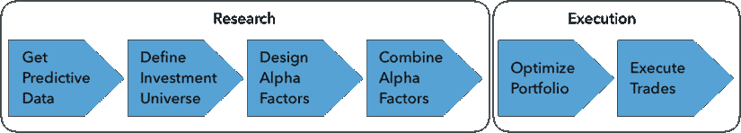

图 4.1：Alpha 因子研究和执行工作流程

本章重点讨论研究阶段；下一章将涵盖执行阶段。本书的其余部分将重点介绍如何利用机器学习从数据中学习新因子，并有效地汇总来自多个 Alpha 因子的信号。

Alpha 因子是市场、基本和替代数据的转换，其中包含预测信号。一些因子描述了基本的、全球经济范围内的变量，如增长、通胀、波动率、生产率和人口风险。其他因子代表了投资风格，如价值或成长，以及可以交易的动量投资，因此市场定价了这些因子。还有一些因子解释了基于金融市场的经济学或制度设置，或投资者行为的价格变动，包括这种行为的已知偏见。

因子背后的经济理论可以是**理性的**，这样因子在长期内的回报可以弥补其在不景气时期的低回报。它也可以是**行为的**，因子风险溢价是由于可能偏向的、或不完全理性的代理行为而产生的，这些行为并不能被套利掉。

不断寻找和发现新的因子，可能更好地捕捉已知的或反映新的回报驱动因素。Research Affiliates 的联合创始人杰森·许（Jason Hsu）发现，截至 2015 年，已经有大约 250 种因子在权威期刊中发表了实证证据。他估计，每年这个数字可能增加 40 个因子。

为了避免错误的发现并确保因子提供一致的结果，它应该基于各种已建立的因子类别，如动量、价值、波动率或质量及其基本原理，具有有意义的**经济直觉**，我们将在下一节中概述。这使得因子更有可能反映市场愿意补偿的风险。

Alpha 因子是通过对原始市场、基本或替代数据进行简单算术转换而产生的，例如随时间变化的变量的绝对或相对变化，数据系列之间的比率，或在时间窗口上的聚合，如简单或指数移动平均值。它们还包括从价格和成交量模式的技术分析中产生的指标，例如需求与供应之间的**相对强度指数**，以及从证券基本面分析中熟悉的众多指标。Kakushadze（2016）列出了 101 种 Alpha 因子的公式，其中 80%在撰写本文时被 WorldQuant 对冲基金用于生产。

历史上，交易策略应用简单的排名启发式、价值阈值或分位数截断到投资领域中的一个或多个 alpha 因素。例如，华伦·巴菲特喜爱的书籍之一，格雷厄姆和多德（1934 年）的*证券分析*中普及的价值投资方法，依赖于诸如账面市值比这样的指标。

预测超过市场回报的 alpha 因素的现代研究由尤金·法玛（2013 年诺贝尔经济学奖获得者）和肯尼斯·弗伦奇领导，后者提供了关于规模和价值因素（1993 年）的证据。这项工作导致了三因子和五因子模型，我们将在*第七章*，*线性模型 - 从风险因素到收益预测*中使用作者在他们的网站上提供的因子收益的每日数据进行讨论。关于现代因子投资的卓越、更近期的概述由安德鲁·安格（2014 年）撰写，他在 BlackRock 领导这一学科，该公司管理着接近 7 万亿美元。

正如我们将在本书中看到的，ML 在从更多样化和更大规模的输入数据中直接提取信号方面已被证明相当有效，而不使用规定的公式。然而，正如我们将看到的，alpha 因素仍然是一个 ML 模型的有用输入，该模型以比手动设置规则更优的方式结合它们的信息内容。

因此，算法交易策略今天利用大量信号，其中许多信号在个体上可能很弱，但当与 ML 算法通过模型驱动或传统因素组合时，可以产生可靠的预测。

# 建立在数十年的因子研究基础上

在理想化的世界中，风险因素应该彼此独立，产生正的风险溢价，并形成一个完整的集合，涵盖资产在给定类别中的所有风险维度，并解释系统性风险。实际上，这些要求仅在近似情况下成立，并且不同因素之间存在重要的相关性。例如，动量在较小的公司中通常更强（侯，薛和张，2015 年）。我们将展示如何使用无监督学习派生合成的、数据驱动的风险因素—特别是主成分和独立成分分析—在*第十三章*，*数据驱动风险因素和无监督学习的资产配置*中。

在本节中，我们将回顾在金融研究和交易应用中突出的一些关键因素类别，解释它们的经济原理，并提供通常用于捕捉这些收益驱动因素的指标。

在接下来的部分中，我们将演示如何使用 NumPy 和 pandas 实现其中一些因素，使用 TA-Lib 库进行技术分析，并演示如何使用 Zipline 回测库评估因素。我们还将重点介绍一些内置于 Zipline 中的因素，在 Quantopian 平台上可用。

## 动量和情绪 - 趋势是你的朋友

**动量投资**是最为成熟的因子策略之一，自从 Jegadeesh 和 Titman（1993）在美国股票市场提供定量证据以来得到了支持。它遵循这句格言：*趋势是你的朋友或让你的赢家持续奔跑*。动量因子旨在做多表现良好的资产，同时做空一段时间内表现不佳的资产。最近，AQR 2000 亿美元对冲基金的创始人 Clifford Asness 展示了跨越八个不同资产类别和市场的动量效应证据（Asness、Moskowitz 和 Pedersen，2013）。

使用这一因子的策略的前提是**资产价格存在趋势**，表现为正的串行相关性。这种价格动量违背了有效市场假说，该假说认为过去的价格回报单独不能预测未来的表现。尽管存在相反的理论论点，但价格动量策略已经在各种资产类别中产生了正的回报，并且是许多交易策略的重要组成部分。

*图 4.2*中的图表显示了基于其暴露于各种阿尔法因子的投资组合的历史表现（使用来自 Fama-French 网站的数据）。**赢家减输家**（**WML**）因子代表了包含美国股票的投资组合在前 2-12 个月的收益中排名前三个和最后三个十分位数的差异：

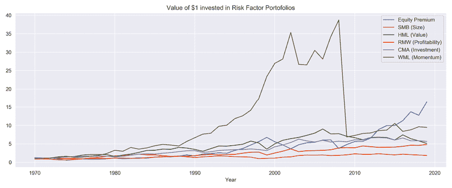

图 4.2：各种风险因子的回报

动量因子在 2008 年危机之前明显优于其他显著的风险因子。其他因素包括**高减低**（**HML**）价值因子，**强劲减弱劲**（**RMW**）盈利能力因子和**保守减激进**（**CMA**）投资因子。股票溢价是市场回报（例如，标准普尔 500 指数）与无风险利率之间的差异。

### 为什么动量和情绪可能驱动超额回报？

动量效应的原因指向投资者行为、持续的供需失衡、风险资产与经济之间的正反馈循环或市场微观结构。

行为学理论反映了对市场新闻的**低反应**（Hong、Lim 和 Stein，2000）和**过度反应**（Barberis、Shleifer 和 Vishny，1998）的偏见，因为投资者以不同的速度处理新信息。在对新闻的初始低反应之后，投资者经常推断过去的行为并创造价格动量。科技股在 90 年代晚期市场泡沫期间的上涨就是一个极端的例子。恐惧和贪婪心理也促使投资者增加对获胜资产的暴露，并继续出售亏损资产（Jegadeesh 和 Titman，2011）。

动量也可以有**基本驱动因素**，比如风险资产和经济之间的正反馈循环。经济增长推动了股票，而由此产生的财富效应通过更高的支出再次反馈到经济中，进而促进了增长。价格和经济之间的正反馈往往会使股票和信贷的动量延续到比债券、FOEX 和大宗商品更长的时间范围，而在这些市场中，负反馈会引发逆转，需要更短的投资周期。动量的另一个原因可能是由于市场摩擦导致的持续的供需失衡。一个例子是商品生产在适应需求变化方面的延迟。石油生产可能滞后于经济蓬勃发展带来的更高需求多年，而持续的供应短缺可能会触发和支持价格上涨的动量（Novy-Marx，2015）。

在较短的，日内时间范围内，**市场微观结构**效应也可以产生价格动量，因为投资者实施模拟其偏好的策略。例如，根据交易智慧在资产表现不佳时割损和在表现良好时保留利润的原则，投资者使用交易策略，如止损、**常比例组合保险**（**CPPI**）、动态对冲和基于期权的策略，如保护性买入期权。这些策略会产生动量，因为它们意味着在资产表现不佳时就提前承诺卖出，在表现良好时就提前承诺买入。

类似地，风险平价策略（见下一章）倾向于购买通常表现良好的低波动资产，并出售通常表现不佳的高波动资产（请参阅本章后面的*波动性和规模异常*部分）。使用这些策略自动平衡投资组合会加强价格动量。

### 如何衡量动量和情绪

动量因子通常是通过识别趋势和模式来从价格时间序列中得出的。它们可以基于绝对收益或相对收益构建，通过比较资产横截面或分析资产的时间序列，在或跨传统资产类别和不同时间范围内进行。

下表列出了一些流行的说明性指标（请参阅*附录*以获取公式）：

| 因素 | 描述 |
| --- | --- |
| 相对强度指数（RSI） | RSI 比较股票之间最近价格变化的幅度，以识别超买或超卖的股票。高 RSI（通常在 70 以上）表示超买，低 RSI（通常在 30 以下）表示超卖。它首先计算过去一定数量（通常为 14）的交易日内上涨价格的平均变化！[](img/B15439_04_001.png)和下跌价格！[](img/B15439_04_002.png)，然后分别计算！[](img/B15439_04_003.png)。 |
| 价格动量 | 该因素计算了给定数量的先前交易日的总回报。在学术文献中，通常使用过去 12 个月，除了最近一个月，因为经常观察到的短期逆转效应。然而，也广泛使用较短的时期。 |
| 过去 12 个月价格动量的调整 | 该指标通过将过去 12 个月的总回报除以这些回报的标准偏差来归一化。 |
| 价格加速度 | 价格加速度使用线性回归在较长和较短的时间段内（例如，1 年和 3 个月的交易日）计算价格趋势的梯度（根据波动性调整），并比较斜率变化作为价格加速度的度量。 |
| 百分比偏离 52 周高点 | 该因素使用最近价格与过去 52 周最高价格之间的百分比差异。 |

其他情绪指标包括以下指标；诸如分析师预测之类的输入可以从 Quandl 或 Bloomberg 等数据提供商获取：

| 因素 | 描述 |
| --- | --- |
| 盈利预测计数 | 该指标按照一致性预测的数量对股票进行排名，作为分析师覆盖和信息不确定性的代理。更高的值更可取。 |
| 推荐 N 个月的变化 | 该因素按照前*N*个月的一致性推荐变化对股票进行排名，改进是可取的（无论是从强烈卖出到卖出，还是从买入到强烈买入等等）。 |
| 股份在过去 12 个月的变化 | 该因素衡量了公司分割调整后的股票数量在过去 12 个月的变化，其中负变化意味着股票回购，并且是可取的，因为它表明管理层认为股票相对于其内在价值和未来价值而言是便宜的。 |
| 目标价格的 6 个月变化 | 该指标跟踪分析师目标价格的 6 个月变化。更高的正变化自然更可取。 |
| 净盈利修订 | 该因素表示盈利预测的上调和下调修订之间的差异，作为总修订数量的百分比。 |
| 短期利益占流通股的百分比 | 这个指标是当前被卖空的流通股的百分比，即投资者借来卖出的股票，并在以后的某一天回购它，同时猜测其价格将下跌。因此，高水平的卖空利益表明负面情绪，并且预计将来会信号较差的表现。 |

还有许多数据提供商致力于提供从社交媒体（例如 Twitter）构建的情绪指标。我们将在本书的第三部分中使用**自然语言处理**创建我们自己的情绪指标。

## 价值因素 - 寻找基本便宜货物

相对于其基本价值的低价格股票往往会提供超过市值加权基准的回报。价值因子反映了这种相关性，并旨在发送对相对便宜的被低估资产的买入信号以及对被高估资产的卖出信号。因此，任何价值策略的核心都是估算资产公平或基本价值的模型。公平价值可以被定义为绝对价格水平，与其他资产的价差，或者资产应该交易的范围。

### 相对价值策略

价值策略依赖价格回归到资产公平价值的均值。它们假设价格只是暂时偏离公平价值，这是由于行为效应，如过度反应或群体行为，或者流动性效应，例如临时市场影响或长期供需摩擦所致。价值因子通常表现出与动量因子相反的特性，因为它们依赖于均值回归。对于股票来说，价值股的相反是增长股，其高估值是由于增长预期所致。

价值因子可以启用广泛的系统化策略，包括基本和市场估值以及跨资产相对价值。它们经常被集体标记为**统计套利**（**StatArb**）策略，并作为市场中性的多空组合进行实施，没有暴露于其他传统或替代风险因子。

#### 基本价值策略

基本价值策略从经济和基本指标中推导出公平资产价值，这些指标依赖于目标资产类别。在固定收益、货币和商品中，指标包括资本账户余额的水平和变化、经济活动、通货膨胀或资金流动。对于股票和公司信用，价值因子可以追溯到格雷厄姆和多德之前提到的*证券分析*。股权价值方法将股票价格与基本指标进行比较，如账面价值、销售额、利润或各种现金流指标。

#### 市场价值策略

市场价值策略使用统计或机器学习模型来识别由于流动性提供效率低下而导致的定价错误。统计套利和指数套利是突出的例子，它们捕捉了短期时间段内临时市场影响的回归。（我们将在*第九章*，*用于波动率预测和统计套利的时间序列模型*中介绍配对交易）。在较长的时间范围内，市场价值交易还利用了股票和商品的季节性效应。

#### 跨资产相对价值策略

跨资产相对价值策略关注跨资产类别的错定价。例如，可转债套利涉及在债券可以转换为股票的情况下进行交易，以及单个公司的基础股票之间的相对价值。相对价值策略还包括信用和股票波动率之间的交易，利用信用信号交易股票或商品和相关股票之间的交易。

### 为什么价值因素有助于预测回报？

存在**价值效应**的合理和行为解释都有，定义为价值股票组合相对于成长股票组合的超额回报，前者市值较低，后者市值相对于基本面较高。我们将从众多研究中引用一些著名的例子（例如，看看法马和弗伦奇，1998 年，以及阿斯尼斯，莫斯科维茨和佩德森，2013 年）。

在**理性**、**有效市场观点**中，价值溢价是对更高的实际或感知风险的补偿。研究人员提出了证据表明，价值公司比更精简、更灵活的成长公司更难适应不利的经济环境，或者价值股风险与高财务杠杆和更不确定的未来收益有关。价值和小盘股组合也被证明对宏观冲击更敏感，而成长和大盘股组合则较少（拉克尼绍克，施莱费尔和维希尼，1994 年）。

从**行为学角度**来看，价值溢价可以通过损失规避和心理会计偏差来解释。由于之前的收益提供了保护垫，投资者可能对具有强劲近期表现的资产的损失不那么担心。这种损失规避偏差导致投资者认为股票比以前更不具有风险，并以较低的速度贴现其未来现金流。相反，近期表现不佳可能会导致投资者提高资产的贴现率。

这些**不同的回报期望**可以产生价值溢价：相对于基本面的高价倍数的成长股票过去表现良好，但由于投资者对较低风险的偏见感知，他们将需要更低的平均回报率，而对于价值股票则相反。

### 如何捕捉价值效应

许多估值代理是从基本数据计算出来的。这些因素可以组合为机器学习估值模型的输入，以预测资产价格。以下示例适用于股票，我们将在接下来的章节中看到一些这些因素是如何使用的：

| 因素 | 描述 |
| --- | --- |
| 现金流量收益率 | 该比率将每股经营现金流量除以股价。较高的比率意味着股东获得更好的现金回报（如果使用股息或股票回购或将利润有利地再投资于业务中）。 |
| 自由现金流收益率 | 此比率将每股自由现金流除以股价，自由现金流反映了经过必要支出和投资后可用于分配的现金金额。较高且增长的自由现金流收益率通常被视为超额表现的信号。 |
| 投资资本现金流回报率（CFROIC） | CFROIC 衡量了公司的现金流盈利能力。它将经营现金流除以投入资本，定义为总债务加上净资产。更高的回报意味着公司在给定的投入资本量下拥有更多现金，为股东创造更多价值。 |
| 现金流与总资产比 | 此比率将经营现金流除以总资产，表示公司相对于其资产能产生多少现金，较高的比率是更好的，就像 CFROIC 一样。 |
| 企业自由现金流与企业价值比 | 此比率衡量了公司相对于其企业价值（即股权和债务的综合价值）所产生的自由现金流，债务和股权价值可从资产负债表中获取，但市场价值通常提供了更准确的图景，假设相应资产是活跃交易的。 |
| EBITDA 与企业价值比 | 此比率衡量了公司的**利息、税收、折旧和摊销前收入**（EBITDA），这是相对于其企业价值的现金流的替代指标。 |
| 收益率 | 此比率将过去 12 个月的收益总和除以最后的市场（收盘）价格。 |
| 前瞻收益率 | 这个比率不使用历史收益，而是将股票分析师预测的下一个 12 个月的平均收益除以最后的价格。 |
| PEG 比率 | **市盈率增长比**（PEG）比率将一家公司的**市盈率**（P/E）比率除以一个给定时期的盈利增长率。该比率通过公司的盈利增长调整支付的每一美元的价格（由 P/E 比率衡量）。 |
| 前 1 年相对于行业的 P/E | 相对于相应行业 P/E 的 P/E 比率预测。它旨在通过考虑估值中的行业差异来减轻通用 P/E 比率的行业偏见。 |
| 销售收益率 | 此比率衡量了股票相对于其产生收入能力的估值。其他条件相等的情况下，具有较高历史销售价格比的股票预计将表现优异。 |
| 前瞻销售收益率 | 前瞻销售收益率使用分析师的销售预测，结合成一个（加权）平均值。 |
| 账面价值收益率 | 此比率将历史账面价值除以股价。 |
| 股息收益率 | 当前年化股息除以最后的收盘价格。贴现现金流估值假设公司的市场价值等于其未来现金流的现值。 |

*第二章*，*市场和基本数据-来源和技术*，讨论了您如何从公司文件中获取用于计算这些指标的基本数据。

## 波动性和规模异常

**规模效应**是较旧的风险因素之一，与市值较低的股票的超额表现有关（参见本节开头的*图 4.2*）。最近，已经显示**低波动性因子**可以捕捉到波动性、β值或特异风险低于平均水平的股票的超额回报。市值较大的股票 tend to 有较低的波动性，因此传统的规模因子经常与最近的波动性因子结合使用。

低波动性异常是与金融基本原理相抵触的实证难题。**资本资产定价模型**（**CAPM**）和其他资产定价模型断言，较高的风险应该获得较高的回报（我们将在下一章中详细讨论），但在许多市场和较长时期内，情况恰恰相反，较低风险的资产表现优于其较高风险的同行。

*图 4.3* 绘制了 1990-2019 年标普 500 收益率的滚动平均值与 VIX 指数的关系，VIX 指数衡量标普 100 名义期权的隐含波动率。它说明了股票收益率和这个波动率衡量指标如何以负相关的方式随着时间变化。除了这种总体效应之外，还有证据表明，对 VIX 变化更敏感的股票表现更差（Ang 等人，2006 年）：

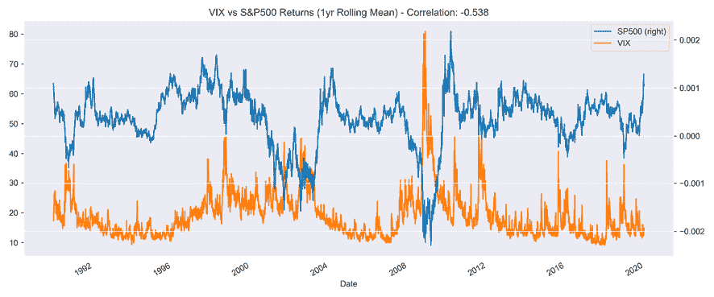

*图 4.3*：VIX 与标普 500 之间的相关性

### 为什么波动性和规模能预测回报？

低波动性异常与有效市场假设和 CAPM 假设相矛盾。已提出了几种行为解释来解释其存在。

**彩票效应**建立在实证证据之上，即个人承担类似于彩票的赌注，预期损失很小但潜在赢利很大，即使这种大赢利可能性相当低。如果投资者认为低价、波动性大的股票的风险收益概况类似于一张彩票，那么它可能是一个有吸引力的赌注。因此，由于其偏好的原因，投资者可能会为高波动性股票付出过高的价格，并为低波动性股票付出过低的价格。

**代表性偏见**表明，投资者将少数广为人知的高波动性股票的成功推广到所有高波动性股票，而忽视了这些股票的投机性质。

投资者可能也会对自己预测未来的能力**过于自信**，对于波动较大、结果更不确定的股票，他们的意见分歧更大。由于通过看多——即持有资产——来表达积极观点比通过看空来表达消极观点更容易，乐观主义者可能会超过悲观主义者，并继续推高波动性股票的价格，导致回报降低。

此外，投资者在牛市和危机期间的行为不同。在牛市中，贝塔的离散度要低得多，因此低波动性股票的表现不会很差，如果有的话，在危机期间，投资者会寻找或保留低波动性股票，贝塔离散度会增加。因此，长期来看，波动性较低的资产和投资组合表现更好。

### 如何衡量波动性和规模

用于识别低波动性股票的指标涵盖了广泛的范围，从实现波动率（标准偏差）到预测（隐含）波动率和相关性。一些将低波动性的运作定义为低贝塔。有关波动性异常的证据在不同的指标下似乎都很坚实（Ang，2014）。

## 量化投资的质量因素

**质量因素**旨在捕捉公司获得的超额回报，这些公司非常盈利、运营高效、安全、稳定且治理良好——简而言之，质量高。市场似乎也奖励相对盈利的确定性，并惩罚盈利波动性高的股票。

对高质量企业进行组合倾向在依赖基本分析的股票挑选者中长期被提倡，但在量化投资中却是一个相对较新的现象。主要挑战是如何使用定量指标一致和客观地定义质量因素，考虑到质量的主观性。

基于独立质量因素的策略往往呈逆周期性，因为投资者为了最小化下行风险支付溢价并推高估值。因此，质量因素经常与其他风险因素结合在多因子策略中，最常见的是与价值因素结合以制定合理价位的质量策略。

长短期质量因素往往具有负的市场贝塔，因为它们看多质量高、波动性低的股票，并做空波动性更高、质量更低的股票。因此，质量因素通常与低波动性和动量因素呈正相关，与价值和广泛市场敞口呈负相关。

### 为什么质量很重要

质量因素可能暗示超额收益，因为优秀的基本面，如持续的盈利能力、现金流量稳定增长、谨慎的杠杆化、对资本市场融资需求较低，或者低金融风险支撑了对股票的需求，从而长期支持这些公司的股价。从公司财务的角度来看，质量好的公司通常会谨慎管理资本，降低过度杠杆化或过度资本化的风险。

行为解释指出，投资者对于质量的信息反应不足，类似于动量理论，投资者追逐赢家并卖出失败者。

质量溢价的另一个论点是一个类似于成长股的赶羊效应。基金经理可能会发现更容易去购买一个基本面强劲的公司，即使它变得昂贵，而不是一个更加波动（风险）的价值股。

### 如何衡量资产质量

质量因素依赖于从资产负债表和利润表计算的指标，这些指标反映在高利润或现金流量利润率、运营效率、财务实力和竞争力方面的盈利能力，因为它意味着能够长期维持盈利地位的能力。

因此，质量已经使用毛利率（最近已添加到法玛-法国因子模型中；见*第七章*，*线性模型-从风险因子到收益预测*）、投入资本回报率、收益波动率低、或者各种盈利能力、收益质量和杠杆指标的组合进行衡量，以下表格列出了一些选项。

收益管理主要通过操纵应计项目进行。因此，应计项目的规模通常被用作收益质量的代理：相对于资产的较高的总应计项目使得低收益质量更有可能。然而，这并不明确，因为应计项目既可以反映出收益操纵，也可以反映出未来业务增长的会计估计：

| 因素 | 描述 |
| --- | --- |
| 资产周转率 | 这个因素衡量公司如何高效地利用其需要资本的资产产生收入，并通过销售额除以总资产来计算。较高的周转率更好。 |
| 资产周转率 12 个月变动 | 这个因素衡量了管理团队在过去一年内利用资产产生收入的效率变化。通常预期效率改善水平最高的股票会表现出色。 |
| 流动比率 | 流动比率是一种衡量公司偿付短期债务能力的流动性指标。它将公司的流动资产与流动负债进行比较，从质量的角度来看，较高的流动比率更好。 |
| 利息覆盖率 | 这个因素衡量公司支付债务利息的容易程度。它是通过将公司的**利息前税收盈利**(**EBIT**)除以其利息支出来计算的。较高的比率是可取的。 |
| 杠杆 | 具有比股本更多债务的公司被认为是高度杠杆的。债务股本比通常与前景呈反比关系，较低的杠杆比较好。 |
| 股息支付比率 | 将利润支付给股东的股息所占比例。股息支付比率较高的股票排名较高。 |
| 股东权益回报率（ROE） | ROE 被计算为净收入与股东权益的比率。具有较高历史股东权益回报率的股票排名较高。 |

配备了与不同程度的异常收益相关的阿尔法因子的高级分类，我们现在将开始从市场、基本和替代数据中开发我们自己的金融特征。

# 工程化预测回报的阿尔法因子

基于对关键因子类别、其基本原理和流行度量的概念理解，一个关键任务是识别可能更好地捕捉到前述回报驱动因素所体现的风险的新因子，或者找到新因子。在任一情况下，将重要的是将创新因子的表现与已知因子的表现进行比较，以识别增量信号增益。

促进数据转化为因子的关键工具包括用于数值计算的 Python 库 NumPy 和 pandas，以及用于技术分析的专用库 TA-Lib 的 Python 包装器。另一种选择是 Zura Kakushadze 在 2016 年论文《101 Formulaic Alphas》中开发的表达式阿尔法，并由 alphatools 库实现。此外，Quantopian 平台提供了大量内置因子，以加速研究过程。

要将一个或多个因子应用于投资范围，我们可以使用 Zipline 回测库（其中还包括一些内置因子），并使用 Alphalens 库评估它们的性能，使用下一节讨论的指标。

## 如何使用 pandas 和 NumPy 工程化因子

NumPy 和 pandas 是定制因子计算的关键工具。本节演示了如何使用它们快速计算产生各种阿尔法因子的转换。如果您对这些库不熟悉，特别是我们将在本书中始终使用的 pandas，请参阅 GitHub 存储库中本章的`README`，其中包含指向文档和教程的链接。

`alpha_factors_in_practice`目录中的笔记本`feature_engineering.ipynb`包含了创建各种因子的示例。该笔记本使用了根目录 GitHub 存储库中`data`文件夹中`create_data.ipynb`笔记本生成的数据，该数据以 HDF5 格式存储以加快访问速度。有关 pandas DataFrames 的 parquet、HDF5 和 CSV 存储格式的比较，请参阅 GitHub 存储库中*第二章*目录中的笔记本`storage_benchmarks.ipynb`。

NumPy 科学计算库是由 Travis Oliphant 于 2005 年创建的，通过整合自上世纪 90 年代中期以来开发的较旧的 Numeric 和 Numarray 库而形成。它采用高性能的*n*维数组数据结构`ndarray`，其功能与 MATLAB 相当。

pandas 库于 2008 年出现，当时 Wes McKinney 在 AQR Capital Management 工作。它提供了 DataFrame 数据结构，该结构基于 NumPy 的`ndarray`，但允许更友好的数据操作和基于标签的索引。它包括丰富的计算工具，特别适用于金融数据，包括具有自动日期对齐的丰富时间序列操作，我们将在这里探讨。

以下各节演示了将原始股票价格数据转换为选定因子的一些步骤。有关我们在此处省略以节省空间的其他详细信息和可视化，请参见笔记本`feature_engineering.ipynb`。有关如何使用 pandas 和 NumPy 的文档和教程的链接，请参见 GitHub 上本章的`README`中列出的资源。

### 加载、切片和重塑数据

在加载 Quandl Wiki 美国股票价格数据之后，我们通过将`pd.IndexSlice`应用于包含时间戳和股票代码信息的`pd.MultiIndex`来选择 2000-18 年的时间切片。然后我们使用`.stack()`方法选择并取消旋转调整后的收盘价列，以将 DataFrame 转换为宽格式，其中股票代码在列中，时间戳在行中：

```py
idx = pd.IndexSlice
with pd.HDFStore('../../data/assets.h5') as store:
    prices = (store['quandl/wiki/prices']
              .loc[idx['2000':'2018', :], 'adj_close']
              .unstack('ticker'))
prices.info()
DatetimeIndex: 4706 entries, 2000-01-03 to 2018-03-27
Columns: 3199 entries, A to ZUMZ 
```

### 重采样 - 从日频到月频

为了减少训练时间并尝试更长期限的策略，我们使用可用的调整后收盘价将业务日数据转换为月末频率：

```py
monthly_prices = prices.resample('M').last() 
```

### 如何计算多个历史期间的收益

为了捕捉时间序列动态如动量模式，我们使用`pct_change(n_periods)`方法计算历史多期收益，其中`n_periods`表示滞后期数。然后我们使用`.stack()`将宽格式结果转换回长格式，使用`.pipe()`将`.clip()`方法应用于结果 DataFrame，并在[1%, 99%]水平上进行调整收益；也就是说，我们在这些百分位数上限制异常值。

最后，我们使用几何平均值对收益进行标准化。在使用`.swaplevel()`更改`MultiIndex`级别顺序后，我们获得了六个不同期间的复合月收益，范围从 1 到 12 个月：

```py
outlier_cutoff = 0.01
data = pd.DataFrame()
lags = [1, 2, 3, 6, 9, 12]
for lag in lags:
    data[f'return_{lag}m'] = (monthly_prices
                           .pct_change(lag)
                           .stack()
                           .pipe(lambda x: 
                                 x.clip(lower=x.quantile(outlier_cutoff),
                                        upper=x.quantile(1-outlier_cutoff)))
                           .add(1)
                           .pow(1/lag)
                           .sub(1)
                           )
data = data.swaplevel().dropna()
data.info()
MultiIndex: 521806 entries, (A, 2001-01-31 00:00:00) to (ZUMZ, 2018-03-
                             31 00:00:00)
Data columns (total 6 columns):
return_1m 521806 non-null float64
return_2m 521806 non-null float64
return_3m 521806 non-null float64
return_6m 521806 non-null float64
return_9m 521806 non-null float64
return_12m 521806 non-null float6 
```

我们可以使用这些结果来计算基于长期收益与最近一个月收益之间差异的动量因子，以及 3 个月和 12 个月收益之间的差异，如下所示：

```py
for lag in [2,3,6,9,12]:
    data[f'momentum_{lag}'] = data[f'return_{lag}m'].sub(data.return_1m)
data[f'momentum_3_12'] = data[f'return_12m'].sub(data.return_3m) 
```

### 使用滞后收益和不同持有期

为了将滞后值用作与当前观察值相关的输入变量或特征，我们使用`.shift()`方法将历史收益移至当前期间：

```py
for t in range(1, 7):
    data[f'return_1m_t-{t}'] = data.groupby(level='ticker').return_1m.shift(t) 
```

类似地，为了计算不同持有期的回报，我们使用之前计算的标准化周期回报，并将它们向后移以与当前的金融特征对齐：

```py
for t in [1,2,3,6,12]:
    data[f'target_{t}m'] = (data.groupby(level='ticker')
                            [f'return_{t}m'].shift(-t)) 
```

该笔记本还演示了如何计算不同回报系列的各种描述统计量，并使用 seaborn 库可视化它们的相关性。

### 计算因子贝塔

我们将在第七章中介绍 Fama-French 数据，使用线性回归来估计资产对常见风险因子的暴露。五个 Fama-French 因子，即市场风险、规模、价值、经营盈利能力和投资，在经验上被证明可以解释资产回报。它们通常用于评估投资组合对风险和回报的著名驱动因素的暴露，然后将未解释的部分归因于管理者的特殊技能。因此，在旨在预测未来回报的模型中，将过去的因子暴露作为金融特征是很自然的。

我们可以使用 pandas-datareader 访问历史因子回报，并使用 pyfinance 库中的 `PandasRollingOLS` 滚动线性回归功能来估计历史暴露，具体如下：

```py
factors = ['Mkt-RF', 'SMB', 'HML', 'RMW', 'CMA']
factor_data = web.DataReader('F-F_Research_Data_5_Factors_2x3', 
              'famafrench', start='2000')[0].drop('RF', axis=1)
factor_data.index = factor_data.index.to_timestamp()
factor_data = factor_data.resample('M').last().div(100)
factor_data.index.name = 'date'
factor_data = factor_data.join(data['return_1m']).sort_index()
T = 24
betas = (factor_data
         .groupby(level='ticker', group_keys=False)
         .apply(lambda x: PandasRollingOLS(window=min(T, x.shape[0]-1), y=x.return_1m, x=x.drop('return_1m', axis=1)).beta)) 
```

如前所述，我们将更详细地探讨 Fama-French 因子模型和线性回归，在第七章中，更多地从风险因子到回报预测的线性模型。查看笔记本 `feature_engineering.ipynb` 以获取其他示例，包括滞后和前瞻回报的计算。

### 如何添加动量因子

我们可以使用 1 个月和 3 个月的结果来计算简单的动量因子。下面的代码示例展示了如何计算长期回报与最近一个月的回报之间的差异，以及 3 个月与 12 个月回报之间的差异：

```py
for lag in [2,3,6,9,12]:
    data[f'momentum_{lag}'] = data[f'return_{lag}m'].sub(data.return_1m)
data[f'momentum_3_12'] = data[f'return_12m'].sub(data.return_3m) 
```

### 添加时间指标以捕捉季节效应

基本因子还包括季节性异常，如一月效应，已经观察到这个月份的股票回报率较高，可能是出于税收原因。这和其他季节性效应可以通过代表特定时间段的指示变量来建模，例如年份和/或月份。这些可以按以下方式生成：

```py
dates = data.index.get_level_values('date')
data['year'] = dates.year
data['month'] = dates.month 
```

### 如何创建滞后的回报特征

如果你想使用滞后的回报，也就是来自以前期间的回报作为输入变量或特征来训练一个学习回报模式以预测未来回报的模型，你可以使用 `.shift()` 方法将历史回报移动到当前期间。下面的例子将过去 1 到 6 个月的回报移动到相应的滞后，使它们与当前月份的观察相关联：

```py
for t in range(1, 7):
    data[f'return_1m_t-{t}'] = data.groupby(level='ticker').return_1m.shift(t) 
```

### 如何创建前瞻回报

同样地，你可以使用 `.shift()` 来为当前期间创建前瞻回报，也就是将会发生在未来的回报，只需使用负周期（假设你的数据按升序排序）：

```py
for t in [1,2,3,6,12]:
    data[f'target_{t}m'] = (data.groupby(level='ticker')
                            [f'return_{t}m'].shift(-t)) 
```

我们将在*第六章*，*机器学习过程*开始训练 ML 模型时使用前向回报。

## 如何使用 TA-Lib 创建技术阿尔法因子

TA-Lib 是一个使用 C++编写的开源库，并带有 Python 接口，被广泛用于交易软件开发。它包含 200 多个流行技术分析指标的标准化实现；也就是说，这些指标只使用市场数据，即价格和成交量信息。

TA-Lib 与 pandas 和 NumPy 兼容，其使用非常简单。以下示例演示了如何计算两个流行指标。

**布林带**由**简单移动平均线**(**SMA**)围绕着两个标准差上下的带组成。当价格在两条带之外的上下方时，这种带可以用于可视化潜在的超买/超卖条件，分别是。发明者约翰·波林格实际上推荐了一套包含 22 条规则的交易系统，用于生成交易信号。

我们可以计算布林带，并且，为了比较，在本章节中先前描述的**相对强度指数**如下所示。

我们加载单只股票的调整收盘价—在本例中为 AAPL：

```py
with pd.HDFStore(DATA_STORE) as store:
    data = (store['quandl/wiki/prices']
            .loc[idx['2007':'2010', 'AAPL'],
                 ['adj_open', 'adj_high', 'adj_low', 'adj_close', 
                  'adj_volume']]
            .unstack('ticker')
            .swaplevel(axis=1)
            .loc[:, 'AAPL']
            .rename(columns=lambda x: x.replace('adj_', ''))) 
```

然后，我们通过相关的 TA-Lib 函数将一维`pd.Series`传递：

```py
from talib import RSI, BBANDS
up, mid, low = BBANDS(data.close, timeperiod=21, nbdevup=2, nbdevdn=2, 
                      matype=0)
rsi = RSI(adj_close, timeperiod=14) 
```

然后，我们在 DataFrame 中收集结果，并使用 AAPL 股票价格和 RSI 与 30/70 线绘制布林带，这表明有长期/短期机会：

```py
data = pd.DataFrame({'AAPL': data.close, 'BB Up': up, 'BB Mid': mid, 
                     'BB down': low, 'RSI': rsi})
fig, axes= plt.subplots(nrows=2, figsize=(15, 8))
data.drop('RSI', axis=1).plot(ax=axes[0], lw=1, title='Bollinger Bands')
data['RSI'].plot(ax=axes[1], lw=1, title='Relative Strength Index')
axes[1].axhline(70, lw=1, ls='--', c='k')
axes[1].axhline(30, lw=1, ls='--', c='k') 
```

结果显示在*图 4.4*中，相当混合—在早期危机后复苏期间，两个指标都表明超买条件，当价格继续上涨时：

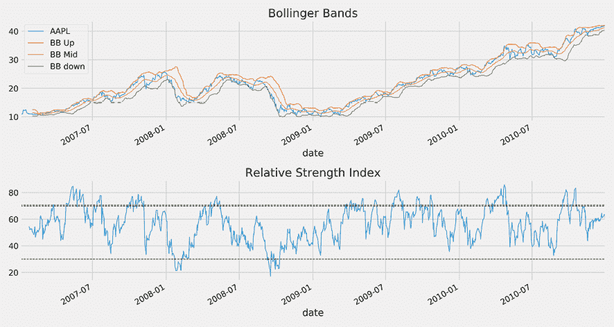

图 4.4：布林带和相对强度指数

## 使用卡尔曼滤波器对阿尔法因子进行去噪

**数据中的噪声**概念与信号处理领域相关，旨在从发送的信号中检索正确信息，例如，通过电磁波形式通过空气发送。随着波浪穿过空间，环境干扰可以以噪声的形式添加到原始纯净信号中，这使得在接收后需要分离这两个信号。

卡尔曼滤波器于 1960 年引入，并已成为许多需要处理嘈杂数据的应用程序非常流行，因为它允许更准确地估计底层信号。

此技术广泛用于跟踪计算机视觉中的对象，支持飞机和航天器的定位和导航，并基于嘈杂的传感器数据控制机器人运动，除了其在时间序列分析中的用途。

噪声在数据科学、金融和其他领域中也类似使用，这意味着原始数据包含有用信息，例如，以交易信号的形式，需要从不相关的、无关的信息中提取和分离出来。显然，我们不知道真实信号的事实有时会使这种分离变得相当具有挑战性。

我们将首先回顾卡尔曼滤波器的工作原理以及它做出的假设，然后我们将演示如何使用*pykalman*库将其应用于金融数据。

### 卡尔曼滤波器是如何工作的？

卡尔曼滤波器是一种动态线性模型，用于适应顺序数据，如时间序列，随着新信息的到来而适应。与使用固定大小窗口（如移动平均值）或给定一组权重（如指数移动平均值）不同，它根据概率模型将新数据合并到其对时间序列当前值的估计中。

更具体地说，卡尔曼滤波器是一种关于一系列观测*z*[1]，*z*[2]，…，*z*[T]和相应隐藏状态*x*[1]，*x*[2]，…，*x*[T]的概率模型（使用我们将在此处演示的*pykalman*库使用的符号）。这可以通过以下图表示：

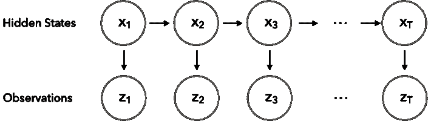

图 4.5：卡尔曼滤波器作为图形模型

从技术上讲，卡尔曼滤波器采用贝叶斯方法，随着时间的推移传播状态变量*x*的后验分布，给定它们的测量*z*（有关贝叶斯推断的更多详细信息，请参见*第十章*，*贝叶斯 ML - 动态夏普比率和配对交易*）。我们还可以将其视为一种无监督算法，用于跟踪连续状态空间中的单个对象，在这里，我们将对象视为，例如，安全性的价值或回报，或一个 alpha 因子（有关*第十三章*，*使用无监督学习的数据驱动风险因子和资产配置*）。

为了从可能实时可用的一系列观测中恢复隐藏状态，该算法在两个步骤之间迭代：

1.  **预测步骤**：估计过程的当前状态。

1.  **测量步骤**：使用嘈杂的观测来通过以更加确定的估计更高的权重平均两个步骤的信息来更新其估计。

该算法背后的基本思想是：对动态系统和相应测量历史做出一些假设将使我们能够估计系统的状态，以一种最大化以前测量概率的方式。

实现其恢复隐藏状态的目标，卡尔曼滤波器做出以下假设：

+   我们正在建模的系统以线性方式行为。

+   隐藏状态过程是一个马尔可夫链，因此当前隐藏状态*x*[t]仅取决于最近的先前隐藏状态*x*[t-1]。

+   测量受高斯、不相关噪声的影响，具有恒定的协方差。

结果上，卡尔曼滤波器类似于隐藏的马尔可夫模型，只是潜变量的状态空间是连续的，并且隐藏和观测变量都具有正态分布，表示为 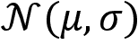 具有均值 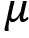 和标准差

在数学术语中，该模型的关键组成部分（以及在 pykalman 实现中对应的参数）是：

+   初始隐藏状态具有正态分布：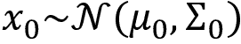 具有 `initial_state_mean`， 和 `initial_state_covariance`，。

+   隐藏状态 *x*[t+1] 是 *x*[t] 的仿射变换，其中 `transition_matrix` *A*，`transition_offset` *b*，并且添加了带有 `transition_covariance` *Q* 的高斯噪声：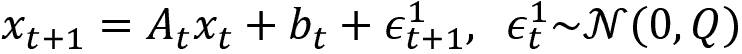。

+   观察 *z*[t] 是隐藏状态 *x*[t] 的仿射变换，其中 `observation_matrix` *C*，`observation_offset` *d*，并且添加了带有 `observation_covariance` *R* 的高斯噪声：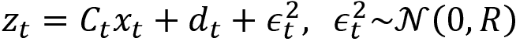。

卡尔曼滤波器的优点之一是，它能够灵活适应具有不断变化分布特征的非平稳数据（有关平稳性的更多细节，请参见*第九章*，*用于波动率预测和统计套利的时间序列模型*）。

主要缺点是线性假设和高斯噪声的假设，而金融数据通常违反这些假设。为了解决这些缺点，卡尔曼滤波器已经扩展到具有非线性动态的系统，形式为扩展卡尔曼滤波器和无迹卡尔曼滤波器。粒子滤波器是一种使用基于采样的蒙特卡洛方法来估计非正态分布的替代方法。

### 如何使用 pykalman 应用卡尔曼滤波器

卡尔曼滤波器特别适用于随时间变化的数据值或模型参数的滚动估计。这是因为它根据新观察在每个时间步骤调整其估计，并且倾向于更加重视最近的观察。

除了传统的移动平均外，卡尔曼滤波器不要求我们指定用于估计的窗口长度。相反，我们从潜在状态的均值和协方差的估计开始，并让卡尔曼滤波器根据周期性观察来纠正我们的估计。本节的代码示例在笔记本 `kalman_filter_and_wavelets.ipynb` 中。 

以下代码示例显示了如何将卡尔曼滤波器应用于平滑 2008-09 年期间的标准普尔 500 股价系列：

```py
with pd.HDFStore(DATA_STORE) as store:
    sp500 = store['sp500/stooq'].loc['2008': '2009', 'close'] 
```

我们使用单位协方差矩阵和零均值初始化 `KalmanFilter`（有关如何处理选择适当初始值的挑战的建议，请参阅 pykalman 文档）：

```py
from pykalman import KalmanFilter
kf = KalmanFilter(transition_matrices = [1],
                  observation_matrices = [1],
                  initial_state_mean = 0,
                  initial_state_covariance = 1,
                  observation_covariance=1,
                  transition_covariance=.01) 
```

然后，我们运行 `filter` 方法来触发前向算法，该算法迭代地估计隐藏状态，即时间序列的均值：

```py
state_means, _ = kf.filter(sp500) 
```

最后，我们添加移动平均以进行比较并绘制结果：

```py
sp500_smoothed = sp500.to_frame('close')
sp500_smoothed['Kalman Filter'] = state_means
for months in [1, 2, 3]:
    sp500_smoothed[f'MA ({months}m)'] = (sp500.rolling(window=months * 21)
                                         .mean())
ax = sp500_smoothed.plot(title='Kalman Filter vs Moving Average',
                         figsize=(14, 6), lw=1, rot=0) 
```

*图 4.6*中的结果图表显示，卡尔曼滤波器的表现与 1 个月移动平均值相似，但对时间序列行为的变化更敏感：

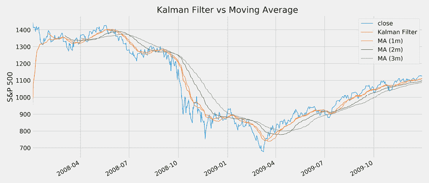

图 4.6：卡尔曼滤波器与移动平均值

## 如何使用小波预处理嘈杂的信号

小波与傅立叶分析相关联，后者将不同频率的正弦和余弦波组合起来以逼近嘈杂的信号。虽然傅立叶分析特别适用于将信号从时间域转换为频率域，但小波可用于过滤可能出现在不同尺度上的特定模式，这反过来可能对应于一定的频率范围。

小波是将离散或连续时间信号分解为不同尺度分量的函数或类似波形。小波变换则利用小波作为缩放和平移的有限长度波形的扩展和平移副本来表示函数。对于具有不连续性和尖峰的函数以及近似非周期性或非平稳信号，该变换优于傅立叶变换。

要去噪信号，可以使用小波收缩和阈值方法。首先，选择特定的小波模式来分解数据集。小波变换产生与数据集中的细节相对应的系数。

阈值法的理念很简单，就是省略所有低于特定截止值的系数，假设它们代表不必要表示真实信号的细节。然后，这些剩余系数被用于反向小波变换以重构（去噪）数据集。

现在我们将使用 pywavelets 库将小波应用于嘈杂的股票数据。以下代码示例说明了如何使用 Daubechies 6 小波和不同阈值值进行前向和反向小波变换去噪标普 500 指数收益率。

首先，我们为 2008-09 期间生成每日标普 500 指数收益率：

```py
signal = (pd.read_hdf(DATA_STORE, 'sp500/stooq')
          .loc['2008': '2009']
          .close.pct_change()
          .dropna()) 
```

然后，我们从众多内置小波函数中选择了一个 Daubechies 小波：

```py
import pywt
pywt.families(short=False)
['Haar', 'Daubechies',  'Symlets',  'Coiflets',  'Biorthogonal',  'Reverse biorthogonal',  'Discrete Meyer (FIR Approximation)',  'Gaussian',  'Mexican hat wavelet',  'Morlet wavelet',  'Complex Gaussian wavelets',   'Shannon wavelets',  'Frequency B-Spline wavelets',  'Complex Morlet wavelets'] 
```

Daubechies 6 小波由缩放函数 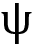 和小波函数 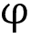 定义（有关详细信息，请参阅 PyWavelet 文档和附带的笔记本`kalman_filter_and_wavelets.ipynb`中的所有内置小波函数的图表）：

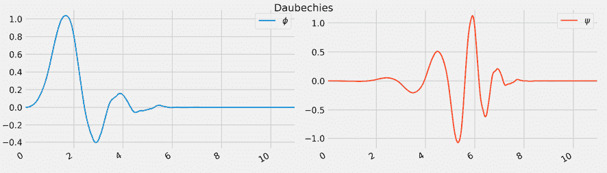

图 4.7：Daubechies 小波

给定小波函数，我们首先使用`.wavedec`函数分解返回信号，该函数产生小波变换的系数。接下来，我们过滤掉所有高于给定阈值的系数，然后使用仅这些系数的逆变换`.waverec`来重构信号：

```py
wavelet = "db6"
for i, scale in enumerate([.1, .5]):

    coefficients = pywt.wavedec(signal, wavelet, mode='per')
    coefficients[1:] = [pywt.threshold(i, value=scale*signal.max(), mode='soft') for i in coefficients[1:]]
    reconstructed_signal = pywt.waverec(coefficients, wavelet, mode='per')
    signal.plot(color="b", alpha=0.5, label='original signal', lw=2, 
                 title=f'Threshold Scale: {scale:.1f}', ax=axes[i])
    pd.Series(reconstructed_signal, index=signal.index).plot(c='k', label='DWT smoothing}', linewidth=1, ax=axes[i]) 
```

笔记本展示了如何使用不同的阈值应用这种去噪技术，所得到的图表，在*图 4.8*中清楚地显示出更高的阈值值产生了显著更平滑的系列：

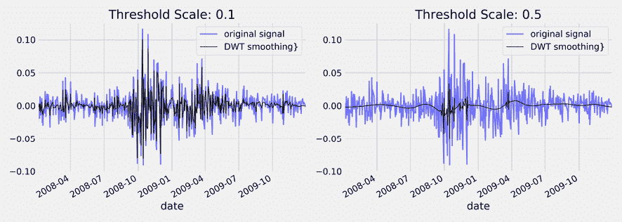

图 4.8：不同阈值的小波去噪

# 从信号到交易 - Zipline 用于回测

开源库 Zipline 是一个事件驱动的回测系统。它生成市场事件来模拟算法交易策略的反应，并跟踪其表现。一个特别重要的特性是，它为算法提供了避免前瞻性偏差的历史时点数据。

该库由众包的量化投资基金 Quantopian 推广，Quantopian 在生产中使用它来促进算法开发和实时交易。

在本节中，我们将简要演示其基本功能。*第八章*，*ML4T 工作流程 - 从模型到策略回测*，包含了更详细的介绍，以准备我们进行更复杂的用例。

## 如何回测单因子策略

您可以与数据包一起离线使用 Zipline 进行 alpha 因子的研究和评估。在 Quantopian 平台上使用时，您将获得更广泛的基本和替代数据。我们还将在本章中演示 Quantopian 研究环境，并在下一章中演示回测 IDE。本节的代码位于本章的 GitHub 存储库文件夹的`01_factor_research_evaluation`子目录中，其中包括安装说明和适用于 Zipline 依赖项的环境。

安装请参阅本章的 GitHub 上的`README`中的说明。安装后，在执行第一个算法之前，您需要摄取一个数据包，默认情况下包含 Quandl 社区维护的 3000 家美国上市公司的股价、股息和拆股数据。

运行以下代码需要 Quandl API 密钥，该代码将数据存储在您的`home`文件夹下的`~/.zipline/data/<bundle>`目录中：

```py
$ QUANDL_API_KEY=<yourkey> zipline ingest [-b <bundle>] 
```

### 市场数据的单个 alpha 因子

我们首先将在离线环境中说明 Zipline alpha 因子研究工作流程。特别是，我们将开发和测试一个简单的均值回归因子，该因子衡量了最近表现与历史平均值的偏离程度。

短期反转是一种常见策略，利用了股票价格很可能在不到 1 分钟到 1 个月的时间内恢复到滚动平均值的弱预测模式。详情请参阅笔记本`single_factor_zipline.ipynb`。

为此，该因子计算了最后一个月回报相对于过去一年内滚动月回报的*z*值。此时，我们不会下任何订单，只是为了说明`CustomFactor`的实现并在模拟过程中记录结果。

Zipline 包含许多内置因子，用于许多常见操作（有关详细信息，请参阅 GitHub 上链接的 *Quantopian* 文档）。虽然这通常很方便且足够，但在其他情况下，我们希望以不同方式转换我们的可用数据。为此，Zipline 提供了 `CustomFactor` 类，它为我们指定了一系列计算提供了很大的灵活性。它使用 NumPy 提供的各种功能来为证券的横截面和自定义回顾期提供各种计算。

为此，在进行一些基本设置之后，`MeanReversion` 以 `CustomFactor` 为子类，并定义了一个 `compute()` 方法。它创建了默认输入的月度回报率，覆盖了默认的一年窗口，以便 `monthly_return` 变量在给定日期的 Quandl 数据集中每个证券都有 252 行和一列。

`compute_factors()` 方法创建了一个 `MeanReversion` 因子实例，并创建了长、短和排名管道列。前两者包含布尔值，可用于下达订单，后者反映了用于评估整体因子性能的整体排名。此外，它使用内置的 `AverageDollarVolume` 因子将计算限制在更流动的股票上：

```py
from zipline.api import attach_pipeline, pipeline_output, record
from zipline.pipeline import Pipeline, CustomFactor
from zipline.pipeline.factors import Returns, AverageDollarVolume
from zipline import run_algorithm
MONTH, YEAR = 21, 252
N_LONGS = N_SHORTS = 25
VOL_SCREEN = 1000
class MeanReversion(CustomFactor):
    """Compute ratio of latest monthly return to 12m average,
       normalized by std dev of monthly returns"""
    inputs = [Returns(window_length=MONTH)]
    window_length = YEAR
    def compute(self, today, assets, out, monthly_returns):
        df = pd.DataFrame(monthly_returns)
        out[:] = df.iloc[-1].sub(df.mean()).div(df.std())
def compute_factors():
    """Create factor pipeline incl. mean reversion,
        filtered by 30d Dollar Volume; capture factor ranks"""
    mean_reversion = MeanReversion()
    dollar_volume = AverageDollarVolume(window_length=30)
    return Pipeline(columns={'longs'  : mean_reversion.bottom(N_LONGS),
                             'shorts' : mean_reversion.top(N_SHORTS),
                             'ranking': 
                          mean_reversion.rank(ascending=False)},
                          screen=dollar_volume.top(VOL_SCREEN)) 
```

结果将允许我们进行长期和短期订单的下达。在下一章中，我们将学习如何通过选择再平衡周期和在新信号到达时调整投资组合持仓来构建投资组合。

`initialize()` 方法注册了 `compute_factors()` 管道，而 `before_trading_start()` 方法确保管道每天运行一次。`record()` 函数将管道的排名列以及当前资产价格添加到由 `run_algorithm()` 函数返回的性能 DataFrame 中：

```py
def initialize(context):
    """Setup: register pipeline, schedule rebalancing,
        and set trading params"""
    attach_pipeline(compute_factors(), 'factor_pipeline')
def before_trading_start(context, data):
    """Run factor pipeline"""
    context.factor_data = pipeline_output('factor_pipeline')
    record(factor_data=context.factor_data.ranking)
    assets = context.factor_data.index
    record(prices=data.current(assets, 'price')) 
```

最后，在 UTC 术语中定义 `start` 和 `end` 时间戳对象，设置资本基础，并执行带有对关键执行方法的引用的 `run_algorithm()`。性能 DataFrame 包含嵌套数据，例如，价格列由每个单元格的 `pd.Series` 组成。因此，当以 pickle 格式存储时，后续数据访问更容易：

```py
start, end = pd.Timestamp('2015-01-01', tz='UTC'), pd.Timestamp('2018-
             01-01', tz='UTC')
capital_base = 1e7
performance = run_algorithm(start=start,
                            end=end,
                            initialize=initialize,
                            before_trading_start=before_trading_start,
                            capital_base=capital_base)
performance.to_pickle('single_factor.pickle') 
```

我们将在下一节中使用存储在 `performance` DataFrame 中的因子和定价数据来评估不同持有期的因子表现，但首先，我们将看一下如何通过组合 Quantopian 平台上多样数据源的几个 alpha 因子来创建更复杂的信号。

### 内置 Quantopian 因子

附带的笔记本 `factor_library_quantopian.ipynb` 包含了许多示例因子，这些因子要么由 Quantopian 平台提供，要么通过从 Jupyter Notebook 使用研究 API 访问的数据源计算而来。

有一些内置因子可以与量化 Python 库（特别是 NumPy 和 pandas）结合使用，从广泛的相关数据源（如美国股票价格、Morningstar 基本面和投资者情绪）中派生出更复杂的因子。

例如，市销率可作为 Morningstar 基本面数据集的一部分获得。它可以作为将在我们介绍 Zipline 库时进一步描述的管道的一部分使用。

## 结合来自多种数据源的因子

Quantopian 研究环境专为快速测试预测性α因子而设计。该过程非常类似，因为它建立在 Zipline 之上，但提供了更丰富的数据源访问。下面的代码示例说明了如何计算α因子，不仅来自市场数据，如以前所做的那样，还来自基本数据和替代数据。有关详细信息，请参阅笔记本`multiple_factors_quantopian_research.ipynb`。

Quantopian 免费提供了数百个 Morningstar 基本面变量，并将 Stocktwits 信号作为替代数据源的示例。还有一些自定义的宇宙定义，比如`QTradableStocksUS`，它应用了几个过滤器来限制回测宇宙，使其仅包括在现实市场条件下可能可交易的股票：

```py
from quantopian.research import run_pipeline
from quantopian.pipeline import Pipeline
from quantopian.pipeline.data.builtin import USEquityPricing
from quantopian.pipeline.data.morningstar import income_statement, 
     operation_ratios, balance_sheet
from quantopian.pipeline.data.psychsignal import stocktwits
from quantopian.pipeline.factors import CustomFactor, 
     SimpleMovingAverage, Returns
from quantopian.pipeline.filters import QTradableStocksUS 
```

我们将使用自定义的`AggregateFundamentals`类来使用最后报告的基本数据点。这旨在解决基本面数据每季度报告一次的事实，而 Quantopian 目前没有提供一种轻松的方法来聚合历史数据，比如说，在滚动基础上获取过去四个季度的总和：

```py
class AggregateFundamentals(CustomFactor):
    def compute(self, today, assets, out, inputs):
        out[:] = inputs[0] 
```

我们将再次使用前面代码中的自定义`MeanReversion`因子。我们还将使用`rank()`方法的`mask`参数来计算给定宇宙定义的几个其他因子的排名：

```py
def compute_factors():
    universe = QTradableStocksUS()
    profitability = (AggregateFundamentals(inputs=
                     [income_statement.gross_profit],
                                           window_length=YEAR) /
                     balance_sheet.total_assets.latest).rank(mask=universe)
    roic = operation_ratios.roic.latest.rank(mask=universe)
    ebitda_yield = (AggregateFundamentals(inputs=
                             [income_statement.ebitda],
                                          window_length=YEAR) /
                    USEquityPricing.close.latest).rank(mask=universe)
    mean_reversion = MeanReversion().rank(mask=universe)
    price_momentum = Returns(window_length=QTR).rank(mask=universe)
    sentiment = SimpleMovingAverage(inputs=[stocktwits.bull_minus_bear],
                                    window_length=5).rank(mask=universe)
    factor = profitability + roic + ebitda_yield + mean_reversion + 
             price_momentum + sentiment
    return Pipeline(
            columns={'Profitability'      : profitability,
                     'ROIC'               : roic,
                     'EBITDA Yield'       : ebitda_yield,
                     "Mean Reversion (1M)": mean_reversion,
                     'Sentiment'          : sentiment,
                     "Price Momentum (3M)": price_momentum,
                     'Alpha Factor'       : factor}) 
```

此算法简单地将每个资产的六个个别因子的排名平均起来，以结合它们的信息。这是一种相当简单的方法，它并未考虑到每个因子在预测未来收益时可能提供的相对重要性和增量信息。下一章的机器学习算法将使我们能够使用相同的回测框架来做到这一点。

执行还依赖于`run_algorithm()`，但 Quantopian 平台上的`return`DataFrame 仅包含由`Pipeline`创建的因子值。这很方便，因为这种数据格式可以用作 Alphalens 的输入，该库用于评估α因子的预测性能。

**使用 TA-Lib 与 Zipline**

TA-Lib 库包含众多技术因素。Python 实现可供本地使用，例如，与 Zipline 和 Alphalens 一起使用，它还可在 Quantopian 平台上使用。该笔记本还说明了使用 TA-Lib 可用的几个技术指标。

# 使用 Alphalens 分离信号与噪声

Quantopian 已经开源了用于预测性股票因子的性能分析的 Python Alphalens 库。它与 Zipline 回测库以及投资组合性能和风险分析库 pyfolio 很好地集成在一起，我们将在下一章中探讨。

Alphalens 便于分析 alpha 因子的预测能力，涉及：

+   信号与随后收益的相关性

+   基于（子集的）信号的等权或因子加权组合的盈利能力

+   因子的周转率，以指示潜在的交易成本

+   特定事件期间的因子表现

+   前面的按行业细分

分析可以使用纸质文档或个别计算和绘图进行。纸质文档在在线存储库中有图示，以节省一些空间。

## 创建前向收益和因子分位数

要使用 Alphalens，我们需要提供两个输入：

+   资产组合的信号，例如`MeanReversion`因子的排名返回的那些信号

+   我们投资于某一资产的给定持有期将获得的前向收益

有关详细信息，请参阅笔记本 `06_performance_eval_alphalens.ipynb`。

我们将从 `single_factor.pickle` 文件中恢复价格如下（并对`factor_data` 以同样方式进行处理；参见笔记本）：

```py
performance = pd.read_pickle('single_factor.pickle')
prices = pd.concat([df.to_frame(d) for d, df in performance.prices.items()],axis=1).T
prices.columns = [re.findall(r"\[(.+)\]", str(col))[0] for col in 
                  prices.columns]
prices.index = prices.index.normalize()
prices.info()
<class 'pandas.core.frame.DataFrame'>
DatetimeIndex: 755 entries, 2015-01-02 to 2017-12-29
Columns: 1661 entries, A to ZTS
dtypes: float64(1661) 
```

我们可以使用 `get_clean_factor_and_forward_returns` 实用函数，从 Zipline 输出中生成所需格式的 Alphalens 输入数据，即先前描述的因子信号和前向收益。该函数返回给定持有期的信号五分位和前向收益：

```py
HOLDING_PERIODS = (5, 10, 21, 42)
QUANTILES = 5
alphalens_data = get_clean_factor_and_forward_returns(factor=factor_data,
                                     prices=prices,
                                     periods=HOLDING_PERIODS,
                                     quantiles=QUANTILES)
Dropped 14.5% entries from factor data: 14.5% in forward returns computation and 0.0% in binning phase (set max_loss=0 to see potentially suppressed Exceptions). max_loss is 35.0%, not exceeded: OK! 
```

`alphalens_data` DataFrame 包含给定日期投资于指定资产的收益和所示持有期的因子值，即该资产的 `MeanReversion` 在该日期的排名和相应的分位数值：

| date | asset | 5D | 10D | 21D | 42D | factor | factor_quantile |
| --- | --- | --- | --- | --- | --- | --- | --- |
| 1/2/2015 | A | -1.87% | -1.11% | -4.61% | 5.28% | 2618 | 4 |
| AAL | -0.06% | -8.03% | -9.63% | -10.39% | 1088 | 2 |
| AAP | -1.32% | 0.23% | -1.63% | -2.39% | 791 | 1 |
| AAPL | -2.82% | -0.07% | 8.51% | 18.07% | 2917 | 5 |
| ABBV | -1.88% | -0.20% | -7.88% | -8.24% | 2952 | 5 |

前向收益和信号分位数是评估信号预测能力的基础。通常，因子应该为不同的分位数提供明显不同的回报，例如因子值底部五分位的负回报和顶部分位数的正回报。

## 因子分位数的预测性能

作为第一步，我们想要可视化因子分位数的平均期回报。我们可以使用性能模块中的内置函数 `mean_return_by_quantile` 和绘图模块中的 `plot_quantile_returns_bar`：

```py
from alphalens.performance import mean_return_by_quantile
from alphalens.plotting import plot_quantile_returns_bar
mean_return_by_q, std_err = mean_return_by_quantile(alphalens_data)
plot_quantile_returns_bar(mean_return_by_q); 
```

结果是一个条形图，根据因子信号的五分位将四个不同持有期的前向收益的平均值进行了拆分。

正如您在 *图 4.9* 中所见，除了最长持有期外，底部五分位的收益远远低于顶部五分位：

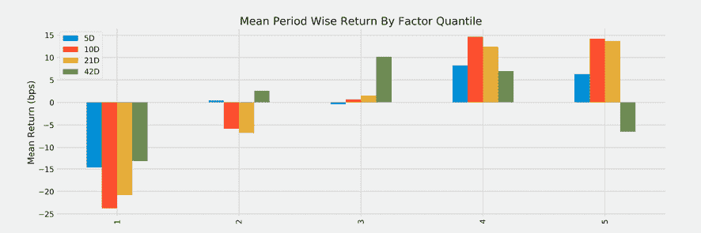

图 4.9：因子分位数的平均期回报

**10D**持有期在整个交易期间对第一和第四四分位提供了略微更好的结果。

我们还希望看到由每个信号五分位驱动的投资随时间的表现。为此，我们计算了**5D**持有期的日收益，而不是平均收益。Alphalens 调整了期间收益，以解决日信号和较长持有期之间的不匹配（有关详细信息，请参阅 Alphalens 文档）：

```py
from alphalens.plotting import plot_cumulative_returns_by_quantile
mean_return_by_q_daily, std_err =
     mean_return_by_quantile(alphalens_data, by_date=True)
plot_cumulative_returns_by_quantile(mean_return_by_q_daily['5D'], 
     period='5D'); 
```

*图 4.10*中得到的线形图显示，在这 3 年的大部分时间里，前两个五分位明显优于后两个五分位。然而，正如前一个图所示，第四个五分位的信号由于其在 2017 年的相对绩效而产生了略微更好的绩效：

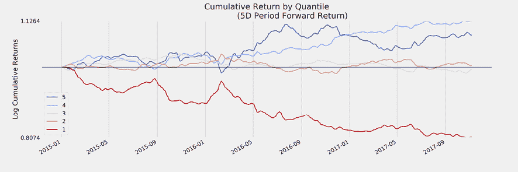

图 4.10：5 天持有期按分位累积收益

对于交易策略有用的因子表现出前述模式，其中累积收益沿着明显不同的路径发展，因为这允许具有较低资本要求和相应较低整体市场风险敞口的多头策略。

但是，我们还需要考虑期间收益的分散，而不仅仅是平均值。为此，我们可以依赖内置的`plot_quantile_returns_violin`：

```py
from alphalens.plotting import plot_quantile_returns_violin
plot_quantile_returns_violin(mean_return_by_q_daily); 
```

这个分布图，显示在*图 4.11*中，突出了日收益范围相当广泛。尽管有不同的均值，但分布的分离非常有限，以至于在任何给定的一天，不同五分位之间的绩效差异可能相当有限：

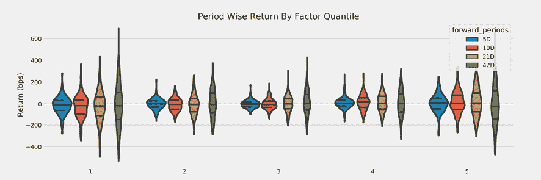

图 4.11：按因子五分位分布的期间收益

虽然我们专注于评估单个 alpha 因子，但在我们在下一章节中处理正确的回测时，我们通过忽略与交易执行相关的实际问题来简化事务。其中一些问题包括：

+   交易的交易成本

+   滑点，或者是决策价和交易执行价之间的差异，例如由于市场影响

## 信息系数

本书的大部分内容都是关于使用 ML 模型设计 alpha 因子。ML 是关于优化某些预测目标，而在本节中，我们将介绍用于衡量 alpha 因子性能的关键指标。我们将定义**alpha**为*超过基准的平均收益*。

这导致了**信息比率**（**IR**），它通过将 alpha 除以跟踪风险来衡量单位风险的平均超额收益。当基准是无风险利率时，IR 对应于著名的夏普比率，我们将强调在典型情况下，即收益不符合正态分布时出现的关键统计测量问题。我们还将解释主动管理的基本法则，该法则将 IR 分解为预测技能的组合以及策略有效利用这些预测技能的能力。

Alpha 因子的目标是准确预测未来收益的方向。因此，一个自然的绩效度量是 alpha 因子预测与目标资产未来收益之间的相关性。

最好使用非参数的 Spearman 秩相关系数，它衡量了两个变量之间的关系如何能够使用单调函数描述，而不是 Pearson 相关系数，后者衡量线性关系的强度。

我们可以使用 Alphalens 获取**信息系数**（**IC**），它依赖于底层的`scipy.stats.spearmanr`（请参阅存储库以了解如何直接使用`scipy`获取*p*-values 的示例）。`factor_information_coefficient`函数计算周期相关性，`plot_ic_ts`创建带有 1 个月移动平均线的时间序列图：

```py
from alphalens.performance import factor_information_coefficient
from alphalens.plotting import plot_ic_ts
ic = factor_information_coefficient(alphalens_data)
plot_ic_ts(ic[['5D']]) 
```

*图 4.12*中的时间序列图显示了具有显著正移动平均 IC 的延长时期。如果有足够的机会应用这种预测技能，IC 为 0.05 甚至 0.1 可以实现显著的超额收益，正如主动管理的基本法则所说明的那样：

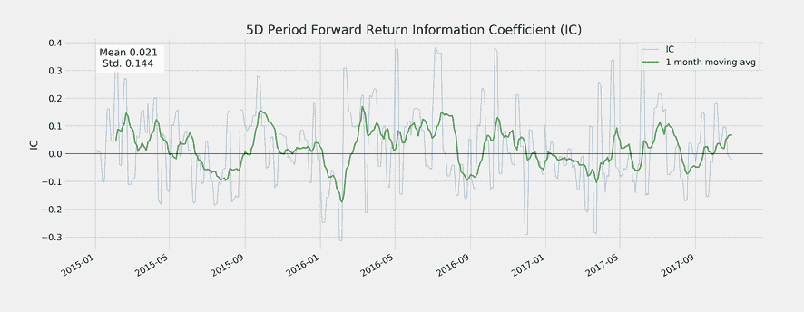

图 4.12：5 天视野的 IC 移动平均值

年均 IC 的图表突出显示了该因子的历史表现不均匀：

```py
ic = factor_information_coefficient(alphalens_data)
ic_by_year = ic.resample('A').mean()
ic_by_year.index = ic_by_year.index.year
ic_by_year.plot.bar(figsize=(14, 6)) 
```

这产生了图表*图 4.13*：

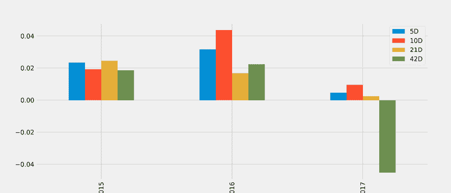

图 4.13：按年份划分的 IC

如本例中所示，信息系数低于 0.05，但显著，并且相对于基准可以产生正的残差收益，我们将在下一节中看到。命令`create_summary_tear_sheet(alphalens_data)`创建 IC 摘要统计。

风险调整 IC 的结果是通过将 IC 均值除以 IC 的标准差来得到的，还要经受双边*t*检验，零假设为*IC = 0*，使用`scipy.stats.ttest_1samp`：

|  | 5 天 | 10 天 | 21 天 | 42 天 |
| --- | --- | --- | --- | --- |
| IC 均值 | 0.021 | 0.025 | 0.015 | 0.001 |
| IC 标准差 | 0.144 | 0.13 | 0.12 | 0.12 |
| 风险调整 IC | 0.145 | 0.191 | 0.127 | 0.01 |
| t 值（IC） | 3.861 | 5.107 | 3.396 | 0.266 |
| p 值（IC） | 0 | 0 | 0.001 | 0.79 |
| IC 偏度 | 0.384 | 0.251 | 0.115 | 0.134 |
| IC 峰度 | 0.019 | -0.584 | -0.353 | -0.494 |

## 因子周转率

**因子周转率**衡量了与特定分位数关联的资产频繁变动的频率，即调整投资组合以适应信号序列所需的交易次数。更具体地说，它衡量了当前处于因子分位数中的资产份额，而上一期不在该分位数中的资产份额。以下表格由此命令生成：

```py
create_turnover_tear_sheet(alphalens_data) 
```

加入基于五分位数的投资组合的资产份额相当高，这表明交易成本对于收获预测性能的好处构成了一项挑战：

| 平均周转率 | 5D | 10D | 21D | 42D |
| --- | --- | --- | --- | --- |
| 四分位数 1 | 0.587 | 0.826 | 0.828 | 0.41 |
| 四分位数 2 | 0.737 | 0.801 | 0.81 | 0.644 |
| 四分位数 3 | 0.764 | 0.803 | 0.808 | 0.679 |
| 四分位数 4 | 0.737 | 0.803 | 0.808 | 0.641 |
| 四分位数 5 | 0.565 | 0.802 | 0.809 | 0.393 |

因子周转的另一个视角是由于因子的资产排名在不同持有期间的相关性，也是撕裂表的一部分：

|  | 5D | 10D | 21D | 42D |
| --- | --- | --- | --- | --- |
| 平均因子等级自相关性 | 0.713 | 0.454 | -0.011 | -0.016 |

通常，更多的稳定性更可取，以保持交易成本可控。

# Alpha 因子资源

研究过程需要根据其信号的预测能力设计和选择 Alpha 因子。算法交易策略通常会基于多个为每个资产发送信号的 Alpha 因子构建。这些因子可以使用 ML 模型聚合，以优化各种信号如何转化为关于个别仓位的时间和大小决策，正如我们将在后续章节中看到的那样。

## 替代算法交易库

用于算法交易和数据收集的其他开源 Python 库包括以下内容（请参阅 GitHub 链接）：

+   **QuantConnect**是 Quantopian 的竞争对手。

+   **WorldQuant**提供在线竞赛，并招募社区贡献者参与众包式对冲基金。

+   **Alpha Trading Labs**提供了一个与 Quantopian 类似的高频率测试基础设施，并采用了相似的商业模式。

+   **Python 算法交易库**（**PyAlgoTrade**）专注于回测，并支持模拟交易和实时交易。它允许您使用历史数据评估交易策略的想法，并旨在以最小的努力实现这一目标。

+   **pybacktest**是一个矢量化的回测框架，使用 pandas，并旨在紧凑、简单且快速。（该项目目前暂停。）

+   **ultrafinance**是一个较老的项目，结合了实时财务数据收集和交易策略的分析和回测。

+   **用 Python 进行交易**提供了课程和一套用于量化交易的函数和类。

+   **互动经纪商**提供了一个用于在其平台上进行实时交易的 Python API。

# 摘要

在本章中，我们介绍了一系列α因子，这些因子已被专业投资者用于设计和评估策略数十年。我们阐述了它们的工作原理，并说明了一些被认为推动其绩效的经济机制。我们这样做是因为对因子如何产生超额收益有扎实的理解有助于创新新的因子。

我们还介绍了几种工具，您可以使用这些工具从各种数据源生成自己的因子，并演示了卡尔曼滤波器和小波如何使我们能够平滑嘈杂的数据，希望能够获得更清晰的信号。

最后，我们简要介绍了用于事件驱动交易算法的 Zipline 库，无论是离线还是在线于 Quantopian 平台上。您了解了如何实现一个简单的均值回归因子，以及如何简单地结合多个因子来驱动基本策略。我们还看了 Alphalens 库，该库允许评估信号的预测性能和交易换手率。

投资组合构建过程反过来则从更广泛的角度出发，旨在从风险和回报的角度对头寸进行最优定量。在下一章节中，*投资组合优化与策略评估*，我们将探讨在投资组合过程中平衡风险和回报的各种策略。我们还将更详细地研究在有限历史数据集上回测交易策略的挑战，以及如何解决这些挑战。
