# 第五章：5

# 组合优化和绩效评估

阿尔法因子产生信号，算法策略将其转化为交易，进而产生多头和空头仓位。由此产生的投资组合的回报和风险决定了策略的成功。

在市场条件下测试策略之前，我们需要模拟算法将进行的交易并验证其绩效。策略评估包括针对历史数据进行反向测试以优化策略的参数，并进行向前测试以验证样本内绩效与新的样本外数据。目标是避免从针对特定过去情况量身定制策略中发现虚假结果。

在组合环境中，正资产回报可以抵消负价格波动。一个资产的正价格变动更有可能抵消另一个资产的损失，这两个仓位之间的相关性越低。基于仓位协方差对组合风险的影响，哈里·马科维茨于 1952 年开发了现代投资组合管理背后的理论，该理论基于多样化。结果是均值-方差优化，它为给定的资产集合选择权重以最小化风险，风险用预期收益的标准差来衡量。

**资本资产定价模型**(**CAPM**)引入了一个风险溢价，该溢价以超过无风险投资的预期收益来衡量，作为持有资产的平衡报酬。这种奖励是对持有资产暴露于一个系统性风险因素——市场的补偿，与特定资产特有的非系统性风险相对，因此无法通过分散化消除。

风险管理随着额外的风险因素和更精细的暴露选择的出现而变得更加复杂。凯利准则是动态组合优化的一种流行方法，即选择一系列随时间变化的仓位；它最初被爱德华·索普在 1968 年从赌博中著名地改编到股票市场中。

因此，有几种优化投资组合的方法，包括将**机器学习**(**ML**)应用于学习资产之间的层次关系，并将它们的持仓视为相互补充或替代品，以满足组合风险概况。

在本章中，我们将涵盖以下主题：

+   如何衡量组合风险和回报

+   使用均值-方差优化和替代方法管理组合权重

+   在组合环境中使用机器学习来优化资产配置

+   使用 Zipline 模拟交易并基于阿尔法因子创建投资组合

+   如何使用 pyfolio 评估组合绩效

您可以在 GitHub 存储库的相应目录中找到本章的代码示例和其他资源的链接。笔记本包括图像的彩色版本。

# 如何衡量组合绩效

为了评估和比较不同的策略或改进现有策略，我们需要反映它们相对于我们目标的表现的指标。在投资和交易中，最常见的目标是投资组合的回报和风险。

通常，这些指标与代表替代投资机会的基准进行比较，例如作为美国股票的摘要的投资宇宙的标准普尔 500 或固定收益资产的无风险利率。

有几种指标可用于评估这些目标。在本节中，我们将回顾比较投资组合结果最常见的度量标准。当我们研究不同的方法来优化投资组合绩效，使用 Zipline 模拟策略与市场的交互，并在后续章节中使用 pyfolio 库计算相关绩效指标时，这些措施将会很有用。

我们将使用一些简单的符号：设 *R* 为单期简单投资组合回报的时间序列，*R*=(*r*[1], ..., *r*[T])，从日期 1 到 *T*，并且 *R*^f =(*r*^f[1], ..., *r*^f[T]) 为相匹配的无风险利率的时间序列，因此 *R*[e]=*R*-*R*[f] =(*r*[1]-*r*^f[1],..., *r*[T]-*r*^f[T]) 是超额回报。

## 用一个数字捕捉风险-回报权衡关系

回报和风险目标暗示着一种权衡关系：在某些情况下，承担更多风险可能会带来更高的回报，但也意味着更大的下行风险。为了比较不同策略如何权衡这一权衡关系，非常流行的是计算单位风险回报率的比率。我们将依次讨论夏普比率和信息比率。

### 夏普比率

**夏普比率**（**SR**）前瞻性地比较了投资组合的预期超额回报与该超额回报的波动性，由其标准偏差测量。它衡量了作为单位风险承担的平均超额回报作为补偿：

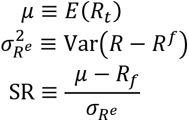

预期回报和波动性不可观察，但可以根据历史数据如下估算：

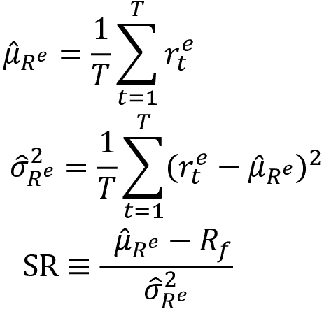

除非无风险利率波动较大（如新兴市场），超额回报和原始回报的标准偏差将相似。

对于**独立同分布**（**IID**）的回报，用于统计显著性检验的 SR 估计量的分布，根据大样本统计理论，可以从**中心极限定理**（**CLT**）的应用得出，这意味着像 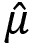 和 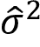 这样的 IID 随机变量的和收敛于正态分布。

当您需要比较不同频率的夏普比率时，例如月度和年度数据，您可以将更高频率的夏普比率乘以包含在更低频率中的对应时期的平方根。要将月度夏普比率转换为年度夏普比率，请乘以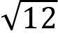，要将日度转换为月度，请乘以。 

然而，金融回报往往违反独立同分布假设。安德鲁·罗已经推导出了对分布和时间聚合进行必要调整的公式，以适应平稳但自相关的回报。这很重要，因为投资策略的时间序列特性（例如，均值回归，动量和其他形式的序列相关性）可能对夏普比率估计本身产生非平凡的影响，特别是当从高频数据年化夏普比率时（Lo，2002）。

### 信息比率

**信息比率**（**IR**）类似于夏普比率，但使用的是基准而不是无风险利率。基准通常被选为代表可用投资领域的投资组合，如标普 500 指数用于大型美国股票投资组合。

因此，信息比率（IR）衡量的是投资组合的超额回报，也称为阿尔法，相对于跟踪误差，即投资组合回报与基准回报之间的偏差，即：

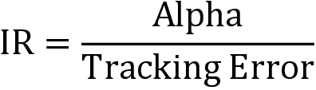

IR 还被用来解释超额回报如何取决于管理者的技能和她的策略的性质，我们将在下文中看到。

## 主动管理的基本定律

> “分散化是对无知的防护。如果你知道你在做什么，那就没多大意义。”
> 
> – 沃伦·巴菲特

一个好奇的事实是，**文艺复兴技术**（**RenTec**），由吉姆·西蒙斯创立的表现最佳的量化基金，在*第一章*，*交易的机器学习-从构想到执行*中提到过，尽管采取了极其不同的方法，却产生了与沃伦·巴菲特相似的回报。沃伦·巴菲特的投资公司伯克希尔·哈撒韦持有大约 100-150 只股票，持有时间相当长，而 RenTec 可能每天执行 10 万笔交易。我们如何比较这些不同的策略？

高 IR 反映了相对于承担的额外风险而言，基准的吸引人的超额表现。**主动管理的基本定律**解释了如何实现这样的结果：它将 IR 近似为**信息系数**（**IC**）和策略的广度的乘积。

正如前一章所讨论的，IC 衡量了回报预测之间的等级相关性，例如由阿尔法因子暗示的预期回报与实际未来回报之间的相关性。因此，它是管理者的预测技能的一种度量。策略的广度由投资者在给定时间段内进行的独立下注数（即交易数）来衡量，从而代表了应用预测技能的能力。

基本法律规定，IR，也称为**评估风险**（特雷纳和布莱克），是两个值的乘积。换句话说，它总结了频繁（高广度）和出色表现（高 IC）的重要性：

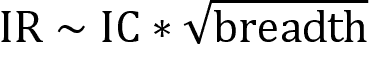

这个框架已经扩展到包括**转移系数**（**TC**）来反映投资组合约束作为一个额外因素（例如，对做空的限制），这可能会限制信息比率在否则可达到的水平以下的因素。 TC 代表了管理者将见解转化为投资组合投注的效率：如果没有约束，TC 将简单地等于一；但是如果管理者尽管预测表明他们应该这样做而不做空股票，TC 将小于一，并减少 IC（Clarke 等人，2002）。

基本法律之所以重要，是因为它突出了超额表现的关键驱动因素：准确预测和能够进行独立预测并在这些预测上采取行动都很重要。

在实践中，拥有广泛投资决策的管理人员可以通过信息系数在 0.05 至 0.15 之间实现显著的风险调整超额回报，如下模拟所示：

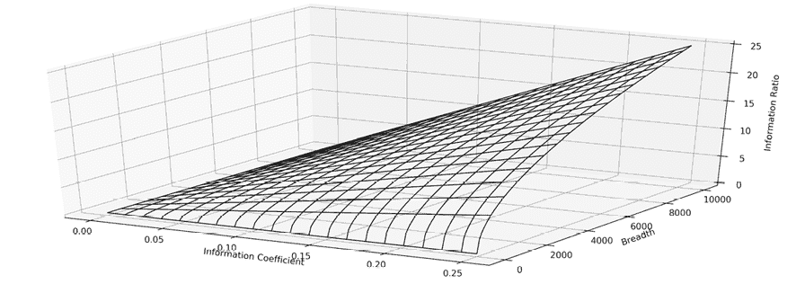

图 5.1：不同广度和信息系数值的信息比率

在实践中，鉴于预测之间的横截面和时间序列相关性，估计策略的广度是困难的。您应该将基本法律及其扩展视为一个有用的分析框架，用于思考如何改善您的风险调整后的投资组合绩效。接下来我们将看一些实践中做到这一点的技术。

# 如何管理投资组合风险和回报

投资组合管理旨在挑选和规模化金融工具中的头寸，以实现与基准相关的期望风险回报权衡。作为投资组合经理，在每个时期，您选择优化多样化的头寸，以降低风险并实现目标回报。在不同时期，这些头寸可能需要重新平衡，以考虑价格波动导致的权重变化，以实现或维持目标风险配置。

## 现代投资组合管理的演变

多样化使我们能够通过利用不完美的相关性，使一个资产的收益弥补另一个资产的损失，以降低给定预期回报的风险。哈里·马科维茨于 1952 年发明了**现代投资组合理论**（**MPT**），并提供了通过选择适当的投资组合权重来优化多样化的数学工具。

马科维茨展示了投资组合风险，以投资组合收益的标准偏差衡量，如何取决于所有资产收益之间的协方差以及它们的相对权重。这种关系意味着存在一组投资组合的**有效前沿**，其最大化了在给定最大化投资组合风险水平的情况下的投资组合回报。

然而，均值-方差前沿对于其计算所需的输入的估计非常敏感，这些输入包括预期回报、波动率和相关性。在实践中，将这些输入约束在一定范围内以减少抽样误差的均值-方差组合投资组合表现更好。这些受限制的特殊情况包括等权重、最小方差和风险平价投资组合。

**资本资产定价模型**（**CAPM**）是建立在 MPT 风险-回报关系基础上的资产估值模型。它引入了一个概念，即投资者在市场均衡状态下持有风险资产时可以期望的风险溢价；该溢价补偿了货币时间价值和无法通过分散化消除的整体市场风险暴露（与特定资产的特殊风险相对）。

**不可分散风险**的经济基础包括，例如，影响所有股票回报或债券违约的业务风险的宏观驱动因素。因此，资产的预期回报*E*[*r*[i]]是无风险利率*r*[f]和与资产暴露于市场组合预期超额回报*r*[m]的风险溢价的乘积的总和：

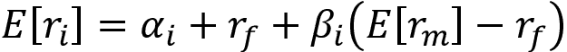

理论上，**市场组合**包含所有可投资资产，并且在均衡状态下，将由所有理性投资者持有。在实践中，一个广义的价值加权指数近似于市场，例如，对于美国股票投资来说是标准普尔 500 指数（S&P 500）。

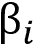测量了资产*i*对市场组合超额回报的暴露。如果 CAPM 有效，则截距部分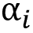应为零。实际上，CAPM 的假设通常未得到满足，而α捕捉了通过暴露于广泛市场而未解释的回报。

正如前一章所讨论的，随着时间的推移，研究揭示了**非传统风险溢价**，例如动量或股票价值效应，这些溢价解释了一些原始α。经济原理，如投资者对新信息的欠反应或过度反应的行为偏差，为暴露于这些替代风险因素的风险溢价提供了合理解释。

这些因素演变成了旨在捕捉这些**替代贝塔**的投资风格，这些替代贝塔可以通过专门的指数基金进行交易。同样，风险管理现在旨在控制除市场组合以外的多种风险来源的暴露。

在分离这些替代风险溢价的贡献后，真正的α仅限于特定资产回报和管理者调整风险暴露的能力。

**有效市场假说**（**EMH**）在过去几十年中得到了完善，以纠正 CAPM 的许多原始缺陷，包括信息不完全以及与交易、融资和代理相关的成本。许多行为偏见具有相同的效果，一些摩擦被建模为行为偏见。

过去几十年来，现代投资组合理论和实践发生了重大变化。我们将介绍几种方法：

+   均值-方差优化及其缺点

+   最小风险和 1/*n* 分配等替代方案

+   风险平价方法

+   风险因子方法

## 均值-方差优化

现代投资组合理论解决了为最小化给定预期收益的波动性或为给定波动性水平最大化收益的最优投资组合权重。关键的先决条件输入是预期资产收益率、标准偏差和协方差矩阵。

### 它的工作原理

多样化的作用是因为投资组合收益的方差取决于资产的协方差。通过包含相关性不完全的资产，可以将其降低到资产方差的加权平均值以下。

特别是，给定投资组合权重向量 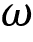 和协方差矩阵 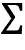，投资组合方差 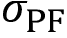 定义为：

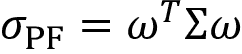

马科维茨表明，最大化预期投资组合收益的问题，在目标风险约束下具有等效的最小化投资组合风险的对偶表示，主要是在目标预期收益水平下，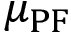。因此，优化问题变为：

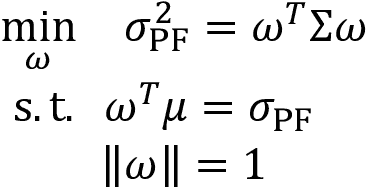

### 在 Python 中找到有效边界

我们可以使用 `scipy.optimize.minimize` 和资产收益率、标准偏差以及协方差矩阵的历史估计来计算有效边界。 SciPy 的 `minimize` 函数实现了一系列标量函数的受约束和无约束优化算法，这些函数从一个或多个输入变量中输出一个单一数字（详见 SciPy 文档以获取更多详情）。代码可以在本章的存储库的 `strategy_evaluation` 子文件夹中找到，并实现以下步骤序列：

首先，模拟使用狄利克雷分布生成随机权重，并使用历史回报数据计算每个样本投资组合的均值、标准偏差和 SR：

```py
def simulate_portfolios(mean_ret, cov, rf_rate=rf_rate, short=True):
    alpha = np.full(shape=n_assets, fill_value=.05)
    weights = dirichlet(alpha=alpha, size=NUM_PF)
    if short:
        weights *= choice([-1, 1], size=weights.shape)
    returns = weights @ mean_ret.values + 1
    returns = returns ** periods_per_year - 1
    std = (weights @ monthly_returns.T).std(1)
    std *= np.sqrt(periods_per_year)
    sharpe = (returns - rf_rate) / std
    return pd.DataFrame({'Annualized Standard Deviation': std,
                         'Annualized Returns': returns,
                         'Sharpe Ratio': sharpe}), weights 
```

接下来，我们设置二次优化问题，以解决给定收益的最小标准偏差或最大 SR。为此，我们定义了测量关键绩效指标的函数：

```py
def portfolio_std(wt, rt=None, cov=None):
    """Annualized PF standard deviation"""
    return np.sqrt(wt @ cov @ wt * periods_per_year)
def portfolio_returns(wt, rt=None, cov=None):
    """Annualized PF returns"""
    return (wt @ rt + 1) ** periods_per_year - 1
def portfolio_performance(wt, rt, cov):
    """Annualized PF returns & standard deviation"""
    r = portfolio_returns(wt, rt=rt)
    sd = portfolio_std(wt, cov=cov)
    return r, sd 
```

接下来，我们定义一个目标函数，表示 scipy 的 `minimize` 函数要优化的负 SR，考虑到权重受到的约束为 [0, 1]，并且绝对值总和为一：

```py
def neg_sharpe_ratio(weights, mean_ret, cov):
    r, sd = portfolio_performance(weights, mean_ret, cov)
    return -(r - rf_rate) / sd
weight_constraint = {'type': 'eq',
                     'fun': lambda x: np.sum(np.abs(x)) - 1}
def max_sharpe_ratio(mean_ret, cov, short=False):
    return minimize(fun=neg_sharpe_ratio,
                    x0=x0,
                    args=(mean_ret, cov),
                    method='SLSQP',
                    bounds=((-1 if short else 0, 1),) * n_assets,
                    constraints=weight_constraint,
                    options={'tol':1e-10, 'maxiter':1e4}) 
```

然后，我们通过迭代一系列目标回报并解决相应的最小方差组合来计算有效前沿。为此，我们使用对投资组合风险和回报的约束作为权重的函数来制定优化问题，如下所示：

```py
def min_vol_target(mean_ret, cov, target, short=False):
    def ret_(wt):
        return portfolio_returns(wt, mean_ret)
    constraints = [{'type': 'eq', 'fun': lambda x: ret_(x) - target},
                     weight_constraint]
    bounds = ((-1 if short else 0, 1),) * n_assets
    return minimize(portfolio_std, x0=x0, args=(mean_ret, cov),
                    method='SLSQP', bounds=bounds,
                    constraints=constraints,
                    options={'tol': 1e-10, 'maxiter': 1e4}) 
```

解决方案需要迭代在可接受值范围内的范围，以确定最佳的风险-回报组合：

```py
def efficient_frontier(mean_ret, cov, ret_range):
    return [min_vol_target(mean_ret, cov, ret) for ret in ret_range] 
```

模拟产生了一部分可行的投资组合，有效前沿确定了样本内可实现的最佳回报-风险组合，给定历史数据。

*图 5.2*显示了结果，包括最小方差组合、最大化 SR 的组合，以及几个由替代优化策略产生的组合，我们将在接下来的章节中讨论：

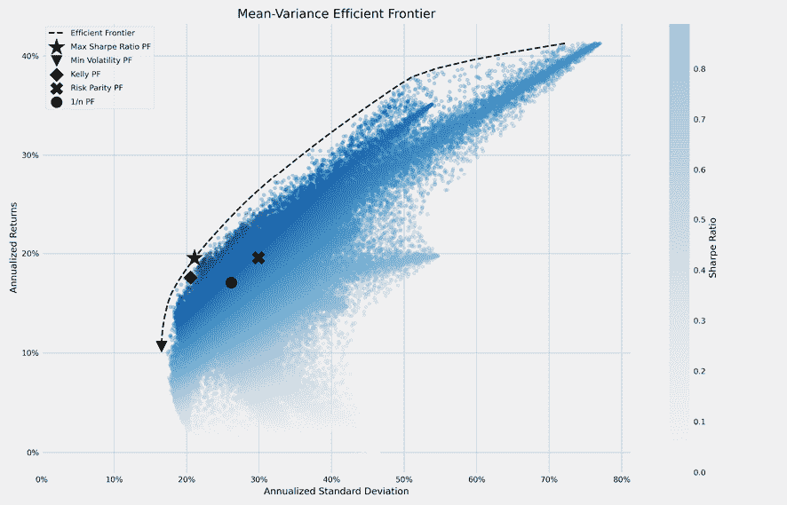

图 5.2：有效前沿和不同的优化组合

投资组合优化可以在交易策略的每个评估步骤中运行，以优化仓位。

### 挑战和缺点

前面的均值方差边界估计说明了**样本内**，也就是**向后看**优化。在实践中，投资组合优化需要前瞻性的输入和输出。然而，预期收益的准确估计是非常困难的。最好将其视为众多改进的起点和基准。

协方差矩阵的估计可能会更可靠一些，这导致了几种替代方法的出现。然而，具有相关资产的协方差矩阵会带来计算上的挑战，因为优化问题需要矩阵求逆。高条件数会导致数值不稳定性，从而产生**马尔可夫茨诅咒**：需要更多分散（通过相关的投资机会）时，算法产生的权重就越不可靠。

许多投资者更喜欢使用具有较少繁琐输入要求的投资组合优化技术。我们现在将介绍几种旨在解决这些缺点的替代方法，包括一种基于机器学习的较新方法。

## 均值方差优化的替代方案

对均值方差优化问题的准确输入的挑战已经导致了几种实用的替代方案的采用，这些方案限制了均值、方差或两者，或者省略了更具挑战性的回报估计，例如风险平价方法，我们将在本节后面讨论。

### 1/N 投资组合

简单的投资组合提供了用于衡量生成过拟合风险的复杂模型的增值的有用基准。最简单的策略——**等权重投资组合**——已被证明是最佳表现之一。

闻名的 de Miguel、Garlappi 和 Uppal（2009）比较了由各种均值-方差优化器产生的投资组合在样本外的表现，包括健壮的贝叶斯估计器、投资组合约束和投资组合的最优组合，与简单的 1/N 规则。他们发现，1/N 投资组合在各种数据集上产生了比替代方案更高的夏普比率，这可以解释为估计误差的高成本通常超过了样本外复杂优化的好处。

更具体地说，他们发现，对于具有 25 个资产的投资组合，样本为基础的均值-方差策略及其延伸优于 1/N 基准所需的估计窗口约为 3,000 个月，而对于具有 50 个资产的投资组合约为 6,000 个月。

在前一节的*图 5.2*中还包括了 1/N 投资组合。

### 最小方差投资组合

另一种选择是**全局最小方差**（**GMV**）投资组合，它优先考虑风险的最小化。它在*图 5.2*中显示，并可以通过使用均值-方差框架，如下所示，通过最小化投资组合标准偏差来计算：

```py
def min_vol(mean_ret, cov, short=False):
    return minimize(fun=portfolio_std,
                    x0=x0,
                    args=(mean_ret, cov),
                    method='SLSQP',
                    bounds=bounds = ((-1 if short else 0, 1),) * 
                          n_assets,
                          constraints=weight_constraint,
                          options={'tol': 1e-10, 'maxiter': 1e4}) 
```

相应的最小波动率投资组合位于有效前沿上，正如之前在*图 5.2*中所示。

### 全球投资组合优化 – Black-Litterman 方法

Black 和 Litterman（1992）的**全球投资组合优化**方法将经济模型与统计学习相结合。它很受欢迎，因为它能够在许多情况下生成合理的预期收益估计。

该技术假定市场是一个均值-方差投资组合，正如 CAPM 平衡模型所暗示的那样。它建立在这样一个事实上，即观察到的市场资本化可以被视为市场对每个证券分配的最佳权重。市场权重反映了市场价格，而市场价格反过来又体现了市场对未来收益的预期。

该方法因此可以从市场足够接近 CAPM 定义的均衡的假设中逆向推导出不可观察的未来预期收益。投资者可以使用缩小估计器将这些估计值调整到自己的信念。该模型可以被解释为投资组合优化的贝叶斯方法。我们将在*第十章*，*贝叶斯 ML – 动态夏普比率和配对交易策略*中介绍贝叶斯方法。

### 如何确定你的赌注大小 – 凯利准则

**凯利准则**在赌博界有着悠久的历史，因为它提供了在具有不同（但有利）赔率的（无限）一系列赌注中如何押注以最大化期末财富的指导。它是由 John Kelly 在 1956 年的论文*信息速率的新解释*中发表的，他是 Claude Shannon 在贝尔实验室的同事。他对在新的问答节目“$64,000 问题”上对候选人的投注感兴趣，其中一位西海岸的观众利用三小时的延迟获取内幕信息来获取胜利者。

凯利将与香农的信息论联系起来，以解决在赔率有利但不确定性仍然存在时，长期资本增长的最佳赌注。他的准则最大化对每个游戏成功概率的对数财富，并包括隐含的破产保护，因为*log(0)*为负无穷，因此凯利赌徒自然会避免失去一切。

#### 投注的最佳大小

凯利从分析具有二元赢输结果的游戏开始。关键变量包括：

+   *b*：定义了每次赌注赢得的金额的赔率。赔率= 5/1 意味着如果赌注获胜，则获得 5 美元，加上 1 美元的资本返还。

+   *p*：定义有利结果可能性的概率。

+   *f*：要下注的当前资本份额。

+   *V*：由于赌注而产生的资本价值。

凯利准则旨在最大化无限重复赌注的价值增长率*G*：

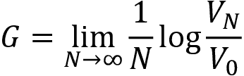

当*W*和*L*分别为赢得和输掉的次数时，则：

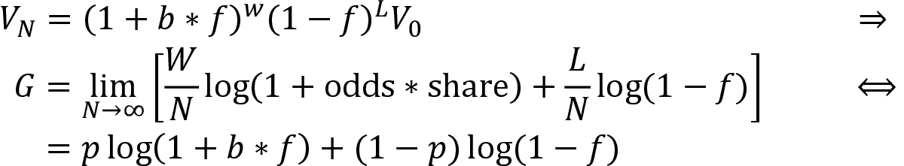

我们可以通过最大化*G*关于*f*的变化来最大化增长率*G*，使用 SymPy 进行说明，如下所示（您可以在`kelly_rule`笔记本中找到此内容）：

```py
from sympy import symbols, solve, log, diff
share, odds, probability = symbols('share odds probability')
Value = probability * log(1 + odds * share) + (1 - probability) * log(1 
        - share)
solve(diff(Value, share), share)
[(odds*probability + probability - 1)/odds] 
```

我们得出了要下注的资本的最佳份额：

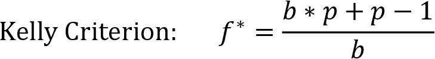

#### 最佳投资 - 单资产

在金融市场背景下，结果和替代方案都更加复杂，但凯利准则的逻辑仍然适用。它由 Ed Thorp 流行起来，他首先将其成功地应用于赌博（在书籍*Beat the Dealer*中描述），后来成立了成功的对冲基金 Princeton/Newport Partners。

对于连续的结果，资本的增长率由对可能的不同回报的概率分布的积分来定义，可以通过数值优化来优化：

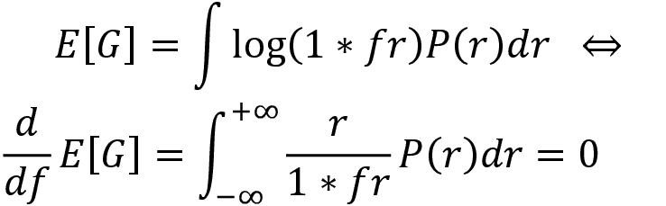

我们可以使用`scipy.optimize`模块解决此表达式以得出最优的*f**。`quad`函数使用 FORTRAN 的 QUADPACK 库计算在两个值*a*和*b*之间的定积分值（因此得名）。它返回积分值和误差估计：

```py
def norm_integral(f, m, st):
    val, er = quad(lambda s: np.log(1+f*s)*norm.pdf(s, m, st), m-3*st, 
                   m+3*st)
    return -val
def norm_dev_integral(f, m, st):
    val, er = quad(lambda s: (s/(1+f*s))*norm.pdf(s, m, st), m-3*st, 
                   m+3*st)
    return val
m = .058
s = .216
# Option 1: minimize the expectation integral
sol = minimize_scalar(norm_integral, args=(
                m, s), bounds=[0., 2.], method='bounded')
print('Optimal Kelly fraction: {:.4f}'.format(sol.x))
Optimal Kelly fraction: 1.1974 
```

### 最佳投资 - 多个资产

我们将使用一个包含各种权益的示例。E. Chan（2008）说明了如何得出凯利准则的多资产应用，结果等同于（可能是杠杆的）从均值-方差优化中得出的最大夏普比率投资组合。

计算涉及精度矩阵（协方差矩阵的逆）与回报矩阵的点积：

```py
mean_returns = monthly_returns.mean()
cov_matrix = monthly_returns.cov()
precision_matrix = pd.DataFrame(inv(cov_matrix), index=stocks, columns=stocks)
kelly_wt = precision_matrix.dot(mean_returns).values 
```

凯利投资组合也显示在之前的有效边界图中（标准化以使绝对权重之和等于一）。许多投资者更喜欢减少凯利权重以降低该策略的波动性，而半凯利则变得特别受欢迎。

## 风险平价

过去 15 年的两次全球股票市场危机、一直呈上升趋势的收益率曲线以及利率的普遍下降，使得风险平价看起来成为一种特别引人注目的选择。许多机构将战略性配置给了风险平价以进一步实现投资组合的多样化。

风险平价的简单实现根据它们的方差的倒数分配资产，忽略了相关性，尤其是回报预测：

```py
var = monthly_returns.var()
risk_parity_weights = var / var.sum() 
```

风险平价投资组合也显示在本节开头的有效边界图中。

## 风险因子投资

估算输入的另一种替代框架是向下工作到驱动资产风险和回报的基础决定因素或因子。如果我们了解这些因素如何影响回报，我们又了解这些因素，我们将能够构建更健壮的投资组合。

因子投资的概念超越了资产类别标签。它着眼于我们在上一章关于 alpha 因子中讨论过的基础因子风险，以最大程度地实现分散化的利益。因子投资不是通过诸如对冲基金或私募股权之类的标签来区分投资工具，而是旨在根据暴露于基本风险因子的差异来识别不同的风险-回报配置（Ang 2014）。

对于均值-方差投资的天真方法将（人为的）分组视为不同的资产类别并纳入均值-方差优化器中。因子投资认识到这些分组与传统资产类别共享许多相同的因子风险。分散化的好处可能被夸大，正如投资者在 2008 年危机期间发现的那样，当风险资产类别之间的相关性增加时，由于暴露于相同的基础因子风险，相关性增加。

在*第七章*，*线性模型-从风险因素到收益预测*中，我们将展示如何测量投资组合对各种风险因素的暴露，以便您可以调整头寸以调整您的因子敞口，或者相应地进行对冲。

## 分层风险平价

均值-方差优化对预期收益的估计和这些收益的协方差非常敏感。当收益高度相关时，协方差矩阵的求逆也变得更具挑战性和不太准确，这在实践中经常是情况。结果被称为马科维茨诅咒：当分散化更为重要因为投资相关时，传统的投资组合优化器可能会产生不稳定的解决方案。分散化的好处可能会被错误的估计抵消。正如讨论的那样，甚至是天真的、等权重的投资组合都可以在样本外击败均值-方差和基于风险的优化。

更健壮的方法已经合并了额外的约束 (Clarke et al., 2002) 或贝叶斯先验 (Black and Litterman, 1992)，或者使用收缩估计量使精度矩阵更加数值稳定 (Ledoit and Wolf, 2003)，这在 scikit-learn 中可用 ([`scikit-learn.org/stable/modules/generated/sklearn.covariance.LedoitWolf.html`](http://scikit-learn.org/stable/modules/generated/sklearn.covariance.LedoitWolf.html))。

**分层风险平价** (**HRP**) 相比之下，利用无监督机器学习来实现出色的样本外投资组合分配。 最近在投资组合优化方面的创新利用图论和层次聚类来构建投资组合分为三个步骤 (Lopez de Prado, 2015)：

1.  定义一个距离度量，使相关资产彼此接近，并应用单链接聚类来识别层次关系。

1.  利用层次相关结构对协方差矩阵进行准对角化。

1.  应用自顶向下的逆方差加权使用递归二分搜索将集群资产视为投资组合构建中的补充而不是替代品，并减少自由度数量。

构建**分层聚类投资组合** (**HCP**) 的一种相关方法由 Raffinot (2016) 提出。 从概念上讲，诸如金融市场之类的复杂系统倾向于具有结构，并且通常以分层方式组织，而层次结构中元素之间的相互作用塑造了系统的动态。 相关矩阵也缺乏层次结构的概念，这使得权重可以自由变化并且可能以意想不到的方式变化。

JP Morgan (2012) 对各种股票投资组合进行了 HRP 和 HCP 的测试。 其中，HRP 尤其产生了与天真分散、最大分散投资组合或 GMV 投资组合相比相等或更优的风险调整后回报和夏普比率。

我们将在*第十三章*，*使用无监督学习的数据驱动风险因素和资产配置*中介绍 Python 实现。

# 使用 Zipline 进行交易和管理投资组合

在上一章中，我们介绍了 Zipline 来模拟对一系列股票的市场、基本和替代数据的 alpha 因子的计算。 在本节中，我们将开始根据 alpha 因子发出的信号行动起来。 我们将通过提交买入和卖出订单来做到这一点，以便我们可以建立多头和空头头寸或者重新平衡投资组合，以将我们的持仓调整到最新的交易信号。

我们将推迟优化投资组合权重至本章后面，并且，目前，只是为每个持仓分配相同价值的仓位。 正如前一章中所述，对包括 ML 模型的策略进行测试和评估的深入介绍将在*第六章*，*机器学习流程*中进行。

## 安排信号生成和交易执行

我们将使用前一章开发的自定义`MeanReversion`因子（请参见`01_backtest_with_trades.ipynb`中的实现）。

由`compute_factors()`方法创建的`Pipeline`返回一个包含 50 个多头和空头的列的表格。它根据其上个月回报率与年均值的最大负偏差和最大正偏差选择股票，标准差归一化：

```py
def compute_factors():
    """Create factor pipeline incl. mean reversion,
        filtered by 30d Dollar Volume; capture factor ranks"""
    mean_reversion = MeanReversion()
    dollar_volume = AverageDollarVolume(window_length=30)
    return Pipeline(columns={'longs'  : mean_reversion.bottom(N_LONGS),
                             'shorts' : mean_reversion.top(N_SHORTS),
                             'ranking': mean_reversion.rank(ascending=False)},
                    screen=dollar_volume.top(VOL_SCREEN)) 
```

它还将宇宙限制为过去 30 个交易日交易量最高的 1,000 只股票。`before_trading_start()`确保每日执行`Pipeline`和记录结果，包括当前价格：

```py
def before_trading_start(context, data):
    """Run factor pipeline"""
    context.factor_data = pipeline_output('factor_pipeline')
    record(factor_data=context.factor_data.ranking)
    assets = context.factor_data.index
    record(prices=data.current(assets, 'price')) 
```

新的`rebalance()`方法向由`Pipeline`标记为多头和空头头寸的资产提交交易订单，权重相等并且为正负值。它还剥离任何当前持仓，这些持仓不再包含在因子信号中：

```py
def exec_trades(data, assets, target_percent):
    """Place orders for assets using target portfolio percentage"""
    for asset in assets:
        if data.can_trade(asset) and not get_open_orders(asset):
            order_target_percent(asset, target_percent)
def rebalance(context, data):
    """Compute long, short and obsolete holdings; place trade orders"""
    factor_data = context.factor_data
    assets = factor_data.index
    longs = assets[factor_data.longs]
    shorts = assets[factor_data.shorts]
    divest = context.portfolio.positions.keys() - longs.union(shorts)
    exec_trades(data, assets=divest, target_percent=0)
    exec_trades(data, assets=longs, target_percent=1 / N_LONGS if N_LONGS 
                else 0)
    exec_trades(data, assets=shorts, target_percent=-1 / N_SHORTS if N_SHORTS 
                else 0) 
```

`rebalance()`方法根据`schedule_function()`工具在周初开始，紧接着`market_open`运行，正如内置的`US_EQUITIES`日历所规定的那样（有关规则的详细信息，请参阅 Zipline 文档）。

您还可以指定交易佣金，既以相对比例，又以最小金额。还有一种定义滑点的选项，即交易决策与执行之间价格不利变化的成本：

```py
def initialize(context):
    """Setup: register pipeline, schedule rebalancing,
        and set trading params"""
    attach_pipeline(compute_factors(), 'factor_pipeline')
    schedule_function(rebalance,
                      date_rules.week_start(),
                      time_rules.market_open(),
                      calendar=calendars.US_EQUITIES)
    set_commission(us_equities=commission.PerShare(cost=0.00075, 
                                                   min_trade_cost=.01))
    set_slippage(us_equities=slippage.VolumeShareSlippage(volume_limit=0.0025, price_impact=0.01)) 
```

调用`run_algorithm()`函数后，算法继续执行，并返回我们在前一章中看到的相同的回测性能`DataFrame`。

## 实施均值方差投资组合优化

我们在上一节中演示了如何使用`scipy.optimize`找到有效前沿。在本节中，我们将利用 PyPortfolioOpt 库，该库提供投资组合优化（使用 SciPy 作为内部支持），包括有效前沿技术和更近期的收缩方法，用于正则化协方差矩阵（请参见*第七章*，*线性模型 - 从风险因素到收益预测*，关于线性回归的收缩）。代码示例位于`02_backtest_with_pf_optimization.ipynb`中。

我们将使用从`MeanReversion`因子排名派生的 50 个多头和空头头寸相同的设置。`rebalance()`函数接收建议的多头和空头头寸，并将每个子集传递给新的`optimize_weights()`函数以获得`asset: target_percent`对的字典：

```py
def rebalance(context, data):
    """Compute long, short and obsolete holdings; place orders"""
    factor_data = context.factor_data
    assets = factor_data.index
    longs = assets[factor_data.longs]
    shorts = assets[factor_data.shorts]
    divest = context.portfolio.positions.keys() - longs.union(shorts)
    exec_trades(data, positions={asset: 0 for asset in divest})
    # get price history
    prices = data.history(assets, fields='price',
                          bar_count=252+1, # 1 yr of returns 
                          frequency='1d')
    if len(longs) > 0:
        long_weights = optimize_weights(prices.loc[:, longs])
        exec_trades(data, positions=long_weights)
    if len(shorts) > 0:
        short_weights = optimize_weights(prices.loc[:, shorts], short=True)
        exec_trades(data, positions=short_weights) 
```

`optimize_weights()`函数使用`PyPortfolioOpt`提供的`EfficientFrontier`对象，找到基于最近一年的收益和协方差矩阵的最大夏普比率的权重，库也计算这两个值：

```py
def optimize_weights(prices, short=False):
    returns = expected_returns.mean_historical_return(prices=prices, 
                                                      frequency=252)
    cov = risk_models.sample_cov(prices=prices, frequency=252)
    # get weights that maximize the Sharpe ratio
    ef = EfficientFrontier(expected_returns=returns, 
                           cov_matrix=cov, 
                           weight_bounds=(0, 1), 
                           gamma=0)

    weights = ef.max_sharpe()
    if short:
        return {asset: -weight for asset, weight in ef.clean_weights().items()}
    else:
        return ef.clean_weights() 
```

它返回归一化的权重，总和为 1，对于空头头寸设置为负值。

*图 5.3* 表明，对于这个特定的策略和时间范围，均值方差优化的投资组合表现明显更好：

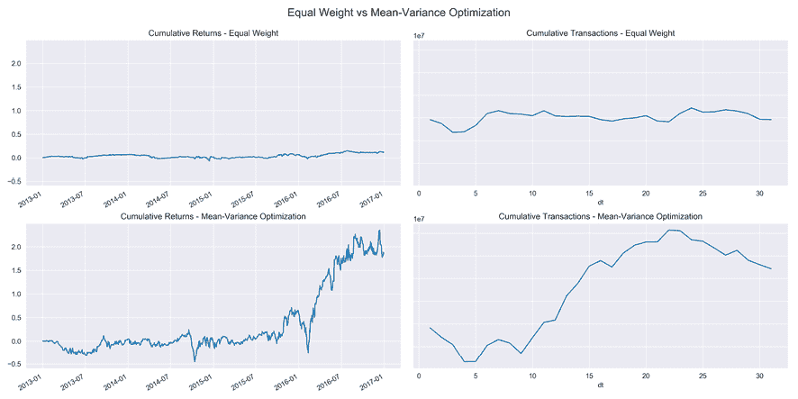

图 5.3: 均值方差 vs 等权重投资组合表现

PyPortfolioOpt 还可以找到最小波动率的投资组合。更普遍地说，这个例子说明了如何使用前一节介绍的方法，或者您选择的任何其他方法，添加逻辑来调整投资组合权重。

我们现在将转向投资组合回报和风险的常见衡量标准，以及如何使用 pyfolio 库来计算它们。

# 使用 pyfolio 测量回测性能

Pyfolio 便利地分析了投资组合性能，在和样本外都使用了丰富的指标和可视化。它生成了覆盖回报、仓位和交易分析的泪水表，以及在市场压力期间使用几种内置场景进行事件风险分析。它还包括贝叶斯样本外性能分析。

Pyfolio 依赖于投资组合回报和仓位数据，还可以考虑交易活动的交易成本和滑点损失。它使用 empyrical 库，该库也可以独立用于计算性能指标。

## 创建回报和基准输入

该库是 Quantopian 生态系统的一部分，并与 Zipline 和 Alphalens 兼容。我们首先将演示如何从 Alphalens 生成所需的输入，然后展示如何从 Zipline 回测性能的 `DataFrame` 中提取它们。本节的代码示例在笔记本 `03_pyfolio_demo.ipynb` 中。

### 从 Alphalens 获取 pyfolio 输入

Pyfolio 还直接集成了 Alphalens，并允许使用 `create_pyfolio_input` 创建 pyfolio 输入数据：

```py
from alphalens.performance import create_pyfolio_input
qmin, qmax = factor_data.factor_quantile.min(), 
             factor_data.factor_quantile.max()
input_data = create_pyfolio_input(alphalens_data,
                                  period='1D',
                                  capital=100000,
                                  long_short=False,
                                  equal_weight=False,
                                  quantiles=[1, 5],
                                  benchmark_period='1D')
returns, positions, benchmark = input_data 
```

有两个选项可以指定如何生成投资组合权重：

+   `long_short`: 如果为 `False`，权重将对应于因子值除以它们的绝对值，以便负因子值生成空头头寸。如果为 `True`，则因子值首先被减去，以便多头和空头头寸相互抵消，投资组合是市场中性的。

+   `equal_weight`: 如果`True`并且 `long_short` 为 `True`，资产将分成两个等大小的组，顶部/底部一半组成多头/空头头寸。

如果`factor_data` 包括每个资产的部门信息，还可以为组创建多头-空头投资组合，例如。

### 从 Zipline 回测获取 pyfolio 输入

还可以使用 `extract_rets_pos_txn_from_zipline` 将 Zipline 回测的结果转换为所需的 pyfolio 输入：

```py
returns, positions, transactions = 
         extract_rets_pos_txn_from_zipline(backtest) 
```

## 步行前测试 - 样本外回报

测试交易策略涉及回测和前瞻性测试。前者涉及历史数据，并且通常指的是用于微调 alpha 因子参数的样本期间。前瞻性测试在新市场数据上模拟策略，以验证其在样本外的表现，并且不会过于贴近特定的历史情况。 

Pyfolio 允许指定一个样本外期间来模拟前瞻性测试。测试策略以获得统计上可靠的结果时，有许多方面需要考虑。我们将在第八章 *ML4T 工作流程 – 从模型到策略回测* 中更详细地讨论这一点。

函数 `plot_rolling_returns` 显示样本内和样本外累积回报与用户定义的基准（我们使用标准普尔 500）的对比。Pyfolio 将累积回报计算为每个回报加 1 后的简单回报的乘积：

```py
from pyfolio.plotting import plot_rolling_returns
plot_rolling_returns(returns=returns,
                     factor_returns=benchmark_rets,
                     live_start_date='2016-01-01',
                     cone_std=(1.0, 1.5, 2.0)) 
```

*图 5.4* 中的图表包括一个锥体，显示扩展的置信区间，以指示在随机行走假设下，样本外回报何时似乎不太可能。在这里，我们的玩具策略在模拟的 2016 年样本外期间表现不佳，相对于标准普尔 500 指数：

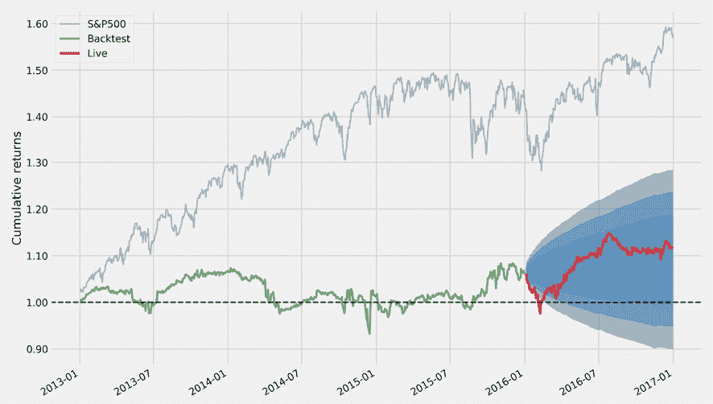

图 5.4：Pyfolio 累积表现图

### 摘要性能统计

Pyfolio 提供了几个分析函数和图表。`perf_stats` 摘要显示了年度和累积回报、波动率、偏度和峰度以及 SR。

以下附加指标（也可以单独计算）最为重要：

+   **最大回撤**：相对于前一峰值的最大百分比损失

+   **卡尔玛比率**：年度组合回报与最大回撤的相对值

+   **欧米伽比率**：对于回报目标的基于概率加权的增益与损失比率，默认为零

+   **索蒂诺比率**：相对于下行标准差的超额回报

+   **尾部比率**：右尾部的大小（增益，第 95 百分位的绝对值）相对于左尾部的大小（损失，第 5 百分位的绝对值）

+   **每日风险价值（VaR）**：对应于每日均值下两个标准偏差的损失

+   **阿尔法**：未被基准回报解释的投资组合回报

+   **贝塔**：与基准的暴露

函数 `plot_perf_stats` 通过自助法估计参数变异性，并将结果显示为箱线图：

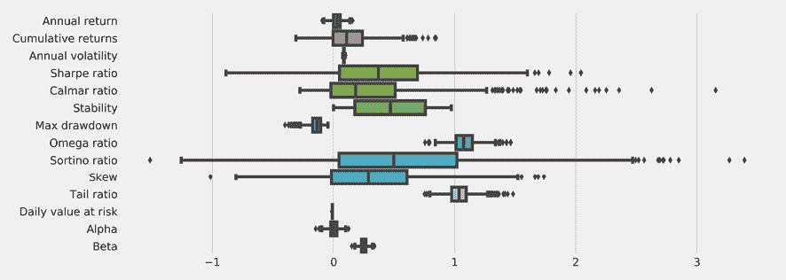

图 5.5：Pyfolio 表现统计图

函数 `show_perf_stats` 计算整个期间以及样本内和样本外期间的多个指标：

```py
from pyfolio.timeseries import show_perf_stats
show_perf_stats(returns=returns, 
                factor_returns=benchmark_rets, 
                positions=positions, 
                transactions=transactions, 
                live_start_date=oos_date) 
```

对于从 `MeanReversion` 因子派生的模拟多空投资组合，我们得到以下表现统计：

| 指标 | 全部 | 样本内 | 样本外 |
| --- | --- | --- | --- |
| 年度回报 | 2.80% | 2.10% | 4.70% |
| 累积回报 | 11.60% | 6.60% | 4.70% |
| 年度波动率 | 8.50% | 8.80% | 7.60% |
| 夏普比率 | 0.37 | 0.29 | 0.64 |
| 卡尔马比率 | 0.21 | 0.16 | 0.57 |
| 稳定性 | 0.26 | 0.01 | 0.67 |
| 最大回撤 | -13.10% | -13.10% | -8.30% |
| 欧米伽比率 | 1.07 | 1.06 | 1.11 |
| 索提诺比率 | 0.54 | 0.42 | 0.96 |
| 偏度 | 0.33 | 0.35 | 0.25 |
| 峰度 | 7.2 | 8.04 | 2 |
| 尾部比率 | 1.04 | 1.06 | 1.01 |
| 日风险价值 | -1.10% | -1.10% | -0.90% |
| 总杠杆 | 0.69 | 0.68 | 0.72 |
| 日换手率 | 8.10% | 8.00% | 8.40% |
| Alpha | 0 | -0.01 | 0.03 |
| Beta | 0.25 | 0.27 | 0.17 |

请参阅附录以获取有关投资组合风险和回报度量的计算和解释详细信息。

### 跌幅期和因素暴露

函数`plot_drawdown_periods(returns)`绘制投资组合的主要跌幅期，并且还有几个绘图函数显示滚动的 SR 和滚动因子暴露于市场 beta 或 Fama-French 尺寸、增长和动量因子：

```py
fig, ax = plt.subplots(nrows=2, ncols=2, figsize=(16, 10))
axes = ax.flatten()
plot_drawdown_periods(returns=returns, ax=axes[0])
plot_rolling_beta(returns=returns, factor_returns=benchmark_rets, 
                  ax=axes[1])
plot_drawdown_underwater(returns=returns, ax=axes[2])
plot_rolling_sharpe(returns=returns) 
```

图 5.6 中的图表突出显示了各种撕裂表中包含的可视化子集，说明了 pyfolio 如何让我们深入了解绩效特征并让我们接触到风险和回报的基本驱动因素：  

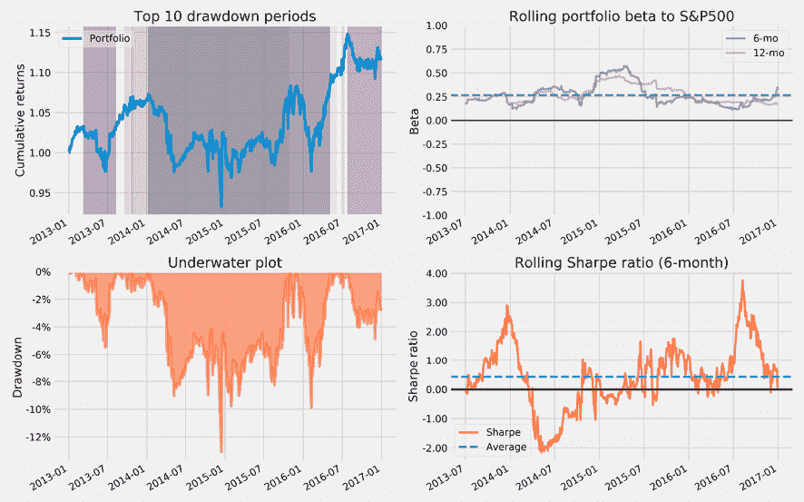

图 5.6：随时间变化的各种 pyfolio 绘图

### 建模事件风险

Pyfolio 还包括各种事件的时间表，您可以使用它来比较投资组合在此期间与基准的表现。 Pyfolio 默认使用标准普尔 500 指数，但您也可以提供您选择的基准回报。以下示例将绩效与 2015 年秋季的标准普尔 500 指数相比，该指数跌至英国脱欧后的情况：

```py
interesting_times = extract_interesting_date_ranges(returns=returns)
interesting_times['Fall2015'].to_frame('pf') \
 .join(benchmark_rets) \
 .add(1).cumprod().sub(1) \
 .plot(lw=2, figsize=(14, 6), title='Post-Brexit Turmoil') 
```

*图 5.7*显示了结果图：

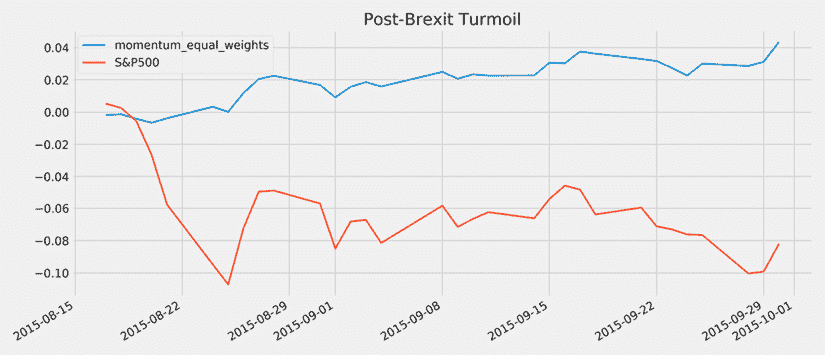

图 5.7：Pyfolio 事件风险分析

# 摘要

在本章中，我们涵盖了投资组合管理的重要主题，这涉及将投资头寸组合起来以管理风险和回报的权衡目标。我们介绍了 pyfolio 来计算和可视化关键的风险和回报指标，并比较各种算法的性能。

我们看到准确的预测对于优化投资组合权重和最大化多样化效益至关重要。我们还探讨了机器学习如何通过从资产收益协方差矩阵中学习分层关系，促进更有效的投资组合构建。

现在我们将转向本书的第二部分，重点介绍机器学习模型的使用。这些模型将通过更有效地利用更多样化的信息来产生更准确的预测。他们这样做是为了捕捉比迄今为止最突出的简单的 alpha 因子更复杂的模式。

我们将首先通过交叉验证来训练、测试和调整用于回归和分类的线性模型，以实现强健的样本外表现。我们还将把这些模型嵌入到定义和回测算法交易策略的框架中，这是我们在前两章中介绍过的。
