# 第六章：6

# 机器学习过程

本章开始了本书的第二部分，我们将演示如何使用各种监督和无监督的机器学习模型进行交易。在展示相关 Python 库的各种应用之前，我们将解释每个模型的假设和用例。在第 2-4 部分我们将涵盖的模型类别包括：

+   用于截面、时间序列和面板数据回归和分类的线性模型

+   广义加性模型，包括非线性基于树的模型，如决策树

+   集成模型，包括随机森林和梯度提升机

+   用于降维和聚类的无监督线性和非线性方法

+   神经网络模型，包括循环和卷积架构

+   强化学习模型

我们将这些模型应用于本书第一部分介绍的市场、基本和替代数据源。我们将通过演示如何将这些模型嵌入到将模型信号转换为交易的交易策略中，如何优化投资组合以及如何评估策略绩效来扩展到目前为止所涵盖的材料。

这些模型及其应用中有许多共同点。本章涵盖了这些共同点，以便我们可以专注于以下章节中的特定模型用法。它们包括从数据中学习功能关系的总体目标，通过优化目标或损失函数。它们还包括测量模型性能的相关方法。

我们将区分无监督学习和监督学习，并概述算法交易的用例。我们将对比监督回归和分类问题，并使用监督学习进行输入和输出数据之间关系的统计推断，以及用于未来输出预测的使用。

我们还将说明预测误差是由于模型的偏差或方差，或者是由于数据中高噪声信号比引起的。最重要的是，我们将提出诊断错误来源（如过度拟合）并改善模型性能的方法。

在本章中，我们将涵盖以下与在实践中应用 ML 工作流相关的主题：

+   从数据中学习的监督和无监督学习的工作原理

+   训练和评估用于回归和分类任务的监督学习模型

+   偏差-方差权衡如何影响预测性能

+   如何诊断和解决由于过度拟合而导致的预测误差

+   使用交叉验证来优化超参数，重点关注时间序列数据

+   在测试样本外时，为什么金融数据需要额外注意

如果您已经对机器学习非常熟悉，可以跳过并直接开始学习如何使用机器学习模型为算法交易策略生成和组合阿尔法因子。本章的 GitHub 存储库中包含代码示例和额外资源的目录。

# 机器学习是如何从数据中进行的

许多机器学习的定义都围绕着对数据中有意义的模式的自动检测。两个显著的例子包括：

+   人工智能先驱**阿瑟·塞缪尔森**在 1959 年将机器学习定义为计算机科学的一个子领域，使计算机能够在没有明确编程的情况下学习。

+   **汤姆·米切尔**，这个领域的现任领导者之一，更加具体地确定了一个明确定义的学习问题，1998 年：一台计算机程序通过与任务和性能度量相关的经验来学习，以确定任务的性能是否随着经验的积累而提高（Mitchell 1997）。

经验以训练数据的形式呈现给算法。与以往构建解决问题的机器的尝试的主要区别在于，算法用于做出决策的规则是从数据中学习的，而不是像上世纪 80 年代突出的专家系统那样由人类编程的。

推荐的涵盖各种算法和通用应用的教科书包括 James 等人（2013），Hastie、Tibshirani 和 Friedman（2009），Bishop（2006）和 Mitchell（1997）。

## 挑战——将算法与任务匹配

自动学习的关键挑战是识别训练数据中的模式，这些模式在将模型的学习推广到新数据时具有意义。模型能够识别的潜在模式的数量很大，而训练数据只构成了算法在未来执行任务时可能遇到的更大现象集合的样本。

无限数量的函数可能会从给定输入生成观察到的输出，这使得搜索真实函数的过程成为不可能，除非限制符合条件的候选集。算法能够学习的模式类型受其包含可能表示的函数的**假设空间**大小以及样本数据提供的信息量的限制。

假设空间的大小在各种算法之间变化很大，我们将在接下来的章节中看到。一方面，这种限制使得成功搜索成为可能，另一方面，它意味着一种归纳偏差，可能导致算法从训练样本泛化到新数据时性能不佳。

因此，关键挑战在于如何选择一个具有足够大的假设空间的模型，以包含对学习问题的解决方案，同时又足够小，以确保给定训练数据的可靠学习和概括性。有了更多信息的数据，具有更大假设空间的模型成功的机会更大。

**无免费午餐定理**表明没有通用的学习算法。相反，学习者的假设空间必须根据任务领域的先验知识进行定制，以便搜索出能够成功概括的有意义模式（Gómez and Rojas 2015）。

我们将在本章中密切关注模型对特定任务的数据关系所作的假设，并强调将这些假设与从数据探索中获得的经验证据相匹配的重要性。

机器学习任务有几个类别，其目的、可用信息以及因此学习过程本身有所不同。主要类别包括监督、无监督和强化学习，接下来我们将审查它们的关键区别。

## 监督学习——通过示例教学

**监督学习**是最常用的 ML 类型。我们将在本书的大部分章节中致力于这一类别的应用。术语*监督*意味着存在一个结果变量来引导学习过程——也就是说，它教会了算法对手头任务的正确解决方案。监督学习旨在从反映这种关系的个体样本中捕获功能输入-输出关系，并通过对新数据做出有效的陈述来应用其学习。

根据领域的不同，输出变量也可以互换地称为标签、目标或结果，以及内生或左侧变量。我们将使用*y*[i]表示结果观测值*i*=1，...，*N*，或者*y*表示（列）向量的结果。一些任务具有多个结果，并称为**多标签问题**。

监督学习问题的输入数据也称为特征，以及外生或右侧变量。我们使用*x*[i]表示观测值*i*=1，...，*N*的特征向量，或者在矩阵表示中表示为*X*，其中每列包含一个特征，每行包含一个观测值。

监督学习问题的解决方案是一个函数 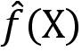，表示模型从样本中学到的输入-输出关系，并逼近真实关系，表示为 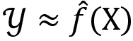。这个函数可以潜在地用于推断变量之间的统计关联或甚至因果关系，超出样本范围，或者可以用于预测新输入数据的输出。

从数据中学习输入-输出关系以便对新输入进行准确预测的任务面临重要的权衡。更复杂的模型具有更多的可移动部分，能够表示更微妙的关系。然而，它们也更有可能学习到特定于训练样本的随机噪声，而不是代表一般模式的系统信号。当这种情况发生时，我们称模型对训练数据**过度拟合**。此外，复杂模型可能也更难以检查，这使得理解学到的关系的性质或特定预测的驱动因素变得更加困难。

另一方面，过于简单的模型将错过复杂的信号并提供有偏见的结果。这种权衡在监督学习中被称为**偏差-方差权衡**，但从概念上讲，这也适用于其他形式的机器学习，即太简单或太复杂的模型可能在训练数据之外表现不佳。

## 无监督学习-发现有用的模式

当解决**无监督学习**问题时，我们只观察特征，并没有对结果进行测量。 无监督算法的目标不是预测未来结果或推断变量之间的关系，而是旨在识别输入中的结构，从而允许对数据中包含的信息进行新的表示。

经常，成功的衡量标准是结果对解决其他问题的贡献。这包括识别观察之间的共同点或群集，或者转换特征以获得捕获相关信息的压缩摘要。

关键挑战在于无监督算法必须在没有结果信息提供的情况下完成任务。因此，我们通常无法像在监督情况下那样将结果与基本事实进行评估，其质量可能视人而异。但是，有时，我们可以评估其对下游任务的贡献，例如降维使得更好的预测成为可能。

有许多方法，从成熟的聚类算法到前沿的深度学习模型，以及几个与我们目的相关的使用案例。

### 使用案例-从风险管理到文本处理

在后续章节中，我们将涵盖许多无监督学习的交易使用案例：

+   将具有相似风险和回报特征的证券分组（请参阅*第十三章*，*使用无监督学习的数据驱动风险因子和资产配置中的分层风险均等化*）

+   使用**主成分分析**（*第十三章*，*使用无监督学习的数据驱动风险因子和资产配置*）或**自编码器**（*第十九章*，*用于多变量时间序列和情感分析的 RNN*）找出驱动大量证券表现的少量风险因子。

+   识别文档集合（例如，收入电话会议记录）中包含的最重要方面的潜在主题（*第十四章*，*用于交易的文本数据 - 情感分析*）

在高层次上，这些应用依赖于识别聚类的方法和降低数据维度的方法。

### 聚类算法 - 寻找相似观察

聚类算法应用相似性概念来识别包含可比较信息的观察或数据属性。它们通过将大量数据点分配给较少数量的聚类来总结数据集。它们这样做是为了使聚类成员彼此之间的关系比与其他聚类成员的关系更密切。

聚类算法在假设关于各种分组是如何生成以及是什么使它们相似方面有所不同。因此，它们倾向于产生不同类型的聚类，因此应根据数据的特性选择。一些著名的例子包括：

+   **K 均值聚类**：数据点属于等大小的*k*个椭圆形簇之一。

+   **高斯混合模型**：数据点由各种多元正态分布之一生成。

+   **基于密度的聚类**：聚类可以是任意形状的，并且仅由附近的最小数量的数据点的存在定义。

+   **分层聚类**：数据点属于由逐渐合并较小簇形成的各种超集。

### 降维 - 压缩信息

**降维**生成包含源数据中最重要信息的新数据。这些算法不是将数据分组到保留原始数据的簇中，而是以使用更少特征来表示原始信息的目标来转换数据。

算法在数据转换方式及因此产生的压缩数据集的性质上有所不同，如下列表所示：

+   **主成分分析（PCA）**：找到线性转换，捕获现有数据集中大部分方差

+   **流形学习**：识别出产生数据的低维表示的非线性变换

+   **自动编码器**：使用神经网络对数据进行非线性压缩，最小化信息损失。

在以下几章中，我们将更深入地研究这些无监督学习模型，包括对**自然语言处理**（**NLP**）的重要应用，例如主题建模和 Word2vec 特征提取。

## 强化学习 - 通过试错学习

**强化学习**（**RL**）是 ML 的第三种类型。它以代理为中心，代理需要在每个时间步选择一个动作，这是基于环境提供的信息。代理可以是自动驾驶汽车、玩棋盘游戏或视频游戏的程序，或者在某个安全市场上运行的交易策略。您可以在*Sutton 和 Barto（2018）*中找到一篇优秀的介绍。

代理的目标是选择随着时间推移产生最高回报的行动，这是基于一组描述环境当前状态的观察而进行的。它既是动态的又是交互式的：积极和消极奖励的流动影响着算法的学习，而现在采取的行动可能会影响环境和未来的奖励。

代理需要从一开始就采取行动，并以“在线”方式学习，随着时间的推移，一次一个样本。学习过程采用试错方法。这是因为代理需要在利用过去产生某种奖励的行动和探索可能增加未来奖励的新行动之间进行权衡。RL 算法使用动态系统理论以及具有不完整信息的马尔可夫决策过程的最优控制来优化代理的学习。

RL 与监督学习不同，监督学习的训练数据为算法提供了上下文和正确决策。它专门针对交互式设置，其中结果只在一段时间后变得可用，并且学习必须随着代理获取新经验而持续进行。

**人工智能**（**AI**）中一些最显著的进展涉及强化学习（RL），它使用深度学习来逼近动作、环境和未来奖励之间的功能关系。它与无监督学习不同，因为尽管有延迟，但会提供对动作的反馈。

RL 特别适用于算法交易，因为在不确定的、动态的环境中，追求回报的代理模型与与金融市场互动的投资者或交易策略有很多共同之处。我们将在*第二十一章*中介绍 RL 方法来构建算法交易策略，*生成对抗网络用于合成时间序列数据*。

# 机器学习工作流程

为了最大程度地提高成功的机会并节约资源，为算法交易策略开发 ML 解决方案需要系统的方法。使过程透明且可复制非常重要，以促进协作、维护和后续的改进。

以下图表概述了从问题定义到部署预测解决方案的关键步骤：

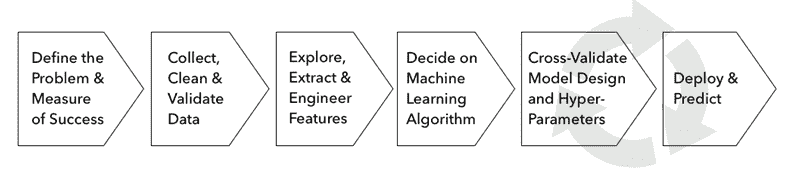

图 6.1：机器学习工作流程的关键步骤

整个过程都是迭代的，并且各个阶段所需的工作量会根据项目而变化。然而，通常情况下，这个过程应该包括以下步骤：

1.  确定问题，确定目标指标，并定义成功。

1.  数据源，清理和验证数据。

1.  了解你的数据并生成信息性特征。

1.  为你的数据选择一个或多个适合的机器学习算法。

1.  训练，测试和调整你的模型。

1.  使用你的模型来解决原始问题。

我们将在以下部分逐步完成这些步骤，使用一个简单的示例来说明一些关键点。

## 基本步骤 - 最近邻算法

本书 GitHub 仓库中本章文件夹中的 `machine_learning_workflow.ipynb` 笔记本包含了几个示例，用于演示使用房价数据集的机器学习工作流程。

我们将使用相当直观的 **最近邻** (**KNN**) 算法，它允许我们解决回归和分类问题。在其默认的 scikit-learn 实现中，它识别出最近的 *k* 个数据点（基于欧氏距离）来进行预测。在分类或回归情况下，它分别预测邻居中的最频繁类别或平均结果。

这一章的 GitHub 上的 `README` 链接到了额外的资源；查看 Bhatia 和 Vandana (2010) 进行简要调查。

## 框架问题 - 从目标到度量

任何机器学习项目的起点是它最终旨在解决的用例。有时，这个目标将是统计推断，以识别变量之间的关联或甚至因果关系。然而，最常见的情况是，目标是预测结果以产生交易信号。

推断和预测任务都依赖于度量指标来评估模型实现其目标的程度。由于它们在实践中的显著性，我们将重点关注常见的目标函数以及用于预测模型的相应误差度量。

我们通过输出的性质来区分预测任务：连续输出变量构成了一个 **回归** 问题，一个分类变量意味着 **分类**，而有序分类变量的特殊情况代表了一个 **排名** 问题。

通常可以以不同的方式对给定的问题进行框架化。手头的任务可能是如何有效地结合几个 alpha 因子。你可以将这个任务框架化为一个回归问题，旨在预测回报，一个二元分类问题，旨在预测未来价格走势的方向，或一个多类问题，旨在将股票分配到各种表现类别，比如回报五分位数。

在下一节中，我们将介绍这些目标，并看看如何测量和解释相关的错误指标。

### 预测与推断

监督学习算法产生的功能关系可用于推断，即了解结果生成的方式。或者，您可以用它来预测未知输入的输出。

对于算法交易，我们可以使用推断来估计资产回报与风险因子的统计关联。这意味着，例如，评估此观察是否可能由噪声引起，而不是风险因子的实际影响。反过来，预测可以用来预测风险因子，这可以帮助预测资产回报和价格，并转化为交易信号。

统计推断是关于从样本数据中得出关于潜在概率分布或总体参数的结论。可能的结论包括关于个体变量分布特征的假设检验，或者关于变量之间的数值关系的存在或强度的假设检验。它们还包括指标的点估计或区间估计。

推断取决于关于生成数据的过程的假设。我们将回顾这些假设以及在线性模型中用于推断的工具，在那里它们已经得到了很好的确认。更复杂的模型对输入和输出之间的结构关系做出更少的假设。相反，它们以较少的限制处理函数逼近任务，同时将数据生成过程视为黑匣子。

这些模型，包括决策树、集成模型和神经网络，因其在预测任务上的表现通常优于其他模型而备受青睐。然而，我们将看到，近年来已经有大量努力增加复杂模型的透明度。例如，随机森林最近获得了一个用于统计推断的框架（Wager 和 Athey 2019）。

#### 因果推断 - 相关性不意味着因果关系

因果推断旨在识别输入值导致特定输出的关系 - 例如，一定的宏观变量组合导致给定资产价格以某种方式变动，同时假设所有其他变量保持不变。

关于两个或更多变量之间的关系的统计推断会产生相关性的度量。只有在满足其他几个条件时，相关性才能被解释为因果关系，例如当排除了替代解释或逆向因果关系时。

满足这些条件需要一个实验设置，在这个设置中，所有感兴趣的变量可以完全控制，以隔离因果关系。或者，准实验设置以随机方式将观察单位暴露于输入变化中，以排除其他可观察或不可观察的特征对环境变化观察效果的影响。

这些条件很少被满足，因此推断性结论需要谨慎处理。对于依赖于特征和输出之间的统计关联的预测模型的性能也是如此，这种关联可能会随着不是模型一部分的其他因素的变化而变化。

KNN 模型的非参数性质不利于推断，因此我们将推迟工作流程中的此步骤，直到我们在*第七章*，*线性模型 - 从风险因素到回报预测*中遇到线性模型。

### 回归 - 流行的损失函数和误差度量

回归问题旨在预测连续变量。**均方根误差**（**RMSE**）是最受欢迎的损失函数和误差度量，其中一个原因是它是可微的。损失是对称的，但更大的错误在计算中占更多的权重。使用平方根的优点是我们可以用目标变量的单位来衡量误差。

**误差的对数的均方根**（**RMSLE**）适用于目标受指数增长的情况。其不对称的惩罚使得负误差比正误差的权重小。您也可以在训练模型之前对目标进行对数转换，然后使用 RMSE，就像我们将在本节后面的示例中所做的那样。

**绝对误差的平均值**（**MAE**）和**绝对误差的中位数**（**MedAE**）是对称的，但不会给较大的错误更多的权重。MedAE 对异常值具有鲁棒性。

**解释方差得分**计算模型解释的目标方差比例，介于 0 和 1 之间。**R2 得分**也称为决定系数，如果残差的均值为 0，则产生相同的结果，否则可能会有所不同。特别是在对样本外数据进行计算时（或者对没有截距的线性回归进行计算时），它可能为负。

下表定义了用于计算的公式以及可以从度量模块导入的相应的 scikit-learn 函数。`scoring`参数与自动化的训练-测试函数（如`cross_val_score`和`GridSearchCV`）结合使用，我们稍后将在本节中介绍，并在附带的笔记本中进行说明：

| 名称 | 公式 | scikit-learn 函数 | 评分参数 |
| --- | --- | --- | --- |
| 均方误差 | 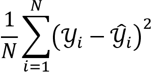 | `mean_squared_error` | `neg_mean_squared_error` |
| 平均平方对数误差 | 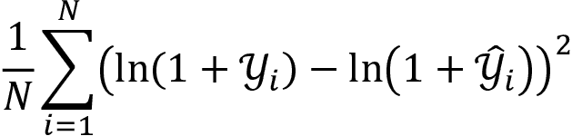 | `mean_squared_log_error` | `neg_mean_squared_log_error` |
| 平均绝对误差 | 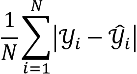 | `mean_absolute_error` | `neg_mean_absolute_error` |
| 中位绝对误差 | 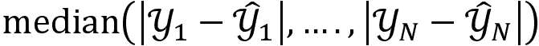 | `median_absolute_error` | `neg_median_absolute_error` |
| 解释方差 | 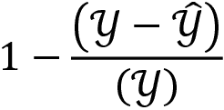 | `explained_variance_score` | `explained_variance` |
| R²得分 | 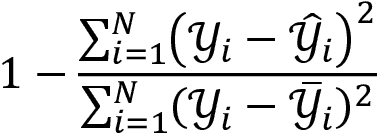 | `r2_score` | `r2` |

*图 6.2* 展示了我们将在笔记本中计算的房价回归的各种错误度量：

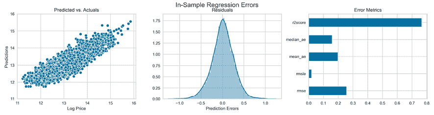

图 6.2：样本内回归误差

`sklearn` 函数还支持多标签评估——即，将多个结果值分配给单个观测值；有关更多详细信息，请参阅 GitHub 上引用的文档。

### 分类 – 理解混淆矩阵的含义

分类问题具有分类结果变量。大多数预测器将输出一个分数，以指示观察是否属于某一类别。在第二步中，这些分数然后被转换为实际预测，使用一个阈值值。

在二元情况下，具有正类标签和负类标签，得分通常在零和一之间变化，或者相应地进行归一化。一旦将得分转换为对其中一类的预测，就会产生四种结果，因为两个类中的每一个都可以被正确或错误地预测。如果区分几种潜在的错误，那么在两个以上的类别中可能会有更多的情况。

所有错误度量都是从 2×2 混淆矩阵的四个字段的预测分解中计算的，该矩阵将实际类别和预测类别相关联。

下表中列出的度量，如准确性，评估了给定阈值下的模型：

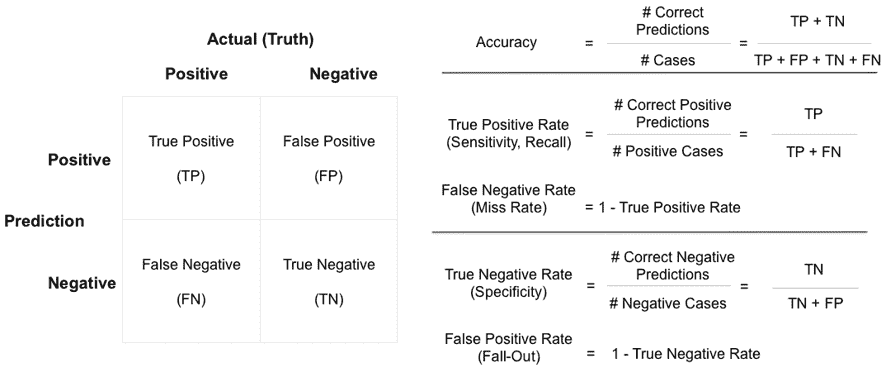

图 6.3：混淆矩阵和相关的错误度量

分类器通常不会输出校准的概率。相反，用于区分正负情况的阈值本身是一个决策变量，应该进行优化，考虑到正确和错误预测的成本和效益。

一切相等的情况下，较低的阈值往往意味着更多的正预测，可能会导致假阳性率上升，而对于较高的阈值，相反的可能是真的。

#### 接收器操作特性曲线下的面积

**接收器操作特性** (**ROC**) 曲线允许我们根据它们的性能可视化、比较和选择分类器。它计算了使用所有预测分数作为阈值产生类预测的**真正阳性率** (**TPR**) 和**假阳性率** (**FPR**) 的对。它在一个边长为单位的正方形内可视化这些对。

随机预测（根据类别不平衡加权），平均而言，产生相等的 TPR 和 FPR，这些都出现在对角线上，这成为基准案例。由于性能不佳的分类器会从重新标记预测中受益，因此该基准也成为最小值。

**曲线下面积**（AUC）被定义为 ROC 图下的面积，其值在 0.5 和最大值 1 之间变化。它是分类器分数能够根据其类别成员资格对数据点进行排名的摘要度量。更具体地说，分类器的 AUC 具有重要的统计属性，表示分类器将随机选择的正实例排在随机选择的负实例之上的概率，这相当于 Wilcoxon 排名检验（Fawcett 2006）。此外，AUC 具有不对类别不平衡敏感的好处。

#### 精确率-召回率曲线 - 放大一个类

当对其中一个类的预测特别感兴趣时，精确率和召回率曲线可视化了这些误差指标在不同阈值下的权衡。这两个指标评估了特定类别的预测质量。以下列表显示了它们如何应用于正类别：

+   **召回率**（Recall）衡量分类器预测为正例的实际正类成员所占比例，针对给定的阈值。它源自信息检索，并且衡量了搜索算法成功识别的相关文档的比例。

+   **精确率**（Precision），相反地，衡量了正确的正预测所占的比例。

召回率通常随着较低的阈值而增加，但精确率可能会降低。精确率-召回率曲线可视化了可达到的组合，并允许根据错过大量相关情况或产生质量较低的预测的成本和收益来优化阈值。

**F1 分数**是给定阈值下精确率和召回率的调和平均数，并且可以用于数值优化阈值，同时考虑到这两个指标应该承担的相对权重。

*图 6.4* 展示了 ROC 曲线及相应的 AUC，以及精确率-召回率曲线和 F1 分数，使用精确率和召回率的相等权重，得出了 0.37 的最佳阈值。该图表摘自附带的笔记本，您可以在其中找到针对二值化房价操作的 KNN 分类器的代码：

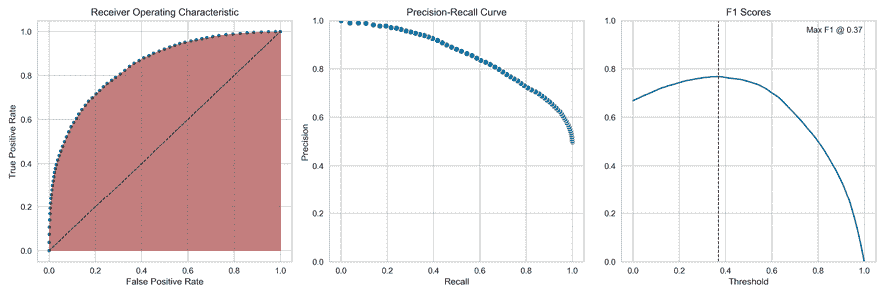

图 6.4：接收器操作特征（ROC）、精确率-召回率曲线和 F1 分数图

## 收集和准备数据

我们已经在*第二章*，*市场和基础数据 - 来源和技术*和*第三章*，*金融替代数据 - 类别和用例*中讨论了如何获取市场、基础和替代数据的重要方面。我们将继续使用这些来源的各种示例，以展示各种模型的应用。

除了市场和基本数据外，我们还将获取和转换文本数据，当我们探索自然语言处理时，获取图像数据并进行图像处理和识别时。除了获取、清洗和验证数据外，我们还可能需要分配标签，如新闻文章的情感或时间戳，以使其与通常以时间序列格式可用的交易数据对齐。

将其存储在能够快速探索和迭代的格式中也很重要。我们推荐 HDF 和 parquet 格式（参见*第二章*，*市场和基本数据-来源和技术*）。对于不适合内存且需要在多台机器上进行分布式处理的数据，Apache Spark 通常是交互式分析和机器学习的最佳解决方案。

## 探索、提取和工程化特征

理解单个变量的分布以及结果和特征之间的关系是选择适当算法的基础。这通常从诸如散点图的**可视化**开始，如附带的笔记本中所示并在*图 6.5*中显示：

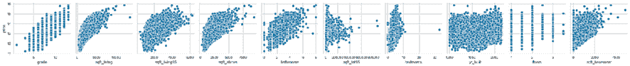

图 6.5：结果和特征的成对散点图

它还包括从线性指标如相关性到非线性统计量如我们在*第四章*中介绍的信息系数时遇到的 Spearman 等级相关系数的**数值评估**。还有信息论量度，如互信息，我们将在下一小节中进行说明。

系统性的探索性分析也是成功预测模型中往往最重要的一个组成部分的基础：**特征工程**，它提取了数据中包含的信息，但这些信息在原始形式下不一定对算法可见。特征工程受益于领域专业知识、统计学和信息论的应用，以及创造力。

它依赖于智能数据转换，可以有效地揭示输入和输出数据之间的系统关系。有许多选择，包括异常值检测和处理、功能转换以及多个变量的组合，包括无监督学习。我们将在整个过程中举例说明，但会强调这个 ML 工作流程的核心方面最好通过经验来学习。Kaggle 是一个与社区分享经验的其他数据科学家的好地方。

### 使用信息论评估特征

特征和结果之间的**互信息**（**MI**）是两个变量之间相互依赖的一种度量。它将相关性的概念扩展到非线性关系。更具体地说，它量化了通过另一个随机变量获得的有关某一随机变量的信息。

互信息（MI）的概念与随机变量的熵的基本概念密切相关。熵量化了随机变量中包含的信息量。形式上，两个随机变量 *X* 和 *Y* 的互信息——*I*(*X*, *Y*)——定义如下：

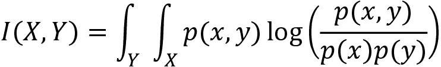

sklearn 函数实现了`feature_selection.mutual_info_regression`，它计算所有特征和连续结果之间的互信息，以选择最有可能包含预测信息的特征。还有一个分类版本（有关更多详情，请参阅 sklearn 文档）。`mutual_information.ipynb`笔记本包含了我们在*第四章*，*金融特征工程—如何研究 Alpha 因子*中创建的财务数据的应用。

## 选择一个 ML 算法

本书的其余部分将介绍几个模型家族，从对输入和输出变量之间的功能关系的本质作出相当强的假设的线性模型，到几乎没有假设的深度神经网络。正如在介绍部分中所提到的，更少的假设将需要更多关于关系的重要信息，以便学习过程能够成功进行。

在介绍这些模型时，我们将概述关键假设及其如何进行检验。

## 设计和调整模型

ML 过程包括诊断和管理模型复杂性的步骤，基于对模型的泛化误差的估计。ML 过程的一个重要目标是使用统计上可靠且高效的程序获取对此错误的无偏估计。管理模型设计和调整过程的关键是理解偏差-方差权衡与欠拟合和过拟合之间的关系。

### 偏差-方差权衡

ML 模型的预测误差可以分解为可减少和不可减少的部分。不可减少部分是由于数据中的随机变动（噪声）引起的，例如，由于缺乏相关变量、自然变动或测量误差。广义泛化误差的可减少部分又可分解为由**偏差**和**方差**引起的误差。

这两者都是由于真实功能关系与机器学习算法所做假设之间的差异而产生的，详细列在以下清单中：

+   **偏差导致的误差**：假设过于简单，无法捕捉真实功能关系的复杂性。因此，每当模型试图学习真实功能时，它都会出现系统性错误，平均而言，预测也将同样存在偏差。这也被称为*欠拟合*。

+   **方差导致的错误**：该算法在真实关系方面过于复杂。它不是捕捉真实关系，而是对数据过拟合，并从噪声中提取模式。因此，它从每个样本中学习到不同的功能关系，并且样本外的预测会变化很大。

### 欠拟合与过拟合 – 一个可视化例子

*图 6.6* 通过逐渐复杂的多项式逼近 *正弦* 函数来说明过拟合。更具体地说，我们抽取一个带有一些噪声的随机样本（*n* = 30）来学习不同复杂度的多项式（请参见笔记本中的代码 `bias_variance.ipynb`）。该模型预测新的数据点，我们捕获这些预测的均方误差。

*图 6.6* 的左侧面板显示了一次多项式；一条直线明显地欠拟合了真实函数。然而，估计线不会在从真实函数绘制的一个样本到下一个样本之间有明显差异。

中间面板显示了一个 5 次多项式在大约从 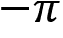 到 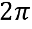 的区间上合理地逼近真实关系。另一方面，15 次多项式几乎完美地拟合了小样本，但提供了真实关系的不良估计：它对样本数据点的随机变化进行了过拟合，学到的函数将随样本的函数强烈变化：

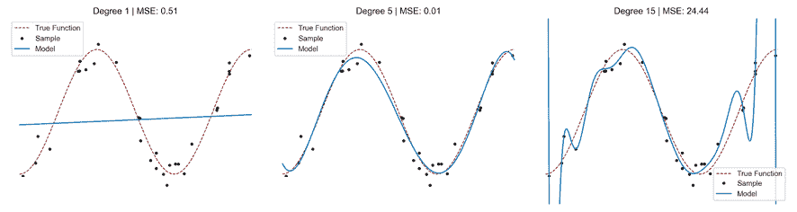

图 6.6：多项式过拟合的可视化示例

### 如何处理偏差-方差折衷

为了进一步说明过拟合与欠拟合的影响，我们将尝试学习带有一定噪声的 *正弦* 函数的第九次泰勒级数逼近。*图 6.7* 显示了对真实函数的 100 个随机样本进行了欠拟合、过拟合和提供大约正确的灵活性的多项式的样本内外误差和样本外预测，分别为 1、15 和 9 次多项式。

左侧面板显示了从预测值中减去真实函数值产生的误差的分布。拟合度低但方差小的一次拟合多项式与拟合度高但方差极高的 15 次过拟合多项式的误差相比。欠拟合多项式产生一条直线，其内部拟合较差，样本外明显偏离目标。过拟合模型在样本内显示出最佳拟合，误差最小，但代价是样本外的大方差。与真实模型功能形式相匹配的适当模型在样本外数据上平均表现最佳。

*图 6.7* 的右侧面板显示实际预测而不是错误，以可视化实践中的不同拟合类型：

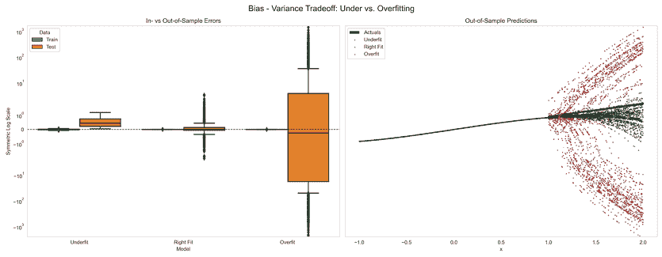

图 6.7：不同次数多项式的误差和样本外预测

### 学习曲线

学习曲线绘制了用于学习函数关系的数据集大小演变对训练和测试错误的影响。它有助于诊断给定模型的偏差-方差权衡，并回答增加样本量是否可能提高预测性能的问题。具有高偏差的模型将在样本内和样本外都具有高但相似的训练误差。过拟合模型将具有非常低的训练但较高的测试误差。

*图 6.8*显示了过拟合模型的样本外误差随着样本大小增加而下降，表明它可能受益于额外的数据或限制模型复杂性的工具，例如正则化。正则化向模型的复杂性添加了数据驱动的约束；我们将在*第七章*，*线性模型 - 从风险因素到回报预测*中介绍这个技术。

相反，拟合不足的模型需要更多特征或需要增加其容量以捕获真实关系：

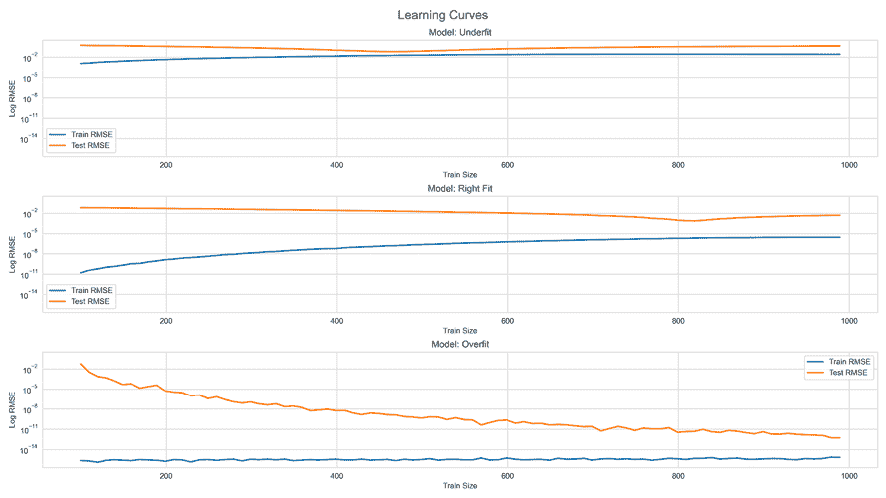

图 6.8：学习曲线和偏差-方差权衡

## 如何使用交叉验证选择模型

通常有几个适用于您用例的候选模型，选择其中一个的任务称为**模型选择问题**。目标是识别在给定新数据时产生最低预测误差的模型。

一个好的选择需要对这种泛化误差进行无偏估计，而这又需要在不参与模型训练的数据上对模型进行测试。否则，模型将已经能够窥视“解决方案”，并提前了解有关预测任务的信息，这将夸大其性能。

为了避免这种情况，我们仅使用部分可用数据来训练模型，并将另一部分数据保留以验证其性能。模型在新数据上的预测误差的估计结果只有在绝对没有关于验证集的信息泄漏到训练集时才会无偏，如*图 6.9*所示：

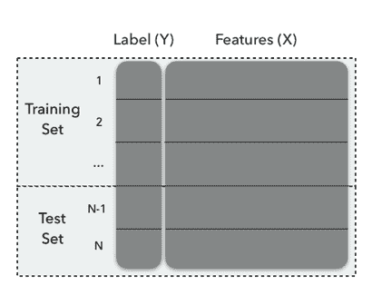

图 6.9：训练集和测试集

**交叉验证**（**CV**）是一种常用的模型选择策略。CV 背后的主要思想是将数据分割一次或多次。这样做是为了每次分割都被用作一次验证集，而剩余部分被用作训练集：一部分数据（训练样本）用于训练算法，剩余部分（验证样本）用于估计算法的预测性能。然后，CV 选择具有最小估计误差或风险的算法。

可以使用几种方法来拆分可用数据。它们在使用用于训练的数据量、误差估计的方差、计算强度以及在拆分数据时是否考虑数据的结构性方面有所不同，例如维持类标签之间的比率。

虽然数据拆分启发式方法非常通用，但 CV 的一个关键假设是数据是**独立同分布的**（**IID**）。在接下来的部分和本书中的整个过程中，我们将强调**时间序列数据**需要不同的方法，因为它通常不符合这一假设。此外，我们需要确保拆分尊重时间顺序，以避免**前瞻性偏差**。我们将通过将一些信息从我们旨在预测的未来纳入历史训练集中来实现这一点。

模型选择通常涉及超参数调整，这可能导致许多 CV 迭代。表现最佳模型的结果验证分数将受到**多重检验偏差**的影响，它反映了 CV 过程中固有的抽样噪声。因此，它不再是泛化误差的良好估计。为了得到无偏的误差率估计，我们必须从新的数据集中估计分数。

因此，我们使用了数据的三分拆分，如 *图 6.10* 所示：其中一部分用于交叉验证，并被重复拆分为训练集和验证集。其余部分被保留为保留集，仅在交叉验证完成后使用一次，以生成一个无偏的测试误差估计。

我们将在下一章开始构建 ML 模型时说明这种方法：

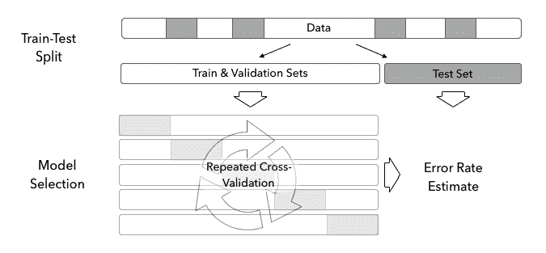

图 6.10：训练、验证和保留测试集

## 如何在 Python 中实现交叉验证

我们将说明将数据拆分为训练集和测试集的各种选项。我们将通过展示如何将具有 10 个观测值的模拟数据集的索引分配给训练集和测试集（有关详细信息，请参见 `cross_validation.py`），如下代码所示：

```py
data = list(range(1, 11))
[1, 2, 3, 4, 5, 6, 7, 8, 9, 10] 
```

Scikit-learn 的 CV 功能，我们将在本节中演示，可以从 `sklearn.model_selection` 导入。

对于将数据拆分为训练集和测试集的单次拆分，请使用 `train_test_split`，其中 `shuffle` 参数默认确保观察结果的随机选择。您可以通过设置 `random_state` 来对随机数生成器进行种子化以确保可复制性。还有一个 `stratify` 参数，它确保对于分类问题，训练集和测试集将包含大约相同比例的每个类别。结果如下所示：

```py
train_test_split(data, train_size=.8)
[[8, 7, 4, 10, 1, 3, 5, 2], [6, 9]] 
```

在这种情况下，我们使用除行号`6`和`9`之外的所有数据来训练模型，这些行号将用于生成预测并根据已知标签测量错误。该方法对于快速评估很有用，但对分割敏感，并且性能度量估计的标准误差会更高。

### KFold 迭代器

`KFold`迭代器生成多个不相交的分割，并将这些分割中的每一个一次分配给验证集，如下所示的代码所示：

```py
kf = KFold(n_splits=5)
for train, validate in kf.split(data):
    print(train, validate)
[2 3 4 5 6 7 8 9] [0 1]
[0 1 4 5 6 7 8 9] [2 3]
[0 1 2 3 6 7 8 9] [4 5]
[0 1 2 3 4 5 8 9] [6 7]
[0 1 2 3 4 5 6 7] [8 9] 
```

除了分割的数量外，大多数 CV 对象都接受一个`shuffle`参数，以确保随机化。为了使结果可重现，请按以下方式设置`random_state`：

```py
kf = KFold(n_splits=5, shuffle=True, random_state=42)
for train, validate in kf.split(data):
    print(train, validate)
[0 2 3 4 5 6 7 9] [1 8]
[1 2 3 4 6 7 8 9] [0 5]
[0 1 3 4 5 6 8 9] [2 7]
[0 1 2 3 5 6 7 8] [4 9]
[0 1 2 4 5 7 8 9] [3 6] 
```

### 留一出交叉验证

原始 CV 实现使用一种**留一法**，将每个观测值一次用作验证集，如下所示的代码所示：

```py
loo = LeaveOneOut()
for train, validate in loo.split(data):
    print(train, validate)
[1 2 3 4 5 6 7 8 9] [0]
[0 2 3 4 5 6 7 8 9] [1]
...
[0 1 2 3 4 5 6 7 9] [8]
[0 1 2 3 4 5 6 7 8] [9] 
```

这最大化了训练的模型数量，增加了计算成本。虽然验证集不重叠，但是训练集的重叠被最大化，推动模型和其预测误差的相关性增加。因此，具有更多折叠的模型的预测误差的方差更高。

### 留 P 个出交叉验证

与留一法 CV 类似的版本是**留 P 个出 CV**，它生成`p`数据行的所有可能组合，如下所示的代码所示：

```py
lpo = LeavePOut(p=2)
for train, validate in lpo.split(data):
    print(train, validate)
[2 3 4 5 6 7 8 9] [0 1]
[1 3 4 5 6 7 8 9] [0 2]
...
[0 1 2 3 4 5 6 8] [7 9]
[0 1 2 3 4 5 6 7] [8 9] 
```

### ShuffleSplit

`ShuffleSplit`类创建具有潜在重叠验证集的独立分割，如下所示的代码所示：

```py
ss = ShuffleSplit(n_splits=3, test_size=2, random_state=42)
for train, validate in ss.split(data):
    print(train, validate)
[4 9 1 6 7 3 0 5] [2 8]
[1 2 9 8 0 6 7 4] [3 5]
[8 4 5 1 0 6 9 7] [2 3] 
```

## 跨金融领域的交叉验证挑战

到目前为止讨论的交叉验证方法的一个关键假设是训练样本的 IID 分布。

对于金融数据，情况通常并非如此。相反，由于串行相关性和时间变化的标准差，金融数据既不是独立分布的，也不是相同分布的，这也称为**异方差性**（有关更多详细信息，请参见*第七章*，*线性模型 - 从风险因素到回报预测*和*第九章*，*用于波动率预测和统计套利的时间序列模型*）。`sklearn.model_selection`模块中的`TimeSeriesSplit`旨在处理时间序列数据的线性顺序。

### 使用 scikit-learn 进行时间序列交叉验证

数据的时间序列性意味着交叉验证产生了一种情况，即未来的数据将用于预测过去的数据。这充其量是不现实的，最糟糕的情况是数据偷窥，因为未来的数据反映了过去的事件。

为了解决时间依赖性，`TimeSeriesSplit`对象实现了一种前向测试，其中扩展训练集，后续训练集是过去训练集的超集，如下所示的代码所示：

```py
tscv = TimeSeriesSplit(n_splits=5)
for train, validate in tscv.split(data):
    print(train, validate)
[0 1 2 3 4] [5]
[0 1 2 3 4 5] [6]
[0 1 2 3 4 5 6] [7]
[0 1 2 3 4 5 6 7] [8]
[0 1 2 3 4 5 6 7 8] [9] 
```

您可以使用`max_train_size`参数来实现滚动交叉验证，其中训练集的大小随时间保持恒定，类似于 Zipline 测试交易算法。Scikit-learn 可以使用**子类化**设计自定义交叉验证方法，我们将在以下章节中实现这些方法。

### 净化、禁运和组合 CV

对于金融数据，标签通常是从重叠的数据点派生的，因为收益是从多个时期的价格计算出来的。在交易策略的背景下，模型的预测结果，可能意味着对某种资产采取头寸，只有在稍后评估此决策时才能知道，例如，当头寸被平仓时。

风险包括信息从测试到训练集的泄漏，这很可能会人为地增加性能。我们需要通过确保所有数据都是时间点数据来解决这一风险，即在用作模型输入时真正可用且已知。例如，财务披露可能涉及某个时间段，但仅在稍后才可用。如果我们过早包含这些信息，我们的模型可能在事后表现得比在实际情况下好得多。

Marcos Lopez de Prado，这个领域的领先实践者和学者之一，在他的著作《*金融机器学习进展*（2018）》中提出了几种方法来解决这些挑战。调整交叉验证以适应金融数据和交易背景的技术包括：

+   **净化**：消除训练数据点，其中评估发生在验证集中的时间点数据预测之后，以避免前瞻性偏差。

+   **禁运**：进一步消除跟随测试期的训练样本。

+   **组合交叉验证**：滚动交叉验证严重限制了可以测试的历史路径。相反，给定*T*个观测值，为*N*<*T*个组计算所有可能的训练/测试拆分，每个组都保持其顺序，并净化和禁运可能重叠的组。然后，在所有*N*-*k*组的组合上训练模型，同时在其余*k*组上测试模型。结果是可能的历史路径数量要大得多。

Prado 的*金融机器学习进展*中包含了实施这些方法的示例代码；该代码也可通过新的 Python 库 timeseriescv 获得。

## 使用 scikit-learn 和 Yellowbrick 进行参数调整

模型选择通常涉及重复交叉验证不同算法（如线性回归和随机森林）或不同配置的模型的样本外表现。不同的配置可能涉及超参数的更改或不同变量的包含或排除。

Yellowbrick 库扩展了 scikit-learn API 以生成诊断可视化工具，以便促进模型选择过程。这些工具可用于调查特征之间的关系，分析分类或回归错误，监视聚类算法性能，检查文本数据的特征，并帮助模型选择。我们将展示提供有价值信息的验证和学习曲线，在参数调整阶段使用 - 有关实施细节，请参阅`machine_learning_workflow.ipynb`笔记本。

### 验证曲线 - 绘制超参数的影响

验证曲线（见*图 6.11*中的左侧面板）可视化单个超参数对模型交叉验证性能的影响。这有助于确定模型是否对给定数据集欠拟合或过拟合。

在我们的`KNeighborsRegressor`示例中，只有一个超参数，即邻居的数量*k*。请注意，随着邻居数量的减少，模型的复杂度增加，因为模型现在可以为特征空间中更多不同的区域进行预测。

我们可以看到，在*k*大于 20 时，模型出现欠拟合现象。随着我们减少邻居数量并使我们的模型更复杂，验证误差下降。对于小于 20 的值，随着训练和验证误差的分歧和平均样本外表现的迅速恶化，模型开始过拟合：

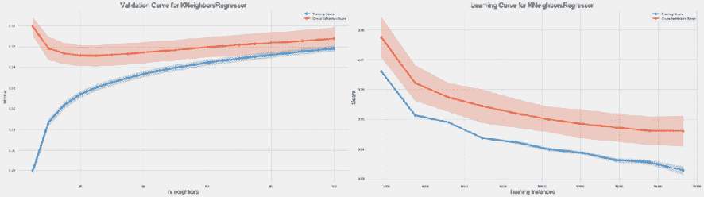

图 6.11：验证和学习曲线

### 学习曲线 - 诊断偏差-方差权衡

学习曲线（见我们房价回归示例中*图 6.11*的右侧面板）有助于确定模型的交叉验证性能是否会受益于额外数据，并且预测误差更多是由偏差还是方差驱动。

如果训练和交叉验证分数收敛，那么增加数据很可能不会改善性能。在这一点上，重要的是评估模型性能是否符合人类基准的预期。如果不是这样，则应修改模型的超参数设置以更好地捕捉特征和结果之间的关系，或选择具有更高复杂度以捕捉复杂性的不同算法。

此外，由阴影置信区间显示的训练和测试误差的变化提供了有关预测误差的偏差和方差来源的线索。交叉验证误差的变异是方差的证据，而训练集的变异性则暗示了偏差，具体取决于训练误差的大小。

在我们的示例中，交叉验证性能持续下降，但增量改进已经减少，误差已经趋于稳定，因此增加训练集的好处不大。另一方面，与训练误差相比，数据显示了相当大的变化。

### 使用 GridSearchCV 和 pipeline 进行参数调整

由于超参数调整是机器学习工作流程的关键组成部分，因此有工具可以自动化此过程。Scikit-learn 库包括一个`GridSearchCV`接口，它并行地交叉验证所有参数组合，捕获结果，并在完整数据集上自动使用在交叉验证中表现最佳的参数设置训练模型。

在实践中，训练和验证集通常需要一些处理才能进行交叉验证。Scikit-learn 提供了`Pipeline`，可以在使用`GridSearchCV`时自动执行任何特征处理步骤。

您可以查看包含的`machine_learning_workflow.ipynb`笔记本中的实现示例，以了解这些工具的实际操作。

# 总结

在本章中，我们介绍了从数据中学习的挑战，并将监督学习、无监督学习和强化学习模型作为我们将在本书中研究的主要学习形式，以构建算法交易策略。我们讨论了监督学习算法需要对它们试图学习的功能关系进行假设的必要性。它们这样做是为了限制搜索空间，同时产生可能导致过度泛化误差的归纳偏差。

我们介绍了机器学习工作流程的关键方面，介绍了回归和分类模型的最常见错误度量标准，解释了偏差-方差权衡，并说明了使用交叉验证管理模型选择过程的各种工具。

在下一章中，我们将深入研究用于回归和分类的线性模型，以开发我们的第一个使用机器学习的算法交易策略。
