# 7

# 线性模型 - 从风险因素到回报预测

线性模型家族代表了最有用的假设类之一。许多在算法交易中广泛应用的学习算法依赖于线性预测器，因为它们可以被有效地训练，相对而言对嘈杂的金融数据具有较强的鲁棒性，并且与金融理论有着紧密的联系。线性预测器也直观易懂，容易解释，并且通常能很好地拟合数据，或者至少提供一个良好的基准。

线性回归已经被人们所知超过 200 年，自从 Legendre 和 Gauss 将其应用于天文学并开始分析其统计属性以来。自那时起，许多扩展都已适应了线性回归模型和基线**普通最小二乘法**（**OLS**）方法来学习其参数：

+   **广义线性模型**（**GLM**）通过允许响应变量表示除正态分布以外的误差分布来扩展应用范围。 GLM 包括针对分类问题中出现的**分类响应变量**的 probit 或 logistic 模型。

+   更多**稳健的估计方法**使得在数据违反基线假设的情况下进行统计推断成为可能，例如，随时间或观察之间的相关性。这在包含对同一单位进行重复观察的面板数据中经常发生，例如，一组资产的历史回报。

+   **收缩方法**旨在改善线性模型的预测性能。它们使用复杂性惩罚来偏置模型学习的系数，目的是减少模型的方差并提高样本外的预测性能。

在实践中，线性模型被应用于回归和分类问题，其目标是推断和预测。学术界和工业界的研究人员已经开发了许多利用线性回归的资产定价模型。应用包括确定驱动资产回报的重要因素，以实现更好的风险和绩效管理，以及在各种时间范围内预测回报。另一方面，分类问题包括方向性价格预测。

在本章中，我们将涵盖以下主题：

+   线性回归是如何工作的以及它做出了什么样的假设

+   训练和诊断线性回归模型

+   使用线性回归预测股票回报

+   使用正则化来提高预测性能

+   逻辑回归的工作原理

+   将回归问题转化为分类问题

您可以在 GitHub 存储库的相应目录中找到本章的代码示例和额外资源的链接。笔记本包括彩色版本的图像。

# 从推断到预测

正如其名称所示，线性回归模型假设输出是输入的线性组合的结果。该模型还假设存在随机误差，使得每个观测值都可以偏离预期的线性关系。导致模型不能完美地以确定的方式描述输入和输出之间关系的原因包括，例如，缺少变量、测量或数据收集问题。

如果我们想要基于从样本估计的回归参数对人口中的真实（但未观察到的）线性关系进行统计结论，我们需要增加关于这些误差的统计性质的假设。基线回归模型做出了一个强大的假设，即误差的分布在观察中是相同的。它还假设错误相互独立——换句话说，知道一个错误不会帮助预测下一个错误。**独立同分布**（IID）误差的假设意味着它们的协方差矩阵是身份矩阵乘以代表误差方差的常数。

这些假设保证了 OLS 方法提供的估计不仅是无偏的，而且是有效的，这意味着 OLS 估计在所有线性学习算法中获得最低的抽样误差。然而，这些假设在实践中很少得到满足。

在金融领域，我们经常遇到具有给定横截面上重复观测的面板数据。尝试估计资产组合对一组风险因素随时间的系统性暴露通常会在时间轴上显示相关性，在横截面维度上也会如此。因此，出现了一些替代学习算法，假设误差协方差矩阵比身份矩阵的倍数更复杂。

另一方面，学习线性模型的有偏参数的方法可能会产生方差较低的估计值，从而提高其预测性能。收缩方法通过应用正则化来降低模型的复杂性，这会向线性目标函数添加惩罚项。

这个惩罚项与系数的绝对大小正相关，因此相对于基线情况，它们会被收缩。较大的系数意味着更复杂的模型，它对输入变化的反应更强烈。当正确校准时，惩罚可以限制模型系数的增长，使其不超过从偏差-方差角度看到的最优值。

首先，我们将介绍交叉和面板数据的线性模型的基线技术，以及在关键假设被违反时产生准确估计的重要增强方法。然后，我们将通过估计在算法交易策略开发中普遍存在的因子模型来说明这些方法。最后，我们将转向收缩方法如何应用正则化，并演示如何使用它们来预测资产回报并生成交易信号。

# 基线模型 - 多重线性回归

我们将从模型的规范和目标函数开始，以及我们可以用来学习其参数的方法，以及允许推断和诊断这些假设的统计假设。然后，我们将介绍扩展内容，用于适应违反这些假设的情况。用于额外背景的有用参考资料包括*Wooldridge*（*2002*和*2008*）。

## 如何制定模型

多重回归模型定义了一个连续结果变量和*p*个输入变量之间的线性功能关系，这些输入变量可以是任何类型，但可能需要预处理。相比之下，多元回归是指多个输出变量对多个输入变量的回归。

在总体中，线性回归模型对于输出*y*的单个实例，输入向量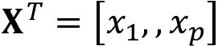，和误差项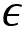具有以下形式：

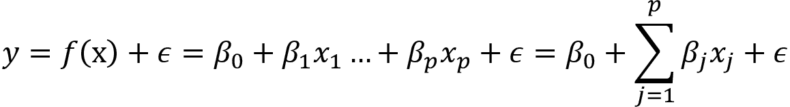

系数的解释很简单：系数的值是变量*x*[i]对输出的部分平均效应，保持所有其他变量恒定。

我们还可以以矩阵形式更紧凑地写出模型。在这种情况下，*y*是一个由*N*个输出观测值组成的向量，*X*是设计矩阵，有*N*行观测值和*p*个变量的列，另外还有一列用于截距，是包含*P* = *p*+1 个系数的向量：

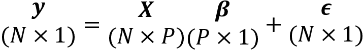

该模型在其*p* +1 个参数中是线性的，但如果我们选择或相应地转换变量，例如，通过包含多项式基函数扩展或对数项，它可以表示非线性关系。您还可以使用带有虚拟编码的分类变量，并通过创建形式为*x*[i]*x*[j]的新输入来包含变量之间的交互作用。

从统计学角度完成模型的制定，以便我们可以测试关于其参数的假设，我们需要对误差项进行具体的假设。在介绍了学习参数的最重要方法后，我们将这样做。

## 如何训练模型

有几种方法可以从数据中学习模型参数：**普通最小二乘法**（**OLS**），**最大似然估计**（**MLE**），和**随机梯度下降**（**SGD**）。我们将依次介绍每种方法。

### 普通最小二乘法 - 如何将超平面拟合到数据

最小二乘法是学习最佳逼近输出与输入数据之间关系的超平面的原始方法。顾名思义，它采用最佳逼近以最小化模型表示的输出值与超平面之间的距离的平方和。

对于给定数据点，模型预测与实际结果之间的差异是**残差**（而真实模型与人口真实输出之间的偏差被称为**误差**）。因此，形式上，最小二乘估计方法选择系数向量以最小化**残差平方和**（**RSS**）：

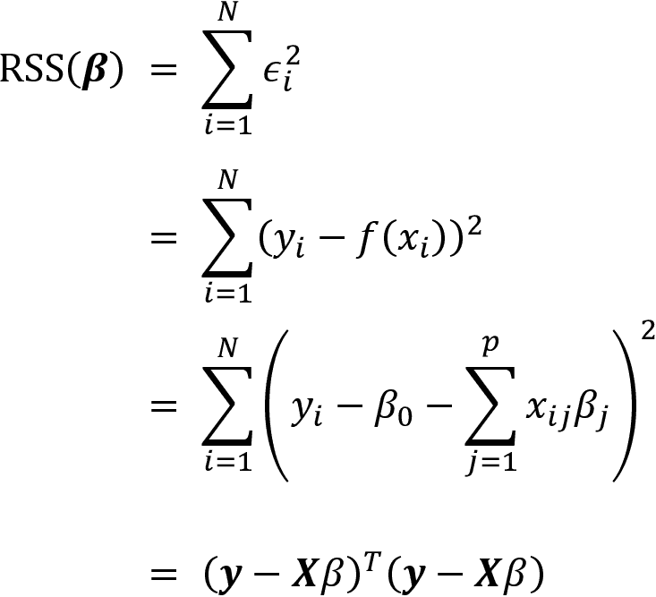

因此，最小二乘系数 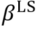 计算如下：

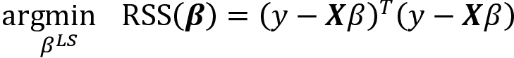

最小化 RSS 的最优参数向量结果是将上述表达式对  的导数设置为零。假设 *X* 具有满列秩，这要求输入变量不是线性相关的，因此可逆，我们得到一个唯一解，如下所示：

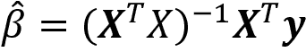

当 *y* 和 *X* 的均值为零时，可以通过减去它们的各自均值来实现， 表示输入与输出的协方差之比 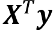 和输出方差 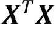 ：

还有一种几何解释：最小化 RSS 的系数确保残差向量 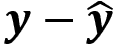 垂直于由 *X* 的 *P* 列张成的子空间，而估计值 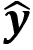 是该子空间的正交投影。

### 最大似然估计

MLE 是用于估计统计模型参数的重要一般方法。它依赖于似然函数，该函数计算了在给定输入数据的情况下观察到输出样本的可能性，作为模型参数的函数。似然性不同于概率，因为它没有归一化为 0 到 1 的范围。

通过假设错误项的分布，如标准正态分布，我们可以为多元线性回归示例设置似然函数：

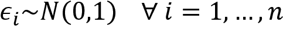

这使我们能够计算出在给定输入向量 *x*[i] 和参数 , 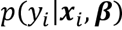 时观察到给定输出 *y*[i] 的条件概率：

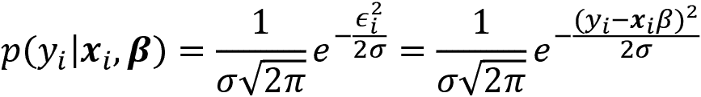

假设输出值在给定输入的条件下是条件独立的，样本的似然性与各个输出数据点的条件概率的乘积成比例。由于处理总和比处理乘积更容易，我们对其应用对数以获得**对数似然函数**：

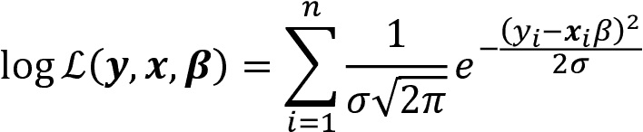

MLE 的目标是选择最大化观察输出样本的概率的模型参数，假定输入是给定的。因此，MLE 参数估计的结果来自于最大化对数似然函数：

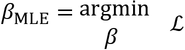

由于假设误差正态分布，最大化对数似然函数产生与最小二乘相同的参数解。这是因为唯一依赖于参数的表达式是指数中的平方残差。

对于其他分布假设和模型，MLE 将产生不同的结果，就像我们将在最后一节关于二元分类中看到的那样，其中结果遵循伯努利分布。此外，MLE 是一种更一般的估计方法，因为在许多情况下，最小二乘法是不适用的，正如我们稍后将看到的逻辑回归一样。

### 梯度下降

梯度下降是一种通用的优化算法，将找到平滑函数的驻点。如果目标函数是凸函数，则解将是全局最优解。梯度下降的变体广泛用于训练复杂的神经网络，还用于计算 MLE 问题的解决方案。

该算法使用目标函数的梯度。梯度包含了关于参数的偏导数。这些导数表示了在对应参数的方向上进行微小（无穷小）步骤时，目标的变化量。事实证明，函数值的最大变化来自于沿着梯度方向的步骤。

*图 7.1*描绘了对于单变量*x*和凸函数*f(x)*的过程，其中我们正在寻找最小值，*x*[0]。当函数具有负斜率时，梯度下降增加*x*[0]的目标值，否则减少值：

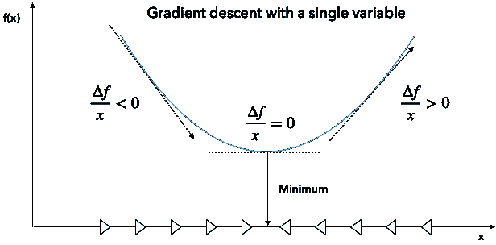

图 7.1：梯度下降

当我们最小化描述例如预测误差成本的函数时，算法使用训练数据计算当前参数值的梯度。然后，它根据其相应梯度分量的负值，按比例修改每个参数。结果，目标函数将取得较低的值，并将参数移动到解决方案附近。优化停止时，梯度变得很小，参数值变化很少。

这些步骤的大小由学习率确定，学习率是一个关键参数，可能需要调整。许多实现包括此学习率随迭代次数逐渐减小的选项。根据数据的大小，算法可能会多次迭代整个数据集。每个这样的迭代被称为一个**epoch**。你可以调整的其他超参数包括迭代的数量和用于停止进一步迭代的容差。

随机梯度下降（Stochastic gradient descent）随机选择一个数据点，并为该数据点计算梯度，而不是对较大样本进行平均以实现加速。还有一些批处理版本，每一步使用一定数量的数据点。

## 高斯-马尔可夫定理

要评估模型的统计特性并进行推断，我们需要对残差做出假设，这些残差代表了模型无法正确拟合或“解释”的输入数据的部分。

**高斯-马尔可夫定理**（**GMT**）定义了 OLS 产生模型参数 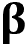 无偏估计所需的假设，以及这些估计在横截面数据的所有线性模型中具有最低标准误差。

基线多元回归模型对以下 GMT 做出如下假设（*Wooldridge 2008*）：

+   在总体中，线性成立，因此 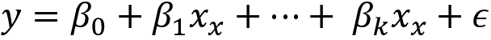，其中 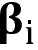 未知但恒定， 是随机误差。

+   输入变量 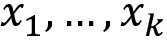 的数据是来自总体的随机样本。

+   无完全共线性—输入变量之间不存在精确的线性关系。

+   误差  在给定任何输入时的条件均值为零：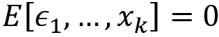。

+   同方差性（Homoskedasticity）—误差项 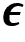 在给定输入的情况下具有恒定方差：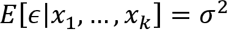

第四个假设暗示不存在与任何输入变量相关的缺失变量。

在前四个假设（GMT 1-4）下，OLS 方法提供无偏估计。包括一个无关变量不会使截距和斜率估计出现偏差，但省略一个相关变量将导致参数估计偏差。

在 GMT 1-4 下，OLS 也是一致的：随着样本大小的增加，估计值收敛于真实值，标准误差变得任意。反之亦然：如果误差的条件期望不为零，因为模型遗漏了一个相关变量或函数形式错误（例如，遗漏了二次项或对数项），那么所有参数估计都是有偏的。如果误差与任何输入变量相关，则 OLS 也不一致，增加更多数据也不会消除偏差。

如果我们加上第五个假设，那么 OLS 也会产生**最佳线性无偏估计**（**BLUE**）。最佳意味着估计在所有线性估计器中具有最低的标准误差。因此，如果五个假设成立且目标是统计推断，则 OLS 估计是正确的选择。然而，如果目标是预测，那么我们将看到其他估计器存在，它们在许多情况下通过牺牲一些偏差以获得更低的方差来实现更优的预测性能。

现在我们已经介绍了基本的 OLS 假设，我们可以来看看小样本和大样本中的推断。

## 如何进行统计推断

在线性回归背景下的推断旨在从样本数据中推断出人口中的真实关系。这包括测试关于总体关系或特定系数值的假设，以及置信区间的估计。

统计推断的关键要素是具有已知分布的检验统计量，通常是从感兴趣的数量（如回归系数）计算得出的。我们可以针对该统计量制定一个关于零假设，并计算在假设正确的情况下，在样本中观察到该统计量的实际值的概率。这个概率通常被称为**p 值**：如果它降低到显著性阈值以下（通常为 5%），那么我们会拒绝假设，因为它使我们在样本中观察到的检验统计量的值非常不太可能。另一方面，p 值反映了我们在拒绝实际上是正确假设时可能出错的概率。

除了五个 GMT 假设之外，**经典线性模型**还假设**正态性**——即人口误差服从正态分布，并且与输入变量独立。这个强假设意味着在给定输入变量的情况下，输出变量服从正态分布。它允许推导出系数的精确分布，进而意味着在小样本中进行精确假设检验所需的测试统计量的精确分布。在实践中，这个假设通常是不成立的——例如，资产回报并不服从正态分布。

然而，幸运的是，即使在正态性不成立时，正态性下使用的检验统计量也近似有效。更具体地说，测试统计量的以下分布特征在 GMT 假设 1-5 下大致成立，在正态性成立时完全成立：

+   参数估计值遵循多元正态分布：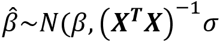。

+   在 GMT 1-5 下，参数估计值是无偏的，并且我们可以使用 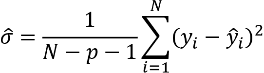 得到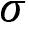 的无偏估计，即常数误差方差。

+   关于个别系数的假设检验的**t 统计量** 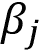 是 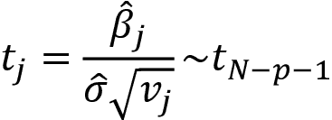，并且遵循具有 *N*-*p*-1 自由度的*t*分布，其中 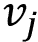 是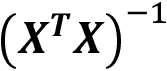 的对角线的第 *j* 个元素。

+   *t*分布收敛于正态分布。由于正态分布的 97.5 分位数约为 1.96，因此**95%置信区间**的一个有用的经验法则是，其公式为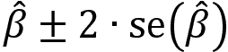，其中*se*表示**标准误差**。包含零的区间意味着我们无法拒绝真参数为零的零假设，因此对模型无关。

+   F 统计量允许对多个参数的限制进行测试，包括整个回归是否显著。它衡量了由额外变量导致的 RSS 的变化（减少）。

+   最后，**拉格朗日乘数**（**LM**）检验是测试多重约束的 F 检验的替代方法。

## 如何诊断和解决问题

诊断验证模型假设，并帮助我们在解释结果和进行统计推断时防止错误结论。它们包括拟合优度指标和有关误差项假设的各种测试，包括残差与正态分布的拟合程度

此外，诊断评估残差方差是否确实恒定或是否表现出异方差性（稍后在本节中介绍）。它们还测试错误是否条件不相关或是否表现出串行相关性，即，如果知道一个错误有助于预测连续的错误。

除了进行以下诊断测试之外，您还应该始终直观地检查残差。这有助于检测它们是否反映了系统模式，而不是表明模型缺少一个或多个驱动结果的因素的随机噪声。

### 拟合优度

**拟合优度指标**评估模型解释结果变异的能力。它们有助于评估模型规范的质量，例如在选择不同的模型设计时。

拟合优度指标在衡量拟合程度时存在差异。在这里，我们将重点关注样本内指标；当我们关注预测模型时，我们将使用样本外测试和交叉验证。

杰出的拟合优度指标包括（调整后的）R²，应最大化，并且基于最小二乘估计：

+   R²衡量模型解释结果数据变异的份额，并计算为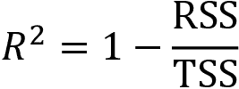，其中 TSS 是结果与其均值之间的平方偏差的和。它还对应于实际结果值与模型估计值之间的平方相关系数。隐含的目标是最大化 R²。但是，随着添加更多变量，它永远不会减少。因此，R²的一个缺点是它鼓励过度拟合。

+   调整后的 R²对 R²进行惩罚以添加更多变量；每个额外变量都需要显著降低 RSS 才能产生更好的拟合优度。

或者，要最小化的是**赤池信息准则**（**AIC**）和**贝叶斯信息准则**（**BIC**），它们基于最大似然估计：

+   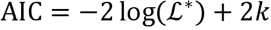，其中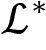是最大化似然函数的值，*k*是参数的数量。

+   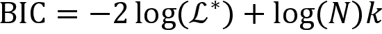，其中 *N* 是样本量。

这两种度量都对复杂性进行了惩罚。BIC 施加了更高的惩罚，因此相对于 AIC 可能欠拟合，反之亦然。

在概念上，AIC 旨在找到最佳描述未知数据生成过程的模型，而 BIC 试图在候选模型集合中找到最佳模型。在实践中，当目标是样本内拟合时，可以同时使用这两个标准来指导模型选择；否则，交叉验证和基于泛化误差估计的选择更可取。

### 异方差性

GMT 假设 5 要求残差协方差采用形状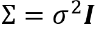，即对角矩阵，其条目等于误差项的恒定方差。**异方差性**发生在残差方差不恒定，而是在观察之间不同的情况下。如果残差方差与输入变量呈正相关，即当误差较大时，与其均值相距较远的输入值，那么 OLS 标准误差估计将过低；因此，t 统计量将被膨胀，导致在实际上不存在关系的情况下发现了假阳性关系。

诊断从对残差的可视检查开始。在（假定为随机的）残差中出现系统性模式表明对错误是同方差的零假设进行统计检验，而不同的备择假设。这些检验包括 Breusch-Pagan 和 White 检验。

有几种方法可以校正 OLS 估计的异方差性：

+   **稳健标准误差**（有时称为*White 标准误差*）在计算误差方差时考虑了异方差性，使用所谓的**夹心估计量**。

+   **聚类标准误差**假定数据中存在不同的组，这些组是同方差的，但是组间的误差方差不同。这些组可以是不同的资产类别或来自不同行业的股票。

有几种替代 OLS 的方法，它们使用不同的假设来估计误差协方差矩阵，当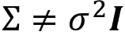时。以下是`statsmodels`中可用的选项：

+   **加权最小二乘法（WLS）**：用于异方差误差，其中协方差矩阵仅具有对角项，与 OLS 相同，但现在允许这些项变化。

+   **可行广义最小二乘法（GLSAR）**：适用于自相关误差遵循自回归 AR(*p*) 过程（见 *第九章*，*波动率预测和统计套利的时间序列模型*）的情况。

+   **广义最小二乘（GLS）**：适用于任意协方差矩阵结构；在异方差性或序列相关存在时产生高效且无偏的估计值。

### 序列相关

序列相关意味着线性回归产生的连续残差是相关的，这违反了第四个 GMT 假设。正序列相关意味着标准误差被低估，并且 t 统计量将被夸大，如果忽略这一点，可能导致错误发现。但是，在计算标准误差时有纠正序列相关的程序。

**杜宾-沃森统计量**用于诊断序列相关性。它检验普通最小二乘法残差不具有自相关性的假设，假设它们遵循自回归过程（我们将在下一章中探讨）。检验统计量的范围从 0 到 4；接近 2 的值表示非自相关性，较低的值暗示着正自相关，而较高的值则表示负自相关。确切的阈值取决于参数和观测值的数量，并且需要在表中查找。

### 多重共线性

**多重共线性**是指两个或更多个自变量高度相关时发生的情况。这带来了几个挑战：

+   很难确定哪些因素影响因变量。

+   单个 p 值可能会误导——即使变量实际上很重要，p 值也可能很高。

+   回归系数的置信区间将会过宽，甚至可能包含零。这使得确定一个独立变量对结果的影响变得复杂。

没有正式的或基于理论的解决方案可以纠正多重共线性。相反，请尝试删除一个或多个相关的输入变量，或增加样本量。

# 在实践中如何运行线性回归

附带的笔记本`linear_regression_intro.ipynb`演示了简单线性回归和多元线性回归，后者同时使用 OLS 和梯度下降。对于多元回归，我们生成两个范围从-50 到+50 的随机输入变量*x*[1]和*x*[2]，以及一个作为输入的线性组合加上随机高斯噪声的结果变量，以满足正态性假设 GMT 6：

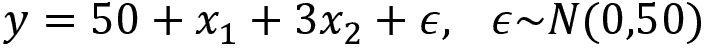

## 使用 statsmodels 进行 OLS

我们使用`statsmodels`来估计一个准确反映数据生成过程的多元回归模型，如下所示：

```py
import statsmodels.api as sm
X_ols = sm.add_constant(X)
model = sm.OLS(y, X_ols).fit()
model.summary() 
```

这产生了以下普通最小二乘回归结果摘要：

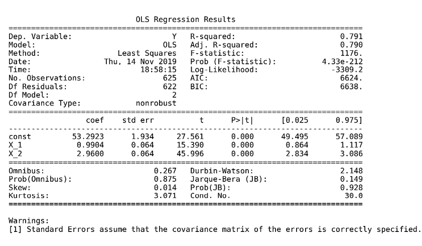

图 7.2：OLS 回归结果摘要

摘要的上半部分显示了数据集的特征——即估计方法和观测值和参数的数量，并指出标准误差估计不考虑异方差性。中间面板显示了系数值，这些值与人工数据生成过程密切相关。我们可以确认，在摘要结果中间显示的估计值可以使用先前导出的 OLS 公式获得：

```py
beta = np.linalg.inv(X_ols.T.dot(X_ols)).dot(X_ols.T.dot(y))
pd.Series(beta, index=X_ols.columns)
const   53.29
X_1      0.99
X_2      2.96 
```

以下代码可视化了模型对随机生成数据点的拟合情况：

```py
three_dee = plt.figure(figsize=(15, 5)).gca(projection='3d')
three_dee.scatter(data.X_1, data.X_2, data.Y, c='g')
data['y-hat'] = model.predict()
to_plot = data.set_index(['X_1', 'X_2']).unstack().loc[:, 'y-hat']
three_dee.plot_surface(X_1, X_2, to_plot.values, color='black', alpha=0.2, linewidth=1, antialiased=True)
for _, row in data.iterrows():
    plt.plot((row.X_1, row.X_1), (row.X_2, row.X_2), (row.Y, row['y-hat']),              'k-');
three_dee.set_xlabel('$X_1$');three_dee.set_ylabel('$X_2$');three_dee.set_zlabel('$Y, \hat{Y}$') 
```

*图 7.3*显示了结果超平面和原始数据点：

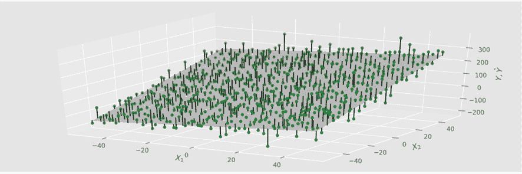

图 7.3：回归超平面

面板的右上部分显示了我们刚刚讨论过的拟合优度度量，以及 F 检验，它拒绝了所有系数为零且无关的假设。类似地，t 统计量表明截距和两个斜率系数显然是高度显著的。

摘要的底部包含了残差诊断。左侧面板显示了偏度和峰度，用于检验正态性假设。Omnibus 和 Jarque–Bera 测试都未能拒绝残差服从正态分布的原假设。Durbin–Watson 统计量测试残差的序列相关性，并且具有接近 2 的值，考虑到两个参数和 625 个观测值，未能拒绝有关此主题的前一节中概述的无序列相关假设。

最后，条件数提供了关于多重共线性的证据：它是包含输入数据的设计矩阵的最大特征值和最小特征值的平方根之比。30 以上的值表明回归可能存在显著的多重共线性。

`statsmodels`包含了与笔记本链接的额外诊断测试。

## 使用 sklearn 的随机梯度下降

sklearn 库在其`linear_models`模块中包括一个`SGDRegressor`模型。为了使用该方法学习相同模型的参数，我们需要对数据进行标准化，因为梯度对尺度很敏感。

我们使用`StandardScaler()`来实现这个目的：它在拟合步骤期间计算每个输入变量的平均值和标准差，然后在转换步骤期间减去平均值并除以标准差，我们可以方便地在单个`fit_transform()`命令中进行：

```py
scaler = StandardScaler()
X_ = scaler.fit_transform(X) 
```

然后，我们使用默认值实例化`SGDRegressor`，除了设置一个`random_state`以便复制：

```py
sgd = SGDRegressor(loss='squared_loss', 
                   fit_intercept=True,
                   shuffle=True, # shuffle data for better estimates
                   random_state=42,
                   learning_rate='invscaling', # reduce rate over time
                   eta0=0.01, # parameters for learning rate path
                   power_t=0.25) 
```

现在，我们可以拟合`sgd`模型，为 OLS 模型和`sgd`模型创建样本内预测，并计算每个模型的均方根误差：

```py
sgd.fit(X=X_, y=y)
resids = pd.DataFrame({'sgd': y - sgd.predict(X_),
                      'ols': y - model.predict(sm.add_constant(X))})
resids.pow(2).sum().div(len(y)).pow(.5)
ols   48.22
sgd   48.22 
```

如预期的那样，两个模型产生相同的结果。我们现在将承担一个更有雄心的项目，使用线性回归来估计多因素资产定价模型。

# 如何构建线性因子模型

算法交易策略使用因素模型来量化资产回报与风险来源之间的关系，这些风险是这些回报的主要驱动因素。每个因素风险都带有溢价，而总资产回报预计将对应于这些风险溢价的加权平均。

因素模型在组合管理流程的各个方面都有几个实际应用，从构建和资产选择到风险管理和绩效评估。随着共同的风险因素现在可交易，因素模型的重要性不断增长：

+   通过少数因素总结许多资产的回报，可减少在优化组合时估计协方差矩阵所需的数据量。

+   对于资产或投资组合对这些因素的暴露的估计允许管理产生的风险，例如当风险因素本身可交易或可被替代时采取合适的对冲措施。

+   因素模型还允许评估新α因素的增量信号内容。

+   因素模型还有助于评估管理人员相对于基准的表现是否确实是由于熟练的资产选择和市场择时，还是表现可以解释为对已知回报驱动因素的组合倾向。今天，这些驱动因素可以通过低成本、被动管理基金来复制，而不需要支付主动管理费用。

以下示例适用于股票，但对于所有资产类别都已识别出风险因素（Ang 2014）。

## 从 CAPM 到法玛-法国因素模型

风险因素自**资本资产定价模型**（**CAPM**）解释了所有 *N* 资产的预期回报 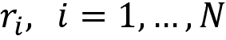 ，即它们各自对单一因素的暴露 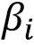 与总体市场超过无风险利率的预期超额回报 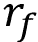 ，成为量化模型的关键因素。CAPM 模型采取以下线性形式：

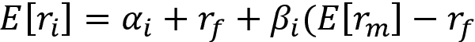

这与经典的基本面分析不同，如道德和格雷厄姆，其中回报取决于公司特征。理论基础是，总体上，投资者不能通过分散化消除所谓的系统风险。因此，在均衡状态下，他们要求持有资产的补偿与其系统风险相称。该模型暗示，鉴于市场高效，价格立即反映所有公开信息，不应该有优越的风险调整回报。换句话说， 的价值应为零。

模型的实证检验使用线性回归，一直持续失败，例如通过识别异常，即不依赖于整体市场暴露的优越风险调整回报，例如更小型公司的较高回报（Goyal 2012）。

这些失败引发了关于是市场有效还是联合假设的单一因素方面出了问题的热烈辩论。结果表明，这两个前提都可能是错误的：

+   约瑟夫·斯蒂格利茨部分因表明市场通常不是完全有效的而获得了 2001 年诺贝尔经济学奖：如果市场是有效的，那么收集数据就没有价值，因为这些信息已经反映在价格中。然而，如果没有动力来收集信息，很难看到它如何已经反映在价格中。

+   另一方面，对 CAPM 的理论和实证改进表明，额外因素有助于解释先前提到的一些异常情况，这导致了各种多因素模型。

斯蒂芬·罗斯于 1976 年提出了**套利定价理论**（**APT**）作为另一种选择，它允许多个风险因素，同时避开市场效率。与 CAPM 相反，它假设由于错定价而获得优越回报的机会可能存在，但会很快被套利掉。该理论不指定因素，但研究表明最重要的因素可能是通胀和工业生产的变化，以及风险溢价或利率期限结构的变化。

肯尼斯·弗伦奇和尤金·法玛（2013 年诺贝尔奖得主）确定了依赖于公司特征并且今天被广泛使用的额外风险因素。 1993 年，法玛-法国三因子模型将相对规模和公司价值添加到了单一 CAPM 风险来源中。2015 年，五因子模型进一步扩展了集合，包括公司盈利能力和投资水平，这些在介入的几年中被证明是显著的。此外，许多因子模型包括价格动量因子。

法玛-法国风险因素是根据反映特定风险因素的度量标准计算出高值或低值多元化投资组合的回报差异。通过根据这些度量标准对股票进行排序，然后做多某个百分位以上的股票，同时做空某个百分位以下的股票来获得这些回报。与风险因素相关的度量标准定义如下：

+   **规模**：**市值**（**ME**）

+   **价值**：**股本账面价值**（**BE**）除以 ME

+   **经营盈利能力（OP）**：收入减去销售成本/资产

+   **投资**：投资/资产

还有无监督学习技术用于基于数据发现风险因素，该技术使用因素和主成分分析。我们将在*第十三章*《基于数据的风险因素和无监督学习的资产配置》中探讨这一点。

## 获取风险因素

法玛和法伦奇通过他们的网站提供了更新的风险因素和研究投资组合数据，您可以使用 `pandas_datareader` 库来获取数据。对于这个应用程序，请参考 `fama_macbeth.ipynb` 笔记本以获取以下代码示例和额外细节。

具体来说，我们将使用法玛-法伦奇因子中的五个因子，这些因子是根据股票排序而得出的，首先分为三个大小组，然后分为两个，每个剩余的三个特定公司因子。因此，这些因子涉及三组以大小和账面市值排序的加权组合，大小和经营盈利能力排序，以及大小和投资排序。计算的风险因素值作为**投资组合**（**PF**）的平均回报在下表中概述：

| 概念 | 标签 | 名称 | 风险因素计算 |
| --- | --- | --- | --- |
| 规模 | SMB | 小减大 | 九个小股票 PF 减去九个大股票 PF。 |
| 价值 | HML | 高减低 | 两个价值 PF 减去两个成长（具有低 BE/ME 价值）PF。 |
| 盈利能力 | RMW | 强大减弱小 | 两个强大的 OP PF 减去两个弱小的 OP PF。 |
| 投资 | CMA | 保守减激进 | 两个保守投资组合减去两个激进投资组合。 |
| 市场 | Rm-Rf | 市场的超额回报 | 所有在美国主要交易所上市并上市的公司的加权回报减去一个月期的国债利率。 |

我们将使用 2010 年至 2017 年的时期获得的每月频率的回报，如下所示：

```py
import pandas_datareader.data as web
ff_factor = 'F-F_Research_Data_5_Factors_2x3'
ff_factor_data = web.DataReader(ff_factor, 'famafrench', start='2010', 
                               end='2017-12')[0]
ff_factor_data.info()
PeriodIndex: 96 entries, 2010-01 to 2017-12
Freq: M
Data columns (total 6 columns):
Mkt-RF 96 non-null float64
SMB    96 non-null float64
HML    96 non-null float64
RMW    96 non-null float64
CMA    96 non-null float64
RF     96 non-null float64 
```

法玛和法伦奇还提供了许多投资组合，我们可以用来说明因子暴露度的估计，以及市场上某个特定时期可用的风险溢价的价值。我们将使用每月频率的 17 个行业投资组合的面板。我们会从回报中减去无风险利率，因为因子模型使用超额回报：

```py
ff_portfolio = '17_Industry_Portfolios'
ff_portfolio_data = web.DataReader(ff_portfolio, 'famafrench', start='2010', 
                                  end='2017-12')[0]
ff_portfolio_data = ff_portfolio_data.sub(ff_factor_data.RF, axis=0)
ff_factor_data = ff_factor_data.drop('RF', axis=1)
ff_portfolio_data.info()
PeriodIndex: 96 entries, 2010-01 to 2017-12
Freq: M
Data columns (total 17 columns):
Food     96 non-null float64
Mines    96 non-null float64
Oil      96 non-null float64
...
Rtail    96 non-null float64
Finan    96 non-null float64
Other    96 non-null float64 
```

现在，我们将基于这些面板数据构建一个线性因子模型，使用一种方法来解决一些基本线性回归假设的失败。

## 法玛-麦克贝斯回归

鉴于风险因素和投资组合回报的数据，估计投资组合对这些回报的暴露度是有用的，以了解它们对投资组合回报的推动程度。了解市场为暴露于给定因素的回报支付的溢价也很有趣，即，承担这种风险有多值得。风险溢价然后允许估计任何投资组合的回报，只要我们知道或可以假设其因子暴露。

更正式地说，我们将有 *i*=1, ..., *N* 个资产或投资组合在 *t*=1, ..., *T* 个时期的回报，每个资产的超额时期回报将被标记。目标是测试 *j*=1, ..., *M* 个因素是否解释了超额回报以及与每个因素相关的风险溢价。在我们的情况下，我们有 *N*=17 个投资组合和 *M*=5 个因素，每个因素有 96 个时期的数据。

对于给定期间的许多股票估计因子模型。在这种交叉断面回归中可能会出现推断问题，因为古典线性回归的基本假设可能不成立。可能的违规行为包括测量误差，由于异方差性和序列相关性导致的残差协变，以及多重共线性（法马和麦克贝斯，1973 年）。

为了解决残差相关性引起的推断问题，法马和麦克贝斯提出了一种跨时间回归的两阶段方法，该方法针对回报因子进行了交叉断面回归。两阶段法马-麦克贝斯回归旨在估计市场对特定风险因素暴露的奖励溢价。这两个阶段包括：

+   第一阶段：*N*时间序列回归，每个资产或组合一个，将其超额回报回归到因子上以估计因子加载。以矩阵形式，对于每个资产：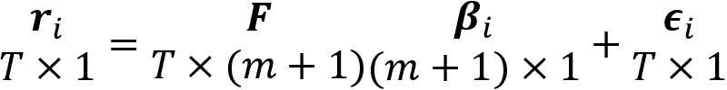

+   第二阶段：*T*交叉断面回归，每个时间段一个，以估计风险溢价。以矩阵形式，我们获得了每个时期的风险溢价向量：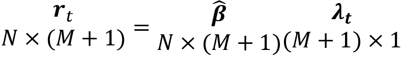

现在，我们可以计算因子风险溢价的时间平均值，并获得一个 t 统计量来评估它们的个别显着性，假设风险溢价估计在时间上是独立的：

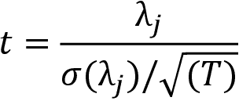

如果我们有一个非常大而具代表性的交易风险因素的数据样本，我们可以使用样本均值作为风险溢价的估计。但是，我们通常没有足够长的历史数据，并且样本均值周围的误差边际可能非常大。法马-麦克贝斯方法利用因子与其他资产的协方差来确定因子溢价。

资产回报的第二阶矩比第一阶矩更容易估计，获取更精细的数据显着提高了估计的准确性，而这并不适用于均值估计。

我们可以实施第一阶段以获得 17 个因子加载估计，如下所示：

```py
betas = []
for industry in ff_portfolio_data:
    step1 = OLS(endog=ff_portfolio_data.loc[ff_factor_data.index, industry],
                exog=add_constant(ff_factor_data)).fit()
    betas.append(step1.params.drop('const'))
betas = pd.DataFrame(betas,
                     columns=ff_factor_data.columns,
                     index=ff_portfolio_data.columns)
betas.info()
Index: 17 entries, Food  to Other
Data columns (total 5 columns):
Mkt-RF    17 non-null float64
SMB       17 non-null float64
HML       17 non-null float64
RMW       17 non-null float64
CMA       17 non-null float64 
```

对于第二阶段，我们对组合的交叉断面期间回报进行 96 次回归，以对因子加载进行回归：

```py
lambdas = []
for period in ff_portfolio_data.index:
    step2 = OLS(endog=ff_portfolio_data.loc[period, betas.index],
                exog=betas).fit()
    lambdas.append(step2.params)
lambdas = pd.DataFrame(lambdas,
                       index=ff_portfolio_data.index,
                       columns=betas.columns.tolist())
lambdas.info()
PeriodIndex: 96 entries, 2010-01 to 2017-12
Freq: M
Data columns (total 5 columns):
Mkt-RF    96 non-null float64
SMB       96 non-null float64
HML       96 non-null float64
RMW       96 non-null float64
CMA       96 non-null float64 
```

最后，我们计算 96 个期间的平均值，以获得我们的因子风险溢价估计：

```py
lambdas.mean()
Mkt-RF    1.243632
SMB      -0.004863
HML      -0.688167
RMW      -0.237317
CMA      -0.318075
RF       -0.013280 
```

linearmodels 库通过实现两阶段法马-麦克贝斯程序来扩展`statsmodels`，其中包含了面板数据的各种模型：

```py
model = LinearFactorModel(portfolios=ff_portfolio_data, 
                          factors=ff_factor_data)
res = model.fit() 
```

这为我们提供了相同的结果：

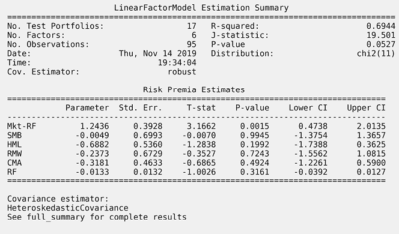

图 7.4：线性因子模型估计摘要

随附的笔记本演示了在估计更大范围的个别股票的风险溢价时，通过使用行业虚拟变量来使用分类变量的方法。

# 使用收缩进行正则化的线性回归

使用最小二乘法训练线性回归模型将在满足高斯-马尔科夫假设时产生最佳的线性和无偏的系数估计。即使 OLS 关于误差协方差矩阵的假设被违反，类似 GLS 的变体也能表现出色。然而，有些估计器会产生偏差系数以减小方差并在整体上实现更低的泛化误差（Hastie，Tibshirani 和 Friedman 2009）。

当线性回归模型包含许多相关变量时，它们的系数将被较差地确定。这是因为大正系数对 RSS 的影响可以被相关变量上的同样大的负系数抵消。因此，由于系数的这种摆动空间使得模型更有可能对样本过拟合，导致了因高方差而产生预测误差的风险增加。

## 如何对冲过拟合

控制过拟合的一种流行技术是**正则化**，它涉及向误差函数添加惩罚项，以阻止系数达到较大的值。换句话说，对系数的大小施加约束可以缓解系数对样本外预测可能产生的负面影响。由于过拟合是一个普遍存在的问题，因此我们将遇到所有模型的正则化方法。

在本节中，我们将介绍缩小方法，以解决迄今为止讨论的线性模型的两个改进动机：

+   **预测准确度**：最小二乘估计的低偏差但高方差表明，通过缩小或将某些系数设为零，可以减小泛化误差，从而以稍高的偏差换取模型方差的减小。

+   **解释**：大量的预测变量可能会复杂化结果的解释或传达整体结果的信息。牺牲一些细节以限制模型到具有最强效应的更小的参数子集可能更可取。

缩小模型通过对系数施加惩罚来限制回归系数的大小。它们通过向目标函数添加一个项  来实现这一目标。这一项意味着缩小模型的系数将最小化 RSS，加上一个与系数的（绝对）大小正相关的惩罚。

添加的惩罚因此将线性回归系数转换为受约束的最小化问题的解，一般情况下，采用以下的拉格朗日形式：


正则化参数  确定惩罚效应的大小，即正则化的强度。一旦  是正的，系数将与无约束的最小二乘参数不同，这意味着偏估计。您应该通过交叉验证自适应地选择超参数  来最小化预期预测误差的估计。我们将在下一节中说明如何做到这一点。

收缩模型通过如何计算惩罚来区分，即* S *的函数形式。最常见的版本是**岭回归**，它使用平方系数的总和，以及**套索模型**，它将惩罚基于系数的绝对值的总和。

**弹性网络回归**在这里没有明确涵盖，它使用两者的组合。Scikit-learn 包含一个实现，其工作方式与我们将在这里演示的示例非常相似。

## 岭回归的工作原理

岭回归通过将惩罚添加到等于系数平方和的目标函数来收缩回归系数，这反过来对应于系数向量的 L2 范数（Hoerl 和 Kennard 1970）：


因此，岭系数被定义为：


截距  已从惩罚中排除，以使该过程与所选的输出变量的原点无关—否则，向所有输出值添加常数将改变所有斜率参数，而不是平行移位。

标准化输入很重要，通过从每个输入中减去相应的平均值并将结果除以输入的标准差来实现。这是因为岭回归解对输入的尺度敏感。对于岭估计器，也有一个类似 OLS 案例的封闭解决方案：


在求逆之前，解决方案在 *X*^T*X* 之前添加了缩放的单位矩阵 ，这确保了即使 *X*^T*X* 不具有完全秩，问题也是非奇异的。这是最初引入此估计器时的动机之一。

岭惩罚导致所有参数的按比例缩小。对于正交输入的情况，岭估计仅是最小二乘估计的缩放版本，即：


利用输入矩阵 *X* 的**奇异值分解** (**SVD**)，我们可以深入了解收缩如何影响输入，在更常见的情况下，即它们不是正交的情况下。中心矩阵的奇异值分解代表了矩阵的主成分（见*第十三章*，*使用无监督学习的数据驱动风险因素和资产配置*），以方差递减的顺序捕获数据列空间中的不相关方向。

岭回归相对于输入变量与展示最大方差的数据方向的对齐来缩小系数。更具体地说，它最大程度地缩小了那些表示与捕捉较少方差的主成分对齐的输入的系数。因此，岭回归中隐含的假设是，在数据中变化最大的方向在预测输出时将是最有影响力或最可靠的。

## 套索回归的工作原理

[套索回归](https://wiki.example.org/lasso_regression)（Hastie, Tibshirani, 和 Wainwright 2015），在信号处理中被称为基 pursuit，也通过对残差平方和添加惩罚来缩小系数，但套索惩罚的效果略有不同。套索惩罚是系数向量的绝对值之和，对应于其 L1 范数。因此，套索估计由以下公式定义：


与岭回归类似，输入需要标准化。套索惩罚使解决方案非线性化，并且没有像岭回归中那样的系数闭式表达式。相反，套索解决方案是一个二次规划问题，有有效的算法可以计算系数的整个路径，这导致了与岭回归相同计算成本的不同值的！[](img/B15439_07_059.png)。

随着正则化的增加，套索惩罚逐渐将一些系数减小到零的效果。因此，套索可以用于连续选择特征子集。

现在让我们继续并将各种线性回归模型实际应用并生成预测性股票交易信号。

# 如何使用线性回归预测回报

在本节中，我们将使用带有和不带收缩的线性回归来预测回报并生成交易信号。

首先，我们需要创建模型的输入和输出。为此，我们将按照我们在*第四章*，*金融特征工程 - 如何研究阿尔法因子*中讨论的方向创建特征，以及不同时间范围的前瞻性回报，我们将用作模型的结果。

然后，我们将应用上一节讨论的线性回归模型来说明它们与`statsmodels`和 sklearn 的使用，并评估它们的预测性能。在下一章中，我们将使用结果来开发一个交易策略，并演示由机器学习模型驱动的策略回测的端到端过程。

## 准备模型特征和前瞻性回报

为了为我们的预测模型准备数据，我们需要：

+   选择一组股票和一个时间范围

+   构建和转换我们将用作特征的阿尔法因子

+   计算我们的目标是预测的前瞻性回报

+   并（可能）清理我们的数据

笔记本 `preparing_the_model_data.ipynb` 包含了本节的代码示例。

### 创建投资范围

我们将使用来自 Quandl Wiki US Stock Prices 数据集的每日股票数据，时间为 2013 年至 2017 年。请参阅此书 GitHub 存储库的根文件夹中的`data`目录中的说明，了解如何获取数据。

我们首先加载每日（调整后的）**开盘价、最高价、最低价、收盘价和成交量**（**OHLCV**）价格和元数据，其中包括部门信息。使用您最初保存 Quandl Wiki 数据的`DATA_STORE`路径：

```py
START = '2013-01-01'
END = '2017-12-31'
idx = pd.IndexSlice # to select from pd.MultiIndex
DATA_STORE = '../data/assets.h5'
with pd.HDFStore(DATA_STORE) as store:
    prices = (store['quandl/wiki/prices']
              .loc[idx[START:END, :],
                   ['adj_open', 'adj_close', 'adj_low', 
                    'adj_high', 'adj_volume']]
              .rename(columns=lambda x: x.replace('adj_', ''))
              .swaplevel()
              .sort_index())
    stocks = (store['us_equities/stocks']
              .loc[:, ['marketcap', 'ipoyear', 'sector']]) 
```

我们删除没有至少 2 年数据的股票：

```py
MONTH = 21
YEAR = 12 * MONTH
min_obs = 2 * YEAR
nobs = prices.groupby(level='ticker').size()
keep = nobs[nobs > min_obs].index
prices = prices.loc[idx[keep, :], :] 
```

接下来，我们清理部门名称，并确保我们仅使用具有价格和部门信息的权益：

```py
stocks = stocks[~stocks.index.duplicated() & stocks.sector.notnull()]
# clean up sector names
stocks.sector = stocks.sector.str.lower().str.replace(' ', '_')
stocks.index.name = 'ticker'
shared = (prices.index.get_level_values('ticker').unique()
          .intersection(stocks.index))
stocks = stocks.loc[shared, :]
prices = prices.loc[idx[shared, :], :] 
```

现在，我们还剩下 2,265 个具有至少 2 年每日价格数据的股票。首先，是`prices` DataFrame：

```py
prices.info(null_counts=True)
MultiIndex: 2748774 entries, (A, 2013-01-02) to (ZUMZ, 2017-12-29)
Data columns (total 5 columns):
open      2748774 non-null float64
close     2748774 non-null float64
low       2748774 non-null float64
high      2748774 non-null float64
volume    2748774 non-null float64
memory usage: 115.5+ MB 
```

接下来是`stocks` DataFrame：

```py
stocks.info()
Index: 2224 entries, A to ZUMZ
Data columns (total 3 columns):
marketcap    2222 non-null float64
ipoyear      962 non-null float64
sector       2224 non-null object
memory usage: 69.5+ KB 
```

我们将使用 21 天滚动平均的（调整后的）美元交易量来选择我们模型中最流动的股票。限制股票数量还有减少训练和回测时间的好处；排除低美元交易量股票也可以减少价格数据的噪音。

计算要求我们将每日收盘价与相应的成交量相乘，然后对每个股票使用`.groupby()`应用滚动平均，如下所示：

```py
prices['dollar_vol'] = prices.loc[:, 'close'].mul(prices.loc[:, 'volume'], axis=0)
prices['dollar_vol'] = (prices
                        .groupby('ticker',
                                 group_keys=False,
                                 as_index=False)
                        .dollar_vol
                        .rolling(window=21)
                        .mean()
                        .reset_index(level=0, drop=True)) 
```

然后，我们使用此值对每个日期的股票进行排名，以便我们可以选择，例如，给定日期的前 100 个最活跃的股票：

```py
prices['dollar_vol_rank'] = (prices
                             .groupby('date')
                             .dollar_vol
                             .rank(ascending=False)) 
```

### 使用 TA-Lib 选择和计算阿尔法因子

我们将使用 TA-Lib 创建一些动量和波动性因子，如*第四章*，*金融特征工程-如何研究阿尔法因子*中所述。

首先，我们添加**相对强度指数**（**RSI**），如下所示：

```py
prices['rsi'] = prices.groupby(level='ticker').close.apply(RSI) 
```

一个快速的评估显示，对于最活跃的 100 只股票，5 天期的平均和中位数正向回报确实随着 RSI 值的减少而减少，分组反映了通常的 30/70 买入/卖出阈值：

```py
(prices[prices.dollar_vol_rank<100]
 .groupby('rsi_signal')['target_5d'].describe()) 
```

| rsi_signal | count | Mean | std | min | 25% | 50% | 75% | max |
| --- | --- | --- | --- | --- | --- | --- | --- | --- |
| (0, 30] | 4,154 | 0.12% | 1.01% | -5.45% | -0.34% | 0.11% | 0.62% | 4.61% |
| (30, 70] | 107,329 | 0.05% | 0.76% | -16.48% | -0.30% | 0.06% | 0.42% | 7.57% |
| (70, 100] | 10,598 | 0.00% | 0.63% | -8.79% | -0.28% | 0.01% | 0.31% | 5.86% |

然后，我们计算**布林带**。TA-Lib 的`BBANDS`函数返回三个值，因此我们设置一个函数，返回一个用于`groupby()`和`apply()`的`DataFrame`中的上下轨带：

```py
def compute_bb(close):
    high, mid, low = BBANDS(close)
    return pd.DataFrame({'bb_high': high, 'bb_low': low}, index=close.index)
prices = (prices.join(prices
                      .groupby(level='ticker')
                      .close
                      .apply(compute_bb))) 
```

我们取股票价格与上下布林带之间的百分比差异，并取对数来压缩分布。目标是反映当前值与最近波动趋势的相对值：

```py
prices['bb_high'] = prices.bb_high.sub(prices.close).div(prices.bb_high).apply(np.log1p)
prices['bb_low'] = prices.close.sub(prices.bb_low).div(prices.close).apply(np.log1p) 
```

接下来，我们计算**平均真实范围**（**ATR**），它需要三个输入，即最高、最低和收盘价格。我们标准化结果，以使指标在股票之间更具可比性：

```py
def compute_atr(stock_data):
    df = ATR(stock_data.high, stock_data.low, 
             stock_data.close, timeperiod=14)
    return df.sub(df.mean()).div(df.std())
prices['atr'] = (prices.groupby('ticker', group_keys=False)
                 .apply(compute_atr)) 
```

最后，我们生成**移动平均收敛/发散**（**MACD**）指标，反映了较短和较长期指数移动平均之间的差异：

```py
def compute_macd close:
   macd = MACD(close)[0]
    return (macd - np.mean(macd))/np.std(macd)
prices['macd'] = (prices
                  .groupby('ticker', group_keys=False)
                  .close
                  .apply(lambda x: MACD(x)[0])) 
```

### 添加滞后回报

为了捕捉各种历史滞后的价格趋势，我们计算相应的回报并将结果转换为日几何平均值。我们将使用 1 天的滞后；1 周和 1 周；以及 1、2 和 3 个月。我们还将通过在 0.01 和 99.99 分位数处剪切值来修剪回报的 winsorize 值：

```py
q = 0.0001
lags = [1, 5, 10, 21, 42, 63]
for lag in lags:
    prices[f'return_{lag}d'] = (prices.groupby(level='ticker').close
                                .pct_change(lag)
                                .pipe(lambda x: x.clip(lower=x.quantile(q),
                                                       upper=x.quantile(1 - q)
                                                       ))
                                .add(1)
                                .pow(1 / lag)
                                .sub(1)
                                ) 
```

然后，我们将每日、（双周）和每月的回报向后移动，以便将其用作当前观察的特征。换句话说，除了这些时期的最新回报外，我们还使用前五个结果。例如，我们将前 5 周的周回报向后移动，以使其与当前观察对齐，并可用于预测当前的前瞻回报：

```py
for t in [1, 2, 3, 4, 5]:
    for lag in [1, 5, 10, 21]:
        prices[f'return_{lag}d_lag{t}'] = (prices.groupby(level='ticker')
                                           [f'return_{lag}d'].shift(t * lag)) 
```

### 生成目标前瞻回报

我们将测试各种前瞻期的预测。目标是确定产生最佳预测准确度的持有期，衡量标准是**信息系数**（**IC**）。

更具体地说，我们将时间段 *t* 的回报向前移动 *t* 天，以便将其用作前瞻回报。例如，我们将 *t*[0] 的 5 天回报向后移动 5 天，这样该值就成为 *t*[0] 的模型目标。我们可以生成每日、（双周）和每月的前瞻回报如下：

```py
for t in [1, 5, 10, 21]:
    prices[f'target_{t}d'] = prices.groupby(level='ticker')[f'return_{t}d'].shift(-t) 
```

### 类别变量的虚拟编码

我们需要将任何分类变量转换为数值格式，以便线性回归可以处理它。为此，我们将使用一种虚拟编码，为每个类别级别创建单独的列，并在原始分类列中标记该级别的存在，输入为 1，否则为 0。pandas 函数 `get_dummies()` 自动化了虚拟编码。它检测并正确转换类型为对象的列，如此处所示。如果您需要对包含整数的列进行虚拟变量处理，例如，您可以使用关键字 columns 进行识别：

```py
df = pd.DataFrame({'categories': ['A','B', 'C']})
  categories
0          A
1          B
2          C
pd.get_dummies(df)
   categories_A  categories_B  categories_C
0             1             0             0
1             0             1             0
2             0             0             1 
```

当将所有类别转换为虚拟变量并估计带有截距的模型（通常会这样做）时，您无意中创建了多重共线性：矩阵现在包含冗余信息，不再具有完整秩，而是变得奇异。

通过移除其中一列新的指示器列，可以简单地避免这个问题。缺失类别级别的系数现在将被截距捕获（即使每个剩余类别虚拟变量都为 0 时，截距始终为 1）。

使用 `drop_first` 关键字来正确调整虚拟变量：

```py
pd.get_dummies(df, drop_first=True)
   categories_B  categories_C
0             0             0
1             1             0
2             0             1 
```

为了捕捉季节效应和不断变化的市场情况，我们为年份和月份创建时间指示变量：

```py
prices['year'] = prices.index.get_level_values('date').year
prices['month'] = prices.index.get_level_values('date').month 
```

然后，我们将我们的价格数据与部门信息结合，并为时间和部门类别创建虚拟变量：

```py
prices = prices.join(stocks[['sector']])
prices = pd.get_dummies(prices,
                        columns=['year', 'month', 'sector'],
                        prefix=['year', 'month', ''],
                        prefix_sep=['_', '_', ''],
                        drop_first=True) 
```

我们得到了大约 50 个特征，现在我们可以将其与前一节讨论的各种回归模型一起使用。

## 使用 statsmodels 进行线性最小二乘回归

在本节中，我们将演示如何使用 `statsmodels` 运行股票回报数据的统计推断并解释结果。笔记本 `04_statistical_inference_of_stock_returns_with_statsmodels.ipynb` 包含此部分的代码示例。

### 选择相关的股票池

基于我们的美元交易量的排名滚动平均值，我们选择样本中任何给定交易日的前 100 只股票：

```py
data = data[data.dollar_vol_rank<100] 
```

然后，我们创建我们的结果变量和特征，如下所示：

```py
y = data.filter(like='target')
X = data.drop(y.columns, axis=1) 
```

### 估计普通最小二乘回归

我们可以使用 `statsmodels` 估计一个普通最小二乘回归模型，如前所示。我们选择一个前向回报，例如，一个 5 天的持有期，并相应地拟合模型：

```py
target = 'target_5d'
model = OLS(endog=y[target], exog=add_constant(X))
trained_model = model.fit()
trained_model.summary() 
```

### 诊断统计

您可以在笔记本中查看完整的摘要输出。我们将在这里省略它以节省一些空间，鉴于特征数量很大，并且只显示诊断统计：

```py
=====================================================================
Omnibus:               33104.830   Durbin-Watson:               0.436
Prob(Omnibus):             0.000   Jarque-Bera (JB):      1211101.670
Skew:                     -0.780   Prob(JB):                     0.00
Kurtosis:                 19.205   Cond. No.                     79.8
===================================================================== 
```

诊断统计显示 Jarque-Bera 统计量的 p 值较低，这表明残差不服从正态分布：它们呈负偏斜和高峰度。*图 7.5* 的左侧面板绘制了残差分布与正态分布的对比，并突出显示了这个缺点。实际上，这意味着模型产生的大误差比“正常”更多：


图 7.5：残差分布和自相关图

此外，杜宾-沃森统计量为 0.43，因此我们可以在 5%的水平下舒适地拒绝“无自相关”的零假设。因此，残差可能呈正相关。前一图的右侧面板绘制了前 10 个滞后的自相关系数，指出了直到滞后 4 的显著正相关性。这个结果是由于我们结果的重叠造成的：我们为每一天预测 5 天的回报，因此连续天的结果包含四个相同的回报。

如果我们的目标是了解哪些因素与前向回报显著相关，我们将需要使用稳健标准误差重新运行回归（`statsmodels` 的 `.fit()` 方法中的一个参数）或者完全使用不同的方法，例如允许更复杂误差协方差的面板模型。

## 使用 scikit-learn 进行线性回归

由于 sklearn 面向预测，我们将基于交叉验证评估线性回归模型的预测性能。您可以在笔记本 `05_predicting_stock_returns_with_linear_regression.ipynb` 中找到此部分的代码示例。

### 选择特征和目标

我们将为我们的实验选择股票池，就像我们在 OLS 情况下那样，将股票代码限制在任何给定日期按美元价值交易量排名前 100 的股票中。样本仍然包含 2013 年至 2017 年的 5 年数据。

### 交叉验证模型

我们的数据包含大量的时间序列，每个安全性一个。如*第六章*，*机器学习过程*中所讨论的那样，像时间序列这样的顺序数据需要进行谨慎的交叉验证，以便我们不会不经意地引入前瞻性偏见或泄漏。

我们可以使用我们在*第六章*，*机器学习过程*中介绍的 `MultipleTimeSeriesCV` 类来实现这一点。我们用所需的训练和测试期长度，我们想要运行的测试期数量，以及我们预测视野中的期数来初始化它。`split()` 方法返回一个生成器，产生训练和测试索引对，然后我们可以用它来选择结果和特征。成对的数量取决于参数 `n_splits`。

测试期不重叠，位于数据可用期间的末尾。使用完测试期后，它将成为向前滚动的训练数据的一部分，并保持大小不变。

我们将使用 63 个交易日或 3 个月的时间来训练模型，然后预测接下来 10 天的 1 日回报。因此，在 2015 年开始，我们可以使用大约 75 个 10 天的分割期在 3 年期间进行测试。我们将首先定义基本参数和数据结构，如下所示：

```py
train_period_length = 63
test_period_length = 10
n_splits = int(3 * YEAR/test_period_length)
lookahead =1 
cv = MultipleTimeSeriesCV(n_splits=n_splits,
                          test_period_length=test_period_length,
                          lookahead=lookahead,
                          train_period_length=train_period_length) 
```

交叉验证循环遍历由 `TimeSeriesCV` 提供的训练和测试索引，选择特征和结果，训练模型，并预测测试特征的回报。我们还捕获实际值和预测值之间的均方根误差和 Spearman 秩相关性：

```py
target = f'target_{lookahead}d'
lr_predictions, lr_scores = [], []
lr = LinearRegression()
for i, (train_idx, test_idx) in enumerate(cv.split(X), 1):
    X_train, y_train, = X.iloc[train_idx], y[target].iloc[train_idx]
    X_test, y_test = X.iloc[test_idx], y[target].iloc[test_idx]
    lr.fit(X=X_train, y=y_train)
    y_pred = lr.predict(X_test)
    preds_by_day = (y_test.to_frame('actuals').assign(predicted=y_pred)
                    .groupby(level='date'))
    ic = preds_by_day.apply(lambda x: spearmanr(x.predicted,
                                                x.actuals)[0] * 100)
    rmese = preds_by_day.apply(lambda x: np.sqrt(
                               mean_squared_error(x.predicted, x.actuals)))
    scores = pd.concat([ic.to_frame('ic'), rmse.to_frame('rmse')], axis=1)

    lr_scores.append(scores)
    lr_predictions.append(preds) 
```

交叉验证过程需要 2 秒。我们将在下一节中评估结果。

### 评估结果 - 信息系数和 RMSE

我们已经捕获了我们宇宙中每天测试预测的 3 年数据。为了评估模型的预测性能，我们可以计算每个交易日的信息系数，以及通过汇总所有预测来计算整个期间的信息系数。

图 7.6 的左侧面板（请查看笔记本中的代码）显示了为每一天计算的秩相关系数的分布，并显示它们的平均值和中位数，分别接近 1.95 和 2.56。

图的右侧面板显示了在所有测试期间内预测和实际 1 日回报的散点图。seaborn `jointplot` 估计了一个鲁棒回归，对离群值赋予较低的权重，并显示了一个小的正相关关系。在整个 3 年的测试期间，实际和预测回报的秩相关性是正的，但较低，为 0.017，并且在统计上显著：


图 7.6：线性回归的每日和汇总 IC

此外，我们可以跟踪预测在 IC 方面的每日表现。*图 7.7*显示了每日信息系数和 RMSE 的 21 天滚动平均值，以及它们在验证期间的平均值。这个视角突显了整个时期的小正 IC 隐藏了从-10 到+10 的大幅度变化：


图 7.7：线性回归模型每日 IC 和 RMSE 的 21 天滚动平均值

## 使用 scikit-learn 进行岭回归

现在我们将转向正则化岭模型，我们将使用它来评估参数约束是否改善了线性回归的预测性能。使用岭模型使我们能够选择确定模型目标函数中惩罚项权重的超参数，正如前面的*收缩方法：线性回归的正则化*部分所讨论的那样。

### 使用交叉验证调整正则化参数

对于岭回归，我们需要使用关键字`alpha`调整正则化参数，该参数对应于我们先前使用的。我们将尝试从 10^(-4)到 10⁴的 18 个值，其中较大的值意味着更强的正则化：

```py
ridge_alphas = np.logspace(-4, 4, 9)
ridge_alphas = sorted(list(ridge_alphas) + list(ridge_alphas * 5)) 
```

我们将应用与线性回归案例相同的交叉验证参数，训练 3 个月以预测 10 天的每日收益。

岭惩罚的尺度敏感性要求我们使用`StandardScaler`对输入进行标准化。请注意，我们始终从训练集中学习平均值和标准差，使用`.fit_transform()`方法，然后将这些学到的参数应用于测试集，使用`.transform()`方法。为了自动化预处理，我们创建了一个`Pipeline`，如下面的代码示例所示。我们还收集了岭系数。否则，交叉验证类似于线性回归过程：

```py
for alpha in ridge_alphas:
    model = Ridge(alpha=alpha,
                  fit_intercept=False,
                  random_state=42)
    pipe = Pipeline([
        ('scaler', StandardScaler()),
        ('model', model)])
    for i, (train_idx, test_idx) in enumerate(cv.split(X), 1):
        X_train, y_train = X.iloc[train_idx], y[target].iloc[train_idx]
        X_test, y_test = X.iloc[test_idx], y[target].iloc[test_idx]
        pipe.fit(X=X_train, y=y_train)
        y_pred = pipe.predict(X_test)
        preds = y_test.to_frame('actuals').assign(predicted=y_pred)
        preds_by_day = preds.groupby(level='date')
        scores = pd.concat([preds_by_day.apply(lambda x: 
                                               spearmanr(x.predicted, 
                                                   x.actuals)[0] * 100)
                            .to_frame('ic'),
                            preds_by_day.apply(lambda x: np.sqrt(
                                                    mean_squared_error(
                                                    y_pred=x.predicted, 
                                                    y_true=x.actuals)))
                            .to_frame('rmse')], axis=1)
        ridge_scores.append(scores.assign(alpha=alpha))
        ridge_predictions.append(preds.assign(alpha=alpha))
        coeffs.append(pipe.named_steps['model'].coef_) 
```

### 交叉验证结果和岭系数路径

现在我们可以绘制每个超参数值的 IC，以可视化随着正则化的增加而如何演变。结果显示，我们得到了的最高平均和中位数 IC 值

对于这些正则化水平，*图 7.8*的右侧面板显示，与（几乎）无约束模型相比，系数略有收缩，其中包括：


图 7.8：岭回归交叉验证结果

图的左侧面板显示，对于最优正则化值，预测准确性在平均和中位数 IC 值方面仅略有增加。

### 前 10 个系数

系数的标准化使我们能够通过比较它们的绝对值大小来得出关于它们相对重要性的结论。*图 7.9*显示了使用进行正则化的 10 个最相关系数，这些系数是在所有训练模型上进行了平均：


图 7.9：每日 IC 分布和最重要的系数

对于这个简单模型和样本期间，滞后的月度收益和各种部门指标发挥了最重要的作用。

## 使用 sklearn 进行 Lasso 回归

Lasso 实现看起来与我们刚刚运行的岭模型非常相似。主要区别在于，Lasso 需要使用迭代坐标下降来找到解决方案，而岭回归可以依赖封闭形式的解决方案。这可能导致较长的训练时间。

### 交叉验证 Lasso 模型

交叉验证代码仅在`Pipeline`设置方面有所不同。`Lasso`对象允许您设置容忍度和用于确定是否已收敛或应该中止的最大迭代次数。您还可以依赖`warm_start`，以便下一次训练从最后的最佳系数值开始。请参考 sklearn 文档和笔记本以获取更多详细信息。

我们将在范围为 10^(-10)到 10^(-3)的八个`alpha`值中使用：

```py
lasso_alphas = np.logspace(-10, -3, 8)
for alpha in lasso_alphas:
    model = Lasso(alpha=alpha,
                  fit_intercept=False,
                  random_state=42,
                  tol=1e-4,
                  max_iter=1000,
                  warm_start=True,
                  selection='random')
    pipe = Pipeline([
        ('scaler', StandardScaler()),
        ('model', model)]) 
```

### 评估结果 - IC 和 Lasso 路径

与之前一样，我们可以绘制交叉验证期间所有测试集的平均信息系数。我们再次可以看到，正则化改善了无约束模型的 IC，在的水平上提供了最佳的样本外结果。

最佳正则化值与岭回归不同，因为惩罚由相对较小的系数值的绝对值之和组成。我们还可以在*图 7.10*中看到，对于这个正则化水平，系数已经被类似地缩小，如岭回归案例中所示：


图 7.10：Lasso 交叉验证结果

在这种情况下，Lasso 回归的平均和中位数 IC 系数略高，并且性能最佳的模型平均使用了不同的系数集：


图 7.11：Lasso 每日 IC 分布和前 10 个系数

## 比较预测信号的质量

总的来说，岭回归和 Lasso 回归通常会产生类似的结果。岭回归通常计算速度更快，但 Lasso 回归也通过逐渐将系数减少到零来提供连续的特征子集选择，从而消除了特征。

在这种特定情况下，Lasso 回归产生了最佳的平均和中位数 IC 值，如*图 7.12*所示：


图 7.12：三个模型的日均和中位 IC

此外，我们可以使用 Alphalens 计算各种度量和反映模型预测信号质量的可视化效果，如*第四章*中介绍的*金融特征工程 - 如何研究 Alpha 因子*。笔记本`06_evaluating_signals_using_alphalens.ipynb`包含了将模型预测与价格信息结合以生成 Alphalens 所需的 alpha 因子输入的代码示例。

下表显示了按照模型预测的不同五分位数投资组合的 alpha 和 beta 值。在这个简单的例子中，性能差异非常小：

| 指标 | Alpha |  | Beta |
| --- | --- | --- | --- |
| 模型 | 1D | 5D | 10D | 21D |  | 1D | 5D | 10D | 21D |
| 线性回归 | 0.03 | 0.02 | 0.007 | 0.004 |  | -0.012 | -0.081 | -0.059 | 0.019 |
| 岭回归 | 0.029 | 0.022 | 0.012 | 0.008 |  | -0.01 | -0.083 | -0.060 | 0.021 |
| Lasso 回归 | 0.03 | 0.021 | 0.009 | 0.006 |  | -0.011 | -0.081 | -0.057 | 0.02 |

# 线性分类

到目前为止讨论的线性回归模型假设了一个定量的响应变量。在这一部分中，我们将重点介绍对定性输出变量进行建模的方法，进行推断和预测，这个过程被称为**分类**，在实践中比回归更频繁地发生。

预测数据点的定性响应称为对该观察进行分类，因为它涉及将观察分配给类别或类别。在实践中，分类方法通常为定性变量的每个类别预测概率，然后使用此概率来确定适当的分类。

我们可以通过忽略输出变量取离散值的事实来解决这个分类问题，然后应用线性回归模型尝试使用多个输入变量预测分类输出。然而，很容易构造出这种方法表现非常差的示例。此外，当我们知道时，模型产生大于 1 或小于 0 的值并不直观。

有许多不同的分类技术或分类器可用于预测定性响应。在这一部分中，我们将介绍广泛使用的逻辑回归，它与线性回归密切相关。在接下来关于广义可加模型的章节中，我们将介绍更复杂的方法，包括决策树和随机森林，以及梯度提升机和神经网络。

## 逻辑回归模型

逻辑回归模型的提出源于希望在 *x* 中线性的函数给定情况下建模输出类别的概率，就像线性回归模型一样，同时确保它们总和为 1 并保持在[0, 1]之间，这是我们从概率中期望的。

在这一部分，我们将介绍逻辑回归模型的目标和功能形式，并描述训练方法。然后我们将用`statsmodels`演示如何使用逻辑回归进行宏观数据的统计推断，以及如何使用 sklearn 实现的正则化逻辑回归来预测价格变动。

### 目标函数

为了说明**目标函数**，我们将使用输出变量 *y*，如果股票回报在给定时间范围 *d* 内为正，则取值为 1，否则为 0：


我们可以轻松地将 *y* 扩展到三个类别，其中 0 和 2 反映了超出某个阈值的负面和正面价格变动，否则为 1。

与直接建模输出变量 *y* 不同，逻辑回归模型输出 *y* 属于哪个类别的概率，给定了一个 alpha 因子或特征 *x*[t] 的向量。换句话说，逻辑回归模型建模了股价上涨的概率，这取决于模型中包含的变量的值：


### 逻辑函数

为了防止模型产生超出 [0, 1] 区间的值，我们必须使用一个只在整个 *x* 的定义域上给出 0 和 1 之间输出的函数来对 *p*(*x*) 建模。**逻辑函数**满足这一要求，总是产生 S 形曲线，因此，无论 *x* 的值如何，我们都会得到一个在概率术语中有意义的预测：


在这里，向量 *x* 包括一个截距为  的第一个分量。我们可以转换这个表达式以分离类似线性回归的部分，得到：


量 *p*(*x*)/[1−*p*(*x*)] 称为**赔率**，这是一种表达概率的替代方式，可能在赌博中很常见。它可以取任何在 0 和  之间的赔率值，低值也意味着低概率，高值意味着高概率。

逻辑函数也称为**对数几率**（因为它是赔率的对数）。因此，逻辑回归表示在 *x* 中是线性的 logit，看起来很像前面的线性回归。

### 最大似然估计

必须使用可用的训练数据估计系数向量 。虽然我们可以使用（非线性）最小二乘法拟合 logistic 回归模型，但更一般的最大似然方法更受青睐，因为它具有更好的统计特性。正如我们刚刚讨论的，使用最大似然拟合 logistic 回归模型的基本直觉是寻求估计 ，使得预测概率  尽可能与实际结果相符。换句话说，我们试图找到 ，使得这些估计在股价上涨的所有情况下产生接近 1 的数字，并在其他情况下产生接近 0 的数字。更正式地说，我们正在寻求最大化似然函数：


用总和比乘积更容易处理，因此让我们在两边取对数，得到对数似然函数和 logistic 回归系数的相应定义：


为了最大化这个方程，我们将对的导数设为零。这产生了*p*+1 个所谓的得分方程，这些方程对参数非线性，并且可以使用迭代数值方法求解。

## 如何使用 statsmodels 进行推断

我们将演示如何根据包含从 1959 年到 2009 年的季度美国宏观数据的简单内置数据集使用`statsmodels`进行逻辑回归（有关详情，请参见笔记本`logistic_regression_macro_data`）。

变量及其转换列在以下表中：

| 变量 | 描述 | 转换 |
| --- | --- | --- |
| `realgdp` | 国内生产总值真实值 | 年增长率 |
| `realcons` | 真实个人消费支出 | 年增长率 |
| `realinv` | 真实私人国内生产总投资 | 年增长率 |
| `realgovt` | 联邦政府实际支出和总投资 | 年增长率 |
| `realdpi` | 真实私人可支配收入 | 年增长率 |
| `m1` | M1 名义货币存量 | 年增长率 |
| `tbilrate` | 月度国库券利率 | 水平 |
| `unemp` | 季调失业率（%） | 水平 |
| `infl` | 通货膨胀率 | 水平 |
| `realint` | 实际利率 | 水平 |

为了获得二进制目标变量，我们计算季度实际 GDP 年增长率的 20 季度滚动平均值。然后，如果当前增长超过移动平均值，则分配 1，否则为 0。最后，我们将指示变量移位以将下一个季度的结果与当前季度对齐。

我们使用一个截距，并将季度值转换为虚拟变量，并训练逻辑回归模型，如下所示：

```py
import statsmodels.api as sm
data = pd.get_dummies(data.drop(drop_cols, axis=1), columns=['quarter'], drop_first=True).dropna()
model = sm.Logit(data.target, sm.add_constant(data.drop('target', axis=1)))
result = model.fit()
result.summary() 
```

我们的模型生成了以下摘要，显示了 198 个观测值和 13 个变量，包括一个截距：


图 7.13：Logit 回归结果

摘要表明，该模型是使用最大似然法进行训练的，并提供了对数似然函数的最大化值为-67.9。

-136.42 的 LL-Null 值是仅包括截距时最大化对数似然函数的结果。它构成**伪 R²统计量**和**对数似然比**（**LLR**）测试的依据。

伪 R²统计量是最小二乘法下可用的熟悉 R²的替代品。它基于零模型*m*[0]和完全模型*m*[1]的最大化对数似然函数的比率计算，如下所示：


值从 0（当模型不改善似然函数时）到 1（当模型完全适配并且对数似然在 0 处最大化时）变化。因此，较高的值表示拟合度较好。

LLR 测试通常比较更受限制的模型，并计算如下：


零假设是受限模型表现更好，但低的 p 值表明我们可以拒绝这个假设，而更倾向于完整模型而不是空模型。这类似于线性回归的 F 检验（当我们使用 MLE 估计模型时，我们也可以使用 LLR 检验）。

z 统计量在线性回归输出中扮演与 t 统计量相同的角色，并且与系数估计和其标准误的比率一样计算。p 值还指示了在假设零假设  下观察测试统计量的概率，即总体系数为零。我们可以拒绝这个假设对于 `intercept`、`realcons`、`realinv`、`realgovt`、`realdpi` 和 `unemp`。

## 使用逻辑回归预测价格变动

套索 L1 惩罚和岭 L2 惩罚都可以与逻辑回归一起使用。它们具有我们刚刚讨论的相同的收缩效应，套索可以再次用于任何线性回归模型的变量选择。

就像线性回归一样，对输入变量进行标准化非常重要，因为正则化模型对尺度敏感。正则化超参数也需要使用交叉验证进行调优，就像线性回归的情况一样。

### 如何将回归问题转化为分类问题

我们将继续使用价格预测示例，但现在我们将使结果变量二元化，以便每当 1 天回报为正时取值为 1，否则取值为 0（请参阅笔记本 `predicting_price_movements_with_logistic_regression.ipynb` 中给出的代码示例）：

```py
target = 'target_1d'
y['label'] = (y[target] > 0).astype(int) 
```

结果略显不平衡，正面移动比负面移动多：

```py
y.label.value_counts()
1    56443
0    53220 
```

有了这个新的分类结果变量，我们现在可以使用默认的 L2 正则化来训练逻辑回归。

### 对逻辑回归超参数进行交叉验证

对于逻辑回归，正则化的制定与线性回归相反：较高的值  意味着较少的正则化，反之亦然。

我们将使用我们的自定义 `TimeSeriesCV` 对 11 个正则化超参数选项进行交叉验证，如下所示：

```py
n_splits = 4*252
cv = TimeSeriesCV(n_splits=n_splits,
                  test_period_length=1,
                  train_period_length=252)
Cs = np.logspace(-5, 5, 11) 
```

现在，`train-test` 循环采用 sklearn 的 `LogisticRegression` 并计算 `roc_auc_score`（详情请参阅笔记本）：

```py
for C in Cs:
    model = LogisticRegression(C=C, fit_intercept=True)
    pipe = Pipeline([
        ('scaler', StandardScaler()),
        ('model', model)])
    for i, (train_idx, test_idx) in enumerate(cv.split(X), 1):
        X_train, y_train, = X.iloc[train_idx], y.label.iloc[train_idx]
        pipe.fit(X=X_train, y=y_train)
        X_test, y_test = X.iloc[test_idx], y.label.iloc[test_idx]
        y_score = pipe.predict_proba(X_test)[:, 1]
        auc = roc_auc_score(y_score=y_score, y_true=y_test) 
```

另外，我们还可以基于预测概率和实际回报来计算信息系数（IC）：

```py
 actuals = y[target].iloc[test_idx]
        ic, pval = spearmanr(y_score, actuals) 
```

### 使用 AUC 和 IC 评估结果

我们可以再次绘制一系列超参数值的 AUC 结果。在 *图 7.14* 中，左侧面板显示了 *C*=0.1 时最佳的中位数 AUC 结果，而最佳均值 AUC 对应于 *C*=10^(-3)。右侧面板显示了具有 *C*=10⁴ 的模型的信息系数分布。这也突显了与先前显示的回归模型相比，我们获得的中位数和均值略高的值：


图 7.14：逻辑回归

在下一章中，我们将利用这些基本模型产生的预测来为交易策略生成信号，并演示如何对其性能进行回测。

# 摘要

在本章中，我们介绍了我们的第一个机器学习模型，使用线性模型作为回归和分类的重要基线案例。我们探讨了两种任务的目标函数的构造，学习了各种训练方法，并学会了如何对模型进行推断和预测。

我们将这些新的机器学习技术应用于估计线性因子模型，这些模型对于管理风险、评估新的α因子以及评估绩效都非常有用。我们还应用了线性回归和分类来完成第一个预测任务，即绝对和方向性地预测股票回报。

在下一章中，我们将总结迄今为止所学内容，并以机器学习用于交易的工作流程形式呈现出来。这个过程从收集和准备关于特定投资领域的数据以及计算有用特征开始，继续设计和评估机器学习模型以从这些特征中提取可操作的信号，最终以模拟执行和评估策略告终，将这些信号转化为优化组合。
