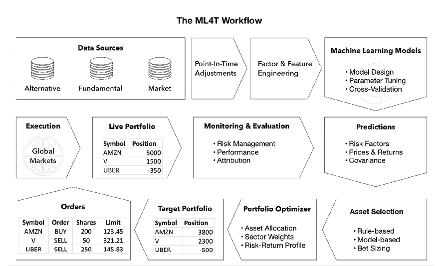
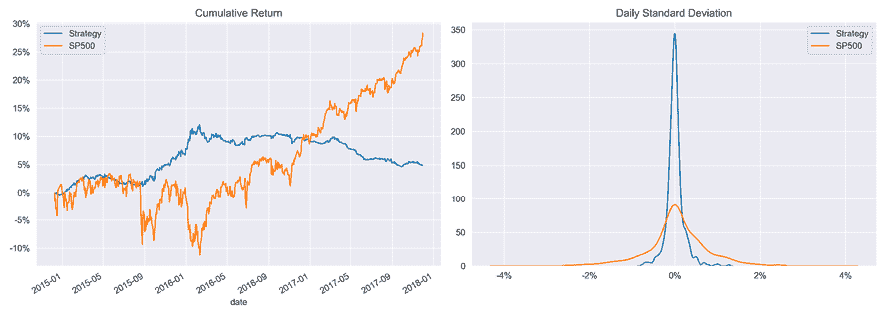
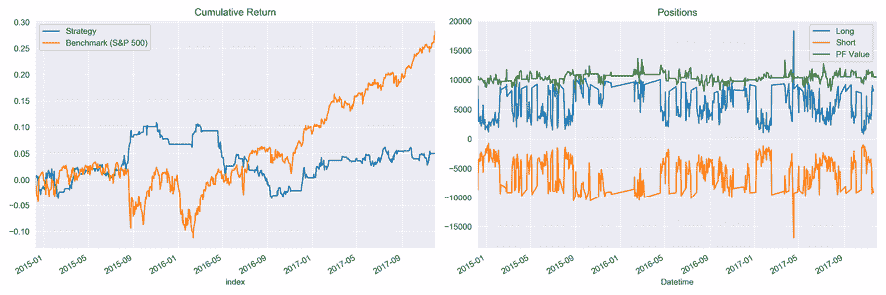
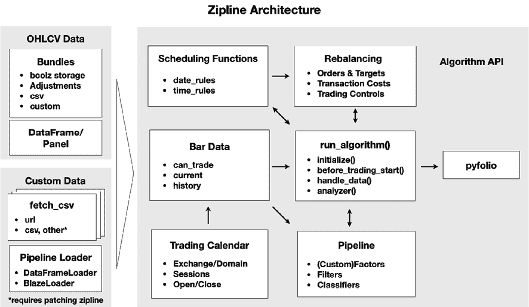
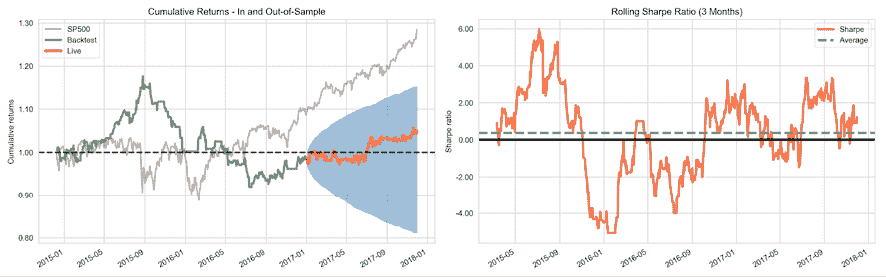
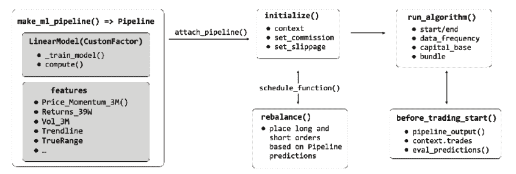
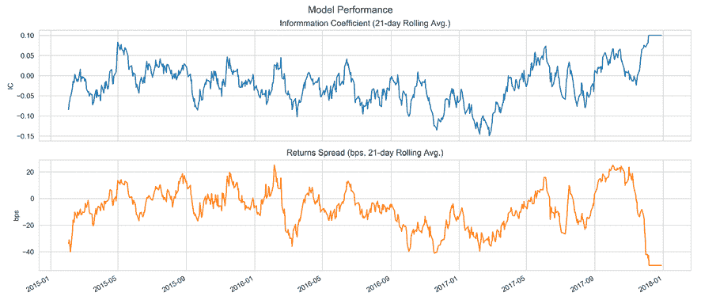
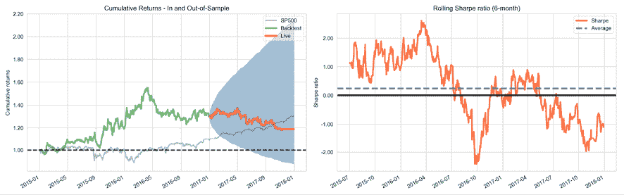

# 第八章：ML4T 工作流程 - 从模型到策略回测

现在，是时候**整合我们迄今为止分开讨论的机器学习交易（ML4T）工作流**的各种构建模块了。本章的目标是呈现设计、模拟和评估由 ML 算法驱动的交易策略过程的端到端视角。为此，我们将更详细地演示如何使用 Python 库 backtrader 和 Zipline 在历史市场环境中回测 ML 驱动的策略。

ML4T 工作流的**终极目标**是从历史数据中收集证据。这有助于我们决定是否在实时市场部署候选策略并将财务资源置于风险之中。此过程建立在您在前几章中培养的技能基础上，因为它依赖于您的能力来：

+   使用各种数据源来工程化信息丰富的因子

+   设计生成预测信号以指导您的交易策略的 ML 模型

+   从风险收益角度优化结果组合

实现你的策略的逼真模拟还需要忠实地表现出安全市场的运作方式以及交易是如何执行的。因此，在设计回测或评估回测引擎是否包含准确的性能度量所需特性时，交易所的制度细节，例如可用的订单类型以及价格确定方式也很重要。

具体来说，通过完成本章后，您将能够：

+   规划和实施端到端策略回测

+   在实施回测时了解并避免关键陷阱

+   讨论矢量化与事件驱动回测引擎的优缺点

+   识别和评估事件驱动回测器的关键组成部分

+   使用分钟和每日频率的数据源以及单独训练的 ML 模型或作为回测的一部分执行 ML4T 工作流程

+   使用 Zipline 和 backtrader

您可以在 GitHub 存储库的相应目录中找到本章的代码示例和其他资源链接。笔记本包括图像的彩色版本。

# 如何回测 ML 驱动的策略

简而言之，图 *8.1* 中所示的 ML4T 工作流程是关于回测利用机器学习生成交易信号的交易策略，选择和确定头寸，或者优化交易执行。它涉及以下步骤，并考虑特定的投资领域和时间跨度：

1.  获取和准备市场、基本和替代数据

1.  工程预测性的 alpha 因子和特征

1.  设计、调整和评估生成交易信号的 ML 模型

1.  根据这些信号做出交易决策，例如通过应用规则

1.  在组合背景下确定个别头寸的大小

1.  模拟使用历史市场数据触发的交易结果

1.  评估结果持有的表现将会如何



图 8.1：ML4T 工作流

当我们在*第六章*，*机器学习流程*中讨论了机器学习过程时，我们强调了模型的学习应该对新应用具有很好的泛化性。换句话说，基于给定数据集训练的 ML 模型的预测在提供新输入数据时应该表现同样良好。同样，策略的（相对）**回测性能应该表明未来市场的表现**。

在我们看如何运行历史模拟的回测引擎之前，我们需要审查几个方法上的挑战。未能适当解决这些挑战将使结果不可靠，并导致关于策略实时实施的错误决定。

# 回测陷阱及其避免方法

回测根据历史数据模拟算法策略，目的是产生适用于新市场条件的性能结果。除了在不断变化的市场背景下预测的一般不确定性之外，在样本内性能与将来保持的模式之间存在的几个实施方面可能会偏置结果，并增加将样本内性能误认为将适用于样本外的模式的风险。

这些方面在我们的控制范围内，并包括数据的选择和准备、对交易环境的不切实际假设，以及统计测试的错误应用和解释。错误回测发现的风险随着计算能力的增加、数据集的增大以及更复杂的算法而增加，这些算法有助于在噪声样本中误识别明显信号。

在本节中，我们将概述最严重和最常见的方法错误。请参考关于多重测试的文献以获取进一步的细节，特别是马科斯·洛佩斯·德·普拉多（Marcos Lopez de Prado）在*2018 年金融机器学习进展*中收集的一系列文章。我们还将介绍被调整的**夏普比率**（**SR**），该比率说明了如何在使用相同一组财务数据进行分析时调整由重复试验产生的指标。

## 获取正确的数据

削弱回测有效性的数据问题包括**前瞻性偏差**、**生存偏差**、**异常值控制**以及**样本期的选择**。我们将依次解决这些问题。

### 前瞻性偏差 – 仅使用点时间数据

算法策略的核心是根据数据触发行动的交易规则。当我们在未知或不可用的历史信息之前开发或评估交易规则时，前瞻性偏差就会出现。由此产生的绩效度量将是误导性的，并且不代表未来，因为实时策略执行期间的数据可用性不同。

这种偏差的常见原因是未能考虑在其初始发布后对报告的财务数据进行的更正或重新说明。股票分割或反向分割也可能产生前瞻性偏差。例如，在计算收益率时，**每股收益**（**EPS**）数据通常以季度为基础报告，而市场价格则以更高的频率提供。因此，调整后的 EPS 和价格数据需要同步，考虑到可用数据实际上是何时发布给市场参与者的。

**解决方案**涉及对进入回测的所有数据的时间戳进行仔细验证。我们需要确保结论仅基于时点数据，不会意外地包含未来的信息。高质量的数据提供商确保满足这些标准。当时点数据不可用时，我们需要对报告滞后进行（保守的）假设。

### 幸存者偏差 - 跟踪您的历史投资组合

当回测数据仅包含当前活动的证券，而**省略随时间消失**的资产时，幸存者偏差就会出现，原因可能是破产、退市或收购等。不再属于投资范围的证券通常表现不佳，而未能包括这些情况会使回测结果呈正偏。

**解决方案**自然是验证数据集是否包含随时间变化的所有证券，而不仅仅是在运行测试时仍然可用的证券。在某种程度上，这是确保数据真正时点的另一种方式。

### 异常值控制 - 不要排除现实中的极端情况

数据准备通常包括对异常值的处理，例如 winsorizing 或剪切极端值。挑战在于**确定那些确实不代表**分析期间的异常值，而不是任何那时市场环境的一个组成部分的极端值。许多市场模型假设在观察到更频繁的极端值时，数据呈正态分布，正如 fat-tailed 分布所建议的那样。

**解决方案**涉及对极端值进行仔细分析，以及根据这种现实调整策略参数。

### 样本期间 - 尝试代表相关的未来场景

如果样本数据不**反映当前（和可能的未来）环境**，则回测将不会产生推广到未来的代表性结果。糟糕选择的样本数据可能缺乏相关的市场制度方面，例如波动性或成交量方面，未能包含足够的数据点，或包含太多或太少的极端历史事件。

**解决方案**涉及使用包含重要市场现象的样本期间或生成反映相关市场特征的合成数据。

## 确保模拟正确

实施历史模拟时涉及的实际问题包括：

+   未按市场价值核算以准确反映市场价格和考虑回撤

+   关于交易的可用性、成本或市场影响的**不切实际假设**

+   错误的**信号和交易执行时间**

让我们看看如何识别和解决每一个问题。

### 按市场价值核算的绩效 - 随时间跟踪风险

策略需要**始终满足投资目标和约束条件**。如果它在回测过程中表现良好，但随着时间推移导致不可接受的损失或波动，这显然是行不通的。投资组合经理需要定期追踪和报告其头寸的价值，称为按市场价值核算，并可能是实时的。

解决方案包括随时间绘制绩效图或计算（滚动）风险指标，例如**价值-at-风险**（**VaR**）或 Sortino 比率。

### 交易成本 - 假设一个真实的交易环境

市场不允许在任何时候或以目标价格执行所有交易。假设**实际上可能无法进行或以不利条件发生的交易**的回测将产生有偏见的结果。

实际缺点包括假设可能没有对手方的卖空交易策略，或者低估了交易的市场影响（滑点）对大量交易或涉及较少流动性资产的影响，或者由于经纪费而产生的成本。

解决方案包括将限制在流动性范围内和/或对交易和滑点成本进行真实参数假设。这也可以防止不稳定因子信号产生的误导性结论，这些信号迅速衰减并产生高投资组合换手率。

### 决策的时间 - 正确排序信号和交易

类似于前瞻性偏差，模拟可能对**何时接收和交易信号**做出不切实际的假设。例如，当交易仅在下一个开市时可用时，信号可能是从收盘价格计算的，价格可能相差很大。当我们使用收盘价格评估绩效时，回测结果将不代表现实未来结果。

解决方案涉及精心组织信号到达、交易执行和绩效评估的顺序。

## 正确地获取统计数据

在回测有效性方面最突出的挑战，包括已发布的结果，是发现由于多次测试而导致的虚假模式。基于对同一数据的不同候选者的测试选择策略将使选择有所偏见。这是因为积极的结果更可能是由于绩效度量本身的随机性造成的。换句话说，该策略过度拟合了测试样本，产生了欺骗性的积极结果，不太可能推广到在实际交易中遇到的未来数据。

因此，只有报告试验次数才能提供有关选择偏见风险的评估，这在实际或学术研究中很少见，这引发了对许多已发表声明有效性的怀疑。

此外，回测过拟合的风险不仅来自运行大量测试，而且还影响基于先前的工作与否的知识设计的策略。由于风险包括他人在相同数据上运行的回测的知识，因此回测过拟合在实践中很难避免。

提出的**解决方案**包括优先考虑可以用投资或经济理论来证明的测试，而不是任意的数据挖掘努力。这也意味着在各种背景和情景下进行测试，包括可能在合成数据上进行测试。

### 最小回测长度和通缩的 SR

马科斯·洛佩兹·德·普拉多（[`www.quantresearch.info/`](http://www.quantresearch.info/)）在回测风险以及如何检测或避免回测风险方面发表了大量文章。这包括回测过拟合的在线模拟器（[`datagrid.lbl.gov/backtest/`](http://datagrid.lbl.gov/backtest/)，*贝利等人，2015 年*）。

另一个结果包括投资者应要求的回测期的最小长度的估计，以避免选择一种在给定数量的样本试验中达到一定 SR 但预期的样本外 SR 为零的策略。结果表明，例如，2 年的每日回测数据不支持对超过七种策略的结论。 5 年的数据将这个数字扩展到 45 种策略变体。有关实施细节，请参见*贝利，博尔温和普拉多（2016 年）*。

*贝利和普拉多（2014 年）* 还推导出了一个通缩的 SR 来计算 SR 在控制多重测试、非正常收益和较短样本长度的通胀效应时是否具有统计学显著性的概率。（有关`deflated_sharpe_ratio.py`的 Python 实现以及相关公式推导的参考，请参见`multiple_testing`子目录。）

### 回测的最佳停止

除了将回测限制在可以在理论上证明的策略上，而不是仅仅进行数据挖掘练习之外，一个重要问题是何时停止运行额外的测试。

回答这个问题的一种方法是依赖于最优停止理论中的**秘书问题**的解决方案。该问题假设我们根据面试结果选择申请人，并需要决定是否进行额外的面试或选择最近的候选人。在这种情况下，最优规则是始终拒绝前*n*/*e*个候选人，然后选择超过所有先前选项的第一个候选人。使用这个规则会导致选择最佳候选人的概率为 1/*e*，而不管候选人池的大小*n*如何。

将此规则直接翻译成回测背景产生以下**建议**：测试合理策略的 1/*e*（大约 37％）的随机样本，并记录它们的表现。然后，继续测试，直到有一个策略的表现优于之前测试的策略。这个规则适用于测试几种替代方案，目标是尽快选择近乎最佳的策略，同时尽量减少出现假阳性的风险。有关更多信息，请参阅 GitHub 上列出的资源。

# 回测引擎的工作原理

简而言之，回测引擎会迭代历史价格（和其他数据），将当前值传递给您的算法，接收订单，并跟踪生成的头寸及其价值。

在实践中，对于创建一个在本章开头所示 ML4T 工作流的真实而健壮的模拟，存在许多要求。矢量化和事件驱动方法的区别说明了如何忠实地再现实际交易环境会增加显著的复杂性。

## 矢量化与事件驱动回测

矢量化回测是评估策略的最基本方式。它简单地将表示目标头寸大小的信号矢量与投资周期的收益矢量相乘，以计算期间的性能。

让我们使用前一章中使用岭回归创建的每日收益预测来说明矢量化方法。使用几个简单的技术因素，我们预测了下一个交易日的 100 支最近美元交易量最高的股票的收益（有关详细信息，请参见第七章，“线性模型 - 从风险因素到收益预测”）。

我们将把预测转换成一个非常简单的策略的信号：在任何给定的交易日，我们将对最高的 10 个正预测进行多头操作，并对最低的 10 个负预测进行空头操作。如果正预测或负预测较少，我们将持有较少的多头或空头头寸。笔记本`vectorized_backtest`包含以下代码示例，脚本`data.py`创建存储在`backtest.h5`中的输入数据。

首先，我们加载我们策略的数据，以及标普 500 价格（我们将其转换为每日收益）以基准来评估其表现。

```py
sp500 = web.DataReader('SP500', 'fred', '2014', '2018').pct_change()
data = pd.read_hdf('00_data/backtest.h5', 'data')
data.info()
MultiIndex: 187758 entries, ('AAL', Timestamp('2014-12-09 00:00:00')) to ('ZTS', Timestamp('2017-11-30 00:00:00'))
Data columns (total 6 columns):
 #   Column     Non-Null Count   Dtype  
---  ------     --------------   -----  
 0   predicted  74044 non-null   float64
 1   open       187758 non-null  float64
 2   high       187758 non-null  float64
 3   low        187758 non-null  float64
 4   close      187758 non-null  float64
 5   volume     187758 non-null  float64 
```

数据结合了 2014-17 年期间 253 支不同股票的每日收益预测和 OHLCV 市场数据，每天有 100 支股票。现在，我们可以计算每日的前瞻性收益，并将这些收益和预测转换为宽格式，每一列一个股票：

```py
daily_returns = data.open.unstack('ticker').sort_index().pct_change()
fwd_returns = daily_returns.shift(-1)
predictions = data.predicted.unstack('ticker') 
```

下一步是选择正预测和负预测，按降序和升序排序，并使用整数掩码创建多头和空头信号，该掩码在每一侧的前 10 个位置上标识出正预测和负预测，并将不在前 10 个位置上的预测标识为 1，零：

```py
long_signals = (predictions.where(predictions>0).rank(axis=1, ascending=False) > 10).astype(int)
short_signals = (predictions.where(predictions<0).rank(axis=1) > 10).astype(int) 
```

我们随后可以将二进制数据框与前向收益相乘（对于做空，使用它们的负倒数），以获取每个头寸的每日表现，假设投资规模相同。这些回报的每日平均值对应于等权重的多头和空头投资组合的表现，总和反映了市场中性多空策略的整体回报：

```py
long_returns = long_signals.mul(fwd_returns).mean(axis=1)
short_returns = short_signals.mul(-fwd_returns).mean(axis=1)
strategy = long_returns.add(short_returns).to_frame('strategy') 
```

当我们比较结果时，如*图 8.2*所示，我们的策略在前两年表现良好，与标普 500 指数相比—也就是说，在基准追赶上来并且我们的策略在 2017 年表现不佳之前。

与标普 500 相比，策略回报也不太波动，标准差为 0.002，而标普 500 的标准差为 0.008；相关性低且为负值-0.093：



图 8.2：向量化回测结果

虽然这种方法允许快速进行草稿评估，但它错过了强大、逼真和用户友好的回测引擎的重要特性；例如：

+   我们需要手动对齐预测和回报的时间戳（使用 pandas 的内置功能），并且没有任何防止意外前瞻偏差的保护措施。

+   也没有明确的头寸规模和交易过程的表示，该表示考虑了成本和其他市场现实，或者跟踪头寸及其绩效的会计系统。

+   此外，除了我们事后计算的内容外，也没有任何绩效测量，而且像止损这样的风险管理规则很难模拟。

这就是事件驱动型回测的用武之地。事件驱动型回测引擎明确模拟了交易环境的时间维度，并对模拟施加了更多结构。这包括使用历史日历定义何时可以进行交易以及何时可以获得报价。时间戳的强制执行也有助于避免前瞻性偏差和先前部分提到的其他实施错误（但不能保证）。

一般来说，事件驱动型系统旨在更紧密地捕捉策略遇到的行动和约束，并且理想情况下可以轻松转化为提交实际订单的实时交易引擎。

## 关键的实施方面

对于逼真模拟的要求可能通过支持以端到端方式完成过程的**单一平台**，或者通过**多个工具**实现，每个工具专注于不同的方面而满足。

例如，您可以使用通用的 ML 库如 scikit-learn 或者本书中将遇到的其他库来处理生成信号的 ML 模型的设计和测试，并将模型输出馈送到单独的回测引擎中。或者，您可以在 Quantopian 或 QuantConnect 等单一平台上端到端运行整个 ML4T 工作流。

以下部分重点介绍需要解决以实施此过程的关键项目和实施细节。

### 数据摄入 - 格式、频率和时机

过程的第一步涉及数据来源。传统上，算法交易策略侧重于市场数据，即我们在 *第二章*，*市场和基本数据 - 来源和技术*中讨论的 OHLCV 价格和成交量数据。今天，数据源更加多样化，并引发了关于支持多少种不同的**存储格式和数据类型**以及是否使用专有或自定义格式，还是依赖于第三方或开源格式的问题。

另一个方面是可以使用的数据源的**频率**以及是否可以合并不同频率的源。按计算复杂性和内存和存储需求的增加顺序，常见选项包括每日、分钟和刻度频率。中间频率也是可能的。尽管量化基金投资者正在崛起，正如在 *第一章*，*从想法到执行的交易机器学习*中讨论的那样，算法策略在较高频率下往往表现更好。但无论如何，机构投资者肯定会要求刻度频率。

最后，数据摄入还应考虑**时点约束**，以避免前瞻性偏差，正如前一节所述。使用交易日历有助于限制数据在合法日期和时间内；需要在摄入之前进行调整，以反映像股票拆分和股息或在特定时间影响价格的重述等公司行为。

### 因子工程 - 内置因子与库

为了便于为 ML 模型工程化 Alpha 因子，许多回测引擎包括适用于许多标准转换的计算工具，例如移动平均线和各种技术指标。**内置因子工程**的一个关键优势是将回测流水线轻松转换为一个应用相同计算于输入数据的实时交易引擎。

在 *第四章*，*金融特征工程 - 如何研究 Alpha 因子*中介绍的**数字 Python 库**（pandas、NumPy、TA-Lib）是**预先计算因子**的替代方案。当目标是在各种回测中重用因子以分摊计算成本时，这可能是有效的。

### ML 模型、预测和信号

正如前面提到的，*第六章*，*机器学习流程*中讨论的 ML 工作流可以嵌入到一个端到端平台中，该平台将模型设计和评估部分整合到回测过程中。虽然方便，但这也很昂贵，因为当目标可能是调整交易规则时，模型训练变成了回测的一部分。

类似于因子工程，您可以解耦这些方面，并使用专门用于此目的的通用库设计、训练和评估 ML 模型，并将相关预测提供为回测器的输入。我们在本书中大多采用这种方法，因为它使表达更简洁，减少了重复性。

### 交易规则和执行

一个真实的策略模拟需要忠实地表现交易环境。这包括访问相关交易所，可以使用*第二章*，*市场和基本数据 - 来源和技术*中讨论的各种订单类型，以及考虑交易成本。成本包括经纪人佣金、买卖价差和滑点，使我们得到目标执行价格与最终获得价格之间的差异。还重要的是确保交易执行具有反映流动性和运营时间的延迟。

### 绩效评估

最后，回测平台需要方便的绩效评估。它可以提供从交易记录中派生的标准指标，或者提供可以与诸如**pyfolio**之类的库一起使用的指标输出，这是适用于此目的的库。

在接下来的两节中，我们将探讨两个最流行的回测库，即 backtrader 和 Zipline。

# backtrader – 一个灵活的用于本地回测的工具

**backtrader** 是一个流行、灵活和用户友好的 Python 库，用于本地回测，拥有出色的文档，自 2015 年由 Daniel Rodriguez 开发。除了拥有庞大且活跃的个人交易者社区外，还有几家银行和交易公司使用 backtrader 来原型化和测试新策略，然后再将其移植到生产就绪平台，例如 Java。您还可以选择使用 backtrader 与多家经纪商进行实时交易（请参阅 backtrader 文档和*第二十三章*，*结论与下一步*）。

我们将首先总结 backtrader 的关键概念，以澄清此平台上回测工作流程的大局，并展示其用于由 ML 预测驱动的策略的使用。

## backtrader 的 Cerebro 架构的关键概念

backtrader 的**Cerebro**（西班牙语意为“大脑”）架构将回测工作流程的关键组件表示为（可扩展的）Python 对象。这些对象相互作用以促进处理输入数据和因子的计算，制定和执行策略，接收和执行订单，以及跟踪和测量绩效。一个 Cerebro 实例组织了从收集输入、逐根执行回测到提供结果的整个过程。

该库使用一些约定来简化这些交互，允许您省略一些细节并简化回测设置。如果您计划使用 backtrader 来开发自己的策略，我强烈建议浏览文档以深入了解。

*图 8.3* 概述了 Cerebro 架构中的关键元素，以下各小节总结了它们的最重要功能：


图 8.3：backtrader Cerebro 架构

### 数据 feed、线和指标

数据 feed 是策略的原材料，包含有关个别证券的信息，例如每个观察时间戳的 OHLCV 市场数据，但您可以自定义可用字段。backtrader 可以从各种来源摄取数据，包括 CSV 文件和 pandas DataFrames，以及来自 Yahoo Finance 等在线来源的数据。您还可以使用扩展连接到在线交易平台（如 Interactive Brokers）以摄取实时数据并执行交易。与 DataFrame 对象的兼容性意味着您可以从 pandas 可访问的地方加载数据，从数据库到 HDF5 文件都可以（参见 *如何在实践中使用 backtrader* 部分中的演示；还请参阅 pandas 文档中的 *I/O* 部分）。

加载完成后，我们将数据 feed 添加到一个 Cerebro 实例中，然后按接收顺序使其对一个或多个策略可用。您的策略交易逻辑可以通过名称（例如股票代码）或序列号访问每个数据 feed，并检索数据 feed 的当前值和过去值的任何字段。每个字段称为**线**。

backtrader 自带超过 130 种常见的技术**指标**，允许您从线或其他指标为每个数据 feed 计算新值以驱动您的策略。您还可以使用标准的 Python **操作**来派生新值。使用方法非常简单，并且在文档中有很好的解释。

### 从数据和信号到交易 - 策略

**策略**对象包含您的交易逻辑，根据 Cerebro 实例在每个 bar 的回测执行期间呈现的数据 feed 信息来下单。您可以通过配置策略来接受您在将策略实例添加到 Cerebro 时定义的任意参数来轻松测试变化。

对于回测的每个 bar，Cerebro 实例都会调用您的策略实例的 `.prenext()` 或 `.next()` 方法之一。`.prenext()` 的作用是处理尚未完整为所有 feed 提供数据的 bar，例如，在有足够的周期计算内置移动平均线之前，或者如果存在缺失数据。默认情况下不执行任何操作，但如果您的主策略设计为处理缺失值，可以添加您选择的交易逻辑或调用 `next()`（请参阅 *如何在实践中使用 backtrader* 部分）。

您也可以使用 backtrader 而无需定义明确的策略，而是使用简化的信号接口。尽管策略 API 给予您更多控制和灵活性，但请参阅 backtrader 文档以了解如何使用信号 API 的详细信息。

策略输出订单：让我们看看 backtrader 如何处理这些订单。

### 佣金而不是佣金方案

一旦您的策略在每个柱上评估了当前和过去的数据点，它需要决定下订单。backtrader 让你创建几种标准的**订单**类型，Cerebro 将其传递给经纪人实例执行，并在每个柱上提供结果的通知。

您可以使用策略方法`buy()`和`sell()`来下市价、平仓和限价订单，以及止损和止损限价订单。执行如下：

+   **市价订单**：在下一个开盘柱填充

+   **平仓订单**：在下一根收盘柱填充

+   **限价订单**：仅在满足价格阈值（例如，仅在某个有效期内的某个价格购买）时执行

+   **止损订单**：如果价格达到给定阈值，则变为市价订单

+   **止损限价单**：一旦触发止损，就变成限价单

在实践中，止损订单与限价订单不同，因为在价格触发之前市场看不到它们。backtrader 还提供了目标订单，根据当前仓位计算所需大小，以实现某种投资组合分配，例如股票数量、仓位价值或组合价值的百分比。此外，还有**框架订单**，它们为长订单组合了一个买入和两个限价卖出订单，在买入执行时激活。如果其中一个卖出订单成交或取消，另一个卖出订单也会取消。

**经纪人**负责订单执行，跟踪投资组合、现金价值和通知，并实施佣金和滑点等交易成本。如果现金不足，经纪人可能会拒绝交易；确保买卖的顺序以确保流动性可能很重要。backtrader 还有一个`cheat_on_open`功能，允许向后看到下一个柱，以避免由于下一个柱的不利价格变动而拒绝交易。当然，这个功能会使你的结果产生偏差。

除了像固定或百分比的绝对交易价值的**佣金方案**之外，您还可以像后面演示的那样实现自己的逻辑，按股票的固定费用。

### 让一切都发生 - 大脑

大脑控制系统根据它们的时间戳表示的柱同步数据源，并根据事件的基础运行交易逻辑和经纪人操作。backtrader 不对频率或交易日历施加任何限制，并且可以并行使用多个时间框架。

如果它可以预加载源数据，它还可以为指标的计算进行矢量化。有几个选项可用于从内存的角度优化操作（请参阅 Cerebro 文档以获取详细信息）。

## 如何在实践中使用 backtrader

我们将使用来自*第七章*，*线性模型 - 从风险因子到收益预测*中岭回归的每日收益预测来演示 backtrader，就像我们在本章前面的向量化回测中所做的那样。我们将创建 Cerebro 实例，加载数据，制定和添加策略，运行回测，并审查结果。

笔记本`backtesting_with_backtrader`包含以下代码示例和一些额外的细节。

### 如何加载价格和其他数据

我们需要确保我们具有我们想要买入或卖出股票的所有日期的价格信息，而不仅仅是预测日的价格信息。要从 pandas DataFrame 加载数据，我们子类化 backtrader 的`PandasData`类以定义我们将提供的字段：

```py
class SignalData(PandasData):
    """
    Define pandas DataFrame structure
    """
    cols = OHLCV + ['predicted']
    # create lines
    lines = tuple(cols)
    # define parameters
    params = {c: -1 for c in cols}
    params.update({'datetime': None})
    params = tuple(params.items()) 
```

然后，我们实例化一个`Cerebro`类，并使用`SignalData`类为我们从 HDF5 加载的数据集中的每个股票添加一个数据源：

```py
cerebro = bt.Cerebro()  # create a "Cerebro" instance
idx = pd.IndexSlice
data = pd.read_hdf('00_data/backtest.h5', 'data').sort_index()
tickers = data.index.get_level_values(0).unique()
for ticker in tickers:
    df = data.loc[idx[ticker, :], :].droplevel('ticker', axis=0)
    df.index.name = 'datetime'
    bt_data = SignalData(dataname=df)
    cerebro.adddata(bt_data, name=ticker) 
```

现在，我们准备好定义我们的策略了。

### 如何制定交易逻辑

我们的`MLStrategy`子类化了 backtrader 的`Strategy`类，并定义了可用于修改其行为的参数。我们还创建了一个日志文件来记录交易：

```py
class MLStrategy(bt.Strategy):
    params = (('n_positions', 10),
              ('min_positions', 5),
              ('verbose', False),
              ('log_file', 'backtest.csv'))
    def log(self, txt, dt=None):
        """ Logger for the strategy"""
        dt = dt or self.datas[0].datetime.datetime(0)
        with Path(self.p.log_file).open('a') as f:
            log_writer = csv.writer(f)
            log_writer.writerow([dt.isoformat()] + txt.split(',')) 
```

策略的核心位于`.next()`方法中。我们对最高正/最低负预测的`n_position`只进行多头/空头操作，只要至少有`min_positions`个仓位。我们始终卖出任何不在新多头和空头列表中的现有仓位，并使用`order_target_percent`在新目标中建立等权重仓位（为节省一些空间而省略了日志记录）：

```py
 def prenext(self):
        self.next()
    def next(self):
        today = self.datas[0].datetime.date()
        positions = [d._name for d, pos in self.getpositions().items() if pos]
        up, down = {}, {}
        missing = not_missing = 0
        for data in self.datas:
            if data.datetime.date() == today:
                if data.predicted[0] > 0:
                    up[data._name] = data.predicted[0]
                elif data.predicted[0] < 0:
                    down[data._name] = data.predicted[0]
        # sort dictionaries ascending/descending by value
        # returns list of tuples
        shorts = sorted(down, key=down.get)[:self.p.n_positions]
        longs = sorted(up, key=up.get, reverse=True)[:self.p.n_positions]
        n_shorts, n_longs = len(shorts), len(longs)
        # only take positions if at least min_n longs and shorts
        if n_shorts < self.p.min_positions or n_longs < self.p.min_positions:
            longs, shorts = [], []
        for ticker in positions:
            if ticker not in longs + shorts:
                self.order_target_percent(data=ticker, target=0)
         short_target = -1 / max(self.p.n_positions, n_short)
        long_target = 1 / max(self.p.top_positions, n_longs)
        for ticker in shorts:
            self.order_target_percent(data=ticker, target=short_target)
        for ticker in longs:
            self.order_target_percent(data=ticker, target=long_target) 
```

现在，我们需要配置我们的`Cerebro`实例并添加我们的`Strategy`。

### 如何配置 Cerebro 实例

我们使用一个自定义的佣金方案，假设我们每买入或卖出一股就支付固定金额的$0.02：

```py
class FixedCommisionScheme(bt.CommInfoBase):
    """
    Simple fixed commission scheme for demo
    """
    params = (
        ('commission', .02),
        ('stocklike', True),
        ('commtype', bt.CommInfoBase.COMM_FIXED),
    )
    def _getcommission(self, size, price, pseudoexec):
        return abs(size) * self.p.commission 
```

然后，我们定义我们的起始现金金额并相应地配置经纪人：

```py
cash = 10000
cerebro.broker.setcash(cash)
comminfo = FixedCommisionScheme()
cerebro.broker.addcommissioninfo(comminfo) 
```

现在，唯一缺少的是将`MLStrategy`添加到我们的`Cerebro`实例中，提供所需仓位数和最小多头/空头仓位数的参数。我们还将添加一个 pyfolio 分析器，以便查看我们在*第五章*，*组合优化和绩效评估*中呈现的绩效图表：

```py
cerebro.addanalyzer(bt.analyzers.PyFolio, _name='pyfolio')
cerebro.addstrategy(MLStrategy, n_positions=10, min_positions=5, 
                    verbose=True, log_file='bt_log.csv')
results = cerebro.run()
ending_value = cerebro.broker.getvalue()
f'Final Portfolio Value: {ending_value:,.2f}'
Final Portfolio Value: 10,502.32 
```

回测使用了 869 个交易日，并花费大约 45 秒时间运行。以下图表显示了累积收益和组合价值的变化，以及多头和空头仓位的每日价值。

绩效看起来与前面的向量化测试有些相似，在前半段相对于标准普尔 500 指数的表现良好，在后半段表现不佳。

`backtesting_with_backtrader`笔记本包含完整的 pyfolio 结果：



图 8.4：backtrader 结果

## backtrader 摘要和下一步

backtrader 是一个非常简单灵活且性能优异的本地回测引擎。由于与 pandas 兼容性，您可以从广泛的来源加载您所需频率的任何数据集。`Strategy`允许您定义任意的交易逻辑；您只需确保按需访问不同的数据源。它还与 pyfolio 集成良好，以进行快速而全面的绩效评估。

在演示中，我们将我们的交易逻辑应用于预训练模型的预测结果。我们也可以在回测过程中训练模型，因为我们可以访问当前柱之前的数据。然而，通常情况下，将模型训练与策略选择解耦并避免重复模型训练更加高效。

backtrader 之所以受欢迎的一个原因是可以将其用于与所选经纪人的实时交易。社区非常活跃，并且用于连接经纪人或其他数据源（包括加密货币）的代码可以在网上轻松找到。

# Zipline – Quantopian 的可扩展回测

回测引擎 Zipline 支持 Quantopian 的在线研究、回测和实时（模拟）交易平台。作为一家对冲基金，Quantopian 的目标是确定符合其风险管理标准的稳健算法。为此，他们使用竞赛选择最佳策略，并分配资本与赢家分享利润。

Quantopian 于 2012 年首次发布了 Zipline，版本为 0.5，最新版本为 1.3，日期为 2018 年 7 月。Zipline 与其姊妹库 Alphalens、pyfolio 和 empyrical 配合良好，我们在*第四章*，*金融特征工程 – 如何研究 Alpha 因子*和*第五章*，*组合优化与绩效评估*中介绍了这些库，与 NumPy、pandas 和数值库集成良好，但不一定始终支持最新版本。

Zipline 的设计是为了在数千个证券的规模下运作，并且每个证券可以关联大量的指标。它在回测过程中比 backtrader 更加结构化，以确保数据质量，例如消除前视偏差，并在执行回测时优化计算效率。我们将在*图 8.5*中展示的主要概念和架构元素之前，介绍 Zipline 的使用方法，以便在所选数据上回测基于 ML 的模型。

## 用于稳健模拟的日历和 Pipeline

有助于实现可扩展性和可靠性目标的关键特性包括数据捆绑包，它存储带有即时调整的 OHLCV 市场数据，用于拆分和股息，反映全球交易所的营业时间的交易日历，以及强大的 Pipeline API（见下图）。我们将在接下来的章节中讨论它们的使用方法，以补充我们在早期章节中对 Zipline 的简要介绍：



图 8.5：Zipline 架构

### 捆绑包 - 即时数据与即时调整

主要数据存储是一个**捆绑包**，以压缩的、列式的 bcolz 格式存储在磁盘上，以便高效检索，并与存储在 SQLite 数据库中的元数据相结合。捆绑包设计为仅包含 OHLCV 数据，并且限制为每日和每分钟的频率。一个很棒的特性是捆绑包存储了分割和分红信息，而 Zipline 根据你选择的回测时间段计算**即时调整**。

Zipline 依赖于 **TradingCalendar** 库（也由 Quantopian 维护）来获取世界各地交易所的运营细节，如时区、开盘和收盘时间或假期。数据来源具有域（目前为国家），需要符合指定的交易所日历。Quantopian 正在积极开发对国际证券的支持，这些功能可能会不断演变。

安装完成后，命令 `zipline ingest -b bundle` 可让你立即安装 Quandl Wiki 数据集（每日频率）。结果存储在`.zipline` 目录中，默认位于你的主目录中。此外，你还可以设计自己的捆绑包，我们会看到。

除了捆绑包外，你还可以将 OHCLV 数据作为 pandas DataFrame 或 Panel 提供给算法。（Panel 最近已弃用，但 Zipline 落后几个 pandas 版本。）然而，捆绑包更加方便和高效。

捆绑包的一个缺点是它们不允许你存储除价格和成交量信息之外的数据。然而，有两种替代方法可以实现这一点：`fetch_csv()` 函数从 URL 下载 DataFrame，并设计用于其他 Quandl 数据来源，例如基本面数据。Zipline 合理地期望数据与你提供的 OHCLV 数据引用相同的证券，并相应地对齐柱。通过使用 pandas 加载本地 CSV 或 HDF5 很容易修补该库，GitHub 仓库提供了一些如何执行此操作的指导。

此外，`DataFrameLoader` 和 `BlazeLoader` 允许你向管道提供额外的属性（请参阅本章后面的 `DataFrameLoader` 演示）。`BlazeLoader` 可以与多种来源进行接口，包括数据库。然而，由于 Pipeline API 仅限于每日数据，`fetch_csv()` 将是关键，以在后续章节中添加分钟频率的功能。

### 算法 API - 按计划进行回测

`TradingAlgorithm` 类实现了 Zipline 算法 API，并在与给定交易日历对齐的 `BarData` 上运行。在初始设置之后，回测将在指定的期间运行，并在特定事件发生时执行其交易逻辑。这些事件由每日或每分钟的交易频率驱动，但你也可以安排任意函数来评估信号、下订单和重新平衡你的投资组合，或者记录有关进行中模拟的信息。

您可以通过命令行，在 Jupyter Notebook 中，或者使用底层 `TradingAlgorithm` 类的 `run_algorithm()` 方法执行算法。该算法需要一个 `initialize()` 方法，在模拟开始时调用一次。它通过上下文字典保持状态，并通过包含即时当前和历史数据的数据变量接收可操作信息。

您可以向上下文字典添加属性，该字典对所有其他 `TradingAlgorithm` 方法可用，或者注册执行更复杂数据处理的管道，例如计算 alpha 因子并相应地筛选证券。

算法执行通过 Zipline 自动安排的可选方法或用户定义的间隔发生。每天市场开盘前调用 `before_trading_start()` 方法，并主要用于识别算法可能在当天交易的一组证券。 `handle_data()` 方法以给定的交易频率调用，例如，每分钟。

完成后，如果有任何交易，算法将返回包含投资组合绩效指标的 DataFrame，以及用户定义的指标。正如在*第五章，* *投资组合优化和绩效评估*中所演示的，输出与 pyfolio 兼容，因此您可以快速创建绩效表。

### 已知问题

目前，Zipline 要求 Treasury 曲线和标普 500 指数收益率用于基准测试 ([`github.com/quantopian/zipline/issues/2480`](https://github.com/quantopian/zipline/issues/2480))。后者依赖于 IEX API，现在需要注册才能获取密钥。很容易修补 Zipline 以规避此问题，并从联邦储备局下载数据，例如。GitHub 存储库描述了如何操作。另外，您可以将 `zipline/resources/market_data/SPY_benchmark.csv` 中提供的 SPY 收益移动到您的 `.zipline` 文件夹中，该文件夹通常位于您的主目录中，除非您更改了其位置。

实时交易 ([`github.com/zipline-live/zipline`](https://github.com/zipline-live/zipline)) 您自己的系统仅适用于 Interactive Brokers，并且并不受 Quantopian 完全支持。

## 使用分钟数据摄取您自己的 bundle

我们将使用 AlgoSeek 提供的 NASDAQ100 2013-17 样本，该样本在*第二章，* *市场和基本数据 - 来源和技术* 中介绍，来演示如何编写自己的自定义 bundle。有四个步骤：

1.  将您的 OHCLV 数据分成一个文件 per ticker，并存储元数据以及拆分和股息调整。

1.  编写一个脚本将结果传递给一个 `ingest()` 函数，该函数依次负责将 bundle 写入 bcolz 和 SQLite 格式。

1.  在位于您主目录的 `.zipline` 目录中的 extension.py 脚本中注册 bundle，并为数据源创建符号链接。

1.  对于 AlgoSeek 数据，我们还提供了自定义 TradingCalendar，因为它包括了纽约证券交易所市场小时之外的交易活动。

目录`custom_bundles`包含了本节的代码示例。

### 准备数据以进行捆绑

在*第二章，市场和基本数据 - 来源和技术*中，我们解析了包含 AlgoSeek 纳斯达克 100 OHLCV 数据的每日文件，以获取每个股票的时间序列。我们将使用这个结果，因为 Zipline 也单独存储每个证券。

另外，我们使用 pandas DataReader 的`get_nasdaq_symbols()`函数获取股票的元数据。最后，由于 Quandl Wiki 数据涵盖了相关时期的纳斯达克 100 个股票代码，我们从该包的 SQLite 数据库中提取拆分和股利调整。

结果是一个包含约 135 个股票价格和交易量数据以及相应的元数据和调整数据的 HDF5 存储。脚本`algoseek_preprocessing.py`说明了这个过程。

### 撰写您的自定义捆绑`ingest`函数

Zipline 文档概述了`ingest()`函数的必需参数，该函数启动 I/O 过程，但没有提供太多实际细节。脚本`algoseek_1min_trades.py`展示了如何使这部分适用于分钟数据。

有一个`load_equities()`函数提供元数据，一个`ticker_generator()`函数将符号提供给`data_generator()`，后者依次加载和格式化每个符号的市场数据，并且一个`algoseek_to_bundle()`函数，它集成了所有这些部分并返回所需的`ingest()`函数。

时区对齐很重要，因为 Zipline 将所有数据系列转换为 UTC；我们为 OHCLV 数据添加了 US/Eastern 时区信息并将其转换为 UTC。为了方便执行，我们在`.zipline`目录中的`custom_data`文件夹中为该脚本和`algoseek.h5`数据创建了符号链接，我们将在下一步中将其添加到`PATH`中，以便 Zipline 可以找到这些信息。

### 注册您的捆绑

在我们可以运行`zipline ingest -b algoseek`之前，我们需要注册我们的自定义捆绑，以便 Zipline 知道我们在说什么。为此，我们将在`.zipline`文件中的`extension.py`脚本中添加以下行，您可能首先需要创建它，以及一些输入和设置（请参阅`extension.py`示例）。

注册本身相当简单，但强调了一些重要细节。首先，Zipline 需要能够导入`algoseek_to_bundle()`函数，因此其位置需要在搜索路径上，例如，通过使用`sys.path.append()`。其次，我们引用了一个自定义日历，我们将在下一步中创建和注册。第三，我们需要通知 Zipline 我们的交易日比默认的 NYSE 交易日的 6 小时 30 分钟要长，以避免错位：

```py
register('algoseek',
        algoseek_to_bundle(),
        calendar_name='AlgoSeek',
        minutes_per_day=960
        ) 
```

### 创建并注册自定义 TradingCalendar

正如之前提到的，Quantopian 还提供了一个 TradingCalendar 库来支持全球交易。该包包含大量示例，并且相当容易从这些示例中派生出一个。基于 NYSE 日历，我们只需要重写开盘/收盘时间并更改名称：

```py
class AlgoSeekCalendar(XNYSExchangeCalendar):
    """
    A calendar for trading assets before and after market hours
    Open Time: 4AM, US/Eastern
    Close Time: 19:59PM, US/Eastern
    """
    @property
    def name(self):
        return "AlgoSeek"
    @property
    def open_time(self):
        return time(4, 0)
    @property
    def close_time(self):
        return time(19, 59) 
```

我们将定义放入 `extension.py` 中，并添加以下注册：

```py
register_calendar(
        'AlgoSeek',
        AlgoSeekCalendar()) 
```

现在，我们可以参考此交易日历以确保回测包含非市场小时的活动。

## Pipeline API – 对 ML 信号进行回测

Pipeline API 促进了从历史数据中为一组证券定义和计算 Alpha 因子。Pipeline 显著提高了效率，因为它优化了整个回测期间的计算，而不是分别处理每个事件。换句话说，它仍然遵循事件驱动的架构，但在可能的情况下对因子的计算进行了矢量化。

Pipeline 使用 factors、filters 和 classifiers 类来定义为一组证券生成表中列的计算，该表具有一组证券的点值历史数据。Factors 接受一个或多个历史条数据输入数组，并为每个证券产生一个或多个输出。有许多内置因子，您还可以设计自己的 `CustomFactor` 计算。

以下图表显示了如何使用 `DataFrameLoader` 加载数据，使用 Pipeline API 计算预测的 `MLSignal`，以及各种预定活动如何与通过 `run_algorithm()` 函数执行的整体交易算法集成。我们将在本节中详细介绍细节和相应的代码：  


图 8.6：使用 Zipline 的 Pipeline API 进行 ML 信号回测

您需要使用 `initialize()` 方法注册您的 Pipeline，并在每个时间步或自定义时间表上执行它。Zipline 提供了许多内置的计算，例如移动平均线或布林带，可以用于快速计算标准因子，但它也允许创建自定义因子，我们将在接下来进行说明。

最重要的是，Pipeline API 使 Alpha 因子研究模块化，因为它将 Alpha 因子的计算与算法的其余部分（包括交易订单的放置和执行以及投资组合持仓、价值等的簿记）分开。

现在我们将说明如何将 lasso 模型的每日回报预测与我们的投资组合中的价格数据一起加载到 Pipeline 中，并使用 `CustomFactor` 来选择前 10 个和后 10 个预测作为做多和做空头寸。笔记本 `backtesting_with_zipline` 包含以下代码示例。

我们的目标是将每日收益预测与我们的 Quandl 捆绑的 OHCLV 数据结合起来，然后在预测收益最高的 10 支股票上做多，而在预测收益最低的股票上做空，每边至少需要五只股票，类似于上面的 backtrader 示例。

### 为我们的 Pipeline 启用 DataFrameLoader

首先，我们加载我们对 2015-17 期间的预测，并使用 `bundle.asset_finder.lookup_symbols()` 方法提取此期间我们宇宙中 ~250 支股票的 Zipline ID，如下代码所示：

```py
def load_predictions(bundle):
    predictions = pd.read_hdf('../00_data/backtest.h5', 'data')[['predicted']].dropna()
    tickers = predictions.index.get_level_values(0).unique().tolist()
    assets = bundle.asset_finder.lookup_symbols(tickers, as_of_date=None)
    predicted_sids = pd.Int64Index([asset.sid for asset in assets])
    ticker_map = dict(zip(tickers, predicted_sids))
    return (predictions
            .unstack('ticker')
            .rename(columns=ticker_map)
            .predicted
            .tz_localize('UTC')), assets
bundle_data = bundles.load('quandl')
predictions, assets = load_predictions(bundle_data) 
```

为了使预测结果可供 Pipeline API 使用，我们需要定义一个具有适当数据类型的 `Column`，用于具有适当 `domain` 的 `DataSet`，如下所示：

```py
class SignalData(DataSet):
    predictions = Column(dtype=float)
    domain = US_EQUITIES 
```

虽然捆绑的 OHLCV 数据可以依赖于内置的 `USEquityPricingLoader`，但我们需要定义自己的 `DataFrameLoader`，如下所示：

```py
signal_loader = {SignalData.predictions:
                     DataFrameLoader(SignalData.predictions, predictions)} 
```

实际上，我们需要稍微修改 Zipline 库的源代码，以避免假设我们只加载价格数据。为此，我们向 `run_algorithm` 方法添加一个 `custom_loader` 参数，并确保在 pipeline 需要 SignalData 的 `Column` 实例时使用此加载器。

### 创建具有自定义 ML 因子的 pipeline

我们的 pipeline 将有两个布尔列，用于识别我们想交易的资产作为多头和空头头寸。为了达到这个目标，我们首先定义一个名为 `MLSignal` 的 `CustomFactor`，它只接收当前的收益预测。动机是允许我们使用一些方便的 `Factor` 方法来对证券进行排名和筛选：

```py
class MLSignal(CustomFactor):
    """Converting signals to Factor
        so we can rank and filter in Pipeline"""
    inputs = [SignalData.predictions]
    window_length = 1
    def compute(self, today, assets, out, preds):
        out[:] = preds 
```

现在，我们可以通过实例化 `CustomFactor` 来设置我们的实际 pipeline，它除了提供的默认参数外不需要任何参数。我们将其 `top()` 和 `bottom()` 方法与过滤器结合起来选择最高的正预测和最低的负预测：

```py
def compute_signals():
    signals = MLSignal()
    return Pipeline(columns={
        'longs' : signals.top(N_LONGS, mask=signals > 0),
        'shorts': signals.bottom(N_SHORTS, mask=signals < 0)},
            screen=StaticAssets(assets)) 
```

下一步是通过定义一些上下文变量、设置交易成本参数、执行时间表再平衡和日志记录，并附加我们的 pipeline 来初始化我们的算法：

```py
def initialize(context):
    """
    Called once at the start of the algorithm.
    """
    context.n_longs = N_LONGS
    context.n_shorts = N_SHORTS
    context.min_positions = MIN_POSITIONS
    context.universe = assets
    set_slippage(slippage.FixedSlippage(spread=0.00))
    set_commission(commission.PerShare(cost=0, min_trade_cost=0))
    schedule_function(rebalance,
                      date_rules.every_day(),
                      time_rules.market_open(hours=1, minutes=30))
    schedule_function(record_vars,
                      date_rules.every_day(),
                      time_rules.market_close())
    pipeline = compute_signals()
    attach_pipeline(pipeline, 'signals') 
```

每天在市场开盘前，我们都会运行我们的 Pipeline 来获取最新的预测：

```py
def before_trading_start(context, data):
    """
    Called every day before market open.
    """
    output = pipeline_output('signals')
    context.trades = (output['longs'].astype(int)
                      .append(output['shorts'].astype(int).mul(-1))
                      .reset_index()
                      .drop_duplicates()
                      .set_index('index')
                      .squeeze()) 
```

市场开盘后，我们为我们的多头和空头目标下订单，并关闭所有其他头寸：

```py
def rebalance(context, data):
    """
    Execute orders according to schedule_function() date & time rules.
    """
    trades = defaultdict(list)
    for stock, trade in context.trades.items():
        if not trade:
            order_target(stock, 0)
        else:
            trades[trade].append(stock)
    context.longs, context.shorts = len(trades[1]), len(trades[-1])
    if context.longs > context.min_positions and context.shorts > context.min_positions:
        for stock in trades[-1]:
            order_target_percent(stock, -1 / context.shorts)
        for stock in trades[1]:
            order_target_percent(stock, 1 / context.longs) 
```

现在，我们已经准备好执行我们的回测并将结果传递给 pyfolio：

```py
results = run_algorithm(start=start_date,
                       end=end_date,
                       initialize=initialize,
                       before_trading_start=before_trading_start,
                       capital_base=1e6,
                       data_frequency='daily',
                       bundle='quandl',
                       custom_loader=signal_loader) # need to modify zipline
returns, positions, transactions = pf.utils.extract_rets_pos_txn_from_zipline(results) 
```

*图 8.7* 显示了策略累积收益（左侧面板）和滚动夏普比率的图表，这与之前的 backtrader 示例可比。

回测只需大约一半的时间：



图 8.7：Zipline 回测结果

笔记本 `backtesting_with_zipline` 包含了完整的 pyfolio tearsheet，包括额外的指标和图表。

## 如何在回测期间训练模型

我们还可以将模型训练集成到我们的回测中。您可以在 `ml4t_with_zipline` 笔记本中找到我们 ML4T 工作流程的以下端到端示例的代码：



图 8.8：带有模型训练的 Zipline 回测流程图

目标是大致复制我们之前使用的岭回归每日收益预测，并在*第七章*，*线性模型 - 从风险因子到收益预测*中生成的。 但是，我们将使用一些额外的管道因子来说明它们的用法。 主要的新元素是一个`CustomFactor`，它接收特征并将它们作为输入用于训练模型并生成预测。

### 准备特征 - 如何定义管道因子

要创建一个**管道因子**，我们需要一个或多个输入变量，一个指示每个输入和证券的最新数据点数量的`window_length`，以及我们想要执行的计算。

我们使用线性回归估计的线性价格趋势（见*第七章*，*线性模型 - 从风险因子到收益预测*）的工作方式如下：我们使用最新的 252 个收盘价格来计算线性时间趋势的回归系数：

```py
class Trendline(CustomFactor):
    # linear 12-month price trend regression
    inputs = [USEquityPricing.close]
    window_length = 252
    def compute(self, today, assets, out, close):
        X = np.arange(self.window_length).reshape(-1, 1).astype(float)
        X -= X.mean()
        Y = close - np.nanmean(close, axis=0)
        out[:] = (X.T @ Y / np.var(X)) / self.window_length 
```

我们将使用 10 个自定义和内置因子作为我们模型的特征，以捕获动量和波动性等风险因子（有关详情，请参见笔记本 `ml4t_with_zipline`）。 接下来，我们将设计一个`CustomFactor`来训练我们的模型。

### 如何设计自定义 ML 因子

我们的`CustomFactor`，称为`ML`，将具有`StandardScaler`和随机梯度下降的**岭回归**（**SGD**）实现作为实例属性，并且我们将每周训练 3 天：

```py
class LinearModel(CustomFactor):
    """Obtain model predictions"""
    train_on_weekday = [0, 2, 4]
    def __init__(self, *args, **kwargs):
        super().__init__(self, *args, **kwargs)
        self._scaler = StandardScaler()
        self._model = SGDRegressor(penalty='L2')
        self._trained = False 
```

`compute`方法生成预测（解决潜在的缺失值），但首先检查是否应该训练模型：

```py
 def _maybe_train_model(self, today, returns, inputs):
        if (today.weekday() in self.train_on_weekday) or not self._trained:
            self._train_model(today, returns, inputs)
    def compute(self, today, assets, out, returns, *inputs):
        self._maybe_train_model(today, returns, inputs)
        # Predict most recent feature values
        X = np.dstack(inputs)[-1]
        missing = np.any(np.isnan(X), axis=1)
        X[missing, :] = 0
        X = self._scaler.transform(X)
        preds = self._model.predict(X)
        out[:] = np.where(missing, np.nan, preds) 
```

`_train_model`方法是这个谜题的核心。 它移动回报并将结果的向前回报与因子特征对齐，同时在过程中删除缺失值。 它将剩余的数据点进行缩放，并训练线性`SGDRegressor`：

```py
 def _train_model(self, today, returns, inputs):
        scaler = self._scaler
        model = self._model
        shift_by = N_FORWARD_DAYS + 1
        outcome = returns[shift_by:].flatten()
        features = np.dstack(inputs)[:-shift_by]
        n_days, n_stocks, n_features = features.shape
        features = features.reshape(-1, n_features)
        features = features[~np.isnan(outcome)]
        outcome = outcome[~np.isnan(outcome)]
        outcome = outcome[np.all(~np.isnan(features), axis=1)]
        features = features[np.all(~np.isnan(features), axis=1)]
        features = scaler.fit_transform(features)
        model.fit(X=features, y=outcome)
        self._trained = True 
```

`make_ml_pipeline()`函数预处理并将结果、特征和模型部分合并为一个具有预测列的管道：

```py
def make_ml_pipeline(universe, window_length=21, n_forward_days=5):
    pipeline_columns = OrderedDict()
    # ensure that returns is the first input
    pipeline_columns['Returns'] = Returns(inputs=[USEquityPricing.open],
                                          mask=universe,
                                          window_length=n_forward_days + 1)
    # convert factors to ranks; append to pipeline
    pipeline_columns.update({k: v.rank(mask=universe)
                             for k, v in features.items()})
    # Create ML pipeline factor.
    # window_length = length of the training period
    pipeline_columns['predictions'] = LinearModel(
        inputs=pipeline_columns.values(),
        window_length=window_length + n_forward_days,
        mask=universe)
    return Pipeline(screen=universe, columns=pipeline_columns) 
```

### 在回测期间跟踪模型性能

我们使用`before_trading_start()`函数获取新的预测，该函数在市场开盘前每天早晨运行：

```py
def before_trading_start(context, data):
    output = pipeline_output('ml_model')
    context.predicted_returns = output['predictions']
    context.predicted_returns.index.rename(['date', 'equity'], inplace=True)
    evaluate_predictions(output, context) 
```

`evaluate_predictions`确切地做到了这一点：它跟踪我们模型过去的预测，并在相关的时间范围内实现收益时对其进行评估（在我们的示例中，是第二天）：

```py
def evaluate_predictions(output, context):
    # Look at past predictions to evaluate model performance out-of-sample
    # A day has passed, shift days and drop old ones
    context.past_predictions = {
        k - 1: v for k, v in context.past_predictions.items() if k > 0}
    if 0 in context.past_predictions:
        # Use today's forward returns to evaluate predictions
        returns, predictions = (output['Returns'].dropna()
                                .align(context.past_predictions[0].dropna(),
                                       join='inner'))
        if len(returns) > 0 and len(predictions) > 0:
            context.ic = spearmanr(returns, predictions)[0]
            context.rmse = np.sqrt(
                mean_squared_error(returns, predictions))
            context.mae = mean_absolute_error(returns, predictions)
            long_rets = returns[predictions > 0].mean()
            short_rets = returns[predictions < 0].mean()
            context.returns_spread_bps = (
                long_rets - short_rets) * 10000
    # Store current predictions
    context.past_predictions[N_FORWARD_DAYS] = context.predicted_returns 
```

我们还每天记录评估结果，以便在回测后进行审查：



图 8.9：模型外样本性能

以下图表总结了回测性能，以累积收益和滚动 SR 为指标。 与之前的示例相比，结果有所改善（由于不同的特征集），但自 2016 年中期以来，模型仍然表现不佳：



图 8.10：使用模型训练的 Zipline 回测性能

请查看笔记本，了解我们如何定义宇宙、运行回测、以及使用 pyfolio 重新平衡和分析结果的附加细节。

## 而不是如何使用

笔记本 `ml4t_quantopian` 包含了一个示例，展示了如何在 Quantopian 研究环境中使用简单的 ML 模型进行回测策略。在 Quantopian 云中使用 Zipline 的关键好处是可以访问许多额外的数据集，包括基本数据和替代数据。请查看笔记本，了解我们可以在这种情况下导出的各种因素的更多详细信息。

# 总结

在本章中，我们更加深入地了解了回测的工作原理，存在哪些挑战，以及如何管理它们。我们演示了如何使用两个流行的回测库，backtrader 和 Zipline。

然而，最重要的是，我们走过了设计和测试 ML 模型的端到端流程，向你展示了如何实现根据模型预测提供的信号执行交易逻辑，并且看到了如何进行和评估回测。现在，我们已经准备好继续探索比我们最初开始的线性回归更广泛和更复杂的 ML 模型阵列。

下一章将介绍如何将时间维度纳入我们的模型中。
