# 第九章：用于波动率预测和统计套利的时间序列模型

在*第七章*，*线性模型 - 从风险因素到资产收益预测*中，我们介绍了用于推断和预测的线性模型，从静态模型开始，考虑具有即时影响的横截面输入的同时关系。我们介绍了**普通最小二乘法**（**OLS**）学习算法，并且发现它对于正确指定的模型产生无偏系数，且残差与输入变量不相关。假设残差具有恒定方差，可以保证 OLS 在无偏估计器中产生最小的均方预测误差。

我们还遇到了既有横截面又有时间序列维度的面板数据，当我们学习如何使用 Fama-Macbeth 回归来估计随时间和跨资产的风险因素的价值时。然而，随着时间的推移，收益之间的关系通常相当低，因此这个过程可能会大部分忽略时间维度。

此外，我们介绍了正则化的岭回归和套索回归模型，它们产生了偏差系数估计，但可以减少均方预测误差。这些预测模型采用了更加动态的视角，将历史收益与其他输入结合起来，以预测未来的回报。

在本章中，我们将建立动态线性模型，以明确表示时间，并包括在特定间隔或滞后观察到的变量。时间序列数据的一个关键特征是它们的顺序：与横截面数据中的个体观测随机样本不同，我们的数据是一个无法重复的随机过程的单个实现。

我们的目标是识别时间序列中的系统模式，以帮助我们预测时间序列在未来的行为。更具体地说，我们将专注于从输出的历史序列中提取信号的模型，并且可以选择其他同时或滞后的输入变量来预测输出的未来值。例如，我们可以尝试使用过去的回报，结合基准或宏观经济变量的历史回报，来预测股票的未来回报。在转向第四部分之前，我们将专注于线性时间序列模型，然后转向非线性模型，如循环或卷积神经网络。

时间序列模型在交易中具有内在的时间维度，因此非常受欢迎。主要应用包括资产收益和波动率的预测，以及资产价格序列的共同波动的识别。随着越来越多连接设备收集具有潜在信号内容的定期测量，时间序列数据可能会变得更加普遍。

我们首先介绍可以用来诊断时间序列特征和提取捕捉潜在模式的特征的工具。然后，我们将介绍如何诊断和实现时间序列平稳性。接下来，我们将介绍单变量和多变量时间序列模型，并将其应用于预测宏观数据和波动性模式。最后，我们将介绍协整概念以及如何将其应用于开发配对交易策略。

具体来说，我们将涵盖以下主题：

+   如何使用时间序列分析来准备和指导建模过程

+   估计和诊断单变量自回归和移动平均模型

+   构建**自回归条件异方差**（**ARCH**）模型以预测波动性

+   如何构建多元向量自回归模型

+   使用协整来开发配对交易策略

您可以在 GitHub 仓库的相应目录中找到本章的代码示例和其他资源链接。这些笔记本包含了图片的彩色版本。关于本章主题的投资角度的全面介绍，请参阅 Tsay（2005 年）和 Fabozzi、Focardi 和 Kolm（2010 年）。

# 诊断和特征提取工具

时间序列是一系列以离散间隔分隔的值，通常是均匀间隔的（除了缺失值）。时间序列通常被建模为一个随机过程，由一组随机变量，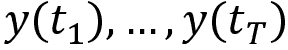，组成，每个时间点有一个变量，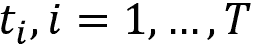。单变量时间序列由每个时间点上的单个值*y*组成，而多变量时间序列由可以用向量表示的多个观察值组成。

两个不同时间点*t*[i]、*t*[j]之间的周期数，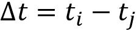，称为**滞后**，每个时间序列有*T*-1 个不同的滞后。正如交叉模型中不同变量在给定时间点的关系对于横截面模型至关重要一样，分隔给定滞后的数据点之间的关系对于分析和利用时间序列中的模式至关重要。

对于横截面模型，我们用标签*y*和*x*来区分输入和输出变量，或目标和预测变量。在时间序列的情况下，结果*y*的一些或所有滞后值扮演横截面情况下输入或*x*值的角色。

如果一个时间序列是**独立同分布**（**IID**）的随机变量序列，且具有有限均值和方差，则称其为**白噪声**。特别地，如果这个序列的随机变量服从均值为零、方差为常数的正态分布，则称其为**高斯白噪声**。

如果时间序列可以写成过去扰动的加权和，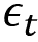，也称为创新，并且在此假定为代表白噪声的扰动序列的平均值，那么时间序列是线性的：

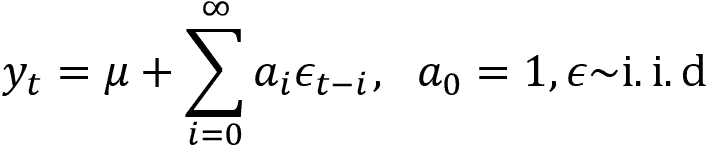

时间序列分析的一个关键目标是了解由系数驱动的动态行为，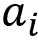。时间序列分析提供了针对这种类型数据量身定制的方法，目的是提取有用的模式，进而帮助我们建立预测模型。

我们将介绍实现这一目的的最重要工具，包括分解为关键的系统元素、自相关分析以及滚动窗口统计，如移动平均值。

对于本章中的大多数示例，我们将使用联邦储备提供的数据，您可以使用我们在 *第二章*，*市场和基本数据-来源和技术* 中介绍的 pandas-datareader 访问。本节的代码示例在笔记本 `tsa_and_stationarity` 中可用。

## 如何分解时间序列模式

时间序列数据通常包含多种模式，可以将其分解为几个组件。特别是，时间序列通常将趋势、季节性和周期性等系统性组件与非系统性噪声结合在一起。这些组件可以建模为线性组合（例如，当波动不依赖于系列水平时）或非线性乘法形式。

根据模型假设，它们也可以自动拆分。Statsmodels 包括一种简单的方法，使用移动平均值将时间序列拆分为单独的趋势、季节性和残差组件。我们可以将其应用于包含强趋势组件和季节性组件的月度工业制造数据，如下所示：

```py
import statsmodels.tsa.api as tsa
industrial_production = web.DataReader('IPGMFN', 'fred', '1988', '2017-12').squeeze()
components = tsa.seasonal_decompose(industrial_production, model='additive')
ts = (industrial_production.to_frame('Original')
      .assign(Trend=components.trend)
      .assign(Seasonality=components.seasonal)
      .assign(Residual=components.resid))
ts.plot(subplots=True, figsize=(14, 8)); 
```

*图 9.1* 显示了显示加法组件的结果图表。残差组件将成为后续建模工作的重点，假设趋势和季节性组件更具确定性并且更易于简单外推：

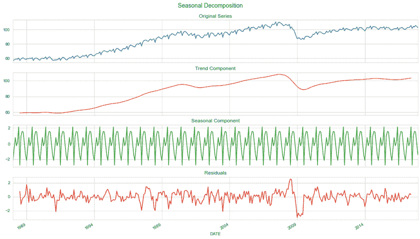

图 9.1：时间序列分解为趋势、季节性和残差

还有更复杂的基于模型的方法，例如 Hyndman 和 Athanasopoulos（2018）中的 *第六章*，*机器学习过程*。

## 滚动窗口统计和移动平均线

鉴于时间序列数据的顺序排列，自然而然地可以计算给定长度期间的熟悉描述性统计。目标是检测系列是否稳定或随时间变化，并获得捕获系统方面的平滑表示，同时过滤噪声。

滚动窗口统计信息服务于此过程：它们生成一个新的时间序列，其中每个数据点代表原始数据的一定期间内的摘要统计量。移动平均是最熟悉的例子。原始数据点可以以相等的权重进入计算，也可以，例如，强调更近期的数据点。指数移动平均递归地计算权重，这些权重对于更早的数据点衰减。新数据点通常是所有先前数据点的摘要，但也可以从周围的窗口计算得出。

Pandas 库包括滚动或扩展窗口，并允许使用各种权重分布。在第二步中，您可以对每个窗口捕获的数据集应用计算。这些计算包括用于单个系列的内置函数，如均值或总和，以及用于多个系列的相关性或协方差，以及用户定义的函数。

我们在*第四章*、*金融特征工程 - 如何研究阿尔法因子*和*第七章*、*线性模型 - 从风险因素到收益预测*中使用了这个功能来设计特征。例如，下一节中的移动平均和指数平滑示例也将应用这些工具。

早期的预测模型包括带有指数权重的**移动平均模型**，称为**指数平滑模型**。我们将再次遇到移动平均作为线性时间序列的关键构建模块。依赖指数平滑方法的预测使用过去观察值的加权平均值，其中权重随着观察值变老而指数衰减。因此，较近期的观察值会获得较高的相关权重。这些方法在时间序列没有非常复杂或突然的模式时很受欢迎。

## 如何测量自相关

**自相关**（也称为*串行相关*）将相关性的概念应用到时间序列的背景下：就像相关系数衡量两个变量之间线性关系的强度一样，**自相关系数**，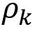，衡量了相隔给定滞后时间*k*的时间序列值之间的线性关系的程度：

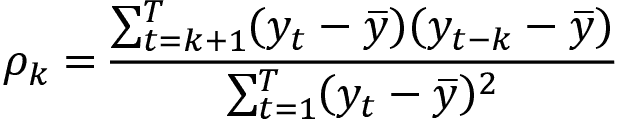

因此，我们可以计算时间序列的*T*-1 个滞后期中的每个自相关系数。**自相关函数**（**ACF**）将相关系数作为滞后期的函数计算。

超过 1 个滞后（即，两个观察值相隔超过一个时间步长）的自相关反映了这些观察值之间的直接相关性以及介于其间数据点的间接影响。**偏自相关**消除了这种影响，仅测量给定滞后距离*T*处数据点之间的线性依赖关系。消除意味着使用线性回归的残差，其中结果*x*[t]和滞后值*x*[t][-1]、*x*[t][-2]，…，*x*[T][-1]作为特征（也称为*AR*(*T*-1)模型，我们将在下一节关于单变量时间序列模型中讨论此模型）。**偏自相关函数**（**PACF**）提供了一旦较短滞后的相关性效应被消除后所得到的所有相关性，如前述所述。

还有一些算法根据样本自相关来估计偏自相关，这些算法基于 PACF 和 ACF 之间的精确理论关系。

**自相关图**简单地是顺序滞后*k*=0,1,...,*n*的 ACF 或 PACF 的图。它允许我们一眼看出不同滞后的相关结构（有关示例，请参见*图 9.3*）。自相关图的主要用途是在去除确定性趋势或季节性后检测任何自相关性。ACF 和 PACF 都是线性时间序列模型设计的关键诊断工具，我们将在下一节关于时间序列变换的示例中回顾 ACF 和 PACF 图。

# 如何诊断和实现平稳性

**平稳时间序列**的统计特性，如均值、方差或自相关，与周期无关—即，它们随时间不变。因此，**平稳性**意味着时间序列没有趋势或季节效应。此外，它要求在不同滚动窗口计算的描述性统计量，如均值或标准差，是恒定的或随时间变化不显著。平稳时间序列会回归到其均值，并且偏差具有恒定的振幅，而短期波动在统计意义上始终是相同的。

更正式地说，**严格平稳性**要求时间序列观测的任何子集的联合分布在所有时刻上都与时间无关。因此，除了均值和方差外，高阶矩如偏度和峰度也需要保持恒定，而不受不同观测值之间滞后的影响。在大多数应用中，例如本章中大多数可用于建模资产收益率的时间序列模型中，我们将平稳性限制在一阶和二阶矩上，使得时间序列具有恒定的均值、方差和自相关性。然而，在构建建模波动率时，我们放弃了这一假设，并明确假设方差会以可预测的方式随时间变化。

请注意，我们特别允许输出值在不同滞后期之间存在**依赖关系**，就像我们希望线性回归的输入数据与结果相关一样。平稳性意味着这些关系是稳定的。平稳性是经典统计模型的关键假设。下面的两个小节介绍了可以帮助使时间序列平稳的转换，以及如何处理由单位根引起的随机趋势的特殊情况。

## 转换时间序列以实现平稳性

为了满足许多时间序列模型的平稳性假设，我们需要对原始序列进行转换，通常需要几个步骤。常见的转换包括（自然）**对数**，将指数增长模式转换为线性趋势并稳定方差。**通货紧缩**意味着将一个时间序列除以另一个导致趋势行为的序列，例如，将一个名义序列除以一个价格指数以将其转换为实际度量。

如果一个序列是**趋势稳定**的，那么它将恢复到一个稳定的长期线性趋势。通常可以通过使用线性回归拟合趋势线并使用残差来使其平稳。这意味着在线性回归模型中包括时间指数作为独立变量，可能结合对数化或通货紧缩。

在许多情况下，去趋势化不足以使序列平稳。相反，我们需要将原始数据转换为一系列**周期间和/或季节间差异**。换句话说，我们使用相邻数据点或季节滞后的值相减的结果。请注意，当这种差分应用于对数变换序列时，结果代表的是金融背景下的瞬时增长率或收益率。

如果单变量序列经过*d*次差分后变得平稳，就称为*d*阶整合，或者简称为一阶整合如果*d*=1。这种行为是由单位根引起的，接下来我们将解释。

## 处理而不是如何处理

单位根对确定使时间序列平稳的转换方法构成特殊问题。在讨论诊断测试和解决方案之前，我们将首先解释单位根的概念。

### 关于单位根和随机游走

时间序列经常被建模为以下自回归形式的随机过程，以使当前值成为过去值的加权和，再加上一个随机扰动：

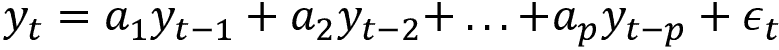

在下一节中，我们将更详细地探讨这些模型作为 ARIMA 模型中 AR 的构建块的单变量时间序列模型。这样的过程具有以下形式的特征方程：

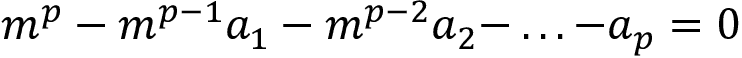

如果这个多项式的（最多）*p*个根之一等于 1，则过程被称为具有**单位根**。它将是非平稳的，但不一定会有趋势。如果特征方程的剩余根的绝对值小于 1，则该过程的一阶差分将是平稳的，并且**过程是一阶整合的或 I(1)**。如果额外的根的绝对值大于 1，则积分阶数更高，并且需要额外的差分。

在实践中，利率或资产价格的时间序列通常不是平稳的，因为没有价格水平可供系列回归到。非平稳序列的最突出例子是随机漫步。给定具有初始价格 *p*[0]（例如，股票的 IPO 价格）和白噪声扰动  的价格时间序列 *p*[t]，随机漫步满足以下自回归关系：

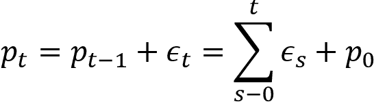

重复替换表明当前值 *p*[t] 是所有先前扰动或创新，，以及初始价格 *p*[0] 的总和。如果方程包括一个常数项，那么随机漫步被认为有**漂移**。

随机漫步因此是以下形式的**自回归随机过程**：

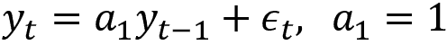

它的特征方程为 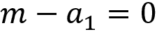，具有单位根，既是非平稳的，也是一阶整合的。一方面，鉴于  的 IID 特性，时间序列的方差等于 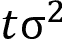，这是**不是二阶平稳的**，这意味着原则上，该序列可以随时间取任何值。另一方面，**进行第一阶差分**，得到 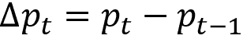，留下了 **平稳的**序列 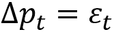，鉴于对 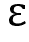 的统计假设。

具有单位根的非平稳序列的定义特征是**长期记忆**：由于当前值是过去扰动的总和，大的创新比均值回归、平稳序列持续时间更长。

### 如何诊断单位根

统计单位根检验是一种确定是否需要（额外）差分的常见方法。这些是用于确定是否需要差分的平稳性的统计假设检验。

**增广的迪基-富勒检验**（**ADF 检验**）评估一个时间序列样本是否具有单位根的零假设，对立假设是平稳性。它将差分时间序列回归到时间趋势、第一滞后和所有滞后差分上，并从滞后时间序列值的系数值计算出一个检验统计量。`statsmodels`使其易于实现（参见笔记本`tsa_and_stationarity`）。

形式上，对于一个时间序列的 ADF 检验，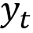，进行线性回归，其中 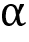 是一个常数，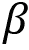 是时间趋势上的系数，*p* 指的是模型中使用的滞后数：

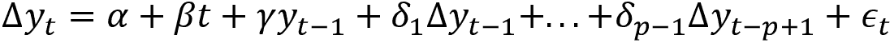

约束 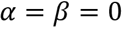 意味着一个随机游走，而仅有 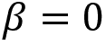 意味着一个带漂移的随机游走。滞后阶数通常使用**赤池信息准则**（**AIC**）和**贝叶斯信息准则**（**BIC**）信息准则来决定，这些准则在 *第七章*，*线性模型 - 从风险因素到回报预测* 中介绍。

ADF 检验统计量使用样本系数 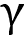，在单位根非平稳的零假设下，该系数为零，在其他情况下为负。其意图在于证明，对于一个积分序列，滞后序列值不应提供有用信息来预测超过滞后差异的一阶差异。

### 如何去除单位根并处理得到的序列

除了使用相邻数据点之间的差异来消除恒定变化模式外，我们还可以应用**季节性差分**来消除季节性变化模式。这涉及到在代表季节模式长度的滞后距离处取值的差异。对于月度数据，这通常涉及到滞后 12，而对于季度数据，它涉及到滞后 4，以消除季节性和线性趋势。

确定正确的转换，特别是适当的差分数量和滞后数，并不总是一目了然的。一些**启发式方法**已经被提出，可以总结如下：

+   滞后一期自相关接近零或为负，或者自相关普遍较小且无规律：无需进行更高阶的差分处理

+   正自相关延伸至 10+ 滞后：该序列可能需要更高阶的差分

+   滞后一期自相关 < -0.5：该序列可能存在过度差分

+   轻微的过度或不足的差分可以通过 AR 或 MA 项进行校正（请参阅下一节关于单变量时间序列模型）

一些作者建议使用分数差分作为使积分序列变得平稳的更灵活的方法，并且可能能够保留比简单或季节性差分在离散间隔更多的信息或信号。例如，参见 Marcos Lopez de Prado（2018）的 *第五章*，*投资组合优化和绩效评估*。

## 实践中的时间序列变换

*图 9.2* 中的图表显示了纳斯达克股票指数和工业生产的时间序列，经过对数变换和随后的应用第一次和季节性差分（在滞后 12 处），分别展示了它们的原始形式以及变换后的版本，跨越 2017 年的 30 年时间。

图表还显示了 ADF p 值，这使我们能够在两种情况下拒绝单位根非平稳性的假设：

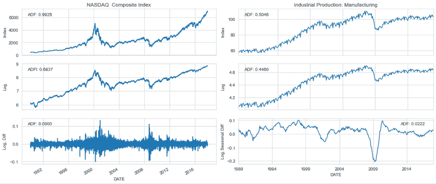

图 9.2：时间序列转换和单位根检验结果

我们可以进一步分析使用 Q-Q 图和基于 ACF 和 PACF 的自相关图的转换系列的相关时间序列特征的特征。

对于*图 9.3*中的 NASDAQ 图表，我们可以看到虽然没有趋势，但方差不是恒定的，而是在 1980 年代末、2001 年和 2008 年的市场动荡期间显示出集中的尖峰。Q-Q 图突出了分布的厚尾，极端值比正态分布所暗示的更频繁。

ACF 和 PACF 显示类似的模式，几个滞后的自相关显得显著：

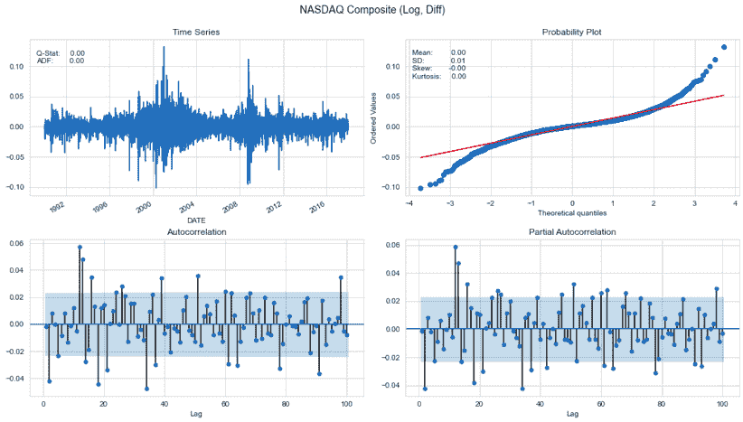

图 9.3：转换后的 NASDAQ 综合指数的描述统计

对于工业制造生产的月度时间序列，我们可以看到在 2008 年危机后有一个大的负异常值，以及 Q-Q 图中相应的偏度（见*图 9.4*）。自相关远高于 NASDAQ 收益，并且平稳下降。PACF 在滞后 1 和 13 处显示出明显的正自相关模式，并在滞后 3 和 4 处显示出显著的负系数：

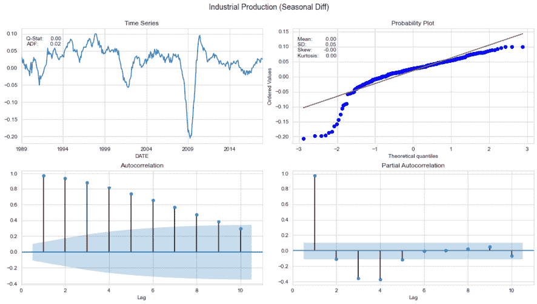

图 9.4：转换后的工业生产数据的描述统计

# 单变量时间序列模型

多元线性回归模型将感兴趣的变量表示为输入的线性组合，加上一个随机扰动。相比之下，单变量时间序列模型将时间序列的当前值与系列滞后值的线性组合、当前噪声以及可能的过去噪声项相关联。

尽管指数平滑模型基于对数据中趋势和季节性的描述，但**ARIMA 模型旨在描述数据中的自相关性**。ARIMA(*p*, *d*, *q*) 模型需要平稳性，并利用两个构建块：

+   **自回归**（**AR**）项包含时间序列的*p*滞后值

+   包含*q*滞后扰动的**移动平均**（**MA**）项

**I** 代表 *integrated*，因为模型可以通过对系列进行*d*次差分来考虑单位根非平稳性。自回归一词强调了 ARIMA 模型意味着时间序列对其自身值的回归。

我们将介绍 ARIMA 的构建模块，AR 和 MA 模型，并解释如何将它们组合成可以像 ARIMA 模型那样考虑序列积分，或者包含外生变量像**AR(I)MAX**模型那样的**自回归移动平均**(**ARMA**)模型。此外，我们将说明如何包含季节性 AR 和 MA 项以扩展工具箱，使其还包括**SARMAX**模型。

## 如何构建自回归模型

*p*阶 AR 模型旨在捕捉不同滞后时期时间序列值之间的线性相关性，可以写成如下形式：

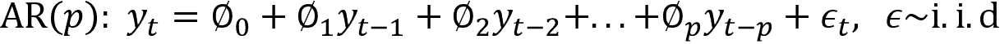

这与对*y*[t]的滞后值进行多元线性回归非常相似。该模型具有以下特征方程：

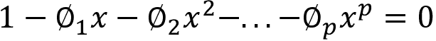

解这个关于*x*的*p*次多项式的倒数是特征根，如果所有根的绝对值都小于 1，则 AR(*p*)过程是稳定的，否则不稳定。对于稳定的序列，多步预测将收敛于序列的均值。

我们可以使用熟悉的最小二乘法估计模型参数，使用*p*+1，...，*T*的观测数据确保每个滞后项和结果都有数据。

### 如何确定滞后数量

在实践中，挑战在于确定滞后项的适当阶*p*。我们在*如何测量自相关性*部分讨论过的串行相关性时间序列分析工具在做出这一决定方面起着关键作用。

更具体地说，对自相关图的目视检查通常提供了有用的线索：

+   **ACF**估计不同滞后时期观测值之间的自相关性，其结果既来自直接线性相关性，也来自间接线性相关性。因此，如果*p*阶 AR 模型是正确的模型，自相关函数将显示出直至滞后*k*的显著串行相关性，并且由于线性关系间接效应所造成的惯性，将延伸到随后的滞后直至最终随着效应的减弱而消失。

+   **PACF**只测量了给定滞后间隔的观测值之间的直接线性关系，因此不会反映超过*k*的滞后的相关性。

### 如何诊断模型拟合度

如果模型正确捕捉了滞后间的线性依赖关系，则残差应类似于白噪声，而自相关函数应突出显示出显著的自相关系数的缺失。

除了残差图外，**Ljung-Box Q 统计量**还允许我们测试残差序列是否符合白噪声的假设。零假设是所有*m*个序列相关系数都为零，而备择假设是某些系数不为零。检验统计量是根据不同滞后*k*的样本自相关系数计算的，并且遵循*X*²分布：

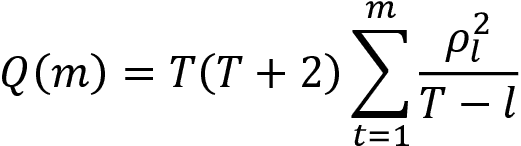

正如我们将看到的，statsmodels 提供了关于不同滞后的系数显著性的信息，不显著的系数应该被移除。如果 Q 统计拒绝无自相关的零假设，你应该考虑额外的 AR 项。

## 如何构建移动平均模型

MA(*q*) 模型使用 *q* 个过去扰动，而不是时间序列的滞后值，作为回归模型的一部分，如下所示：

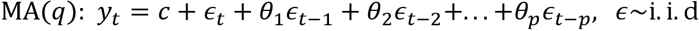

由于我们没有观察到白噪声扰动值，，MA(*q*) 不像我们迄今为止看到的那样是一个回归模型。MA(*q*) 模型不是使用最小二乘法估计的，而是使用**最大似然估计**（**MLE**），或者在系列开始时初始化或估计扰动，然后递归和迭代地计算剩余值。

MA(*q*) 模型得名于将 *y*[t] 的每个值表示为过去 *q* 个创新的加权移动平均值。换句话说，当前的估计值表示相对于模型过去错误的修正。MA(*q*) 模型中使用移动平均值的方式与指数平滑或季节时间序列成分的估计不同，因为 MA(*q*) 模型旨在预测未来值，而不是去噪声或估计过去值的趋势周期。

MA(*q*) 过程总是平稳的，因为它们是白噪声变量的加权和，这些变量本身就是平稳的。

### 如何确定滞后数

由 MA(*q*) 过程生成的时间序列由前 *q* 个模型预测的残差驱动。因此，MA(*q*) 过程的 ACF 将显示出直到滞后 *q* 的值的显著系数，然后急剧下降，因为这是模型假定系列值被生成的方式。

注意这与我们刚刚描述的 AR 情况不同，那里 PACF 会显示类似的模式。

### AR 和 MA 模型之间的关系

无论何时，都可以使用重复替换的方法将 AR(*p*) 模型表示为一个 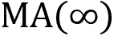 过程，例如“如何处理由单位根引起的随机趋势”部分中的随机游走示例。

当 MA(*q*) 过程的系数满足一定的大小约束时，它也变得可逆，并且可以表示为一个 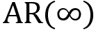 过程（详见 Tsay，2005 年）。

## 如何构建 ARIMA 模型及其扩展

自回归积分滑动平均—ARIMA(*p*, *d*, *q*)—模型结合了 AR(*p*) 和 MA(*q*) 过程，以利用这些基本模型的互补性并简化模型开发。它们使用更紧凑的形式并减少参数数量，进而减少过度拟合的风险。

这些模型还通过使用时间序列值的*d*^(th)差分来消除单位根的非平稳性。一个 ARIMA(*p*, 1, *q*)模型相当于使用序列的第一阶差分的 ARMA(*p*, *q*)模型。用*y*'表示非季节性差分*d*次后的原始序列，ARIMA(*p*, *d*, *q*)模型简单地表示为：

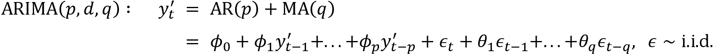

ARIMA 模型也使用 MLE 进行估计。根据实现方式，更高阶的模型可能一般包含较低阶的模型。

例如，截至版本 0.11，statsmodels 包括所有低阶*p*和*q*项，并且不允许删除低于最高值的滞后的系数。在这种情况下，更高阶的模型将始终拟合得更好。使用太多项不要使模型过度拟合数据。在撰写时，最新版本为 0.11，增加了一个带有更灵活配置选项的实验性新 ARIMA 模型。

### 如何对差分序列建模

使用数据设计单变量时间序列模型时也有一些指导方针：

+   没有差分的模型假设原始序列是平稳的，包括均值回归。它通常包括一个常数项，以允许非零均值。

+   一个一阶差分的模型假设原始序列具有恒定的趋势，因此应包括一个常数项。

+   一个两阶差分的模型假设原始序列具有时间变化的趋势，并且不应包括一个常数。

### 如何确定 AR 和 MA 项的数量

由于 AR(*p*)和 MA(*q*)项相互作用，ACF 和 PACF 提供的信息不再可靠，只能用作起点。

传统上，AIC 和 BIC 信息准则被用于在选择模型设计时依赖样本内拟合。或者，我们可以依赖样本外测试来交叉验证多个参数选择。

在考虑 AR 和 MA 模型时，以下摘要提供了如何选择模型阶数的一些指导：

+   PACF 截断的滞后阶数是表示 AR 项的数量。如果差分序列的 PACF 显示出明显的截断和/或滞后 1 的自相关为正，则添加一个或多个 AR 项。

+   ACF 截断的滞后阶数是表示 MA 项的数量。如果差分序列的 ACF 显示出明显的截断和/或滞后 1 的自相关为负，则考虑将 MA 项添加到模型中。

+   AR 和 MA 项可能会抵消彼此的影响，因此，如果您的模型同时包含两者，请始终尝试将 AR 和 MA 项的数量减少 1，以避免过度拟合，特别是如果更复杂的模型需要超过 10 次迭代才能收敛。

+   如果 AR 系数之和接近于 1，并且建议模型的 AR 部分存在单位根，则消除一个 AR 项并再次进行差分。

+   如果 MA 系数总和接近于一，并且暗示模型的 MA 部分存在单位根，则删除一个 MA 项并将差分阶数减少一个。

+   不稳定的长期预测表明模型的 AR 或 MA 部分可能存在单位根。

### 添加特征 – ARMAX

具有外生输入的自回归滑动平均模型（**ARMAX**）模型在 ARMA 时间序列模型的右侧添加输入变量或协变量（假设系列是平稳的，所以我们可以跳过差分）：

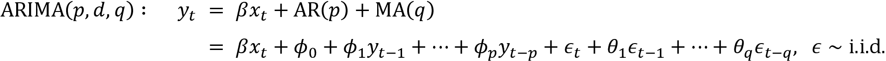

这类似于线性回归模型，但解释起来相当困难。这是因为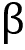对*y*[t]的影响并不是*x*[t]增加一个单位所产生的影响，如线性回归中那样。相反，方程右侧的*y*[t]的滞后值的存在意味着只有在给定响应变量的滞后值的情况下，系数才能被解释，这几乎是不直观的。

### 添加季节差分 – SARIMAX

对于具有季节效应的时间序列，我们可以包括捕捉季节性周期性的 AR 和 MA 项。例如，当使用月度数据且季节效应长度为 1 年时，季节性 AR 和 MA 项将反映这个特定的滞后长度。

然后 ARIMAX(*p*, *d*, *q*) 模型变成了 SARIMAX(*p*, *d*, *q*) × (*P*, *D*, *Q*) 模型，这个写法略显复杂，但 statsmodels 文档（GitHub 上的链接）详细提供了这些信息。

我们现在将使用宏观数据构建一个季节性 ARMA 模型，以说明其实现过程。

## 如何预测宏观基本面

我们将为 1988-2017 年期间的工业生产时间序列构建一个月度数据的 SARIMAX 模型。如在分析工具的第一节中所示，数据已经进行了对数变换，并且我们使用了季节性（滞后 12 个月）差分。我们对一系列普通和常规的 AR 和 MA 参数进行估计，使用了 10 年的训练数据的滚动窗口，并评估了 1 步预测的**均方根误差**（**RMSE**），如下所示的简化代码（详细信息请参见笔记本`arima_models`）：

```py
for p1 in range(4):                # AR order
    for q1 in range(4):            # MA order
        for p2 in range(3):        # seasonal AR order
            for q2 in range(3):    # seasonal MA order
                y_pred = []
                for i, T in enumerate(range(train_size, len(data))):
                    train_set = data.iloc[T - train_size:T]
                    model = tsa.SARIMAX(endog=train_set, # model specification
                                        order=(p1, 0, q1),
                                        seasonal_order=(p2, 0, q2, 12)).fit()
                    preds.iloc[i, 1] = model.forecast(steps=1)[0]
                mse = mean_squared_error(preds.y_true, preds.y_pred)
                results[(p1, q1, p2, q2)] = [np.sqrt(mse),
                    preds.y_true.sub(preds.y_pred).std(),
                    np.mean(aic)] 
```

我们还收集了 AIC 和 BIC 准则，显示出 0.94 的非常高的秩相关系数，其中 BIC 更倾向于比 AIC 稍少参数的模型。根据 RMSE 最佳的五个模型是：

```py
 RMSE         AIC         BIC
p1 q1 p2 q2                                  
2  3  1  0   0.009323 -772.247023 -752.734581
3  2  1  0   0.009467 -768.844028 -749.331586
2  2  1  0   0.009540 -770.904835 -754.179884
   3  0  0   0.009773 -760.248885 -743.523935
   2  0  0   0.009986 -758.775827 -744.838368 
```

我们重新估计 SARIMA(2, 0 ,3) × (1, 0, 0) 模型，如下所示：

```py
best_model = tsa.SARIMAX(endog=industrial_production_log_diff, order=(2, 0, 3),
                         seasonal_order=(1, 0, 0, 12)).fit()
print(best_model.summary()) 
```

我们得到以下总结：

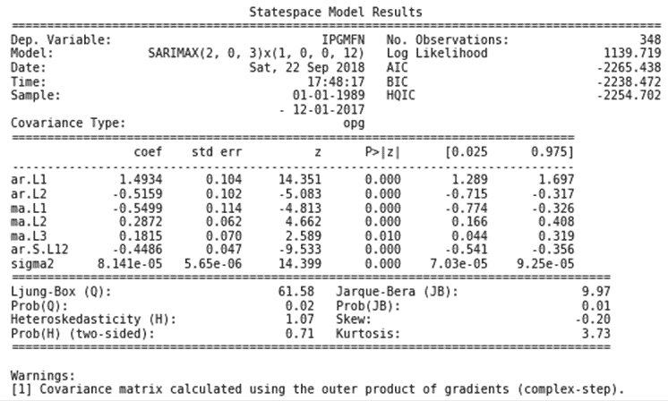

图 9.5：SARMAX 模型结果

系数是显著的，并且 Q 统计量拒绝了进一步自相关的假设。相关图表同样表明我们已成功消除了序列的自相关：

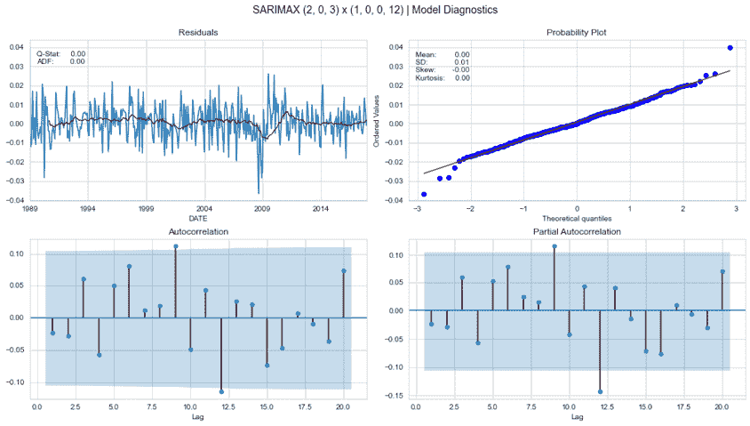

图 9.6：SARIMAX 模型诊断

## 如何使用时间序列模型预测波动率

在金融领域中，单变量时间序列模型的一个特别重要的应用是对波动性进行预测。这是因为波动性通常随时间而变化，并且会出现波动性集聚的情况。方差的变化给使用经典的假设平稳的 ARIMA 模型进行时间序列预测带来了挑战。为了解决这一挑战，我们现在将对波动性进行建模，以便我们可以预测方差的变化。

**异方差性** 是指变量方差的变化的技术术语。ARCH 模型将误差项的方差表示为前期误差的函数。更具体地说，它假设误差方差遵循一个 AR(*p*) 模型。

**广义自回归条件异方差** (**GARCH**) 模型扩展了 ARCH 的范围，以允许 ARMA 模型。时间序列预测通常将 ARIMA 模型用于期望均值，并将 ARCH/GARCH 模型用于时间序列的预期方差。2003 年诺贝尔经济学奖授予了罗伯特·恩格尔和克莱夫·格兰杰，因为他们开发了这一类模型。前者还在纽约大学斯特恩商学院经营着波动率实验室（[vlab.stern.nyu.edu](http://vlab.stern.nyu.edu)），该实验室有许多关于我们将讨论的模型的在线示例和工具。

### ARCH 模型

ARCH(*p*) 模型简单地是应用于时间序列模型残差方差的 AR(*p*) 模型，这使得在时期 *t* 的方差条件于滞后观测的方差。

更具体地说，误差项，，是原始时间序列上的线性模型（如 ARIMA）的残差，被分为一个时间相关的标准差，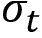，和一个扰动，*z*[t]，如下所示：

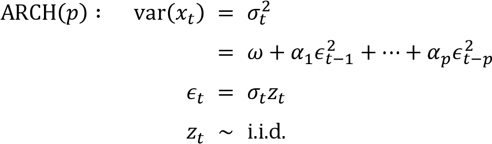

ARCH(*p*) 模型可以使用 OLS 进行估计。恩格尔提出了一种方法来使用拉格朗日乘数检验来确定适当的 ARCH 阶数，该检验对应于线性回归中所有系数为零的假设的 F 检验（见 *第七章*，*线性模型 - 从风险因素到收益预测*）。

ARCH 模型的一个关键**优点**是，它产生具有正超额峰度的波动性估计 —— 即，相对于正态分布的 fat tails —— 这与有关收益的实证观察相一致。**缺点**包括假设正面和负面波动性冲击具有相同的效应，而资产价格往往会有不同的反应。它也不能解释波动性的变化，并且可能会过度预测波动性，因为它们对收益序列的大规模、孤立的冲击反应迟缓。

对于一个正确规范的 ARCH 模型，标准化残差（除以该时期标准差的模型估计值）应该类似于白噪声，并且可以进行 Ljung-Box Q 检验。

### 推广 ARCH —— GARCH 模型

ARCH 模型相对简单，但通常需要许多参数来捕捉资产回报序列的波动率模式。GARCH 模型适用于对数回报序列，*r*[t]，具有扰动项，如图所示：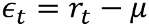，如果：

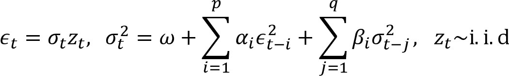

GARCH(*p*, *q*) 模型假设误差项方差的 ARMA(*p*, *q*) 模型，如图所示：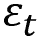。

与 ARCH 模型类似，GARCH(1,1) 过程的尾部分布比正态分布更重。该模型遇到与 ARCH 模型相同的弱点。例如，它对正面和负面冲击的反应相同。

要为 ARCH 和 GARCH 模型配置滞后阶数，请使用训练好的时间序列的平均预测的平方残差。残差被零中心化，以便它们的平方也是方差。然后，检查平方残差的 ACF 和 PACF 图，以识别时间序列方差的自相关模式。

### 如何构建一个预测波动率的模型

资产回报序列的波动率模型开发包括四个步骤：

1.  基于 ACF 和 PACF 显示的序列依赖性，为金融时间序列构建 ARMA 时间序列模型

1.  再次依赖于序列的 ACF 和 PACF 来测试 ARCH/GARCH 效应的模型残差

1.  如果序列相关效应显著，则指定波动率模型，并联合估计平均值和波动率方程

1.  仔细检查拟合的模型，并在必要时进行调整

当将波动率预测应用于回报序列时，序列依赖性可能有限，因此可以使用恒定均值而不是 ARMA 模型。

`arch` 库（参见 GitHub 上的文档链接）提供了几种选项来估计波动率预测模型。您可以将预期平均值建模为恒定值，如 *如何构建自回归模型* 部分中讨论的 AR(*p*) 模型，或者作为更近期的**异质自回归过程** (**HAR**)，它使用每日（1 天）、每周（5 天）和每月（22 天）滞后来捕捉短期、中期和长期投资者的交易频率。

平均模型可以与几种条件异方差模型一起定义和估计，除了 ARCH 和 GARCH 之外，还包括允许在正面和负面回报之间存在非对称效应的**指数 GARCH** (**EGARCH**) 模型，以及补充 HAR 平均模型的**异质 ARCH** (**HARCH**) 模型。

我们将使用 2000 年至 2020 年的每日纳斯达克回报来演示 GARCH 模型的使用方法（详见笔记本 `arch_garch_models`）：

```py
nasdaq = web.DataReader('NASDAQCOM', 'fred', '2000', '2020').squeeze()
nasdaq_returns = np.log(nasdaq).diff().dropna().mul(100) # rescale to facilitate optimization 
```

重新缩放后的每日收益序列仅表现出有限的自相关性，但是相对于平均值的平方偏差确实具有显著的记忆，这反映在缓慢衰减的 ACF 和 PACF 中，对于前两个而言高，在第六个滞后之后才被截断：

```py
plot_correlogram(nasdaq_returns.sub(nasdaq_returns.mean()).pow(2), lags=120,                  title='NASDAQ Daily Volatility') 
```

函数`plot_correlogram`生成如下输出：

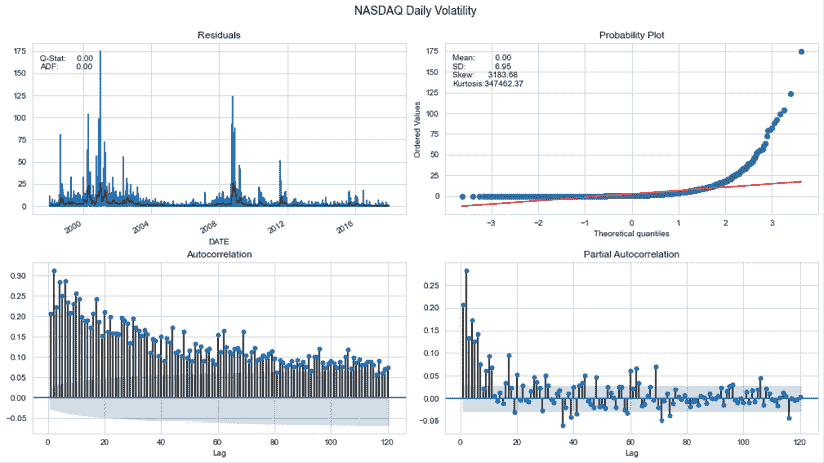

图 9.7：每日纳斯达克综合波动性

因此，我们可以估计一个 GARCH 模型来捕捉过去波动性的线性关系。我们将使用滚动 10 年窗口来估计一个 GARCH(*p*, *q*)模型，其中*p*和*q*的范围为 1-4，以生成一步外样本预测。

然后，我们比较预测波动性的 RMSE 与实际收益偏离其均值的平方差，以确定最具预测性的模型。我们使用修剪数据来限制极端收益值的影响，这些值在波动率的正偏态中反映得非常高：

```py
trainsize = 10 * 252  # 10 years
data = nasdaq_returns.clip(lower=nasdaq_returns.quantile(.05),
                           upper=nasdaq_returns.quantile(.95))
T = len(nasdaq_returns)
results = {}
for p in range(1, 5):
    for q in range(1, 5):
        print(f'{p} | {q}')
        result = []
        for s, t in enumerate(range(trainsize, T-1)):
            train_set = data.iloc[s: t]
            test_set = data.iloc[t+1]  # 1-step ahead forecast
            model = arch_model(y=train_set, p=p, q=q).fit(disp='off')
            forecast = model.forecast(horizon=1)
            mu = forecast.mean.iloc[-1, 0]
            var = forecast.variance.iloc[-1, 0]
            result.append([(test_set-mu)**2, var])
        df = pd.DataFrame(result, columns=['y_true', 'y_pred'])
        results[(p, q)] = np.sqrt(mean_squared_error(df.y_true, df.y_pred)) 
```

GARCH(2, 2)模型实现了最低的 RMSE（与 GARCH(4, 2)相同的值，但参数更少），所以我们继续估计这个模型以检查摘要：

```py
am = ConstantMean(nasdaq_returns.clip(lower=nasdaq_returns.quantile(.05),
                                      upper=nasdaq_returns.quantile(.95)))
am.volatility = GARCH(2, 0, 2)
am.distribution = Normal()
best_model = am.fit(update_freq=5)
print(best_model.summary()) 
```

输出显示了最大化的对数似然以及 AIC 和 BIC 标准，这些标准通常在选择基于样本内性能的模型时被最小化（见*第七章*，*线性模型 - 从风险因素到收益预测*）。它还显示了均值模型的结果，这种情况下，只是一个常数估计，以及常数 omega 的 GARCH 参数，AR 参数，，和 MA 参数，，所有这些都具有统计学显著性：

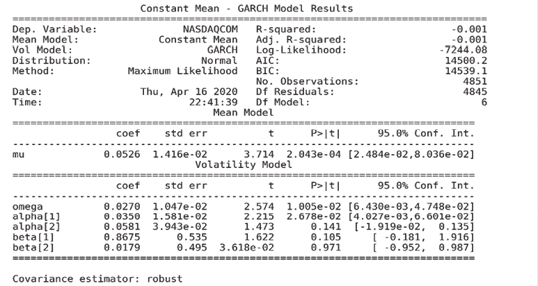

图 9.8：GARCH 模型结果

现在让我们探索多时间序列模型和协整概念，这将使一种新的交易策略成为可能。

# 多元时间序列模型

多元时间序列模型旨在同时捕获多个时间序列的动态，并利用这些序列之间的依赖关系进行更可靠的预测。对这一主题最全面的介绍是 Lütkepohl（2005）。

## 方程组

单变量时间序列模型，就像我们刚刚讨论的 ARMA 方法一样，仅限于目标变量及其滞后值或滞后扰动以及外生序列之间的统计关系，在 ARMAX 的情况下。相比之下，多元时间序列模型还允许其他时间序列的滞后值影响目标。这种影响适用于所有系列，导致复杂的交互作用，如下图所示：

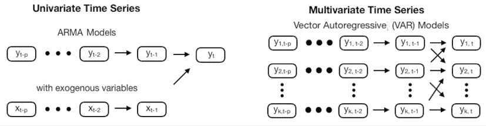

图 9.9：单变量和多变量时间序列模型中的交互作用

除了可能更好的预测之外，多元时间序列还用于获得对交叉系列依赖性的见解。例如，在经济学中，多元时间序列用于理解一个变量的政策变化，例如利率，如何在不同的视角影响其他变量。

多变量模型产生的**冲击响应**函数达到了这一目的，并允许我们模拟一个变量如何对其他变量的突然变化做出反应。**格兰杰因果性**概念分析了一个变量是否对另一个变量的预测有用（以最小二乘意义上）。此外，多元时间序列模型允许对预测误差方差进行分解，以分析其他系列如何做出贡献。

## 向量自回归（VAR）模型

我们将看到**向量自回归 VAR(p) 模型**如何通过创建一个包含所有*k*系列*p*滞后值的*k*方程组来扩展 AR(*p*) 模型。在最简单的情况下，*k*=2 的 VAR(1) 模型采用以下形式：

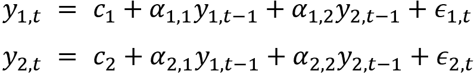

这个模型可以用**矩阵形式**更简洁地表达：

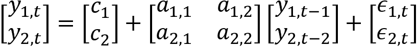

对输出滞后值的**系数**提供有关系列本身动态的信息，而交叉变量的系数则提供一些关于系列之间交互作用的见解。此符号扩展到*k*时间序列和*p*阶，如下所示：

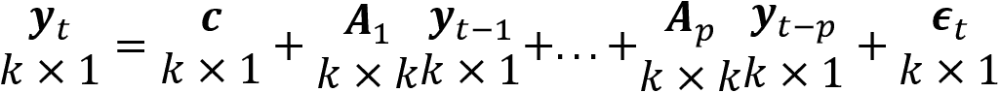

VAR(*p*)模型还需要**平稳性**，以便从单变量时间序列建模的初步步骤延伸。首先，探索系列并确定必要的转换。然后，应用增广迪基-福勒检验来验证每个系列是否满足平稳性标准，否则应用进一步的转换。它可以根据初始信息进行 OLS 估计，也可以根据 MLE 进行估计，这是对正态分布误差而言的等价物，但对其他情况不是。

如果一些或全部的*k*系列是单位根非平稳的，它们可能是**协整的**（见下一节）。将单位根概念扩展到多个时间序列意味着两个或更多系列的线性组合是平稳的，因此是均值回归的。

VAR 模型无法处理这种情况，需要进行差分处理；而是使用**向量误差修正模型**（**VECM**，Johansen 和 Juselius 1990）。我们将进一步探讨协整性，因为如果存在并被认为是持续存在的，它可以用于配对交易策略。

**滞后阶数的确定**也从每个系列的 ACF 和 PACF 中获得线索，但受到相同滞后阶数适用于所有系列的限制。在模型估计之后，**残差诊断**还要求结果类似于白噪声，并且模型选择可以使用样本内信息准则，或者如果目标是使用模型进行预测，则可以使用样本外预测性能来交叉验证备选模型设计

如在单变量情况中提到的那样，对原始时间序列的预测要求我们在训练模型之前撤销应用于使序列稳定的转换。

## 使用 VAR 模型进行宏观预测

我们将扩展使用单一时间序列的示例，其中包括工业生产的月度数据以及消费者情绪的月度时间序列，这两者都由美联储的数据服务提供。我们将使用熟悉的 pandas-datareader 库从 1970 年到 2017 年检索数据：

```py
df = web.DataReader(['UMCSENT', 'IPGMFN'],
                     'fred', '1970', '2017-12').dropna()
df.columns = ['sentiment', 'ip'] 
```

对工业生产系列进行对数变换，并使用 12 个滞后期进行季节性差分，得到稳定的结果：

```py
df_transformed = pd.DataFrame({'ip': np.log(df.ip).diff(12),
                              'sentiment': df.sentiment.diff(12)}).dropna()
test_unit_root(df_transformed) # see notebook for details and additional plots
          p-value
ip          0.0003
sentiment   0.0000 
```

这给我们留下了以下系列：


图 9.10：转换后的时间序列：工业生产和消费者情绪

为了限制输出大小，我们将仅使用 statsmodels 的`VARMAX`实现（允许使用可选的外生变量）以及使用前 480 个观测来估计一个带有常数趋势的 VAR(1)模型：

```py
model = VARMAX(df_transformed.loc[:'2017'], order=(1,1),
               trend='c').fit(maxiter=1000) 
```

这产生了以下摘要：


图 9.11：VAR(1)模型结果

输出包含了两个时间序列方程的系数，如前述 VAR(1)示例所述。statsmodels 提供了诊断图来检查残差是否符合白噪声假设。在这个简单的例子中，这并不完全成立，因为方差似乎不是恒定的（左上角），而且量化图显示了分布的差异，即尾部较大（左下角）：


图 9.12：statsmodels VAR 模型诊断图

您可以按以下方式生成样本外预测：

```py
preds = model.predict(start=480, end=len(df_transformed)-1) 
```

下面的实际值和预测值的可视化展示了预测滞后于实际值，并且不能很好地捕捉非线性、样本外模式：


图 9.13：VAR 模型预测与实际值

# 协整 - 具有共享趋势的时间序列

我们在前一节关于多变量时间序列模型中简要提到了协整。现在让我们更详细地解释这个概念以及如何诊断其存在，然后再利用它进行统计套利交易策略。

我们已经看到一个时间序列可以具有创建随机趋势的单位根，并使时间序列高度持久。当我们在线性回归模型中将这种整合的时间序列作为特征使用时，而不是作为差分形式使用，它与结果的关系通常会显得统计上显著，尽管实际上并不是。这种现象称为伪回归（详见 Wooldridge，2008 年的*第十八章*，*用于金融时间序列和卫星图像的 CNNs*）。因此，建议的解决方案是在将它们用于模型之前对时间序列进行差分，使它们变得平稳。

然而，在结果和一个或多个输入变量之间存在协整关系时，有一个例外。要理解协整的概念，让我们首先记住回归模型的残差是输入和输出系列的线性组合。

通常，对一个或多个这样的系列的整合时间序列的回归的残差产生的是非平稳的残差，这些残差也是整合的，因此表现出类似于随机游走的行为。然而，对于一些时间序列，情况并非如此：回归产生的系数会形成时间序列的线性组合，这种线性组合是平稳的，尽管各个系列不是。这种时间序列是*协整的*。

一个非技术示例是一个醉酒的人在随机行走，他的狗（被拴在绳索上）陪伴着他。两个轨迹都是非平稳的，但协整，因为狗偶尔会回到它的主人身边。在交易的背景下，套利约束意味着现货和期货价格之间存在协整关系。

换句话说，**两个或多个协整系列的线性组合有一个稳定的均值**，这个线性组合会回归到这个稳定的均值。当各个系列是高阶整合的时候，这也适用，线性组合会减少整体的整合次数。

**协整与相关性不同**：两个系列可以高度相关，但不一定是协整的。例如，如果两个增长系列是彼此的常数倍数，它们的相关性将很高，但任何线性组合也会增长而不是回归到一个稳定的均值。

协整非常有用：如果两个或更多资产价格系列趋向于回归到一个共同的均值，我们可以利用与趋势偏离，因为它们应该暗示着未来价格的相反方向的移动。协整背后的数学更加复杂，因此我们将只关注实践方面；有关深入处理，请参阅 Lütkepohl（2005）。

在本节中，我们将讨论如何识别具有这种长期平稳关系的配对，估计任何失衡纠正的预期时间，以及如何利用这些工具来实施和回测长短对交易策略。

有两种测试协整的方法：

+   恩格尔-格兰杰两步法

+   约翰逊测试

在展示它们如何帮助识别趋向于恢复到共同趋势的共整合证券之前，我们将依次讨论每一个。

## 恩格尔-格兰杰两步法

**恩格尔-格兰杰方法**用于确定两个系列之间的共整合关系。它涉及到以下两个方面：

1.  对另一个系列进行回归以估计长期稳定关系

1.  将 ADF 单位根测试应用于回归残差

零假设是残差具有单位根并且是集成的；如果我们可以拒绝它，那么我们假设残差是稳定的，因此系列是共整合的（Engle and Granger 1987）。

这种方法的一个关键好处是回归系数表示的是使组合稳定的乘数，即，均值回归。不幸的是，测试结果将取决于我们考虑哪个变量是独立的，因此我们尝试两种方式，然后选择具有更负的测试统计量且具有较低 p 值的关系。

这项测试的另一个缺点是，它仅限于成对关系。更复杂的约翰逊程序可以识别多达十几个时间序列之间的显著共整合。

## 约翰逊似然比检验

相比之下，**约翰逊程序**测试了上一节中讨论的共整合对 VAR 模型施加的限制。更具体地说，在从通用 VAR(*p*)模型的两边减去目标向量之后，我们得到了**误差修正模型**（**ECM**）的表述：


结果修改后的 VAR(*p*)方程只有一个向量项在水平（*y*[t][-1]）中，并且没有使用运算符作为差异。共整合的性质取决于系数矩阵的等级（约翰逊 1991）。

尽管这个方程在结构上与 ADF 测试设置相似，但现在有了多个系列的潜在公共趋势组合。为了确定共整合关系的数量，约翰逊测试连续测试增加的等级，从 0 开始（无共整合）。我们将在下一节探讨应用于两个系列的情况。

冈萨洛和李（1998）讨论了由于错误指定的模型动态和其他实施方面的挑战，包括如何结合我们将在下一节中依赖的两种测试程序的实际统计套利策略。

# 具有共整合关系的统计套利

统计套利指的是利用某些统计模型或方法来利用资产的相对定价错误，同时保持一定程度的市场中性的策略。

**对冲交易** 是一个概念上简单直接的策略，至少从 20 世纪八十年代中期起就被算法交易者采用（Gatev、Goetzmann 和 Rouwenhorst 2006）。其目标是找到历史上价格走势相似的两个资产，跟踪价差（即它们价格之间的差异），并一旦价差扩大，买入价格低于共同趋势的失败者并做空价格高于共同趋势的赢家。如果这种关系持续存在，做多和/或做空腿将随着价格趋同而获利，并且位置将被关闭。

该方法通过从多个证券形成篮子，并使一个资产对抗另一个篮子而扩展到多变量环境。

在实践中，该策略需要两个步骤：

1.  **形成阶段**：确定具有长期均值回归关系的证券。理想情况下，价差应具有较高的方差，以允许频繁的盈利交易，并可靠地回归到共同趋势。

1.  **交易阶段**：当价格变动导致价差分歧和趋同时，触发进出交易规则。

在这一领域越来越活跃的研究中，过去几年中出现了几种形成和交易阶段的方法，跨越多个资产类别。下一小节概述了主要区别，然后我们将深入介绍一个示例应用。

## 如何选择和交易共动资产对

最近对对冲交易策略的全面调查（Krauss 2017）确定了四种不同的方法，以及一些更近期的方法，包括基于 ML 的预测：

+   **距离法**：最古老且研究最多的方法使用诸如相关性之类的距离度量标识候选对，并使用诸如布林带之类的非参数阈值触发进出交易。其计算简单性允许进行大规模应用，自从 Gatev 等人（2006）以来，在不同市场和资产类别中已经表现出盈利性质，并持续了相当长的时间。然而，最近的表现已经有所衰退。

+   **协整法**：如前所述，该方法依赖于两个或更多变量之间的长期关系的计量模型，并允许进行统计测试，承诺比简单距离度量更可靠。该类别中的示例使用 Engle-Granger 和 Johansen 程序来识别证券对和篮子，以及旨在捕获概念的更简单的启发式方法（Vidyamurthy 2004）。交易规则通常类似于距离度量使用的简单阈值。

+   **时间序列法**：着眼于交易阶段，该类别中的策略旨在将价差建模为均值回归的随机过程，并相应地优化进出规则（Elliott、Hoek 和 Malcolm 2005）。它假定有希望的配对已经被确定。

+   **随机控制方法**：类似于时间序列方法，其目标是使用随机控制理论优化交易规则，以找到值函数和策略函数来得到最优组合（Liu 和 Timmermann，2013）。我们将在*第二十一章*，*用于合成时间序列数据的生成对抗网络*中讨论这种类型的方法。

+   **其他方法**：除了基于无监督学习（如主成分分析，参见*第十三章*，*使用无监督学习进行数据驱动的风险因子和资产配置*）和统计模型（如 copulas，Patton 2012）的配对识别外，近年来机器学习也变得流行，用于基于相对价格或收益预测识别配对（Huck，2019）。我们将在接下来的章节中介绍几种可用于此目的的 ML 算法，并且说明相应的多变量配对交易策略

这些不同方法的摘要只是略显一斑地展示了配对交易策略设计所带来的灵活性。除了有关配对选择和交易规则逻辑的高层次问题之外，还有**许多参数**需要我们**定义以供实施**。这些参数包括以下内容：

+   用于筛选潜在配对或篮子的投资范围

+   形成期的长度

+   用于选择可交易候选者的关系强度

+   与公共均值的偏离程度和收敛程度来触发进入或退出交易或根据价差波动调整现有仓位

## 实践中的配对交易

**距离方法**使用（标准化的）资产价格或其收益的相关性来识别配对，简单且计算成本远远低于协整检验。笔记本`cointegration_test`对具有 4 年每日数据的约 150 只股票样本进行了说明：计算与 ETF 收益的相关性大约需要 30ms，而进行一系列协整检验（使用 statsmodels）则需要 18 秒 - 慢了 600 倍。

**速度优势**尤为宝贵。这是因为潜在配对的数量是要考虑到每一方的候选人数的乘积，因此评估 100 只股票和 100 只 ETF 的组合需要比较 10,000 个测试（我们稍后将讨论多重测试偏差的挑战）。

另一方面，距离度量不一定选择最有利可图的配对：相关性在完美共同运动时最大化，这反过来消除了实际的交易机会。经验证实证研究表明，协整配对的价差波动性几乎是距离配对的两倍（Huck 和 Afawubo，2015）。

为了平衡**计算成本与生成对质量之间的权衡**，Krauss（2017）根据他的文献综述建议采用一种结合了两种方法的程序：

1.  选择传播稳定且漂移小的对，以减少候选项的数量

1.  对剩余的传播方差最高的对进行协整检验

此过程旨在选择具有较低偏离风险的协整对，同时确保更具波动性的传播，进而产生更多的利润机会。

大量的测试引入了**数据窥探偏差**，如*第六章*，*机器学习过程*中所讨论的：多重检验可能会增加错误地拒绝无协整假设的假阳性数量。虽然统计显著性对于盈利交易可能不是必需的（Chan 2008），但商品对研究（Cummins and Bucca 2012）表明，控制家族内误差率以提高检验的功效，根据 Romano and Wolf（2010）的说法，可以带来更好的性能。

在接下来的小节中，我们将更详细地研究各种资产价格共同变动程度的预测能力对协整检验结果的影响。

示例代码使用了 172 只股票和 138 只 ETFs，在 2010 年至 2019 年间由 Stooq 提供的每日数据，这些股票和 ETFs 在纽约证券交易所和纳斯达克交易。

这些证券代表了其所属类别在样本期内的最大平均美元成交量；高度相关且平稳的资产已被移除。有关如何获取数据的说明，请参见 GitHub 仓库的`data`文件夹中的笔记本`create_datasets`，以及有关代码和额外预处理和探索细节的笔记本`cointegration_tests`。

### 基于距离的启发式方法来寻找协整对

`compute_pair_metrics()` 计算了超过 23,000 对股票和**交易所交易基金**（**ETFs**）在 2010-14 年和 2015-19 年的以下距离度量：

+   传播的漂移，定义为传播的时间趋势对传播的线性回归

+   传播的波动性

+   标准化价格系列之间和它们的回报之间的相关性

低漂移和波动，以及高相关性，是协整的简单代理。

为了评估这些启发式规则的预测能力，我们还使用 statsmodels 对前述对运行**恩格尔-格兰杰和约翰逊协整**检验。这发生在`compute_pair_metrics()`的后半部分的循环中。

我们首先估计我们需要为约翰逊检验指定的滞后数的最佳数量。对于两个测试，我们假设协整系列（传播）可能有一个不同于零的截距，但没有趋势：

```py
def compute_pair_metrics(security, candidates):
    security = security.div(security.iloc[0])
    ticker = security.name
    candidates = candidates.div(candidates.iloc[0])
    # compute heuristics
    spreads = candidates.sub(security, axis=0)
    n, m = spreads.shape
    X = np.ones(shape=(n, 2))
    X[:, 1] = np.arange(1, n + 1)
    drift = ((np.linalg.inv(X.T @ X) @ X.T @ spreads).iloc[1]
             .to_frame('drift'))
    vol = spreads.std().to_frame('vol')
    corr_ret = (candidates.pct_change()
                .corrwith(security.pct_change())
                .to_frame('corr_ret'))
    corr = candidates.corrwith(security).to_frame('corr')
    metrics = drift.join(vol).join(corr).join(corr_ret).assign(n=n)
    tests = []
    # compute cointegration tests
    for candidate, prices in candidates.items():
        df = pd.DataFrame({'s1': security, 's2': prices})
        var = VAR(df)
        lags = var.select_order() # select VAR order
        k_ar_diff = lags.selected_orders['aic']
        # Johansen Test with constant Term and estd. lag order
        cj0 = coint_johansen(df, det_order=0, k_ar_diff=k_ar_diff)
        # Engle-Granger Tests
        t1, p1 = coint(security, prices, trend='c')[:2]
        t2, p2 = coint(prices, security, trend='c')[:2]
        tests.append([ticker, candidate, t1, p1, t2, p2, 
                      k_ar_diff, *cj0.lr1])

    return metrics.join(tests) 
```

为了检验**协整检验的显著性**，我们将约翰逊迹统计量对于秩 0 和 1 的临界值进行比较，并得到恩格尔-格兰杰 p 值。

我们遵循上一节末尾提到的 Gonzalo 和 Lee (1998) 的建议，即同时应用两个测试，并接受它们达成一致意见的对。作者建议在存在分歧时进行额外的尽职调查，但我们将跳过这一步：

```py
spreads['trace_sig'] = ((spreads.trace0 > trace0_cv) &
                        (spreads.trace1 > trace1_cv)).astype(int)
spreads['eg_sig'] = (spreads.p < .05).astype(int) 
```

对于两个样本期间的超过 46,000 对，约翰逊测试将 3.2% 的关系视为显著，而恩格尔-格兰杰测试将 6.5% 视为显著。它们对 366 对（0.79%）达成一致意见。

### 启发式方法能多好地预测显著的协整？

当我们比较那些根据两个测试协整的系列和其余系列的启发式方法的分布时，波动性和漂移确实较低（绝对值）。*图 9.14* 显示这两个相关性指标的情况不太明确：


图 9.14：启发式方法的分布，按照两个协整测试的显著性来分解

为了评估启发式方法的预测准确性，我们首先运行一个 logistic 回归模型，使用这些特征来预测显著的协整。它达到了**曲线下面积** (**AUC**) 交叉验证分数为 0.815；排除相关性指标后，它仍然得分 0.804。决策树在 AUC=0.821 时表现稍好，无论是否包含相关性特征。

由于强烈的类别不平衡，存在大量的假阳性：正确识别 366 个协整对的 80% 意味着有超过 16,500 个假阳性，但也消除了几乎 30,000 个候选对。有关更多详细信息，请参阅笔记本 `cointegration_tests`。

**关键要点** 是距离启发式方法可以帮助更高效地筛选大范围的内容，但这样做的代价是可能会错过一些共整对，并且仍然需要大量的测试。

## 准备策略回测

在本节中，我们将基于股票和 ETF 的样本以及 2017-2019 年期间实施基于协整的统计套利策略。为了简化演示，某些方面进行了简化。有关代码示例和额外细节，请参阅笔记本 `statistical_arbitrage_with_cointegrated_pairs`。

我们首先生成并存储所有候选对的协整测试及其产生的交易信号，然后，鉴于该过程的计算强度，我们对基于这些信号的策略进行回测。

### 预计算协整测试

首先，我们在一个两年的回溯期内对每一对可能的 23,000 个对进行季度协整测试，然后，我们选择那些约翰逊（Johansen）和恩格尔-格兰杰（Engle-Granger）测试均同意进行交易的对。我们应该在回溯期内排除静止的资产，但我们排除了整个期间都是静止的资产，所以我们跳过了这一步以简化流程。

此过程遵循先前概述的步骤；请参阅笔记本以获取详细信息。

*图 9.15*显示了选定用于交易的两个不同配对的原始股票和 ETF 系列；请注意样本期间共同趋势的明显存在：


图 9.15：样本期间两个选定配对的价格系列

### 获取入场和出场交易

现在，我们可以根据滚动对冲比率计算每个候选配对的价差。我们还计算**布林带**，因为我们将考虑价差大于其移动平均值两个滚动标准偏差的移动，作为**长和短的入场信号**，并将移动平均值的交叉点反向作为退出信号。

#### 使用卡尔曼滤波器平滑价格

为此，我们首先应用滚动**卡尔曼滤波器**（**KF**）来消除一些噪音，正如在*第四章*，*金融特征工程 - 如何研究 Alpha 因子*中所示：

```py
def KFSmoother(prices):
    """Estimate rolling mean"""

    kf = KalmanFilter(transition_matrices=np.eye(1),
                      observation_matrices=np.eye(1),
                      initial_state_mean=0,
                      initial_state_covariance=1,
                      observation_covariance=1,
                      transition_covariance=.05)
    state_means, _ = kf.filter(prices.values)
    return pd.Series(state_means.flatten(),
                     index=prices.index) 
```

#### 使用卡尔曼滤波器计算滚动对冲比率

为了获得动态对冲比率，我们使用 KF 进行滚动线性回归，如下所示：

```py
def KFHedgeRatio(x, y):
    """Estimate Hedge Ratio"""
    delta = 1e-3
    trans_cov = delta / (1 - delta) * np.eye(2)
    obs_mat = np.expand_dims(np.vstack([[x], [np.ones(len(x))]]).T, axis=1)
    kf = KalmanFilter(n_dim_obs=1, n_dim_state=2,
                      initial_state_mean=[0, 0],
                      initial_state_covariance=np.ones((2, 2)),
                      transition_matrices=np.eye(2),
                      observation_matrices=obs_mat,
                      observation_covariance=2,
                      transition_covariance=trans_cov)
    state_means, _ = kf.filter(y.values)
    return -state_means 
```

#### 估计均值回归的半衰期

如果我们将价差视为一个连续时间的均值回归随机过程，我们可以将其建模为奥恩斯坦-乌伦贝克过程。这种视角的好处在于，我们得到了一个均值回归半衰期的公式，作为偏离后价差再次收敛所需时间的近似值（有关详细信息，请参阅 Chan 2013 年的*第二章*，*市场和基本数据 - 来源和技术*）：

```py
def estimate_half_life(spread):
    X = spread.shift().iloc[1:].to_frame().assign(const=1)
    y = spread.diff().iloc[1:]
    beta = (np.linalg.inv(X.T@X)@X.T@y).iloc[0]
    halflife = int(round(-np.log(2) / beta, 0))
    return max(halflife, 1) 
```

#### 计算价差和布林带

以下函数组织了前述计算，并将价差表达为 z 分数，该分数捕捉了相对于滚动标准偏差的移动平均值的偏差，窗口大小等于两个半衰期：

```py
def get_spread(candidates, prices):
    pairs, half_lives = [], []
    periods = pd.DatetimeIndex(sorted(candidates.test_end.unique()))
    start = time()
    for p, test_end in enumerate(periods, 1):
        start_iteration = time()
        period_candidates = candidates.loc[candidates.test_end == test_end, 
                                          ['y', 'x']]
        trading_start = test_end + pd.DateOffset(days=1)
        t = trading_start - pd.DateOffset(years=2)
        T = trading_start + pd.DateOffset(months=6) - pd.DateOffset(days=1)
        max_window = len(prices.loc[t: test_end].index)
        print(test_end.date(), len(period_candidates))
        for i, (y, x) in enumerate(zip(period_candidates.y, 
                                       period_candidates.x), 1):
            pair = prices.loc[t: T, [y, x]]
            pair['hedge_ratio'] = KFHedgeRatio(
                y=KFSmoother(prices.loc[t: T, y]),
                x=KFSmoother(prices.loc[t: T, x]))[:, 0]
            pair['spread'] = pair[y].add(pair[x].mul(pair.hedge_ratio))
            half_life = estimate_half_life(pair.spread.loc[t: test_end])
            spread = pair.spread.rolling(window=min(2 * half_life, 
                                                    max_window))
            pair['z_score'] = pair.spread.sub(spread.mean()).div(spread.
std())
            pairs.append(pair.loc[trading_start: T].assign(s1=y, s2=x, period=p, pair=i).drop([x, y], axis=1))
            half_lives.append([test_end, y, x, half_life])
    return pairs, half_lives 
```

#### 获取长和短头寸的入场和出场日期

最后，我们使用一组 z 分数来推导交易信号：

1.  如果 z 分数低于（高于）两个，我们进入长（空）头寸，这意味着价差已经移动了两个滚动标准偏差低于（高于）移动平均值

1.  当价差再次穿过移动平均线时，我们退出交易

我们每季度制定一组规则，用于通过协整测试的一组配对，这些测试是在先前的回溯期间进行的，但允许在随后的 3 个月内退出配对。

我们再次简化了这个过程，通过删除在这个 6 个月期间没有收盘的配对。或者，我们可以通过我们在策略中包含的止损风险管理来处理这个问题（请参阅关于回测的下一节）：

```py
def get_trades(data):
    pair_trades = []
    for i, ((period, s1, s2), pair) in enumerate(
             data.groupby(['period', 's1', 's2']), 1):
        if i % 100 == 0:
            print(i)
        first3m = pair.first('3M').index
        last3m = pair.last('3M').index
        entry = pair.z_score.abs() > 2
        entry = ((entry.shift() != entry)
                 .mul(np.sign(pair.z_score))
                 .fillna(0)
                 .astype(int)
                 .sub(2))
        exit = (np.sign(pair.z_score.shift().fillna(method='bfill'))
                != np.sign(pair.z_score)).astype(int) - 1
        trades = (entry[entry != -2].append(exit[exit == 0])
                  .to_frame('side')
                  .sort_values(['date', 'side'])
                  .squeeze())
        trades.loc[trades < 0] += 2
        trades = trades[trades.abs().shift() != trades.abs()]
        window = trades.loc[first3m.min():first3m.max()]
        extra = trades.loc[last3m.min():last3m.max()]
        n = len(trades)
        if window.iloc[0] == 0:
            if n > 1:
                print('shift')
                window = window.iloc[1:]
        if window.iloc[-1] != 0:
            extra_exits = extra[extra == 0].head(1)
            if extra_exits.empty:
                continue
            else:
                window = window.append(extra_exits)
        trades = (pair[['s1', 's2', 'hedge_ratio', 'period', 'pair']]
                  .join(window. to_frame('side'), how='right'))
        trades.loc[trades.side == 0, 'hedge_ratio'] = np.nan
        trades.hedge_ratio = trades.hedge_ratio.ffill()
        pair_trades.append(trades)
    return pair_trades 
```

## 使用 backtrader 进行策略回测

现在，我们准备在我们的回测平台上制定我们的策略，执行它，并评估结果。为此，除了跟踪我们的配对以外，我们还需要跟踪单独的投资组合头寸，并监视活跃和非活跃配对的价差，以应用我们的交易规则。

### 使用自定义 DataClass 跟踪配对

为了考虑活跃的配对，我们定义了一个`dataclass`（在 Python 3.7 中引入 - 详见 Python 文档以获取详情）。这个数据结构，称为`Pair`，允许我们存储配对组件、它们的股数和对冲比率，并计算当前价差和收益等内容。请参见以下代码中的简化版本：

```py
@dataclass
class Pair:
    period: int
    s1: str
    s2: str
    size1: float
    size2: float
    long: bool
    hr: float
    p1: float
    p2: float
    entry_date: date = None
    exit_date: date = None
    entry_spread: float = np.nan
    exit_spread: float = np.nan
    def compute_spread(self, p1, p2):
        return p1 * self.size1 + p2 * self.size2
    def compute_spread_return(self, p1, p2):
        current_spread = self.compute_spread(p1, p2)
        delta = self.entry_spread - current_spread
        return (delta / (np.sign(self.entry_spread) *
                         self.entry_spread)) 
```

### 运行和评估策略

关键的实施方面包括：

+   每天退出已触发退出规则或超过给定负回报的配对

+   对触发入场信号的价差的新多头和空头仓位的开仓

+   此外，我们调整头寸以考虑不同数量的配对

策略本身的代码在这里展示太占用空间；详见笔记本`pairs_trading_backtest`获取详情。

*图 9.16*显示，至少在 2017-2019 年期间，这个简化的策略有其时机（请注意，我们利用了一些前瞻性偏见并忽略了交易成本）。

在这些宽松的假设下，它在期间的开始和结束时表现不及标普 500 指数，并且在其他时候大致处于相同水平（左侧面板）。它产生 0.08 的 alpha 和-0.14 的负 beta（右侧面板），平均夏普比率为 0.75，Sortino 比率为 1.05（中央面板）：


图 9.16：策略绩效指标

尽管我们应该对这些绩效指标持谨慎态度，但这个策略展示了一种基于协整的统计套利的解剖学，以配对交易的形式呈现。让我们看看您可以采取哪些步骤来在此框架上进行改进以获得更好的表现。

## 扩展 - 如何做得更好

协整是一个非常有用的概念，可以识别出倾向于同步运动的股票配对或组合。与协整的统计复杂性相比，我们使用的是非常简单和静态的交易规则；季度基础上的计算也扭曲了策略，因为长期和短期持有的模式显示（请参见笔记本）。

要取得成功，你至少需要筛选更大的资产组合，并优化其中的几个参数，包括交易规则。此外，风险管理应考虑到当某些资产经常出现在同一交易对的同一侧时产生的集中仓位。

你也可以操作篮子而不是单个配对；然而，为了解决不断增长的候选数量，你可能需要限制篮子的组成。

正如在*配对交易 - 具有协整的统计套利*部分中所述，存在着旨在预测价格走势的替代方案。在接下来的章节中，我们将探讨各种机器学习模型，这些模型旨在预测给定投资范围和时间跨度的价格走势的绝对大小或方向。将这些预测用作多头和空头进入信号是对我们在本节中学习的配对交易框架的自然扩展或替代方法。

# 总结

在本章中，我们探讨了用于单个系列的单变量线性时间序列模型，以及用于多个交互系列的多变量模型。我们遇到了用于预测宏观基本面的应用程序，用于风险管理中广泛使用的预测资产或组合波动性的模型，以及捕捉多个宏观系列动态的多元 VAR 模型。我们还研究了协整概念，这是支撑流行的配对交易策略的基础。

类似于*第七章*，*线性模型 - 从风险因素到收益预测*，我们看到线性模型施加了很多结构，也就是说，它们做出了强烈的假设，可能需要进行转换和广泛的测试来验证这些假设是否成立。如果确实如此，模型的训练和解释就会很直接，而且这些模型提供了一个很好的基准，更复杂的模型可能能够改进。在接下来的两章中，我们将看到两个示例，即随机森林和梯度提升模型，并且我们将在*第四部分*中遇到更多示例，该部分是关于深度学习的。
