# 第十章：贝叶斯 ML – 动态夏普比率和对冲交易

在本章中，我们将介绍贝叶斯方法在**机器学习**（**ML**）中的应用以及它们在开发和评估交易策略时对不确定性的不同视角所带来的价值。

贝叶斯统计学允许我们量化对未来事件的不确定性，并以原则性的方式在新信息到达时改进我们的估计。这种动态方法在金融市场的演变性质下适应良好。当相关数据较少且我们需要系统地整合先前知识或假设时，它特别有用。

我们将看到，贝叶斯方法对机器学习的应用允许更丰富地了解统计指标、参数估计和预测周围的不确定性。这些应用范围从更精细的风险管理到动态更新预测模型，其中包括市场环境的变化。资产配置的黑-利特曼方法（参见*第五章*，*组合优化和绩效评估*）可以被解释为贝叶斯模型。它计算资产的预期回报作为市场均衡和投资者观点的加权平均值，每个资产的波动性，跨资产相关性和对每个预测的信心。

更具体地说，在本章中，我们将涵盖：

+   贝叶斯统计学如何应用于 ML

+   使用 PyMC3 进行概率编程

+   使用 PyMC3 定义和训练 ML 模型

+   如何运行最先进的抽样方法进行近似推理

+   贝叶斯 ML 应用于计算动态夏普比率、动态对冲交易对冲比率和估计随机波动性

您可以在 GitHub 存储库的相应目录中找到本章的代码示例和附加资源的链接。笔记本包括图像的彩色版本。

# 贝叶斯机器学习的工作原理

**经典统计学**被认为遵循频率主义方法，因为它将概率解释为长期观察大量试验后事件发生的相对频率。在概率的背景下，事件是一个或多个试验的基本结果的组合，例如掷两个骰子的六个等可能结果中的任何一个，或者在某一天资产价格下跌了 10%或更多。

相比之下，**贝叶斯统计学**将概率视为事件发生的信心或信念的度量。因此，贝叶斯观点为主观看法和意见差留下了更多的空间，而不是频率主义解释。这种差异在那些不经常发生以至于无法得出长期频率客观度量的事件中最为显著。

换句话说，频率统计假设数据是从总体中随机抽样的，并旨在识别生成数据的固定参数。贝叶斯统计则将数据视为给定，并认为参数是随数据可推断的随机变量的分布。因此，频率主义方法至少需要与要估计的参数数量相同数量的数据点。另一方面，贝叶斯方法适用于较小的数据集，并且非常适合从一次一个样本进行在线学习。

贝叶斯观点对于许多在某些重要方面罕见或独特的现实事件非常有用。例如，下次选举的结果或者市场是否会在 3 个月内崩溃的问题。在每种情况下，都有相关的历史数据以及随着事件逼近而展开的独特环境。

我们首先会介绍贝叶斯定理，该定理通过将先验假设与新的经验证据相结合来阐明通过更新信念的概念，并将结果参数估计与其频率论对应物进行比较。然后我们将展示两种贝叶斯统计推断方法，即共轭先验和近似推断，这些方法揭示了潜在参数（即未观察到的参数）的后验分布，如期望值：

+   **共轭先验** 通过提供闭合形式的解决方案来促进更新过程，从而使我们能够精确计算解决方案。然而，这种精确的分析方法并不总是可用。

+   **近似推断** 模拟由假设和数据结合而成的分布，并使用该分布的样本来计算统计洞见。

## 如何从经验证据中更新假设

> "当事实改变时，我改变我的想法。您怎么做，先生？"
> 
> –约翰·梅纳德·凯恩斯

250 多年前，托马斯·贝叶斯牧师提出的定理使用基本的概率理论来规定概率或信念应该如何随着相关新信息的到来而改变。前面的凯恩斯引言捕捉了那种精神。它依赖于条件和总概率以及链式法则；有关介绍和更多信息，请参见 Bishop（2006）和 Gelman 等人（2013）。

概率信念涉及单个参数或参数向量（也称为假设）。每个参数可以是离散的或连续的。可以是一维统计量，例如（离散的）分类变量的众数或（连续的）均值，或者是更高维的值集，例如协方差矩阵或深度神经网络的权重。

与频率统计学的关键区别在于，贝叶斯假设是以概率分布而不是参数值表示的。因此，频率派推断侧重于点估计，而贝叶斯推断产生概率分布。

贝叶斯定理通过计算从以下输入计算**后验概率分布**来更新对感兴趣参数的信念，如图 10.1 所示：

+   先验分布表示我们考虑每个可能假设的可能性有多大。

+   **似然函数**输出在给定参数  值时观察到数据集的概率，即针对特定假设。

+   **证据**衡量了给定所有可能假设的观察数据的可能性。因此，对于所有参数值，它是相同的，并用于规范化分子。

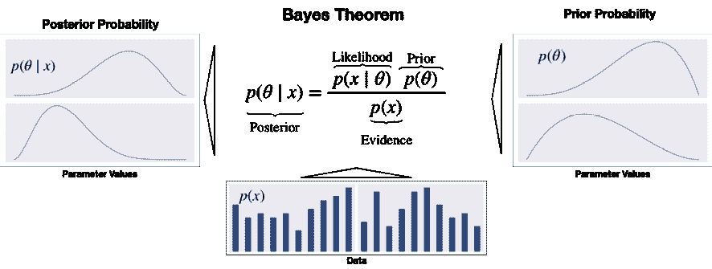

图 10.1：证据如何更新先验到后验概率分布

后验是先验和似然的乘积，除以证据。因此，它反映了假设的概率分布，通过考虑先前假设和数据更新。从不同角度看，后验概率来自应用链式规则，这反过来将数据和参数的联合分布分解为因子。

对于更高维度、连续变量，该公式变得更加复杂，涉及（多个）积分。此外，另一种表述使用赔率将后验赔率表达为先验赔率乘以似然比（参见 Gelman 等人 2013 年）。

## 精确推断 - 最大后验估计

将贝叶斯定理应用于精确计算后验概率的实际应用非常有限。这是因为计算分母中的证据项相当具有挑战性。证据反映了观察数据在所有可能参数值上的概率。它也被称为*边际似然*，因为它需要通过添加或对其分布进行积分来“边缘化”参数的分布。这通常仅在具有少量假设值的少量离散参数的简单情况下才可能。

最大后验概率（**MAP**）估计利用了证据是一个将后验缩放到满足概率分布要求的常数因子的事实。由于证据不依赖于 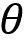，后验分布与似然和先验的乘积成正比。因此，MAP 估计选择使后验最大化的值，给定观察到的数据和先验信念，即后验的模式。

MAP 方法与定义概率分布的参数的最大似然估计（**MLE**）相对比。MLE 选择最大化观察训练数据的似然函数的参数值！[](img/B15439_10_006.png)。

通过定义可以看出，**MAP 与 MLE 的不同之处在于包括先验分布**。换句话说，除非先验是一个常数，否则 MAP 估计将与其 MLE 对应物不同：

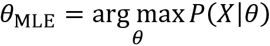

MLE 解决方案往往反映了频率学观念，即概率估计应反映观察到的比率。另一方面，先验对 MAP 估计的影响通常对应于将反映先验假设的数据添加到 MLE 中。例如，一个关于硬币偏向的强先验可以通过添加倾斜的试验数据来纳入 MLE 环境中。

先验分布是贝叶斯模型的关键组成部分。我们现在将介绍一些便利的选择，以促进分析推断。

### 如何选择先验

先验应该反映对参数分布的了解，因为它影响着 MAP 估计。如果先验不确定，我们需要做出选择，通常从几个合理的选项中选择。一般来说，证明先验并通过测试替代是否导致相同结论是一种良好的做法。

有几种类型的先验：

+   **客观**先验将最大化数据对后验的影响。如果参数分布未知，我们可以选择一个无信息的先验，如参数值的相关范围上的均匀分布，也称为*平坦先验*。

+   相比之下，**主观**先验旨在将模型外的信息纳入估计中。在 Black-Litterman 环境中，投资者对资产未来收益的信念将是主观先验的一个例子。

+   一个**经验**先验结合了贝叶斯和频率主义方法，并利用历史数据消除了主观性，例如，通过估计各种时刻来拟合标准分布。使用一些历史上的日收益率平均值而不是对未来收益的信念，就是一个简单经验先验的例子。

在 ML 模型的上下文中，先验可以被视为正则化器，因为它限制了后验可以假设的值。例如，具有零先验概率的参数不是后验分布的一部分。通常，更多的好数据允许得出更强的结论，并减少先验的影响。

### 如何保持推断简单 - 共轭先验

当得到的后验与先验相同类或家族的分布相同时，先验分布与似然函数共轭。例如，当先验和似然都是正态分布时，后验也是正态分布的。

先验和似然的共轭意味着**后验的封闭形式解**，有利于更新过程，并避免使用数值方法来近似后验。此外，得到的后验可以用作下一次更新步骤的先验。

让我们用股票价格变动的二元分类例子来说明这个过程。

### 资产价格变动的动态概率估计

当数据由具有某一成功概率的二元伯努利随机变量组成时，重复试验中的成功次数遵循二项分布。共轭先验是支持区间[0,1]上的贝塔分布，并具有两个形状参数，以对成功概率上的任意先验分布进行建模。因此，后验分布也是一个贝塔分布，我们可以通过直接更新参数来得到。

我们将收集不同大小的**二值化的每日标普 500 指数收益率**样本，其中正面结果是价格上涨。从一个不具信息的先验开始，在区间[0,1]中为每个可能的成功概率分配相等的概率，我们计算不同证据样本的后验概率。

下面的代码示例显示，更新仅涉及将观察到的成功和失败的数量添加到先验分布的参数中以获得后验：

```py
n_days = [0, 1, 3, 5, 10, 25, 50, 100, 500]
outcomes = sp500_binary.sample(n_days[-1])
p = np.linspace(0, 1, 100)
# uniform (uninformative) prior
a = b = 1
for i, days in enumerate(n_days):
    up = outcomes.iloc[:days].sum()
    down = days - up
    update = stats.beta.pdf(p, a + up , b + down) 
```

结果后验分布已绘制在下图中。它们说明了从将所有成功概率视为等可能的均匀先验到越来越尖峰分布的演变。

经过 500 个样本后，从 2010 年到 2017 年，正向移动的概率集中在实际概率的 54.7％附近。它还显示了 MLE 和 MAP 估计之间的小差异，后者倾向于被稍微拉向均匀先验的期望值：

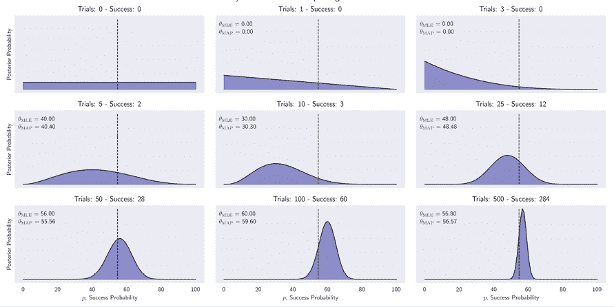

图 10.2：经过最多 500 次更新后的标普 500 指数第二天上涨概率的后验分布

在实践中，使用共轭先验的情况受到低维情况的限制。此外，简化的 MAP 方法避免了计算证据项，但有一个关键缺点，即使在可用时也是如此：它不返回分布，因此我们无法得出不确定性的度量或将其用作先验。因此，我们需要使用数值方法和随机模拟进行近似推断，而不是精确推断，接下来我们将介绍。

## 确定性和随机近似推断

对于大多数具有实际相关性的模型，将无法解析地推导出精确的后验分布并计算潜在参数的期望值。模型可能具有太多参数，或者后验分布可能对于解析解而言过于复杂：

+   对于**连续变量**，积分可能没有封闭形式的解，而空间的维数和被积函数的复杂性可能会阻止数值积分。

+   对于**离散变量**，边缘化涉及对所有可能的隐藏变量配置求和，尽管这在原则上总是可能的，但实践中我们经常发现可能存在指数多个隐藏状态，使得这种计算代价过高。

尽管对于一些应用来说，未观察参数的后验分布可能很重要，但通常主要是需要评估期望，例如进行预测。在这种情况下，我们可以依赖于近似推断，其中包括随机和确定性方法：

+   基于**马尔可夫链蒙特卡罗**(**MCMC**)抽样的**随机**技术已经在许多领域推广了贝叶斯方法的使用。它们通常具有收敛到精确结果的属性。在实践中，抽样方法可能计算成本高，通常仅限于小规模问题。

+   称为**变分推断**或**变分贝叶斯**的**确定性**方法基于对后验分布的解析近似，并且可以很好地扩展到大型应用程序。它们进行简化假设，例如，后验分解为特定方式或具有特定参数形式，例如高斯分布。因此，它们不生成精确结果，并且可以用作抽样方法的补充。

我们将在接下来的两个部分概述这两种方法。

### 马尔可夫链蒙特卡罗抽样

抽样是指从给定分布*p*(*x*)中绘制样本*X*=(*x*[1], …, *x*[n])。假设样本是独立的，大数定律确保对于增加的样本数量，样本中给定实例*x*[i]的比例（对于离散情况）对应于其概率*p*(*x*=*x*[i])。在连续情况下，类似的推理适用于样本空间的给定区域。因此，对样本的平均值可以用作分布参数的期望值的无偏估计量。

实际挑战之一是确保独立抽样，因为分布是未知的。依赖样本可能仍然是无偏的，但往往会增加估计的方差，因此需要更多的样本来获得与独立样本相同的精确估计。

从多元分布中抽样在状态数量随维度数呈指数增长时计算成本很高。许多算法简化了这个过程；我们将在这里介绍几种基于 MCMC 的流行变体。

**马尔可夫链**是描述一组由转移概率连接的状态上的随机游走的动态随机模型。马尔可夫属性规定了过程没有记忆，并且下一步仅取决于当前状态。换句话说，这取决于当前、过去和未来是否独立，也就是说，过去状态的信息不会帮助我们预测未来超出我们从现在所知道的内容。

**蒙特卡罗方法**依赖于重复随机抽样来近似可能是确定性的但不允许精确解析解的结果。它在曼哈顿计划期间开发，用于估算原子级别的能量，并获得了其持久的代码名称以确保保密性。

许多算法将蒙特卡罗方法应用于马尔可夫链，并通常按以下方式进行：

1.  从当前位置开始。

1.  从提议分布中绘制一个新位置。

1.  根据数据和先验分布评估新位置的概率。

    1.  如果足够可能，移动到新位置。

    1.  否则，保持在当前位置。

1.  从*步骤 1*重复。

1.  经过一定数量的迭代后，返回所有被接受的位置。

MCMC 方法旨在识别和探索后验中集中显著概率密度的有趣区域。当它连续地移动到后验的附近高概率状态时，被称为无记忆过程的过程收敛。一个关键挑战是平衡对样本空间随机探索的需求与降低接受率的风险。

过程的初始步骤可能更多地反映了起始位置而不是后验，并且通常被丢弃作为*burn-in* **样本**。 MCMC 的一个关键属性是在一定（但未知）数量的迭代之后，该过程应“忘记”其初始位置。

剩下的样本被称为该过程的**迹**。假设收敛，则样本的相对频率近似后验，并且可以根据大数定律计算期望值。

如前所述，估计的精度取决于由随机游走收集的样本的串行相关性，其中每个样本设计上仅依赖于前一个状态。更高的相关性限制了对后验的有效探索，并且需要进行诊断测试。

设计这样一个马尔可夫链的一般技术包括 Gibbs 抽样、Metropolis-Hastings 算法和更近期的哈密顿 MCMC 方法，后者通常表现更好。

#### Gibbs 抽样

Gibbs 抽样将多变量抽样简化为一系列一维绘制。从某个起始点开始，它在抽样第*n*个变量时迭代地保持*n*-1 个变量不变。它包含了这个样本并重复它。

该算法非常简单易实现，但产生高度相关的样本，减慢了收敛速度。顺序性质也阻止了并行化。详见 Casella 和 George (1992) 中对其的详细描述和解释。

#### Metropolis-Hastings 取样

Metropolis-Hastings 算法根据当前状态随机提出新的位置。它这样做是为了有效地探索样本空间并减少相对于 Gibbs 采样的样本相关性。为了确保它从后验中取样，它使用先验和似然的乘积来评估提议，这与后验成比例。它接受的概率取决于结果相对于当前样本的相应值。

提议评估方法的一个关键优点是，它使用与后验的精确评估不同的比例评估。但是，它可能需要很长时间才能收敛。这是因为与后验无关的随机移动可能会降低接受率，从而使大量步骤只产生少量（可能相关的）样本。接受率可以通过减小提议分布的方差来调节，但由此产生的较小步骤意味着较少的探索。详见 Chib 和 Greenberg (1995) 中对该算法的详细介绍。

#### 汉密尔顿蒙特卡洛 – 进入 NUTS

**汉密尔顿蒙特卡洛** (**HMC**) 是一种混合方法，利用了似然梯度的一阶导数信息。借助此信息，它提出了新的状态以进行探索，并克服了一些 MCMC 的挑战。此外，它结合了动量以有效地在后验中“跳跃”。因此，它比简单的随机行走 Metropolis 或 Gibbs 采样更快地收敛到高维目标分布。详见 Betancourt (2018) 中全面的概念介绍。

**无 U-Turn 采样器** (**NUTS**, Hoffman 和 Gelman 2011) 是一种自调整的 HMC 扩展，它在选择提议之前自适应地调节后验周围的移动的大小和数量。它在高维和复杂的后验分布上表现良好，并允许拟合许多复杂模型而无需关于拟合算法本身的专业知识。正如我们将在下一节中看到的，它是 **PyMC3** 中的默认采样器。

### 变分推断和自动微分

**变分推断** (**VI**) 是一种通过优化来近似概率密度的机器学习方法。在贝叶斯背景下，它近似后验分布，如下所示：

1.  选择一个参数化的概率分布族

1.  找到该族中距离目标最近的成员，其度量为 Kullback-Leibler 散度

与 MCMC 相比，变分贝叶斯倾向于更快地收敛并且对大数据具有更好的可扩展性。虽然 MCMC 通过来自链条的样本逼近后验概率，这些样本最终将收敛到目标任意接近的地方，但变分算法通过优化的结果来逼近后验概率，不能保证与目标重合。

变分推断更适用于大型数据集，例如，数亿个文本文档，因此我们可以快速探索许多模型。相反，当时间和计算资源的约束较少时，MCMC 将在较小的数据集上提供更精确的结果。例如，如果您花了 20 年时间收集了一个小但昂贵的数据集，并且确信您的模型是适当的，并且您需要精确的推断，则 MCMC 将是一个不错的选择。有关更详细的比较，请参见 Salimans、Kingma 和 Welling（2015）。

变分推断的缺点是需要模型特定的导出和定制优化例程的实现，这减慢了广泛采用的速度。

最近的**自动微分变分推断**（**ADVI**）算法自动化了这个过程，使得用户只需指定模型，表达为一个程序，ADVI 会自动生成相应的变分算法（详见 GitHub 上的参考资料以了解实现细节）。

我们将看到 **PyMC3 支持各种变分推断技术**，包括 ADVI。

# 使用 PyMC3 的概率编程

概率编程提供了一种描述和拟合概率分布的语言，以便我们可以设计、编码并自动估计和评估复杂的模型。它旨在抽象出一些计算和分析复杂性，以便我们可以专注于贝叶斯推理和推断的概念上更直观、更简单的方面。

自 Uber 开源了 Pyro（基于 PyTorch）后，该领域变得非常动态。最近，Google 为 TensorFlow 添加了一个概率模块

因此，贝叶斯方法在机器学习中的实际相关性和使用可能会增加，以生成对不确定性有洞察力的见解，特别是对于需要透明而不是黑匣子模型的用例。

在本节中，我们将介绍流行的**PyMC3**库，该库使用 Python 为 ML 模型实现了高级 MCMC 抽样和变分推断。与 **Stan**（以蒙特卡罗方法发明者 Stanislaw Ulam 命名，由哥伦比亚大学的 Andrew Gelman 自 2012 年以来开发）一起，PyMC3 是最受欢迎的概率编程语言。

## 使用 Theano 的贝叶斯机器学习

PyMC3 于 2017 年 1 月发布，以将 Hamiltonian MC 方法添加到 PyMC2（2012 年发布）中使用的 Metropolis-Hastings 采样器中。PyMC3 使用 Theano 作为其计算后端，用于动态 C 编译和自动微分。Theano 是由 Yoshua Bengio 的**蒙特利尔学习算法研究所**（**MILA**）开发的一个以矩阵为重点且支持 GPU 的优化库，这启发了 TensorFlow。由于更新的深度学习库的成功，MILA 最近停止进一步开发 Theano（详见*第十六章*，*收益电话和 SEC 文件的单词嵌入*）。

PyMC4 于 2019 年 12 月发布 alpha 版，使用 TensorFlow 代替 Theano，并旨在限制对 API 的影响（请参阅 GitHub 上的存储库链接）。

## PyMC3 工作流程 - 预测衰退

PyMC3 旨在实现直观、易读且功能强大的语法，反映了统计学家描述模型的方式。建模过程通常遵循以下三个步骤：

1.  通过定义编码概率模型：

    1.  量化潜变量的知识和不确定性的先验分布

    1.  将条件参数化为观察数据的似然函数

1.  使用前一节描述的选项之一分析后验：

    1.  使用 MAP 推断获取一个点估计

    1.  使用 MCMC 方法从后验中采样

    1.  使用变分贝叶斯近似后验

1.  使用各种诊断工具检查您的模型

1.  生成预测

生成的模型可用于推理，以获得有关参数值的详细见解，以及对新数据点的预测结果。

我们将使用简单的 logistic 回归来说明这个工作流程，以模拟衰退的预测（请参阅笔记本`pymc3_workflow`）。随后，我们将使用 PyMC3 来计算和比较贝叶斯夏普比率，估计动态配对交易比率，并实现贝叶斯线性时间序列模型。

### 数据 - 领先的衰退指标

我们将使用一个小型和简单的数据集，以便我们可以专注于工作流程。我们将使用**美联储经济数据**（**FRED**）服务（详见*第二章*，*市场和基本数据 - 来源和技术*）下载由**美国经济研究局**（**NBER**）定义的美国衰退日期。我们还将获取四个通常用于预测衰退发生的变量（Kelley 2019），这些变量可以通过 FRED 获得，即：

+   **长期国债收益率曲线的传播**，定义为 10 年期和 3 个月期国债收益率之间的差异

+   密歇根大学的**消费者情绪**指数

+   **全国金融状况指数**（**NFCI**）

+   NFCI **非金融杠杆**子指数

衰退日期以季度为基础确定；我们将重新采样所有系列的频率为每月频率，以从 1982 年至 2019 年获得大约 457 个观测值。如果一个季度被标记为衰退，我们将考虑该季度中的所有月份都是衰退的。

我们将构建一个意图回答问题的模型：**未来 x 个月美国经济是否会陷入衰退？** 换句话说，我们不只关注预测衰退的第一个月；这限制了 48 个衰退月的不平衡性。

为此，我们需要选择一个先导时间；已经进行了大量研究，以找到各种领先指标的适当时间范围：收益率曲线倾向于在衰退之前提前至多 24 个月发送信号；NFCI 指标倾向于具有较短的先导时间（参见 Kelley, 2019）。

以下表格在很大程度上证实了这种经验：它显示了二元衰退变量与四个领先指标之间的互信息（参见*第六章*，*机器学习流程*）在 1-24 个月的时间段内的情况：

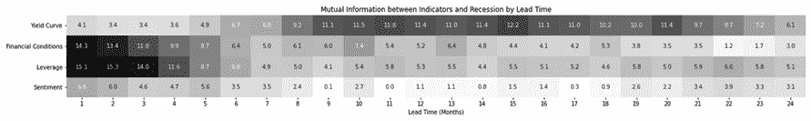

图 10.3：衰退与领先指标之间的互信息，时间段为 1-24 个月

为了在 NFCI 指标的较短时间范围和收益率曲线之间取得平衡，我们将选择 12 个月作为我们的预测时间范围。 以下图表显示了每个指标的分布，按衰退状态划分：

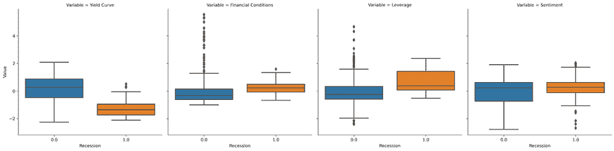

图 10.4：按衰退状态划分的领先指标分布

这表明，经济衰退往往与国债收益率曲线的长期差价负相关，也被称为**倒挂收益率曲线**，当短期利率上升到长期利率之上时。 NFCI 指标的表现符合我们的预期；情绪指标似乎具有最弱的关联性。

### 模型定义 - 贝叶斯逻辑回归

如*第六章*，*机器学习流程*中讨论的那样，逻辑回归估计了一组特征与二元结果之间的线性关系，通过一个 Sigmoid 函数进行中介，以确保模型产生概率。 频率主义方法导致了参数的点估计，这些参数测量了每个特征对数据点属于正类的概率的影响，置信区间基于参数分布的假设。

相比之下，贝叶斯逻辑回归估计参数本身的后验分布。 后验允许更健壮地估计每个参数的所谓**贝叶斯可信区间**，其好处在于更透明地了解模型的不确定性。

概率程序由**观察和未观察的随机变量**（**RVs**）组成。 正如之前讨论的，我们通过似然分布定义观察到的 RVs，通过先验分布定义未观察到的 RVs。 PyMC3 包含许多概率分布，用于此目的。

PyMC3 库使得执行逻辑回归的近似贝叶斯推断非常简单。 逻辑回归模型基于左侧图中所述的 *k* 个特征，来建模经济在 *i* 个月后是否会陷入衰退的概率：

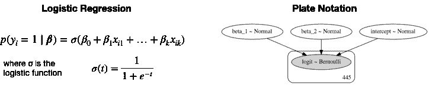

图 10.5：贝叶斯逻辑回归

我们将使用上下文管理器`with`来定义一个我们稍后可以引用的`manual_logistic_model`作为概率模型：

1.  未观测参数的 RVs，用于拦截和两个特征的被表达使用不含信息的先验，这些假设正态分布的均值为 0，标准差为 100。

1.  似然性根据逻辑回归的规范将参数与数据结合起来。

1.  结果被建模为具有由似然给定的成功概率的 Bernoulli RV：

    ```py
    with pm.Model() as manual_logistic_model:
        # coefficients as rvs with uninformative priors
        intercept = pm.Normal('intercept', 0, sd=100)
        beta_1 = pm.Normal('beta_1', 0, sd=100)
        beta_2 = pm.Normal('beta_2', 0, sd=100)
        # Likelihood transforms rvs into probabilities p(y=1)
        # according to logistic regression model.
        likelihood = pm.invlogit(intercept +
                                 beta_1 * data.yield_curve +
                                 beta_2 * data.leverage)
        # Outcome as Bernoulli rv with success probability
        # given by sigmoid function conditioned on actual data
        pm.Bernoulli(name='logit',
                     p=likelihood,
                     observed=data.recession) 
    ```

#### 模型可视化和板符号

命令`pm.model_to_graphviz(manual_logistic_model)`生成右侧*图 10.5*中显示的板符号。 它显示了未观察到的参数作为浅色椭圆，观察到的元素作为深色椭圆。 矩形表示在模型定义中包含的数据暗示的观察到的模型元素的重复次数。

#### 广义线性模型模块

PyMC3 包括许多常见的模型，以便我们可以限制自定义应用程序的手动规范。

以下代码将相同的逻辑回归定义为**广义线性模型** (**GLM**)家族的成员。它使用受统计语言 R 启发的公式格式，并由 patsy 库移植到 Python 中：

```py
with pm.Model() as logistic_model:
    pm.glm.GLM.from_formula(recession ~ yield_curve + leverage,
                            data,
                            family=pm.glm.families.Binomial()) 
```

### 精确 MAP 推断

我们使用刚刚定义的模型的`.find_MAP()`方法获得三个参数的点 MAP 估计。 如预期的那样，较低的展开值增加了衰退的概率，较高的杠杆(但程度较小)也是如此：

```py
with logistic_model:
    map_estimate = pm.find_MAP()
print_map(map_estimate)
Intercept     -4.892884
yield_curve   -3.032943
leverage       1.534055 
```

PyMC3 使用拟牛顿**Broyden-Fletcher-Goldfarb-Shanno** (**BFGS**)算法解决找到具有最高密度的后验点的优化问题，但提供了 SciPy 库提供的几种替代方案。

MAP 点估计与相应的`statsmodels`系数相同(请参阅笔记本`pymc3_workflow`)。

### 近似推断 – MCMC

如果我们只对模型参数的点估计感兴趣，那么对于这个简单模型来说，MAP 估计就足够了。 更复杂的自定义概率模型需要采样技术以获得参数的后验概率。

我们将使用所有变量的模型来说明 MCMC 推断：

```py
formula = 'recession ~ yield_curve + leverage + financial_conditions + sentiment'
with pm.Model() as logistic_model:
    pm.glm.GLM.from_formula(formula=formula,
                            data=data,
                            family=pm.glm.families.Binomial())
# note that pymc3 uses y for the outcome
logistic_model.basic_RVs
[Intercept, yield_curve, leverage, financial_conditions, sentiment, y] 
```

请注意，测量在非常不同尺度上的变量可能会减慢采样过程。 因此，我们首先应用由 scikit-learn 提供的`scale()`函数来标准化所有特征。

一旦我们用新的公式定义了我们的模型，我们就可以执行推断以近似后验分布。 MCMC 采样算法可通过`pm.sample()`函数获得。

默认情况下，PyMC3 自动选择最有效的采样器并初始化采样过程以实现高效收敛。对于连续模型，PyMC3 选择在前一节中讨论的 NUTS 采样器。它还通过 ADVI 运行变分推断以找到采样器的良好起始参数。其中一种替代方法是使用 MAP 估计。

要了解收敛的情况，我们首先在调整采样器 1,000 次迭代后只绘制 100 个样本。这些将被丢弃。可以使用`cores`参数（除了使用 GPU 时）将采样过程并行化为多个链：

```py
with logistic_model:
    trace = pm.sample(draws=100,
                      tune=1000,
                      init='adapt_diag',
                      chains=4,
                      cores=4,
                      random_seed=42) 
```

结果的`trace`包含每个 RV 的采样值。我们可以使用`plot_traces()`函数检查链的后验分布。

```py
plot_traces(trace, burnin=0) 
```

*图 10.6*显示了前两个特征和截距的样本分布及其随时间的值（请参阅笔记本以获取完整输出）。此时，采样过程尚未收敛，因为对于每个特征，四条轨迹产生了完全不同的结果；左侧五个面板中垂直显示的数字是由四条轨迹生成的分布的模式的平均值：

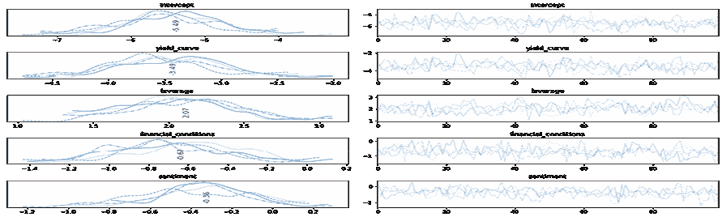

图 10.6：100 个样本后的轨迹

我们可以通过提供先前运行的迹作为输入来继续采样。额外 20,000 个样本后，我们观察到一个非常不同的图像，如下图所示。这显示了采样过程现在更接近收敛。还要注意，初始系数点估计值与当前值相对较接近：

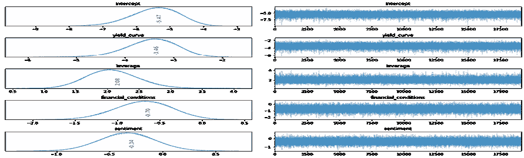

图 10.7：额外 50,000 个样本后的轨迹

我们可以计算**可信区间**，即贝叶斯区间估计的对应物，作为迹的百分位数。结果边界反映了我们对于给定概率阈值的参数值范围的置信度，而不是参数在大量试验中在此范围内的次数。*图 10.8*显示了变量的收益曲线和杠杆的可信区间，以系数值的指数函数（参见*第七章*，*线性模型 - 从风险因素到收益预测*）来表示。

请参阅笔记本`pymc3_workflow`的实现：

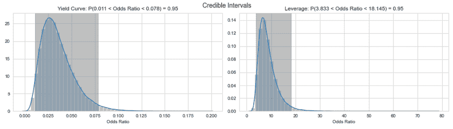

图 10.8：收益曲线和杠杆的可信区间

### 近似推断 - 变分贝叶斯

变分推断的接口与 MCMC 实现非常相似。我们只是使用`fit()`而不是`sample()`函数，可以选择包括一个早期停止的`CheckParametersConvergence`回调，如果分布拟合过程收敛到给定的容差：

```py
with logistic_model:
    callback = CheckParametersConvergence(diff='absolute')
    approx = pm.fit(n=100000,
                    callbacks=[callback]) 
```

我们可以从近似分布中抽取样本以获得一个迹对象，就像我们之前为 MCMC 采样器所做的那样：

```py
trace_advi = approx.sample(10000) 
```

检查跟踪摘要显示结果稍微不太准确。

### 模型诊断

贝叶斯模型诊断包括验证采样过程是否收敛并且是否一直从后验的高概率区域进行采样，以及确认模型是否很好地表示了数据。

#### 收敛性

我们可以通过随时间变化的样本和它们的分布来可视化结果的质量。下图显示了初始 100 个样本和额外的 200,000 个样本后的后验分布，说明了收敛意味着多个链识别相同的分布：

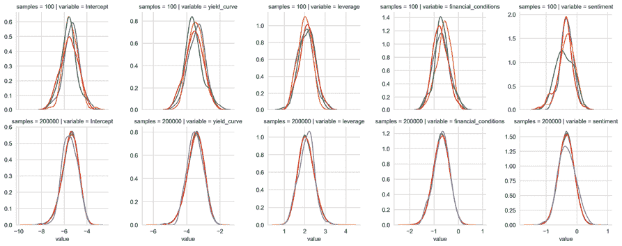

图 10.9：400 个样本后和超过 200,000 个样本后的跟踪

PyMC3 为采样器生成各种摘要统计信息。这些信息可以作为统计模块中的单独函数提供，也可以通过将追踪传递给函数`pm.summary()`来获取。

下表包含（分别计算的）statsmodels 逻辑斯蒂回归系数作为第一列，以显示在这种简单情况下，两个模型略有一致，因为样本均值与系数不匹配。这很可能是由于准分离的高程度造成的：收益率曲线的高可预测性允许对 17%的数据点进行完美预测，这反过来导致逻辑回归的最大似然估计定义不清晰（有关更多信息，请参见笔记本中的 statsmodels 输出）。

| 参数 | statsmodels | PyMC3 |
| --- | --- | --- |
| 系数 | 均值 | 标准差 | HPD 3% | HPD 97% | 有效样本 | R hat |
| 截距 | -5.22 | -5.47 | 0.71 | -6.82 | -4.17 | 68,142 | 1.00 |
| 收益率曲线 | -3.30 | -3.47 | 0.51 | -4.44 | -2.55 | 70,479 | 1.00 |
| 杠杆 | 1.98 | 2.08 | 0.40 | 1.34 | 2.83 | 72,639 | 1.00 |
| 金融条件 | -0.65 | -0.70 | 0.33 | -1.33 | -0.07 | 91,104 | 1.00 |
| 情绪 | -0.33 | -0.34 | 0.26 | -0.82 | 0.15 | 106,751 | 1.00 |

剩余列包含最高后验密度（**HPD**）估计的最小宽度可信区间，这是置信区间的贝叶斯版本，此处计算为 95%的水平。`n_eff`统计量总结了从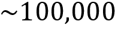绘制的有效（未被拒绝）样本数量。

R-hat，也被称为**Gelman-Rubin 统计量**，通过比较链间方差和链内方差来检查收敛性。如果采样器收敛了，这些方差应该相同，即链应该看起来相似。因此，该统计量应接近 1。

对于具有许多变量的高维模型，检查大量的跟踪变得很麻烦。在使用 NUTS 时，能量图帮助我们评估收敛问题。它总结了随机过程探索后验的效率。图表显示了能量和能量转换矩阵，它们应该匹配良好，就像下图右侧面板中显示的例子一样：

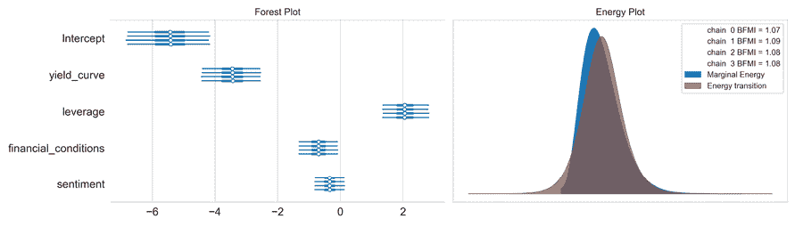

图 10.10: 森林和能量图

#### 后验预测检查

**后验预测检查** (**PPCs**) 对于检查模型与数据拟合程度非常有用。它们通过使用从后验抽取的参数从模型生成数据来实现这一点。我们使用函数 `pm.sample_ppc` 来实现此目的，并为每个观测值获取 *n* 个样本（GLM 模块自动将结果命名为 `'y'`）：

```py
ppc = pm.sample_ppc(trace_NUTS, samples=500, model=logistic_model)
ppc['y'].shape
(500, 445) 
```

我们可以使用接收器操作特征曲线下面积（AUC，参见*第六章*，*机器学习过程*）得分来评估样本内适配度，例如，比较不同的模型：

```py
roc_auc_score(y_score=np.mean(ppc['y'], axis=0),
              y_true=data.income)
0.9483627204030226 
```

结果相当高，几乎为 0.95。

### 如何生成预测

预测使用 Theano 的 *共享变量* 来在运行后验预测检查之前用测试数据替换训练数据。为了可视化和简化表述，我们使用收益曲线变量作为唯一的预测变量，并忽略我们数据的时间序列特性。

相反，我们使用 scikit-learn 的基本 `train_test_split()` 函数创建训练集和测试集，通过结果进行分层，以保持类别不平衡：

```py
X = data[['yield_curve']]
labels = X.columns
y = data.recession
X_train, X_test, y_train, y_test = train_test_split(X, y,
                                                    test_size=0.2,
                                                    random_state=42,
                                                    stratify=y) 
```

然后我们为该训练集创建一个共享变量，然后在下一步中用测试集替换它。请注意，我们需要使用 NumPy 数组并提供列标签的列表：

```py
X_shared = theano.shared(X_train.values)
with pm.Model() as logistic_model_pred:
    pm.glm.GLM(x=X_shared, labels=labels,
               y=y_train, family=pm.glm.families.Binomial()) 
```

然后我们像之前一样运行采样器：

```py
with logistic_model_pred:
    pred_trace = pm.sample(draws=10000,
                           tune=1000,
                           chains=2,
                           cores=2,
                           init='adapt_diag') 
```

现在，我们将测试数据替换为共享变量上的训练数据，并将 `pm.sample_ppc` 函数应用于生成的 `trace`：

```py
X_shared.set_value(X_test)
ppc = pm.sample_ppc(pred_trace,
                    model=logistic_model_pred,
                    samples=100)
y_score = np.mean(ppc['y'], axis=0)
roc_auc_score(y_score=np.mean(ppc['y'], axis=0),
              y_true=y_test)
0.8386 
```

这个简单模型的 AUC 分数是 0.86。显然，如果训练集已经包含了来自附近月份的衰退示例，那么对于另一个月份预测相同的衰退要容易得多。请记住，我们仅用于演示目的使用此模型。

*图 10.11* 绘制了从 100 个 Monte Carlo 链中抽样的预测及其周围的不确定性，以及实际的二元结果和对应于模型预测的 logistic 曲线：

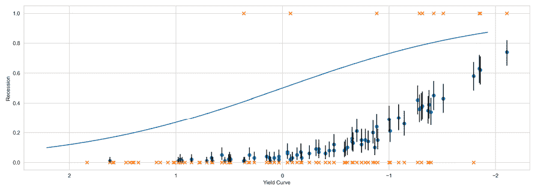

图 10.11: 单变量模型预测

### 摘要和主要观点

我们建立了一个简单的 logistic 回归模型，用于预测美国经济在 12 个月内陷入衰退的概率，使用了四个领先指标。对于这个简单模型，我们可以得到精确的 MAP 估计系数值，然后使用这些系数值对模型进行参数化和预测。

但是，更复杂的自定义概率模型将不允许此捷径，而且 MAP 估计也不会生成有关点估计之外的后验分布的洞见。因此，我们演示了如何使用 PyMC3 进行近似推理。结果说明了我们如何了解每个模型参数的后验分布，但也显示出即使对于一个小模型，与 statsmodels MLE 估计相比，计算成本也会显著增加。尽管如此，对于复杂的概率模型，基于采样的解决方案是了解数据的唯一途径。

我们现在将说明如何将贝叶斯分析应用于一些与交易相关的用例。

# 交易的贝叶斯机器学习

既然我们熟悉了 ML 和用 PyMC3 进行概率编程的贝叶斯方法，让我们探讨一下几个相关的交易应用，即：

+   将夏普比率建模为更具洞察力的性能比较的概率模型

+   使用贝叶斯线性回归计算配对交易对冲比率

+   从贝叶斯角度分析线性时间序列模型

**托马斯·韦基**，PyMC3 的主要作者之一，也是 Quantopian 的数据科学主管，已经创建了几个示例，以下各节将继续并在其基础上建立。PyMC3 文档有许多额外的教程（请查看 GitHub 获取链接）。

## 用于性能比较的贝叶斯夏普比率

在本节中，我们将说明：

+   如何使用 PyMC3 定义**夏普比率**（**SR**）作为概率模型

+   如何比较不同回报序列的后验分布

为两个序列进行贝叶斯估计提供了非常丰富的见解，因为它提供了效应大小，组 SR 均值及其差异的可信值的完整分布，以及标准偏差及其差异的完整分布。Python 实现是由 Thomas Wiecki 完成的，并受到了 R 包 BEST（Meredith 和 Kruschke，2018）的启发。

使用贝叶斯 SR 的相关用例包括分析替代策略之间的差异，或者策略的样本内回报与样本外回报之间的差异（详见笔记本`bayesian_sharpe_ratio`）。贝叶斯 SR 也是 pyfolio 的贝叶斯信息单页的一部分。

### 定义一个自定义的概率模型

要将 SR 建模为概率模型，我们需要关于回报分布及其控制此分布的参数的先验。相对于低**自由度**（**DF**）的正态分布，学生 t 分布具有较厚的尾部，是捕获回报此方面的合理选择。

因此，我们需要**对此分布的三个参数进行建模**，即回报的均值和标准偏差，以及 DF。我们将假设对于均值和标准偏差，分别采用正态和均匀分布，对于 DF 采用指数分布，期望值足够低以确保尾部较厚。

这些概率输入是基于这些回报的，而年化 SR 来自标准计算，忽略无风险利率（使用每日回报）。我们将提供 2010-2018 年的 AMZN 股票回报作为输入（有关数据准备的更多信息，请参阅笔记本）：

```py
mean_prior = data.stock.mean()
std_prior = data.stock.std()
std_low = std_prior / 1000
std_high = std_prior * 1000
with pm.Model() as sharpe_model:
    mean = pm.Normal('mean', mu=mean_prior, sd=std_prior)
    std = pm.Uniform('std', lower=std_low, upper=std_high)
    nu = pm.Exponential('nu_minus_two', 1 / 29, testval=4) + 2
    returns = pm.StudentT('returns', nu=nu, mu=mean, sd=std,
observed=data.stock)
    sharpe = returns.distribution.mean / returns.distribution.variance ** 
.5 * np.sqrt(252)
    pm.Deterministic('sharpe', sharpe) 
```

板符号，我们在关于 PyMC3 工作流程的上一节中引入的，可视化了三个参数及其关系，以及我们在以下图中提供的回报和观察次数：

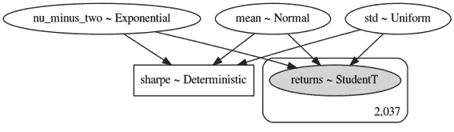

图 10.12：贝叶斯 SR 在板符号中

然后我们运行我们在前一节介绍的 MCMC 抽样过程（请参阅笔记本`bayesian_sharpe_ratio`以了解随后的实现细节）。经过约 25000 次对四个链的抽样后，我们获得了模型参数的后验分布，结果显示在以下图中：

```py
plot_posterior(data=trace); 
```

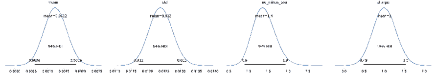

图 10.13：模型参数的后验分布

现在我们知道如何评估单个资产或投资组合的 SR，让我们看看如何使用贝叶斯 SR 来比较两个不同回报序列的性能。

### 比较两个回报序列的性能

为了比较两个回报序列的性能，我们将分别对每个组的 SR 进行建模，并将效应大小计算为波动率调整后回报之间的差异。以下图表显示的相应概率模型自然更大，因为它包括两个 SR 以及它们的差异：

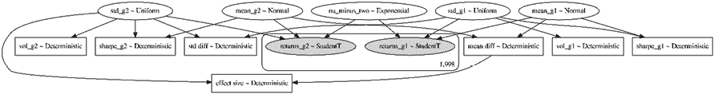

图 10.14：在板符号中两个贝叶斯 SR 之间的差异

一旦我们定义了模型，我们就通过 MCMC 抽样过程运行它以获得其参数的后验分布。我们使用 2010-2018 年的 2,037 个每日回报来比较 AMZN 股票与同一时期的标普 500 指数回报。我们可以使用我们任何策略回测的回报，而不是 AMZN 的回报。

可视化轨迹揭示了对每个指标分布的精细性能洞察，如*图 10.15*中的各种图表所示：

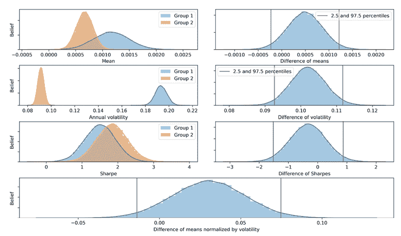

图 10.15：两个贝叶斯 SR 之间的后验分布

最重要的度量标准是底部面板中两个 SR 之间的差异。给定完整的后验分布，可以直观地可视化或计算从 SR 角度来看一个回报序列优越的概率。

## 用于配对交易的贝叶斯滚动回归

在前一章中，我们介绍了配对交易作为一种流行的交易策略，它依赖于两个或更多资产的协整性。 鉴于这样的资产，我们需要估计对冲比率，以决定多头和空头位置的相对大小。 一种基本方法使用线性回归。 你可以在笔记本`rolling_regression`中找到此部分的代码，该笔记本遵循了托马斯·威克（Thomas Wiecki）的滚动回归示例（请参阅 GitHub 上 PyMC3 教程的链接）。

配对交易候选资产的一个流行示例是 ETF GLD，它反映了金价和像 GFI 这样的金矿股票。 我们使用 yfinance 获取 2004 年至 2020 年期间的收盘价数据。 *图 10.16*的左侧面板显示了历史价格序列，而右侧面板显示了历史价格的散点图，其中色调表示时间维度，以突出显示相关性的演变方式。 **注意我们应该使用收益率**，就像我们在*第九章*，*波动率预测和统计套利的时间序列模型*中所做的那样，来计算对冲比率; 然而，使用价格序列创建更引人注目的可视化效果。 建模过程本身保持不变：

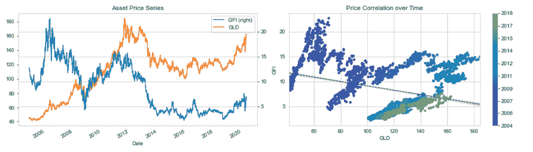

图 10.16：两对交易候选资产的价格序列和随时间的相关性

我们想说明滚动贝叶斯线性回归如何随时间跟踪两个资产价格之间关系的变化。 主要思想是通过允许回归系数的变化将时间维度纳入线性回归中。 具体来说，我们将假设截距和斜率随时间呈随机游走：

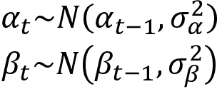

我们使用 PyMC3 内置的`pm.GaussianRandomWalk`过程指定`model_randomwalk`。 它要求我们为截距 alpha 和斜率 beta 都定义标准差：

```py
model_randomwalk = pm.Model()
with model_randomwalk:
    sigma_alpha = pm.Exponential('sigma_alpha', 50.)
    alpha = pm.GaussianRandomWalk('alpha', 
                                  sd=sigma_alpha,
                                  shape=len(prices))
    sigma_beta = pm.Exponential('sigma_beta', 50.)
    beta = pm.GaussianRandomWalk('beta', 
                                 sd=sigma_beta,
                                 shape=len(prices)) 
```

鉴于概率模型的规范，我们现在将定义回归并将其连接到输入数据：

```py
with model_randomwalk:
    # Define regression
    regression = alpha + beta * prices_normed.GLD
    # Assume prices are normally distributed
    # Get mean from regression.
    sd = pm.HalfNormal('sd', sd=.1)
    likelihood = pm.Normal('y', 
                           mu=regression, 
                           sd=sd, 
                           observed=prices_normed.GFI) 
```

现在，我们可以运行 MCMC 采样器以生成模型参数的后验分布：

```py
with model_randomwalk:
    trace_rw = pm.sample(tune=2000, 
                         cores=4, 
                         draws=200, 
                         nuts_kwargs=dict(target_accept=.9)) 
```

*图 10.17*描述了截距和斜率系数随时间的变化，强调了演变的相关性：

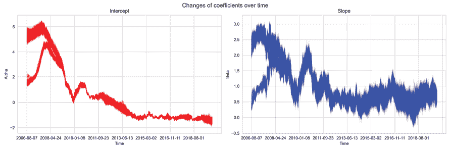

图 10.17：截距和斜率系数随时间的变化

使用动态回归系数，我们现在可以通过这种贝叶斯方法来可视化滚动回归建议的对冲比率随时间的变化，该方法将系数建模为随机游走。

下图将价格序列和回归线结合在一起，其中色调再次表示时间线（在笔记本中查看以获得彩色输出）：

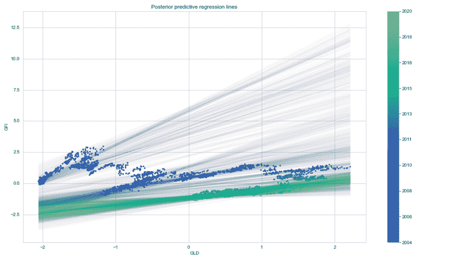

图 10.18：滚动回归线和价格序列

对于我们的最后一个示例，我们将实现一个贝叶斯随机波动模型。

## 随机波动模型

正如前一章所讨论的，资产价格具有时变波动性。在某些时期，收益非常不稳定，而在其他时期则非常稳定。我们在 *第九章*，*波动性预测和统计套利的时间序列模型* 中从经典线性回归的角度探讨了 ARCH/GARCH 模型。

贝叶斯随机波动性模型通过潜在波动性变量捕捉这种波动现象，该变量被建模为随机过程。使用这种模型介绍了无 U 转向采样器 (Hoffman, et al. 2011)，笔记本 `stochastic_volatility` 使用了 S&P 500 每日数据来说明这种用例。*图 10.19* 显示了此期间的几个波动性集群：

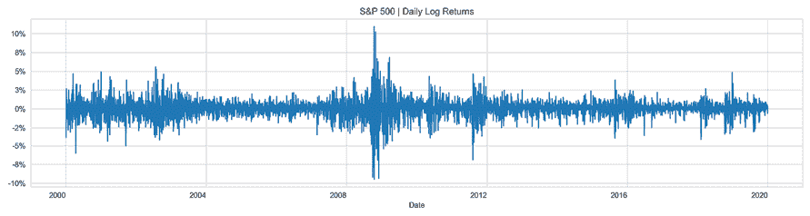

图 10.19：每日 S&P 500 对数收益率

概率模型规定对数收益率遵循 t 分布，该分布具有厚尾，如资产收益通常观察到的情况。 t 分布受参数 *ν* 控制，表示自由度。它也被称为正态参数，因为 t 分布在 *ν* 增加时逼近正态分布。假定此参数具有参数 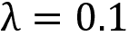 的指数分布。

此外，假定对数收益率的平均值为零，而标准差遵循具有指数分布的标准差随机游走：

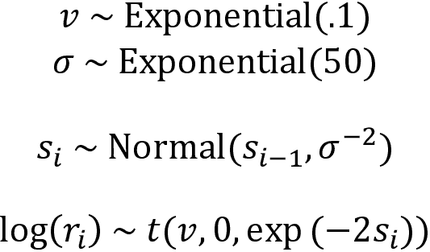

我们将此模型实现为 PyMC3，以模仿其概率规范，使用对数收益率匹配模型：

```py
prices = pd.read_hdf('../data/assets.h5', key='sp500/prices').loc['2000':,
                                                                  'Close']
log_returns = np.log(prices).diff().dropna()
with pm.Model() as model:
    step_size = pm.Exponential('sigma', 50.)
    s = GaussianRandomWalk('s', sd=step_size, 
                           shape=len(log_returns))
    nu = pm.Exponential('nu', .1)
    r = pm.StudentT('r', nu=nu, 
                    lam=pm.math.exp(-2*s), 
                    observed=log_returns) 
```

接下来，在经过 2,000 个样本的燃烧阶段后，我们绘制了 5,000 个 NUTS 样本，使用比默认值 0.8 更高的接受率，根据 PyMC3 文档建议，对于有问题的后验分布（请参阅 GitHub 上的适当链接）：

```py
with model:
    trace = pm.sample(tune=2000, 
                      draws=5000,
                      nuts_kwargs=dict(target_accept=.9))
Auto-assigning NUTS sampler...
Initializing NUTS using jitter+adapt_diag...
Multiprocess sampling (4 chains in 4 jobs)
NUTS: [nu, s, sigma]
Sampling 4 chains, 0 divergences: 100%|██████████| 28000/28000 [27:46<00:00, 16.80draws/s]
The estimated number of effective samples is smaller than 200 for some parameters. 
```

在四个链总共 28,000 个样本之后，下图中的迹线图证实了采样过程已经收敛：

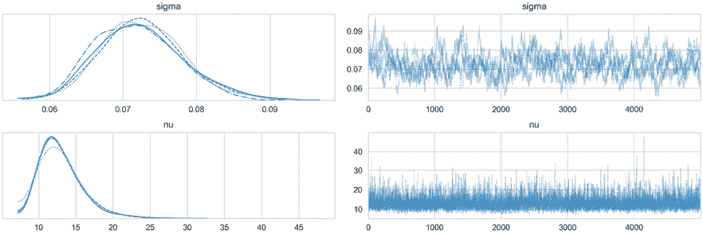

图 10.20：随机波动率模型的迹线图

当我们将样本绘制到 *图 10.21* 中的 S&P 500 收益率上时，我们可以看到这个简单的随机波动性模型相当好地跟踪了波动性集群： 

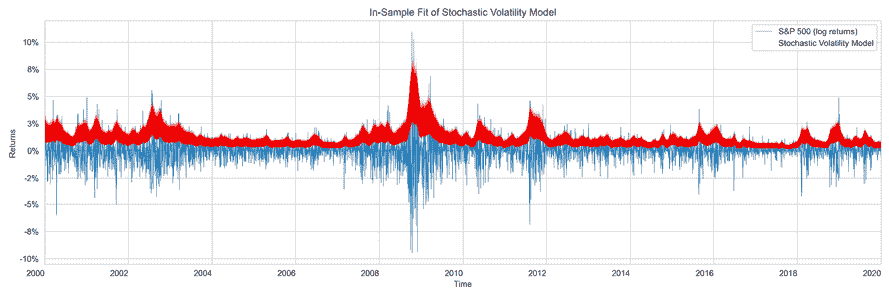

图 10.21：模型

记住这代表了样本内拟合。作为下一步，你应该尝试评估预测准确性。我们在前面滚动线性回归的子章节中介绍了如何进行预测，并在前几章中使用了时间序列交叉验证，这为您提供了完成此目的所需的所有工具！

# 概要

在本章中，我们探讨了贝叶斯方法与机器学习的结合。我们看到它们有几个优点，包括能够编码先验知识或意见，更深入地了解模型估计和预测周围的不确定性，并适用于在线学习，其中每个训练样本逐渐影响模型的预测。

我们学习了如何使用 PyMC3 应用贝叶斯工作流程，从模型规范到估计、诊断和预测，并探讨了几个相关的应用场景。我们将在*第十四章*中遇到更多的贝叶斯模型，*用于交易的文本数据 - 情感分析*，在那里我们将讨论自然语言处理和主题建模，以及在*第二十章*中，*用于条件风险因素和资产定价的自动编码器*，在那里我们将介绍变分自动编码器。

下一章介绍了非线性的基于树的模型，即决策树，并展示了如何将多个模型组合成一组树的集合，以创建一个随机森林。
