# 第十一章：11

# 随机森林 - 用于日本股票的长短策略

在本章中，我们将学习如何使用两种新的机器学习模型进行交易：**决策树**和**随机森林**。我们将看到决策树如何从数据中学习规则，这些规则编码了输入和输出变量之间的非线性关系。我们将说明如何训练决策树，并使用它进行回归和分类问题的预测，可视化并解释模型学到的规则，并调整模型的超参数以优化偏差-方差权衡，并防止过拟合。

决策树不仅是重要的独立模型，而且经常被用作其他模型的组成部分。在本章的第二部分中，我们将介绍集成模型，这些模型将多个单独模型组合起来，产生一个具有更低预测误差方差的单一聚合预测。

我们将阐述**自助聚合**，通常称为*bagging*，作为几种方法之一，用于随机化个体模型的构建，并减少由集合成员的预测误差造成的相关性。我们将说明如何通过 bagging 有效地减少方差，并学习如何配置、训练和调整随机森林。我们将看到随机森林作为一个（可能较大的）决策树集合，可以显著减少预测误差，但可能会牺牲一些解释性。

然后，我们将继续构建一个使用随机森林为过去 3 年大型日本股票生成盈利信号的长短交易策略。我们将获取并准备股价数据，调整随机森林模型的超参数，并根据模型的信号进行交易规则的回测。由此产生的长短策略使用机器学习而不是我们在第九章中看到的共整关系，以识别和交易在给定投资期限内价格可能朝相反方向移动的证券篮子。

简而言之，阅读完本章后，你将能够：

+   使用决策树进行回归和分类

+   从决策树中获得见解，并可视化从数据中学到的规则

+   理解为什么集成模型往往能够提供优越的结果

+   使用自助聚合来解决决策树过拟合的挑战

+   训练、调整和解释随机森林

+   使用随机森林设计和评估盈利交易策略

你可以在 GitHub 仓库的相应目录中找到本章的代码示例和其他资源的链接。笔记本包括图像的彩色版本。

# 决策树 - 从数据中学习规则

决策树是一种机器学习算法，它根据从数据中学习到的**决策规则**来预测目标变量的值。该算法可以通过改变管理树如何学习规则的目标函数应用于回归和分类问题。

我们将讨论决策树如何使用规则进行预测，如何训练它们来预测（连续的）收益以及（分类的）价格走势方向，以及如何有效地解释、可视化和调整它们。有关更多详细信息和背景信息，请参阅 Rokach 和 Maimon（2008）以及 Hastie、Tibshirani 和 Friedman（2009）。

## 树是如何学习和应用决策规则的

我们在*第七章*，*线性模型 - 从风险因素到收益预测*和*第九章*，*时间序列模型用于波动率预测和统计套利*中学习的**线性模型**通过学习一组参数来预测输出，可能在逻辑回归的情况下通过 S 形链接函数进行转换。

决策树采用不同的方法：它们学习并依次应用一组规则，将数据点分成子集，然后为每个子集做出一个预测。这些预测基于应用给定规则序列所导致的训练样本子集的结果值。**分类树**预测从相对类频率或最多类的值直接估计的概率，而**回归树**计算可用数据点的结果值均值的预测。

每一条规则都依赖于一个特定的特征，并使用一个阈值将样本分成两组，其中值要么低于要么高于该特征的阈值。**二叉树**自然地表示了模型的逻辑：根是所有样本的起点，节点代表决策规则的应用，数据沿着边移动，当它被分成更小的子集时，直到到达叶节点，模型进行预测。

对于线性模型，参数值允许解释输入变量对输出和模型预测的影响。相反，对于决策树，从根到叶的各种可能路径确定了特征及其值如何导致模型做出具体决策。因此，决策树能够捕捉线性模型无法“开箱即用”捕捉的特征之间的**相互依赖**。

以下图表突出显示了模型如何学习一条规则。在训练过程中，算法扫描特征，并且对于每个特征，它寻求找到一个分割数据以最小化由预测造成的损失的切分点。它使用将结果来自于分割的子集，按每个子集中的样本数量加权：

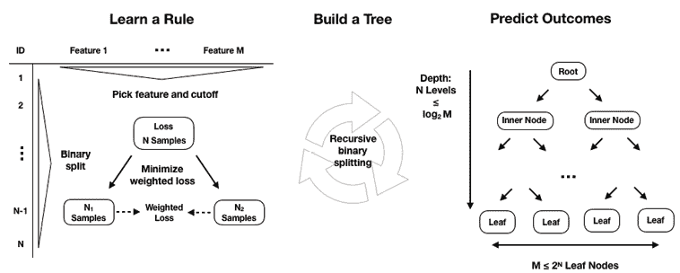

图 11.1：决策树如何从数据中学习规则

在训练期间构建整个树，学习算法重复此过程，即将特征空间，即*p*个输入变量*X*[1]、*X*[2]、...、*X*[p]的可能值集合，划分为互斥且集体穷尽的区域，每个区域由一个叶节点表示。不幸的是，由于特征空间的可能组合和阈值序列的爆炸性数量，算法将无法评估特征空间的每种可能分区。基于树的学习采用了一种**自顶向下**、**贪婪的方法**，称为**递归二元分割**，以克服这种计算限制。

此过程是递归的，因为它使用来自先前分割的数据子集。它是自顶向下的，因为它从树的根节点开始，所有观察仍然属于单个区域，然后通过向预测器空间添加一个以上的分割来连续创建树的两个新分支。它是贪婪的，因为算法根据对目标函数的直接影响选择最佳规则，而不是向前看并评估数步之后的损失。我们将在更具体的回归和分类树的上下文中返回分割逻辑，因为这代表了它们之间的主要差异。

训练样本数量随着递归分割向树中添加新节点而不断减少。如果规则将样本均匀分割，导致树完美平衡，每个节点都有相同数量的子节点，那么在第*n*级就会有 2^n 个节点，每个节点包含总观测数的相应部分。实际上，这是不太可能的，因此沿某些分支的样本数量可能会迅速减少，并且树倾向于沿不同路径生长到不同的深度。

递归分割将继续，直到每个叶节点仅包含单个样本，并且训练误差已经降低到零。我们将介绍几种方法来限制分割并防止决策树产生极端过拟合的自然倾向。

为了对新的观测值进行**预测**，模型使用在训练期间推断出的规则来决定数据点应分配到哪个叶节点，然后使用特征空间相应区域中训练观测的平均值（用于回归）或模式（用于分类）。特征空间中给定区域（即给定叶节点）中训练样本数量较少，会降低预测的置信度，并可能反映出过拟合。

## 实践中的决策树

在本节中，我们将说明如何使用基于树的模型来获得洞察并进行预测。为了演示回归树，我们预测收益，对于分类案例，我们回到了正向和负向资产价格变动的示例。本节的代码示例位于笔记本`decision_trees`中，除非另有说明。

### 数据 - 月度股票收益和特征

我们将选择涵盖 2006-2017 年期间的 Quandl 美国股票数据集的子集，并按照我们第一个特征工程示例中的过程进行操作，*第四章*，*金融特征工程 - 如何研究阿尔法因子*。我们将计算月度收益和基于它们的 5 年移动平均值的 500 种最常交易的股票的 25 个（希望是）预测性特征，产生 56,756 个观察值。这些特征包括：

+   过去 1、3、6 和 12 个月的**历史收益**。

+   **动量指标**将最近 1 个或 3 个月的收益与较长时间跨度的收益相关联。

+   设计用于捕捉波动性的**技术指标**，如（归一化的）平均真实范围（NATR 和 ATR）和像**相对强弱指数**（**RSI**）这样的动量指标。

+   根据滚动 OLS 回归的**五个 Fama-French 因子的因子加载**。

+   **年份和月份**以及部门的**分类变量**。

*图 11.2*显示了这些特征与我们用于回归的月度收益之间的互信息（左侧面板），以及它们的二值化分类对应物，代表了相同期间的正向或负向价格变动。它显示，从单变量的角度来看，无论是对于这些特征的哪一种结果，都存在着信号内容的显著差异。

更多细节可以在这一章的 GitHub 存储库中的`data_prep`笔记本中找到。本章的决策树模型不具备处理缺失或分类变量的能力，因此我们将放弃前者并对分类部门变量应用虚拟编码（参见*第四章*，*金融特征工程 - 如何研究阿尔法因子*和*第六章*，*机器学习过程*）：

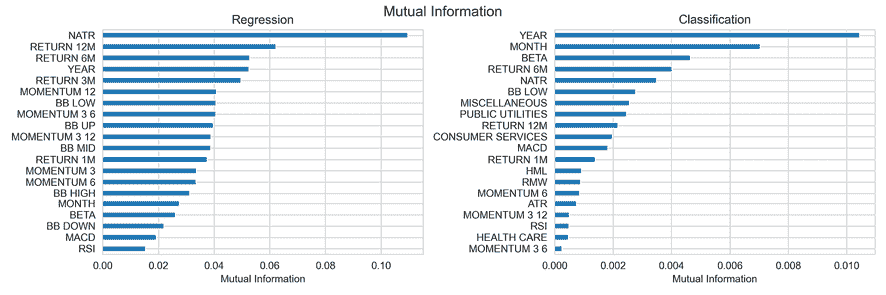

图 11.2：特征与收益或价格变动方向的互信息

### 使用时间序列数据构建回归树

回归树根据分配给给定节点的训练样本的平均结果值进行预测，并且通常依靠平均平方误差在递归二进制分割过程中选择最佳规则。

给定一个训练集，算法在*p*个预测变量 *X*[1]、*X*[2]、...、*X*[p] 和*n*个可能的切分点 *s*[1]、*s*[2]、...、*s*[n] 上进行迭代，以找到最佳组合。最佳规则将特征空间分割成两个区域，{*X*|*X*[i] < *s*[j]} 和 {*X*|*X*[i] > *s*[j]}，其中 *X*[i] 特征的值要么在 *s*[j] 阈值以下，要么在 *s*[j] 阈值以上，以便基于训练子集的预测最大程度地减少相对于当前节点的平方残差。

让我们从一个简化的示例开始，以便进行可视化，并演示如何使用时间序列数据与决策树。我们将只使用 2 个月的滞后回报来预测以下月份，与前一章中的 AR(2) 模型类似：

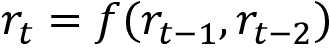

使用 scikit-learn，配置和训练回归树非常简单：

```py
from sklearn.tree import DecisionTreeRegressor
# configure regression tree
regression_tree = DecisionTreeRegressor(criterion='mse',      
                                        max_depth=6,         
                                        min_samples_leaf=50)
# Create training data
y = data.target
X = data.drop(target, axis=1)
X2 = X.loc[:, ['t-1', 't-2']]
# fit model
regression_tree.fit(X=X2, y=y)
# fit OLS model
ols_model = sm.OLS(endog=y, exog=sm.add_constant(X2)).fit() 
```

OLS 摘要和决策树前两个层级的可视化展示了模型之间的显著差异（见 *图 11.3*）。OLS 模型提供了三个参数，分别为截距和两个特征，符合该模型对函数的线性假设。

相反，回归树图表显示了前两个层级的每个节点使用的特征和阈值来拆分数据（请注意特征可以重复使用），以及**均方误差（MSE）**、样本数量和基于这些训练样本的预测值的当前值。此外，请注意，与线性回归的 66 微秒相比，训练决策树需要 58 毫秒。虽然两种模型在只有两个特征时运行速度很快，但差异是 1,000 倍：

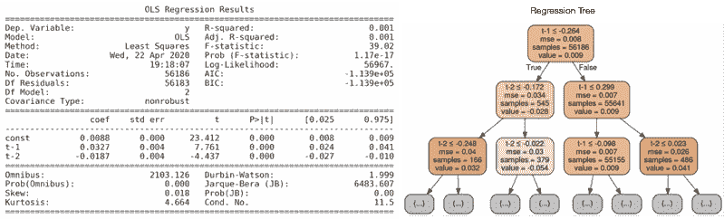

图 11.3：OLS 结果和回归树

树状图还突出显示了节点间样本分布的不均匀性，因为在第一个分割之后，样本数量在 545 到 55,000 之间变化。

为了进一步说明输入变量和输出之间的不同假设关系的功能形式，我们可以将当前回报预测可视化为特征空间的函数，即基于滞后回报值的值范围的函数。下图显示了线性回归（左侧面板）和回归树的当前月回报与一段时间前回报之间的关系：

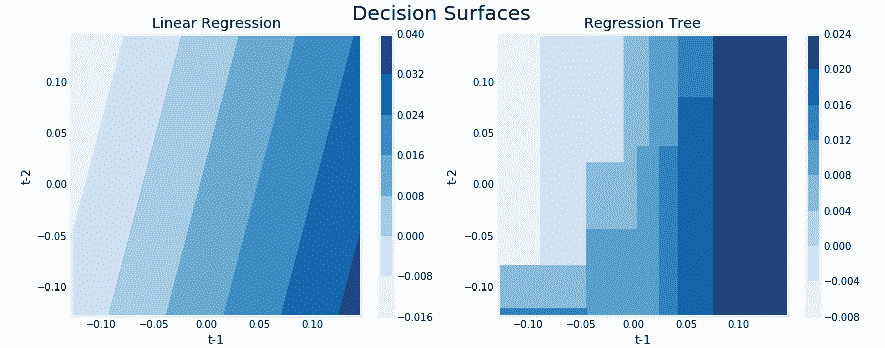

图 11.4：线性回归和回归树的决策表面

左侧的线性回归模型结果强调了滞后和当前回报之间关系的线性性，而右侧的回归树图表则说明了特征空间的递归分区中编码的非线性关系。

### 构建分类树

分类树的工作方式与回归版本相同，只是结果的分类性质需要不同的方法来进行预测和衡量损失。虽然回归树使用相关训练样本的平均结果来预测分配给叶节点的观测值的响应，但是分类树使用模式，即相关区域内训练样本中最常见的类别。分类树还可以基于相对类频率生成概率预测。

#### 如何优化节点纯度

在构建分类树时，我们也使用递归二元拆分，但是我们不是使用减少均方误差来评估决策规则的质量，而是可以使用**分类错误率**，它简单地是给定（叶）节点中不属于最常见类别的训练样本的比例。

然而，更倾向于使用**基尼不纯度**或**交叉熵**等替代度量方法，因为它们对节点纯度的敏感性比分类错误率更高，正如您在*图 11.5*中所见。**节点纯度**指的是节点中单个类别占优势的程度。一个只包含属于单个类别结果的样本的节点是纯净的，并且意味着在特征空间的这个特定区域的成功分类。

看看如何计算具有*K*类别 0,1,...,*K*-1（在二进制情况下为*K*=2）的分类结果的这些度量值。对于给定的节点*m*，让*p*[mk]为来自*k*^(th)类的样本比例：

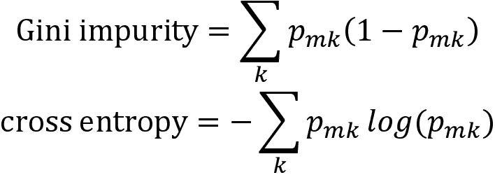

下图显示了当类别比例均匀时（在二进制情况下为 0.5），基尼不纯度和交叉熵度量在[0,1]区间内达到最大值。当类别比例接近零或一时，这些度量值会下降，并且由于拆分而导致的子节点趋向纯净。与此同时，它们对节点不纯度的惩罚比分类错误率更高：

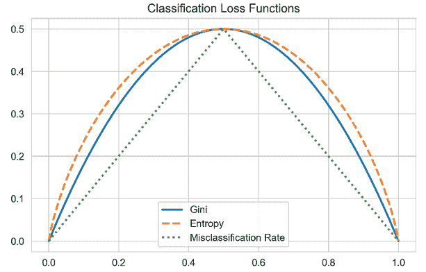

图 11.5：分类损失函数

请注意，与基尼测度相比，交叉熵的计算时间几乎要长 20 倍（详见笔记本中的详情）。

#### 如何训练分类树

现在我们将使用 80%的样本进行训练，预测剩余的 20%来训练、可视化和评估一个最多进行五次连续拆分的分类树。为了简化说明，我们将采用一种捷径并使用内置的`train_test_split`，它不会防止前瞻偏差，就像我们在*第六章*——*机器学习过程*中介绍的自定义`MultipleTimeSeriesCV`迭代器一样，稍后我们将在本章中使用。

树的配置意味着最多有 2⁵=32 个叶节点，平衡情况下平均会包含超过 1,400 个训练样本。看一下下面的代码：

```py
# randomize train-test split
X_train, X_test, y_train, y_test = train_test_split(X, y_binary, test_size=0.2, random_state=42)
# configure & train tree learner
clf = DecisionTreeClassifier(criterion='gini',
                            max_depth=5,
                            random_state=42)
clf.fit(X=X_train, y=y_train)
# Output:
DecisionTreeClassifier(class_weight=None, criterion='gini', max_depth=5,
            max_features=None, max_leaf_nodes=None,
            min_impurity_decrease=0.0, min_impurity_split=None,
            min_samples_leaf=1, min_samples_split=2,
            min_weight_fraction_leaf=0.0, presort=False, random_state=42,
            splitter='best') 
```

训练模型后的输出显示了所有`DecisionTreeClassifier`的参数。我们将在*超参数调整*部分详细讨论这些。

### 可视化决策树

您可以使用 Graphviz 库（请参阅 GitHub 安装说明）来可视化树，因为 scikit-learn 可以输出使用该库使用的 DOT 语言描述的树的描述。您可以配置输出以包括特征和类标签，并限制级别的数量以使图表可读，如下所示：

```py
dot_data = export_graphviz(classifier,
                           out_file=None, # save to file and convert to png
                           feature_names=X.columns,
                           class_names=['Down', 'Up'],
                           max_depth=3,
                           filled=True,
                           rounded=True,
                           special_characters=True)
graphviz.Source(dot_data) 
```

下图显示了模型如何使用不同的特征，并指示了连续和分类（虚拟）变量的分裂规则。在每个节点的标签值下，图表显示了来自每个类的样本数量，并在类标签下显示了最常见的类（在样本期间上涨的月份更多）：

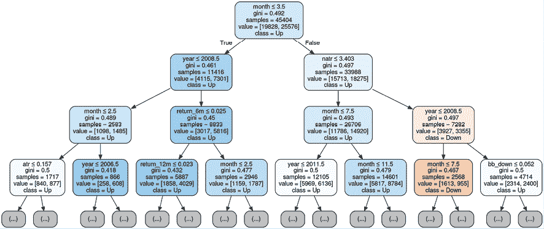

图 11.6：分类树的可视化

### 评估决策树预测

为了评估我们第一个分类树的预测准确度，我们将使用测试集生成预测的类概率，如下所示：

```py
# only keep probabilities for pos. class
y_score = classifier.predict_proba(X=X_test)[:, 1] 
```

`.predict_proba()`方法为每个类别生成一个概率。在二元类别中，这些概率是互补的并总和为 1，因此我们只需要正类的值。为了评估泛化误差，我们将使用基于接收器操作特征的曲线下面积，我们在*第六章*，*机器学习过程*中介绍过。结果表明，相对于随机预测的基准值 0.5，有了显著的改进（但请记住，这里的交叉验证方法不考虑数据的时间序列性）：

```py
roc_auc_score(y_score=y_score, y_true=y_test)
0.6341 
```

## 过拟合和正则化

决策树在数据集相对于样本数量具有大量特征时很容易过拟合。正如前几章讨论的那样，过拟合会增加预测误差，因为模型不仅学习了训练数据中包含的信号，还学习了噪音。

有多种方法可以**解决过拟合的风险**，包括：

+   **降维**（请参阅*第十三章*，*使用无监督学习的数据驱动风险因子和资产配置*）通过用更少、更具信息性和更少噪声的特征表示现有特征来改善特征与样本的比率。

+   **集成模型**，例如随机森林，结合了多个树，同时随机化树的构建，我们将在本章的第二部分中看到。

决策树提供了几个正则化超参数来限制树的增长和相关复杂度。虽然每次分裂都会增加节点数，但也会减少每个节点可用于支持预测的样本数量。对于每个额外的层级，需要两倍数量的样本才能使新节点以相同的样本密度填充。

**树修剪**是减少树复杂性的另一种工具。它通过消除添加了很少价值但增加了模型方差的节点或整个树的部分来实现。例如，成本复杂度修剪从一个大树开始，并通过将节点替换为叶子来递归地减小其大小，本质上是反向运行树构建。各种步骤产生一系列树，然后可以使用交叉验证来选择理想的大小。

### 如何规范化决策树

以下表格列出了 scikit-learn 决策树实现中用于此目的的关键参数。在介绍了最重要的参数后，我们将说明如何使用交叉验证来优化超参数设置，以便在偏差-方差权衡和降低预测误差方面：

| 参数 | 描述 | 默认 | 选项 |
| --- | --- | --- | --- |
| `max_depth` | 最大级别数：分割节点直到达到`max_depth`。所有叶子都是纯的，或者包含的样本少于`min_samples_split`。 | None | int |
| `max_features` | 考虑用于分割的特征数量。 | None | None：所有特征 `int`：＃ 特征`float`：分数`auto`，`sqrt`：sqrt（`n_features`）`log2`：log2（`n_features`） |
| `max_leaf_nodes` | 分割节点直到创建这么多叶子。 | None | None：无限 `int` |
| `min_impurity_decrease` | 如果不纯度减少至少这个值，则分割节点。 | 0 | `float` |
| `min_samples_leaf` | 只有在左右分支的每个中至少有`min_samples_leaf`训练样本时，才会考虑分割。 | 1 | `int`;`float`（作为百分比*N*） |
| `min_samples_split` | 分割内部节点所需的最小样本数。 | 2 | `int`；`float`（百分之*N*） |
| `min_weight_fraction_leaf` | 在叶子节点上需要的所有样本权重的最小加权分数。除非在拟合方法中提供了`sample_weight`，否则样本具有相同的权重。 | 0 |  |

`max_depth` 参数对连续分割的次数施加了硬限制，并代表了限制树生长的最直接方式。

`min_samples_split` 和 `min_samples_leaf` 参数是另一种基于数据的方法来限制树的生长。与对连续分割的次数施加硬限制不同，这些参数控制进一步分割数据所需的最小样本数。后者保证了每个叶子的一定样本数量，而前者在分割导致非常不均匀的分布时可能会创建非常小的叶子。较小的参数值有助于过拟合，而较高的数字可能会阻止树学习数据中的信号。默认值通常相当低，您应该使用交叉验证来探索一系列潜在值。您还可以使用浮点数来表示百分比，而不是绝对数字。

scikit-learn 文档中包含有关如何在不同用例中使用各种参数的其他详细信息；有关更多信息，请参阅 GitHub 上链接的资源。

### 决策树修剪

递归二元分裂很可能会在训练集上产生良好的预测结果，但往往会导致数据过度拟合，产生较差的泛化性能。这是因为它导致了过于复杂的树，这在大量叶节点或特征空间的划分中反映出来。较少的分裂和叶节点意味着总体较小的树，并且通常会导致更好的预测性能，以及可解释性。

限制叶节点数量的一种方法是除非它们产生目标度量的显着改善，否则避免进一步分裂。然而，这种策略的缺点是，有时候，导致小幅改善的分裂在样本组成不断变化时会使后续更有价值的分裂变得更加困难。

相比之下，树修剪首先通过生长一个非常大的树，然后移除或修剪节点，以将大树减小为一个较少复杂且过度拟合的子树。成本复杂度修剪通过对向树模型添加叶节点增加惩罚并引入正则化参数来生成一系列子树，类似于套索和岭线性回归模型，调节惩罚的影响。应用于大树，增加的惩罚将自动产生一系列子树。可以使用正则化参数的交叉验证来识别最佳的修剪子树。

这种方法是在 scikit-learn 版本 0.22 中引入的；有关各种方法的工作原理和性能，请参见 Esposito 等人(1997)的调查。

## 超参数调整

决策树提供了一系列超参数来控制和调整训练结果。交叉验证是获得对泛化误差的无偏估计的最重要工具，反过来又允许在各种配置选项之间做出明智选择。scikit-learn 提供了几个工具来简化交叉验证大量参数设置的过程，即我们将在下一节中介绍的`GridSearchCV`便利类。学习曲线还允许进行诊断，评估收集额外数据以减少泛化误差的潜在好处。

### 使用自定义度量标准的 GridsearchCV

如*第六章*，*机器学习流程*中所强调的，scikit-learn 提供了一种定义多个超参数值范围的方法。它自动化了交叉验证各种参数值组合的过程，以确定最佳配置。让我们逐步了解自动调整模型的过程。

第一步是实例化一个模型对象，并定义一个字典，其中关键词命名超参数，值列出要测试的参数设置：

```py
reg_tree = DecisionTreeRegressor(random_state=42)
param_grid = {'max_depth': [2, 3, 4, 5, 6, 7, 8, 10, 12, 15],
              'min_samples_leaf': [5, 25, 50, 100],
              'max_features': ['sqrt', 'auto']} 
```

然后，实例化`GridSearchCV`对象，提供估算器对象和参数网格，以及评分方法和交叉验证选择，传递给初始化方法。

我们将自定义的`MultipleTimeSeriesSplit`类设置为对模型进行 60 个月或 5 年的数据训练，并使用随后的 6 个月验证性能，重复此过程 10 次以覆盖 5 年的样本外期间：

```py
cv = MultipleTimeSeriesCV(n_splits=10,
                          train_period_length=60,
                          test_period_length=6,
                          lookahead=1) 
```

我们使用`roc_auc`指标对分类器进行评分，并使用 scikit-learn 的`make_scorer`函数为回归模型定义自定义信息系数（IC）指标：

```py
def rank_correl(y, y_pred):
    return spearmanr(y, y_pred)[0]
ic = make_scorer(rank_correl) 
```

我们可以使用`n_jobs`参数并通过设置`refit=True`自动获取使用最佳超参数的训练模型。

所有设置都已就绪后，我们可以像任何其他模型一样拟合`GridSearchCV`：

```py
gridsearch_reg = GridSearchCV(estimator=reg_tree,
                          param_grid=param_grid,
                          scoring=ic,
                          n_jobs=-1,
                          cv=cv,  # custom MultipleTimeSeriesSplit
                          refit=True,
                          return_train_score=True)
gridsearch_reg.fit(X=X, y=y) 
```

训练过程为我们的`GridSearchCV`对象生成了一些新的属性，最重要的是有关最佳设置和最佳交叉验证分数的信息（现在使用适当的设置，避免了前瞻偏差）。

以下表格分别列出了最佳回归模型和分类模型的参数和分数。具有更浅的树和更加正则化的叶节点，回归树的 IC 为 0.083，而分类器的 AUC 得分为 0.525：

| 参数 | 回归 | 分类 |
| --- | --- | --- |
| **max_depth** | 6 | 12 |
| **max_features** | sqrt | sqrt |
| **min_samples_leaf** | 50 | 5 |
| **分数** | 0.0829 | 0.5250 |

自动化非常方便，但我们也希望检查性能如何随不同参数值的变化而变化。完成此过程后，`GridSearchCV`对象提供了详细的交叉验证结果，以便我们可以获得更多见解。

### 如何检查树结构

该笔记本还说明了如何手动运行交叉验证以获取自定义树属性，例如与某些超参数设置相关联的总节点数或叶节点数。以下函数访问内部的`.tree_ 属性`以检索有关总节点计数以及其中多少个节点是叶节点的信息：

```py
def get_leaves_count(tree):
    t = tree.tree_
    n = t.node_count
    leaves = len([i for i in range(t.node_count) if t.children_left[i]== -1])
    return leaves 
```

我们可以将此信息与训练和测试分数结合起来，以获取有关模型在整个交叉验证过程中行为的详细知识，如下所示：

```py
train_scores, val_scores, leaves = {}, {}, {}
for max_depth in range(1, 26):
    print(max_depth, end=' ', flush=True)
    clf = DecisionTreeClassifier(criterion='gini', 
                                 max_depth=max_depth,
                                 min_samples_leaf=10,
                                 max_features='auto',
                                 random_state=42)
    train_scores[max_depth], val_scores[max_depth] = [], [] 
    leaves[max_depth] = []
    for train_idx, test_idx in cv.split(X):
        X_train, = X.iloc[train_idx], 
        y_train  = y_binary.iloc[train_ idx]
        X_test, y_test = X.iloc[test_idx], y_binary.iloc[test_idx]
        clf.fit(X=X_train, y=y_train)
        train_pred = clf.predict_proba(X=X_train)[:, 1]
        train_score = roc_auc_score(y_score=train_pred, y_true=y_train)
        train_scores[max_depth].append(train_score)
        test_pred = clf.predict_proba(X=X_test)[:, 1]
        val_score = roc_auc_score(y_score=test_pred, y_true=y_test)
        val_scores[max_depth].append(val_score)    
        leaves[max_depth].append(get_leaves_count(clf)) 
```

以下图表显示了叶节点数随树深度增加而增加的情况。由于每个交叉验证折叠的样本大小为 60 个月，每个样本约包含 500 个数据点，因此将`min_samples_leaf`限制为 10 个样本时，叶节点数限制在约 3,000 个：

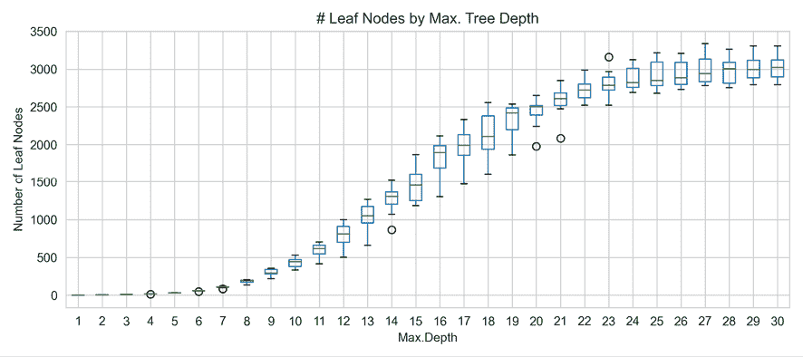

图 11.7：分类树的可视化

### 比较回归和分类的性能

为了更仔细地观察模型的性能，我们将展示各种深度的交叉验证性能，同时保持产生最佳网格搜索结果的其他参数设置。*图 11.8*显示了训练和验证分数，并突出了更深的树的过拟合程度。这是因为训练分数稳步增加，而验证性能保持不变或下降。

请注意，对于分类树，网格搜索建议使用 12 个级别以获得最佳预测准确性。然而，图表显示较简单的树（具有三个或七个级别）的 AUC 得分相似。我们更倾向于一个更浅的树，它承诺具有可比较的泛化性能，同时减少了过拟合的风险：

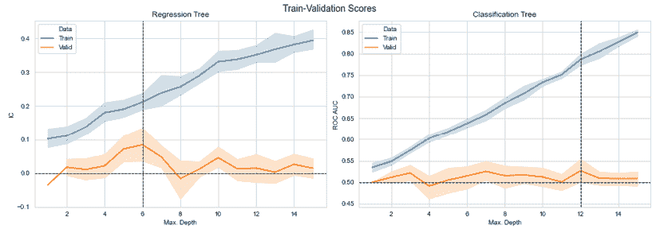

图 11.8：两个模型的训练和验证分数

### 使用学习曲线诊断训练集规模

**学习曲线**是一种有用的工具，显示了随着训练样本数量增加，验证和训练分数如何演变。

学习曲线的目的是找出模型在训练过程中是否以及在多大程度上会受益于使用更多数据。它还有助于诊断模型的泛化误差更可能是由偏差还是方差驱动。

如果训练分数符合预期的性能，并且随着训练样本数量的增加，验证分数表现出显著改善，那么训练更长的回溯期或获取更多数据可能会增加价值。另一方面，如果尽管训练集大小增加，但验证分数和训练分数都收敛到类似较差的值，则错误更可能是由于偏差，并且额外的训练数据不太可能有所帮助。

以下图片显示了最佳回归和分类模型的学习曲线：

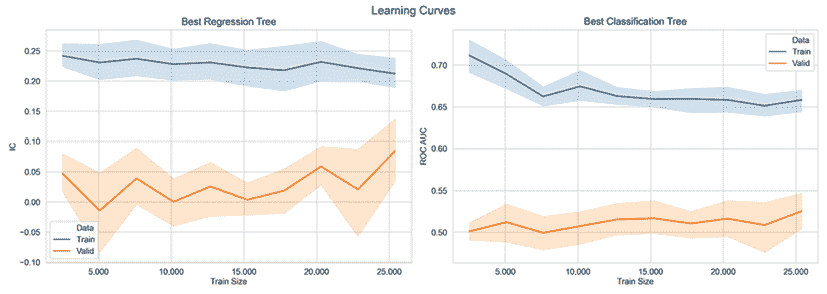

图 11.9：每个模型最佳版本的学习曲线

特别是对于回归模型，随着训练集规模的扩大，验证性能有所提高。这表明延长训练周期可能会产生更好的结果。你可以自己试一试，看看是否奏效！

### 从特征重要性中获得洞察力

决策树不仅可以可视化以检查给定特征的决策路径，还可以总结每个特征对模型学习以拟合训练数据的规则的贡献。

特征重要性捕捉到每个特征产生的分裂如何帮助优化模型用于评估分裂质量的度量，我们的情况下是基尼不纯度。特征的重要性是计算为这个度量的（标准化的）总减少，并考虑到受分裂影响的样本数量。因此，在树的较早节点使用的特征，其中节点往往包含更多的样本，通常被认为是更重要的。

*图 11.10* 显示了每个模型前 15 个特征的特征重要性的图表。注意特征的顺序如何与本节开头给出的互信息分数的单变量评估不同。显然，决策树捕获时间段与其他特征之间的相互依赖关系的能力可能改变每个特征的价值：

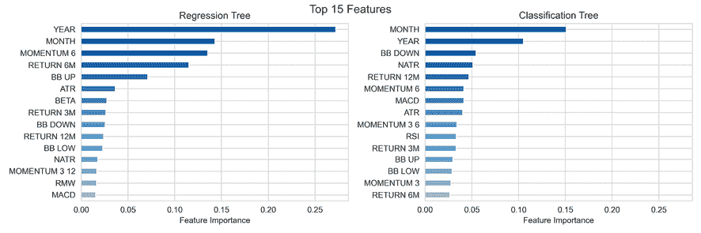

图 11.10：最佳回归和分类模型的特征重要性

### 决策树的优势和劣势

回归树和分类树在预测方面与我们在前几章中探讨过的线性模型有着非常不同的方法。如何**决定哪种模型更适合**当前的问题？考虑以下内容：

+   如果结果与特征之间的关系大致是线性的（或可以相应地转换），那么线性回归可能会胜过更复杂的方法，例如不利用这种线性结构的决策树。

+   如果关系呈现高度非线性和更复杂，决策树可能会胜过传统模型。请记住，关系的复杂性需要是系统的或“真实的”，而不是由噪声驱动，这会导致更复杂的模型过拟合。

决策树具有几个**优点**：

+   它们相当容易理解和解释，尤其是因为它们可以很容易地可视化，因此更容易让非技术人员理解。决策树也被称为白盒模型，因为它们在如何得出预测方面具有高度透明性。黑盒模型，例如集成和神经网络，可能会提供更好的预测精度，但是决策逻辑往往更难理解和解释。

+   决策树比那些对数据做出更强假设或对异常值更敏感且需要数据标准化的模型需要更少的数据准备（例如正则化回归）。

+   一些决策树实现可以处理分类输入，不需要创建虚拟变量（提高内存效率），并且可以处理缺失值，正如我们将在 *第十二章*，*提升您的交易策略* 中看到的，但这不适用于 scikit-learn。

+   预测速度很快，因为它与叶节点的数量呈对数关系（除非树变得极不平衡）。

+   可以使用统计测试验证模型并考虑其可靠性（有关更多细节，请参阅参考文献）。

决策树还具有几个关键**劣势**：

+   决策树内置了对训练集的过度拟合的倾向，并产生了高的泛化误差。解决这一弱点的关键步骤是修剪和正则化，使用限制树生长的早停准则，如本节所述。

+   决策树还对不平衡类权重敏感，可能会产生偏向某一类的树。一种选择是对少数类进行过采样或对更频繁出现的类进行欠采样。通常更好的选择是使用类权重并直接调整目标函数。

+   决策树的高方差与它们密切适应训练集的能力有关。因此，数据中的细微变化可能会导致树结构和模型预测的广泛波动。一个关键的预防机制是使用一组具有低偏差且产生不相关预测误差的随机决策树的集成。

+   决策树学习的贪婪方法优化了减少当前节点预测误差的局部标准，并不保证全局最优结果。同样，由随机树组成的集成有助于缓解这个问题。

我们现在将转向缓解决策树使用时固有的过拟合风险的集成方法。

# 随机森林——使树更可靠

决策树不仅因其透明度和解释性而有用。它们也是更强大的集成模型的基本构建模块，这些模型组合了许多个体树，同时随机变化其设计，以解决我们刚刚讨论的过拟合问题。

## 为什么集成模型表现更好

集成学习涉及将几个机器学习模型组合成一个新的模型，旨在比任何单个模型做出更好的预测。更具体地说，集成整合了几个基本估计器的预测，这些估计器使用一个或多个学习算法进行训练，以减少它们自己产生的泛化误差。

为了使集成学习达到这个目标，**个体模型必须是**：

+   **准确**: 胜过一个简单的基线（例如样本平均值或类比例）

+   **独立**: 预测是通过不同的方式产生的，以产生不同的误差

集成方法是最成功的机器学习算法之一，特别适用于标准的数值数据。大型集成在机器学习竞赛中非常成功，可能由许多不同的个体模型组成，这些模型已经手工组合或使用另一个机器学习算法组合起来。

将不同模型的预测组合起来存在几个缺点。这些包括降低了解释性以及训练、预测和模型维护的复杂性和成本。因此，在实践中（不考虑竞赛），从大规模集成中获得的准确度微小增益可能不值得额外的成本。

根据它们如何优化组成模型然后将结果集成为单个集成预测，通常可以区分两组集成方法：

+   **平均方法**独立地训练多个基本估计器，然后对它们的预测进行平均。如果基本模型没有偏差，并且产生不高度相关的不同预测误差，那么合并的预测可能具有较低的方差，更可靠。这类似于从具有不相关回报的资产构建组合以减少波动性而不牺牲回报。

+   **提升方法**相反，按顺序训练基本估计器，其特定目标是减少组合估计器的偏差。其动机是将几个弱模型组合成一个强大的集成。

在本章的剩余部分我们将专注于自动平均方法，而在*第十二章*《提升你的交易策略》中关注提升方法。

## 自助聚合

我们发现决策树很可能由于高方差而做出糟糕的预测，这意味着树结构对可用训练样本非常敏感。我们还看到，方差较低的模型，如线性回归，产生类似的估计值，尽管训练样本不同，只要给定特征数足够多。

对于给定一组独立观察值，每个观察值的方差为 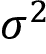，样本均值的标准误差由 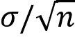 给出。换句话说，对更大的观察集进行平均会减小方差。因此，减少模型方差和泛化误差的一种自然方法是从总体中收集许多训练集，在每个数据集上训练不同的模型，然后对结果预测进行平均。

在实践中，我们通常没有许多不同的训练集。这就是**装袋法**的用武之地，即**自助聚合**。装袋法是一种通用方法，用于降低机器学习模型的方差，当应用于决策树时特别有用且受欢迎。

我们将首先解释这种技术如何缓解过拟合，然后展示如何将其应用于决策树。

### 如何通过装袋法降低模型的方差

装袋指的是自助采样的聚合，这些自助采样是带替换的随机采样。这样的随机样本与原始数据集具有相同数量的观察值，但由于替换可能包含重复观察值。

装袋法提高了预测准确性，但降低了模型的可解释性，因为不再能够可视化树以了解每个特征的重要性。作为一个集成算法，装袋方法在这些自助采样样本上训练给定数量的基本估计器，然后将它们的预测聚合成最终的集成预测。

装袋法通过以下方式降低基本估计器的方差，从而降低它们的泛化误差：

1.  随机化每棵树的生长方式

1.  对它们的预测进行平均

这通常是一种简单的方法来改进给定模型，而无需更改基础算法。这种技术对于具有低偏差和高方差的**复杂模型**特别有效，例如深层次的决策树，因为其目标是限制过拟合。相比之下，提升方法在弱模型（例如浅决策树）上效果最佳。

有几种 bagging 方法的不同之处在于它们应用于训练集的随机抽样过程：

+   **粘贴**从训练数据中无替换地随机抽取样本，而 bagging 则使用替换抽样。

+   **随机子空间**随机从特征（即列）中抽取样本，不进行替换。

+   **随机补丁**通过随机抽样观察值和特征来训练基本估算器。

### Bagged 决策树

要将 bagging 应用于决策树，我们通过反复抽样替换来创建从训练数据中生成 bootstrap 样本。然后，我们在每个样本上训练一个决策树，并通过对不同树的预测进行平均来创建一个集成预测。您可以在笔记本`bagged_decision_trees`中找到此示例的代码，除非另有说明。

Bagged 决策树通常生长较大，即它们具有许多层和叶子节点，并且不进行修剪，以使每棵树的偏差低而方差高。然后，对其预测进行平均的效果旨在减少其方差。通过构建在 bootstrap 样本上训练的数百甚至数千棵树的集成，已经证明了 bagging 能够显著提高预测性能。

要说明 bagging 对回归树方差的影响，我们可以使用 scikit-learn 提供的`BaggingRegressor`元估计器。它基于指定抽样策略的参数来训练用户定义的基础估算器。

+   `max_samples`和`max_features`分别控制从行和列中绘制的子集的大小。

+   `bootstrap`和`bootstrap_features`确定是否使用或不使用替换来绘制这些样本。

以下示例使用指数函数生成单个`DecisionTreeRegressor`和由 10 棵树组成的`BaggingRegressor`集成的训练样本，每棵树都生长了 10 层深度。这两个模型都在随机样本上进行训练，并为添加了噪声的实际函数预测结果。

由于我们知道真实函数，因此我们可以将均方误差分解为偏差、方差和噪声，并根据以下分解比较这些组件的相对大小：

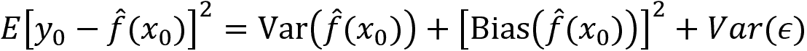

我们将分别从训练集和测试集中随机抽取 100 组样本，每组样本包括 250 个训练观察和 500 个测试观察，以训练每个模型并收集预测结果：

```py
noise = .5  # noise relative to std(y)
noise = y.std() * noise
X_test = choice(x, size=test_size, replace=False)
max_depth = 10
n_estimators=10
tree = DecisionTreeRegressor(max_depth=max_depth)
bagged_tree = BaggingRegressor(base_estimator=tree, n_estimators=n_estimators)
learners = {'Decision Tree': tree, 'Bagging Regressor': bagged_tree}
predictions = {k: pd.DataFrame() for k, v in learners.items()}
for i in range(reps):
    X_train = choice(x, train_size)
    y_train = f(X_train) + normal(scale=noise, size=train_size)
    for label, learner in learners.items():
        learner.fit(X=X_train.reshape(-1, 1), y=y_train)
        preds = pd.DataFrame({i: learner.predict(X_test.reshape(-1, 1))},
                              index=X_test)
        predictions[label] = pd.concat([predictions[label], preds], axis=1) 
```

对于每个模型，在*图 11.11*中显示的绘图如下：

+   平均预测值和平均值周围两个标准偏差的带状区间（上部面板）。

+   根据真实函数的值（底部面板），进行偏差-方差-噪声分解。

我们发现，个体决策树预测的方差（左侧）几乎是基于自助样本的小集成的两倍高：

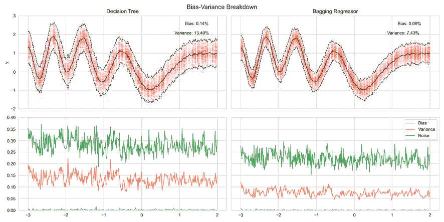

图 11.11：个体和袋装决策树的偏差-方差分解

请参阅笔记本 `bagged_decision_trees` 以获取实现细节。

## 如何构建随机森林

随机森林算法基于装袋引入的随机化来进一步减少方差并提高预测性能。

除了在自助训练数据上训练每个集合成员外，随机森林还会随机从模型中使用的特征中进行抽样（不重复）。根据实现方式，随机样本可以为每棵树或每次分裂进行抽取。因此，算法在学习新规则时面临不同选择，无论是在树的级别还是在每次分裂时。

特征的**样本大小**在回归和分类树之间有所不同：

+   对于**分类**，样本大小通常是特征数量的平方根。

+   对于**回归**，特征数量可以是从三分之一到所有特征，并且应基于交叉验证进行选择。

以下图表说明了随机森林如何随机化个体树的训练，然后将它们的预测汇总成集成预测：

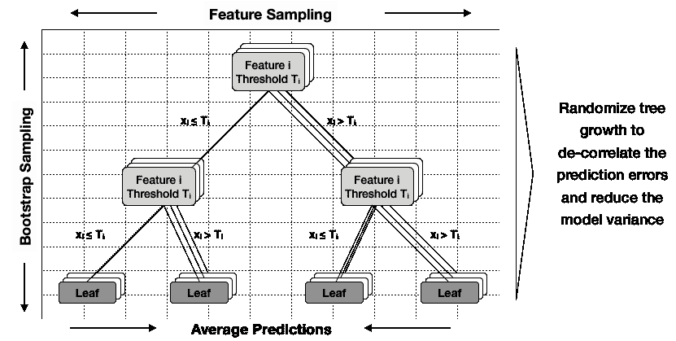

图 11.12：随机森林如何生长个体树

除了训练观察结果外，随机化特征的目标是进一步**使个体树的预测误差失相关**。所有特征并非同等重要，一小部分高度相关的特征将在树构建过程中更频繁且更早地被选择，使得整个集成中的决策树更加相似。然而，个体树的泛化误差之间的相关性越小，整体方差就会减小得越多。

## 如何训练和调整随机森林

关键的配置参数包括介绍的各个决策树的超参数，在*如何调整超参数*部分。以下表格列出了两个`RandomForest`类的其他选项：

| 关键字 | 默认值 | 描述 |
| --- | --- | --- |
| `bootstrap` | `TRUE` | 训练期间启用自助采样 |
| `n_estimators` | `10` | 森林中的树的数量 |
| `oob_score` | `FALSE` | 使用袋外样本来估计未见数据上的 R2 |

`bootstrap`参数激活了刚才描述的装袋算法。装袋又可以启用计算袋外得分（`oob_score`），该分数估计了未包括在用于训练给定树的自助样本中的样本的泛化准确性（请参阅*袋外测试*部分）。

参数`n_estimators`定义了作为森林一部分生长的树的数量。更大的森林表现更好，但也需要更长的时间来构建。重要的是随着基学习者数量的增加来监控交叉验证误差。目标是确定在训练额外的树的成本上升超过减少验证误差的好处的时候，或者后者开始再次增加的时候。

参数`max_features`控制在学习新决策规则并分割节点时可用的随机选择特征子集的大小。较低的值会降低树之间的相关性，从而减少集成的方差，但也可能增加偏差。正如本节开头所指出的，良好的起始值是回归问题的训练特征数量以及分类问题的这个数字的平方根，但会取决于特征之间的关系，并且应该使用交叉验证进行优化。

随机森林被设计为包含深度完全生长的树，可以使用`max_depth=None`和`min_samples_split=2`来创建。然而，这些值不一定是最优的，特别是对于具有许多样本和因此可能非常深的树的高维数据，可以变得非常计算和内存密集。

由 scikit-learn 提供的`RandomForest`类支持并行训练和预测，通过将`n_jobs`参数设置为要在不同核心上运行的*k*个作业数。值`-1`使用所有可用的核心。进程间通信的开销可能会限制速度提升呈线性增长，因此*k*个作业可能需要超过单个作业的 1/*k*时间。尽管如此，对于数据大、分裂评估变得昂贵的大型森林或深层个体树，速度提升通常是相当显著的。

始终应该使用交叉验证来识别最佳的参数配置。以下步骤说明了这个过程。本示例的代码在笔记本`random_forest_tuning`中。

我们将使用`GridSearchCV`来识别一组最佳参数，用于分类树的集成：

```py
rf_clf = RandomForestClassifier(n_estimators=100,
                                criterion='gini',
                                max_depth=None,
                                min_samples_split=2,
                                min_samples_leaf=1,
                                min_weight_fraction_leaf=0.0,
                                max_features='auto',
                                max_leaf_nodes=None,
                                min_impurity_decrease=0.0,
                                min_impurity_split=None,
                                bootstrap=True, oob_score=False,
                                n_jobs=-1, random_state=42) 
```

我们使用与以前决策树示例中相同的 10 折自定义交叉验证，并使用关键配置设置的值填充参数网格：

```py
cv = MultipleTimeSeriesCV(n_splits=10, train_period_length=60,
                          test_period_length=6, lookahead=1)
clf = RandomForestClassifier(random_state=42, n_jobs=-1)
param_grid = {'n_estimators': [50, 100, 250],
              'max_depth': [5, 15, None],
              'min_samples_leaf': [5, 25, 100]} 
```

使用上述内容配置`GridSearchCV`：

```py
gridsearch_clf = GridSearchCV(estimator=clf,
                              param_grid=param_grid,
                              scoring='roc_auc',
                              n_jobs=-1,
                              cv=cv,
                              refit=True,
                              return_train_score=True,
                              verbose=1) 
```

我们像以前一样运行网格搜索，并找到最佳的回归和分类模型的以下结果。与分类器相比，随机森林回归模型对较浅的树表现更好，但在其他方面使用相同的设置：

| Parameter | Regression | Classification |
| --- | --- | --- |
| max_depth | 5 | 15 |
| min_samples_leaf | 5 | 5 |
| n_estimators | 100 | 100 |
| Score | 0.0435 | 0.5205 |

然而，这两个模型都不及它们各自的单独决策树模型表现好，这凸显了在数据噪声较大且过拟合风险较高时，更复杂的模型并不一定优于更简单的方法。

## 随机森林的特征重要性

随机森林集成可能包含数百棵单独的树，但仍然可以从袋装模型中获得特征重要性的总体摘要指标。

对于给定的特征，**重要性评分**是由于对该特征进行拆分而导致的目标函数值的总减少量，并且在所有树上进行了平均。由于目标函数考虑了拆分影响的特征数量，因此在树的顶部附近使用的特征将获得较高的分数，因为更小数量的可用节点中包含了更多的观测数据。通过对以随机方式生长的许多树进行平均，特征重要性估计失去了一些方差，并变得更加准确。

分数以回归树的均方误差和分类树的基尼不纯度或熵来衡量。 scikit-learn 进一步规范化特征重要性，使其总和为 1。因此，计算得到的特征重要性也很受欢迎，作为特征选择的替代方法，与我们在*第六章*“机器学习流程”中看到的互信息度量相比（参见 `sklearn.feature_selection` 模块中的 `SelectFromModel`）。

*图 11.13*显示了两个模型的前 15 个特征的值。回归模型更依赖于时间段，而性能更好的决策树：

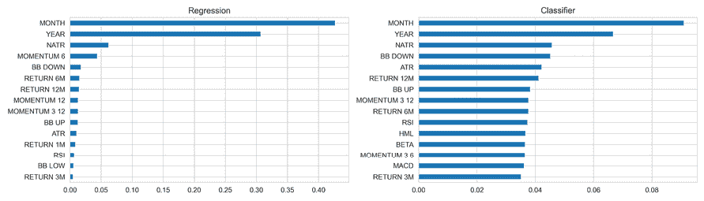

图 11.13：随机森林特征重要性

## 袋外测试

随机森林提供了内置交叉验证的好处，因为个别树是在训练数据的自助版本上训练的。因此，每棵树平均只使用了可用观测数据的三分之二。为了理解原因，考虑到自助样本的大小与原始样本相同，每个观测数据被抽取的概率是相同的，即 1/*n*。因此，根本不进入自助样本的概率是(1-1/*n*)*n*，它迅速收敛到 1/*e*，或者大约三分之一。

这剩余的三分之一未包含在训练集中的观测数据用于生成一个称为**袋外** (**OOB**) 观测数据的装袋树，并可以作为验证集。正如交叉验证一样，我们为每棵树构建的不包含此观测数据的装袋样本预测响应，然后对每个 OOB 样本的单个集成预测进行平均（如果回归是目标，则为预测响应的平均值，如果分类是目标，则为多数投票或预测概率）。这些预测产生了对泛化误差的无偏估计，方便在训练期间计算。

由此产生的 OOB 误差是对该观测的泛化误差的有效估计。这是因为预测是使用在缺乏该观测时学到的决策规则产生的。一旦随机森林足够大，OOB 误差会接近于留一交叉验证误差。对于大型数据集，OOB 方法估计测试错误非常高效，而交叉验证可能计算成本很高。

然而，与交叉验证相同的警告适用：您需要注意避免“超前展望偏差”，如果 OOB 观测可以*无序*选择，则会发生这种偏差。在实践中，这使得在时间序列数据中使用 OOB 测试非常困难，因为验证集需要根据数据的顺序性选择。

## 随机森林的优缺点

袋装集成模型既有优点又有缺点。

随机森林的**优点**包括：

+   根据用例，随机森林可以与最佳监督学习算法表现相当。

+   随机森林提供可靠的特征重要性估计。

+   它们提供了测试错误的有效估计，而不会产生与交叉验证相关的重复模型训练成本。

另一方面，随机森林的**缺点**包括：

+   集成模型本质上比单个决策树不太可解释。

+   训练大量深树可能会产生高计算成本（但可以并行化）并使用大量内存。

+   预测速度较慢，这可能对需要低延迟的应用程序产生挑战。

现在让我们看看如何使用随机森林进行交易策略。

# 日本股票的多空信号

在*第九章*，*用于波动率预测和统计套利的时间序列模型*中，我们使用协整检验来识别具有长期均衡关系的股票对，其价格呈现共同趋势，并回归到该趋势。

在本章中，我们将利用机器学习模型的预测结果来识别可能上涨或下跌的资产，以便我们可以相应地进行市场中性的做多和做空操作。这种方法类似于我们最初的交易策略，该策略在*第七章*，*线性模型 - 从风险因素到收益预测*，以及*第八章*，*ML4T 工作流程 - 从模型到策略回测*中使用了线性回归。

我们将使用 LightGBM 软件包而不是 scikit-learn 随机森林实现，后者主要设计用于梯度增强。 LightGBM 的几个优点之一是其能够有效地将分类变量编码为数值特征，而不是使用独热编码（Fisher 1958）。我们将在下一章中提供更详细的介绍，但是代码示例应该很容易理解，因为逻辑与 scikit-learn 版本相似。

## 数据 - 日本股票

我们将设计一个关于日本股票宇宙的策略，使用由 Stooq 提供的数据，这是一家波兰数据提供商，目前提供了各种资产类别、市场和频率的有趣数据集，我们在 *第九章*，*用于波动率预测和统计套利的时间序列模型* 中也依赖了这些数据。

尽管关于数据的来源和质量几乎没有透明度，但它目前的免费使用具有强大的优势。换句话说，我们可以使用每日、每小时和每 5 分钟的股票、债券、商品和外汇数据进行实验，但应该对结果持谨慎态度。

本书 GitHub 存储库的 data 目录中的 `create_datasets` 笔记本包含了下载数据并将其存储为 HDF5 格式的说明。对于本例子，我们使用了 2010 年至 2019 年间约 3000 支日本股票的价格数据。最后的两年将作为样本外测试期，而之前的几年将作为我们的模型选择的交叉验证样本。

请参阅笔记本 `japanese_equity_features` 中的代码示例。我们移除了连续五个以上缺失值的股票代码，并仅保留了 1000 支交易量最高的股票。

### 特征 - 滞后回报和技术指标

我们会保持相对简单，将历史回报与 1、5、10、21 和 63 个交易日的几个技术指标结合起来，这些指标由 TA-Lib 提供（见*第四章*，*金融特征工程 - 如何研究阿尔法因子*）。

具体来说，我们为每支股票计算：

+   **百分比价格振荡器**（**PPO**）：是**移动平均线收敛/发散**（**MACD**）指标的归一化版本，用于衡量 14 天和 26 天指数移动平均线之间的差异，以捕捉不同资产间的动量差异。

+   **归一化平均真实波幅**（**NATR**）：以一种可比较各资产的方式来衡量价格波动。

+   **相对强度指数**（**RSI**）：另一个流行的动量指标（详见*第四章*，*金融特征工程 - 如何研究阿尔法因子*）。

+   **布林带**：移动平均线与移动标准差的比率，用于识别均值回归的机会。

我们还将包括标记以表示年、月和星期，以及根据每个交易日的六个间隔的最新回报对股票进行排名，排名从 1 到 20。

### 结果 - 不同视角的前瞻回报

为了测试随机森林在给定这些特征情况下的预测能力，我们生成了相同间隔的前瞻回报，最多到 21 个交易日（1 个月）。

历史和前瞻回报所暗示的滞后和领先导致了一些数据的丢失，该丢失随着投资视角的增加而增加。我们最终得到了 941 支股票的 18 个特征和 4 个结果的 230 万个观察值。

## 基于 LightGBM 的 ML4T 工作流程

现在我们将选择一个能产生可交易信号的随机森林模型。有几项研究已经成功地做到了，例如 Krauss、Do 和 Huck（2017）以及 Rasekhschaffe 和 Jones（2019）等，以及其中引用的资源。

我们将使用微软开源的快速且内存高效的 LightGBM 实现，它是最受欢迎的梯度提升方法，也是下一章节的主题，我们将更详细地了解各种 LightGBM 特性。

我们将从讨论关键实验设计决策开始，然后构建和评估一个预测模型，其信号将驱动我们将在最后一步设计和评估的交易策略。除非另有说明，请参考笔记本 `random_forest_return_signals` 中的代码示例。

### 从宇宙选择到超参数调整

要开发使用机器学习模型的交易策略，我们需要就模型的范围和设计做出几项决策，包括：

+   **回溯期**：用于训练的历史交易日数

+   **前瞻期**：预测收益的未来天数

+   **测试期间**：使用相同模型进行连续预测的天数

+   **超参数**：要评估的参数和配置

+   **集成**：是否依赖于单一模型或多个模型的组合

为了评估感兴趣的选项，我们还需要选择交叉验证的**宇宙**和**时间段**，以及一个样本外测试期和宇宙。更具体地说，我们在我们的日本股票样本的子集上交叉验证了截至 2017 年的几个选项。

一旦我们确定了一个模型，我们将定义交易规则，并在完整宇宙上过去两年的样本外使用我们模型的信号回测策略，以验证其性能。

对于时间序列交叉验证，我们将依赖于我们在*第七章*《线性模型 - 从风险因素到收益预测》中开发的 `MultipleTimeSeriesCV`，以对训练和测试期的长度进行参数化，同时避免前瞻性偏差。这个自定义的 CV 类允许我们：

+   对每个 ticker 进行连续包含 `train_length` 天的样本训练模型。

+   在后续包含 `test_length` 天和 `lookahead` 天数的期间内验证其性能，除了训练期外，以避免数据泄漏。

+   在每次将训练和验证期向前滚动 `test_length` 天时，重复 `n_splits` 次。

在本节中，我们将进行模型选择步骤，并在接下来的一节中进行策略回测。

### 对股票进行抽样以加快交叉验证的速度

训练随机森林所需的时间比线性回归要长得多，这取决于配置，树的数量和深度是主要驱动因素。

为了使我们的实验易于管理，我们将选择 2010-17 年期间交易量最大的 250 支股票，以评估不同结果和模型配置的性能，如下所示：

```py
DATA_DIR = Path('..', 'data')
prices = (pd.read_hdf(DATA_DIR / 'assets.h5', 'stooq/jp/tse/stocks/prices')
          .loc[idx[:, '2010': '2017'], :])
dollar_vol = prices.close.mul(prices.volume)
dollar_vol_rank = dollar_vol.groupby(level='date').rank(ascending=False)
universe = dollar_vol_rank.groupby(level='symbol').mean().nsmallest(250).index 
```

### 定义回顾、展望和向前滚动期间

运行我们的策略需要以滚动方式训练模型，使用一定数量的交易日（回顾期）从我们的宇宙中学习模型参数，并预测一定数量的未来日子的结果。在我们的示例中，我们将考虑在每次迭代期间进行 63、126、252、756 和 1,260 个交易日的训练，并向前滚动和预测 5、21 或 63 天。

我们将把参数配对成一个列表，以便轻松迭代和可选的采样和/或洗牌，如下所示：

```py
train_lengths = [1260, 756, 252, 126, 63]
test_lengths = [5, 21, 63]
test_params = list(product(train_lengths, test_lengths))
n = len(test_params)
test_param_sample = np.random.choice(list(range(n)), 
                                     size=int(n), 
                                     replace=False)
test_params = [test_params[i] for i in test_param_sample] 
```

### 使用 LightGBM 进行超参数调整

LightGBM 模型接受大量参数，如文档详细说明（参见[`lightgbm.readthedocs.io/`](https://lightgbm.readthedocs.io/)和下一章）。对于我们的目的，我们只需要通过定义`boosting_type`启用随机森林算法，将`bagging_freq`设置为正数，并将`objective`设置为`regression`：

```py
base_params = dict(boosting_type='rf',
                   objective='regression',
                   bagging_freq=1) 
```

接下来，我们选择最有可能影响预测准确性的超参数，即：

+   为模型生长的树的数量（`num_boost_round`）

+   用于装袋的行（`bagging_fraction`）和列（`feature_fraction`）的份额

+   在叶子中需要的最小样本数（`min_data_in_leaf`）以控制过拟合

LightGBM 的另一个好处是，我们可以评估训练模型的子集（或在一定数量的评估之后继续训练），这使我们能够在单个训练会话中测试多个`num_iteration`值。

或者，您可以启用`early_stopping`在验证集的损失指标不再改善时中断训练。但是，由于模型使用了在实际情况下不可用的结果信息，交叉验证性能估计将被偏向上。

我们将使用以下值来控制装袋方法和树生长的超参数：

```py
bagging_fraction_opts = [.5, .75, .95]
feature_fraction_opts = [.75, .95]
min_data_in_leaf_opts = [250, 500, 1000]
cv_params = list(product(bagging_fraction_opts,
                         feature_fraction_opts,
                         min_data_in_leaf_opts))
n_cv_params = len(cv_params) 
```

### 在各种视野上交叉验证信号

要评估给定一组超参数的模型，我们将使用回顾、展望和向前滚动期间生成预测。

首先，我们将识别分类变量，因为 LightGBM 不需要独热编码；而是根据结果对类别进行排序，这样对回归树的效果更好，根据费舍尔（1958 年）的说法。我们将创建变量来识别不同的时期：

```py
categoricals = ['year', 'weekday', 'month']
for feature in categoricals:
    data[feature] = pd.factorize(data[feature], sort=True)[0] 
```

为此，我们将创建二进制的 LightGBM 数据集，并使用给定的`train_length`和`test_length`配置`MultipleTimeSeriesCV`，这确定了我们 2 年验证期间的拆分数量：

```py
for train_length, test_length in test_params:
    n_splits = int(2 * YEAR / test_length)
    cv = MultipleTimeSeriesCV(n_splits=n_splits,
                              test_period_length=test_length,
                              lookahead=lookahead,
                              train_period_length=train_length)
    label = label_dict[lookahead]
    outcome_data = data.loc[:, features + [label]].dropna()
    lgb_data = lgb.Dataset(data=outcome_data.drop(label, axis=1),
                           label=outcome_data[label],
                           categorical_feature=categoricals,
                           free_raw_data=False) 
```

接下来，我们采取以下步骤：

1.  为这次迭代选择超参数。

1.  将我们刚刚创建的二进制 LightGM 数据集切分为训练集和测试集。

1.  训练模型。

1.  为一系列`num_iteration`设置生成验证集的预测：

    ```py
    for p, (bagging_fraction, feature_fraction, min_data_in_leaf) \
            in enumerate(cv_params_):
        params = base_params.copy()
        params.update(dict(bagging_fraction=bagging_fraction,
                           feature_fraction=feature_fraction,
                           min_data_in_leaf=min_data_in_leaf))
        start = time()
        cv_preds, nrounds = [], []
        for i, (train_idx, test_idx) in \
                enumerate(cv.split(X=outcome_data)):
            lgb_train = lgb_data.subset(train_idx.tolist()).construct()
            lgb_test = lgb_data.subset(test_idx.tolist()).construct()
            model = lgb.train(params=params,
                              train_set=lgb_train,
                              num_boost_round=num_boost_round,
                              verbose_eval=False)
            test_set = outcome_data.iloc[test_idx, :]
            X_test = test_set.loc[:, model.feature_name()]
            y_test = test_set.loc[:, label]
            y_pred = {str(n): model.predict(X_test, num_iteration=n)
                      for n in num_iterations}
            cv_preds.append(y_test.to_frame('y_test')
                            .assign(**y_pred).assign(i=i))
            nrounds.append(model.best_iteration) 
    ```

1.  为了评估验证性能，我们计算了完整预测集的 IC，以及每日的 IC，对一系列迭代次数进行了评估：

    ```py
    df = [by_day.apply(lambda x: spearmanr(x.y_test,
                                           x[str(n)])[0]).to_frame(n)
          for n in num_iterations]
    ic_by_day = pd.concat(df, axis=1)
    daily_ic.append(ic_by_day.assign(bagging_fraction=bagging_fraction,
                                     feature_fraction=feature_fraction,
                                     min_data_in_leaf=min_data_in_leaf))
    cv_ic = [spearmanr(cv_preds.y_test, cv_preds[str(n)])[0]
             for n in num_iterations]
    ic.append([bagging_fraction, feature_fraction,
               min_data_in_leaf, lookahead] + cv_ic) 
    ```

现在，我们需要评估预测的信号内容以选择我们的交易策略的模型。

### 分析交叉验证性能

首先，我们将查看各种训练和测试窗口以及各种超参数设置在所有超参数设置中的 IC 分布。然后，我们将更详细地研究超参数设置对模型预测准确性的影响。

#### 不同回溯、滚动向前和展望期的 IC

下图说明了每日平均 IC 的分布和分位数，针对四个预测时段和五个训练窗口，以及最佳的 21 天测试窗口。不幸的是，它并没有给出关于较短或较长窗口哪个效果更好的确切见解，而是说明了由于我们测试的模型配置范围以及由此产生的结果缺乏一致性而导致的数据噪声程度：

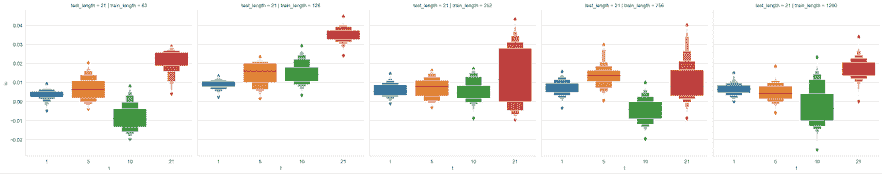

图 11.14：各种模型配置的每日平均信息系数的分布

#### 使用 OLS 回归分析随机森林配置参数

为了更详细地了解我们实验的参数如何影响结果，我们可以对这些参数在每日平均 IC 上进行 OLS 回归分析。*图 11.15*显示了 1 天和 5 天展望期的系数和置信区间。

所有变量都经过 one-hot 编码，并且可以相对于每个变量的最小类别进行解释，该最小类别由常数捕获。结果在不同时段间有所不同；对于 1 天的预测，最长的训练期效果最好，但对于 5 天的预测效果最差，没有明显的模式。较长的训练似乎在一定程度上改善了 1 天模型，但对于 5 天模型来说这一点不太明确。唯一比较一致的结果似乎表明较低的装袋分数和较高的最小样本设置：

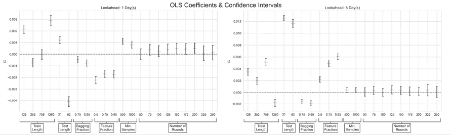

图 11.15：各种随机森林配置参数的 OLS 系数和置信区间

### 集成预测 - 使用 Alphalens 进行信号分析

最终，我们关心模型预测关于我们的投资范围和持有期的信号内容。为此，我们将使用 Alphalens 评估等权重组合投资于预测收益不同分位数产生的收益差异。

如*第四章*，*金融特征工程 - 如何研究 Alpha 因子*中讨论的那样，Alphalens 计算并可视化了各种摘要统计量，总结了 Alpha 因子的预测性能。笔记本`alphalens_signals_quality`说明了如何使用实用函数`get_clean_factor_and_forward_returns`将模型预测与价格数据以适当的格式结合起来。

为了解决 CV 预测中固有噪声的一些问题，我们根据其平均每日 IC 选择了前三个 1 天模型，并平均了它们的结果。

当我们将结果信号提供给 Alphalens 时，我们发现了以下结果，持续 1 天：

+   年化 alpha 为 0.081，beta 为 0.083

+   前五分位数收益之间的平均期间差距为 5.16 基点

以下图像可视化了按因子五分位数的平均期间收益和与每个分位数中的股票相关的累积每日正向收益：

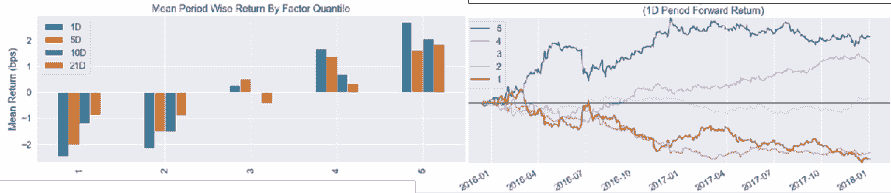

图 11.16：Alphalens 因子信号评估

上述图像显示，1 天预测似乎包含了基于前五分位数的收益差异的有用交易信号。我们现在将继续开发并回测一种策略，该策略使用了在验证期间产生了这些结果的前十个 1 天前瞻模型的预测。

## 策略 - 使用 Zipline 进行回测

要设计并使用 Zipline 回测交易策略，我们需要为测试期间的我们的股票池生成预测，摄入日本股票数据并将信号加载到 Zipline 中，设置一个 pipeline，并定义重新平衡规则以相应地触发交易。

### 将日本股票纳入 Zipline

我们遵循*第八章*，*ML4T 工作流程 - 从模型到策略回测*中描述的流程，将我们的 Stooq 股票 OHLCV 数据转换为 Zipline bundle。目录`custom_bundle`包含了创建资产 ID 和元数据的预处理模块，定义了一个执行繁重任务的摄入函数，并使用扩展注册了 bundle。

该文件夹包含一个带有额外说明的 `README`。

### 运行样本内外策略的回测

笔记本 `random_forest_return_signals` 显示了如何选择产生最佳验证 IC 性能的超参数，并相应地生成预测。

我们将使用我们的 1 天模型预测，并应用一些简单的逻辑：对于具有最高正预期收益和最低负预期收益的 25 个资产，我们将建立多头和空头头寸。只要每边至少有 15 个候选资产，我们每天都会交易，并清除所有不在当前最佳预测中的头寸。

这次，我们还将包括每股 $0.05 的小额交易佣金，但不会使用滑点，因为我们正在以相对较小的资本基础交易日本最流动的股票。

### 结果 - 使用 pyfolio 进行评估

*图 11.17*中的左侧面板显示了该策略相对于日经 225 指数的样本内（2016-17 年）和样本外（2018-19 年）表现，而日经 225 指数在整个时期基本持平。

该策略在样本内年化基础上获得了 10.4%的收益率，在样本外年化基础上获得了 5.5%的收益率。

右侧面板显示了 3 个月滚动夏普比率，在样本内达到 0.96，在样本外达到 0.61：

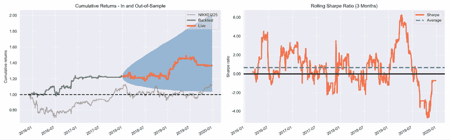

图 11.17：Pyfolio 策略评估

总体表现统计数据突显了交易成本（每股 0.05 美分）后的 36.6%累计收益率，意味着样本外 Alpha 为 0.06，Beta 为 0.08（相对于日经 225 指数）。样本内最大回撤为 11.0%，样本外最大回撤为 8.7%。

|  | 全部 | 样本内 | 样本外 |
| --- | --- | --- | --- |
| # 月份 | 48 | 25 | 23 |
| 年化收益率 | 8.00% | 10.40% | 5.50% |
| 累积收益率 | 36.60% | 22.80% | 11.20% |
| 年化波动率 | 10.20% | 10.90% | 9.60% |
| 夏普比率 | 0.8 | 0.96 | 0.61 |
| Calmar 比率 | 0.72 | 0.94 | 0.63 |
| 稳定性 | 0.82 | 0.82 | 0.64 |
| 最大回撤 | -11.00% | -11.00% | -8.70% |
| Sortino 比率 | 1.26 | 1.53 | 0.95 |
| 日度风险价值 | -1.30% | -1.30% | -1.20% |
| Alpha | 0.08 | 0.11 | 0.06 |
| Beta | 0.06 | 0.04 | 0.08 |

pyfolio tearsheets 包含许多有关暴露、风险配置和其他方面的额外细节。

# 摘要

在本章中，我们了解了一种能够捕捉非线性关系的新型模型，与我们迄今为止探索的经典线性模型形成对比。我们看到了决策树如何学习规则来将特征空间划分为产生预测的区域，从而将输入数据分段成特定区域。

决策树非常有用，因为它们提供了关于特征和目标变量之间关系的独特见解，我们看到了如何可视化树结构中编码的决策规则序列。

不幸的是，决策树容易过拟合。我们了解到集成模型和自举聚合方法成功地克服了决策树的一些缺点，并将它们作为更强大的复合模型的组成部分变得有用。

在下一章中，我们将探讨另一个集成模型，即提升（boosting），它已被认为是最重要的机器学习算法之一。
