# 第十二章：提升您的交易策略

在上一章中，我们看到**随机森林**通过将许多树组合成集成来改进决策树的预测。降低个别树高方差的关键在于使用**装袋**，简称**自助聚合**，它在生长个别树的过程中引入了随机性。更具体地说，装袋从数据中进行替换抽样，使每棵树都在一个不同但大小相等的随机子集上训练，一些观测值重复出现。此外，随机森林随机选择一些特征的子集，使每棵树的训练集的行和列都是原始数据的随机版本。然后，集成通过对各个树的输出进行平均来生成预测。

个别随机森林树通常生长较深，以确保低偏差，同时依靠随机化训练过程产生不同的、不相关的预测误差，当聚合时，这些误差的方差较低于个别树的预测。换句话说，随机化训练旨在去相关（考虑*多样化*）各个树的误差。它这样做是为了使整体对过拟合的影响较小，方差较低，从而更好地推广到新数据。

这一章探讨了**提升（boosting）**，这是一种替代决策树的集成算法，通常能够产生更好的结果。其关键区别在于，提升根据模型到目前为止累积的错误修改每个新树的训练数据。与独立训练许多树的随机森林不同，提升使用数据的重新加权版本进行顺序处理。最先进的提升实现还采用了随机森林的随机化策略。

在过去的三十年中，提升已经成为最成功的**机器学习**（**ML**）算法之一，主导着许多结构化、表格数据的 ML 竞赛（与高维图像或具有更复杂输入输出关系的语音数据相反，在这些领域深度学习表现出色）。我们将展示提升的工作原理，介绍几种高性能实现，并将提升应用于**高频数据**并对**日内交易策略**进行回测。

更具体地说，阅读本章后，您将能够：

+   理解提升与装袋的区别，以及梯度提升如何从自适应提升演变而来。

+   使用 scikit-learn 设计和调整自适应提升和梯度提升模型。

+   使用最先进的实现 XGBoost、LightGBM 和 CatBoost 在大型数据集上构建、调整和评估梯度提升模型。

+   解释并从梯度提升模型中获得见解。

+   使用高频数据进行提升，设计日内策略。

您可以在 GitHub 存储库的相应目录中找到本章的代码示例和其他资源链接。笔记本包括图像的彩色版本。

# 入门–自适应增强

像装袋一样，增强是一种集成学习算法，它将基学习器（通常是决策树）组合成一个集成。增强最初是为分类问题开发的，但也可用于回归，并且被称为过去 20 年中引入的最有效的学习思想之一（Hastie，Tibshirani 和 Friedman 2009）。与装袋一样，它是一种通用方法或元方法，可应用于许多统计学习方法。

增强的动机是找到一种方法，**将许多弱模型**（即它们仅比随机猜测略好一点）的输出**合并**成高度**准确**的**增强联合预测**（Schapire 和 Freund 2012）。

一般来说，增强学习得出一个类似于线性回归的加法假设*H*[M]。然而，求和的每个*m*= 1,..., *M*元素都是一个称为*h*[t]的弱基学习器，它本身需要训练。以下公式总结了这种方法：

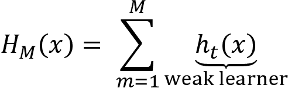

正如前一章所讨论的，装袋在不同的数据随机样本上训练基学习器。相比之下，增强通过在数据上顺序训练基学习器，该数据反复修改以反映累积学习。其目标是确保下一个基学习器弥补当前集成的缺陷。我们将在本章中看到，增强算法在定义缺陷方面存在差异。集成使用弱模型的预测的加权平均值进行预测。

第一个具有数学证明的增强算法，可以增强弱学习者的性能，是由罗伯特·沙皮尔和约阿夫·弗洛伊德于 1990 年左右开发的。1997 年，一种解决分类问题的实用解决方案以**自适应增强**（**AdaBoost**）算法的形式出现，该算法在 2003 年获得了哥德尔奖（Freund 和 Schapire 1997）。大约另外 5 年后，当 Leo Breiman（发明随机森林的人）将这种方法与梯度下降联系起来，并且 Jerome Friedman 于 1999 年提出**梯度增强**时，该算法被扩展到任意目标函数（Friedman 2001）。

近年来出现了许多优化的实现，例如 XGBoost、LightGBM 和 CatBoost，我们稍后将在本章中介绍，这些实现已经确立了梯度增强作为结构化数据的首选解决方案。在接下来的章节中，我们将简要介绍 AdaBoost，然后重点介绍梯度增强模型，以及我们刚刚提到的这个非常强大和灵活的算法的三种最新实现。

## AdaBoost 算法

当 AdaBoost 在 1990 年代出现时，它是第一个集成算法，通过迭代适应累积学习进展，当拟合额外的集成成员时。特别地，AdaBoost 改变了训练数据上的权重，以反映当前集成在训练集上的累积误差，然后拟合一个新的弱学习器。AdaBoost 当时是最准确的分类算法，利奥·布雷曼在 1996 年 NIPS 会议上称其为世界上最好的现成分类器（Hastie、Tibshirani 和 Friedman 2009）。

在随后的几十年里，该算法对机器学习产生了巨大影响，因为它提供了理论性能保证。这些保证仅需要足够的数据和一个可靠地预测略优于随机猜测的弱学习器。由于这种分阶段学习的自适应方法，开发准确的 ML 模型不再需要在整个特征空间上准确地表现。相反，模型的设计可以专注于找到仅在一小部分特征上优于硬币翻转的弱学习器。

与 bagging 相反，bagging 构建了非常大的树的集成以减小偏差，AdaBoost 则以浅树为弱学习器，通常使用树桩（即由单一分裂形成的树）产生更高的准确性。该算法从均匀加权的训练集开始，然后逐步改变样本分布。在每次迭代后，AdaBoost 增加被错误分类的观察值的权重，并减少正确预测样本的权重，以便随后的弱学习器更多地关注特别困难的情况。一旦训练完成，新的决策树将根据其减少训练误差的贡献加入到集成中。

基于预测离散类别 *y* 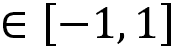 的 *N* 个训练观测结果，基础学习器的集成算法 AdaBoost 可以总结如下：

1.  对于观察值 *i*=*1*, ..., *N*，初始化样本权重 *w*[i]=*1/N*。

1.  对于每个基础分类器 *h*[m]，*m*=*1*, ..., *M*，执行以下操作：

    1.  用 *w*[i] 加权拟合 *h*m 到训练数据。

    1.  计算基础学习器在训练集上的加权错误率 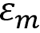。

    1.  根据其错误率计算基础学习器的集成权重 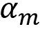，如下公式所示：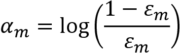

    1.  根据 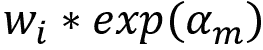 更新误分类样本的权重。

1.  当集成成员的加权和为正时，预测为正类，否则为负类，如下公式所示：

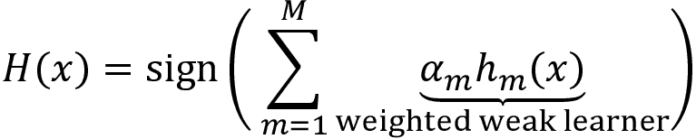

AdaBoost 有许多实际的**优势**，包括易于实现和快速计算，并且可以与任何用于识别弱学习器的方法结合使用。除了集成大小之外，没有需要调整的超参数。AdaBoost 也适用于识别异常值，因为接收最高权重的样本是那些始终被错误分类和固有模糊的样本，这也是异常值的典型特征。

还有**缺点**：AdaBoost 在给定数据集上的性能取决于弱学习器充分捕获特征与结果之间关系的能力。正如理论所述，当数据不足或者集成成员的复杂度与数据的复杂度不匹配时，Boosting 效果不佳。它也容易受到数据中的噪声影响。

详细介绍和审查了提升算法，请参阅 Schapire 和 Freund (2012)。

## 使用 AdaBoost 预测月度价格走势

作为其集成模块的一部分，scikit-learn 提供了一个支持两个或更多类别的`AdaBoostClassifier`实现。本节的代码示例在笔记本`boosting_baseline`中，该笔记本将各种算法的性能与始终预测最频繁类别的虚拟分类器进行比较。

我们需要首先将`base_estimator`定义为所有集成成员的模板，然后配置集成本身。我们将使用默认的`DecisionTreeClassifier`，`max_depth=1` — 即，具有单一拆分的桩。可选的包括符合 scikit-learn 接口的任何其他模型，从线性或逻辑回归到神经网络（请参阅文档）。然而，在实践中，决策树是最常见的。

`base_estimator`的复杂度是一个关键的调节参数，因为它取决于数据的性质。正如前一章所示，对于`max_depth`的更改应与适当的正则化约束相结合，使用例如对`min_samples_split`的调整，如下面的代码所示：

```py
base_estimator = DecisionTreeClassifier(criterion='gini', 
                                        splitter='best',
                                        max_depth=1, 
                                        min_samples_split=2, 
                                        min_samples_leaf=20, 
                                        min_weight_fraction_leaf=0.0,
                                        max_features=None, 
                                        random_state=None, 
                                        max_leaf_nodes=None, 
                                        min_impurity_decrease=0.0, 
                                        min_impurity_split=None) 
```

在第二步中，我们将设计集成。`n_estimators`参数控制弱学习器的数量，而`learning_rate`确定每个弱学习器的贡献，如下面的代码所示。默认情况下，弱学习器是决策树桩：

```py
ada_clf = AdaBoostClassifier(base_estimator=base_estimator,
                            n_estimators=100,
                            learning_rate=1.0,
                            algorithm='SAMME.R',
                            random_state=42) 
```

负责良好结果的主要调节参数是`n_estimators`和`base_estimator`的复杂度。这是因为树的深度控制了特征之间的相互作用程度。

我们将使用自定义的`OneStepTimeSeriesSplit`来交叉验证 AdaBoost 集成，这是`MultipleTimeSeriesCV`的简化版本（请参见*第六章* *机器学习过程*）。它实现了一个 12 折滚动时间序列拆分，以预测样本中最后 12 个月的 1 个月，使用所有可用的先前数据进行训练，如下面的代码所示：

```py
cv = OneStepTimeSeriesSplit(n_splits=12, test_period_length=1, shuffle=True)
def run_cv(clf, X=X_dummies, y=y, metrics=metrics, cv=cv, fit_params=None):
    return cross_validate(estimator=clf,
                          X=X,
                          y=y,
                          scoring=list(metrics.keys()),
                          cv=cv,
                          return_train_score=True,
                          n_jobs=-1,                 # use all cores
                          verbose=1,
                          fit_params=fit_params) 
```

验证结果显示加权准确率为 0.5068，AUC 分数为 0.5348，精度和召回率分别为 0.547 和 0.576，相应地，F1 分数为 0.467。这略低于采用默认设置的随机森林，在验证 AUC 为 0.5358 时，*图 12.1*以箱形图显示了 12 个训练和测试折的各种指标的分布（注意，随机森林完全适应于训练集）：

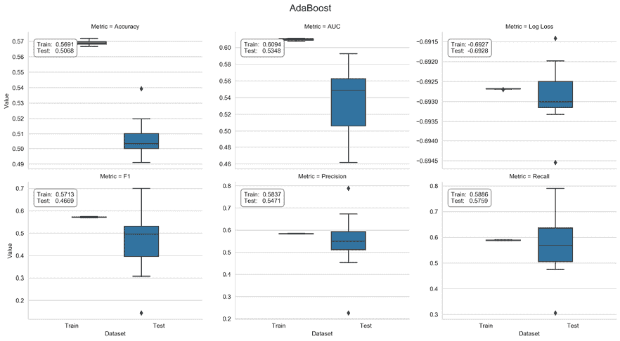

图 12.1：AdaBoost 交叉验证性能

有关交叉验证和处理结果的代码的详细信息，请参阅附带的笔记本。

# 梯度提升 - 大多数任务的集成

AdaBoost 也可以解释为一种逐步向前的方法，用于最小化二元结果的指数损失函数，*y* ，在每次迭代，*m*，中识别一个新的基学习器，*h*[m]，具有相应的权重，，并将其添加到集成中，如下面的公式所示：

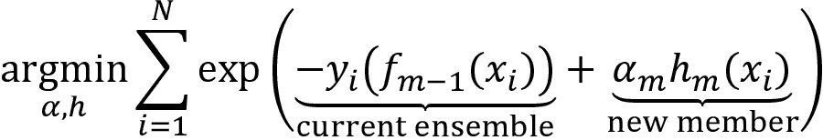

将 AdaBoost 解释为最小化特定损失函数，即指数损失的梯度下降算法，是在其原始发布几年后才发现的。

**梯度提升**利用这一见解，**将提升方法应用于更广泛范围的损失函数**。该方法使得可以设计机器学习算法来解决任何回归、分类或排名问题，只要能够使用可微分的损失函数并且具有梯度。不同任务的常见示例损失函数包括：

+   **回归（Regression）**：均方和绝对损失

+   **分类（Classification）**：交叉熵

+   **学习排名（Learning to rank）**：Lambda 排名损失

我们在*第六章* *机器学习过程*中讨论了回归和分类损失函数；学习排名超出了本书的范围，但可以参考中本（2011 年）进行介绍和陈等人（2009 年）了解排名损失的详细信息。

将此通用方法定制为许多特定预测任务的灵活性对于提升其受欢迎程度至关重要。梯度提升也不局限于弱学习器，并且通常使用数层深度的决策树获得最佳性能。

结果**梯度提升机器**（**GBMs**）算法背后的主要思想是训练基本学习者学习集成当前损失函数的负梯度。因此，集成的每个添加直接有助于减少整体训练误差，考虑到先前集成成员的错误。由于每个新成员代表数据的新函数，因此也可以说梯度提升是以加法方式优化数据的函数 *h*[m]。

简而言之，该算法连续拟合弱学习者 *h*[m]，例如决策树，到当前集成评估的损失函数的负梯度，如下公式所示：

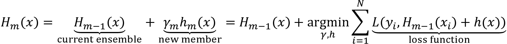

换句话说，在给定迭代次数 *m* 的情况下，该算法计算每个观察值的当前损失的梯度，然后将回归树拟合到这些伪残差上。在第二步中，它确定每个叶节点的最佳预测，以最小化由于将此新学习者添加到集成中而产生的增量损失。

这与独立决策树和随机森林不同，独立决策树和随机森林的预测取决于分配给终端节点的训练样本的结果，即回归的平均值或二元分类的正类别频率。对损失函数梯度的关注还意味着梯度提升使用回归树来学习回归和分类规则，因为梯度始终是连续函数。

最终的集成模型根据个体决策树预测的加权和进行预测，每个个体决策树都已经训练以最小化集成损失，考虑到给定一组特征值的先前预测，如下图所示：

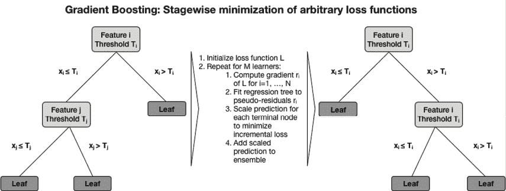

图 12.2：梯度提升算法

梯度提升树已经在许多分类、回归和排名基准上产生了**最先进的性能**。它们可能是最受欢迎的集成学习算法，作为多种 ML 竞赛中的独立预测器，以及现实世界生产管道中的独立预测器，例如，用于预测在线广告的点击率。

梯度提升成功的基础在于其以增量方式学习复杂的功能关系。然而，该算法的灵活性需要通过调整 **超参数** 来谨慎管理**过拟合风险**，这些超参数限制了模型学习训练数据中的噪声而不是信号的倾向。

我们将介绍控制梯度提升树模型复杂性的关键机制，然后使用 sklearn 实现说明模型调整。

## 如何训练和调整 GBM 模型

尽管集合增长显著，模型复杂性也增加，但提升通常表现出**令人瞩目的抗过拟合性**。非常低且不增加的验证错误通常与增强对预测的信心相关联：随着提升继续增加集合，以改善最具挑战性情况的预测为目标，它调整决策边界以最大化数据点的距离或间隔。

然而，过拟合确实会发生，梯度提升性能的**两个关键驱动因素**是集合大小和其组成决策树的复杂性。

控制**决策树复杂性**的目的是避免学习高度具体的规则，这些规则通常意味着叶节点中的样本数量很少。我们在上一章中介绍了用于限制决策树过拟合训练数据能力的最有效约束。它们包括最小阈值：

+   分裂节点或接受其作为终端节点所需的样本数量。

+   节点质量的改善，通常由分类的纯度或熵，或回归的均方误差衡量，以进一步增长树。

除了直接控制集合大小外，还有各种正则化技术，例如我们在*第七章*中遇到的**缩减**，用于岭回归模型和套索线性回归模型的上下文。此外，用于随机森林上下文中的随机化技术也经常应用于梯度提升机。

### 集合大小和早停

每个提升迭代旨在减少训练损失，增加了对大型集合过拟合的风险。交叉验证是寻找最优集合大小以最小化泛化误差的最佳方法。

由于需要在训练之前指定集合大小，因此监视验证集上的性能并在给定迭代次数时，当验证错误不再减少时中止训练过程是很有用的。这种技术称为**早停**，经常用于需要大量迭代且容易过拟合的模型，包括深度神经网络。

请记住，在使用相同验证集进行大量试验时，使用早停也会导致过拟合，但只会针对特定的验证集而不是训练集。在开发交易策略时最好避免运行大量实验，因为**误发现**的风险显著增加。无论如何，保留一个**留存测试集**以获得对泛化错误的无偏估计是最好的。

### 缩减和学习率

收缩技术对模型的复杂性增加施加惩罚，将收缩应用到模型的损失函数中。对于提升集成，收缩可以通过**缩小每个新集成成员的贡献**的因子在 0 和 1 之间进行。这个因子称为提升集成的**学习速率**。降低学习速率增加收缩，因为它降低了每个新决策树对集成的贡献。

学习速率与集成大小产生相反的影响，学习速率降低时集成大小趋于增加。已发现较低的学习速率结合较大的集成可以减少测试误差，特别是对于回归和概率估计。大量迭代在计算上更昂贵，但是只要个别树保持浅层，快速的、最新的实现通常是可行的。

根据实现的不同，您还可以使用**自适应学习率**，它会根据迭代次数调整，通常降低后期添加的树的影响。我们将在本章后面看到一些示例。

### 子采样和随机梯度提升

如前一章节详细讨论的那样，自举平均（Bagging）改善了否则嘈杂分类器的性能。

随机梯度提升在每次迭代中对训练数据进行无替换采样以生成下一棵树（而 Bagging 使用替换采样）。优点是由于较小的样本和通常更好的准确性，计算工作量较小，但是子采样应与收缩结合使用。

你可以看到，超参数的数量不断增加，这导致潜在组合的数量增加。因此，在基于有限的训练数据进行大量试验并从中选择最佳模型时，假阳性的风险增加。最佳方法是按顺序进行，并逐个选择参数值，或者使用低基数子集的组合。

## 如何使用 sklearn 进行梯度提升

sklearn 的集成模块包含了梯度提升树的实现，用于回归和分类，二元和多类别都有。下面的`GradientBoostingClassifier`初始化代码说明了关键的调整参数。笔记本`sklearn_gbm_tuning`包含了本节的代码示例。最近（版本 0.21），scikit-learn 引入了一个更快的、但仍然是实验性的`HistGradientBoostingClassifier`，灵感来自以下章节中的实现。

可用的损失函数包括导致 AdaBoost 算法的指数损失和对应于概率输出的逻辑回归的偏差。`friedman_mse`节点质量度量是均方误差的一种变体，其中包含一个改进分数（请参阅 GitHub 上链接的 scikit-learn 文档），如下所示的代码所示：

```py
# deviance = logistic reg; exponential: AdaBoost
gb_clf = GradientBoostingClassifier(loss='deviance',                
# shrinks the contribution of each tree
                                   learning_rate=0.1,              
# number of boosting stages
                                   n_estimators=100,               
# fraction of samples used t fit base learners
                                   subsample=1.0,                  
# measures the quality of a split
                                   criterion='friedman_mse',       
                                   min_samples_split=2,            
                                   min_samples_leaf=1, 
# min. fraction of sum of weights
                                   min_weight_fraction_leaf=0.0,   
# opt value depends on interaction
                                   max_depth=3,                    
                                   min_impurity_decrease=0.0, 
                                   min_impurity_split=None, 
                                   max_features=None, 
                                   max_leaf_nodes=None, 
                                   warm_start=False, 
                                   presort='auto',
                                   validation_fraction=0.1, 
                                   tol=0.0001) 
```

类似于`AdaBoostClassifier`，这个模型无法处理缺失值。我们将再次使用 12 折交叉验证来获取对滚动 1 个月持有期方向性回报进行分类的错误，如下所示的代码：

```py
gb_cv_result = run_cv(gb_clf, y=y_clean, X=X_dummies_clean)
gb_result = stack_results(gb_cv_result) 
```

我们解析并绘制结果，发现与`AdaBoostClassifier`和随机森林相比略有改善，使用默认参数值，测试 AUC 提高到 0.537。*图 12.3*显示了我们正在跟踪的各种损失指标的箱线图：

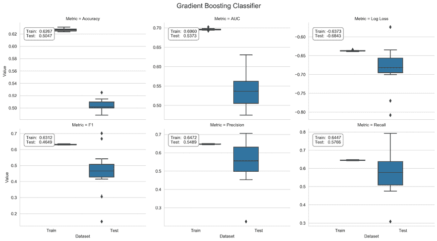

图 12.3：scikit-learn 梯度提升分类器的交叉验证性能

### 如何使用 GridSearchCV 调整参数

`model_selection`模块中的`GridSearchCV`类便于对我们想要测试的所有超参数值的组合进行系统评估。在下面的代码中，我们将为七个调整参数说明这个功能，一旦定义，就会导致总共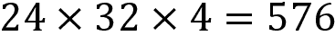个不同的模型配置：

```py
cv = OneStepTimeSeriesSplit(n_splits=12)
param_grid = dict(
        n_estimators=[100, 300],
        learning_rate=[.01, .1, .2],
        max_depth=list(range(3, 13, 3)),
        subsample=[.8, 1],
        min_samples_split=[10, 50],
        min_impurity_decrease=[0, .01],
        max_features=['sqrt', .8, 1]) 
```

`.fit()`方法使用自定义的`OneStepTimeSeriesSplit`和`roc_auc`分数执行 12 折交叉验证。Sklearn 让我们使用`joblib` pickle 实现持久化结果，就像对任何其他模型一样，如下所示的代码：

```py
gs = GridSearchCV(gb_clf,
                  param_grid,
                  cv=cv,
                  scoring='roc_auc',
                  verbose=3,
                  n_jobs=-1,
                  return_train_score=True)
gs.fit(X=X, y=y)
# persist result using joblib for more efficient storage of large numpy arrays
joblib.dump(gs, 'gbm_gridsearch.joblib') 
```

`GridSearchCV`对象在完成后具有几个附加属性，我们可以在加载拾取的结果后访问它们。我们可以使用它们来了解哪种超参数组合表现最佳及其平均交叉验证 AUC 分数，这导致与默认值相比略有改善。如下代码所示：

```py
pd.Series(gridsearch_result.best_params_)
learning_rate              0.01
max_depth                  9.00
max_features               1.00
min_impurity_decrease      0.01
min_samples_split         50.00
n_estimators             300.00
subsample                  1.00
gridsearch_result.best_score_
0.5569 
```

### 参数对测试分数的影响

`GridSearchCV`结果存储了平均交叉验证分数，以便我们可以分析不同超参数设置如何影响结果。

右侧面板中的六个 seaborn swarm 图展示了所有超参数值的 AUC 测试分数分布。在这种情况下，最高的 AUC 测试分数需要低`learning_rate`和大的`max_features`值。一些参数设置，比如低`learning_rate`，会产生一系列取决于其他参数的互补设置的结果：

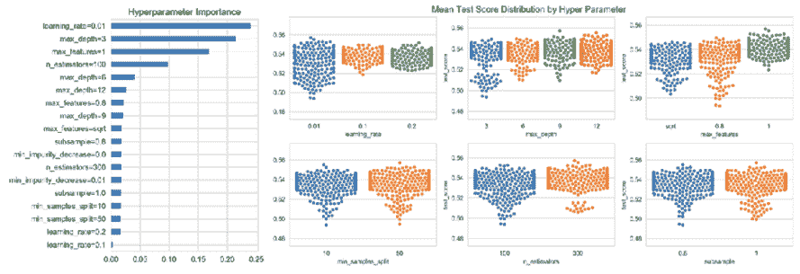

图 12.4：scikit-learn 梯度提升模型的超参数影响

我们现在将探讨超参数设置如何共同影响交叉验证性能。为了深入了解参数设置如何相互作用，我们可以训练一个`DecisionTreeRegressor`，以平均 CV AUC 作为结果，以及参数设置，以一位热编码或虚拟格式编码（详情请参见笔记本）。树结构突出显示，使用所有特征（`max_features=1`）、低`learning_rate`和`max_depth`大于三导致了最佳结果，如下图所示：

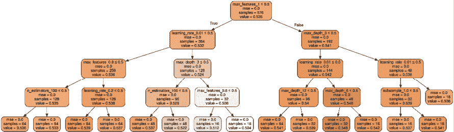

图 12.5：梯度提升模型超参数设置对测试性能的影响

*图 12.4*左侧面板的条形图显示了超参数设置对产生不同结果的影响，通过它们对已经达到最大深度的决策树的特征重要性来衡量。自然地，出现在树顶部附近的特征也累积了最高的重要性分数。

### 如何在留存集上进行测试

最后，我们想要评估我们从`GridSearchCV`练习中排除的留存集上最佳模型的性能。它包含样本期的最后 7 个月（截至 2018 年 2 月；详情请参阅笔记本）。

我们根据留存期的第一个月的 AUC 得分（为 0.5381）获得了一般化性能估计，使用以下代码示例：

```py
idx = pd.IndexSlice
auc = {}
for i, test_date in enumerate(test_dates):
    test_data = test_feature_data.loc[idx[:, test_date], :]
    preds = best_model.predict(test_data)
    auc[i] = roc_auc_score(y_true=test_target.loc[test_data.index], y_score=preds)
auc = pd.Series(auc) 
```

sklearn 梯度提升实现的缺点是**有限的训练速度**，这使得快速尝试不同的超参数设置变得困难。在下一节中，我们将看到，在过去几年中出现了几个优化实现，这些实现显着减少了训练大规模模型所需的时间，并且极大地扩展了这种高效算法的应用范围。

# 使用 XGBoost、LightGBM 和 CatBoost

在过去几年中，出现了几个新的梯度提升实现，利用了各种创新加速训练，提高资源效率，并允许算法扩展到非常大的数据集。新实现及其来源如下：

+   **XGBoost**：由 T. Chen 在他的博士期间于 2014 年启动（T. Chen 和 Guestrin 2016）

+   **LightGBM**：由微软于 2017 年 1 月发布（Ke 等人 2017）

+   **CatBoost**：由 Yandex 于 2017 年 4 月发布（Prokhorenkova 等人 2019）

这些创新解决了训练梯度提升模型的特定挑战（请参阅本章的 GitHub 上的`README`文件，以获取文档链接）。XGBoost 实现是第一个获得流行的新实现：在 Kaggle 于 2015 年发布的 29 个获奖解决方案中，有 17 个解决方案使用了 XGBoost。其中有 8 个仅依赖于 XGBoost，而其他解决方案将 XGBoost 与神经网络结合使用。

我们将首先介绍随时间发展并最终趋同的关键创新（以便大多数功能对于所有实现都是可用的），然后说明它们的实现。

## 算法创新如何提升性能

随机森林可以通过在独立的自助样本上生长个体树来并行训练。相反，梯度提升的顺序方法会减慢训练速度，从而使得需要调整的大量超参数的实验变得复杂，这些超参数需要适应任务和数据集的特性。

要向集成中添加一棵树，该算法最小化与损失函数的负梯度相关的预测误差，类似于传统的梯度下降优化器。因此，**训练期间的计算成本与评估每个特征的潜在分割点的时间成正比**。

### 二阶损失函数近似

最重要的算法创新通过使用依赖于二阶导数的近似来降低评估损失函数的成本，类似于牛顿法来寻找稳定点。因此，评分潜在分割变得更快。

如前所述，梯度提升集成*H*[M]是逐步训练的，以最小化预测误差和正则化惩罚的总和。将步骤*m*后的集成对结果*y*[i]的预测表示为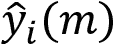，作为可微的凸损失函数，衡量结果与预测之间的差异，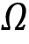作为随着集成*H*[M]的复杂性增加而增加的惩罚。增量假设*h*[m]旨在最小化以下目标*L*：

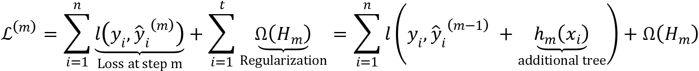

正则化惩罚有助于通过偏爱使用简单但具有预测性的回归树的模型来避免过拟合。例如，在 XGBoost 的情况下，回归树*h*的惩罚取决于每棵树的叶子数*T*、每个终端节点的回归树分数*w*以及超参数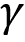和。这在下面的公式中总结如下：

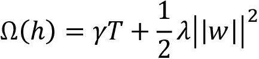

因此，在每一步中，该算法贪婪地添加最能改善正则化目标的假设*h*[m]。基于泰勒展开的损失函数的二阶近似加速了目标的评估，如下面的公式所总结的那样：

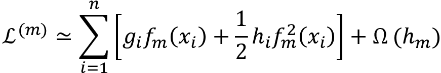

在这里，*g*[i]是在给定特征值的情况下添加新学习器之前的损失函数的一阶梯度，*h*[i]是相应的二阶梯度（或 Hessian）值，如下面的公式所示：

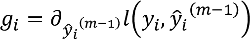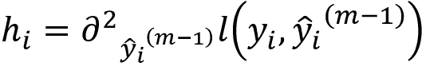

XGBoost 算法是第一个利用损失函数的这种近似来计算给定树结构的最优叶子分数和损失函数对应值的开源算法。得分由终端节点中样本的梯度和 Hessian 总和的比率组成。它使用此值对信息增益进行评分，该信息增益是结果章节中看到的节点不纯度度量的一个类似版本，但适用于任意损失函数。有关详细推导，请参见 Chen 和 Guestrin（2016）。

### 简化的分割查找算法

sklearn 的原始梯度提升实现找到枚举连续特征的所有选项的最佳分裂。这个**精确贪婪算法**由于每个特征可能的分裂选项数量可能非常大，计算上是非常耗费资源的。当数据不适合内存或在多台机器上的分布式设置中进行训练时，这种方法面临额外的挑战。

一个**近似分裂查找**算法通过将特征值分配给用户确定的一组箱中的特征值来减少分裂点的数量，这也可以在训练期间极大地减少内存需求。这是因为每个箱只需要存储一个值。XGBoost 引入了一个**分位数草图**算法，将加权训练样本分成百分位数箱，以实现均匀分布。XGBoost 还引入了处理稀疏数据的能力，原因是缺失值、频繁的零梯度统计和独热编码，并且可以学习给定分裂的最佳默认方向。因此，该算法只需要评估非缺失值。

相反，LightGBM 使用**基于梯度的单边采样**（**GOSS**）来排除具有小梯度的大部分样本，并仅使用其余部分来估计信息增益并相应地选择分裂值。具有较大梯度的样本需要更多的训练，并且往往对信息增益贡献更多。

LightGBM 还使用独占特征捆绑来组合彼此互斥的特征，即它们很少同时取非零值，以减少特征数量。因此，LightGBM 是发布时最快的实现，并且通常仍然表现最佳。

### 深度优先与叶子节点优先增长

LightGBM 与 XGBoost 和 CatBoost 的不同之处在于它如何确定要分裂哪些节点的优先级。LightGBM 决定按叶子节点进行分裂，即，它分裂最大化信息增益的叶子节点，即使这会导致树不平衡。相反，XGBoost 和 CatBoost 按深度扩展所有节点，并首先在给定深度级别上分裂所有节点，然后再添加更多级别。这两种方法以不同的顺序扩展节点，并且除了完全树外，将产生不同的结果。以下图示了这两种方法：

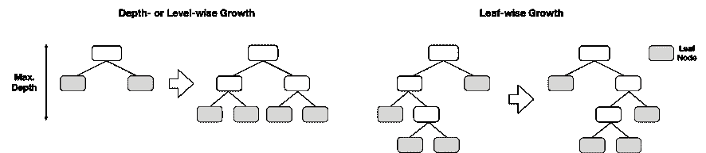

图 12.6：深度优先 vs 叶子节点优先增长

LightGBM 的叶子节点优先分裂倾向于增加模型的复杂性，并可能加快收敛速度，但也增加了过拟合的风险。一个深度为*n*级别的树有最多 2^n 个终端节点，而具有 2^n 个叶子节点的叶子优先树可能有更多级别，并且在某些叶子中包含相应地更少的样本。因此，调整 LightGBM 的`num_leaves`设置需要额外的小心，该库同时允许我们控制`max_depth`以避免不必要的节点不平衡。LightGBM 的更高版本也提供了深度优先树增长。

### 基于 GPU 的训练

所有新的实现都支持在一个或多个 GPU 上进行训练和预测，以实现显著的加速。它们与当前支持 CUDA 的 GPU 兼容。安装要求因版本而异，而且正在迅速发展。XGBoost 和 CatBoost 实现适用于几个当前版本，但是 LightGBM 可能需要本地编译（请参阅 GitHub 获取文档链接）。

加速取决于库和数据类型，范围从低位、个位数的倍数到数十倍因子。只需更改任务参数即可激活 GPU，并且不需要进行其他超参数修改。

### DART – 增加回归树的辍学

Rashmi 和 Gilad-Bachrach（2015）提出了一个新模型，用于训练梯度提升树以解决他们称之为**过度专业化**的问题：在后续迭代中添加的树往往只影响少数实例的预测，同时对其余实例的贡献较小。然而，该模型的样本外表现可能会受到影响，并且可能会对少数树的贡献过度敏感。

新算法采用了辍学，在学习更准确的深度神经网络时已被成功使用，其中在训练期间会静音一部分神经连接。因此，更高层次的节点无法依赖于少数连接传递预测所需的信息。这种方法对于许多任务的深度神经网络的成功做出了重要贡献，还与其他学习技术（如逻辑回归）一起使用。

**DART**，或者称为**增加回归树的辍学**，在树的层面上操作，而不是在单个特征上进行操作。其目标是使使用 DART 生成的整体树对最终预测贡献更加均匀。在某些情况下，这已被证明对排名、回归和分类任务产生更准确的预测。该方法首次在 LightGBM 中实现，并且也适用于 XGBoost。

### 对分类特征的处理

CatBoost 和 LightGBM 实现可直接处理分类变量，无需进行虚拟编码。

CatBoost 实现（因其对分类特征的处理而命名）包括几种处理此类特征的选项，除了自动独热编码外。它将单个特征的类别或几个特征的组合分配给数值。换句话说，CatBoost 可以从现有特征的组合创建新的分类特征。与单个特征或特征组合的类别级别相关的数值取决于它们与结果值的关系。在分类情况下，这与在样本上基于先验和平滑因子计算的观察到正类的概率相关。有关更详细的数值示例，请参阅 CatBoost 文档。

LightGBM 实现将分类特征的级别分组，以最大化组内相对于结果值的同质性（或最小化方差）。XGBoost 实现不直接处理分类特征，需要独热（或虚拟）编码。

### 附加功能和优化

XGBoost 在几个方面优化计算以实现多线程。最重要的是，它将数据保留在压缩的列块中，其中每列按相应特征值排序。它在训练之前计算此输入数据布局一次，并在整个过程中重复使用以分摊前期成本。因此，对列上的分割统计的搜索变成了可以并行进行的分位数的线性扫描，并支持列子抽样

随后发布的 LightGBM 和 CatBoost 库基于这些创新，而 LightGBM 通过优化线程和减少内存使用量进一步加速了训练。由于它们的开源性质，库往往随着时间的推移而趋于融合。

XGBoost 还支持**单调性约束**。这些约束确保给定特征的值在其整个范围内与结果呈正相关或负相关。它们有助于将关于模型的外部假设纳入其中，这些假设已知为真。

# 带增强的多空交易策略

在本节中，我们将设计、实现和评估一个由梯度提升模型产生的每日收益预测驱动的美国股票交易策略。我们将使用 Quandl Wiki 数据来设计一些简单的特征（详见笔记本`preparing_the_model_data`），在使用 2015/16 作为验证期间选择模型，并在 2017 年进行样本外测试。

与之前的示例一样，我们将提供一个框架并构建一个具体的示例，您可以根据自己的实验进行调整。您可以变化的方面有很多，从资产类别和投资范围到更精细的方面，如特征、持有期或交易规则。例如，查看*附录*中的 Alpha 因子库以获取更多的附加功能。

我们将保持交易策略简单，只使用单个 ML 信号；实际应用可能会使用来自不同来源的多个信号，例如在不同数据集上训练的互补 ML 模型，或者具有不同前瞻或回溯期的模型。它还将使用复杂的风险管理，从简单的止损到价值风险分析。

## 使用 LightGBM 和 CatBoost 生成信号

XGBoost、LightGBM 和 CatBoost 提供了多种语言的接口，包括 Python，并且具有与其他 scikit-learn 功能兼容的 scikit-learn 接口，如`GridSearchCV`，以及用于训练和预测梯度提升模型的自己的方法。我们在本章的前两节中使用的笔记本`boosting_baseline.ipynb`说明了每个库的 scikit-learn 接口。该笔记本比较了各种库的预测性能和运行时间。它通过使用我们在*第四章*，*金融特征工程-如何研究 Alpha 因子*中创建的特征，来训练提升模型以预测 2001-2018 年间的美国股票月回报。

下图左侧显示了使用所有实现的默认设置预测 1 个月股票价格波动的准确性，以 12 倍交叉验证产生的平均 AUC 为指标：

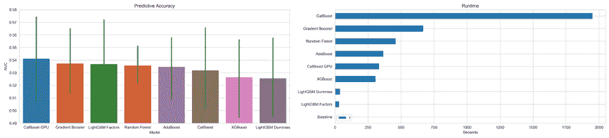

图 12.7：各种梯度提升模型的预测性能和运行时间

**预测性能**的范围从 0.525 到 0.541 不等。这看起来可能是一个小范围，但随机基准 AUC 为 0.5，最差的模型将基准提高了 5 个百分点，而最佳模型则提高了 8 个百分点，这相当于相对增长了 60 个百分点。使用 GPU 的 CatBoost 和使用整数编码的分类变量的 LightGBM 表现最佳，突显了将分类变量转换为数值变量的之前概述的好处。

实验的**运行时间**变化显著大于预测性能。在此数据集上，LightGBM 比 XGBoost 或 CatBoost（使用 GPU）快 10 倍，而预测性能非常相似。由于这种巨大的速度优势，并且因为 GPU 并不是每个人都可以使用的，我们将专注于 LightGBM，但也会说明如何使用 CatBoost；XGBoost 与两者非常相似。

使用 LightGBM 和 CatBoost 模型需要：

1.  创建特定于库的二进制数据格式

1.  配置和调整各种超参数

1.  评估结果

我们将在接下来的章节中描述这些步骤。笔记本`trading_signals_with_lightgbm_and_catboost`包含了本小节的代码示例，除非另有说明。

### 从 Python 到 C++——创建二进制数据格式

LightGBM 和 CatBoost 都是用 C++ 编写的，并在预先计算特征统计信息之前将 Python 对象（如 pandas DataFrame）转换为二进制数据格式，以加速搜索分割点，如前一节所述。结果可以持久化以加速后续训练的启动。

我们将在前一节提到的数据集子集上进行交叉验证，直到 2016 年底，以验证多种模型配置的效果，包括不同的回溯和前瞻窗口，以及不同的向前期和超参数。我们的模型选择方法将类似于我们在上一章中使用的方法，并使用在*第七章*介绍的自定义 `MultipleTimeSeriesCV`。

我们选择训练和验证集，识别标签和特征，并对值从零开始的分类变量进行整数编码，这是 LightGBM 预期的（只要类别代码的值小于 2³² 即可，但可以避免警告）：

```py
data = (pd.read_hdf('data.h5', 'model_data')
            .sort_index()
            .loc[idx[:, :'2016'], :])
labels = sorted(data.filter(like='fwd').columns)
features = data.columns.difference(labels).tolist()
categoricals = ['year', 'weekday', 'month']
for feature in categoricals:
    data[feature] = pd.factorize(data[feature], sort=True)[0] 
```

笔记本示例遍历许多配置，可选择使用随机样本来加快使用多样化子集进行模型选择的速度。目标是在不尝试每种可能的组合的情况下识别最具影响力的参数。

为此，我们创建二进制 `Dataset` 对象。对于 LightGBM，这看起来如下所示：

```py
import lightgbm as lgb
outcome_data = data.loc[:, features + [label]].dropna()
lgb_data = lgb.Dataset(data=outcome_data.drop(label, axis=1),
                           label=outcome_data[label],
                           categorical_feature=categoricals,
                           free_raw_data=False) 
```

CatBoost 数据结构称为 `Pool`，工作原理类似：

```py
cat_cols_idx = [outcome_data.columns.get_loc(c) for c in categoricals]
catboost_data = Pool(label=outcome_data[label],
                    data=outcome_data.drop(label, axis=1),
                    cat_features=cat_cols_idx) 
```

对于这两个库，我们根据结果信息确定要转换为数值变量的分类变量。CatBoost 实现需要使用索引而不是标签来识别特征列。

我们可以简单地使用 `MultipleTimeSeriesCV` 提供的训练和验证集索引来切片二进制数据集，如下所示，在交叉验证期间进行，将两个示例合并为一个片段：

```py
for i, (train_idx, test_idx) in enumerate(cv.split(X=outcome_data)):
   lgb_train = lgb_data.subset(train_idx.tolist()).construct()
   train_set = catboost_data.slice(train_idx.tolist()) 
```

### 如何调整超参数

LightGBM 和 CatBoost 实现带有许多允许精细控制的超参数。每个库都有参数设置来：

+   指定任务目标和学习算法

+   设计基础学习者

+   应用各种正则化技术

+   在训练期间处理提前停止

+   启用 GPU 或 CPU 并行化

每个库的文档详细介绍了各种参数。由于它们实现了相同算法的变体，参数可能指的是相同的概念，但跨库具有不同的名称。GitHub 仓库列出了澄清 XGBoost 和 LightGBM 参数具有相似效果的资源。

#### 目标和损失函数

这些库支持几种提升算法，包括树和线性基础学习者的梯度提升，以及 LightGBM 和 XGBoost 的 DART。LightGBM 还支持我们之前描述的 GOSS 算法，以及随机森林。

梯度提升的吸引力在于对任意可微损失函数的有效支持，每个库都提供了各种选项用于回归、分类和排名任务。除了选择的损失函数外，还可以使用其他评估指标来监控训练和交叉验证期间的性能。

#### 学习参数

梯度提升模型通常使用决策树来捕捉特征交互，并且个体树的大小是最重要的调整参数。XGBoost 和 CatBoost 将`max_depth`默认设置为 6。相反，LightGBM 使用默认的`num_leaves`值为 31，这对应于平衡树的五个级别，但不对级别数量施加任何限制。为了避免过拟合，`num_leaves`应该小于 2^(max_depth)。例如，对于表现良好的`max_depth`值为 7，您应该将`num_leaves`设置为 70-80，而不是 2⁷=128，或者直接约束`max_depth`。

树的数量或提升迭代次数定义了整体集合的大小。所有库都支持`early_stopping`来在给定的迭代次数内一旦损失函数不再注册进一步改进就中止训练。因此，通常最有效的方法是设置大量迭代并根据验证集上的预测性能停止训练。但是，请注意，由于暗示的前瞻偏差，验证误差会被偏高。

这些库还允许使用自定义损失指标来跟踪训练和验证性能并执行`early_stopping`。笔记本演示了如何为 LightGBM 和 CatBoost 编写**信息系数**（**IC**）。但是，为了避免偏差，我们不会依赖`early_stopping`进行实验。

#### 正则化

所有的库都实现了对基础学习器的正则化策略，例如对样本数量的最小值或对拆分和叶节点所需的最小信息增益的限制。

它们还支持在整体集成层面上使用收缩来进行正则化，这通过限制新树的贡献来实现学习率。也可以通过回调函数实现自适应学习率，随着训练的进行降低学习率，例如在神经网络的背景下已成功使用。此外，梯度提升损失函数可以使用 L1 或 L2 正则化进行约束，类似于岭回归和套索回归模型，例如，通过增加添加更多树的惩罚来约束梯度提升损失函数。

这些库还允许使用装袋或列抽样来随机化树的生长，用于随机森林，以及去相关化预测错误以减少总体方差。对于近似拆分查找，特征量化添加了更大的箱作为另一个选项，以防止过拟合。

#### 随机网格搜索

为了探索超参数空间，我们指定了我们想要测试的关键参数的值的组合。sklearn 库支持`RandomizedSearchCV`来交叉验证从指定分布中随机抽样的一部分参数组合。我们将实现一个自定义版本，允许我们监控性能，以便一旦满意结果就可以中止搜索过程，而不是事先指定一组迭代次数。

为此，我们为每个库的相关超参数指定了选项，使用 itertools 库提供的笛卡尔积生成器生成所有组合，并对结果进行了洗牌。

就 LightGBM 而言，我们关注学习率、树的最大大小、训练期间特征空间的随机化以及需要拆分的数据点的最小数量。这导致以下代码，其中我们随机选择了一半的配置：

```py
learning_rate_ops = [.01, .1, .3]
max_depths = [2, 3, 5, 7]
num_leaves_opts = [2 ** i for i in max_depths]
feature_fraction_opts = [.3, .6, .95]
min_data_in_leaf_opts = [250, 500, 1000]
cv_params = list(product(learning_rate_ops,
                         num_leaves_opts,
                         feature_fraction_opts,
                         min_data_in_leaf_opts))
n_params = len(cv_params)
# randomly sample 50%
cvp = np.random.choice(list(range(n_params)),
                           size=int(n_params / 2), 
                           replace=False)
cv_params_ = [cv_params[i] for i in cvp] 
```

现在，我们基本上已经准备就绪：在每次迭代期间，我们根据`lookahead`、`train_period_length`和`test_period_length`参数创建一个`MultipleTimeSeriesCV`实例，并相应地在一个 2 年的时间段内交叉验证所选的超参数。

请注意，我们生成了一系列的合奏大小的验证预测，以便我们可以推断出最佳迭代次数：

```py
num_iterations = [10, 25, 50, 75] + list(range(100, 501, 50))
num_boost_round = num_iterations[-1]
for lookahead, train_length, test_length in test_params:
   n_splits = int(2 * YEAR / test_length)
   cv = MultipleTimeSeriesCV(n_splits=n_splits,
                             lookahead=lookahead,
                             test_period_length=test_length,
                             train_period_length=train_length)
   for p, param_vals in enumerate(cv_params_):
       for i, (train_idx, test_idx) in enumerate(cv.split(X=outcome_data)):
           lgb_train = lgb_data.subset(train_idx.tolist()).construct()
           model = lgb.train(params=params,
                             train_set=lgb_train,
                             num_boost_round=num_boost_round,
                             verbose_eval=False)
           test_set = outcome_data.iloc[test_idx, :]
           X_test = test_set.loc[:, model.feature_name()]
           y_test = test_set.loc[:, label]
           y_pred = {str(n): model.predict(X_test, num_iteration=n) for n in num_iterations} 
```

请查看笔记本`trading_signals_with_lightgbm_and_catboost`以获取更多细节，包括如何记录结果、计算和捕获我们需要评估结果的各种指标，接下来我们将转向这一点。

### 如何评估结果

现在，交叉验证了大量配置，我们需要评估预测性能，以确定为我们未来的交易策略生成最可靠和最有利可图的信号的模型。笔记本`evaluate_trading_signals`包含了本节的代码示例。

我们生成了更多的 LightGBM 模型，因为它的运行速度比 CatBoost 快一个数量级，因此将相应地展示一些评估策略。

#### 交叉验证结果 – LightGBM 对比 CatBoost

首先，我们比较了两个库生成的模型在所有配置方面的预测性能，包括它们的验证 IC，既跨整个验证期间又在日预测上平均。

下图显示，LightGBM 的表现（略微）优于 CatBoost，特别是对于更长的预测期。这并不是完全公平的比较，因为我们对 LightGBM 运行了更多的配置，这也不出所料地显示了更广泛的结果分散：

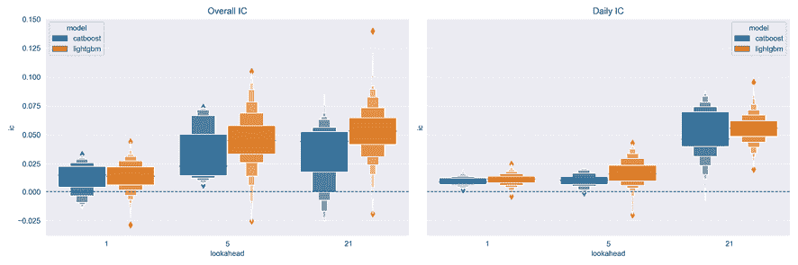

图 12.8：LightGBM 和 CatBoost 模型在三个预测期内的总体和日 IC

无论如何，我们将专注于 LightGBM 的结果；请查看笔记本`trading_signals_with_lightgbm_and_catboost`和`evaluate_trading_signals`以获取有关 CatBoost 的更多详细信息或运行您自己的实验。

鉴于模型结果之间的显著分散，让我们更仔细地研究表现最佳的参数设置。

#### 最佳表现参数设置

表现最佳的 LightGBM 模型使用以下参数进行三个不同的预测时间范围（详情请参阅笔记本）：

| Lookahead | Learning Rate | # Leaves | Feature Fraction | Min. Data in Leaf | Daily Average | Overall |
| --- | --- | --- | --- | --- | --- | --- |
| IC | # Rounds | IC | # Rounds |
| 1 | 0.3 | 4 | 95% | 1,000 | 1.70 | 75 | 4.41 | 50 |
| 1 | 0.3 | 4 | 95% | 250 | 1.34 | 250 | 4.36 | 25 |
| 1 | 0.3 | 4 | 95% | 1,000 | 1.70 | 75 | 4.30 | 75 |
| 5 | 0.1 | 8 | 95% | 1,000 | 3.95 | 300 | 10.46 | 300 |
| 5 | 0.3 | 4 | 95% | 1,000 | 3.43 | 150 | 10.32 | 50 |
| 5 | 0.3 | 4 | 95% | 1,000 | 3.43 | 150 | 10.24 | 150 |
| 21 | 0.1 | 8 | 60% | 500 | 5.84 | 25 | 13.97 | 10 |
| 21 | 0.1 | 32 | 60% | 250 | 5.89 | 50 | 11.59 | 10 |
| 21 | 0.1 | 4 | 60% | 250 | 7.33 | 75 | 11.40 | 10 |

请注意，较浅的树在三个预测时间范围内产生了最佳的整体 IC。长达 4.5 年的较长训练也产生了更好的结果。

#### 超参数影响 - 线性回归

接下来，我们想了解是否存在系统性的、统计上的超参数与每日预测结果之间的关系。为此，我们将使用各种 LightGBM 超参数设置作为虚拟变量，并将每日验证 IC 作为结果进行线性回归。

*图 12.9*中的图表显示了 1 天和 21 天预测时间范围的系数估计及其置信区间。对于较短的时间范围，更长的回溯期、更高的学习率和更深的树（更多叶节点）会产生积极影响。对于较长的时间范围，情况稍微不太清晰：较短的树效果更好，但回溯期不显著。更高的特征采样率也有所帮助。在这两种情况下，更大的集成效果更好。请注意，这些结果仅适用于此特定示例。

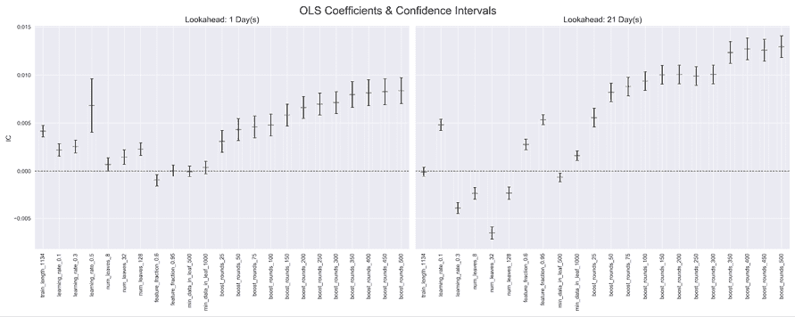

图 12.9：不同预测时间范围的系数估计及其置信区间

#### 使用 IC 而不是信息系数

我们对前五个模型进行平均，并提供相应的价格给 Alphalens，以便计算在不同持有期内投资于每日因子五分位数的等权重投资组合上获得的平均周期回报：

| 指标 | 持有期 |
| --- | --- |
| 1D | 5D | 10D | 21D |
| 平均周期间差异（基点） | 12.1654 | 6.9514 | 4.9465 | 4.4079 |
| Ann. alpha | 0.1759 | 0.0776 | 0.0446 | 0.0374 |
| beta | 0.0891 | 0.1516 | 0.1919 | 0.1983 |

我们发现顶部和底部五分位数之间有 12 个基点的差距，这意味着年化 alpha 为 0.176，而 beta 低至 0.089（见*图 12.10*）：

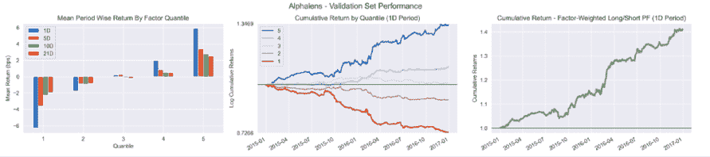

图 12.10：因子分位数的平均和累积回报

以下图表显示了在最佳表现模型的 2 年验证期内，1 天和 21 天预测的季度滚动 IC：

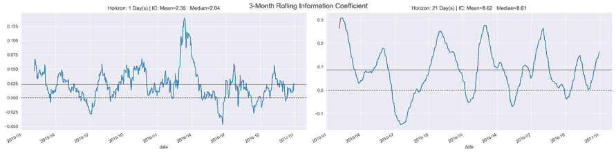

图 12.11：1 天和 21 天回报预测的滚动 IC

短期和长期模型的平均 IC 分别为 2.35 和 8.52，在样本中大多数天数保持正值。

我们现在将看看如何在选择模型、生成预测、定义交易策略和评估其性能之前，获得有关模型工作方式的额外见解。

## 在黑匣子内——解释 GBM 结果

了解为什么模型会预测特定结果对于多种原因非常重要，包括信任、可操作性、问责制和调试。当目标是更多地了解研究对象的基本驱动因素时，模型揭示的特征与结果之间的非线性关系以及特征之间的相互作用也具有价值。

获取树集成方法（如梯度提升或随机森林模型）预测见解的一种常见方法是将特征重要性值归因于每个输入变量。这些特征重要性值可以针对单个预测或全局计算整个数据集（即所有样本），以获得模型如何进行预测的更高层次的视角。

本节的代码示例位于笔记本`model_interpretation`中。

### 特征重要性

有三种主要方法来计算全局特征重要性值：

+   **增益**：这是一种经典方法，由 Leo Breiman 于 1984 年引入，它使用给定特征所有拆分贡献的损失或不纯度的总减少。动机在很大程度上是启发式的，但这是一种常用的特征选择方法。

+   **分割计数**：这是一种替代方法，根据所选特征的选择基于产生的信息增益来计算特征用于做出分割决策的频率。

+   **排列**：这种方法随机排列测试集中的特征值，并测量模型误差的变化程度，假设一个重要特征应该会导致预测误差大幅增加。不同的排列选择会导致此基本方法的替代实现。

计算单个预测的个性化特征重要性值，计算特征对单个预测的相关性较少见。这是因为可用的模型不可知解释方法比树特定方法慢得多。

所有梯度提升实现在训练后都会提供特征重要性得分作为模型属性。LightGBM 库提供了两个版本，如下列表所示：

+   **增益**：特征对减少损失的贡献

+   **split**：该特征被使用的次数

这些值可通过训练模型的 `.feature_importance()` 方法和相应的 `importance_type` 参数获得。对于表现最佳的 LightGBM 模型，20 个最重要特征的结果如 *图 12.12* 所示：

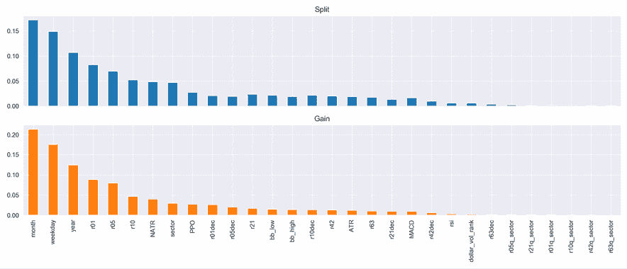

图 12.12：LightGBM 特征重要性

时间周期指标占主导地位，其次是最新的回报、标准化 ATR、部门虚拟变量和动量指标（有关实施细节，请参见笔记本）。

### 部分依赖性图

除了总结单个特征对模型预测的贡献之外，部分依赖性图还可视化目标变量与一组特征之间的关系。梯度提升树的非线性性质导致这种关系取决于所有其他特征的值。因此，我们将对这些特征进行边际化。通过这样做，我们可以将部分依赖性解释为预期的目标响应。

我们只能为单个特征或特征对可视化部分依赖性。后者会产生等高线图，显示出不同预测概率的特征值组合如何产生不同的组合，如下面的代码所示：

```py
fig, axes = plot_partial_dependence(estimator=best_model,
                                    X=X,
                                    features=['return_12m', 'return_6m', 
                                              'CMA', ('return_12m',
                                                      'return_6m')],
                                    percentiles=(0.01, 0.99),
                                    n_jobs=-1,
                                    n_cols=2,
                                    grid_resolution=250) 
```

经过一些额外的格式化（请参见配套笔记本），我们得到了如 *图 12.13* 所示的结果：

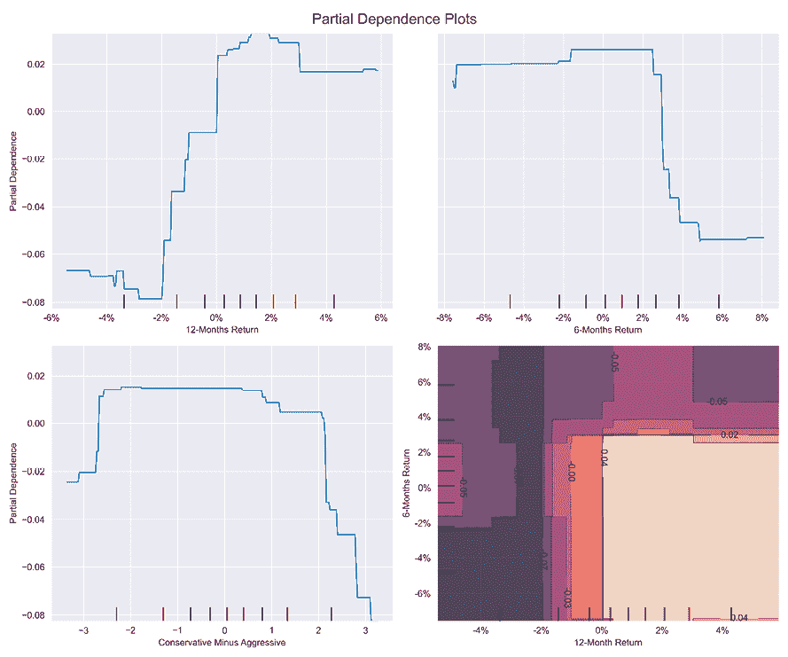

图 12.13：scikit-learn GradientBoostingClassifier 的部分依赖性图

右下图显示了在消除[1%，99%]分位数的异常值后，对于滞后的 12 个月和 6 个月回报值范围内的下个月正回报概率的依赖性。 `month_9` 变量是一个虚拟变量，因此图形类似于阶梯函数。我们还可以按照以下代码将依赖性可视化为 3D：

```py
targets = ['return_12m', 'return_6m']
pdp, axes = partial_dependence(estimator=gb_clf,
                               features=targets,
                               X=X_,
                               grid_resolution=100)
XX, YY = np.meshgrid(axes[0], axes[1])
Z = pdp[0].reshape(list(map(np.size, axes))).T
fig = plt.figure(figsize=(14, 8))
ax = Axes3D(fig)
surf = ax.plot_surface(XX, YY, Z,
                       rstride=1,
                       cstride=1,
                       cmap=plt.cm.BuPu,
                       edgecolor='k')
ax.set_xlabel(' '.join(targets[0].split('_')).capitalize())
ax.set_ylabel(' '.join(targets[1].split('_')).capitalize())
ax.set_zlabel('Partial Dependence')
ax.view_init(elev=22, azim=30) 
```

这产生了关于滞后 6 个月和 12 个月回报的部分依赖性的 1 个月回报方向的以下 3D 图：

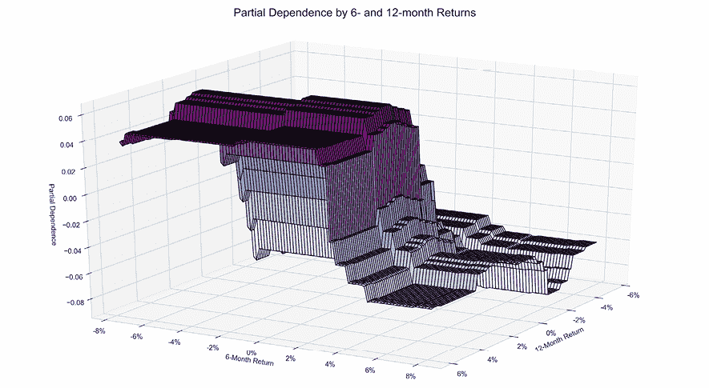

图 12.14：部分依赖性的 3D 图

### SHapley Additive exPlanations

在 2017 年 NIPS 会议上，华盛顿大学的 Scott Lundberg 和 Su-In Lee 提出了一种解释树集成模型输出中单个特征贡献的新方法，称为**SHapley Additive exPlanations**，或**SHAP**值。

这种新算法与观察到的树集成的特征归因方法不一致，如我们之前所看到的那样，即，增加模型中特征对输出的影响的变化可能降低该特征的重要性值（有关详细说明，请参见 GitHub 上的参考资料）。

SHAP 值统一了协作博弈理论和局部解释的思想，并根据期望表明在理论上是最优的、一致的和局部准确的。最重要的是，Lundberg 和 Lee 开发了一种算法，成功地将这些与模型无关的、可加性的特征归因方法的复杂性从 *O*(*TLDM*) 降低到 *O*(*TLD*²)，其中 *T* 和 *M* 分别是树和特征的数量，*D* 和 *L* 是树中的最大深度和叶子数。这一重要的创新使得可以在几秒钟内解释以前难以处理的具有数千棵树和特征的模型的预测。一个开源实现在 2017 年末可用，并兼容 XGBoost、LightGBM、CatBoost 和 sklearn 树模型。

夏普利值起源于博弈论，作为一种为合作博弈中的每个玩家分配价值的技术，反映了他们对团队成功的贡献。SHAP 值是对博弈论概念在基于树的模型中的一种改编，并计算每个特征和每个样本的 SHAP 值。它们衡量了一个特征对给定观察的模型输出的贡献。因此，SHAP 值提供了不同的见解，说明了特征的影响如何随着样本的变化而变化，这在这些非线性模型中的交互效应的作用中至关重要。

#### 如何按特征总结 SHAP 值

要对多个样本的特征重要性进行高层次概述，有两种绘制 SHAP 值的方法：一种是对所有样本进行简单平均，类似于之前计算的全局特征重要性度量（如 *图 12.15* 左侧面板所示），或者绘制散点图以显示每个特征对每个样本的影响（如图的右侧面板所示）。使用兼容库中的训练模型和匹配输入数据，它们非常容易产生，如下面的代码所示：

```py
# load JS visualization code to notebook
shap.initjs()
# explain the model's predictions using SHAP values
explainer = shap.TreeExplainer(model)
shap_values = explainer.shap_values(X_test)
shap.summary_plot(shap_values, X_test, show=False) 
```

散点图根据其在所有样本中的总 SHAP 值对特征进行排序，然后显示每个特征对模型输出的影响，由 SHAP 值来衡量，作为特征值的函数，其颜色表示特征值，红色表示相对于特征范围的高值，蓝色表示低值：

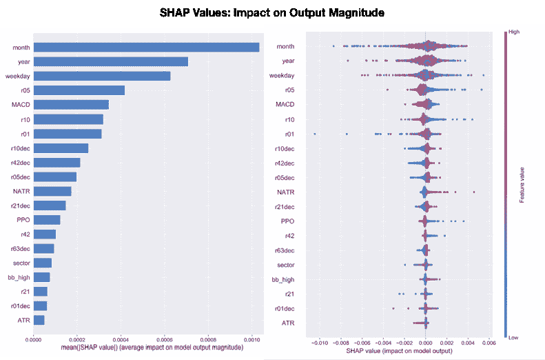

图 12.15：SHAP 概要图

与传统特征重要性相比，*图 12.12* 显示的有一些有趣的差异；即 MACD 指标更为重要，以及相对收益指标。

#### 如何使用力量图来解释一个预测

以下图像中的力量图显示了各种特征及其值对模型输出的 **累积影响**，在本例中为 0.6，比基础值 0.13（提供的数据集的平均模型输出）要高得多。突出显示为红色的特征并向右箭头指向的特征增加了输出。月份为十月是最重要的特征，并将输出从 0.338 增加到 0.537，而年份为 2017 则降低了输出。

因此，我们可以得到模型如何得出特定预测的详细分解，如下图所示：

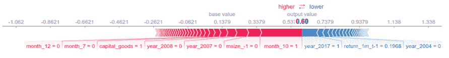

图 12.16：SHAP 力量图

我们还可以同时为多个数据点或预测计算 **多个数据点的力量图**，并使用 **聚类可视化** 来洞察数据集中某些影响模式的普遍程度。下图显示了前 1,000 个观察结果的力量图，旋转了 90 度，水平堆叠，并根据给定观察结果中不同特征对结果的影响排序。

实现使用数据点的特征 SHAP 值的分层凝聚聚类来识别这些模式，并显示结果以进行探索性分析（请参见笔记本），如下图所示的代码：

```py
shap.force_plot(explainer.expected_value, shap_values[:1000,:],
                X_test.iloc[:1000]) 
```

这将产生以下输出：

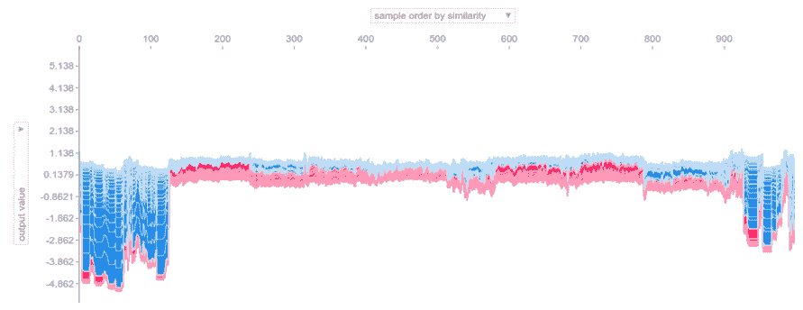

图 12.17：SHAP 聚类力量图

#### 如何分析特征交互

最后，SHAP 值使我们能够通过将这些交互作用与主要效应分开来获得有关不同特征之间交互作用效应的额外见解。`shap.dependence_plot` 可以定义如下：

```py
shap.dependence_plot(ind='r01',
                     shap_values=shap_values,
                     features=X,
                     interaction_index='r05',
                     title='Interaction between 1- and 5-Day Returns') 
```

它显示了对 1 个月回报率的不同值（x 轴）如何影响结果（y 轴上的 SHAP 值），并根据 3 个月回报率进行区分（请参见以下图）：

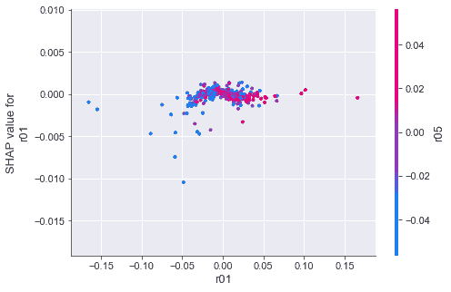

图 12.18：SHAP 交互作用图

SHAP 值在每个单独预测的级别提供细粒度的特征归因，并通过（交互式）可视化实现对复杂模型的更丰富的检查。本节前面显示的 SHAP 摘要点图（*图 12.15*）比全局特征重要性条形图提供了更多差异化的见解。单个聚类预测的力量图允许更详细的分析，而 SHAP 依赖图捕获交互作用效应，因此提供比部分依赖图更准确和详细的结果。

与任何当前特征重要性度量一样，SHAP 值的局限性涉及高度相关的变量的影响归因，因为它们的相似影响可以以任意方式分解。

## 基于提升集成的策略回溯测试

在本节中，我们将使用 Zipline 评估一个长短策略的表现，该策略根据每日收益预测信号输入 25 个多头和 25 个空头头寸。为此，我们将选择表现最佳的模型，生成预测，并设计根据这些预测行事的交易规则。

根据我们对交叉验证结果的评估，我们将选择一个或多个模型来为新的样本外期间生成信号。在本例中，我们将结合对最佳 10 个 LightGBM 模型的预测，以减少基于 Alphalens 计算的其稳定均值分位数传播的 1 天预测周期的方差。

我们只需获取表现最佳模型的参数设置，然后相应地进行训练。笔记本`making_out_of_sample_predictions`包含必要的代码。模型训练使用表现最佳模型的超参数设置和测试期数据，但在其他方面非常紧密地遵循了交叉验证时使用的逻辑，因此我们将在此省略细节。

在笔记本`backtesting_with_zipline`中，我们已经组合了验证和测试期间前 10 个模型的预测，如下所示：

```py
def load_predictions(bundle):
    predictions = (pd.read_hdf('predictions.h5', 'train/01')
                   .append(pd.read_hdf('predictions.h5', 'test/01')
                   .drop('y_test', axis=1)))
    predictions = (predictions.loc[~predictions.index.duplicated()]
                   .iloc[:, :10]
                   .mean(1)
                   .sort_index()
                   .dropna()
                  .to_frame('prediction')) 
```

我们将使用我们在《第八章》《ML4T 工作流程-从模型到策略回测》中引入的自定义 ML 因子，将预测导入并在管道中进行可访问。

我们将从验证期的开始到测试期的结束执行`Pipeline`。*图 12.19*显示（不足为奇）样本内表现稳健，年回报率为 27.3%，而样本外为 8.0%。图片的右侧面板显示了与标普 500 相对的累计回报率：

| 指标 | 全部 | 样本内 | 样本外 |
| --- | --- | --- | --- |
| 年回报率 | 20.60% | 27.30% | 8.00% |
| 累计回报率 | 75.00% | 62.20% | 7.90% |
| 年波动率 | 19.40% | 21.40% | 14.40% |
| 夏普比率 | 1.06 | 1.24 | 0.61 |
| 最大回撤 | -17.60% | -17.60% | -9.80% |
| Sortino 比率 | 1.69 | 2.01 | 0.87 |
| 偏度 | 0.86 | 0.95 | -0.16 |
| 峰度 | 8.61 | 7.94 | 3.07 |
| 每日风险价值 | -2.40% | -2.60% | -1.80% |
| 日换手率 | 115.10% | 108.60% | 127.30% |
| Alpha | 0.18 | 0.25 | 0.05 |
| Beta | 0.24 | 0.24 | 0.22 |

夏普比率分别为样本内为 1.24，样本外为 0.61；右侧面板显示了季度滚动数值。样本内的 Alpha 为 0.25，样本外为 0.05，对应的 Beta 值分别为 0.24 和 0.22。最严重的回撤导致 2015 年下半年损失了 17.59%：

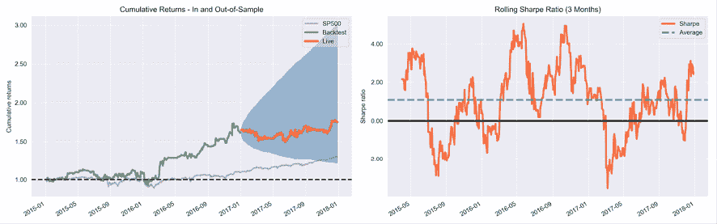

图 12.19：策略表现—累计回报率和滚动夏普比率

多头交易略微比空头交易更有利润，空头交易平均损失：

| 摘要统计 | 所有交易 | 空头交易 | 多头交易 |
| --- | --- | --- | --- |
| 总往返数 | 22,352 | 11,631 | 10,721 |
| 盈利百分比 | 50.0% | 48.0% | 51.0% |
| 获胜往返 | 11,131 | 5,616 | 5,515 |
| 输掉的往返 | 11,023 | 5,935 | 5,088 |
| 即使往返 | 198 | 80 | 118 |

## 学到的教训和下一步计划

总的来说，我们可以看到，尽管只使用高度流动的市场数据，梯度提升模型仍然能够提供比随机猜测显着更好的预测。显然，利润远非可以保证，尤其是因为我们对交易成本做出了非常慷慨的假设（注意高周转率）。

然而，有几种方法可以改进这个基本框架，即通过从更一般和战略性的参数变化到更具体和战术性的方面，例如：

1.  尝试不同的投资范围（例如，更少的流动股票或其他资产）。

1.  在添加互补数据源方面要有创意。

1.  设计更复杂的特征工程。

1.  使用更长或更短的持有和回望期等不同实验设置。

1.  提出更有趣的交易规则，并使用多个而不是一个单一的 ML 信号。

希望这些建议能激发您在我们提出的模板上建立并提出有效的 ML 驱动交易策略！

# 用于日内策略的提升

我们在*第一章*，*从想法到执行的交易机器学习*中介绍了**高频交易**（**HFT**）作为加速算法策略采用的关键趋势。没有一个客观的定义能够准确定义 HFT 所涵盖的活动的特性，包括持有期、订单类型（例如，被动与主动），以及策略（动量或回归、方向性或提供流动性等）。然而，大多数更技术性的 HFT 处理似乎都同意，驱动 HFT 活动的数据往往是最精细的可用数据。通常，这将是直接来自交易所的微观结构数据，例如我们在*第二章*，*市场和基本数据-来源和技术*中介绍的 NASDAQ ITCH 数据，以演示它如何详细描述每笔下单、每笔成交和每笔取消，从而允许至少对于股票而言重建完整的限价订单簿，除了某些隐藏订单。

将 ML 应用于 HFT 包括优化交易执行，无论是在官方交易所还是在黑池中。ML 还可以用于生成交易信号，正如我们将在本节中展示的那样；另请参见 Kearns 和 Nevmyvaka（2013）以获取有关 ML 如何在 HFT 环境中增加价值的其他详细信息和示例。

本节使用来自证券信息处理器生产的一致性数据源的**AlgoSeek 纳斯达克 100 数据集**。该数据包括最佳买卖盘报价和分钟级别的交易价格信息。还包含一些有关价格动态的特征，例如买卖价的交易数量，或者在价格级别上下正负价格波动之后的交易数量（有关更多背景信息以及在 GitHub 存储库中的数据目录中的下载和预处理说明，请参阅*第二章*，*市场和基本数据-来源和技术*）。

我们将首先描述如何为此数据集设计特征，然后训练一个梯度提升模型来预测下一分钟的成交量加权平均价格，然后评估生成的交易信号的质量。

## 针对高频数据的工程特征

AlgoSeek 慷慨地为本书提供了一份数据集，其中包含了 2013-2017 年间任意给定日子、以分钟为频率的 100 只股票的 50 多个变量。数据还涵盖了盘前和盘后交易，但我们将此示例限制在正式交易时间内，即上午 9:30 到下午 4:00 的 390 分钟，以限制数据规模，并避免处理不规则交易活动期间的问题。请参阅笔记本`intraday_features`，其中包含本节中的代码示例。

我们将选择 12 个变量，其中包含超过 5100 万次观察结果作为创建 ML 模型特征的原材料。这将旨在预测 1 分钟后的成交量加权平均价格：

```py
MultiIndex: 51242505 entries, ('AAL', Timestamp('2014-12-22 09:30:00')) to ('YHOO', Timestamp('2017-06-16 16:00:00'))
Data columns (total 12 columns):
 #   Column  Non-Null Count     Dtype  
---  ------  --------------     -----  
 0   first   51242500 non-null  float64
 1   high    51242500 non-null  float64
 2   low     51242500 non-null  float64
 3   last    51242500 non-null  float64
 4   price   49242369 non-null  float64
 5   volume  51242505 non-null  int64  
 6   up      51242505 non-null  int64  
 7   down    51242505 non-null  int64  
 8   rup     51242505 non-null  int64  
 9   rdown   51242505 non-null  int64  
 10  atask   51242505 non-null  int64  
 11  atbid   51242505 non-null  int64  
dtypes: float64(5), int64(7)
memory usage: 6.1+ GB 
```

由于数据的内存占用量较大，我们只创建了 20 个简单的特征，即：

+   过去 10 分钟的滞后收益。

+   在一根 K 线中，有上涨和下跌的交易数量，除以总交易数量。

+   在一根 K 线中，交易价格相同（重复）的交易数量，除以总交易数量，其间有上涨或下跌。

+   在一根 K 线中，以卖出价和买入价进行交易的股票数量之差，除以该 K 线的总成交量。

+   包括力量平衡、商品通道指数和随机相对强度指数等多个技术指标（有关详情，请参阅*附录*，*Alpha 因子库*）。

我们会确保移动数据以避免前瞻偏差，正如示范的货币流指数的计算所示，该指数使用了 TA-Lib 实现：

```py
data['MFI'] = (by_ticker
               .apply(lambda x: talib.MFI(x.high,
                                          x.low,
                                          x['last'],
                                          x.volume,
                                          timeperiod=14)
                      .shift())) 
```

下图展示了对各个特征的单独预测内容进行独立评估，评估使用它们与 1 分钟后收益的等级相关性。它显示最近的滞后收益可能是最具信息量的变量：

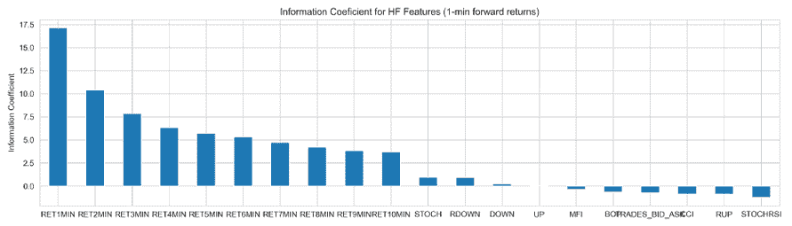

图 12.20：高频特征的信息系数

我们现在可以开始使用这些特征训练梯度提升模型。

## 使用 LightGBM 的分钟频率信号

为了为我们的 HFT 策略生成预测信号，我们将训练一个 LightGBM 提升模型来预测 1 分钟前向回报。模型在训练期间接收 12 个月的分钟数据，并为随后的 21 个交易日生成样本外预测。我们将重复这个过程 24 次训练-测试拆分，以涵盖我们 5 年样本的最后 2 年。

训练过程与前述的 LightGBM 示例密切相关；有关实现细节，请参阅笔记本 `intraday_model`。

一个关键区别是将自定义 `MultipleTimeSeriesCV` 调整到分钟频率；我们将引用 `MultiIndex` 的 `date_time` 级别（有关实现，请参阅笔记本）。我们根据每个股票和每天的 390 个观测值计算训练和测试期间的长度如下：

```py
DAY = 390   # minutes; 6.5 hrs (9:30 - 15:59)
MONTH = 21  # trading days
n_splits = 24
cv = MultipleTimeSeriesCV(n_splits=n_splits,
                          lookahead=1,
                          test_period_length=MONTH * DAY,
                          train_period_length=12 * MONTH * DAY,
                          date_idx='date_time') 
```

大数据规模显著推高了训练时间，所以我们使用默认设置，但将每个集成的树数量设置为 250\. 我们使用以下 `ic_lgbm()` 自定义指标定义跟踪测试集上的 IC，我们将其传递给模型的 `.train()` 方法。

自定义指标接收模型预测和二元训练数据集，我们可以使用它来计算任何感兴趣的指标；注意我们将 `is_higher_better` 设置为 `True`，因为模型默认通过最小化损失函数来进行优化（有关更多信息，请参阅 LightGBM 文档）：

```py
def ic_lgbm(preds, train_data):
    """Custom IC eval metric for lightgbm"""
    is_higher_better = True
    return 'ic', spearmanr(preds, train_data.get_label())[0], is_higher_better
model = lgb.train(params=params,
                  train_set=lgb_train,
                  valid_sets=[lgb_train, lgb_test],
                  feval=ic_lgbm,
                  num_boost_round=num_boost_round,
                  early_stopping_rounds=50,
                  verbose_eval=50) 
```

在 250 次迭代中，大多数折叠的验证 IC 仍在改善，因此我们的结果并不理想，但是这种方式的训练已经花费了数小时。现在让我们来看一下我们模型生成的信号的预测内容。

## 评估交易信号的质量

现在，我们想知道模型的样本外预测有多准确，以及它们是否可以成为盈利交易策略的基础。

首先，我们计算 IC，既对所有预测，也在每日基础上，如下所示：

```py
ic = spearmanr(cv_preds.y_test, cv_preds.y_pred)[0]
by_day = cv_preds.groupby(cv_preds.index.get_level_values('date_time').date)
ic_by_day = by_day.apply(lambda x: spearmanr(x.y_test, x.y_pred)[0])
daily_ic_mean = ic_by_day.mean()
daily_ic_median = ic_by_day.median() 
```

对于连续 2 年的样本外测试，我们得到了一个统计上显著的正值为 1.90\. 每日的均值 IC 为 1.98，中位数 IC 等于 1.91。

这些结果清楚地表明，预测包含了我们可以用于交易策略的短期价格运动方向和大小的有意义信息。

接下来，我们计算每个预测的十分位的平均和累积前向回报：

```py
dates = cv_preds.index.get_level_values('date_time').date
cv_preds['decile'] = (cv_preds.groupby(dates, group_keys=False)
min_ret_by_decile = cv_preds.groupby(['date_time', 'decile']).y_test.mean()
                      .apply(lambda x: pd.qcut(x.y_pred, q=10))))
cumulative_ret_by_decile = (min_ret_by_decile
                            .unstack('decile')
                            .add(1)
                            .cumprod()
                            .sub(1)) 
```

*图 12.21* 展示了结果。左侧面板显示了每个十分位的平均 1 分钟回报，并显示每分钟 0.5 个基点的平均差异。右侧面板显示了等权重组合投资于每个十分位的累积回报，表明在交易成本之前，一个多空策略似乎是有吸引力的：

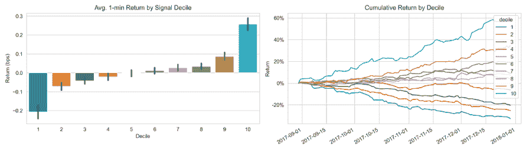

图 12.21：每个十分位的平均 1 分钟回报和累积回报

使用分钟级数据进行回测非常耗时，因此我们省略了这一步；但是，可以随意尝试使用 Zipline 或 backtrader 在更现实的交易成本假设下评估这个策略，或者使用适当的风险控制。

# 总结

在本章中，我们探讨了梯度提升算法，它用于以顺序方式构建集成模型，逐步添加浅层决策树来改善已做出的预测，这些决策树仅使用极少量的特征。我们看到了梯度提升树可以非常灵活地应用于广泛的损失函数，以及提供了许多机会来调整模型以适应给定数据集和学习任务。

最近的实现大大地促进了梯度提升的使用。他们通过加速训练过程并提供更一致和详细的洞察力，以了解特征的重要性和个别预测的驱动因素。

最后，我们开发了一个简单的交易策略，由一组梯度提升模型驱动，至少在交易成本显著之前是有盈利的。我们还看到了如何使用梯度提升处理高频数据。

在下一章中，我们将转向贝叶斯方法来进行机器学习。
