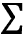

# 13

# 使用无监督学习的数据驱动风险因子和资产配置。

*第六章*，*机器学习过程*，介绍了无监督学习通过发现数据结构而增加价值，而不需要结果变量来指导搜索过程。这与前几章的监督学习形成了对比：无监督学习不是预测未来结果，而是旨在学习数据的信息表示，帮助探索新数据、发现有用的见解或更有效地解决其他任务。

降维和聚类是无监督学习的主要任务：

+   **降维**将现有特征转换为新的、较小的集合，同时尽量减小信息损失。算法在如何衡量信息损失、是否应用线性或非线性转换以及对新特征集施加哪些约束方面存在差异。

+   **聚类算法**识别并对相似的观察结果或特征进行分组，而不是识别新特征。算法在如何定义观察结果的相似性以及对结果组的假设方面存在差异。

当一个**数据集不包含结果**时，这些无监督算法非常有用。例如，我们可能希望从大量财务报告或新闻文章中提取可交易的信息。在*第十四章*，*用于交易的文本数据 - 情感分析*中，我们将使用主题建模来发现隐藏的主题，以更有效地探索和总结内容，并且识别有助于我们提取信号的有意义的关系。

当我们希望**独立于结果**地提取信息时，这些算法也非常有用。例如，与使用第三方行业分类不同，聚类允许我们根据资产的属性（例如在一定时间范围内的回报、风险因子的暴露或类似的基本面）识别出对我们有用的合成分组。在本章中，我们将学习如何使用聚类来通过识别资产回报之间的分层关系来管理投资组合风险。

更具体地说，在阅读本章后，您将了解：

+   如何通过主成分分析（**PCA**）和独立成分分析（**ICA**）进行线性降维。

+   使用 PCA 从资产回报中识别基于数据的风险因子和特征组合。

+   使用流形学习有效地可视化非线性、高维数据。

+   使用 T-SNE 和 UMAP 来探索高维图像数据。

+   k-means、层次和基于密度的聚类算法的工作原理。

+   使用凝聚式聚类构建具有分层风险平衡的强大投资组合。

您可以在 GitHub 存储库的相应目录中找到本章的代码示例和附加资源链接。笔记本包括图像的彩色版本。

# 降维

用线性代数的术语来说，数据集的特征创建了一个**向量空间**，其维度对应于线性独立行或列的数量，取两者中较大的一个。 当两列完全相关时，它们是线性相关的，以至于一个可以使用加法和乘法的线性运算从另一个计算出来。

换句话说，它们是代表相同方向而不是不同方向的平行向量，在数据中只构成一个维度。 同样，如果一个变量是几个其他变量的线性组合，那么它是由这些列创建的向量空间的一个元素，并且不会添加自己的新维度。

数据集的维数数量很重要，因为每个新维度都可能添加有关结果的信号。 但是，还存在一个被称为**维数灾难**的负面效应：随着独立特征数量的增加，而观察数量保持不变，数据点之间的平均距离也增加，并且特征空间的密度呈指数级下降，这对**机器学习**（**ML**）有重大影响。 当观察值之间距离更远时，即彼此不同，**预测变得更加困难**。 替代数据源，如文本和图像，通常具有很高的维度，但它们通常影响依赖大量特征的模型。 下一节将解决由此产生的挑战。

降维旨在通过使用更少的特征**更有效地表示数据**。 为此，算法将数据投影到低维空间，同时丢弃任何不具信息量的变化，或者通过识别数据所在位置附近的低维子空间或流形。

**流形**是一个在局部类似于欧几里得空间的空间。 一维流形包括线或圆，但不包括数字八的可视表示，因为没有交叉点。

流形假设认为高维数据通常驻留在较低维空间中，如果识别出，就可以在此子空间中忠实地表示数据。 有关背景信息和测试此假设的算法描述，请参阅 Fefferman，Mitter 和 Narayanan（2016）。

因此，降维通过找到一个不同的、更小的变量集合来捕捉原始特征中最重要的内容，以最小化信息损失。 压缩有助于对抗维数灾难，节省内存，并允许可视化原本非常难以探索的高维数据的显着方面。

降维算法的不同之处在于它们对新变量施加的约束以及它们如何最小化信息损失（参见 Burges 2010 提供的出色概述）：

+   像 PCA 和 ICA 这样的**线性算法**将新变量限制为原始特征的线性组合；例如，低维空间中的超平面。而 PCA 要求新特征无相关性，ICA 进一步强调统计独立性，意味着没有线性和非线性关系。

+   **非线性算法**不受超平面限制，可以捕捉数据中更复杂的结构。然而，鉴于无限的选项，算法仍然需要做出假设才能得出解决方案。本节稍后，我们将解释**t-分布随机邻域嵌入**（**t-SNE**）和**均匀流形近似和投影**（**UMAP**）如何用于可视化更高维度的数据。*图 13.1*说明了流形学习如何在三维特征空间中识别二维子空间。（笔记本`manifold_learning`说明了使用其他算法，包括局部线性嵌入。）

    图 13.1：非线性降维

## 维度诅咒

数据集维度的增加意味着在相应的欧几里得空间中，代表每个观察值的特征向量中有更多的条目。

我们使用欧几里得距离（也称为 L²范数）在向量空间中测量距离，我们将其应用于线性回归系数向量以训练正则化的岭回归。

两个具有笛卡尔坐标*p* = (*p*[1], *p*[2], ..., *p*[n])和*q* = (*q*[1], *q*[2], ..., *q*[n])的*n*维向量之间的欧几里得距离是使用毕达哥拉斯开发的熟悉公式计算的：


因此，每个新维度都会向总和中添加非负项，使得距离随着不同向量的维数增加而增加。换句话说，随着特征数量对于给定观察数的增长，特征空间变得越来越稀疏，即变得更少或更空。另一方面，较低的数据密度需要更多的观察来保持数据点之间的平均距离不变。

*图 13.2*说明了随着维度数量增加，为保持观察之间的平均距离所需的数据点数量呈指数增长。在线上均匀分布的 10 个点对应于二维中的 10²个点和三维中的 10³个点，以保持密度不变。


图 13.2：为保持平均距离恒定所需的特征数量随维度数量的指数增长

本节的 GitHub 存储库文件夹中的笔记本`the_curse_of_dimensionality`模拟了随着维度数量增长，数据点之间的平均距离和最小距离如何增加（见*图 13.3*）。


图 13.3：单位超立方体中 1,000 个数据点的平均距离

**模拟**随机从不相关均匀或相关正态分布中的[0, 1]范围内抽取高达 2,500 个特征。对于正态分布，数据点之间的平均距离增加到超过单位特征范围的 11 倍，对于（极端）不相关均匀分布，增加到超过 20 倍。

当**观察之间的距离**增加时，监督式机器学习变得更加困难，因为对新样本的预测不太可能基于从类似训练特征中学习。简而言之，随着特征数量的增加，可能的唯一行数呈指数增长，使得有效地对空间进行抽样变得更加困难。同样，通过对实际关系做出较少假设的灵活算法学习的函数的复杂度随维度数量的增加呈指数增长。

灵活的算法包括我们在*第十一章*看到的基于树的模型，*随机森林-一种日本股票的多空策略*，以及*第十二章*，*提升您的交易策略*。它们还包括本书后面将介绍的深度神经网络，从*第十六章*开始，*用于盈利电话和 SEC 提交的词嵌入*。随着**更多维度增加了过拟合的机会**，这些算法的方差增加，导致泛化性能不佳。

降维利用了实践中特征通常相关或变化很小的事实。如果是这样，它可以在不损失信号太多的情况下压缩数据，并补充使用正则化来管理由方差和模型复杂性导致的预测误差。

随后我们将探讨的关键问题是：找到数据的低维表示的最佳方法是什么？

## 线性降维

线性降维算法计算线性组合，**转换**，**旋转**和**重新缩放原始特征**，以捕获数据中的显着变化，同时受制于对新特征特性的约束。

PCA 由 Karl Pearson 于 1901 年发明，它找到反映数据中最大方差方向的新特征，同时彼此不相关。相比之下，ICA 起源于 20 世纪 80 年代的信号处理，其目标是在施加较强的统计独立性约束的同时分离不同的信号。

本节介绍了这两种算法，然后说明了如何将 PCA 应用于资产回报，以从数据中学习风险因素，并构建所谓的特征组合以进行系统交易策略。

### 主成分分析

PCA 找到现有特征的线性组合，并使用这些主成分来表示原始数据。组件的数量是一个超参数，它决定了目标维度，并且最多可以等于行数或列数中较小的那个。

PCA 的目标是捕获数据中大部分的方差，以便容易地恢复原始特征，并确保每个组件都添加信息。它通过将原始数据投影到主成分空间来降低维度。

PCA 算法通过识别一系列组件来工作，每个组件都与考虑了先前计算的组件捕捉的方差后数据中的最大方差的方向对齐。顺序优化确保新组件与现有组件不相关，并为向量空间生成正交基。

这个新基是原始基的旋转，使得新轴指向逐渐减小的方差的方向。由每个主成分解释的原始数据方差量的下降反映了原始特征之间相关性的程度。换句话说，捕获例如原始变异的 95％的组件的份额提供了有关原始数据中的线性独立信息的见解。

#### 在二维中可视化 PCA

*图 13.4*说明了用于二维随机数据集的 PCA 的几个方面（参考笔记本 `pca_key_ideas`）：

+   左侧面板显示了第一和第二主成分如何与**最大方差的方向**对齐并且正交。

+   中央面板显示了第一主成分如何将**重构误差**最小化，其衡量方式为数据点与新轴之间的距离之和。

+   右侧面板说明了**有监督 OLS**（参考*第七章*，*线性模型 - 从风险因素到回报预测*），它通过从单个特征*x*[1]计算的线来近似结果(*x*[2])。垂直线突出显示 OLS 最小化沿结果轴的距离，而 PCA 最小化与超平面正交的距离。


图 13.4：来自各个角度的二维 PCA

#### PCA 的关键假设

PCA 做出了几个重要的假设，需要记住。其中包括：

+   高方差意味着高信噪比。

+   数据经过标准化处理，使得各个特征的方差可比较。

+   线性变换捕捉了数据的相关方面。

+   第一和第二阶的统计量之外的高阶统计量并不重要，这意味着数据具有正态分布。

对第一和第二时刻的强调与标准的风险/收益度量一致，但正态性假设可能与市场数据的特征相冲突。市场数据经常表现出与正态分布不同的偏斜或峰度（厚尾），PCA 将不考虑这些特征。

#### PCA 算法的工作原理

该算法找到向量来创建目标维度的超平面，以最小化重构误差，重构误差以数据点到平面的平方距离之和来衡量。如前所述，这个目标对应于找到一系列向量，这些向量与最大保留方差的方向相一致，给定其他分量，同时确保所有主成分互相正交。

在实践中，该算法通过计算协方差矩阵的特征向量或使用 **奇异值分解**（**SVD**）来解决问题。

我们使用一个随机生成的具有 100 个数据点的三维椭圆来说明计算，如 *图 13.5* 的左面板所示，包括由前两个主成分定义的二维超平面。（参见笔记本 `the_math_behind_pca`，下面三个部分的代码示例。）


图 13.5: 从 3D 到 2D 的维度缩减的可视化表示

#### 基于协方差矩阵的 PCA

我们首先使用方阵协方差矩阵计算主成分，其中特征 *x*[i]、*x*[j] 的成对样本协方差作为第 *i* 行和第 *j* 列的条目：


对于 *n* 维度的方阵 *M*，我们将特征向量  和特征值 [i]，*i*=1, ..., *n* 定义如下：


因此，我们可以使用特征向量和特征值来表示矩阵 *M*，其中 *W* 是一个包含特征向量作为列向量的矩阵，*L* 是一个包含特征值 [i] 作为对角线条目（其他情况下为 0）的矩阵。我们将 **特征值分解** 定义为：


使用 NumPy，我们实现如下，其中 pandas DataFrame 数据包含椭圆的 100 个数据点：

```py
# compute covariance matrix: 
cov = np.cov(data.T) # expects variables in rows by default
cov.shape
(3, 3) 
```

接下来，我们计算协方差矩阵的特征向量和特征值。特征向量包含主成分（符号是任意的）：

```py
eigen_values, eigen_vectors = eig(cov)
eigen_vectors
array([[ 0.71409739, -0.66929454, -0.20520656],
       [-0.70000234, -0.68597301, -0.1985894 ],
       [ 0.00785136, -0.28545725,  0.95835928]]) 
```

我们可以将结果与从 sklearn 获得的结果进行比较，并发现它们在绝对意义上匹配：

```py
pca = PCA()
pca.fit(data)
C = pca.components_.T # columns = principal components
C
array([[ 0.71409739,  0.66929454,  0.20520656],
       [-0.70000234,  0.68597301,  0.1985894 ],
       [ 0.00785136,  0.28545725, -0.95835928]])
np.allclose(np.abs(C), np.abs(eigen_vectors))
True 
```

我们也可以 **验证特征值分解**，从包含特征值的对角矩阵 *L* 开始：

```py
# eigenvalue matrix
ev = np.zeros((3, 3))
np.fill_diagonal(ev, eigen_values)
ev # diagonal matrix
array([[1.92923132, 0\.        , 0\.        ],
       [0\.        , 0.55811089, 0\.        ],
       [0\.        , 0\.        , 0.00581353]]) 
```

我们发现结果确实成立：

```py
decomposition = eigen_vectors.dot(ev).dot(inv(eigen_vectors))
np.allclose(cov, decomposition) 
```

#### 使用奇异值分解的 PCA

接下来，我们将查看使用 SVD 进行的备用计算。当观测数量大于特征数量时（这是典型情况），此算法较慢，但在一些特征高度相关的情况下（这通常是使用 PCA 的原因）产生更好的**数值稳定性**。

SVD 将我们刚刚应用于方阵和对称协方差矩阵的特征分解推广到更一般的*m* x *n*矩形矩阵情况。它的形式如下图中心所示。的对角线值是奇异值，*V*的转置包含作为列向量的主成分。


图 13.6：SVD 分解

在这种情况下，我们需要确保我们的数据以零均值为中心（之前的协方差计算已经处理了这个）：

```py
n_features = data.shape[1]
data_ = data - data.mean(axis=0) 
```

使用居中的数据，我们计算 SVD：

```py
U, s, Vt = svd(data_)
U.shape, s.shape, Vt.shape
((100, 100), (3,), (3, 3)) 
```

我们可以将仅包含奇异值的向量`s`转换为一个*n* x *m*矩阵，并展示分解的工作原理：

```py
S = np.zeros_like(data_)
S[:n_features, :n_features] = np.diag(s)
S.shape
(100, 3) 
```

我们发现分解确实复制了标准化数据：

```py
np.allclose(data_, U.dot(S).dot(Vt))
True 
```

最后，我们确认*V*的转置的列包含主成分：

```py
np.allclose(np.abs(C), np.abs(Vt.T)) 
```

在下一节中，我们将演示 sklearn 如何实现 PCA。

#### 使用 sklearn 进行 PCA

`sklearn.decomposition.PCA`实现遵循基于`fit()`和`transform()`方法的标准 API，分别计算所需数量的主成分并将数据投影到组件空间。方便的`fit_transform()`方法在一个步骤中完成此操作。

PCA 提供了三种不同的算法，可以使用`svd_solver`参数指定：

+   **full**使用由 scipy 提供的 LAPACK 求解器计算精确的 SVD。

+   **arpack**运行适合计算不到完整数量组件的截断版本。

+   **randomized**使用基于抽样的算法，当数据集具有超过 500 个观测值和特征，并且目标是计算少于 80%的组件时，它更有效率。

+   **auto**也随机化到最有效的地方；否则，它使用完整的 SVD。

请在 GitHub 上查看算法实现细节的参考资料。

PCA 对象的其他关键配置参数是：

+   **n_components**：通过传递`None`（默认值）来计算所有主成分，或将数量限制为`int`。对于`svd_solver=full`，还有两个额外选项：[0, 1]区间内的`float`计算保留数据方差相应份额所需的组件数量，选项`mle`使用最大似然估计维度数量。

+   **whiten**：如果为`True`，则将组件向量标准化为单位方差，在某些情况下，这可能对预测模型有用（默认值为`False`）。

要计算三维椭圆的前两个主成分并将数据投影到新空间中，请使用 `fit_transform()`：

```py
pca2 = PCA(n_components=2)
projected_data  = pca2.fit_transform(data)
projected_data.shape
(100, 2) 
```

前两个成分的解释方差非常接近 100%：

```py
pca2.explained_variance_ratio_
array([0.77381099, 0.22385721]) 
```

*图 13.5* 显示了数据投影到新的二维空间中。

### 独立成分分析

ICA 是另一个线性算法，它确定一个新的基来表示原始数据，但追求的目标与 PCA 不同。有关详细介绍，请参阅 Hyvärinen 和 Oja（2000）。

ICA 出现在信号处理中，它旨在解决的问题被称为**盲源分离**。通常将其描述为鸡尾酒会问题，其中给定数量的客人同时发言，以至于单个麦克风记录重叠信号。ICA 假设存在与说话者数量相同的不同麦克风，每个麦克风放置在不同的位置，以便它们记录不同的信号混合。然后，ICA 旨在从这些不同的记录中恢复单个信号。

换句话说，有 *n* 个原始信号和一个未知的方阵混合矩阵 *A*，产生一个 *n* 维 *m* 观测值集合，使得


目标是找到矩阵 *W* = *A*^(-1)，解开混合信号以恢复源。

唯一确定矩阵 *W* 的能力取决于数据的非高斯分布。否则，由于多变量正态分布在旋转下的对称性，*W* 可以任意旋转。此外，ICA 假设混合信号是其组成部分的和，因此无法识别高斯分量，因为它们的总和也是正态分布的。

#### ICA 假设

ICA 做出了以下关键假设：

+   信号的源是统计独立的

+   线性变换足以捕获相关信息

+   独立成分不具有正态分布

+   混合矩阵 *A* 是可以求逆的。

ICA 还要求数据被居中和白化，即彼此不相关且具有单位方差。使用前述概述的 PCA 对数据进行预处理可以实现所需的转换。

#### ICA 算法

`FastICA` 是 sklearn 中使用的一种固定点算法，它使用高阶统计量来恢复独立源。特别是，它将每个组件的距离最大化到正态分布，作为独立性的代理。

一种称为 `InfoMax` 的替代算法将组件之间的互信息最小化，作为统计独立性的度量。

#### 用 sklearn 进行 ICA

sklearn 中的 ICA 实现使用与 PCA 相同的接口，因此几乎没有额外添加。请注意，没有解释方差的度量，因为 ICA 不会连续计算组件。相反，每个组件旨在捕获数据的独立方面。

## 流形学习 – 非线性降维

线性降维将原始数据投影到一个与数据中信息方向对齐的较低维度超平面上。专注于线性变换简化了计算，并回应了常见的金融度量，例如 PCA 旨在捕获最大方差。

然而，线性方法自然会忽略数据中非线性关系反映的信号。这样的关系在包含图像或文本数据的替代数据集中非常重要。在探索性分析期间检测到这种关系可以提供有关数据潜在信号内容的重要线索。

相比之下，**流形假设**强调高维数据通常位于或接近嵌入在高维空间中的较低维度非线性流形上。在本章开头显示的二维瑞士卷（*图 13.1*）阐明了这样的拓扑结构。流形学旨在找到固有维度的流形，然后在该子空间中表示数据。一个简化的例子使用道路作为三维空间中的一维流形，并使用房屋编号作为局部坐标来识别数据点。

几种技术可以近似一个较低维度的流形。其中一个例子是**局部线性嵌入**（**LLE**），由劳伦斯·索尔和萨姆·罗维斯（2000 年）发明，并用于“展开”在*图 13.1*中显示的瑞士卷（查看`manifold_learning_lle`笔记本中的示例）。

对于每个数据点，LLE 识别给定数量的最近邻居，并计算代表每个点的线性组合的权重。它通过在较低维度流形上的全局内部坐标上线性投影每个邻域来找到一个较低维度的嵌入，并可以被看作是一系列 PCA 应用。

可视化要求降维至少三个维度，可能低于固有维度，并提出了**忠实地表示局部和全局结构的挑战**。这个挑战与维度诅咒有关；也就是说，虽然球体的体积随着维度数量的增加呈指数级增长，但用于表示高维数据的低维空间要有限得多。例如，在 12 个维度中，可能有 13 个等距点；然而，在二维空间中，只能有 3 个形成边长相等的三角形。因此，在较低维度准确反映一个点到其高维邻居的距离会有可能扭曲所有其他点之间的关系。结果就是**拥挤问题**：为了保持全局距离，局部点可能需要被放置得太接近。

接下来的两个部分涵盖了使我们在处理复杂数据集的可视化中取得进展的技术。我们将使用 Fashion MNIST 数据集，这是一个更复杂的选择，用于计算机视觉的经典手写数字 MNIST 基准数据。它包含 60,000 个训练图像和 10,000 个测试图像，分为 10 个类别（在笔记本 `manifold_learning_intro` 中查看样本图像）。该数据的流形学习算法的目标是检测类别是否位于不同的流形上，以促进它们的识别和区分。

### t-分布随机近邻嵌入

t-SNE 是由 Laurens van der Maaten 和 Geoff Hinton 于 2008 年开发的获奖算法，用于检测高维数据中的模式。它采用概率、非线性的方法来定位数据在几个不同但相关的低维流形上。该算法强调将相似的点放在低维中放在一起，而不是像 PCA 这样的算法那样保持在高维中相距较远的点之间的距离最小化。

该算法通过 **将高维距离转换为（条件）概率** 来进行，其中高概率意味着低距离，并反映了基于相似性对两个点进行采样的可能性。首先，在每个点上定位一个正态分布，并计算点和每个邻居的密度，其中 `perplexity` 参数控制有效邻居的数量。在第二步中，它将点排列在低维中，并使用类似计算的低维概率来匹配高维分布。它通过 Kullback-Leibler 散度来衡量分布之间的差异，这会对低维中的相似点放置高惩罚。

低维概率使用一个自由度为 1 的学生 t 分布，因为它有更胖的尾部，减少了放置更远的高维点的惩罚，以管理拥挤问题。

*图 13.7* 的上半部分显示了 t-SNE 如何区分 FashionMNIST 图像类别。更高的困惑度值增加了用于计算局部结构的邻居数，并逐渐强调全局关系。 （参考存储库以获取此图的高分辨率彩色版本。）


图 13.7：Fashion MNIST 图像数据的 t-SNE 和 UMAP 可视化，针对不同的超参数

t-SNE 是目前高维数据可视化的最新技术。其缺点包括计算复杂度随着点数 *n* 呈二次增长，因为它评估所有成对距离，但随后基于树的实现将成本降低到 *n* log *n*。

不幸的是，t-SNE 不利于将新数据点投影到低维空间。压缩的输出对于基于距离或密度的聚类算法不是非常有用，因为 t-SNE 对待小距离和大距离的方式不同。

### 统一流形近似和投影

UMAP 是一种用于可视化和通用降维的较新算法。它假设数据在局部连接流形上均匀分布，并寻找最接近的低维等价物，使用模糊拓扑。它使用一个 `neighbors` 参数，其影响结果与前面一节中的 `perplexity` 类似。

它比 t-SNE 更快，因此更适用于大型数据集，并且有时比 t-SNE 更好地保留全局结构。它还可以使用不同的距离函数，包括用于测量单词计数向量之间距离的余弦相似度。

上图说明了 UMAP 确实将不同的聚类进一步分开，而 t-SNE 则提供了更精细的局部结构洞察。

笔记本还包含交互式 Plotly 可视化，用于探索每个算法的标签，并确定哪些对象彼此靠近。

# 用于交易的 PCA

PCA 在算法交易中有几个方面的用处，包括：

+   将 PCA 应用于资产收益以数据驱动地推导风险因素

+   基于资产收益相关系数矩阵的主成分构建不相关投资组合

我们将在本节中说明这两个应用。

## 数据驱动的风险因素

在*第七章*中，*线性模型 - 从风险因素到收益预测*，我们探讨了量化金融中用于捕捉收益主要驱动因素的**风险因素模型**。这些模型根据资产暴露于系统性风险因素的程度以及与这些因素相关的回报来解释资产收益的差异。特别是，我们探讨了**法玛-法 rench 方法**，该方法根据关于平均收益的经验行为的先验知识指定因子，将这些因子视为可观察因子，然后使用线性回归估计风险模型系数。

另一种方法将风险因素视为**潜在变量**，并使用因子分析技术如 PCA 同时从数据中学习因子并估计它们如何影响收益。在本节中，我们将演示这种方法如何以纯粹的统计或数据驱动方式推导因子，并具有不需要事先了解资产收益行为的优点（详见笔记本 `pca_and_risk_factor_models` 了解更多详情）。

### 准备数据 - 美国前 350 家股票

我们将使用 Quandl 股票价格数据，并选择市值最大的 500 支股票的每日调整收盘价和 2010 年至 2018 年期间的数据。然后，我们将计算每日收益如下：

```py
idx = pd.IndexSlice
with pd.HDFStore('../../data/assets.h5') as store:
    stocks = store['us_equities/stocks'].marketcap.nlargest(500)
    returns = (store['quandl/wiki/prices']
               .loc[idx['2010': '2018', stocks.index], 'adj_close']
               .unstack('ticker')
               .pct_change()) 
```

我们获得了 351 只股票和超过 2000 个交易日的回报：

```py
returns.info()
DatetimeIndex: 2072 entries, 2010-01-04 to 2018-03-27
Columns: 351 entries, A to ZTS 
```

PCA 对异常值敏感，因此我们分别在 2.5％和 97.5％的分位数上修剪数据：

PCA 不允许缺失数据，因此我们将删除任何在至少 95％的时间段内没有数据的股票。然后，在第二步中，我们将删除在剩余股票中至少 95％的交易日没有观察到的日子：

```py
returns = returns.dropna(thresh=int(returns.shape[0] * .95), axis=1)
returns = returns.dropna(thresh=int(returns.shape[1] * .95)) 
```

我们留下了 315 个股票回报系列，覆盖了一个类似的时期：

```py
returns.info()
DatetimeIndex: 2071 entries, 2010-01-05 to 2018-03-27
Columns: 315 entries, A to LYB 
```

我们使用给定交易日的平均回报来填补任何剩余的缺失值：

```py
daily_avg = returns.mean(1)
returns = returns.apply(lambda x: x.fillna(daily_avg)) 
```

### 运行 PCA 以确定主要的回报驱动因素

现在我们已经准备好使用默认参数将主成分模型拟合到资产收益上，使用全 SVD 算法来计算所有组件：

```py
pca = PCA(n_components='mle')
pca.fit(returns) 
```

我们发现最重要的因素解释了大约 55％的日回报变动。主导因素通常被解释为“市场”，而其余因素可以根据更密切的检查结果（请参阅下一个示例）被解释为行业或风格因素，与我们在*第五章*，*投资组合优化和绩效评估*和*第七章*，*线性模型—从风险因子到回报预测*中的讨论一致。

*图 13.8*右侧的图显示了累积解释方差，并指出大约有 10 个因子解释了这个股票横截面收益的 60％。


图 13.8：基于 PCA 的风险因子解释回报方差（累积）

笔记本包含了对更广泛的股票横截面和更长的 2000-2018 年时间段的**模拟**。结果发现，平均而言，前三个组件解释了 500 只随机选择的股票的 40％、10％和 5％，如*图 13.9*所示：


图 13.9：前 10 个主要组件的解释方差—100 次试验

累积图显示了一种典型的“肘部”模式，可以帮助确定一个合适的目标维度，即超过该维度的组件所增加的价值较少。

我们可以选择前两个主成分来验证它们确实是不相关的：

```py
risk_factors = pd.DataFrame(pca.transform(returns)[:, :2], 
                            columns=['Principal Component 1', 
                                     'Principal Component 2'], 
                            index=returns.index)
(risk_factors['Principal Component 1']
.corr(risk_factors['Principal Component 2']))
7.773256996252084e-15 
```

此外，我们可以绘制时间序列以突出每个因子捕捉不同波动性模式的情况，如下图所示：


图 13.10：第一个和第二个主成分捕获的回报波动模式

风险因子模型将采用主成分的子集作为特征来预测未来的回报，类似于我们在*第七章*，*线性模型—从风险因子到回报预测*中的方法。

## 特征组合

PCA 的另一个应用涉及标准化回报的协方差矩阵。相关矩阵的主成分按降序捕捉大部分资产之间的协变化，并且彼此不相关。此外，我们可以将标准化主成分用作投资组合权重。你可以在笔记本 `pca_and_eigen_portfolios` 中找到此部分的代码示例。

让我们使用 2010-2018 年间有数据的 30 家最大的股票来简化阐述：

```py
idx = pd.IndexSlice
with pd.HDFStore('../../data/assets.h5') as store:
    stocks = store['us_equities/stocks'].marketcap.nlargest(30)
    returns = (store['quandl/wiki/prices']
               .loc[idx['2010': '2018', stocks.index], 'adj_close']
               .unstack('ticker')
               .pct_change()) 
```

我们再次对回报进行截尾并进行标准化处理：

```py
normed_returns = scale(returns
                       .clip(lower=returns.quantile(q=.025), 
                             upper=returns.quantile(q=.975), 
                             axis=1)
                       .apply(lambda x: x.sub(x.mean()).div(x.std()))) 
```

在像上一个示例中一样剔除资产和交易日后，我们剩下了 23 个资产和超过 2000 个交易日。我们计算回报协方差并估计所有主成分，发现前两个分别解释了 55.9% 和 15.5% 的协变化：

```py
cov = returns.cov()
pca = PCA()
pca.fit(cov)
pd.Series(pca.explained_variance_ratio_).head()
0	55.91%
1	15.52%
2	5.36%
3	4.85%
4	3.32% 
```

接下来，我们选择并标准化四个最大的成分，使它们总和为 1，然后我们可以将它们用作投资组合的权重，以便与由所有股票组成的等权投资组合进行比较：

```py
top4 = pd.DataFrame(pca.components_[:4], columns=cov.columns)
eigen_portfolios = top4.div(top4.sum(1), axis=0)
eigen_portfolios.index = [f'Portfolio {i}' for i in range(1, 5)] 
```

权重显示出明显的强调，如 *图 13.11* 所示。例如，投资组合 3 对样本中的两个支付处理器 Mastercard 和 Visa 有较大的权重，而投资组合 2 对技术公司有更多的暴露：


图 13.11: 主成分投资组合权重

当比较样本期内每个投资组合的表现与由我们的小样本组成的“市场”时，我们发现投资组合 1 的表现非常相似，而其他投资组合捕捉到不同的回报模式（见 *图 13.12*）。


图 13.12: 累积主成分投资组合回报

# 聚类

聚类和降维都对数据进行总结。正如我们刚刚讨论的，降维通过使用新的、更少的特征来表示数据，从而压缩数据，以捕捉最相关的信息。相比之下，聚类算法将现有观察结果分配给由相似数据点组成的子组。

聚类可以通过学习连续变量得到的类别视角更好地理解数据。它还允许您根据学习到的标准自动对新对象进行分类。相关应用的示例包括层次分类、医学诊断和客户分割。或者，可以使用聚类来表示群体作为原型，例如使用聚类的中点作为学习群体的最佳代表。一个示例应用是图像压缩。

聚类算法在识别分组的策略方面存在差异：

+   **组合** 算法选择不同观察结果的最一致的分组。

+   **概率** 建模估计最可能生成聚类的分布。

+   **层次聚类** 找到一系列嵌套的聚类，优化任何给定阶段的一致性。

算法还通过何为需要匹配数据特征、领域和应用目标的有用对象的概念而有所不同。 分组类型包括：

+   明确分离的各种形状的组

+   原型或基于中心的紧凑聚类

+   任意形状的基于密度的聚类

+   连通性或基于图的聚类

聚类算法的其他重要方面包括：

+   需要独占式聚类成员资格

+   进行硬的，即二进制的，或软的，概率的分配

+   是完整的，并将所有数据点分配到聚类中

以下各节介绍了关键算法，包括**k-means**、**层次**和**基于密度的聚类**，以及**高斯混合模型**（**GMMs**）。 笔记本 `clustering_algos` 比较了这些算法在不同的标记数据集上的性能，以突出它们的优缺点。 它使用互信息（参见*第六章*，*机器学习过程*）来衡量聚类分配与标签的一致性。

## k-means 聚类

k-means 是最知名的聚类算法，最早由 1957 年贝尔实验室的 Stuart Lloyd 提出。 它找到 *k* 个质心，并将每个数据点分配到恰好一个聚类中，目标是最小化簇内方差（称为 *惯性*）。 它通常使用欧几里得距离，但也可以使用其他度量标准。 k-means 假设聚类是球形且大小相等，并忽略特征之间的协方差。

### 将观察分配到聚类

该问题在计算上是困难的（NP-hard），因为有 *k*^N 种方法将 *N* 个观测分成 *k* 个聚类。 标准的迭代算法对于给定的 *k* 提供了局部最优解，并按照以下步骤进行：

1.  随机定义 *k* 个聚类中心并将点分配给最近的质心

1.  重复：

    1.  对于每个聚类，将特征的平均值计算为质心

    1.  将每个观察分配给最近的质心

1.  收敛：分配（或簇内变异）不发生变化

笔记本 `kmeans_implementation` 展示了如何使用 Python 编写该算法的代码。 它可视化了算法的迭代优化，并演示了结果质心如何将特征空间划分为称为 Voronoi 的区域，这些区域勾勒出了簇。 对于给定的初始化，结果是最优的，但是不同的起始位置将产生不同的结果。 因此，我们从不同的初始值计算多个聚类，并选择最小化簇内方差的解决方案。

k-means 需要连续或独热编码的分类变量。 距离度量通常对规模敏感，因此需要对特征进行标准化以确保它们具有相同的权重。

k-means 的**优点**包括其广泛的适用性，快速收敛，对大数据的线性可伸缩性以及生成大小均匀的聚类。**缺点**包括需要调整超参数*k*，不能保证找到全局最优解，限制性假设聚类为球形，特征不相关。它还对离群值敏感。

### 评估聚类质量

聚类质量度量有助于从多个聚类结果中选择。笔记本`kmeans_evaluation`说明了以下选项。

**k-means 目标**函数建议我们比较惯性或聚类内方差的演变。最初，额外的质心会急剧降低惯性，因为新的聚类改善了整体拟合。一旦找到适当数量的聚类（假设存在），新的质心减少了聚类内方差，因为它们倾向于分割自然的分组。

因此，当 k-means 找到数据的良好聚类表示时，**惯性**往往会呈现类似于 PCA 的解释方差比的拐点形状（查看笔记本以获取实现细节）。

**轮廓系数**提供了聚类质量的更详细的图景。它回答了一个问题：最近聚类中的点相对于分配的聚类中的点有多远？为此，它比较了平均类内距离*a*与最近聚类的平均距离*b*，并计算了以下分数*s*：


分数可以在-1 和 1 之间变化，但在实践中不太可能出现负值，因为它们意味着大多数点被分配到错误的聚类中。轮廓分数的一个有用的可视化将每个数据点的值与全局平均值进行比较，因为它突显了每个聚类相对于全局配置的一致性。经验法则是要避免平均分数低于所有样本的平均值的聚类。

*图 13.13*显示了三个和四个聚类的轮廓图节选，前者突出了通过对全局轮廓分数的不足贡献来强调聚类 1 的拟合不佳，而所有四个聚类都具有一些值，这些值显示出高于平均分数的分数。


图 13.13：三个和四个聚类的轮廓图

总之，鉴于通常是无监督的性质，有必要改变聚类算法的超参数并评估不同的结果。还重要的是校准特征的比例，特别是当一些特征应该被赋予更高的权重并因此以较大的比例进行测量时。最后，为了验证结果的稳健性，使用数据子集来确定是否会一致出现特定的聚类模式。

## 分层聚类

分层聚类避免了需要指定目标聚类数的需要，因为它假设数据可以被逐步合并为越来越不相似的聚类。它不追求全局目标，而是逐步决定如何产生一系列从单个聚类到由个别数据点组成的聚类的嵌套聚类。

### 不同的策略和不相似度度量标准

有两种分层聚类方法：

1.  **聚合聚类** 自下而上进行，基于相似性顺序合并剩余的两个组。

1.  **分裂聚类** 自顶向下工作，顺序地分裂剩余的聚类，以产生最不同的子组。

两个组都产生*N*-1 个层次聚类，并有助于在最佳将数据分区为同质组的级别上选择聚类。我们将重点放在更常见的聚合聚类方法上。

聚合聚类算法不从个别数据点出发，而是计算一个包含所有相互距离的相似度矩阵。然后，它进行*N*-1 步，直到没有更多的不同聚类，并且每次都更新相似度矩阵以替换被新聚类合并的元素，使矩阵逐渐缩小。

虽然分层聚类没有像 k-means 那样的超参数，但是聚类之间（而不是个别数据点之间）的不相似度度量对聚类结果有重要影响。选项有以下不同：

+   **单连接法**：两个聚类的最近邻之间的距离

+   **完全连接法**：各自聚类成员之间的最大距离

+   **瓦德法**：最小化簇内方差

+   **组平均法**：使用聚类中点作为参考距离

### 可视化 - 树状图

分层聚类提供了关于观察值之间相似程度的见解，因为它继续合并数据。从一次合并到下一次合并的相似度度量的显着变化表明在此点之前存在自然的聚类。

**树状图** 将连续的合并可视化为一棵二叉树，将个别数据点显示为叶子，并将最终合并显示为树的根。它还显示了相似度如何从底部向顶部单调递减。因此，通过切割树状图来选择聚类是很自然的。有关实现详细信息，请参阅笔记本`hierarchical_clustering`。

*图 13.14* 展示了经典的鸢尾花数据集的树状图，其中有四类和三个特征，使用了前面部分介绍的四种不同的距离度量标准。它评估了分层聚类的拟合程度，使用了**科菲尼系数**，该系数比较了点之间的成对距离和聚类相似度指标，该指标显示了成对合并发生的聚类相似度度量。系数为 1 意味着更接近的点总是较早合并。


图 13.14：不同不相似度度量的树状图和共辐相关性

不同的链接方法产生不同的树状图“外观”，因此我们无法使用此可视化来跨方法比较结果。此外，最小化簇内方差的 Ward 方法可能不能正确反映方差从一个级别到下一个级别的变化。相反，树状图可以反映不同级别的总簇内方差，这可能会产生误导。与整体目标一致的替代质量度量更为适当，例如**共辐相关性**或与总体目标一致的度量标准，如**惯性**。

分层聚类的**优势**包括：

+   该算法不需要特定数量的聚类，而是通过直观的可视化提供了关于潜在聚类的见解。

+   它生成一系列可用作分类法的聚类层次结构。

+   它可以与 k 均值结合以减少聚合过程开始时的项目数量。

另一方面，它的**缺点**包括：

+   由于大量相似性矩阵更新而产生的计算和内存成本高昂。

+   所有合并都是最终的，因此它无法达到全局最优。

+   维度诅咒导致对嘈杂的高维数据困难重重。

## 基于密度的聚类

基于密度的聚类算法根据与其他聚类成员的接近程度分配聚类成员资格。它们追求识别任意形状和大小的密集区域的目标。它们不需要指定一定数量的聚类，而是依赖于定义邻域大小和密度阈值的参数。

我们将概述两种流行的算法：DBSCAN 及其较新的分层精化。请参考笔记本`density_based_clustering`中的相关代码示例以及本章的 GitHub 上的`README`链接，以了解 Jonathan Larking 使用 DBSCAN 进行配对交易策略的 Quantopian 示例。

### DBSCAN

**基于密度的带噪声空间聚类**（**DBSCAN**）于 1996 年开发，并因其在理论和实践中所受到的关注，在 2014 年的 KDD 会议上获得了 KDD 时代测试奖。

它旨在识别核心和非核心样本，其中前者扩展了一个聚类，而后者是聚类的一部分，但没有足够的附近邻居来进一步扩展聚类。其他样本是异常值，并且不分配给任何聚类。

它使用参数`eps`来表示邻域的半径和`min_samples`来表示需要的核心样本数量。它是确定性的和独占的，并且在具有不同密度和高维数据的情况下存在困难。调整参数以满足必要密度可能是具有挑战性的，特别是因为密度通常不是恒定的。

### 分层 DBSCAN

**层次 DBSCAN**（**HDBSCAN**）是更近期的发展，它假设聚类是潜在密度不同的岛屿，以克服刚提到的 DBSCAN 的挑战。它还旨在识别核心和非核心样本。它使用参数`min_cluster_size`和`min_samples`选择邻域并扩展聚类。该算法迭代多个`eps`值并选择最稳定的聚类。除了识别密度不同的聚类外，它还提供了有关数据密度和层次结构的洞察。

*图 13.15*显示了 DBSCAN 和 HDBSCAN 分别如何能够识别形状与 k 均值发现的聚类显著不同的簇。聚类算法的选择取决于数据的结构；请参考本节早期提到的配对交易策略以获得一个实际示例。


图 13.15：比较 DBSCAN 和 HDBSCAN 聚类算法

## 高斯混合模型

GMM 是假设数据由各种多元正态分布的混合生成的生成模型。该算法旨在估计这些分布的均值和协方差矩阵。

GMM 泛化了 k 均值算法：它在特征之间添加了协方差，使得聚类可以是椭球而不是球体，而聚类的中心点由每个分布的均值表示。GMM 算法执行软分配，因为每个点都有成为任何聚类成员的概率。

笔记本`gaussian_mixture_models`演示了实现并可视化结果聚类的过程。当 k 均值假设球形聚类过于约束时，你可能更喜欢 GMM 而不是其他聚类算法；鉴于其更大的灵活性，GMM 通常需要更少的聚类来产生良好的拟合效果。当你需要一个生成模型时，GMM 算法也更可取；因为 GMM 估计生成样本的概率分布，所以基于结果生成新样本很容易。

# 用于最优组合的层次聚类

在*第五章*，*组合优化和绩效评估*中，我们讨论了几种旨在选择给定资产集的组合权重以优化所得组合的风险和回报特性的方法。这些方法包括马科维茨的现代投资组合理论的均值-方差优化、凯利准则和风险平价。在本节中，我们介绍了更近期的创新（Prado 2016）——**层次风险平价**（**HRP**），它利用层次聚类根据子组的风险特征来分配资产仓位。

我们将首先介绍 HRP 的工作原理，然后使用我们在上一章中开发的梯度提升模型，通过长仓策略比较其性能。

## 层次风险平价的工作原理

层次风险平价的关键思想包括以下几点：

+   使用协方差矩阵的层次聚类将具有相似相关结构的资产分组在一起

+   通过仅在构建投资组合时将相似资产视为替代品来减少自由度

有关实施详细信息，请参阅子文件夹 `hierarchical_risk_parity` 中的笔记本和 Python 文件。

第一步是计算一个距离矩阵，代表相关资产的接近度并满足距离度量的要求。得到的矩阵成为 SciPy 层次聚类函数的输入，该函数使用先前在本章讨论过的几种可用方法之一计算连续的群集。

```py
def get_distance_matrix(corr):
    """Compute distance matrix from correlation;
        0 <= d[i,j] <= 1"""
    return np.sqrt((1 - corr) / 2)
distance_matrix = get_distance_matrix(corr)
linkage_matrix = linkage(squareform(distance_matrix), 'single') 
```

`linkage_matrix` 可用作 `sns.clustermap` 函数的输入，以可视化结果的层次聚类。由 seaborn 显示的树状图显示了个别资产和资产集合如何根据它们的相对距离合并（参见*图 13.16* 的左面板）。

```py
clustergrid = sns.clustermap(distance_matrix,
                             method='single',
                             row_linkage=linkage_matrix,
                             col_linkage=linkage_matrix,
                             cmap=cmap, center=0)
sorted_idx = clustergrid.dendrogram_row.reordered_ind
sorted_tickers = corr.index[sorted_idx].tolist() 
```

与原始相关矩阵的 `seaborn.heatmap` 相比，排序数据（右面板）中现在具有显着更多的结构，与中央面板中显示的原始相关矩阵相比。


图 13.16：原始和聚类相关矩阵

使用根据聚类算法诱导的层次结构排序的标记，HRP 现在开始计算一个自上而下的逆方差分配，根据树下进一步子集的方差连续调整权重。

```py
def get_inverse_var_pf(cov):
    """Compute the inverse-variance portfolio"""
    ivp = 1 / np.diag(cov)
    return ivp / ivp.sum()
def get_cluster_var(cov, cluster_items):
    """Compute variance per cluster"""
    cov_ = cov.loc[cluster_items, cluster_items]  # matrix slice
    w_ = get_inverse_var_pf(cov_)
    return (w_ @ cov_ @ w_).item() 
```

为此，该算法使用二分搜索将群集的方差分配给其元素，这些元素基于它们的相对风险性。

```py
def get_hrp_allocation(cov, tickers):
    """Compute top-down HRP weights"""
    weights = pd.Series(1, index=tickers)
    clusters = [tickers]  # initialize one cluster with all assets
    while len(clusters) > 0:
        # run bisectional search:
        clusters = [c[start:stop] for c in clusters
                    for start, stop in ((0, int(len(c) / 2)),
                                        (int(len(c) / 2), len(c)))
                    if len(c) > 1]
        for i in range(0, len(clusters), 2):  # parse in pairs
            cluster0 = clusters[i]
            cluster1 = clusters[i + 1]
            cluster0_var = get_cluster_var(cov, cluster0)
            cluster1_var = get_cluster_var(cov, cluster1)
            weight_scaler = 1 - cluster0_var / (cluster0_var + cluster1_var)
            weights[cluster0] *= weight_scaler
            weights[cluster1] *= 1 - weight_scaler
    return weights 
```

结果组合配置产生的权重总和为 1，并反映在相关矩阵中存在的结构（详见笔记本）。

## 使用 ML 交易策略回测 HRP

现在我们知道 HRP 的工作原理，我们想测试它在实践中的表现如何与一些替代方案相比，即简单的等权重组合和均值-方差优化组合。您可以在笔记本 `pf_optimization_with_hrp_zipline_benchmark` 中找到此部分的代码示例以及其他详细信息和分析。

为此，我们将建立在上一章开发的梯度提升模型的基础上。我们将对 2015-2017 年的策略进行回测，使用最流动的 1000 只美国股票的宇宙。该策略依赖于模型预测，以买入次日预测收益最高的 25 只股票。我们每天重新平衡我们的持仓，以使我们的目标位置的权重与 HRP 建议的值匹配。

### 合并梯度提升模型的预测

我们首先对 2015-16 交叉验证期间表现最佳的 10 个模型的预测进行平均，如下面的代码摘录所示：

```py
def load_predictions(bundle):
    path = Path('../../12_gradient_boosting_machines/data')
    predictions = (pd.read_hdf(path / 'predictions.h5', 'lgb/train/01')
                   .append(pd.read_hdf(path / 'predictions.h5', 'lgb/test/01').drop('y_test', axis=1)))
    predictions = (predictions.loc[~predictions.index.duplicated()]
                   .iloc[:, :10]
                   .mean(1)
                   .sort_index()
                   .dropna()
                  .to_frame('prediction')) 
```

我们每天都会获得模型预测并选择前 25 个股票代码。如果至少有 20 个股票有正面预测，我们会进入多头仓位并关闭所有其他持仓：

```py
def before_trading_start(context, data):
    """
    Called every day before market open.
    """
    output = pipeline_output('signals')['longs'].astype(int)
    context.longs = output[output!=0].index
    if len(context.longs) < MIN_POSITIONS:
        context.divest = set(context.portfolio.positions.keys())
    else:
        context.divest = context.portfolio.positions.keys() - context.longs 
```

### 使用 PyPortfolioOpt 计算 HRP 权重

我们在*第五章*《投资组合优化与绩效评估》中使用的 PyPortfolioOpt 来计算均值-方差优化权重，也实现了 HRP。我们将在每天早上进行的定期再平衡的一部分中运行它。它需要目标资产的历史回报，并返回一个我们用于下订单的股票-权重对的字典：

```py
def rebalance_hierarchical_risk_parity(context, data):
    """Execute orders according to schedule_function()"""
    for symbol, open_orders in get_open_orders().items():
        for open_order in open_orders:
            cancel_order(open_order)
    for asset in context.divest:
        order_target(asset, target=0)

    if len(context.longs) > context.min_positions:
        returns = (data.history(context.longs, fields='price',
                          bar_count=252+1, # for 1 year of returns 
                          frequency='1d')
                   .pct_change()
                   .dropna(how='all'))
        hrp_weights = HRPOpt(returns=returns).hrp_portfolio()
        for asset, target in hrp_weights.items():
            order_target_percent(asset=asset, target=target) 
```

Markowitz 再平衡遵循类似的过程，如*第五章*《投资组合优化与绩效评估》中所述，并包含在笔记本中。

### 与 pyfolio 的性能比较

以下图表显示了**等权重**（**EW**）、**HRP**和**均值-方差**（**MV**）优化投资组合的样本内和样本外（相对于 ML 模型选择过程）的累积收益。


图 13.17：不同投资组合的累积收益

累积收益分别为 MV 为 207.3%，EW 为 133%，HRP 为 75.1%。夏普比率分别为 1.16、1.01 和 0.83。Alpha 收益分别为 MV 为 0.28，EW 为 0.16，HRP 为 0.16，对应的贝塔值分别为 1.77、1.87 和 1.67。

因此，在这种特定情境下，常受批评的**MV 方法**效果最好，而**HRP**则排在最后。然而，请注意结果对交易股票数量、时间周期和其他因素非常敏感。

试着自己尝试一下，了解在最适合您的情况下哪种技术表现最好！

# 总结

在本章中，我们探讨了无监督学习方法，这些方法允许我们从数据中提取有价值的信号，而无需依赖标签提供的结果信息的帮助。

我们学习了如何使用线性降维方法如 PCA 和 ICA 来从数据中提取无关或独立的组件，这些组件可以作为风险因子或投资组合权重。我们还涵盖了先进的非线性流形学习技术，这些技术可以生成复杂、替代数据集的最新可视化效果。在章节的第二部分，我们涵盖了几种根据不同假设产生数据驱动的分组的聚类方法。这些分组可以用来构建将风险平价原则应用于已经按层次聚类的资产的投资组合，例如。

在接下来的三章中，我们将学习关于一种重要的替代数据来源的各种机器学习技术，即自然语言处理文本文档。
