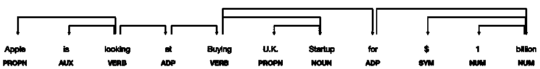
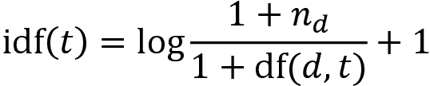
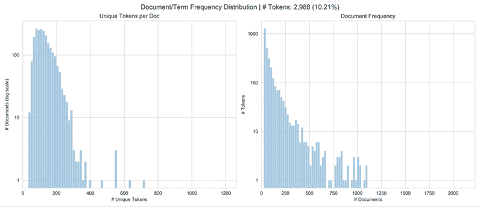
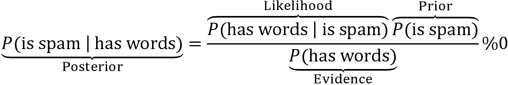
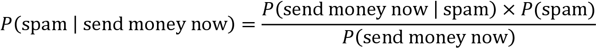
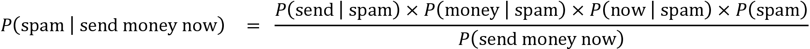
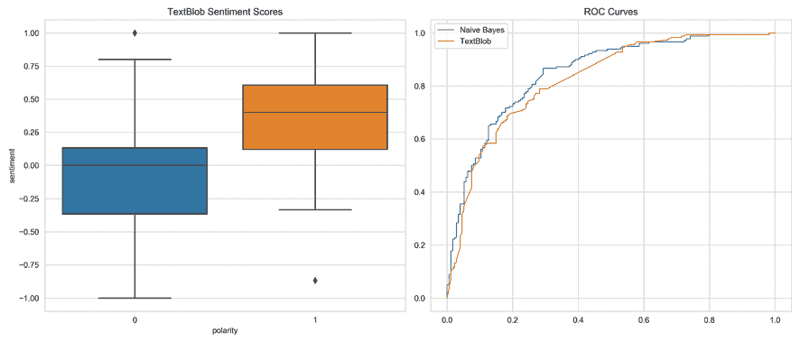
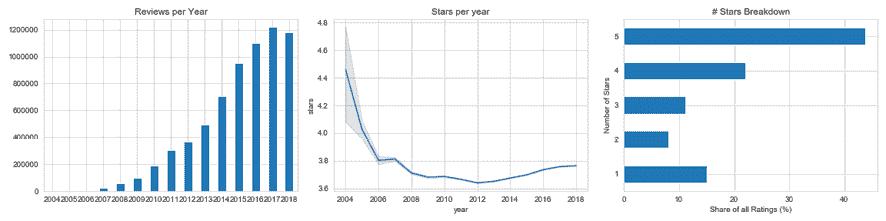
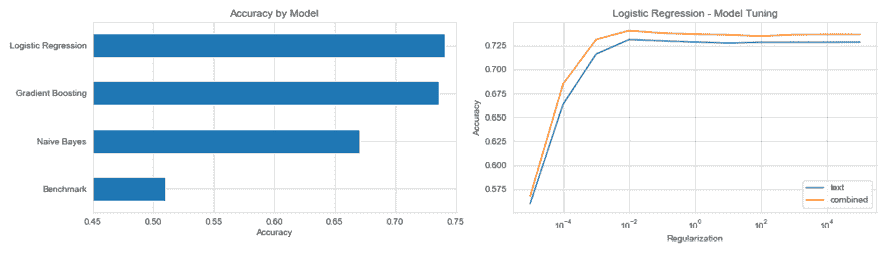

# 14

# 用于交易的文本数据——情感分析

这是专门从文本数据中提取用于算法交易策略的信号的三章之一，使用**自然语言处理**（**NLP**）和**机器学习**（**ML**）。

文本数据在内容上非常丰富，但结构非常不规则，因此需要更多的预处理以使 ML 算法能够提取相关信息。一个关键挑战是将文本转换为数字格式而不丢失其含义。我们将介绍几种能够捕捉语言细微差别的技术，以便它们可以用作 ML 算法的输入。

在本章中，我们将介绍基本的**特征提取**技术，重点放在个别语义单元上，即单词或称为**令牌**的短组合。我们将展示如何将文档表示为令牌计数的向量，方法是创建一个文档-术语矩阵，然后继续将其用作**新闻分类**和**情感分析**的输入。我们还将介绍朴素贝叶斯算法，该算法在这方面很受欢迎。

在接下来的两章中，我们将基于这些技术，并使用主题建模和词向量嵌入等 ML 算法来捕获更广泛上下文中包含的信息。

特别是在本章中，我们将涵盖以下内容：

+   基本的 NLP 工作流程是什么样的

+   如何使用 spaCy 和 TextBlob 构建多语言特征提取管道

+   执行 NLP 任务，例如**词性**（**POS**）标记或命名实体识别

+   使用文档-术语矩阵将令牌转换为数字

+   使用朴素贝叶斯模型对文本进行分类

+   如何执行情感分析

您可以在 GitHub 存储库的相应目录中找到本章的代码示例和其他资源链接。笔记本包括图像的彩色版本。

# 使用文本数据的 ML——从语言到特征

鉴于人类使用自然语言进行沟通和存储的信息量之大，文本数据可能非常有价值。与金融投资相关的各种数据源涵盖了从正式文件（如公司声明，合同和专利）到新闻，观点，分析师研究或评论，再到各种类型的社交媒体帖子或消息。

在网上有大量丰富多样的文本数据样本可供探索 NLP 算法的使用，其中许多列在这一章的 GitHub 的`README`文件中的资源中。有关全面介绍，请参见 Jurafsky 和 Martin（2008 年）。

为了实现文本数据的潜在价值，我们将介绍专门的 NLP 技术和最有效的 Python 库，概述特定于处理语言数据的关键挑战，介绍 NLP 工作流程的关键要素，并突出与算法交易相关的 NLP 应用。

## 处理文本数据的关键挑战

将非结构化文本转换为机器可读格式需要仔细的预处理，以保留数据的宝贵语义方面。人类如何理解语言的内容尚不完全清楚，改进机器理解语言的能力仍然是一个非常活跃的研究领域。

自然语言处理（NLP）特别具有挑战性，因为有效利用文本数据进行机器学习需要理解语言的内在工作原理以及它所指的世界的知识。 主要挑战包括以下内容：

+   由于**多义性**而产生的歧义，即一个词或短语根据上下文具有不同的含义（“Local High School Dropouts Cut in Half”）

+   在社交媒体上尤其是非标准和**不断发展的**语言使用

+   使用诸如“throw in the towel”这样的**习语**

+   像“Where is A Bug's Life playing?”这样的棘手的**实体名称**

+   对世界的了解：“Mary and Sue are sisters”与“Mary and Sue are mothers”

## 自然语言处理工作流程

从文本数据中使用机器学习进行算法交易的一个关键目标是从文档中提取信号。 文档是来自相关文本数据源的单个样本，例如公司报告、标题、新闻文章或推文。 语料库，反过来，是文档的集合。

*图 14.1* 概述了将文档转换为可以用于训练具有可操作预测能力的监督机器学习算法的数据集的**关键步骤**：


图 14.1：自然语言处理工作流程

**基本技术** 提取文本特征作为被称为标记的孤立语义单元，并使用规则和字典对它们进行语言和语义信息的标注。 词袋模型使用令牌频率将文档建模为令牌向量，这导致经常用于文本分类、检索或摘要的文档-术语矩阵。

**高级方法** 依赖于机器学习来改进基本特征，例如令牌，并生成更丰富的文档模型。 这些包括反映跨文档使用令牌的联合的主题模型和旨在捕获令牌使用上下文的单词向量模型。

在下一节中，我们将详细审查工作流程每一步的关键决策以及相关的权衡，并在示例中使用 spaCy 库说明它们的实现。 以下表格总结了自然语言处理管道的关键任务：

| 特征 | 描述 |
| --- | --- |
| 分词 | 将文本分割成单词、标点符号等。 |
| 词性标注 | 为令牌分配词类型，如动词或名词。 |
| 依存句法分析 | 标记句法令牌依赖关系，如主语<=>宾语。 |
| 词干提取和词形还原 | 分配单词的基本形式：“was” => “be”，“rats” => “rat”。 |
| 句子边界检测 | 找到并分割单个句子。 |
| 命名实体识别 | 标记“真实世界”对象，如人物、公司或地点。 |
| 相似性 | 评估单词、文本跨度和文档的相似性。 |

### 解析和标记文本数据 - 选择词汇表

标记是给定文档中字符序列的实例，并被认为是一个语义单位。词汇是被认为对进一步处理相关的语料库中包含的标记的集合；不在词汇中的标记将被忽略。

当然，**目标**是提取最能准确反映文档含义的标记。在这一步的**关键折衷**是选择更大的词汇量，以更好地反映文本来源，代价是增加更多的特征和更高的模型复杂性（在*第十三章*，*使用无监督学习评估数据驱动的风险因素和资产配置*中讨论为*维度诅咒*）。

在这方面的基本选择涉及标点和大写的处理，拼写校正的使用，以及是否排除非常频繁的所谓“停用词”（如“and”或“the”）作为无意义的噪音。

另外，我们需要决定是否将由*n*个单独的标记组成的*n***-gram**作为语义单位（一个单独的标记也称为*unigram*）包含在内。一个二元组（或*bigram*）的例子是“纽约”，而“纽约市”是一个三元组（或*trigram*）。这个决定可以依赖于词典或者对个体和联合使用的相对频率进行比较。与 unigrams 相比，标记的唯一组合更多，因此添加*n*-grams 将增加特征数量，并且除非按频率进行过滤，否则会添加噪音。

### 语言学标注 - 标记之间的关系

语言学标注包括将**句法和语法规则**应用于识别句子边界，尽管标点符号模糊不清，以及词标注和依赖解析中的一个标记的角色和关系。它还允许识别词根的常见形式以进行词干提取和词形还原，以将相关单词分组在一起。

以下是与标注相关的一些关键概念：

+   **词干提取**使用简单的规则从标记中删除常见的结尾，比如*s*、*ly*、*ing*或*ed*，并将其减少到其词干或根形式。

+   **词形还原**使用更复杂的规则来推导单词的规范根（**lemma**）。它可以检测到不规则的常见根，比如“better”和“best”，并更有效地压缩词汇，但比词干提取慢。这两种方法都是以语义细微差别为代价来简化词汇。

+   **POS**标注有助于根据它们的功能消除标记的歧义（例如，当动词和名词具有相同的形式时），这会增加词汇量，但可能捕捉到有意义的区别。

+   **依赖解析**识别标记之间的分层关系，通常用于翻译。对于需要更高级语言理解的交互应用程序，比如聊天机器人，这一点至关重要。

### 语义注释 - 从实体到知识图

**命名实体识别**（**NER**）旨在识别表示感兴趣对象的标记，如人物、国家或公司。它可以进一步发展成捕捉这些实体之间语义和层次关系的**知识图**。这对于那些旨在预测新闻事件对情绪影响的应用至关重要。

### 标签化 - 为预测建模分配结果

许多自然语言处理应用程序通过从文本中提取的有意义信息来学习预测结果。监督学习需要标签来教会算法真实的输入输出关系。在文本数据中，建立这种关系可能具有挑战性，并且可能需要显式的数据建模和收集。

示例包括如何量化文本文档（例如电子邮件、转录的采访或推文）中隐含的情感，与新领域相关的，或者应该分配特定结果的研究文档或新闻报告的哪些方面。

## 应用

使用文本数据进行交易的机器学习依赖于提取有意义的信息以形成有助于预测未来价格走势的特征。应用范围从利用新闻的短期市场影响到对资产估值驱动因素的长期基本分析。例如：

+   评估产品评论情感以评估公司的竞争地位或行业趋势

+   检测信贷合同中的异常以预测违约的概率或影响

+   预测新闻影响的方向、幅度和受影响的实体

例如，摩根大通公司基于 25 万份分析师报告开发了一个预测模型，该模型的表现优于多个基准指数，并且相对于从共识 EPS 和推荐变化中形成的情绪因素产生了不相关的信号。

# 从文本到标记 - 自然语言处理流程

在本节中，我们将演示如何使用开源 Python 库 spaCy 构建一个 NLP 流程。textacy 库基于 spaCy 构建，并提供了易于访问的 spaCy 属性和额外功能。

请参阅笔记本`nlp_pipeline_with_spaCy`以获取以下代码示例、安装说明和更多详细信息。

## 使用 spaCy 和 textacy 的自然语言处理流程

spaCy 是一个广泛使用的 Python 库，具有多语言快速文本处理的综合功能集。使用标记化和注释引擎需要安装语言模型。本章中我们将使用的功能仅需要小型模型；较大的模型还包括我们将在*第十六章*中介绍的词向量。

安装并链接库后，我们可以实例化一个 spaCy 语言模型，然后将其应用于文档。结果是一个`Doc`对象，它对文本进行标记化和处理，根据默认的可配置流水线组件进行处理，这些组件通常包括标记器、解析器和命名实体识别器：

```py
nlp = spacy.load('en')
nlp.pipe_names
['tagger', 'parser', 'ner'] 
```

让我们用一个简单的句子来说明流水线：

```py
sample_text = 'Apple is looking at buying U.K. startup for $1 billion'
doc = nlp(sample_text) 
```

### 解析、标记和注释一个句子

解析后的文档内容是可迭代的，每个元素都有由处理流程生成的许多属性。下一个示例演示了如何访问以下属性：

+   `.text`: 原始词文本

+   `.lemma_`: 词的词根

+   `.pos_`: 基本词性标记

+   `.tag_`: 详细的词性标记

+   `.dep_`: 标记词间的句法关系或依赖性

+   `.shape_`: 词的形状，以大写、标点和数字为准

+   `.is alpha`: 检查标记是否为字母数字

+   `.is stop`: 检查标记是否在给定语言的常用词列表中

我们迭代处理每个标记，并将其属性分配给一个`pd.DataFrame`：

```py
pd.DataFrame([[t.text, t.lemma_, t.pos_, t.tag_, t.dep_, t.shape_, 
               t.is_alpha, t.is_stop]
              for t in doc],
             columns=['text', 'lemma', 'pos', 'tag', 'dep', 'shape', 
                      'is_alpha', is_stop']) 
```

这产生了以下结果：

| text | lemma | pos | tag | dep | shape | is_alpha | is_stop |
| --- | --- | --- | --- | --- | --- | --- | --- |
| Apple | apple | PROPN | NNP | nsubj | Xxxxx | TRUE | FALSE |
| is | be | VERB | VBZ | aux | xx | TRUE | TRUE |
| looking | look | VERB | VBG | ROOT | xxxx | TRUE | FALSE |
| at | at | ADP | IN | prep | xx | TRUE | TRUE |
| buying | buy | VERB | VBG | pcomp | xxxx | TRUE | FALSE |
| U.K. | u.k. | PROPN | NNP | compound | X.X. | FALSE | FALSE |
| startup | startup | NOUN | NN | dobj | xxxx | TRUE | FALSE |
| for | for | ADP | IN | prep | xxx | TRUE | TRUE |
| $ | $ | SYM | $ | quantmod | $ | FALSE | FALSE |
| 1 | 1 | NUM | CD | compound | d | FALSE | FALSE |
| billion | billion | NUM | CD | pobj | xxxx | TRUE | FALSE |

我们可以使用以下方法在浏览器或笔记本中可视化句法依赖：

```py
displacy.render(doc, style='dep', options=options, jupyter=True) 
```

上述代码使我们能够获得如下的依赖树：



图 14.2：spaCy 依赖树

我们可以使用`spacy.explain()`获取属性含义的额外见解，例如：

```py
spacy.explain("VBZ") 
verb, 3rd person singular present 
```

### 批处理文档

现在我们将读取一个更大的数据集，包含 2,225 篇 BBC 新闻文章（详见 GitHub 获取数据源细节），这些文章分属五个类别，并存储在单独的文本文件中。我们执行以下操作：

1.  调用`pathlib`模块的`Path`对象的`.glob()`方法。

1.  迭代处理结果列表中的路径。

1.  读取新闻文章中除了第一行标题之外的所有行。

1.  将清理后的结果附加到列表中：

    ```py
    files = Path('..', 'data', 'bbc').glob('**/*.txt')
    bbc_articles = []
    for i, file in enumerate(sorted(list(files))):
        with file.open(encoding='latin1') as f:
            lines = f.readlines()
            body = ' '.join([l.strip() for l in lines[1:]]).strip()
            bbc_articles.append(body)
    len(bbc_articles)
    2225 
    ```

### 句子边界检测

调用 NLP 对象对文章的第一句进行句子检测：

```py
doc = nlp(bbc_articles[0])
type(doc)
spacy.tokens.doc.Doc 
```

spaCy 根据句法分析树计算句子边界，因此标点符号和大写字母起着重要但不决定性的作用。因此，边界将与从句边界重合，即使是标点不良的文本也是如此。

我们可以使用 `.sents` 属性访问解析后的句子：

```py
sentences = [s for s in doc.sents]
sentences[:3]
[Quarterly profits at US media giant TimeWarner jumped 76% to $1.13bn (£600m) for the three months to December, from $639m year-earlier.  ,
 The firm, which is now one of the biggest investors in Google, benefited from sales of high-speed internet connections and higher advert sales.,
 TimeWarner said fourth quarter sales rose 2% to $11.1bn from $10.9bn.] 
```

### 命名实体识别

spaCy 通过 `.ent_type_` 属性启用了命名实体识别：

```py
for t in sentences[0]:
    if t.ent_type_:
        print('{} | {} | {}'.format(t.text, t.ent_type_, spacy.explain(t.ent_type_)))
Quarterly | DATE | Absolute or relative dates or periods
US | GPE | Countries, cities, states
TimeWarner | ORG | Companies, agencies, institutions, etc. 
```

Textacy 让访问第一篇文章中出现的命名实体变得很容易：

```py
entities = [e.text for e in entities(doc)]
pd.Series(entities).value_counts().head()
TimeWarner        7
AOL               5
fourth quarter    3
year-earlier      2
one               2 
```

### N-grams

N-grams 结合了 *n* 个连续的标记。这对于词袋模型可能是有用的，因为根据文本上下文，将（例如）"数据科学家" 视为单个标记可能比将 "数据" 和 "科学家" 两个不同的标记更有意义。

Textacy 使查看至少出现 `min_freq` 次的给定长度 `n` 的 `ngrams` 变得很容易：

```py
pd.Series([n.text for n in ngrams(doc, n=2, min_freq=2)]).value_counts()
fourth quarter     3
quarter profits    2
Time Warner        2
company said       2
AOL Europe         2 
```

### spaCy 的流式 API

要通过处理管道传递更多的文档，我们可以使用 spaCy 的流式 API 如下所示：

```py
iter_texts = (bbc_articles[i] for i in range(len(bbc_articles)))
for i, doc in enumerate(nlp.pipe(iter_texts, batch_size=50, n_threads=8)):
    assert doc.is_parsed 
```

### 多语言自然语言处理

spaCy 包含了针对英语、德语、西班牙语、葡萄牙语、法语、意大利语和荷兰语的经过训练的语言模型，以及一个用于命名实体识别的多语言模型。由于 API 不变，跨语言使用很简单。

我们将使用 TED 演讲字幕的平行语料库来说明西班牙语言模型（请参阅数据来源参考的 GitHub 存储库）。为此，我们实例化两个语言模型：

```py
model = {}
for language in ['en', 'es']:
    model[language] = spacy.load(language) 
```

我们在每个模型中读取相应的小文本样本：

```py
text = {}
path = Path('../data/TED')
for language in ['en', 'es']:
    file_name = path /  'TED2013_sample.{}'.format(language)
    text[language] = file_name.read_text() 
```

句子边界检测使用相同的逻辑，但找到了不同的分解：

```py
parsed, sentences = {}, {}
for language in ['en', 'es']:
    parsed[language] = modellanguage
    sentences[language] = list(parsed[language].sents)
    print('Sentences:', language, len(sentences[language]))
Sentences: en 22
Sentences: es 22 
```

词性标注也是以相同的方式工作：

```py
pos = {}
for language in ['en', 'es']:
    pos[language] = pd.DataFrame([[t.text, t.pos_, spacy.explain(t.pos_)] 
                                  for t in sentences[language][0]],
                                 columns=['Token', 'POS Tag', 'Meaning'])
pd.concat([pos['en'], pos['es']], axis=1).head() 
```

这产生了以下表格：

| Token | POS 标记 | 意思 | Token | POS 标记 | 意思 |
| --- | --- | --- | --- | --- | --- |
| There | ADV | 副词 | Existe | VERB | 动词 |
| s | VERB | 动词 | una | DET | 限定词 |
| a | DET | 限定词 | estrecha | ADJ | 形容词 |
| tight | ADJ | 形容词 | y | CONJ | 连词 |
| and | CCONJ | 并列连词 | sorprendente | ADJ | 形容词 |

下一节将说明如何使用解析和注释的标记构建可以用于文本分类的文档-术语矩阵。

## 使用 TextBlob 的自然语言处理

TextBlob 是一个提供简单 API 用于常见自然语言处理任务的 Python 库，它构建在 **自然语言工具包** (**NLTK**) 和 Pattern 网络挖掘库的基础上。TextBlob 提供了词性标注、名词短语提取、情感分析、分类和翻译等功能。

要说明 TextBlob 的用法，我们采样了一篇标题为 "Robinson ready for difficult task" 的 BBC Sport 文章。与 spaCy 和其他库类似，第一步是通过由 `TextBlob` 对象表示的管道将文档传递，以分配所需任务的注释（请参阅笔记本 `nlp_with_textblob`）：

```py
from textblob import TextBlob
article = docs.sample(1).squeeze()
parsed_body = TextBlob(article.body) 
```

### 词干提取

要执行词干提取，我们从 NTLK 库实例化 `SnowballStemmer`，对每个标记调用其 `.stem()` 方法，并显示因此而被修改的标记：

```py
from nltk.stem.snowball import SnowballStemmer
stemmer = SnowballStemmer('english')
[(word, stemmer.stem(word)) for i, word in enumerate(parsed_body.words) 
 if word.lower() != stemmer.stem(parsed_body.words[i])]
('Manchester', 'manchest'),
 ('United', 'unit'),
 ('reduced', 'reduc'),
 ('points', 'point'),
 ('scrappy', 'scrappi') 
```

### 情感极性和主观性

TextBlob 提供使用 Pattern 库提供的字典为解析的文档提供极性和主观度估计。这些字典将产品评论中频繁出现的形容词与情感极性分数进行词典映射，分数范围从 -1 到 +1（负面 ↔ 正面），以及类似的主观度分数（客观 ↔ 主观）。

`.sentiment` 属性为每个分数提供相关标记的平均值，而 `.sentiment_assessments` 属性则列出了每个标记的基础值（请参阅笔记本）：

```py
parsed_body.sentiment
Sentiment(polarity=0.088031914893617, subjectivity=0.46456433637284694) 
```

# 计算标记 - 文档-词汇矩阵

在本节中，我们首先介绍词袋模型如何将文本数据转换为数值向量空间表示。目标是通过它们在该空间中的距离来近似文档的相似性。然后，我们继续说明如何使用 sklearn 库创建文档-词汇矩阵。

## 词袋模型

词袋模型基于文档包含的术语或标记的频率来表示文档。每个文档变成一个向量，其中每个标记在词汇表中对应一个条目，反映了该标记对文档的相关性。

### 创建文档-词汇矩阵

给定词汇表，文档-词汇矩阵很容易计算。然而，它也是一种粗糙的简化，因为它抽象了单词顺序和语法关系。尽管如此，它通常能够快速在文本分类中取得良好的结果，因此为非常有用的起点。

*图 14.3* 的左侧面板说明了这种文档模型如何将文本数据转换为一个矩阵，其中每行对应一个文档，每列对应词汇表中的一个标记。由此产生的矩阵通常是非常高维和稀疏的，即它包含许多零条目，因为大多数文档只包含整体词汇的一小部分。

![

图 14.3：文档-词汇矩阵和余弦相似性

有几种方法可以对一个标记的向量条目进行加权，以捕捉其与文档的相关性。我们将演示如何使用 sklearn 使用二进制标志表示存在或不存在、计数以及考虑到语料库中所有文档中术语频率差异的加权计数。

### 测量文档的相似性

将文档表示为词向量将给每个文档分配一个位置，该位置位于由词汇表创建的向量空间中。解释该空间中的向量条目为笛卡尔坐标，我们可以使用两个向量之间的角度来测量它们的相似性，因为指向相同方向的向量包含具有相同频率权重的相同术语。

上述图的右侧面板在二维中简化地说明了一个由向量 *d*[1] 表示的文档与由向量 *q* 表示的查询向量（可以是一组搜索词或另一个文档）之间距离的计算。

**余弦相似度** 等于两个向量之间角度的余弦值。它将角度大小转换为范围为 [0, 1] 的数字，因为所有向量条目都是非负的标记权重。值为 1 意味着两个文档在其标记权重方面完全相同，而值为 0 意味着两个文档仅包含不同的标记。

如图所示，角度的余弦等于向量的点积，即它们坐标的和积除以它们各自向量的欧几里德范数的乘积。

## 使用 scikit-learn 创建文档 - 词项矩阵

scikit-learn 预处理模块提供了两个工具来创建文档 - 词项矩阵。`CountVectorizer` 使用二进制或绝对计数来测量每个文档 *d* 和标记 *t* 的 **词频** (**TF**) *tf*(*d, t*)。

`TfidfVectorizer` 相比之下，通过**逆文档频率**（**IDF**）加权（绝对）词频。因此，在更多文档中出现的词语将比在给定文档中具有相同频率但在所有文档中频率较低的标记接收到较低的权重。更具体地说，使用默认设置，文档 - 词项矩阵的 *tf-idf*(*d*, *t*) 条目被计算为 *tf-idf(d, t) = tf(d, t)* x *idf(t)* ，其中：



其中 *n*[d] 是文档数，*df*(*d*, *t*) 是词项 *t* 的文档频率。每个文档的结果 TF-IDF 向量都针对它们的绝对或平方总数进行了归一化（有关详细信息，请参阅 sklearn 文档）。TF-IDF 度量最初用于信息检索以对搜索引擎结果进行排名，并随后被证明对于文本分类和聚类非常有用。

这两个工具使用相同的接口，并在向量化文本之前对文档列表进行分词和进一步可选的预处理，通过生成标记计数来填充文档 - 词项矩阵。

影响词汇表大小的关键参数包括以下内容：

+   `stop_words`: 使用内置或用户提供的（频繁）词语列表来排除词语

+   `ngram_range`: 包括 *n*-gram，在由元组定义的 *n* 范围内的 *n*

+   `lowercase`: 相应地转换字符（默认值为 `True`）

+   `min_df`/`max_df`: 忽略出现在较少/较多（`int`）的文档中的词语，或者出现在较小/较大比例的文档中（如果是 `float` [0.0,1.0]）

+   `max_features`: 限制词汇表中的标记数量

+   `binary`: 将非零计数设置为 1（`True`）

查看笔记本 `document_term_matrix` 以获取以下代码示例和更多详细信息。我们再次使用 2,225 篇 BBC 新闻文章作为示例。

### 使用 CountVectorizer

笔记本中包含一个交互式可视化，探索 `min_df` 和 `max_df` 设置对词汇量大小的影响。我们将文章读入 DataFrame，设置 `CountVectorizer` 以生成二进制标志并使用所有词项，并调用其 `.fit_transform()` 方法以生成文档-词项矩阵：

```py
binary_vectorizer = CountVectorizer(max_df=1.0,
                                    min_df=1,
                                    binary=True)
binary_dtm = binary_vectorizer.fit_transform(docs.body)
<2225x29275 sparse matrix of type '<class 'numpy.int64'>'
   with 445870 stored elements in Compressed Sparse Row format> 
```

输出是一个以行格式存储的 `scipy.sparse` 矩阵，有效地存储了 2,225（文档）行和 29,275（词项）列中的 445,870 个非零条目中的一小部分（<0.7%）。

#### 可视化词汇分布

在*图 14.4*中的可视化显示，要求词项出现在至少 1% 且少于 50% 的文档中，将词汇限制在近 30000 个词项中的约 10% 左右。

这样留下了每个文档略多于 100 个唯一词项的模式，如下图左侧面板所示。右侧面板显示了剩余词项的文档频率直方图：



图 14.4：唯一词项和每个文档的词项数量的分布

#### 查找最相似的文档

`CountVectorizer` 的结果使我们能够使用由 `scipy.spatial.distance` 模块提供的 pairwise 距离的 `pdist()` 函数找到最相似的文档。它返回一个压缩的距离矩阵，其条目对应于正方形矩阵的上三角形。我们使用 `np.triu_indices()` 将最小距离的索引转换为相应于最接近的词项向量的行和列索引：

```py
m = binary_dtm.todense()        # pdist does not accept sparse format
pairwise_distances = pdist(m, metric='cosine')
closest = np.argmin(pairwise_distances)  # index that minimizes distance
rows, cols = np.triu_indices(n_docs)      # get row-col indices
rows[closest], cols[closest]
(6, 245) 
```

文章 6 和 245 在余弦相似性上最接近，因为它们共享 303 个词汇中的 38 个词项（见笔记本）。以下表格总结了这两篇文章，并展示了基于词数的相似度测量对于识别更深层语义相似性的有限能力：

|  | 文章 6 | 文章 245 |
| --- | --- | --- |
| 主题 | 商业 | 商业 |
| 标题 | 美国就业增长仍然缓慢 | Ebbers 对 WorldCom 的欺诈案件有所了解 |
| 正文 | 美国在一月份创造的工作岗位少于预期，但求职者的减少使失业率降至三年来的最低水平。根据劳工部的数据，美国企业在一月份仅增加了 146,000 个工作岗位。 | 前世界通信公司总裁 Bernie Ebbers 在该公司的 110 亿美元金融欺诈案中直接参与其中，他最亲密的同事在美国法院告诉说。在 Ebbers 先生的刑事审判中作证，前财务主管 Scott Sullivan 暗示了他的同事在该公司的会计丑闻中的牵连。 |

`CountVectorizer` 和 `TfidfVectorizer` 都可以与 spaCy 一起使用，例如，执行词形还原并在词项化过程中排除某些字符：

```py
nlp = spacy.load('en')
def tokenizer(doc):
    return [w.lemma_ for w in nlp(doc) 
                if not w.is_punct | w.is_space]
vectorizer = CountVectorizer(tokenizer=tokenizer, binary=True)
doc_term_matrix = vectorizer.fit_transform(docs.body) 
```

参见笔记本以获取更多细节和更多示例。

### TfidfTransformer 和 TfidfVectorizer

`TfidfTransformer` 从文档-词项矩阵中计算 TF-IDF 权重，类似于 `CountVectorizer` 生成的矩阵。

`TfidfVectorizer` 在一个步骤中执行这两个计算。它添加了一些参数到 `CountVectorizer` API，用于控制平滑行为。

对于一个小的文本样本，TFIDF 计算如下：

```py
sample_docs = ['call you tomorrow',
               'Call me a taxi',
               'please call me... PLEASE!'] 
```

我们像以前一样计算术语频率：

```py
vectorizer = CountVectorizer()
tf_dtm = vectorizer.fit_transform(sample_docs).todense()
tokens = vectorizer.get_feature_names()
term_frequency = pd.DataFrame(data=tf_dtm,
                             columns=tokens)
  call  me  please  taxi  tomorrow  you
0     1   0       0     0         1    1
1     1   1       0     1         0    0
2     1   1       2     0         0    0 
```

文档频率是包含该标记的文档数：

```py
vectorizer = CountVectorizer(binary=True)
df_dtm = vectorizer.fit_transform(sample_docs).todense().sum(axis=0)
document_frequency = pd.DataFrame(data=df_dtm,
                                  columns=tokens)
   call  me  please  taxi  tomorrow  you
0     3   2       1     1         1    1 
```

TF-IDF 权重是这些值的比率：

```py
tfidf = pd.DataFrame(data=tf_dtm/df_dtm, columns=tokens)
   call   me  please  taxi  tomorrow  you
0  0.33 0.00    0.00  0.00      1.00 1.00
1  0.33 0.50    0.00  1.00      0.00 0.00
2  0.33 0.50    2.00  0.00      0.00 0.00 
```

#### 平滑的效果

为了避免零除法，`TfidfVectorizer` 使用平滑处理文档和术语频率：

+   `smooth_idf`: 将文档频率加一，就像额外的文档包含词汇表中的每个标记一样，以防止零除法

+   `sublinear_tf`: 应用亚线性 tf 缩放，即用 1 + log(tf) 替换 tf

与规范化权重相结合，结果略有不同：

```py
vect = TfidfVectorizer(smooth_idf=True,
                      norm='l2',  # squared weights sum to 1 by document
                      sublinear_tf=False,  # if True, use 1+log(tf)
                      binary=False)
pd.DataFrame(vect.fit_transform(sample_docs).todense(),
            columns=vect.get_feature_names())
   call   me  please  taxi  tomorrow  you
0  0.39 0.00    0.00  0.00      0.65 0.65
1  0.43 0.55    0.00  0.72      0.00 0.00
2  0.27 0.34    0.90  0.00      0.00 0.00 
```

#### 使用 TfidfVectorizer 摘要新闻文章

由于它们能够分配有意义的标记权重，TF-IDF 向量也用于总结文本数据。例如，Reddit 的 `autotldr` 函数基于类似的算法。请参阅笔记本以查看使用 BBC 文章的示例。

## 关键教训而不是已学到的教训

处理自然语言以在 ML 模型中使用的技术和选项数量庞大，这对应于这个高度非结构化数据源的复杂性质。构建良好的语言特征既具有挑战性又具有回报，可以说是揭示文本数据中隐藏的语义价值的最重要步骤。

在实践中，经验有助于选择消除噪声而不是信号的变换，但很可能仍然需要交叉验证和比较不同预处理选择组合的性能。

# 交易的自然语言处理

一旦文本数据使用前面讨论的自然语言处理技术转换为数值特征，文本分类就像任何其他分类任务一样。

在本节中，我们将这些预处理技术应用于新闻文章、产品评论和 Twitter 数据，并教授各种分类器以预测离散的新闻类别、评论分数和情感极性。

首先，我们将介绍朴素贝叶斯模型，这是一种与词袋模型产生的文本特征很好配合的概率分类算法。

本节的代码示例位于笔记本 `news_text_classification` 中。

## 朴素贝叶斯分类器

朴素贝叶斯算法在文本分类中非常流行，因为它的低计算成本和内存需求有助于在非常大的高维数据集上进行训练。其预测性能可以与更复杂的模型竞争，提供一个良好的基线，并以成功检测垃圾邮件而闻名。

该模型依赖于贝叶斯定理和各种特征相互独立的假设。换句话说，对于给定的结果，知道一个特征的值（例如，在文档中存在一个标记）不会提供有关另一个特征值的任何信息。

### 贝叶斯定理复习

贝叶斯定理表达了一个事件（例如，电子邮件是垃圾邮件而不是良性“ham”）在另一个事件（例如，电子邮件包含某些词）给定的条件概率如下：



实际上，电子邮件实际上是垃圾邮件的**后验**概率，而它包含某些词的事实取决于三个因素的相互作用：

+   电子邮件实际上是垃圾邮件的**先验**概率

+   在垃圾邮件中遇到这些词的**似然**

+   **证据**，即在电子邮件中看到这些词的概率

要计算后验，我们可以忽略证据，因为对所有结果（垃圾邮件与 ham）来说它是相同的，而无条件先验可能很容易计算。

但是，这种可能性给合理大小的词汇表和实际邮件语料库带来了不可逾越的挑战。原因在于在不同文档中联合出现或未出现的单词的组合爆炸，这阻止了计算概率表和为可能性赋值所需的评估。

### 条件独立假设

使模型既易于处理又赢得“朴素”名称的关键假设是特征在给定结果的条件下是独立的。为了说明，让我们对包含三个词“发送资金现在”的电子邮件进行分类，这样贝叶斯定理就变成了以下形式：



形式上，假设这三个单词在条件上是独立的意味着观察到“发送”不受其他术语的影响，前提是邮件是垃圾邮件，即，*P*(send | money, now, spam) = *P*(send | spam)。因此，我们可以简化似然函数：



使用“朴素”的条件独立假设，分子中的每个术语都很容易从训练数据的相对频率中计算出来。当需要比较而不是校准后验概率时，分母在类别之间是恒定的，可以忽略。随着因素数量，即特征数量的增加，先验概率变得不太相关。

总之，朴素贝叶斯模型的优点在于训练和预测速度快，因为参数的数量与特征的数量成比例，并且它们的估计具有封闭形式的解决方案（基于训练数据频率），而不是昂贵的迭代优化。它也是直观的并且有些可解释的，不需要超参数调整，并且在存在足够信号的情况下相对不太依赖于不相关的特征。

但是，当独立性假设不成立，并且文本分类依赖于特征的组合或特征相关时，模型的性能将较差。

## 对新闻文章进行分类

我们从用于新闻文章分类的朴素贝叶斯模型的示例开始，使用之前阅读的 BBC 文章，以获得包含来自五个类别的 2,225 篇文章的`DataFrame`：

```py
<class 'pandas.core.frame.DataFrame'>
RangeIndex: 2225 entries, 0 to 2224
Data columns (total 3 columns):
topic      2225 non-null object
heading    2225 non-null object
body       2225 non-null object 
```

为了训练和评估多项式朴素贝叶斯分类器，我们将数据分成默认的 75:25 训练测试集比例，确保测试集类别与训练集类别紧密匹配：

```py
y = pd.factorize(docs.topic)[0] # create integer class values
X = docs.body
X_train, X_test, y_train, y_test = train_test_split(X, y, random_state=1,
                                                    stratify=y) 
```

我们继续从训练集中学习词汇，并使用默认设置的`CountVectorizer`转换两个数据集，以获得近 26,000 个特征：

```py
vectorizer = CountVectorizer()
X_train_dtm = vectorizer.fit_transform(X_train)
X_test_dtm = vectorizer.transform(X_test)
X_train_dtm.shape, X_test_dtm.shape
((1668, 25919), (557, 25919)) 
```

训练和预测遵循标准的 sklearn fit/predict 接口：

```py
nb = MultinomialNB()
nb.fit(X_train_dtm, y_train)
y_pred_class = nb.predict(X_test_dtm) 
```

我们使用`accuracy`评估多类预测，以找到默认分类器几乎达到了 98％的准确率：

```py
accuracy_score(y_test, y_pred_class)
0.97666068222621 
```

## 用 Twitter 和 Yelp 数据进行情感分析

情感分析是 NLP 和 ML 在交易中最流行的用途之一，因为对资产或其他价格驱动因素的积极或消极看法可能会影响收益。

通常，情感分析的建模方法依赖于词典（如 TextBlob 库）或针对特定领域结果进行训练的模型。后者通常更可取，因为它允许更有针对性的标记，例如，通过将文本特征与后续价格变化而不是间接情感分数相关联。

我们将使用具有二进制极性标签的 Twitter 数据集和具有五点结果量表的大型 Yelp 商业评论数据集来说明情感分析的 ML。

### 用 Twitter 数据进行二进制情感分类

我们使用一个包含来自 2009 年的 1.6 百万训练推文和 350 个测试推文的数据集，该数据集具有算法分配的二进制积极和消极情感分数，这些分数分布相对均匀（有关更详细的数据探索，请参阅笔记本）。

#### 多项式朴素贝叶斯

我们创建一个具有 934 个标记的文档-术语矩阵如下：

```py
vectorizer = CountVectorizer(min_df=.001, max_df=.8, stop_words='english')
train_dtm = vectorizer.fit_transform(train.text)
<1566668x934 sparse matrix of type '<class 'numpy.int64'>'
    with 6332930 stored elements in Compressed Sparse Row format> 
```

然后，我们像以前一样训练`MultinomialNB`分类器并预测测试集：

```py
nb = MultinomialNB()
nb.fit(train_dtm, train.polarity)
predicted_polarity = nb.predict(test_dtm) 
```

结果的准确率超过了 77.5％：

```py
accuracy_score(test.polarity, predicted_polarity)
0.7768361581920904 
```

#### 与 TextBlob 情感分数的比较

我们还为推文获取 TextBlob 情感分数，并注意（参见*图 14.5*中的左面板），积极的测试推文收到了显着较高的情感估计。然后，我们使用`MultinomialNB`模型的`.predict_proba()`方法计算预测概率，并使用我们在*第六章*“机器学习过程”中介绍的相应曲线下面积**AUC**来比较两个模型（参见*图 14.5*中的右面板）。



图 14.5：定制与通用情感分数的准确性

在这种情况下，定制的朴素贝叶斯模型优于 TextBlob，测试 AUC 为 0.848，而 TextBlob 为 0.825。

### Yelp 商业评论的多类情感分析

最后，我们将情感分析应用于规模大得多的 Yelp 企业评论数据集，其中有五个结果类别（有关代码和其他详细信息，请参见笔记本 `sentiment_analysis_yelp`）。

数据包含了有关企业、用户、评论以及 Yelp 提供的其他方面的信息，以鼓励数据科学创新。

我们将使用在 2010-2018 年期间产生的约六百万条评论（详见笔记本）。以下图表显示了每年的评论数量和平均星级，以及所有评论中星级的分布。



图 14.6：Yelp 评论的基本探索性分析

我们将在截至 2017 年的数据的 10%样本上训练各种模型，并使用 2018 年的评论作为测试集。除了评论文本生成的文本特征外，我们还将使用有关给定用户的评论提交的其他信息。

#### 结合文本和数值特征

数据集包含各种数值特征（有关实现细节，请参见笔记本）。

向量化器产生 `scipy.sparse` 矩阵。要将向量化的文本数据与其他特征结合起来，我们首先需要将其转换为稀疏矩阵；许多 sklearn 对象和其他库（如 LightGBM）可以处理这些非常节省内存的数据结构。将稀疏矩阵转换为稠密的 NumPy 数组会有内存溢出的风险。

大多数变量都是分类变量，因此由于我们有一个相当大的数据集来容纳特征的增加，我们使用一位有效编码。

我们将编码的数值特征转换并与文档-词矩阵相结合：

```py
train_numeric = sparse.csr_matrix(train_dummies.astype(np.uint))
train_dtm_numeric = sparse.hstack((train_dtm, train_numeric)) 
```

#### 基准准确率

使用最频繁的星级数（=5）来预测测试集，准确率接近 52%：

```py
test['predicted'] = train.stars.mode().iloc[0]
accuracy_score(test.stars, test.predicted)
0.5196950594793454 
```

#### 多项式朴素贝叶斯模型

接下来，我们使用由 `CountVectorizer` 生成的文档-词矩阵来训练一个朴素贝叶斯分类器，其采用默认设置。

```py
nb = MultinomialNB()
nb.fit(train_dtm,train.stars)
predicted_stars = nb.predict(test_dtm) 
```

预测在测试集上的准确率达到了 64.7%，比基准提高了 24.4%：

```py
accuracy_score(test.stars, predicted_stars)
0.6465164206691094 
```

使用文本和其他特征的组合进行训练将测试准确率提高到 0.671。

#### 逻辑回归

在*第七章*，*线性模型-从风险因素到回报预测*中，我们介绍了二元逻辑回归。 sklearn 还实现了一个多类别模型，具有多项式和一对所有训练选项，后者训练一个针对每个类别的二元模型，同时将所有其他类别视为负类。多项式选项比一对所有实现要快得多且更准确。

我们评估正则化参数 `C` 的一系列值，以确定表现最佳的模型，使用 `lbfgs` 求解器如下（有关详细信息，请参见 sklearn 文档）：

```py
def evaluate_model(model, X_train, X_test, name, store=False):
    start = time()
    model.fit(X_train, train.stars)
    runtime[name] = time() – start
    predictions[name] = model.predict(X_test)
    accuracy[result] = accuracy_score(test.stars, predictions[result])
    if store:
        joblib.dump(model, f'results/{result}.joblib')
Cs = np.logspace(-5, 5, 11)
for C in Cs:
    model = LogisticRegression(C=C, multi_class='multinomial', solver='lbfgs')
    evaluate_model(model, train_dtm, test_dtm, result, store=True) 
```

*图 14.7* 显示了验证结果的图表。

#### 使用 LightGBM 的多类别梯度提升

为了进行比较，我们还训练了一个具有默认设置和`multiclass`目标的 LightGBM 梯度提升树集成：

```py
param = {'objective':'multiclass', 'num_class': 5}
booster = lgb.train(params=param, 
                    train_set=lgb_train, 
                    num_boost_round=500, 
                    early_stopping_rounds=20,
                    valid_sets=[lgb_train, lgb_test]) 
```

#### 预测性能

*图 14.7*显示了每个模型对于组合数据的准确性。右侧面板绘制了逻辑回归模型在两个数据集和不同正则化水平下的验证性能。

多项式逻辑回归的测试准确性略高于 74％。朴素贝叶斯的表现明显较差。默认的 LightGBM 设置并未提高线性模型的准确性为 0.736\. 但是，我们可以调整梯度提升模型的超参数，并且很可能会看到性能提升，使其至少与逻辑回归持平。无论哪种方式，该结果都提醒我们不要低估简单的、正则化的模型，因为它们不仅可能会产生良好的结果，而且可能会迅速做到这一点。



图 14.7：组合数据的测试性能（所有模型，左）以及逻辑回归的不同正则化下的性能

# 摘要

在本章中，我们探讨了许多处理非结构化数据的技术和选项，目的是提取用于机器学习模型的语义上有意义的数值特征。

我们涵盖了基本的分词和注释流水线，并使用 spaCy 和 TextBlob 说明了它在多种语言中的实现。我们建立在这些结果上，构建了一个基于词袋模型的文档模型，将文档表示为数值向量。我们学习了如何优化预处理流水线，然后使用向量化的文本数据进行分类和情感分析。

我们还有两章关于替代文本数据。在下一章中，我们将学习如何使用无监督学习总结文本以识别潜在主题。然后，在*第十六章*中，*收益电话和 SEC 备案的词嵌入*，我们将学习如何将单词表示为反映单词用法上下文的向量，这是一种非常成功的技术，为各种分类任务提供了更丰富的文本特征。
