# 15

# 主题建模 – 总结财经新闻

在上一章中，我们使用了**词袋**（**BOW**）模型将非结构化文本数据转换为数字格式。该模型抽象了词序，并将文档表示为词向量，其中每个条目表示令牌对文档的相关性。由此产生的**文档-术语矩阵**（**DTM**）—或作为术语-文档矩阵的转置—用于比较文档之间或基于其令牌内容的查询向量的相似性，因此，找到干草堆中的大头针。它提供了有用的功能来对文档进行分类，例如在我们的情感分析示例中。

然而，这种文档模型产生了高维度数据和非常稀疏的数据，但它很少总结内容或接近理解内容是什么。在本章中，我们将使用**无监督机器学习**从文档中提取隐藏的主题，使用**主题建模**。这些主题可以以自动化方式为大量文档提供详细的见解。它们非常有用，可以理解干草堆本身，并允许我们基于文档与各种主题的关联度对文档进行标记。

**主题模型**生成复杂且可解释的文本特征，可成为从大量文档中提取交易信号的第一步。它们加快了文档的审阅，帮助识别和聚类类似的文档，并支持预测建模。

**应用程序**包括无监督地发现公司披露或收入电话抄本、客户评论或合同中潜在有见地的主题。此外，文档-主题关联有助于通过分配例如情感度量或更直接的后续相关资产收益来进行标记。

更具体地说，阅读完本章后，您将了解：

+   主题建模的演变，它的成就以及为什么它很重要

+   使用**潜在语义索引**（**LSI**）降低 DTM 的维度

+   使用**概率隐含语义分析**（**pLSA**）提取主题

+   **潜在狄利克雷分配**（**LDA**）如何改进 pLSA 成为最流行的主题模型

+   可视化和评估主题建模结果

+   使用 sklearn 和 Gensim 运行 LDA

+   如何将主题建模应用于收入电话和财经新闻文章的集合

您可以在 GitHub 存储库的相应目录中找到此章节的代码示例和其他资源链接。笔记本包括图像的彩色版本。

# 学习潜在主题 – 目标和方法

主题建模发现了捕捉文档集合中超越个别单词的语义信息的隐藏主题。它旨在解决一个关键挑战，即机器学习算法从文本数据中学习时，超越了“实际写了什么”这个词汇层次，达到了“意图是什么”的语义层次。生成的主题可用于根据其与各种主题的关联情况对文档进行注释。

在实际应用中，主题模型自动**总结大量的文档**，以便于组织和管理，同时也便于搜索和推荐。同时，它使人类能够理解文档到达了一定程度，以至于人类可以解释主题的描述。

主题模型还缓解了经常困扰 BOW 模型的**维度灾难**；用高维稀疏向量表示文档可能使相似度度量嘈杂，导致距离测量不准确，并导致文本分类模型的过拟合。

此外，BOW 模型失去了上下文以及语义信息，因为它忽略了单词顺序。它还无法捕捉同义词（多个单词具有相同的含义）或多义性（一个单词具有多个含义）。由于后者，当文档没有按搜索或比较时使用的术语进行索引时，文档检索或相似性搜索可能会失去意义。

BOW 模型的这些缺点引发了一个问题：我们如何从数据中学习到有意义的主题，从而促进与文献数据的更有成效的交互？

主题模型初次尝试改进向量空间模型（于 1970 年代中期开发）时，应用线性代数来降低 DTM 的维度。这种方法类似于我们在*第十三章*，*使用无监督学习进行数据驱动风险因子和资产配置*中讨论的主成分分析算法。虽然有效，但没有基准模型很难评估这些模型的结果。作为回应，出现了概率模型，假设存在明确的文档生成过程，并提供算法来反向工程该过程并恢复潜在主题。

以下表格突出了模型演变的关键里程碑，我们将在接下来的章节中更详细地讨论它们：

| 模型 | 年份 | 描述 |
| --- | --- | --- |
| **潜在语义索引（LSI）** | 1988 | 通过减少词空间的维度捕捉语义文档-术语关系 |
| **概率潜在语义分析（pLSA）** | 1999 | 反向工程一个生成过程，假设单词生成一个主题，文档是主题的混合 |
| **潜在狄利克雷分配（LDA）** | 2003 | 为文档添加了一个生成过程：三级分层贝叶斯模型 |

潜在语义索引

**潜在语义索引**（**LSI**）—也称为**潜在语义分析**（**LSA**）—旨在改进省略了包含查询词同义词的相关文档的查询结果（Dumais 等人，1988 年）。其目标是建模文档与术语之间的关系，以便可以预测术语应与文档关联，即使由于单词使用的变异性，没有观察到这种关联。

LSI 使用线性代数来找到给定数量*k*的潜在主题，通过分解 DTM。更具体地说，它使用**奇异值分解**（**SVD**）来找到使用*k*个奇异值和向量的最佳低秩 DTM 近似。换句话说，LSI 建立在我们在*第十三章*，*使用无监督学习的数据驱动风险因子和资产配置*中遇到的一些降维技术上。作者还尝试过分层聚类，但发现这对于此目的来说太受限制了。

在这种情况下，SVD 识别一组未相关的索引变量或因子，通过其因子值的向量表示每个术语和文档。 *图 15.1*说明了 SVD 如何将 DTM 分解为三个矩阵：包含正交奇异向量的两个矩阵和具有奇异值的对角矩阵，该奇异值用作缩放因子。

假设输入 DTM 中存在一些相关性，则奇异值会衰减。因此，选择*T*个最大奇异值会产生原始 DTM 的低维近似，且丢失的信息相对较少。在压缩版本中，原本有*N*个条目的行或列只有*T* < *N*个条目。

DTM 的 LSI 分解可以解释如*图 15.1*所示：

+   第一个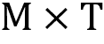矩阵表示文档与主题之间的关系。

+   对角矩阵通过其语料库强度对主题进行缩放。

+   第三个矩阵建模了术语-主题关系。

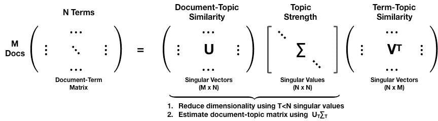

图 15.1：LSI 和 SVD

将第一个两个矩阵相乘产生的矩阵的行对应于原始文档投影到潜在主题空间中的位置。

## 如何使用 sklearn 实现 LSI

我们将使用上一章介绍的 BBC 文章数据来说明 LSI，因为它们足够小，可以快速训练，并且允许我们将主题分配与类别标签进行比较。有关其他实施细节，请参阅笔记本`latent_semantic_indexing`。

我们首先加载文档，并创建一个包含 50 篇文章的训练和（分层）测试集。然后，我们使用`TfidfVectorizer`对数据进行向量化，以获得加权 DTM 计数，并过滤出出现在不到 1％或超过 25％的文档中的词语，以及常见的停用词，以获得大约 2,900 个词汇：

```py
vectorizer = TfidfVectorizer(max_df=.25, min_df=.01, 
                             stop_words='english', 
                             binary=False)
train_dtm = vectorizer.fit_transform(train_docs.article)
test_dtm = vectorizer.transform(test_docs.article) 
```

我们使用 scikit-learn 的`TruncatedSVD`类，它只计算*k*个最大的奇异值，以减少 DTM 的维度。确定性的`arpack`算法提供了一个精确的解，但默认的“随机化”实现对于大矩阵更有效。

我们计算了五个主题以匹配五个类别，这解释了总 DTM 方差的仅 5.4％，因此使用更多主题是合理的：

```py
svd = TruncatedSVD(n_components=5, n_iter=5, random_state=42)
svd.fit(train_dtm)
svd.explained_variance_ratio_.sum()
0.05382357286057269 
```

LSI 为 DTM 确定了一个新的正交基，将排名降低到所需主题的数量。训练过的`svd`对象的`.transform()`方法将文档投影到新的主题空间中。这个空间由减少文档向量维度而产生，并且对应于本节前面所示的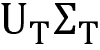转换：

```py
train_doc_topics = svd.transform(train_dtm)
train_doc_topics.shape
(2175, 5) 
```

我们可以对文章进行采样，以查看其在主题空间中的位置。我们选择了一个与主题 1 和 2 最（积极）相关的“政治”文章：

```py
i = randint(0, len(train_docs))
train_docs.iloc[i, :2].append(pd.Series(doc_topics[i], index=topic_labels))
Category                                     Politics
Heading     What the election should really be about?
Topic 1                                          0.33
Topic 2                                          0.18
Topic 3                                          0.12
Topic 4                                          0.02
Topic 5                                          0.06 
```

此示例的主题分配与每个类别的平均主题权重一致，如*图 15.2*所示（“政治”是最右边的条）。它们说明了 LSI 如何将*k*个主题表达为*k*维空间中的方向（笔记本包括每个类别的平均主题分配在二维空间中的投影）。

每个类别都有明确的定义，测试分配与训练分配匹配。但是，权重既有正值又有负值，这使得解释主题更加困难。

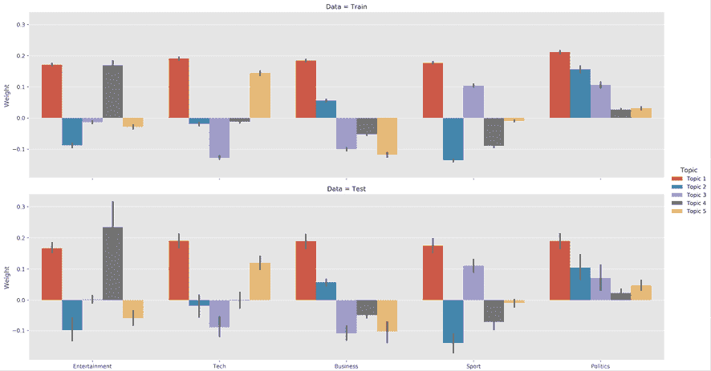

图 15.2：训练和测试数据的 LSI 主题权重

我们还可以显示与每个主题最相关的单词（绝对值）。主题似乎捕捉到了一些语义信息，但并没有明显区分（参见*图 15.3*）。

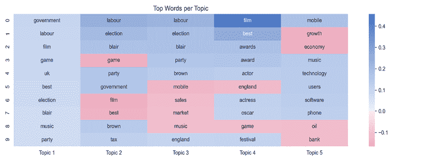

图 15.3：LSI 主题的前 10 个单词

## 优缺点

LSI 的优点包括消除噪音和缓解维度诅咒。它还捕获了一些语义方面，如同义词，并通过它们的主题关联来聚类文档和术语。此外，它不需要对文档语言有所了解，并且信息检索查询和文档比较都很容易。

然而，LSI 的结果很难解释，因为主题是具有正值和负值的词向量。此外，没有底层模型可以允许拟合的评估，也没有在选择要使用的维度或主题数量时提供指导。

# 概率隐含语义分析

**概率隐含语义分析**（**pLSA**）以**统计视角**看待 LSI/LSA，并创建一个生成模型来解决 LSA 缺乏理论基础的问题（Hofmann 2001）。

pLSA 明确地将词 *w* 出现在文档 *d* 中的概率建模为条件独立的多项式分布的混合，其中涉及主题 *t*。

**对于词-文档共现的形成，有对称和不对称的两种表述**。前者假设单词和文档都是由潜在主题类生成的。相反，不对称模型假设在给定文档的情况下选择主题，并且在给定主题的情况下产生单词。

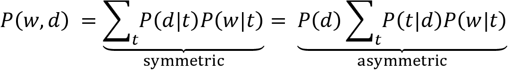

主题数量是在训练之前选择的**超参数**，并不是从数据中学习得到的。

*图 15.4* 中的**板块表示法**描述了概率模型中的统计依赖关系。更具体地说，它对称编码了刚才描述的不对称模型的关系。每个矩形代表多个项目：外部块代表 *M* 个文档，而内部阴影矩形象征着每个文档的 *N* 个单词。我们只观察文档及其内容；模型推断出隐藏或潜在的主题分布：

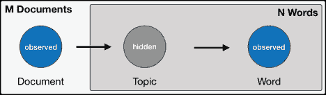

图 15.4：pLSA 模型的统计依赖关系的板块表示法

现在让我们看看如何在实践中实现这个模型。

## 如何使用 sklearn 实现 pLSA

pLSA 相当于使用 Kullback-Leibler 散度目标的**非负矩阵分解**（**NMF**）。因此，我们可以使用 `sklearn.decomposition.NMF` 类来实现这个模型，按照 LSI 示例。

使用由 `TfidfVectorizer` 产生的 DTM 的相同训练-测试拆分，我们这样适配 pLSA：

```py
nmf = NMF(n_components=n_components, 
          random_state=42, 
          solver='mu',
          beta_loss='kullback-leibler', 
          max_iter=1000)
nmf.fit(train_dtm) 
```

我们得到了一个重建误差的度量，它是对之前解释的方差度量的替代：

```py
nmf.reconstruction_err_
316.2609400385988 
```

由于其概率性质，pLSA 仅产生正主题权重，这导致了更直接的主题-类别关系，如 *图 15.5* 所示，适用于测试和训练集：

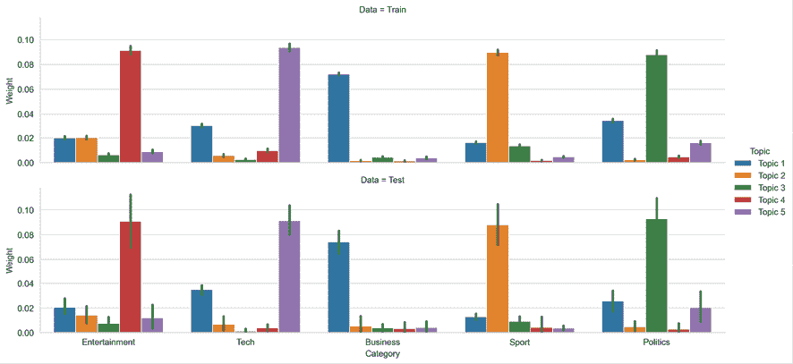

图 15.5：pLSA 对训练和测试数据的主题权重

我们还注意到，描述每个主题的词列表开始变得更有意义；例如，“娱乐”类别与主题 4 最直接关联，其中包括“电影”，“明星”等词，正如您在*图 15.6* 中所看到的：

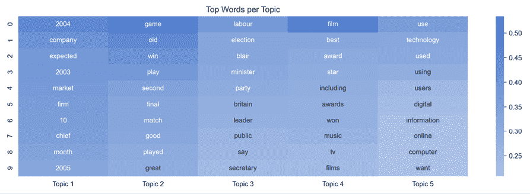

图 15.6：pLSA 的每个主题的前几个词

## 优点和局限性

使用概率模型的好处是，我们现在可以通过评估它们在训练期间学习的参数给出的新文档的概率来比较不同模型的性能。这也意味着结果具有清晰的概率解释。此外，pLSA 捕捉到了更多的语义信息，包括一词多义。

另一方面，与 LSI 相比，pLSA 增加了计算复杂性，并且该算法可能仅产生局部而不是全局最大值。最后，它不会为新文档产生生成模型，因为它将它们视为给定的。

# 潜在狄利克雷分配

**潜在狄利克雷分配**（**LDA**）通过为主题添加一个生成过程（Blei、Ng 和 Jordan，2003）扩展了 pLSA。它是最流行的主题模型，因为它倾向于生成人类可以关联的有意义的主题，可以将主题分配给新文档，并且是可扩展的。LDA 模型的变体可以包括元数据，如作者或图像数据，或者学习分层主题。

## LDA 的工作原理

LDA 是一个假设主题是单词概率分布、文档是主题分布的**分层贝叶斯模型**。更具体地说，该模型假设主题遵循稀疏狄利克雷分布，这意味着文档仅反映了一小部分主题，而主题仅频繁使用了有限数量的术语。

### 狄利克雷分布

狄利克雷分布产生可以用作离散概率分布的概率向量。也就是说，它随机生成一定数量的值，这些值为正并总和为一。它有一个正实值参数 ，它控制概率的集中度。值越接近零，意味着只有少数值将为正，并且接收大部分概率质量。*图 15.7* 说明了 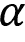 = 0.1 时大小为 10 的三次绘制：

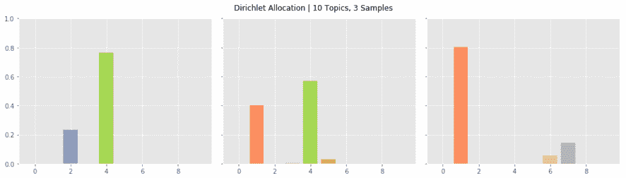

图 15.7：来自狄利克雷分布的三次绘制

笔记本 `dirichlet_distribution` 包含一个模拟，让您可以尝试不同的参数值。

### 生成模型

当作者将文章添加到文档集时，LDA 主题模型假定以下生成过程：

1.  用由狄利克雷概率定义的比例随机混合一小部分主题。

1.  对文本中的每个单词，根据文档-主题概率选择其中一个主题。

1.  根据主题的单词列表中的主题-单词概率选择一个词。

因此，文章内容取决于每个主题的权重以及构成每个主题的术语。狄利克雷分布控制文档的主题和主题的词的选择。它编码了一个文档仅涵盖少数主题的想法，而每个主题仅使用少量频繁的单词。

*图 15.8* 中 LDA 模型的**板符号**总结了这些关系，并突出显示了关键的模型参数：

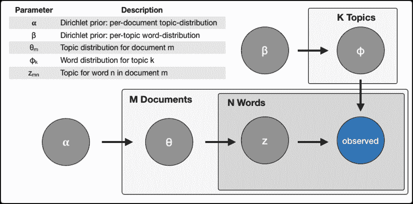

图 15.8：LDA 模型的统计依赖关系，以板块符号表示

### 反向工程过程

生成过程显然是虚构的，但事实证明是有用的，因为它允许恢复各种分布。LDA 算法逆向工程了想象作者的工作，并得出了对文档-主题-词关系进行简洁描述的总结：

+   每个主题对文档的百分比贡献

+   每个单词与主题的概率关联

LDA 解决了从文档体和它们包含的单词中恢复分布的**贝叶斯推理**问题，通过逆向工程所假定的内容生成过程。 Blei 等人（2003 年）的原始论文使用**变分贝叶斯**（**VB**）来近似后验分布。替代方案包括吉布斯采样和期望传播。我们将简要介绍 sklearn 和 Gensim 库的实现。

## 如何评估 LDA 主题

无监督主题模型不能保证结果是有意义的或可解释的，并且没有客观的度量来评估结果的质量，就像在监督学习中一样。人类主题评估被认为是黄金标准，但可能昂贵，并且不易大规模获得。

更客观地评估结果的两个选项包括**困惑度**，它在未见文档上评估模型，以及**主题连贯性**度量，旨在评估所发现模式的语义质量。

### 困惑度

困惑度，当应用于 LDA 时，衡量模型恢复的主题-词概率分布对未见文本文档样本的预测能力。它基于这个分布*p*的熵*H*(*p*)，并针对标记集*w*计算：

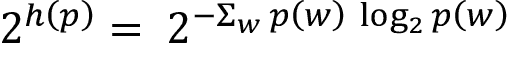

接近零的度量意味着分布在预测样本方面更好。

### 主题连贯性

主题连贯性衡量主题模型结果的语义一致性，即人类是否会将与主题相关的单词及其概率视为有意义。

为此，它通过测量与主题最相关的单词之间的语义相似度来对每个主题进行评分。更具体地说，连贯性度量基于观察到的定义一个主题的单词集合*W*的概率。  

有两个连贯性度量被设计用于 LDA，并且已经显示与主题质量的人类判断相一致，即 UMass 和 UCI 度量。

UCI 度量（Stevens 等，2012 年）将词对的分数定义为两个不同的（顶部）主题词*w*[i]，*w*[j]之间的**点间互信息**（**PMI**）的和*w*以及平滑因子的乘积：

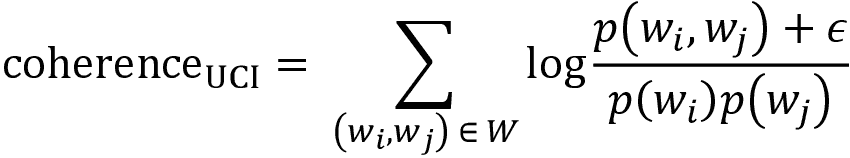

概率是根据滑动窗口在外部语料库（如维基百科）上的词共现频率计算的，因此可以将这个度量视为与语义基准的外部比较。

与此相反，UMass 指标（Mimno 等人，2011 年）使用训练语料库中来自多个文档*D*的共现性来计算一致性得分：

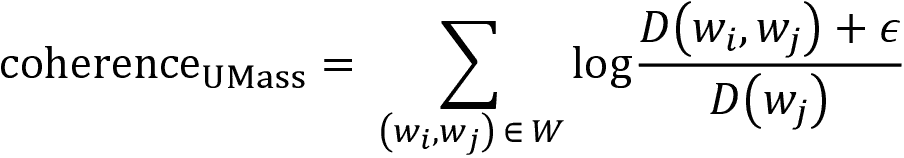

与将模型结果与外部真实值进行比较不同，此度量反映了内在一致性。两种度量方法都经过评估，与人类判断很好地一致（Röder、Both 和 Hinneburg，2015 年）。在这两种情况下，接近零的值意味着主题更一致。

## 如何使用 sklearn 实现 LDA

我们将像以前一样使用 BBC 数据，并使用 sklearn 的`decomposition.LatentDirichletAllocation`类训练一个具有五个主题的 LDA 模型（有关参数的详细信息，请参阅 sklearn 文档和笔记本`lda_with_sklearn`中的实现细节）：

```py
lda_opt = LatentDirichletAllocation(n_components=5, 
                                    n_jobs=-1, 
                                    max_iter=500,
                                    learning_method='batch', 
                                    evaluate_every=5,
                                    verbose=1, 
                                    random_state=42)
ldat.fit(train_dtm)
LatentDirichletAllocation(batch_size=128, doc_topic_prior=None,
             evaluate_every=5, learning_decay=0.7, learning_method='batch',
             learning_offset=10.0, max_doc_update_iter=100, max_iter=500,
             mean_change_tol=0.001, n_components=5, n_jobs=-1,
             n_topics=None, perp_tol=0.1, random_state=42,
             topic_word_prior=None, total_samples=1000000.0, verbose=1) 
```

该模型在训练期间跟踪样本内困惑度，并在此度量停止改善时停止迭代。我们可以像往常一样使用 sklearn 对象进行持久化和加载结果：

```py
joblib.dump(lda, model_path / 'lda_opt.pkl')
lda_opt = joblib.load(model_path / 'lda_opt.pkl') 
```

## 如何使用 pyLDAvis 可视化 LDA 结果

话题可视化有助于使用人类判断评估话题质量。 pyLDAvis 是 LDAvis 的 Python 版本，由 R 和`D3.js`（Sievert 和 Shirley，2014 年）开发。我们将介绍关键概念；每个 LDA 应用笔记本都包含示例。

pyLDAvis 显示了主题之间的全局关系，同时通过检查与每个单独主题最密切关联的术语以及与每个术语相关联的主题，促进了其语义评估。它还解决了语料库中频繁出现的术语往往支配了定义主题的单词分布的挑战。

为此，LDAVis 引入了术语*w*对主题*t*的**相关性** *r*。相关性通过计算两个指标的加权平均值产生了对话题的术语的灵活排名：

+   话题*t*与术语*w*的关联程度，表示为条件概率*p*（*w* | *t*）

+   显著性或提升，它衡量了术语*w*对主题 t 的频率*p*（*w* | *t*）与其在所有文档中的总体频率*p*（*w*）的比较

更具体地说，我们可以计算术语*w*和主题*t*的相关性*r*，给定用户定义的权重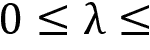，如下所示：

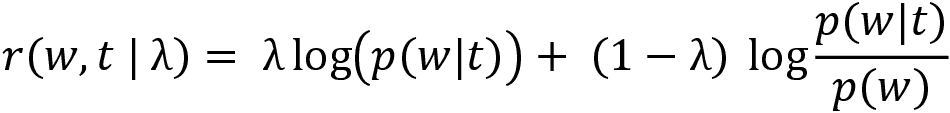

该工具允许用户交互地更改以调整相关性，这会更新术语的排名。用户研究发现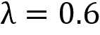产生最合理的结果。

## 如何使用 Gensim 实现 LDA

Gensim 是一个专门的**自然语言处理**（**NLP**）库，具有快速的 LDA 实现和许多附加功能。我们还将在下一章关于词向量的笔记本`lda_with_gensim`中使用它（有关详细信息，请参阅安装目录中的相关说明）。

我们将由 sklearn 的`CountVectorizer`或`TfIdfVectorizer`生成的 DTM 转换为 Gensim 数据结构，如下所示：

```py
train_corpus = Sparse2Corpus(train_dtm, documents_columns=False)
test_corpus = Sparse2Corpus(test_dtm, documents_columns=False)
id2word = pd.Series(vectorizer.get_feature_names()).to_dict() 
```

Gensim 的 LDA 算法包括许多设置：

```py
LdaModel(corpus=None, 
       num_topics=100, 
       id2word=None, 
       distributed=False, 
       chunksize=2000,  # No of doc per training chunk.
       passes=1,        # No of passes through corpus during training
       update_every=1,  # No of docs to be iterated through per update
       alpha='symmetric', 
       eta=None,        # a-priori belief on word probability
       decay=0.5,      # % of lambda forgotten when new doc is examined
       offset=1.0,     # controls slow down of first few iterations.
       eval_every=10,  # how often estimate log perplexity (costly)
       iterations=50,  # Max. of iterations through the corpus
       gamma_threshold=0.001, # Min. change in gamma to continue
       minimum_probability=0.01, # Filter topics with lower probability
       random_state=None, 
       ns_conf=None, 
       minimum_phi_value=0.01, # lower bound on term probabilities
       per_word_topics=False,  #  Compute most word-topic probabilities
       callbacks=None, 
       dtype=<class 'numpy.float32'>) 
```

Gensim 还提供了一个`LdaMulticore`模型进行并行训练，可以利用 Python 的多进程功能加快训练速度。

模型训练只需要实例化`LdaModel`，如下所示：

```py
lda_gensim = LdaModel(corpus=train_corpus,
                      num_topics=5,
                      id2word=id2word) 
```

Gensim 评估主题一致性，如前一节所介绍的，并显示每个主题的最重要单词：

```py
coherence = lda_gensim.top_topics(corpus=train_corpus, coherence='u_mass') 
```

我们可以如下显示结果：

```py
topic_coherence = []
topic_words = pd.DataFrame()
for t in range(len(coherence)):
    label = topic_labels[t]
    topic_coherence.append(coherence[t][1])
    df = pd.DataFrame(coherence[t][0], columns=[(label, 'prob'),
                                                (label, 'term')])
    df[(label, 'prob')] = df[(label, 'prob')].apply(
                              lambda x: '{:.2%}'.format(x))
    topic_words = pd.concat([topic_words, df], axis=1)

topic_words.columns = pd.MultiIndex.from_tuples(topic_words.columns)
pd.set_option('expand_frame_repr', False)
print(topic_words.head()) 
```

这显示了每个主题的顶级单词：

| 主题 1 | 主题 2 | 主题 3 | 主题 4 | 主题 5 |
| --- | --- | --- | --- | --- |
| 概率 | 术语 | 概率 | 术语 | 概率 | 术语 | 概率 | 术语 | 概率 | 术语 |
| 0.55% | 在线 | 0.90% | 最佳 | 1.04% | 移动 | 0.64% | 市场 | 0.94% | 劳工 |
| 0.51% | 网站 | 0.87% | 游戏 | 0.98% | 手机 | 0.53% | 增长 | 0.72% | 布莱尔 |
| 0.46% | 游戏 | 0.62% | 玩 | 0.51% | 音乐 | 0.52% | 销售 | 0.72% | 布朗 |
| 0.45% | 净 | 0.61% | 赢 | 0.48% | 电影 | 0.49% | 经济 | 0.65% | 选举 |
| 0.44% | 使用 | 0.56% | 赢 | 0.48% | 使用 | 0.45% | 价格 | 0.57% | 联合 |

*图 15.9*的左侧面板显示了主题一致性分数，突显了主题质量的衰减（至少部分是由于相对较小的数据集）：

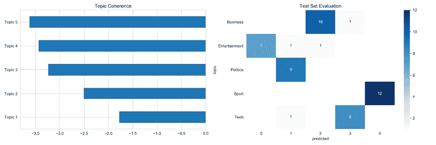

图 15.9：主题一致性和测试集分配

右侧面板显示了我们训练模型的 50 篇文章的测试集的评估。模型对四个错误，准确率为 92%。

# 对盈利电话中讨论的主题进行建模

在*第三章*，*金融的替代数据 - 类别和用例*中，我们学习了如何从 SeekingAlpha 网站抓取盈利电话数据。在本节中，我们将使用这个数据源进行主题建模。我使用了 2018 年至 2019 年之间的约 700 份盈利电话转录样本。这是一个相当小的数据集；对于实际应用，我们需要一个更大的数据集。

目录`earnings_calls`中包含了本节中使用的代码示例的多个文件。有关加载、探索和预处理数据的详细信息，请参阅笔记本`lda_earnings_calls`，以及用于描述下一步实验的`run_experiments.py`文件。

## 数据预处理

转录包括公司代表的个别声明，操作员和分析师的问答环节。我们将这些声明中的每一条都视为单独的文档，忽略操作员的声明，以获取 32,047 个项目，平均字数和中位数分别为 137 和 62：

```py
documents = []
for transcript in earnings_path.iterdir():
    content = pd.read_csv(transcript / 'content.csv')
    documents.extend(content.loc[(content.speaker!='Operator') & (content.content.str.len() > 5), 'content'].tolist())
len(documents)
32047 
```

我们使用 spaCy 对这些文档进行预处理，如*第十三章*，*使用无监督学习进行数据驱动的风险因素和资产配置*中所示（参考笔记本），并将清理和词形还原后的文本存储为一个新的文本文件。

如 *图 15.10* 所示，探索最常见的标记揭示出领域特定的停用词，如 "year" 和 "quarter"，我们在第二步中去除，同时过滤掉少于 10 个词的语句，剩余约 22,582 个。

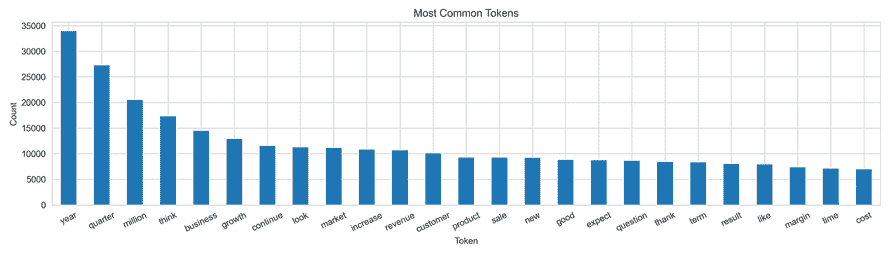

图 15.10：最常见的收益电话标记

## 模型训练和评估

为了说明，我们创建了一个包含出现在 0.5 到 25% 文档中的术语的 DTM，结果为 1,529 个特征。现在我们继续使用 25 个语料库训练 15 个主题模型。在 4 核 i7 上，这需要两分钟多一点。

如 *图 15.11* 所示，每个主题的前 10 个词识别出几个明显的主题，从明显的财务信息到临床试验（主题 5）、中国和关税问题（主题 9）以及技术问题（主题 11）。

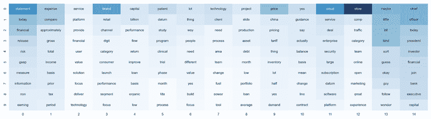

图 15.11：收益电话主题中最重要的词语

使用 pyLDAvis 的相关度指标，将无条件频率相对于提升的权重设置为 0.6，主题定义变得更加直观，如 *图 15.12* 所示，关于中国和贸易战的第 7 个主题：

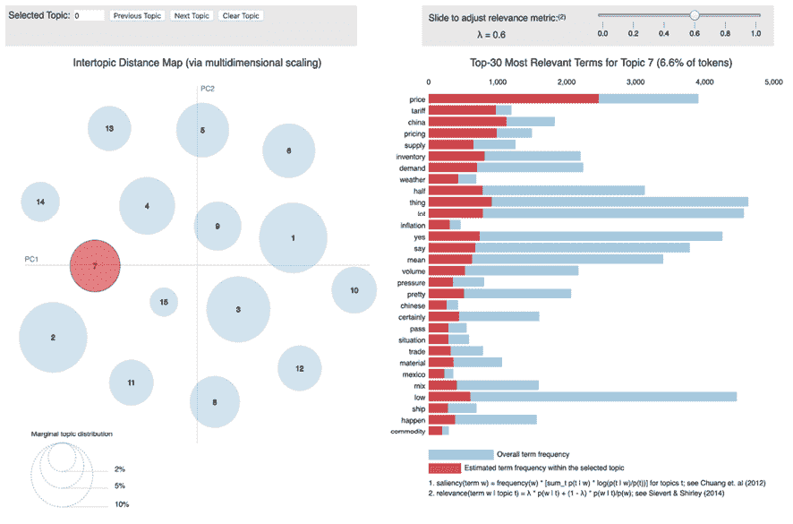

图 15.12：pyLDAVis 的交互式主题探索器

该笔记本还说明了如何根据主题关联查找文档。在这种情况下，分析师可以审查相关陈述以了解细微差别，使用情感分析进一步处理特定主题的文本数据，或者根据市场价格派生标签。  

## 运行实验

为了说明不同参数设置的影响，我们运行了几百个实验，针对不同的 DTM 约束和模型参数。更具体地，我们让 `min_df` 和 `max_df` 参数分别从 50-500 个词和 10 到 100% 的文档变化，交替使用二进制和绝对计数。然后，我们使用 1 和 25 个语料库训练 LDA 模型，主题从 3 到 50 个。

*图 15.13* 中的图表以主题连贯性（较高为较好）和困惑度（较低为较好）的形式呈现了结果。连贯性在 25-30 个主题后下降，困惑度同样增加。

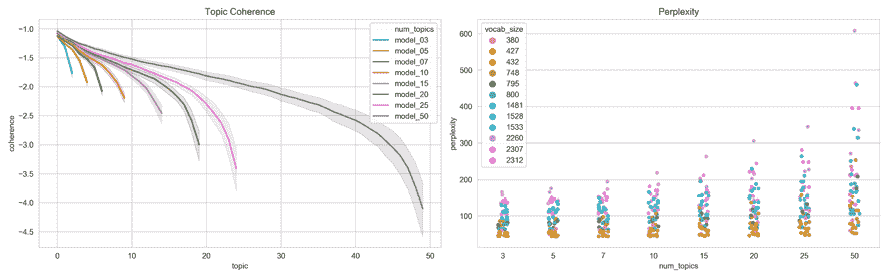

图 15.13：LDA 超参数设置对主题质量的影响

笔记本中包含量化参数与结果之间关系的回归结果。我们通常使用绝对计数和较小的词汇量能获得更好的结果。

# 与财经新闻相关的主题建模

笔记本 `lda_financial_news` 包含了应用于 2018 年前五个月超过 306,000 篇财经新闻文章的 LDA 示例。这些数据集已经发布在 Kaggle 上，文章来源于 CNBC、路透社、华尔街日报等。笔记本包含下载说明。

我们根据文章标题选择了最相关的 120,000 篇文章，共计 5400 万个标记，平均每篇文章 429 个单词。为了为 LDA 模型准备数据，我们依赖 spaCy 来删除数字和标点，并对结果进行词形还原。

*图 15.14* 突出显示了剩余的最常见标记和文章长度分布，其中中位数长度为 231 个标记；第 90 百分位是 642 个单词。

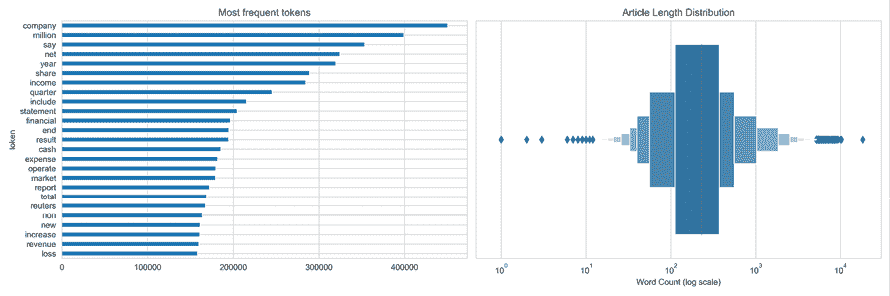

图 15.14：金融新闻数据的语料库统计

在 *图 15.15* 中，我们展示了一个使用 3,570 个标记的词汇表的模型的结果，基于 `min_df`=0.005 和 `max_df`=0.1，采用单次遍历以避免长时间训练 15 个主题。我们可以使用训练后的 `LdaModel` 的 `top_topics` 属性来获取每个主题最可能的词（详细信息请参阅笔记本）。

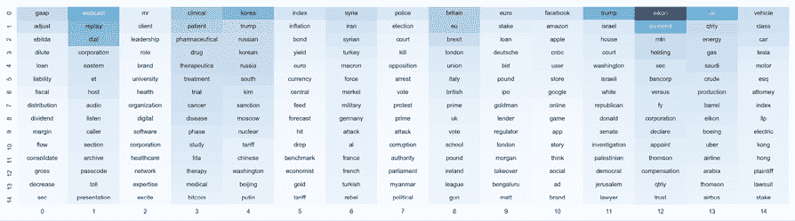

图 15.15：金融新闻主题的前 15 个词

这些主题概述了与时期相关的几个问题，包括 Brexit（主题 8）、朝鲜（主题 4）和特斯拉（主题 14）。

Gensim 提供了 `LdaMultiCore` 实现，允许使用 Python 的多进程模块进行并行训练，并且在使用四个工作线程时性能提高了 50%。但是，由于 I/O 瓶颈，使用更多工作线程并不会进一步减少训练时间。

# 摘要

在本章中，我们探讨了使用主题建模来深入了解大量文档内容的用途。我们涵盖了使用 DTM 的降维技术将文档投射到潜在主题空间中的潜在语义索引。虽然在解决由高维单词向量引起的维度灾难方面很有效，但它并不捕捉太多语义信息。概率模型对文档、主题和单词之间的相互作用做出了明确的假设，允许算法逆向工程文档生成过程，并在新文档上评估模型拟合度。我们了解到 LDA 能够提取出合理的主题，让我们以自动化的方式对大量文本获得高层次的理解，同时以有针对性的方式识别相关文档。

在下一章中，我们将学习如何训练神经网络，将单词嵌入到一个捕捉重要语义信息的高维向量空间中，并且可以使用生成的单词向量作为高质量的文本特征。
